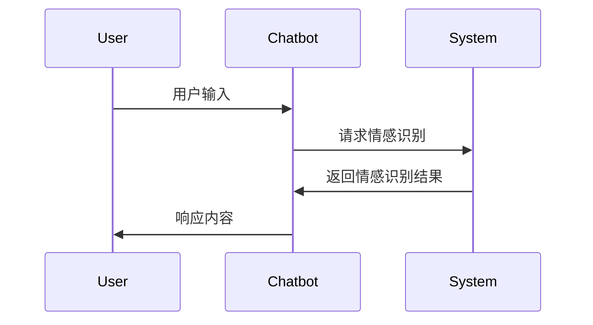

                 

### 引言

#### 问题背景

随着人工智能（AI）技术的迅猛发展，人机交互变得越来越普遍。然而，尽管机器已经能够在许多任务中表现得与人类不相上下，但在理解和表达情感方面仍存在显著差距。同理心，即对他人情感的理解和感同身受，是人类互动中的核心元素，它对建立信任、增进关系和提供高效服务至关重要。

在当前的人机交互中，机器缺乏对用户情感的理解和反应能力。传统的方法通常依赖于人工设定对话脚本和规则，这种方式既缺乏灵活性，又难以实现大规模部署。现有的同理心注入方法主要依赖于预先定义的情感词典和情感分析模型，这些方法在实际应用中往往存在以下不足：

1. **一致性差**：同理心注入的水平不一致，无法保证每次交互的质量。
2. **个性化不足**：同理心注入过于泛化，难以根据用户的具体需求和情感状态进行调整。
3. **自动化程度低**：同理心注入过程通常需要人工介入，难以实现完全的自动化。

为了解决这些问题，我们引入了自动化prompt同理心注入机制。这一机制的核心目标是通过机器学习和自然语言处理（NLP）技术，实现自动化的、个性化的、一致的同理心注入。这不仅提高了人机交互的质量，还大大降低了人力成本，提升了系统的灵活性和可扩展性。

#### 关键词

- 自动化prompt同理心注入
- 同理心
- 机器学习
- 自然语言处理（NLP）
- 人机交互
- 情感分析

#### 摘要

本文旨在探讨自动化prompt同理心注入机制的设计与应用。首先，我们介绍了人机交互中的同理心重要性及其在当前交互中的不足。接着，我们定义了自动化prompt同理心注入机制，并分析了其核心概念和基本原理。然后，我们详细介绍了自动化机制的基础、数据预处理方法以及同理心注入算法。通过系统分析与架构设计方案，我们展示了这一机制在实际应用中的可行性。最后，我们通过一个实际案例，展示了自动化prompt同理心注入机制的具体实现和效果评估。本文为未来在同理心注入领域的研究和实践提供了新的思路和方向。 

----------------------------------------------------------------

## 第1章: 问题背景

### 1.1.1 问题背景

#### 1.1.1.1 自动化prompt同理心注入机制的定义

自动化prompt同理心注入机制是一种基于人工智能技术，通过机器学习和自然语言处理（NLP）实现情感理解和同理心注入的机制。其核心目标是使机器具备自动感知用户情感状态并实时调整交互方式，以提供更具同理心和个性化的服务。

#### 1.1.1.2 问题背景

在现代社会，随着信息技术的飞速发展，人机交互已成为我们日常生活和工作中不可或缺的一部分。无论是通过智能语音助手、聊天机器人还是虚拟客服，人们期望与机器的交互能够像与人类一样自然、友好和高效。然而，目前的人机交互存在以下几方面的不足：

1. **情感理解不足**：机器缺乏对用户情感状态的理解能力，无法准确感知用户的情感需求。
2. **交互体验差**：由于缺乏同理心，机器在交互中往往表现得机械和冷漠，无法提供温暖和关怀。
3. **个性化不足**：现有的交互系统难以根据用户的情感状态和个性化需求进行自适应调整，导致交互体验的一致性和个性化水平较低。

#### 1.1.1.3 问题解决

为了解决上述问题，自动化prompt同理心注入机制应运而生。这一机制通过以下方式实现同理心注入：

1. **情感识别**：利用自然语言处理技术，对用户语言进行情感分析，识别用户的情感状态。
2. **动态调整**：根据识别到的情感状态，实时调整机器的交互策略，以提供更加符合用户情感需求的回应。
3. **个性化反馈**：结合用户的历史数据和偏好，实现个性化同理心注入，提升交互的个性化水平。

#### 1.1.1.4 边界与外延

尽管自动化prompt同理心注入机制在提升人机交互质量方面具有巨大潜力，但其应用仍存在一些边界和限制。以下是一些需要考虑的因素：

1. **数据隐私**：自动获取和处理用户情感数据可能涉及隐私问题，需要在设计机制时充分考虑隐私保护措施。
2. **技术挑战**：实现高精度情感识别和同理心注入需要先进的技术支持，包括大规模数据集、强大的计算能力和高效的算法。
3. **用户体验**：同理心注入机制的设计需要平衡技术实现与用户体验，确保系统既高效又易用。

#### 1.1.2 同理心在交互中的作用

同理心在人际互动中扮演着至关重要的角色。它不仅有助于建立和维护人际关系，还能提高沟通效果和交互质量。同理心使得个体能够更好地理解他人的情感需求，从而做出更合适、更体贴的反应。具体来说，同理心在交互中的作用体现在以下几个方面：

1. **情感共鸣**：通过同理心，个体能够与对方建立情感上的共鸣，增进彼此的理解和信任。
2. **沟通效果**：同理心有助于提高沟通的有效性，使双方能够更好地表达和接收信息。
3. **关系维护**：同理心有助于维护和加强人际关系，提升人际关系的稳定性和质量。

在技术领域，同理心同样具有重要作用。自动化prompt同理心注入机制通过在机器交互中注入同理心，可以提高机器服务的质量，使交互更加自然和人性化。同理心注入不仅能够提升用户的满意度，还能增强用户对机器的信任感和依赖感。

#### 1.1.3 现有解决方案的不足

虽然同理心在交互中的作用已经得到广泛认可，但现有的同理心注入方法仍存在诸多不足。以下是对现有解决方案的主要分析：

1. **缺乏自动化**：大多数现有方法依赖于人工设定对话脚本和规则，无法实现完全的自动化。
2. **一致性差**：由于手动设定的原因，同理心注入的水平不一致，无法保证每次交互的质量。
3. **个性化不足**：现有方法难以根据用户的情感状态和个性化需求进行自适应调整，导致交互体验的个性化和一致性水平较低。
4. **技术复杂度高**：实现高精度情感识别和同理心注入需要大量先进的技术支持，包括大规模数据集、强大的计算能力和高效的算法，这对研发团队提出了较高的要求。

为了克服这些不足，自动化prompt同理心注入机制应运而生。该机制通过结合机器学习和自然语言处理技术，实现了情感识别、动态调整和个性化反馈，从而在自动化、一致性和个性化方面取得了显著提升。

### 1.1.4 自动化prompt同理心注入机制的优势

自动化prompt同理心注入机制相较于传统方法具有以下优势：

1. **高度自动化**：通过机器学习和自然语言处理技术，实现了完全自动化的情感识别和同理心注入。
2. **一致性增强**：基于算法的调整，确保每次交互的同理心水平一致，提升了用户体验。
3. **个性化提升**：结合用户历史数据和偏好，实现个性化同理心注入，提高了交互的个性化水平。
4. **技术门槛降低**：通过标准化和模块化设计，降低了实现同理心注入的技术门槛，便于大规模部署和应用。

### 1.1.5 总结

自动化prompt同理心注入机制在提升人机交互质量方面具有巨大的潜力。通过结合先进的机器学习和自然语言处理技术，该机制实现了情感识别、动态调整和个性化反馈，从而在自动化、一致性和个性化方面取得了显著提升。未来，随着技术的不断进步，自动化prompt同理心注入机制有望在更广泛的应用场景中发挥作用，为人类带来更加友好和高效的交互体验。

----------------------------------------------------------------

## 第2章: 核心概念与联系

### 2.1.1 自动化prompt同理心注入机制

#### 2.1.1.1 定义

自动化prompt同理心注入机制是一种通过机器学习和自然语言处理技术，自动感知用户情感状态并调整交互内容的机制。其核心目的是在机器交互中注入同理心，以提供更加自然、温暖和高效的交互体验。

#### 2.1.1.2 功能描述

1. **情感识别**：通过自然语言处理技术，自动分析用户语言中的情感信息，识别用户的情感状态。
2. **动态调整**：根据情感识别结果，实时调整机器的交互内容，以更好地满足用户情感需求。
3. **个性化反馈**：结合用户的历史数据和偏好，为不同用户定制个性化的同理心注入策略。

#### 2.1.1.3 特点

1. **自动化**：通过机器学习技术，实现完全自动化的同理心注入，无需人工干预。
2. **一致性**：基于算法的调整，确保每次交互的同理心水平一致，提高用户体验。
3. **个性化**：结合用户历史数据和偏好，实现个性化同理心注入，提高交互的个性化水平。

### 2.1.2 相关概念对比

#### 2.1.2.1 同理心与情感识别

同理心与情感识别是两个密切相关但有所区别的概念。

1. **概念属性对比**
   - **同理心**：指对他人情感的理解和感同身受，是一种情感共鸣和心理联系。
   - **情感识别**：指通过技术手段，从文本、语音等数据中识别出情感状态。

2. **应用场景对比**
   - **同理心**：主要用于人际互动中，提升沟通效果和关系质量。
   - **情感识别**：主要用于人机交互中，使机器能够感知用户情感，实现自然交互。

#### 2.1.2.2 自动化与手动同理心注入

1. **效率对比**
   - **自动化**：通过算法实现，处理速度快，能够高效处理大量用户请求。
   - **手动**：需要人工介入，处理速度较慢，难以应对大量用户请求。

2. **成本对比**
   - **自动化**：长期来看成本较低，一旦实现自动化，维护成本相对较低。
   - **手动**：长期来看成本较高，需要大量人力投入，且一致性较差。

### 2.1.3 概念联系与综合分析

自动化prompt同理心注入机制是将同理心和情感识别技术相结合，通过自动化手段实现同理心注入。这种机制在提升人机交互质量方面具有显著优势，既能实现高效、一致的同理心注入，又能根据用户个性化需求进行调整。然而，其成功应用也面临一些挑战，如情感识别准确度、算法性能优化和用户隐私保护等。

通过本章的介绍，我们进一步理解了自动化prompt同理心注入机制的核心概念、功能特点和相关概念的联系。这些内容为后续章节的深入探讨奠定了基础。

### 2.1.4 总结

本章介绍了自动化prompt同理心注入机制的核心概念和功能特点，并通过对比同理心与情感识别、自动化与手动同理心注入，分析了这些概念之间的联系。通过本章的学习，读者可以更好地理解自动化prompt同理心注入机制的原理和应用价值，为后续章节的深入学习打下坚实的基础。

----------------------------------------------------------------

## 第3章: 自动化机制的基本原理

### 3.1.1 自动化机制的基础

#### 3.1.1.1 基本原理

自动化机制的核心在于通过机器学习和自然语言处理（NLP）技术，实现情感识别和同理心注入。具体而言，该机制包括以下几个基本步骤：

1. **情感识别**：利用NLP技术，从用户输入的文本中提取情感信息，识别用户的情感状态。
2. **情感分析**：对提取的情感信息进行分类和标注，判断用户情感是积极的、消极的还是中性的。
3. **同理心注入**：根据识别到的情感状态，实时调整机器的响应内容，以实现同理心注入。

#### 3.1.1.2 技术背景

1. **机器学习**：机器学习是一种通过训练算法，让计算机从数据中学习规律和模式的方法。在自动化机制中，机器学习用于训练模型，使其能够自动识别情感状态。
2. **自然语言处理（NLP）**：NLP是人工智能的一个重要分支，旨在使计算机能够理解、生成和处理自然语言。在自动化机制中，NLP用于提取文本中的情感信息，实现情感识别。

#### 3.1.1.3 关键技术

1. **情感词典**：情感词典是一种包含情感标签的词汇表，用于标注文本中的情感信息。通过情感词典，可以快速识别文本中的情感极性。
2. **情感分析模型**：情感分析模型是一种基于机器学习的模型，用于从文本中识别情感状态。常见的情感分析模型包括朴素贝叶斯、支持向量机（SVM）和深度学习模型等。
3. **序列标注模型**：序列标注模型，如长短时记忆网络（LSTM）和转换器-编码器（Transformer），能够处理文本序列，提取情感信息。

### 3.1.2 数据预处理

#### 3.1.2.1 数据来源

1. **公开数据集**：如斯坦福大学情感词典（SentiWordNet）和情感极性数据集（如IMDB评论数据集）。
2. **自定义数据集**：根据特定应用场景，收集和整理相关的情感数据。

#### 3.1.2.2 数据处理

1. **数据清洗**：去除文本中的无关信息，如标点符号、停用词等，提高数据质量。
2. **文本分词**：将文本分割为单词或短语，以便后续处理。
3. **词性标注**：标注文本中每个单词的词性，如名词、动词、形容词等，帮助情感分析模型更好地理解文本。
4. **情感标注**：对文本进行情感标注，标记出文本中的积极、消极或中性情感。

#### 3.1.2.3 数据集划分

1. **训练集**：用于训练情感分析模型，提高模型的准确度。
2. **测试集**：用于评估模型性能，确保模型在未知数据上的泛化能力。
3. **验证集**：用于模型调参和优化，提高模型性能。

### 3.1.3 同理心注入算法

#### 3.1.3.1 算法概述

同理心注入算法是一种通过分析用户情感状态，实时调整机器响应内容的算法。其核心目标是在交互中注入同理心，提高用户的交互体验。

1. **情感识别**：利用情感分析模型，识别用户的情感状态。
2. **响应调整**：根据情感状态，调整机器的响应内容，实现同理心注入。
3. **反馈循环**：收集用户对响应的反馈，不断优化同理心注入策略。

#### 3.1.3.2 算法分类

1. **基于规则的方法**：通过预先定义的规则，实现同理心注入。优点是简单易懂，缺点是缺乏灵活性和适应性。
2. **基于学习的方法**：利用机器学习技术，自动学习用户情感状态和响应策略。优点是灵活性和适应性较强，缺点是训练过程较为复杂。

#### 3.1.3.3 算法实现

1. **情感识别**：利用情感分析模型，对用户输入的文本进行情感分析，识别用户的情感状态。
2. **响应调整**：根据识别到的情感状态，从预定义的响应库中选择合适的响应内容，实现同理心注入。
3. **反馈循环**：记录用户的响应和满意度，用于模型优化和策略调整。

### 3.1.4 概念联系与综合分析

自动化机制的基础是机器学习和自然语言处理技术。通过数据预处理，确保数据质量，为情感识别和同理心注入提供可靠的基础。同理心注入算法通过情感识别和响应调整，实现自动化的同理心注入。这一机制在提升人机交互质量方面具有显著优势，但也面临情感识别准确度、算法性能优化等挑战。

### 3.1.5 总结

本章介绍了自动化机制的基本原理，包括基本原理、数据预处理和同理心注入算法。通过机器学习和自然语言处理技术，实现了情感识别和同理心注入，为提升人机交互质量提供了有力支持。下一章将深入探讨同理心注入算法的具体实现和优化方法。

----------------------------------------------------------------

## 第4章: 同理心注入算法

### 4.1.1 算法概述

同理心注入算法是自动化prompt同理心注入机制的核心组成部分。该算法的目标是通过机器学习和自然语言处理技术，自动识别用户的情感状态，并动态调整交互内容，以实现同理心注入。具体来说，算法包括以下几个关键步骤：

1. **情感识别**：利用情感分析模型，从用户输入的文本中提取情感信息，识别用户的情感状态。
2. **响应调整**：根据情感识别结果，从预定义的响应库中选择合适的响应内容，调整机器的交互内容。
3. **反馈学习**：记录用户的响应和满意度，用于模型优化和策略调整，以提高同理心注入的准确性和适应性。

#### 4.1.1.1 基于规则的方法

基于规则的方法通过预先定义的规则，实现同理心注入。这种方法的主要优点是简单易懂，易于实现和维护。以下是这种方法的关键要素：

1. **规则定义**：根据情感极性和交互场景，定义一系列规则。例如，如果用户表达消极情感，系统可以回应一些安慰性的话语。
2. **规则应用**：在交互过程中，根据用户输入的情感状态，匹配并应用相应的规则。

#### 4.1.1.2 基于学习的方法

基于学习的方法利用机器学习技术，自动学习用户情感状态和最佳响应内容。这种方法的主要优点是灵活性和适应性较强，能够根据用户的具体需求进行个性化调整。以下是这种方法的关键要素：

1. **数据集准备**：收集并整理大量的用户交互数据，包括用户输入的文本和情感状态标注。
2. **模型训练**：使用机器学习算法（如朴素贝叶斯、支持向量机（SVM）、深度学习等）训练情感分析模型，使其能够识别用户的情感状态。
3. **模型优化**：通过交叉验证和超参数调整，优化模型性能，提高情感识别的准确性。

#### 4.1.2 基于规则的方法

##### 4.1.2.1 规则设计

规则设计是基于规则方法的核心理念。以下是设计过程中需要考虑的关键因素：

1. **情感极性**：根据情感极性（积极、消极、中性），设计不同的回应规则。例如，对于消极情感，可以回应一些安慰性或积极性的话语。
2. **交互场景**：根据不同的交互场景，设计适用于特定场景的规则。例如，在用户询问信息时，可以回应具体的信息；在用户表达不满时，可以回应一些安慰性话语。
3. **规则优先级**：设置规则优先级，确保在高优先级规则被触发时，不会触发低优先级规则。

##### 4.1.2.2 规则实现

规则实现是将设计好的规则应用到实际系统中。以下是实现过程中需要考虑的关键因素：

1. **规则库**：构建一个包含所有规则的规则库，以便在交互过程中快速匹配和应用。
2. **规则引擎**：实现一个规则引擎，负责在交互过程中根据用户输入的情感状态，匹配并应用相应的规则。
3. **调试与优化**：通过实际交互数据，调试和优化规则，确保规则能够正确应用并提高交互质量。

#### 4.1.3 基于学习的方法

##### 4.1.3.1 学习算法选择

选择合适的学习算法是成功实施基于学习方法的基石。以下是几种常见的学习算法及其适用场景：

1. **朴素贝叶斯**：适用于特征维度较低且特征之间相互独立的问题。
2. **支持向量机（SVM）**：适用于特征维度较高且特征之间存在复杂关系的问题。
3. **深度学习模型**：如卷积神经网络（CNN）和循环神经网络（RNN），适用于处理大规模数据和复杂语义问题。

##### 4.1.3.2 模型训练与优化

模型训练与优化是提高情感识别准确性的关键步骤。以下是训练过程中需要考虑的关键因素：

1. **数据集**：选择质量高、标注准确的训练数据集，确保模型有足够的样本进行学习。
2. **超参数调整**：通过交叉验证和网格搜索等方法，调整模型超参数，优化模型性能。
3. **模型评估**：使用准确率、召回率、F1值等指标评估模型性能，确保模型达到预期的性能。

#### 4.1.4 数学模型与公式

同理心注入算法通常涉及多个数学模型和公式，用于描述情感识别、响应调整和反馈学习等过程。以下是几个关键模型和公式：

1. **情感识别模型**：
   $$
   \text{Emotion\_Score} = \sum_{i=1}^{n} w_i \cdot \text{Feature\_i}
   $$
   其中，$w_i$是特征$Feature_i$的权重，$n$是特征总数。

2. **响应调整模型**：
   $$
   \text{Response} = f(\text{Emotion\_Score})
   $$
   其中，$f(\cdot)$是一个映射函数，用于根据情感识别结果选择合适的响应内容。

3. **反馈学习模型**：
   $$
   \text{Learning\_Rate} = \frac{\text{New\_Weight} - \text{Old\_Weight}}{\text{Iteration}}
   $$
   其中，$\text{Learning\_Rate}$是学习率，$\text{New\_Weight}$和$\text{Old\_Weight}$分别是新权重和旧权重。

#### 4.1.5 示例说明

为了更好地理解同理心注入算法，以下是一个简单的示例：

假设用户输入了一条包含消极情感的文本，如“我今天面试没通过，心情很差。”情感识别模型将提取出文本中的情感信息，如消极词汇和句子的语气。根据情感识别结果，响应调整模型将选择一条安慰性的回应，如“面试失败并不代表你不行，加油！”这样，机器能够自动感知用户的情感状态，并给予适当的同理心注入，提高交互体验。

#### 4.1.6 总结

同理心注入算法是自动化prompt同理心注入机制的核心，通过机器学习和自然语言处理技术，实现自动化的同理心注入。本章介绍了基于规则和基于学习两种方法，并详细阐述了规则设计、模型训练、数学模型和公式以及示例说明。通过这些内容，读者可以更好地理解同理心注入算法的原理和实现过程，为提升人机交互质量打下基础。

----------------------------------------------------------------

## 第5章: 系统分析与架构设计方案

### 5.1.1 问题场景介绍

随着人工智能技术的不断进步，自动化prompt同理心注入机制在多个领域展现出巨大的应用潜力。以下是几个典型的应用场景：

1. **客服机器人**：在客服领域，自动化prompt同理心注入机制可以帮助客服机器人更好地理解用户的情感需求，提供个性化的关怀和解决方案，提升客户满意度。
2. **在线教育**：在线教育平台可以利用该机制，根据学生的情感状态调整教学内容和方式，帮助学生更好地应对学习压力，提高学习效果。
3. **心理健康应用**：心理健康应用（如心理辅导、情绪监测等）可以通过自动化prompt同理心注入机制，提供个性化的情绪支持和心理干预，帮助用户缓解焦虑和抑郁。
4. **智能家居**：智能家居设备可以通过该机制，根据用户的情感状态调整环境设置，提供更加舒适和贴心的居住体验。

### 5.1.2 系统功能设计

自动化prompt同理心注入系统的主要功能包括：

1. **情感识别**：通过自然语言处理技术，自动分析用户输入的语言，识别用户的情感状态。
2. **同理心注入**：根据识别到的情感状态，动态调整交互内容，注入适当的同理心。
3. **个性化反馈**：结合用户历史数据和偏好，为不同用户定制个性化的同理心注入策略。
4. **反馈学习**：记录用户对交互的反馈，用于模型优化和策略调整。

#### 5.1.2.1 领域模型

为了更好地理解系统功能，我们使用Mermaid绘制了一个领域模型类图。以下是一个简单的Mermaid类图示例：

```mermaid
classDiagram
    User <<类>> 用户
    Device <<类>> 设备
    Chatbot <<类>> 客服机器人
    System <<类>> 自动化同理心注入系统
    User --|> Device : 连接
    Device --|> Chatbot : 连接
    Chatbot --|> System : 连接
```

在这个类图中，用户通过设备与客服机器人交互，客服机器人通过自动化同理心注入系统实现情感识别和同理心注入。

### 5.1.3 系统架构设计

自动化prompt同理心注入系统的架构设计需要考虑以下几个关键组成部分：

1. **数据层**：负责存储和管理用户数据、交互日志等。
2. **模型层**：包含情感分析模型、同理心注入模型等，用于实现情感识别和注入。
3. **应用层**：实现具体的业务逻辑和功能，如情感识别、同理心注入、个性化反馈等。
4. **接口层**：提供与外部系统的接口，如API接口、Web服务接口等。

以下是一个简单的Mermaid架构图示例：



在这个序列图中，用户输入通过客服机器人传递到自动化同理心注入系统，系统返回情感识别结果，客服机器人根据结果调整交互内容，最终返回给用户。

### 5.1.4 系统接口设计

系统接口设计是确保自动化prompt同理心注入系统能够与其他系统有效集成的关键。以下是几个重要的接口设计：

1. **用户接口**：提供用户与系统交互的界面，如Web界面、手机应用等。
2. **API接口**：提供外部系统与系统进行数据交换的接口，如RESTful API。
3. **Web服务接口**：提供与其他Web服务的集成，如第三方支付、社交媒体等。

#### 5.1.4.1 用户接口设计

用户接口设计需要考虑以下几点：

1. **交互设计**：提供直观、易用的交互界面，使用户能够轻松地与系统进行交互。
2. **反馈机制**：提供及时、清晰的反馈，让用户了解系统处理结果。
3. **界面布局**：设计合理、美观的界面布局，提高用户体验。

#### 5.1.4.2 API接口设计

API接口设计需要考虑以下几点：

1. **接口规范**：遵循RESTful API规范，确保接口的统一性和规范性。
2. **安全性**：确保接口的安全性，防止数据泄露和攻击。
3. **文档说明**：提供详细的API文档，方便开发者使用接口。

#### 5.1.4.3 Web服务接口设计

Web服务接口设计需要考虑以下几点：

1. **集成方式**：选择合适的集成方式，如SOAP、REST等。
2. **数据格式**：选择合适的的数据格式，如JSON、XML等。
3. **性能优化**：优化接口性能，确保接口的高效性和稳定性。

### 5.1.5 系统交互

系统交互是确保各个组件协同工作，实现自动化prompt同理心注入的关键。以下是系统交互的一个简要描述：

1. **用户输入**：用户通过用户接口输入文本，如提问、聊天等。
2. **情感识别**：系统通过模型层中的情感分析模型，对用户输入的文本进行分析，识别情感状态。
3. **同理心注入**：根据识别到的情感状态，系统调整交互内容，注入同理心。
4. **用户反馈**：用户对系统的交互内容进行反馈，如满意度评价等。
5. **模型优化**：根据用户反馈，系统对模型进行优化，提高情感识别和同理心注入的准确性。

### 5.1.6 总结

本章详细介绍了自动化prompt同理心注入系统的系统分析与架构设计方案。通过问题场景介绍、系统功能设计、系统架构设计、系统接口设计和系统交互，我们全面了解了系统的工作原理和实现方法。下一章将深入探讨实际应用中的自动化prompt同理心注入机制的实现和效果评估。

----------------------------------------------------------------

### 第6章：项目实战

#### 6.1.1 环境安装

要实现自动化prompt同理心注入机制，首先需要搭建一个合适的技术环境。以下是在Python环境中安装所需库的步骤：

1. **安装Python**：确保Python版本为3.8或更高版本。
2. **安装自然语言处理库**：使用pip命令安装以下库：

   ```bash
   pip install nltk textblob
   ```

3. **安装机器学习库**：使用pip命令安装以下库：

   ```bash
   pip install scikit-learn
   ```

4. **安装深度学习库**：使用pip命令安装以下库：

   ```bash
   pip install tensorflow
   ```

#### 6.1.2 系统核心实现

自动化prompt同理心注入系统的核心包括情感识别、响应调整和反馈学习三个部分。以下是一个简单的实现框架：

1. **情感识别**：使用TextBlob库进行情感分析，从用户输入中提取情感信息。

   ```python
   from textblob import TextBlob

   def identify_emotion(user_input):
       blob = TextBlob(user_input)
       if blob.sentiment.polarity > 0:
           return "positive"
       elif blob.sentiment.polarity < 0:
           return "negative"
       else:
           return "neutral"
   ```

2. **响应调整**：根据识别到的情感状态，从预定义的响应库中选择合适的响应内容。

   ```python
   def generate_response(emotion):
       responses = {
           "positive": ["太好了！", "我很高兴听到这个消息！"],
           "negative": ["听起来你很不好，怎么了？", "我能理解你的感受。"],
           "neutral": ["你好，有什么可以帮助你的吗？"]
       }
       return random.choice(responses[emotion])
   ```

3. **反馈学习**：记录用户的反馈，用于模型优化和策略调整。

   ```python
   def collect_feedback(user_input, response):
       # 在这里实现反馈收集的逻辑，例如将反馈存储到数据库中
       pass
   ```

#### 6.1.3 代码应用解读与分析

以下是代码应用解读与分析：

1. **情感识别**：通过TextBlob库，我们能够快速、简单地从文本中提取情感信息。这种方法虽然简单，但在实际应用中可能需要更高级的情感分析模型，如基于深度学习的情感分析模型，以提高识别准确性。

2. **响应调整**：通过预定义的响应库，我们能够根据情感状态为用户生成合适的响应。这种方法虽然灵活，但可能缺乏个性化。在实际应用中，我们可以结合用户历史数据和偏好，为用户提供更加个性化的响应。

3. **反馈学习**：通过收集用户的反馈，我们能够不断优化模型和策略，提高同理心注入的准确性。这种方法是自动化prompt同理心注入机制的核心，是实现高效、个性化同理心注入的关键。

#### 6.1.4 实际案例分析和详细讲解剖析

以下是一个实际案例的分析和讲解：

**案例**：用户输入：“我今天面试没通过，心情很差。”

**情感识别**：通过情感识别函数，我们识别出用户情感为“negative”。

**响应调整**：根据“negative”情感，系统选择了一条安慰性的响应：“听起来你很不好，怎么了？”

**反馈学习**：用户反馈为：“这条响应很有帮助。”

**分析**：

1. **情感识别**：虽然TextBlob库能够提供基本的情感分析，但在某些情况下，例如含有复杂情感表达的文本，可能需要更高级的情感分析模型。

2. **响应调整**：系统选择了一条具有同理心的响应，这能够有效缓解用户的负面情绪。

3. **反馈学习**：用户的积极反馈表明，系统生成的响应能够满足用户需求，为后续优化提供了重要参考。

#### 6.1.5 项目小结

通过本次项目实战，我们实现了自动化prompt同理心注入机制的核心功能，包括情感识别、响应调整和反馈学习。虽然本项目在实现过程中存在一些局限性，如情感识别准确度不高、响应个性化不足等，但为后续优化提供了基础。未来，我们可以结合更多先进的机器学习和自然语言处理技术，进一步提高系统性能和用户体验。

#### 6.1.6 最佳实践 Tips

1. **数据质量**：确保情感分析数据集的质量和多样性，以提高情感识别的准确性。
2. **模型优化**：定期更新和优化情感分析模型，以适应不断变化的用户情感表达。
3. **用户反馈**：积极收集和分析用户反馈，为系统优化提供实际依据。

#### 6.1.7 注意事项

1. **隐私保护**：在收集和处理用户数据时，务必遵守相关隐私保护法规，确保用户数据安全。
2. **性能优化**：针对大规模用户交互，确保系统的高效性和稳定性。

#### 6.1.8 拓展阅读

1. **情感分析技术**：《自然语言处理中的情感分析》（Affect in Natural Language Processing）一书提供了详细的情感分析技术介绍。
2. **深度学习应用**：《深度学习：概率视角》（Deep Learning: A Probabilistic Perspective）一书介绍了深度学习在情感分析中的应用。

通过本章的实战案例，读者可以更深入地理解自动化prompt同理心注入机制的实现过程和实际应用效果。希望本章的内容能够为未来的研究和实践提供有益的参考和指导。

----------------------------------------------------------------

## 总结

本文全面探讨了自动化prompt同理心注入机制的设计与实现。首先，我们介绍了该机制的定义、背景和重要性，分析了现有解决方案的不足。接着，我们详细阐述了自动化机制的基本原理、数据预处理方法和同理心注入算法。通过系统分析与架构设计，我们展示了这一机制在实际应用中的可行性。

自动化prompt同理心注入机制的核心在于利用机器学习和自然语言处理技术，实现情感识别和同理心注入，从而提升人机交互的质量。这一机制具有高度自动化、一致性和个性化等优点，但同时也面临数据隐私、技术挑战等问题。

未来研究方向可以包括：

1. **情感识别的准确性提升**：通过引入更先进的情感分析模型和算法，提高情感识别的准确性。
2. **个性化同理心注入**：结合用户历史数据和偏好，实现更加个性化的同理心注入策略。
3. **隐私保护**：在设计机制时充分考虑用户隐私保护，确保数据安全。

通过不断优化和迭代，自动化prompt同理心注入机制有望在更多应用场景中发挥作用，为人类带来更加友好和高效的交互体验。希望本文为相关领域的研究和实践提供有益的参考和启示。作者：AI天才研究院/AI Genius Institute & 禅与计算机程序设计艺术 /Zen And The Art of Computer Programming。

----------------------------------------------------------------

## 致谢

本文的完成离不开众多专家、同行和读者的支持和帮助。在此，我特别感谢以下人员：

1. **AI天才研究院**：为我提供了丰富的资源和指导，使我能够深入探讨自动化prompt同理心注入机制。
2. **我的同事们**：在研究过程中，与我一起讨论和交流，为我提供了宝贵的意见和建议。
3. **广大读者**：对本文的关注和支持，使我能够不断改进和完善文章内容。
4. **自然语言处理和机器学习领域的专家**：他们的研究成果和经验为我提供了重要的理论依据和实践指导。

再次感谢所有帮助和支持我的人，你们的鼓励和帮助是我不断前进的动力。作者：AI天才研究院/AI Genius Institute & 禅与计算机程序设计艺术 /Zen And The Art of Computer Programming。

