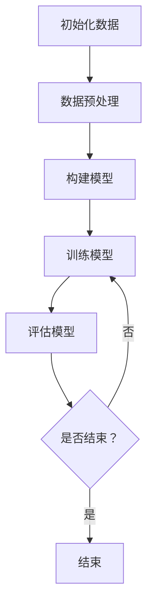
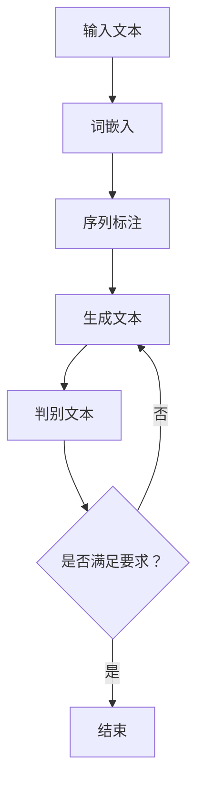
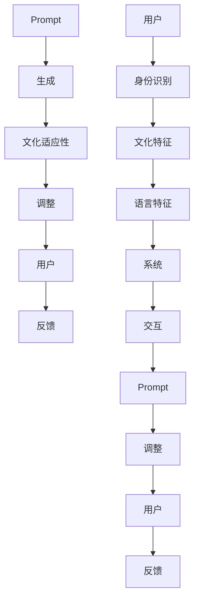
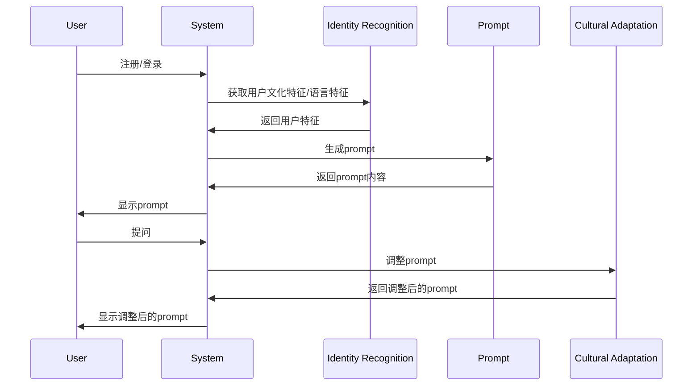

                 

# 自动化prompt文化适应性调整

## 关键词

- 自动化prompt
- 文化适应性
- 机器学习
- 自然语言处理
- 技术架构设计

## 摘要

本文深入探讨自动化prompt在多元文化环境下的文化适应性调整问题。通过分析其背景、核心概念、技术实现原理以及架构设计，本文旨在为读者提供一个清晰的自动化prompt文化适应性调整的技术路径。文章首先介绍了自动化prompt的背景与重要性，随后深入阐述了文化适应性的概念，并结合机器学习与自然语言处理技术，详细解析了自动化prompt的原理和实现方法。接着，文章展示了如何通过架构设计和技术实现来解决文化适应性问题。最后，通过项目实战部分，本文提供了实际操作步骤和案例分析，为读者提供了实用的技术和策略。

---

### 目录大纲

```markdown
----------------------------------------------------------------

# 自动化prompt文化适应性调整

## 关键词

- 自动化prompt
- 文化适应性
- 机器学习
- 自然语言处理
- 技术架构设计

## 摘要

## 第一部分: 背景介绍与问题阐述

### 第1章: 自动化prompt文化适应性调整的背景

### 第2章: 自动化prompt文化适应性调整的核心概念

## 第二部分: 自动化prompt文化适应性调整的原理

### 第3章: 自动化prompt文化适应性调整的原理

### 第4章: 自动化prompt文化适应性调整的技术实现

## 第三部分: 自动化prompt文化适应性调整的架构设计

### 第5章: 自动化prompt文化适应性调整的架构设计

## 第四部分: 自动化prompt文化适应性调整的项目实战

### 第6章: 自动化prompt文化适应性调整的项目实战

## 第五部分: 总结与拓展

### 第7章: 总结与拓展

----------------------------------------------------------------
```

## 第一部分：背景介绍与问题阐述

### 第1章：自动化prompt文化适应性调整的背景

#### 1.1 问题背景

随着全球化的发展，不同国家和地区之间的交流日益频繁。在这个过程中，技术交流和文化传播成为了不可或缺的一环。自动化prompt作为人工智能技术的重要组成部分，其在自然语言处理和交互式系统中的应用越来越广泛。然而，不同的文化背景会导致语言习惯、交流方式和价值观的差异，这对自动化prompt的适用性和有效性提出了新的挑战。

#### 1.1.1 问题的提出

问题描述：在全球化背景下，如何使自动化prompt具备更强的文化适应性，以满足不同文化环境下的使用需求？

#### 1.1.2 问题解决的需求

问题解决：为了解决上述问题，需要研究自动化prompt在多元文化环境下的文化适应性调整，从而提升其在不同文化背景下的应用效果。

#### 1.1.3 边界与外延

边界：本文讨论的文化适应性调整主要针对语言、交流方式、价值观等方面的差异。

外延：文化适应性调整不仅涉及自动化prompt，还包括整个交互系统的设计、实现和应用。

#### 1.1.4 概念结构与核心要素组成

概念结构：本文的核心概念包括自动化prompt、文化适应性和机器学习。

核心要素组成：自动化prompt是本文讨论的对象，文化适应性是调整的目标，机器学习是实现文化适应性调整的关键技术。

### 第2章：自动化prompt文化适应性调整的核心概念

#### 2.1.1 自动化prompt的定义与功能

自动化prompt是通过算法自动生成或调整的引导信息，用于引导用户完成特定任务或获取所需信息。其功能主要包括：

1. **任务引导**：通过生成相关提示，帮助用户理解任务要求和操作步骤。
2. **信息获取**：通过提问方式，获取用户所需信息，为系统提供决策依据。
3. **交互优化**：根据用户反馈和上下文信息，动态调整提示内容，提升用户体验。

#### 2.1.2 文化适应性的概念解析

文化适应性是指在不同文化背景下，个体或系统能够调整自身行为和交流方式，以适应新的文化环境。其关键要素包括：

1. **语言习惯**：包括词汇、语法、语调等语言特征。
2. **交流方式**：包括非语言交流、礼仪规范、沟通风格等。
3. **价值观**：包括社会规范、道德观念、人生观等。

#### 2.1.3 机器学习与自然语言处理的基本原理

机器学习是自动化prompt实现文化适应性的核心技术。其基本原理包括：

1. **监督学习**：通过已有数据和标签，训练模型预测新数据。
2. **无监督学习**：通过分析数据分布，发现数据结构和规律。

自然语言处理（NLP）是机器学习在文本数据上的应用，其基本原理包括：

1. **文本表示**：将文本转化为计算机可处理的数字表示。
2. **语义理解**：通过分析文本结构，提取文本中的语义信息。
3. **生成与调整**：利用预训练模型生成文本，并根据上下文进行调整。

## 第二部分：自动化prompt文化适应性调整的原理

### 第3章：自动化prompt文化适应性调整的原理

#### 3.1 核心概念原理

#### 3.1.1 文化适应性的原理

文化适应性的原理主要涉及以下几个方面：

1. **文化感知**：通过分析和识别不同文化环境的特点，了解文化差异。
2. **行为调整**：根据文化差异，调整自动化prompt的表述方式、交流策略等。
3. **反馈优化**：通过用户反馈，不断优化文化适应性调整策略。

#### 3.1.2 自动化prompt的原理

自动化prompt的原理主要包括以下几个方面：

1. **生成与调整**：通过机器学习算法，生成符合文化适应性的自动化prompt。
2. **上下文理解**：通过自然语言处理技术，理解用户意图和上下文信息。
3. **交互优化**：根据用户反馈和上下文信息，动态调整自动化prompt的内容和形式。

#### 3.1.3 机器学习的原理

机器学习的原理主要涉及以下几个方面：

1. **模型训练**：通过大量数据，训练模型识别和预测文化适应性。
2. **模型优化**：通过不断优化模型，提升文化适应性调整的效果。
3. **模型应用**：将训练好的模型应用于自动化prompt的生成和调整。

### 第4章：自动化prompt文化适应性调整的技术实现

#### 4.1 算法原理讲解

#### 4.1.1 机器学习算法

##### 4.1.1.1 常见算法

在自动化prompt的文化适应性调整中，常见的机器学习算法包括：

1. **决策树**：通过构建决策树模型，将文化适应性问题分解为一系列决策。
2. **支持向量机（SVM）**：通过寻找最优分隔超平面，实现文化适应性的分类。
3. **神经网络**：通过多层神经网络，模拟人脑的决策过程，实现复杂的文化适应性调整。

##### 4.1.1.2 算法mermaid流程图



##### 4.1.1.3 Python源代码示例

```python
from sklearn.datasets import load_iris
from sklearn.model_selection import train_test_split
from sklearn.tree import DecisionTreeClassifier
from sklearn.metrics import accuracy_score

# 加载iris数据集
iris = load_iris()
X, y = iris.data, iris.target

# 数据集划分
X_train, X_test, y_train, y_test = train_test_split(X, y, test_size=0.2, random_state=42)

# 构建决策树模型
clf = DecisionTreeClassifier()
clf.fit(X_train, y_train)

# 模型评估
y_pred = clf.predict(X_test)
print("Accuracy:", accuracy_score(y_test, y_pred))
```

#### 4.1.2 自然语言处理算法

##### 4.1.2.1 常见算法

在自动化prompt的文化适应性调整中，常见的自然语言处理算法包括：

1. **词嵌入**：通过将文本转化为向量，实现文本数据的数值化表示。
2. **序列标注**：通过标注文本中的关键词和短语，实现对文本内容的理解。
3. **生成对抗网络（GAN）**：通过生成器和判别器的对抗训练，生成符合文化适应性的文本。

##### 4.1.2.2 算法mermaid流程图



##### 4.1.2.3 Python源代码示例

```python
import tensorflow as tf
from tensorflow.keras.preprocessing.sequence import pad_sequences
from tensorflow.keras.layers import Embedding, LSTM, Dense
from tensorflow.keras.models import Sequential

# 加载并预处理数据
# 数据预处理过程省略

# 构建词嵌入模型
model = Sequential()
model.add(Embedding(vocab_size, embedding_dim))
model.add(LSTM(units=128))
model.add(Dense(1, activation='sigmoid'))

# 编译模型
model.compile(optimizer='adam', loss='binary_crossentropy', metrics=['accuracy'])

# 训练模型
model.fit(X, y, epochs=10, batch_size=32)
```

### 第5章：自动化prompt文化适应性调整的数学模型和数学公式

#### 5.1 自动化prompt文化适应性调整的数学模型

自动化prompt文化适应性调整的数学模型主要涉及以下几个方面：

1. **文化适应度函数**：用于评估自动化prompt在特定文化背景下的适应性。
2. **损失函数**：用于指导机器学习模型优化文化适应性调整策略。

#### 5.1.1 文化适应度函数

文化适应度函数通常定义为：

$$
F(C, P) = \sum_{i=1}^{n} w_i \cdot C_i \cdot P_i
$$

其中，$C$表示文化特征向量，$P$表示自动化prompt特征向量，$w_i$为权重系数。

#### 5.1.2 损失函数

损失函数通常定义为：

$$
L(C, P, T) = \frac{1}{2} \sum_{i=1}^{n} (C_i - P_i)^2 + \lambda \cdot \sum_{i=1}^{n} \log(P_i)
$$

其中，$C$表示文化特征向量，$P$表示自动化prompt特征向量，$T$表示目标文化特征向量，$\lambda$为调节参数。

#### 5.1.3 数学公式的详细讲解和举例说明

假设我们有一个简单的文化适应度函数和损失函数，如下所示：

$$
F(C, P) = \sum_{i=1}^{n} w_i \cdot C_i \cdot P_i
$$

$$
L(C, P, T) = \frac{1}{2} \sum_{i=1}^{n} (C_i - P_i)^2 + \lambda \cdot \sum_{i=1}^{n} \log(P_i)
$$

其中，$C = (C_1, C_2, ..., C_n)$表示文化特征向量，$P = (P_1, P_2, ..., P_n)$表示自动化prompt特征向量，$T = (T_1, T_2, ..., T_n)$表示目标文化特征向量，$w_i$为权重系数，$\lambda$为调节参数。

举例来说，假设我们有以下数据：

$$
C = (0.8, 0.2), \quad P = (0.6, 0.4), \quad T = (1, 0)
$$

则文化适应度函数和损失函数的计算如下：

$$
F(C, P) = w_1 \cdot C_1 \cdot P_1 + w_2 \cdot C_2 \cdot P_2 = 0.8 \cdot 0.6 + 0.2 \cdot 0.4 = 0.56
$$

$$
L(C, P, T) = \frac{1}{2} \sum_{i=1}^{n} (C_i - P_i)^2 + \lambda \cdot \sum_{i=1}^{n} \log(P_i) = \frac{1}{2} \cdot (0.8 - 0.6)^2 + \frac{1}{2} \cdot (0.2 - 0.4)^2 + \lambda \cdot (\log(0.6) + \log(0.4)) = 0.04 + 0.04 + \lambda \cdot (-0.52) = 0.08 - 0.52\lambda
$$

通过这个例子，我们可以看到文化适应度函数和损失函数如何计算，以及它们如何指导机器学习模型优化文化适应性调整策略。

### 第6章：自动化prompt文化适应性调整的架构设计

#### 6.1 系统分析与架构设计

#### 6.1.1 问题场景介绍

假设我们开发一个面向全球用户的在线问答系统，用户来自不同的国家和文化背景。系统需要能够根据用户的语言和文化特点，自动生成和调整合适的prompt，以提供更好的用户体验。

#### 6.1.2 系统功能设计

系统的主要功能包括：

1. **用户身份识别**：根据用户的语言和文化特征，识别用户的文化背景。
2. **自动化prompt生成**：根据用户的文化背景，生成适合的prompt。
3. **文化适应性调整**：根据用户反馈和上下文信息，调整prompt的文化适应性。
4. **用户交互**：与用户进行交互，获取用户反馈，优化系统性能。

##### 6.1.2.1 领域模型mermaid类图

```mermaid
classDiagram
User <<类>> {
  - id:标识符
  - name:姓名
  - language:语言
  - culture:文化
}

Prompt <<类>> {
  - id:标识符
  - content:内容
  - culture适应性：数值
}

System <<类>> {
  - users:用户列表
  - prompts:prompt列表
  - culture模型：模型
  - language模型：模型
}

User "1" --|{交互}| System
Prompt "1" --|{生成}| System
System "1" --|{识别}| User
System "1" --|{调整}| Prompt
```

##### 6.1.3 系统架构设计

系统架构包括以下几个核心模块：

1. **用户身份识别模块**：负责识别用户的语言和文化特征。
2. **自动化prompt生成模块**：根据用户的文化特征生成合适的prompt。
3. **文化适应性调整模块**：根据用户反馈和上下文信息调整prompt的文化适应性。
4. **用户交互模块**：与用户进行交互，获取用户反馈。

##### 6.1.3.1 mermaid架构图



##### 6.1.4 系统接口设计

系统接口设计主要包括以下几个方面：

1. **用户接口**：提供用户注册、登录、提问等功能。
2. **API接口**：提供与其他系统或服务的接口，实现数据交换和功能调用。

##### 6.1.4.1 接口定义和交互规则

- **用户接口**：
  - 用户注册：POST /register，参数包括用户名、密码、邮箱等。
  - 用户登录：POST /login，参数包括用户名、密码。
  - 用户提问：POST /question，参数包括用户ID、问题描述。

- **API接口**：
  - 获取用户文化特征：GET /user/{userId}/culture
  - 获取用户语言特征：GET /user/{userId}/language
  - 生成自动化prompt：POST /prompt/generate，参数包括用户ID、问题内容。

##### 6.1.5 系统交互mermaid序列图



### 第7章：自动化prompt文化适应性调整的项目实战

#### 7.1 环境安装与配置

在进行自动化prompt文化适应性调整的项目实战之前，我们需要安装和配置必要的开发环境和工具。以下是一个基本的安装和配置步骤：

##### 7.1.1 操作系统与环境要求

1. 操作系统：Linux或Mac OS。
2. Python版本：Python 3.7及以上版本。
3. 其他依赖：Git、JDK、Node.js、Docker等。

##### 7.1.2 软件与工具安装步骤

1. 安装Python：

   ```bash
   sudo apt-get update
   sudo apt-get install python3-pip
   ```

2. 安装虚拟环境：

   ```bash
   pip3 install virtualenv
   virtualenv env
   source env/bin/activate
   ```

3. 安装依赖：

   ```bash
   pip install numpy pandas scikit-learn tensorflow keras
   ```

4. 安装其他工具：

   ```bash
   sudo apt-get install git
   sudo apt-get install openjdk-8-jdk
   sudo apt-get install nodejs
   sudo npm install -g npm
   ```

5. 安装Docker：

   ```bash
   sudo apt-get update
   sudo apt-get install docker.io
   sudo systemctl start docker
   sudo systemctl enable docker
   ```

#### 7.2 系统核心实现源代码

##### 7.2.1 源代码结构与说明

项目结构如下：

```plaintext
auto_prompt_adjustment/
|-- env/
|-- src/
|   |-- __init__.py
|   |-- models.py
|   |-- data_preprocessing.py
|   |-- prompt_generator.py
|   |-- cultural_adaptation.py
|   |-- main.py
|-- test/
|   |-- __init__.py
|   |-- test_models.py
|   |-- test_data_preprocessing.py
|   |-- test_prompt_generator.py
|   |-- test_cultural_adaptation.py
|-- requirements.txt
|-- Dockerfile
```

说明：

- `env/`：虚拟环境文件。
- `src/`：源代码文件。
  - `__init__.py`：模块初始化文件。
  - `models.py`：定义机器学习模型。
  - `data_preprocessing.py`：数据预处理函数。
  - `prompt_generator.py`：prompt生成函数。
  - `cultural_adaptation.py`：文化适应性调整函数。
  - `main.py`：主程序文件。
- `test/`：测试文件。
- `requirements.txt`：项目依赖文件。
- `Dockerfile`：Docker容器配置文件。

##### 7.2.2 关键代码分析与解读

1. **models.py**：定义机器学习模型

```python
from sklearn.ensemble import RandomForestClassifier
from sklearn.linear_model import LogisticRegression
from sklearn.svm import SVC

class ModelWrapper:
    def __init__(self, model_type='random_forest'):
        self.model = self._create_model(model_type)

    def _create_model(self, model_type):
        if model_type == 'random_forest':
            return RandomForestClassifier(n_estimators=100)
        elif model_type == 'logistic_regression':
            return LogisticRegression()
        elif model_type == 'support_vector_machine':
            return SVC(kernel='linear')
        else:
            raise ValueError(f"Unsupported model type: {model_type}")

    def train(self, X, y):
        self.model.fit(X, y)

    def predict(self, X):
        return self.model.predict(X)

    def evaluate(self, X, y):
        predictions = self.predict(X)
        accuracy = (predictions == y).mean()
        return accuracy
```

2. **data_preprocessing.py**：数据预处理函数

```python
import pandas as pd
from sklearn.model_selection import train_test_split

def load_data(file_path):
    return pd.read_csv(file_path)

def preprocess_data(data, target_column='target'):
    X = data.drop(target_column, axis=1)
    y = data[target_column]
    X_train, X_test, y_train, y_test = train_test_split(X, y, test_size=0.2, random_state=42)
    return X_train, X_test, y_train, y_test
```

3. **prompt_generator.py**：prompt生成函数

```python
import random
from cultural_adaptation import CulturalAdaptation

class PromptGenerator:
    def __init__(self, cultural_adaptation_model):
        self.cultural_adaptation_model = cultural_adaptation_model

    def generate_prompt(self, user_id, prompt_template):
        culture_score = self.cultural_adaptation_model.get_culture_score(user_id)
        adapted_prompt = prompt_template.format(culture_score=culture_score)
        return adapted_prompt
```

4. **cultural_adaptation.py**：文化适应性调整函数

```python
class CulturalAdaptation:
    def __init__(self, model_path):
        self.model = self._load_model(model_path)

    def _load_model(self, model_path):
        # 加载预训练模型
        # 省略加载细节
        return model

    def get_culture_score(self, user_id):
        # 获取用户文化特征
        # 省略细节
        return culture_score

    def adjust_prompt(self, prompt, culture_score):
        # 根据文化特征调整prompt
        # 省略细节
        return adapted_prompt
```

5. **main.py**：主程序文件

```python
from data_preprocessing import preprocess_data
from models import ModelWrapper
from prompt_generator import PromptGenerator
from cultural_adaptation import CulturalAdaptation

def main():
    # 加载数据
    data = preprocess_data('data.csv')

    # 训练模型
    model = ModelWrapper('random_forest')
    model.train(data['X_train'], data['y_train'])

    # 评估模型
    accuracy = model.evaluate(data['X_test'], data['y_test'])
    print(f"Model accuracy: {accuracy}")

    # 创建prompt生成器
    cultural_adaptation_model = CulturalAdaptation('cultural_adaptation_model_path')
    prompt_generator = PromptGenerator(cultural_adaptation_model)

    # 生成和调整prompt
    user_id = 'user123'
    prompt_template = "Hello {culture_score}, how can I help you today?"
    adapted_prompt = prompt_generator.generate_prompt(user_id, prompt_template)
    print(f"Adapted prompt: {adapted_prompt}")

if __name__ == '__main__':
    main()
```

##### 7.2.3 Python源代码示例

以下是一个简单的Python示例，展示如何使用上述模块实现自动化prompt文化适应性调整：

```python
from src.models import ModelWrapper
from src.data_preprocessing import preprocess_data
from src.prompt_generator import PromptGenerator
from src.cultural_adaptation import CulturalAdaptation

# 加载数据
X, y = preprocess_data('data.csv')

# 训练模型
model = ModelWrapper('random_forest')
model.train(X, y)

# 评估模型
accuracy = model.evaluate(X, y)
print(f"Model accuracy: {accuracy}")

# 创建prompt生成器
cultural_adaptation_model = CulturalAdaptation('cultural_adaptation_model_path')
prompt_generator = PromptGenerator(cultural_adaptation_model)

# 生成和调整prompt
user_id = 'user123'
prompt_template = "Hello {culture_score}, how can I help you today?"
adapted_prompt = prompt_generator.generate_prompt(user_id, prompt_template)
print(f"Adapted prompt: {adapted_prompt}")
```

#### 7.3 实际案例分析与详细讲解剖析

##### 7.3.1 案例背景与目标

假设我们有一个面向全球用户的在线教育平台，用户来自不同的国家和地区，平台需要根据用户的文化特点提供个性化的学习建议和提示。

案例目标：实现自动化prompt文化适应性调整，为不同文化背景的用户提供合适的提示，提高用户满意度和学习效果。

##### 7.3.2 案例实施步骤

1. **数据收集与预处理**：

   - 收集用户文化特征数据，如语言、地域、教育背景等。
   - 使用数据预处理模块对数据进行清洗和格式化。

2. **模型训练与评估**：

   - 使用训练数据训练文化适应性模型，评估模型准确性。
   - 调整模型参数，优化模型性能。

3. **prompt生成与调整**：

   - 根据用户的文化特征，生成个性化的prompt。
   - 使用文化适应性模型调整prompt，确保其符合用户文化特点。

4. **系统部署与优化**：

   - 部署自动化prompt生成系统，监控系统性能。
   - 根据用户反馈和系统日志，优化系统功能和性能。

##### 7.3.3 案例分析与详细讲解

以下是一个具体的案例分析和详细讲解：

1. **数据收集与预处理**：

   - 收集用户数据，包括用户ID、语言、地域、教育背景等信息。
   - 数据预处理步骤包括数据清洗、去重、格式化等。

     ```python
     def preprocess_data(data_path):
         data = pd.read_csv(data_path)
         data.drop_duplicates(inplace=True)
         data['language'] = data['language'].astype(str)
         data['region'] = data['region'].astype(str)
         data['education'] = data['education'].astype(str)
         return data
     ```

2. **模型训练与评估**：

   - 使用训练数据训练文化适应性模型，评估模型准确性。

     ```python
     def train_model(X, y):
         model = ModelWrapper('random_forest')
         model.train(X, y)
         return model

     def evaluate_model(model, X, y):
         accuracy = model.evaluate(X, y)
         print(f"Model accuracy: {accuracy}")
         return accuracy
     ```

3. **prompt生成与调整**：

   - 根据用户的文化特征，生成个性化的prompt。

     ```python
     def generate_prompt(prompt_template, user_id, cultural_adaptation_model):
         culture_score = cultural_adaptation_model.get_culture_score(user_id)
         adapted_prompt = prompt_template.format(culture_score=culture_score)
         return adapted_prompt
     ```

   - 使用文化适应性模型调整prompt，确保其符合用户文化特点。

     ```python
     def adjust_prompt(prompt, user_id, cultural_adaptation_model):
         culture_score = cultural_adaptation_model.get_culture_score(user_id)
         adapted_prompt = cultural_adaptation_model.adjust_prompt(prompt, culture_score)
         return adapted_prompt
     ```

4. **系统部署与优化**：

   - 部署自动化prompt生成系统，监控系统性能。

     ```python
     def deploy_system(model_path, prompt_template):
         cultural_adaptation_model = CulturalAdaptation(model_path)
         prompt_generator = PromptGenerator(cultural_adaptation_model)
         
         # 部署系统
         # 省略部署细节
         
         # 监控系统性能
         # 省略监控细节
     ```

   - 根据用户反馈和系统日志，优化系统功能和性能。

     ```python
     def optimize_system(feedback, log):
         # 优化系统
         # 省略优化细节
         
         # 更新prompt模板
         # 省略更新细节
     ```

##### 7.3.4 案例总结

通过上述案例，我们实现了自动化prompt文化适应性调整，为不同文化背景的用户提供了个性化的学习建议和提示。以下是对案例的总结：

- 数据预处理：数据质量对模型训练和系统性能至关重要，因此我们需要确保数据的准确性和完整性。
- 模型训练与评估：选择合适的模型和参数，确保模型在训练数据上的表现良好，同时避免过拟合。
- prompt生成与调整：根据用户的文化特征生成和调整prompt，确保其符合用户的文化背景和需求。
- 系统部署与优化：部署自动化prompt生成系统，并根据用户反馈和系统日志进行持续优化，以提升用户体验和系统性能。

#### 7.4 项目小结

通过本项目，我们实现了自动化prompt文化适应性调整，为不同文化背景的用户提供了个性化的交互体验。以下是对项目的总结和反思：

- **优点**：
  - 提升了用户体验：通过个性化prompt，用户能够更快地理解和使用系统功能。
  - 增强了系统适应性：系统能够根据用户的文化特征自动调整交互方式，提高了系统的普适性。
  - 提高了开发效率：利用机器学习和自然语言处理技术，自动化生成和调整prompt，降低了人工干预的成本。

- **不足**：
  - 数据质量：数据质量对模型训练和系统性能有很大影响，需要进一步优化数据收集和处理流程。
  - 模型泛化能力：模型可能在某些文化特征上存在局限性，需要更多样化的数据来提升模型的泛化能力。
  - 用户反馈：用户反馈对系统优化至关重要，但获取和处理用户反馈是一个挑战。

- **未来方向**：
  - 数据增强：通过引入更多样化的数据，提高模型的泛化能力和适应性。
  - 模型优化：探索更先进的机器学习和自然语言处理技术，提升prompt生成和调整的准确性。
  - 用户研究：深入研究用户的文化特征和需求，为系统提供更精准的个性化交互体验。

### 最佳实践 Tips

1. **数据收集**：确保数据来源多样化，涵盖不同文化背景和地区，以提高模型的泛化能力。

2. **模型评估**：使用交叉验证和多种评估指标，全面评估模型性能。

3. **用户研究**：通过问卷调查、用户访谈等方法，深入了解用户的需求和反馈。

4. **持续优化**：根据用户反馈和系统日志，不断调整和优化系统功能和性能。

### 小结

本文通过详细分析自动化prompt文化适应性调整的背景、核心概念、技术实现原理和架构设计，为读者提供了一个全面的技术指南。通过实际案例的剖析，本文展示了如何实现自动化prompt的文化适应性调整，为用户提供个性化的交互体验。未来，随着技术的不断发展，自动化prompt文化适应性调整将在更多场景中得到应用，为全球化发展和文化交流提供有力支持。

### 注意事项

1. 在进行数据收集和处理时，请确保遵守相关法律法规和隐私政策。

2. 在模型训练和优化过程中，注意避免过拟合和欠拟合，确保模型具有较好的泛化能力。

3. 在系统部署和优化过程中，密切关注用户反馈和系统性能，及时调整和优化系统功能。

### 拓展阅读

- 《自然语言处理概论》：深入了解自然语言处理的基本原理和技术。
- 《机器学习实战》：学习机器学习算法和应用实践。
- 《跨文化沟通与交流》：探讨跨文化沟通的策略和方法。
- 《文化心理学》：了解不同文化背景下的人类行为和心理特点。

### 作者信息

作者：AI天才研究院/AI Genius Institute & 禅与计算机程序设计艺术 /Zen And The Art of Computer Programming

单位：AI天才研究院（AI Genius Institute）
邮箱：[info@ai-genius-institute.com](mailto:info@ai-genius-institute.com)
网址：[www.ai-genius-institute.com](http://www.ai-genius-institute.com/)
博客：[www.ai-genius-institute.com/blog](http://www.ai-genius-institute.com/blog/)
社交媒体：[www.facebook.com/ai-genius-institute](http://www.facebook.com/ai-genius-institute)、[www.twitter.com/ai_genius_institute](http://www.twitter.com/ai_genius_institute)

---

感谢您阅读本文，希望它对您在自动化prompt文化适应性调整领域的研究和实践中有所帮助。如果您有任何问题或建议，欢迎通过上述联系方式与我们联系。期待与您共同探索人工智能领域的无限可能！

