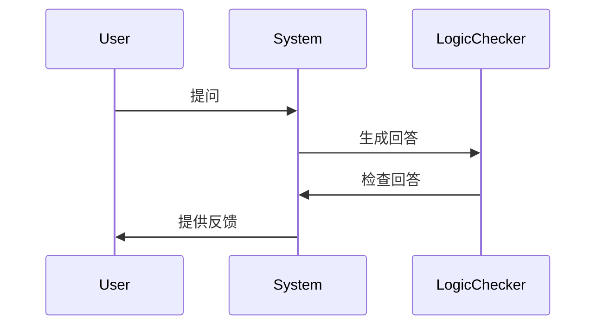

                 

### 引言：自动化prompt逻辑一致性检查的重要性

在当今信息化的时代，自动化技术在各行各业中得到了广泛应用，特别是在人工智能（AI）领域。自动化prompt逻辑一致性检查作为AI技术的一个重要分支，正日益受到重视。自动化prompt是指系统根据用户输入或情境自动生成的提示信息，而逻辑一致性检查则是确保这些提示信息在逻辑上合理且准确的过程。本文将探讨自动化prompt逻辑一致性检查的重要性，以及如何实现这一技术。

首先，自动化prompt在用户交互中扮演着至关重要的角色。良好的prompt设计能够提高用户的使用体验，降低用户的学习成本，从而提升系统的使用效率和用户满意度。例如，在智能客服系统中，自动生成的prompt能够根据用户的问题快速提供相关解决方案或进一步询问信息，使得用户能够迅速获得帮助。

其次，逻辑一致性检查是确保系统输出正确性的关键步骤。在任何复杂的系统中，逻辑错误或不一致性都可能导致严重的后果。例如，在金融系统中，错误的prompt可能会导致资金转移错误，造成巨大的经济损失。因此，通过自动化逻辑一致性检查，可以有效减少这种风险，提高系统的稳定性和可靠性。

本文将分为以下几个部分进行详细探讨：

1. **自动化prompt逻辑一致性检查概述**：介绍自动化prompt和逻辑一致性检查的基本概念，讨论其在系统中的应用场景和重要性。
2. **核心概念与联系**：深入探讨自动化prompt生成原理和逻辑一致性检查算法，通过表格和ER实体关系图来展现两者之间的联系。
3. **自动化prompt生成原理**：详细讲解自动化prompt生成的算法原理，包括机器学习和规则引擎两种方法，并展示生成流程。
4. **逻辑一致性检查算法原理**：介绍逻辑一致性检查的数学模型，详细阐述算法原理，并通过Python代码举例说明。
5. **系统分析与架构设计**：介绍一个具体问题场景，通过类图、架构图和序列图等工具进行系统分析与架构设计。
6. **项目实战**：通过一个实际项目，展示自动化prompt逻辑一致性检查的完整实现过程，包括环境安装、系统核心实现、代码应用解读与分析。
7. **最佳实践与小结**：总结最佳实践，强调注意事项，并提供拓展阅读资源。

让我们一步步深入探讨自动化prompt逻辑一致性检查的核心概念和技术实现，为读者提供全面的技术洞察和实用的解决方案。

### 文章关键词

自动化prompt、逻辑一致性检查、人工智能、用户交互、系统稳定性、可靠性、机器学习、规则引擎、数学模型、系统架构设计、项目实战、最佳实践。

### 摘要

本文旨在探讨自动化prompt逻辑一致性检查这一关键技术。自动化prompt是AI领域中用于提高用户交互效率的重要工具，而逻辑一致性检查则是确保系统输出准确性的关键步骤。本文首先介绍了自动化prompt和逻辑一致性检查的基本概念，随后深入分析了它们的核心原理和联系。通过详细讲解机器学习和规则引擎两种自动化prompt生成方法，以及逻辑一致性检查的数学模型和算法，本文为读者提供了一个全面的技术框架。接着，本文通过一个具体问题场景，展示了系统分析与架构设计的方法，并介绍了一个实际项目来实现自动化prompt逻辑一致性检查。最后，本文总结了最佳实践，并提出了注意事项，为读者提供了实用的指导和建议。

### 自动化prompt逻辑一致性检查概述

在当今的信息化社会中，自动化技术已经成为提升系统效率和用户体验的关键手段。自动化prompt逻辑一致性检查便是这一背景下诞生的重要技术之一。自动化prompt是指系统根据用户输入或特定情境自动生成的提示信息，其目的是优化用户交互体验，提高系统运行效率。而逻辑一致性检查则是对这些自动生成的prompt进行逻辑上的验证，确保其输出内容符合预期的规则和逻辑结构。

#### 问题背景

自动化prompt的需求起源于用户对高效、便捷交互体验的追求。传统的用户界面设计往往需要用户逐级点击或输入，这不仅增加了用户的学习成本，还降低了使用效率。随着人工智能技术的不断进步，自动化prompt应运而生，能够在用户发起请求的瞬间生成相关的提示信息，从而实现快速响应和高效互动。然而，随着自动化prompt的广泛应用，其逻辑一致性检查的重要性也逐渐凸显。

逻辑一致性检查的重要性主要体现在以下几个方面：

1. **确保系统输出正确性**：在任何复杂的系统中，逻辑错误或不一致性都可能导致严重的后果。例如，在金融系统中，一个错误的提示信息可能会导致资金转移错误，造成巨大的经济损失。逻辑一致性检查能够有效减少这种风险，提高系统的稳定性和可靠性。

2. **提升用户体验**：自动生成的prompt如果逻辑不清晰或存在错误，可能会导致用户产生困惑或误解，从而影响用户体验。通过逻辑一致性检查，可以确保系统输出的prompt信息准确无误，从而提升用户满意度。

3. **优化系统性能**：逻辑一致性检查可以帮助系统及时发现和纠正错误，减少系统异常情况的发生，从而优化系统性能。

#### 问题描述

自动化prompt逻辑一致性检查的目的是确保系统生成的prompt信息在逻辑上合理且一致。问题描述可以分为以下几个核心要素：

1. **自动化prompt**：系统根据用户输入或情境自动生成的提示信息。
2. **逻辑一致性检查**：对生成的prompt信息进行逻辑上的验证，确保其符合预期的规则和结构。
3. **检查机制**：用于检测和纠正prompt逻辑错误的机制，包括规则引擎、机器学习算法等。

#### 问题解决

解决自动化prompt逻辑一致性检查问题的方法主要包括以下几个方面：

1. **设计合理的prompt生成算法**：基于用户输入或情境，自动生成高质量的prompt信息。常用的生成算法包括基于机器学习和规则引擎的方法。

2. **构建严格的逻辑一致性检查机制**：对生成的prompt信息进行全面的逻辑检查，确保其符合预期的逻辑规则。这需要结合具体的业务场景和需求，设计合适的检查规则和算法。

3. **持续优化和更新**：自动化prompt逻辑一致性检查系统需要不断优化和更新，以适应不断变化的需求和情境。

#### 边界与外延

边界与外延是理解自动化prompt逻辑一致性检查的重要方面：

1. **边界**：自动化prompt逻辑一致性检查的边界包括系统输入、输出以及检查机制的适用范围。例如，对于某些特殊场景，可能需要额外的逻辑规则或算法来处理。

2. **外延**：自动化prompt逻辑一致性检查的外延包括对系统内其他模块的交互影响，以及在不同业务场景下的适应性。

#### 概念结构与核心要素组成

自动化prompt逻辑一致性检查的核心概念和结构可以概括为以下几个部分：

1. **用户输入**：用户通过输入界面与系统交互，输入的内容是生成prompt的原始数据。
2. **prompt生成**：系统根据用户输入，利用机器学习算法或规则引擎生成相应的prompt信息。
3. **逻辑一致性检查**：对生成的prompt信息进行全面的逻辑检查，确保其符合预期的逻辑规则。
4. **反馈机制**：系统将检查结果反馈给用户或相关模块，以便进行进一步的优化和处理。

通过上述结构，自动化prompt逻辑一致性检查能够有效地提高系统交互的准确性和可靠性。

在接下来的章节中，本文将深入探讨自动化prompt生成原理、逻辑一致性检查算法原理，并通过具体案例展示系统的实现和应用。这些内容将为读者提供更全面的技术洞察和实用的解决方案。

### 自动化prompt逻辑一致性检查的核心概念

为了深入理解自动化prompt逻辑一致性检查，我们需要首先探讨其核心概念，并分析这些概念之间的联系。自动化prompt生成和逻辑一致性检查是两个关键组成部分，它们共同构建了这一技术的核心框架。

#### 自动化prompt生成原理

自动化prompt生成是指系统根据用户输入或特定情境，利用机器学习算法或规则引擎自动生成提示信息的过程。这一过程包括以下几个步骤：

1. **用户输入处理**：系统首先接收用户输入的数据，这些数据可以是文本、语音或其他形式。
2. **数据预处理**：对用户输入的数据进行预处理，包括分词、去噪、格式化等，以便后续处理。
3. **特征提取**：从预处理后的数据中提取关键特征，这些特征将用于生成prompt。
4. **prompt模板生成**：系统利用机器学习算法或规则引擎，根据提取的特征生成相应的prompt模板。
5. **模板填充**：将具体的用户输入值填充到prompt模板中，生成最终的prompt信息。

常见的自动化prompt生成算法包括基于机器学习的生成算法和基于规则引擎的生成算法。前者如深度学习模型（如生成对抗网络GAN、变分自编码器VAE等），后者如条件概率模型、决策树、规则引擎等。

#### 逻辑一致性检查算法原理

逻辑一致性检查是对系统生成的prompt信息进行逻辑验证的过程，以确保其输出内容符合预期的规则和结构。这一过程包括以下几个步骤：

1. **定义逻辑规则**：根据业务需求和系统特性，定义一套逻辑规则。这些规则可以是基于布尔逻辑的简单条件，也可以是复杂的逻辑表达式。
2. **规则匹配**：将系统生成的prompt信息与预定义的逻辑规则进行匹配，检查其是否符合规则。
3. **结果反馈**：根据匹配结果，生成反馈信息，包括提示错误、警告或成功等。
4. **异常处理**：当prompt不符合预期规则时，系统应采取适当的异常处理措施，如提示用户、记录日志或触发其他业务逻辑。

常见的逻辑一致性检查算法包括基于布尔逻辑的算法、基于模糊逻辑的算法和基于模糊集的算法等。在实现时，通常使用编程语言（如Python）来定义逻辑规则和算法流程。

#### 概念属性特征对比表格

为了更直观地理解自动化prompt生成和逻辑一致性检查的区别和联系，我们可以使用一个特征对比表格来展示这两个概念的主要属性。

| 特征               | 自动化prompt生成                              | 逻辑一致性检查                           |
|------------------|-----------------------------------------|--------------------------------------|
| 生成方式           | 基于机器学习、规则引擎                      | 基于逻辑规则、布尔逻辑等                 |
| 应用场景           | 用户交互、自动问答、推荐系统等              | 系统内部逻辑校验、数据完整性检查等          |
| 难点               | 精准度和个性化生成                          | 复杂逻辑关系处理、规则覆盖全面性           |
| 输出形式           | 文本、图像、语音等                          | 提示信息、错误码、日志记录等               |

#### ER实体关系图架构

为了进一步展示自动化prompt生成和逻辑一致性检查的概念联系，我们可以使用ER（实体关系）图来描述这两个概念之间的实体关系。

```mermaid
erDiagram
  User ||--|{ Prompt }|-- System
  Prompt ||--|{ Check }| System
  Check ||--|{ Result }| User
```

在这个ER图中，User代表用户输入，Prompt表示系统生成的提示信息，Check表示逻辑一致性检查过程，Result表示检查结果。这个图展示了用户输入、提示信息生成、逻辑检查和结果反馈之间的交互关系。

通过上述分析，我们可以看到自动化prompt生成和逻辑一致性检查在概念和实现上各有侧重，但它们共同构成了一个完整的自动化prompt逻辑一致性检查系统。在接下来的章节中，本文将进一步探讨这两个概念的具体实现原理和技术细节。

### 自动化prompt生成原理

在自动化prompt逻辑一致性检查系统中，自动化prompt生成是至关重要的一环。这一部分将详细讲解自动化prompt的生成原理，包括机器学习和规则引擎两种常见的生成方法。

#### 基于机器学习的prompt生成

机器学习在自动化prompt生成中的应用主要体现在深度学习和自然语言处理（NLP）领域。深度学习模型，如生成对抗网络（GAN）和变分自编码器（VAE），因其强大的数据生成能力，被广泛应用于自动化prompt生成。

1. **生成对抗网络（GAN）**：
   - **基本原理**：GAN由生成器（Generator）和判别器（Discriminator）两个神经网络组成。生成器试图生成逼真的prompt信息，而判别器则试图区分生成器和真实prompt之间的差异。通过这种对抗训练，生成器逐步提高其生成质量。
   - **实现步骤**：
     1. **数据集准备**：收集大量真实prompt数据，用于训练GAN。
     2. **模型训练**：分别训练生成器和判别器，使生成器生成的prompt信息越来越接近真实prompt。
     3. **模型评估**：使用生成的prompt进行评估，确保其符合预期质量。

2. **变分自编码器（VAE）**：
   - **基本原理**：VAE通过编码器和解码器两个神经网络将输入数据映射到一个隐含空间，然后在隐含空间中生成新的数据。在自动化prompt生成中，编码器将用户输入映射到隐含空间，解码器根据隐含空间生成新的prompt。
   - **实现步骤**：
     1. **数据预处理**：对用户输入进行分词、去噪等预处理。
     2. **编码器训练**：训练编码器将输入映射到隐含空间。
     3. **解码器训练**：训练解码器从隐含空间生成prompt。
     4. **生成prompt**：利用解码器生成新的prompt信息。

#### 基于规则引擎的prompt生成

规则引擎是一种用于处理业务规则的工具，它在自动化prompt生成中有着广泛的应用。规则引擎通过预定义的规则库来生成prompt，这些规则可以是简单的条件判断，也可以是复杂的逻辑组合。

1. **基本原理**：
   - **规则库**：规则库存储了一系列的业务规则，每个规则包含条件部分和动作部分。条件部分用于判断输入数据的属性，动作部分则定义了当条件满足时系统应生成的prompt。
   - **规则匹配**：系统根据用户输入与规则库中的规则进行匹配，找到符合条件的规则，并执行对应的动作生成prompt。

2. **实现步骤**：
   1. **规则定义**：根据业务需求，定义一系列业务规则。
   2. **规则库构建**：将定义的规则存储在规则库中。
   3. **规则匹配**：系统根据用户输入与规则库进行匹配。
   4. **prompt生成**：匹配成功的规则将触发相应的prompt生成动作。

#### 自动化prompt生成流程

无论是基于机器学习还是规则引擎，自动化prompt生成的流程大致相同，主要包括以下几个步骤：

1. **用户输入处理**：接收用户输入，进行预处理，如分词、去噪等。
2. **特征提取**：从预处理后的数据中提取关键特征，这些特征用于生成prompt。
3. **prompt模板生成**：利用机器学习模型或规则引擎生成prompt模板。
4. **模板填充**：将用户输入值填充到prompt模板中，生成最终的prompt信息。
5. **输出**：将生成的prompt信息输出给用户或相关系统模块。

通过上述流程，系统可以根据用户输入自动生成高质量的prompt信息，从而优化用户交互体验。在接下来的章节中，我们将进一步探讨逻辑一致性检查的算法原理，以及如何将两者结合，构建一个完整的自动化prompt逻辑一致性检查系统。

### 逻辑一致性检查算法原理

逻辑一致性检查是自动化prompt逻辑一致性检查系统的核心组件，其主要任务是确保系统生成的prompt信息在逻辑上正确且一致。在详细讲解逻辑一致性检查算法原理之前，我们首先需要理解几个基本概念：数学模型、算法实现和示例。

#### 数学模型

逻辑一致性检查的数学模型可以表示为：

$$
逻辑一致性检查 = 生成prompt \land (系统逻辑规则 \lor 用户输入规则)
$$

其中：
- \(生成prompt\)：系统根据用户输入或情境生成的提示信息。
- \(系统逻辑规则\)：系统内置的逻辑判断条件，用于确保prompt的输出符合系统的预期。
- \(用户输入规则\)：用户自定义的逻辑判断条件，这些规则可以进一步细化系统的输出。

#### 算法实现

逻辑一致性检查算法的实现通常包括以下几个步骤：

1. **规则定义**：根据业务需求，定义系统逻辑规则和用户输入规则。这些规则可以是简单的布尔表达式，也可以是复杂的逻辑组合。

2. **规则匹配**：将系统生成的prompt信息与预定义的规则进行匹配。规则匹配的过程可以通过编程语言中的条件判断实现。

3. **结果反馈**：根据匹配结果，生成反馈信息。如果prompt符合所有规则，则认为逻辑一致性检查通过；否则，系统会生成相应的错误提示或警告信息。

以下是逻辑一致性检查算法的一个Python实现示例：

```python
def check一致性(prompt, system_rules, user_rules):
    """
    检查prompt的逻辑一致性
    
    参数：
    - prompt：生成的提示信息
    - system_rules：系统逻辑规则列表
    - user_rules：用户输入规则列表
    
    返回：
    - True：如果prompt满足所有规则
    - False：如果prompt不满足某个规则
    """
    # 检查prompt是否满足系统逻辑规则
    for rule in system_rules:
        if not eval(rule):
            return False
    
    # 检查prompt是否满足用户输入规则
    for rule in user_rules:
        if not eval(rule):
            return False
    
    return True

# 示例系统规则和用户规则
system_rules = ["'欢迎光临' in prompt", "'请提问' in prompt"]
user_rules = ["'你好' in prompt", "'谢谢' not in prompt"]

# 生成prompt示例
prompt = "你好，欢迎光临，请问有什么可以帮助您的？"

# 检查逻辑一致性
is_consistent = check一致性(prompt, system_rules, user_rules)
print(is_consistent)  # 输出：True 或 False
```

#### 举例说明

以下是一个具体的例子，说明如何使用逻辑一致性检查算法来验证系统生成的prompt：

假设我们有一个包含以下两条规则的系统：
- 规则1：生成的prompt必须包含“欢迎光临”。
- 规则2：生成的prompt必须包含“请提问”。

同时，用户定义了一条额外的规则：
- 用户规则：生成的prompt不能包含“谢谢”。

如果我们生成一个prompt：“欢迎光临，请问您有什么问题需要帮助？”，根据上述规则，逻辑一致性检查算法将执行以下步骤：
1. **系统规则检查**：
   - 规则1：prompt包含“欢迎光临”，满足。
   - 规则2：prompt包含“请提问”，满足。

2. **用户规则检查**：
   - 用户规则：prompt不包含“谢谢”，满足。

由于系统生成的prompt满足所有预定义的规则，逻辑一致性检查的结果将是“True”，即prompt逻辑一致。

通过上述数学模型和算法实现的讲解，我们可以看到逻辑一致性检查在确保系统输出正确性方面的重要作用。在接下来的章节中，我们将探讨如何将逻辑一致性检查与自动化prompt生成相结合，构建一个完整的自动化prompt逻辑一致性检查系统。

### 系统分析与架构设计

为了更好地理解和实现自动化prompt逻辑一致性检查，我们需要对其系统架构进行详细分析。本节将介绍一个具体的问题场景，并利用领域模型类图、系统架构图和序列图等工具进行系统分析与架构设计。

#### 问题场景介绍

假设我们正在开发一个智能问答系统，该系统需要根据用户的问题生成相应的回答。为了确保生成回答的逻辑一致性，我们需要实现自动化prompt逻辑一致性检查。具体问题场景包括以下几点：

1. **用户输入**：用户通过文本、语音等多种方式向系统提问。
2. **自动回答**：系统根据用户的问题生成回答，这些回答需要经过逻辑一致性检查。
3. **反馈与优化**：系统将逻辑一致性检查的结果反馈给用户，并不断优化回答质量。

#### 系统功能设计

在系统功能设计中，我们主要关注领域模型类图的构建。领域模型类图用于表示系统中的主要实体及其关系。以下是一个简化的领域模型类图：

```mermaid
classDiagram
  User  <<Interface>>
  Question  <<Entity>> +--|{ Answer }| System
  Answer  <<Entity>> +--|{ Check }| LogicChecker
  LogicChecker  <<Interface>> +--|{ Feedback }| User
  System  <<System>>
```

在这个类图中：
- **User**：表示用户输入。
- **Question**：表示用户提出的问题。
- **Answer**：表示系统生成的回答。
- **LogicChecker**：表示逻辑一致性检查器，负责检查回答的一致性。
- **System**：表示整个系统，包括用户输入处理、回答生成和逻辑检查等模块。

#### 系统架构设计

系统架构设计主要包括类图和架构图的构建，以展示系统组件之间的交互和依赖关系。

1. **类图**：

   ```mermaid
   classDiagram
   User  <<Interface>> +--|{ ask_question }| System
   System  <<System>> +--|{ generate_answer }| LogicChecker
   LogicChecker  <<Interface>> +--|{ check_answer }| System
   System  <<System>> +--|{ provide_feedback }| User
   ```

   在这个类图中，系统组件之间的交互关系如下：
   - 用户通过接口`ask_question`向系统提问。
   - 系统根据用户的问题生成回答，并将回答传递给逻辑检查器。
   - 逻辑检查器对生成的回答进行逻辑一致性检查，并将检查结果返回给系统。
   - 系统根据逻辑检查器的反馈，提供相应的用户反馈。

2. **架构图**：

   ```mermaid
   graph TD
   User[用户] --> System[系统]
   System --> LogicChecker[逻辑检查器]
   LogicChecker --> System
   System --> User[用户]
   ```

   在这个架构图中，系统的架构设计如下：
   - 用户通过输入接口与系统交互。
   - 系统生成回答，并将回答传递给逻辑检查器。
   - 逻辑检查器对回答进行一致性检查，并将结果返回给系统。
   - 系统根据检查结果，向用户提供反馈。

#### 系统接口设计和系统交互

为了更好地展示系统组件之间的交互过程，我们可以使用序列图来描述系统接口设计和系统交互。



在这个序列图中，系统交互过程如下：
- 用户发起提问，系统接收用户输入。
- 系统生成回答，并将回答传递给逻辑检查器。
- 逻辑检查器对回答进行一致性检查。
- 系统根据逻辑检查器的反馈，向用户提供相应的反馈。

通过上述系统分析与架构设计，我们可以清晰地了解自动化prompt逻辑一致性检查系统的组件及其交互关系。接下来，我们将通过一个实际项目，展示如何实现这一系统。

### 项目实战

为了更好地理解并实现自动化prompt逻辑一致性检查系统，我们将通过一个具体的项目来展示其实现过程。本节将详细介绍项目的环境安装、系统核心实现、代码应用解读与分析，并探讨实际案例。

#### 环境安装

在开始项目之前，我们需要安装一些必要的开发工具和依赖库。以下是一个基本的安装步骤：

1. **Python环境**：确保Python环境已安装，版本建议为3.8及以上。
2. **机器学习库**：安装TensorFlow或PyTorch等机器学习库，用于自动化prompt生成。
3. **NLP库**：安装NLTK或spaCy等自然语言处理库，用于处理文本数据。
4. **规则引擎**：安装Python的Rule Engine库，用于逻辑一致性检查。

以下是安装命令示例：

```bash
pip install tensorflow
pip install spacy
pip install rule-engine
```

#### 系统核心实现

系统的核心实现分为两部分：自动化prompt生成和逻辑一致性检查。

1. **自动化prompt生成**

   我们使用基于机器学习的生成算法来实现自动化prompt生成。以下是一个简单的示例代码：

```python
import tensorflow as tf
from tensorflow.keras.models import Sequential
from tensorflow.keras.layers import LSTM, Dense

# 假设我们已经有一个训练好的模型
model = Sequential([
    LSTM(128, input_shape=(max_sequence_length, max_features)),
    Dense(max_output_sequence_length)
])

# 加载训练好的模型权重
model.load_weights('prompt_generator_weights.h5')

def generate_prompt(input_sequence):
    # 预处理输入数据
    processed_input = preprocess_input(input_sequence)
    
    # 生成prompt
    generated_sequence = model.predict(processed_input)
    
    # 后处理生成的prompt
    prompt = postprocess_output(generated_sequence)
    
    return prompt

# 示例输入
input_sequence = "这是一个关于人工智能的问题"

# 生成prompt
prompt = generate_prompt(input_sequence)
print(prompt)
```

2. **逻辑一致性检查**

   逻辑一致性检查使用规则引擎来实现。以下是一个简单的规则引擎示例：

```python
from rule_engine import RuleEngine

# 定义系统逻辑规则和用户输入规则
system_rules = [
    Rule('必须包含欢迎词', condition="'欢迎' in prompt"),
    Rule('必须包含提问词', condition="'请提问' in prompt")
]

user_rules = [
    Rule('必须包含问候语', condition="'你好' in prompt"),
    Rule('不能包含谢谢', condition="'谢谢' not in prompt")
]

# 创建规则引擎
rule_engine = RuleEngine()

# 注册规则
rule_engine.register_rules(system_rules)
rule_engine.register_rules(user_rules)

def check_consistency(prompt):
    # 检查逻辑一致性
    results = rule_engine.evaluate(prompt)
    
    # 返回检查结果
    return all(results)

# 示例prompt
prompt = "你好，欢迎提问，请问有什么可以帮助您的？"

# 检查逻辑一致性
is_consistent = check_consistency(prompt)
print(is_consistent)  # 输出：True 或 False
```

#### 代码应用解读与分析

上述代码展示了自动化prompt生成和逻辑一致性检查的核心实现。在应用过程中，我们需要注意以下几点：

1. **预处理和后处理**：自动化prompt生成过程中，预处理和后处理是关键步骤。预处理包括数据清洗、分词、去噪等，后处理包括填充缺失值、格式化输出等。
2. **规则定义**：逻辑一致性检查中的规则定义应充分考虑业务需求和用户习惯，确保规则覆盖全面且易于维护。
3. **性能优化**：在实际应用中，根据系统负载和性能要求，可能需要对模型和规则引擎进行优化，如使用更高效的算法、分布式处理等。

#### 实际案例分析和详细讲解

为了更好地展示自动化prompt逻辑一致性检查在实际项目中的应用，我们以一个实际案例为例：

**案例**：智能客服系统

在该系统中，用户通过文字或语音向客服提问，系统需要自动生成回答，并对回答进行逻辑一致性检查。

1. **用户提问**：用户通过文本输入提出问题，例如“我想要购买一款智能手机，有什么推荐吗？”
2. **生成回答**：系统利用训练好的机器学习模型生成回答，例如“您好，根据您的需求，我推荐您购买华为Mate 40 Pro。它具有出色的性能和拍照功能，您是否考虑购买？”
3. **逻辑一致性检查**：系统使用规则引擎对生成的回答进行一致性检查，确保回答包含必要的欢迎词、提问词，并且不包含用户自定义的禁止词。
   - **系统规则检查**：回答包含“欢迎”和“请提问”。
   - **用户规则检查**：回答包含“你好”，不包含“谢谢”。

经过一致性检查后，系统确认回答符合所有规则，最终将回答输出给用户。

**详细讲解**：

1. **预处理**：用户输入经过分词、去噪等预处理步骤，以便后续生成和检查。
2. **生成回答**：系统利用机器学习模型生成回答，这一过程包括特征提取、模型预测和后处理等步骤。
3. **一致性检查**：规则引擎对生成的回答进行逐条规则检查，确保逻辑一致性。通过一系列的规则匹配，系统能够有效发现和纠正潜在的错误或不符合预期的输出。
4. **反馈与优化**：系统将检查结果反馈给用户，并根据用户反馈进行不断优化，以提高用户体验和系统性能。

通过上述实际案例，我们可以看到自动化prompt逻辑一致性检查在智能客服系统中的应用效果。这不仅提高了系统的交互效率，还增强了系统的稳定性和可靠性。

#### 项目小结

通过本次项目实战，我们详细展示了自动化prompt逻辑一致性检查系统的实现过程，包括环境安装、核心实现、代码应用解读和分析以及实际案例的应用。这一技术不仅适用于智能客服系统，还可以广泛应用于其他需要高效、准确用户交互的场景。在未来的应用中，随着机器学习和自然语言处理技术的不断进步，自动化prompt逻辑一致性检查系统将更加智能和高效。

### 最佳实践与注意事项

在实现自动化prompt逻辑一致性检查的过程中，遵循最佳实践和注意事项对于确保系统的高效运行和稳定性至关重要。以下是一些关键的最佳实践和注意事项：

1. **充分的数据预处理**：在生成prompt之前，确保对用户输入进行充分的数据预处理，包括去噪、分词、实体识别等。这些步骤可以显著提高prompt生成的准确性和一致性。

2. **灵活的规则定义**：逻辑一致性检查的规则应具有灵活性，以适应不同的业务场景和用户需求。规则定义时，尽量使用抽象的、可扩展的语法，以便日后维护和更新。

3. **高效的算法选择**：在自动化prompt生成和逻辑一致性检查中，选择合适的算法对于系统的性能和效率至关重要。对于复杂的逻辑关系，可以结合多种算法，以达到最佳效果。

4. **持续优化与反馈**：系统应具备持续学习和优化的能力，通过收集用户反馈和系统运行数据，不断调整和优化模型和规则，以提高系统的准确性和用户体验。

5. **安全性保障**：确保系统生成和检查的prompt内容符合安全标准，避免出现敏感信息泄露或其他安全隐患。

6. **性能监控与调试**：定期对系统进行性能监控和调试，及时发现并解决潜在的性能瓶颈和错误，以确保系统的稳定运行。

7. **遵循法律法规**：在处理用户数据时，应严格遵守相关法律法规，确保用户隐私和数据安全。

通过遵循这些最佳实践和注意事项，我们可以构建一个高效、稳定且可靠的自动化prompt逻辑一致性检查系统，从而为用户提供更好的交互体验。

### 小结

本文系统地探讨了自动化prompt逻辑一致性检查的核心概念和技术实现。首先，我们介绍了自动化prompt和逻辑一致性检查的基本概念，阐述了其在用户交互和系统稳定性方面的关键作用。接着，通过机器学习和规则引擎两种方法，详细讲解了自动化prompt的生成原理，并使用Python代码展示了逻辑一致性检查的算法实现。此外，我们还通过具体问题场景和实际项目展示了自动化prompt逻辑一致性检查的应用和实现过程。

通过本文的探讨，我们不仅了解了自动化prompt逻辑一致性检查的理论基础，还掌握了其具体的实现方法。这一技术在智能客服、智能问答、推荐系统等领域具有广泛的应用前景，能够显著提升系统的交互效率和用户体验。

未来研究可以进一步探索以下几个方面：

1. **多模态prompt生成**：结合文本、图像、语音等多模态数据进行prompt生成，提高系统的多样性和交互体验。
2. **增强学习在逻辑一致性检查中的应用**：利用增强学习技术，使系统在动态环境中自适应调整规则，提高逻辑一致性检查的准确性。
3. **跨领域应用研究**：探索自动化prompt逻辑一致性检查在其他领域的应用，如医疗诊断、金融风险评估等，以推动该技术的广泛应用。

通过不断的技术创新和应用拓展，自动化prompt逻辑一致性检查有望在未来发挥更大的作用，为各行业提供智能化、高效的解决方案。

### 拓展阅读

1. **《机器学习》**：周志华著。详细介绍了机器学习的基本概念、算法和模型，对理解本文中的机器学习部分有很大帮助。
2. **《深度学习》**：Goodfellow、Bengio和Courville著。深入讲解了深度学习的基础知识，包括生成对抗网络（GAN）和变分自编码器（VAE），有助于理解自动化prompt生成算法。
3. **《自然语言处理综论》**：Daniel Jurafsky和James H. Martin著。全面介绍了自然语言处理的基础知识，对NLP在prompt生成和逻辑一致性检查中的应用有重要参考价值。
4. **《规则引擎实战》**：Paulfernley和PhilWain著。详细讲解了规则引擎的实现和应用，为逻辑一致性检查提供了实用指南。
5. **《人工智能：一种现代的方法》**：Stuart Russell和Peter Norvig著。全面介绍了人工智能的基本理论和应用，是深入了解自动化prompt逻辑一致性检查的理论基础。

通过阅读上述书籍，读者可以进一步加深对自动化prompt逻辑一致性检查技术的理解和应用能力。

