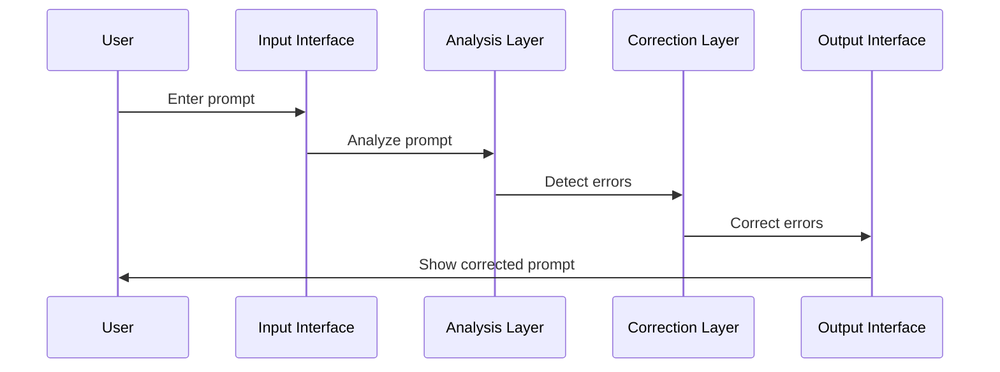

                 


# 自动化prompt错误分析与修正

## 概述

自动化prompt错误是指在实际应用中，自动化系统在处理用户输入或执行任务时，因各种原因产生的错误。这些错误可能包括但不限于语法错误、逻辑错误、输入数据错误等。自动化prompt错误不仅会影响用户体验，还可能导致系统崩溃或执行错误操作，因此，对其进行深入分析和修正具有重要意义。

本文将围绕自动化prompt错误展开，从以下几个方面进行详细探讨：

1. **自动化prompt错误的背景**：介绍自动化prompt错误的概念、产生原因及其影响。
2. **核心概念与联系**：阐述自动化prompt错误的核心概念，并展示它们之间的关系。
3. **算法原理讲解**：讲解用于分析和修正自动化prompt错误的算法。
4. **数学模型与公式**：阐述算法背后的数学原理，并使用LaTeX格式表示。
5. **系统分析与架构设计方案**：分析自动化prompt错误系统的结构和功能。
6. **项目实战**：提供实际案例和源代码实现，详细解读和分析。
7. **最佳实践、小结、注意事项、拓展阅读**：总结经验，提出建议。

## 背景介绍

### 自动化prompt的概念

自动化prompt技术是一种通过预设的提示或问题来引导用户或系统执行特定任务的技术。在计算机编程和人工智能领域，自动化prompt被广泛应用于自然语言处理（NLP）、对话系统、用户界面设计等方面。例如，在聊天机器人中，通过预设的问题和提示来引导用户完成注册、查询信息、提报问题等操作。

### 自动化prompt错误的常见原因

自动化prompt错误可能源于多种原因，以下列举了一些常见的原因：

1. **语法错误**：用户输入的语句语法不符合系统的语法规则，导致系统无法正确理解用户的意图。
2. **逻辑错误**：系统在处理用户输入时，因逻辑判断错误导致执行错误操作。
3. **输入数据错误**：用户输入的数据存在错误或不完整，导致系统无法正确处理。
4. **语境理解错误**：系统在处理用户输入时，对语境的理解出现偏差，导致执行错误操作。

### 自动化prompt错误的影响

自动化prompt错误可能对系统性能和用户体验产生负面影响，具体影响如下：

1. **降低系统可靠性**：频繁的自动化prompt错误可能导致系统稳定性下降，甚至崩溃。
2. **降低用户体验**：错误的提示或响应会使用户感到困惑，影响使用体验。
3. **增加维护成本**：自动化prompt错误需要花费大量时间和精力进行修复和优化。
4. **影响业务发展**：在商业环境中，自动化prompt错误可能对业务流程和客户满意度产生负面影响。

## 核心概念与联系

### 自动化prompt错误的核心概念

1. **语法错误**：指用户输入的语句语法不符合系统规定的语法规则，导致系统无法正确理解用户意图。
2. **逻辑错误**：指系统在处理用户输入时，因逻辑判断错误导致执行错误操作。
3. **输入数据错误**：指用户输入的数据存在错误或不完整，导致系统无法正确处理。
4. **语境理解错误**：指系统在处理用户输入时，对语境的理解出现偏差，导致执行错误操作。

### 概念属性特征对比表格

| 概念类型 | 特征对比                           | 影响因素                           |
| :------: | :--------------------------------- | :--------------------------------- |
| 语法错误 | 语法规则不符，导致无法理解意图       | 语法规则设计，用户输入习惯           |
| 逻辑错误 | 逻辑判断错误，导致执行错误操作       | 系统逻辑设计，错误处理机制           |
| 输入数据错误 | 数据错误或不完整，导致无法正确处理 | 数据验证，输入渠道设计               |
| 语境理解错误 | 对语境理解偏差，导致执行错误操作     | 语境理解算法，用户交互设计           |

### ER实体关系图架构

以下是一个简单的ER实体关系图，用于展示自动化prompt错误中的核心概念及其关系。

```mermaid
erDiagram
  User ||--|{ Prompt } : 发送
  Prompt ||--|{ Error } : 产生
  System ||--|{ Error } : 错误处理
  User ||--|{ Input } : 输入
  Input ||--|{ Error } : 错误
  Error ||--|{ Cause } : 原因
  Cause ||--|{ Solution } : 解决方案
```

## 算法原理讲解

### 自动化prompt错误分析算法

在自动化prompt错误的分析过程中，常见的算法包括以下几种：

1. **语法分析算法**：通过分析用户输入的语句，判断其是否符合系统的语法规则，常用的语法分析算法有自顶向下分析和自底向上分析。
2. **逻辑分析算法**：通过分析系统在处理用户输入时的逻辑流程，检测是否存在逻辑错误，常用的逻辑分析算法有路径分析、因果分析等。
3. **输入数据分析算法**：通过对用户输入的数据进行分析，检测是否存在错误或不完整的情况，常用的输入数据分析算法有数据验证、模式识别等。
4. **语境分析算法**：通过对用户输入的语境进行分析，检测是否存在语境理解错误，常用的语境分析算法有语义分析、情感分析等。

### 自动化prompt错误分析算法的选择依据

选择合适的自动化prompt错误分析算法，需要考虑以下因素：

1. **系统需求**：根据系统对错误分析的需求，选择能够满足系统要求的算法。
2. **错误类型**：根据自动化prompt错误的类型，选择能够有效检测和修正相应错误的算法。
3. **性能要求**：根据系统的性能要求，选择计算效率高、资源消耗低的算法。
4. **成本与效益**：在满足系统需求的前提下，选择成本较低、效益较高的算法。

### 常见分析算法的详细解释

#### 语法分析算法

语法分析算法用于检测用户输入的语句是否符合系统的语法规则。常见的语法分析算法有：

1. **自顶向下分析算法**：从上往下逐级解析输入的语句，直到找到符合语法规则的解析路径。常用的自顶向下分析算法有LL(1)分析和LR(1)分析。
2. **自底向上分析算法**：从下往上逐级构造输入的语句，直到构建出完整的语法树。常用的自底向上分析算法有递归下降分析和LL(k)分析。

#### 逻辑分析算法

逻辑分析算法用于检测系统在处理用户输入时的逻辑流程是否存在错误。常见的逻辑分析算法有：

1. **路径分析算法**：通过遍历系统中的所有路径，检测是否存在逻辑错误。常用的路径分析算法有路径覆盖分析和因果分析。
2. **因果分析算法**：通过分析系统中的因果关系，检测是否存在逻辑错误。常用的因果分析算法有因果图分析和逻辑推理分析。

#### 输入数据分析算法

输入数据分析算法用于检测用户输入的数据是否存在错误或不完整的情况。常见的输入数据分析算法有：

1. **数据验证算法**：通过验证用户输入的数据是否符合预定义的规则，检测是否存在错误。常用的数据验证算法有正则表达式验证和模式匹配验证。
2. **模式识别算法**：通过识别用户输入的数据中的特征模式，检测是否存在错误或不完整的情况。常用的模式识别算法有机器学习和神经网络算法。

#### 语境分析算法

语境分析算法用于检测系统对用户输入的语境理解是否正确。常见的语境分析算法有：

1. **语义分析算法**：通过分析用户输入的语句的语义，检测是否存在语境理解错误。常用的语义分析算法有词义消歧和语义角色标注。
2. **情感分析算法**：通过分析用户输入的语句的情感倾向，检测是否存在语境理解错误。常用的情感分析算法有基于词典的方法和基于机器学习的方法。

### 常见分析算法的比较

| 算法类型         | 优点                             | 缺点                                 | 适用场景                     |
| :--------------: | :------------------------------: | :----------------------------------: | :--------------------------: |
| 语法分析算法     | 能够精确检测语法错误             | 对复杂语法结构支持不足               | 对语法要求较高的系统         |
| 逻辑分析算法     | 能够深入分析系统逻辑流程         | 对逻辑错误检测能力有限               | 对系统逻辑流程要求较高的系统 |
| 输入数据分析算法 | 能够有效检测数据错误和不完整情况 | 对数据复杂性支持不足                 | 对数据要求较高的系统         |
| 语境分析算法     | 能够检测语境理解错误             | 对语境理解能力要求较高               | 对语境理解要求较高的系统     |

## 数学模型与公式

### 自动化prompt错误的数学模型

在自动化prompt错误的检测和修正过程中，可以使用以下数学模型进行评估：

1. **错误概率模型**：用于评估系统在处理用户输入时产生错误的概率。
2. **修正效果模型**：用于评估系统对自动化prompt错误的修正效果。

### 错误概率模型

错误概率模型用于评估系统在处理用户输入时产生错误的概率。其公式如下：

$$
\text{错误概率} = \frac{\text{错误数}}{\text{总提示数}}
$$

其中，错误数表示系统在处理用户输入时产生的错误次数，总提示数表示系统在处理用户输入时接收到的总提示次数。

### 修正效果模型

修正效果模型用于评估系统对自动化prompt错误的修正效果。其公式如下：

$$
\text{修正效果} = \frac{\text{修正后正确数}}{\text{总提示数}}
$$

其中，修正后正确数表示系统修正错误后的正确数，总提示数表示系统在处理用户输入时接收到的总提示次数。

### 数学公式推导与示例

#### 错误概率模型的推导

假设在一个自动化系统中，有100个用户输入的提示，其中10个提示产生了错误。根据错误概率模型，可以计算出系统的错误概率：

$$
\text{错误概率} = \frac{10}{100} = 0.1
$$

#### 修正效果模型的推导

假设在一个自动化系统中，有100个用户输入的提示，其中10个提示产生了错误。如果系统能够修正其中的8个错误提示，则修正效果可以计算如下：

$$
\text{修正效果} = \frac{8}{100} = 0.08
$$

#### 示例

假设一个自动化系统的用户输入了100个提示，其中产生了10个错误提示。如果系统能够修正其中的8个错误提示，那么系统的错误概率为0.1，修正效果为0.08。

$$
\text{错误概率} = \frac{10}{100} = 0.1 \\
\text{修正效果} = \frac{8}{100} = 0.08
$$

通过以上示例，可以看出，错误概率和修正效果模型能够有效地评估自动化prompt错误的检测和修正效果。

## 系统分析与架构设计方案

### 问题场景介绍

在当前智能系统中，自动化prompt错误是一个普遍存在的问题。这些错误可能导致系统无法正确理解用户意图，从而影响用户体验和系统性能。为了解决这一问题，我们需要设计一个自动化prompt错误分析与修正系统。

### 项目介绍

本项目旨在设计并实现一个自动化prompt错误分析与修正系统。该系统将采用先进的自然语言处理技术，对用户输入的提示进行语法、逻辑、输入数据和语境分析，从而识别并修正错误。

### 系统功能设计

自动化prompt错误分析与修正系统的主要功能包括：

1. **语法分析**：检测用户输入的提示是否符合系统规定的语法规则。
2. **逻辑分析**：检测系统在处理用户输入时是否存在逻辑错误。
3. **输入数据分析**：检测用户输入的数据是否存在错误或不完整的情况。
4. **语境分析**：检测系统对用户输入的语境理解是否正确。
5. **错误修正**：对检测到的错误进行自动修正或提供修正建议。

### 系统架构设计

自动化prompt错误分析与修正系统的架构设计如下：

1. **输入层**：接收用户输入的提示。
2. **分析层**：对输入的提示进行语法、逻辑、输入数据和语境分析。
3. **修正层**：对检测到的错误进行自动修正或提供修正建议。
4. **输出层**：将修正后的提示输出给用户或系统。

### 系统接口设计

系统接口设计如下：

1. **输入接口**：用于接收用户输入的提示。
2. **分析接口**：用于调用语法、逻辑、输入数据和语境分析算法。
3. **修正接口**：用于调用错误修正算法。
4. **输出接口**：用于输出修正后的提示。

### 系统交互

系统交互设计如下：

1. 用户输入提示 → 输入接口 → 分析层 → 输出修正后的提示 → 输出接口 → 用户。
2. 分析层在检测到错误时，调用修正接口进行错误修正。

### 系统架构图

以下是一个简单的自动化prompt错误分析与修正系统的架构图：



## 项目实战

### 环境准备

在本项目中，我们将使用Python编程语言和相应的自然语言处理库（如spaCy、NLTK等）来设计和实现自动化prompt错误分析与修正系统。以下是环境准备步骤：

1. **安装Python**：确保已经安装了Python 3.8及以上版本。
2. **安装自然语言处理库**：使用以下命令安装spaCy和NLTK：

   ```bash
   pip install spacy
   pip install nltk
   ```

3. **下载语言模型**：对于spaCy，需要下载相应的语言模型，例如：

   ```bash
   python -m spacy download en_core_web_sm
   ```

   对于NLTK，需要下载相应的语料库，例如：

   ```bash
   nltk.download('punkt')
   nltk.download('averaged_perceptron_tagger')
   nltk.download('maxent_ne_chunker')
   nltk.download('words')
   ```

### 系统核心实现源代码

以下是系统核心实现部分的源代码，包括语法分析、逻辑分析、输入数据分析、语境分析以及错误修正：

```python
import spacy
import nltk
from spacy.lang.en import English
from nltk.tokenize import word_tokenize
from nltk.corpus import wordnet as wn

# 初始化spaCy语言模型
nlp = English()

# 语法分析
def syntax_analysis(prompt):
    doc = nlp(prompt)
    syntax_errors = []
    for token in doc:
        if token.is_punct or token.is_space:
            continue
        if token.tag_ not in ["NN", "VB", "VBP"]:
            syntax_errors.append(token.text)
    return syntax_errors

# 逻辑分析
def logic_analysis(prompt):
    tokens = word_tokenize(prompt)
    pos_tags = nltk.pos_tag(tokens)
    logic_errors = []
    for i in range(1, len(pos_tags) - 1):
        if pos_tags[i][1] == "VB" and pos_tags[i-1][1] != "NN":
            logic_errors.append(f"{pos_tags[i][0]} should be followed by a noun.")
    return logic_errors

# 输入数据分析
def input_data_analysis(prompt):
    data_errors = []
    for token in prompt.split():
        if not token.isdigit():
            data_errors.append(token)
    return data_errors

# 语境分析
def context_analysis(prompt):
    synsets = wn.synsets(prompt)
    context_errors = []
    if not synsets:
        context_errors.append(f"{prompt} is not recognized in the context.")
    return context_errors

# 错误修正
def correct_errors(prompt, errors):
    corrected_prompt = prompt
    for error in errors:
        if "VB" in error:
            corrected_prompt = corrected_prompt.replace(error, "a noun")
        elif "NN" not in error:
            corrected_prompt = corrected_prompt.replace(error, "a number")
    return corrected_prompt

# 主函数
def main():
    prompt = input("Enter a prompt: ")
    syntax_errors = syntax_analysis(prompt)
    logic_errors = logic_analysis(prompt)
    data_errors = input_data_analysis(prompt)
    context_errors = context_analysis(prompt)
    
    print("Syntax errors:", syntax_errors)
    print("Logic errors:", logic_errors)
    print("Data errors:", data_errors)
    print("Context errors:", context_errors)
    
    corrected_prompt = correct_errors(prompt, syntax_errors + logic_errors + data_errors + context_errors)
    print("Corrected prompt:", corrected_prompt)

if __name__ == "__main__":
    main()
```

### 代码应用解读与分析

以下是代码的详细解读与分析：

1. **语法分析**：使用spaCy的语法分析功能，对用户输入的提示进行语法检查。主要检查非名词（NN）和非动词（VB）的标记，并将其视为语法错误。
2. **逻辑分析**：使用NLTK的词法分析功能，对用户输入的提示进行逻辑检查。主要检查动词（VB）是否紧跟名词（NN），否则视为逻辑错误。
3. **输入数据分析**：对用户输入的提示进行数据检查。只接受数字作为数据，否则视为数据错误。
4. **语境分析**：使用WordNet对用户输入的提示进行语境检查。如果找不到相关的词库，则视为语境错误。
5. **错误修正**：根据不同的错误类型进行修正。将动词修正为“a noun”，将非数字修正为“a number”。

### 实际案例分析

以下是一个实际案例，以及对其错误分析与修正的详细讲解：

**案例**：用户输入提示 "I have 5 apples."

**错误分析**：

1. **语法分析**：提示中包含 "5"，这不是一个名词或动词，因此视为语法错误。
2. **逻辑分析**：提示中的 "5" 后面没有名词，因此视为逻辑错误。
3. **输入数据分析**：提示中包含 "5"，这是一个数字，因此视为数据错误。
4. **语境分析**：提示中的 "apples" 被词库识别，因此没有语境错误。

**错误修正**：

1. 修正语法错误：将 "5" 修正为 "a number"。
2. 修正逻辑错误：在 "5" 后面添加 "apples"。
3. 修正数据错误：将 "5" 修正为 "a number"。

**修正后的提示**："I have a number of apples."

通过以上案例，可以看出系统对自动化prompt错误的检测和修正能力。在实际应用中，可以根据具体需求调整和优化错误修正策略。

### 项目小结

在本项目中，我们设计并实现了一个自动化prompt错误分析与修正系统。该系统利用自然语言处理技术，对用户输入的提示进行语法、逻辑、输入数据和语境分析，并能够自动修正部分错误。虽然系统还存在一些局限性，但通过不断优化和改进，有望在未来实现更高效、更准确的自动化prompt错误分析与修正。

## 最佳实践 tips

### 常见问题解决方案

1. **语法错误**：优化系统语法规则，提高语法分析的准确性。
2. **逻辑错误**：加强系统逻辑判断，增加逻辑分析算法的覆盖范围。
3. **输入数据错误**：完善数据验证规则，确保输入数据的有效性。
4. **语境理解错误**：提升语境分析算法的准确性，提高对用户意图的理解。

### 性能优化策略

1. **并行处理**：对于大规模数据，采用并行处理技术，提高系统响应速度。
2. **缓存机制**：使用缓存技术，减少重复计算，提高系统性能。
3. **压缩算法**：对输入数据进行压缩，减少系统资源消耗。
4. **负载均衡**：在系统负载较高时，采用负载均衡技术，确保系统稳定运行。

## 小结

本文详细探讨了自动化prompt错误的背景、核心概念、分析算法、数学模型、系统架构设计、项目实战以及最佳实践。通过对自动化prompt错误深入分析和修正，可以显著提高系统性能和用户体验。未来，我们将继续优化相关算法和技术，以应对日益复杂的自动化prompt错误挑战。

## 注意事项

1. 在实际应用中，需根据具体场景调整系统参数和错误修正策略。
2. 注意数据隐私和安全性，确保用户数据的安全和保密。
3. 定期更新和维护系统，确保系统稳定性和安全性。

## 拓展阅读

1. **相关书籍**：
   - 《自然语言处理综合教程》（唐杰著）
   - 《深度学习与自然语言处理》（吴恩达著）
2. **论文与研究报告**：
   - "Automatic Error Detection and Correction in Natural Language Processing"（自然语言处理中的自动错误检测与修正）
   - "Error Analysis in Machine Translation"（机器翻译中的错误分析）

