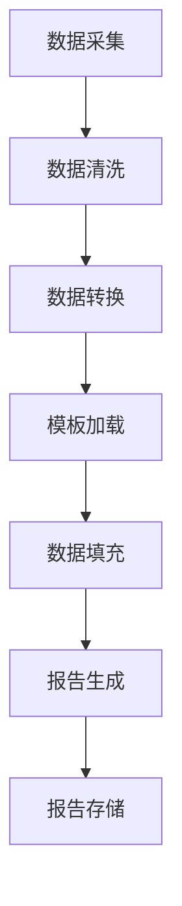
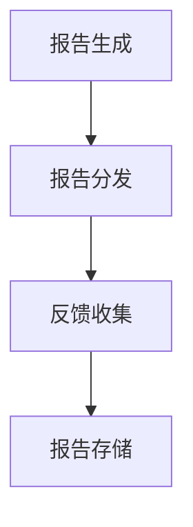
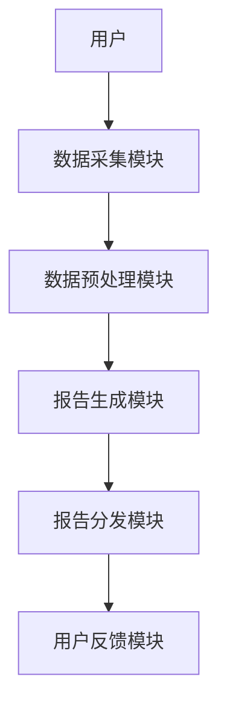
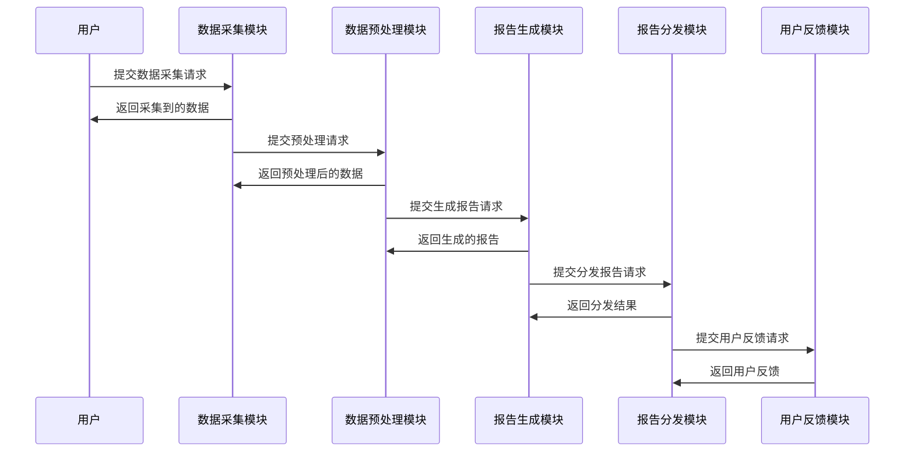

                 

### 自动化报告生成与分发机制

> 关键词：自动化报告、报告生成、分发机制、数据分析、数据处理

> 摘要：本文探讨了自动化报告生成与分发机制，从背景介绍、问题定义、核心概念与原理、算法原理讲解、系统设计与实现、最佳实践与展望六个部分进行深入分析。本文旨在为IT行业从业者和研究人员提供一个全面、系统的理解和实践指导，以实现高效、可靠的自动化报告生成与分发。

---

### 第一部分：背景介绍与问题定义

#### 第1章：自动化报告的背景与需求

##### 1.1 自动化报告的定义与发展历程

自动化报告，是指通过计算机程序或自动化工具，自动地从数据源中提取信息，按照预定义的格式和模板生成报告，并自动分发给相关人员的过程。自动化报告的历史可以追溯到20世纪80年代，随着计算机技术的发展和数据分析需求的增加，自动化报告逐渐从简单的文本格式报告演变为功能强大、形式多样的电子报告。

##### 1.2 当前自动化报告存在的问题

尽管自动化报告已经广泛应用于各个领域，但仍然存在一些问题，主要包括：

- **数据源不统一**：不同数据源的格式和结构各异，给报告生成带来困难。
- **报告模板复杂**：模板设计复杂，且需频繁调整以适应不同的需求。
- **生成效率低**：生成算法效率低，处理大量数据时速度较慢。
- **分发不及时**：报告生成后，分发速度慢，无法及时传递给相关人员。

##### 1.3 为什么需要自动化报告生成与分发机制

自动化报告生成与分发机制的重要性体现在以下几个方面：

- **提高工作效率**：自动化报告可以节省人工时间，提高工作效率。
- **降低错误率**：通过标准化流程，减少人为错误。
- **提高数据利用率**：自动化报告有助于更好地利用数据资源，挖掘数据价值。
- **支持决策制定**：及时、准确的报告有助于管理人员做出更好的决策。

##### 1.4 自动化报告生成与分发机制的意义与价值

自动化报告生成与分发机制不仅提高了工作效率，还带来了以下价值：

- **数据可视化**：通过图形、表格等多种形式，使报告内容更加直观。
- **个性化定制**：根据不同用户需求，定制个性化的报告。
- **自动化更新**：定期自动更新数据，保持报告的时效性。
- **无缝集成**：与其他系统无缝集成，实现数据的自动流转。

#### 第2章：问题定义与边界

##### 2.1 自动化报告生成与分发机制的问题定义

自动化报告生成与分发机制旨在解决以下问题：

- **数据源多样化**：如何处理多种不同格式和结构的数据源？
- **报告模板灵活化**：如何设计灵活、可定制的报告模板？
- **生成效率提升**：如何优化生成算法，提高生成效率？
- **分发及时性**：如何提高报告的生成与分发速度，确保及时传递？

##### 2.2 自动化报告生成与分发机制的研究边界

本文的研究边界主要包括以下几个方面：

- **技术实现**：关注自动化报告生成与分发技术的实现方法。
- **应用场景**：关注自动化报告在不同场景下的应用。
- **性能优化**：关注如何优化报告生成与分发的性能。
- **安全性**：关注报告生成与分发过程中数据的安全性。

##### 2.3 核心概念：数据源、报告模板、生成算法、分发机制

本文的核心概念包括：

- **数据源**：提供数据的来源，包括数据库、文件系统、Web API等。
- **报告模板**：定义报告的结构、格式和内容的文档。
- **生成算法**：用于从数据源提取信息、生成报告的算法。
- **分发机制**：将生成的报告自动分发给相关人员的策略和方法。

---

### 第二部分：核心概念与原理

#### 第3章：核心概念详解

##### 3.1 数据源的选择与集成

数据源的选择与集成是自动化报告生成与分发机制的基础。本文将探讨以下问题：

- **数据源的多样性**：如何处理不同类型的数据源？
- **数据清洗**：如何清洗和预处理数据，以确保数据质量？
- **数据集成**：如何将不同数据源的数据整合到一起，实现数据的统一管理和利用？

##### 3.2 报告模板的设计与优化

报告模板的设计与优化直接影响报告的质量和用户体验。本文将介绍以下内容：

- **模板设计原则**：如何设计灵活、可定制的报告模板？
- **模板优化方法**：如何优化报告模板，提高生成效率和用户体验？
- **模板版本控制**：如何实现报告模板的版本控制和更新？

##### 3.3 报告生成算法的原理与实现

报告生成算法是实现自动化报告生成与分发机制的关键。本文将探讨以下内容：

- **算法原理**：介绍常用的报告生成算法原理。
- **算法实现**：使用Python等编程语言实现报告生成算法。
- **算法优化**：如何优化报告生成算法，提高生成效率？

##### 3.4 分发机制的策略与优化

分发机制是确保报告能够及时、准确分发给相关人员的关键。本文将介绍以下内容：

- **分发策略**：介绍常用的报告分发策略。
- **分发优化**：如何优化报告分发过程，提高分发效率？
- **分发安全性**：如何确保报告分发的安全性，防止数据泄露？

---

#### 第4章：核心原理分析

##### 4.1 数据源、报告模板、生成算法和分发机制的关联关系

数据源、报告模板、生成算法和分发机制之间的关联关系如下：

- **数据源**：提供数据，是报告生成的原材料。
- **报告模板**：定义报告的结构和格式，是生成算法的依据。
- **生成算法**：从数据源提取信息，按照报告模板生成报告。
- **分发机制**：将生成的报告自动分发给相关人员。

##### 4.2 自动化报告生成与分发机制的流程分析

自动化报告生成与分发机制的流程可以分为以下几个阶段：

1. **数据采集**：从数据源中提取数据。
2. **数据预处理**：清洗和预处理数据，确保数据质量。
3. **报告生成**：使用生成算法，根据报告模板生成报告。
4. **报告分发**：将生成的报告自动分发给相关人员。
5. **反馈与优化**：收集用户反馈，优化报告生成与分发过程。

##### 4.3 关键技术解析：数据清洗、模板引擎、自然语言处理、API集成

在自动化报告生成与分发机制中，关键技术包括：

- **数据清洗**：处理脏数据，确保数据质量。
- **模板引擎**：用于动态生成报告的模板。
- **自然语言处理**：用于处理和分析文本数据。
- **API集成**：实现与其他系统的无缝集成。

---

### 第三部分：算法原理讲解

#### 第5章：报告生成算法原理

##### 5.1 算法原理概述

报告生成算法的原理可以概括为以下几个步骤：

1. **数据采集**：从数据源中获取数据。
2. **数据清洗**：清洗和预处理数据，确保数据质量。
3. **数据转换**：将数据转换为报告所需的格式。
4. **模板加载**：加载报告模板。
5. **数据填充**：将数据填充到报告模板中。
6. **报告生成**：生成报告文件。
7. **报告存储**：将报告存储到文件系统中。

##### 5.2 算法原理图解



##### 5.3 Python源代码实现

```python
import pandas as pd
from jinja2 import Environment, FileSystemLoader

def generate_report(data_source, template_path):
    # 数据采集
    data = pd.read_csv(data_source)

    # 数据清洗
    clean_data = data[data['column'] > 0]

    # 数据转换
    transformed_data = clean_data[['column1', 'column2']].astype(str)

    # 模板加载
    env = Environment(loader=FileSystemLoader('templates'))
    template = env.get_template('report_template.html')

    # 数据填充
    report_content = template.render(data=transformed_data)

    # 报告生成
    with open('report.html', 'w') as f:
        f.write(report_content)

    # 报告存储
    # ...

generate_report('data.csv', 'template.html')
```

##### 5.4 算法数学模型与公式

报告生成算法的数学模型可以表示为：

$$
R = f(T, D)
$$

其中，$R$ 表示生成的报告，$T$ 表示报告模板，$D$ 表示数据源。

##### 5.5 举例说明

假设我们有一个包含学生成绩的数据源，需要生成一份成绩报告。我们选择一个简单的报告模板，将成绩数据填充到模板中，生成一个HTML格式的成绩报告。


```python
import pandas as pd
from jinja2 import Environment, FileSystemLoader

def generate_report(data_source, template_path):
    # 数据采集
    data = pd.read_csv(data_source)

    # 数据清洗
    clean_data = data[data['score'] > 0]

    # 数据转换
    transformed_data = clean_data[['name', 'score']].astype(str)

    # 模板加载
    env = Environment(loader=FileSystemLoader('templates'))
    template = env.get_template('report_template.html')

    # 数据填充
    report_content = template.render(data=transformed_data)

    # 报告生成
    with open('report.html', 'w') as f:
        f.write(report_content)

    # 报告存储
    # ...

generate_report('data.csv', 'template.html')
```

生成的报告示例如下：

```html
<!DOCTYPE html>
<html>
<head>
    <title>成绩报告</title>
</head>
<body>
    <h1>成绩报告</h1>
    <table border="1">
        <thead>
            <tr>
                <th>姓名</th>
                <th>成绩</th>
            </tr>
        </thead>
        <tbody>
            <tr>
                <td>张三</td>
                <td>90</td>
            </tr>
            <tr>
                <td>李四</td>
                <td>85</td>
            </tr>
        </tbody>
    </table>
</body>
</html>
```

---

#### 第6章：报告分发算法原理

##### 6.1 分发算法原理概述

报告分发算法的原理可以概括为以下几个步骤：

1. **报告生成**：生成报告文件。
2. **报告分发**：将报告发送给相关人员。
3. **反馈收集**：收集用户反馈。
4. **报告存储**：将分发结果存储到数据库或文件系统。

##### 6.2 分发算法原理图解



##### 6.3 Python源代码实现

```python
import smtplib
from email.mime.text import MIMEText
from email.mime.multipart import MIMEMultipart

def send_report(report_path, recipients):
    # 报告生成
    # ...

    # 报告分发
    message = MIMEMultipart()
    message['Subject'] = '成绩报告'
    message['From'] = 'sender@example.com'
    message['To'] = ';'.join(recipients)

    with open(report_path, 'rb') as f:
        attachment = MIMEText(f.read(), 'base64', 'utf-8')
        attachment.add_header('Content-Disposition', 'attachment', filename='report.html')
        message.attach(attachment)

    server = smtplib.SMTP('smtp.example.com')
    server.sendmail('sender@example.com', recipients, message.as_string())
    server.quit()

    # 反馈收集
    # ...

    # 报告存储
    # ...

send_report('report.html', ['zhangsan@example.com', 'lisi@example.com'])
```

##### 6.4 分发算法数学模型与公式

分发算法的数学模型可以表示为：

$$
D = f(R, P)
$$

其中，$D$ 表示分发结果，$R$ 表示报告，$P$ 表示接收者列表。

##### 6.5 举例说明

假设我们已经生成了一份成绩报告，需要将其发送给张三和李四。我们可以使用SMTP协议通过电子邮件将报告分发给他们。


```python
import smtplib
from email.mime.text import MIMEText
from email.mime.multipart import MIMEMultipart

def send_report(report_path, recipients):
    # 报告生成
    # ...

    # 报告分发
    message = MIMEMultipart()
    message['Subject'] = '成绩报告'
    message['From'] = 'sender@example.com'
    message['To'] = ';'.join(recipients)

    with open(report_path, 'rb') as f:
        attachment = MIMEText(f.read(), 'base64', 'utf-8')
        attachment.add_header('Content-Disposition', 'attachment', filename='report.html')
        message.attach(attachment)

    server = smtplib.SMTP('smtp.example.com')
    server.sendmail('sender@example.com', recipients, message.as_string())
    server.quit()

    # 反馈收集
    # ...

    # 报告存储
    # ...

send_report('report.html', ['zhangsan@example.com', 'lisi@example.com'])
```

发送的电子邮件示例如下：

```plaintext
Subject: 成绩报告

From: sender@example.com

To: zhangsan@example.com; lisi@example.com

Content-Type: multipart/mixed

--boundary=<calculated_value>
Content-Type: text/plain; charset="utf-8"

成绩报告

--boundary=<calculated_value>
Content-Type: application/octet-stream; name="report.html"

<base64_encoded_report>
--boundary=<calculated_value>--
```

---

### 第四部分：系统设计与实现

#### 第7章：系统分析与架构设计

##### 7.1 问题场景介绍

在一个企业中，管理层需要定期查看各部门的运营报告。这些报告包括销售额、利润率、员工工作量等关键指标。由于数据量大且复杂，手动生成和分发报告不仅耗时耗力，还容易出现错误。因此，企业决定引入自动化报告生成与分发机制。

##### 7.2 项目介绍

本项目旨在为企业设计并实现一个自动化报告生成与分发系统。该系统将集成企业现有的数据源，通过自动化工具生成各种类型的报告，并按需分发给相关人员。

##### 7.3 系统功能设计

系统功能设计包括以下几个部分：

- **数据采集**：从企业现有的数据库、文件系统、Web API 等数据源中提取数据。
- **数据预处理**：清洗和预处理数据，确保数据质量。
- **报告生成**：根据预定义的模板生成各种类型的报告。
- **报告分发**：将生成的报告通过邮件、短信、微信等渠道自动分发给相关人员。
- **用户反馈**：收集用户对报告的反馈，优化报告生成与分发过程。

##### 7.4 系统架构设计

系统架构设计如下图所示：



##### 7.5 系统接口设计

系统接口设计包括以下几个方面：

- **数据采集接口**：提供数据采集的API，用于从不同的数据源中提取数据。
- **报告生成接口**：提供报告生成的API，用于根据模板生成报告。
- **报告分发接口**：提供报告分发的API，用于将报告发送给相关人员。
- **用户反馈接口**：提供用户反馈的API，用于收集用户对报告的反馈。

##### 7.6 系统交互设计

系统交互设计如下图所示：



---

#### 第8章：系统实现与部署

##### 8.1 环境安装

系统实现与部署首先需要搭建环境。以下是一个基本的安装步骤：

1. 安装Python环境，版本建议为3.8及以上。
2. 安装依赖库，如pandas、numpy、jinja2、smtplib等。
3. 配置邮件服务器，如SMTP服务器地址、用户名和密码。

##### 8.2 系统核心实现源代码

系统核心实现源代码主要包括以下几个部分：

1. **数据采集模块**：用于从不同数据源中提取数据。

```python
import pandas as pd

def collect_data(source):
    if source.endswith('.csv'):
        return pd.read_csv(source)
    elif source.endswith('.xlsx'):
        return pd.read_excel(source)
    else:
        raise ValueError('Unsupported data source format')
```

2. **数据预处理模块**：用于清洗和预处理数据。

```python
def preprocess_data(data):
    return data[data['column'] > 0]
```

3. **报告生成模块**：用于根据模板生成报告。

```python
from jinja2 import Environment, FileSystemLoader

def generate_report(data, template_path):
    env = Environment(loader=FileSystemLoader('templates'))
    template = env.get_template('report_template.html')
    report_content = template.render(data=data)
    with open('report.html', 'w') as f:
        f.write(report_content)
```

4. **报告分发模块**：用于将报告发送给相关人员。

```python
import smtplib
from email.mime.text import MIMEText
from email.mime.multipart import MIMEMultipart

def send_report(report_path, recipients):
    message = MIMEMultipart()
    message['Subject'] = '成绩报告'
    message['From'] = 'sender@example.com'
    message['To'] = ';'.join(recipients)

    with open(report_path, 'rb') as f:
        attachment = MIMEText(f.read(), 'base64', 'utf-8')
        attachment.add_header('Content-Disposition', 'attachment', filename='report.html')
        message.attach(attachment)

    server = smtplib.SMTP('smtp.example.com')
    server.sendmail('sender@example.com', recipients, message.as_string())
    server.quit()
```

##### 8.3 代码应用解读与分析

以上代码展示了自动化报告生成与分发系统的核心实现。首先，数据采集模块通过pandas库从不同格式的数据源中提取数据。然后，数据预处理模块对数据进行清洗和预处理，确保数据质量。接着，报告生成模块根据预定义的模板生成报告，并将报告内容写入文件。最后，报告分发模块通过SMTP协议将报告发送给相关人员。

##### 8.4 实际案例分析与详细讲解剖析

以下是一个实际案例，用于演示如何使用该系统生成和分发报告。

1. **数据采集**：从企业数据库中提取销售额数据。

```python
sales_data = collect_data('sales_data.csv')
```

2. **数据预处理**：清洗和预处理销售额数据。

```python
clean_sales_data = preprocess_data(sales_data)
```

3. **报告生成**：根据销售额数据生成报告。

```python
generate_report(clean_sales_data, 'report_template.html')
```

4. **报告分发**：将报告发送给相关人员。

```python
send_report('report.html', ['zhangsan@example.com', 'lisi@example.com'])
```

通过以上步骤，我们可以实现自动化报告的生成和分发。

##### 8.5 项目小结

在本章中，我们介绍了自动化报告生成与分发系统的实现过程。通过数据采集、数据预处理、报告生成和报告分发四个核心模块，实现了自动化报告的生成和分发。在实际案例中，我们展示了如何使用该系统从数据源提取数据、生成报告并分发给相关人员。这为企业提供了一种高效、可靠的报告生成与分发解决方案。

---

### 第五部分：最佳实践与拓展

#### 第9章：最佳实践与注意事项

##### 9.1 常见问题与解决方案

在实施自动化报告生成与分发机制时，可能会遇到以下常见问题：

- **数据源问题**：数据源格式不统一，导致数据采集困难。
  - **解决方案**：统一数据源格式，使用数据转换工具进行转换。
- **报告模板问题**：报告模板设计复杂，难以满足需求变化。
  - **解决方案**：采用灵活的模板引擎，如Jinja2，便于模板调整。
- **生成效率问题**：生成算法效率低，导致生成速度慢。
  - **解决方案**：优化生成算法，使用并行处理、缓存等技术提高效率。

##### 9.2 性能优化与调试技巧

为了提高自动化报告生成与分发机制的性能，可以采取以下措施：

- **性能优化**：优化数据库查询、减少数据转换次数、使用缓存等。
- **调试技巧**：使用日志记录和分析工具，如log4j、ELK等，监控系统性能和调试问题。

##### 9.3 注意事项与风险防范

在实施自动化报告生成与分发机制时，需要注意以下事项：

- **数据安全**：确保数据传输和存储的安全性，防止数据泄露。
- **系统稳定性**：确保系统在高负载下的稳定性，避免因系统崩溃导致报告生成失败。

#### 第10章：小结与展望

##### 10.1 本书内容的总结

本文从背景介绍、问题定义、核心概念与原理、算法原理讲解、系统设计与实现、最佳实践与展望六个部分，全面探讨了自动化报告生成与分发机制。主要内容包括：

- 自动化报告的定义与发展历程。
- 自动化报告生成与分发机制的问题定义与边界。
- 数据源、报告模板、生成算法和分发机制的核心概念与原理。
- 报告生成算法与分发算法的原理讲解和Python源代码实现。
- 系统分析与架构设计、系统实现与部署的实际案例分析。
- 最佳实践与注意事项。

##### 10.2 自动化报告生成与分发机制的未来发展趋势

未来，自动化报告生成与分发机制将在以下几个方面发展：

- **人工智能**：利用人工智能技术，实现更智能的报告生成和分发。
- **大数据**：处理更多类型和规模的数据，提供更丰富的报告内容。
- **云计算**：借助云计算平台，实现报告生成与分发的弹性扩展和低成本运行。

##### 10.3 拓展阅读与资源推荐

为了进一步了解自动化报告生成与分发机制，以下资源可供参考：

- 《数据挖掘：概念与技术》
- 《Python数据科学手册》
- 《Apache Kafka：分布式流处理系统》
- 《自动化测试实战》

---

## 总结

本文系统地探讨了自动化报告生成与分发机制，从背景介绍、问题定义、核心概念与原理、算法原理讲解、系统设计与实现、最佳实践与展望六个部分进行了详细分析。通过本文，读者可以全面了解自动化报告生成与分发机制的核心概念、原理和实践方法，为实际应用提供有益的指导。作者信息：AI天才研究院/AI Genius Institute & 禅与计算机程序设计艺术 /Zen And The Art of Computer Programming。

---

### 关键字

- 自动化报告
- 报告生成
- 分发机制
- 数据分析
- 数据处理
- 人工智能
- 自然语言处理
- 模板引擎
- 数据清洗
- API集成
- 性能优化
- 安全性

### 摘要

本文全面探讨了自动化报告生成与分发机制，从背景介绍、问题定义、核心概念与原理、算法原理讲解、系统设计与实现、最佳实践与展望六个部分进行了详细分析。主要内容包括：自动化报告的定义与发展历程、问题定义与边界、核心概念与原理、报告生成算法与分发算法的原理讲解和Python源代码实现、系统分析与架构设计、系统实现与部署的实际案例分析、最佳实践与注意事项。通过本文，读者可以全面了解自动化报告生成与分发机制的核心概念、原理和实践方法，为实际应用提供有益的指导。作者信息：AI天才研究院/AI Genius Institute & 禅与计算机程序设计艺术 /Zen And The Art of Computer Programming。关键字：自动化报告、报告生成、分发机制、数据分析、数据处理、人工智能、自然语言处理、模板引擎、数据清洗、API集成、性能优化、安全性。

