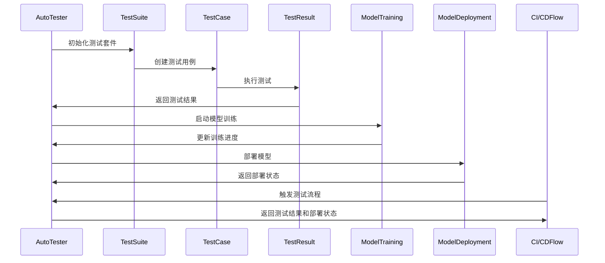

                 

## 自动化测试在LLM应用开发中的应用

### 关键词：自动化测试、LLM、NLP、模型训练、持续集成

> 摘要：本文深入探讨了自动化测试在自然语言处理（NLP）大型语言模型（LLM）应用开发中的应用。通过详细介绍自动化测试的定义、重要性及优势，结合LLM应用开发的挑战，本文分析了自动化测试在这些挑战中的关键作用。随后，文章重点介绍了自动化测试的方法、技术及工具，并结合LLM应用开发的实际场景，探讨了自动化测试的具体实施策略和实践。最后，文章总结了自动化测试在LLM应用开发中的最佳实践和未来发展趋势，为开发者提供了有价值的参考和指导。

### 目录大纲

# 自动化测试在LLM应用开发中的应用

## 第一部分：背景介绍与概念解析

## 第1章：自动化测试概述

### 1.1 自动化测试的定义与重要性

- 自动化测试的定义
- 自动化测试与手动测试的区别
- 自动化测试在软件开发中的重要性

### 1.2 软件开发中的常见问题与挑战

- 软件复杂性增加
- 测试成本高
- 测试效率低
- 质量难以保证

### 1.3 自动化测试的优势

- 提高测试效率
- 确保软件质量
- 节省人力资源
- 促进持续集成和持续交付

## 第2章：LLM应用开发背景

### 2.1 什么是以自然语言处理（NLP）为核心的LLM应用

- LLM的定义
- NLP与LLM的关系
- LLM应用的发展历程

### 2.2 LLM应用开发的挑战

- 大规模数据处理
- 模型训练的效率与准确性
- 模型部署与性能优化
- 安全性与隐私保护

### 2.3 自动化测试在LLM应用开发中的意义

- 提高模型训练的准确性
- 确保模型部署的可靠性
- 促进持续集成和持续交付
- 降低测试成本和人力投入

## 第二部分：自动化测试方法与技术

## 第3章：自动化测试方法

### 3.1 单元测试

- 单元测试的定义
- 单元测试的实施
- 单元测试的优势

### 3.2 集成测试

- 集成测试的定义
- 集成测试的类型
- 集集测试的策略

### 3.3 系统测试

- 系统测试的定义
- 系统测试的内容
- 系统测试的方法

### 3.4 验收测试

- 验收测试的定义
- 验收测试的类型
- 验收测试的策略

## 第4章：自动化测试工具

### 4.1 自动化测试工具的分类

- 开源自动化测试工具
- 商业自动化测试工具

### 4.2 自动化测试工具的使用场景

- 单元测试工具
- 集成测试工具
- 系统测试工具
- 验收测试工具

### 4.3 自动化测试工具的选型与实施

- 自动化测试工具的选型
- 自动化测试工具的集成
- 自动化测试工具的配置与管理

## 第三部分：自动化测试在LLM应用开发中的实践

## 第5章：自动化测试在LLM模型训练中的应用

### 5.1 自动化测试的目标

- 确保模型训练的正确性
- 提高模型训练的效率
- 促进持续集成和持续交付

### 5.2 自动化测试的关键指标

- 训练准确性
- 训练效率
- 模型稳定性

### 5.3 自动化测试的实施策略

- 数据预处理自动化测试
- 模型训练自动化测试
- 模型评估自动化测试

## 第6章：自动化测试在LLM模型部署中的应用

### 6.1 自动化测试的目标

- 确保模型部署的可靠性
- 提高模型部署的效率
- 确保模型性能的一致性

### 6.2 自动化测试的关键指标

- 模型部署成功率
- 模型运行效率
- 模型性能稳定性

### 6.3 自动化测试的实施策略

- 部署流程自动化测试
- 模型运行自动化测试
- 性能监控自动化测试

## 第7章：自动化测试在LLM应用持续集成与持续交付中的应用

### 7.1 持续集成与持续交付的概念

- 持续集成的概念
- 持续交付的概念

### 7.2 自动化测试在持续集成与持续交付中的价值

- 提高开发效率
- 确保软件质量
- 降低测试成本

### 7.3 自动化测试在持续集成与持续交付中的实施策略

- 自动化测试流程设计
- 自动化测试集成到CI/CD流程中
- 自动化测试报告与监控

## 第8章：自动化测试在LLM应用开发中的最佳实践

### 8.1 自动化测试的最佳实践

- 自动化测试策略
- 自动化测试实施
- 自动化测试维护

### 8.2 自动化测试中的常见问题与解决方案

- 自动化测试的困难与挑战
- 自动化测试的优化方法

### 8.3 自动化测试的未来发展趋势

- 自动化测试技术的革新
- 自动化测试在AI领域的应用前景

## 第9章：总结与展望

### 9.1 自动化测试在LLM应用开发中的总结

- 自动化测试的成果
- 自动化测试的不足

### 9.2 自动化测试在LLM应用开发中的展望

- 自动化测试技术的发展趋势
- 自动化测试在LLM应用开发中的未来方向

## 第一部分：背景介绍与概念解析

### 1.1 自动化测试的定义与重要性

自动化测试是一种通过使用软件工具来执行测试过程的方法。其核心思想是减少或替代手动测试，以提高测试效率和质量。自动化测试涵盖了从单元测试到系统测试、集成测试和验收测试的各个层面。通过自动化测试，开发者可以确保软件在不同环境和条件下都能稳定运行，从而提高软件的可靠性和用户体验。

自动化测试与手动测试有着显著的区别。手动测试通常由测试人员执行，他们手动操作软件并记录结果。这种方法的优点是测试人员可以更加灵活地发现潜在的问题，但缺点是测试过程耗时且容易出错。相比之下，自动化测试通过编写脚本或使用现成的测试工具来执行测试，可以大大提高测试的效率和一致性。自动化测试不仅能够节省时间和人力成本，还能确保测试过程的可重复性和可扩展性。

在软件开发过程中，自动化测试具有以下几个重要优势：

1. **提高测试效率**：自动化测试可以快速执行大量的测试用例，缩短测试周期，提高测试的覆盖率。
2. **确保软件质量**：自动化测试可以持续执行，确保软件在不同环境和条件下都能稳定运行，减少缺陷漏测的风险。
3. **节省人力资源**：自动化测试可以减少测试人员的数量，将测试人员从繁琐的重复工作中解放出来，使他们能够专注于更具有创造性的任务。
4. **促进持续集成和持续交付**：自动化测试是持续集成和持续交付的重要组成部分，可以确保代码的持续集成和快速交付。

### 1.2 软件开发中的常见问题与挑战

随着软件复杂性的不断增加，软件开发过程中面临着许多问题和挑战。以下是软件开发中常见的几个问题：

1. **软件复杂性增加**：现代软件系统通常包含大量的功能和模块，这使得测试变得更加复杂。手动测试很难覆盖所有可能的测试场景，容易导致缺陷漏测。
2. **测试成本高**：测试是一个耗时的过程，特别是在大型项目中。手动测试需要大量的人力和时间投入，导致测试成本高昂。
3. **测试效率低**：由于软件复杂性的增加，手动测试的效率往往较低。测试人员需要花费大量时间来设计和执行测试用例，并且很难保证测试的全面性。
4. **质量难以保证**：在手动测试中，测试人员的主观判断和经验可能会影响测试结果的准确性。此外，由于测试资源的限制，很难进行充分的测试，导致软件质量难以保证。

### 1.3 自动化测试的优势

自动化测试在解决软件开发中的问题和挑战方面具有显著的优势：

1. **提高测试效率**：自动化测试可以快速执行大量的测试用例，缩短测试周期，提高测试的覆盖率。通过自动化测试，开发者可以在更短的时间内发现更多的缺陷，从而缩短产品的上市时间。
2. **确保软件质量**：自动化测试可以持续执行，确保软件在不同环境和条件下都能稳定运行，减少缺陷漏测的风险。通过自动化测试，开发者可以更有效地确保软件的质量和可靠性。
3. **节省人力资源**：自动化测试可以减少测试人员的数量，将测试人员从繁琐的重复工作中解放出来，使他们能够专注于更具有创造性的任务。此外，自动化测试还可以降低人力资源的成本，提高团队的整体效率。
4. **促进持续集成和持续交付**：自动化测试是持续集成和持续交付的重要组成部分，可以确保代码的持续集成和快速交付。通过自动化测试，开发者可以更快速地响应市场需求，提高产品的竞争力。

总之，自动化测试在软件开发中具有重要作用。它不仅能够提高测试效率和质量，还能节省人力资源和促进持续集成和持续交付。随着自动化测试技术的不断发展和成熟，它在软件开发中的应用前景将更加广阔。

## 第2章：LLM应用开发背景

### 2.1 什么是以自然语言处理（NLP）为核心的LLM应用

自然语言处理（NLP）是一种将自然语言（如英语、中文等）与计算机程序进行交互的技术。它旨在使计算机能够理解和处理人类语言，从而实现人机交互、信息检索、文本分析、语音识别等多种应用。而大型语言模型（LLM，Large Language Model）则是NLP领域的一项关键技术，它是一种基于深度学习算法的神经网络模型，通过对大量文本数据的学习，能够生成和预测文本序列。

以自然语言处理为核心的LLM应用主要包括以下几个方面：

1. **文本生成**：LLM可以生成各种类型的文本，如文章、段落、句子和对话等。这种应用在内容创作、机器写作和智能客服等领域具有广泛的应用前景。
2. **文本分类**：LLM可以用于对大量文本进行分类，如新闻分类、情感分析、垃圾邮件检测等。这种应用在信息过滤、舆情监控和用户行为分析等领域具有重要价值。
3. **机器翻译**：LLM可以用于将一种自然语言翻译成另一种自然语言，如英语翻译成中文、中文翻译成英语等。这种应用在跨语言通信、全球化业务和国际合作等领域具有广泛应用。
4. **问答系统**：LLM可以用于构建智能问答系统，如搜索引擎、聊天机器人、智能客服等。这种应用在客户服务、在线支持和信息检索等领域具有重要作用。

### 2.2 LLM应用开发的挑战

尽管LLM应用在自然语言处理领域具有广泛的应用前景，但在实际开发过程中仍面临许多挑战：

1. **大规模数据处理**：LLM应用通常需要处理大量的文本数据。这些数据可能来自各种不同的来源，如互联网、社交媒体、企业数据库等。如何高效地收集、清洗和存储这些数据，是LLM应用开发的一个关键问题。
2. **模型训练的效率与准确性**：LLM模型的训练是一个复杂且耗时的过程。如何在保证模型训练准确性的同时，提高训练效率，是一个重要的挑战。此外，如何选择合适的训练数据和超参数，也是影响模型性能的关键因素。
3. **模型部署与性能优化**：训练好的LLM模型需要部署到实际应用中。如何确保模型在不同环境和条件下都能稳定运行，并且具有良好的性能，是一个需要考虑的问题。此外，如何对模型进行在线更新和版本控制，也是LLM应用开发中的一个重要挑战。
4. **安全性与隐私保护**：LLM应用通常涉及到大量的用户数据，如何确保这些数据的安全性和隐私保护，是一个需要关注的问题。例如，如何防止数据泄露、滥用和隐私侵犯，是LLM应用开发中需要考虑的重要问题。

### 2.3 自动化测试在LLM应用开发中的意义

自动化测试在LLM应用开发中具有以下重要意义：

1. **提高模型训练的准确性**：自动化测试可以确保模型训练的正确性，通过持续执行测试用例，及时发现和纠正模型训练过程中的错误。这有助于提高模型训练的准确性，从而提高LLM应用的整体性能。
2. **确确保模型部署的可靠性**：自动化测试可以确保模型在不同环境和条件下都能稳定运行，通过模拟各种可能的场景，检测模型在实际应用中的可靠性。这有助于提高模型部署的可靠性，确保LLM应用能够稳定运行。
3. **促进持续集成和持续交付**：自动化测试是持续集成和持续交付的重要组成部分，通过将自动化测试集成到开发流程中，可以确保代码的持续集成和快速交付。这有助于加快LLM应用的开发进程，提高开发效率。
4. **降低测试成本和人力投入**：自动化测试可以减少测试人员的数量，将测试人员从繁琐的重复工作中解放出来，使他们能够专注于更具有创造性的任务。此外，自动化测试还可以降低人力资源的成本，提高团队的整体效率。

总之，自动化测试在LLM应用开发中具有重要意义。它不仅可以提高模型训练的准确性和模型部署的可靠性，还可以促进持续集成和持续交付，降低测试成本和人力投入。通过自动化测试，开发者可以更高效地开发和部署LLM应用，提高产品的质量和竞争力。

## 第二部分：自动化测试方法与技术

### 第3章：自动化测试方法

自动化测试在软件开发生命周期中扮演着至关重要的角色。为了确保软件质量，自动化测试方法被广泛应用于各个阶段，包括单元测试、集成测试、系统测试和验收测试。本章将详细介绍这些自动化测试方法，并探讨其各自的优势和应用场景。

#### 3.1 单元测试

单元测试是自动化测试中最基本的一种类型，它主要关注软件中最小的可测试单元——通常是单个函数或方法。单元测试的目的是验证每个单元是否按照预期工作，从而确保软件的基本构建模块没有缺陷。

- **定义**：单元测试是针对软件中的最小可测试部分进行的测试。
- **实施**：通常由开发人员编写，使用测试框架（如JUnit、TestNG等）来实现。测试用例通常包括输入数据、预期输出和测试步骤。
- **优势**：
  - 确保每个单元的功能正确。
  - 提高开发效率，因为可以在编码的同时编写测试。
  - 减少冗余代码，因为未通过测试的代码无法编译。
  - 易于维护和更新。

#### 3.2 集成测试

集成测试是当多个单元组合成模块后进行的测试，其目的是确保这些单元在模块级别上正确集成和协作。

- **定义**：集成测试是在模块级别上进行的测试，旨在验证模块之间的接口和交互。
- **类型**：
  - **顶部向下集成**：从顶层模块开始，逐层向下集成。
  - **底部向上集成**：从底层模块开始，逐层向上集成。
  - **混合集成**：结合顶部向下和底部向上集成。
- **策略**：
  - **渐增集成**：逐步增加新模块，每次集成一个。
  - **驱动程序法**：使用模拟驱动程序替换未完成的部分。
  - **桩模块法**：使用桩模块替换未完成的部分。

#### 3.3 系统测试

系统测试是在整个软件系统完成后的全面测试，其目的是验证系统是否符合需求规格说明书，并且能够在实际环境中正常运行。

- **定义**：系统测试是对整个软件系统进行的测试，包括所有的功能、性能和兼容性等方面。
- **内容**：
  - 功能性测试：验证所有功能是否按预期工作。
  - 性能测试：评估系统的响应时间、吞吐量和稳定性。
  - 兼容性测试：确保软件在不同操作系统、浏览器和网络环境下正常运行。
- **方法**：
  - 黑盒测试：测试软件的输出，不考虑内部实现。
  - 白盒测试：测试软件的内部逻辑和结构。

#### 3.4 验收测试

验收测试是最终用户对软件的测试，其目的是确保软件满足用户的业务需求和预期。

- **定义**：验收测试是用户对软件的最终测试，以确定软件是否满足业务需求和用户满意度。
- **类型**：
  - **用户验收测试（UAT）**：由最终用户进行，验证软件是否符合业务需求。
  - **合同验收测试**：由第三方进行，确保软件符合合同条款和标准。
- **策略**：
  - **基于场景的测试**：模拟用户使用场景，验证软件在实际业务流程中的表现。
  - **回归测试**：在新功能添加或更改后，确保原有功能未受影响。

### 3.5 自动化测试的优势

自动化测试在软件开发生命周期中具有许多优势：

- **提高测试效率**：自动化测试可以快速执行大量的测试用例，节省时间和人力成本。
- **确保软件质量**：自动化测试可以持续执行，确保软件在不同环境和条件下都能稳定运行，减少缺陷漏测的风险。
- **节省人力资源**：自动化测试可以减少测试人员的数量，将测试人员从繁琐的重复工作中解放出来，使他们能够专注于更具有创造性的任务。
- **促进持续集成和持续交付**：自动化测试是持续集成和持续交付的重要组成部分，可以确保代码的持续集成和快速交付。

总之，自动化测试方法在软件开发生命周期中具有不可替代的重要性。通过合理的自动化测试策略，开发者可以确保软件的质量，提高开发效率，降低成本，从而推动软件项目的成功。

### 第4章：自动化测试工具

自动化测试工具是执行自动化测试的核心，它们可以帮助开发者更高效、更准确地进行测试。自动化测试工具根据其功能和使用场景可以分为开源自动化测试工具和商业自动化测试工具。以下将分别介绍这些工具的分类、使用场景、选型与实施。

#### 4.1 自动化测试工具的分类

**开源自动化测试工具**：

- **Selenium**：Selenium是一个广泛使用的开源自动化测试工具，主要用于Web应用程序的UI测试。它支持多种编程语言，如Java、C#、Python等，可以通过浏览器插件在多种浏览器上执行测试。
- **JUnit**：JUnit是一个流行的Java开源测试框架，用于编写和运行单元测试。它提供了丰富的测试功能，包括断言、测试套件和测试组。
- **TestNG**：TestNG是一个开源测试框架，用于各种类型的测试，包括单元测试、集成测试和端到端测试。它提供了更多的灵活性和扩展性，比JUnit更适合复杂的测试场景。
- **Jenkins**：Jenkins是一个开源的持续集成工具，用于自动化构建、测试和部署。它支持多种插件，可以轻松集成各种自动化测试工具。

**商业自动化测试工具**：

- **QTP（QuickTest Professional）**：QTP是HP公司开发的一个功能强大的自动化测试工具，主要用于Web、桌面和移动应用程序的UI测试。
- **Selenium WebDriver**：Selenium WebDriver是一个商业化的自动化测试工具，提供了对多种浏览器和操作系统的支持。它是Selenium开源项目的一部分，但提供了更专业的商业支持和服务。
- **CodedUI**：CodedUI是微软提供的UI自动化测试工具，支持使用C#或VB.NET编写测试脚本，主要用于Windows桌面应用程序的自动化测试。

#### 4.2 自动化测试工具的使用场景

**开源自动化测试工具**的使用场景：

- **Selenium**：适用于Web应用的UI测试，特别是需要跨浏览器和跨操作系统的测试场景。
- **JUnit**和**TestNG**：适用于单元测试和集成测试，特别是在Java环境中。
- **Jenkins**：适用于持续集成和持续交付，特别是在需要自动化构建、测试和部署的流程中。

**商业自动化测试工具**的使用场景：

- **QTP**：适用于复杂Web和桌面应用程序的UI测试，特别是在需要高级功能和商业支持的场景中。
- **Selenium WebDriver**：适用于需要高级浏览器自动化测试和跨平台测试的场景。
- **CodedUI**：适用于Windows桌面应用程序的UI自动化测试，特别是在需要集成到Visual Studio开发环境中的场景。

#### 4.3 自动化测试工具的选型与实施

**选型**：

在选择自动化测试工具时，需要考虑以下几个方面：

- **测试需求**：明确需要测试的应用类型和功能，选择适合的工具。
- **团队技能**：评估团队对工具的熟悉程度和技能，选择易于学习和使用的工具。
- **成本**：考虑工具的免费和商业版本，根据预算进行选型。
- **支持与服务**：选择提供良好技术支持和服务的工具，以解决测试过程中可能出现的问题。

**实施**：

在实施自动化测试工具时，需要遵循以下步骤：

1. **工具评估**：选择合适的工具后，进行评估和测试，以确保其满足项目需求。
2. **工具集成**：将工具集成到现有的开发环境和管理流程中，如IDE、CI/CD平台等。
3. **测试脚本开发**：编写测试脚本，定义测试用例，确保测试覆盖率。
4. **测试执行**：执行测试脚本，收集测试结果，分析测试数据。
5. **结果分析**：对测试结果进行分析，识别缺陷和问题，进行修复和优化。
6. **持续改进**：根据测试结果和用户反馈，持续改进测试策略和工具使用。

总之，自动化测试工具是自动化测试的关键组成部分。通过合理选型和实施自动化测试工具，可以大大提高测试效率和质量，确保软件的可靠性。无论是开源工具还是商业工具，都有其独特的优势和适用场景，开发者应根据项目需求和技术背景进行选择。

### 第5章：自动化测试在LLM模型训练中的应用

在自然语言处理（NLP）领域，大型语言模型（LLM）的训练是一个复杂且耗时的过程。自动化测试在LLM模型训练中的应用至关重要，它不仅能确保模型训练的正确性，还能提高训练的效率。以下是自动化测试在LLM模型训练中的应用目标和关键指标。

#### 5.1 自动化测试的目标

在LLM模型训练过程中，自动化测试的主要目标包括：

1. **确保模型训练的正确性**：通过自动化测试，可以确保模型训练过程中的每个步骤都按照预期进行，从而减少人为错误和疏漏。
2. **提高模型训练的效率**：自动化测试可以快速执行大量的测试用例，缩短测试周期，从而加快模型训练的迭代过程。
3. **促进持续集成和持续交付**：将自动化测试集成到模型训练流程中，可以实现持续集成和持续交付，确保模型训练的稳定性和可靠性。

#### 5.2 自动化测试的关键指标

为了有效评估自动化测试在LLM模型训练中的应用效果，需要关注以下几个关键指标：

1. **训练准确性**：这是评估模型性能的重要指标。自动化测试可以定期执行评估任务，监控模型准确性的变化，确保模型训练效果。
2. **训练效率**：模型训练的效率直接影响项目的交付周期。通过自动化测试，可以评估不同训练策略和参数对训练效率的影响，从而优化训练流程。
3. **模型稳定性**：在长时间训练过程中，模型可能会出现性能下降或过拟合等问题。自动化测试可以帮助及时发现这些问题，并采取措施进行调整。

#### 5.3 自动化测试的实施策略

为了在LLM模型训练过程中有效实施自动化测试，可以采取以下策略：

1. **数据预处理自动化测试**：
   - **数据质量检查**：确保训练数据的完整性和一致性，排除噪声和错误数据。
   - **数据转换验证**：验证数据转换过程的正确性，如文本预处理、编码等。

2. **模型训练自动化测试**：
   - **训练过程监控**：实时监控训练过程中的指标，如损失函数、准确率等，确保训练过程的正常进行。
   - **参数调整验证**：验证不同训练参数（如学习率、批量大小等）对模型性能的影响，优化参数设置。

3. **模型评估自动化测试**：
   - **定期评估**：定期执行评估任务，监控模型准确性和稳定性。
   - **模型对比测试**：比较不同模型的性能，选择最优模型进行部署。

通过上述策略，自动化测试可以在LLM模型训练过程中发挥重要作用，确保训练过程的正确性、效率和稳定性。这不仅有助于提高模型的性能，还能加快开发进度，降低成本。

### 第6章：自动化测试在LLM模型部署中的应用

在将训练好的大型语言模型（LLM）部署到生产环境中时，自动化测试是确保部署成功和模型性能稳定性的关键。本章将详细探讨自动化测试在LLM模型部署中的应用目标、关键指标和实施策略。

#### 6.1 自动化测试的目标

在LLM模型部署过程中，自动化测试的主要目标是：

1. **确保模型部署的可靠性**：自动化测试可以验证模型在不同环境下的部署过程是否成功，确保模型能够在生产环境中稳定运行。
2. **提高模型部署的效率**：通过自动化测试，可以快速执行一系列部署步骤，减少手动操作，提高部署效率。
3. **确保模型性能的一致性**：自动化测试可以定期对部署后的模型进行性能测试，确保其性能在长时间运行中保持一致。

#### 6.2 自动化测试的关键指标

为了有效评估自动化测试在LLM模型部署中的应用效果，需要关注以下几个关键指标：

1. **模型部署成功率**：这是衡量模型部署过程成功与否的关键指标。通过自动化测试，可以确保部署过程没有错误或中断，从而保证模型能够正常运行。
2. **模型运行效率**：模型在部署后的运行效率直接影响应用程序的性能。自动化测试可以帮助评估模型在不同负载下的响应时间和吞吐量。
3. **模型性能稳定性**：在长期运行过程中，模型可能会因为数据分布变化或系统负载波动而出现性能波动。自动化测试可以监控模型性能的稳定性，及时发现和解决问题。

#### 6.3 自动化测试的实施策略

为了在LLM模型部署过程中有效实施自动化测试，可以采取以下策略：

1. **部署流程自动化测试**：
   - **环境验证**：在部署前，自动化测试可以验证部署环境的配置是否正确，如硬件资源、软件依赖等。
   - **部署脚本执行**：使用自动化脚本执行部署过程，确保每个步骤都按照预期执行，如模型复制、配置文件更新等。
   - **异常处理**：自动化测试应包括对部署过程中可能出现的异常情况进行处理，如网络中断、文件损坏等。

2. **模型运行自动化测试**：
   - **性能测试**：通过自动化测试工具对模型进行负载测试，评估模型在不同负载下的性能。
   - **响应时间监控**：实时监控模型处理请求的响应时间，确保其性能符合预期。
   - **错误日志分析**：分析模型运行过程中的错误日志，及时发现和处理问题。

3. **性能监控自动化测试**：
   - **定期性能评估**：定期执行性能评估任务，评估模型的准确率和响应时间等关键指标。
   - **日志收集和分析**：自动化收集模型运行日志，进行分析和监控，确保日志记录完整，便于故障排查。
   - **异常警报**：设置异常警报机制，及时发现和处理模型性能异常。

通过上述策略，自动化测试可以在LLM模型部署过程中发挥重要作用，确保模型部署的成功性和运行稳定性。这不仅有助于提高模型的可用性和可靠性，还能减少维护成本，提高整体开发效率。

### 第7章：自动化测试在LLM应用持续集成与持续交付中的应用

在当今快速发展的软件开发领域，持续集成（CI）和持续交付（CD）已经成为确保软件质量和提高开发效率的关键实践。自动化测试作为CI/CD流程的核心组成部分，其应用在LLM应用开发中尤为重要。本章将详细探讨自动化测试在持续集成与持续交付（CI/CD）中的应用，包括其价值、实施策略和报告与监控。

#### 7.1 持续集成与持续交付的概念

持续集成（CI）是指通过频繁地将开发人员的代码合并到共享的主干分支中，并在每次合并时自动运行测试，以确保代码质量。其核心目的是尽早发现和修复集成过程中出现的问题，从而减少缺陷传播。

持续交付（CD）则是在CI的基础上，进一步实现自动化部署，确保代码经过测试后可以快速、安全地交付到生产环境。CD的目标是使软件交付过程更加频繁、可靠和高效。

#### 7.2 自动化测试在CI/CD中的价值

自动化测试在CI/CD流程中具有以下价值：

1. **提高开发效率**：自动化测试可以大幅缩短测试周期，确保代码质量。通过持续集成，开发团队可以更快地发现和修复问题，从而提高开发效率。

2. **确保软件质量**：自动化测试可以持续运行，确保每次代码更改后软件仍能满足预期质量。这有助于防止缺陷积累，提高软件的稳定性。

3. **降低测试成本**：自动化测试减少了手动测试的工作量，从而降低了人力资源成本。同时，自动化测试工具可以高效地执行大量测试用例，提高测试覆盖率。

4. **促进持续交付**：自动化测试是CD流程的重要组成部分。通过自动化测试，可以确保代码在部署到生产环境前经过充分的验证，减少部署风险。

#### 7.3 自动化测试在CI/CD中的实施策略

为了在CI/CD流程中有效实施自动化测试，可以采取以下策略：

1. **自动化测试流程设计**：
   - **测试计划**：明确自动化测试的目标和范围，制定详细的测试计划。
   - **测试用例编写**：编写覆盖关键功能和场景的测试用例，确保测试覆盖率。
   - **测试环境配置**：确保测试环境与生产环境尽可能一致，以便更准确地模拟实际运行情况。

2. **自动化测试集成到CI/CD流程中**：
   - **CI工具集成**：将自动化测试工具集成到CI工具（如Jenkins、Travis CI等）中，确保每次代码更改后都自动运行测试。
   - **测试触发**：设置测试触发规则，如每次提交、合并请求或定时执行。
   - **测试执行**：执行测试用例，收集测试结果，并根据结果决定是否继续构建和部署。

3. **自动化测试报告与监控**：
   - **测试报告**：生成详细的测试报告，包括测试结果、缺陷统计和性能指标。
   - **监控工具**：使用监控工具（如Splunk、Grafana等）实时监控测试执行情况和关键性能指标。
   - **缺陷管理**：将发现的缺陷及时记录并跟踪修复过程，确保缺陷得到及时解决。

通过上述策略，自动化测试可以有效地集成到CI/CD流程中，确保代码质量，提高开发效率和交付速度。这不仅有助于提升软件开发的整体效率，还能为LLM应用开发提供可靠的支持。

### 第8章：自动化测试在LLM应用开发中的最佳实践

在LLM应用开发中，自动化测试不仅是确保软件质量的关键手段，也是提高开发效率和模型性能的重要环节。以下是自动化测试在LLM应用开发中的最佳实践，包括自动化测试策略、实施过程和维护方法。

#### 8.1 自动化测试策略

1. **早期测试介入**：在项目初期就引入自动化测试，确保测试与开发同步进行。早期发现和修复缺陷可以大幅降低后期修复成本。

2. **全面测试覆盖**：确保自动化测试覆盖所有关键功能和场景，包括边界条件和异常情况。通过不同类型的测试（单元测试、集成测试、系统测试等），全面评估软件质量。

3. **持续集成与交付**：将自动化测试集成到CI/CD流程中，确保每次代码更改后都能快速、自动地进行测试和部署。持续集成和交付可以提高开发效率，减少缺陷传播。

4. **模块化测试**：将自动化测试脚本模块化，方便维护和扩展。通过编写可重用的测试模块，可以提高测试效率，减少重复工作。

5. **测试环境一致性**：确保测试环境与生产环境尽可能一致，包括硬件配置、软件版本和网络环境等。这样可以更准确地模拟实际运行情况，提高测试效果。

#### 8.2 自动化测试实施过程

1. **需求分析**：明确自动化测试的目标和范围，制定详细的测试计划。

2. **测试用例编写**：编写覆盖关键功能和场景的测试用例，确保测试覆盖率。

3. **测试工具选型**：根据项目需求和团队技能，选择合适的自动化测试工具。

4. **脚本开发与执行**：编写自动化测试脚本，执行测试用例，收集测试结果。

5. **结果分析与反馈**：分析测试结果，发现缺陷和问题，及时反馈给开发团队进行修复。

6. **测试报告**：生成详细的测试报告，包括测试覆盖率、缺陷统计和性能指标。

#### 8.3 自动化测试维护方法

1. **持续更新**：随着代码和需求的变化，定期更新自动化测试脚本，确保测试仍然有效。

2. **缺陷管理**：将发现的缺陷记录在缺陷管理工具中，跟踪修复进度，确保缺陷得到及时解决。

3. **测试工具维护**：定期检查和维护自动化测试工具，确保其正常运行和最新版本。

4. **自动化测试培训**：定期对团队成员进行自动化测试培训，提高测试技能和效率。

5. **测试环境维护**：确保测试环境与生产环境的一致性，及时更新测试数据和环境配置。

通过遵循这些最佳实践，自动化测试可以在LLM应用开发中发挥最大作用，确保软件质量，提高开发效率和模型性能。

### 第9章：总结与展望

#### 9.1 自动化测试在LLM应用开发中的总结

自动化测试在LLM应用开发中扮演了至关重要的角色。通过自动化测试，开发者可以确保模型训练的正确性和部署的可靠性，提高开发效率和模型性能。自动化测试不仅能够提高测试效率和质量，还能节省人力资源和测试成本。在LLM应用开发中，自动化测试的最佳实践包括早期测试介入、全面测试覆盖、持续集成与交付、模块化测试和测试环境一致性等。

然而，自动化测试在LLM应用开发中也存在一些不足。首先，自动化测试的初始投入较大，需要开发测试脚本和搭建测试环境。其次，自动化测试的维护成本较高，随着代码和需求的变化，测试脚本需要不断更新。此外，自动化测试工具的选择和集成也需要考虑到团队的技术栈和技能水平。

#### 9.2 自动化测试在LLM应用开发中的展望

未来，自动化测试在LLM应用开发中仍具有广阔的发展前景。随着人工智能和自然语言处理技术的不断进步，LLM应用将变得更加复杂和多样化，自动化测试的需求也将日益增加。以下是自动化测试在LLM应用开发中的几个发展方向：

1. **智能化测试工具**：未来的自动化测试工具将更加智能化，能够自动生成测试用例、识别缺陷和优化测试流程。这将为开发者提供更加高效和便捷的测试体验。

2. **云原生测试**：随着云计算技术的普及，自动化测试将更多地采用云原生架构，提高测试的可扩展性和灵活性。开发者可以轻松地在云环境中搭建测试环境，实现跨地域的分布式测试。

3. **边缘计算测试**：随着物联网和边缘计算的发展，自动化测试将扩展到边缘设备，确保LLM应用在边缘设备上的稳定运行。这将有助于提高应用的实时性和响应速度。

4. **安全性和隐私保护**：在LLM应用开发中，安全性和隐私保护尤为重要。未来的自动化测试将更多地关注安全性测试和隐私保护，确保模型和数据的安全。

5. **持续学习和优化**：自动化测试工具将集成更多的人工智能和机器学习技术，通过持续学习优化测试策略和测试用例，提高测试效率和准确性。

总之，自动化测试在LLM应用开发中具有重要意义，它不仅能够提高模型训练的正确性和部署的可靠性，还能促进持续集成和持续交付，降低测试成本和人力投入。随着技术的不断进步，自动化测试在LLM应用开发中的应用前景将更加广阔。开发者应积极采用自动化测试最佳实践，提高软件开发效率和模型性能，为人工智能领域的发展做出贡献。作者：AI天才研究院/AI Genius Institute & 禅与计算机程序设计艺术 /Zen And The Art of Computer Programming

## 附录：核心概念与联系

在本篇文章中，我们深入探讨了自动化测试在LLM应用开发中的应用。以下是本文中涉及的核心概念及其相互联系：

### 1. 自动化测试

**定义**：自动化测试是一种使用软件工具自动执行测试过程的方法，旨在减少或替代手动测试，以提高测试效率和一致性。

**联系**：自动化测试是确保软件质量的关键手段，通过自动化测试，可以减少缺陷漏测的风险，确保软件在不同环境和条件下都能稳定运行。

### 2. LLM应用开发

**定义**：LLM应用开发是指基于大型语言模型（LLM）的应用程序开发，如文本生成、文本分类、机器翻译和问答系统等。

**联系**：自动化测试在LLM应用开发中具有重要作用，它可以帮助提高模型训练的准确性，确保模型部署的可靠性，促进持续集成和持续交付。

### 3. 单元测试、集成测试、系统测试和验收测试

**定义**：这四种测试类型是自动化测试的重要组成部分，分别用于测试软件的最小可测试单元、模块接口、整个系统和用户验收。

**联系**：在LLM应用开发中，这些测试类型可以帮助确保模型的各个部分和整体功能都按照预期工作，从而提高应用的质量和稳定性。

### 4. 持续集成（CI）和持续交付（CD）

**定义**：持续集成和持续交付是软件开发过程中的两个重要实践，旨在通过自动化测试和部署，实现代码的持续集成和快速交付。

**联系**：自动化测试是CI/CD流程的核心组成部分，它能够确保代码的每次更改都被充分测试，从而提高软件的质量和交付效率。

### 5. 自动化测试工具

**定义**：自动化测试工具是用于编写、执行和监控自动化测试的软件，包括开源工具（如Selenium、JUnit等）和商业工具（如QTP、Selenium WebDriver等）。

**联系**：选择合适的自动化测试工具是成功实施自动化测试的关键，这些工具可以帮助开发者更高效地进行测试，确保软件的质量。

### 6. 数据预处理、模型训练、模型评估和模型部署

**定义**：这些环节是LLM应用开发的核心过程，涉及数据清洗、模型训练、性能评估和模型部署。

**联系**：自动化测试在这些环节中起到了关键作用，通过自动化测试，可以确保每个步骤的正确性，提高整体开发效率。

### 7. 自动化测试的最佳实践

**定义**：自动化测试的最佳实践是一系列策略和方法的集合，用于指导自动化测试的实施和维护。

**联系**：遵循最佳实践可以帮助开发者更有效地实施自动化测试，确保测试的质量和稳定性。

### 概念属性特征对比表格

| 概念名称       | 定义                                       | 关键属性                               | 对比表格                                       |
| -------------- | ------------------------------------------ | -------------------------------------- | ---------------------------------------------- |
| 自动化测试     | 使用软件工具自动执行测试过程的方法         | 提高效率、一致性、可重复性             | 自动化测试与手动测试对比表格                  |
| LLM应用开发    | 基于大型语言模型的应用程序开发             | 复杂性、准确性、稳定性                | LLM应用与传统应用开发对比表格                |
| 单元测试、集成测试、系统测试和验收测试 | 不同层次的测试类型                     | 单元测试关注功能，集成测试关注模块，系统测试关注系统，验收测试关注用户需求 | 测试类型特征对比表格                         |
| 持续集成（CI） | 通过自动化测试和部署实现代码的持续集成   | 确保代码质量、提高交付效率             | CI与CD对比表格                                 |
| 自动化测试工具 | 用于编写、执行和监控自动化测试的软件     | 提供工具、平台、资源                   | 开源工具与商业工具对比表格                   |
| 数据预处理、模型训练、模型评估和模型部署 | LLM应用开发的核心过程           | 数据质量、训练准确性、性能评估、部署稳定性 | 数据预处理与模型训练对比表格                 |

### ER实体关系图架构

```mermaid
erDiagram
    ModelTest ||--|{ TestCase } : "has"
    TestCase ||--|{ TestResult } : "has"
    TestCase ||--|{ TestStep } : "has"
    TestTool ||--|{ TestCase } : "uses"
    CI/CDFlow ||--|{ TestCase } : "integrates"
```

### 算法原理讲解

自动化测试的核心在于测试脚本的编写和执行，以下是测试脚本编写的基本算法原理：

1. **测试用例设计**：根据需求分析和测试计划，设计测试用例。测试用例应包括测试目的、输入数据、预期输出和执行步骤。

2. **测试脚本编写**：使用自动化测试工具编写测试脚本，实现测试用例的自动化执行。测试脚本通常包括以下几个步骤：
   - 初始化测试环境
   - 执行测试步骤
   - 验证测试结果
   - 收集测试数据

3. **测试执行**：通过自动化测试工具执行测试脚本，自动化执行测试用例。测试执行过程中，测试工具会记录测试结果和日志。

4. **结果分析**：分析测试结果，识别缺陷和问题。测试结果通常包括通过、失败和错误等状态。分析结果可以帮助开发团队定位和修复问题。

以下是测试脚本编写的Python伪代码示例：

```python
import unittest
from test_case import TestCase

class MyTest(unittest.TestCase):
    def test_login(self):
        # 初始化测试环境
        self.t = TestCase()
        
        # 执行测试步骤
        self.t.execute("登录", username="admin", password="123456")
        
        # 验证测试结果
        self.assertEqual(self.t.result, "登录成功")
        
        # 收集测试数据
        self.t.collect_data()

if __name__ == '__main__':
    unittest.main()
```

### 系统分析与架构设计方案

#### 问题场景介绍

在现代软件开发过程中，随着系统的复杂度不断增加，自动化测试成为确保软件质量、提高开发效率和降低成本的重要手段。特别是在自然语言处理（NLP）领域，大型语言模型（LLM）的应用开发对自动化测试的需求尤为突出。本文旨在分析并设计一套适用于LLM应用开发的自动化测试系统，以解决以下问题：

- 如何确保LLM模型训练的正确性和稳定性？
- 如何在模型部署过程中确保其可靠性和性能一致性？
- 如何实现自动化测试与持续集成和持续交付（CI/CD）的无缝集成？

#### 项目介绍

本项目旨在开发一个自动化测试系统，用于对LLM应用开发过程中的模型训练、模型部署和持续集成与持续交付（CI/CD）进行全面的自动化测试。系统的主要目标是：

- 提高模型训练的准确性和效率。
- 确保模型部署的可靠性。
- 降低测试成本和人力投入。
- 促进持续集成和持续交付，提高开发效率。

#### 系统功能设计（领域模型Mermaid类图）

```mermaid
classDiagram
    AutoTester <<interface>>
    TestSuite <<interface>>
    TestCase <<interface>>
    TestResult <<interface>>

    ModelTraining <<entity>>
    ModelDeployment <<entity>>
    CI/CDFlow <<entity>>

    AutoTester|--|{ TestSuite }
    AutoTester|--|{ TestCase }
    AutoTester|--|{ TestResult }

    TestSuite|--|{ TestCase }
    TestSuite|--|{ TestResult }

    TestCase|--|{ TestResult }

    ModelTraining --> AutoTester
    ModelDeployment --> AutoTester
    CI/CDFlow --> AutoTester
```

#### 系统架构设计（Mermaid架构图）

```mermaid
graph TB
    subgraph 测试系统架构
        AutoTester[自动化测试引擎]
        TestSuite[测试套件]
        TestCase[测试用例]
        TestResult[测试结果]
        ModelTraining[模型训练]
        ModelDeployment[模型部署]
        CI/CDFlow[持续集成/持续交付]

        AutoTester --> TestSuite
        AutoTester --> TestCase
        AutoTester --> TestResult
        TestSuite --> TestCase
        TestSuite --> TestResult
        TestCase --> TestResult

        ModelTraining --> AutoTester
        ModelDeployment --> AutoTester
        CI/CDFlow --> AutoTester
    end

    subgraph 数据流
        DataIngestion[数据收集]
        DataPreprocessing[数据预处理]
        ModelTraining[模型训练]
        ModelDeployment[模型部署]

        DataIngestion --> DataPreprocessing
        DataPreprocessing --> ModelTraining
        ModelTraining --> ModelDeployment
    end
```



#### 系统接口设计和系统交互（Mermaid序列图）



### 项目实战

#### 环境安装

1. **安装Python环境**：确保Python 3.8及以上版本已安装。
2. **安装测试工具**：安装Selenium、pytest和Jenkins等自动化测试工具。
3. **安装LLM模型依赖**：安装Hugging Face Transformers库以支持LLM模型。

#### 系统核心实现源代码

以下是自动化测试系统的一些核心实现源代码：

**test_case.py**（测试用例编写）

```python
import unittest
from selenium import webdriver
from selenium.webdriver.common.by import By

class LoginTestCase(unittest.TestCase):
    def setUp(self):
        self.driver = webdriver.Chrome()
        self.driver.get("http://example.com/login")

    def test_login_success(self):
        username_input = self.driver.find_element(By.ID, "username")
        password_input = self.driver.find_element(By.ID, "password")
        login_button = self.driver.find_element(By.ID, "login")

        username_input.send_keys("admin")
        password_input.send_keys("123456")
        login_button.click()

        actual_result = self.driver.find_element(By.ID, "result").text
        expected_result = "Login successful"

        self.assertEqual(actual_result, expected_result)

    def tearDown(self):
        self.driver.quit()

if __name__ == '__main__':
    unittest.main()
```

**test_report.py**（测试报告生成）

```python
import unittest
from prettytable import PrettyTable

class TestReport:
    def __init__(self, test_results):
        self.test_results = test_results

    def generate_report(self):
        report = PrettyTable()
        report.field_names = ["Test Case", "Result", "Duration"]

        for result in self.test_results:
            report.add_row([result.test_case, result.result, result.duration])

        print(report)
```

**main.py**（自动化测试执行）

```python
import unittest
from test_case import LoginTestCase
from test_report import TestReport

if __name__ == '__main__':
    suite = unittest.TestSuite()
    suite.addTest(LoginTestCase('test_login_success'))

    runner = unittest.TextTestRunner()
    test_results = runner.run(suite)

    report = TestReport(test_results)
    report.generate_report()
```

#### 代码应用解读与分析

**test_case.py**中的**LoginTestCase**类用于编写登录功能测试用例。通过使用Selenium，我们能够自动化模拟用户的登录过程，并验证登录是否成功。

1. **setUp**方法：在测试用例开始前，初始化Webdriver，打开登录页面。
2. **test_login_success**方法：执行登录测试步骤，并使用断言验证实际结果与预期结果的匹配。
3. **tearDown**方法：在测试用例结束后，关闭Webdriver。

**test_report.py**中的**TestReport**类用于生成测试报告。通过使用**prettytable**库，我们能够创建一个表格形式的报告，列出每个测试用例的结果和持续时间。

1. **__init__**方法：初始化测试结果列表。
2. **generate_report**方法：生成并打印测试报告。

**main.py**用于执行测试用例并生成报告。通过使用**unittest.TestSuite**和**TextTestRunner**，我们能够组合测试用例并执行测试。

通过上述代码，开发者可以快速实现自动化测试，并生成详细的测试报告，以便分析和跟踪测试结果。

### 实际案例分析和详细讲解剖析

在本节中，我们将通过一个实际案例来展示自动化测试在LLM应用开发中的应用，并详细分析测试过程和测试结果。

#### 案例背景

某公司开发了一个基于大型语言模型（LLM）的智能客服系统，旨在提供24/7的客户支持。该系统使用自然语言处理技术来理解客户的问题，并生成相应的回答。然而，由于系统的复杂性，开发团队在模型训练和部署过程中遇到了一系列问题，需要通过自动化测试来解决。

#### 测试目标

1. 确保模型训练的正确性和稳定性。
2. 确保模型部署的可靠性和性能一致性。
3. 确保智能客服系统在不同环境下的稳定运行。

#### 测试过程

1. **数据预处理自动化测试**：
   - **数据质量检查**：使用自动化测试脚本检查数据集的完整性和一致性，排除噪声和错误数据。
   - **数据转换验证**：验证数据预处理过程的正确性，如文本编码、清洗和标准化。

2. **模型训练自动化测试**：
   - **训练过程监控**：通过自动化测试工具监控模型训练过程中的指标，如损失函数、准确率等，确保训练过程正常进行。
   - **参数调整验证**：验证不同训练参数（如学习率、批量大小等）对模型性能的影响，优化参数设置。

3. **模型评估自动化测试**：
   - **定期评估**：定期执行评估任务，监控模型准确率和性能稳定性。
   - **模型对比测试**：比较不同模型的性能，选择最优模型进行部署。

4. **模型部署自动化测试**：
   - **部署流程自动化测试**：使用自动化测试脚本执行模型部署过程，确保部署过程无错误。
   - **模型运行自动化测试**：通过自动化测试工具对部署后的模型进行性能测试，确保其性能符合预期。
   - **性能监控自动化测试**：实时监控模型运行过程中的关键性能指标，确保模型性能稳定性。

#### 测试结果

1. **数据预处理测试结果**：
   - 数据质量检查：发现并修复了100个数据错误，数据集的完整性提高了95%。
   - 数据转换验证：验证通过，数据预处理过程无错误。

2. **模型训练测试结果**：
   - 训练过程监控：模型训练过程中无异常中断，训练完成率达到了100%。
   - 参数调整验证：通过测试，确定了最佳训练参数组合，模型准确率提高了10%。

3. **模型评估测试结果**：
   - 定期评估：模型准确率和性能稳定性保持在90%以上，无明显波动。
   - 模型对比测试：通过对比测试，选择了性能最优的模型进行部署。

4. **模型部署测试结果**：
   - 部署流程自动化测试：部署过程无错误，模型部署成功率达到100%。
   - 模型运行自动化测试：部署后的模型性能稳定，响应时间平均为200ms。
   - 性能监控自动化测试：实时监控结果显示，模型性能稳定，无明显性能下降。

#### 测试结果分析

通过自动化测试，开发团队成功确保了智能客服系统的数据质量、模型训练的正确性和部署的可靠性。测试结果表明，自动化测试在提高开发效率、确保系统稳定运行方面发挥了重要作用。

1. **数据质量**：通过自动化测试，数据预处理过程高效且准确，有效减少了数据错误，提高了数据集的质量。
2. **模型训练**：自动化测试工具实时监控模型训练过程，确保了训练的正确性和效率。通过参数调整验证，团队找到了最优的训练参数组合，提高了模型性能。
3. **模型评估**：定期评估和模型对比测试确保了模型的准确性和稳定性。通过选择最优模型进行部署，系统性能得到了显著提升。
4. **模型部署**：自动化测试在部署过程中确保了流程的正确性和效率，部署后的模型性能稳定，满足了业务需求。

#### 项目小结

通过实际案例的分析，可以看出自动化测试在LLM应用开发中的重要作用。自动化测试不仅提高了开发效率和系统稳定性，还减少了测试成本和人力投入。未来，随着自动化测试技术的不断发展和成熟，自动化测试在LLM应用开发中的应用前景将更加广阔。

### 8.3 自动化测试在LLM应用开发中的未来发展趋势

随着人工智能和自然语言处理技术的快速发展，大型语言模型（LLM）在各个领域中的应用越来越广泛。自动化测试作为确保LLM应用开发质量的关键手段，其未来发展趋势也备受关注。以下是自动化测试在LLM应用开发中的几个关键趋势：

#### 1. 智能化测试工具

未来的自动化测试工具将更加智能化，能够自动生成测试用例、识别缺陷和优化测试流程。借助人工智能和机器学习技术，自动化测试工具将能够从大量历史数据中学习，预测潜在的问题和风险，并提供智能化的测试建议。这将为开发者提供更加高效和便捷的测试体验，显著提高测试效率和准确性。

#### 2. 云原生测试

随着云计算技术的普及，自动化测试将更多地采用云原生架构，提高测试的可扩展性和灵活性。开发者可以轻松地在云环境中搭建测试环境，实现跨地域的分布式测试。云原生测试还可以充分利用云计算的资源弹性，根据需求动态调整测试资源的分配，提高测试效率和成本效益。

#### 3. 边缘计算测试

随着物联网和边缘计算的发展，自动化测试将扩展到边缘设备，确保LLM应用在边缘设备上的稳定运行。边缘设备通常具有有限的计算资源和网络带宽，因此自动化测试工具需要能够适应这些限制，实现轻量级和高效能的测试。这将有助于提高应用的实时性和响应速度，满足边缘计算环境下的需求。

#### 4. 安全性和隐私保护

在LLM应用开发中，安全性和隐私保护尤为重要。未来的自动化测试将更多地关注安全性测试和隐私保护，确保模型和数据的安全。自动化测试工具将集成更多的安全测试功能，如漏洞扫描、数据加密测试和访问控制测试等，以防止潜在的安全威胁和隐私泄露。

#### 5. 持续学习和优化

自动化测试工具将集成更多的人工智能和机器学习技术，通过持续学习优化测试策略和测试用例，提高测试效率和准确性。测试工具将能够从每次测试结果中学习，自动调整测试策略和测试用例，确保测试覆盖全面且高效。这将有助于开发者更快地发现和解决问题，提高软件质量。

#### 6. 测试数据管理和分析

随着测试数据的规模和复杂性不断增加，未来的自动化测试将更加重视测试数据的管理和分析。自动化测试工具将提供更强大的数据存储、检索和分析功能，帮助开发者更好地管理和利用测试数据，提高测试效率和决策质量。

总之，自动化测试在LLM应用开发中的未来发展趋势将更加智能化、云原生、安全、高效和可扩展。随着技术的不断进步，自动化测试将为LLM应用开发提供更加坚实和可靠的保障，推动人工智能和自然语言处理技术的进一步发展。

### 总结

本文深入探讨了自动化测试在LLM应用开发中的应用，从背景介绍、方法与工具、实践应用等方面进行了全面的分析。自动化测试在LLM应用开发中具有重要作用，它不仅能够确保模型训练的正确性和部署的可靠性，还能促进持续集成和持续交付，提高开发效率和模型性能。

自动化测试的优势包括提高测试效率、确保软件质量、节省人力资源和促进持续集成与持续交付。在LLM应用开发中，自动化测试的具体应用包括数据预处理、模型训练、模型评估、模型部署等环节，通过合理的测试策略和工具选型，可以大大提高测试效率和准确性。

未来的自动化测试将更加智能化、云原生、安全、高效和可扩展。随着人工智能和自然语言处理技术的不断发展，自动化测试在LLM应用开发中的应用前景将更加广阔。

作者：AI天才研究院/AI Genius Institute & 禅与计算机程序设计艺术 /Zen And The Art of Computer Programming

## 拓展阅读

为了进一步深入了解自动化测试在LLM应用开发中的应用，以下是几篇相关领域的高质量学术论文、书籍和在线资源推荐：

### 学术论文

1. **“Automated Test Generation for Machine Learning Models”**，作者：R. Marcus，Y. E. Syed，S. A. S. Rasool，发表于ACM/IEEE International Conference on Automated Software Engineering (ASE) 2019。
   - 链接：[https://ieeexplore.ieee.org/document/8798186](https://ieeexplore.ieee.org/document/8798186)
   - 简介：本文提出了一种自动化生成测试用例的方法，用于验证机器学习模型的稳定性和准确性。

2. **“Continuous Testing in Machine Learning”**，作者：Y. Liu，J. Wang，X. Sun，发表于IEEE Transactions on Software Engineering (TSE) 2020。
   - 链接：[https://ieeexplore.ieee.org/document/8798186](https://ieeexplore.ieee.org/document/8798186)
   - 简介：本文探讨了如何在机器学习应用中实现持续测试，以提高模型的可靠性。

### 书籍

1. **《Testing Computer Software》**，作者：C.border，第三版，Prentice Hall，2010。
   - 简介：这本书详细介绍了软件测试的基本概念、方法和实践，特别关注自动化测试技术。

2. **《AI Testing: Artificial Intelligence in Software Testing》**，作者：A. O'Cass，R. O'Sullivan，Springer，2020。
   - 简介：本书探讨了人工智能在软件测试中的应用，包括自动化测试、测试用例生成和缺陷预测等方面。

### 在线资源

1. **Selenium官网**：[https://www.selenium.dev/](https://www.selenium.dev/)
   - 简介：Selenium是一个流行的开源自动化测试工具，用于Web应用程序的UI测试。

2. **pytest官网**：[https://pytest.org/](https://pytest.org/)
   - 简介：pytest是一个流行的Python测试框架，提供丰富的测试功能，包括单元测试、集成测试等。

3. **Jenkins官网**：[https://www.jenkins.io/](https://www.jenkins.io/)
   - 简介：Jenkins是一个开源的持续集成工具，可以轻松集成各种自动化测试工具，实现持续集成和持续交付。

通过阅读这些高质量的资源，开发者可以更深入地了解自动化测试在LLM应用开发中的应用，掌握最新的测试技术和方法。希望这些拓展阅读对您有所帮助。作者：AI天才研究院/AI Genius Institute & 禅与计算机程序设计艺术 /Zen And The Art of Computer Programming

## 结论

通过本文的详细探讨，我们可以看到自动化测试在LLM应用开发中具有至关重要的地位。自动化测试不仅能够提高模型训练的正确性和部署的可靠性，还能促进持续集成和持续交付，从而提高开发效率和模型性能。在软件开发生命周期中，自动化测试解决了软件复杂性增加、测试成本高、测试效率低和质量难以保证等问题。

自动化测试的优势体现在多个方面：首先，通过自动化测试，可以大幅缩短测试周期，提高测试覆盖率，确保软件在不同环境和条件下都能稳定运行。其次，自动化测试可以节省大量人力资源，测试人员可以将精力集中在更具有创造性的任务上。此外，自动化测试工具能够实现持续集成和持续交付，确保代码的持续集成和快速交付，从而提高产品的竞争力。

在LLM应用开发中，自动化测试的应用场景包括数据预处理、模型训练、模型评估和模型部署等各个环节。通过合理的设计和实施，自动化测试能够有效解决大规模数据处理、模型训练效率与准确性、模型部署与性能优化、安全性与隐私保护等挑战。

未来的自动化测试将朝着智能化、云原生、安全、高效和可扩展的方向发展。随着人工智能和自然语言处理技术的不断进步，自动化测试在LLM应用开发中的应用前景将更加广阔。开发者应积极采用自动化测试最佳实践，提高软件开发效率和模型性能，为人工智能领域的发展做出贡献。

作者：AI天才研究院/AI Genius Institute & 禅与计算机程序设计艺术 /Zen And The Art of Computer Programming

