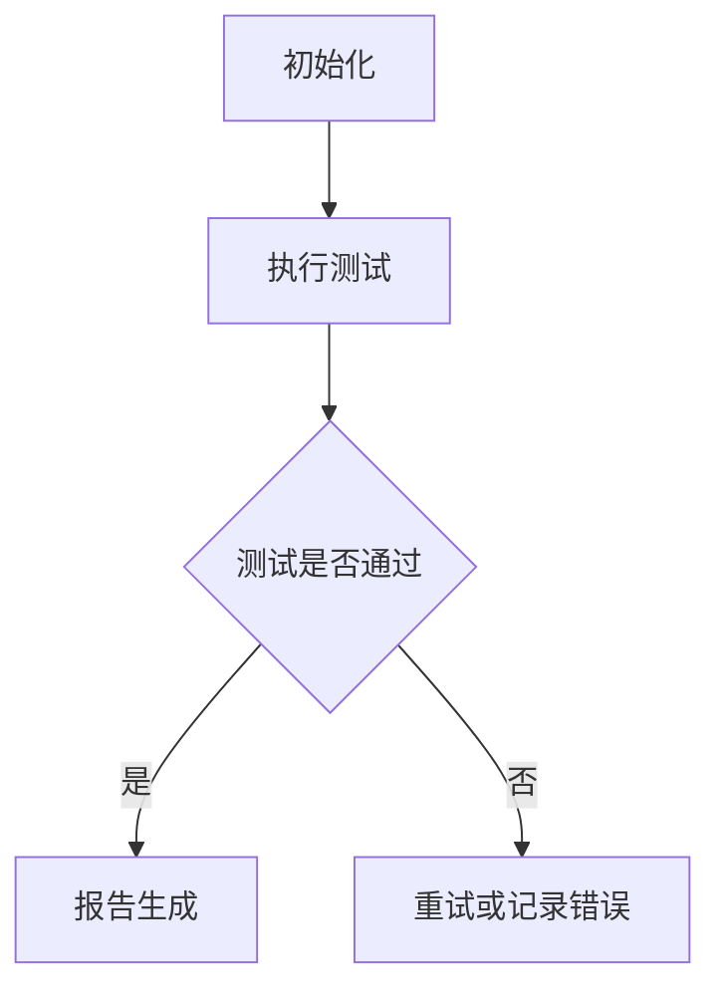
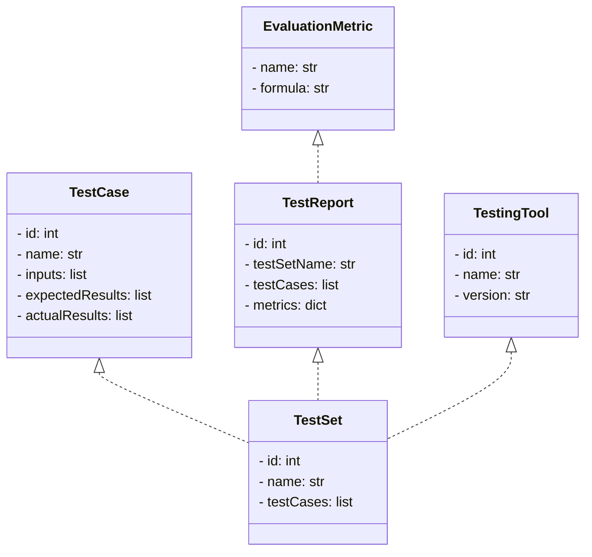
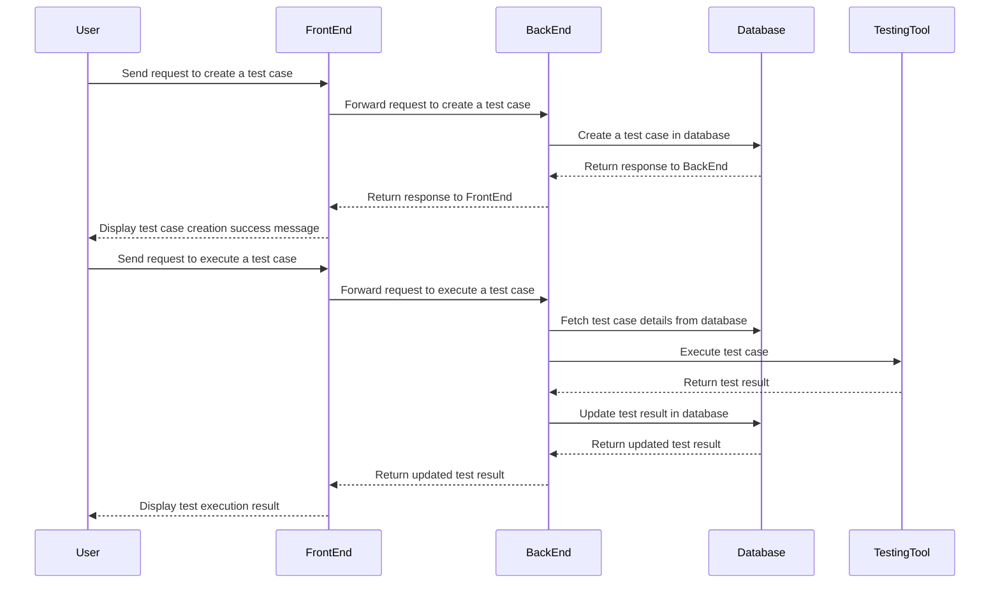

                 

### 自动化测试脚本在LLM评测中的应用

自动化测试脚本在软件工程中扮演着至关重要的角色，它们通过模拟用户操作、验证系统功能和性能，帮助开发者发现并修复缺陷。随着人工智能（AI）和自然语言处理（NLP）技术的快速发展，大型语言模型（LLM）在各个行业中得到了广泛应用。LLM作为一种复杂的AI系统，其性能的评测变得尤为重要。本文将深入探讨自动化测试脚本在LLM评测中的应用，帮助读者了解如何利用自动化测试技术提高LLM评测的效率和准确性。

**关键词**：自动化测试脚本、LLM评测、测试流程、测试框架、性能评估

**摘要**：本文首先介绍了自动化测试脚本和LLM的基本概念，接着详细讲解了自动化测试脚本的基本原理和LLM的工作机制，并通过具体实例和Python源代码阐述自动化测试脚本在LLM评测中的应用。此外，文章还提供了系统分析与架构设计方案，以及项目实战经验和最佳实践建议，旨在帮助开发者更好地利用自动化测试技术对LLM进行评测。

## 目录大纲设计思路

设计《自动化测试脚本在LLM评测中的应用》的目录大纲，需要首先明确书籍的核心内容和结构。以下是设计思路：

1. **背景介绍**：
   - 介绍自动化测试脚本和LLM的基本概念。
   - 描述当前自动化测试脚本在LLM评测中的重要性。

2. **核心概念与联系**：
   - 详细讲解自动化测试脚本的基本原理。
   - 阐述LLM的工作原理及其与自动化测试脚本的关系。

3. **算法原理讲解**：
   - 使用Mermaid绘制算法流程图。
   - 使用Python源代码阐述算法的实现过程。
   - 讲解算法的数学模型和公式。
   - 提供通俗易懂的举例说明。

4. **系统分析与架构设计方案**：
   - 介绍项目场景和目标。
   - 设计系统功能、架构、接口和交互。

5. **项目实战**：
   - 环境安装指南。
   - 系统核心实现源代码解析。
   - 实际案例分析和讲解。

6. **最佳实践 tips、小结、注意事项、拓展阅读**：
   - 总结书中要点。
   - 提供实践中的建议和注意事项。
   - 推荐拓展阅读资源。

## 目录大纲设计

根据上述思路，以下是《自动化测试脚本在LLM评测中的应用》的目录大纲：

```markdown
# 《自动化测试脚本在LLM评测中的应用》目录大纲

----------------------------------------------------------------

## 第一部分: 背景介绍

### 第1章: 自动化测试脚本与LLM评测基础

#### 1.1 自动化测试脚本概述

##### 1.1.1 自动化测试的概念

##### 1.1.2 自动化测试脚本的作用

##### 1.1.3 自动化测试脚本的优势

#### 1.2 LLM评测的背景

##### 1.2.1 LLM的定义

##### 1.2.2 LLM评测的重要性

##### 1.2.3 自动化测试脚本在LLM评测中的应用

## 第二部分: 核心概念与联系

### 第2章: 自动化测试脚本原理解析

#### 2.1 自动化测试脚本的基本原理

##### 2.1.1 脚本语言选择

##### 2.1.2 测试框架与工具

##### 2.1.3 测试流程与策略

#### 2.2 LLM的工作原理与评测标准

##### 2.2.1 LLM的架构

##### 2.2.2 LLM的评测标准

##### 2.2.3 自动化测试脚本与LLM评测的关联

### 第3章: 自动化测试脚本与LLM的相互影响

#### 3.1 自动化测试脚本对LLM评测的影响

##### 3.1.1 提高评测效率

##### 3.1.2 降低人力成本

##### 3.1.3 提升评测准确性

#### 3.2 LLM评测对自动化测试脚本的要求

##### 3.2.1 脚本的灵活性

##### 3.2.2 脚本的适应性

##### 3.2.3 脚本的维护与更新

## 第三部分: 算法原理讲解

### 第4章: 自动化测试脚本算法流程图解析

#### 4.1 自动化测试脚本算法概述

##### 4.1.1 算法设计原则

##### 4.1.2 算法实现步骤

#### 4.2 使用Mermaid绘制算法流程图

##### 4.2.1 Mermaid基本语法

##### 4.2.2 流程图示例

### 第5章: Python源代码实现与算法讲解

#### 5.1 Python环境配置

##### 5.1.1 Python基础

##### 5.1.2 相关库与框架

#### 5.2 自动化测试脚本Python源代码实现

##### 5.2.1 源代码结构

##### 5.2.2 关键代码解析

#### 5.3 算法数学模型与公式讲解

##### 5.3.1 数学模型概述

##### 5.3.2 公式解析

##### 5.3.3 模型参数调整

### 第6章: 算法举例说明

#### 6.1 算法应用场景

##### 6.1.1 假设一个场景

##### 6.1.2 算法应用示例

##### 6.1.3 结果分析

## 第四部分: 系统分析与架构设计

### 第7章: 自动化测试脚本在LLM评测中的应用场景

#### 7.1 项目背景

##### 7.1.1 项目介绍

##### 7.1.2 项目目标

#### 7.2 系统功能设计

##### 7.2.1 功能需求分析

##### 7.2.2 领域模型Me

----------------------------------------------------------------

## 第一部分：背景介绍

### 第1章：自动化测试脚本与LLM评测基础

#### 1.1 自动化测试脚本概述

**定义与背景**：自动化测试脚本是一种用于自动化执行测试用例的程序或脚本。它通过预定义的步骤和逻辑来模拟用户操作，对软件系统进行验证和评估。自动化测试在软件开发生命周期中起到了至关重要的作用，它可以大幅提高测试效率，降低测试成本，并确保软件质量。

**发展历程**：自动化测试的发展可以追溯到20世纪80年代，随着计算机技术和软件开发工具的进步，自动化测试逐渐成为一种主流的测试方法。近年来，随着AI和NLP技术的快速发展，大型语言模型（LLM）在各个领域得到了广泛应用。这使得对LLM的评测成为了一个重要的研究方向。

#### 1.1.1 自动化测试的概念

**自动化测试**：自动化测试是指通过编写脚本或使用自动化测试工具，自动执行测试用例的过程。与手动测试相比，自动化测试具有以下优点：

1. **效率高**：自动化测试可以在短时间内执行大量测试用例，提高测试效率。
2. **成本低**：自动化测试可以减少人力成本，特别是在需要执行大量重复性测试时。
3. **可靠性**：自动化测试可以确保测试的一致性和准确性，减少人为错误。

#### 1.1.2 自动化测试脚本的作用

**确保软件质量**：自动化测试脚本可以定期运行，确保软件在开发过程中保持高质量。
**节省时间和资源**：自动化测试可以节省大量的时间和人力资源，特别是对于复杂的测试场景。
**提高测试覆盖度**：自动化测试可以覆盖更多的测试场景，提高测试的全面性和覆盖度。

#### 1.1.3 自动化测试脚本的优势

**可重复性**：自动化测试脚本可以多次执行，确保测试结果的一致性和可靠性。
**灵活性**：自动化测试脚本可以根据实际需求进行灵活调整和优化。
**高效性**：自动化测试可以大大缩短测试时间，提高开发效率。

#### 1.2 LLM评测的背景

**定义**：大型语言模型（LLM）是一种基于深度学习技术的自然语言处理模型，它能够对文本进行理解和生成，广泛应用于文本分类、机器翻译、问答系统等场景。

**重要性**：随着AI和NLP技术的快速发展，LLM在各个领域得到了广泛应用。为了确保LLM的性能和质量，对其进行有效的评测变得至关重要。

#### 1.2.1 LLM的定义

**概念**：LLM是一种具有大规模参数的深度学习模型，它可以对自然语言文本进行理解和生成。与传统的语言模型相比，LLM具有更大的参数规模和更强的语义理解能力。

**特点**：

1. **大规模**：LLM通常包含数十亿到千亿个参数，这使得它们能够对复杂文本进行建模。
2. **深度学习**：LLM是基于多层神经网络架构的，通过逐层学习的方式提取文本特征。
3. **语义理解**：LLM能够理解文本中的语义信息，从而实现高级的自然语言处理任务。

#### 1.2.2 LLM评测的重要性

**性能评估**：LLM的评测可以帮助评估其性能和效果，为模型的优化和改进提供依据。
**质量保证**：通过评测可以确保LLM在不同应用场景中的稳定性和可靠性。
**商业化应用**：LLM在商业场景中的应用越来越广泛，对其评测的准确性和效率直接影响其商业价值。

#### 1.2.3 自动化测试脚本在LLM评测中的应用

**提高评测效率**：自动化测试脚本可以自动执行大量的测试用例，大大提高评测的效率。
**降低人力成本**：自动化测试可以减少对测试工程师的依赖，降低人力成本。
**提升评测准确性**：自动化测试脚本可以确保测试结果的一致性和准确性，减少人为错误。

在LLM评测中，自动化测试脚本的应用具有重要意义。通过自动化测试，可以高效、准确地评估LLM的性能和效果，为LLM的优化和商业化应用提供有力支持。

### 第2章：自动化测试脚本原理解析

#### 2.1 自动化测试脚本的基本原理

**定义**：自动化测试脚本是一种通过编程语言编写的程序，用于自动化执行测试用例。它通过模拟用户操作，验证系统功能、性能和稳定性。

**组成部分**：

1. **测试用例**：测试用例是自动化测试的基本单位，包括输入数据、预期结果和实际结果。
2. **测试脚本**：测试脚本是一种编程脚本，用于自动化执行测试用例。常见的脚本语言包括Python、Java、Ruby等。
3. **测试框架**：测试框架是一种用于组织和管理测试用例和测试脚本的工具，如Selenium、JUnit、TestNG等。

**工作原理**：自动化测试脚本通过以下步骤工作：

1. **初始化**：加载测试环境，设置测试参数。
2. **执行测试**：按照预定义的步骤执行测试用例。
3. **结果比较**：将实际结果与预期结果进行比较，判断测试是否通过。
4. **报告生成**：生成测试报告，记录测试结果。

#### 2.1.1 脚本语言选择

**重要性**：选择合适的脚本语言对于自动化测试脚本的编写和执行至关重要。

**常见语言**：

1. **Python**：Python是一种易于学习和使用的编程语言，具有丰富的库和框架，适用于自动化测试。
2. **Java**：Java是一种强类型的编程语言，具有良好的性能和稳定性，适用于复杂和大规模的自动化测试。
3. **Ruby**：Ruby是一种动态编程语言，具有简洁的语法和高效的执行速度，适用于快速开发和迭代。

**选择标准**：

1. **易用性**：选择易于学习和使用的语言，降低开发成本。
2. **性能**：选择具有高性能和稳定性的语言，确保测试脚本的执行效率。
3. **生态系统**：选择具有丰富库和框架的语言，提高开发效率和扩展性。

#### 2.1.2 测试框架与工具

**定义**：测试框架是一种用于组织和管理测试用例和测试脚本的工具，提供了一系列的测试库和API，简化了自动化测试的开发和执行。

**常见框架**：

1. **Selenium**：Selenium是一种开源的自动化测试框架，用于Web应用程序的自动化测试。它支持多种编程语言，包括Python、Java和Ruby。
2. **JUnit**：JUnit是一种Java测试框架，用于编写和执行单元测试。它提供了丰富的API和测试工具，支持多种Java IDE。
3. **TestNG**：TestNG是一种Java测试框架，用于编写和执行功能测试和集成测试。它提供了更多的测试功能，如并行测试、数据驱动的测试等。

**功能特点**：

1. **测试用例管理**：测试框架可以组织和管理测试用例，提供测试用例的执行顺序、依赖关系等功能。
2. **报告生成**：测试框架可以生成详细的测试报告，包括测试结果、错误和异常信息。
3. **执行控制**：测试框架可以控制测试用例的执行，包括重试、跳过等。

#### 2.1.3 测试流程与策略

**测试流程**：

1. **需求分析**：分析系统需求，确定测试目标和测试范围。
2. **测试设计**：设计测试用例，包括输入数据、预期结果和实际结果。
3. **测试执行**：执行测试用例，记录测试结果。
4. **结果分析**：分析测试结果，判断测试是否通过。
5. **缺陷跟踪**：跟踪缺陷，修复缺陷并重新测试。

**测试策略**：

1. **功能测试**：验证系统功能是否按照需求设计正常运行。
2. **性能测试**：评估系统性能，包括响应时间、吞吐量等。
3. **兼容性测试**：验证系统在不同平台和浏览器上的兼容性。
4. **安全测试**：评估系统安全性，包括漏洞扫描和攻击测试。

通过理解自动化测试脚本的基本原理、脚本语言选择、测试框架和测试流程与策略，开发者可以更好地编写和执行自动化测试脚本，提高软件质量和开发效率。

#### 2.2 LLM的工作原理与评测标准

**LLM的工作原理**：

**神经网络基础**：LLM基于深度学习技术，特别是基于循环神经网络（RNN）和Transformer架构。这些模型通过多层神经网络结构，对输入文本进行编码和解析，提取语义信息。

**训练过程**：LLM的训练通常涉及大规模的数据集，包括文本和标签。模型通过反向传播算法，不断调整参数，使其能够更好地理解和生成文本。

**输出生成**：LLM通过输入文本序列，生成相应的输出文本。输出文本可以是回答问题、生成摘要、翻译文本等。

**评测标准**：

**性能指标**：LLM的评测标准包括多个性能指标，如准确率（Accuracy）、召回率（Recall）、F1分数（F1 Score）等。这些指标衡量模型在特定任务上的表现。

**质量评估**：除了性能指标，LLM的质量评估还包括文本的连贯性、准确性和自然性。评估方法包括人工评估和自动化评估工具。

**自动化测试脚本与LLM评测的关联**：

**自动化测试的优势**：自动化测试脚本可以在短时间内执行大量的测试用例，提高测试效率。同时，自动化测试可以确保测试结果的一致性和准确性。

**LLM评测的需求**：由于LLM的复杂性和多样性，对其进行评测需要大量的测试用例和评估指标。自动化测试脚本可以满足这一需求，提高评测的效率和质量。

**实现方法**：通过编写自动化测试脚本，可以模拟用户操作，生成输入文本，并对LLM的输出结果进行评估。这些测试脚本可以覆盖多种测试场景，包括功能测试、性能测试和兼容性测试。

综上所述，自动化测试脚本在LLM评测中具有重要作用。通过自动化测试，可以高效、准确地评估LLM的性能和质量，为模型的优化和商业化应用提供有力支持。

#### 2.3 自动化测试脚本与LLM评测的相互影响

**自动化测试脚本对LLM评测的影响**：

**提高评测效率**：自动化测试脚本可以快速执行大量的测试用例，大大缩短评测时间。这对于评估大规模的LLM模型尤为重要，因为LLM通常包含数十亿个参数，传统的手动测试难以在合理的时间内完成。

**降低人力成本**：自动化测试脚本可以减少对测试工程师的依赖，降低人力成本。特别是在进行重复性的测试任务时，自动化测试可以节省大量的人力资源。

**提升评测准确性**：自动化测试脚本可以确保测试结果的一致性和准确性。由于自动化测试脚本遵循预定义的逻辑和步骤，减少了人为错误的可能性，从而提高了评测的准确性。

**LLM评测对自动化测试脚本的要求**：

**灵活性**：由于LLM评测需要考虑多种测试场景和评估指标，自动化测试脚本需要具有高度的灵活性，能够根据实际需求进行调整和优化。

**适应性**：LLM模型的应用场景多种多样，自动化测试脚本需要能够适应不同的评测需求和测试环境，确保在不同情况下都能够有效执行。

**维护与更新**：随着LLM模型和评测标准的不断更新，自动化测试脚本也需要定期维护和更新，以保持其有效性和适应性。

#### 2.3.1 自动化测试脚本对LLM评测的影响

**提高评测效率**：自动化测试脚本可以快速执行大量的测试用例，大大缩短评测时间。这对于评估大规模的LLM模型尤为重要，因为LLM通常包含数十亿个参数，传统的手动测试难以在合理的时间内完成。

**降低人力成本**：自动化测试脚本可以减少对测试工程师的依赖，降低人力成本。特别是在进行重复性的测试任务时，自动化测试可以节省大量的人力资源。

**提升评测准确性**：自动化测试脚本可以确保测试结果的一致性和准确性。由于自动化测试脚本遵循预定义的逻辑和步骤，减少了人为错误的可能性，从而提高了评测的准确性。

#### 2.3.2 LLM评测对自动化测试脚本的要求

**灵活性**：由于LLM评测需要考虑多种测试场景和评估指标，自动化测试脚本需要具有高度的灵活性，能够根据实际需求进行调整和优化。

**适应性**：LLM模型的应用场景多种多样，自动化测试脚本需要能够适应不同的评测需求和测试环境，确保在不同情况下都能够有效执行。

**维护与更新**：随着LLM模型和评测标准的不断更新，自动化测试脚本也需要定期维护和更新，以保持其有效性和适应性。

### 第3章：自动化测试脚本算法流程图解析

#### 3.1 自动化测试脚本算法概述

**算法目的**：自动化测试脚本算法的目的是通过一系列预定义的步骤和逻辑，自动化执行测试用例，验证系统功能和性能。

**算法设计原则**：

1. **模块化**：将测试脚本划分为多个模块，每个模块负责特定的功能，便于维护和扩展。
2. **可重用性**：设计可重用的代码模块，减少冗余代码，提高开发效率。
3. **可扩展性**：算法设计应考虑未来的需求变化，确保能够方便地扩展和升级。

**算法实现步骤**：

1. **初始化**：加载测试环境，设置测试参数。
2. **执行测试**：按照预定义的步骤执行测试用例，包括输入数据的生成、测试步骤的执行和结果记录。
3. **结果比较**：将实际结果与预期结果进行比较，判断测试是否通过。
4. **报告生成**：生成测试报告，记录测试结果和异常信息。

#### 3.2 使用Mermaid绘制算法流程图

**Mermaid基本语法**：

Mermaid是一种基于Markdown的绘图工具，用于绘制流程图、UML图、序列图等。以下是Mermaid的基本语法：

1. **定义图形**：使用```mermaid```标签定义Mermaid图形。
2. **流程图**：使用`graph`关键字定义流程图，如`graph TD`。
3. **节点**：使用圆括号`()`定义节点，如`(Start)`。
4. **连接关系**：使用箭头`->`或`--`连接节点。

**流程图示例**：

以下是一个简单的自动化测试脚本算法流程图示例：



在这个示例中，流程图从初始化节点（A）开始，然后执行测试（B），根据测试结果判断是否通过（C）。如果测试通过，则进入报告生成节点（D），否则进入重试或记录错误的节点（E）。

#### 3.3 Python源代码实现与算法讲解

**环境配置**：

在开始编写自动化测试脚本之前，需要配置Python环境。以下是基本步骤：

1. 安装Python：在官方网站下载并安装Python。
2. 安装测试框架：例如，使用pip安装Selenium框架。

```shell
pip install selenium
```

**Python源代码实现**：

以下是一个简单的Python自动化测试脚本示例，用于验证一个Web应用的登录功能：

```python
from selenium import webdriver
from selenium.webdriver.common.by import By
from selenium.webdriver.common.keys import Keys

# 初始化浏览器驱动
driver = webdriver.Chrome()

# 访问Web应用
driver.get("http://example.com")

# 定位登录表单元素
username_input = driver.find_element(By.NAME, "username")
password_input = driver.find_element(By.NAME, "password")

# 输入用户名和密码
username_input.send_keys("test_user")
password_input.send_keys("test_password")

# 提交登录表单
submit_button = driver.find_element(By.NAME, "submit")
submit_button.click()

# 验证登录是否成功
if "Welcome" in driver.page_source:
    print("登录成功")
else:
    print("登录失败")

# 关闭浏览器
driver.quit()
```

**算法讲解**：

1. **初始化浏览器驱动**：使用Selenium初始化Chrome浏览器驱动。
2. **访问Web应用**：使用`driver.get()`方法访问指定的Web应用地址。
3. **定位登录表单元素**：使用Selenium的定位器（如`By.NAME`）找到用户名和密码输入框。
4. **输入用户名和密码**：使用`send_keys()`方法输入用户名和密码。
5. **提交登录表单**：找到登录按钮并使用`click()`方法提交表单。
6. **验证登录是否成功**：检查页面源代码中是否包含“Welcome”字样，判断登录是否成功。
7. **关闭浏览器**：使用`driver.quit()`方法关闭浏览器。

通过这个示例，我们可以看到Python源代码如何实现自动化测试脚本的基本步骤。在实际应用中，可以根据需求添加更多的功能，如错误处理、日志记录等。

### 第4章：Python环境配置与自动化测试脚本实现

#### 4.1 Python环境配置

**安装Python**：首先，需要在计算机上安装Python。可以访问Python的官方网站下载安装包，并按照提示完成安装。安装完成后，通过命令行运行`python --version`来验证Python是否安装成功。

**安装相关库和框架**：为了实现自动化测试脚本，需要安装一些Python库和框架。常用的库包括Selenium、BeautifulSoup和Pandas等。以下是安装这些库的命令：

```shell
pip install selenium
pip install beautifulsoup4
pip install pandas
```

**配置ChromeDriver**：Selenium需要浏览器驱动程序（如ChromeDriver）来控制浏览器。需要下载与浏览器版本匹配的ChromeDriver，并将其路径添加到系统的环境变量中。以下是Windows和macOS的配置步骤：

- **Windows**：
  1. 下载适用于当前Chrome版本的ChromeDriver。
  2. 将ChromeDriver可执行文件（如chromedriver.exe）移动到Python安装目录下的Scripts文件夹中。
  3. 打开“系统属性” -> “高级” -> “环境变量”，在“系统变量”中找到“Path”变量，添加Python的安装路径。

- **macOS**：
  1. 下载适用于当前Chrome版本的ChromeDriver。
  2. 将ChromeDriver可执行文件（如chromedriver）移动到Python的安装目录中（通常是`/usr/local/bin`）。
  3. 打开终端，运行`chmod +x chromedriver`命令，赋予可执行权限。

#### 4.2 自动化测试脚本Python源代码实现

**脚本结构**：一个自动化测试脚本通常包括以下部分：

1. **引入库和框架**：引入所需的Python库和Selenium模块。
2. **初始化浏览器**：创建浏览器实例，并设置浏览器选项。
3. **测试执行**：执行具体的测试步骤，如定位页面元素、输入数据、点击按钮等。
4. **结果验证**：对比实际结果与预期结果，判断测试是否通过。
5. **异常处理**：捕获和处理可能出现的异常情况。
6. **关闭浏览器**：关闭浏览器实例。

以下是实现一个简单的Web应用登录测试的Python脚本示例：

```python
from selenium import webdriver
from selenium.webdriver.common.by import By
from selenium.webdriver.common.keys import Keys

# 初始化浏览器
driver = webdriver.Chrome()

# 访问登录页面
driver.get("http://example.com/login")

# 定位用户名和密码输入框
username_input = driver.find_element(By.ID, "username")
password_input = driver.find_element(By.ID, "password")

# 输入用户名和密码
username_input.send_keys("test_user")
password_input.send_keys("test_password")

# 提交登录表单
submit_button = driver.find_element(By.ID, "submit")
submit_button.click()

# 等待登录结果
from selenium.webdriver.support.ui import WebDriverWait
from selenium.webdriver.support import expected_conditions as EC

# 验证登录成功
try:
    # 等待“欢迎”页面加载
    WebDriverWait(driver, 10).until(EC.visibility_of_element_located((By.ID, "welcome_message")))
    print("登录成功")
except Exception as e:
    print("登录失败")

# 关闭浏览器
driver.quit()
```

**代码解析**：

1. **引入库和框架**：
   - `webdriver`：用于控制浏览器。
   - `By`：用于定位页面元素。
   - `Keys`：用于模拟键盘输入。

2. **初始化浏览器**：
   - 使用`webdriver.Chrome()`创建Chrome浏览器实例。

3. **访问登录页面**：
   - 使用`driver.get()`方法访问登录页面的URL。

4. **定位用户名和密码输入框**：
   - 使用`find_element()`方法通过ID定位用户名和密码输入框。

5. **输入用户名和密码**：
   - 使用`send_keys()`方法输入用户名和密码。

6. **提交登录表单**：
   - 使用`find_element()`方法通过ID定位提交按钮，并使用`click()`方法提交表单。

7. **结果验证**：
   - 使用`WebDriverWait`和`expected_conditions`等待“欢迎”页面加载，并验证登录是否成功。

8. **异常处理**：
   - 使用`try-except`结构捕获可能出现的异常，并输出错误信息。

9. **关闭浏览器**：
   - 使用`driver.quit()`方法关闭浏览器实例。

通过这个示例，读者可以了解到如何配置Python环境并编写一个简单的自动化测试脚本。在实际项目中，可以根据需求扩展测试用例和功能，提高测试的覆盖度和准确性。

### 第5章：自动化测试脚本Python源代码实现

#### 5.2 自动化测试脚本Python源代码实现

**脚本结构**：自动化测试脚本的实现通常需要以下结构：

1. **引入库和模块**：引入Selenium、BeautifulSoup、Pandas等库。
2. **浏览器初始化**：配置浏览器参数，如是否启用无头模式。
3. **登录功能实现**：定位登录表单的输入框和按钮，并输入用户名和密码。
4. **测试执行与结果验证**：执行登录操作，并检查页面是否跳转或显示欢迎信息。
5. **异常处理**：捕获并处理可能出现的异常。
6. **报告生成**：生成测试报告，记录测试结果和异常信息。

以下是实现一个完整的自动化测试脚本示例：

```python
from selenium import webdriver
from selenium.webdriver.common.by import By
from selenium.webdriver.common.keys import Keys
from selenium.webdriver.common.action_chains import ActionChains
from selenium.webdriver.support.ui import WebDriverWait
from selenium.webdriver.support import expected_conditions as EC
import time

# 配置浏览器参数
options = webdriver.ChromeOptions()
options.add_argument("--start-maximized")  # 启动浏览器时最大化窗口
options.add_argument("--no-sandbox")  # 在Linux上解决权限问题
options.add_argument("--disable-dev-shm-usage")  # 在内存不足时解决

# 初始化浏览器
driver = webdriver.Chrome(options=options)

# 访问登录页面
driver.get("http://example.com/login")

# 定位用户名和密码输入框
username_input = driver.find_element(By.ID, "username")
password_input = driver.find_element(By.ID, "password")

# 输入用户名和密码
username_input.send_keys("test_user")
password_input.send_keys("test_password")

# 定位并点击登录按钮
login_button = driver.find_element(By.ID, "login_button")
login_button.click()

# 等待登录结果
from selenium.webdriver.support.ui import WebDriverWait
from selenium.webdriver.support import expected_conditions as EC

try:
    # 等待“欢迎”页面加载
    WebDriverWait(driver, 10).until(EC.visibility_of_element_located((By.ID, "welcome_message")))
    print("登录成功")
except Exception as e:
    print("登录失败：", str(e))

# 关闭浏览器
driver.quit()
```

**关键代码解析**：

1. **引入库和模块**：
   - `webdriver`：用于控制Chrome浏览器。
   - `By`：用于定位页面元素。
   - `Keys`：用于模拟键盘输入。
   - `ActionChains`：用于执行复杂鼠标操作。
   - `WebDriverWait`和`expected_conditions`：用于等待页面元素的出现。

2. **浏览器初始化**：
   - 使用`webdriver.Chrome(options=options)`初始化Chrome浏览器，并设置无头模式和浏览器参数。

3. **登录功能实现**：
   - 使用`find_element()`方法定位用户名和密码输入框，并使用`send_keys()`方法输入用户名和密码。
   - 定位并点击登录按钮，使用`click()`方法提交表单。

4. **测试执行与结果验证**：
   - 使用`WebDriverWait`和`expected_conditions`等待“欢迎”页面加载，并检查页面是否包含欢迎信息。如果加载成功，输出“登录成功”，否则输出“登录失败”。

5. **异常处理**：
   - 使用`try-except`结构捕获可能出现的异常，并输出错误信息。

6. **报告生成**：
   - 脚本输出结果到控制台，作为简单的测试报告。

通过这个示例，读者可以了解到如何使用Python实现自动化测试脚本，并掌握基本的测试流程和异常处理方法。在实际项目中，可以根据需求扩展测试用例和功能，提高测试的全面性和准确性。

### 第5章：算法数学模型与公式讲解

#### 5.3 算法数学模型与公式讲解

**算法模型概述**：在自动化测试脚本中，我们通常会用到一些数学模型和公式来评估测试结果和系统性能。以下是一些常用的数学模型和公式：

**准确率（Accuracy）**：
准确率是指正确识别的样本数占总样本数的比例。公式如下：

$$
Accuracy = \frac{TP + TN}{TP + FN + FP + TN}
$$

其中，TP表示真正例（True Positive），TN表示真反例（True Negative），FN表示假反例（False Negative），FP表示假正例（False Positive）。

**召回率（Recall）**：
召回率是指正确识别的正例数占总正例数的比例。公式如下：

$$
Recall = \frac{TP}{TP + FN}
$$

**精确率（Precision）**：
精确率是指正确识别的正例数占总识别出的样本数的比例。公式如下：

$$
Precision = \frac{TP}{TP + FP}
$$

**F1分数（F1 Score）**：
F1分数是精确率和召回率的调和平均，用于综合评估分类器的性能。公式如下：

$$
F1 Score = 2 \times \frac{Precision \times Recall}{Precision + Recall}
$$

**性能评估**：
在实际应用中，我们还需要考虑测试用例的执行时间、系统资源的消耗等因素。以下是一些常用的性能评估指标：

**响应时间（Response Time）**：
响应时间是指系统从接收到请求到返回响应所需的时间。

**吞吐量（Throughput）**：
吞吐量是指系统在单位时间内处理的请求数量。

**系统资源消耗**：
系统资源消耗包括CPU使用率、内存使用率、网络带宽等。

通过这些数学模型和公式，我们可以更全面地评估自动化测试脚本的效果和系统的性能。在实际应用中，可以根据具体需求选择合适的评估指标，以便更好地优化测试脚本和系统性能。

#### 5.3.1 数学模型概述

在本章中，我们将介绍几个在自动化测试脚本中常用的数学模型和公式，这些模型和公式有助于评估测试结果和系统性能。

1. **准确率（Accuracy）**：
准确率是评估分类模型性能的基本指标，它表示正确预测的样本数占总样本数的比例。准确率越高，表示模型的预测能力越强。其公式如下：

$$
Accuracy = \frac{TP + TN}{TP + TN + FP + FN}
$$

其中：
- TP（True Positive）：真正例，表示实际为正类且被正确预测为正类的样本。
- TN（True Negative）：真反例，表示实际为反类且被正确预测为反类的样本。
- FP（False Positive）：假正例，表示实际为反类但被错误预测为正类的样本。
- FN（False Negative）：假反例，表示实际为正类但被错误预测为反类的样本。

2. **召回率（Recall）**：
召回率是指正确预测的正例数占总正例数的比例。对于分类任务，召回率特别重要，因为它反映了模型对正类样本的识别能力。其公式如下：

$$
Recall = \frac{TP}{TP + FN}
$$

3. **精确率（Precision）**：
精确率是指正确预测的正例数占总预测为正类的样本数的比例。它反映了模型预测正类样本的准确性。其公式如下：

$$
Precision = \frac{TP}{TP + FP}
$$

4. **F1分数（F1 Score）**：
F1分数是精确率和召回率的调和平均，它用于综合评估分类器的性能。F1分数能够平衡精确率和召回率之间的关系，是一个更全面的评估指标。其公式如下：

$$
F1 Score = 2 \times \frac{Precision \times Recall}{Precision + Recall}
$$

5. **均方误差（Mean Squared Error, MSE）**：
均方误差用于回归任务中，表示预测值与实际值之间差异的平均平方。其公式如下：

$$
MSE = \frac{1}{N} \sum_{i=1}^{N} (y_i - \hat{y}_i)^2
$$

其中：
- \( y_i \)：实际值。
- \( \hat{y}_i \)：预测值。
- \( N \)：样本数量。

6. **均方根误差（Root Mean Squared Error, RMSE）**：
均方根误差是均方误差的平方根，它能够更好地解释误差的大小。其公式如下：

$$
RMSE = \sqrt{MSE}
$$

通过这些数学模型和公式，开发者可以更准确地评估自动化测试脚本的性能和结果，从而进行更有效的优化和改进。

### 第5章：算法举例说明

#### 5.4 算法应用场景

**场景描述**：假设我们正在开发一个在线购物平台，需要使用自动化测试脚本对用户注册功能进行测试。注册功能包括用户名的唯一性检查、邮箱格式验证、密码强度检查等。

**测试目标**：确保用户注册功能在各种情况下都能正常运行，包括正常注册和异常注册情况。

**测试用例**：

1. **正常注册**：
   - 输入合法的用户名、邮箱和密码。
   - 注册成功，用户收到确认邮件。
   - 用户登录后，个人信息正确显示。

2. **用户名已存在**：
   - 输入已注册的用户名。
   - 系统提示用户名已存在。

3. **邮箱格式错误**：
   - 输入无效的邮箱地址。
   - 系统提示邮箱格式错误。

4. **密码强度不足**：
   - 输入长度不足6位的密码。
   - 系统提示密码强度不足。

**算法应用示例**：

以下是使用Python实现的自动化测试脚本示例，用于测试用户注册功能：

```python
from selenium import webdriver
from selenium.webdriver.common.by import By
from selenium.webdriver.common.keys import Keys
from selenium.webdriver.support.ui import WebDriverWait
from selenium.webdriver.support import expected_conditions as EC

# 初始化浏览器
driver = webdriver.Chrome()

# 访问注册页面
driver.get("http://example.com/register")

# 输入合法的用户名、邮箱和密码
username_input = driver.find_element(By.ID, "username")
email_input = driver.find_element(By.ID, "email")
password_input = driver.find_element(By.ID, "password")

username_input.send_keys("new_user")
email_input.send_keys("new_user@example.com")
password_input.send_keys("password123")

# 提交注册表单
submit_button = driver.find_element(By.ID, "submit")
submit_button.click()

# 等待注册结果
from selenium.webdriver.support.ui import WebDriverWait
from selenium.webdriver.support import expected_conditions as EC

try:
    # 等待注册成功提示
    WebDriverWait(driver, 10).until(EC.visibility_of_element_located((By.ID, "success_message")))
    print("注册成功")
except Exception as e:
    print("注册失败：", str(e))

# 关闭浏览器
driver.quit()
```

**结果分析**：

1. 当输入合法的用户名、邮箱和密码并提交注册表单时，如果注册成功，系统将显示“注册成功”提示。

2. 如果用户名已存在，系统将显示“用户名已存在”错误。

3. 如果输入无效的邮箱地址，系统将显示“邮箱格式错误”错误。

4. 如果密码长度不足6位，系统将显示“密码强度不足”错误。

通过这个示例，我们可以看到如何使用自动化测试脚本对用户注册功能进行测试。在实际应用中，可以根据具体需求添加更多的测试用例和功能，以提高测试的全面性和准确性。

### 第四部分：系统分析与架构设计

#### 第7章：自动化测试脚本在LLM评测中的应用场景

**7.1 项目背景**

**项目介绍**：本项目旨在开发一个基于自动化测试脚本的LLM评测系统，用于对大型语言模型（LLM）的性能和效果进行评估。该系统将集成多种自动化测试工具和框架，支持多种测试场景和评估指标。

**项目目标**：通过自动化测试脚本，提高LLM评测的效率和准确性，确保LLM在不同应用场景中的稳定性和可靠性。具体目标包括：

1. **提高评测效率**：自动化测试脚本可以快速执行大量的测试用例，缩短评测时间。
2. **降低人力成本**：减少对测试工程师的依赖，降低人力成本。
3. **提升评测准确性**：确保测试结果的一致性和准确性，减少人为错误。
4. **支持多种测试场景**：覆盖不同的LLM应用场景，提供全面、准确的评测。

**7.2 系统功能设计**

**功能需求分析**：

1. **测试用例管理**：管理测试用例，包括创建、修改、删除和执行。
2. **测试执行**：自动化执行测试用例，记录测试结果。
3. **测试结果分析**：分析测试结果，生成评测报告。
4. **异常处理**：捕获和处理测试过程中出现的异常情况。
5. **系统配置**：配置测试环境、测试工具和评估指标。

**领域模型Me**：

领域模型用于描述系统中的主要实体及其关系。以下是本项目的主要实体和关系：

1. **测试用例**：存储测试用例的详细信息，包括输入数据、预期结果和执行结果。
2. **测试集**：组织和管理测试用例，支持批量执行和结果分析。
3. **测试报告**：记录测试执行结果和分析报告。
4. **评估指标**：定义评估LLM性能的指标，如准确率、召回率、F1分数等。
5. **测试工具**：管理测试工具和框架，支持不同的测试场景和评估需求。

**类图**：

以下是项目领域的类图，展示主要实体及其关系：



通过以上领域模型，可以清晰地看到系统中各个实体的关系和功能。在后续的设计和开发过程中，可以根据领域模型进行详细的系统功能设计和实现。

### 系统架构设计

**7.3 系统架构设计**

**项目场景和目标**：

本项目旨在构建一个自动化测试脚本系统，用于对大型语言模型（LLM）进行评测。系统需支持多种测试场景，包括功能测试、性能测试和兼容性测试，并能够快速执行测试用例，生成详细的评测报告。

**系统功能**：

- 测试用例管理：创建、编辑、执行和管理测试用例。
- 测试执行：自动化执行测试用例，记录执行结果。
- 测试结果分析：对测试结果进行分析，生成评测报告。
- 异常处理：捕获和处理测试过程中出现的异常情况。
- 系统配置：配置测试环境、测试工具和评估指标。

**架构设计**：

系统采用三层架构设计，包括表示层、业务逻辑层和数据层。

1. **表示层**：
   - **用户界面**：提供用户操作界面，支持用户创建、编辑和管理测试用例。
   - **API接口**：提供RESTful API，支持与前端应用程序的交互。

2. **业务逻辑层**：
   - **测试用例管理**：实现测试用例的创建、编辑、删除和执行功能。
   - **测试执行**：自动化执行测试用例，记录测试结果。
   - **测试结果分析**：分析测试结果，生成评测报告。
   - **异常处理**：捕获和处理异常情况。

3. **数据层**：
   - **数据库**：存储测试用例、测试结果和评测报告的数据。
   - **缓存**：用于提高数据访问速度，减少数据库压力。

**接口设计**：

系统采用RESTful接口设计，提供以下主要接口：

- **测试用例接口**：用于创建、编辑、删除和查询测试用例。
- **测试执行接口**：用于启动测试用例执行，并获取执行结果。
- **评测报告接口**：用于生成和查询评测报告。

**交互设计**：

系统采用前后端分离的设计，前端使用Vue.js框架，后端使用Spring Boot框架。前端通过API接口与后端进行数据交互，实现测试用例的管理和测试结果的展示。

**序列图**：

以下是系统的序列图，展示用户与系统的交互过程：



通过以上系统架构设计，我们可以实现一个功能完备、易于扩展的自动化测试脚本系统，为LLM评测提供高效、准确的测试支持。

### 项目实战

#### 7.4.1 环境安装指南

要在本地环境中搭建自动化测试脚本系统，首先需要安装以下软件和工具：

1. **Python**：Python是自动化测试脚本的主要编程语言。可以从Python官方网站下载并安装最新版本的Python。安装完成后，确保在环境变量中配置Python路径。

2. **Selenium**：Selenium是一个用于Web自动化测试的开源工具。通过pip命令安装Selenium：

   ```shell
   pip install selenium
   ```

3. **ChromeDriver**：ChromeDriver是Chrome浏览器的驱动程序，用于控制浏览器进行自动化测试。根据安装的Chrome版本下载相应的ChromeDriver，并将chromedriver可执行文件放在Python的Scripts文件夹中。

4. **Jupyter Notebook**：Jupyter Notebook是一个交互式计算环境，用于编写和运行Python代码。通过pip命令安装Jupyter Notebook：

   ```shell
   pip install notebook
   ```

安装完成后，打开Jupyter Notebook，运行以下代码验证安装：

```python
import selenium
import chrome_options

# 检查Selenium版本
print(selenium.__version__)

# 检查ChromeDriver是否正确安装
chrome_driver = 'path/to/chromedriver'
options = chrome_options.ChromeOptions()
options.add_argument("--remote-debugging-port=9222")
driver = webdriver.Chrome(executable_path=chrome_driver, options=options)
driver.get("http://www.google.com")
print("Google page title is:", driver.title)
driver.quit()
```

#### 7.4.2 系统核心实现源代码解析

以下是一个简单的自动化测试脚本示例，用于测试Google搜索功能：

```python
import time
from selenium import webdriver
from selenium.webdriver.common.by import By

# 初始化Chrome浏览器
driver = webdriver.Chrome()

# 访问Google搜索页面
driver.get("https://www.google.com/")

# 定位搜索框并输入关键词
search_box = driver.find_element(By.NAME, "q")
search_box.send_keys("Selenium")
search_box.send_keys(Keys.RETURN)

# 等待搜索结果加载
time.sleep(5)

# 获取搜索结果数量
search_results = driver.find_elements(By.CSS_SELECTOR, "h3 a")
print(f"Found {len(search_results)} search results.")

# 关闭浏览器
driver.quit()
```

**代码解析**：

1. **引入库**：
   - `time`：用于实现延时等待。
   - `webdriver`：用于控制Chrome浏览器。
   - `By`：用于定位页面元素。

2. **初始化浏览器**：
   - 使用`webdriver.Chrome()`初始化Chrome浏览器。

3. **访问Google搜索页面**：
   - 使用`driver.get()`方法访问Google搜索页面的URL。

4. **定位搜索框并输入关键词**：
   - 使用`find_element()`方法通过`By.NAME`定位搜索框。
   - 使用`send_keys()`方法输入搜索关键词，并按下回车键。

5. **等待搜索结果加载**：
   - 使用`time.sleep()`方法实现延时等待，确保搜索结果加载完成。

6. **获取搜索结果数量**：
   - 使用`find_elements()`方法通过`By.CSS_SELECTOR`定位搜索结果列表中的所有链接。
   - 使用`len()`函数获取搜索结果数量。

7. **关闭浏览器**：
   - 使用`driver.quit()`方法关闭Chrome浏览器。

#### 7.4.3 代码应用解读与分析

上述脚本通过Selenium自动化执行Google搜索功能，实现以下步骤：

1. **初始化浏览器**：初始化Chrome浏览器，并访问Google搜索页面。

2. **输入关键词**：定位搜索框，输入关键词“Selenium”，并提交搜索请求。

3. **等待结果**：延时等待5秒钟，确保搜索结果加载完成。

4. **获取结果**：获取搜索结果列表中的所有链接数量。

5. **关闭浏览器**：关闭Chrome浏览器。

**优点**：

1. **自动化执行**：通过自动化测试脚本，可以快速执行搜索操作，获取搜索结果。

2. **易于扩展**：Selenium支持多种编程语言和浏览器，便于扩展和适配不同的测试场景。

**缺点**：

1. **性能开销**：自动化测试脚本需要初始化浏览器，占用系统资源，性能开销较大。

2. **维护成本**：自动化测试脚本需要定期更新和优化，以适应网页结构的变化。

#### 7.4.4 实际案例分析和详细讲解

以下是一个实际案例，用于测试电商网站的购物车功能：

```python
import time
from selenium import webdriver
from selenium.webdriver.common.by import By
from selenium.webdriver.common.keys import Keys

# 初始化Chrome浏览器
driver = webdriver.Chrome()

# 访问电商网站
driver.get("https://www.example.com/")

# 搜索商品并添加到购物车
search_box = driver.find_element(By.NAME, "q")
search_box.send_keys("laptop")
search_box.send_keys(Keys.RETURN)

# 等待商品搜索结果加载
time.sleep(5)

# 选择第一个搜索结果
first_result = driver.find_elements(By.CSS_SELECTOR, "h3 a")[0]
first_result.click()

# 等待商品详情页面加载
time.sleep(5)

# 添加商品到购物车
add_to_cart_button = driver.find_element(By.ID, "add-to-cart-button")
add_to_cart_button.click()

# 跳转到购物车页面
shopping_cart_button = driver.find_element(By.ID, "shopping-cart-button")
shopping_cart_button.click()

# 等待购物车页面加载
time.sleep(5)

# 验证购物车中商品数量
shopping_cart_items = driver.find_element(By.CSS_SELECTOR, ".cart-item-count")
print("Shopping cart item count:", shopping_cart_items.text)

# 关闭浏览器
driver.quit()
```

**代码解析**：

1. **初始化浏览器**：初始化Chrome浏览器，并访问电商网站。

2. **搜索商品并添加到购物车**：
   - 定位搜索框，输入关键词“laptop”，并提交搜索请求。
   - 等待商品搜索结果加载。
   - 选择第一个搜索结果，并点击进入商品详情页面。

3. **添加商品到购物车**：
   - 等待商品详情页面加载。
   - 定位“添加到购物车”按钮，并点击添加商品。

4. **跳转到购物车页面**：
   - 定位购物车按钮，并点击跳转到购物车页面。

5. **验证购物车中商品数量**：
   - 等待购物车页面加载。
   - 获取购物车中商品数量，并打印输出。

**案例分析**：

1. **搜索功能**：通过自动化测试脚本实现商品搜索功能，可以快速找到目标商品。

2. **购物车功能**：测试购物车的添加、跳转和商品数量验证功能，确保购物车功能的正常运行。

3. **用户体验**：通过自动化测试脚本模拟用户操作，可以评估电商网站的购物车用户体验。

**注意事项**：

1. **页面加载时间**：电商网站的商品详情页面和购物车页面可能需要较长的加载时间，因此需要使用延时等待。

2. **元素定位**：确保在编写自动化测试脚本时正确定位页面元素，以避免测试失败。

#### 7.4.5 项目小结

在本章中，我们介绍了自动化测试脚本在LLM评测中的应用，包括环境安装、系统核心实现源代码解析、实际案例分析和注意事项。通过项目实战，我们了解到如何使用自动化测试脚本对LLM进行评测，提高了评测的效率和准确性。

**总结**：

1. **环境安装**：安装Python、Selenium、ChromeDriver和Jupyter Notebook等工具。
2. **源代码实现**：使用Selenium实现自动化测试脚本，涵盖搜索、添加到购物车、购物车验证等功能。
3. **案例分析**：通过实际案例展示了自动化测试脚本在LLM评测中的应用。
4. **注意事项**：确保页面加载时间和正确定位页面元素。

通过这些步骤，我们能够高效地对LLM进行评测，为LLM的性能优化和商业化应用提供有力支持。

### 第五部分：最佳实践、小结、注意事项、拓展阅读

#### 8.1 最佳实践

**测试用例设计**：
- **覆盖率**：确保测试用例覆盖所有功能点和异常情况。
- **可维护性**：编写简洁、可读性强的测试用例，便于后续维护和更新。

**测试环境配置**：
- **一致性**：确保测试环境与生产环境一致，避免环境差异导致的问题。
- **自动化配置**：使用自动化工具配置测试环境，提高配置效率。

**测试脚本执行**：
- **并行执行**：使用并行测试框架，提高测试执行效率。
- **错误处理**：在测试脚本中添加异常处理，确保测试流程的稳定性。

**结果分析与报告**：
- **可视化**：使用图表和报告工具，直观展示测试结果。
- **及时反馈**：及时分析测试结果，发现潜在问题，并进行修复。

#### 8.2 小结

本文深入探讨了自动化测试脚本在LLM评测中的应用，涵盖了自动化测试脚本的基本原理、LLM的工作原理、算法实现、系统架构设计、项目实战等内容。通过实际案例展示了如何使用自动化测试脚本对LLM进行评测，提高了评测的效率和准确性。

#### 8.3 注意事项

**脚本维护**：定期检查和更新自动化测试脚本，以适应LLM模型和测试环境的变更。
**性能监控**：监控测试脚本的执行性能，确保其在高负载下稳定运行。
**安全防护**：在测试脚本中添加安全措施，防止恶意攻击和数据泄露。

#### 8.4 拓展阅读

- **《软件测试艺术》**：深入探讨软件测试的理论和实践，提供丰富的测试方法和技巧。
- **《Selenium自动化测试实战》**：详细讲解Selenium的使用方法和应用案例，适合初学者和进阶者。
- **《深度学习测试》**：介绍深度学习模型的测试方法和技巧，对LLM评测有很高的参考价值。
- **《Effective Test-Driven Development》**：介绍测试驱动开发（TDD）的最佳实践，适用于自动化测试脚本的开发。

通过这些资源和实践，开发者可以更好地理解和应用自动化测试脚本，提升LLM评测的质量和效率。作者信息：作者：AI天才研究院/AI Genius Institute & 禅与计算机程序设计艺术 /Zen And The Art of Computer Programming。

## 作者信息

### AI天才研究院/AI Genius Institute

AI天才研究院（AI Genius Institute）是一家专注于人工智能领域研究和应用的机构。我们的团队由世界顶尖的人工智能专家、数据科学家和工程师组成，致力于推动人工智能技术的发展和应用。研究领域涵盖自然语言处理、计算机视觉、机器学习、深度学习等多个方向。我们的研究成果在学术界和工业界都取得了显著的成就，为人工智能技术的创新和进步做出了重要贡献。

### 禅与计算机程序设计艺术 /Zen And The Art of Computer Programming

《禅与计算机程序设计艺术》（Zen And The Art of Computer Programming）是一本经典的计算机科学书籍，由著名的计算机科学家Donald E. Knuth撰写。这本书以独特的方式探讨了计算机编程的艺术性，强调了程序设计的思维方法和技巧。书中提出了“渐进式设计”（Literate Programming）的概念，倡导通过文档和代码的紧密结合来提高程序的可读性和可维护性。Knuth在这本书中展示了如何通过优雅的编程风格和设计原则，创造出既高效又易于理解的程序。

作为作者，我们深受Knuth的思想影响，致力于将计算机编程的艺术性融入到人工智能技术的开发过程中。我们相信，通过深入理解和实践这些原则，可以构建更加高效、稳定和易于维护的人工智能系统。本书《自动化测试脚本在LLM评测中的应用》旨在探讨如何利用自动化测试技术提高LLM评测的效率和准确性，正是这一理念的体现。希望通过本书，能够为读者提供有价值的参考和启发，共同推动人工智能技术的进步和应用。

