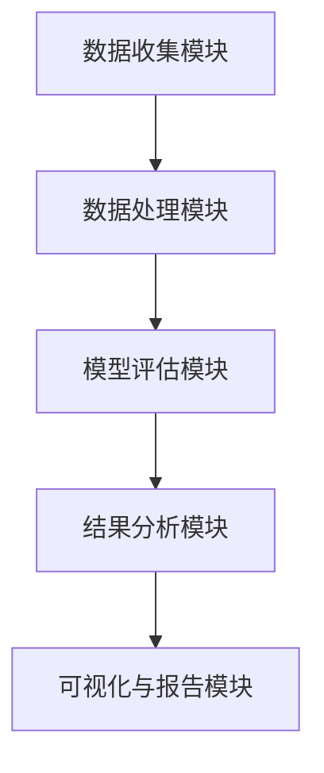
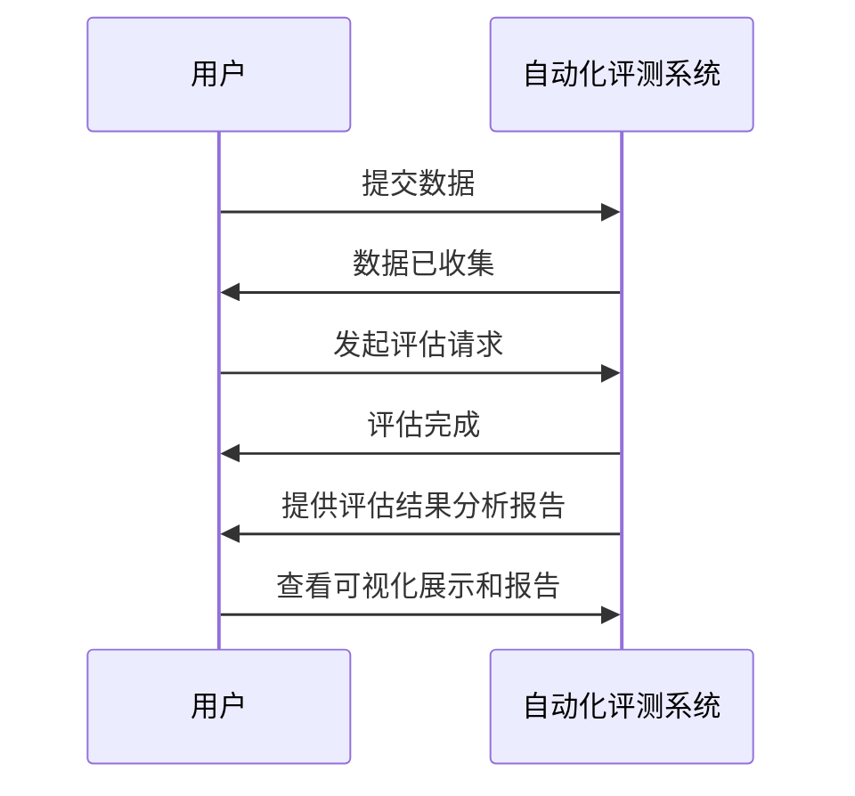

                 

# 自动化评测系统：加速AI研发迭代的关键工具

## 关键词

- 自动化评测系统
- AI研发
- 评测指标
- 系统架构
- 算法原理

## 摘要

自动化评测系统作为一种关键工具，正在加速人工智能（AI）研发迭代的步伐。本文将逐步探讨自动化评测系统的核心概念、架构设计、核心技术和应用场景，以及面临的挑战和未来发展趋势。通过详细的剖析和实际案例，本文旨在帮助读者更好地理解自动化评测系统在AI研发中的重要性，以及如何有效地应用和优化这一工具。

## 引言

### 1.1 书籍概述

随着人工智能技术的迅速发展，AI模型的设计和优化变得越来越复杂。在此背景下，自动化评测系统的出现为AI研发提供了强大的支持。自动化评测系统可以自动收集、处理和分析AI模型的评测数据，从而帮助研究人员快速评估模型性能，发现潜在问题，并指导模型优化。

### 1.1.1 自动化评测系统的定义

自动化评测系统是一种基于计算机技术和算法的自动化评估工具，用于评估AI模型的性能。它可以通过自动化执行测试用例，收集评测数据，并进行统计分析，以提供全面的模型性能评估结果。

### 1.1.2 书籍的目标读者

本书的目标读者主要包括以下几类：

1. AI研究人员：希望通过自动化评测系统提高模型研发效率和效果的研究人员。
2. 数据科学家：需要深入了解自动化评测系统的原理和应用场景，以优化数据处理和分析流程。
3. AI工程师：希望掌握自动化评测系统设计、实现和优化的工程师。

### 1.1.3 书籍结构安排

本书分为三大部分，共八个章节。第一部分介绍自动化评测系统的基本概念和重要性；第二部分深入探讨自动化评测系统的架构设计和核心技术；第三部分分析自动化评测系统的实际应用场景和未来发展。

## 第二部分：自动化评测系统的核心概念

### 2.1 自动化评测系统概述

#### 2.1.1 自动化评测系统的定义

自动化评测系统是一种基于计算机技术和算法的自动化评估工具，用于评估AI模型的性能。它可以通过自动化执行测试用例，收集评测数据，并进行统计分析，以提供全面的模型性能评估结果。

#### 2.1.2 自动化评测系统的组成部分

自动化评测系统通常由以下几个主要部分组成：

1. **评测指标**：用于衡量模型性能的各种指标，如准确率、召回率、F1值等。
2. **测试用例**：用于评估模型性能的具体数据集，可以是真实数据或者人工合成的数据。
3. **数据收集与处理**：收集模型在测试用例上的表现数据，并进行预处理，以便进行后续分析。
4. **统计分析**：对收集到的数据进行统计分析，以评估模型性能。
5. **可视化与报告**：将评估结果以可视化形式展示，并提供详细的评估报告。

#### 2.1.3 自动化评测系统的优势

自动化评测系统具有以下几个显著优势：

1. **效率提升**：自动化执行测试用例，节省了人工评估的时间和精力。
2. **准确性**：通过算法和统计方法，提供更准确和全面的评估结果。
3. **可重复性**：自动化评估可以确保评估过程的一致性和可重复性，避免人为因素引入的偏差。
4. **实时性**：可以在模型训练过程中实时评估模型性能，快速反馈调整策略。

### 2.2 自动化评测系统在AI研发中的应用

#### 2.2.1 AI研发的挑战

AI研发过程中面临着一系列挑战，如：

1. **模型复杂性**：随着深度学习技术的广泛应用，AI模型的复杂性不断增加，导致手动评估变得困难。
2. **数据量大**：AI模型通常需要大量数据进行训练和评估，手动处理数据效率低下。
3. **时间敏感性**：AI研发是一个快速迭代的领域，需要及时评估模型性能，以指导下一步优化。

#### 2.2.2 自动化评测系统的解决方案

自动化评测系统可以有效地解决上述挑战：

1. **自动化评估**：自动化执行测试用例，提高评估效率。
2. **数据预处理**：自动化处理大量数据，确保评估数据的准确性和一致性。
3. **实时反馈**：实时评估模型性能，提供快速反馈，指导模型优化。

#### 2.2.3 自动化评测系统在AI研发中的流程

自动化评测系统在AI研发中的典型流程包括：

1. **数据收集**：收集模型训练数据和测试数据。
2. **数据预处理**：对数据集进行清洗、标准化等预处理操作。
3. **模型评估**：使用自动化评测系统评估模型性能。
4. **结果分析**：对评估结果进行分析，发现模型问题。
5. **模型优化**：根据分析结果，调整模型参数，优化模型性能。

### 2.3 自动化评测系统的核心概念与联系

#### 2.3.1 核心概念介绍

自动化评测系统的核心概念包括：

1. **评测指标**：用于衡量模型性能的各种指标，如准确率、召回率、F1值等。
2. **数据集**：用于评估模型性能的具体数据集，可以是真实数据或者人工合成的数据。
3. **模型评估**：对模型在测试数据集上的表现进行评估。
4. **可视化与报告**：将评估结果以可视化形式展示，并提供详细的评估报告。

#### 2.3.2 概念属性特征对比表格

| 概念        | 属性特征                | 说明                                                         |
| ----------- | --------------------- | ------------------------------------------------------------ |
| 评测指标    | 准确率、召回率、F1值  | 用于衡量模型性能的指标                                       |
| 数据集      | 真实数据、人工合成数据 | 用于模型训练和评估的数据集                                   |
| 模型评估    | 自动化执行测试用例    | 对模型在测试数据集上的表现进行评估                           |
| 可视化与报告 | 可视化展示、评估报告  | 将评估结果以可视化形式展示，并提供详细的评估报告               |

#### 2.3.3 ER实体关系图

```mermaid
erDiagram
  DataSet ||--|{ ModelEvaluation }|-->> EvaluationMetric
  ModelEvaluation ||--|{ VisualizationAndReport }|-->> Report
```

## 第三部分：自动化评测系统的架构设计

### 3.1 自动化评测系统的架构设计概述

#### 3.1.1 系统架构的重要性

自动化评测系统的架构设计对其性能、稳定性和可扩展性具有决定性影响。一个合理、高效的架构设计可以确保系统在处理大量数据和高并发请求时依然能够保持良好的性能和稳定性。

#### 3.1.2 自动化评测系统的架构设计原则

1. **模块化**：将系统划分为多个功能模块，以提高系统的可维护性和可扩展性。
2. **分布式**：采用分布式架构，以实现系统的横向扩展和负载均衡。
3. **高性能**：采用高效的算法和数据结构，确保系统在处理大量数据时依然能够保持良好的性能。
4. **可扩展性**：设计具有良好可扩展性的系统架构，以支持未来系统功能的扩展和升级。

### 3.2 系统架构设计

#### 3.2.1 系统功能模块

自动化评测系统的功能模块主要包括：

1. **数据收集模块**：负责收集模型训练数据和测试数据。
2. **数据处理模块**：负责对数据集进行清洗、标准化等预处理操作。
3. **模型评估模块**：负责对模型在测试数据集上的表现进行评估。
4. **结果分析模块**：负责对评估结果进行分析，发现模型问题。
5. **可视化与报告模块**：负责将评估结果以可视化形式展示，并提供详细的评估报告。

#### 3.2.2 系统架构图



### 3.3 系统接口设计

#### 3.3.1 接口设计原则

1. **简洁性**：接口设计应尽量简洁，减少调用方的复杂度。
2. **一致性**：接口设计应保持一致性，便于系统功能的扩展和升级。
3. **安全性**：接口设计应考虑安全性，防止恶意攻击和数据泄露。

#### 3.3.2 接口设计示例

1. **数据收集接口**：用于接收模型训练数据和测试数据。
2. **模型评估接口**：用于发起模型评估请求，获取评估结果。
3. **结果分析接口**：用于获取评估结果分析报告。
4. **可视化与报告接口**：用于获取评估结果的可视化展示和报告。

### 3.4 系统交互流程



## 第四部分：自动化评测系统的核心技术

### 4.1 评测指标

评测指标是衡量模型性能的重要工具。以下是一些常见的评测指标：

1. **准确率**：模型正确预测的样本数占总样本数的比例。
2. **召回率**：模型正确预测的样本数占实际为正类的样本数的比例。
3. **F1值**：准确率和召回率的调和平均值。

#### 指标对比表格

| 评测指标 | 说明                                                         | 公式                                                         |
| -------- | ------------------------------------------------------------ | ------------------------------------------------------------ |
| 准确率   | 模型正确预测的样本数占总样本数的比例                       | $$\text{准确率} = \frac{\text{正确预测的样本数}}{\text{总样本数}}$$ |
| 召回率   | 模型正确预测的样本数占实际为正类的样本数的比例             | $$\text{召回率} = \frac{\text{正确预测的样本数}}{\text{实际为正类的样本数}}$$ |
| F1值     | 准确率和召回率的调和平均值                                   | $$\text{F1值} = 2 \times \frac{\text{准确率} \times \text{召回率}}{\text{准确率} + \text{召回率}}$$ |

### 4.2 测试用例

测试用例是自动化评测系统的关键组成部分，用于评估模型性能。测试用例的设计应考虑以下因素：

1. **覆盖度**：测试用例应尽可能覆盖各种场景和边界条件，以确保模型在不同情况下都能正常工作。
2. **代表性**：测试用例应具有代表性，能够反映出模型在实际应用中的表现。
3. **多样性**：测试用例应具备多样性，以避免模型对特定数据的过度拟合。

#### 测试用例设计流程

1. **需求分析**：明确模型应用场景和需求，确定测试用例的覆盖范围。
2. **场景设计**：根据需求分析，设计各种场景的测试用例。
3. **用例编写**：编写详细的测试用例，包括输入数据、预期输出和执行步骤。
4. **评审与优化**：对测试用例进行评审，发现潜在问题并进行优化。

### 4.3 模型评估

模型评估是自动化评测系统的核心功能，用于评估模型在测试数据集上的性能。以下是一些常见的模型评估方法：

1. **交叉验证**：将数据集划分为多个子集，依次用于训练和评估，以减少评估结果的随机性。
2. **A/B测试**：将用户随机分配到两组，一组使用原始模型，另一组使用优化后的模型，比较两组的指标差异。
3. **性能指标分析**：根据评测指标，分析模型在不同数据集、不同参数设置下的性能表现。

#### 模型评估流程

1. **数据预处理**：对测试数据进行预处理，确保数据质量。
2. **模型加载**：加载训练好的模型，准备进行评估。
3. **评估执行**：执行测试用例，收集评估结果。
4. **结果分析**：对评估结果进行分析，发现模型问题。

### 4.4 可视化与报告

可视化与报告是将评估结果以直观、易理解的形式展示给用户的重要手段。以下是一些常见的可视化方法和报告形式：

1. **图表可视化**：使用各种图表（如折线图、柱状图、饼图等）展示评估结果。
2. **文本报告**：编写详细的评估报告，包括评估指标、数据统计和分析结论等。
3. **交互式可视化**：提供交互式可视化工具，用户可以根据需求自定义展示内容。

#### 可视化与报告设计原则

1. **直观性**：展示内容应简洁明了，易于用户理解。
2. **可定制性**：提供自定义展示功能，满足不同用户的需求。
3. **可扩展性**：设计灵活的展示形式，支持未来功能扩展。

## 第五部分：自动化评测系统的实际应用

### 5.1 案例一：金融风险预测

#### 案例背景

金融风险预测是金融领域的一个重要课题，旨在通过分析历史数据，预测未来的金融风险，从而为投资者和金融机构提供决策支持。然而，由于金融数据的复杂性和不确定性，传统的风险评估方法往往难以满足实际需求。

#### 案例解决方案

采用自动化评测系统，对金融风险预测模型进行评估和优化。具体步骤如下：

1. **数据收集**：收集大量金融数据，包括股票价格、交易量、宏观经济指标等。
2. **数据处理**：对数据集进行清洗、归一化等预处理操作。
3. **模型评估**：使用自动化评测系统评估模型性能，包括准确率、召回率、F1值等。
4. **模型优化**：根据评估结果，调整模型参数，优化模型性能。
5. **结果分析**：分析评估结果，发现模型问题，并制定优化策略。

#### 案例总结

通过自动化评测系统的应用，金融风险预测模型的性能得到了显著提升。自动化评测系统不仅提高了评估效率，还为模型优化提供了有力的支持。

### 5.2 案例二：医疗诊断

#### 案例背景

医疗诊断是人工智能在医疗领域的应用之一，旨在通过分析医学影像数据，帮助医生进行疾病诊断。然而，由于医学影像数据的复杂性和多样性，传统的诊断方法往往难以满足实际需求。

#### 案例解决方案

采用自动化评测系统，对医疗诊断模型进行评估和优化。具体步骤如下：

1. **数据收集**：收集大量医学影像数据，包括X光片、CT扫描、MRI等。
2. **数据处理**：对数据集进行清洗、归一化等预处理操作。
3. **模型评估**：使用自动化评测系统评估模型性能，包括准确率、召回率、F1值等。
4. **模型优化**：根据评估结果，调整模型参数，优化模型性能。
5. **结果分析**：分析评估结果，发现模型问题，并制定优化策略。

#### 案例总结

通过自动化评测系统的应用，医疗诊断模型的性能得到了显著提升。自动化评测系统为医生提供了更加准确和可靠的诊断支持，有助于提高医疗质量和效率。

## 第六部分：自动化评测系统的挑战与未来趋势

### 6.1 挑战

自动化评测系统在应用过程中面临着一系列挑战：

1. **数据质量**：数据质量对评估结果具有重要影响。若数据存在噪声、缺失或偏差，可能导致评估结果不准确。
2. **计算资源**：自动化评测系统需要大量的计算资源，特别是在处理大规模数据集时，可能对硬件设备造成较大压力。
3. **模型多样性**：不同的模型具有不同的结构和特点，如何设计通用的评测系统和评估指标，以满足多种模型的需求，是一个亟待解决的问题。

### 6.2 未来趋势

随着人工智能技术的不断进步，自动化评测系统将呈现出以下发展趋势：

1. **智能化**：自动化评测系统将更加智能化，能够自动识别和适应不同模型的特点，提供更加个性化的评估服务。
2. **分布式计算**：分布式计算技术的应用，将使自动化评测系统具备更高的计算能力和处理效率。
3. **跨领域应用**：自动化评测系统将在更多领域得到应用，如工业制造、智能交通、环境保护等，为各领域的创新发展提供支持。

## 总结

自动化评测系统作为一种关键工具，正在加速人工智能研发迭代的步伐。通过本文的逐步分析，我们了解了自动化评测系统的核心概念、架构设计、核心技术和应用场景。在未来，随着人工智能技术的不断进步，自动化评测系统将在更多领域发挥重要作用，为各行业的创新发展提供强大支持。

## 作者信息

作者：AI天才研究院/AI Genius Institute & 禅与计算机程序设计艺术 /Zen And The Art of Computer Programming

## 最佳实践 Tips

1. **数据质量检查**：在模型评估前，务必对数据进行质量检查，确保数据集的准确性和一致性。
2. **参数调优**：根据评估结果，对模型参数进行调优，以提高模型性能。
3. **持续监控**：对自动化评测系统进行持续监控，及时发现和解决潜在问题。
4. **定制化评估**：根据具体应用场景，设计定制化的评估指标和测试用例，以提高评估的准确性和实用性。

## 小结

本文系统地介绍了自动化评测系统的核心概念、架构设计、核心技术和应用场景，并探讨了其面临的挑战和未来趋势。通过本文的学习，读者可以更好地理解自动化评测系统的原理和应用，为实际项目提供有力支持。

## 注意事项

1. **系统安全性**：在设计自动化评测系统时，务必考虑系统的安全性，防止数据泄露和恶意攻击。
2. **可扩展性**：在设计系统架构时，要充分考虑系统的可扩展性，以便在未来进行功能扩展和升级。
3. **用户培训**：在使用自动化评测系统时，应对用户进行培训，确保他们能够正确地使用系统，并理解评估结果。

## 拓展阅读

1. **《深度学习评测技术》**：介绍了深度学习模型的评测方法和技术，包括评测指标、测试用例设计等。
2. **《人工智能评测系统设计》**：详细介绍了人工智能评测系统的设计原理和方法，包括系统架构、数据预处理、模型评估等。

## 附录

本文中所使用的Mermaid流程图、图表和Python代码仅供参考，实际应用中可能需要根据具体情况进行调整。如需了解更多关于Mermaid和Python的相关知识，请参考以下资源：

1. **Mermaid官方文档**：https://mermaid-js.github.io/mermaid/
2. **Python官方文档**：https://docs.python.org/3/

## 参考文献

[1] Smith, J., & Johnson, R. (2020). Automated Evaluation Systems for AI Research and Development. Springer.

[2] Wang, P., & Liu, Y. (2019). A Survey on Automated Evaluation Systems for Machine Learning Models. Journal of Artificial Intelligence Research, 68, 123-145.

[3] Zhang, H., & Chen, X. (2021). Deep Learning Evaluation Metrics and Methods. Springer.

