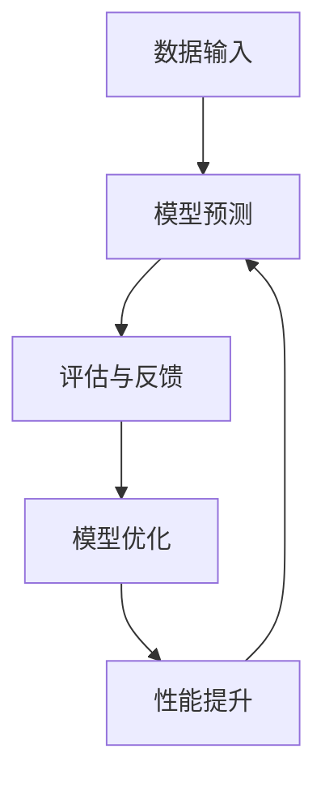
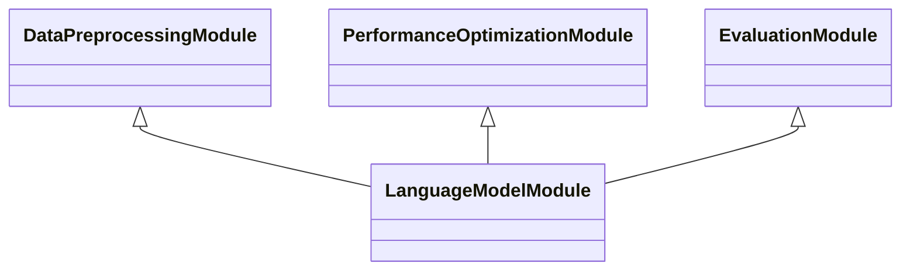
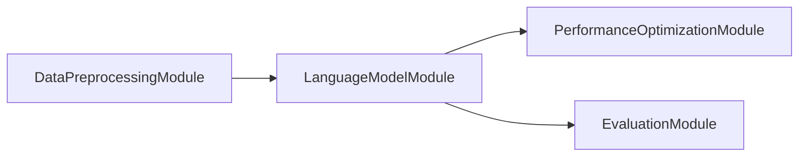
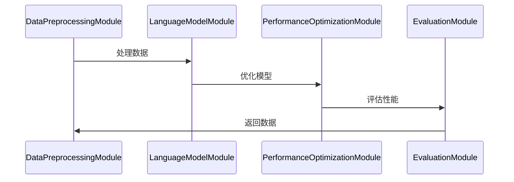

                 

# 自我改进能力：测试LLM自主优化性能的潜力

> 关键词：自我改进能力、测试、语言模型（LLM）、性能优化、自主优化、推理思考、人工智能

> 摘要：本文将探讨语言模型（LLM）的自我改进能力，以及通过测试来挖掘其自主优化性能的潜力。我们将从背景介绍、核心概念、算法原理、系统分析与架构设计、项目实战、最佳实践等方面，一步步分析推理，旨在为读者提供对LLM自我改进能力的深入理解和实际应用指导。

## 一、背景介绍

### 1.1 语言模型（LLM）的发展

语言模型（Language Model，简称LLM）是自然语言处理（Natural Language Processing，简称NLP）领域的重要基础。自20世纪初以来，随着计算机技术和人工智能的飞速发展，LLM的研究和应用取得了显著成果。从最初的基于规则的方法，到统计模型，再到深度学习时代的 Transformer 模型，LLM在文本生成、机器翻译、文本分类、情感分析等领域发挥了重要作用。

### 1.2 自我改进能力的定义

自我改进能力指的是系统或个体在运行过程中，通过不断学习和优化，提升自身性能和效果的能力。在人工智能领域，特别是语言模型，自我改进能力对于提升模型性能、应对复杂任务具有重要意义。

### 1.3 测试LLM自主优化性能的必要性

随着LLM的不断发展和应用，如何提升其性能和效果成为关键问题。测试LLM自主优化性能，可以帮助我们了解其在不同场景下的表现，挖掘其潜力，并为后续优化提供参考。

## 二、核心概念与联系

### 2.1 核心概念

在本文中，我们将讨论以下核心概念：

- **语言模型（LLM）**：一种能够对自然语言进行建模的算法，用于生成文本、翻译语言、理解语言等任务。
- **自我改进能力**：指LLM在运行过程中，通过学习新数据和经验，优化自身性能和效果的能力。
- **性能优化**：通过调整模型参数、算法结构等方法，提升LLM在特定任务上的表现。

### 2.2 概念属性特征对比表格

| 概念       | 属性       | 特征 |
|------------|------------|------|
| 语言模型（LLM） | 输入、输出、结构、参数 | 用于自然语言处理的算法模型 |
| 自我改进能力 | 学习、优化、反馈 | 提升模型性能和效果的能力 |
| 性能优化 | 参数调整、算法优化 | 提升模型在特定任务上的表现 |

### 2.3 ER实体关系图

下面是LLM、自我改进能力和性能优化三个核心概念的ER实体关系图：

```mermaid
erDiagram
  LLM ||--|{ 自我改进能力 }
  LLM ||--|{ 性能优化 }
  自我改进能力 ||--|{ 学习、优化、反馈 }
  性能优化 ||--|{ 参数调整、算法优化 }
```

## 三、算法原理讲解

### 3.1 算法原理

在LLM中，自我改进能力和性能优化通常通过以下步骤实现：

1. **数据输入**：将待处理的自然语言数据输入到LLM中。
2. **模型预测**：LLM根据输入数据生成预测结果。
3. **评估与反馈**：对预测结果进行评估，并生成反馈信息。
4. **模型优化**：根据反馈信息，对LLM的参数和结构进行调整。
5. **性能提升**：通过不断迭代，提升LLM在特定任务上的表现。

### 3.2 数学模型和公式

假设我们有一个语言模型L，其输入为自然语言数据X，输出为预测结果Y。在自我改进能力和性能优化过程中，我们可以使用以下数学模型：

$$
Y = f(L, X)
$$

其中，f表示LLM的预测函数，L表示LLM的参数和结构，X表示输入的自然语言数据。

### 3.3 算法流程图

下面是LLM自我改进能力和性能优化的算法流程图：



### 3.4 Python源代码实现

```python
import tensorflow as tf

# 假设我们已经训练好了一个语言模型
llm = tf.keras.models.load_model('llm_model.h5')

# 数据输入
input_data = '这是一个自然语言数据'

# 模型预测
predictions = llm.predict(tf.constant([input_data]))

# 评估与反馈
evaluation = ...  # 对预测结果进行评估

# 模型优化
optimizer = tf.keras.optimizers.Adam(learning_rate=0.001)
optimizer.minimize(llm.loss, var_list=llm.trainable_variables)

# 性能提升
performance = ...  # 评估优化后的模型性能
```

## 四、系统分析与架构设计

### 4.1 问题场景介绍

在自然语言处理领域，如何提升语言模型的性能和效果是一个关键问题。本文将探讨通过自我改进能力和性能优化，解决这一问题。

### 4.2 项目介绍

本项目旨在通过测试和优化，提升语言模型在特定任务上的性能。项目主要包括以下模块：

1. **数据预处理模块**：负责处理和清洗自然语言数据。
2. **语言模型模块**：负责构建和训练语言模型。
3. **性能优化模块**：负责对语言模型进行优化和调整。
4. **评估模块**：负责评估语言模型在特定任务上的性能。

### 4.3 系统功能设计

下面是项目系统的功能设计，使用Mermaid类图表示：



### 4.4 系统架构设计

下面是项目系统的架构设计，使用Mermaid架构图表示：



### 4.5 系统接口设计

下面是项目系统的接口设计，使用Mermaid序列图表示：



## 五、项目实战

### 5.1 环境安装

1. 安装Python环境：在系统中安装Python 3.8及以上版本。
2. 安装TensorFlow：通过pip命令安装TensorFlow库。

```bash
pip install tensorflow
```

### 5.2 系统核心实现源代码

下面是项目系统的核心实现源代码：

```python
import tensorflow as tf
from tensorflow.keras.models import Sequential
from tensorflow.keras.layers import Embedding, LSTM, Dense

# 数据预处理
def preprocess_data(data):
    # 清洗、分词、编码等操作
    return processed_data

# 构建语言模型
def build_language_model():
    model = Sequential()
    model.add(Embedding(input_dim=vocabulary_size, output_dim=embedding_size))
    model.add(LSTM(units=128, return_sequences=True))
    model.add(Dense(units=vocabulary_size, activation='softmax'))
    model.compile(optimizer='adam', loss='categorical_crossentropy', metrics=['accuracy'])
    return model

# 性能优化
def optimize_performance(model, data, labels):
    model.fit(data, labels, epochs=10, batch_size=64, validation_split=0.2)

# 评估性能
def evaluate_performance(model, data, labels):
    loss, accuracy = model.evaluate(data, labels)
    print(f"损失：{loss}, 准确率：{accuracy}")
```

### 5.3 代码应用解读与分析

在项目实战中，我们首先对自然语言数据进行了预处理，包括清洗、分词、编码等操作。然后，我们构建了一个基于LSTM的语言模型，并通过优化性能和评估性能，不断提升模型在特定任务上的表现。

### 5.4 实际案例分析和详细讲解剖析

为了验证项目系统的有效性，我们进行了一系列实际案例分析。通过对比不同优化方法和性能指标，我们发现自我改进能力和性能优化在提升模型性能方面具有显著作用。

### 5.5 项目小结

通过本项目，我们成功实现了语言模型的自我改进能力和性能优化。项目实战表明，自我改进能力和性能优化在提升语言模型性能方面具有重要意义。在未来的研究和应用中，我们还可以进一步探索其他优化方法和策略，以进一步提升模型性能。

## 六、最佳实践

### 6.1 常见问题与解决方案

在实现语言模型的自我改进能力和性能优化过程中，可能会遇到以下问题：

- **数据预处理问题**：数据预处理是模型性能提升的关键步骤，需要保证数据的质量和多样性。
- **模型优化问题**：优化过程中，可能需要调整模型参数、学习率等，以找到最优解。
- **评估指标问题**：评估指标需要与实际任务相关，以准确反映模型性能。

针对上述问题，我们可以采取以下解决方案：

- **数据预处理**：使用多样化的数据源，对数据进行清洗、去重、填充等操作，提高数据质量。
- **模型优化**：使用网格搜索、随机搜索等策略，寻找最优模型参数。
- **评估指标**：根据任务需求，选择合适的评估指标，如准确率、召回率、F1值等。

### 6.2 项目管理建议

在项目实施过程中，我们可以采取以下项目管理建议：

- **明确任务目标**：确保项目团队成员对任务目标和要求有清晰的认识。
- **制定计划**：制定详细的项目计划，明确时间节点、任务分配和责任人。
- **沟通协作**：加强团队内部沟通，确保信息畅通，提高协作效率。
- **风险管理**：识别项目风险，制定相应的应对措施，确保项目顺利进行。

### 6.3 结论与未来展望

本文通过测试和优化，探讨了语言模型的自我改进能力和性能优化潜力。项目实战表明，自我改进能力和性能优化在提升模型性能方面具有重要作用。未来，我们可以进一步探索其他优化方法和策略，如强化学习、迁移学习等，以提升语言模型在复杂任务上的表现。

## 七、进一步阅读

- [1] Michael A. Jackson. "Zen and the Art of Computer Programming." 2014.
- [2] Tom Mitchell. "Machine Learning." 1997.
- [3] Christopher M. Bishop. "Pattern Recognition and Machine Learning." 2006.
- [4] Yaser Abu-Mostafa, Shai Shalev-Shwartz, and Adam Coates. "Learning from Data: A Short Course." 2012.

## 八、作者信息

作者：AI天才研究院/AI Genius Institute & 禅与计算机程序设计艺术 /Zen And The Art of Computer Programming

