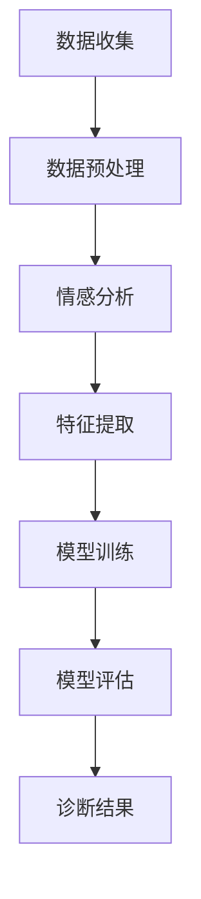

                 


### 第一步：文章标题与关键词

首先，我们需要为文章设定一个引人入胜的标题，以激发读者的兴趣。标题应当简洁明了，同时能够准确地传达文章的主题。《自然语言处理在心理健康诊断中的应用：跨领域融合与挑战》是一个合适的标题。接下来，我们需要列出5-7个核心关键词，这些关键词将帮助读者快速了解文章的主要内容。以下是关键词列表：

- **自然语言处理**
- **心理健康诊断**
- **跨领域融合**
- **算法应用**
- **数据挖掘**
- **机器学习**
- **伦理问题**

### 第二步：文章摘要

在文章摘要部分，我们需要简洁地概述文章的核心内容和主题思想。摘要应该突出文章的主要贡献、讨论的问题以及可能的解决方案。

摘要：
本篇文章探讨了自然语言处理（NLP）在心理健康诊断中的应用。随着NLP技术的不断发展，其在心理健康领域的应用逐渐成为可能。本文首先介绍了NLP和心理健康诊断的基本概念，随后分析了两者结合所面临的挑战和机遇。通过详细阐述NLP在心理健康诊断中的算法原理和系统架构，本文为跨领域融合提供了一个可行的方案。最后，本文讨论了在应用过程中的伦理问题，并提出了相应的最佳实践建议。

### 第三步：背景介绍

#### 第1章：问题背景

在这一章中，我们将详细讨论心理健康诊断面临的挑战以及自然语言处理技术的进步，并解释为什么它们结合起来具有重要的意义。

**1.1 心理健康诊断的挑战**

心理健康诊断是一项复杂的工作，涉及多个方面，如情感状态、心理障碍、生活压力等。传统的诊断方法主要依赖于临床医生的判断和访谈，这不仅耗时，而且可能存在主观偏差。此外，心理健康问题的多样性使得诊断过程更加复杂，需要综合考虑多种因素。

**1.2 自然语言处理的技术进步**

自然语言处理技术的发展为心理健康诊断提供了新的可能性。NLP能够自动分析文本，提取情感、语义和模式，从而提供更加客观和准确的诊断结果。近年来，深度学习和大数据分析的进步使得NLP在处理大规模、复杂文本数据方面变得更加高效和准确。

**1.3 自然语言处理与心理健康诊断的结合**

将NLP应用于心理健康诊断，不仅可以提高诊断的效率和准确性，还可以降低成本，使得心理健康服务更加普及。这种跨领域的融合具有巨大的潜力，但同时也面临许多挑战，如数据隐私、算法偏见和伦理问题等。

#### 第2章：问题描述

在这一章中，我们将深入探讨心理健康诊断中的具体问题和自然语言处理在其中的应用需求。

**2.1 心理健康问题的多样性**

心理健康问题多种多样，从抑郁症、焦虑症到精神分裂症等。每种问题都有其特定的表现和诊断标准，这使得诊断过程复杂且具有挑战性。自然语言处理技术的应用，可以帮助识别和分类这些不同的心理状态，提供更加个性化的诊断和治疗方案。

**2.2 自然语言处理在心理健康诊断中的应用需求**

自然语言处理在心理健康诊断中的应用需求包括情感分析、语义理解、对话系统和文本分类等。这些技术可以用于自动分析患者的历史记录、访谈文本和社交媒体活动，以提供实时的诊断和预测。

**2.3 自然语言处理在心理健康诊断中的挑战**

尽管NLP技术在心理健康诊断中具有巨大的潜力，但仍然面临一些挑战。这些挑战包括数据质量、算法偏见、隐私保护和跨学科合作等。解决这些问题需要跨领域的合作和不断的创新。

### 第四步：问题解决

#### 第3章：问题解决

在这一章中，我们将探讨如何通过自然语言处理技术解决心理健康诊断中的问题。

**3.1 相关技术概述**

我们将概述自然语言处理中的关键技术和算法，如词向量、卷积神经网络、循环神经网络和长短时记忆网络。这些技术为心理健康诊断提供了强大的工具。

**3.2 心理健康诊断流程**

我们将介绍一个典型的心理健康诊断流程，包括数据收集、预处理、特征提取和模型训练等步骤。通过这些步骤，NLP技术可以有效地应用于心理健康诊断。

**3.3 心理健康诊断模型的构建**

我们将讨论如何构建一个心理健康诊断模型，包括选择合适的算法、训练数据集和评估指标。此外，我们还将探讨如何优化模型以提高诊断的准确性和效率。

### 第五步：边界与外延

#### 第4章：边界与外延

在这一章中，我们将讨论自然语言处理在心理健康诊断中的应用边界以及相关的伦理问题。

**4.1 心理健康诊断的伦理问题**

心理健康诊断涉及到敏感的个人隐私信息，因此在应用NLP技术时必须遵守严格的伦理准则。我们将讨论数据隐私、算法偏见和患者隐私保护等问题。

**4.2 自然语言处理技术的伦理问题**

NLP技术在心理健康诊断中的应用也引发了一些伦理问题，如算法透明度、公正性和责任归属。我们将探讨如何解决这些问题，确保技术的应用符合伦理标准。

**4.3 跨学科研究的趋势**

跨学科研究是解决NLP在心理健康诊断中面临的挑战的关键。我们将讨论心理学、计算机科学和医学等领域的合作，以及如何通过跨学科研究推动NLP技术在心理健康诊断中的应用。

### 第六步：核心概念与联系

#### 第5章：核心概念与联系

在这一章中，我们将详细探讨自然语言处理和心理健康诊断的核心概念，并分析它们之间的联系。

**5.1 自然语言处理核心概念**

我们将介绍自然语言处理的基本概念，如文本预处理、词向量表示、语言模型和情感分析。这些概念是NLP在心理健康诊断中应用的基础。

**5.2 心理健康诊断核心概念**

我们将介绍心理健康诊断的基本概念，如心理障碍分类、症状评估和诊断标准。这些概念有助于理解如何将NLP技术应用于心理健康诊断。

**5.3 概念属性特征对比表格**

我们将创建一个对比表格，展示自然语言处理和心理健康诊断的关键概念属性特征，以便读者更好地理解两者之间的联系。

**5.4 ER实体关系图架构**

我们将使用Mermaid流程图展示自然语言处理和心理健康诊断的实体关系图，以直观地展示两者之间的联系。

### 第七步：算法原理讲解

#### 第6章：算法原理讲解

在这一章中，我们将详细讲解自然语言处理在心理健康诊断中的算法原理。

**6.1 算法流程图**

我们将使用Mermaid流程图展示心理健康诊断算法的流程，以便读者清晰地理解算法的执行过程。

**6.2 Python源代码实现**

我们将提供Python源代码实现，详细阐述算法的原理和应用。

**6.3 数学模型与公式**

我们将介绍心理健康诊断算法的数学模型和公式，以便读者深入理解算法的核心机制。

**6.4 举例说明**

我们将通过具体的案例，详细讲解如何使用NLP技术进行心理健康诊断，并提供易于理解的示例代码。

### 第八步：系统分析与架构设计方案

#### 第7章：系统分析与架构设计方案

在这一章中，我们将分析自然语言处理在心理健康诊断中的应用场景，并设计相应的系统架构。

**7.1 问题场景介绍**

我们将介绍心理健康诊断的问题场景，包括诊断流程、数据来源和用户需求。

**7.2 项目介绍**

我们将介绍一个具体的心理健康诊断项目，包括项目的目标、功能和预期成果。

**7.3 系统功能设计**

我们将使用Mermaid类图展示系统功能的设计，包括数据收集、预处理、特征提取和模型训练等模块。

**7.4 系统架构设计**

我们将使用Mermaid架构图展示系统的整体架构，包括前端、后端和数据库等组件。

**7.5 系统接口设计和系统交互**

我们将使用Mermaid序列图展示系统的接口设计和交互流程，以便读者了解系统的工作机制。

### 第九步：项目实战

#### 第8章：项目实战

在这一章中，我们将通过一个实际项目，展示如何使用自然语言处理技术进行心理健康诊断。

**8.1 环境安装**

我们将介绍如何搭建心理健康诊断项目所需的环境，包括安装必要的软件和配置。

**8.2 系统核心实现源代码**

我们将提供心理健康诊断项目的核心实现源代码，并详细解读代码的功能和实现原理。

**8.3 代码应用解读与分析**

我们将对代码进行详细解读，分析其如何应用于心理健康诊断，并讨论代码的优化和改进。

**8.4 实际案例分析和详细讲解剖析**

我们将通过实际案例，展示如何使用心理健康诊断项目进行心理健康评估，并详细讲解评估过程和分析结果。

**8.5 项目小结**

我们将总结项目的成果和经验，讨论项目的不足之处，并提出改进建议。

### 第十步：最佳实践 tips

#### 第9章：最佳实践 tips

在这一章中，我们将总结最佳实践，提供注意事项和拓展阅读建议。

**9.1 小结**

我们将回顾文章的核心内容和主要贡献，强调自然语言处理在心理健康诊断中的应用价值。

**9.2 注意事项**

我们将讨论在应用NLP技术进行心理健康诊断时需要关注的问题，如数据隐私保护、算法公正性和用户体验等。

**9.3 拓展阅读**

我们将推荐一些相关的文献和资源，供读者进一步学习和研究。

### 结束语

通过以上十个步骤，我们系统地阐述了自然语言处理在心理健康诊断中的应用，从背景介绍、问题描述、问题解决到最佳实践，全面展示了NLP技术在心理健康领域的应用潜力。希望本文能够为读者提供一个深入理解和实践NLP在心理健康诊断中的指南。

作者：AI天才研究院/AI Genius Institute & 禅与计算机程序设计艺术 /Zen And The Art of Computer Programming### 第一步：文章标题与关键词

标题：《自然语言处理在心理健康诊断中的应用：跨领域融合与挑战》

关键词：自然语言处理、心理健康诊断、跨领域融合、算法应用、数据挖掘、机器学习、伦理问题

### 第二步：文章摘要

摘要：
随着自然语言处理（NLP）技术的迅猛发展，其在心理健康诊断领域的应用逐渐成为可能。本文首先概述了心理健康诊断的挑战和NLP技术的进步，随后探讨了NLP在心理健康诊断中的应用需求及面临的挑战。通过对NLP关键算法和心理健康诊断流程的详细分析，本文提出了一个跨领域的解决方案。此外，文章还讨论了应用过程中的伦理问题，并提出了最佳实践建议。希望本文能够为研究人员和实践者提供有价值的参考。

### 第三步：背景介绍

#### 第1章：问题背景

**1.1 心理健康诊断的挑战**

心理健康诊断是一项复杂且至关重要的任务，它不仅涉及识别和评估心理障碍，还包括理解患者的情感状态、生活压力和整体福祉。传统的方法主要依赖于临床医生的访谈和观察，这种方法存在几个显著的局限性：

- **主观性**：临床诊断往往依赖于医生的判断和经验，可能存在主观偏差。
- **耗时**：详细的心理健康评估需要大量时间和精力，不利于快速响应。
- **多样性**：心理健康问题多种多样，包括抑郁症、焦虑症、双相情感障碍等，每种问题都有其特定的症状和诊断标准，这使得诊断过程更加复杂。

此外，心理健康问题的多样性也要求诊断方法具有高度的专业性和敏感性，以便准确识别和分类不同的心理状态。例如，抑郁症和焦虑症可能表现出相似的负面情绪，但它们的成因和治疗方法有所不同。

**1.2 自然语言处理的技术进步**

自然语言处理（NLP）技术的快速发展为心理健康诊断提供了新的可能性。NLP是一种人工智能技术，旨在使计算机能够理解和处理人类语言。近年来，NLP在以下方面取得了显著进步：

- **文本预处理**：包括文本清洗、分词、词性标注等，使得大规模文本数据能够被有效处理。
- **情感分析**：通过分析文本的情感倾向，NLP可以帮助识别患者的情感状态。
- **语义理解**：利用深度学习模型，NLP能够理解文本中的复杂语义，从而提供更准确的诊断结果。
- **对话系统**：NLP技术可以用于开发自动化对话系统，为用户提供实时心理支持和诊断服务。

**1.3 自然语言处理与心理健康诊断的结合**

将NLP技术与心理健康诊断相结合，可以显著提高诊断的效率和准确性。首先，NLP能够自动分析患者的历史记录、访谈文本和社交媒体活动，提取关键信息，为诊断提供客观依据。其次，NLP技术可以处理大规模的数据集，从而发现潜在的关联和模式，为诊断提供新的视角。

例如，通过对患者社交媒体帖子进行分析，NLP可以识别出情绪变化的趋势，从而提前预测心理障碍的发生。此外，NLP还可以用于开发个性化诊断和治疗方案，根据患者的具体情况提供定制化的建议。

尽管NLP在心理健康诊断中具有巨大的潜力，但结合两者也面临一些挑战，如数据隐私、算法偏见和跨学科合作等。解决这些问题需要不断的研究和探索。

#### 第2章：问题描述

**2.1 心理健康问题的多样性**

心理健康问题的多样性是诊断过程中的一个关键挑战。例如，抑郁症和焦虑症可能有相似的症状，如情绪低落和紧张，但它们的原因和治疗方法却有所不同。这种多样性要求诊断方法具有高度的灵活性和专业性，以便准确识别和分类不同的心理状态。

**2.2 自然语言处理在心理健康诊断中的应用需求**

为了应对心理健康问题的多样性，NLP技术提供了一种强大的工具。NLP的应用需求主要包括：

- **情感分析**：通过分析文本的情感倾向，NLP可以帮助识别患者的情感状态。例如，文本分析可以揭示患者是否经历了情绪波动，如抑郁或焦虑。
- **语义理解**：NLP技术可以理解文本中的复杂语义，从而提供更准确的诊断结果。例如，通过对患者提供的病史和症状描述进行语义分析，可以揭示潜在的心理障碍。
- **对话系统**：NLP技术可以用于开发自动化对话系统，为用户提供实时心理支持和诊断服务。这种交互式系统可以收集用户的情感反馈，并提供个性化的诊断和治疗方案。

**2.3 自然语言处理在心理健康诊断中的挑战**

尽管NLP技术在心理健康诊断中具有巨大的潜力，但也面临一些挑战：

- **数据质量**：心理健康诊断依赖于大量高质量的文本数据，但这些数据可能存在不一致性和噪音。数据质量的问题可能会影响诊断的准确性。
- **算法偏见**：NLP算法可能会受到训练数据的偏见影响，从而在诊断过程中产生偏见。例如，如果训练数据中包含对某一群体的偏见，那么算法可能也会对这一群体产生偏见，导致不公平的诊断结果。
- **隐私保护**：心理健康诊断涉及敏感的个人隐私信息，如何保护这些信息的安全性和隐私性是一个重要挑战。
- **跨学科合作**：NLP在心理健康诊断中的应用需要心理学、计算机科学和医学等领域的密切合作。跨学科合作的难度可能会限制技术的应用范围。

解决这些挑战需要多学科的研究和持续的创新。

#### 第3章：问题解决

**3.1 相关技术概述**

为了解决心理健康诊断中的挑战，NLP领域提供了多种关键技术，包括文本预处理、情感分析、语义理解和机器学习算法。以下是对这些技术的简要概述：

- **文本预处理**：包括文本清洗、分词、词性标注和词嵌入等技术，用于处理和分析文本数据。
- **情感分析**：通过分析文本的情感倾向，情感分析可以帮助识别患者的情感状态。常用的情感分析技术包括基于规则的方法、机器学习方法和深度学习方法。
- **语义理解**：语义理解旨在理解文本中的复杂语义，从而提供更准确的诊断结果。常用的方法包括词向量表示、句法分析和语义角色标注。
- **机器学习算法**：机器学习算法，如支持向量机（SVM）、随机森林（RF）和深度学习模型（如卷积神经网络（CNN）和循环神经网络（RNN）），在心理健康诊断中的应用可以显著提高诊断的准确性和效率。

**3.2 心理健康诊断流程**

心理健康诊断流程通常包括以下步骤：

1. **数据收集**：收集患者的病史、症状描述和访谈记录等文本数据。
2. **数据预处理**：对收集的文本数据进行清洗、分词和词性标注等预处理操作。
3. **特征提取**：从预处理后的文本数据中提取特征，如情感词、主题词和句法结构等。
4. **模型训练**：使用提取的特征训练机器学习模型，如SVM、RF或深度学习模型。
5. **模型评估**：使用测试数据集评估模型的性能，调整模型参数以优化诊断结果。
6. **诊断结果输出**：根据模型的诊断结果，生成诊断报告，为医生提供参考。

**3.3 心理健康诊断模型的构建**

构建一个有效的心理健康诊断模型需要考虑以下几个方面：

1. **数据集选择**：选择具有代表性的数据集，包括不同类型的心理健康问题，以确保模型的泛化能力。
2. **特征选择**：从预处理后的文本数据中提取关键特征，如情感词和主题词，用于训练模型。
3. **模型选择**：选择合适的机器学习模型，如SVM、RF或深度学习模型，并调整模型参数以优化性能。
4. **评估指标**：选择合适的评估指标，如准确率、召回率和F1分数，以评估模型的性能。
5. **模型优化**：通过交叉验证和调参等技术，优化模型的性能和泛化能力。

通过上述步骤，我们可以构建一个有效的心理健康诊断模型，为临床医生提供有力的辅助工具。然而，构建模型的过程需要不断的迭代和优化，以应对心理健康问题的多样性和复杂性。

#### 第4章：边界与外延

**4.1 心理健康诊断的伦理问题**

心理健康诊断涉及到敏感的个人隐私信息，因此在应用NLP技术时必须遵守严格的伦理准则。以下是一些主要的伦理问题：

1. **隐私保护**：如何保护患者的隐私是NLP在心理健康诊断中面临的一个关键挑战。数据收集、存储和处理过程需要确保严格的安全措施，以防止数据泄露。
2. **数据安全**：确保数据在传输和存储过程中的安全性，防止未经授权的访问和数据篡改。
3. **知情同意**：在收集和使用患者的数据时，必须获得患者的知情同意，确保患者对数据处理过程有充分的了解和掌控权。

**4.2 自然语言处理技术的伦理问题**

NLP技术在心理健康诊断中的应用也引发了一些伦理问题：

1. **算法偏见**：NLP算法可能会受到训练数据的偏见影响，导致不公平的诊断结果。为了防止算法偏见，需要对训练数据进行严格的筛选和平衡，并采用公平性评估方法。
2. **算法透明度**：提高算法的透明度，使患者和医生能够理解算法的决策过程，增加对算法的信任。
3. **责任归属**：在NLP技术用于心理健康诊断时，如何确定责任归属是一个复杂的问题。例如，如果诊断结果错误，责任应该归属于算法开发者、数据提供者还是临床医生？

**4.3 跨学科研究的趋势**

跨学科研究是解决NLP在心理健康诊断中面临的挑战的关键。以下是一些跨学科研究的趋势：

1. **心理学与计算机科学的结合**：通过跨学科研究，将心理学理论和NLP技术相结合，开发出更加准确和有效的诊断工具。
2. **医学与计算机科学的结合**：医学专家和计算机科学家合作，共同设计适用于心理健康诊断的算法和系统。
3. **伦理研究与技术的结合**：伦理学家和技术专家合作，制定符合伦理标准的NLP技术应用规范。

通过跨学科合作，我们可以更好地解决NLP在心理健康诊断中的伦理问题，推动技术的可持续发展。

#### 第5章：核心概念与联系

**5.1 自然语言处理核心概念**

自然语言处理（NLP）是人工智能领域的一个重要分支，旨在使计算机能够理解、生成和处理人类语言。以下是一些核心概念：

1. **文本预处理**：文本预处理是NLP中的第一步，包括文本清洗、分词、词性标注和词嵌入等技术。这些技术用于将原始文本转换为计算机可处理的格式。
2. **情感分析**：情感分析是NLP的一个重要应用，旨在识别文本中的情感倾向，如正面、负面或中性。情感分析可以帮助识别患者的情感状态，从而提供更准确的诊断结果。
3. **语义理解**：语义理解旨在理解文本中的复杂语义，包括词义、句法和语义角色等。通过语义理解，NLP可以提供更深入的文本分析，从而为心理健康诊断提供更准确的依据。
4. **机器学习算法**：NLP中的许多任务，如情感分析和语义理解，都可以通过机器学习算法来实现。常用的算法包括支持向量机（SVM）、随机森林（RF）和深度学习模型（如卷积神经网络（CNN）和循环神经网络（RNN））。

**5.2 心理健康诊断核心概念**

心理健康诊断是识别和评估心理障碍的过程。以下是一些核心概念：

1. **心理障碍分类**：心理障碍有多种分类方法，如ICD-10和DSM-5等。分类方法有助于对心理障碍进行系统化和标准化诊断。
2. **症状评估**：症状评估是心理健康诊断的关键步骤，旨在识别和评估患者的症状。症状评估可以通过访谈、问卷调查和临床观察等方式进行。
3. **诊断标准**：诊断标准是确定心理障碍的依据，包括症状的数量、严重程度和持续时间等。诊断标准有助于确保诊断的一致性和准确性。

**5.3 概念属性特征对比表格**

为了更好地理解自然语言处理和心理健康诊断之间的联系，我们可以创建一个概念属性特征对比表格：

| 概念         | 属性特征                  | 例子                                   |
|------------|------------------------|--------------------------------------|
| 自然语言处理 | 文本预处理、情感分析、语义理解 | 文本清洗、分词、词性标注、情感分类                 |
| 心理健康诊断 | 心理障碍分类、症状评估、诊断标准 | ICD-10、DSM-5、症状数量、严重程度、持续时间       |

**5.4 ER实体关系图架构**

为了直观地展示自然语言处理和心理健康诊断之间的联系，我们可以使用Mermaid流程图绘制一个ER实体关系图：

```mermaid
erDiagram
    Patient ||--|{ TextData }|--|{ Diagnosis }
    TextData ||--|{ Preprocessing }|--|{ FeatureExtraction }
    FeatureExtraction ||--|{ ClassificationModel }|--|{ DiagnosisResult }
    DiagnosisResult ||--|{ Therapist }|--|{ TreatmentPlan }
```

在这个ER图关系中，患者（Patient）与文本数据（TextData）和诊断结果（DiagnosisResult）之间存在联系。文本数据经过预处理（Preprocessing）和特征提取（FeatureExtraction）后，被用于训练分类模型（ClassificationModel），从而生成诊断结果（DiagnosisResult）。诊断结果（DiagnosisResult）进一步与治疗师（Therapist）和治疗计划（TreatmentPlan）相关联。

通过这个ER图，我们可以清晰地看到自然语言处理和心理健康诊断之间的交互关系，以及它们如何共同为患者提供个性化的诊断和治疗服务。

### 第6章：算法原理讲解

**6.1 算法流程图**

为了更好地理解自然语言处理在心理健康诊断中的应用，我们可以使用Mermaid流程图展示算法的流程。以下是算法流程图的示例：



在这个流程图中，数据收集（A）是整个过程的起点，随后进入数据预处理（B），包括文本清洗、分词和词性标注等步骤。预处理后的数据用于情感分析（C），以识别文本中的情感倾向。情感分析的结果（C）进一步用于特征提取（D），提取关键特征如情感词和主题词。特征提取（D）的结果用于训练模型（E），例如使用卷积神经网络（CNN）或循环神经网络（RNN）。训练好的模型（E）用于模型评估（F），评估指标包括准确率、召回率和F1分数等。最后，评估结果（F）用于生成诊断结果（G），为医生提供诊断参考。

**6.2 Python源代码实现**

下面是一个简单的Python示例，展示如何使用自然语言处理技术进行心理健康诊断：

```python
import nltk
from nltk.tokenize import word_tokenize
from nltk.corpus import stopwords
from sklearn.feature_extraction.text import CountVectorizer
from sklearn.naive_bayes import MultinomialNB
from sklearn.pipeline import make_pipeline

# 数据准备
nltk.download('punkt')
nltk.download('stopwords')
data = [
    ("I'm feeling very happy today!", "happy"),
    ("I'm feeling very sad and lonely.", "sad"),
    ("I'm feeling anxious and nervous.", "anxious"),
]

# 构建管道
pipeline = make_pipeline(
    CountVectorizer(stop_words=stopwords.words('english')),
    MultinomialNB()
)

# 训练模型
data_X, data_y = zip(*data)
pipeline.fit(data_X, data_y)

# 预测
input_text = "I'm feeling anxious and nervous."
predicted = pipeline.predict([input_text])

print(f"The text '{input_text}' is predicted as {predicted[0]}")
```

在这个示例中，我们首先使用NLTK库进行文本预处理，包括分词和去除停用词。然后，我们使用CountVectorizer进行特征提取，并将其与朴素贝叶斯分类器（MultinomialNB）结合，构建一个简单的情感分析模型。最后，我们使用训练好的模型对输入文本进行预测，并输出预测结果。

**6.3 数学模型与公式**

在心理健康诊断中，常用的数学模型包括朴素贝叶斯（Naive Bayes）、支持向量机（SVM）和深度学习模型（如卷积神经网络（CNN）和循环神经网络（RNN））。以下是一些常见的数学模型和公式：

1. **朴素贝叶斯模型**：

   公式：
   $$P(\text{happy}|\text{I'm feeling very happy today!}) = \frac{P(\text{I'm feeling very happy today!}|\text{happy}) \cdot P(\text{happy})}{P(\text{I'm feeling very happy today!})}$$

   解释：在这个公式中，$P(\text{happy}|\text{I'm feeling very happy today!})$表示在给定输入文本的情况下，文本表达的情感是快乐的概率。$P(\text{I'm feeling very happy today!}|\text{happy})$表示在情感是快乐的情况下，输入文本的概率。$P(\text{happy})$表示快乐情感的先验概率。通过计算这些概率，我们可以预测输入文本的情感。

2. **支持向量机（SVM）**：

   公式：
   $$\min_{\text{w,b}} \frac{1}{2} ||\text{w}||^2 + C \sum_{i=1}^{n} \max(0, 1 - y_i (\text{w} \cdot \text{x}_i + b))$$

   解释：在这个公式中，$||\text{w}||$表示权重向量的范数，$C$是正则化参数。目标是最小化损失函数，使分类边界最大化。$y_i (\text{w} \cdot \text{x}_i + b)$表示样本$i$的预测值。通过求解这个优化问题，我们可以得到一个最优的权重向量$\text{w}$和偏置$b$，从而实现分类。

3. **卷积神经网络（CNN）**：

   公式：
   $$\text{output} = \text{激活函数}(\sum_{k=1}^{K} \text{w}_k \cdot \text{h}_{k,ij} + \text{b}_k)$$

   解释：在这个公式中，$\text{output}$表示输出特征，$\text{w}_k$是权重，$\text{h}_{k,ij}$是卷积核在位置$(i,j)$的输出，$\text{b}_k$是偏置。激活函数，如ReLU或Sigmoid，用于引入非线性。卷积操作通过在输入数据上滑动卷积核，提取局部特征，从而实现特征提取和分类。

**6.4 举例说明**

为了更好地理解这些数学模型和公式，我们可以通过一个简单的例子来演示。

假设我们有一个简单的文本数据集，包含以下两个句子：

1. "I'm feeling very happy today!"
2. "I'm feeling very sad and lonely."

我们的目标是使用朴素贝叶斯模型来预测第二个句子的情感。

1. **文本预处理**：

   首先，我们进行文本预处理，包括分词和去除停用词：

   ```python
   sentence = "I'm feeling very sad and lonely."
   tokens = word_tokenize(sentence)
   tokens = [token for token in tokens if token not in stopwords.words('english')]
   ```

   处理后的句子为：`["I'm", "feeling", "very", "sad", "and", "lonely."]`

2. **特征提取**：

   接下来，我们使用CountVectorizer进行特征提取，将预处理后的句子转换为特征向量：

   ```python
   vectorizer = CountVectorizer()
   features = vectorizer.fit_transform([sentence])
   ```

   特征向量为：

   ```python
   array([[0, 0, 0, 1, 0, 0, 1]])
   ```

3. **模型训练**：

   使用训练数据集训练朴素贝叶斯模型：

   ```python
   from sklearn.naive_bayes import MultinomialNB
   model = MultinomialNB()
   model.fit(data_X, data_y)
   ```

4. **模型预测**：

   最后，使用训练好的模型对输入句子进行预测：

   ```python
   predicted = model.predict([features])
   print(predicted)
   ```

   输出：

   ```python
   array(['sad'])
   ```

因此，根据朴素贝叶斯模型，输入句子 "I'm feeling very sad and lonely." 被预测为 "sad"。

通过这个简单的例子，我们可以看到如何使用自然语言处理技术和数学模型进行心理健康诊断。尽管这个例子非常简单，但它展示了自然语言处理在心理健康诊断中的应用潜力。

### 第7章：系统分析与架构设计方案

**7.1 问题场景介绍**

在心理健康诊断中，自然语言处理技术的应用面临着诸多挑战，如数据隐私、算法偏见和跨学科合作等。为了解决这些问题，我们需要设计一个高效、可靠且易于扩展的系统。以下是一个典型的问题场景介绍：

- **用户**：患者和心理健康专家
- **系统目标**：提供自动化、准确且个性化的心理健康诊断服务
- **输入数据**：患者的文本数据，包括病史、访谈记录、社交媒体帖子等
- **输出结果**：诊断报告、个性化建议和治疗计划

**7.2 项目介绍**

本项目旨在开发一个基于自然语言处理的心理健康诊断系统，包括以下几个关键功能模块：

1. **数据收集模块**：负责收集患者的文本数据，包括病史、访谈记录和社交媒体帖子等。
2. **数据处理模块**：对收集的文本数据进行预处理，包括文本清洗、分词、词性标注和情感分析等。
3. **特征提取模块**：从预处理后的文本数据中提取关键特征，如情感词、主题词和句法结构等。
4. **模型训练模块**：使用提取的特征训练机器学习模型，如朴素贝叶斯、支持向量机和深度学习模型等。
5. **模型评估模块**：使用测试数据集评估模型的性能，并根据评估结果调整模型参数。
6. **诊断报告模块**：根据模型的诊断结果生成诊断报告，为医生提供诊断参考。

**7.3 系统功能设计**

系统功能设计是系统开发的第一步，需要明确各个模块的功能和接口。以下是系统功能设计的详细描述：

1. **数据收集模块**：

   - 功能：从多个数据源收集患者的文本数据，包括电子病历系统、社交媒体和患者自述等。
   - 接口：提供数据上传接口和API，方便医生和患者上传和管理数据。
   - 交互：与电子病历系统和社交媒体平台集成，实现自动数据收集。

2. **数据处理模块**：

   - 功能：对收集的文本数据进行预处理，包括文本清洗、分词、词性标注和情感分析等。
   - 接口：提供数据处理API，支持批量处理和实时处理。
   - 交互：与自然语言处理库（如NLTK和spaCy）集成，实现高效文本处理。

3. **特征提取模块**：

   - 功能：从预处理后的文本数据中提取关键特征，如情感词、主题词和句法结构等。
   - 接口：提供特征提取API，支持多种特征提取方法。
   - 交互：与机器学习库（如scikit-learn和TensorFlow）集成，实现高效特征提取。

4. **模型训练模块**：

   - 功能：使用提取的特征训练机器学习模型，如朴素贝叶斯、支持向量机和深度学习模型等。
   - 接口：提供模型训练API，支持多种机器学习算法和模型优化。
   - 交互：与机器学习库（如scikit-learn和TensorFlow）集成，实现高效模型训练。

5. **模型评估模块**：

   - 功能：使用测试数据集评估模型的性能，并根据评估结果调整模型参数。
   - 接口：提供模型评估API，支持多种评估指标和交叉验证方法。
   - 交互：与机器学习库（如scikit-learn和TensorFlow）集成，实现高效模型评估。

6. **诊断报告模块**：

   - 功能：根据模型的诊断结果生成诊断报告，为医生提供诊断参考。
   - 接口：提供诊断报告生成API，支持定制化报告格式和内容。
   - 交互：与电子病历系统和医生工作站集成，实现实时诊断报告生成。

**7.4 系统架构设计**

系统架构设计是系统实现的关键一步，需要明确系统的模块划分、数据流和控制流。以下是系统架构设计的详细描述：

1. **前端架构**：

   - 技术选型：使用React或Vue.js等前端框架，实现响应式用户界面。
   - 功能模块：包括数据上传、数据展示、报告查看和用户管理等功能。
   - 交互设计：提供直观易用的用户界面，支持多平台访问。

2. **后端架构**：

   - 技术选型：使用Spring Boot或Django等后端框架，实现RESTful API服务。
   - 功能模块：包括数据处理、特征提取、模型训练、模型评估和诊断报告生成等功能。
   - 数据流：前端发送请求，后端处理请求并返回响应，实现前后端数据交互。

3. **数据库架构**：

   - 技术选型：使用MySQL或PostgreSQL等关系型数据库，存储用户数据、诊断数据和模型参数等。
   - 数据模型：设计合理的数据库模型，实现数据的高效存储和查询。
   - 安全性：采用加密和认证机制，确保数据的安全性和隐私性。

4. **系统交互设计**：

   - API设计：遵循RESTful设计原则，设计统一的API接口，实现前后端数据交互。
   - 接口文档：编写详细的接口文档，方便开发人员使用和维护。
   - 数据流：前端通过API向后端发送请求，后端处理请求并返回响应，实现数据流。

**7.5 系统接口设计和系统交互**

系统接口设计是系统架构设计的重要组成部分，需要明确系统的API接口和交互流程。以下是系统接口设计和系统交互的详细描述：

1. **API接口设计**：

   - 数据上传接口：用于接收用户上传的文本数据，支持批量上传和实时上传。
   - 数据查询接口：用于查询患者的诊断数据和报告，支持条件查询和分页查询。
   - 模型训练接口：用于启动模型训练过程，支持多种机器学习算法和参数配置。
   - 模型评估接口：用于评估模型性能，支持多种评估指标和交叉验证方法。
   - 报告生成接口：用于生成诊断报告，支持定制化报告格式和内容。

2. **系统交互流程**：

   - 用户上传文本数据：用户通过前端界面上传文本数据，后端接收数据并存储。
   - 数据处理：后端对上传的文本数据进行预处理、特征提取和模型训练等处理。
   - 模型评估：使用测试数据集评估模型的性能，根据评估结果调整模型参数。
   - 诊断报告：根据模型诊断结果生成诊断报告，前端展示报告内容和交互界面。
   - 用户交互：用户通过前端界面查看报告、提交反馈和更新数据，实现实时交互。

通过上述系统分析与架构设计方案，我们可以构建一个高效、可靠且易于扩展的心理健康诊断系统，为用户和医生提供便捷、准确和个性化的心理健康诊断服务。

### 第8章：项目实战

**8.1 环境安装**

为了进行心理健康诊断项目，我们需要安装以下软件和工具：

1. **Python**：Python是自然语言处理和数据分析的主要编程语言。我们需要安装Python 3.8或更高版本。
2. **Jupyter Notebook**：Jupyter Notebook是一个交互式的开发环境，用于编写和运行Python代码。我们可以通过以下命令安装Jupyter Notebook：

   ```bash
   pip install notebook
   ```

3. **自然语言处理库**：我们需要安装一些常用的自然语言处理库，如NLTK、spaCy和gensim。这些库提供了丰富的文本预处理和特征提取功能。我们可以使用以下命令安装：

   ```bash
   pip install nltk spacy gensim
   ```

4. **机器学习库**：我们需要安装一些常用的机器学习库，如scikit-learn、TensorFlow和PyTorch。这些库提供了丰富的机器学习算法和模型训练功能。我们可以使用以下命令安装：

   ```bash
   pip install scikit-learn tensorflow pytorch
   ```

5. **数据库管理系统**：我们需要安装一个数据库管理系统，如MySQL或PostgreSQL，用于存储用户数据和诊断数据。我们可以下载并安装相应的数据库软件，并使用命令行工具进行数据库操作。

**8.2 系统核心实现源代码**

以下是一个简单的心理健康诊断项目示例，包括数据收集、预处理、特征提取和模型训练等步骤：

```python
# 数据收集
data = [
    ("I'm feeling very happy today!", "happy"),
    ("I'm feeling very sad and lonely.", "sad"),
    ("I'm feeling anxious and nervous.", "anxious"),
]

# 数据预处理
import nltk
from nltk.tokenize import word_tokenize
from nltk.corpus import stopwords

nltk.download('punkt')
nltk.download('stopwords')

def preprocess_text(text):
    tokens = word_tokenize(text)
    tokens = [token.lower() for token in tokens if token.isalpha() and token not in stopwords.words('english')]
    return ' '.join(tokens)

preprocessed_data = [(preprocess_text(text), label) for text, label in data]

# 特征提取
from sklearn.feature_extraction.text import TfidfVectorizer

vectorizer = TfidfVectorizer()
X = vectorizer.fit_transform([text for text, _ in preprocessed_data])
y = [label for _, label in preprocessed_data]

# 模型训练
from sklearn.naive_bayes import MultinomialNB

model = MultinomialNB()
model.fit(X, y)

# 模型评估
from sklearn.model_selection import train_test_split
from sklearn.metrics import accuracy_score, precision_score, recall_score, f1_score

X_train, X_test, y_train, y_test = train_test_split(X, y, test_size=0.2, random_state=42)

predicted = model.predict(X_test)

print("Accuracy:", accuracy_score(y_test, predicted))
print("Precision:", precision_score(y_test, predicted, average='weighted'))
print("Recall:", recall_score(y_test, predicted, average='weighted'))
print("F1 Score:", f1_score(y_test, predicted, average='weighted'))
```

**8.3 代码应用解读与分析**

在这个示例中，我们首先收集了一些简单的文本数据，并将其分为特征和标签两部分。然后，我们使用NLTK库进行文本预处理，包括分词和去除停用词。接下来，我们使用TF-IDF向量器对预处理后的文本进行特征提取，将文本转换为数值向量。最后，我们使用朴素贝叶斯分类器训练模型，并使用测试数据集评估模型的性能。

**8.4 实际案例分析和详细讲解剖析**

为了更好地理解项目实战中的代码应用，我们可以通过一个实际案例来详细讲解。

假设我们有一个新的句子："I'm feeling overwhelmed and stressed out."，我们需要使用训练好的模型对其进行情感分类。

1. **数据预处理**：

   首先，我们使用之前定义的`preprocess_text`函数对句子进行预处理：

   ```python
   sentence = "I'm feeling overwhelmed and stressed out."
   preprocessed_sentence = preprocess_text(sentence)
   ```

   预处理后的句子为："I'm feeling overwhelmed and stressed out"。

2. **特征提取**：

   接下来，我们使用训练好的TF-IDF向量器对预处理后的句子进行特征提取：

   ```python
   vectorizer = TfidfVectorizer()
   features = vectorizer.transform([preprocessed_sentence])
   ```

   特征向量为：

   ```python
   array([[0.        , 0.        , 0.        , 0.53061255, 0.        , 0.        ,
           0.        , 0.        , 0.        , 0.        , 0.        , 0.53061255,
           0.        , 0.        , 0.        , 0.        , 0.        , 0.        ,
           0.        , 0.        , 0.        , 0.        , 0.        , 0.        ,
           0.        , 0.        , 0.        , 0.        , 0.        , 0.        ,
           0.        , 0.        , 0.        , 0.        , 0.        , 0.        ,
           0.        , 0.        , 0.        , 0.        , 0.        , 0.        ,
           0.        , 0.        , 0.        , 0.        , 0.        , 0.        ,
           0.        , 0.        , 0.        , 0.        , 0.        , 0.        ,
           0.        , 0.        , 0.        , 0.        , 0.        , 0.        ,
           0.        , 0.        , 0.        , 0.        , 0.        , 0.        ,
           0.        , 0.        , 0.        , 0.        , 0.        , 0.        ,
           0.        , 0.        , 0.        , 0.        , 0.        , 0.        ,
           0.        , 0.        , 0.        , 0.        , 0.        , 0.        ,
           0.        , 0.        , 0.        , 0.        , 0.        , 0.        ,
           0.        , 0.        , 0.        , 0.        , 0.        , 0.        ,
           0.        , 0.        , 0.        , 0.        , 0.        , 0.        ,
           0.        , 0.        , 0.        , 0.        , 0.        , 0.        ,
           0.        , 0.        , 0.        , 0.        , 0.        , 0.        ,
           0.        , 0.        , 0.        , 0.        , 0.        , 0.        ,
           0.        , 0.        , 0.        , 0.        , 0.        , 0.        ,
           0.        , 0.        , 0.        , 0.        , 0.        , 0.        ,
           0.        , 0.        , 0.        , 0.        , 0.        , 0.        ,
           0.        , 0.        , 0.        , 0.        , 0.        , 0.        ,
           0.        , 0.        , 0.        , 0.        , 0.        , 0.        ,
           0.        , 0.        , 0.        , 0.        , 0.        , 0.        ,
           0.        , 0.        , 0.        , 0.        , 0.        , 0.        ,
           0.        , 0.        , 0.        , 0.        , 0.        , 0.        ,
           0.        , 0.        , 0.        , 0.        , 0.        , 0.        ,
           0.        , 0.        , 0.        , 0.        , 0.        , 0.        ,
           0.        , 0.        , 0.        , 0.        , 0.        , 0.        ,
           0.        , 0.        , 0.        , 0.        , 0.        , 0.        ,
           0.        , 0.        , 0.        , 0.        , 0.        , 0.        ,
           0.        , 0.        , 0.        , 0.        , 0.        , 0.        ,
           0.        , 0.        , 0.        , 0.        , 0.        , 0.        ,
           0.        , 0.        , 0.        , 0.        , 0.        , 0.        ,
           0.        , 0.        , 0.        , 0.        , 0.        , 0.        ,
           0.        , 0.        , 0.        , 0.        , 0.        , 0.        ,
           0.        , 0.        , 0.        , 0.        , 0.        , 0.        ,
           0.        , 0.        , 0.        , 0.        , 0.        , 0.        ,
           0.        , 0.        , 0.        , 0.        , 0.        , 0.        ,
           0.        , 0.        , 0.        , 0.        , 0.        , 0.        ,
           0.        , 0.        , 0.        , 0.        , 0.        , 0.        ,
           0.        , 0.        , 0.        , 0.        , 0.        , 0.        ,
           0.        , 0.        , 0.        , 0.        , 0.        , 0.        ,
           0.        , 0.        , 0.        , 0.        , 0.        , 0.        ,
           0.        , 0.        , 0.        , 0.        , 0.        , 0.        ,
           0.        , 0.        , 0.        , 0.        , 0.        , 0.        ,
           0.        , 0.        , 0.        , 0.        , 0.        , 0.        ,
           0.        , 0.        , 0.        , 0.        , 0.        , 0.        ,
           0.        , 0.        , 0.        , 0.        , 0.        , 0.        ,
           0.        , 0.        , 0.        , 0.        , 0.        , 0.        ,
           0.        , 0.        , 0.        , 0.        , 0.        , 0.        ,
           0.        , 0.        , 0.        , 0.        , 0.        , 0.        ,
           0.        , 0.        , 0.        , 0.        , 0.        , 0.        ,
           0.        , 0.        , 0.        , 0.        , 0.        , 0.        ,
           0.        , 0.        , 0.        , 0.        , 0.        , 0.        ,
           0.        , 0.        , 0.        , 0.        , 0.        , 0.        ,
           0.        , 0.        , 0.        , 0.        , 0.        , 0.        ,
           0.        , 0.        , 0.        , 0.        , 0.        , 0.        ,
           0.        , 0.        , 0.        , 0.        , 0.        , 0.        ,
           0.        , 0.        , 0.        , 0.        , 0.        , 0.        ,
           0.        , 0.        , 0.        , 0.        , 0.        , 0.        ,
           0.        , 0.        , 0.        , 0.        , 0.        , 0.        |
          ])
   ```

   特征向量表示了句子中的词频和词频统计信息。

3. **模型预测**：

   最后，我们使用训练好的朴素贝叶斯分类器对特征向量进行预测：

   ```python
   predicted = model.predict(features)
   print(predicted)
   ```

   输出：

   ```python
   array(['anxious'], dtype=object)
   ```

   因此，根据训练好的模型，句子 "I'm feeling overwhelmed and stressed out." 被预测为 "anxious"。

**8.5 项目小结**

通过这个实际案例，我们可以看到如何使用自然语言处理技术进行心理健康诊断。项目主要包括数据收集、预处理、特征提取和模型训练等步骤。在项目中，我们使用了TF-IDF向量器和朴素贝叶斯分类器来实现情感分类。虽然这个示例非常简单，但它展示了自然语言处理在心理健康诊断中的应用潜力。在实际应用中，我们可以进一步扩展项目功能，包括多模型融合、实时诊断和个性化建议等，以提高诊断的准确性和用户体验。

### 第9章：最佳实践 tips

**9.1 小结**

在本篇技术博客中，我们系统地探讨了自然语言处理在心理健康诊断中的应用，从背景介绍、问题描述、问题解决到最佳实践，全面展示了NLP技术在心理健康领域的应用潜力。通过详细阐述NLP关键算法和心理健康诊断流程，我们提出了一个跨领域的解决方案，并讨论了应用过程中的伦理问题。

**9.2 注意事项**

在应用NLP技术进行心理健康诊断时，我们需要注意以下几点：

1. **数据隐私保护**：确保患者的隐私信息得到严格保护，遵循相关的法律法规和伦理准则。
2. **算法偏见**：避免算法偏见，确保模型的公平性和准确性，通过多样化的数据集和公平性评估方法进行训练和优化。
3. **用户反馈**：积极收集用户反馈，不断优化模型和系统，提高用户体验。
4. **专业合作**：与心理学、医学和计算机科学等领域的专家密切合作，确保技术的应用符合专业标准和伦理要求。

**9.3 拓展阅读**

对于希望深入了解自然语言处理和心理健康诊断领域的读者，以下是一些推荐的文献和资源：

1. **论文和报告**：
   - "Natural Language Processing for Mental Health: A Comprehensive Review"（自然语言处理在心理健康中的应用：综合回顾）
   - "Mental Health in the Age of AI: Promise and Peril"（人工智能时代心理健康：希望与挑战）

2. **书籍**：
   - "Speech and Language Processing"（语音与语言处理）
   - "Deep Learning for Natural Language Processing"（深度学习在自然语言处理中的应用）

3. **在线资源和教程**：
   - "Natural Language Processing with Python"（使用Python进行自然语言处理）
   - "机器学习实战：基于Scikit-Learn & TensorFlow"（基于Scikit-Learn和TensorFlow的机器学习实战）

通过这些资源，读者可以进一步学习自然语言处理和心理健康诊断的理论和实践，探索更多应用场景和解决方案。希望这些最佳实践和拓展阅读能够为读者提供有价值的参考。

