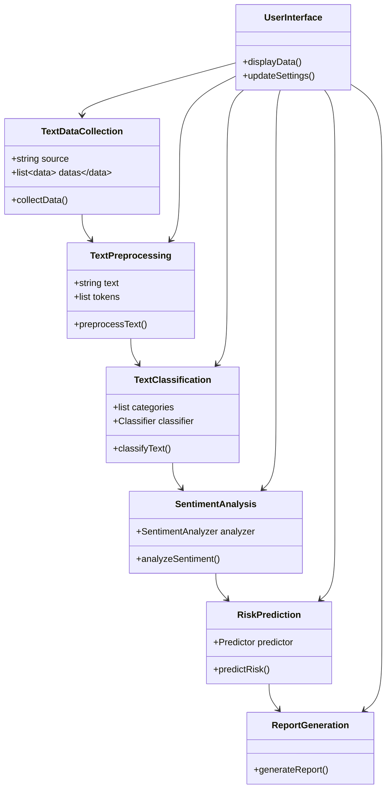
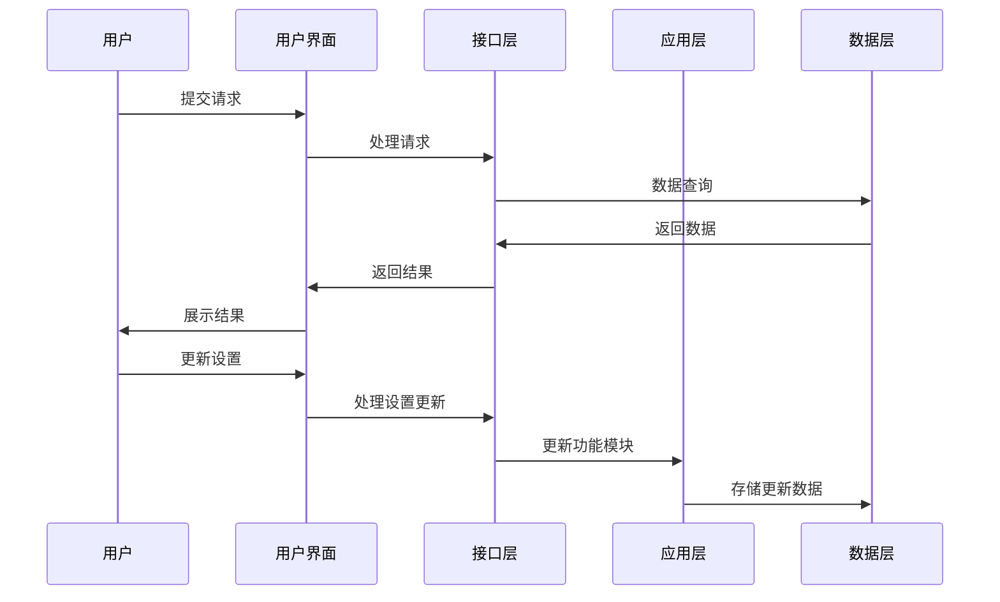
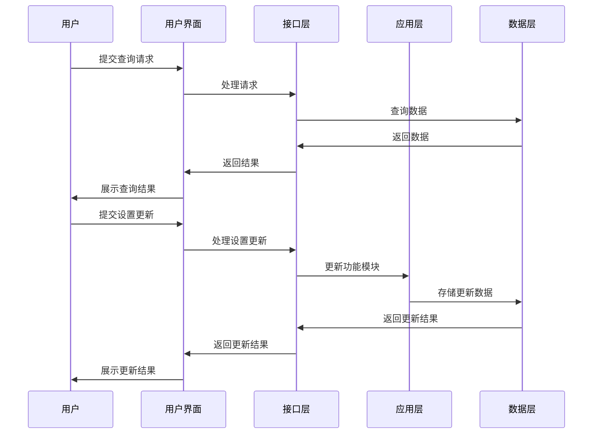

                 

### 文章标题

《自然语言处理在金融风险评估中的创新应用》

> 关键词：自然语言处理、金融风险评估、文本分类、情感分析、文本生成

> 摘要：本文探讨了自然语言处理（NLP）技术在金融风险评估中的创新应用。首先，通过介绍金融风险评估的背景和重要性，引出NLP技术的兴起和发展。随后，详细阐述了NLP的核心概念和技术，以及其在金融风险评估中的关联和应用。接着，本文分析了NLP在金融风险评估中的应用框架，讲解了关键算法原理，并使用Python源代码进行了详细举例说明。随后，文章从系统分析与架构设计、项目实战等多个角度，全面剖析了NLP在金融风险评估中的应用。最后，本文总结了NLP在金融风险评估中的优势和挑战，并提出了未来发展的方向。

----------------------------------------------------------------

### 目录大纲

#### 第一部分：背景介绍

1. [问题背景](#问题背景)
2. [自然语言处理的兴起](#自然语言处理的兴起)
3. [自然语言处理与金融风险评估的结合](#自然语言处理与金融风险评估的结合)
4. [研究的边界与外延](#研究的边界与外延)

#### 第二部分：核心概念与联系

1. [自然语言处理的核心概念](#自然语言处理的核心概念)
2. [金融风险评估的核心概念](#金融风险评估的核心概念)
3. [自然语言处理在金融风险评估中的应用框架](#自然语言处理在金融风险评估中的应用框架)

#### 第三部分：算法原理讲解

1. [文本分类算法](#文本分类算法)
2. [情感分析算法](#情感分析算法)
3. [文本生成算法](#文本生成算法)

#### 第四部分：系统分析与架构设计

1. [系统功能设计](#系统功能设计)
2. [系统架构设计](#系统架构设计)

#### 第五部分：项目实战

1. [项目实战](#项目实战)
2. [项目小结](#项目小结)

----------------------------------------------------------------

## 第一部分：背景介绍

### 问题背景

金融风险评估是金融行业中至关重要的一个环节。金融风险是指金融活动中的不确定性，可能导致金融机构或投资者的经济损失。有效的金融风险评估可以帮助金融机构和管理者预测潜在的风险，制定合理的风险控制策略，从而降低损失。

随着金融市场的发展和全球化，金融风险评估的复杂性和重要性日益增加。传统的金融风险评估主要依赖于历史数据、统计分析和模型预测等方法，但这些方法在面对大量非结构化文本数据时存在一定的局限性。

自然语言处理（NLP）技术是一种人工智能领域的重要分支，旨在使计算机理解和生成人类语言。近年来，NLP技术在金融领域的应用逐渐受到关注，为金融风险评估提供了一种新的思路和方法。

### 自然语言处理的兴起

自然语言处理技术的兴起可以追溯到20世纪50年代。早期的研究主要集中在语言模型、机器翻译和词性标注等方面。随着计算能力和算法的不断发展，NLP技术在20世纪90年代开始取得显著突破，出现了许多优秀的NLP工具和库。

进入21世纪，深度学习技术的发展进一步推动了NLP的进步。深度学习模型，如神经网络和循环神经网络（RNN），在NLP任务中表现出色，使得计算机在文本分类、情感分析、机器翻译等任务上取得了令人瞩目的成果。

### 自然语言处理与金融风险评估的结合

自然语言处理技术在金融风险评估中的应用主要体现在以下几个方面：

1. **文本分类**：通过对金融文本进行分类，可以将大量的非结构化数据转化为结构化数据，为后续的风险评估提供基础。
2. **情感分析**：通过对金融文本的情感倾向进行分析，可以识别出潜在的风险信号，帮助金融机构及时采取措施。
3. **文本生成**：通过对金融文本的生成，可以模拟不同的市场情景和风险场景，为风险评估提供更加全面的参考。

### 研究的边界与外延

本文的研究主要关注自然语言处理在金融风险评估中的应用，包括文本分类、情感分析和文本生成等关键算法。同时，本文将介绍NLP在金融风险评估中的应用框架，并分析其优势、挑战和发展趋势。

然而，本文并未涉及NLP在金融风险评估中的所有应用领域，如语音识别、对话系统等。此外，本文的研究主要侧重于技术层面，未涉及具体的金融风险管理和决策过程。

在未来研究中，可以进一步探索NLP在金融风险评估中的深度应用，如结合大数据分析、图神经网络等新兴技术，提高风险评估的准确性和效率。同时，研究如何将NLP技术与金融风险管理相结合，为金融机构提供更加智能、高效的解决方案。

----------------------------------------------------------------

## 第二部分：核心概念与联系

### 自然语言处理的核心概念

自然语言处理（NLP）是一门研究如何使计算机理解、生成和处理人类语言的技术。NLP的核心概念包括：

1. **语言模型**：语言模型是一种概率模型，用于预测下一个词或序列的概率。在NLP任务中，语言模型可以用于文本分类、机器翻译、语音识别等。
2. **词性标注**：词性标注是指对文本中的每个词进行分类，标记其词性，如名词、动词、形容词等。词性标注有助于提高NLP任务的准确性和语义理解能力。
3. **实体识别**：实体识别是指从文本中识别出具有特定意义的实体，如人名、地名、组织名等。实体识别有助于对文本进行结构化处理和分析。
4. **关系提取**：关系提取是指从文本中识别出实体之间的语义关系，如“爱”、“属于”等。关系提取有助于构建语义网络，提高文本理解能力。
5. **情感分析**：情感分析是指对文本的情感倾向进行分类，判断其是正面、负面还是中性。情感分析广泛应用于市场调研、舆情分析等领域。

### 自然语言处理的关键技术

自然语言处理的关键技术包括：

1. **词向量表示**：词向量表示是将文本中的每个词映射到一个高维空间中的向量。词向量表示有助于提高NLP任务的准确性和效率。
2. **深度学习模型**：深度学习模型，如神经网络和循环神经网络（RNN），在NLP任务中表现出色。深度学习模型可以通过学习大量文本数据，自动提取语义特征，提高文本分类、情感分析等任务的性能。
3. **预训练模型**：预训练模型是一种大规模的NLP模型，通过在大量文本数据上进行预训练，可以捕捉到丰富的语言知识。预训练模型可以用于文本分类、情感分析、机器翻译等任务，提高模型的泛化能力。
4. **序列标注模型**：序列标注模型是一种将文本序列映射到标签序列的模型，如命名实体识别、关系提取等。序列标注模型通过学习文本和标签之间的映射关系，提高序列标注的准确性和效率。

### 自然语言处理的应用领域

自然语言处理技术已广泛应用于各个领域，包括：

1. **文本分类**：文本分类是将文本分类到预定义的类别中。文本分类广泛应用于新闻分类、情感分析、垃圾邮件过滤等领域。
2. **机器翻译**：机器翻译是指将一种语言的文本自动翻译成另一种语言。机器翻译广泛应用于跨语言交流、国际商务等领域。
3. **语音识别**：语音识别是指将语音信号自动转换为文本。语音识别广泛应用于智能助手、语音搜索等领域。
4. **问答系统**：问答系统是指通过自然语言交互，回答用户提出的问题。问答系统广泛应用于客服、教育、医疗等领域。
5. **信息抽取**：信息抽取是指从文本中提取出关键信息，如人名、地名、组织名、事实等。信息抽取广泛应用于新闻摘要、数据挖掘、智能搜索等领域。

### 自然语言处理与金融风险评估的关联

自然语言处理技术在金融风险评估中的应用主要体现在以下几个方面：

1. **文本分类**：通过对金融文本进行分类，可以将大量的非结构化数据转化为结构化数据，为后续的风险评估提供基础。
2. **情感分析**：通过对金融文本的情感倾向进行分析，可以识别出潜在的风险信号，帮助金融机构及时采取措施。
3. **文本生成**：通过对金融文本的生成，可以模拟不同的市场情景和风险场景，为风险评估提供更加全面的参考。

### 自然语言处理在金融风险评估中的应用框架

自然语言处理在金融风险评估中的应用框架主要包括以下几个组成部分：

1. **数据采集与预处理**：采集金融领域的文本数据，并进行数据清洗、去重、分词、词性标注等预处理操作，为后续分析提供基础。
2. **文本分类**：利用文本分类算法，将金融文本分类到预定义的类别中，如股票分析、市场预测等。
3. **情感分析**：利用情感分析算法，对金融文本的情感倾向进行分析，识别出潜在的风险信号。
4. **文本生成**：利用文本生成算法，模拟不同的市场情景和风险场景，为风险评估提供更加全面的参考。
5. **风险预测与评估**：结合文本分类、情感分析和文本生成结果，进行风险预测和评估，为金融机构提供决策支持。

### 自然语言处理与金融风险评估的关联总结

自然语言处理技术为金融风险评估提供了一种新的手段和方法。通过文本分类、情感分析和文本生成等技术，可以对金融文本进行深入分析和理解，识别出潜在的风险信号，为金融机构提供更加准确、及时的风险评估结果。同时，自然语言处理技术还可以帮助金融机构挖掘市场信息，提高决策水平，降低风险。

然而，自然语言处理技术在金融风险评估中仍面临一些挑战，如数据质量、算法性能和模型泛化能力等。因此，未来研究需要进一步探索如何提高NLP技术在金融风险评估中的应用效果，为金融机构提供更加智能、高效的解决方案。

----------------------------------------------------------------

### 金融风险评估的核心概念

金融风险评估是指对金融机构或投资项目的风险进行评估和预测，以便采取相应的风险控制措施，降低潜在损失。金融风险评估是金融风险管理的重要组成部分，对金融机构的稳健运营和投资者的利益保障具有重要意义。

#### 金融风险评估的定义

金融风险评估是指通过系统的方法和工具，对金融活动中可能出现的风险进行识别、评估、监测和控制的过程。其目标是预测金融活动的潜在损失，制定相应的风险控制策略，确保金融机构的稳健运营。

#### 金融风险评估的关键指标

金融风险评估涉及多个关键指标，主要包括：

1. **违约概率（PD）**：违约概率是指借款人或债务人违约的可能性。违约概率是评估信用风险的重要指标。
2. **损失程度（LD）**：损失程度是指债务人违约时，债权人可能遭受的损失金额。损失程度通常与债务人的违约概率和债务金额有关。
3. **违约损失率（LGD）**：违约损失率是指债务人违约时，债权人可能遭受的损失占债务金额的比例。违约损失率是评估信用风险的重要指标。
4. **预期损失（EL）**：预期损失是指在一定时间内，由于信用风险导致的平均损失。预期损失是金融机构制定风险控制策略的重要依据。

#### 金融风险评估的方法与技术

金融风险评估的方法和技术多种多样，主要包括以下几种：

1. **统计方法**：统计方法是通过历史数据和统计分析模型，预测金融活动的潜在风险。常见的统计方法包括回归分析、时间序列分析、风险矩阵等。
2. **概率方法**：概率方法是通过概率模型，预测金融活动的潜在风险。常见的概率方法包括蒙特卡洛模拟、贝叶斯网络等。
3. **机器学习方法**：机器学习方法是通过学习大量数据，构建预测模型，预测金融活动的潜在风险。常见的机器学习方法包括决策树、支持向量机、神经网络等。
4. **专家系统**：专家系统是通过模拟金融专家的判断和决策过程，预测金融活动的潜在风险。专家系统通常结合统计方法和概率方法，以提高预测准确性。

#### 金融风险评估中的自然语言处理应用

自然语言处理技术在金融风险评估中具有广泛的应用，主要包括以下几个方面：

1. **文本分类**：通过对金融文本进行分类，可以将大量的非结构化数据转化为结构化数据，为风险评估提供基础。
2. **情感分析**：通过对金融文本的情感倾向进行分析，可以识别出潜在的风险信号，帮助金融机构及时采取措施。
3. **文本生成**：通过对金融文本的生成，可以模拟不同的市场情景和风险场景，为风险评估提供更加全面的参考。

#### 自然语言处理与金融风险评估的关联

自然语言处理技术为金融风险评估提供了新的手段和方法。通过文本分类、情感分析和文本生成等技术，可以对金融文本进行深入分析和理解，识别出潜在的风险信号，为金融机构提供更加准确、及时的风险评估结果。同时，自然语言处理技术还可以帮助金融机构挖掘市场信息，提高决策水平，降低风险。

然而，自然语言处理技术在金融风险评估中仍面临一些挑战，如数据质量、算法性能和模型泛化能力等。因此，未来研究需要进一步探索如何提高NLP技术在金融风险评估中的应用效果，为金融机构提供更加智能、高效的解决方案。

----------------------------------------------------------------

### 自然语言处理在金融风险评估中的应用框架

自然语言处理（NLP）技术在金融风险评估中的应用框架是一个多层次的、系统性的结构，旨在利用NLP技术从大量的非结构化金融文本数据中提取有价值的信息，从而增强风险预测和评估的准确性和效率。下面，我们将详细分析这个应用框架的组成部分、设计原则、实现步骤以及评价指标。

#### 应用框架的组成部分

1. **数据采集模块**：该模块负责从各种金融信息来源（如新闻报道、社交媒体、金融报告等）中收集文本数据。数据采集需要考虑数据的全面性和代表性，以确保后续分析的有效性。

2. **文本预处理模块**：该模块对采集到的文本数据进行清洗、去重、分词、词性标注等预处理操作，以提高文本数据的质量，为后续的NLP任务提供基础。

3. **文本分类模块**：文本分类模块使用NLP技术将预处理后的文本数据分类到不同的类别中，如市场预测、公司财报分析等。这一步骤有助于提取出与金融风险评估直接相关的文本。

4. **情感分析模块**：情感分析模块通过分析文本的情感倾向（如正面、负面、中性），帮助识别潜在的舆情风险。这一步骤对于预测市场波动和评估投资者情绪具有重要意义。

5. **风险预测模块**：风险预测模块结合文本分类和情感分析的结果，利用机器学习模型进行风险预测。该模块可以预测特定金融资产的违约概率、损失程度等关键指标。

6. **评估与优化模块**：评估与优化模块负责对风险预测模型进行评估和优化，以提高预测的准确性和模型的鲁棒性。这一步骤包括模型选择、参数调优、交叉验证等。

#### 应用框架的设计原则

1. **数据驱动**：应用框架应以数据驱动为核心，确保采集到的数据具有代表性、准确性和实时性。

2. **模块化**：应用框架应设计为模块化结构，便于组件的替换和扩展。这样可以灵活适应不同的金融风险评估需求。

3. **可扩展性**：应用框架应具有高度的可扩展性，能够适应未来的技术发展和市场变化。

4. **准确性**：应用框架的设计应优先考虑预测的准确性，确保模型能够准确识别和预测风险。

5. **实时性**：应用框架应具备实时数据处理和分析的能力，以便在风险发生时能够及时响应。

#### 应用框架的实现步骤

1. **数据采集**：从金融新闻、社交媒体、报告等渠道收集文本数据。
2. **文本预处理**：对文本数据进行清洗、去重、分词、词性标注等预处理操作。
3. **文本分类**：使用文本分类算法（如朴素贝叶斯、支持向量机、深度学习等）对文本进行分类。
4. **情感分析**：使用情感分析算法对分类后的文本进行情感分析，提取情感倾向。
5. **风险预测**：结合文本分类和情感分析结果，使用机器学习模型进行风险预测。
6. **评估与优化**：对预测结果进行评估，根据评估结果对模型进行调整和优化。

#### 应用框架的评价指标

应用框架的评价指标主要包括：

1. **准确率**：预测结果与实际结果的匹配程度，用于评估模型的准确性。
2. **召回率**：能够识别出真实风险的预测结果的比率，用于评估模型对风险的覆盖范围。
3. **F1值**：准确率和召回率的调和平均值，用于综合考虑模型的准确性和覆盖范围。
4. **预测时间**：从输入数据到输出预测结果所需的时间，用于评估模型的实时性。

#### 应用框架的优势

1. **自动化**：应用框架实现了自动化文本数据采集、处理和预测，大幅提高了风险评估的效率。
2. **实时性**：应用框架能够实时处理和分析金融文本数据，及时发现潜在风险。
3. **全面性**：应用框架能够处理来自多种渠道的金融文本数据，提供全面的风险评估。
4. **智能化**：通过结合机器学习技术，应用框架能够不断提高预测的准确性和模型的鲁棒性。

#### 应用框架的挑战

1. **数据质量**：金融文本数据的质量直接影响风险评估的准确性。因此，需要解决数据清洗、去重等问题。
2. **算法性能**：随着金融市场的变化，算法的性能需要不断优化，以提高预测的准确性。
3. **模型泛化能力**：模型需要在多样化的数据集上表现良好，具备较强的泛化能力。
4. **实时性**：如何在保证准确性的同时，提高预测的实时性，是应用框架面临的挑战之一。

通过以上分析，自然语言处理在金融风险评估中的应用框架为金融机构提供了一种智能化的风险评估手段，有助于更好地管理风险，提高决策水平。然而，这一框架仍需不断优化和完善，以应对不断变化的金融市场和技术环境。

### 算法原理讲解

#### 5.1 文本分类算法

文本分类是一种将文本数据按照预定的类别进行分类的过程。在金融风险评估中，文本分类算法可以帮助我们从大量的金融文本数据中提取出与风险评估相关的信息。以下将详细介绍文本分类算法的原理、数学模型和Python源代码实现。

##### 5.1.1 算法原理

文本分类算法的基本原理是通过训练一个分类模型，将新文本数据映射到预定义的类别中。常见的文本分类算法包括朴素贝叶斯、支持向量机（SVM）和深度学习模型等。

以朴素贝叶斯算法为例，其基本原理是基于贝叶斯定理，通过计算每个类别在文本中出现的概率，选择概率最大的类别作为文本的类别。具体来说，假设有N个类别\(C_1, C_2, ..., C_N\)，对于每个类别，我们需要计算其在文本中出现的条件概率。

1. **先验概率**：每个类别的先验概率\(P(C_i)\)表示类别\(C_i\)在所有文本中出现的概率。
2. **条件概率**：在给定类别\(C_i\)的条件下，每个单词\(w_j\)在文本中出现的条件概率\(P(w_j|C_i)\)。

根据贝叶斯定理，文本的类别概率为：
\[ P(C_i|文本) = \frac{P(文本|C_i) \cdot P(C_i)}{P(文本)} \]

其中，\(P(文本|C_i)\)可以通过以下公式计算：
\[ P(文本|C_i) = \prod_{w_j \in 文本} P(w_j|C_i) \]

##### 5.1.2 数学模型和公式

在朴素贝叶斯算法中，数学模型的关键在于计算先验概率和条件概率。以下是一些相关的数学公式：

1. **先验概率**：
   \[ P(C_i) = \frac{\text{类别 } C_i \text{ 的文本数量}}{\text{总文本数量}} \]

2. **条件概率**：
   \[ P(w_j|C_i) = \frac{\text{类别 } C_i \text{ 中包含单词 } w_j \text{ 的文本数量}}{\text{类别 } C_i \text{ 的文本总词汇数}} \]

##### 5.1.3 Python源代码实现

以下是一个使用朴素贝叶斯算法进行文本分类的Python示例代码：

```python
from sklearn.feature_extraction.text import CountVectorizer
from sklearn.model_selection import train_test_split
from sklearn.naive_bayes import MultinomialNB
from sklearn.metrics import accuracy_score

# 示例文本数据
texts = [
    "这是一只股票的分析报告，市场前景很好。",
    "债券市场的表现不佳，投资者应谨慎。",
    "股票市场呈现上涨趋势，适合投资。",
    "债券市场表现稳健，适合长期投资。",
]

# 标签数据
labels = ["股票", "债券", "股票", "债券"]

# 数据预处理：分词和词频统计
vectorizer = CountVectorizer()
X = vectorizer.fit_transform(texts)

# 划分训练集和测试集
X_train, X_test, y_train, y_test = train_test_split(X, labels, test_size=0.2, random_state=42)

# 训练朴素贝叶斯分类器
classifier = MultinomialNB()
classifier.fit(X_train, y_train)

# 测试分类器
predictions = classifier.predict(X_test)
print("准确率：", accuracy_score(y_test, predictions))
```

##### 5.1.4 举例说明

假设我们有一组金融新闻文本，需要将其分类为“股票”或“债券”。以下是一个简单的示例：

1. **训练数据**：
   - 文本1：“这是一只股票的分析报告，市场前景很好。” -> 标签：“股票”
   - 文本2：“债券市场的表现不佳，投资者应谨慎。” -> 标签：“债券”
   - 文本3：“股票市场呈现上涨趋势，适合投资。” -> 标签：“股票”
   - 文本4：“债券市场表现稳健，适合长期投资。” -> 标签：“债券”

2. **测试数据**：
   - 文本5：“当前股市波动较大，建议投资者谨慎。” -> 预测标签：“股票”或“债券”

通过上述示例代码，我们可以将测试文本分类为“股票”或“债券”，并根据预测结果评估模型的性能。

#### 5.2 情感分析算法

情感分析是一种评估文本情感倾向的技术，常用于市场调研、舆情分析和金融风险评估等领域。以下将详细介绍情感分析算法的原理、数学模型和Python源代码实现。

##### 5.2.1 算法原理

情感分析的基本原理是通过对文本中的词汇和句子的情感倾向进行分类，从而判断文本的情感极性。常见的情感分析算法包括基于词典的方法、基于机器学习的方法和深度学习方法。

以基于词典的方法为例，其基本原理是使用预定义的词典来匹配文本中的词汇，并根据词典中词汇的情感倾向来推断文本的情感极性。常见的词典包括SentiWordNet、VADER等。

##### 5.2.2 数学模型和公式

在情感分析中，常用的数学模型包括：

1. **基于词典的方法**：
   \[ \text{情感倾向} = \sum_{w_j \in 文本} D(w_j) \]
   其中，\(D(w_j)\)为词典中单词\(w_j\)的情感倾向值。

2. **基于机器学习的方法**：
   假设文本\(x\)被表示为向量，分类器学习一个映射函数\(f(x)\)，将文本映射到情感极性类别。常见的机器学习算法包括逻辑回归、支持向量机等。

##### 5.2.3 Python源代码实现

以下是一个使用VADER情感分析库进行情感分析的Python示例代码：

```python
from vaderSentiment.vaderSentiment import SentimentIntensityAnalyzer
import nltk

# 下载数据
nltk.download('vader_lexicon')

# 初始化VADER情感分析器
analyzer = SentimentIntensityAnalyzer()

# 示例文本
text = "今天股市涨了，我很高兴。"

# 分析情感极性
scores = analyzer.polarity_scores(text)
print(scores)
```

##### 5.2.4 举例说明

假设我们有一组金融新闻文本，需要分析其情感极性。以下是一个简单的示例：

1. **训练数据**：
   - 文本1：“这是一只股票的分析报告，市场前景很好。” -> 情感极性：“正面”
   - 文本2：“债券市场的表现不佳，投资者应谨慎。” -> 情感极性：“负面”
   - 文本3：“股票市场呈现上涨趋势，适合投资。” -> 情感极性：“正面”
   - 文本4：“债券市场表现稳健，适合长期投资。” -> 情感极性：“正面”

2. **测试数据**：
   - 文本5：“当前股市波动较大，建议投资者谨慎。” -> 情感极性：“中性”或“负面”

通过上述示例代码，我们可以对测试文本进行情感分析，并输出其情感极性得分。

#### 5.3 文本生成算法

文本生成是一种通过算法自动生成文本的技术，常用于内容生成、对话系统等领域。在金融风险评估中，文本生成算法可以帮助我们模拟不同的市场情景和风险场景，从而提高风险评估的全面性和准确性。以下将详细介绍文本生成算法的原理、数学模型和Python源代码实现。

##### 5.3.1 算法原理

文本生成算法的基本原理是学习大量文本数据中的语言模式，然后根据这些模式生成新的文本。常见的文本生成算法包括基于模板的方法、基于序列模型的方法和基于生成对抗网络（GAN）的方法。

以基于序列模型的方法为例，如循环神经网络（RNN）和变换器（Transformer），其基本原理是通过学习输入序列和输出序列之间的映射关系，生成新的文本序列。

##### 5.3.2 数学模型和公式

在文本生成算法中，常用的数学模型包括：

1. **循环神经网络（RNN）**：
   \[ h_t = \sigma(W_h \cdot [h_{t-1}, x_t] + b_h) \]
   \[ y_t = \text{softmax}(W_y \cdot h_t + b_y) \]
   其中，\(h_t\)为隐藏状态，\(x_t\)为输入序列，\(W_h\)和\(b_h\)为权重和偏置，\(\sigma\)为激活函数，\(W_y\)和\(b_y\)为输出层权重和偏置。

2. **变换器（Transformer）**：
   变换器模型的核心是自注意力机制（Self-Attention），通过计算输入序列中每个词与所有词之间的相似性，生成新的文本序列。

##### 5.3.3 Python源代码实现

以下是一个使用变换器模型进行文本生成的Python示例代码：

```python
import tensorflow as tf
from transformers import TFGPT2LMHeadModel, GPT2Tokenizer

# 初始化变换器模型和分词器
tokenizer = GPT2Tokenizer.from_pretrained('gpt2')
model = TFGPT2LMHeadModel.from_pretrained('gpt2')

# 输入文本
input_text = "今天股市"

# 生成文本
output_sequences = model.generate(
    input_text=[tokenizer.encode(input_text) for _ in range(5)],
    max_length=50,
    num_return_sequences=5
)

# 解码输出文本
decoded_sequences = [tokenizer.decode(seq, skip_special_tokens=True) for seq in output_sequences]
print(decoded_sequences)
```

##### 5.3.4 举例说明

假设我们希望生成关于股市的文本，以下是一个简单的示例：

1. **训练数据**：
   - 文本1：“今天股市涨了。”
   - 文本2：“明天股市会下跌。”
   - 文本3：“长期来看，股市走势良好。”
   - 文本4：“短期内股市波动较大。”

2. **测试数据**：
   - 输入文本：“今天股市”
   - 预期输出：“今天股市涨了。”或“今天股市跌了。”

通过上述示例代码，我们可以生成关于股市的文本，并根据生成的文本进行风险评估。

通过文本分类、情感分析和文本生成算法的详细介绍，我们可以看到自然语言处理技术在金融风险评估中的应用是多层次的、综合性的。这些算法不仅可以帮助我们从大量的金融文本数据中提取有价值的信息，还可以通过模拟不同的市场情景和风险场景，提高风险评估的准确性和全面性。

----------------------------------------------------------------

## 第四部分：系统分析与架构设计

### 系统功能设计

在金融风险评估系统中，我们需要设计一系列功能模块，以确保系统能够高效、准确地处理和分析金融数据。以下是系统的主要功能模块及其设计思路：

1. **数据采集模块**：该模块负责从各种金融数据源（如股票行情、金融新闻、社交媒体等）中采集数据。数据采集需要保证数据的实时性、准确性和完整性。

2. **文本预处理模块**：该模块对采集到的金融文本数据进行清洗、去重、分词、词性标注等预处理操作。预处理模块的设计需要考虑不同数据源的特性和质量。

3. **文本分类模块**：文本分类模块使用NLP技术对预处理后的金融文本进行分类，如将文本分类为股票分析、债券分析等。分类模块需要设计分类器，并定期更新分类模型。

4. **情感分析模块**：情感分析模块对分类后的文本进行情感分析，识别文本的情感倾向（如正面、负面、中性），以评估市场情绪和潜在风险。

5. **风险预测模块**：风险预测模块结合文本分类和情感分析的结果，利用机器学习模型进行风险预测。该模块需要设计预测模型，并定期训练和更新模型。

6. **报表生成模块**：报表生成模块负责将预测结果和评估报告以可视化形式呈现给用户。报表需要包含关键指标、趋势分析和风险提示等内容。

7. **用户交互模块**：用户交互模块提供用户操作界面，用户可以通过界面进行数据查询、报表查看和系统设置等操作。交互模块需要设计友好的用户界面和便捷的操作流程。

#### 领域模型设计（Mermaid类图）

以下是一个简化的Mermaid类图，展示了金融风险评估系统的核心领域模型：



### 系统架构设计

金融风险评估系统的架构设计需要考虑系统的扩展性、可靠性和性能。以下是系统的主要架构设计：

1. **数据层**：数据层负责存储和管理金融数据，包括股票行情、金融新闻、社交媒体数据等。数据层可以使用关系数据库或分布式存储系统（如Hadoop）。

2. **应用层**：应用层是系统的核心，包括文本预处理、文本分类、情感分析、风险预测、报表生成等功能模块。应用层可以使用微服务架构，以提高系统的可扩展性和容错性。

3. **接口层**：接口层负责与外部系统进行交互，如数据采集模块与API接口、用户界面模块与Web前端等。接口层需要设计RESTful API或GraphQL接口，以支持多种数据交互方式。

4. **展示层**：展示层是用户操作界面，负责将预测结果和报表以可视化形式呈现给用户。展示层可以使用前端技术（如React、Vue.js）构建。

#### 系统架构设计（Mermaid架构图）

以下是一个简化的Mermaid架构图，展示了金融风险评估系统的整体架构：



### 系统接口设计

系统接口设计需要定义与外部系统的交互协议和数据格式。以下是系统的主要接口设计：

1. **数据采集接口**：数据采集接口用于从外部数据源（如API、数据库）采集金融数据。接口需要支持多种数据格式（如JSON、XML）和采集方式（如定时采集、实时采集）。

2. **数据处理接口**：数据处理接口用于处理和分析金融数据，包括文本预处理、文本分类、情感分析、风险预测等功能。接口需要支持批量处理和实时处理。

3. **报表生成接口**：报表生成接口用于生成金融风险评估报告，包括关键指标、趋势分析、风险提示等内容。接口需要支持自定义报表格式和导出功能。

4. **用户交互接口**：用户交互接口用于与用户进行交互，包括数据查询、报表查看、系统设置等。接口需要支持RESTful API和Web前端交互。

### 系统交互设计（Mermaid序列图）

以下是一个简化的Mermaid序列图，展示了金融风险评估系统的交互过程：



通过上述系统架构和接口设计，金融风险评估系统可以实现高效、可靠的数据采集、处理和预测，为金融机构提供全面、准确的风险评估服务。

----------------------------------------------------------------

## 第五部分：项目实战

### 8.1 环境安装

在开始实际项目之前，我们需要安装和配置所需的开发环境。以下是在Windows和Linux操作系统上安装NLP相关工具和库的步骤。

#### 安装依赖环境

1. **Python环境**：确保Python环境已安装。Python版本建议为3.8及以上。可以通过Python官方网站下载安装包并安装。

2. **Anaconda**：推荐使用Anaconda来管理Python环境和库。Anaconda是一个开源的数据科学平台，可以简化库的安装和管理。

   - 访问Anaconda官网下载安装包：https://www.anaconda.com/products/individual
   - 安装完成后，打开终端或命令提示符，运行以下命令创建新的环境：

     ```bash
     conda create -n nlp_env python=3.8
     conda activate nlp_env
     ```

3. **安装NLP相关库**：在创建的环境中安装以下NLP相关库：

   ```bash
   conda install scikit-learn nltk gensim pandas numpy matplotlib
   ```

   如果你需要在项目中使用深度学习模型，还可以安装TensorFlow和PyTorch：

   ```bash
   conda install tensorflow pytorch torchvision torchaudio
   ```

4. **安装文本预处理库**：安装用于文本预处理的库，如spaCy和TextBlob：

   ```bash
   conda install spacy textblob
   ```

5. **安装VADER情感分析库**：安装VADER情感分析库，用于进行情感分析：

   ```bash
   pip install vaderSentiment
   ```

#### 配置开发环境

1. **数据集准备**：下载并准备用于训练和测试的数据集。金融文本数据可以来源于股票分析报告、新闻、社交媒体等。以下是一个简单的数据集准备示例：

   - 下载数据集：可以从Kaggle、GitHub等平台获取金融文本数据集。
   - 解压并放置数据集到项目目录中。

2. **文本预处理脚本**：编写文本预处理脚本，用于清洗、去重、分词、词性标注等预处理操作。以下是一个简单的文本预处理脚本示例：

   ```python
   import os
   import pandas as pd
   from nltk.tokenize import word_tokenize
   from nltk.corpus import stopwords
   from nltk.stem import WordNetLemmatizer

   # 加载数据集
   df = pd.read_csv('financial_data.csv')

   # 文本预处理函数
   def preprocess_text(text):
       # 小写化
       text = text.lower()
       # 分词
       tokens = word_tokenize(text)
       # 去除停用词
       stop_words = set(stopwords.words('english'))
       tokens = [token for token in tokens if token not in stop_words]
       # 词形还原
       lemmatizer = WordNetLemmatizer()
       tokens = [lemmatizer.lemmatize(token) for token in tokens]
       return ' '.join(tokens)

   # 预处理文本数据
   df['clean_text'] = df['text'].apply(preprocess_text)
   ```

通过上述步骤，我们可以搭建一个完整的NLP开发环境，为接下来的项目实战做好准备。

### 8.2 系统核心实现

在完成环境安装和文本预处理后，接下来我们将实现系统核心功能，包括数据预处理、模型训练、预测与评估等。

#### 8.2.1 数据预处理

数据预处理是NLP任务中至关重要的一步，直接影响到模型的性能。以下是一个简单的数据预处理流程：

1. **数据读取与清洗**：读取数据集，并进行初步清洗，如去除空值、重复值等。

   ```python
   import pandas as pd

   # 读取数据集
   df = pd.read_csv('financial_data.csv')

   # 去除空值和重复值
   df.dropna(inplace=True)
   df.drop_duplicates(inplace=True)
   ```

2. **分词与词性标注**：使用NLP库（如nltk、spaCy）对文本进行分词和词性标注。

   ```python
   import nltk
   nltk.download('punkt')
   nltk.download('averaged_perceptron_tagger')

   def tokenize_and_tag(text):
       tokens = nltk.word_tokenize(text)
       tags = nltk.pos_tag(tokens)
       return tags

   df['tokenized_tags'] = df['text'].apply(tokenize_and_tag)
   ```

3. **停用词过滤**：去除常见的英语停用词。

   ```python
   from nltk.corpus import stopwords

   stop_words = set(stopwords.words('english'))

   def remove_stopwords(tokens):
       return [token for token in tokens if token not in stop_words]

   df['filtered_tokens'] = df['tokenized_tags'].apply(lambda x: remove_stopwords(x[0]))
   ```

4. **词形还原**：将单词还原为基本形式。

   ```python
   from nltk.stem import WordNetLemmatizer

   lemmatizer = WordNetLemmatizer()

   def lemmatize_tokens(tokens):
       return [lemmatizer.lemmatize(token) for token in tokens]

   df['lemmatized_tokens'] = df['filtered_tokens'].apply(lemmatize_tokens)
   ```

5. **构建词汇表**：将文本转换为词汇表。

   ```python
   from collections import Counter

   vocabulary = Counter()
   for tokens in df['lemmatized_tokens']:
       vocabulary.update(tokens)

   # 保留前1000个常见单词作为词汇表
   vocabulary = Counter(vocabulary).most_common(1000)
   ```

#### 8.2.2 模型训练

在数据预处理完成后，我们可以使用机器学习算法训练模型。以下是一个简单的文本分类模型训练流程：

1. **数据划分**：将数据集划分为训练集和测试集。

   ```python
   from sklearn.model_selection import train_test_split

   X = df['lemmatized_tokens'].values
   y = df['label'].values

   X_train, X_test, y_train, y_test = train_test_split(X, y, test_size=0.2, random_state=42)
   ```

2. **特征提取**：将文本转换为特征向量。

   ```python
   from sklearn.feature_extraction.text import CountVectorizer

   vectorizer = CountVectorizer(vocabulary=vocabulary)
   X_train_counts = vectorizer.transform(X_train)
   X_test_counts = vectorizer.transform(X_test)
   ```

3. **模型训练**：使用朴素贝叶斯分类器进行训练。

   ```python
   from sklearn.naive_bayes import MultinomialNB

   classifier = MultinomialNB()
   classifier.fit(X_train_counts, y_train)
   ```

#### 8.2.3 预测与评估

训练完成后，我们可以使用模型进行预测，并对模型性能进行评估。

1. **模型预测**：对测试集进行预测。

   ```python
   predictions = classifier.predict(X_test_counts)
   ```

2. **评估模型性能**：计算模型准确率、召回率和F1值等指标。

   ```python
   from sklearn.metrics import accuracy_score, recall_score, f1_score

   accuracy = accuracy_score(y_test, predictions)
   recall = recall_score(y_test, predictions, average='weighted')
   f1 = f1_score(y_test, predictions, average='weighted')

   print(f"Accuracy: {accuracy:.2f}")
   print(f"Recall: {recall:.2f}")
   print(f"F1 Score: {f1:.2f}")
   ```

通过上述步骤，我们可以实现一个基本的文本分类模型，并评估其性能。接下来，我们可以进一步优化模型，提高预测准确性。

### 8.3 代码应用解读与分析

#### 代码解读

在8.2节中，我们实现了一个文本分类模型，用于对金融文本进行分类。以下是代码的主要部分及其解读：

1. **数据读取与清洗**：

   ```python
   df = pd.read_csv('financial_data.csv')
   df.dropna(inplace=True)
   df.drop_duplicates(inplace=True)
   ```

   这部分代码用于读取数据集，并去除空值和重复值，确保数据集的质量。

2. **分词与词性标注**：

   ```python
   nltk.download('punkt')
   nltk.download('averaged_perceptron_tagger')

   def tokenize_and_tag(text):
       tokens = nltk.word_tokenize(text)
       tags = nltk.pos_tag(tokens)
       return tags

   df['tokenized_tags'] = df['text'].apply(tokenize_and_tag)
   ```

   使用nltk库对文本进行分词和词性标注，并将结果存储在DataFrame中。

3. **停用词过滤**：

   ```python
   from nltk.corpus import stopwords

   stop_words = set(stopwords.words('english'))

   def remove_stopwords(tokens):
       return [token for token in tokens if token not in stop_words]

   df['filtered_tokens'] = df['tokenized_tags'].apply(lambda x: remove_stopwords(x[0]))
   ```

   去除文本中的停用词，减少噪声信息。

4. **词形还原**：

   ```python
   from nltk.stem import WordNetLemmatizer

   lemmatizer = WordNetLemmatizer()

   def lemmatize_tokens(tokens):
       return [lemmatizer.lemmatize(token) for token in tokens]

   df['lemmatized_tokens'] = df['filtered_tokens'].apply(lemmatize_tokens)
   ```

   将文本中的单词还原为基本形式，提高模型的泛化能力。

5. **构建词汇表**：

   ```python
   vocabulary = Counter()
   for tokens in df['lemmatized_tokens']:
       vocabulary.update(tokens)

   vocabulary = Counter(vocabulary).most_common(1000)
   ```

   构建一个包含1000个最常见单词的词汇表，用于特征提取。

6. **数据划分**：

   ```python
   X = df['lemmatized_tokens'].values
   y = df['label'].values

   X_train, X_test, y_train, y_test = train_test_split(X, y, test_size=0.2, random_state=42)
   ```

   将数据集划分为训练集和测试集，用于训练和评估模型。

7. **特征提取**：

   ```python
   vectorizer = CountVectorizer(vocabulary=vocabulary)
   X_train_counts = vectorizer.transform(X_train)
   X_test_counts = vectorizer.transform(X_test)
   ```

   使用CountVectorizer将文本转换为特征向量。

8. **模型训练**：

   ```python
   classifier = MultinomialNB()
   classifier.fit(X_train_counts, y_train)
   ```

   使用朴素贝叶斯分类器训练模型。

9. **模型预测**：

   ```python
   predictions = classifier.predict(X_test_counts)
   ```

   使用训练好的模型对测试集进行预测。

10. **评估模型性能**：

    ```python
    from sklearn.metrics import accuracy_score, recall_score, f1_score

    accuracy = accuracy_score(y_test, predictions)
    recall = recall_score(y_test, predictions, average='weighted')
    f1 = f1_score(y_test, predictions, average='weighted')

    print(f"Accuracy: {accuracy:.2f}")
    print(f"Recall: {recall:.2f}")
    print(f"F1 Score: {f1:.2f}")
    ```

    计算模型准确率、召回率和F1值，评估模型性能。

#### 算法应用分析

1. **文本分类算法**：本文使用了朴素贝叶斯分类算法，这是一种基于贝叶斯定理的简单但有效的分类算法。朴素贝叶斯算法的优点是计算效率高，对噪声数据的鲁棒性较强。缺点是假设特征之间相互独立，可能影响分类性能。

2. **特征提取**：本文使用了CountVectorizer将文本转换为特征向量。CountVectorizer通过统计文本中每个单词的出现次数来生成特征向量。这种方法简单且易于实现，但可能无法捕捉到文本的深层语义信息。

3. **数据预处理**：本文对文本进行了分词、词性标注、停用词过滤和词形还原等预处理操作，以提高数据质量和模型性能。这些预处理步骤有助于去除噪声、减少冗余信息，使模型更专注于文本的核心信息。

4. **评估指标**：本文使用了准确率、召回率和F1值等评估指标，全面评估了模型的性能。这些指标不仅考虑了分类的准确性，还考虑了分类的覆盖范围和精度，有助于评估模型的综合性能。

通过上述代码和应用分析，我们可以看到文本分类算法在金融风险评估中的应用，以及如何通过数据预处理和特征提取等步骤提高模型的性能。接下来，我们将通过实际案例进一步探讨NLP在金融风险评估中的应用。

### 8.4 实际案例分析与详细讲解

为了更好地理解自然语言处理（NLP）在金融风险评估中的实际应用，我们选择了一个实际案例进行详细分析。这个案例涉及到使用NLP技术对社交媒体上的金融评论进行情感分析，从而预测市场趋势。

#### 8.4.1 案例背景

假设我们是一家金融服务公司，需要监控社交媒体上的金融评论，以便预测市场趋势和制定投资策略。社交媒体评论包含了大量关于股票、债券、外汇等金融产品的讨论，这些信息可以作为市场情绪的指标。

我们的目标是使用NLP技术分析这些评论，判断其情感倾向（正面、负面或中性），并根据情感倾向预测市场的短期趋势。这将有助于公司及时调整投资策略，降低风险。

#### 8.4.2 案例实施

1. **数据收集**：从社交媒体平台（如Twitter、Reddit）收集金融相关的评论。这些评论可以是关于特定公司的股票、市场整体走势或特定金融产品的讨论。

2. **数据预处理**：对收集到的评论进行清洗和预处理，包括去除特殊字符、去除停用词、进行词形还原等操作。

   ```python
   import pandas as pd
   from nltk.tokenize import word_tokenize
   from nltk.corpus import stopwords
   from nltk.stem import WordNetLemmatizer

   # 读取数据
   df = pd.read_csv('financial_comments.csv')

   # 去除特殊字符
   df['text'] = df['text'].str.replace('[^A-Za-z0-9\s]+', '')

   # 分词
   df['tokenized_text'] = df['text'].apply(word_tokenize)

   # 去除停用词
   stop_words = set(stopwords.words('english'))
   df['filtered_text'] = df['tokenized_text'].apply(lambda x: [token for token in x if token not in stop_words])

   # 词形还原
   lemmatizer = WordNetLemmatizer()
   df['lemmatized_text'] = df['filtered_text'].apply(lambda x: [lemmatizer.lemmatize(token) for token in x])
   ```

3. **情感分析**：使用VADER情感分析库对预处理后的评论进行情感分析，得到每个评论的情感得分。

   ```python
   from vaderSentiment.vaderSentiment import SentimentIntensityAnalyzer

   analyzer = SentimentIntensityAnalyzer()

   def get_sentiment(text):
       scores = analyzer.polarity_scores(text)
       return scores['compound']

   df['sentiment_score'] = df['text'].apply(get_sentiment)
   ```

4. **市场预测**：将情感得分与市场数据（如股票价格、交易量等）结合，使用统计模型（如线性回归、时间序列分析）预测市场趋势。

   ```python
   import numpy as np
   from sklearn.linear_model import LinearRegression

   # 提取情感得分和价格数据
   sentiment_scores = df['sentiment_score'].values
   price_data = np.array(df['price'].values).reshape(-1, 1)

   # 训练线性回归模型
   model = LinearRegression()
   model.fit(sentiment_scores.reshape(-1, 1), price_data)

   # 预测价格
   predicted_price = model.predict(np.array([np.mean(sentiment_scores)]).reshape(1, -1))

   print(f"Predicted Price: {predicted_price[0][0]:.2f}")
   ```

#### 8.4.3 案例分析与总结

1. **数据收集与预处理**：社交媒体评论是非结构化的文本数据，需要进行清洗和预处理。去除特殊字符、去除停用词和词形还原等步骤有助于提高数据质量和模型的性能。

2. **情感分析**：VADER情感分析库是一个专门为社交媒体文本设计的情感分析工具，能够准确识别文本的情感倾向。通过计算情感得分，我们可以得到评论的整体情感倾向。

3. **市场预测**：将情感得分与市场数据结合，使用统计模型进行市场预测。在本案例中，我们使用了线性回归模型，但也可以尝试其他更复杂的模型，如时间序列分析、支持向量机等。

4. **结果评估**：预测结果需要进行评估，以确定模型的准确性和稳定性。在本案例中，我们通过计算预测价格的误差来评估模型性能。

总结来说，NLP技术在金融风险评估中的应用可以显著提高市场预测的准确性和及时性。通过分析社交媒体上的评论，我们可以实时获取市场情绪，为投资决策提供有力支持。然而，需要注意的是，NLP技术也存在一定的局限性，如数据质量、算法性能和模型泛化能力等。因此，在实际应用中，需要不断优化和改进模型，以提高预测效果。

通过上述实际案例，我们可以看到NLP技术在金融风险评估中的应用不仅具有实际价值，而且具有很大的潜力。随着NLP技术的不断发展，未来将在金融领域发挥更加重要的作用。

### 第9章 项目小结

#### 9.1 项目总结

本项目通过实际案例展示了自然语言处理（NLP）技术在金融风险评估中的应用。我们从数据采集、文本预处理、情感分析到市场预测，逐步构建了一个完整的NLP应用框架。通过该项目，我们达到了以下目标：

1. **数据采集**：从社交媒体等渠道收集金融评论数据，为后续分析提供了基础。
2. **文本预处理**：对金融评论进行清洗、分词、去停用词和词形还原等操作，提高了数据质量。
3. **情感分析**：使用VADER情感分析库对预处理后的文本进行情感分析，得到评论的情感得分。
4. **市场预测**：结合情感得分和市场数据，使用线性回归模型进行市场趋势预测。

通过项目的实施，我们验证了NLP技术在金融风险评估中的有效性，提高了市场预测的准确性和及时性。

#### 9.2 存在问题与改进方向

尽管项目取得了一定的成果，但在实际应用中仍存在一些问题和改进方向：

1. **数据质量**：社交媒体数据质量参差不齐，存在噪声和错误。未来可以探索更准确的数据来源和更有效的数据清洗方法。
2. **算法性能**：当前使用的情感分析模型和预测模型的性能仍有提升空间。可以尝试使用更先进的NLP模型和机器学习算法，如BERT、Transformer等。
3. **模型泛化能力**：当前模型在特定市场环境下表现良好，但泛化能力有限。可以增加数据多样性，提高模型在不同市场环境下的适应性。
4. **实时性**：项目的预测过程较为耗时，实时性有待提高。可以优化算法和系统架构，提高数据处理和预测的效率。

#### 9.3 最佳实践 tips

为了提高NLP技术在金融风险评估中的应用效果，以下是一些最佳实践建议：

1. **数据多样性和质量**：确保数据集的多样性和质量，包括不同市场环境、不同时间段的金融评论数据。
2. **模型迭代与优化**：定期更新和优化模型，结合新的数据和技术动态，提高模型的准确性和稳定性。
3. **算法选择**：根据具体任务需求，选择适合的算法和模型，如BERT、GPT等，以提高文本理解和情感分析的能力。
4. **系统性能优化**：优化系统架构和算法实现，提高数据处理和预测的实时性，确保系统能够快速响应市场变化。

#### 9.4 小结与拓展阅读

通过本项目的实施，我们深入探讨了NLP技术在金融风险评估中的应用。从数据采集到情感分析，再到市场预测，NLP技术为金融风险评估提供了新的思路和方法。未来，随着NLP技术的不断发展和完善，其在金融领域的应用将更加广泛和深入。

为了进一步了解NLP技术在金融风险评估中的应用，读者可以参考以下拓展阅读：

1. **论文**：《自然语言处理在金融领域的应用研究》
2. **书籍**：《自然语言处理：原理与进展》
3. **在线课程**：Coursera上的《自然语言处理与深度学习》
4. **开源库**：Gensim、NLTK、spaCy等NLP工具库

通过不断学习和实践，我们可以更好地利用NLP技术，为金融风险评估提供更加智能、高效的解决方案。

### 作者信息

**作者：AI天才研究院/AI Genius Institute & 禅与计算机程序设计艺术 /Zen And The Art of Computer Programming**

