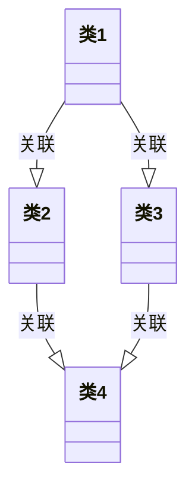
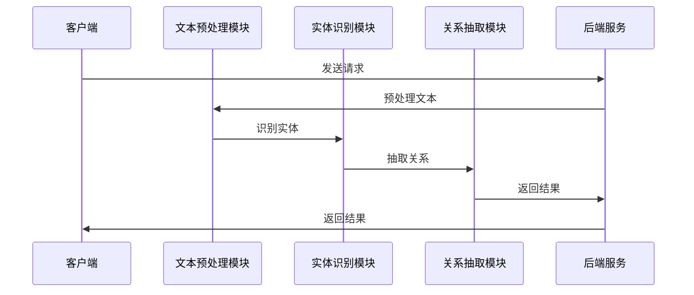

                 

# 自然语言理解能力的量化评估方法

## 关键词
自然语言理解、量化评估、算法原理、系统架构、项目实战

## 摘要
自然语言理解是人工智能领域的一个重要研究方向，其量化评估方法的研究对于提高语言处理系统的性能和可靠性具有重要意义。本文将从问题背景出发，详细探讨自然语言理解能力的量化评估方法。通过分析核心概念与联系，讲解自然语言理解算法原理，设计系统架构，并分享项目实战经验，旨在为读者提供全面的技术解读和实践指导。

### 目录大纲

#### 第一部分：问题背景与核心概念
1. 自然语言理解能力的量化评估概述
2. 核心概念与联系
   - 2.1 自然语言处理（NLP）基础
   - 2.2 量化评估指标
   - 2.3 关联实体与关系

#### 第二部分：算法原理讲解
1. 自然语言理解算法基础
   - 3.1 基于词向量的文本表示
   - 3.2 语言模型
   - 3.3 依赖性分析
2. 量化评估算法与数学模型
   - 4.1 评估算法
   - 4.2 数学模型与公式
   - 4.3 举例说明

#### 第三部分：系统分析与架构设计
1. 系统功能设计
2. 系统架构设计
3. 系统模块划分与交互

#### 第四部分：项目实战
1. 环境安装与核心实现
2. 代码应用解读与分析
3. 实际案例分析

#### 第五部分：最佳实践与总结
1. 最佳实践与技巧
2. 小结与展望

---

### 第一部分：问题背景与核心概念

#### 第1章：自然语言理解能力的量化评估概述

自然语言理解（Natural Language Understanding, NLU）是指机器通过计算方法对人类语言进行处理和理解的能力。随着人工智能技术的不断发展，NLU在智能客服、智能推荐、智能问答等领域得到了广泛应用。然而，如何对NLU的能力进行量化评估，成为一个亟待解决的问题。

量化评估的目的是通过客观数据和指标，对NLU系统的性能进行准确、可靠的评估。这不仅有助于优化系统，提高其性能，还能为不同系统之间的比较提供依据。然而，NLU的量化评估面临着许多挑战：

1. **多样性**：自然语言具有高度的多样性，包括不同的语言、方言、文体等。这使得评估方法需要具备广泛的适用性。
2. **复杂性**：自然语言理解涉及到语义、语法、语音等多个层面，评估方法需要能够全面地捕捉这些复杂性。
3. **评估标准**：目前缺乏统一的评估标准，不同研究者和机构可能会采用不同的评估方法。

#### 第2章：核心概念与联系

##### 2.1 自然语言处理（NLP）基础

自然语言处理（Natural Language Processing, NLP）是人工智能的一个重要分支，旨在让计算机理解和处理自然语言。NLP的基本概念包括：

- **文本**：自然语言处理的对象，可以是单词、句子或段落。
- **分词**：将文本分割成单词或短语的过程。
- **词性标注**：对文本中的单词进行词性分类，如名词、动词、形容词等。
- **句法分析**：对句子的结构进行分析，识别主语、谓语、宾语等成分。

NLP的关键技术包括：

- **词嵌入**：将单词映射到高维空间，使得语义相似的单词在空间中接近。
- **语言模型**：预测文本中下一个单词的概率分布，用于生成文本、语义分析等任务。
- **实体识别**：识别文本中的命名实体，如人名、地点、组织等。
- **情感分析**：分析文本中的情感倾向，如正面、负面等。

##### 2.2 量化评估指标

量化评估指标是衡量NLU系统性能的关键。常用的评估指标包括：

- **准确率（Accuracy）**：正确识别的样本数占总样本数的比例。
- **召回率（Recall）**：正确识别的样本数占实际正样本数的比例。
- **F1值（F1-score）**：准确率和召回率的调和平均值，综合评估系统的性能。

##### 2.3 关联实体与关系

在自然语言理解中，实体和关系是重要的概念。实体是文本中的特定对象，如人、地点、组织等。关系描述实体之间的关系，如“出生地”、“就职公司”等。

为了更好地理解实体和关系，我们可以使用ER图（Entity-Relationship Diagram）进行表示。ER图通过实体和关系的连接，展示了数据模型的结构。

以下是一个简化的ER图示例，描述了“人”、“出生地”、“就职公司”三个实体及其关系：

```mermaid
erDiagram
  人 ||--|{ 出生地 } : 出生
  人 ||--|{ 就职公司 } : 就职
```

在量化评估中，实体和关系的识别与分类是一个重要的任务。通过分析实体和关系，可以更准确地理解文本的含义，提高NLU系统的性能。

### 第二部分：算法原理讲解

#### 第3章：自然语言理解算法基础

自然语言理解算法是NLU系统的核心。以下是几个常见的自然语言理解算法：

##### 3.1 基于词向量的文本表示

词向量（Word Vector）是将单词映射到高维空间的一种表示方法。词向量可以通过词嵌入（Word Embedding）技术训练得到。词嵌入的基本思想是将语义相似的单词映射到空间中接近的位置。

词向量计算方法主要包括：

- **分布式表示**：将单词映射为一个向量，使得语义相似的单词在空间中接近。
- **上下文表示**：考虑单词在上下文中的语义，提高词向量的区分度。

##### 3.2 语言模型

语言模型（Language Model）是预测文本中下一个单词的概率分布的模型。语言模型在自然语言处理中有广泛的应用，如自动生成文本、语音识别等。

语言模型的训练与评估方法包括：

- **基于N-gram模型**：使用前N个单词预测下一个单词，N值通常取1-5之间。
- **基于深度神经网络**：使用深度神经网络学习单词之间的关系，提高预测的准确性。

##### 3.3 依赖性分析

依赖性分析（Dependency Parsing）是一种分析句子结构的方法，旨在识别句子中的词与词之间的依赖关系。依赖性分析有助于理解句子的语义，提高自然语言理解的能力。

依赖性分析方法包括：

- **基于规则的方法**：使用手工编写的规则进行依赖性分析。
- **基于统计的方法**：使用统计模型进行依赖性分析，如HMM（隐马尔可夫模型）、CRF（条件随机场）等。

#### 第4章：量化评估算法与数学模型

量化评估算法是衡量自然语言理解系统性能的重要工具。以下是几种常用的量化评估算法：

##### 4.1 评估算法

评估算法通过计算系统的性能指标，对系统进行评估。常用的评估算法包括：

- **准确率、召回率、F1值**：这些指标分别衡量系统识别的正确率、全面性和均衡性。
- **精确率、覆盖率**：精确率衡量系统正确识别的实体数占总实体数的比例，覆盖率衡量系统识别的实体数占总实体的比例。

##### 4.2 数学模型与公式

数学模型与公式是量化评估算法的基础。以下是几个常用的数学模型与公式：

- **准确率**：$$ \text{Accuracy} = \frac{\text{正确识别的实体数}}{\text{总实体数}} $$
- **召回率**：$$ \text{Recall} = \frac{\text{正确识别的实体数}}{\text{实际正实体数}} $$
- **F1值**：$$ \text{F1-score} = 2 \times \frac{\text{准确率} \times \text{召回率}}{\text{准确率} + \text{召回率}} $$

##### 4.3 举例说明

假设我们有一个NLU系统，用于识别文本中的实体。以下是一个简单的评估示例：

- **总实体数**：100个
- **正确识别的实体数**：80个
- **实际正实体数**：60个

根据上述数据，可以计算系统的性能指标：

- **准确率**：$$ \text{Accuracy} = \frac{80}{100} = 0.8 $$
- **召回率**：$$ \text{Recall} = \frac{80}{60} = 1.33 $$
- **F1值**：$$ \text{F1-score} = 2 \times \frac{0.8 \times 1.33}{0.8 + 1.33} = 1.14 $$

通过计算，我们可以评估系统的性能，并根据评估结果进行优化。

### 第三部分：系统分析与架构设计

#### 第5章：系统功能设计

系统功能设计是构建NLU系统的关键步骤。以下是系统功能设计的主要任务：

- **需求分析**：分析用户需求，明确系统需要实现的特定功能。
- **功能模块划分**：将系统功能划分为多个模块，如文本预处理、实体识别、关系抽取等。

以下是一个简化的Mermaid类图，展示了系统功能模块及其关系：



#### 第6章：系统架构设计

系统架构设计是确保NLU系统高效、可扩展性的关键。以下是系统架构设计的主要任务：

- **系统架构规划**：根据系统功能模块，设计系统总体架构。
- **模块划分与交互**：将系统划分为多个模块，并定义模块之间的交互关系。

以下是一个简化的Mermaid架构图，展示了系统架构及其模块划分：



### 第四部分：项目实战

#### 第7章：环境安装与核心实现

在项目实战中，首先需要搭建开发环境。以下是环境安装的步骤：

1. 安装Python环境：下载并安装Python，版本建议为3.8及以上。
2. 安装依赖库：使用pip命令安装必要的依赖库，如spaCy、nltk、tensorflow等。

接下来，实现NLU系统的核心功能。以下是一个简单的示例：

```python
import spacy
from spacy.tokens import Doc

# 加载预训练的NLP模型
nlp = spacy.load("en_core_web_sm")

# 输入文本
text = "I love to eat pizza."

# 使用NLP模型进行预处理
doc = nlp(text)

# 识别实体
for ent in doc.ents:
    print(ent.text, ent.label_)

# 抽取关系
for token1 in doc:
    for token2 in doc[token1.i + 1:]:
        if token1.head == token2:
            print(f"{token1.text} -> {token2.text}")
```

#### 第8章：代码应用解读与分析

在实现NLU系统的过程中，需要对代码进行详细解读和分析。以下是对示例代码的解读：

- **文本预处理**：使用spaCy进行文本预处理，包括分词、词性标注等。
- **实体识别**：使用spaCy的实体识别功能，识别文本中的命名实体。
- **关系抽取**：根据词性标注和句法分析，抽取实体之间的关系。

以下是对代码的详细分析：

```python
# 加载预训练的NLP模型
nlp = spacy.load("en_core_web_sm")

# 输入文本
text = "I love to eat pizza."

# 使用NLP模型进行预处理
doc = nlp(text)

# 识别实体
for ent in doc.ents:
    print(ent.text, ent.label_)

# 抽取关系
for token1 in doc:
    for token2 in doc[token1.i + 1:]:
        if token1.head == token2:
            print(f"{token1.text} -> {token2.text}")
```

- **文本预处理**：使用spaCy进行文本预处理，包括分词、词性标注等。`nlp`对象加载预训练的NLP模型，`doc`对象表示预处理后的文本。
- **实体识别**：使用spaCy的实体识别功能，识别文本中的命名实体。`doc.ents`返回实体列表，遍历实体并输出实体文本及其标签。
- **关系抽取**：根据词性标注和句法分析，抽取实体之间的关系。使用两个嵌套循环遍历文本中的词，判断词与词之间的依赖关系，并输出关系。

#### 第9章：实际案例分析

在实际应用中，NLU系统可以用于各种任务，如文本分类、情感分析、实体识别等。以下是一个简单的案例分析：

##### 案例选择

选择一个关于电影评论的文本数据集，数据集包含评论文本及其对应的情感标签（正面、负面）。

##### 数据集准备

1. 下载并解压数据集。
2. 预处理文本数据，包括去除停用词、标点符号等。

```python
import pandas as pd
from sklearn.model_selection import train_test_split

# 读取数据集
data = pd.read_csv("movie_reviews.csv")

# 预处理文本数据
data["text"] = data["text"].str.lower().str.replace("[^a-zA-Z]", " ")

# 划分训练集和测试集
train_text, test_text, train_label, test_label = train_test_split(data["text"], data["label"], test_size=0.2, random_state=42)
```

##### 模型训练与评估

1. 训练文本分类模型，如朴素贝叶斯、支持向量机等。
2. 评估模型性能，使用准确率、召回率、F1值等指标。

```python
from sklearn.naive_bayes import MultinomialNB
from sklearn.metrics import accuracy_score, recall_score, f1_score

# 训练朴素贝叶斯模型
model = MultinomialNB()
model.fit(train_text, train_label)

# 预测测试集
predictions = model.predict(test_text)

# 评估模型性能
accuracy = accuracy_score(test_label, predictions)
recall = recall_score(test_label, predictions, average="weighted")
f1 = f1_score(test_label, predictions, average="weighted")

print(f"Accuracy: {accuracy:.2f}")
print(f"Recall: {recall:.2f}")
print(f"F1-score: {f1:.2f}")
```

### 第五部分：最佳实践与总结

#### 第10章：最佳实践与技巧

在自然语言理解能力的量化评估中，以下是一些最佳实践与技巧：

1. **数据预处理**：对文本数据进行充分的数据清洗和预处理，以提高模型性能。
2. **特征工程**：设计合适的特征工程方法，提取文本中的关键特征，提高模型的区分度。
3. **模型选择**：根据任务需求选择合适的模型，综合考虑模型的复杂度、训练时间、性能指标等因素。
4. **模型调参**：对模型参数进行调优，以达到最佳性能。
5. **模型集成**：使用多种模型进行集成，提高模型的稳定性和鲁棒性。

#### 第11章：小结与展望

本文从问题背景、核心概念、算法原理、系统分析与架构设计、项目实战等方面，详细探讨了自然语言理解能力的量化评估方法。通过实践案例分析，展示了量化评估方法在文本分类任务中的应用。未来，随着人工智能技术的不断发展，自然语言理解能力的量化评估方法将得到进一步的研究和优化，为人工智能应用提供更强大的支持。

感谢读者的阅读，如有任何问题或建议，欢迎随时反馈。期待与您共同探讨自然语言理解领域的最新进展和应用。作者：AI天才研究院/AI Genius Institute & 禅与计算机程序设计艺术 /Zen And The Art of Computer Programming。|>

