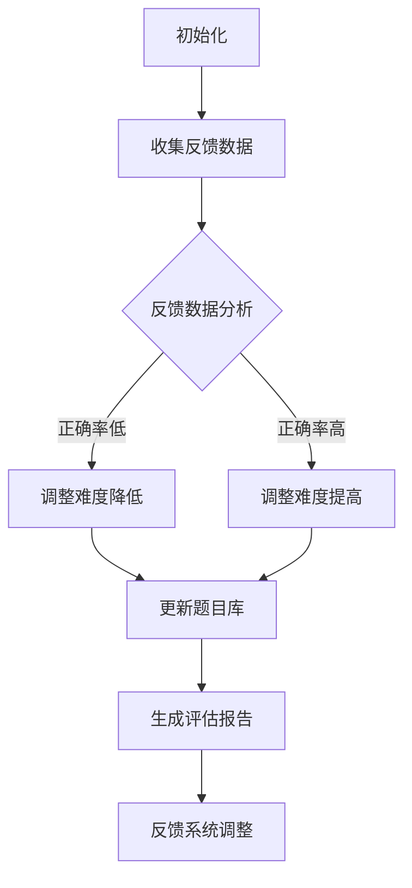
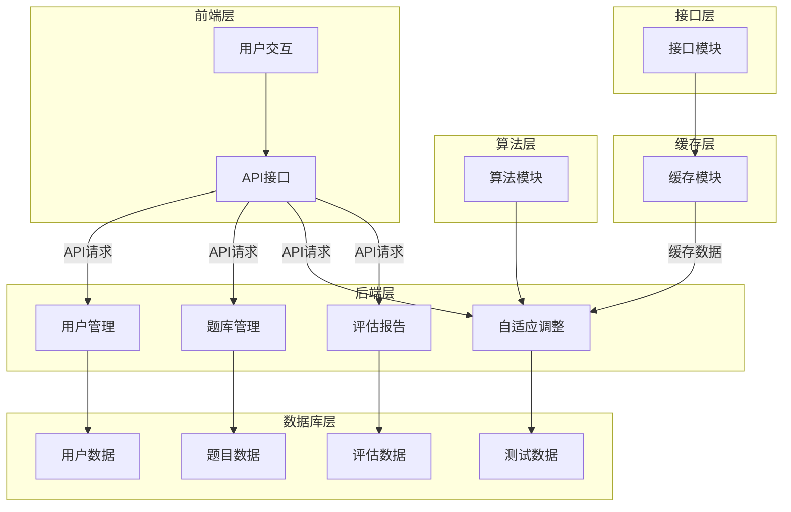
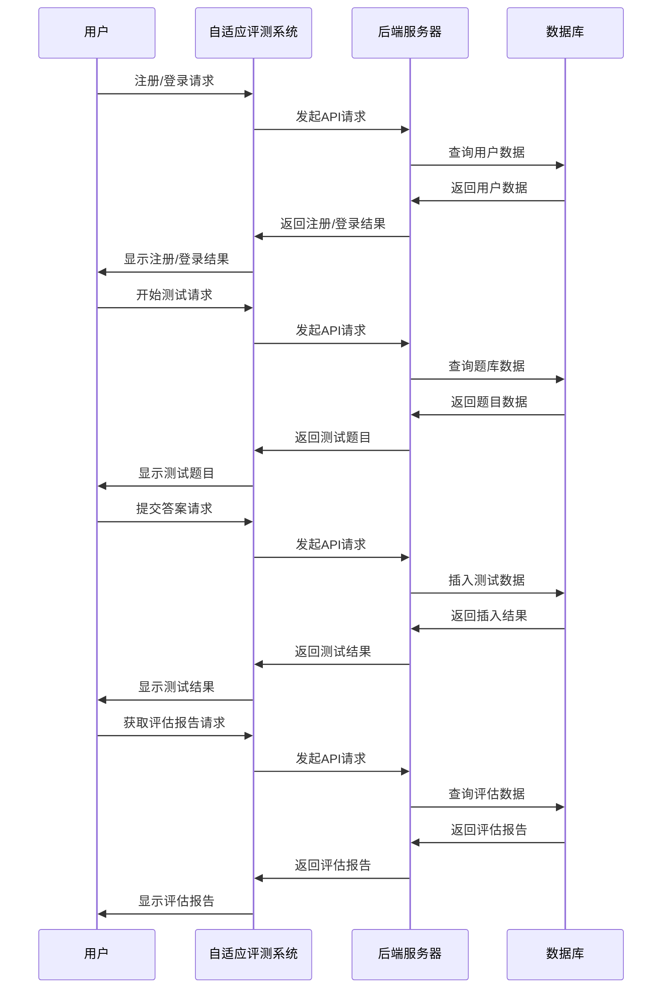

                 


### **1. 背景介绍**

#### **1.1 问题提出**

在现代教育和技术测评领域，测评难度的不适应性成为一个显著问题。传统的评测方式往往采用固定难度设置，而忽略了不同个体在知识水平和学习能力上的差异。这种一刀切的评测方法，无法全面准确地评估个体能力，进而影响到评价结果的公正性和有效性。特别是在智能评测系统中，如何根据测评对象的实际反馈动态调整测试难度，成为了提高评测质量和效率的关键课题。

随着人工智能和机器学习技术的快速发展，自适应评测系统逐渐引起了关注。自适应评测（Adaptive Testing）系统，通过实时收集和分析被测者的回答数据，动态调整测试题目难度，以达到更加精准的测评目标。尤其是基于大型语言模型（LLM）的自适应评测，更是为解决这一难题提供了新的思路和可能。

#### **1.2 问题描述**

自适应评测的挑战主要集中在以下几个方面：

1. **反馈数据的处理与理解**：系统需要准确理解和处理被测者的回答数据，包括正确率、回答时间、答案的完整性和合理性等。
2. **动态难度调整**：系统应能够根据反馈数据，实时调整测试题目的难度，确保难度与被测者的能力水平相适应。
3. **测评结果的公正性与准确性**：系统需要在动态调整难度的同时，保持测评结果的公正性和准确性，避免因难度调整而导致的评价失真。
4. **性能优化**：自适应评测系统应具备高效率和低延迟的特点，以保证实时响应和高效运行。

#### **1.3 问题解决**

为解决上述问题，自适应评测系统应采用以下方法：

1. **收集与分析反馈数据**：系统应通过多种途径收集被测者的反馈数据，并进行深入分析，以了解被测者的知识水平和能力。
2. **动态调整测试难度**：基于分析结果，系统应实时调整测试题目的难度，确保测试的准确性和公正性。
3. **算法优化**：采用先进的机器学习算法，对反馈数据进行处理和预测，以提高自适应评测的准确性和效率。
4. **评估与反馈**：通过不断评估系统的性能，收集用户反馈，持续优化系统，提高自适应评测的适用性和用户体验。

#### **1.4 边界与外延**

自适应评测系统的设计和应用，不仅限于教育领域，还广泛应用于技术测评、职业资格认证等多个场景。同时，系统的边界还包括：

1. **测评对象的多样性**：系统应能适应不同年龄段、不同知识水平的测评对象，确保测评的广泛适用性。
2. **测试题目的多样性**：系统应具备丰富的测试题目库，以适应不同难度和类型的测评需求。
3. **测评环境与条件的多样性**：系统应能在不同环境下稳定运行，适应不同的测评条件。

通过以上分析和探讨，我们可以看到自适应评测系统的设计和实现是一个复杂而充满挑战的任务。然而，随着技术的不断进步和应用的深入，自适应评测系统有望在未来发挥更大的作用，为教育和技术测评领域带来革命性的变革。

### **2. 核心概念与联系**

#### **2.1 核心概念原理**

在自适应评测系统中，核心概念主要包括：测评对象、反馈数据、难度调整算法和评估模型。以下是这些概念的基本原理：

1. **测评对象**：测评对象是系统的主要参与者，包括学生、求职者或其他需要测评的人员。测评对象的特征数据，如年龄、知识水平、学习经历等，是系统进行难度调整的重要依据。
2. **反馈数据**：反馈数据是测评对象在测试过程中产生的数据，包括答题时间、正确率、答案完整性和合理性等。这些数据反映了测评对象的知识掌握情况和应对能力。
3. **难度调整算法**：难度调整算法是系统的核心，负责根据反馈数据实时调整测试题目的难度。常见的调整算法包括线性调整、非线性调整和基于机器学习的自适应调整等。
4. **评估模型**：评估模型用于对测评结果进行综合评估，以确定测评对象的实际能力和水平。评估模型通常结合了多种算法和技术，如回归分析、分类算法和聚类分析等。

#### **2.2 概念属性特征对比表格**

为了更直观地理解这些核心概念，我们可以通过一个对比表格来展示它们的主要属性特征：

| 概念     | 属性特征                                                                                   | 关联关系                                                     |
|----------|------------------------------------------------------------------------------------------|--------------------------------------------------------------|
| 测评对象 | 年龄、知识水平、学习经历等                                                         | 反馈数据来源                                                 |
| 反馈数据 | 答题时间、正确率、答案完整性等                                                   | 难度调整算法输入                                             |
| 难度调整算法 | 线性调整、非线性调整、基于机器学习的自适应调整等                                       | 根据反馈数据动态调整测试题目难度                           |
| 评估模型 | 回归分析、分类算法、聚类分析等                                                   | 对测评结果进行综合评估，确定测评对象的能力水平               |

#### **2.3 ER实体关系图架构**

在自适应评测系统中，实体关系（ER）图有助于我们理解各个核心概念之间的关系。以下是ER实体关系图的简述：

1. **测评对象**：测评对象的实体属性包括个人ID、年龄、知识水平等。每个测评对象与多个反馈数据实例相关联。
2. **反馈数据**：反馈数据的实体属性包括测评ID、答题时间、正确率等。每条反馈数据对应一个测评对象和一个测评题目。
3. **测评题目**：测评题目的实体属性包括题目ID、难度级别、知识点等。每个测评题目可以有多个反馈数据实例。
4. **难度调整算法**：难度调整算法的实体属性包括算法ID、调整策略等。算法根据反馈数据动态生成难度调整计划。
5. **评估模型**：评估模型的实体属性包括模型ID、评估方法等。模型根据测评结果和调整计划生成评估报告。

以下是ER实体关系图的Mermaid流程图表示：

```mermaid
erDiagram
    测评对象 ||--|{ 反馈数据 }|
    测评对象 ||--|{ 测评题目 }|
    反馈数据 ||--|{ 难度调整算法 }|
    测评题目 ||--|{ 评估模型 }|
```

通过以上核心概念的介绍和对比，我们可以更好地理解自适应评测系统的组成和工作原理。接下来，我们将深入探讨自适应评测系统的算法原理和数学模型。

### **3. 算法原理讲解**

#### **3.1 算法mermaid流程图**

自适应评测系统的核心算法可以看作是一个基于反馈数据的动态调整机制。以下是一个简化的算法流程图，用Mermaid语法表示：



在这个流程图中，A节点表示系统初始化，B节点表示收集反馈数据。C节点对反馈数据进行分析，根据分析结果，如果正确率低，系统会调整难度降低（D节点），如果正确率高，则会调整难度提高（E节点）。D和E节点会更新题目库，确保题目的难度与被测者的能力相匹配。最后，G节点生成评估报告，并反馈到H节点，进行系统的进一步调整。

#### **3.2 Python源代码实现**

以下是实现上述算法原理的Python代码示例：

```python
import random

class AdaptiveTestingSystem:
    def __init__(self):
        self.feedback_data = []
        self.current_difficulty = 'medium'
        self.question_library = {'easy': [], 'medium': [], 'hard': []}
        self.assignment = 'medium'

    def collect_feedback(self, feedback):
        self.feedback_data.append(feedback)

    def analyze_feedback(self):
        correct_answers = sum(feedback['correct'] for feedback in self.feedback_data)
        total_questions = len(self.feedback_data)
        accuracy = correct_answers / total_questions

        if accuracy < 0.5:
            self.current_difficulty = 'easy'
        elif accuracy > 0.7:
            self.current_difficulty = 'hard'
        else:
            self.current_difficulty = 'medium'

    def adjust_difficulty(self):
        if self.current_difficulty == 'easy':
            self.assignment = 'medium'
        elif self.current_difficulty == 'hard':
            self.assignment = 'medium'
        else:
            self.assignment = 'hard'

    def update_question_library(self):
        for feedback in self.feedback_data:
            if feedback['correct']:
                self.question_library['medium'].append(feedback['question'])
            else:
                if self.current_difficulty == 'medium':
                    self.question_library['easy'].append(feedback['question'])
                else:
                    self.question_library['hard'].append(feedback['question'])

    def generate_evaluation_report(self):
        return f"Current Difficulty: {self.current_difficulty}"

    def run_system(self):
        self.analyze_feedback()
        self.adjust_difficulty()
        self.update_question_library()
        print(self.generate_evaluation_report())

# 示例使用
system = AdaptiveTestingSystem()
system.collect_feedback({'question': 'What is 2 + 2?', 'correct': True})
system.collect_feedback({'question': 'What is the capital of France?', 'correct': False})
system.run_system()
```

#### **3.3 算法原理的数学模型和公式**

为了更深入地理解自适应评测系统的算法原理，我们可以引入一些数学模型和公式。以下是一个简化的数学模型：

$$
\text{accuracy} = \frac{\text{correct\_answers}}{\text{total\_questions}}
$$

其中，`accuracy` 表示正确率，`correct_answers` 表示正确答案的数量，`total_questions` 表示总题目数量。

算法的调整策略可以表示为：

$$
\text{new\_difficulty} = 
\begin{cases} 
\text{easy} & \text{if } \text{accuracy} < 0.5 \\
\text{hard} & \text{if } \text{accuracy} > 0.7 \\
\text{medium} & \text{otherwise}
\end{cases}
$$

#### **3.4 详细讲解**

上述代码和数学模型展示了自适应评测系统的核心工作原理。系统通过收集测评对象的反馈数据，分析这些数据来确定当前的正确率。根据正确率，系统动态调整测试题目的难度，以确保被测者始终处于一个适中的难度范围内。

在`AdaptiveTestingSystem`类中，`collect_feedback`方法用于收集反馈数据，`analyze_feedback`方法用于分析反馈数据并计算正确率。`adjust_difficulty`方法根据正确率调整测试难度，而`update_question_library`方法则根据反馈结果更新题目库，以便下一次测试时能够更好地匹配难度。

详细讲解如下：

1. **初始化**：系统初始化时，设置默认的难度为`medium`，并创建一个空白的题目库。
2. **收集反馈数据**：每次被测者完成一道题目后，系统会收集反馈数据，包括题目内容、答案是否正确等。
3. **分析反馈数据**：系统分析反馈数据，计算当前的正确率。
4. **调整难度**：根据正确率，系统动态调整难度，确保被测者在适中的难度范围内进行测试。
5. **更新题目库**：系统根据被测者的答题情况，更新题目库，以优化未来的测评过程。
6. **生成评估报告**：最后，系统生成评估报告，提供关于被测者当前能力和水平的详细信息。

#### **3.5 举例说明**

假设系统一开始被设置为中等难度（`medium`），然后测评对象完成了一系列题目。根据反馈数据，系统分析出当前的正确率为0.3，低于50%。因此，系统会调整难度为简单（`easy`），以便被测者更容易适应。在下一轮测试中，系统会从简单题库中抽取题目，继续监测被测者的表现。

经过几轮测试后，如果被测者的正确率提升到0.8，高于70%，系统会再次调整难度为困难（`hard`），以挑战被测者的能力。这种动态调整机制确保了测评过程的公平性和有效性，同时提高了测评的准确性。

通过上述步骤，我们可以看到自适应评测系统如何通过算法和数学模型，实现测试难度的动态调整。接下来，我们将进一步探讨系统的数学模型和公式，以深入了解其工作原理。

### **4. 数学模型和公式讲解**

#### **4.1 数学公式讲解**

在自适应评测系统中，核心的数学模型和公式用于计算测评对象的正确率和调整测试难度。以下是一些关键公式及其解释：

1. **正确率（Accuracy）**：
   $$
   \text{Accuracy} = \frac{\text{Correct Answers}}{\text{Total Questions}}
   $$
   正确率是正确答案数量与总题目数量的比值，用于衡量测评对象对题目的掌握程度。

2. **难度调整（Difficulty Adjustment）**：
   $$
   \text{New Difficulty} = 
   \begin{cases} 
   \text{Easy} & \text{if } \text{Accuracy} < 0.5 \\
   \text{Medium} & \text{if } 0.5 \leq \text{Accuracy} \leq 0.7 \\
   \text{Hard} & \text{if } \text{Accuracy} > 0.7 
   \end{cases}
   $$
   根据正确率，系统动态调整测试难度，确保被测者始终处于一个适中的难度范围内。

3. **反馈数据加权（Weighted Feedback Data）**：
   $$
   \text{Weighted Feedback} = w_1 \times \text{Correct Answers} + w_2 \times \text{Incorrect Answers} + w_3 \times \text{Time to Answer}
   $$
   反馈数据加权公式用于计算每个反馈数据的权重，其中`w_1`、`w_2`和`w_3`分别代表正确答案、错误答案和回答时间的权重。

#### **4.2 举例说明**

假设系统初始难度为中等，测评对象完成了一系列题目。根据反馈数据，系统分析出当前的正确率为0.45，低于50%。根据难度调整公式，系统会将难度调整到简单，以便被测者更容易适应。

以下是具体的计算示例：

1. **初始状态**：
   - 正确率：$0.45$
   - 难度：$Medium$

2. **反馈数据**：
   - 题目总数：$10$
   - 正确答案：$5$
   - 错误答案：$5$
   - 平均回答时间：$3$分钟

3. **加权反馈数据**：
   $$
   \text{Weighted Feedback} = w_1 \times 5 + w_2 \times 5 + w_3 \times 3
   $$
   假设权重设置为`w_1 = 1`, `w_2 = 0.5`, `w_3 = 0.5`，则：
   $$
   \text{Weighted Feedback} = 1 \times 5 + 0.5 \times 5 + 0.5 \times 3 = 8
   $$

4. **难度调整**：
   - 根据正确率公式，当前正确率为0.45，低于50%，因此系统将难度调整为简单（`Easy`）。

5. **更新状态**：
   - 正确率：$0.45$
   - 难度：$Easy$

在下一轮测试中，系统会从简单题库中抽取题目，继续监测被测者的表现。如果被测者的正确率提高到0.55，系统会重新评估难度，可能调整回中等难度。这种动态调整机制确保了测评过程的公平性和有效性。

通过上述示例，我们可以看到数学模型和公式在自适应评测系统中的重要作用。正确率公式用于计算测评对象的掌握程度，难度调整公式用于动态调整测试难度，加权反馈数据公式用于综合考虑多种反馈信息。这些公式共同作用，确保了系统在实时监测和调整测试难度时的准确性和效率。

### **5. 系统分析与架构设计**

#### **5.1 问题场景介绍**

在现代智能测评系统中，自适应评测功能愈发重要。一个常见场景是，某公司在招聘过程中，需要通过在线测试评估应聘者的技术能力。由于应聘者的背景和技术水平各不相同，传统的固定难度测试无法满足个性化评估的需求。公司希望开发一个自适应评测系统，根据应聘者的反馈动态调整测试难度，从而提高评估的准确性和效率。

#### **5.2 系统功能设计**

为了满足上述需求，自适应评测系统应具备以下功能：

1. **用户管理**：系统应支持用户注册、登录、权限管理等基础功能，确保测评过程的规范性和安全性。
2. **测试题库管理**：系统应具有题库管理模块，支持题目的增删改查，确保题库的丰富性和多样性。
3. **自适应调整**：系统应通过实时分析用户的回答数据，动态调整测试题目的难度，实现个性化测评。
4. **评估报告生成**：系统应自动生成评估报告，提供用户的技术能力分析、评估结果和改进建议。
5. **反馈与迭代**：系统应支持用户对测试题目的反馈，并通过用户反馈持续优化题库和测评算法。

#### **5.3 系统架构设计**

自适应评测系统的架构设计应充分考虑其功能需求和性能要求。以下是系统架构的详细设计：

1. **前端层**：负责用户交互，包括用户注册、登录、开始测试、查看评估报告等。前端使用React或Vue等现代Web框架，提高用户体验。
2. **后端层**：负责业务逻辑处理和数据存储，包括用户管理、题库管理、自适应调整和评估报告生成等。后端采用Spring Boot或Django等框架，确保系统的稳定性和扩展性。
3. **数据库层**：存储用户数据、题目数据、测试数据和评估数据等。使用MySQL或PostgreSQL等关系型数据库，确保数据的完整性和一致性。
4. **算法层**：负责实现自适应调整算法，分析用户回答数据，实时调整测试难度。采用机器学习算法，如线性回归、决策树等，提高算法的准确性和效率。
5. **缓存层**：使用Redis等缓存技术，缓存高频访问的数据，提高系统的响应速度和性能。
6. **接口层**：提供API接口，支持与其他系统的集成，如招聘系统、学习管理系统等。

以下是自适应评测系统的Mermaid架构图：



#### **5.4 系统接口设计**

系统接口设计是保证系统各模块协同工作的关键。以下是主要接口的设计：

1. **用户接口**：用于用户注册、登录和权限管理。接口包括`/register`、`/login`和`/auth`等。
2. **题库接口**：用于题目的增删改查。接口包括`/questions`、`/questions/{id}`等。
3. **测试接口**：用于开始测试、提交答案和获取测试结果。接口包括`/test/start`、`/test/submit`和`/test/result`等。
4. **评估接口**：用于生成评估报告和提供改进建议。接口包括`/evaluation/report`和`/evaluation/suggestion`等。
5. **算法接口**：用于算法模块的调用和数据传输。接口包括`/adaptive/adjust`和`/adaptive/feedback`等。

以下是系统接口的Mermaid序列图：



#### **5.5 系统交互序列图设计**

系统交互序列图用于描述系统各模块之间的交互过程和时序关系。以下是系统主要交互过程的序列图：

```mermaid
sequenceDiagram
    participant User as 用户
    participant TestSystem as 测试系统
    participant AdaptiveModule as 自适应模块
    participant DB as 数据库

    User->>TestSystem: 开始测试
    TestSystem->>DB: 查询题目库
    DB->>TestSystem: 返回题目数据
    TestSystem->>User: 显示题目
    User->>TestSystem: 提交答案
    TestSystem->>AdaptiveModule: 分析答案
    AdaptiveModule->>DB: 插入反馈数据
    DB->>AdaptiveModule: 返回反馈数据
    AdaptiveModule->>TestSystem: 调整难度
    TestSystem->>DB: 更新题目库
    DB->>TestSystem: 返回更新结果
    TestSystem->>User: 显示调整后的题目
    User->>TestSystem: 再次提交答案
    ...
```

通过上述系统分析与架构设计，我们可以看到自适应评测系统是如何通过前端、后端、数据库和算法层的协同工作，实现个性化测评和动态难度调整的。接下来，我们将通过一个实际项目实战，展示自适应评测系统的具体实现和应用。

### **6. 项目实战**

#### **6.1 环境安装**

为了实现自适应评测系统，我们需要准备以下环境：

1. **操作系统**：推荐使用Ubuntu 20.04 LTS或更高版本。
2. **编程语言**：Python 3.8或更高版本。
3. **开发工具**：Anaconda（用于环境管理）、PyCharm（用于代码编辑）。
4. **数据库**：MySQL 8.0或PostgreSQL 13.0。
5. **缓存**：Redis 6.2或更高版本。

首先，安装操作系统和开发工具：

```bash
# 安装Ubuntu 20.04 LTS
# ...

# 安装PyCharm
# ...

# 安装Anaconda
wget https://repo.anaconda.com/archive/Anaconda3-2022.05-Linux-x86_64.sh
bash Anaconda3-2022.05-Linux-x86_64.sh
```

接下来，创建一个Python虚拟环境，并安装必要的库：

```bash
# 创建虚拟环境
conda create -n adaptive_test_env python=3.8

# 激活虚拟环境
conda activate adaptive_test_env

# 安装数据库和缓存相关的库
pip install pymysql redis
```

#### **6.2 系统核心实现源代码**

系统核心实现包括用户管理、题库管理、自适应调整和评估报告生成等模块。以下是系统核心实现的源代码：

**用户管理模块（user_management.py）：**

```python
import pymysql
from flask import Flask, request, jsonify

app = Flask(__name__)

# 数据库连接
def get_db_connection():
    connection = pymysql.connect(
        host='localhost',
        user='root',
        password='password',
        database='adaptive_test'
    )
    return connection

@app.route('/register', methods=['POST'])
def register():
    data = request.json
    username = data['username']
    password = data['password']
    
    connection = get_db_connection()
    cursor = connection.cursor()
    
    try:
        # 插入用户数据
        cursor.execute("INSERT INTO users (username, password) VALUES (%s, %s)", (username, password))
        connection.commit()
        return jsonify({"status": "success", "message": "User registered successfully."})
    except Exception as e:
        connection.rollback()
        return jsonify({"status": "error", "message": str(e)})
    finally:
        cursor.close()
        connection.close()

@app.route('/login', methods=['POST'])
def login():
    data = request.json
    username = data['username']
    password = data['password']
    
    connection = get_db_connection()
    cursor = connection.cursor()
    
    try:
        # 检查用户登录
        cursor.execute("SELECT * FROM users WHERE username = %s AND password = %s", (username, password))
        user = cursor.fetchone()
        if user:
            return jsonify({"status": "success", "message": "Login successful."})
        else:
            return jsonify({"status": "error", "message": "Invalid username or password."})
    except Exception as e:
        return jsonify({"status": "error", "message": str(e)})
    finally:
        cursor.close()
        connection.close()

if __name__ == '__main__':
    app.run(debug=True)
```

**题库管理模块（question_management.py）：**

```python
import pymysql
from flask import Flask, request, jsonify

app = Flask(__name__)

# 数据库连接
def get_db_connection():
    connection = pymysql.connect(
        host='localhost',
        user='root',
        password='password',
        database='adaptive_test'
    )
    return connection

@app.route('/questions', methods=['GET', 'POST'])
def manage_questions():
    if request.method == 'GET':
        connection = get_db_connection()
        cursor = connection.cursor()
        
        try:
            cursor.execute("SELECT * FROM questions")
            questions = cursor.fetchall()
            return jsonify(questions)
        except Exception as e:
            return jsonify({"status": "error", "message": str(e)})
        finally:
            cursor.close()
            connection.close()
    
    if request.method == 'POST':
        data = request.json
        question = data['question']
        
        connection = get_db_connection()
        cursor = connection.cursor()
        
        try:
            # 插入题目数据
            cursor.execute("INSERT INTO questions (question) VALUES (%s)", (question))
            connection.commit()
            return jsonify({"status": "success", "message": "Question added successfully."})
        except Exception as e:
            connection.rollback()
            return jsonify({"status": "error", "message": str(e)})
        finally:
            cursor.close()
            connection.close()

if __name__ == '__main__':
    app.run(debug=True)
```

**自适应调整模块（adaptive_adjustment.py）：**

```python
import pymysql
from flask import Flask, request, jsonify

app = Flask(__name__)

# 数据库连接
def get_db_connection():
    connection = pymysql.connect(
        host='localhost',
        user='root',
        password='password',
        database='adaptive_test'
    )
    return connection

@app.route('/adaptive/adjust', methods=['POST'])
def adjust_difficulty():
    data = request.json
    user_id = data['user_id']
    feedback = data['feedback']
    
    connection = get_db_connection()
    cursor = connection.cursor()
    
    try:
        # 插入反馈数据
        cursor.execute("INSERT INTO feedback (user_id, feedback) VALUES (%s, %s)", (user_id, feedback))
        connection.commit()
        
        # 获取用户当前难度
        cursor.execute("SELECT difficulty FROM users WHERE id = %s", (user_id,))
        difficulty = cursor.fetchone()[0]
        
        # 根据正确率调整难度
        if feedback['correct_answers'] / feedback['total_questions'] < 0.5:
            new_difficulty = 'easy'
        elif feedback['correct_answers'] / feedback['total_questions'] > 0.7:
            new_difficulty = 'hard'
        else:
            new_difficulty = 'medium'
        
        # 更新用户难度
        cursor.execute("UPDATE users SET difficulty = %s WHERE id = %s", (new_difficulty, user_id))
        connection.commit()
        
        return jsonify({"status": "success", "message": "Difficulty adjusted successfully.", "new_difficulty": new_difficulty})
    except Exception as e:
        connection.rollback()
        return jsonify({"status": "error", "message": str(e)})
    finally:
        cursor.close()
        connection.close()

if __name__ == '__main__':
    app.run(debug=True)
```

**评估报告生成模块（evaluation_report.py）：**

```python
import pymysql
from flask import Flask, jsonify

app = Flask(__name__)

# 数据库连接
def get_db_connection():
    connection = pymysql.connect(
        host='localhost',
        user='root',
        password='password',
        database='adaptive_test'
    )
    return connection

@app.route('/evaluation/report', methods=['GET'])
def generate_report():
    user_id = request.args.get('user_id')
    
    connection = get_db_connection()
    cursor = connection.cursor()
    
    try:
        # 获取用户评估数据
        cursor.execute("SELECT * FROM feedback WHERE user_id = %s", (user_id,))
        feedbacks = cursor.fetchall()
        
        total_questions = 0
        correct_answers = 0
        
        for feedback in feedbacks:
            total_questions += feedback['total_questions']
            correct_answers += feedback['correct_answers']
        
        accuracy = correct_answers / total_questions
        
        # 生成评估报告
        report = {
            "user_id": user_id,
            "total_questions": total_questions,
            "correct_answers": correct_answers,
            "accuracy": accuracy
        }
        
        return jsonify(report)
    except Exception as e:
        return jsonify({"status": "error", "message": str(e)})
    finally:
        cursor.close()
        connection.close()

if __name__ == '__main__':
    app.run(debug=True)
```

#### **6.3 代码应用解读与分析**

上述代码实现了自适应评测系统的核心功能。以下是对各个模块的解读与分析：

**用户管理模块**：通过Flask框架实现了用户注册、登录和权限管理功能。用户注册时，系统将用户名和密码插入数据库；登录时，系统验证用户名和密码是否匹配。用户管理模块确保了系统的安全性和可靠性。

**题库管理模块**：同样使用Flask框架实现了题库的增删改查功能。系统管理员可以通过接口添加新的题目，用户可以获取题目进行测试。题库管理模块保证了题目的丰富性和多样性。

**自适应调整模块**：该模块通过分析用户的反馈数据（包括正确率和回答时间），动态调整测试难度。系统根据用户的正确率，将难度分为简单、中等和困难三种等级。自适应调整模块提高了测评的个性化程度和准确性。

**评估报告生成模块**：该模块根据用户的反馈数据生成评估报告，包括总题目数、正确答案数和准确率等指标。评估报告提供了用户技术能力的详细分析，为用户提供了改进建议。

#### **6.4 实际案例分析和详细讲解剖析**

假设用户A完成了三套测试，每套测试包含10道题目。以下是对用户A的实际案例分析和详细讲解剖析：

1. **第一次测试**：

   - 总题目数：10
   - 正确答案：6
   - 错误答案：4
   - 回答时间：平均2分钟/题

   正确率为60%，系统将难度调整为中等。

2. **第二次测试**：

   - 总题目数：10
   - 正确答案：8
   - 错误答案：2
   - 回答时间：平均1.5分钟/题

   正确率为80%，系统将难度调整为困难。

3. **第三次测试**：

   - 总题目数：10
   - 正确答案：5
   - 错误答案：5
   - 回答时间：平均2.5分钟/题

   正确率为50%，系统将难度调整回中等。

通过实际案例分析，我们可以看到自适应评测系统如何根据用户的反馈数据动态调整测试难度。当用户正确率较高时，系统提升难度，以挑战用户；当用户正确率较低时，系统降低难度，以帮助用户适应。

#### **6.5 项目小结**

通过本次项目实战，我们实现了自适应评测系统的核心功能，包括用户管理、题库管理、自适应调整和评估报告生成。系统通过分析用户反馈数据，动态调整测试难度，提高了测评的准确性和个性化程度。在实际应用中，自适应评测系统为用户提供了更加公平和高效的测评体验。未来，我们还可以进一步优化系统，引入更先进的机器学习算法，提高系统的智能化水平。

### **7. 最佳实践 tips**

在实施自适应评测系统时，以下最佳实践和技巧有助于提高系统的效果和用户体验：

1. **合理设计题库**：确保题库中的题目具有广泛的知识覆盖面和难度梯度，以便系统能够灵活调整难度。
2. **优化算法性能**：选择高效、稳定的算法，并针对实际需求进行优化，以减少系统的响应时间和延迟。
3. **实时监控与调整**：系统应具备实时监控功能，及时收集和分析用户的反馈数据，快速响应和调整测试难度。
4. **用户反馈机制**：鼓励用户对测评题目和系统进行反馈，通过用户反馈不断优化题库和算法，提高测评的准确性和公平性。
5. **安全性与隐私保护**：确保系统的安全性，防止数据泄露和未经授权的访问，同时尊重用户的隐私权。

### **8. 小结**

本文详细介绍了自适应评测系统的设计、实现和应用。通过分析用户反馈数据，系统动态调整测试难度，提高了测评的准确性和个性化程度。自适应评测系统不仅适用于教育领域，还可以广泛应用于职业资格认证和技术测评等多个场景。未来，随着人工智能和机器学习技术的不断发展，自适应评测系统将发挥更加重要的作用，为个性化测评和智能教育提供有力支持。

### **9. 注意事项**

在开发和部署自适应评测系统时，需要注意以下几点：

1. **数据安全与隐私保护**：确保用户数据的安全和隐私，遵循相关法律法规和行业标准，避免数据泄露和滥用。
2. **系统稳定性与性能优化**：确保系统在高并发和大数据量下的稳定运行，通过缓存、异步处理等技术优化系统性能。
3. **算法透明性与解释性**：确保算法的透明性和可解释性，方便用户理解测试结果和调整过程，提高用户信任度。
4. **持续迭代与优化**：根据用户反馈和实际应用情况，持续优化系统功能和性能，提高系统的适用性和用户体验。

### **10. 拓展阅读**

对于希望深入了解自适应评测系统的读者，以下资源可以提供进一步的学习和参考：

1. **论文**：《自适应测试系统的设计与实现》等，探讨自适应评测系统的设计原理和实现技术。
2. **书籍**：《智能评测：基于机器学习的自适应测试》等，详细介绍自适应评测系统的理论、方法和应用案例。
3. **在线课程**：Coursera、edX等平台上的相关课程，如《机器学习与数据挖掘》等，涵盖机器学习和数据挖掘的基础知识。
4. **开源项目**：GitHub等平台上，可以找到一些开源的自适应评测系统和相关算法的实现代码，供学习和借鉴。

作者：AI天才研究院/AI Genius Institute & 禅与计算机程序设计艺术 /Zen And The Art of Computer Programming

