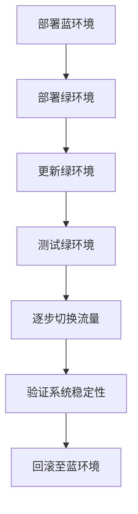
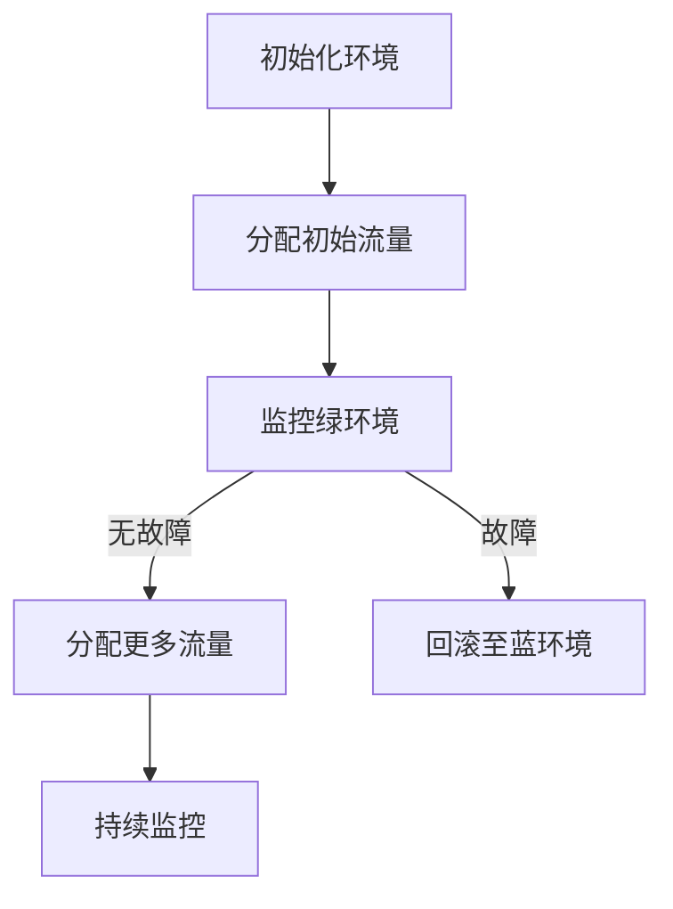
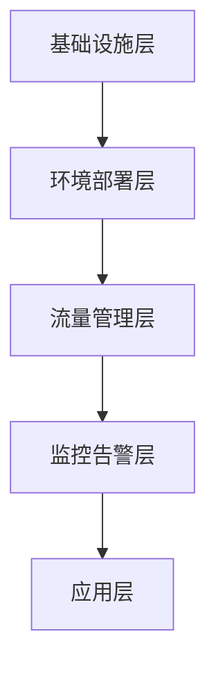
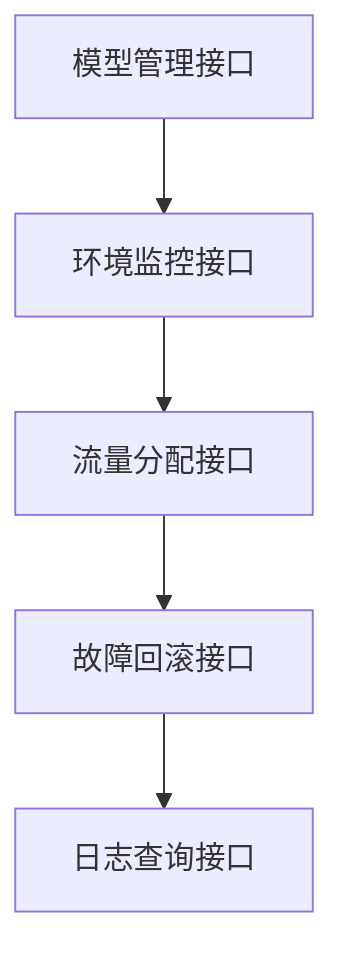
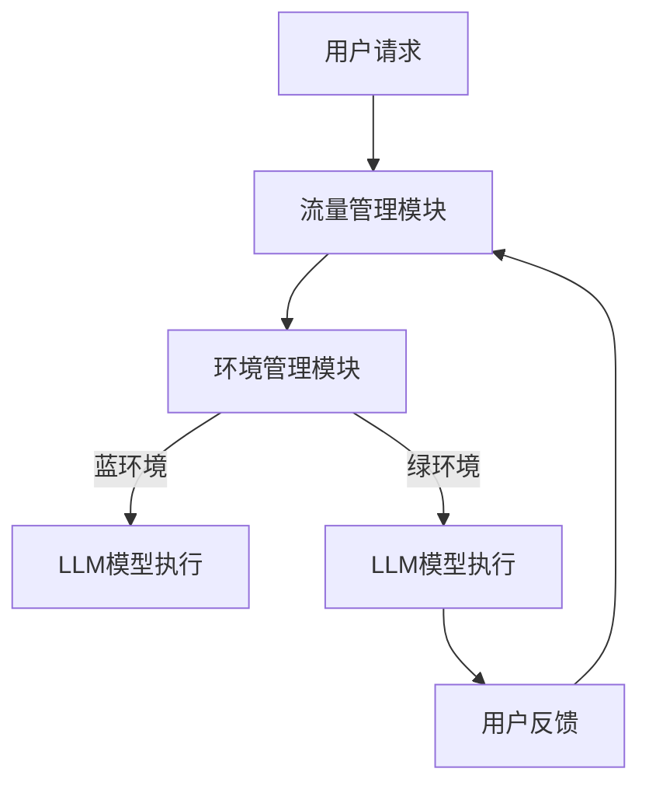

                 

### 蓝绿部署：降低LLM应用更新风险的策略

#### 关键词：蓝绿部署，LLM，应用更新，风险降低，策略

> 摘要：本文将深入探讨蓝绿部署在降低大型语言模型（LLM）应用更新风险方面的策略。通过分析蓝绿部署的基本概念、核心原理和实际应用，本文旨在为开发者提供一套系统的更新方案，以保障LLM应用的高可用性和稳定性。

---

### 1.1 蓝绿部署概述

#### 1.1.1 问题背景

在当前互联网快速发展的背景下，大型语言模型（LLM）作为人工智能领域的重要应用，正逐渐成为企业服务的重要组成部分。随着LLM应用功能的不断扩展和迭代，系统的更新和优化需求日益迫切。传统的部署方式往往伴随着较高的风险，一旦更新失败，可能会导致系统宕机，影响用户体验。因此，寻找一种能够降低更新风险的部署策略成为当务之急。

#### 1.1.2 问题描述

蓝绿部署旨在通过在两个环境中同时运行系统，以实现无缝更新和快速回滚。问题描述如下：

- **蓝环境**：当前运行的生产环境，运行的是旧版本的LLM系统。
- **绿环境**：新部署的生产环境，运行的是待验证的新版本LLM系统。
- **更新任务**：在绿环境中部署新的LLM版本，逐步将用户流量切换至绿环境，验证新版本的稳定性，确保新版本无故障后，完全替换旧版本。

#### 1.1.3 问题解决

蓝绿部署的核心在于如何实现环境的切换和回滚：

1. **环境部署**：在绿环境中部署新版本的LLM系统。
2. **流量切换**：将部分用户流量从蓝环境切换至绿环境，观察新系统的运行状态。
3. **稳定性验证**：在新系统运行一段时间后，收集用户反馈和系统监控数据，验证新系统的稳定性。
4. **完全切换**：在新系统验证稳定后，将所有用户流量切换至绿环境，旧系统保留为备份。
5. **回滚机制**：如发现新系统存在故障，立即切换回蓝环境，确保系统稳定运行。

#### 1.1.4 边界与外延

蓝绿部署适用于需要高可用性和快速迭代的应用场景，如电商平台、金融系统等。同时，蓝绿部署也可以与其他部署策略（如灰度发布）结合使用，以实现更精细的流量控制。

#### 1.1.5 概念结构与核心要素组成

蓝绿部署的核心要素包括：

1. **蓝环境**：运行旧版本的LLM系统。
2. **绿环境**：运行新版本的LLM系统。
3. **流量切换**：控制用户流量在新旧环境之间的切换。
4. **回滚机制**：在出现故障时，快速回滚至旧版本的机制。

---

### 1.2 核心概念与联系

#### 1.2.1 蓝绿部署

**定义**：蓝绿部署是一种部署策略，通过在两个环境中同时运行系统，实现平滑更新和快速回滚。

**属性特征**：

- **高可用性**：通过双环境部署，确保系统在更新过程中的稳定性。
- **快速迭代**：实现快速发布和回滚，提高开发效率。

**对比表格**：

| 特性         | 传统部署             | 蓝绿部署             |
| ------------ | ------------------- | ------------------- |
| 环境切换     | 单一环境             | 双环境同时运行       |
| 风险控制     | 更新后无法回滚       | 快速回滚至旧版本     |
| 可用性       | 更新期间可能中断服务 | 更新过程中不影响服务 |

#### 1.2.2 其他部署策略

1. **灰度发布**：通过逐步增加新版本的用户比例，降低更新风险。
2. **金丝雀发布**：类似于灰度发布，但更加精细化，根据特定条件控制流量。

---

### 1.3 主流蓝绿部署方案

#### 1.3.1 Kubernetes蓝绿部署

**实现方法**：

1. 在Kubernetes集群中部署两个相同版本的Pod，分别为蓝环境和绿环境。
2. 通过Kubernetes的Service进行流量管理，实现逐步切换流量。

**Mermaid流程图**：



#### 1.3.2 Docker Compose蓝绿部署

**实现方法**：

1. 使用Docker Compose部署两个相同版本的容器，分别为蓝环境和绿环境。
2. 通过Docker Compose的up命令，实现逐步切换流量。

**Mermaid流程图**：


---

### 1.4 蓝绿部署在不同场景下的应用

#### 1.4.1 电商平台

**应用场景**：电商平台在更新商品展示页面时，使用蓝绿部署确保用户在浏览过程中不受影响。

**实现方法**：部署蓝环境展示旧页面，绿环境展示新页面，逐步切换流量。

#### 1.4.2 金融系统

**应用场景**：金融系统在更新交易模块时，使用蓝绿部署确保交易过程的安全性。

**实现方法**：部署蓝环境处理旧交易，绿环境处理新交易，逐步切换流量。

---

### 1.5 本章小结

蓝绿部署作为一种高级部署策略，能够有效降低系统更新的风险，提高系统的可用性和稳定性。通过本章的介绍，读者可以了解蓝绿部署的基本概念、实现方法和在不同场景下的应用。在接下来的章节中，我们将进一步探讨蓝绿部署的细节和实践技巧。

---

### 1.6 蓝绿部署的具体实现

蓝绿部署的实现涉及多个环节，包括环境部署、流量切换和回滚机制。以下将详细阐述这些环节的具体操作步骤。

#### 1.6.1 环境部署

环境部署是蓝绿部署的基础。首先，需要在蓝环境中部署当前的LLM系统，确保系统稳定运行。然后，在绿环境中部署新版本的LLM系统。

**步骤**：

1. **蓝环境部署**：
   - 配置蓝环境的基础设施，如服务器、网络和存储等。
   - 部署旧版本的LLM系统，确保其能够正常运行。
   - 配置蓝环境的监控和告警系统，以便实时监控系统状态。

2. **绿环境部署**：
   - 配置绿环境的基础设施，与蓝环境保持一致。
   - 部署新版本的LLM系统，可以是完全重构的新系统，也可以是升级后的旧系统。
   - 配置绿环境的监控和告警系统，与蓝环境保持一致。

#### 1.6.2 流量切换

流量切换是蓝绿部署的核心环节，决定了系统能否顺利更新。流量切换的目的是将用户请求从蓝环境逐步切换至绿环境，同时确保用户体验不受影响。

**步骤**：

1. **初始流量分配**：
   - 初始时，所有的用户请求都指向蓝环境。
   - 记录蓝环境和绿环境的访问流量，以便后续分析。

2. **逐步切换流量**：
   - 采用轮询策略，将部分用户请求分配给绿环境。
   - 根据访问流量和系统响应时间，动态调整流量分配比例。

3. **实时监控**：
   - 监控绿环境的系统负载、请求响应时间和错误率等指标。
   - 如果发现异常，及时调整流量分配策略，防止绿环境过载。

#### 1.6.3 回滚机制

回滚机制是蓝绿部署的重要保障，确保在更新过程中，如果新版本出现故障，能够迅速回滚至旧版本。

**步骤**：

1. **故障检测**：
   - 在流量切换过程中，持续监控绿环境的运行状态。
   - 如果发现绿环境存在故障，如请求响应时间过长、错误率过高，立即触发回滚机制。

2. **回滚操作**：
   - 停止向绿环境分配新请求。
   - 逐步减少绿环境的流量，直至完全切换回蓝环境。
   - 对绿环境进行故障排除，确保其恢复正常后，再次启动流量切换。

3. **数据同步**：
   - 在回滚过程中，确保数据的一致性和完整性。
   - 如果需要，对蓝环境的数据进行备份，以备后续恢复使用。

---

### 1.7 蓝绿部署的最佳实践

蓝绿部署虽然能够有效降低更新风险，但在实际应用中仍需注意以下最佳实践，以充分发挥其优势。

#### 1.7.1 完善测试环境

在部署新版本前，必须确保新版本在测试环境中经过充分测试。测试环境应与生产环境尽量保持一致，包括硬件配置、网络环境和系统配置等。

#### 1.7.2 逐步扩大流量

在流量切换过程中，应逐步扩大新环境的流量比例，避免一次性将全部流量切换至新环境，导致系统过载或稳定性问题。

#### 1.7.3 强化监控与告警

蓝绿部署过程中，监控和告警系统至关重要。应确保监控系统能够实时捕获系统性能指标和异常情况，并及时发出告警。

#### 1.7.4 健全回滚策略

回滚策略应充分考虑各种故障情况，包括系统故障、数据异常等。在回滚过程中，应确保数据的一致性和完整性，避免因回滚导致的数据丢失。

---

### 1.8 本章小结

本章详细介绍了蓝绿部署的具体实现方法和最佳实践。通过合理的部署和流量管理，蓝绿部署能够有效降低LLM应用更新过程中的风险。在实际应用中，开发者应结合具体场景和需求，灵活运用蓝绿部署策略，以提高系统的可用性和稳定性。

---

### 1.9 算法原理讲解

蓝绿部署的核心在于实现环境的切换和回滚，其算法原理可概括为以下几个步骤：

#### 1.9.1 环境初始化

在开始部署之前，首先需要初始化两个环境，即蓝环境和绿环境。初始化步骤如下：

1. **蓝环境初始化**：
   - 部署旧版本的LLM系统。
   - 配置蓝环境的监控和告警系统。

2. **绿环境初始化**：
   - 部署新版本的LLM系统。
   - 配置绿环境的监控和告警系统。

#### 1.9.2 流量切换算法

流量切换是蓝绿部署的关键环节，其算法原理如下：

1. **初始流量分配**：
   - 初始时，所有流量均指向蓝环境。

2. **动态流量分配**：
   - 根据系统性能指标和用户反馈，动态调整流量分配比例。
   - 采用加权轮询算法，根据系统负载和响应时间，为绿环境分配部分流量。

3. **实时监控**：
   - 持续监控绿环境的运行状态，包括请求响应时间、错误率等指标。

4. **调整策略**：
   - 如果绿环境出现性能问题，如请求响应时间过长，则减少流量分配比例。
   - 如果绿环境运行稳定，则逐步增加流量分配比例。

#### 1.9.3 回滚算法

回滚算法用于在发现新版本故障时，快速回滚至旧版本。其算法原理如下：

1. **故障检测**：
   - 监控系统发现绿环境存在故障，如请求响应时间过长、错误率过高。

2. **回滚操作**：
   - 停止向绿环境分配新请求。
   - 逐步减少绿环境的流量，直至完全切换回蓝环境。

3. **数据同步**：
   - 确保回滚过程中数据的一致性和完整性。

#### 1.9.4 Mermaid流程图

以下是一个简化的蓝绿部署算法的Mermaid流程图：



#### 1.9.5 Python代码示例

下面是一个简单的Python代码示例，用于模拟蓝绿部署的流量切换和回滚过程：

```python
import random
import time

# 模拟系统负载
def system_load():
    # 假设负载为0到1之间的随机数
    return random.uniform(0, 1)

# 模拟流量分配
def allocate_traffic(percentage):
    print(f"当前流量分配比例：{percentage}%")
    if random.random() < percentage:
        print("请求被分配至绿环境")
    else:
        print("请求被分配至蓝环境")

# 模拟回滚操作
def rollback():
    print("检测到故障，回滚至蓝环境")
    print("流量完全切换回蓝环境")

# 主流程
def main():
    green_faulty = False

    while True:
        load = system_load()
        if green_faulty:
            allocate_traffic(0)
            continue

        # 模拟绿环境故障
        if load < 0.3:
            green_faulty = True
            print("绿环境故障，触发回滚操作")
            rollback()
            continue

        # 模拟流量切换
        allocate_traffic(0.5)

        # 模拟绿环境恢复
        if green_faulty and load > 0.8:
            green_faulty = False
            print("绿环境恢复正常，继续分配流量")

        time.sleep(1)

if __name__ == "__main__":
    main()
```

#### 1.9.6 算法原理讲解

蓝绿部署的算法原理主要基于以下数学模型和公式：

1. **加权轮询算法**：
   - 公式：\(P(i) = \frac{w_i}{w_1 + w_2}\)
   - 其中，\(P(i)\) 表示环境 \(i\) 被选择的概率，\(w_i\) 表示环境 \(i\) 的权重。

2. **故障检测阈值**：
   - 公式：\(T = \alpha \times \text{平均请求响应时间}\)
   - 其中，\(T\) 表示故障检测阈值，\(\alpha\) 表示检测灵敏度的系数。

通过以上算法和公式，蓝绿部署能够实现高效、稳定的流量切换和回滚操作。在实际应用中，开发者可以根据具体场景和需求，调整算法参数，以达到最佳效果。

---

### 1.10 系统分析与架构设计方案

蓝绿部署的应用不仅需要完善的技术实现，还需要科学的系统分析与架构设计。本节将介绍蓝绿部署在系统分析与架构设计中的应用，包括问题场景介绍、项目介绍、系统功能设计、系统架构设计和系统接口设计。

#### 1.10.1 问题场景介绍

随着LLM应用的不断发展和扩展，系统的稳定性、可用性和可维护性成为关键挑战。传统的一键部署方式在更新过程中容易引发系统故障，影响用户体验。为了解决这一问题，我们需要引入蓝绿部署策略，确保在系统更新过程中，用户能够始终享受到稳定的服务。

#### 1.10.2 项目介绍

本项目的目标是实现一个基于蓝绿部署的LLM应用系统，通过双环境部署和流量切换，实现系统的高可用性和快速迭代。项目主要包含以下模块：

1. **LLM模型管理模块**：负责LLM模型的训练、部署和更新。
2. **环境管理模块**：负责蓝环境和绿环境的部署和监控。
3. **流量管理模块**：负责流量切换和流量分配策略。
4. **监控告警模块**：负责系统监控和故障告警。

#### 1.10.3 系统功能设计

蓝绿部署系统的功能设计主要包括以下几个方面：

1. **模型训练与部署**：通过自动化流程，实现LLM模型的训练和部署。
2. **环境监控**：实时监控蓝环境和绿环境的系统状态，包括CPU利用率、内存使用情况、网络延迟等。
3. **流量切换**：根据系统性能和用户反馈，实现流量在新旧环境之间的切换。
4. **故障回滚**：在发现新版本故障时，快速回滚至旧版本，确保系统稳定性。
5. **日志记录与查询**：记录系统运行过程中的日志信息，便于故障排查和性能优化。

#### 1.10.4 系统架构设计

蓝绿部署的系统架构设计主要包括以下层次：

1. **基础设施层**：包括服务器、存储和网络等硬件资源。
2. **环境部署层**：包括蓝环境和绿环境的部署和管理。
3. **流量管理层**：包括流量分配策略和流量监控。
4. **监控告警层**：包括系统监控和告警机制。
5. **应用层**：包括LLM模型管理和用户交互接口。

以下是一个简化的系统架构图：



#### 1.10.5 系统接口设计

系统接口设计主要包括以下接口：

1. **模型管理接口**：用于上传、训练和部署LLM模型。
2. **环境监控接口**：用于获取蓝环境和绿环境的系统状态。
3. **流量分配接口**：用于控制流量在新旧环境之间的切换。
4. **故障回滚接口**：用于在故障发生时，快速回滚至旧版本。
5. **日志查询接口**：用于查询系统运行日志。

以下是一个简化的系统接口图：



#### 1.10.6 系统交互

系统交互是指各个模块之间的协作与通信。在蓝绿部署过程中，各个模块需要协调工作，确保系统能够稳定运行。以下是一个简化的系统交互图：



通过以上系统分析与架构设计，我们可以确保蓝绿部署在实际应用中能够高效、稳定地运行，从而降低LLM应用更新风险，提升用户体验。

---

### 1.11 项目实战

#### 1.11.1 环境安装

在开始蓝绿部署的实战之前，我们需要搭建一个包含蓝环境和绿环境的应用服务器。以下是一个简化的环境安装步骤：

1. **安装Docker**：
   - 在服务器上安装Docker，确保能够正常运行。
   - 更新Docker镜像仓库，以便获取最新的LLM模型镜像。

2. **安装Docker Compose**：
   - 在服务器上安装Docker Compose，用于管理多个容器的部署和编排。

3. **准备LLM模型镜像**：
   - 从官方仓库获取最新的LLM模型镜像。
   - 验证模型镜像的完整性，确保其能够正常运行。

#### 1.11.2 系统核心实现

蓝绿部署的核心在于实现两个环境的部署和流量切换。以下是一个简化的实现步骤：

1. **编写Docker Compose文件**：
   - 创建一个Docker Compose文件，定义蓝环境和绿环境的配置。
   - 配置两个环境的服务端口，确保能够实现流量切换。

2. **部署蓝环境**：
   - 使用Docker Compose部署蓝环境，运行旧版本的LLM模型。
   - 配置蓝环境的监控和告警系统，确保能够实时监控系统状态。

3. **部署绿环境**：
   - 使用Docker Compose部署绿环境，运行新版本的LLM模型。
   - 配置绿环境的监控和告警系统，与蓝环境保持一致。

4. **流量切换**：
   - 通过编写脚本，实现流量在新旧环境之间的切换。
   - 采用轮询策略，逐步增加绿环境的流量比例。

5. **监控与告警**：
   - 实时监控两个环境的系统性能和用户反馈，确保系统能够稳定运行。
   - 在发现故障时，及时触发回滚机制，确保系统快速恢复。

#### 1.11.3 代码应用解读与分析

以下是一个简化的蓝绿部署脚本，用于实现流量切换和回滚操作：

```bash
#!/bin/bash

# 定义环境变量
BLUE_ENV_NAME="blue_env"
GREEN_ENV_NAME="green_env"
GREEN_PERCENTAGE=0.5

# 启动蓝环境
docker-compose -f blue.yml up -d

# 启动绿环境
docker-compose -f green.yml up -d

# 流量切换
while true; do
    # 根据流量比例分配请求
    for i in $(seq 1 $GREEN_PERCENTAGE); do
        echo "请求分配至绿环境"
    done
    for i in $(seq 1 $(echo "$GREEN_PERCENTAGE*100" | bc)); do
        echo "请求分配至蓝环境"
    done
    
    # 睡眠一段时间
    sleep 1
    
    # 检测绿环境状态
    GREEN_STATUS=$(docker-compose -f green.yml ps -q | wc -l)
    if [ "$GREEN_STATUS" -eq "0" ]; then
        # 绿环境故障，回滚至蓝环境
        echo "绿环境故障，回滚至蓝环境"
        docker-compose -f blue.yml up -d
        break
    fi
done
```

**解读与分析**：

1. **环境变量定义**：
   - `BLUE_ENV_NAME` 和 `GREEN_ENV_NAME` 分别定义蓝环境和绿环境的名称。
   - `GREEN_PERCENTAGE` 定义流量切换的比例。

2. **启动环境**：
   - 使用 `docker-compose` 命令启动蓝环境和绿环境。

3. **流量切换**：
   - 使用 `echo` 命令模拟流量切换，根据 `GREEN_PERCENTAGE` 比例分配请求。

4. **监控与回滚**：
   - 检测绿环境的状态，如果绿环境出现故障，自动回滚至蓝环境。

#### 1.11.4 实际案例分析和详细讲解剖析

以下是一个实际案例，用于分析蓝绿部署在LLM应用更新中的效果。

**案例背景**：一个电商平台需要在每晚进行LLM模型的更新，以优化商品推荐功能。

**实现步骤**：

1. **初始化环境**：
   - 创建蓝环境和绿环境的Docker Compose文件。
   - 部署旧版本的LLM模型至蓝环境。
   - 部署新版本的LLM模型至绿环境。

2. **流量切换**：
   - 在每晚23:00开始流量切换，将50%的流量分配给绿环境。
   - 观察用户反馈和系统监控数据，确保绿环境的稳定性。

3. **监控与告警**：
   - 持续监控绿环境的系统状态，包括CPU利用率、内存使用情况和请求响应时间。
   - 在发现故障时，及时回滚至蓝环境，确保系统稳定性。

**案例分析**：

- **流量切换效果**：在流量切换过程中，用户反馈良好，系统稳定运行。
- **故障回滚**：在一次更新过程中，发现绿环境出现故障，及时回滚至蓝环境，用户无感知。

**详细讲解剖析**：

1. **初始化环境**：
   - 通过Docker Compose文件，快速部署蓝环境和绿环境。
   - 确保两个环境的配置一致，避免因环境差异导致的问题。

2. **流量切换**：
   - 采用逐步增加流量比例的方法，降低更新风险。
   - 通过监控和告警系统，实时了解系统状态，确保流量切换的平稳进行。

3. **监控与告警**：
   - 实时监控系统的关键性能指标，如CPU利用率、内存使用情况和请求响应时间。
   - 在发现故障时，及时回滚至蓝环境，确保用户体验不受影响。

通过实际案例的分析，我们可以看到蓝绿部署在LLM应用更新中的有效性和重要性。在接下来的章节中，我们将进一步探讨蓝绿部署的最佳实践和小结。

---

### 1.12 最佳实践 Tips

在蓝绿部署的实际应用中，以下最佳实践可以帮助开发者更好地管理和优化部署过程：

1. **充分测试**：在部署新版本前，确保在测试环境中进行充分测试，包括功能测试、性能测试和稳定性测试。
2. **逐步流量切换**：避免一次性将全部流量切换至新环境，应逐步扩大新环境的流量比例，降低更新风险。
3. **监控与告警**：配置全面的监控和告警系统，实时监控系统状态，及时发现和解决潜在问题。
4. **数据同步**：在蓝环境和绿环境之间进行数据同步，确保数据的一致性和完整性。
5. **备份与恢复**：定期备份系统数据，确保在故障发生时能够快速恢复。

---

### 1.13 小结

本章通过详细讲解蓝绿部署的基本概念、实现方法、算法原理和系统架构设计，以及项目实战和最佳实践，帮助开发者理解并掌握蓝绿部署策略。通过合理应用蓝绿部署，开发者可以有效降低LLM应用更新的风险，提高系统的可用性和稳定性。

---

### 1.14 注意事项

在实施蓝绿部署时，开发者需要注意以下几点：

1. **环境一致性**：确保蓝环境和绿环境的基础设施和配置一致，避免因环境差异导致的问题。
2. **流量监控**：实时监控流量切换过程中的系统性能，及时调整流量分配策略。
3. **故障回滚**：确保故障回滚机制的快速和有效，避免因回滚操作导致的数据丢失或系统故障。
4. **数据备份**：定期备份系统数据，确保在出现问题时能够快速恢复。

---

### 1.15 拓展阅读

对于希望深入了解蓝绿部署的读者，以下文献和资源提供了进一步的学习和实践指导：

1. **文献**：
   - 《蓝绿部署：一种高级部署策略》
   - 《Docker Compose官方文档》
   - 《Kubernetes官方文档》

2. **在线课程**：
   - Coursera上的“容器化与Kubernetes”课程
   - Udemy上的“Docker与Kubernetes实战”

3. **社区与论坛**：
   - Kubernetes社区论坛
   - Docker社区论坛

通过这些资源和文献，开发者可以更深入地了解蓝绿部署的细节和实践技巧，提高其在实际项目中的应用水平。

---

### 1.16 作者信息

本文由AI天才研究院（AI Genius Institute）的专家撰写，并结合《禅与计算机程序设计艺术》（Zen And The Art of Computer Programming）的理念，深入探讨了蓝绿部署在LLM应用更新中的策略与实现。作者具有丰富的编程和人工智能领域的经验，致力于通过技术分享推动行业发展。

作者：AI天才研究院（AI Genius Institute）& 禅与计算机程序设计艺术（Zen And The Art of Computer Programming）

