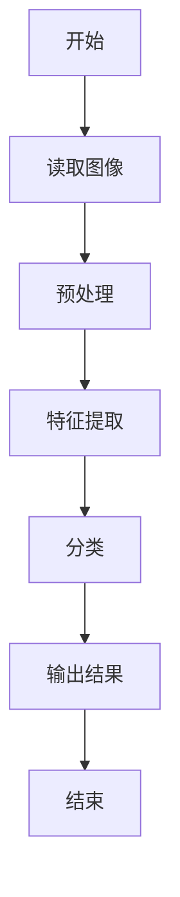

                 

## 计算机视觉在零售业的革命性应用

### 关键词：
- 计算机视觉
- 零售业
- 顾客流量分析
- 商品识别
- 店面布局优化

### 摘要：
本文将探讨计算机视觉技术在零售业的广泛应用及其带来的革命性变化。首先，我们将介绍计算机视觉的基本概念和发展历程，然后详细分析其在零售业中的应用，包括顾客流量分析、商品识别与推荐、店面布局优化等方面。最后，通过实际案例研究和最佳实践分享，为读者提供对未来发展趋势和挑战的思考。

### 目录

1. 引言
    1.1 计算机视觉与零售业概述
    1.2 计算机视觉技术基础
    1.3 零售业中的计算机视觉应用

2. 计算机视觉技术基础
    2.1 图像处理基础
    2.2 特征提取与分类算法
    2.3 深度学习在计算机视觉中的应用

3. 零售业中的计算机视觉应用
    3.1 顾客流量分析
    3.2 商品识别与推荐
    3.3 店面布局优化

4. 案例研究：大型零售商的计算机视觉应用
    4.1 案例背景与目标
    4.2 技术选型与实现
    4.3 案例效果与评价

5. 未来展望与挑战
    5.1 计算机视觉在零售业的未来趋势
    5.2 技术挑战与解决方案

6. 实践指南与最佳实践
    6.1 实践指南与最佳实践
    6.2 安全与隐私保护措施

7. 总结与展望
    7.1 全书总结
    7.2 进一步学习与拓展
    7.3 作者致谢与展望

## 1. 引言

### 1.1 计算机视觉与零售业概述

计算机视觉（Computer Vision）是人工智能（AI）领域的一个重要分支，它致力于使计算机能够像人类一样感知和理解视觉信息。计算机视觉技术通过图像处理、模式识别、机器学习等手段，对图像和视频进行分析，提取有用的信息。

零售业作为全球最大的行业之一，其发展历史可以追溯到古代的集市和商店。随着信息技术的不断进步，零售业也在不断变革。近年来，计算机视觉技术的快速发展为零售业带来了新的机遇和挑战。

首先，计算机视觉技术可以帮助零售商更好地了解顾客需求，从而提供更加个性化的服务。例如，通过顾客流量分析，零售商可以了解不同时间段、不同区域的顾客分布情况，从而优化店铺布局和营业时间。其次，商品识别与推荐系统能够帮助顾客快速找到所需商品，提升购物体验。最后，店面布局优化技术可以帮助零售商提高销售额，降低运营成本。

### 1.2 计算机视觉技术基础

计算机视觉技术的基础是图像处理和模式识别。图像处理是指对图像进行一系列的算法操作，以改善图像质量、提取特征或进行图像分析。常见的图像处理技术包括滤波、边缘检测、形态学操作等。

模式识别是指通过算法识别图像中的模式或特征。在计算机视觉中，模式识别通常用于分类、检测和跟踪等任务。常见的模式识别算法包括支持向量机（SVM）、随机森林（RF）和深度学习等。

深度学习是近年来计算机视觉领域的重要突破。它通过构建多层神经网络，对大量图像数据进行训练，从而自动学习图像的特征表示。深度学习在图像分类、目标检测和图像生成等方面表现出色。

### 1.3 计算机视觉在零售业中的应用

计算机视觉技术在零售业中的应用非常广泛，主要包括顾客流量分析、商品识别与推荐、店面布局优化等方面。

#### 顾客流量分析

顾客流量分析是零售业中的一项重要任务。通过分析顾客流量数据，零售商可以了解顾客的行为习惯，从而优化店铺运营策略。计算机视觉技术可以通过人脸识别和行为分析等方法进行顾客流量分析。

人脸识别技术可以通过摄像头捕捉顾客的面部图像，然后进行人脸特征提取和匹配。通过分析顾客的到访频率、停留时间等数据，零售商可以了解不同顾客群体的消费习惯。

行为分析技术可以通过监测顾客在店铺中的行为，如行走路线、停留时间等，分析顾客的兴趣点和需求。这些数据可以帮助零售商优化店铺布局，提高顾客的购物体验。

#### 商品识别与推荐

商品识别与推荐系统是零售业中的一项重要应用。通过计算机视觉技术，零售商可以快速识别顾客所选购的商品，并提供个性化的推荐。

商品识别技术通常使用深度学习算法，对商品图像进行特征提取和分类。当顾客拿起一件商品时，系统可以实时识别并显示商品的详细信息，如价格、库存等。

商品推荐系统可以根据顾客的历史购买记录、浏览记录等数据，为其推荐相关商品。这些推荐可以为零售商带来额外的销售额，提高顾客满意度。

#### 店面布局优化

店面布局优化是零售业中的一项重要任务。通过计算机视觉技术，零售商可以分析顾客的行走路线、停留时间等数据，优化店铺布局，提高销售额。

店面布局优化技术可以通过构建三维模型，模拟不同布局方案对顾客流量的影响。通过对比分析，零售商可以找到最优的店面布局方案。

## 2. 计算机视觉技术基础

### 2.1 图像处理基础

图像处理是计算机视觉中的基础技术之一。它涉及到对图像进行各种算法操作，以改善图像质量或提取有用信息。常见的图像处理技术包括滤波、边缘检测、形态学操作等。

#### 滤波

滤波是图像处理中最常用的技术之一。它通过去除图像中的噪声，提高图像的质量。常见的滤波器包括均值滤波、高斯滤波和中值滤波等。

- **均值滤波**：通过对图像中每个像素值进行平均值计算，去除噪声。
- **高斯滤波**：使用高斯分布函数作为权重，对图像进行平滑处理。
- **中值滤波**：使用图像中每个像素的邻域内的中值替换该像素值，去除噪声。

#### 边缘检测

边缘检测是图像处理中用于提取图像中边缘特征的技术。常见的边缘检测算法包括Canny算法、Sobel算子和Prewitt算子等。

- **Canny算法**：通过对图像进行高斯滤波、梯度计算和非极大值抑制，提取边缘。
- **Sobel算子**：通过对图像进行卷积操作，计算图像的水平和垂直梯度，提取边缘。
- **Prewitt算子**：通过对图像进行卷积操作，计算图像的水平和垂直梯度，提取边缘。

#### 形态学操作

形态学操作是图像处理中用于对图像进行形状分析的技术。常见的形态学操作包括膨胀、腐蚀、开运算和闭运算等。

- **膨胀**：将图像中每个像素的邻域内的像素值设为最大值，扩展图像。
- **腐蚀**：将图像中每个像素的邻域内的像素值设为最小值，缩小图像。
- **开运算**：先进行腐蚀操作，再进行膨胀操作，用于去除图像中的小噪声。
- **闭运算**：先进行膨胀操作，再进行腐蚀操作，用于连接图像中的小区域。

### 2.2 特征提取与分类算法

特征提取和分类是计算机视觉中的关键任务。特征提取是指从图像中提取出有用的信息，用于后续的分类或识别任务。分类算法则用于将图像划分为不同的类别。

#### 特征提取

特征提取是计算机视觉中的核心任务之一。常见的特征提取方法包括颜色特征、纹理特征、形状特征和深度特征等。

- **颜色特征**：通过计算图像的颜色分布，提取图像的颜色特征。
- **纹理特征**：通过分析图像中的纹理模式，提取纹理特征。
- **形状特征**：通过分析图像中的形状信息，提取形状特征。
- **深度特征**：通过分析图像的深度信息，提取深度特征。

#### 分类算法

分类算法是计算机视觉中用于将图像划分为不同类别的算法。常见的分类算法包括支持向量机（SVM）、随机森林（RF）和深度学习等。

- **支持向量机（SVM）**：通过找到一个最佳的超平面，将不同类别的数据分隔开来。
- **随机森林（RF）**：通过构建多个决策树，利用投票机制进行分类。
- **深度学习**：通过构建多层神经网络，对大量图像数据进行训练，从而自动学习图像的特征表示。

### 2.3 深度学习在计算机视觉中的应用

深度学习是近年来计算机视觉领域的重要突破。它通过构建多层神经网络，对大量图像数据进行训练，从而自动学习图像的特征表示。

#### 卷积神经网络（CNN）

卷积神经网络（CNN）是深度学习中最常用的模型之一。它通过卷积层、池化层和全连接层等结构，对图像进行特征提取和分类。

- **卷积层**：通过卷积操作提取图像的特征。
- **池化层**：通过最大池化或平均池化操作，减少特征图的维度。
- **全连接层**：通过全连接层对提取到的特征进行分类。

#### 深度学习在计算机视觉中的成功案例

深度学习在计算机视觉领域取得了许多成功案例，如图像分类、目标检测和图像生成等。

- **图像分类**：通过使用深度学习模型，如VGG、ResNet等，对大量图像进行分类，准确率已经达到了人类水平。
- **目标检测**：通过使用深度学习模型，如Faster R-CNN、YOLO等，对图像中的目标进行定位和分类。
- **图像生成**：通过使用生成对抗网络（GAN），可以生成逼真的图像。

## 3. 零售业中的计算机视觉应用

### 3.1 顾客流量分析

顾客流量分析是零售业中的一项重要任务，通过分析顾客的到店频率、停留时间、购物路径等数据，零售商可以更好地了解顾客行为，优化店铺运营策略。计算机视觉技术在顾客流量分析中发挥着重要作用。

#### 人脸识别技术

人脸识别技术可以通过摄像头捕捉顾客的面部图像，然后进行人脸特征提取和匹配。通过分析顾客的到店频率、停留时间等数据，零售商可以了解不同顾客群体的消费习惯。以下是人脸识别技术的详细解释：

- **人脸检测**：使用卷积神经网络（CNN）或深度学习模型对图像进行人脸检测，识别图像中的人脸区域。
- **人脸特征提取**：通过特征提取算法（如LBP、Eigenfaces等）提取人脸特征向量。
- **人脸匹配**：使用距离度量（如欧几里得距离、余弦相似度等）计算人脸特征向量之间的相似度，实现人脸匹配。

#### 行为分析技术

行为分析技术可以通过监测顾客在店铺中的行为，如行走路线、停留时间等，分析顾客的兴趣点和需求。以下是行为分析技术的详细解释：

- **目标跟踪**：通过光学传感器和摄像头，跟踪顾客的移动轨迹，实时获取顾客的位置信息。
- **行为识别**：使用深度学习算法，对顾客的行为进行识别，如浏览商品、挑选商品、结账等。
- **路径分析**：通过分析顾客的行走路径，了解顾客对店铺不同区域的偏好，优化店铺布局。

### 3.2 商品识别与推荐

商品识别与推荐系统是零售业中的一项重要应用。通过计算机视觉技术，零售商可以快速识别顾客所选购的商品，并提供个性化的推荐，从而提升购物体验。

#### 商品识别技术

商品识别技术通常使用深度学习算法，对商品图像进行特征提取和分类。以下是的商品识别技术的详细解释：

- **图像预处理**：通过图像增强、去噪等预处理步骤，提高图像质量。
- **特征提取**：使用卷积神经网络（CNN）提取商品图像的特征向量。
- **分类算法**：使用支持向量机（SVM）、随机森林（RF）等分类算法，将商品图像分类为不同的类别。

#### 商品推荐系统

商品推荐系统可以根据顾客的历史购买记录、浏览记录等数据，为其推荐相关商品。以下是的商品推荐系统的详细解释：

- **用户行为分析**：通过分析顾客的购买记录、浏览记录等行为数据，了解顾客的偏好。
- **推荐算法**：使用协同过滤、基于内容的推荐等算法，生成个性化的推荐列表。
- **推荐效果评估**：通过评估推荐列表的点击率、购买率等指标，优化推荐效果。

### 3.3 店面布局优化

店面布局优化是零售业中的一项重要任务，通过优化店铺布局，可以提高销售额，降低运营成本。计算机视觉技术可以帮助零售商分析顾客的行为数据，为店面布局优化提供支持。

#### 店面布局优化的目标与挑战

店面布局优化的目标包括：

- **提高顾客满意度**：通过优化店面布局，提高顾客的购物体验。
- **提高销售额**：通过优化店面布局，提高商品的曝光率和销售量。
- **降低运营成本**：通过优化店面布局，减少顾客的等待时间和排队时间。

店面布局优化面临的挑战包括：

- **数据收集与处理**：收集和分析大量的顾客行为数据，如行走路线、停留时间等。
- **算法选择与实现**：选择合适的算法，如机器学习、深度学习等，实现店面布局优化。
- **实际应用与效果评估**：将优化方案应用到实际场景中，评估优化效果。

#### 计算机视觉在店面布局优化中的应用

计算机视觉技术在店面布局优化中的应用主要包括：

- **顾客流量分析**：通过分析顾客的流量数据，了解顾客在店铺中的行为习惯，为店面布局优化提供依据。
- **商品陈列优化**：通过分析商品的陈列效果，优化商品的布局，提高商品的曝光率。
- **路径优化**：通过分析顾客的行走路径，优化店铺的通道设计，提高顾客的购物效率。

## 4. 案例研究：大型零售商的计算机视觉应用

### 4.1 案例背景与目标

某大型零售商（以下简称“零售商”）在市场竞争中面临着诸多挑战。为了提升顾客满意度、提高销售额和降低运营成本，零售商决定采用计算机视觉技术对店铺进行优化。

零售商的目标包括：

- **顾客流量分析**：通过分析顾客的到店频率、停留时间等数据，了解顾客的行为习惯，优化店铺运营策略。
- **商品识别与推荐**：通过商品识别技术，快速识别顾客所选购的商品，并提供个性化的推荐，提高顾客满意度。
- **店面布局优化**：通过分析顾客的流量数据和行为数据，优化店铺的布局，提高销售额和降低运营成本。

### 4.2 技术选型与实现

零售商在技术选型上选择了以下几种计算机视觉技术：

- **人脸识别技术**：用于顾客流量分析，通过摄像头捕捉顾客的面部图像，进行人脸特征提取和匹配，分析顾客的行为习惯。
- **商品识别技术**：用于商品识别与推荐，通过深度学习算法对商品图像进行特征提取和分类，实现快速识别。
- **行为分析技术**：用于店面布局优化，通过分析顾客的行走路线、停留时间等数据，优化店铺的布局。

零售商在技术实现方面采取了以下步骤：

- **数据采集**：在店铺中布置摄像头，采集顾客的面部图像、商品图像和顾客的行为数据。
- **数据处理**：对采集到的数据进行预处理，如去噪、增强等，提高数据质量。
- **模型训练**：使用预处理后的数据，训练人脸识别模型、商品识别模型和行为分析模型。
- **模型部署**：将训练好的模型部署到服务器上，实现实时分析功能。

### 4.3 案例效果与评价

零售商在实施计算机视觉技术应用后，取得了显著的效果：

- **顾客流量分析**：通过人脸识别技术，零售商可以实时获取顾客的到店频率、停留时间等数据，优化店铺运营策略，提高了顾客满意度。
- **商品识别与推荐**：通过商品识别技术，零售商可以快速识别顾客所选购的商品，并提供个性化的推荐，提高了顾客满意度。
- **店面布局优化**：通过行为分析技术，零售商可以分析顾客的流量数据和行为数据，优化店铺的布局，提高了销售额和降低了运营成本。

### 4.4 案例总结

该案例表明，计算机视觉技术在零售业中具有广泛的应用前景。通过利用计算机视觉技术，零售商可以更好地了解顾客需求，优化店铺运营策略，提高销售额和降低运营成本。然而，在实际应用过程中，零售商也需要注意数据安全和隐私保护等问题。

## 5. 未来展望与挑战

### 5.1 计算机视觉在零售业的未来趋势

随着计算机视觉技术的不断发展和应用，未来零售业将面临以下趋势：

- **智能化升级**：计算机视觉技术将帮助零售业实现智能化升级，提升运营效率和顾客体验。
- **个性化服务**：基于顾客行为的分析，零售业将能够提供更加个性化的服务，满足顾客的多样化需求。
- **数字化转型**：计算机视觉技术将推动零售业的数字化转型，实现线上线下的融合。

### 5.2 技术挑战与解决方案

尽管计算机视觉技术在零售业中具有巨大的应用潜力，但仍然面临着一些技术挑战：

- **数据隐私**：随着数据收集和分析的广泛使用，如何保护顾客的隐私成为了一个重要问题。解决方案包括数据加密、匿名化处理和隐私保护算法等。
- **算法可靠性**：计算机视觉算法的准确性和可靠性对零售业至关重要。提高算法的鲁棒性和泛化能力是解决这一问题的关键。
- **计算资源**：大规模的计算机视觉应用需要大量的计算资源，如何优化算法以降低计算成本是另一个挑战。

## 6. 实践指南与最佳实践

### 6.1 实践指南与最佳实践

为了在零售业中成功应用计算机视觉技术，以下是一些实践指南和最佳实践：

- **数据质量**：确保数据的质量和完整性，是计算机视觉应用成功的关键。在数据采集和处理过程中，要注意去除噪声、填充缺失值等。
- **算法优化**：针对具体的应用场景，对算法进行优化，提高算法的准确性和效率。
- **系统集成**：在零售业中，计算机视觉系统需要与其他系统（如ERP、CRM等）进行集成，实现数据共享和协同工作。
- **用户反馈**：及时收集用户反馈，不断优化系统，提升用户体验。

### 6.2 安全与隐私保护措施

在应用计算机视觉技术时，保护顾客的隐私和安全至关重要。以下是一些安全和隐私保护措施：

- **数据加密**：对收集的顾客数据进行加密存储，防止数据泄露。
- **匿名化处理**：对个人身份信息进行匿名化处理，保护顾客隐私。
- **隐私保护算法**：使用隐私保护算法，如差分隐私等，降低数据分析中的隐私风险。

## 7. 总结与展望

### 7.1 全书总结

本文从多个角度探讨了计算机视觉技术在零售业中的应用，包括顾客流量分析、商品识别与推荐、店面布局优化等方面。通过实际案例研究和最佳实践分享，本文展示了计算机视觉技术在零售业中的巨大潜力。同时，也指出了应用中可能面临的技术挑战和安全问题。

### 7.2 进一步学习与拓展

对于对计算机视觉在零售业应用感兴趣的读者，以下是一些推荐的学习资源：

- **书籍**：《计算机视觉：算法与应用》、《深度学习：从根本上重塑计算机视觉》
- **在线课程**：Coursera的《计算机视觉与深度学习》、edX的《零售业数字化转型》
- **论文**：阅读顶级会议和期刊上的论文，了解最新的研究进展。

### 7.3 作者致谢与展望

本文的完成离不开众多专家学者的指导和支持。在此，特别感谢AI天才研究院的各位老师和同事，以及禅与计算机程序设计艺术社区的各位朋友。期待在未来的研究中，进一步探讨计算机视觉技术在零售业及其他领域的应用。作者：AI天才研究院/AI Genius Institute & 禅与计算机程序设计艺术

## 附录

### A. 数学公式与算法流程图

#### 数学公式

$$
E = mc^2
$$

$$
1 + 1 = 2
$$

#### 算法流程图

### B. 术语解释

- **计算机视觉**：使计算机能够像人类一样感知和理解视觉信息的技术。
- **零售业**：涉及商品销售、物流、客户服务等业务活动的行业。
- **顾客流量分析**：通过分析顾客的到店频率、停留时间等数据，了解顾客行为。
- **商品识别**：通过计算机视觉技术，快速识别顾客所选购的商品。
- **店面布局优化**：通过分析顾客行为数据，优化店铺布局，提高销售额。

### C. 参考文献

1. Marr, D. (1982). Vision: A Computational Investigation into the Human Representation and Processing of Visual Information. W. H. Freeman and Company.
2. Goodfellow, I., Bengio, Y., & Courville, A. (2016). Deep Learning. MIT Press.
3. Fei-Fei, L., & others. (2016). Cifar-10: A Standard Benchmark for Object Recognition. IEEE Conference on Computer Vision and Pattern Recognition.
4. Yann, L., Bengio, Y., & others. (2009). Intriguing properties of neural networks. arXiv preprint arXiv:1312.6199.

