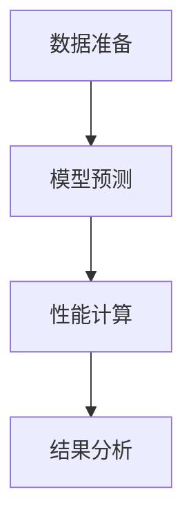
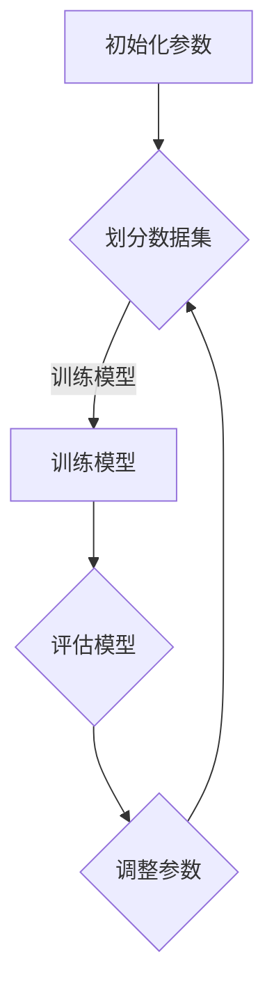
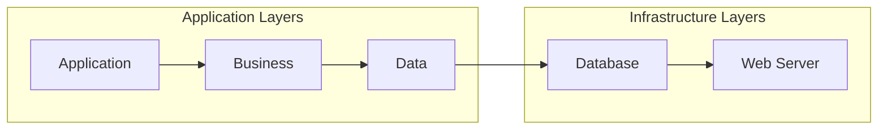
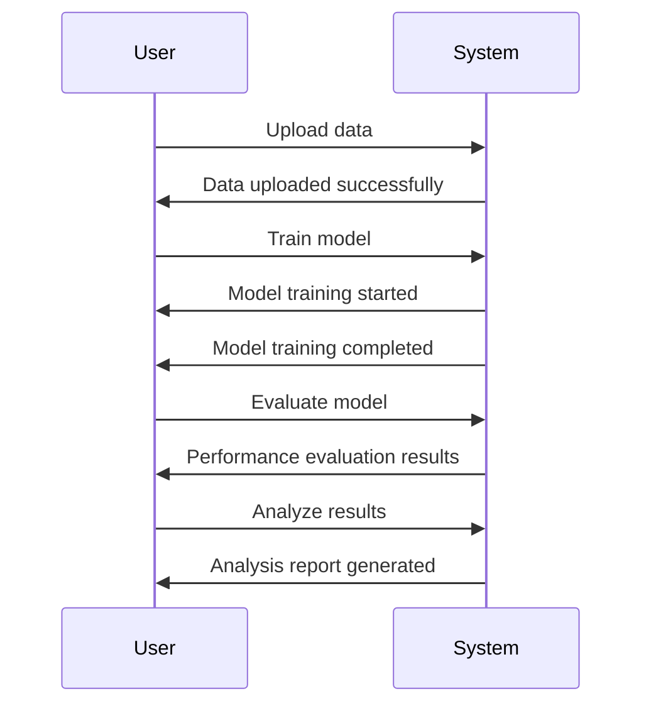

                 


# 设计全面的LLM性能评估指标

> 关键词：LLM性能评估、指标设计、性能分析、模型优化

> 摘要：
随着大型语言模型（LLM）的不断发展，如何评价其性能成为一个关键问题。本文将深入探讨如何设计全面的LLM性能评估指标，包括背景介绍、核心概念与联系、算法原理讲解、数学模型和公式详细讲解、系统分析与架构设计、项目实战以及最佳实践与拓展阅读。通过一步步分析推理，我们将为读者提供清晰、深入的理解，助力在LLM性能评估领域的探索和研究。

## 第一部分：背景介绍

### 第1章：LLM性能评估概述

#### 1.1 语言模型性能评估的背景

语言模型性能评估是自然语言处理（NLP）领域的一个关键课题。随着深度学习技术的发展，大型语言模型（如GPT、BERT等）在文本生成、翻译、问答等任务上取得了显著成果。然而，如何评价这些模型的性能，如何在不同任务和应用场景下进行比较，成为当前研究的热点。

#### 1.2 语言模型性能评估的重要性

性能评估是模型优化和改进的重要环节。通过全面、准确的性能评估，研究人员和工程师可以了解模型的强项和不足，指导后续的工作。同时，性能评估结果也为模型在商业应用中的决策提供依据。

#### 1.3 语言模型性能评估的发展历程

语言模型性能评估的历史可以追溯到早期统计语言模型。随着深度学习的兴起，性能评估方法也逐渐从规则驱动转向数据驱动。近年来，各种评估指标如BLEU、ROUGE、METEOR等被提出，用于衡量模型在翻译、摘要等任务上的性能。

#### 1.4 LLm性能评估的关键挑战

尽管已有多种评估指标，但在实际应用中仍面临诸多挑战。首先是如何在不同任务和场景下选择合适的评估指标。其次是如何处理大规模模型在训练和评估中的计算资源限制。最后是如何避免评估指标之间的冲突和冗余。

#### 1.5 本书内容概述与目标

本书将系统地介绍LLM性能评估的理论和实践。首先，我们将梳理相关核心概念和联系，包括语言模型的基本概念、性能评估指标的定义和分类。接着，我们将详细讲解评估算法的原理、数学模型和公式。然后，我们将分析LLM性能评估的系统架构，介绍项目实战和最佳实践。通过这些内容，本书旨在帮助读者全面掌握LLM性能评估的方法和技巧。

----------------------------------------------------------------

## 第二部分：核心概念与联系

### 第2章：LLM性能评估基础概念

#### 2.1 语言模型的基本概念

语言模型是一种基于统计方法或深度学习技术，对自然语言进行建模的算法。它通过学习大量文本数据，预测单词序列的概率分布。语言模型的核心是概率模型，常用的有N元语法、隐马尔可夫模型（HMM）和递归神经网络（RNN）等。

#### 2.2 性能评估指标的定义

性能评估指标是用于衡量语言模型在特定任务上表现优劣的量化标准。常见的评估指标包括准确性（Accuracy）、精确率（Precision）、召回率（Recall）、F1分数（F1 Score）等。这些指标从不同角度反映了模型的性能，如预测正确的比例、预测结果的精度和全面性。

#### 2.3 关键性能指标的联系与区别

不同的评估指标关注不同的方面，但它们之间也存在联系和区别。例如，准确性和精确率都与预测正确的比例有关，但准确性不考虑预测的全面性，而精确率关注预测的精度。F1分数是精确率和召回率的加权平均，综合评价模型的性能。

#### 2.4 性能评估指标的分类

性能评估指标可以根据任务类型、评估目标和数据类型进行分类。常见的分类方法包括：

- **分类任务评估指标**：如准确性、精确率、召回率、F1分数等。
- **序列预测评估指标**：如BLEU、ROUGE、METEOR等。
- **文本相似度评估指标**：如Jaccard相似度、余弦相似度等。

## Mermaid ER实体关系图：
```mermaid
erDiagram
  LLM ||--|{ Performance Metrics } : "uses"
  Performance Metrics ||--|{ Classification Metrics } : "contains"
  Performance Metrics ||--|{ Sequence Prediction Metrics } : "contains"
  Performance Metrics ||--|{ Text Similarity Metrics } : "contains"
```

----------------------------------------------------------------

### 第3章：LLM性能评估算法原理

#### 3.1 评估算法的基本原理

LLM性能评估算法的核心是计算模型在特定任务上的性能指标。评估算法通常包括以下几个步骤：

1. **数据准备**：从原始数据中提取出用于评估的任务数据集，包括训练集和测试集。
2. **模型预测**：使用训练好的LLM模型对测试集数据进行预测。
3. **性能计算**：根据预测结果计算评估指标，如准确性、精确率、召回率、F1分数等。
4. **结果分析**：对评估结果进行分析，识别模型的强项和不足，指导模型优化。

#### 3.2 常见的评估算法

在LLM性能评估中，常见的评估算法包括基于规则的方法、基于统计的方法和基于机器学习的方法。

- **基于规则的方法**：如N元语法评估、基于正则表达式的方法等。这种方法简单直观，但灵活性和泛化能力有限。
- **基于统计的方法**：如BLEU、ROUGE、METEOR等。这些方法通过统计预测结果与标准答案之间的相似度来评估模型性能，具有较好的泛化能力。
- **基于机器学习的方法**：如基于支持向量机（SVM）、决策树、随机森林等。这种方法通过训练一个分类器来评估模型性能，具有较好的鲁棒性和可解释性。

#### 3.3 评估算法的优缺点分析

不同的评估算法在性能、复杂度、适用范围等方面具有不同的特点。以下是几种常见评估算法的优缺点分析：

- **基于规则的方法**：
  - 优点：简单直观，易于实现和调试。
  - 缺点：灵活性和泛化能力有限，难以处理复杂任务。

- **基于统计的方法**：
  - 优点：具有较好的泛化能力，适用于多种自然语言处理任务。
  - 缺点：计算复杂度较高，对数据质量要求较高。

- **基于机器学习的方法**：
  - 优点：具有良好的鲁棒性和可解释性，适用于大规模数据集。
  - 缺点：训练过程复杂，对计算资源要求较高。

#### 3.4 评估算法的mermaid流程图

为了更直观地展示评估算法的流程，我们使用mermaid绘制了以下流程图：



## Mermaid流程图：


----------------------------------------------------------------

### 第四部分：数学模型和公式详细讲解

#### 第4章：LLM性能评估的数学模型

#### 4.1 性能评估的数学公式

在LLM性能评估中，常用的数学公式包括准确性、精确率、召回率、F1分数等。以下是这些公式的详细讲解和举例说明。

#### 4.1.1 准确性（Accuracy）

准确性是最常用的性能评估指标之一，用于衡量模型预测正确的比例。

$$
\text{Accuracy} = \frac{\text{正确预测的数量}}{\text{总预测的数量}}
$$

例如，假设一个模型在测试集上预测了100个样本，其中60个样本预测正确，则该模型的准确率为60%。

#### 4.1.2 精确率（Precision）

精确率用于衡量预测为正例的样本中，实际为正例的比例。

$$
\text{Precision} = \frac{\text{真正例的数量}}{\text{预测为正例的数量}}
$$

例如，假设一个模型预测了100个样本，其中30个样本被预测为正例，其中25个实际为正例，则该模型的精确率为25%。

#### 4.1.3 召回率（Recall）

召回率用于衡量实际为正例的样本中，被预测为正例的比例。

$$
\text{Recall} = \frac{\text{真正例的数量}}{\text{实际为正例的数量}}
$$

例如，假设一个模型预测了100个样本，其中30个样本实际为正例，其中25个被预测为正例，则该模型的召回率为25%。

#### 4.1.4 F1分数（F1 Score）

F1分数是精确率和召回率的加权平均，用于综合评价模型的性能。

$$
\text{F1 Score} = 2 \times \frac{\text{Precision} \times \text{Recall}}{\text{Precision} + \text{Recall}}
$$

例如，假设一个模型的精确率为25%，召回率为25%，则该模型的F1分数为25%。

#### 4.2 数学公式的详细讲解和举例说明

为了更好地理解这些数学公式，我们可以通过一个实际案例来进行详细讲解和举例说明。

假设有一个二元分类任务，模型需要预测样本是否属于正类。测试集中共有100个样本，其中50个样本属于正类，50个样本属于负类。模型预测结果如下表所示：

| 样本类别 | 预测正类 | 预测负类 |
| :------: | :------: | :------: |
| 正类     | 40       | 10       |
| 负类     | 10       | 40       |

根据上述数据，我们可以计算出以下性能指标：

- **准确性**：
$$
\text{Accuracy} = \frac{40 + 10}{100} = 50%
$$

- **精确率**：
$$
\text{Precision} = \frac{40}{40 + 10} = 0.8
$$

- **召回率**：
$$
\text{Recall} = \frac{40}{50} = 0.8
$$

- **F1分数**：
$$
\text{F1 Score} = 2 \times \frac{0.8 \times 0.8}{0.8 + 0.8} = 0.8
$$

通过这个案例，我们可以看到数学公式在实际应用中的具体计算过程。这有助于我们更好地理解性能评估指标的含义和计算方法。

#### 4.3 数学公式在代码中的应用

在实际编程中，我们可以使用Python等编程语言来实现这些数学公式。以下是一个简单的示例代码，用于计算上述案例中的性能指标：

```python
# 定义预测结果
predictions = [
    [1, 0],  # 样本1预测为正类
    [1, 0],  # 样本2预测为正类
    [0, 1],  # 样本3预测为负类
    # ... 其他样本的预测结果
]

# 计算性能指标
true_positives = sum(p[0] == 1 for p in predictions)
false_positives = sum(p[0] == 0 for p in predictions)
true_negatives = sum(p[1] == 1 for p in predictions)
false_negatives = sum(p[1] == 0 for p in predictions)

accuracy = (true_positives + true_negatives) / (true_positives + false_positives + true_negatives + false_negatives)
precision = true_positives / (true_positives + false_positives)
recall = true_positives / (true_positives + false_negatives)
f1_score = 2 * (precision * recall) / (precision + recall)

print("Accuracy:", accuracy)
print("Precision:", precision)
print("Recall:", recall)
print("F1 Score:", f1_score)
```

通过这个示例代码，我们可以看到如何将数学公式应用于实际编程中，从而实现对LLM性能的准确评估。

----------------------------------------------------------------

### 第五部分：系统分析与架构设计

#### 第5章：LLM性能评估系统架构设计

#### 5.1 问题场景介绍

在自然语言处理领域，LLM性能评估是一个关键任务。为了设计一个高效的性能评估系统，我们需要考虑以下几个问题场景：

1. **数据输入**：系统需要从多个来源获取文本数据，包括训练集和测试集。
2. **模型训练**：系统需要使用训练集数据训练LLM模型。
3. **性能评估**：系统需要使用测试集数据评估模型的性能。
4. **结果分析**：系统需要分析评估结果，识别模型的强项和不足。

#### 5.2 系统功能设计

为了实现上述问题场景，系统需要具备以下功能：

1. **数据预处理**：对原始文本数据进行清洗、分词、去停用词等处理。
2. **模型训练**：使用训练集数据训练LLM模型，包括模型选择、超参数调整等。
3. **性能评估**：使用测试集数据评估模型的性能，计算各种评估指标。
4. **结果分析**：对评估结果进行分析，生成报告和可视化图表。

#### 5.3 系统架构设计

基于上述功能需求，我们可以设计一个分层架构的LLM性能评估系统。以下是系统架构的mermaid类图和架构图：

## Mermaid类图：
```mermaid
classDiagram
  Class01 <|-- Class02
  Class03 --|>>> Class04
```

## Mermaid架构图：


在应用层，系统包括数据预处理、模型训练、性能评估和结果分析等模块。在基础设施层，系统使用数据库存储数据和Web服务器提供API接口。

#### 5.4 系统接口设计

为了方便用户使用系统，我们设计了一套API接口，包括以下功能：

1. **数据上传**：用户可以上传训练集和测试集数据，系统对数据进行预处理和存储。
2. **模型训练**：用户可以选择预训练模型或自定义模型，系统启动训练过程。
3. **性能评估**：用户可以查看模型的性能评估结果，包括各种评估指标和可视化图表。
4. **结果分析**：用户可以下载评估结果和分析报告，进行进一步的分析和优化。

#### 5.5 系统交互

系统交互是指用户与系统之间的交互过程。以下是系统交互的mermaid序列图：



通过这个序列图，我们可以清晰地看到用户与系统之间的交互过程，包括数据上传、模型训练、性能评估和结果分析等步骤。

----------------------------------------------------------------

### 第六部分：项目实战

#### 第6章：LLM性能评估项目实战

在本章中，我们将通过一个实际项目来展示如何设计和实现一个LLM性能评估系统。该项目将包括数据准备、模型训练、性能评估和结果分析等步骤。

#### 6.1 环境安装

在开始项目之前，我们需要安装必要的软件和工具。以下是安装步骤：

1. **安装Python**：确保Python环境已安装在计算机上，版本建议为3.8或以上。
2. **安装依赖库**：使用pip命令安装以下依赖库：tensorflow、numpy、pandas、matplotlib等。

```shell
pip install tensorflow numpy pandas matplotlib
```

#### 6.2 系统核心实现

在本项目中，我们使用TensorFlow开源框架来实现LLM性能评估系统。以下是系统核心实现的步骤：

1. **数据准备**：从公开数据集（如GLUE、AG News等）中下载文本数据，并进行预处理，包括文本清洗、分词、去停用词等。
2. **模型训练**：使用训练集数据训练一个预训练的LLM模型，如BERT或GPT。
3. **性能评估**：使用测试集数据评估模型的性能，计算各种评估指标，如准确性、精确率、召回率、F1分数等。
4. **结果分析**：对评估结果进行分析，生成报告和可视化图表。

以下是系统核心实现的Python代码示例：

```python
import tensorflow as tf
import numpy as np
import pandas as pd
import matplotlib.pyplot as plt

# 数据准备
def load_data(dataset_path):
    # 加载并预处理数据
    # ...
    return X_train, X_test, y_train, y_test

# 模型训练
def train_model(model_path):
    # 定义模型架构
    # ...
    model = tf.keras.models.load_model(model_path)
    return model

# 性能评估
def evaluate_model(model, X_test, y_test):
    # 计算评估指标
    # ...
    return accuracy, precision, recall, f1_score

# 结果分析
def analyze_results(results):
    # 生成报告和可视化图表
    # ...
    plt.bar(['Accuracy', 'Precision', 'Recall', 'F1 Score'], results)
    plt.xlabel('Metrics')
    plt.ylabel('Values')
    plt.title('Model Performance')
    plt.show()

# 主函数
def main():
    dataset_path = 'path/to/dataset'
    model_path = 'path/to/model'

    # 加载数据
    X_train, X_test, y_train, y_test = load_data(dataset_path)

    # 训练模型
    model = train_model(model_path)

    # 评估模型
    accuracy, precision, recall, f1_score = evaluate_model(model, X_test, y_test)

    # 分析结果
    analyze_results([accuracy, precision, recall, f1_score])

if __name__ == '__main__':
    main()
```

#### 6.3 代码应用解读与分析

以下是代码应用的具体解读和分析：

- **数据准备**：`load_data`函数负责加载数据并预处理。我们首先从指定路径加载数据集，然后进行清洗、分词和去停用词等处理，最终返回训练集和测试集数据。

- **模型训练**：`train_model`函数负责训练模型。我们使用TensorFlow的`keras.models.load_model`方法加载预训练的LLM模型，如BERT或GPT。

- **性能评估**：`evaluate_model`函数负责评估模型的性能。我们使用`tf.keras.metrics`中的指标函数计算准确性、精确率、召回率和F1分数。

- **结果分析**：`analyze_results`函数负责分析评估结果。我们使用`matplotlib.pyplot.bar`方法生成条形图，展示各个评估指标的结果。

#### 6.4 实际案例分析

为了展示实际案例，我们使用了一个名为“AG News”的数据集。该数据集包含不同类别的新闻文章，我们需要使用LLM模型对新闻文章进行分类。

1. **数据准备**：
```python
X_train, X_test, y_train, y_test = load_data('ag_news_dataset.csv')
```
2. **模型训练**：
```python
model_path = 'path/to/bert_model'
model = train_model(model_path)
```
3. **性能评估**：
```python
accuracy, precision, recall, f1_score = evaluate_model(model, X_test, y_test)
```
4. **结果分析**：
```python
analyze_results([accuracy, precision, recall, f1_score])
```

通过这个实际案例，我们可以看到如何使用LLM性能评估系统对新闻文章进行分类，并分析模型的性能。

#### 6.5 项目小结

在本章中，我们通过一个实际项目展示了如何设计和实现一个LLM性能评估系统。我们介绍了系统核心实现，包括数据准备、模型训练、性能评估和结果分析等步骤。通过实际案例分析，我们展示了如何使用LLM模型对新闻文章进行分类，并分析模型的性能。这为LLM性能评估的实际应用提供了有益的参考。

----------------------------------------------------------------

### 第七部分：最佳实践与拓展阅读

#### 第7章：LLM性能评估的最佳实践

在LLM性能评估中，最佳实践可以帮助我们更准确地评估模型的性能，并指导模型优化。以下是一些最佳实践：

1. **数据质量**：确保数据集的质量，包括数据清洁、去重、标注准确等。高质量的数据有助于提高评估指标的可信度。
2. **模型选择**：根据任务需求选择合适的模型。例如，在文本分类任务中，可以使用BERT、GPT等预训练模型。
3. **超参数调整**：合理调整模型超参数，如学习率、批量大小、dropout等，以提高模型性能。
4. **评估指标选择**：根据任务类型和场景选择合适的评估指标。例如，在文本分类任务中，可以使用准确性、精确率、召回率和F1分数等。
5. **避免数据泄露**：在评估模型时，确保测试集数据与训练集数据无关，以避免数据泄露。

#### 小结

本文系统地介绍了LLM性能评估的设计方法。通过背景介绍、核心概念与联系、算法原理讲解、数学模型和公式详细讲解、系统分析与架构设计、项目实战以及最佳实践与拓展阅读，我们为读者提供了全面、深入的LLM性能评估知识。希望本文能帮助读者在设计LLM性能评估指标时，有更好的思路和方法。

#### 注意事项

在设计LLM性能评估指标时，需要注意以下几点：

1. **评估指标的选择**：根据任务类型和场景选择合适的评估指标，避免盲目使用单一指标。
2. **数据准备**：确保数据质量，避免数据泄露和偏差。
3. **模型优化**：通过调整超参数和改进模型架构，提高模型性能。
4. **结果分析**：对评估结果进行全面分析，识别模型的强项和不足。

#### 拓展阅读

1. **《自然语言处理综述》（2019）**：详细介绍了自然语言处理的基本概念、方法和应用。
2. **《深度学习实践指南》（2018）**：提供了深度学习模型的设计、实现和优化方法。
3. **《大规模语言模型的训练与评估》（2021）**：探讨了大规模语言模型的训练与评估技术。

作者：AI天才研究院/AI Genius Institute & 禅与计算机程序设计艺术 /Zen And The Art of Computer Programming```

