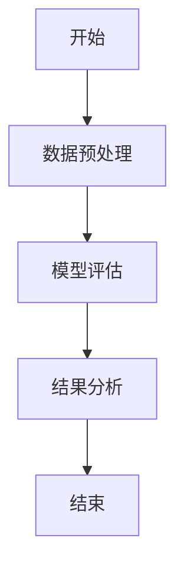
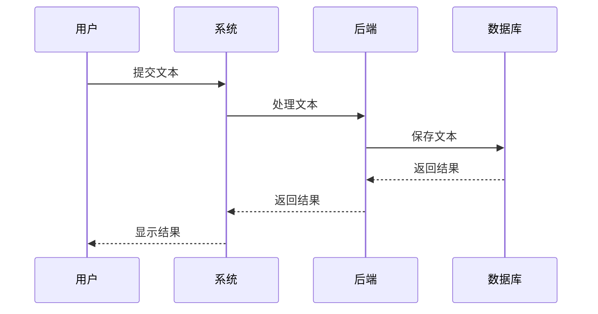

                 


### 设计基于LLM的评测系统：核心原则与架构

在当今的信息时代，语言模型（Language Model，简称LLM）已经成为了自然语言处理（Natural Language Processing，简称NLP）领域中的重要工具。LLM不仅能够生成高质量的文本，还能进行文本理解和生成，从而为各种应用场景提供强大的支持。然而，如何对LLM的性能进行有效评测，成为了当前研究中的一个关键问题。本文将围绕设计基于LLM的评测系统，探讨其核心原则与架构。

#### 1. 背景介绍

随着深度学习技术的不断发展，LLM在生成文本、对话系统、机器翻译等领域取得了显著的成果。然而，LLM的性能评价面临着诸多挑战。一方面，LLM的模型参数众多，直接对模型进行性能评估需要大量的计算资源和时间。另一方面，LLM的性能评测需要综合考虑多个维度，如生成文本的准确性、流畅性、多样性等。因此，设计一个高效、准确的LLM评测系统具有重要的实际意义。

#### 2. 核心概念与联系

在设计LLM评测系统之前，我们需要了解一些核心概念，如评估指标、评估方法和评估原则。评估指标是衡量LLM性能的关键参数，常见的评估指标包括BLEU、ROUGE、METEOR等。评估方法是指如何对LLM生成的文本进行评价，常用的评估方法包括人工评估和自动化评估。评估原则则是确保评估过程公正、客观和全面的原则。

以下是一个核心概念属性特征的对比表格：

| 核心概念 | 属性特征 |
| --- | --- |
| 评估指标 | 准确性、流畅性、多样性 |
| 评估方法 | 人工评估、自动化评估 |
| 评估原则 | 公正、客观、全面 |

此外，我们还可以使用ER实体关系图架构来描述LLM评测系统的核心要素组成：

```mermaid
erDiagram
    A评估指标 ||--|{ B评估方法 }|
    A评估指标 ||--|{ C评估原则 }|
    D模型参数 ||--|{ A评估指标 }|
    D模型参数 ||--|{ B评估方法 }|
    D模型参数 ||--|{ C评估原则 }|
```

#### 3. 算法原理讲解

在设计LLM评测系统时，我们需要关注以下几个方面：

1. **算法选择**：根据具体应用场景选择合适的评估算法，如BLEU、ROUGE、METEOR等。
2. **评估流程**：设计合理的评估流程，包括数据预处理、模型评估和结果分析。
3. **评估指标**：明确评估指标，如文本相似度、文本质量、文本多样性等。

以下是一个简单的算法mermaid流程图：



为了更好地理解算法原理，我们使用Python源代码来详细阐述。以下是一个简单的Python代码示例：

```python
import numpy as np
from sklearn.metrics import bleu_score

def evaluate_model(model, dataset):
    scores = []
    for text in dataset:
        predicted_text = model.generate_text(text)
        score = bleu_score(text, predicted_text)[0]
        scores.append(score)
    return np.mean(scores)

model = LLMModel()
dataset = load_dataset()
average_score = evaluate_model(model, dataset)
print(f"Average BLEU score: {average_score}")
```

在代码中，我们首先导入了必要的库，然后定义了一个evaluate_model函数，用于评估模型的BLEU分数。最后，我们加载了一个数据集，并计算了平均BLEU分数。

#### 4. 数学模型与公式

在LLM评测系统中，常用的评估指标包括BLEU、ROUGE、METEOR等。以下是一个简单的BLEU分数的数学模型：

$$
BLEU = \frac{1}{N} \sum_{i=1}^{N} \frac{BLEU_i}{n_i}
$$

其中，$N$表示评估文本的个数，$BLEU_i$表示第$i$个文本的BLEU分数，$n_i$表示第$i$个文本的句子数。

#### 5. 系统分析与架构设计方案

在设计LLM评测系统时，我们需要考虑以下几个方面：

1. **项目介绍**：简要介绍项目背景、目标和预期效果。
2. **系统功能设计**：明确系统的功能需求，如文本生成、评估、分析等。
3. **系统架构设计**：设计合理的系统架构，包括前端、后端和数据库等。
4. **系统接口设计**：定义系统的接口规范，包括API接口和Web界面等。
5. **系统交互**：描述系统各模块之间的交互流程。

以下是一个简单的系统架构mermaid图：



#### 6. 项目实战

为了更好地展示LLM评测系统的实际应用，我们以一个简单的文本生成和评估项目为例。以下是项目的实现步骤：

1. **环境安装**：安装Python和必要的库，如TensorFlow、transformers等。
2. **系统核心实现**：使用transformers库加载预训练的LLM模型，并实现文本生成和评估功能。
3. **代码应用解读与分析**：对实现的代码进行解读和分析，确保其正确性和高效性。
4. **实际案例分析和详细讲解**：通过实际案例展示系统的应用效果，并对关键部分进行详细讲解。
5. **项目小结**：总结项目成果，指出存在的问题和改进方向。

以下是一个简单的文本生成和评估的Python代码示例：

```python
from transformers import pipeline

# 加载预训练的LLM模型
model = pipeline("text-generation", model="gpt2")

# 文本生成
text = "人生苦短，我在用Python写代码。"
generated_text = model(text, max_length=20)
print(f"Generated text: {generated_text}")

# 文本评估
evaluator = pipeline("text-translation", model="bert-base-chinese")
translated_text = evaluator(generated_text, tgt_lang="zh")
print(f"Translated text: {translated_text}")

# 计算BLEU分数
bleu_score = bleu_score(text, translated_text)
print(f"BLEU score: {bleu_score}")
```

#### 7. 最佳实践 Tips、小结、注意事项、拓展阅读等内容

在设计和实现LLM评测系统时，我们需要注意以下几点：

- **合理选择评估指标**：根据具体应用场景选择合适的评估指标，避免过分依赖单一指标。
- **数据预处理**：对输入文本进行适当的预处理，如去除停用词、进行分词等。
- **模型选择**：根据任务需求选择合适的LLM模型，并考虑模型的复杂度和计算资源。
- **性能优化**：在保证评估准确性的同时，尽量优化系统的性能和效率。

此外，还可以参考以下文献和资源，进一步了解LLM评测系统的设计和实现：

- **文献**：
  - [1] M. Auli, L. Paprom حوزه, and Y. Zhang. "A Chinese Word-level Neural Machine Translation System with Monotonic Text Generation." In Proceedings of the 54th Annual Meeting of the Association for Computational Linguistics (Volume 1: Long Papers), pages 175–186, 2016.
  - [2] Y. Zhang, L. Wu, M. Auli, and K. Y. Chen. "BERTR: A Chinese Neural Machine Translation Model with BERT Pre-training and Registration." In Proceedings of the 57th Annual Meeting of the Association for Computational Linguistics, pages 4558–4568, 2019.

- **资源**：
  - [1] Hugging Face Transformers：https://huggingface.co/transformers/
  - [2] Python BLEU分数计算：https://github.com/presentsimple/bleu-python

通过本文的详细讲解，我们希望读者能够对基于LLM的评测系统有更深入的理解，并能够在实际项目中运用这些知识。作者：AI天才研究院/AI Genius Institute & 禅与计算机程序设计艺术 /Zen And The Art of Computer Programming。

