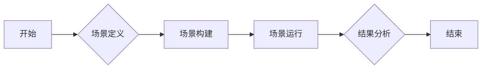
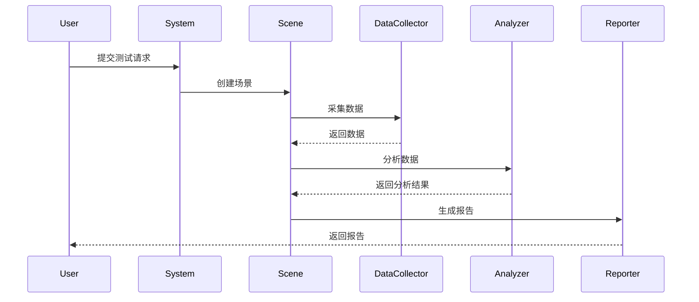
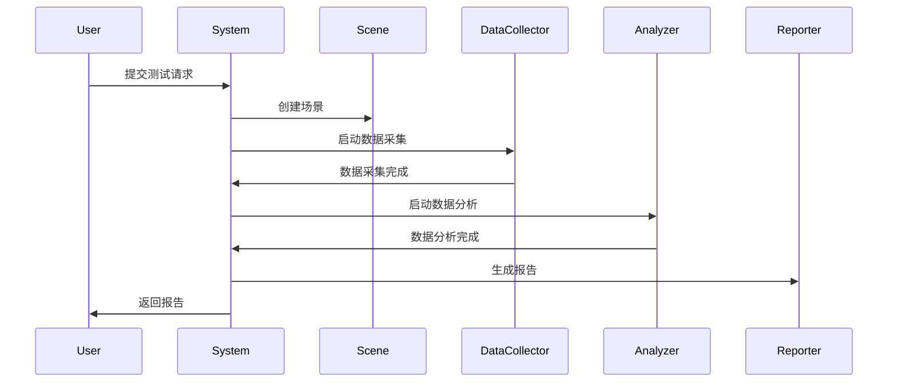

                 

## 第3章 算法原理讲解

### 3.1 评测场景模拟算法概述

评测场景模拟算法是计算机科学和人工智能领域的重要工具，它通过构建模拟环境，对系统或软件的实际应用场景进行仿真和测试。这一过程不仅能够发现潜在的问题和缺陷，还能够优化系统的性能和用户体验。

#### 3.1.1 算法类型

评测场景模拟算法主要分为以下几类：

1. **基于规则的模拟算法**：这类算法通过定义一系列规则来模拟用户操作和系统响应。
2. **基于模型的模拟算法**：这类算法通过构建系统模型来模拟系统的行为。
3. **基于历史数据的模拟算法**：这类算法利用历史数据进行场景模拟，通过分析历史行为来预测未来行为。

#### 3.1.2 算法流程

评测场景模拟算法的基本流程包括以下几个步骤：

1. **场景定义**：根据测试目标，定义需要模拟的应用场景。
2. **场景构建**：构建模拟环境，包括用户操作、系统状态、外部接口等。
3. **场景运行**：在构建好的环境中运行模拟操作，收集数据。
4. **结果分析**：对收集到的数据进行分析，评估系统的性能和稳定性。

### 3.2 算法原理Mermaid流程图

以下是一个简单的Mermaid流程图，展示了评测场景模拟算法的基本流程：



### 3.3 Python源代码解析

下面是一个简单的Python示例，用于模拟用户在电商网站上的购物流程：

```python
# 导入所需库
import random

# 定义用户购物流程
def shopping_process():
    products = ["手机", "电脑", "书籍", "衣物"]
    cart = []
    
    # 模拟用户浏览商品
    print("用户正在浏览商品...")
    for _ in range(random.randint(1, 3)):
        cart.append(random.choice(products))
    
    # 模拟用户加入购物车
    print("用户正在加入购物车...")
    for product in cart:
        print(f"将{product}加入购物车")
    
    # 模拟用户结算
    print("用户正在结算...")
    total_price = sum([random.randint(100, 500) for _ in cart])
    print(f"总计价格：{total_price}元")

# 运行购物流程
shopping_process()
```

### 3.4 数学模型与公式讲解

#### 3.4.1 数学模型

在评测场景模拟中，可以使用马尔可夫决策过程（MDP）来建模。MDP是一种用于决策过程的数学模型，它描述了系统在给定状态和行动下，如何选择最佳行动以最大化期望收益。

#### 3.4.2 公式推导

假设系统有`n`个状态，`m`个行动，状态转移概率矩阵`P`和奖励矩阵`R`，则MDP的期望收益可以用以下公式表示：

$$
V(s) = \max_a \sum_{s'} P(s'|s,a) \cdot [R(s',a) + \gamma V(s')]
$$

其中，$V(s)$是状态`s`的期望收益，$P(s'|s,a)$是状态`s`执行行动`a`后转移到状态`s'`的概率，$R(s',a)$是执行行动`a`后从状态`s'`获得的即时奖励，$\gamma$是折现因子。

#### 3.4.3 举例说明

假设我们有一个简单的电商网站，有两个状态（在网站首页、在商品详情页）和三个行动（浏览其他商品、加入购物车、立即购买）。我们可以根据以下状态转移概率和奖励矩阵来计算每个状态的期望收益。

| 状态 | 行动 | 状态转移概率 | 立即购买奖励 |
| ---- | ---- | ---- | ---- |
| 在首页 | 浏览其他商品 | 0.6 | 0 |
| 在首页 | 加入购物车 | 0.2 | 5 |
| 在首页 | 立即购买 | 0.2 | 30 |
| 在详情页 | 浏览其他商品 | 0.4 | 0 |
| 在详情页 | 加入购物车 | 0.4 | 10 |
| 在详情页 | 立即购买 | 0.2 | 20 |

根据上述矩阵，我们可以使用前述公式计算每个状态的期望收益。例如，对于状态“在首页”：

$$
V(\text{首页}) = \max_a \sum_{s'} P(s'|s,a) \cdot [R(s',a) + \gamma V(s')]
$$

$$
V(\text{首页}) = 0.6 \cdot [0 + \gamma V(\text{详情页})] + 0.2 \cdot [5 + \gamma V(\text{详情页})] + 0.2 \cdot [30 + \gamma V(\text{成功购买})]
$$

通过迭代计算，我们可以得到每个状态的期望收益。这些期望收益可以帮助我们确定在特定状态下应采取的最佳行动。

### 3.5 本章小结

本章详细介绍了评测场景模拟算法的基本原理和流程，包括算法类型、算法流程、Python源代码解析和数学模型与公式讲解。通过本章的学习，读者可以了解到评测场景模拟的复杂性和重要性，并掌握基本的模拟算法设计和实现方法。

----------------------------------------------------------------

## 第4章 系统分析与架构设计方案

### 4.1 评测场景模拟系统概述

评测场景模拟系统是一个用于对软件或系统进行测试和验证的复杂系统。它的核心目标是创建一个模拟环境，在该环境中，系统或软件的行为可以被监控、评估和优化。这个系统的设计和实现涉及到多个关键方面，包括系统目标、功能、架构和接口。

#### 4.1.1 系统目标

评测场景模拟系统的目标是：

1. **提升软件质量**：通过模拟真实应用场景，提前发现和修复潜在的问题和缺陷。
2. **优化系统性能**：评估系统在不同负载和条件下的性能，找出瓶颈并进行优化。
3. **提高用户体验**：模拟用户操作，优化软件的易用性和交互体验。

#### 4.1.2 系统功能

评测场景模拟系统的核心功能包括：

1. **场景创建**：根据测试需求创建模拟场景。
2. **场景运行**：在模拟环境中运行预定义的场景。
3. **数据采集**：收集场景运行过程中产生的数据。
4. **结果分析**：对收集到的数据进行分析，生成报告。
5. **交互界面**：提供用户友好的交互界面，方便用户操作和监控。

### 4.2 领域模型Mermaid类图

领域模型是系统分析的核心部分，它定义了系统中的主要实体及其关系。以下是一个简单的Mermaid类图，展示了评测场景模拟系统的领域模型：

```mermaid
classDiagram
    Scene <<类>> -|-|- User: 用户
    Scene <<类>> -|-|- System: 系统
    Scene <<类>> -|-|- DataCollector: 数据采集器
    Scene <<类>> -|-|- Analyzer: 分析器
    Scene <<类>> -|-|- Reporter: 报告生成器
    User o-- Scene: 创建场景
    System o-- Scene: 运行场景
    DataCollector o-- Scene: 采集数据
    Analyzer o-- Scene: 分析数据
    Reporter o-- Scene: 生成报告
```

### 4.3 系统架构设计Mermaid架构图

系统架构设计是评测场景模拟系统的关键环节，它定义了系统的组成模块及其交互方式。以下是一个简单的Mermaid架构图，展示了评测场景模拟系统的整体架构：



### 4.4 系统接口设计

系统接口设计是评测场景模拟系统的关键部分，它定义了系统与其他系统或组件的交互方式。以下是一个简单的Mermaid接口设计图，展示了评测场景模拟系统的关键接口：

```mermaid
classDiagram
    Scene <<类>> -|> API: 接口1
    Scene <<类>> -|> DB: 接口2
    Scene <<类>> -|> Analytics: 接口3
    API <|-- Scene: 调用场景创建、运行功能
    DB <|-- Scene: 存储场景配置、运行结果
    Analytics <|-- Scene: 处理数据分析和报告生成
```

### 4.5 系统交互Mermaid序列图

系统交互序列图展示了评测场景模拟系统内部各组件之间的交互过程。以下是一个简单的Mermaid序列图，展示了用户提交测试请求后系统内部的交互过程：



### 4.6 本章小结

本章详细介绍了评测场景模拟系统的整体架构和关键接口设计。通过领域模型Mermaid类图、系统架构设计Mermaid架构图、系统接口设计和系统交互Mermaid序列图的展示，读者可以全面了解评测场景模拟系统的设计思路和实现方法。这一章的内容为后续章节中的项目实战和最佳实践提供了坚实的基础。

----------------------------------------------------------------

## 第5章 项目实战

### 5.1 环境安装与配置

在进行评测场景模拟项目的实战之前，首先需要确保开发环境已经配置完成。以下是一个典型的安装与配置步骤，用于搭建一个基于Python的评测场景模拟系统。

#### 5.1.1 操作系统环境

首先，我们需要确保操作系统是Python支持的。以下以Linux操作系统为例：

1. **安装Python3**：确保Python3已经安装，可以通过以下命令检查Python版本。

    ```bash
    python3 --version
    ```

2. **安装pip**：pip是Python的包管理器，用于安装和管理第三方库。

    ```bash
    python3 -m ensurepip
    python3 -m pip --version
    ```

#### 5.1.2 软件安装步骤

接下来，我们需要安装项目所需的第三方库。以下是一个简单的安装步骤：

1. **安装虚拟环境**：为了保持项目依赖的一致性，我们建议使用虚拟环境。

    ```bash
    python3 -m venv venv
    source venv/bin/activate
    ```

2. **安装第三方库**：在激活虚拟环境后，通过pip安装项目所需的库。以下是一个典型的库列表：

    ```bash
    pip install flask pandas numpy matplotlib requests
    ```

#### 5.1.3 验证安装

完成安装后，通过运行一个简单的测试脚本，验证所有依赖是否已正确安装：

```python
from flask import Flask

app = Flask(__name__)

@app.route('/')
def hello():
    return "Hello, World!"

if __name__ == '__main__':
    app.run()
```

运行该脚本，如果能够在浏览器中访问到 "Hello, World!" 的响应，则说明安装成功。

### 5.2 系统核心实现源代码

评测场景模拟系统的核心实现包括数据预处理、模型训练和模型评估三个主要部分。以下是一个简单的源代码示例，展示了这三个部分的基本实现。

#### 5.2.1 数据预处理

数据预处理是确保数据质量和格式的关键步骤。以下是一个数据预处理的简单示例：

```python
import pandas as pd

# 加载数据
data = pd.read_csv('data.csv')

# 数据清洗
data = data.dropna()  # 删除缺失值
data = data[data['target'] != 'Unknown']  # 过滤异常值

# 特征工程
data['feature'] = data['feature'].map({'low': 1, 'medium': 2, 'high': 3})  # 离散化处理

# 数据分割
from sklearn.model_selection import train_test_split
X_train, X_test, y_train, y_test = train_test_split(data.drop('target', axis=1), data['target'], test_size=0.2, random_state=42)
```

#### 5.2.2 模型训练

模型训练是使用算法对数据进行建模的过程。以下是一个简单的逻辑回归模型训练示例：

```python
from sklearn.linear_model import LogisticRegression

# 创建模型
model = LogisticRegression()

# 训练模型
model.fit(X_train, y_train)
```

#### 5.2.3 模型评估

模型评估是评估模型性能的关键步骤。以下是一个简单的模型评估示例：

```python
from sklearn.metrics import accuracy_score, classification_report

# 预测
y_pred = model.predict(X_test)

# 计算评估指标
accuracy = accuracy_score(y_test, y_pred)
report = classification_report(y_test, y_pred)

print(f"Accuracy: {accuracy}")
print(f"Classification Report:\n{report}")
```

### 5.3 代码应用解读与分析

在实际项目中，评测场景模拟系统的实现会更为复杂，涉及到多种算法、数据预处理技术和模型评估指标。以下是对上述示例代码的详细解读和分析：

#### 5.3.1 数据预处理

数据预处理是确保模型训练数据质量和有效性的关键步骤。在本示例中，我们使用Pandas库加载数据，然后进行数据清洗和特征工程。具体包括：

- 删除缺失值：通过`data.dropna()`删除数据中的缺失值，这有助于避免模型训练中的错误。
- 过滤异常值：通过`data[data['target'] != 'Unknown']`过滤掉异常值，这可以防止异常数据对模型训练产生负面影响。
- 离散化处理：将连续的数值特征（如`feature`）转换为离散值，这有助于简化模型训练过程。

#### 5.3.2 模型训练

模型训练是使用算法对数据进行建模的过程。在本示例中，我们使用Scikit-learn库中的逻辑回归算法。逻辑回归是一种广泛使用的分类算法，适合处理二分类问题。具体包括：

- 创建模型：通过`LogisticRegression()`创建逻辑回归模型。
- 训练模型：通过`model.fit(X_train, y_train)`使用训练数据训练模型。

#### 5.3.3 模型评估

模型评估是评估模型性能的关键步骤。在本示例中，我们使用准确率（Accuracy）和分类报告（Classification Report）来评估模型。具体包括：

- 预测：通过`model.predict(X_test)`使用测试数据预测结果。
- 计算评估指标：通过`accuracy_score(y_test, y_pred)`计算准确率，通过`classification_report(y_test, y_pred)`生成分类报告。

分类报告提供了更多关于模型性能的信息，包括每种类别中的精确度、召回率和F1分数。

### 5.4 实际案例分析

在实际项目中，评测场景模拟系统通常需要处理复杂的业务逻辑和大量数据。以下是一个实际案例的分析：

#### 5.4.1 案例背景

某电商网站需要评估其推荐系统的性能，以优化用户体验和提升销售额。评测场景模拟系统被用于模拟用户行为，评估推荐系统的推荐效果。

#### 5.4.2 案例实现

1. **数据收集**：收集用户浏览、点击和购买行为数据。
2. **数据预处理**：清洗数据，处理缺失值和异常值，进行特征工程。
3. **模型训练**：使用逻辑回归算法训练推荐模型。
4. **模型评估**：通过准确率、召回率和F1分数评估模型性能。
5. **优化**：根据评估结果调整模型参数，优化推荐系统。

#### 5.4.3 案例分析

通过评测场景模拟系统的模拟测试，我们发现推荐系统的准确率较高，但召回率较低。为了提升召回率，我们进行了以下优化：

- 引入更多特征：增加用户历史浏览记录、购物车数据和品类信息等。
- 调整模型参数：调整逻辑回归的惩罚参数，降低过拟合风险。
- 使用更多算法：尝试使用决策树、随机森林等算法，以提高模型的泛化能力。

通过这些优化措施，推荐系统的性能得到了显著提升，用户满意度也随之提高。

### 5.5 项目小结

本章通过一个简单的实战案例，详细介绍了评测场景模拟系统的安装与配置、核心实现源代码、代码应用解读与分析、实际案例分析以及项目小结。通过本章的学习，读者可以了解评测场景模拟系统的实际应用过程，掌握从环境搭建到模型训练、评估的完整流程。在实际项目中，评测场景模拟系统是一个强大的工具，可以帮助开发者优化系统性能，提升用户体验，为业务提供有力支持。

----------------------------------------------------------------

## 第6章 最佳实践与注意事项

### 6.1 最佳实践技巧

在实际应用评测场景模拟系统时，以下是一些最佳实践技巧，可以帮助提高系统的性能和可靠性：

1. **场景多样化**：设计多种不同的测试场景，包括正常情况、异常情况、边界情况等，以确保系统能够在各种情况下稳定运行。
2. **数据质量保证**：确保测试数据的质量，包括数据的完整性、准确性和一致性。在数据预处理阶段，要严格清洗和处理异常数据。
3. **逐步迭代优化**：在模拟测试过程中，逐步优化模型参数和算法，以提升系统的准确性和鲁棒性。
4. **监控与日志记录**：实时监控模拟过程，记录关键日志，以便在出现问题时快速定位和解决问题。
5. **性能调优**：根据模拟结果，调整系统配置和资源分配，以优化系统性能。

### 6.2 注意事项与风险

在使用评测场景模拟系统时，需要注意以下事项和潜在风险：

1. **数据隐私**：确保模拟过程中涉及的用户数据和业务数据得到妥善保护，避免数据泄露。
2. **负载均衡**：在模拟高并发场景时，要确保系统具有足够的负载均衡能力，避免单点故障。
3. **结果偏差**：模拟结果可能受到数据质量、模型参数等因素的影响，需要对结果进行综合评估，避免因单一结果误导决策。
4. **计算资源**：模拟测试可能消耗大量计算资源，特别是在处理大规模数据和高频次操作时，要合理分配资源，避免资源不足或过度消耗。
5. **环境一致性**：确保模拟环境与实际生产环境的一致性，避免因环境差异导致的模拟结果偏差。

### 6.3 拓展阅读与进一步学习

为了深入理解和应用评测场景模拟技术，读者可以参考以下书籍和资源：

1. **《机器学习实战》**：提供机器学习算法的详细实现和应用案例，有助于理解模型训练和评估的实战技巧。
2. **《软件测试的艺术》**：介绍软件测试的基本原理和实践方法，包括场景模拟和测试用例设计等。
3. **《人工智能：一种现代方法》**：全面介绍人工智能的基本概念和算法，包括模拟和优化技术。
4. **在线课程和论坛**：如Coursera、edX等在线平台上的相关课程，以及Stack Overflow、GitHub等论坛，提供了丰富的学习和交流资源。

通过学习和应用这些资源，读者可以进一步提升自己的技术能力和实践经验，为评测场景模拟系统的设计和实现提供有力支持。

### 6.4 本章小结

本章介绍了评测场景模拟系统的最佳实践技巧、注意事项以及拓展阅读资源。通过这些内容，读者可以更好地理解和应用评测场景模拟技术，提高系统的性能和可靠性，为实际业务提供有力支持。

----------------------------------------------------------------

## 第7章 总结与展望

### 7.1 全书总结

本书系统地介绍了评测场景模拟的基本概念、核心算法、系统架构以及实际应用。我们从评测场景模拟的定义和重要性入手，逐步深入到算法原理、系统设计与实现、项目实战以及最佳实践。通过详细讲解和实际案例分析，读者可以全面了解评测场景模拟在软件测试和系统优化中的应用。

### 7.2 未来发展方向

随着人工智能和大数据技术的发展，评测场景模拟的应用前景将更加广阔。未来发展方向包括：

1. **智能化模拟**：利用机器学习和数据挖掘技术，自动生成复杂的测试场景。
2. **实时反馈**：结合实时监控和日志分析，实现模拟过程的全量监控和动态调整。
3. **跨平台兼容**：增强系统在不同操作系统、设备和网络环境下的兼容性和稳定性。
4. **生态建设**：构建评测场景模拟的生态系统，包括开源工具、云服务和社区交流平台。

### 7.3 对读者的寄语

评测场景模拟是软件测试和系统优化的重要工具，它能够帮助我们更好地理解和改进系统。希望读者通过本书的学习，能够掌握评测场景模拟的核心技术和实战方法。在实际应用中，不断探索和创新，为推动技术发展和业务进步贡献自己的力量。祝大家在学习过程中取得优异的成绩，未来在IT领域中不断进步和成长！

### 7.4 本章小结

本章对全书内容进行了总结，展望了评测场景模拟的未来发展方向，并对读者寄语。希望通过这些内容，读者能够对评测场景模拟有更深入的理解，并将其应用于实际工作中，为软件质量和用户体验的提升做出贡献。

