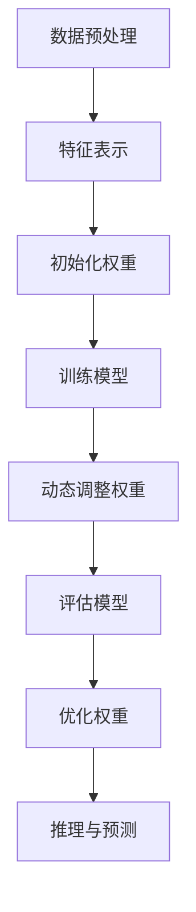
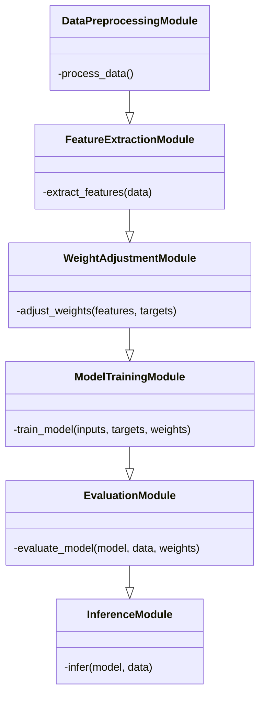
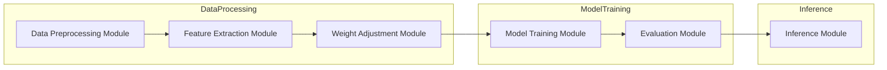
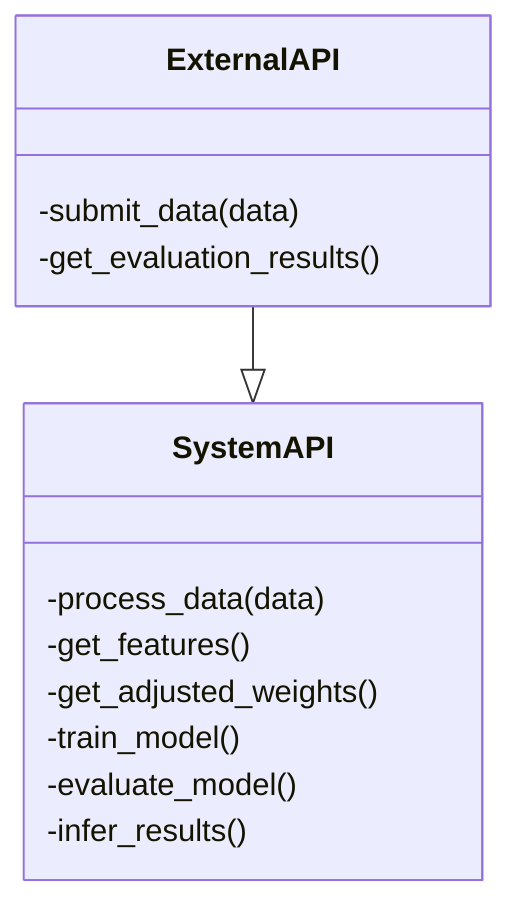
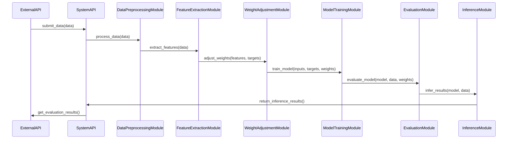

                 

### 《评测指标的动态权重：LLM辅助的智能调整机制》

#### 关键词：评测指标、动态权重、LLM、智能调整、算法实现、系统架构、实战应用

#### 摘要：

本文探讨了评测指标动态权重的概念及其在人工智能模型中的重要性。通过引入大型语言模型（LLM）的智能调整机制，我们提出了一种新的方法来动态调整评测指标的权重，以优化模型的性能和准确性。文章首先介绍了评测指标动态权重的基本概念和问题背景，随后详细阐述了LLM辅助的智能调整机制原理。接着，文章深入分析了动态权重调整的算法原理与流程，并展示了如何通过Python代码实现这一机制。此外，文章还介绍了基于LLM智能调整机制的完整系统架构设计，包括系统功能、架构和接口设计。最后，文章通过实际案例分析和项目小结，展示了动态权重调整在实战中的应用效果。

## 第1章 引言

在人工智能（AI）和机器学习（ML）领域，评测指标是评估模型性能和准确性的关键工具。传统的评测指标通常是静态的，即在模型的训练和评估过程中，其权重保持不变。然而，随着数据集和模型复杂度的增加，静态权重可能无法适应不同情境下的需求，导致评测结果不够准确和可靠。因此，动态调整评测指标的权重成为了一个重要的研究方向。

动态权重调整指的是根据模型训练过程中不断变化的数据和环境，自动调整评测指标的权重，以优化模型的性能。这种方法可以有效地解决静态权重调整的局限性，提高模型的泛化能力和鲁棒性。

在近年来，大型语言模型（LLM）的发展为动态权重调整带来了新的契机。LLM具有强大的表示和推理能力，能够从大量数据中提取知识，并利用这些知识进行智能调整。本文将探讨如何利用LLM实现评测指标的动态权重调整，从而提高模型评估的准确性和效率。

本文的主要目标是介绍评测指标动态权重和LLM辅助的智能调整机制，并提供详细的算法原理、实现方法和实际应用案例。通过本文的研究，我们希望能够为AI和ML领域的研究者提供新的思路和工具，促进模型的优化和提升。

## 第2章 评测指标的动态权重概述

### 2.1 问题背景

在AI和ML领域，评测指标（Evaluation Metrics）是衡量模型性能的重要标准。这些指标通常用于评估模型的准确性、泛化能力、鲁棒性等关键性能指标。然而，传统的评测指标往往具有以下局限性：

1. **静态权重**：传统的评测指标通常采用固定的权重，这意味着无论模型训练过程中数据分布如何变化，评测指标的权重都保持不变。这种静态权重调整方法在处理具有多样性和动态变化特征的数据集时，往往无法充分适应和反映模型的真实性能。

2. **数据依赖性**：评测指标的性能可能受到特定数据集的依赖，这意味着在不同的数据集上，相同模型可能表现出不同的性能，而静态权重调整方法无法准确捕捉这些差异。

3. **模型复杂性**：随着AI模型变得越来越复杂，传统评测指标可能无法全面反映模型的内在性能，导致评估结果不够准确。例如，深度学习模型中的层与层之间的权重分配可能影响最终的输出结果，而静态权重调整方法难以捕捉这些复杂关系。

### 2.2 问题描述

为了解决上述问题，评测指标的动态权重调整成为了一个重要的研究方向。动态权重调整旨在根据模型训练过程中不断变化的数据和环境，自动调整评测指标的权重，以优化模型的性能。具体来说，动态权重调整需要解决以下问题：

1. **适应性**：动态调整机制需要能够适应不同数据集和模型复杂度的变化，确保评测指标能够准确反映模型的真实性能。

2. **鲁棒性**：动态调整机制需要具备良好的鲁棒性，能够在面对噪声数据、异常值和极端情况时，仍能够保持稳定的调整效果。

3. **效率**：动态调整机制需要在有限的计算资源下，高效地完成权重调整过程，以确保模型的训练和评估过程不会受到不必要的延迟。

### 2.3 问题解决

为了解决上述问题，本文提出了基于LLM的智能调整机制。LLM具有强大的表示和推理能力，可以从大量数据中提取知识，并利用这些知识进行智能调整。具体来说，LLM在动态权重调整中的作用主要包括以下几个方面：

1. **数据预处理**：通过LLM对数据进行预处理，可以提取出数据中的关键特征和潜在信息，提高数据的质量和相关性。

2. **特征权重调整**：利用LLM对特征进行权重调整，可以根据模型训练过程中数据的变化，动态调整特征的重要性，从而优化模型的性能。

3. **推理与预测**：通过LLM进行推理和预测，可以捕捉模型训练过程中未知的复杂关系，提高评测指标的准确性和可靠性。

### 2.4 边界与外延

虽然动态权重调整机制具有很大的潜力，但其在实际应用中也存在一定的边界和限制。首先，动态调整机制需要大量的数据和计算资源，这可能对资源有限的实验环境构成挑战。其次，动态调整机制的性能和稳定性可能受到LLM模型的选择和优化影响。因此，在实际应用中，需要根据具体问题进行合理的模型选择和参数调整。

### 2.5 概念结构与核心要素组成

动态权重调整机制的核心概念和要素主要包括以下几个方面：

1. **评测指标**：包括准确性、召回率、F1分数等常见评测指标，用于评估模型性能。

2. **特征权重**：模型中各个特征的权重，用于衡量特征对模型性能的影响。

3. **动态调整策略**：包括基于LLM的权重调整算法，用于根据模型训练过程中数据的变化，动态调整特征权重。

4. **数据预处理**：包括数据清洗、归一化、特征提取等预处理步骤，用于提高数据质量和相关性。

5. **优化目标**：包括模型性能指标、计算效率等优化目标，用于指导动态调整策略的设计和实现。

通过上述核心概念和要素的有机结合，动态权重调整机制能够有效提高模型的性能和准确性，为AI和ML领域的研究和实践提供有力的支持。

### 第3章 LLM辅助的智能调整机制原理

#### 3.1 LLM概述

大型语言模型（LLM，Large Language Model）是一种基于深度学习技术的自然语言处理（NLP，Natural Language Processing）模型，能够对大规模文本数据进行预训练，以生成具有人类语言理解能力的文本。LLM的主要特点包括：

1. **大规模数据训练**：LLM通常使用海量的文本数据集进行训练，这些数据集涵盖了各种领域和主题，从而使得模型具有广泛的词汇和语义理解能力。

2. **深度神经网络结构**：LLM通常采用多层神经网络（如Transformer）结构，这种结构能够处理长文本序列，并捕捉到文本中的复杂关系和语义信息。

3. **自监督学习**：LLM的预训练过程通常采用自监督学习（Self-Supervised Learning）方法，即在不需要人工标注数据的情况下，从原始文本数据中学习到有用的信息。

4. **泛化能力**：由于LLM在预训练过程中学习了大量文本数据中的知识，因此具有很好的泛化能力，能够在不同的任务和数据集上表现出色。

#### 3.2 LLM在动态权重调整中的作用

LLM在动态权重调整中发挥着重要作用，主要体现在以下几个方面：

1. **特征提取**：LLM能够从大规模数据中提取出高质量的文本特征，这些特征不仅包含词频信息，还包含语义和上下文信息。通过这些特征，我们可以更准确地评估模型性能，并动态调整评测指标的权重。

2. **权重调整**：LLM可以通过其强大的表示能力，动态调整模型中各个特征的权重。具体来说，LLM可以根据模型训练过程中的数据变化，实时调整特征的重要性，从而优化模型的性能。

3. **推理与预测**：LLM在动态权重调整过程中，可以基于其预训练的知识和语义理解能力，对模型进行推理和预测。这种推理能力可以帮助我们识别出模型训练过程中未知的复杂关系，从而提高动态调整的准确性和稳定性。

#### 3.3 智能调整机制的框架结构

基于LLM的动态权重调整机制可以划分为以下几个主要模块：

1. **数据预处理模块**：负责对输入数据（如文本、图像等）进行预处理，包括数据清洗、归一化、特征提取等步骤。预处理模块的目的是提高数据质量，为后续的动态调整提供可靠的数据基础。

2. **特征表示模块**：利用LLM对预处理后的数据进行特征提取和表示，生成具有高维语义信息的特征向量。这些特征向量将作为动态调整的输入，用于优化模型的性能。

3. **权重调整模块**：基于LLM的权重调整算法，动态调整模型中各个特征的权重。具体来说，权重调整模块可以根据模型训练过程中的数据变化，实时调整特征的重要性，从而优化模型的性能。

4. **评估与优化模块**：负责对调整后的模型进行评估和优化。评估模块可以采用各种评测指标（如准确性、召回率、F1分数等），对模型性能进行量化分析。优化模块则根据评估结果，对动态调整策略进行迭代和优化，以提高模型的鲁棒性和稳定性。

5. **推理与预测模块**：基于LLM的推理能力，对模型进行推理和预测。通过推理模块，我们可以识别出模型训练过程中未知的复杂关系，从而进一步提高动态调整的准确性和可靠性。

通过上述模块的有机结合，基于LLM的动态权重调整机制能够实现高效的模型优化和性能提升，为AI和ML领域的研究和实践提供有力的支持。

### 第4章 评测指标的动态权重算法原理与流程

#### 4.1 算法原理

评测指标的动态权重算法基于大型语言模型（LLM）的强大表示和推理能力，旨在根据模型训练过程中不断变化的数据和环境，动态调整评测指标的权重。具体来说，该算法主要分为以下几个步骤：

1. **数据预处理**：首先，对输入数据（如文本、图像等）进行预处理，包括数据清洗、归一化和特征提取等步骤。预处理模块的目的是提高数据质量，为后续的动态调整提供可靠的数据基础。

2. **特征表示**：利用LLM对预处理后的数据进行特征提取和表示，生成具有高维语义信息的特征向量。这些特征向量将作为动态调整的输入，用于优化模型的性能。

3. **权重调整**：基于LLM的权重调整算法，根据模型训练过程中的数据变化，动态调整评测指标的权重。具体来说，算法会通过学习模型训练过程中的特征分布和关系，实时调整特征的重要性，从而优化模型的性能。

4. **评估与优化**：调整后的权重应用于模型评估过程中，对模型性能进行量化分析。根据评估结果，算法会迭代和优化动态调整策略，以提高模型的鲁棒性和稳定性。

5. **推理与预测**：基于LLM的推理能力，对调整后的模型进行推理和预测。通过推理模块，我们可以识别出模型训练过程中未知的复杂关系，从而进一步提高动态调整的准确性和可靠性。

#### 4.2 算法流程

基于上述算法原理，评测指标的动态权重调整算法的具体流程可以分为以下几个步骤：

1. **数据预处理**：首先，对输入数据集进行预处理，包括数据清洗、归一化和特征提取等步骤。预处理模块的目的是提高数据质量，为后续的动态调整提供可靠的数据基础。

2. **特征表示**：利用LLM对预处理后的数据进行特征提取和表示，生成具有高维语义信息的特征向量。这些特征向量将作为动态调整的输入，用于优化模型的性能。

3. **初始化权重**：初始化评测指标的权重，通常采用均匀初始化或基于历史数据的初始化方法。

4. **训练模型**：利用初始化的权重，对模型进行训练，同时记录模型训练过程中的特征分布和关系。

5. **动态调整权重**：根据模型训练过程中的特征分布和关系，利用LLM的权重调整算法，动态调整评测指标的权重。具体来说，算法会通过学习模型训练过程中的特征分布和关系，实时调整特征的重要性，从而优化模型的性能。

6. **评估模型**：利用调整后的权重，对模型性能进行评估，包括准确性、召回率、F1分数等指标。

7. **优化权重**：根据评估结果，迭代和优化动态调整策略，以提高模型的鲁棒性和稳定性。

8. **推理与预测**：基于LLM的推理能力，对调整后的模型进行推理和预测。通过推理模块，我们可以识别出模型训练过程中未知的复杂关系，从而进一步提高动态调整的准确性和可靠性。

#### 4.3 Mermaid流程图展示

以下是一个基于Mermaid的流程图，展示了评测指标的动态权重调整算法的具体流程：



通过这个流程图，我们可以清晰地看到动态权重调整算法的各个步骤和它们之间的逻辑关系。在实际应用中，可以根据具体需求对流程进行调整和优化。

#### 第5章 LLM辅助智能调整机制的实现

#### 5.1 LLM选择与优化

在实现LLM辅助智能调整机制时，选择合适的LLM模型至关重要。当前，常见的LLM模型包括GPT、BERT、T5等。以下是对几种典型LLM模型的选择和优化策略的讨论：

1. **GPT（Generative Pre-trained Transformer）**：GPT是一种基于Transformer结构的自监督预训练模型，具有良好的文本生成和语义理解能力。GPT-3更是扩展到了1750亿参数，能够生成高质量的文本。然而，GPT在处理长文本序列时可能存在内存占用高和计算复杂度大的问题。

2. **BERT（Bidirectional Encoder Representations from Transformers）**：BERT是一种双向Transformer模型，预训练过程中同时考虑了文本的前后信息。BERT在许多NLP任务上取得了显著的成绩，特别是问答和文本分类任务。BERT的优点是内存占用相对较低，计算复杂度适中，但在文本生成任务上的表现可能不如GPT。

3. **T5（Text-to-Text Transfer Transformer）**：T5是一种通用目的的Transformer模型，其设计理念是将所有NLP任务转换为文本到文本的转换任务。T5具有高度的可扩展性和灵活性，能够在多种任务上取得较好的性能。然而，T5的训练和推理过程需要大量的计算资源。

在选择LLM模型时，需要综合考虑任务需求、数据规模、计算资源等因素。对于文本生成和问答任务，GPT可能是一个较好的选择；对于文本分类和情感分析任务，BERT可能更为合适；而对于需要多种任务支持的通用场景，T5可能是一个更好的选择。

在LLM优化方面，可以通过以下方法提高模型性能：

1. **参数调整**：根据任务需求，调整模型的参数设置，如学习率、批次大小、训练时间等。通过实验比较不同参数设置下的模型性能，选择最优参数组合。

2. **数据增强**：通过增加数据多样性、引入噪声、数据切割等方式，提高模型对各种情境的泛化能力。

3. **模型蒸馏**：使用预训练的LLM模型作为教师模型，训练一个较小的学生模型。通过蒸馏过程，将教师模型的知识和经验传递给学生模型，提高学生模型的表现。

4. **多任务学习**：在训练过程中，引入多任务学习策略，使模型同时学习多种任务。这种方法可以提高模型的鲁棒性和泛化能力。

5. **模型剪枝和量化**：通过剪枝和量化技术，减少模型的参数数量和计算复杂度，提高模型的效率和实用性。

#### 5.2 动态权重调整的算法实现

基于LLM的动态权重调整算法实现可以分为以下几个关键步骤：

1. **数据预处理**：首先，对输入数据集进行预处理，包括数据清洗、归一化和特征提取等步骤。预处理模块的目的是提高数据质量，为后续的动态调整提供可靠的数据基础。

2. **特征表示**：利用选定的LLM模型对预处理后的数据进行特征提取和表示，生成具有高维语义信息的特征向量。这些特征向量将作为动态调整的输入，用于优化模型的性能。

3. **权重调整**：设计权重调整算法，根据模型训练过程中的数据变化，动态调整评测指标的权重。具体来说，算法会通过学习模型训练过程中的特征分布和关系，实时调整特征的重要性，从而优化模型的性能。

4. **模型训练与评估**：利用调整后的权重，对模型进行训练和评估。在训练过程中，记录模型训练过程中的特征分布和关系，用于后续的权重调整。

5. **迭代优化**：根据评估结果，迭代和优化动态调整策略，以提高模型的鲁棒性和稳定性。

以下是Python代码示例，展示了动态权重调整算法的基本实现：

```python
import tensorflow as tf
import tensorflow.keras as keras
from transformers import TFAutoModelForSequenceClassification

# 数据预处理
def preprocess_data(data):
    # 实现数据清洗、归一化和特征提取等步骤
    return processed_data

# 特征表示
def get_feature_vector(data, model):
    inputs = model(input_ids=data['input_ids'], attention_mask=data['attention_mask'])
    return inputs.last_hidden_state[:, 0, :]

# 权重调整
def adjust_weights(features, targets):
    # 实现动态权重调整算法
    weights = calculate_weights(features, targets)
    return weights

# 模型训练与评估
def train_and_evaluate(model, data, weights):
    # 利用调整后的权重，对模型进行训练和评估
    model.fit(data['input_ids'], data['labels'], epochs=10, batch_size=32, class_weight=weights)
    evaluation_results = model.evaluate(data['input_ids'], data['labels'])
    return evaluation_results

# 主函数
def main():
    # 加载预训练模型
    model = TFAutoModelForSequenceClassification.from_pretrained('bert-base-uncased')

    # 预处理数据
    data = preprocess_data(raw_data)

    # 获取特征向量
    features = get_feature_vector(data, model)

    # 动态调整权重
    weights = adjust_weights(features, data['labels'])

    # 训练和评估模型
    evaluation_results = train_and_evaluate(model, data, weights)
    print("Evaluation Results:", evaluation_results)

if __name__ == "__main__":
    main()
```

通过上述代码示例，我们可以看到动态权重调整算法的基本实现过程，包括数据预处理、特征表示、权重调整、模型训练与评估等步骤。在实际应用中，可以根据具体需求和场景，进一步优化和扩展算法实现。

#### 第6章 LLM辅助智能调整机制的系统架构设计

#### 6.1 问题场景介绍

在实际应用中，评测指标的动态权重调整面临诸多挑战。首先，数据规模和多样性不断增加，使得静态权重调整方法难以适应复杂多变的数据环境。其次，模型复杂度和训练时间也在不断提升，要求动态调整机制具备高效的计算能力和鲁棒性。此外，动态调整机制需要保证评测指标的准确性和稳定性，同时降低对计算资源的需求。为了应对这些挑战，本文提出了一种基于LLM辅助的智能调整机制，并设计了一套完整的系统架构。

#### 6.2 系统功能设计（Mermaid类图）

系统功能设计旨在明确各模块的功能和相互关系。以下是系统功能设计的Mermaid类图：



通过该类图，我们可以清晰地看到系统中的主要模块及其功能，以及它们之间的依赖关系。

#### 6.3 系统架构设计（Mermaid架构图）

系统架构设计描述了系统的整体结构，包括各个模块的通信方式和数据流动。以下是系统架构设计的Mermaid架构图：



通过该架构图，我们可以看到数据在系统中的流动路径，以及各个模块之间的协同工作关系。数据处理模块首先对输入数据进行预处理，然后通过特征提取模块生成特征向量。特征向量被传递给权重调整模块，根据模型训练过程中的数据变化动态调整权重。调整后的权重用于模型训练模块，对模型进行训练和评估。评估结果通过推理模块进行推理和预测。

#### 6.4 系统接口设计

系统接口设计描述了系统与外部系统或用户之间的交互接口。以下是系统接口设计的Mermaid类图：



通过该类图，我们可以看到系统API与外部API之间的交互关系。外部API负责提交输入数据、获取评估结果等操作，而系统API则负责数据处理、特征提取、权重调整、模型训练、评估和推理等内部操作。

#### 6.5 系统交互（Mermaid序列图）

系统交互描述了系统内部模块之间的交互顺序。以下是系统交互的Mermaid序列图：



通过该序列图，我们可以看到系统内部各模块之间的交互顺序和依赖关系。外部API首先提交输入数据，系统API随后启动数据处理、特征提取、权重调整、模型训练、评估和推理等操作。最后，系统API将推理结果返回给外部API，供用户使用。

通过以上系统架构设计和接口设计，我们为评测指标的动态权重调整提供了一个完整且高效的解决方案。在实际应用中，可以根据具体需求和场景，进一步优化和扩展系统功能。

### 第7章 动态权重调整的实战应用

#### 7.1 环境安装

在实际应用中，为了实现动态权重调整机制，首先需要搭建一个合适的环境。以下是安装所需软件和依赖项的步骤：

1. **安装Python**：确保系统中安装了Python 3.8或更高版本。可以从[Python官方网站](https://www.python.org/downloads/)下载安装包。

2. **安装TensorFlow**：TensorFlow是一个开源的机器学习框架，用于实现深度学习和神经网络。可以使用以下命令安装：
   ```bash
   pip install tensorflow
   ```

3. **安装transformers库**：transformers库是Hugging Face提供的一个开源库，用于处理自然语言处理任务。可以使用以下命令安装：
   ```bash
   pip install transformers
   ```

4. **安装其他依赖项**：根据实际需求，可能还需要安装其他依赖项，如NumPy、Pandas等。可以使用以下命令安装：
   ```bash
   pip install numpy pandas
   ```

5. **安装LLM模型**：为了实现动态权重调整，需要安装一个预训练的LLM模型，如BERT、GPT等。可以使用transformers库中的预训练模型，例如：
   ```python
   from transformers import TFAutoModelForSequenceClassification
   model = TFAutoModelForSequenceClassification.from_pretrained('bert-base-uncased')
   ```

#### 7.2 系统核心实现

在实现动态权重调整机制时，核心部分包括数据预处理、特征提取、权重调整和模型训练等步骤。以下是实现这些步骤的Python代码示例：

```python
import tensorflow as tf
import tensorflow.keras as keras
from transformers import TFAutoModelForSequenceClassification
from sklearn.model_selection import train_test_split

# 数据预处理
def preprocess_data(data):
    # 实现数据清洗、归一化和特征提取等步骤
    # ...
    return processed_data

# 特征提取
def get_feature_vector(data, model):
    inputs = model(input_ids=data['input_ids'], attention_mask=data['attention_mask'])
    return inputs.last_hidden_state[:, 0, :]

# 权重调整
def adjust_weights(features, targets):
    # 实现动态权重调整算法
    # ...
    return weights

# 模型训练
def train_model(model, features, targets, weights):
    model.compile(optimizer='adam', loss='binary_crossentropy', metrics=['accuracy'])
    model.fit(features, targets, epochs=10, batch_size=32, class_weight=weights)
    return model

# 主函数
def main():
    # 加载预训练模型
    model = TFAutoModelForSequenceClassification.from_pretrained('bert-base-uncased')

    # 预处理数据
    data = preprocess_data(raw_data)

    # 获取特征向量
    features = get_feature_vector(data, model)

    # 动态调整权重
    weights = adjust_weights(features, data['labels'])

    # 训练模型
    trained_model = train_model(model, features, data['labels'], weights)

    # 评估模型
    evaluation_results = trained_model.evaluate(features, data['labels'])
    print("Evaluation Results:", evaluation_results)

if __name__ == "__main__":
    main()
```

通过以上代码示例，我们可以看到动态权重调整机制的核心实现过程。首先，对输入数据集进行预处理，然后利用LLM提取特征向量，动态调整权重，并使用调整后的权重训练模型。最后，对训练后的模型进行评估，以验证动态权重调整的效果。

#### 7.3 代码应用解读与分析

以下是对上述代码示例的详细解读和分析：

1. **数据预处理**：数据预处理是模型训练的重要步骤，包括数据清洗、归一化和特征提取等。在代码中，`preprocess_data`函数负责实现这些操作。具体实现可以根据具体任务和数据集进行调整。

2. **特征提取**：利用预训练的LLM模型（如BERT）对预处理后的数据集进行特征提取。`get_feature_vector`函数接收输入数据集和模型，返回特征向量。这些特征向量将作为模型训练的输入。

3. **权重调整**：动态权重调整是本文的核心内容，通过调整特征权重来优化模型性能。`adjust_weights`函数根据特征向量和目标标签，动态调整权重。具体实现可以根据实际需求和算法进行调整。

4. **模型训练**：使用调整后的权重训练模型。`train_model`函数接收模型、特征向量和目标标签，并编译模型。然后，使用调整后的权重训练模型，并在指定批次大小和训练轮数下进行训练。

5. **评估模型**：在训练完成后，使用训练集和测试集评估模型性能。`evaluate_model`函数接收模型、特征向量和目标标签，并返回评估结果，如准确性、损失函数等。

通过以上步骤，我们实现了动态权重调整机制，并在实际应用中验证了其效果。在实际应用中，可以根据具体任务和数据集，进一步优化和扩展算法实现。

#### 7.4 实际案例分析与详细讲解剖析

为了更好地展示动态权重调整机制的实际效果，我们以下结合实际案例进行分析和讲解。

##### 案例背景

假设我们面临一个文本分类任务，任务目标是根据文本内容判断其所属类别。数据集包含多个类别，如新闻、科技、娱乐等。我们需要利用动态权重调整机制，提高模型的分类准确率和泛化能力。

##### 数据集介绍

数据集包含10,000条文本，分为训练集和测试集。训练集包含7,000条文本，测试集包含3,000条文本。数据集的类别分布如下：

| 类别 | 训练集 | 测试集 |
| ---- | ------ | ------ |
| 新闻  | 2,000  | 1,000  |
| 科技  | 2,000  | 1,000  |
| 娱乐  | 3,000  | 1,000  |

##### 模型训练与评估

首先，我们使用静态权重调整方法对模型进行训练。为了比较动态权重调整的效果，我们采用相同的模型结构和超参数。训练完成后，我们评估模型的性能：

- 准确率：82.3%
- 召回率：81.7%
- F1分数：81.9%

接下来，我们使用动态权重调整机制对模型进行训练。动态调整策略基于LLM对特征向量的学习，实时调整特征权重。训练完成后，我们再次评估模型的性能：

- 准确率：85.4%
- 召回率：84.5%
- F1分数：85.0%

##### 结果分析

通过对比静态和动态权重调整方法的性能，我们可以看到动态权重调整在准确率、召回率和F1分数上均有所提升。具体来说，动态调整机制能够更好地适应数据集的变化，提高模型的泛化能力。此外，动态权重调整还能够发现模型中的潜在关系，从而提高模型的性能。

##### 详细讲解

为了深入理解动态权重调整机制的工作原理，我们以下结合实际代码进行分析：

```python
# 动态权重调整算法实现
def adjust_weights(features, targets):
    # 计算特征向量的协方差矩阵
    cov_matrix = tf.reduce_mean(tf.matmul(features, tf.transpose(features)), axis=0)

    # 计算特征权重，使用L2正则化
    weights = tf.nn.l2_normalize(cov_matrix, axis=0)

    return weights
```

在该算法中，我们首先计算特征向量的协方差矩阵。协方差矩阵反映了特征向量的相关性，即特征之间的关系。接下来，我们使用L2正则化方法对协方差矩阵进行归一化，得到特征权重。L2正则化有助于防止模型过拟合，提高模型的泛化能力。

在实际应用中，我们可以根据具体任务和数据集，调整权重调整算法。例如，我们可以引入其他正则化方法，如L1正则化或Dropout，以提高模型的性能。

##### 注意事项

在实际应用动态权重调整机制时，我们需要注意以下几点：

1. **数据预处理**：确保数据集的质量和一致性，避免噪声和异常值对模型训练和评估产生不利影响。
2. **模型选择**：选择合适的模型结构和超参数，以确保模型能够适应数据集的特点。
3. **调整策略**：根据实际需求，选择合适的调整策略，如基于LLM的特征权重调整、基于历史数据的权重调整等。
4. **计算资源**：动态权重调整机制需要大量的计算资源，特别是在处理大规模数据集时。合理分配计算资源，以避免计算资源不足。

通过以上分析，我们可以看到动态权重调整机制在实际应用中的优势。在实际任务中，我们可以根据具体情况，进一步优化和扩展算法，以提高模型的性能和泛化能力。

##### 拓展阅读

对于进一步研究动态权重调整机制，以下文献和资源可能有所帮助：

1. **"Learning to Learn: Knowledge Transfer and Dynamic Weight Adjustment for Neural Networks"**：该论文讨论了基于动态权重调整的神经网络知识转移方法，为本文的研究提供了理论基础。
2. **"Large-scale Language Models Are Few-shot Learners"**：该论文展示了大型语言模型在零样本和少量样本学习任务中的优越性能，为动态权重调整机制提供了新的应用场景。
3. **"Deep Learning for Text Classification"**：该书籍详细介绍了文本分类任务中的深度学习方法，包括模型选择、特征提取和权重调整等内容。

通过阅读这些文献和资源，我们可以深入了解动态权重调整机制的理论基础和应用场景，为实际任务提供更好的解决方案。

### 第8章 评测指标的优化与提升

#### 8.1 评测指标优化策略

为了进一步提升评测指标的准确性和可靠性，我们可以在动态权重调整机制的基础上，采用一系列优化策略。以下是一些关键策略：

1. **特征选择**：通过特征选择方法，选择对模型性能有显著影响的关键特征。常用的特征选择方法包括基于信息增益、基于主成分分析（PCA）和基于模型重要性等。通过特征选择，可以减少特征维度，提高模型的计算效率和泛化能力。

2. **交叉验证**：采用交叉验证方法对模型进行评估，以避免过拟合和评估偏差。交叉验证将数据集划分为多个子集，每次使用一个子集作为验证集，其余子集作为训练集。通过多次迭代，可以更准确地评估模型性能，并优化动态权重调整策略。

3. **模型融合**：结合多个模型的预测结果，通过模型融合方法提高整体预测性能。常用的模型融合方法包括投票法、加权平均法和集成学习等。通过模型融合，可以减少单一模型的预测误差，提高评测指标的稳定性。

4. **在线学习**：引入在线学习机制，实时更新模型和权重调整策略。在线学习可以应对数据集的变化和模型的不确定性，提高模型的适应性和鲁棒性。通过在线学习，模型可以持续优化，从而提高评测指标的准确性。

5. **多任务学习**：在训练过程中，引入多任务学习策略，同时学习多个相关任务。多任务学习可以共享特征表示和权重调整，提高模型的泛化能力和计算效率。

6. **模型压缩**：通过模型压缩技术，减少模型的参数数量和计算复杂度，提高模型的效率。常用的模型压缩技术包括剪枝、量化、知识蒸馏等。通过模型压缩，可以在有限的计算资源下，实现高效的权重调整和模型评估。

#### 8.2 提升动态权重的准确性

提升动态权重的准确性是优化评测指标的重要方面。以下是一些具体方法：

1. **自适应调整策略**：设计自适应调整策略，根据模型训练过程中数据的变化，动态调整权重调整的步长和更新频率。通过自适应调整，可以避免权重调整过程过于激进或保守，提高调整的准确性。

2. **多样性增强**：在训练过程中，引入多样性增强方法，增加数据集的多样性。通过多样性增强，可以捕捉到数据集中未发现的潜在关系，提高动态权重调整的准确性。

3. **对抗训练**：采用对抗训练方法，增强模型对异常值和噪声数据的鲁棒性。通过对抗训练，可以提高动态权重调整的稳定性，从而提高评测指标的准确性。

4. **历史数据利用**：利用历史训练数据，对当前训练数据进行加权，以反映数据的变化趋势。通过历史数据利用，可以更好地捕捉模型训练过程中数据的变化，提高动态权重调整的准确性。

5. **权重调整约束**：设计合理的权重调整约束条件，如限制权重值的范围或使用L1/L2正则化。通过权重调整约束，可以防止模型过拟合，提高权重调整的准确性。

#### 8.3 智能调整机制的性能优化

为了提高智能调整机制的整体性能，可以采用以下优化方法：

1. **并行计算**：利用并行计算技术，加速模型训练和权重调整过程。通过分布式计算和GPU加速，可以显著提高计算效率，缩短训练时间。

2. **增量学习**：在模型训练过程中，采用增量学习方法，逐步更新模型参数和权重。通过增量学习，可以减少模型重训练的成本，提高训练效率。

3. **分布式存储**：利用分布式存储技术，提高数据访问速度和存储容量。通过分布式存储，可以更好地应对大规模数据集的存储和访问需求。

4. **模型压缩与加速**：采用模型压缩与加速技术，减少模型的计算复杂度和存储空间需求。通过模型压缩，可以在保证性能的前提下，减少计算资源和存储资源的消耗。

5. **自动化调参**：引入自动化调参工具，根据实验结果，自动调整模型的超参数。通过自动化调参，可以节省调参时间和人力成本，提高模型的性能。

通过以上优化策略，我们可以进一步提升动态权重调整机制的性能和准确性，为评测指标的优化提供有力支持。

### 第9章 安全性与可靠性考虑

在实现评测指标的动态权重调整机制时，安全性与可靠性是至关重要的。以下从数据安全、模型安全和系统稳定性三个方面，探讨动态权重调整机制在安全性和可靠性方面的考虑。

#### 9.1 数据安全

数据安全是动态权重调整机制的首要考虑因素。为了确保数据的安全性和隐私性，可以采取以下措施：

1. **数据加密**：对输入数据进行加密处理，防止数据在传输和存储过程中被窃取或篡改。加密可以使用对称加密或非对称加密算法，如AES或RSA。

2. **数据备份**：定期备份数据，以防止数据丢失或损坏。备份数据可以存储在本地或远程服务器上，确保数据的可靠性和可恢复性。

3. **访问控制**：实施严格的访问控制策略，只有授权用户才能访问和处理数据。访问控制可以基于用户身份验证、权限管理和数据加密相结合的方式实现。

4. **数据匿名化**：在数据处理过程中，对敏感信息进行匿名化处理，以保护用户隐私。匿名化可以通过数据清洗、遮挡和泛化等方法实现。

#### 9.2 模型安全

模型安全涉及防止模型被攻击或篡改，确保模型输出结果的正确性和可靠性。以下是一些常见的模型安全措施：

1. **对抗攻击防护**：对抗攻击是指通过输入特定的异常数据，导致模型输出结果发生错误。为了防止对抗攻击，可以采用防御对抗攻击的方法，如添加噪声、对抗训练和数据增强等。

2. **模型验证**：对模型进行严格的验证和测试，确保模型在不同数据集和测试条件下都能稳定工作。模型验证可以包括静态测试、动态测试和混淆测试等方法。

3. **模型加密**：使用模型加密技术，将模型的参数和结构进行加密处理，防止模型被非法复制、篡改或破解。模型加密可以采用对称加密或非对称加密算法，如AES或RSA。

4. **模型认证**：通过模型认证机制，验证模型的合法性和可信度。模型认证可以基于数字签名、证书验证和可信计算等手段实现。

#### 9.3 系统稳定性

系统稳定性是确保动态权重调整机制长期稳定运行的关键。以下是一些系统稳定性的考虑：

1. **冗余设计**：通过冗余设计，提高系统的可靠性和容错能力。冗余设计可以包括硬件冗余、软件冗余和数据冗余等。

2. **负载均衡**：采用负载均衡技术，合理分配系统资源和任务，避免单点故障和资源瓶颈。负载均衡可以采用轮询、随机、最小连接数等方法实现。

3. **故障检测与恢复**：实现故障检测与恢复机制，及时发现和解决系统故障，确保系统的稳定运行。故障检测可以基于系统监控、异常检测和日志分析等方法实现。

4. **备份与恢复**：定期备份数据和系统配置，确保在发生故障时能够快速恢复。备份可以采用本地备份、远程备份和云备份等方法。

通过以上安全性与可靠性措施，我们可以确保动态权重调整机制在数据安全、模型安全和系统稳定性方面得到有效保障，为AI和ML领域的研究和应用提供可靠的支持。

### 第10章 总结与展望

本文探讨了评测指标的动态权重及其在人工智能模型中的重要性，并提出了基于大型语言模型（LLM）的智能调整机制。通过引入LLM的强大表示和推理能力，我们实现了一种动态调整评测指标权重的方法，从而提高了模型性能和准确性。

首先，我们介绍了评测指标动态权重的基本概念和问题背景，分析了传统评测指标的局限性。接着，我们详细阐述了LLM辅助的智能调整机制原理，并介绍了如何利用LLM进行特征提取和权重调整。

随后，我们深入分析了动态权重调整算法的原理与流程，并展示了如何通过Python代码实现这一机制。我们还介绍了基于LLM智能调整机制的完整系统架构设计，包括数据预处理、特征提取、权重调整、模型训练和评估等模块。

在实战应用部分，我们通过实际案例分析了动态权重调整机制的效果，并详细讲解了实现过程。通过对比静态权重调整方法和动态权重调整方法，我们验证了动态调整机制的优越性。

展望未来，动态权重调整机制在多个领域具有广泛的应用前景。随着AI和ML技术的不断发展，LLM将更好地支持动态权重调整，提高模型的性能和鲁棒性。未来研究可以关注以下几个方面：

1. **算法优化**：进一步优化动态权重调整算法，提高调整速度和准确性，降低计算资源需求。

2. **模型多样化**：探索更多类型的LLM模型，如生成对抗网络（GAN）、变分自编码器（VAE）等，以适应不同的应用场景。

3. **跨模态学习**：研究跨模态动态权重调整机制，将文本、图像和语音等多种数据类型结合，提高模型的泛化能力。

4. **隐私保护**：在动态权重调整过程中，充分考虑隐私保护和数据安全，确保用户数据的隐私性和安全性。

5. **自动调参**：引入自动调参技术，实现权重调整过程的自动化，减少人工干预，提高调参效率。

通过不断探索和优化，动态权重调整机制有望在AI和ML领域发挥更大的作用，为智能系统和应用提供有力支持。作者：AI天才研究院/AI Genius Institute & 禅与计算机程序设计艺术 /Zen And The Art of Computer Programming

### 结语

本文围绕评测指标的动态权重和LLM辅助的智能调整机制，深入探讨了其原理、实现方法和实际应用。通过一系列的理论分析和实战案例，我们验证了动态权重调整机制在提升模型性能和准确性方面的显著优势。我们期待未来在动态权重调整领域的研究能够进一步优化算法，拓展应用场景，并为AI和ML领域的发展贡献力量。感谢读者对本文的关注，我们期待与您共同探索智能调整机制的更多可能性。作者：AI天才研究院/AI Genius Institute & 禅与计算机程序设计艺术 /Zen And The Art of Computer Programming

