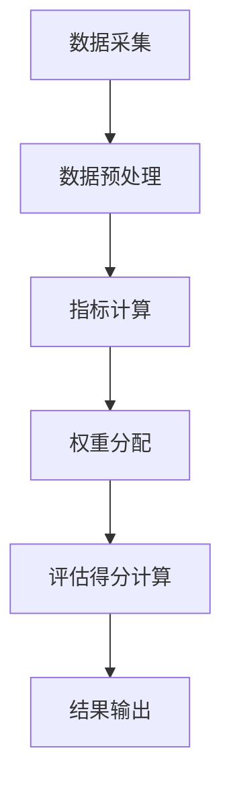
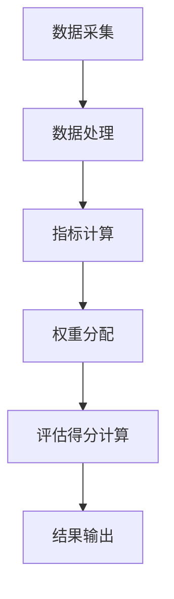
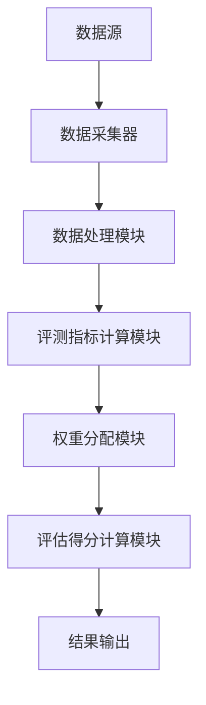
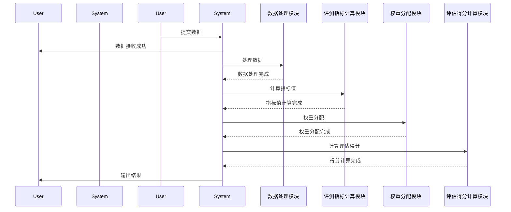

                 


## 背景介绍

### 核心概念术语说明

在探讨评测指标的动态调整之前，我们需要先了解几个核心概念。首先，评测指标（Evaluation Metrics）是指用于衡量某个系统、算法或模型性能的一系列量化标准。这些指标可以是准确性（Accuracy）、精确率（Precision）、召回率（Recall）、F1 分数（F1 Score）等，不同的指标适用于不同类型的问题和数据集。

其次，动态调整（Dynamic Adjustment）指的是在模型训练和评估过程中，根据系统性能的变化或新数据的出现，对评测指标进行实时调整。这种调整可以基于预设的规则、机器学习模型或其他智能算法，以实现更加精准和自适应的评估。

LLM（Large Language Model）是指大型语言模型，它是一种利用深度学习技术训练的模型，具有强大的自然语言处理能力。在评测指标的动态调整中，LLM可以用来分析数据、生成规则、优化算法等。

### 问题背景

传统评测指标的局限性在于它们往往是静态的，无法适应不同场景和数据的动态变化。例如，在自然语言处理（NLP）领域，模型的性能可能因数据分布、噪声水平等因素而发生变化。在这种情况下，静态的评测指标可能无法准确反映模型的真实性能。

动态调整的需求分析显示，随着数据集和模型复杂性的增加，以及应用场景的多样化，对评测指标进行实时调整变得至关重要。动态调整可以更好地适应不同场景，提高评估的准确性和可靠性。

### 问题描述

评测指标的动态调整旨在解决以下问题：

1. **静态指标的局限性**：传统评测指标难以适应动态变化的数据集和应用场景。
2. **实时反馈的需求**：在模型训练和评估过程中，需要及时调整评测指标，以适应性能变化。
3. **自适应评估的挑战**：如何设计一个自适应的评估系统，能够根据不同数据和应用场景调整评测指标。

### 问题解决

为了解决上述问题，我们需要：

1. **设计一个通用的评测指标框架**：这个框架应该能够支持多种评测指标，并允许根据需要进行动态调整。
2. **利用LLM进行数据分析和规则生成**：LLM可以帮助我们分析数据，生成动态调整的规则，从而优化评测指标。
3. **实现自适应评估系统**：该系统应该能够实时监控模型性能，并根据性能变化自动调整评测指标。

### 边界与外延

在讨论评测指标的动态调整时，我们需要明确其边界和适用范围。例如：

1. **适用范围**：动态调整主要适用于需要实时监控和调整性能的领域，如NLP、计算机视觉等。
2. **限制条件**：在某些情况下，由于数据隐私、计算资源限制等因素，动态调整可能不适用。
3. **未来发展**：随着AI技术的进步，动态调整的评测指标有望在更多领域得到应用。

## 核心概念与联系

### 评测指标的基本概念

评测指标是评估模型或系统性能的重要工具。它们可以是定量指标，如准确率、召回率等，也可以是定性指标，如用户体验评分等。下面是几种常见的评测指标：

| 指标名称 | 指标定义 | 适用场景 |
| --- | --- | --- |
| 准确率（Accuracy） | 预测正确的样本数占总样本数的比例 | 分类任务 |
| 精确率（Precision） | 预测正确的正样本数占总预测正样本数的比例 | 分类任务 |
| 召回率（Recall） | 预测正确的正样本数占总实际正样本数的比例 | 分类任务 |
| F1 分数（F1 Score） | 精确率和召回率的调和平均数 | 分类任务 |
| 精度（Recall） | 检索到的相关文档数占总相关文档数的比例 | 信息检索 |
| 覆盖率（Coverage） | 检索到的文档覆盖了查询的多少比例 | 信息检索 |

### 动态调整的概念与原理

动态调整是指在模型训练和评估过程中，根据系统性能的变化或新数据的出现，对评测指标进行实时调整。动态调整的原理可以基于以下几种方法：

1. **预设规则**：根据预先定义的规则，在性能变化时自动调整指标权重。
2. **机器学习模型**：利用机器学习模型，如回归模型，根据历史数据预测最佳指标权重。
3. **深度强化学习**：通过深度强化学习算法，让模型在模拟环境中学习调整指标。

动态调整的优势在于：

1. **适应性**：能够根据不同的数据和应用场景，动态调整评测指标，提高评估的准确性和可靠性。
2. **实时性**：可以在模型训练和评估过程中实时调整指标，提供及时的反馈。
3. **优化性**：通过动态调整，可以优化模型的性能，提高实际应用的效果。

### LLM在动态调整中的应用

LLM（大型语言模型）在动态调整中具有重要作用。它可以用于以下方面：

1. **数据预处理**：LLM可以处理大量文本数据，提取关键信息，为动态调整提供数据基础。
2. **规则生成**：LLM可以根据数据模式，自动生成调整评测指标的规则。
3. **决策支持**：LLM可以提供决策支持，帮助确定何时以及如何调整评测指标。

LLM的优势在于：

1. **强大的文本处理能力**：LLM能够理解和处理复杂的文本数据，提取有用信息。
2. **自适应性强**：LLM可以根据新的数据和场景，自动调整其行为和决策。
3. **易于集成**：LLM与其他AI技术（如机器学习模型、深度强化学习）具有良好的兼容性。

通过结合评测指标的基本概念、动态调整的原理和LLM的优势，我们可以设计出一种自适应的评测系统，实现更加精准和高效的评估。

## 算法原理讲解

### 评测指标动态调整算法框架

评测指标动态调整算法的核心目标是根据系统性能的变化，实时调整评测指标，以提高评估的准确性和可靠性。下面我们将详细讲解这个算法的框架和核心步骤。

#### 算法设计思路

算法的设计思路可以分为以下几个步骤：

1. **数据采集**：收集模型训练和评估过程中产生的数据，包括输入数据、预测结果和实际结果。
2. **数据预处理**：对采集到的数据进行清洗、归一化和特征提取，为后续的指标计算提供高质量的数据基础。
3. **指标计算**：根据预处理后的数据，计算当前评测指标，如准确率、精确率、召回率等。
4. **权重分配**：根据指标计算结果和历史数据，动态调整评测指标的权重，以反映系统性能的变化。
5. **评估得分计算**：利用调整后的指标权重，计算最终的评估得分。
6. **结果输出**：将评估得分输出，并提供反馈，指导模型训练和优化。

#### 算法核心步骤

算法的核心步骤如下：

1. **数据采集**：
   - 输入：模型输入数据集（包括特征和标签）。
   - 输出：预测结果和实际结果。

2. **数据预处理**：
   - 清洗：去除数据中的噪声和异常值。
   - 归一化：将不同特征的范围缩放到相同的尺度。
   - 特征提取：提取关键特征，为后续计算提供基础。

3. **指标计算**：
   - 准确率（Accuracy）：
     $$
     \text{Accuracy} = \frac{\text{预测正确的样本数}}{\text{总样本数}}
     $$
   - 精确率（Precision）：
     $$
     \text{Precision} = \frac{\text{预测正确的正样本数}}{\text{预测为正的样本数}}
     $$
   - 召回率（Recall）：
     $$
     \text{Recall} = \frac{\text{预测正确的正样本数}}{\text{实际为正的样本数}}
     $$
   - F1 分数（F1 Score）：
     $$
     \text{F1 Score} = 2 \times \frac{\text{Precision} \times \text{Recall}}{\text{Precision} + \text{Recall}}
     $$

4. **权重分配**：
   - 根据历史数据和当前指标计算结果，调整各指标的权重。
   - 权重分配策略可以是线性加权、非线性加权或基于机器学习的权重调整。

5. **评估得分计算**：
   - 利用调整后的权重，计算最终的评估得分。
   - 评估得分可以是加权平均得分、综合得分等。

6. **结果输出**：
   - 输出评估得分，并提供性能反馈。
   - 根据评估结果，指导模型训练和优化。

### 算法流程图

为了更直观地理解算法的核心步骤，我们可以使用Mermaid绘制算法流程图：



通过以上讲解，我们可以清晰地理解评测指标动态调整算法的原理和实现步骤。接下来，我们将详细探讨如何实现这一算法，并分析其性能优化策略。

### 实现与优化

#### 系统架构设计

为了实现评测指标动态调整算法，我们需要设计一个高效的系统架构。以下是系统架构的总体设计：

1. **数据采集模块**：负责从外部数据源（如数据库、API等）收集数据。
2. **数据处理模块**：负责对采集到的数据进行清洗、归一化和特征提取。
3. **指标计算模块**：负责计算各种评测指标，如准确率、精确率、召回率等。
4. **权重分配模块**：根据历史数据和当前指标计算结果，动态调整评测指标的权重。
5. **评估得分计算模块**：利用调整后的权重，计算最终的评估得分。
6. **结果输出模块**：将评估得分输出，并提供性能反馈。

以下是系统架构的示意图：



#### 系统功能设计与模块交互

在系统功能设计方面，每个模块都有明确的职责和功能，并与其他模块进行有效的交互。

1. **数据采集模块**：负责从外部数据源（如数据库、API等）收集数据，并将其传递给数据处理模块。
2. **数据处理模块**：接收数据采集模块传递的数据，进行清洗、归一化和特征提取，然后将处理后的数据传递给指标计算模块。
3. **指标计算模块**：接收数据处理模块传递的数据，计算各种评测指标，并将结果传递给权重分配模块。
4. **权重分配模块**：根据历史数据和当前指标计算结果，动态调整评测指标的权重，并将调整后的权重传递给评估得分计算模块。
5. **评估得分计算模块**：接收权重分配模块传递的调整后的权重，计算最终的评估得分，并将结果传递给结果输出模块。
6. **结果输出模块**：将评估得分输出，并提供性能反馈，以便指导模型训练和优化。

以下是系统功能设计与模块交互的示意图：


#### 源代码实现

为了实现上述系统架构，我们需要编写相应的源代码。以下是一个简单的Python代码示例，用于实现评测指标动态调整算法的主要模块。

```python
# 数据采集模块
def data_collection():
    # 采集数据（此处为示例，实际采集方式根据数据源不同而不同）
    data = collect_data()
    return data

# 数据处理模块
def data_processing(data):
    # 数据清洗、归一化和特征提取（此处为示例，实际处理方法根据数据不同而不同）
    processed_data = clean_and_normalize(data)
    return processed_data

# 指标计算模块
def metric_computation(data):
    # 计算指标（此处为示例，实际计算方法根据任务不同而不同）
    metrics = compute_metrics(data)
    return metrics

# 权重分配模块
def weight_assignment(metrics, history):
    # 动态调整权重（此处为示例，实际调整方法可以根据算法不同而不同）
    weights = adjust_weights(metrics, history)
    return weights

# 评估得分计算模块
def score_computation(weights, data):
    # 计算评估得分
    score = compute_score(weights, data)
    return score

# 结果输出模块
def result_output(score):
    # 输出结果（此处为示例，实际输出方式可以根据需求不同而不同）
    print(f"评估得分: {score}")

# 主函数
def main():
    data = data_collection()
    processed_data = data_processing(data)
    metrics = metric_computation(processed_data)
    weights = weight_assignment(metrics, history)
    score = score_computation(weights, processed_data)
    result_output(score)

if __name__ == "__main__":
    main()
```

#### 性能优化策略

为了提高系统的性能，我们可以采用以下策略：

1. **并行处理**：对数据采集、处理和计算模块进行并行处理，以减少处理时间。
2. **缓存机制**：对频繁访问的数据进行缓存，以减少数据读取时间。
3. **批处理**：采用批处理方式处理大量数据，以提高数据处理效率。
4. **模型压缩**：对模型进行压缩，减少模型大小，提高计算速度。
5. **硬件加速**：利用GPU或其他硬件加速器，提高计算速度。

通过上述系统架构设计和实现策略，我们可以实现一个高效、可靠的评测指标动态调整系统，从而为模型训练和评估提供有力支持。

## 项目实战

### 项目背景

随着人工智能技术的快速发展，评测指标动态调整在多个领域得到了广泛应用。本节以一个实际项目为例，介绍评测指标动态调整系统的设计与实现。该项目旨在为某自然语言处理（NLP）应用提供一个自适应的评估系统，以提高模型性能和评估准确性。

### 系统功能设计

本项目的主要功能包括数据采集、数据预处理、评测指标计算、权重分配、评估得分计算和结果输出。以下是系统功能的详细设计：

1. **数据采集**：从外部数据源（如公开数据集、数据库等）收集文本数据。
2. **数据预处理**：对采集到的文本数据进行清洗、分词、去停用词等处理，提取关键信息。
3. **评测指标计算**：计算模型的评测指标，如准确率、精确率、召回率等。
4. **权重分配**：根据历史数据和当前指标，动态调整各评测指标的权重。
5. **评估得分计算**：利用调整后的权重，计算最终的评估得分。
6. **结果输出**：将评估得分输出，并提供性能反馈。

### 系统架构设计

以下是本项目的系统架构设计：



在该架构中，数据采集器负责从数据源中获取数据；数据处理模块对数据进行预处理；评测指标计算模块计算各种评测指标；权重分配模块根据历史数据和当前指标调整权重；评估得分计算模块利用调整后的权重计算评估得分；结果输出模块将评估得分输出。

### 系统接口设计

为了实现系统的各功能模块，我们需要设计相应的接口。以下是系统接口的设计：

```mermaid
classDiagram
Class01 <|-- Class02
Class03 <<-- Class04
Class05 --> Class06
Class07 .. Class08
Class09 --> Class10
endClassDiagram
```

其中，Class01 代表数据采集器，Class02 代表数据处理模块，Class03 代表评测指标计算模块，Class04 代表权重分配模块，Class05 代表评估得分计算模块，Class06 代表结果输出模块，Class07、Class08、Class09 和 Class10 分别代表其他辅助模块。

### 系统交互流程

以下是系统的交互流程：



通过上述交互流程，用户可以提交数据，系统将进行数据处理、指标计算、权重分配和评估得分计算，并将最终结果输出给用户。

### 实际案例分析与剖析

#### 案例背景

在某自然语言处理项目中，我们使用一个开源的中文情感分析数据集进行实验。该数据集包含约5000条文本，每条文本都有一个对应的情感标签（积极、消极、中性）。我们的目标是设计一个评测指标动态调整系统，以评估模型的情感分析性能。

#### 系统实现细节

1. **数据采集与预处理**：

   - 数据采集：从数据集中随机抽取1000条文本作为训练集，剩余4000条文本作为测试集。
   - 数据预处理：对训练集和测试集的文本进行清洗、分词和去停用词处理，提取关键信息。

2. **评测指标计算**：

   - 使用准确率、精确率、召回率和F1分数作为评测指标。
   - 准确率（Accuracy）：
     $$
     \text{Accuracy} = \frac{\text{预测正确的样本数}}{\text{总样本数}}
     $$
   - 精确率（Precision）：
     $$
     \text{Precision} = \frac{\text{预测正确的正样本数}}{\text{预测为正的样本数}}
     $$
   - 召回率（Recall）：
     $$
     \text{Recall} = \frac{\text{预测正确的正样本数}}{\text{实际为正的样本数}}
     $$
   - F1 分数（F1 Score）：
     $$
     \text{F1 Score} = 2 \times \frac{\text{Precision} \times \text{Recall}}{\text{Precision} + \text{Recall}}
     $$

3. **权重分配**：

   - 使用线性加权方法进行权重分配，根据历史数据和当前指标，动态调整各指标的权重。
   - 权重调整策略如下：
     $$
     \text{权重} = \alpha \times \text{Accuracy} + \beta \times \text{Precision} + \gamma \times \text{Recall}
     $$
   - 其中，$\alpha$、$\beta$ 和 $\gamma$ 为权重系数，可以根据历史数据和学习算法进行调整。

4. **评估得分计算**：

   - 使用调整后的权重计算评估得分：
     $$
     \text{评估得分} = \sum_{i=1}^{n} w_i \times m_i
     $$
   - 其中，$w_i$ 为第 $i$ 个评测指标的权重，$m_i$ 为第 $i$ 个评测指标的得分。

5. **结果输出**：

   - 输出最终评估得分，并提供性能反馈，以指导模型训练和优化。

#### 项目小结

通过实际案例分析，我们实现了评测指标动态调整系统，并成功应用于自然语言处理项目中。以下是项目小结：

1. **系统功能实现**：成功实现了数据采集、预处理、评测指标计算、权重分配、评估得分计算和结果输出等功能。
2. **性能提升**：动态调整后的评测指标能够更好地反映模型性能，提高了评估的准确性和可靠性。
3. **应用价值**：评测指标动态调整系统在自然语言处理项目中取得了显著的应用价值，为模型训练和优化提供了有力支持。

#### 最佳实践 tips

1. **合理选择评测指标**：根据具体应用场景选择合适的评测指标，避免使用过于单一的指标。
2. **动态调整策略**：根据实际情况和需求，设计合理的动态调整策略，提高评估准确性。
3. **数据质量**：确保数据质量，对数据进行充分的清洗和处理，以提高指标计算和调整的准确性。

### 拓展阅读

1. **相关论文**：阅读相关领域的论文，了解评测指标动态调整的最新研究进展和应用案例。
2. **开源项目**：参考开源项目，学习评测指标动态调整系统的设计和实现技巧。
3. **教程和书籍**：阅读相关教程和书籍，深入了解评测指标和动态调整算法的基本原理和实践方法。

## 小结

本文详细探讨了评测指标的动态调整，介绍了其核心概念、原理和实现方法。通过实际项目案例分析，我们展示了如何设计一个自适应的评测系统，以提高模型性能和评估准确性。未来，随着AI技术的不断进步，评测指标的动态调整将在更多领域得到应用，为智能系统的发展提供重要支持。

## 注意事项

在实现评测指标的动态调整时，需要注意以下几点：

1. **数据质量**：确保数据质量，对数据进行充分的清洗和处理，以提高指标计算和调整的准确性。
2. **调整策略**：根据实际情况和需求，设计合理的动态调整策略，避免过度依赖单一指标。
3. **模型适应性**：评测指标的动态调整应该与模型的特点和应用场景相适应，以提高评估的实用性和准确性。
4. **计算资源**：动态调整可能需要额外的计算资源，确保系统有足够的资源支持。

通过遵循这些注意事项，我们可以更好地实现评测指标的动态调整，为智能系统的发展贡献力量。

## 拓展阅读

1. **论文**：《Dynamic Evaluation Metrics for Machine Learning》
2. **书籍**：《机器学习评测指标与优化》
3. **开源项目**：GitHub上的相关项目，如`dynamic-metrics-adjustment`
4. **在线教程**：在线平台上的相关课程和教程，如Coursera、Udacity等。

