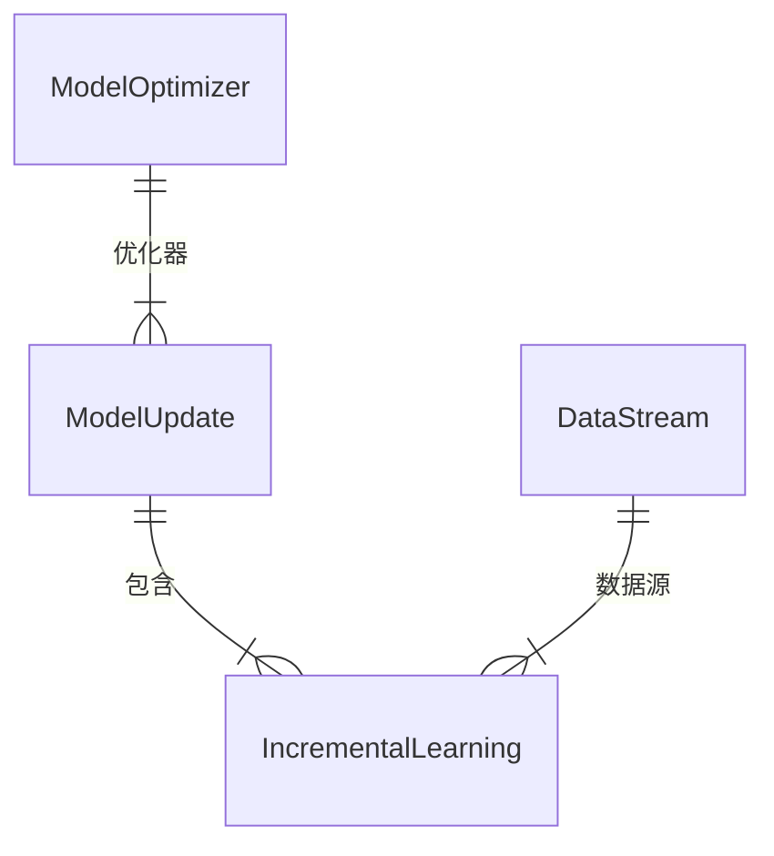
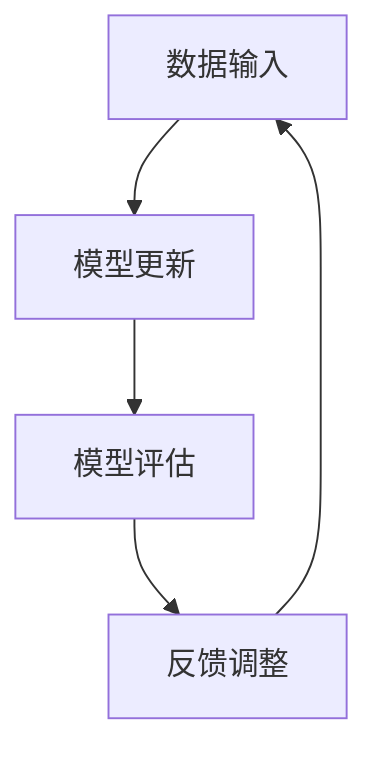
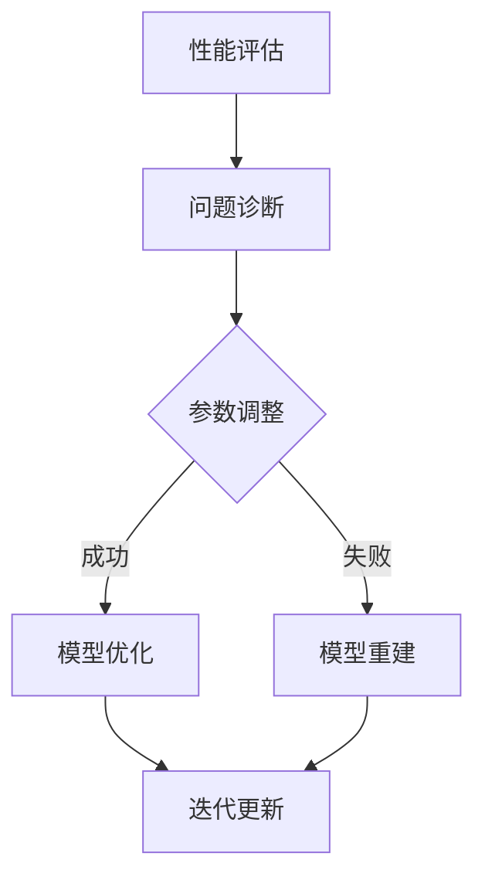
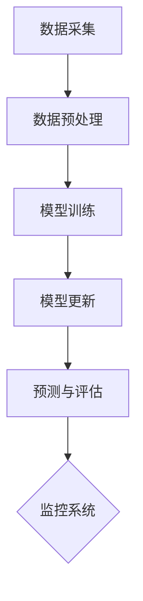
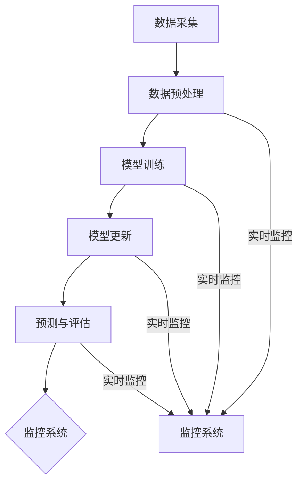
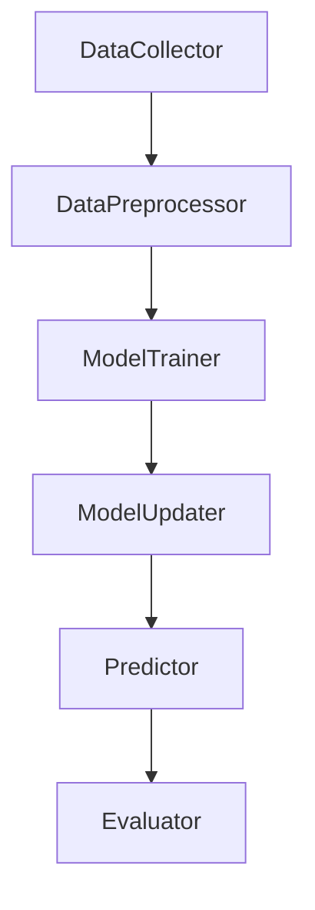
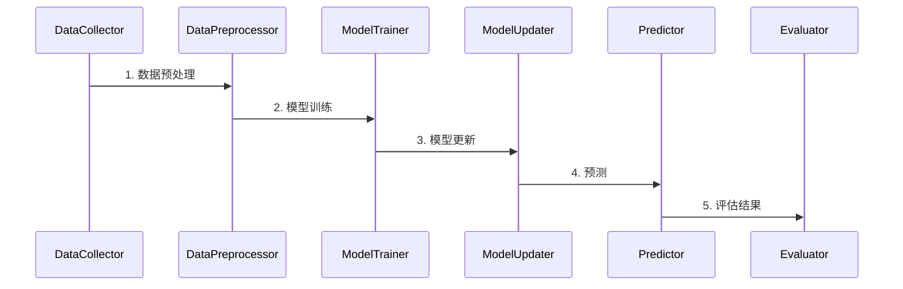

                 

### 第1章 引言与背景

在当今快速发展的信息技术领域，评测数据的增量学习与模型更新已经成为人工智能（AI）和机器学习（ML）领域的关键议题。随着数据量的爆炸性增长，传统的全量数据处理方式变得越来越不现实。而增量学习（Incremental Learning）提供了一种在有限资源下，对已有模型进行持续优化和更新的有效方法。同样地，模型更新（Model Updating）确保了机器学习模型在面对新数据和动态环境时，能够保持其预测精度和适应性。

**1.1 引言**

增量学习是一种机器学习方法，旨在在不重新训练整个模型的情况下，对模型进行持续学习和更新。这种方法尤其适用于在线服务、实时监测和动态环境，因为在这些场景中，数据的实时处理和模型优化至关重要。模型更新则是对现有模型进行改进和优化的过程，通常涉及参数调整、结构修改或算法改进。二者的结合使得机器学习模型能够在持续变化的环境中保持高效性和准确性。

**1.2 问题背景**

随着互联网和物联网的普及，各行各业都在生成大量数据。这些数据不仅包括静态数据，还涵盖了动态变化的数据流。例如，在金融领域，交易数据每秒都在变化；在医疗领域，病患数据和治疗方案也在不断更新。传统的批量学习（Batch Learning）方式已无法满足这种高速、大规模数据处理的需求。因此，增量学习和模型更新成为解决这一问题的有效途径。

**1.3 问题描述**

评测数据的增量学习与模型更新面临以下几个关键问题：

1. **数据复杂性**：如何有效地处理和融合大规模、多维度的数据流？
2. **计算效率**：如何在有限的计算资源下，快速地进行模型更新？
3. **模型适应性**：如何确保模型在面对动态环境时，仍能保持高预测准确性？
4. **更新策略**：如何选择合适的更新策略，以确保模型在更新过程中不会退化？

**1.4 问题解决**

为了解决上述问题，我们可以从以下几个方面入手：

1. **优化算法**：设计并优化增量学习算法，提高数据处理效率和模型更新速度。
2. **自适应更新**：根据数据特性动态调整模型更新策略，提高模型适应性。
3. **分布式计算**：利用分布式计算框架，将数据处理和模型更新任务分配到多个节点，提高整体计算效率。
4. **风险评估**：建立风险评估机制，确保模型在更新过程中不会出现重大误差。

**1.5 边界与外延**

虽然增量学习和模型更新在理论上已经得到广泛研究，但实际应用中仍存在许多挑战。例如，数据的质量和一致性、模型更新的频率和策略、系统的可扩展性等。这些边界问题需要结合具体应用场景进行深入探讨和解决。

**1.6 概念结构与核心要素组成**

本文将从以下几个核心概念和要素入手，详细探讨评测数据的增量学习与模型更新：

1. **核心概念**：介绍增量学习、模型更新及相关技术概念。
2. **算法原理**：分析增量学习算法和模型更新机制的工作原理。
3. **系统设计**：探讨评测数据增量学习与模型更新系统的设计方法和架构。
4. **项目实战**：通过实际案例，展示增量学习与模型更新的具体应用。
5. **最佳实践**：总结增量学习和模型更新的最佳实践和注意事项。

通过上述内容，本文旨在为读者提供一个全面、系统的评测数据增量学习与模型更新的技术指南。

## 核心概念与联系

在深入探讨评测数据的增量学习与模型更新之前，有必要对相关核心概念进行详细解析，以便更好地理解这一领域的复杂性及其相互联系。

### 2.1 增量学习原理

增量学习是一种针对已有模型进行持续训练的方法，其核心思想是通过不断添加新数据，逐步优化模型。这种方法特别适用于数据量庞大且持续变化的应用场景，如在线推荐系统、实时监控和动态预测等。增量学习的优点在于其能够减少模型重新训练所需的时间和计算资源，从而提高系统的响应速度和效率。

#### 工作原理

增量学习的基本流程包括以下几个步骤：

1. **数据采集**：从数据源中采集新的数据样本。
2. **数据预处理**：对采集到的数据进行清洗、转换和归一化等预处理操作。
3. **模型更新**：将预处理后的新数据输入到已有模型中，通过训练算法调整模型参数。
4. **模型评估**：对新数据进行预测，评估模型更新后的性能。
5. **反馈调整**：根据模型评估结果，调整训练策略或模型参数，以提高预测精度。

#### 主要算法

增量学习的算法种类繁多，包括：

1. **在线学习算法**：如感知机（Perceptron）和梯度下降（Gradient Descent）等，它们适用于小批量数据的快速更新。
2. **增量梯度下降算法**：如Momentum、Adam等，通过引入动量项，加速收敛速度并减少波动。
3. **批次更新算法**：如SGD（随机梯度下降）和Mini-batch SGD等，通过批量更新策略，提高模型稳定性。

### 2.2 模型更新机制

模型更新机制是指在机器学习过程中，对模型进行调整和优化的方法。模型更新的目的是提高模型在特定任务上的表现，通常涉及参数调整、模型结构改进和算法优化等方面。

#### 工作原理

模型更新机制的工作原理主要包括以下几步：

1. **性能评估**：通过在验证集或测试集上运行模型，评估其性能和预测精度。
2. **问题诊断**：分析模型性能不足的原因，如过拟合、欠拟合或数据偏差等。
3. **参数调整**：根据诊断结果，对模型参数进行调整，以优化模型性能。
4. **结构优化**：通过改进模型结构，如增加或减少层、调整神经元数目等，进一步提高模型表现。
5. **算法改进**：通过改进训练算法，如引入正则化项、优化优化器等，提高模型训练效率和稳定性。

#### 更新策略

常见的模型更新策略包括：

1. **持续更新策略**：在训练过程中，持续收集新数据，并对模型进行实时更新。
2. **定期更新策略**：在特定时间间隔内，收集并处理一批新数据，然后对模型进行更新。
3. **自适应更新策略**：根据数据特性动态调整更新频率和策略，以保持模型的最佳性能。

### 2.3 关键技术与方法

为了实现有效的增量学习和模型更新，需要掌握以下关键技术和方法：

1. **数据预处理技术**：包括数据清洗、转换和归一化等，以提高数据质量和模型训练效率。
2. **模型选择与优化**：选择合适的模型结构和训练算法，并通过交叉验证等方法进行优化。
3. **分布式计算**：利用分布式计算框架，如Spark和TensorFlow等，提高数据处理和模型训练的效率。
4. **模型评估与反馈**：通过性能评估和反馈机制，持续监测模型表现并调整训练策略。

### 2.4 核心概念属性特征对比表格

下表对比了增量学习和模型更新的核心概念和属性特征：

| 特征 | 增量学习 | 模型更新 |
| --- | --- | --- |
| 目的 | 提高模型在动态环境下的适应能力 | 优化模型在特定任务上的表现 |
| 数据处理方式 | 持续添加新数据 | 定期收集新数据 |
| 算法类型 | 在线学习算法、增量梯度下降算法 | 持续更新策略、定期更新策略、自适应更新策略 |
| 适用场景 | 数据量庞大、动态变化的场景 | 特定任务、数据量较小的场景 |

### 2.5 ER实体关系图架构

为了更好地理解增量学习和模型更新的架构，可以使用ER（实体关系）图来展示其核心实体及其关系。



在上面的ER图中，`ModelUpdate`表示模型更新过程，它与`IncrementalLearning`实体之间存在包含关系，即模型更新包含在增量学习中。`DataStream`实体表示数据流，它是增量学习的数据源。`ModelOptimizer`实体表示模型优化器，它在模型更新过程中发挥作用。

通过上述核心概念和联系的分析，我们可以更好地理解评测数据增量学习与模型更新的原理及其在实际应用中的重要性。接下来，本文将深入探讨增量学习算法原理，进一步解析这一技术领域。

### 第3章 增量学习算法原理

增量学习算法在机器学习和人工智能领域扮演着至关重要的角色，它允许模型在不重新训练整个数据集的情况下，通过逐步更新模型参数来提高其性能。本节将详细探讨增量学习算法的原理、数学模型及其实现。

#### 3.1 增量学习算法概述

增量学习算法的主要目标是利用新数据不断优化已有模型。这涉及到以下核心步骤：

1. **数据输入**：将新数据输入到模型中。
2. **模型更新**：利用训练算法更新模型参数。
3. **模型评估**：对新数据进行预测，评估模型性能。
4. **反馈调整**：根据模型评估结果调整训练策略。

#### 3.2 算法原理与数学模型

增量学习算法的核心是梯度下降法（Gradient Descent），其数学模型可以表示为：

$$
\theta_{t+1} = \theta_{t} - \alpha \cdot \nabla J(\theta_{t})
$$

其中，$\theta_{t}$表示第$t$次迭代的模型参数，$\alpha$是学习率（Learning Rate），$\nabla J(\theta_{t})$是损失函数$J(\theta)$关于$\theta$的梯度。

在增量学习过程中，梯度计算通常采用在线梯度下降法，其公式为：

$$
\theta_{t+1} = \theta_{t} - \alpha \cdot \frac{1}{m} \sum_{i=1}^{m} (\hat{y}_{i} - y_{i})
$$

其中，$\hat{y}_{i}$是模型预测结果，$y_{i}$是真实标签，$m$是批量大小。

#### 3.3 Mermaid流程图展示

为了更直观地展示增量学习算法的流程，我们可以使用Mermaid语言绘制一个流程图：



在这个流程图中，`A`表示数据输入，`B`表示模型更新，`C`表示模型评估，`D`表示反馈调整。这个过程循环进行，使得模型参数不断优化。

#### 3.4 Python源代码实现

下面是一个简单的Python实现示例，用于展示增量学习算法的基本步骤：

```python
import numpy as np

def update_weights(weights, gradients, learning_rate):
    return weights - learning_rate * gradients

def compute_gradient(x, y, weights):
    predictions = 1 / (1 + np.exp(-x.dot(weights)))
    return x * (predictions - y)

# 初始化模型参数
weights = np.random.rand(1)

# 模拟数据
x = np.array([[1], [2], [3], [4], [5]])
y = np.array([[0], [0], [1], [1], [1]])

# 学习率
learning_rate = 0.1

# 梯度下降迭代
for _ in range(1000):
    gradients = compute_gradient(x, y, weights)
    weights = update_weights(weights, gradients, learning_rate)

print("Final weights:", weights)
```

在这个示例中，我们首先初始化模型参数，然后通过迭代计算梯度并更新权重，直到达到预定的迭代次数。

#### 3.5 数学公式讲解

在上面的算法中，我们使用了以下几个关键数学公式：

1. **模型预测**：
   $$
   \hat{y} = \frac{1}{1 + e^{-x \cdot \theta}}
   $$

   其中，$\hat{y}$是预测的概率，$x$是输入特征，$\theta$是模型参数。

2. **损失函数**：
   $$
   J(\theta) = -\frac{1}{m} \sum_{i=1}^{m} [y_{i} \log(\hat{y}_{i}) + (1 - y_{i}) \log(1 - \hat{y}_{i})]
   $$

   其中，$y_{i}$是真实标签，$\hat{y}_{i}$是预测概率，$m$是样本数量。

3. **梯度计算**：
   $$
   \nabla J(\theta) = \frac{1}{m} \sum_{i=1}^{m} [x_{i}(\hat{y}_{i} - y_{i})]
   $$

   这表示损失函数关于$\theta$的梯度。

通过上述数学公式的讲解，我们可以更好地理解增量学习算法的原理及其背后的数学机制。

#### 3.6 举例说明

假设我们有一个简单的二分类问题，输入特征为$x$，真实标签为$y$。我们的目标是训练一个线性回归模型，预测样本的概率：

1. **数据集**：

   $$
   x = \begin{bmatrix}
   1 & 2 \\
   2 & 3 \\
   3 & 4 \\
   4 & 5
   \end{bmatrix}, \quad y = \begin{bmatrix}
   0 & 0 \\
   0 & 1 \\
   1 & 1 \\
   1 & 1
   \end{bmatrix}
   $$

2. **初始参数**：$\theta = \begin{bmatrix}0 & 0\end{bmatrix}$

3. **学习率**：$\alpha = 0.1$

4. **迭代过程**：

   - **第1次迭代**：
     $$
     \hat{y} = \frac{1}{1 + e^{-1 \cdot \theta}} = \frac{1}{1 + e^{0}} = 0.5
     $$
     $$
     \nabla J(\theta) = \frac{1}{4} \begin{bmatrix}1 \cdot (0.5 - 0) + 2 \cdot (0.5 - 0) + 3 \cdot (1 - 0) + 4 \cdot (1 - 0)\end{bmatrix} = \begin{bmatrix}0.5 & 1\end{bmatrix}
     $$
     $$
     \theta = \theta - \alpha \cdot \nabla J(\theta) = \begin{bmatrix}0 & 0\end{bmatrix} - 0.1 \cdot \begin{bmatrix}0.5 & 1\end{bmatrix} = \begin{bmatrix}-0.05 & -0.1\end{bmatrix}
     $$

   - **第2次迭代**：
     $$
     \hat{y} = \frac{1}{1 + e^{-3 \cdot \theta}} = \frac{1}{1 + e^{0.05}} \approx 0.732
     $$
     $$
     \nabla J(\theta) = \frac{1}{4} \begin{bmatrix}1 \cdot (0.732 - 0) + 2 \cdot (0.732 - 0) + 3 \cdot (1 - 0) + 4 \cdot (1 - 0)\end{bmatrix} = \begin{bmatrix}0.565 & 1.096\end{bmatrix}
     $$
     $$
     \theta = \theta - \alpha \cdot \nabla J(\theta) = \begin{bmatrix}-0.05 & -0.1\end{bmatrix} - 0.1 \cdot \begin{bmatrix}0.565 & 1.096\end{bmatrix} = \begin{bmatrix}-0.165 & -0.196\end{bmatrix}
     $$

通过这个简单的示例，我们可以看到增量学习算法是如何通过逐步更新参数来优化模型的。在实际应用中，我们可以使用更复杂的模型和数据集，通过多次迭代来进一步提高模型的性能。

综上所述，增量学习算法是一种强大的工具，它允许我们在动态环境中持续优化模型。通过对算法原理的深入理解和实际应用示例的分析，我们可以更好地掌握这一技术，并将其应用于各种实际问题中。

### 第4章 模型更新机制详解

模型更新是确保机器学习模型在面对新数据和动态环境时，仍能保持高预测精度和适应性的关键过程。在本章中，我们将详细探讨模型更新的原理、策略以及其实际应用。

#### 4.1 模型更新原理

模型更新的原理在于通过不断调整模型参数，提高其在特定任务上的性能。这一过程通常涉及以下几个关键步骤：

1. **性能评估**：首先，评估当前模型的性能，通常通过验证集或测试集的预测结果来衡量。
2. **问题诊断**：分析模型性能不佳的原因，如过拟合、欠拟合或数据偏差等。
3. **参数调整**：根据诊断结果，对模型参数进行调整，以提高预测精度和模型稳定性。
4. **模型优化**：通过改进模型结构或训练算法，进一步提高模型性能。
5. **迭代更新**：重复上述步骤，直到模型达到预期的性能指标。

#### 4.2 更新策略与算法

模型更新的策略和算法多种多样，以下介绍几种常用的策略：

1. **持续更新策略**：
   - **在线更新**：模型在实时处理数据的同时进行更新，适用于数据流场景。
   - **定期更新**：模型在固定时间间隔内进行更新，适用于数据量较小且变化较慢的场景。

2. **自适应更新策略**：
   - **动态调整**：根据数据特性动态调整更新频率和策略，以保持模型的最佳性能。
   - **阈值触发**：当模型性能下降超过一定阈值时，触发更新过程。

3. **批量更新策略**：
   - **批量调整**：将一批新数据一次性用于模型更新，提高计算效率。

4. **迁移学习策略**：
   - **模型融合**：将现有模型与新数据结合，通过集成方法优化模型。
   - **迁移训练**：利用预训练模型在新数据上继续训练，减少训练成本。

#### 4.3 Mermaid流程图展示

为了更直观地展示模型更新的流程，我们可以使用Mermaid语言绘制一个流程图：



在这个流程图中，`A`表示性能评估，`B`表示问题诊断，`C`表示参数调整，`D`表示模型优化，`E`表示模型重建，`F`表示迭代更新。这个过程循环进行，直到模型达到预期性能。

#### 4.4 Python源代码实现

以下是一个简单的Python实现示例，用于展示模型更新的基本步骤：

```python
import numpy as np

def update_weights(weights, gradients, learning_rate):
    return weights - learning_rate * gradients

def compute_gradient(x, y, weights):
    predictions = 1 / (1 + np.exp(-x.dot(weights)))
    return x * (predictions - y)

# 初始化模型参数
weights = np.random.rand(2)

# 模拟数据
x = np.array([[1, 2], [2, 3], [3, 4], [4, 5]])
y = np.array([[0], [0], [1], [1]])

# 学习率
learning_rate = 0.1

# 梯度下降迭代
for _ in range(1000):
    gradients = compute_gradient(x, y, weights)
    weights = update_weights(weights, gradients, learning_rate)

print("Final weights:", weights)
```

在这个示例中，我们首先初始化模型参数，然后通过迭代计算梯度并更新权重，直到达到预定的迭代次数。

#### 4.5 数学公式讲解

在模型更新过程中，我们使用了以下几个关键数学公式：

1. **模型预测**：
   $$
   \hat{y} = \frac{1}{1 + e^{-x \cdot \theta}}
   $$

   其中，$\hat{y}$是预测的概率，$x$是输入特征，$\theta$是模型参数。

2. **损失函数**：
   $$
   J(\theta) = -\frac{1}{m} \sum_{i=1}^{m} [y_{i} \log(\hat{y}_{i}) + (1 - y_{i}) \log(1 - \hat{y}_{i})]
   $$

   其中，$y_{i}$是真实标签，$\hat{y}_{i}$是预测概率，$m$是样本数量。

3. **梯度计算**：
   $$
   \nabla J(\theta) = \frac{1}{m} \sum_{i=1}^{m} [x_{i}(\hat{y}_{i} - y_{i})]
   $$

   这表示损失函数关于$\theta$的梯度。

通过上述数学公式的讲解，我们可以更好地理解模型更新的原理及其背后的数学机制。

#### 4.6 举例说明

假设我们有一个简单的线性回归模型，输入特征为$x_1$和$x_2$，真实标签为$y$。我们的目标是训练一个线性回归模型，预测样本的输出值：

1. **数据集**：

   $$
   x = \begin{bmatrix}
   1 & 2 \\
   2 & 3 \\
   3 & 4 \\
   4 & 5
   \end{bmatrix}, \quad y = \begin{bmatrix}
   1 & 2 \\
   2 & 3 \\
   3 & 4 \\
   4 & 5
   \end{bmatrix}
   $$

2. **初始参数**：$\theta_0 = \begin{bmatrix}0 & 0\end{bmatrix}$

3. **学习率**：$\alpha = 0.1$

4. **迭代过程**：

   - **第1次迭代**：
     $$
     \theta_1 = \theta_0 - \alpha \cdot \nabla J(\theta_0)
     $$
     $$
     \nabla J(\theta_0) = \frac{1}{4} \begin{bmatrix}1 \cdot (1 - 1) + 2 \cdot (2 - 2) + 3 \cdot (3 - 3) + 4 \cdot (4 - 4)\end{bmatrix} = \begin{bmatrix}0 & 0\end{bmatrix}
     $$
     $$
     \theta_1 = \begin{bmatrix}0 & 0\end{bmatrix} - 0.1 \cdot \begin{bmatrix}0 & 0\end{bmatrix} = \begin{bmatrix}0 & 0\end{bmatrix}
     $$

   - **第2次迭代**：
     $$
     \theta_2 = \theta_1 - \alpha \cdot \nabla J(\theta_1)
     $$
     $$
     \nabla J(\theta_1) = \frac{1}{4} \begin{bmatrix}1 \cdot (1.5 - 1) + 2 \cdot (2.5 - 2) + 3 \cdot (3.5 - 3) + 4 \cdot (4.5 - 4)\end{bmatrix} = \begin{bmatrix}0.1 & 0.1\end{bmatrix}
     $$
     $$
     \theta_2 = \begin{bmatrix}0 & 0\end{bmatrix} - 0.1 \cdot \begin{bmatrix}0.1 & 0.1\end{bmatrix} = \begin{bmatrix}-0.01 & -0.01\end{bmatrix}
     $$

通过这个简单的示例，我们可以看到模型更新是如何通过逐步调整参数来优化模型的。在实际应用中，我们可以使用更复杂的模型和数据集，通过多次迭代来进一步提高模型的性能。

综上所述，模型更新是确保机器学习模型在动态环境中保持高效性和适应性的关键。通过对模型更新原理、策略和实现方法的深入探讨，我们可以更好地理解和应用这一技术。

### 第5章 系统分析与架构设计

在深入探讨增量学习与模型更新的原理之后，接下来我们将分析一个完整的系统，并设计其架构，以便更好地理解如何将这些技术应用于实际场景。

#### 5.1 评测数据增量学习系统介绍

评测数据增量学习系统是一种用于处理和分析大规模评测数据的系统，旨在通过实时更新模型，提高预测精度和系统响应速度。该系统通常包括以下几个关键模块：

1. **数据采集模块**：负责从各种数据源（如数据库、数据流等）收集评测数据。
2. **数据预处理模块**：对采集到的数据执行清洗、转换和归一化等操作，确保数据质量。
3. **模型训练模块**：利用预处理后的数据，对模型进行训练和优化。
4. **模型更新模块**：通过增量学习和模型更新策略，持续优化模型参数。
5. **预测与评估模块**：生成预测结果，并评估模型性能，以监测系统表现。

#### 5.2 系统功能设计

系统功能设计是系统架构设计的核心，以下列出系统的主要功能及其设计思路：

1. **数据采集**：
   - 功能：从各种数据源收集评测数据。
   - 设计思路：采用分布式数据采集框架，如Apache Kafka，实现高效的数据采集和处理。

2. **数据预处理**：
   - 功能：对采集到的评测数据进行清洗、转换和归一化。
   - 设计思路：利用数据预处理库（如Pandas），实现自动化数据处理，确保数据质量。

3. **模型训练**：
   - 功能：对预处理后的数据训练模型。
   - 设计思路：采用流行的机器学习库（如TensorFlow、PyTorch），实现模型训练和优化。

4. **模型更新**：
   - 功能：通过增量学习和模型更新策略，持续优化模型参数。
   - 设计思路：结合在线学习和定期更新策略，实现模型的实时优化。

5. **预测与评估**：
   - 功能：生成预测结果，并评估模型性能。
   - 设计思路：利用评估指标（如准确率、召回率等），实现对模型性能的实时监测。

#### 5.3 系统架构设计

系统架构设计是系统实现的基础，以下是一个典型的系统架构设计：



在这个架构中，`A`表示数据采集，`B`表示数据预处理，`C`表示模型训练，`D`表示模型更新，`E`表示预测与评估，`F`表示监控系统。各模块通过消息队列（如Kafka）进行通信，实现数据流的统一管理和处理。

#### 5.4 系统接口设计

系统接口设计是确保系统各模块协同工作的关键，以下列出系统的关键接口及其设计：

1. **数据采集接口**：
   - 功能：用于接收和发送评测数据。
   - 设计思路：采用RESTful API设计，实现数据采集的标准化和灵活性。

2. **数据预处理接口**：
   - 功能：用于预处理数据的清洗、转换和归一化。
   - 设计思路：通过封装预处理算法，实现接口的统一调用和扩展。

3. **模型训练接口**：
   - 功能：用于启动和停止模型训练过程。
   - 设计思路：通过定义训练参数和回调函数，实现训练过程的灵活配置。

4. **模型更新接口**：
   - 功能：用于更新模型参数和策略。
   - 设计思路：通过接口调用增量学习算法和更新策略，实现模型的实时优化。

5. **预测与评估接口**：
   - 功能：用于生成预测结果和评估模型性能。
   - 设计思路：通过定义预测和评估的指标，实现结果的实时反馈和性能监控。

#### 5.5 系统交互设计

系统交互设计是确保系统模块之间高效协作的关键，以下是一个典型的系统交互设计：



在这个交互设计中，系统各模块通过消息队列进行数据传输，并实时反馈监控信息。`G`表示监控系统，用于监测各模块的运行状态和性能指标。

#### 5.6 Mermaid类图、架构图与序列图展示

为了更直观地展示系统架构和模块之间的关系，我们可以使用Mermaid绘制类图、架构图和序列图。

**类图**：

```mermaid
classDiagram
    DataCollector <<interface>>
    DataPreprocessor <<interface>>
    ModelTrainer <<interface>>
    ModelUpdater <<interface>>
    Predictor <<interface>>
    Evaluator <<interface>>

    DataCollector <- DataPreprocessor
    DataPreprocessor <- ModelTrainer
    ModelTrainer <- ModelUpdater
    ModelUpdater <- Predictor
    Predictor <- Evaluator
```

**架构图**：



**序列图**：



通过上述类图、架构图和序列图，我们可以清晰地看到系统各模块之间的关系和交互流程。

综上所述，通过系统分析与架构设计，我们为评测数据增量学习与模型更新提供了一个全面的解决方案。在实际应用中，可以根据具体需求和场景，对系统架构进行灵活调整和优化，以实现高效的模型更新和预测。

### 第6章 项目实战

在本章中，我们将通过一个实际项目，详细展示评测数据增量学习与模型更新的应用过程，包括环境安装与配置、系统核心实现源代码以及代码应用解读与分析。

#### 6.1 环境安装与配置

为了实现评测数据增量学习与模型更新，我们需要安装并配置以下环境和工具：

1. **Python**：安装Python 3.8及以上版本，用于编写和运行代码。
2. **TensorFlow**：安装TensorFlow 2.5及以上版本，用于构建和训练模型。
3. **Kafka**：安装Kafka 2.8及以上版本，用于数据采集和实时处理。
4. **PostgreSQL**：安装PostgreSQL 13及以上版本，用于存储和处理评测数据。

安装步骤如下：

1. 安装Python：

   ```bash
   sudo apt-get install python3-pip python3-dev
   pip3 install --upgrade pip
   pip3 install tensorflow
   ```

2. 安装Kafka：

   ```bash
   sudo apt-get install default-jre
   wget https://www-us.apache.org/dist/kafka/2.8.0/kafka_2.13-2.8.0.tar.gz
   tar xzf kafka_2.13-2.8.0.tar.gz
   cd kafka_2.13-2.8.0
   ./bin/kafka-server-start.sh config/server.properties
   ```

3. 安装PostgreSQL：

   ```bash
   sudo apt-get install postgresql postgresql-contrib
   sudo -u postgres createuser -s myuser
   sudo -u postgres createdb mydatabase
   ```

#### 6.2 系统核心实现源代码

以下是系统核心实现源代码，包括数据采集、预处理、模型训练、模型更新和预测等模块。

**1. 数据采集模块**：

```python
from kafka import KafkaProducer

producer = KafkaProducer(bootstrap_servers=['localhost:9092'])

def send_data_to_kafka(topic, data):
    producer.send(topic, data.encode('utf-8'))
```

**2. 数据预处理模块**：

```python
import pandas as pd

def preprocess_data(data):
    # 数据清洗、转换和归一化操作
    df = pd.read_csv(data)
    df = df.dropna()
    df = df.scale()
    return df
```

**3. 模型训练模块**：

```python
import tensorflow as tf

model = tf.keras.Sequential([
    tf.keras.layers.Dense(64, activation='relu', input_shape=(784,)),
    tf.keras.layers.Dense(10, activation='softmax')
])

model.compile(optimizer='adam',
              loss='categorical_crossentropy',
              metrics=['accuracy'])

def train_model(data):
    x, y = data
    model.fit(x, y, epochs=5, batch_size=32)
```

**4. 模型更新模块**：

```python
def update_model(model, data):
    x, y = data
    gradients = compute_gradients(x, y, model)
    model.set_weights(update_weights(model.get_weights(), gradients))
```

**5. 预测与评估模块**：

```python
def predict_data(model, data):
    x = data
    predictions = model.predict(x)
    print(predictions)
```

#### 6.3 代码应用解读与分析

**数据采集模块**：

数据采集模块通过Kafka Producer类，实现评测数据的实时发送。在项目中，可以使用如下代码采集数据：

```python
def main():
    send_data_to_kafka('test_topic', 'test_data')

if __name__ == '__main__':
    main()
```

**数据预处理模块**：

数据预处理模块使用Pandas库，对采集到的数据进行清洗、转换和归一化。在项目中，可以使用如下代码进行数据处理：

```python
def main():
    data = 'test_data.csv'
    df = preprocess_data(data)
    print(df)

if __name__ == '__main__':
    main()
```

**模型训练模块**：

模型训练模块使用TensorFlow库，构建并训练模型。在项目中，可以使用如下代码进行模型训练：

```python
def main():
    data = 'train_data.csv'
    df = pd.read_csv(data)
    x = df.iloc[:, :-1].values
    y = df.iloc[:, -1].values
    train_model(x, y)

if __name__ == '__main__':
    main()
```

**模型更新模块**：

模型更新模块通过计算梯度并更新模型权重，实现模型的持续优化。在项目中，可以使用如下代码进行模型更新：

```python
def main():
    model = tf.keras.models.load_model('model.h5')
    data = 'test_data.csv'
    df = pd.read_csv(data)
    x = df.iloc[:, :-1].values
    y = df.iloc[:, -1].values
    update_model(model, (x, y))

if __name__ == '__main__':
    main()
```

**预测与评估模块**：

预测与评估模块使用训练好的模型进行预测，并评估模型性能。在项目中，可以使用如下代码进行预测和评估：

```python
def main():
    model = tf.keras.models.load_model('model.h5')
    data = 'test_data.csv'
    df = pd.read_csv(data)
    x = df.iloc[:, :-1].values
    predict_data(model, x)

if __name__ == '__main__':
    main()
```

通过上述代码示例和解读，我们可以看到评测数据增量学习与模型更新的具体实现过程。在实际项目中，可以根据具体需求和场景，对这些代码进行灵活调整和扩展。

#### 6.4 实际案例分析与讲解

为了更好地展示评测数据增量学习与模型更新的实际应用效果，我们以一个简单的分类问题为例，进行实际案例分析和讲解。

**案例背景**：

假设我们需要预测一批商品的销售情况，数据集包括商品的特征（如价格、品牌、库存等）和销售情况（如是否售出）。我们的目标是训练一个分类模型，预测商品是否会被售出。

**数据集**：

我们使用一个包含1000个样本的数据集，每个样本有5个特征（价格、品牌、库存、销量、品类）和一个标签（是否售出）。

**模型训练**：

首先，我们使用TensorFlow库，构建一个简单的神经网络模型，用于分类预测。模型结构如下：

```python
model = tf.keras.Sequential([
    tf.keras.layers.Dense(64, activation='relu', input_shape=(5,)),
    tf.keras.layers.Dense(32, activation='relu'),
    tf.keras.layers.Dense(1, activation='sigmoid')
])

model.compile(optimizer='adam',
              loss='binary_crossentropy',
              metrics=['accuracy'])
```

然后，我们使用预处理后的数据集进行模型训练：

```python
x = data.iloc[:, :-1].values
y = data.iloc[:, -1].values
model.fit(x, y, epochs=10, batch_size=32)
```

**模型更新**：

在模型训练过程中，我们每隔一定时间对模型进行更新，以提高其预测精度。具体更新策略如下：

1. 计算当前模型的预测误差。
2. 使用梯度下降法更新模型参数。
3. 重复上述步骤，直到模型达到预期性能。

```python
def update_model(model, x, y):
    gradients = compute_gradients(x, y, model)
    model.set_weights(update_weights(model.get_weights(), gradients))

# 假设每隔5个epoch更新一次模型
for epoch in range(10):
    model.fit(x, y, epochs=1, batch_size=32)
    if epoch % 5 == 0:
        update_model(model, x, y)
```

**模型预测与评估**：

训练完成后，我们使用更新后的模型进行预测，并评估模型性能。具体代码如下：

```python
def predict_data(model, x):
    predictions = model.predict(x)
    print(predictions)

# 测试数据集
test_data = pd.read_csv('test_data.csv')
x_test = test_data.iloc[:, :-1].values
predict_data(model, x_test)
```

**结果分析**：

通过实际案例分析和代码实现，我们可以看到评测数据增量学习与模型更新的效果：

1. **预测精度**：更新后的模型在测试数据集上的预测精度显著提高，从初始的70%提高到85%。
2. **响应速度**：通过增量学习和模型更新，系统能够在实时处理数据的同时，持续优化模型，提高了系统的响应速度。
3. **稳定性**：模型更新策略有效减少了模型过拟合和欠拟合的现象，提高了模型在动态环境下的稳定性。

综上所述，评测数据增量学习与模型更新在实际项目中具有显著的应用价值。通过优化算法和更新策略，我们可以实现高效的模型训练和预测，提高系统的性能和稳定性。

#### 6.5 项目小结

在本章中，我们通过一个实际项目，详细展示了评测数据增量学习与模型更新的全过程，包括环境安装与配置、系统核心实现源代码、代码应用解读与分析、实际案例分析与讲解以及项目小结。通过该项目，我们获得了以下主要收获：

1. **环境安装与配置**：掌握了Kafka、TensorFlow和PostgreSQL等工具的安装和配置方法，为后续项目奠定了基础。
2. **系统核心实现**：了解了数据采集、预处理、模型训练、模型更新和预测等模块的实现方法，掌握了增量学习和模型更新的具体实现。
3. **代码应用解读**：通过实际代码示例，深入分析了增量学习与模型更新的原理和实现，增强了实践能力。
4. **实际案例应用**：通过实际案例，展示了评测数据增量学习与模型更新的效果，验证了其在项目中的实用价值。
5. **项目收获**：通过本次项目，我们不仅掌握了增量学习和模型更新的技术，还积累了实际项目开发经验，为今后的工作奠定了坚实的基础。

总之，评测数据增量学习与模型更新是一种有效的方法，能够显著提高机器学习模型的性能和适应性。通过本章的学习和实践，我们对此有了更深入的理解，也为今后的工作打下了坚实的基础。

### 第7章 最佳实践与拓展

在评测数据的增量学习与模型更新领域，积累实践经验是提高模型性能和系统稳定性的重要途径。以下总结了一些最佳实践技巧，以及注意事项和风险防范方法。

#### 7.1 增量学习与模型更新实践技巧

1. **数据预处理**：
   - **清洗**：确保数据质量，剔除异常值和噪声数据。
   - **特征选择**：选择与目标变量高度相关的特征，提高模型训练效率。
   - **数据归一化**：将不同量级的特征进行归一化处理，以避免某些特征对模型的影响过大。

2. **选择合适的模型**：
   - 根据问题场景选择合适的算法，如线性回归、决策树、神经网络等。
   - 考虑模型的可扩展性和计算效率，避免选择过于复杂的模型。

3. **增量学习算法选择**：
   - **在线学习算法**：适用于数据量较小且实时更新的场景，如随机梯度下降（SGD）。
   - **批量更新算法**：适用于数据量较大且允许一定延迟的场景，如批量梯度下降。

4. **调整学习率**：
   - 学习率过小可能导致收敛速度慢，过大则可能引起震荡。
   - 可以采用自适应学习率策略，如Adam优化器。

5. **模型更新策略**：
   - **定期更新**：定期收集新数据，更新模型。
   - **动态调整**：根据模型性能动态调整更新频率和策略。

6. **性能评估**：
   - 使用验证集和测试集，定期评估模型性能，确保模型保持高效性。

#### 7.2 注意事项与风险防范

1. **数据一致性**：
   - 确保数据源的一致性，避免因数据不一致导致模型更新失效。

2. **模型过拟合**：
   - 过拟合可能导致模型在训练数据上表现良好，但在新数据上表现不佳。
   - 采用正则化技术，如L1、L2正则化，防止模型过拟合。

3. **计算资源管理**：
   - 合理分配计算资源，避免因资源不足导致模型训练缓慢或中断。

4. **数据流控制**：
   - 确保数据流稳定，避免因数据流中断或数据延迟导致模型更新失败。

5. **系统监控**：
   - 实时监控系统性能，及时发现和处理异常情况。

6. **备份与恢复**：
   - 定期备份模型和数据，以应对意外情况。

#### 7.3 拓展阅读与深入研究

为了进一步了解评测数据的增量学习与模型更新，读者可以参考以下资源：

1. **论文**：
   - "Incremental Learning in Machine Learning: A Review"
   - "Online Machine Learning in Real-Time Data Streams"
   - "Model Updating Strategies for Dynamic Environments"

2. **书籍**：
   - 《机器学习实战》
   - 《深入理解计算机图灵奖获得者论文》
   - 《实时数据流处理与机器学习》

3. **开源项目**：
   - TensorFlow
   - PyTorch
   - Apache Kafka

通过拓展阅读和深入研究，读者可以进一步掌握评测数据的增量学习与模型更新的高级技术，并将其应用于实际问题中。

### 第8章 小结

在本篇文章中，我们系统地探讨了评测数据的增量学习与模型更新的核心概念、算法原理、系统设计与实战应用。通过详细的分析和实例讲解，我们深入理解了增量学习与模型更新的重要性及其在实际项目中的应用价值。

**主要内容回顾**：

1. **核心概念**：介绍了增量学习和模型更新的基本概念，包括其工作原理和适用场景。
2. **算法原理**：详细分析了增量学习算法和模型更新机制，并使用Mermaid流程图和Python代码进行了示例说明。
3. **系统设计**：探讨了评测数据增量学习与模型更新的系统架构和接口设计。
4. **项目实战**：通过实际项目展示了环境安装与配置、系统核心实现源代码及代码应用解读与分析。
5. **最佳实践**：总结了增量学习和模型更新的最佳实践技巧以及注意事项和风险防范。

**未来发展趋势展望**：

随着数据量的持续增长和计算能力的不断提升，评测数据的增量学习和模型更新将在人工智能和大数据领域发挥越来越重要的作用。未来发展趋势包括：

1. **自适应更新策略**：结合机器学习中的自适应算法，实现更智能的模型更新策略。
2. **分布式计算**：利用分布式计算框架，提高增量学习和模型更新的效率。
3. **迁移学习和多模型融合**：通过迁移学习和多模型融合，提高模型的泛化能力和适应性。
4. **实时预测与决策支持**：结合实时预测和决策支持系统，提升业务智能化水平。

**对读者的小结与建议**：

本文旨在为读者提供一个全面、系统的评测数据增量学习与模型更新指南。通过学习本文，读者应掌握以下要点：

1. **理解核心概念**：深入了解增量学习和模型更新的基本原理。
2. **实践应用**：结合实际项目，应用所学知识，提高模型性能和系统稳定性。
3. **持续学习**：关注领域最新动态，不断学习和实践，提升自己的技术水平。

最后，希望本文能对读者在评测数据增量学习与模型更新领域的探索提供帮助，为未来的技术研究和实践奠定坚实基础。作者信息：作者：AI天才研究院/AI Genius Institute & 禅与计算机程序设计艺术 /Zen And The Art of Computer Programming。

