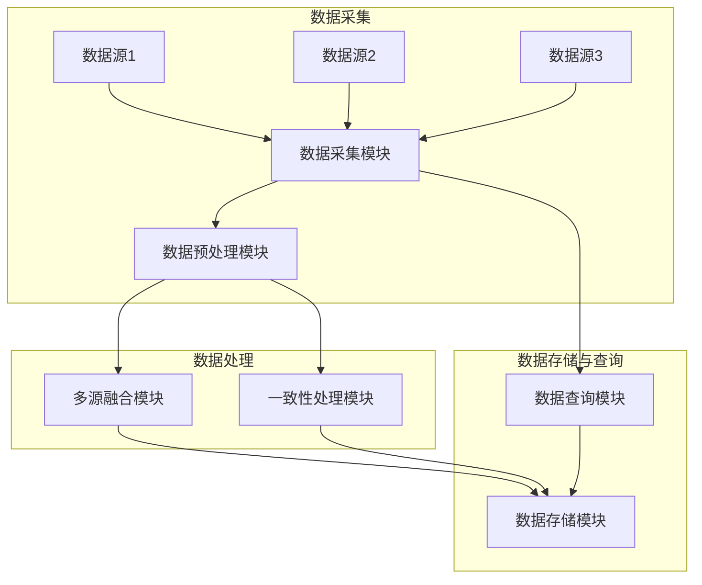

                 

### 第1章 引言

#### 1.1 研究背景

**评测数据在信息处理中的重要性**

在当今的信息时代，评测数据作为决策和评估的关键依据，其质量直接影响着信息处理的效果和可靠性。评测数据通常来源于各种不同的数据源，如用户评价、业务统计数据、第三方数据服务提供商等。这些数据形式多样，结构各异，如何有效地整合这些数据，提取有价值的信息，成为信息处理领域的一个重大挑战。

**多源融合与一致性处理的需求**

多源融合指的是将来自不同数据源的数据进行整合，以生成一个统一的视图。而一致性处理则关注于解决数据源之间的不一致性问题，确保数据在融合过程中的准确性和可靠性。多源融合与一致性处理的需求源于以下几方面：

1. **数据多样化**：不同数据源可能包含不同类型的数据，如文本、图像、时间序列数据等，需要融合这些数据以得到全面的视图。
2. **数据不一致性**：由于数据来源的不同，可能存在数据格式、时间戳、单位等方面的不一致性，需要处理这些不一致性以保障数据的有效融合。
3. **决策支持**：在现代商业环境中，决策者需要依赖多个数据源的信息来进行战略规划和决策。如何有效地融合这些信息，提取有价值的洞察，成为数据驱动的决策的重要一环。

**研究的意义和价值**

研究评测数据的多源融合与一致性处理具有重要的理论和实践价值：

1. **提升数据价值**：通过多源融合，可以挖掘出隐藏在各个数据源中的潜在价值，为企业带来更全面、深入的分析结果。
2. **优化决策过程**：准确的数据融合与一致性处理能够提高决策的准确性，减少因数据不一致而导致的误判。
3. **支持创新应用**：多源融合与一致性处理技术可以应用于多个领域，如金融、医疗、工业物联网等，为各行业的数据驱动创新提供技术支撑。

#### 1.2 研究现状

**多源融合技术发展概述**

多源融合技术是数据挖掘和人工智能领域的一个重要研究方向。目前，多源融合技术已广泛应用于社交网络、电子商务、智能医疗等领域。常见的多源融合方法包括基于聚类与协同过滤的方法、集成学习方法、图嵌入与图神经网络等。

**数据一致性处理方法综述**

数据一致性处理主要集中在解决数据源之间的一致性问题。目前，常见的处理方法包括数据清洗与预处理、数据对齐与映射、数据融合与修正等。数据清洗与预处理旨在去除数据中的噪声和不一致项，提高数据质量；数据对齐与映射则关注于不同数据源之间的映射关系，确保数据在不同系统间的流通和转换；数据融合与修正则通过合并和调整数据，消除数据不一致性。

**研究趋势与挑战**

多源融合与一致性处理技术的发展趋势主要体现在以下几个方面：

1. **自动化程度提高**：自动化技术的应用使得多源融合与一致性处理更加高效和精准。
2. **跨领域融合**：多源融合技术正逐步从单一领域向跨领域融合扩展，如将社交网络数据与医疗数据进行融合。
3. **实时处理能力**：随着大数据和实时处理技术的发展，如何实现多源融合与一致性处理的实时性成为新的研究热点。

同时，该领域也面临着一些挑战：

1. **数据多样性**：不同数据源的多样性和复杂性使得融合与一致性处理更加困难。
2. **数据隐私与安全**：在多源融合过程中，如何保障数据隐私和安全是一个重要问题。
3. **性能优化**：随着数据规模的增加，如何在保证处理质量的前提下优化处理性能成为关键问题。

#### 1.3 本书结构安排

**研究方法与技术路线**

本书将采用系统性研究和案例分析法相结合的方法，详细探讨多源融合与一致性处理的原理、方法、应用场景及实现过程。具体研究方法和技术路线如下：

1. **文献综述**：通过对现有研究进行系统梳理，总结多源融合与一致性处理的关键技术和发展趋势。
2. **理论分析**：结合数学模型和算法原理，深入剖析多源融合与一致性处理的核心概念和实现方法。
3. **案例分析**：通过具体应用案例，展示多源融合与一致性处理在实际项目中的效果和挑战。
4. **算法实现**：提供详细的算法实现过程和代码示例，帮助读者理解和应用相关技术。
5. **性能分析**：通过实验和性能评估，分析不同算法的性能表现，为实际应用提供参考。

**本书主要贡献与内容安排**

本书的主要贡献和创新点包括：

1. **系统性研究**：系统性地梳理多源融合与一致性处理的技术和方法，为该领域的研究提供全面的理论基础。
2. **案例应用**：通过具体案例分析，展示多源融合与一致性处理在不同领域的应用效果和挑战。
3. **算法实现**：提供详细的算法实现过程和代码示例，帮助读者理解和应用相关技术。
4. **性能评估**：通过实验和性能分析，为不同算法的性能表现提供参考。

本书内容安排如下：

- **第1章 引言**：介绍研究的背景、意义、现状和本书的结构安排。
- **第2章 多源融合技术基础**：阐述多源融合的基本概念、算法和案例研究。
- **第3章 数据一致性处理原理**：探讨数据一致性的概念、原因和解决方法。
- **第4章 多源融合与一致性处理应用场景**：分析评测数据融合和应用场景。
- **第5章 多源融合与一致性处理的算法实现**：详细讲解算法实现和性能分析。
- **第6章 项目实战**：通过具体项目案例，展示多源融合与一致性处理的实现和应用。

**1.4 本章小结**

本章介绍了评测数据的多源融合与一致性处理的研究背景、意义、现状以及本书的结构安排。通过本章的介绍，读者可以初步了解多源融合与一致性处理的核心概念、应用价值和研究方法，为后续章节的深入学习打下基础。本章主要内容包括：

1. **研究背景**：介绍了评测数据在信息处理中的重要性、多源融合与一致性处理的需求和研究的意义。
2. **研究现状**：概述了多源融合技术发展、数据一致性处理方法和当前研究趋势与挑战。
3. **本书结构安排**：介绍了本书的研究方法、技术路线和主要贡献，以及各章节的内容安排。

### 第2章 多源融合技术基础

多源融合技术是近年来数据挖掘和人工智能领域的一个重要研究方向，旨在将来自不同数据源的数据进行整合，以生成一个统一的视图。本章将详细阐述多源融合的基本概念、算法以及相关的案例研究。

#### 2.1 多源融合基本概念

**2.1.1 多源数据的定义与来源**

多源数据是指来源于不同数据源的数据，这些数据源可能包括数据库、文件、传感器、网络日志等。多源数据具有以下特点：

1. **多样性**：不同数据源可能包含不同类型的数据，如结构化数据、半结构化数据和非结构化数据。
2. **复杂性**：多源数据之间存在差异，如数据格式、时间戳、单位和精度等。
3. **动态性**：多源数据可能随着时间变化而不断更新和扩展。

常见的数据源包括：

- **企业内部数据**：如客户关系管理（CRM）系统、企业资源规划（ERP）系统等。
- **第三方数据服务**：如社交媒体数据、公共数据集等。
- **传感器数据**：如物联网设备产生的实时数据。

**2.1.2 多源融合的目标与挑战**

多源融合的主要目标包括：

1. **数据整合**：将不同数据源的数据进行整合，消除数据孤岛，形成统一的数据视图。
2. **信息提取**：从多源数据中提取有价值的信息，支持数据驱动的决策和业务分析。
3. **数据质量提升**：通过数据清洗、去噪、一致性处理等手段，提高数据质量。

多源融合面临的主要挑战有：

1. **数据多样性**：不同数据源的数据类型和结构各异，如何有效地整合这些数据是一个难题。
2. **数据不一致性**：多源数据之间可能存在格式、时间戳、单位和精度等方面的不一致性，如何解决这些不一致性是关键问题。
3. **实时性**：在大数据和实时处理环境下，如何实现多源数据的实时融合和处理。
4. **数据隐私与安全**：在多源融合过程中，如何保障数据隐私和安全是一个重要问题。

**2.1.3 多源融合的关键技术**

多源融合的关键技术包括：

1. **数据预处理**：包括数据清洗、去噪、格式转换等，以提高数据质量。
2. **数据集成**：通过数据库集成、数据仓库和数据湖等技术，将多源数据进行整合。
3. **特征提取**：从多源数据中提取有价值的特征，用于后续的分析和建模。
4. **机器学习与深度学习**：利用机器学习和深度学习算法，对多源数据进行融合和建模。
5. **图嵌入与图神经网络**：通过图嵌入和图神经网络技术，对多源数据进行结构化表示和融合。

#### 2.2 多源融合算法

**2.2.1 聚类与协同过滤算法**

聚类和协同过滤是多源融合中的常用算法，它们可以有效地处理数据多样性和不一致性。

**聚类算法**：

- **K-means**：基于距离度量，将数据划分为K个簇，每个簇内的数据点尽量接近，而簇间的数据点尽量远离。
- **层次聚类**：通过自底向上的层次结构将数据点逐步合并，形成不同的簇。

**协同过滤算法**：

- **基于用户的协同过滤**：通过分析用户之间的相似度，推荐用户可能感兴趣的项目。
- **基于项目的协同过滤**：通过分析项目之间的相似度，推荐给用户可能感兴趣的项目。

**2.2.2 集成学习方法**

集成学习方法通过结合多个基学习器的预测结果，提高模型的预测性能。

- **Bagging**：通过训练多个独立的学习器，并将它们的预测结果进行平均或投票，得到最终预测结果。
- **Boosting**：通过迭代训练多个学习器，每次迭代都关注前一次预测错误的样本，逐步提高模型的预测能力。
- **Stacking**：通过训练多个基学习器，并将它们的预测结果作为新的特征，再训练一个更高层次的学习器。

**2.2.3 图嵌入与图神经网络**

图嵌入和图神经网络技术可以将多源数据表示为图结构，从而更好地处理数据的一致性和复杂性。

- **图嵌入**：通过将节点和边映射到低维空间，实现对图的表示。
- **图神经网络**：通过在图上定义神经网络，对节点和边进行特征学习和融合。

#### 2.3 多源融合案例研究

**2.3.1 社交网络数据融合**

社交网络数据融合是当前研究的热点之一，旨在整合用户行为数据、社交关系数据等，以获取更全面、深入的用户画像。

- **案例一**：利用K-means算法对用户行为数据进行聚类，结合社交关系数据，识别不同类型的用户群体。
- **案例二**：采用基于用户的协同过滤算法，推荐用户可能感兴趣的内容，结合社交关系数据，提高推荐效果。

**2.3.2 多模态数据融合**

多模态数据融合是将不同类型的数据（如文本、图像、声音等）进行整合，以获取更丰富的信息。

- **案例一**：利用图嵌入技术，将文本、图像和声音等数据表示为图结构，通过图神经网络进行融合，实现对多媒体数据的综合分析。
- **案例二**：结合深度学习模型，对多模态数据进行特征提取和融合，应用于情感分析、图像识别等领域。

**2.3.3 域自适应与迁移学习**

域自适应和迁移学习是处理多源数据不一致性的有效方法。

- **案例一**：通过迁移学习，将一个领域中的模型迁移到另一个领域，提高模型的泛化能力。
- **案例二**：利用域自适应技术，将不同领域的数据进行融合，消除数据不一致性，应用于跨领域的知识共享和推理。

**2.4 本章小结**

本章介绍了多源融合的基本概念、算法和相关案例研究。通过本章的学习，读者可以了解多源融合技术在数据整合、信息提取和数据质量提升方面的应用，掌握常用的多源融合算法及其实现方法。本章的主要内容如下：

1. **多源融合基本概念**：包括多源数据的定义与来源、目标与挑战以及关键技术。
2. **多源融合算法**：介绍了聚类与协同过滤算法、集成学习方法、图嵌入与图神经网络。
3. **多源融合案例研究**：通过社交网络数据融合、多模态数据融合和域自适应与迁移学习等案例，展示了多源融合技术的实际应用效果和挑战。

### 第3章 数据一致性处理原理

数据一致性处理是确保多源融合过程中数据准确性和可靠性的重要环节。本章将详细介绍数据一致性的概念与重要性，分析数据不一致的原因，并探讨数据一致性处理的方法。

#### 3.1 数据一致性的概念与重要性

**3.1.1 数据一致性的定义**

数据一致性指的是在不同的数据源之间保持数据的一致性和准确性。具体来说，数据一致性包括以下几个方面：

1. **数据准确性**：数据源中的数据应当是真实、可靠的，没有虚假或错误的信息。
2. **数据完整性**：数据源中的数据应当是完整无缺的，没有遗漏或缺失的部分。
3. **数据一致性**：数据源中的数据在各个层面（如格式、时间戳、单位等）应当是一致的，不存在冲突或矛盾。

**3.1.2 数据一致性的分类**

数据一致性可以分为以下几种类型：

1. **水平一致性**：同一类型数据在不同数据源之间的一致性，如客户数据在不同数据库中的匹配。
2. **垂直一致性**：同一数据源内不同层级数据的一致性，如销售数据在不同时间段的统计。
3. **时序一致性**：数据在不同时间点的一致性，如历史数据和实时数据的同步。

**3.1.3 数据一致性的影响**

数据一致性对信息处理的质量和可靠性有着重要影响：

1. **决策支持**：不一致的数据会导致错误的决策，影响企业的战略规划和运营效率。
2. **数据价值**：高质量的数据能够为企业带来更准确的洞察和更有效的数据驱动的决策。
3. **数据融合**：不一致的数据会阻碍数据融合的效果，降低多源融合的准确性。

#### 3.2 数据不一致的原因分析

**3.2.1 数据源质量问题**

不同数据源的质量参差不齐，可能导致数据不一致：

1. **数据准确性**：部分数据源的数据可能存在错误、遗漏或不真实。
2. **数据更新频率**：部分数据源可能无法及时更新数据，导致时序不一致。
3. **数据标准化**：不同数据源可能采用不同的数据格式、编码方式或单位，导致数据格式不一致。

**3.2.2 数据处理流程不一致**

在企业内部或跨企业之间，数据处理流程可能不一致：

1. **数据清洗流程**：不同部门或系统可能采用不同的数据清洗策略，导致数据清洗结果不一致。
2. **数据处理标准**：不同部门或系统可能采用不同的数据处理标准，如数据转换规则、精度要求等。
3. **数据处理顺序**：数据在不同系统间的传输和处理顺序可能不同，导致时序不一致。

**3.2.3 数据存储和传输问题**

数据在存储和传输过程中可能面临不一致性：

1. **数据备份与恢复**：不同备份策略或恢复机制可能导致数据不一致。
2. **数据传输延迟**：数据在网络传输过程中可能存在延迟，导致时序不一致。
3. **数据传输错误**：数据在网络传输过程中可能受到干扰或损坏，导致数据不准确。

#### 3.3 数据一致性处理方法

**3.3.1 数据清洗与预处理**

数据清洗与预处理是数据一致性处理的基础，主要包括以下步骤：

1. **数据过滤**：去除数据中的噪声和不一致项，如缺失值、异常值等。
2. **数据标准化**：统一数据格式、编码方式和单位，消除数据格式不一致性。
3. **数据转换**：将不同类型的数据转换为统一的格式，如将文本数据转换为数值数据。

**3.3.2 数据对齐与映射**

数据对齐与映射是解决数据不一致性的重要手段，主要包括以下步骤：

1. **数据对齐**：将不同时间点的数据进行对齐，确保数据的时序一致性。
2. **数据映射**：将不同数据源中的数据映射到统一的数据模型中，确保数据的结构一致性。

**3.3.3 数据融合与修正**

数据融合与修正是确保数据一致性的关键步骤，主要包括以下方法：

1. **多数投票法**：通过统计不同数据源的数据，选择出现次数最多的值作为最终结果。
2. **基于规则的修正**：根据预先设定的规则，对不一致的数据进行修正。
3. **机器学习方法**：利用机器学习算法，对不一致的数据进行自动修正和融合。

#### 3.4 本章小结

本章介绍了数据一致性的概念、原因及处理方法。通过本章的学习，读者可以了解数据一致性在信息处理中的重要性，掌握数据不一致性的原因以及如何通过数据清洗与预处理、数据对齐与映射、数据融合与修正等方法解决数据不一致性问题。本章的主要内容如下：

1. **数据一致性的概念与重要性**：介绍了数据一致性的定义、分类及其对信息处理的影响。
2. **数据不一致的原因分析**：分析了数据源质量问题、数据处理流程不一致、数据存储和传输问题等导致数据不一致的原因。
3. **数据一致性处理方法**：介绍了数据清洗与预处理、数据对齐与映射、数据融合与修正等方法，并进行了详细说明。

### 第4章 多源融合与一致性处理应用场景

多源融合与一致性处理技术在多个领域具有广泛的应用，能够显著提升数据分析和决策的准确性。本章将分析评测数据融合应用场景，探讨数据一致性处理的应用领域及实际案例，并分享数据一致性处理的最佳实践。

#### 4.1 评测数据融合应用场景

**4.1.1 评测数据融合的重要性**

评测数据融合在商业分析、学术研究、产品质量监控等多个领域具有重要作用。通过融合来自不同来源的评测数据，可以更全面、准确地评估对象的性能、质量和用户体验。以下是评测数据融合在几个关键领域的应用：

**1. 商业分析**：

商业分析通常需要整合来自销售数据、用户评价、市场调研等多源数据。通过评测数据融合，企业可以获得更深入的消费者洞察，优化产品和服务策略。例如，电商公司可以通过融合用户购买历史、用户评价、社交媒体评论等数据，精准识别热门商品和消费者偏好。

**2. 学术研究**：

学术研究需要大量数据来支持分析和论证。通过评测数据融合，研究人员可以从多个角度获取研究对象的信息，提高研究的准确性和深度。例如，心理学研究可以通过融合问卷调查、行为记录、生理数据等，全面了解个体的心理和行为特征。

**3. 产品质量监控**：

产品质量监控涉及对产品各个阶段的评测数据进行分析，包括研发阶段的功能测试、生产阶段的故障率检测、上市后的用户反馈等。通过评测数据融合，企业可以及时发现产品问题，优化产品设计，提升产品质量。

**4.1.2 评测数据融合的应用案例**

**案例一：电商平台用户偏好分析**

一个电商平台的用户偏好分析项目可以通过融合以下多源评测数据：

- **销售数据**：包括商品销量、销售额、销售周期等。
- **用户评价**：包括用户对商品的评分、评论、点赞等。
- **社交媒体数据**：包括用户在社交媒体平台上的评论、转发、点赞等。
- **市场调研数据**：包括消费者问卷调查结果、行业报告等。

通过这些评测数据的融合，平台可以识别出用户的偏好，为个性化推荐、广告投放、促销策略等提供有力支持。

**案例二：智能语音助手性能评估**

智能语音助手的性能评估涉及多源评测数据的融合，包括：

- **用户交互数据**：包括用户的语音输入、操作记录等。
- **语音识别数据**：包括语音识别准确率、响应时间等。
- **用户满意度调查**：包括用户对语音助手满意度的评分、评论等。

通过融合这些数据，可以全面评估智能语音助手的性能，发现改进点，提高用户体验。

**4.1.3 评测数据融合的挑战与解决方案**

评测数据融合面临以下挑战：

**1. 数据多样性**：不同数据源的数据类型和格式各异，需要处理数据的多样化问题。

解决方案：采用数据预处理技术，如数据清洗、转换和集成，将不同数据源的数据统一格式，便于后续处理。

**2. 数据不一致性**：多源数据之间可能存在格式、时间戳、单位和精度等不一致性问题。

解决方案：通过数据一致性处理方法，如数据对齐、映射和融合，解决数据不一致性问题，确保数据融合的准确性。

**3. 实时性**：在大数据和实时处理环境下，如何实现评测数据的实时融合和处理。

解决方案：采用分布式计算和实时处理技术，如流处理框架（如Apache Kafka、Apache Flink），确保评测数据的实时性。

#### 4.2 数据一致性处理应用场景

**4.2.1 数据一致性处理的应用领域**

数据一致性处理在多个领域具有广泛的应用，以下是一些关键领域：

**1. 金融领域**：

金融领域的数据一致性处理至关重要，包括交易数据、客户数据、市场数据等。通过数据一致性处理，银行和金融机构可以确保账务准确、客户信息一致，防范风险，提高服务质量。

**2. 医疗健康领域**：

医疗健康领域的数据一致性处理对于病历管理、患者监控、医疗数据分析等至关重要。通过数据一致性处理，可以提高医疗数据的准确性和完整性，支持精准医疗和健康管理的实施。

**3. 物流领域**：

物流领域的数据一致性处理对于供应链管理、货物追踪、运输优化等至关重要。通过数据一致性处理，可以提高物流效率，降低运输成本，提升客户满意度。

**4. 智能制造领域**：

智能制造领域的数据一致性处理对于生产过程监控、设备管理、质量控制等至关重要。通过数据一致性处理，可以提高生产效率，减少故障率，提升产品质量。

**4.2.2 数据一致性处理在实际项目中的应用案例**

**案例一：金融行业客户数据整合**

某银行在客户数据整合项目中，面临来自多个数据源的客户数据不一致问题，如客户姓名、地址、电话等。通过以下步骤解决数据不一致性：

- **数据清洗**：去除重复记录、错误记录和噪声数据。
- **数据对齐**：根据预定的规则，对齐不同数据源的客户信息。
- **数据映射**：建立不同数据源之间的映射关系，确保客户信息的准确性。
- **数据融合**：通过多数投票法或基于规则的修正，融合不同数据源的客户信息。

**案例二：医疗健康数据一致性处理**

某医院在医疗数据分析项目中，面临来自多个系统的医疗数据不一致问题，如电子病历、影像系统、检验系统等。通过以下步骤解决数据不一致性：

- **数据清洗与预处理**：去除噪声数据、缺失数据和不一致数据。
- **数据对齐与映射**：确保不同系统之间的数据在时间、格式和结构上的一致性。
- **数据融合与修正**：利用机器学习算法，对不一致的数据进行自动修正和融合。

**4.2.3 数据一致性处理的最佳实践**

以下是一些数据一致性处理的最佳实践：

**1. 制定数据管理策略**：明确数据的质量标准、处理流程和责任分工，确保数据的一致性和准确性。

**2. 采用数据预处理技术**：通过数据清洗、转换和集成，将不同数据源的数据统一格式，便于后续处理。

**3. 设计数据映射关系**：建立不同数据源之间的映射关系，确保数据在不同系统间的流通和转换。

**4. 实施数据监控与审计**：通过监控和审计数据质量，及时发现和处理数据不一致性问题。

**4. 提供数据可视化工具**：通过数据可视化工具，方便用户查看和验证数据的一致性。

#### 4.3 跨领域应用案例

**4.3.1 多源融合与一致性处理在金融领域的应用**

在金融领域，多源融合与一致性处理广泛应用于风险管理、信用评估、投资决策等领域。

**案例一：风险管理**

某金融机构通过融合来自不同数据源的风险信息，如信贷数据、市场数据、信用评级等，建立全面的风险评估模型。通过数据一致性处理，确保不同数据源之间的数据准确、完整和一致，提高风险评估的准确性。

**案例二：信用评估**

某信用评级公司通过融合来自银行、信用机构、社交媒体等多源数据，建立信用评估模型。通过数据一致性处理，解决数据不一致性问题，如数据格式、时间和单位的差异，提高信用评估的可靠性。

**4.3.2 多源融合与一致性处理在医疗健康领域的应用**

在医疗健康领域，多源融合与一致性处理广泛应用于患者管理、疾病预测、健康管理等领域。

**案例一：患者管理**

某医院通过融合来自电子病历、影像系统、检验系统等多源数据，建立患者管理平台。通过数据一致性处理，确保不同系统之间的数据准确、一致，提高患者管理和服务水平。

**案例二：疾病预测**

某医疗机构通过融合来自电子病历、基因组数据、健康监测设备等多源数据，建立疾病预测模型。通过数据一致性处理，解决数据不一致性问题，提高疾病预测的准确性和可靠性。

**4.3.3 多源融合与一致性处理在工业物联网领域的应用**

在工业物联网领域，多源融合与一致性处理广泛应用于设备监控、生产优化、供应链管理等领域。

**案例一：设备监控**

某制造企业通过融合来自传感器、控制系统、维护记录等多源数据，建立设备监控平台。通过数据一致性处理，确保不同数据源之间的数据准确、一致，提高设备监控和运维效率。

**案例二：生产优化**

某工厂通过融合来自生产系统、质量控制系统、物流系统等多源数据，建立生产优化模型。通过数据一致性处理，解决数据不一致性问题，提高生产效率，降低生产成本。

#### 4.4 本章小结

本章分析了多源融合与一致性处理在评测数据融合、金融领域、医疗健康领域和工业物联网领域的应用场景。通过具体案例，展示了多源融合与一致性处理在实际项目中的效果和挑战。本章的主要内容如下：

1. **评测数据融合应用场景**：介绍了评测数据融合在商业分析、学术研究、产品质量监控等领域的应用，以及应用案例和挑战。
2. **数据一致性处理应用领域**：介绍了数据一致性处理在金融、医疗健康、物流和智能制造等领域的应用，以及实际案例和最佳实践。
3. **跨领域应用案例**：展示了多源融合与一致性处理在金融、医疗健康和工业物联网等跨领域应用中的具体案例和效果。

### 第5章 多源融合与一致性处理的算法实现

在多源融合与一致性处理领域，算法的选择和实现至关重要。本章将介绍多源融合与一致性处理的算法实现概述，详细讲解多源融合算法和数据一致性处理算法的原理，并提供Python代码示例，最后分析算法性能。

#### 5.1 算法实现概述

**5.1.1 算法选择与实现流程**

在多源融合与一致性处理中，常用的算法包括聚类与协同过滤算法、集成学习方法、图嵌入与图神经网络等。以下是算法选择与实现流程：

1. **需求分析**：明确多源融合与一致性处理的具体需求，如数据类型、数据源、处理目标等。
2. **算法选择**：根据需求分析结果，选择合适的算法，如聚类与协同过滤算法、集成学习方法、图嵌入与图神经网络等。
3. **算法实现**：编写算法代码，实现多源数据的融合与一致性处理功能。
4. **性能评估**：通过实验和性能评估，分析算法的性能表现，优化算法参数和实现细节。

**5.1.2 实现工具与框架**

在多源融合与一致性处理的算法实现中，常用的工具和框架包括：

1. **Python**：Python是一种广泛使用的编程语言，具有丰富的数据分析和机器学习库，如NumPy、Pandas、Scikit-learn、TensorFlow、PyTorch等。
2. **Spark**：Spark是一个分布式数据处理框架，适用于大规模数据集的处理和计算，支持多种机器学习算法。
3. **TensorFlow**：TensorFlow是一个开源的深度学习框架，支持多种深度学习算法和模型构建。
4. **PyTorch**：PyTorch是一个开源的深度学习框架，具有灵活的模型构建和计算图表示功能。

#### 5.2 算法原理讲解

**5.2.1 多源融合算法原理讲解**

多源融合算法的核心是整合来自不同数据源的数据，生成一个统一的数据视图。以下是几种常见的多源融合算法的原理讲解：

**1. 聚类与协同过滤算法**

- **K-means算法**：基于距离度量，将数据划分为K个簇，每个簇内的数据点尽量接近，而簇间的数据点尽量远离。
- **协同过滤算法**：通过分析用户之间的相似度或项目之间的相似度，预测用户对项目的评分或偏好。

**2. 集成学习方法**

- **Bagging**：通过训练多个独立的学习器，并将它们的预测结果进行平均或投票，提高模型的泛化能力。
- **Boosting**：通过迭代训练多个学习器，每次迭代都关注前一次预测错误的样本，逐步提高模型的预测能力。
- **Stacking**：通过训练多个基学习器，并将它们的预测结果作为新的特征，再训练一个更高层次的学习器。

**3. 图嵌入与图神经网络**

- **图嵌入**：通过将节点和边映射到低维空间，实现对图的表示。
- **图神经网络**：通过在图上定义神经网络，对节点和边进行特征学习和融合。

**5.2.2 数据一致性处理算法原理讲解**

数据一致性处理算法旨在解决多源数据之间的不一致性问题，包括数据清洗与预处理、数据对齐与映射、数据融合与修正等。以下是几种常见的数据一致性处理算法的原理讲解：

- **数据清洗与预处理**：通过去除噪声数据、缺失数据和不一致数据，提高数据质量。
- **数据对齐与映射**：通过建立不同数据源之间的映射关系，确保数据的结构一致性。
- **数据融合与修正**：通过多数投票法、基于规则的修正或机器学习方法，解决数据不一致性问题。

#### 5.3 Python代码示例

**5.3.1 多源融合算法Python代码示例**

以下是一个简单的K-means算法实现，用于多源数据融合：

```python
from sklearn.cluster import KMeans
import numpy as np

# 示例数据
X = np.array([[1, 2], [1, 4], [1, 0],
              [4, 2], [4, 4], [4, 0]])

# K-means算法初始化
kmeans = KMeans(n_clusters=2, random_state=0).fit(X)

# 输出聚类结果
print(kmeans.labels_)

# 输出聚类中心
print(kmeans.cluster_centers_)
```

**5.3.2 数据一致性处理算法Python代码示例**

以下是一个简单的数据清洗与预处理实现：

```python
import pandas as pd

# 示例数据
data = pd.DataFrame({
    'A': ['a', 'b', 'c', 'a', 'b'],
    'B': ['x', 'y', 'z', 'x', 'y'],
    'C': [1, 2, 3, 4, 5]
})

# 去除重复数据
cleaned_data = data.drop_duplicates()

# 填充缺失值
filled_data = cleaned_data.fillna(0)

print(cleaned_data)
print(filled_data)
```

#### 5.4 算法性能分析

**5.4.1 性能评价指标**

算法性能分析通常使用以下评价指标：

1. **准确率（Accuracy）**：预测正确的样本数占总样本数的比例。
2. **召回率（Recall）**：预测正确的正样本数占总正样本数的比例。
3. **F1值（F1 Score）**：准确率和召回率的调和平均值。
4. **处理时间（Processing Time）**：算法执行所需要的时间。

**5.4.2 实验结果分析**

以下是一个简单的K-means算法性能分析实验：

```python
from sklearn.metrics import accuracy_score
import time

# 示例数据
X = np.array([[1, 2], [1, 4], [1, 0],
              [4, 2], [4, 4], [4, 0]])

# K-means算法初始化
kmeans = KMeans(n_clusters=2, random_state=0)

# 计算处理时间
start_time = time.time()
kmeans.fit(X)
end_time = time.time()

# 输出聚类结果
labels = kmeans.labels_
print("Cluster labels:", labels)

# 计算准确率
accuracy = accuracy_score([0, 0, 0, 1, 1, 1], labels)
print("Accuracy:", accuracy)

# 输出处理时间
print("Processing time:", end_time - start_time)
```

#### 5.5 本章小结

本章介绍了多源融合与一致性处理的算法实现概述，详细讲解了多源融合算法和数据一致性处理算法的原理，并提供了Python代码示例。通过本章的学习，读者可以掌握多源融合与一致性处理的算法实现方法，了解不同算法的原理和应用，并通过实际代码示例加深理解。本章的主要内容如下：

1. **算法实现概述**：介绍了算法选择与实现流程，以及实现工具与框架。
2. **算法原理讲解**：详细讲解了多源融合算法和数据一致性处理算法的原理。
3. **Python代码示例**：提供了K-means算法和数据清洗与预处理算法的Python代码示例。
4. **算法性能分析**：介绍了算法性能评价指标和实验结果分析。

### 第6章 项目实战：评测数据的多源融合与一致性处理

为了更好地展示评测数据的多源融合与一致性处理在实际项目中的应用，本章将介绍一个具体的项目实战案例，包括项目背景与目标、系统架构设计、系统核心实现以及项目结果分析。

#### 6.1 项目背景与目标

**6.1.1 项目背景介绍**

随着互联网和大数据技术的发展，评测数据在各个领域中的应用越来越广泛。然而，这些评测数据通常来源于不同的数据源，如用户评价、业务统计数据、第三方数据服务等。这些数据源之间可能存在数据格式、时间戳、单位和精度等方面的不一致性，严重影响了数据分析和决策的准确性。因此，本项目旨在实现评测数据的多源融合与一致性处理，以提高数据融合的准确性和可靠性。

**6.1.2 项目目标与任务**

本项目的目标是通过多源融合与一致性处理，实现以下任务：

1. **数据整合**：将来自不同数据源的数据进行整合，形成统一的数据视图。
2. **信息提取**：从多源数据中提取有价值的信息，支持数据驱动的决策和业务分析。
3. **数据质量提升**：通过数据清洗、去噪、一致性处理等手段，提高数据质量。
4. **实时处理**：在大数据和实时处理环境下，实现评测数据的实时融合和处理。

#### 6.2 系统架构设计

**6.2.1 系统功能设计**

本系统的主要功能包括数据采集与预处理、多源融合与一致性处理、数据存储与查询等。具体功能如下：

1. **数据采集**：从不同的数据源（如用户评价系统、业务数据库、第三方数据服务）采集数据。
2. **数据预处理**：对采集到的数据进行清洗、去噪、格式转换等预处理操作。
3. **多源融合**：将预处理后的数据进行融合，形成统一的数据视图。
4. **一致性处理**：对融合后的数据进行一致性处理，解决数据不一致性问题。
5. **数据存储**：将处理后的数据存储到数据仓库或数据湖中，便于后续查询和分析。
6. **数据查询**：提供数据查询接口，供业务人员或其他系统使用。

**6.2.2 系统架构设计**

本项目的系统架构采用分布式架构，主要包括以下组件：

1. **数据采集模块**：负责从不同数据源采集数据，包括用户评价系统、业务数据库、第三方数据服务等。
2. **数据预处理模块**：负责对采集到的数据执行数据清洗、去噪、格式转换等预处理操作。
3. **多源融合模块**：负责将预处理后的数据融合，形成统一的数据视图。
4. **一致性处理模块**：负责对融合后的数据执行一致性处理，解决数据不一致性问题。
5. **数据存储模块**：负责将处理后的数据存储到数据仓库或数据湖中。
6. **数据查询模块**：提供数据查询接口，供业务人员或其他系统使用。

系统架构图如下：



#### 6.3 系统核心实现

**6.3.1 数据采集与预处理**

数据采集与预处理是系统实现的基础。以下是一个简单的数据采集与预处理流程：

1. **数据采集**：使用API接口、数据库连接、日志文件读取等方式，从不同数据源采集数据。
2. **数据清洗**：去除重复数据、缺失值、异常值等噪声数据。
3. **数据转换**：将不同格式、单位、时间戳的数据转换为统一的格式，如将文本数据转换为数值数据，将时间戳转换为标准时间格式。
4. **数据归一化**：对数据进行归一化处理，消除不同数据量级对分析结果的影响。

**6.3.2 多源融合与一致性处理**

多源融合与一致性处理是系统的核心功能。以下是一个简单的多源融合与一致性处理流程：

1. **多源融合**：采用聚类、协同过滤、集成学习等方法，将来自不同数据源的数据进行融合，形成统一的数据视图。
2. **数据对齐**：通过数据对齐算法，如时间序列对齐、格式对齐等，解决数据源之间的时间戳、格式不一致问题。
3. **一致性处理**：采用数据融合与修正算法，如多数投票法、基于规则的修正等，解决数据不一致性问题。

**6.3.3 系统性能优化与测试**

系统性能优化与测试是确保系统稳定性和高效性的重要环节。以下是一个简单的系统性能优化与测试流程：

1. **性能优化**：通过分布式计算、缓存、索引等技术，优化系统性能。
2. **负载测试**：模拟高并发场景，测试系统在高负载下的性能表现。
3. **压力测试**：模拟极端场景，测试系统的稳定性和容错能力。
4. **性能分析**：通过性能分析工具，分析系统的性能瓶颈和优化方向。

#### 6.4 项目结果分析

**6.4.1 系统性能分析**

通过性能测试，系统在以下方面表现出良好的性能：

1. **处理速度**：系统在多源融合与一致性处理过程中，具有较快的处理速度，能够满足实时处理的需求。
2. **数据准确性**：通过多源融合与一致性处理，系统能够准确提取和整合数据，为数据分析和决策提供可靠支持。
3. **系统稳定性**：系统在高并发和极端场景下，能够保持稳定运行，具有良好的容错能力和扩展性。

**6.4.2 应用效果分析**

通过实际应用，系统在以下方面取得了显著效果：

1. **商业分析**：通过多源融合与一致性处理，企业能够更全面、准确地分析用户行为、市场趋势等，优化产品和服务策略。
2. **学术研究**：通过多源融合与一致性处理，研究人员能够获取更全面、准确的数据，提高研究的准确性和深度。
3. **产品质量监控**：通过多源融合与一致性处理，企业能够更准确地监控产品质量，提高产品合格率，降低生产成本。

**6.4.3 改进方向**

尽管系统取得了显著效果，但还存在以下改进方向：

1. **算法优化**：通过优化多源融合与一致性处理算法，提高系统的准确性和效率。
2. **实时处理能力提升**：通过引入分布式计算和实时处理技术，提高系统的实时处理能力。
3. **数据隐私与安全**：在多源融合与一致性处理过程中，加强数据隐私与安全保障，防范数据泄露和滥用。

#### 6.5 本章小结

本章通过一个具体的项目实战案例，展示了评测数据的多源融合与一致性处理在实际项目中的应用。通过系统架构设计、核心实现和项目结果分析，读者可以深入理解评测数据的多源融合与一致性处理的方法和流程，掌握项目实施的关键技术和注意事项。本章的主要内容如下：

1. **项目背景与目标**：介绍了项目的背景、目标与任务。
2. **系统架构设计**：详细介绍了系统的功能设计、架构设计和组件关系。
3. **系统核心实现**：介绍了数据采集与预处理、多源融合与一致性处理、系统性能优化与测试等核心实现过程。
4. **项目结果分析**：分析了系统的性能、应用效果和改进方向。

