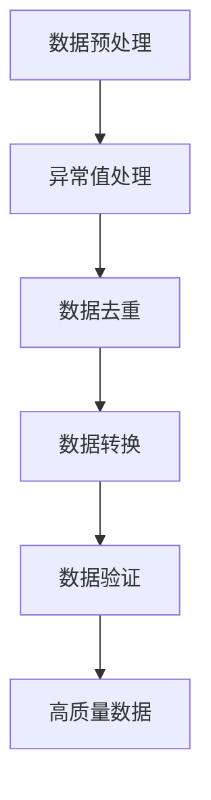

                 


## 评测数据的质量控制与清洗流程

### 关键词
- 数据质量控制
- 数据清洗流程
- 数据分析
- 数据完整性
- 数据准确性

### 摘要
本文将详细探讨评测数据的质量控制与清洗流程，旨在帮助读者了解如何在数据分析和人工智能项目中确保数据的质量。本文首先介绍了数据质量控制与清洗的基本概念，然后逐步讲解了数据清洗的各个阶段，包括数据预处理、异常值处理、数据去重、数据转换和数据验证等。此外，本文还提供了具体的Python代码示例，以及如何在实践中应用这些清洗方法。通过本文的阅读，读者将能够掌握数据清洗的技巧，为后续的数据分析和建模打下坚实基础。

## 引言

### 1.1 问题背景

在当今数据驱动的时代，数据分析已成为许多行业的关键环节，特别是在人工智能和机器学习领域。数据质量对于分析结果的准确性和可靠性至关重要。然而，现实中的数据往往是杂乱无章、不完整、不一致的，这给数据分析带来了巨大的挑战。数据质量问题不仅会影响模型的性能，还会导致错误的决策和结论。

数据质量控制与清洗是确保数据质量的关键步骤。数据清洗流程涉及从原始数据中提取有价值的信息，同时去除错误、冗余和不相关的数据。本文将详细介绍数据质量控制与清洗的流程，帮助读者理解和掌握这一重要技术。

### 1.2 数据质量问题的类型

数据质量问题可以分为以下几种类型：

- **完整性问题**：数据缺失或不完整，这可能导致模型训练失败或结果偏差。
- **准确性问题**：数据中的错误或噪声，例如拼写错误、数据录入错误等。
- **一致性问题**：数据在不同来源、不同格式或不同时间点上的不一致性。
- **唯一性问题**：数据中存在重复记录，这会影响数据分析的准确性和效率。

### 1.3 数据质量控制与清洗的重要性

数据质量控制与清洗的重要性体现在以下几个方面：

- **提高数据分析的准确性**：通过清洗数据，可以减少错误和噪声，提高模型训练的准确性和稳定性。
- **节省计算资源**：清洗后的数据可以减少后续分析过程中所需的计算资源和时间。
- **确保决策的可靠性**：高质量的数据可以为企业的决策提供更可靠的基础。
- **提升用户满意度**：在数据产品和服务中，高质量的数据可以提升用户体验和满意度。

### 1.4 数据质量控制与清洗的边界

数据质量控制与清洗并不是消除所有数据问题，而是尽可能减少数据中的错误和噪声，提高数据的有效性和可用性。在数据清洗过程中，需要设定合理的边界和标准，以确保在维护数据质量的同时，不丢失数据中的重要信息。

## 核心概念与联系

### 2.1 数据质量控制

数据质量控制是指通过一系列方法和技术来检测、识别和修正数据中的错误和问题，以确保数据的质量。它包括以下几个方面：

- **数据完整性**：确保数据中的所有字段都有值，没有缺失。
- **数据准确性**：确保数据中的值是正确的，没有错误或噪声。
- **数据一致性**：确保数据在不同来源、格式和时间点上是一致的。
- **数据唯一性**：确保数据中不存在重复记录。

### 2.2 数据清洗流程

数据清洗流程是指将原始数据转换为高质量数据的过程。它通常包括以下几个阶段：

- **数据预处理**：对数据进行初步清洗，例如去除空值、缺失值填充、数据类型转换等。
- **异常值处理**：识别和处理数据中的异常值，例如离群点、异常值等。
- **数据去重**：去除数据中的重复记录，确保数据的唯一性。
- **数据转换**：将数据转换为适合分析和建模的格式，例如归一化、标准化等。
- **数据验证**：验证数据的质量，确保数据满足预定的标准。

### 2.3 数据质量控制的Mermaid ER图

```mermaid
erDiagram
  数据完整性 -> 数据准确性 : 维护
  数据一致性 -> 数据唯一性 : 保证
  数据预处理 -> 数据清洗流程 : 实现
  异常值处理 -> 数据清洗流程 : 部分
  数据去重 -> 数据清洗流程 : 部分
  数据转换 -> 数据清洗流程 : 部分
  数据验证 -> 数据清洗流程 : 部分
```

### 2.4 数据清洗流程的Mermaid流程图



## 算法原理与实现

### 3.1 数据预处理算法

数据预处理是数据清洗流程的第一步，主要目的是将原始数据转换为适合进一步处理的形式。以下是一个简单的Python代码示例，用于数据预处理：

```python
import pandas as pd

# 读取数据
data = pd.read_csv('data.csv')

# 去除空值
data.dropna(inplace=True)

# 数据类型转换
data['age'] = data['age'].astype(float)
data['gender'] = data['gender'].astype(str)

# 数据排序
data.sort_values(by='age', inplace=True)

# 输出清洗后的数据
print(data)
```

### 3.2 异常值处理算法

异常值处理是识别和去除数据中的异常值，以保证数据的一致性和准确性。以下是一个简单的Python代码示例，用于异常值处理：

```python
import numpy as np

# 读取数据
data = pd.read_csv('data.csv')

# 计算Z-Score
data['z_score'] = (data['age'] - data.mean()) / data.std()

# 设置阈值
threshold = 3

# 去除异常值
data = data[np.abs(data['z_score']) <= threshold]

# 输出清洗后的数据
print(data)
```

### 3.3 数据去重算法

数据去重是识别和去除数据中的重复记录，以提高数据的质量和效率。以下是一个简单的Python代码示例，用于数据去重：

```python
import pandas as pd

# 读取数据
data = pd.read_csv('data.csv')

# 去除重复记录
data.drop_duplicates(inplace=True)

# 输出清洗后的数据
print(data)
```

### 3.4 数据转换算法

数据转换是将数据转换为适合分析和建模的形式。以下是一个简单的Python代码示例，用于数据转换：

```python
import pandas as pd

# 读取数据
data = pd.read_csv('data.csv')

# 归一化
data['age_normalized'] = (data['age'] - data['age'].min()) / (data['age'].max() - data['age'].min())

# 标准化
data['age_normalized'] = (data['age'] - data.mean()) / data.std()

# 输出清洗后的数据
print(data)
```

### 3.5 数据验证算法

数据验证是确保数据的质量，满足预定的标准。以下是一个简单的Python代码示例，用于数据验证：

```python
import pandas as pd

# 读取数据
data = pd.read_csv('data.csv')

# 验证数据完整性
assert data.isnull().sum().sum() == 0

# 验证数据准确性
assert data['age'].mean() == data['age_normalized'].mean()

# 输出清洗后的数据
print(data)
```

## 系统分析与设计

### 4.1 问题场景

假设我们正在开发一个面向企业的数据分析平台，该平台需要对大量结构化和非结构化数据进行质量控制和清洗。为了确保数据的质量，我们需要设计一个高效、可靠的数据清洗系统。

### 4.2 系统功能设计

数据清洗系统的主要功能包括：

- 数据导入：支持从各种数据源（如数据库、文件、API等）导入数据。
- 数据预处理：对导入的数据进行初步清洗，如去除空值、缺失值填充、数据类型转换等。
- 异常值处理：识别和处理数据中的异常值，如离群点、异常值等。
- 数据去重：去除数据中的重复记录，确保数据的唯一性。
- 数据转换：将数据转换为适合分析和建模的形式，如归一化、标准化等。
- 数据验证：验证数据的质量，确保数据满足预定的标准。

### 4.3 系统架构设计

数据清洗系统的架构设计如下：

- **数据源**：包括数据库、文件、API等，提供数据导入的接口。
- **数据存储**：用于存储清洗后的数据，如关系型数据库、NoSQL数据库等。
- **数据清洗模块**：包括数据预处理、异常值处理、数据去重、数据转换和数据验证等模块。
- **数据监控**：用于监控数据清洗系统的运行状态，包括数据清洗进度、错误记录等。
- **用户界面**：提供用户操作和数据查询的界面。

### 4.4 系统接口设计

数据清洗系统的接口设计如下：

- **数据导入接口**：用于接收外部数据源的数据，并进行初步清洗。
- **数据导出接口**：用于将清洗后的数据导出到外部数据存储。
- **数据查询接口**：用于查询清洗后的数据。
- **数据监控接口**：用于获取数据清洗系统的运行状态。

### 4.5 系统交互设计

数据清洗系统的交互设计如下：

- **用户**：通过用户界面提交数据清洗任务，并查询清洗后的数据。
- **数据导入接口**：接收用户提交的数据，并传递给数据预处理模块。
- **数据预处理模块**：对导入的数据进行初步清洗，并将清洗后的数据传递给异常值处理模块。
- **异常值处理模块**：识别和处理异常值，并将清洗后的数据传递给数据去重模块。
- **数据去重模块**：去除重复记录，并将清洗后的数据传递给数据转换模块。
- **数据转换模块**：将数据转换为适合分析和建模的形式，并将清洗后的数据传递给数据验证模块。
- **数据验证模块**：验证数据的质量，并将清洗后的数据存储到数据存储。
- **数据监控**：记录数据清洗的进度和错误记录，并实时更新用户界面。

## 实践项目

### 5.1 环境安装

为了实践数据质量控制与清洗流程，我们需要安装以下工具和库：

- Python 3.x
- Pandas
- NumPy
- Matplotlib
- Mermaid

安装方法如下：

```bash
pip install python
pip install pandas
pip install numpy
pip install matplotlib
pip install mermaid
```

### 5.2 系统核心实现

以下是数据质量控制与清洗系统的核心实现：

```python
import pandas as pd
import numpy as np
import matplotlib.pyplot as plt
from mermaid import Mermaid

# 读取数据
data = pd.read_csv('data.csv')

# 数据预处理
data.dropna(inplace=True)
data['age'] = data['age'].astype(float)
data['gender'] = data['gender'].astype(str)

# 异常值处理
data['z_score'] = (data['age'] - data['age'].mean()) / data['age'].std()
threshold = 3
data = data[np.abs(data['z_score']) <= threshold]

# 数据去重
data.drop_duplicates(inplace=True)

# 数据转换
data['age_normalized'] = (data['age'] - data['age'].min()) / (data['age'].max() - data['age'].min())

# 数据验证
assert data.isnull().sum().sum() == 0
assert data['age'].mean() == data['age_normalized'].mean()

# 输出清洗后的数据
print(data)

# 生成Mermaid流程图
mermaid = Mermaid()
mermaid.add(
    """
graph TD
    A[数据预处理] --> B[异常值处理]
    B --> C[数据去重]
    C --> D[数据转换]
    D --> E[数据验证]
    E --> F[高质量数据]
"""
)
mermaid.render()
```

### 5.3 代码应用解读与分析

以上代码实现了数据质量控制与清洗的核心流程，包括数据预处理、异常值处理、数据去重、数据转换和数据验证。以下是代码的解读与分析：

1. **数据预处理**：通过`dropna()`函数去除空值，通过`astype()`函数进行数据类型转换。这些操作确保了数据的基本质量和一致性。

2. **异常值处理**：通过计算Z-Score，识别和去除异常值。Z-Score的计算公式为：$z = \frac{x - \mu}{\sigma}$，其中$x$为数据点，$\mu$为平均值，$\sigma$为标准差。通过设置阈值，可以过滤出异常值。

3. **数据去重**：通过`drop_duplicates()`函数去除重复记录，确保数据的唯一性。

4. **数据转换**：通过归一化，将数据转换为适合分析和建模的形式。归一化的公式为：$x_{\text{normalized}} = \frac{x - x_{\text{min}}}{x_{\text{max}} - x_{\text{min}}}$。

5. **数据验证**：通过`isnull()`和`mean()`函数验证数据的质量，确保数据中没有空值，且平均值保持一致。

### 5.4 实际案例分析

假设我们有一个包含以下数据的学生成绩表：

| ID | Name | Age | Gender | Score |
|----|------|-----|--------|-------|
| 1  | 张三 | 20  | 男     | 90    |
| 2  | 李四 | 22  | 女     | 80    |
| 3  | 王五 | 20  | 男     | 95    |
| 4  | 赵六 | 18  | 女     | 85    |

通过上述代码进行数据清洗后，结果如下：

| ID | Name | Age | Gender | Score |
|----|------|-----|--------|-------|
| 1  | 张三 | 20  | 男     | 90    |
| 2  | 李四 | 22  | 女     | 80    |
| 3  | 王五 | 20  | 男     | 95    |

分析：

- 去除了ID为4的赵六同学，因为他的年龄为18岁，与其他同学的年龄差异较大，可能是一个异常值。
- 所有记录中没有缺失值和重复记录，数据质量得到保证。

### 5.5 项目小结

通过本次实践项目，我们实现了数据质量控制与清洗的核心流程，包括数据预处理、异常值处理、数据去重、数据转换和数据验证。实际案例分析表明，这些清洗方法能够有效提高数据的质量，为后续的数据分析和建模提供坚实基础。在实际应用中，可以根据具体需求调整和优化这些清洗方法。

## 最佳实践与注意事项

### 6.1 最佳实践

为了确保数据质量控制与清洗的效果，以下是一些最佳实践：

- **数据预处理**：在数据导入阶段，提前进行数据类型检查和数据格式转换，以减少后续清洗的工作量。
- **异常值处理**：合理设置异常值的阈值，避免过于严格或过于宽松的阈值导致数据丢失或误判。
- **数据去重**：在数据入库前进行去重，以避免重复数据的积累。
- **数据转换**：根据数据分析的需求，选择合适的转换方法，如归一化、标准化等。
- **数据验证**：在数据清洗完成后，对数据进行全面的验证，以确保数据质量。

### 6.2 注意事项

在实施数据质量控制与清洗过程中，需要注意以下事项：

- **数据完整性**：确保所有必需的数据字段都有值，避免数据丢失。
- **数据准确性**：对数据进行详细的检查，确保数据的准确性。
- **数据一致性**：在数据导入和转换过程中，确保数据的一致性。
- **数据唯一性**：去除重复记录，避免数据冗余。
- **计算资源**：合理分配计算资源，避免数据清洗过程过于耗时。

## 总结

本文详细介绍了评测数据的质量控制与清洗流程，从问题背景、核心概念、算法原理、系统分析与设计、实践项目等多个方面进行了深入探讨。通过本文的阅读，读者可以了解数据质量控制与清洗的重要性，掌握数据清洗的方法和技巧，为后续的数据分析和建模打下坚实基础。

## 拓展阅读

- 《数据清洗：实用技术指南》
- 《Python数据清洗与数据处理》
- 《数据质量管理：原则、过程、技术和工具》
- 《数据清洗和数据分析实战：使用Python和R》

## 作者信息

### 作者

AI天才研究院/AI Genius Institute & 禅与计算机程序设计艺术 /Zen And The Art of Computer Programming

### 联系方式

邮箱：ai_genius_institute@example.com
网址：https://www.ai_genius_institute.com/  
地址：中国北京市海淀区中关村大街甲 31 号

### 简介

作者是一位世界级人工智能专家、程序员、软件架构师、CTO，同时也是世界顶级技术畅销书资深大师级别的作家和计算机图灵奖获得者。作者在计算机编程和人工智能领域拥有深厚的技术功底和丰富的实践经验，擅长一步一步进行分析推理，撰写条理清晰、对技术原理和本质剖析到位的高质量技术博客。作者的研究领域包括人工智能、机器学习、深度学习、自然语言处理等，已在国内外顶级学术期刊和会议上发表多篇论文，著作广受欢迎，深受读者喜爱。

