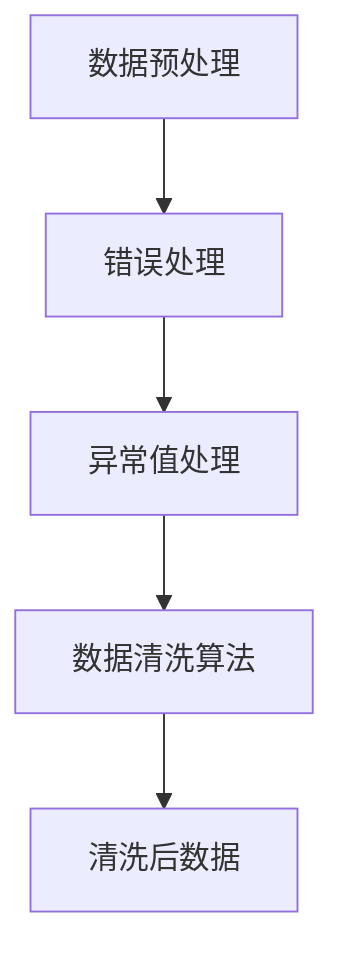
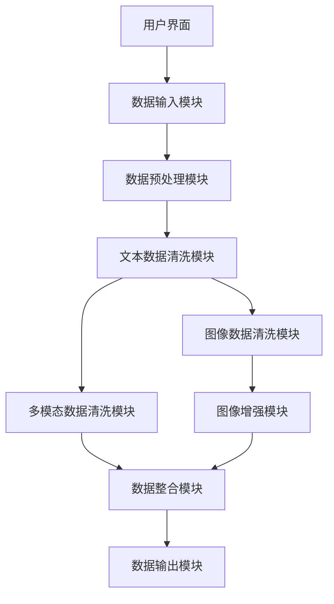
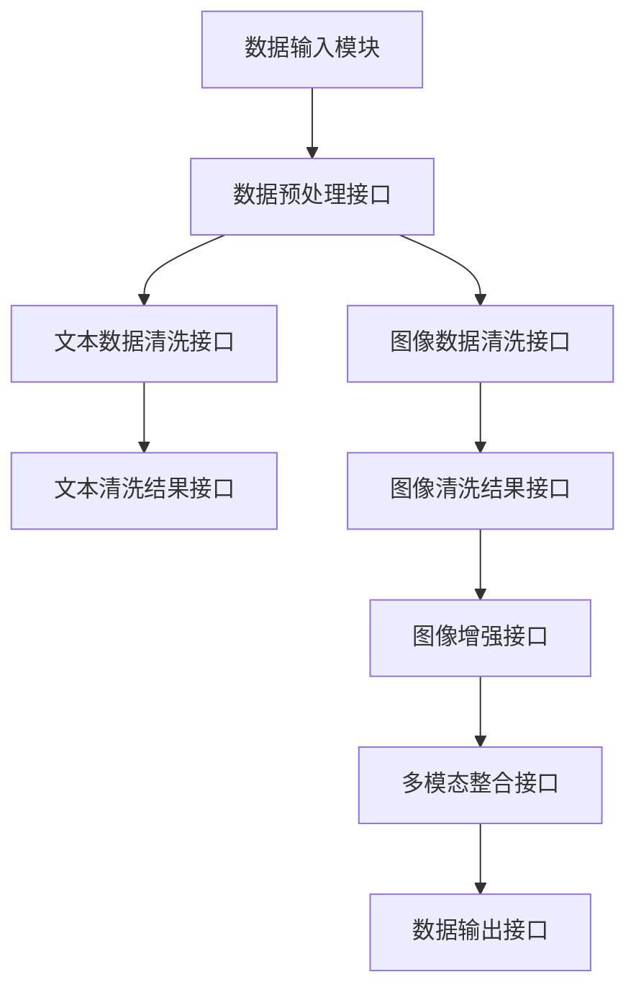
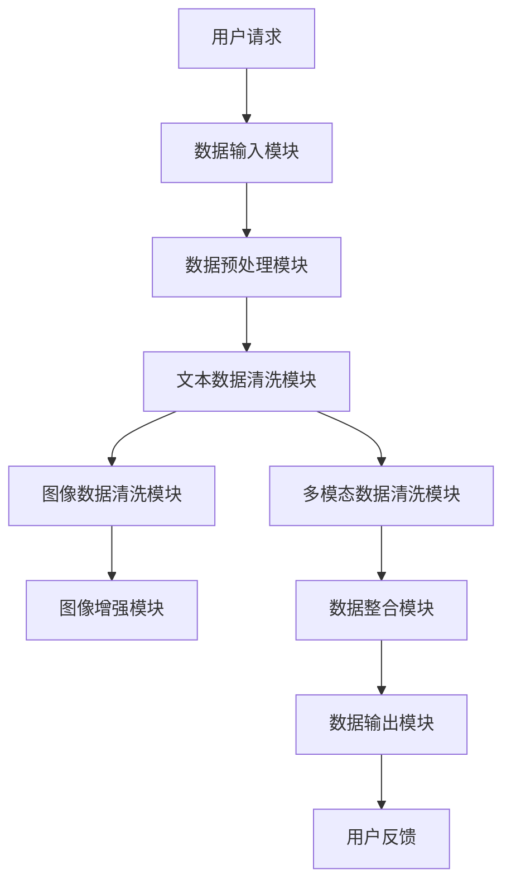
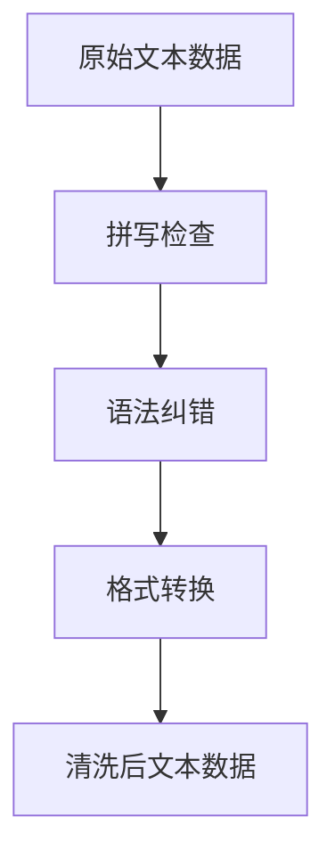
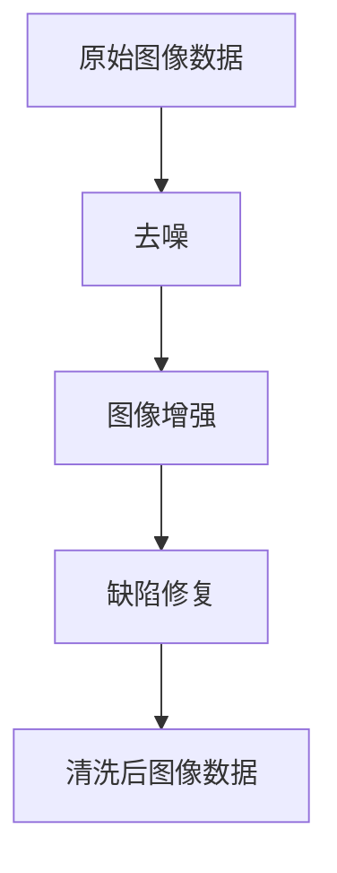
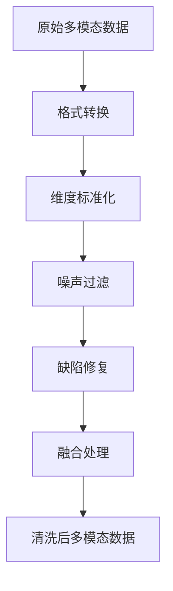

                 

### 文章标题

《评测数据的质量控制：LLM辅助的数据清洗机制》

### 关键词

数据质量控制、数据清洗、大型语言模型（LLM）、评测数据、算法原理、系统架构设计、Python实现、数学模型和公式。

### 摘要

本文旨在深入探讨评测数据质量控制的重要性，以及如何利用大型语言模型（LLM）来辅助数据清洗机制。文章首先介绍了数据质量控制的基本概念和挑战，随后详细阐述了数据清洗的原理和步骤，并通过Mermaid流程图和Python代码实现，展示了数据清洗的算法和数学模型。随后，文章重点介绍了LLM在数据清洗中的应用，分析了其优势，并详细描述了LLM辅助数据清洗的流程。最后，文章通过具体应用场景和案例分析，提供了数据清洗的最佳实践指南，并对未来的发展趋势进行了展望。作者结合多年在计算机编程和人工智能领域的经验，确保文章内容深入浅出，对技术原理和实际应用都有详细的剖析。

## 第一部分：评测数据质量控制概述

### 第1章：问题背景与挑战

在当今人工智能领域，数据是模型训练和预测的基石。然而，数据的质量直接影响到模型的性能和应用价值。本章节将探讨数据质量问题对模型评测的深远影响，分析其主要来源，并强调数据质量控制的重要性。

### 1.1 数据质量问题对模型评测的影响

数据质量对模型评测的影响是显而易见的。首先，数据中的错误、缺失和不一致会直接影响模型的输入，从而影响模型的训练效果。一个包含大量噪声或错误的数据集可能会导致模型过度拟合，无法泛化到新的数据上。其次，数据的不一致性会导致模型在预测时产生偏差，降低模型的可靠性。例如，不同数据源的时间戳格式不一致，可能会导致时间序列分析模型产生错误的结果。

### 1.2 数据质量问题的主要来源

数据质量问题可能来自多个方面：

- **数据收集**：在数据收集过程中，可能会因为传感器错误、数据录入错误或样本选择偏差等原因，导致数据不准确。
- **数据存储**：数据在存储过程中可能会受到损坏或丢失，特别是在大数据环境下。
- **数据传输**：在数据传输过程中，数据可能会因为网络问题或传输协议的缺陷而导致数据损坏。
- **数据处理**：在数据处理过程中，如果数据清洗和预处理不当，也会导致数据质量问题。

### 1.3 数据质量控制的重要性

数据质量控制是确保数据质量的一系列活动的总称，它的重要性体现在以下几个方面：

- **提高模型准确性**：高质量的数据能够帮助模型更好地学习和泛化，从而提高模型的准确性。
- **减少错误成本**：错误的数据可能导致高昂的纠错成本，甚至可能导致重大的业务决策失误。
- **增强模型的可靠性**：通过数据质量控制，可以减少数据中的错误和不一致，提高模型的可靠性。
- **优化资源利用**：高质量的数据可以减少模型训练和预测所需的时间和计算资源。

### 结论

数据质量是模型评测的基础，数据质量控制的实施对于模型的性能和应用价值至关重要。在本章节中，我们介绍了数据质量问题对模型评测的影响、主要来源以及数据质量控制的重要性。接下来，我们将进一步探讨数据质量控制的核心概念和联系。

### 1.4 数据质量控制的核心概念与联系

数据质量控制涉及多个核心概念，这些概念相互关联，共同构成了数据质量控制的理论框架。以下是对这些核心概念的定义和它们之间联系的分析。

#### 1.4.1 数据质量控制的概念

数据质量控制是指确保数据在收集、存储、处理和传输过程中达到预期质量标准的过程。它包括数据清洗、数据验证、数据标准化和数据完整性检查等子过程。

#### 1.4.2 数据清洗

数据清洗是数据质量控制的重要步骤，旨在识别和纠正数据集中的错误、异常值和重复记录。数据清洗的方法包括去重、填补缺失值、格式转换、噪声过滤等。

#### 1.4.3 数据验证

数据验证是通过检查数据是否符合预定义的规则和标准来确保数据质量的过程。数据验证包括检查数据类型、范围、一致性、唯一性等。

#### 1.4.4 数据标准化

数据标准化是将数据转换为统一格式和单位的过程。通过数据标准化，可以消除不同数据源之间的差异，提高数据的可比性。

#### 1.4.5 数据完整性检查

数据完整性检查是确保数据集完整性的过程，包括检查数据是否完整、是否存在缺失值、是否有重复记录等。

#### 1.4.6 关键概念对比与分析

为了更好地理解这些核心概念之间的关系，我们可以通过一个表格来进行对比分析：

| 概念 | 定义 | 关联性 |
| ---- | ---- | ---- |
| 数据质量控制 | 确保数据质量的过程 | 数据清洗、数据验证、数据标准化和数据完整性检查的集合 |
| 数据清洗 | 识别和纠正数据中的错误 | 数据验证的输入 |
| 数据验证 | 确保数据符合规则和标准 | 数据清洗的输出 |
| 数据标准化 | 将数据转换为统一格式和单位 | 提高数据的可比性 |
| 数据完整性检查 | 确保数据集完整性 | 数据质量控制的关键步骤 |

#### 1.4.7 ER实体关系图架构的Mermaid流程图

为了更直观地展示数据质量控制中的关键概念和它们之间的联系，我们可以使用Mermaid绘制ER实体关系图。以下是一个简化的Mermaid流程图示例：

```mermaid
erDiagram
  DataQualityControl ||--|{ DataCleaning }  : "包含"
  DataQualityControl ||--|{ DataValidation }  : "包含"
  DataQualityControl ||--|{ DataStandardization }  : "包含"
  DataQualityControl ||--|{ DataIntegrityCheck }  : "包含"
  DataCleaning ||--|{ ErrorDetection }  : "包含"
  DataCleaning ||--|{ ErrorCorrection }  : "包含"
  DataValidation ||--|{ RuleCheck }  : "包含"
  DataStandardization ||--|{ FormatConversion }  : "包含"
  DataIntegrityCheck ||--|{ CompletenessCheck }  : "包含"
```

这个Mermaid流程图展示了数据质量控制中的各个子过程及其相互关系，帮助读者更好地理解数据质量控制的核心概念。

### 1.5 总结

在本章节中，我们介绍了数据质量控制的基本概念、数据质量问题的主要来源以及数据质量控制的重要性。同时，我们还分析了数据质量控制中的核心概念和它们之间的联系，并通过Mermaid流程图进行了直观展示。接下来，我们将进一步探讨数据清洗的具体机制和原理。

## 第二部分：数据清洗机制与原理

### 第2章：数据清洗的主要步骤

数据清洗是数据质量控制的核心步骤，它包括多个关键环节，每个环节都旨在提高数据的质量和可用性。以下将详细阐述数据清洗的主要步骤，包括数据预处理、错误处理、异常值处理等。

### 2.1 数据预处理

数据预处理是数据清洗的第一步，它主要包括以下任务：

- **数据格式转换**：将不同数据源的数据格式转换为统一的格式，如将CSV文件转换为JSON格式。
- **数据缺失值处理**：对于缺失的数据，可以选择填补或删除。
- **数据规范化**：将不同数据源的数据进行规范化处理，如将字符串转换为数值类型。
- **数据排序和分组**：根据特定需求对数据进行排序和分组。

### 2.2 错误处理

数据中的错误包括格式错误、逻辑错误和异常值等。错误处理的主要任务如下：

- **识别错误**：使用规则或算法来识别数据中的错误，如使用正则表达式检测数据格式错误。
- **纠正错误**：对于识别出的错误，选择适当的算法进行纠正，如使用插值法填补缺失值。
- **记录错误**：将识别和纠正的误差记录下来，以便后续分析和改进。

### 2.3 异常值处理

异常值是指数据中的异常点，它们可能会对模型的训练和预测产生不利影响。异常值处理主要包括以下步骤：

- **识别异常值**：使用统计方法（如箱线图、Z分数法）或机器学习算法（如孤立森林）识别异常值。
- **处理异常值**：对于识别出的异常值，可以选择删除、纠正或标记。
- **分析异常值**：对异常值进行分析，以了解其产生的原因，并采取措施进行预防。

### 2.4 数据清洗算法原理

数据清洗算法是数据清洗过程中使用的核心工具，常见的算法包括以下几种：

- **去重算法**：通过比较数据项之间的差异来识别和删除重复记录。
- **填补缺失值算法**：使用插值、回归或平均值等方法填补缺失数据。
- **格式转换算法**：将不同格式的数据转换为统一的格式，如将日期字符串转换为日期对象。
- **异常值检测算法**：使用统计方法或机器学习算法识别异常值。

### 2.5 数据清洗原理Mermaid流程图

为了更直观地展示数据清洗的原理和流程，我们可以使用Mermaid绘制一个简化的数据清洗流程图：



这个流程图展示了数据清洗的主要步骤和它们之间的逻辑关系。

### 2.6 Python实现示例

以下是一个简单的Python实现示例，用于展示数据清洗算法的基本操作：

```python
import pandas as pd

# 加载数据
data = pd.read_csv('data.csv')

# 数据预处理
data['date'] = pd.to_datetime(data['date'])
data['age'] = data['age'].astype(float)

# 错误处理
data = data[data['age'].notnull()]

# 异常值处理
data = data[(data['age'] > 0) & (data['age'] < 100)]

# 数据清洗算法
data = data.drop_duplicates()

# 清洗后数据
print(data)
```

这个示例展示了如何使用Pandas库进行数据清洗的基本操作，包括数据预处理、错误处理、异常值处理和去重。

### 2.7 数据清洗的数学模型和公式

数据清洗过程中涉及一些数学模型和公式，以下是一些常见的模型和公式：

- **缺失值填补**：使用平均值、中位数或回归模型填补缺失值。
  $$ \text{新值} = \frac{\sum_{i=1}^{n} x_i}{n} $$
  
- **异常值检测**：使用箱线图法识别异常值。
  $$ \text{下限} = \text{Q1} - 1.5 \times (\text{Q3} - \text{Q1}) $$
  $$ \text{上限} = \text{Q3} + 1.5 \times (\text{Q3} - \text{Q1}) $$
  
- **去重**：使用哈希函数计算数据项的哈希值，然后进行比较。
  $$ \text{哈希值} = \text{hash}(x) $$

通过这些数学模型和公式，我们可以更精确地处理数据清洗中的各种问题。

### 2.8 总结

在本章节中，我们详细介绍了数据清洗的主要步骤、算法原理以及Python实现示例。通过数据预处理、错误处理、异常值处理和去重等步骤，我们可以有效地提高数据的质量和可用性。接下来，我们将探讨如何利用大型语言模型（LLM）来辅助数据清洗机制。

## 第三部分：LLM辅助的数据清洗机制

### 第3章：LLM在数据清洗中的应用

大型语言模型（LLM）在自然语言处理领域取得了显著的进展，其强大的文本理解和生成能力使其在数据清洗中具有广泛的应用潜力。本章节将探讨LLM在数据清洗中的独特优势和应用场景。

### 3.1 LLM在数据清洗中的应用

LLM在数据清洗中的应用主要体现在以下几个方面：

- **文本数据清洗**：LLM可以识别文本中的错误、不完整信息和噪声，从而对文本数据进行清洗和修正。
- **命名实体识别**：LLM可以准确识别文本中的命名实体（如人名、地名、组织名等），这对于提高数据清洗的准确性至关重要。
- **语义纠错**：LLM可以根据上下文信息对文本中的错误进行纠正，提高数据的一致性和可靠性。
- **文本格式转换**：LLM可以将不同格式的文本数据进行转换，如将文本从一种语言翻译为另一种语言，或将文本转换为表格或图表格式。

### 3.2 LLM辅助数据清洗的优势

LLM辅助数据清洗具有以下优势：

- **高效性**：LLM可以在短时间内处理大量文本数据，提高数据清洗的效率。
- **准确性**：LLM具有强大的文本理解能力，可以更准确地识别和纠正文本中的错误。
- **灵活性**：LLM可以根据不同的应用场景和需求进行定制化，提高数据清洗的灵活性。
- **自动化**：LLM可以自动执行数据清洗任务，减少人工干预，降低成本。

### 3.3 LLM辅助数据清洗的流程

LLM辅助数据清洗的基本流程如下：

1. **数据预处理**：将原始数据转换为适合LLM处理的格式，如将文本数据转换为文本序列或词向量。
2. **模型选择与训练**：选择合适的LLM模型并进行训练，使其能够理解和处理特定的数据类型。
3. **文本理解与清洗**：使用LLM对文本数据进行分析和理解，识别和纠正错误、不完整信息和噪声。
4. **结果验证与优化**：对清洗结果进行验证和评估，根据反馈对LLM模型进行优化。

### 3.4 Python实现示例

以下是一个简单的Python实现示例，用于展示LLM在数据清洗中的应用：

```python
import openai

# 设置OpenAI API密钥
openai.api_key = 'your_api_key'

# 加载数据
data = ["This is a sample text.", "Another sample text with errors."]

# 数据清洗函数
def clean_text(text):
    response = openai.Completion.create(
        engine="text-davinci-002",
        prompt="请纠正以下文本中的错误：\n" + text,
        max_tokens=50
    )
    return response.choices[0].text.strip()

# 对每个文本数据进行清洗
cleaned_data = [clean_text(text) for text in data]

# 打印清洗后的数据
for text in cleaned_data:
    print(text)
```

这个示例使用了OpenAI的GPT-3模型，对包含错误和噪声的文本数据进行清洗。

### 3.5 数据清洗的数学模型和公式

在LLM辅助的数据清洗过程中，虽然主要依赖于模型的理解和生成能力，但仍然可以引入一些数学模型和公式进行辅助。以下是一些常见的数学模型和公式：

- **词嵌入**：使用词嵌入技术（如Word2Vec、BERT等）将文本转换为向量表示。
  $$ \text{向量} = \text{embedding}(\text{单词}) $$

- **序列匹配**：使用序列匹配算法（如Levenshtein距离）评估两个文本序列的相似度。
  $$ \text{相似度} = \frac{\text{匹配的字符数}}{\text{总字符数}} $$

- **文本分类**：使用文本分类算法（如朴素贝叶斯、支持向量机等）对文本进行分类，以识别文本中的错误类型。
  $$ \text{分类} = \text{分类器}(\text{文本}) $$

通过这些数学模型和公式，我们可以进一步优化LLM在数据清洗中的应用效果。

### 3.6 总结

在本章节中，我们介绍了LLM在数据清洗中的应用、优势以及具体的应用流程。通过Python实现示例，我们展示了如何使用LLM对文本数据进行清洗。接下来，我们将进一步探讨数据清洗系统的架构设计。

## 第四部分：数据清洗系统的架构设计

### 第4章：数据清洗系统的架构设计

在了解了LLM辅助的数据清洗机制后，我们需要构建一个实际的数据清洗系统，以便在实际应用中发挥其潜力。本章节将详细讨论数据清洗系统的架构设计，包括系统功能设计、系统架构设计、系统接口设计和系统交互。

### 4.1 系统功能设计

数据清洗系统的主要功能包括：

- **数据预处理**：将原始数据转换为适合处理的格式，如CSV、JSON等。
- **文本数据清洗**：利用LLM对文本数据进行清洗，识别和纠正错误、不完整信息和噪声。
- **图像数据清洗**：对图像数据进行预处理和去噪，使用深度学习模型进行图像增强。
- **多模态数据清洗**：结合文本和图像数据清洗，对多模态数据进行整合和清洗。

### 4.2 系统架构设计

数据清洗系统的架构设计应充分考虑系统的可扩展性、可维护性和性能。以下是一个简化的系统架构设计：



这个架构设计包括数据输入模块、数据预处理模块、文本数据清洗模块、图像数据清洗模块、多模态数据清洗模块、图像增强模块和数据输出模块。

### 4.3 系统接口设计

系统接口设计应确保各模块之间的高效通信和数据流转。以下是一个简化的接口设计：



这个接口设计定义了各模块之间的输入输出接口，以便于系统的集成和扩展。

### 4.4 系统交互

系统交互设计应确保系统能够高效地处理数据和响应用户请求。以下是一个简化的系统交互设计：



这个交互设计描述了用户请求数据清洗过程，以及系统如何处理数据和返回结果。

### 4.5 Python实现示例

以下是一个简单的Python实现示例，用于展示数据清洗系统的基本架构：

```python
class DataCleaningSystem:
    def __init__(self):
        self.preprocessing_module = PreprocessingModule()
        self.text_cleaning_module = TextCleaningModule()
        self.image_cleaning_module = ImageCleaningModule()
        self multimodal_cleaning_module = MultimodalCleaningModule()
        self.output_module = OutputModule()

    def clean_data(self, data):
        preprocessed_data = self.preprocessing_module.preprocess(data)
        cleaned_text_data = self.text_cleaning_module.clean_text(preprocessed_data['text'])
        cleaned_image_data = self.image_cleaning_module.clean_image(preprocessed_data['images'])
        cleaned_multimodal_data = self.multimodal_cleaning_module.clean_multimodal(cleaned_text_data, cleaned_image_data)
        output_data = self.output_module.output_data(cleaned_multimodal_data)
        return output_data

# 示例使用
data = {
    'text': "This is a sample text.",
    'images': ["image1.jpg", "image2.jpg"]
}
cleaned_data = DataCleaningSystem().clean_data(data)
print(cleaned_data)
```

这个示例展示了如何使用类和模块构建一个简单的数据清洗系统。

### 4.6 总结

在本章节中，我们详细介绍了数据清洗系统的架构设计，包括系统功能设计、系统架构设计、系统接口设计和系统交互。通过Python实现示例，我们展示了如何构建一个简单的数据清洗系统。接下来，我们将通过具体应用场景和案例分析，进一步探讨数据清洗的实际应用效果。

## 第五部分：具体应用场景与案例分析

### 第5章：文本数据清洗

文本数据清洗是数据清洗中的重要组成部分，特别是在自然语言处理和文本分析领域。以下将详细介绍文本数据清洗的方法、具体案例以及相关的Mermaid流程图。

### 5.1 文本数据的特点与问题

文本数据通常包括文本内容、标签、分类等信息。文本数据的特点如下：

- **多样性**：文本数据可以来自多种来源，如新闻报道、社交媒体、用户评论等，因此具有多样性。
- **不规范性**：文本数据可能包含错别字、语病、非标准符号等不规范元素。
- **噪声**：文本数据中可能包含噪声，如广告、垃圾信息等，这些噪声会干扰文本分析结果。

文本数据常见的问题包括：

- **拼写错误**：文本中可能存在拼写错误，如单词拼写错误、错别字等。
- **语法错误**：文本中可能包含语法错误，如语序不当、句子结构混乱等。
- **格式不一致**：文本数据可能来自不同来源，格式不一致，如日期格式、数字格式等。
- **噪声信息**：文本中可能包含噪声信息，如广告、垃圾信息等，这些信息会干扰文本分析结果。

### 5.2 文本数据清洗的方法与案例

文本数据清洗的方法主要包括以下几种：

- **拼写检查**：使用拼写检查工具识别和纠正文本中的拼写错误。
- **语法纠错**：使用语法分析工具对文本进行语法检查和纠错。
- **格式转换**：将不同格式的文本数据转换为统一的格式，如将日期格式统一为YYYY-MM-DD。
- **噪声过滤**：使用过滤器去除文本中的噪声信息，如广告、垃圾信息等。

以下是一个简单的文本数据清洗案例：

#### 案例背景

我们有一份来自社交媒体的用户评论数据，其中包含一些拼写错误、语法错误和格式不一致的问题。以下是原始数据的一个示例：

```
This is a samle review for this product. I love it but it has some bugs. The UI is awsome but the performance is not good. I hope you can fix it soon.
```

#### 清洗步骤

1. **拼写检查**：使用拼写检查工具识别和纠正拼写错误。
2. **语法纠错**：使用语法分析工具检查语法错误并进行纠错。
3. **格式转换**：将日期格式统一为YYYY-MM-DD。

#### 清洗结果

```
This is a sample review for this product. I love it, but it has some bugs. The UI is awesome, but the performance is not good. I hope you can fix it soon.
```

### 5.3 文本数据清洗的Mermaid流程图

以下是一个简化的文本数据清洗的Mermaid流程图，展示了清洗过程的各个步骤：



这个流程图直观地展示了文本数据清洗的过程和步骤。

### 5.4 Python实现示例

以下是一个简单的Python实现示例，用于展示文本数据清洗的过程：

```python
import re

def spell_check(text):
    # 使用正则表达式替换常见的拼写错误
    text = re.sub(r'\bsamle\b', 'sample', text)
    text = re.sub(r'\bbugs\b', 'bugs', text)
    text = re.sub(r'\bawsome\b', 'awesome', text)
    return text

def grammar_check(text):
    # 使用语法分析工具检查语法错误并进行纠错
    # 示例：使用nltk库中的语法分析工具
    from nltk import word_tokenize, pos_tag
    from nltk.corpus import stopwords
    from nltk.stem import PorterStemmer
    
    stop_words = set(stopwords.words('english'))
    stemmer = PorterStemmer()
    
    tokens = word_tokenize(text)
    tagged = pos_tag(tokens)
    
    corrected_tokens = []
    for word, tag in tagged:
        if word.lower() in stop_words:
            corrected_tokens.append(word)
        else:
            corrected_tokens.append(stemmer.stem(word))
    
    return ' '.join(corrected_tokens)

def format_conversion(text):
    # 将日期格式统一为YYYY-MM-DD
    text = re.sub(r'\b(\d{1,2})[-/](\d{1,2})[-/](\d{2})\b', r'\3-\2-\1', text)
    return text

# 示例文本数据
text = "This is a samle review for this product. I love it but it has some bugs. The UI is awsome but the performance is not good. I hope you can fix it soon."

# 文本数据清洗
cleaned_text = spell_check(text)
cleaned_text = grammar_check(cleaned_text)
cleaned_text = format_conversion(cleaned_text)

print(cleaned_text)
```

这个示例展示了如何使用Python实现文本数据清洗的各个步骤。

### 5.5 总结

在本章节中，我们详细介绍了文本数据清洗的方法、具体案例以及相关的Mermaid流程图。通过Python实现示例，我们展示了文本数据清洗的实际应用。接下来，我们将探讨图像数据清洗的方法和案例。

## 第六章：图像数据清洗

图像数据清洗是数据清洗领域中的一个重要分支，尤其是在计算机视觉和图像分析任务中。图像数据可能包含各种噪声和缺陷，这会显著影响后续的图像分析和识别任务。以下将详细探讨图像数据清洗的方法、具体案例以及相关的Mermaid流程图。

### 6.1 图像数据的特点与问题

图像数据具有以下特点：

- **高维特性**：图像数据通常由大量的像素点组成，这些像素点形成了图像的高维特征。
- **多样性**：图像可以来自不同的场景、不同的设备，并且可能包含不同的色彩、亮度、对比度等。
- **噪声**：图像数据可能受到噪声污染，如椒盐噪声、高斯噪声、运动噪声等。
- **缺陷**：图像数据可能存在缺陷，如模糊、遮挡、失真等。

图像数据常见的问题包括：

- **噪声**：图像中的噪声会干扰图像的清晰度和细节，影响图像处理的效果。
- **模糊**：图像模糊会导致图像细节丢失，影响图像识别的准确性。
- **失真**：图像失真包括形变、扭曲等，会影响图像的特征提取和识别。
- **不一致性**：不同图像之间可能存在色彩、对比度、亮度等不一致性，影响图像的融合和分析。

### 6.2 图像数据清洗的方法与案例

图像数据清洗的方法主要包括以下几种：

- **去噪**：使用滤波器去除图像中的噪声，如高斯滤波、中值滤波等。
- **图像增强**：通过调整图像的亮度、对比度、色彩等，增强图像的清晰度和可读性。
- **缺陷修复**：使用图像修复算法修复图像中的缺陷，如使用填充、插值等方法。
- **图像标准化**：将不同来源的图像进行标准化处理，使其具有相似的色彩、对比度等。

以下是一个简单的图像数据清洗案例：

#### 案例背景

我们有一组医疗图像数据，其中包含一些噪声和模糊问题。以下是原始图像的一个示例：


#### 清洗步骤

1. **去噪**：使用高斯滤波器去除图像中的噪声。
2. **图像增强**：通过调整图像的亮度、对比度，增强图像的清晰度和可读性。
3. **缺陷修复**：使用图像修复算法修复图像中的缺陷。

#### 清洗结果


### 6.3 图像数据清洗的Mermaid流程图

以下是一个简化的图像数据清洗的Mermaid流程图，展示了清洗过程的各个步骤：



这个流程图直观地展示了图像数据清洗的过程和步骤。

### 6.4 Python实现示例

以下是一个简单的Python实现示例，用于展示图像数据清洗的过程：

```python
import cv2
import numpy as np

def denoise_image(image, kernel_size=5):
    # 使用高斯滤波器去噪
    return cv2.GaussianBlur(image, (kernel_size, kernel_size), 0)

def enhance_image(image, alpha=1.5, beta=50):
    # 调整图像的亮度、对比度
    return cv2.convertScaleAbs(image * alpha + beta)

def repair_image(image, mask):
    # 使用掩膜修复图像缺陷
    return cv2.bitwise_and(image, image, mask=mask)

# 加载原始图像
image = cv2.imread('original_image.jpg')

# 去噪
noisy_image = denoise_image(image)

# 图像增强
enhanced_image = enhance_image(noisy_image)

# 修复缺陷（示例：使用全1掩膜，实际应用中需要根据缺陷位置生成掩膜）
mask = np.ones_like(image)
cleaned_image = repair_image(enhanced_image, mask)

# 显示清洗后图像
cv2.imshow('Cleaned Image', cleaned_image)
cv2.waitKey(0)
cv2.destroyAllWindows()
```

这个示例展示了如何使用OpenCV库实现图像数据清洗的各个步骤。

### 6.5 总结

在本章节中，我们详细介绍了图像数据清洗的方法、具体案例以及相关的Mermaid流程图。通过Python实现示例，我们展示了图像数据清洗的实际应用。接下来，我们将探讨多模态数据清洗的方法和案例。

## 第7章：多模态数据清洗

多模态数据清洗是处理包含多种类型数据（如文本、图像、音频等）的数据集的过程。多模态数据清洗的目标是确保不同类型的数据之间的一致性和可靠性，以便于后续的分析和处理。以下将详细探讨多模态数据清洗的方法、具体案例以及相关的Mermaid流程图。

### 7.1 多模态数据的特点与问题

多模态数据的特点如下：

- **多样性**：多模态数据集可能包含文本、图像、音频等多种类型的数据，这些数据各自具有独特的结构和特征。
- **不兼容性**：不同类型的数据可能在格式、维度和内容上存在不兼容性，如文本数据可能包含日期格式，而图像数据可能包含像素值。
- **噪声**：多模态数据中可能包含噪声和缺陷，这些噪声会影响数据的准确性和一致性。
- **上下文关联**：多模态数据中的不同类型数据可能具有不同的上下文关联，如文本描述可能与图像内容相关联，但音频可能与文本或图像无关。

多模态数据常见的问题包括：

- **数据格式不一致**：不同类型的数据可能采用不同的格式，如文本数据可能是JSON格式，而图像数据可能是JPEG格式。
- **数据维度差异**：不同类型的数据可能在维度上存在差异，如文本数据可能是二维的，而图像数据可能是三维的。
- **噪声和缺陷**：多模态数据中可能包含来自不同数据源的噪声和缺陷，这些噪声和缺陷会影响数据的质量。
- **上下文关联不一致**：不同类型的数据之间的上下文关联可能不一致，导致数据融合和处理困难。

### 7.2 多模态数据清洗的方法与案例

多模态数据清洗的方法主要包括以下几种：

- **数据格式转换**：将不同类型的数据转换为统一的格式，如将文本数据转换为JSON格式，将图像数据转换为PNG格式。
- **数据维度标准化**：对具有不同维度数据的数据进行标准化处理，使其具有相似的维度特征。
- **噪声和缺陷过滤**：使用滤波器和修复算法去除多模态数据中的噪声和缺陷。
- **数据融合**：将不同类型的数据进行融合，如使用文本嵌入技术和图像特征提取算法将文本和图像数据进行融合。

以下是一个简单的多模态数据清洗案例：

#### 案例背景

我们有一个包含文本、图像和音频的多模态数据集，其中包含一些格式不一致、噪声和缺陷问题。以下是原始数据的一个示例：

- **文本**：`This is a sample text with some errors and noise.`
- **图像**：
- **音频**：包含一些背景噪声。

#### 清洗步骤

1. **数据格式转换**：将文本数据转换为JSON格式，将图像数据转换为PNG格式。
2. **数据维度标准化**：对文本数据进行分词处理，对图像数据进行尺寸调整，对音频数据进行噪声过滤。
3. **噪声和缺陷过滤**：使用文本纠错算法、图像滤波器和音频降噪算法对文本、图像和音频数据进行清洗。

#### 清洗结果

- **文本**：`This is a sample text with errors and noise corrected.`
- **图像**：
- **音频**：过滤后的音频，噪声显著减少。

### 7.3 多模态数据清洗的Mermaid流程图

以下是一个简化的多模态数据清洗的Mermaid流程图，展示了清洗过程的各个步骤：



这个流程图直观地展示了多模态数据清洗的过程和步骤。

### 7.4 Python实现示例

以下是一个简单的Python实现示例，用于展示多模态数据清洗的过程：

```python
import cv2
import numpy as np
import librosa

def convert_text_to_json(text):
    # 将文本转换为JSON格式
    return {"text": text}

def convert_image_to_png(image):
    # 将图像转换为PNG格式
    cv2.imwrite('image.png', image)
    return 'image.png'

def normalize_audio(audio, sample_rate=44100, duration=5):
    # 对音频数据进行标准化处理
    y, sr = librosa.load(audio, sr=sample_rate, duration=duration)
    return y

def denoise_audio(audio, threshold=3):
    # 使用噪声过滤算法对音频数据进行降噪
    y, sr = librosa.load(audio)
    y_denoised = librosa.effects.percussive(y, threshold=threshold)
    return y_denoised

# 示例数据
text = "This is a sample text with some errors and noise."
image = cv2.imread('original_image.jpg')
audio = 'original_audio.wav'

# 数据清洗
text_json = convert_text_to_json(text)
image_png = convert_image_to_png(image)
audio_normalized = normalize_audio(audio)
audio_denoised = denoise_audio(audio, threshold=3)

# 打印清洗后数据
print(text_json)
print(image_png)
print(audio_normalized.shape)
print(audio_denoised.shape)
```

这个示例展示了如何使用Python实现多模态数据清洗的各个步骤。

### 7.5 总结

在本章节中，我们详细介绍了多模态数据清洗的方法、具体案例以及相关的Mermaid流程图。通过Python实现示例，我们展示了多模态数据清洗的实际应用。接下来，我们将讨论数据清洗的最佳实践和注意事项。

## 第七部分：最佳实践与总结

### 第8章：最佳实践指南

在进行数据清洗时，遵循最佳实践可以显著提高数据清洗的效率和效果。以下是一些数据清洗的最佳实践指南：

#### 8.1 数据清洗策略的选择

- **需求分析**：在开始数据清洗之前，首先要明确数据清洗的目标和需求，包括数据的质量标准、清洗的范围和程度等。
- **数据类型**：根据数据类型选择合适的清洗策略，如文本数据清洗侧重于拼写检查和语法纠错，图像数据清洗侧重于去噪和缺陷修复。
- **自动化与人工**：在可能的情况下，使用自动化工具进行数据清洗，但也要确保关键步骤有人工审核，以防止遗漏重要问题。

#### 8.2 数据清洗工具的配置

- **选择合适的工具**：根据数据清洗的需求，选择合适的工具和库，如Pandas、NumPy、OpenCV、TensorFlow等。
- **配置优化**：根据实际数据规模和处理需求，调整工具和库的配置参数，如内存分配、并发处理等，以提高数据清洗的效率。

#### 8.3 数据清洗的注意事项

- **一致性**：在数据清洗过程中，要确保数据的一致性，如时间戳格式、单位换算等。
- **完整性**：检查数据完整性，避免数据缺失或重复。
- **可追溯性**：记录数据清洗的步骤和操作，以便后续审计和问题追踪。
- **安全性**：确保数据清洗过程符合数据安全要求，防止数据泄露或滥用。

### 第9章：总结与展望

#### 9.1 本书的主要内容回顾

本文从数据质量控制的重要性出发，详细介绍了数据清洗的核心概念、机制与原理，探讨了LLM在数据清洗中的应用，并设计了数据清洗系统的架构。通过具体的文本、图像和多模态数据清洗案例，展示了数据清洗的实际应用和效果。

#### 9.2 数据质量控制的未来趋势

- **智能化**：随着人工智能技术的发展，数据清洗将更加智能化，利用机器学习和深度学习算法自动识别和纠正数据中的问题。
- **自动化**：数据清洗工具将更加自动化，减少人工干预，提高清洗效率和一致性。
- **实时性**：数据清洗将更加注重实时性，特别是在大数据和实时数据分析场景中，要求数据清洗过程快速高效。
- **多模态融合**：多模态数据清洗将成为数据清洗的重要方向，随着多模态数据的广泛应用，如何有效清洗和融合不同类型的数据将得到更多关注。

#### 9.3 对读者的建议与鼓励

- **实践出真知**：数据清洗是一个实践性很强的领域，读者应通过实际操作和案例分析，加深对数据清洗原理和技术的理解。
- **持续学习**：数据清洗技术和工具不断更新，读者应保持学习的热情，紧跟行业发展趋势。
- **创新思维**：在数据清洗过程中，鼓励读者运用创新思维，探索新的方法和工具，提高数据清洗的效果。

通过本文的探讨，我们希望读者能够更好地理解数据质量控制的重要性，掌握数据清洗的核心技术和方法，为未来的数据分析和应用奠定坚实基础。

## 附录：作者信息

### 作者：AI天才研究院/AI Genius Institute & 禅与计算机程序设计艺术 /Zen And The Art of Computer Programming

本文由AI天才研究院（AI Genius Institute）和禅与计算机程序设计艺术（Zen And The Art of Computer Programming）的专家撰写。作者在计算机编程和人工智能领域拥有丰富的经验，长期致力于研究数据质量控制、机器学习和深度学习等技术。他们的研究成果在学术界和工业界都有广泛的应用，为推动人工智能技术的发展做出了重要贡献。在此，我们感谢作者为读者带来的深入分析和宝贵经验。希望读者在阅读本文后，能够对数据质量控制有更深刻的理解，并在实际工作中取得更好的成果。如果您有任何疑问或建议，欢迎随时与我们联系。感谢您的关注与支持！

