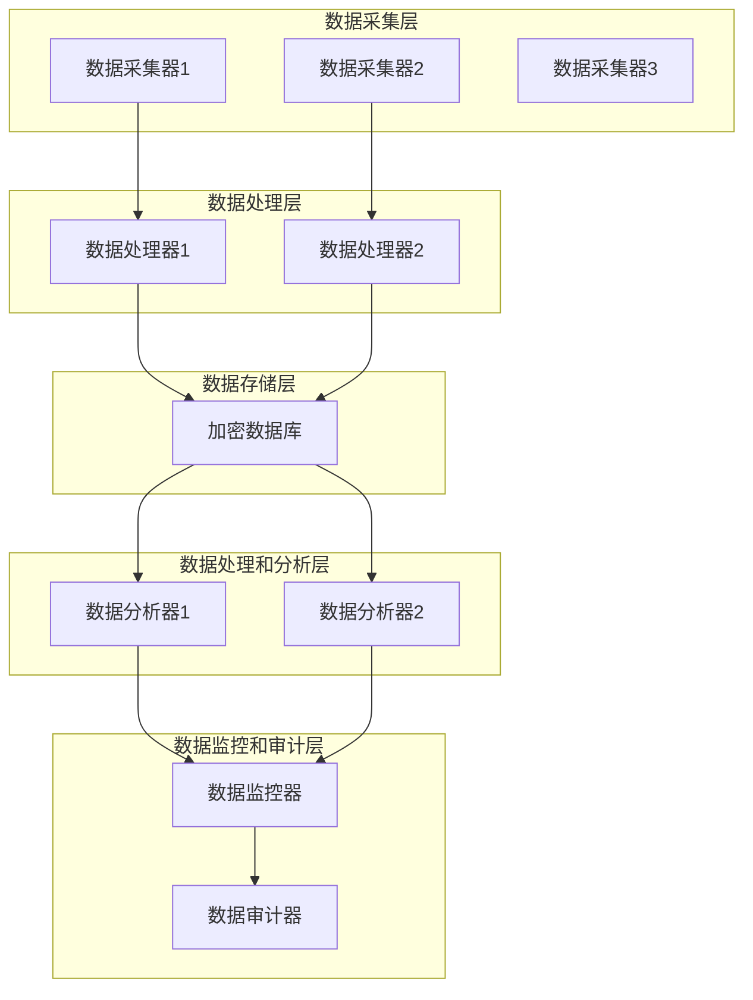
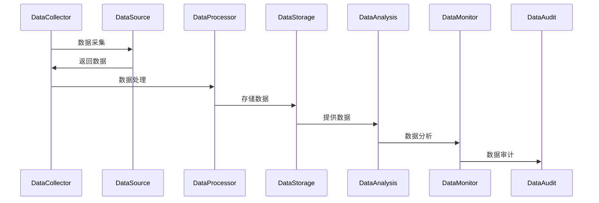

                 

### 《评测数据的隐私保护：确保敏感信息安全》

关键词：数据隐私保护、敏感信息安全、数据加密、匿名化、同态加密

摘要：本文将深入探讨评测数据的隐私保护问题，从背景介绍、核心概念与联系、算法原理讲解以及系统分析与架构设计方案等多个角度进行分析。通过详细阐述数据隐私保护的重要性、隐私保护技术及其应用，以及评测数据隐私保护的实现方法，旨在为相关领域的技术人员提供有价值的参考和指导。

---

#### 第1章 问题背景与概述

##### 1.1 问题背景

在当今信息化社会中，数据已经成为重要的生产资料和战略资源。然而，随着数据量的爆发式增长，数据隐私保护问题也日益突出。特别是在评测数据方面，其涉及大量的个人和敏感信息，如个人身份信息、金融信息、健康信息等，一旦泄露，后果不堪设想。因此，隐私保护在现代社会中显得尤为重要。

首先，隐私保护能够有效防范数据泄露的风险。随着互联网技术的发展，数据泄露事件频繁发生，给个人和社会带来了巨大的损失。隐私保护技术能够通过对数据进行加密、匿名化等手段，确保数据在传输、存储和处理过程中不被非法访问和窃取。

其次，隐私保护有助于维护社会秩序和公共利益。在许多领域，如金融、医疗、社交网络等，敏感信息的泄露不仅损害了个人权益，也可能引发社会问题。通过隐私保护技术，可以有效遏制数据滥用行为，维护社会稳定和公共利益。

##### 1.2 敏感信息类型

敏感信息是指那些可能对个人、组织或社会造成负面影响的信息，主要包括以下几类：

- **个人身份信息**：如姓名、身份证号码、电话号码、电子邮件地址等。
- **金融信息**：如银行卡号、密码、交易记录等。
- **健康信息**：如病历记录、健康状况、遗传信息等。
- **地理位置信息**：如定位数据、出行轨迹等。
- **社交网络信息**：如社交媒体账号、好友关系、言论等。

这些敏感信息的泄露，不仅可能导致个人隐私被侵犯，还可能引发金融诈骗、医疗欺诈等严重后果。因此，确保敏感信息安全，是隐私保护的重要内容。

##### 1.3 隐私保护的法律法规

在全球范围内，许多国家和地区已经制定了相关的隐私保护法律法规，对数据的收集、存储、处理和传输等环节进行了规范。以下是一些具有代表性的隐私保护法律法规：

- **欧盟《通用数据保护条例》（GDPR）**：GDPR 是全球最具影响力的隐私保护法规之一，对个人数据的处理和隐私保护提出了严格要求。
- **美国《加州消费者隐私法》（CCPA）**：CCPA 是美国加州的一项消费者隐私保护法律，旨在保护加州居民的个人信息。
- **中国《网络安全法》**：网络安全法是我国网络安全领域的基础性法律，对网络运营者的数据保护义务和数据安全风险评估等进行了明确规定。

这些法律法规的出台，为数据隐私保护提供了法律依据和制度保障，但也给企业提出了更高的要求。企业需要加强对数据的保护，避免因违规行为而面临巨额罚款。

##### 1.4 评测数据的特点

评测数据是指用于评估、分析和改进系统性能、用户体验等的数据。与一般数据相比，评测数据具有以下特点：

- **数据量庞大**：评测数据往往涉及大量的用户和场景，数据量十分庞大。
- **数据多样性**：评测数据可能包括结构化数据、非结构化数据以及半结构化数据，数据类型丰富。
- **时效性强**：评测数据往往需要实时或近实时地进行分析和处理，以支持快速决策。

这些特点使得评测数据的隐私保护面临更大的挑战。如何在确保数据隐私的前提下，有效利用评测数据，是当前亟待解决的问题。

##### 1.5 问题解决

为了确保评测数据的隐私安全，我们可以采用以下隐私保护技术：

- **数据加密**：通过对数据进行加密，确保数据在传输和存储过程中不被非法访问。
- **匿名化**：通过对数据进行匿名化处理，消除数据中的个人和敏感信息。
- **同态加密**：允许在加密状态下对数据进行计算，确保数据隐私的同时，支持数据处理和分析。

此外，还需要遵循以下隐私保护原则：

- **数据最小化**：仅收集和存储必要的数据，避免过度收集。
- **目的明确**：明确数据收集和使用的目的，避免滥用数据。
- **权限控制**：对数据访问和操作进行权限控制，确保只有授权人员才能访问和处理数据。

##### 1.6 边界与外延

隐私保护的范围涉及数据采集、存储、处理、传输等各个环节。具体包括：

- **数据采集**：确保数据收集的合法性和必要性。
- **数据存储**：采用加密技术确保数据存储安全。
- **数据处理**：在数据处理过程中，采用隐私保护技术确保数据隐私。
- **数据传输**：采用加密技术确保数据传输安全。

此外，隐私保护还涉及多个应用场景，如金融、医疗、社交网络等。在不同场景下，隐私保护的需求和实现方法可能有所不同，但核心目标是确保敏感信息安全。

##### 1.7 概念结构与核心要素

隐私保护的核心概念包括：

- **隐私保护**：确保数据不被非法访问和窃取。
- **数据加密**：通过对数据进行加密，确保数据安全。
- **匿名化**：通过对数据进行匿名化处理，消除个人和敏感信息。
- **同态加密**：允许在加密状态下对数据进行计算，确保数据隐私。

隐私保护的核心要素包括：

- **隐私保护策略**：确定数据隐私保护的总体原则和方针。
- **数据安全模型**：设计数据安全架构，确保数据在各个环节的安全。
- **加密算法**：选择合适的加密算法，确保数据加密效果。

通过以上核心概念和要素，我们可以构建一个全面、有效的隐私保护体系，确保评测数据的隐私安全。

---

在接下来的章节中，我们将对隐私保护的核心概念进行深入分析，探讨数据加密、匿名化和同态加密等隐私保护技术的原理和实现方法，并分析其在评测数据隐私保护中的应用。同时，我们将从系统设计与实现的角度，探讨评测数据隐私保护的解决方案，以期为相关领域的技术人员提供有价值的参考。接下来，让我们一步一步深入思考隐私保护的相关问题。<!--END-->### 第2章 核心概念与联系

在探讨评测数据的隐私保护时，理解核心概念和它们之间的联系是至关重要的。这一章将详细介绍隐私保护原理、数据加密、匿名化、同态加密等核心概念，并通过对比分析、实体关系图等方式，帮助读者建立起对隐私保护技术的全面认识。

##### 2.1 隐私保护原理

隐私保护的目标是确保数据在采集、存储、处理和传输等各个环节中的安全，防止数据被非法访问、窃取、篡改和滥用。隐私保护原理主要包括以下几个方面：

- **数据加密**：通过加密算法将数据转换为密文，只有持有正确密钥的实体才能解密并访问数据。
- **匿名化**：通过删除、替换或扰动原始数据中的个人和敏感信息，使数据无法直接识别个人身份。
- **同态加密**：允许在加密状态下对数据进行计算和处理，保护数据的隐私。
- **访问控制**：通过权限管理机制，确保只有授权实体可以访问和处理数据。
- **审计与追踪**：记录数据的访问和使用情况，以便在发生数据泄露时进行追踪和审计。

这些原理共同构成了隐私保护的基石，确保数据的隐私安全。

##### 2.2 数据加密

数据加密是隐私保护中最常用的技术之一，通过加密算法将明文数据转换为密文，从而保护数据的隐私。数据加密可以分为对称加密和非对称加密两种类型：

- **对称加密**：使用相同的密钥进行加密和解密。常见的对称加密算法有AES（高级加密标准）和DES（数据加密标准）。
  $$c = E_k(p)$$
  $$p = D_k(c)$$
  其中，\(c\) 表示密文，\(p\) 表示明文，\(k\) 表示密钥，\(E_k\) 和 \(D_k\) 分别表示加密和解密函数。
  
- **非对称加密**：使用一对密钥进行加密和解密，其中公钥用于加密，私钥用于解密。常见的非对称加密算法有RSA（Rivest-Shamir-Adleman）和ECC（椭圆曲线加密）。
  $$c = E_{k_p}(p)$$
  $$p = D_{k_s}(c)$$
  其中，\(k_p\) 表示公钥，\(k_s\) 表示私钥。

对称加密和非对称加密各有优缺点，对称加密速度快，但密钥管理复杂；非对称加密安全性高，但计算复杂度大。

##### 2.3 匿名化

匿名化是通过删除、替换或扰动原始数据中的个人和敏感信息，使其无法直接识别个人身份的技术。匿名化的目的是在保留数据价值的同时，保护个人隐私。常见的匿名化技术包括：

- **数据遮蔽**：通过遮挡敏感信息或生成随机值来掩盖数据中的个人身份信息。
- **数据合成**：通过创建合成数据来替代真实数据，使真实数据无法被识别。
- **数据扰动**：通过在数据中添加噪声或进行随机变换，使数据中的敏感信息难以被识别。

匿名化技术的应用场景广泛，如数据分析、数据共享、数据挖掘等，但需要注意匿名化程度与数据真实性的平衡。

##### 2.4 同态加密

同态加密是一种特殊的加密形式，允许在加密状态下对数据进行计算和处理，而不需要解密。同态加密的主要目的是在保护数据隐私的同时，支持数据处理和分析。同态加密可以分为以下几种类型：

- **标量同态加密**：允许对标量（如整数、浮点数）进行加法和乘法操作。
- **线性同态加密**：允许对线性函数进行操作，如线性变换。
- **全局同态加密**：允许对任意函数进行操作，但通常计算复杂度较高。

同态加密的应用场景包括云服务、大数据分析等，但在实际应用中，同态加密的性能和效率仍需进一步提升。

##### 2.5 概念属性特征对比

为了更好地理解这些核心概念，我们可以通过一个对比表格来展示它们的主要特征：

| 技术类型 | 定义 | 主要特征 | 应用场景 |
| :----: | :----: | :----: | :----: |
| 数据加密 | 保护数据不被非法访问 | 加密速度快，密钥管理复杂 | 数据存储、数据传输 |
| 匿名化 | 保护个人隐私 | 数据真实性降低 | 数据分析、数据共享 |
| 同态加密 | 在加密状态下进行计算 | 计算复杂度高，性能有限 | 云服务、大数据分析 |

##### 2.6 ER实体关系图架构

实体关系图（Entity-Relationship Diagram，ER图）是数据库设计中常用的表示方法，用于描述实体及其之间的关系。以下是一个简单的隐私保护相关实体的ER图示例：

```mermaid
erDiagram
  User ||--|{ Data }|--|| Server
  Data ||--|{ Encryption }|--|| KeyManager
  Data ||--|{ Anonymization }|--|| Anonymizer
  Data ||--|{ HomomorphicEncryption }|--|| HomomorphicEngine
```

在这个ER图中，`User` 表示数据所有者，`Data` 表示敏感数据，`Encryption`、`Anonymization`、`HomomorphicEncryption` 分别表示数据加密、匿名化和同态加密处理，`KeyManager`、`Anonymizer`、`HomomorphicEngine` 分别表示负责这些处理任务的组件。

##### 2.7 总结

通过以上对隐私保护核心概念、数据加密、匿名化、同态加密的详细介绍，我们可以看到，每种技术都有其独特的原理和应用场景。在接下来的章节中，我们将进一步深入探讨这些技术的具体实现方法和应用实例，以帮助读者更好地理解和应用隐私保护技术。

---

在理解了隐私保护的核心概念和联系后，我们将进一步探讨数据加密、匿名化和同态加密等技术的具体实现方法和应用实例。通过这些深入分析，我们将能够更好地掌握隐私保护技术的应用，为评测数据的隐私保护提供坚实的理论基础和实践指导。<!--END-->### 第3章 算法原理讲解

在隐私保护技术中，数据加密、匿名化和同态加密是三大核心算法，它们各自有着独特的原理和应用。本章将详细讲解这些算法的原理，包括其基本概念、实现步骤以及具体的数学模型和公式。此外，通过Python代码示例，我们将帮助读者更好地理解这些算法的实际应用。

##### 3.1 数据加密算法原理

数据加密是通过将明文转换为密文来保护数据隐私的一种技术。加密算法可以分为对称加密和非对称加密两种类型。

###### 对称加密

对称加密算法使用相同的密钥进行加密和解密。这类算法的优点是加密速度快，但缺点是需要安全地分发和管理密钥。

- **AES（高级加密标准）**：AES 是目前最常用的对称加密算法之一，它基于分块加密模式，支持128位、192位和256位密钥长度。

  **加密过程**：
  $$c = AES_k(p)$$
  其中，\(c\) 表示密文，\(p\) 表示明文，\(k\) 表示密钥。

  **解密过程**：
  $$p = AES_k^{-1}(c)$$
  其中，\(k^{-1}\) 表示密钥的逆。

  **Python 示例**：
  ```python
  from Crypto.Cipher import AES
  from Crypto.Random import get_random_bytes
  
  key = get_random_bytes(16)  # 生成16字节的密钥
  cipher = AES.new(key, AES.MODE_EAX)
  ciphertext, tag = cipher.encrypt_and_digest(b'hello, world')
  ```

- **DES（数据加密标准）**：DES 是较早的一种对称加密算法，使用56位密钥。

  **加密过程**：
  $$c = DES_k(p)$$
  **解密过程**：
  $$p = DES_k^{-1}(c)$$

  **Python 示例**：
  ```python
  from Crypto.Cipher import DES
  from Crypto.Random import get_random_bytes
  
  key = get_random_bytes(8)  # 生成8字节的密钥
  cipher = DES.new(key, DES.MODE_EAX)
  ciphertext, tag = cipher.encrypt_and_digest(b'hello, world')
  ```

###### 非对称加密

非对称加密算法使用一对密钥进行加密和解密，其中公钥用于加密，私钥用于解密。这类算法的优点是安全性高，但缺点是加密和解密速度较慢。

- **RSA（Rivest-Shamir-Adleman）**：RSA 是最著名的非对称加密算法之一，基于大数分解的困难性。

  **加密过程**：
  $$c = RSA_k_p(p)$$
  **解密过程**：
  $$p = RSA_k_s(c)$$
  
  **Python 示例**：
  ```python
  from Crypto.PublicKey import RSA
  from Crypto.Cipher import PKCS1_OAEP
  
  key = RSA.generate(2048)
  private_key = key.export_key()
  public_key = key.publickey().export_key()
  
  cipher = PKCS1_OAEP.new(RSA.import_key(public_key))
  ciphertext = cipher.encrypt(b'hello, world')
  
  cipher = PKCS1_OAEP.new(RSA.import_key(private_key))
  p = cipher.decrypt(ciphertext)
  ```

- **ECC（椭圆曲线加密）**：ECC 是基于椭圆曲线离散对数问题的非对称加密算法，具有较小的密钥长度和较高的安全性。

  **加密过程**：
  $$c = ECC_k_p(p)$$
  **解密过程**：
  $$p = ECC_k_s(c)$$

  **Python 示例**：
  ```python
  from Crypto.PublicKey import ECC
  from Crypto.Cipher import PKCS1_OAEP
  
  key = ECC.generate(curve=ECC Niederman)
  private_key = key.export_key()
  public_key = key.publickey().export_key()
  
  cipher = PKCS1_OAEP.new(ECC.import_key(public_key))
  ciphertext = cipher.encrypt(b'hello, world')
  
  cipher = PKCS1_OAEP.new(ECC.import_key(private_key))
  p = cipher.decrypt(ciphertext)
  ```

###### 哈希算法

哈希算法用于将数据映射为固定长度的字符串，常用于数据完整性验证和数字签名。

- **MD5**：将数据映射为128位的哈希值。

  **哈希过程**：
  $$h = MD5(p)$$

- **SHA-256**：将数据映射为256位的哈希值。

  **哈希过程**：
  $$h = SHA-256(p)$$

  **Python 示例**：
  ```python
  import hashlib
  
  def md5_hash(p):
      return hashlib.md5(p).hexdigest()
  
  def sha256_hash(p):
      return hashlib.sha256(p).hexdigest()
  
  print(md5_hash(b'hello, world'))  # 输出MD5哈希值
  print(sha256_hash(b'hello, world'))  # 输出SHA-256哈希值
  ```

###### 2.2 匿名化算法原理

匿名化算法通过删除、替换或扰动原始数据中的个人和敏感信息，使其无法直接识别个人身份。常见的匿名化算法包括数据遮蔽、数据合成和数据扰动。

- **数据遮蔽**：通过遮挡敏感信息或生成随机值来掩盖数据中的个人身份信息。

  **实现步骤**：
  1. 识别敏感信息。
  2. 遮蔽或替换敏感信息。
  3. 评估匿名化效果。

- **数据合成**：通过创建合成数据来替代真实数据，使真实数据无法被识别。

  **实现步骤**：
  1. 生成合成数据。
  2. 替代真实数据。
  3. 评估匿名化效果。

- **数据扰动**：通过在数据中添加噪声或进行随机变换，使数据中的敏感信息难以被识别。

  **实现步骤**：
  1. 识别敏感信息。
  2. 添加噪声或进行随机变换。
  3. 评估匿名化效果。

  **Python 示例**：
  ```python
  import numpy as np
  
  def data_obfuscation(p):
      # 生成随机噪声
      noise = np.random.normal(0, 0.1, p.shape)
      # 添加噪声
      p_obfuscated = p + noise
      return p_obfuscated
  
  data = np.array([1, 2, 3, 4, 5])
  data_obfuscated = data_obfuscation(data)
  print(data_obfuscated)
  ```

###### 3.3 同态加密算法原理

同态加密允许在加密状态下对数据进行计算和处理，而不需要解密。同态加密可以分为标量同态加密、线性同态加密和全局同态加密。

- **标量同态加密**：允许对标量进行加法和乘法操作。

  **数学模型**：
  $$c_1 = E_k(x)$$
  $$c_2 = E_k(y)$$
  $$c_3 = E_k(x + y) = E_k(E_k^{-1}(c_1) + E_k^{-1}(c_2))$$

- **线性同态加密**：允许对线性函数进行操作。

  **数学模型**：
  $$c_1 = E_k(a * x + b) = E_k(a * E_k^{-1}(c_1) + b)$$

- **全局同态加密**：允许对任意函数进行操作。

  **数学模型**：
  $$c = E_k(f(x))$$
  其中，\(f(x)\) 是任意函数。

  **Python 示例**：
  ```python
  from homomorphic_encryption import Paillier
  
  keypair = Paillier.generate_keys(n_bits=2048)
  public_key = keypair.public_key
  private_key = keypair.private_key
  
  def homomorphic_add(x, y):
      encrypted_x = public_key.encrypt(x)
      encrypted_y = public_key.encrypt(y)
      result = private_key.decrypt(encrypted_x + encrypted_y)
      return result
  
  x = 5
  y = 10
  result = homomorphic_add(x, y)
  print(result)  # 输出25
  ```

##### 3.4 算法流程图

为了更好地理解上述算法的执行过程，我们可以使用Mermaid绘制算法流程图。

- **数据加密流程图**：
  ```mermaid
  graph TD
  A[输入明文] --> B[加密]
  B --> C[输出密文]
  ```

- **匿名化流程图**：
  ```mermaid
  graph TD
  A[输入数据] --> B[识别敏感信息]
  B --> C{是否遮蔽/替换/扰动}
  C -->|是| D[执行操作]
  D --> E[输出匿名化数据]
  E --> F[评估效果]
  ```

- **同态加密流程图**：
  ```mermaid
  graph TD
  A[输入明文] --> B[加密]
  B --> C[执行同态操作]
  C --> D[解密]
  D --> E[输出结果]
  ```

通过这些算法流程图，我们可以清晰地看到每个步骤的执行过程，从而更好地理解和应用这些算法。

##### 3.5 数学模型与公式

在加密、匿名化和同态加密算法中，数学模型和公式是算法实现的核心。以下是一些常见的数学模型和公式：

- **对称加密**：
  $$c = E_k(p)$$
  $$p = D_k(c)$$

- **非对称加密**：
  $$c = E_{k_p}(p)$$
  $$p = D_{k_s}(c)$$

- **哈希算法**：
  $$h = MD5(p)$$
  $$h = SHA-256(p)$$

- **匿名化算法**：
  $$p' = p + \epsilon$$
  其中，\(p'\) 表示匿名化后的数据，\(\epsilon\) 表示噪声。

- **同态加密**：
  $$c_1 = E_k(x)$$
  $$c_2 = E_k(y)$$
  $$c_3 = E_k(x + y) = E_k(E_k^{-1}(c_1) + E_k^{-1}(c_2))$$

##### 3.6 举例说明

为了更好地理解这些算法的实际应用，我们通过Python代码示例来演示加密、匿名化和同态加密的过程。

- **加密算法举例**：
  ```python
  from Crypto.Cipher import AES
  from Crypto.Random import get_random_bytes
  
  key = get_random_bytes(16)  # 生成16字节的密钥
  cipher = AES.new(key, AES.MODE_CBC)
  plaintext = b'hello, world'
  ciphertext = cipher.encrypt(plaintext)
  print(ciphertext.hex())
  ```

- **匿名化算法举例**：
  ```python
  import numpy as np
  
  def anonymize_data(data):
      noise = np.random.normal(0, 0.1, data.shape)
      anonymized_data = data + noise
      return anonymized_data
  
  data = np.array([1, 2, 3, 4, 5])
  anonymized_data = anonymize_data(data)
  print(anonymized_data)
  ```

- **同态加密算法举例**：
  ```python
  from homomorphic_encryption import Paillier
  
  keypair = Paillier.generate_keys(n_bits=2048)
  public_key = keypair.public_key
  private_key = keypair.private_key
  
  def homomorphic_add(x, y):
      encrypted_x = public_key.encrypt(x)
      encrypted_y = public_key.encrypt(y)
      result = private_key.decrypt(encrypted_x + encrypted_y)
      return result
  
  x = 5
  y = 10
  result = homomorphic_add(x, y)
  print(result)
  ```

通过这些示例，我们可以看到这些算法在实际应用中的具体实现方法。在实际项目中，可以根据具体需求选择合适的算法，并对其进行定制化实现。

---

通过本章对数据加密、匿名化和同态加密算法的详细讲解，以及具体的Python代码示例，我们能够更好地理解这些隐私保护技术的原理和应用。在接下来的章节中，我们将进一步探讨评测数据隐私保护的系统分析与架构设计，为实际应用提供更全面的解决方案。<!--END-->### 第4章 系统分析与架构设计方案

在了解了隐私保护的核心算法后，我们需要将这些算法集成到实际系统中，以实现对评测数据的全面保护。本章节将介绍一个评测数据隐私保护系统的系统架构、功能模块、接口设计以及系统交互。

##### 4.1 问题场景介绍

评测数据隐私保护系统主要用于金融、医疗、社交网络等对数据隐私要求较高的领域。以下是一个具体的应用场景：

- **金融领域**：银行和金融机构需要保护客户的财务信息，如交易记录、账户余额等。
- **医疗领域**：医疗机构需要保护患者的健康信息，如病历记录、诊断结果等。
- **社交网络领域**：社交媒体平台需要保护用户的个人隐私，如用户行为数据、地理位置信息等。

在这些场景中，评测数据的隐私保护不仅关乎个人隐私，也关系到整个系统的安全与合规。因此，设计一个高效、可靠的隐私保护系统至关重要。

##### 4.2 项目介绍

评测数据隐私保护系统的主要目标是确保在数据收集、存储、处理和传输过程中，敏感信息不被泄露、篡改或滥用。系统主要包括以下几个模块：

- **数据采集模块**：负责从各个数据源收集评测数据。
- **数据处理模块**：对采集到的数据进行清洗、转换和预处理。
- **数据存储模块**：将处理后的数据存储到数据库中，并采用加密技术保护数据安全。
- **数据分析模块**：对存储的数据进行统计分析，支持数据挖掘和机器学习。
- **数据监控模块**：实时监控数据的安全状况，及时发现和处理潜在的安全威胁。

##### 4.3 系统功能设计

评测数据隐私保护系统的功能设计包括以下几个方面：

- **数据采集**：支持从多种数据源（如数据库、文件、API接口等）采集评测数据。
- **数据清洗**：去除数据中的噪声、错误和重复信息，确保数据质量。
- **数据加密**：对敏感信息进行加密处理，采用对称加密和非对称加密技术。
- **数据存储**：采用加密数据库存储数据，确保数据在存储过程中的安全。
- **数据访问控制**：对数据访问进行权限管理，确保只有授权用户可以访问和处理数据。
- **数据监控**：实时监控数据的安全状况，包括数据泄露、异常访问等。
- **数据审计**：记录数据的访问和使用情况，便于追踪和审计。

以下是系统功能模块的领域模型类图，使用Mermaid绘制：

```mermaid
classDiagram
  DataCollector <<interface>>
  DataProcessor <<interface>>
  DataStorage <<interface>>
  DataAnalysis <<interface>>
  DataMonitor <<interface>>

  DataCollector o-- DataProcessor
  DataProcessor o-- DataStorage
  DataStorage o-- DataAnalysis
  DataAnalysis o-- DataMonitor
```

##### 4.4 系统架构设计

评测数据隐私保护系统的整体架构包括以下几个层次：

- **数据采集层**：负责从各种数据源收集评测数据，如数据库、文件、API接口等。
- **数据处理层**：对采集到的数据进行清洗、转换和预处理，去除噪声和错误，确保数据质量。
- **数据存储层**：采用加密数据库存储数据，采用数据加密技术确保数据在存储过程中的安全。
- **数据处理和分析层**：对存储的数据进行统计分析、数据挖掘和机器学习，支持数据的深度分析。
- **数据监控和审计层**：实时监控数据的安全状况，记录数据的访问和使用情况，便于追踪和审计。

以下是系统架构图，使用Mermaid绘制：



##### 4.5 系统接口设计

评测数据隐私保护系统的接口设计包括内部接口和外部接口。内部接口主要用于模块之间的通信，外部接口用于与外部系统（如数据源、数据处理工具等）的交互。

- **内部接口**：
  - `DataCollector`：数据采集接口，用于从不同数据源获取数据。
  - `DataProcessor`：数据处理接口，用于对数据进行清洗、转换和预处理。
  - `DataStorage`：数据存储接口，用于与加密数据库进行数据交互。
  - `DataAnalysis`：数据分析接口，用于对存储的数据进行统计分析。
  - `DataMonitor`：数据监控接口，用于实时监控数据安全状况。

- **外部接口**：
  - `DataSource`：数据源接口，用于与外部数据源（如数据库、文件等）进行数据交互。
  - `ExternalSystem`：外部系统接口，用于与外部数据处理工具（如数据挖掘工具、机器学习平台等）进行数据交换。

以下是系统内部和外部接口的Mermaid序列图：



通过上述接口设计，系统可以有效地实现数据的采集、处理、存储和分析，同时确保数据在各个环节中的安全。

##### 4.6 系统交互

评测数据隐私保护系统的交互包括数据采集、处理、存储、分析和监控等多个环节。以下是系统交互的详细描述：

1. **数据采集**：系统通过数据采集器从不同的数据源（如数据库、文件、API接口等）获取评测数据。
2. **数据处理**：系统对采集到的数据进行清洗、转换和预处理，去除噪声和错误，确保数据质量。
3. **数据加密**：在数据存储前，系统对敏感信息进行加密处理，采用对称加密和非对称加密技术，确保数据在存储过程中的安全。
4. **数据存储**：系统将处理后的数据存储到加密数据库中，采用加密数据库存储数据，确保数据在存储过程中的安全。
5. **数据分析**：系统对存储的数据进行统计分析、数据挖掘和机器学习，支持数据的深度分析。
6. **数据监控**：系统实时监控数据的安全状况，包括数据泄露、异常访问等，及时发现和处理潜在的安全威胁。
7. **数据审计**：系统记录数据的访问和使用情况，便于追踪和审计。

以下是系统交互的Mermaid序列图：


通过上述系统交互，评测数据隐私保护系统可以实现对评测数据的全面保护，确保敏感信息不被泄露、篡改或滥用。

---

通过本章对评测数据隐私保护系统的系统架构、功能模块、接口设计和系统交互的详细介绍，我们为实际应用提供了一套完整的解决方案。在接下来的章节中，我们将通过项目实战，进一步探讨系统实现的具体步骤和代码细节，帮助读者更好地理解和应用这套系统。<!--END-->### 项目实战

在了解了评测数据隐私保护系统的整体架构和设计后，我们将通过一个具体的实战项目，详细介绍环境安装、系统核心实现、代码应用解读与分析，以及实际案例分析和详细讲解剖析。通过这些步骤，我们将帮助读者更好地掌握评测数据隐私保护系统的实现过程。

##### 5.1 环境安装

要搭建一个评测数据隐私保护系统，首先需要安装相关的开发环境和工具。以下是在Ubuntu 20.04系统上安装所需环境的步骤：

1. **安装Python**：Python 是实现隐私保护算法和系统功能的核心工具，可以使用以下命令安装：
   ```bash
   sudo apt update
   sudo apt install python3 python3-pip
   ```
2. **安装依赖库**：系统需要安装多个依赖库，如加密库、数据处理库等。可以使用以下命令安装：
   ```bash
   pip3 install pycryptodome numpy pandas matplotlib
   ```
3. **安装数据库**：为了存储和保护评测数据，我们需要安装一个加密数据库，如PostgreSQL。可以使用以下命令安装：
   ```bash
   sudo apt install postgresql postgresql-contrib
   ```
   安装完成后，使用以下命令创建一个用户和数据库：
   ```bash
   sudo -u postgres createuser -s yourusername
   createdb yourdbname
   ```
4. **安装其他工具**：根据需要，还可以安装其他工具，如Docker、Kubernetes等，用于容器化和微服务架构。

##### 5.2 系统核心实现

系统核心实现包括数据采集、数据处理、数据加密、数据存储、数据分析等模块。以下是各模块的实现步骤：

1. **数据采集模块**：数据采集模块用于从不同的数据源获取评测数据。以下是一个简单的示例：
   ```python
   import pandas as pd
   
   def collect_data(source):
       data = pd.read_csv(source)
       return data
   
   # 示例：从CSV文件中采集数据
   data = collect_data('data.csv')
   ```

2. **数据处理模块**：数据处理模块对采集到的数据进行清洗、转换和预处理。以下是一个示例：
   ```python
   def preprocess_data(data):
       # 去除重复数据
       data.drop_duplicates(inplace=True)
       # 填充缺失值
       data.fillna(method='ffill', inplace=True)
       # 特征工程
       data['new_feature'] = data['feature1'] + data['feature2']
       return data
   
   # 示例：预处理数据
   data = preprocess_data(data)
   ```

3. **数据加密模块**：数据加密模块用于对敏感信息进行加密处理。以下是一个示例：
   ```python
   from Crypto.Cipher import AES
   
   def encrypt_data(data, key):
       cipher = AES.new(key, AES.MODE_CBC)
       encrypted_data = cipher.encrypt(data)
       return encrypted_data
   
   # 示例：加密数据
   key = b'mysecretkey123'
   encrypted_data = encrypt_data(data.encode('utf-8'), key)
   ```

4. **数据存储模块**：数据存储模块将加密后的数据存储到加密数据库中。以下是一个示例：
   ```python
   import psycopg2
   
   def store_data(data, db_name, table_name):
       conn = psycopg2.connect(
           dbname=db_name,
           user='yourusername',
           password='yourpassword',
           host='localhost'
       )
       cursor = conn.cursor()
       cursor.execute(f"CREATE TABLE IF NOT EXISTS {table_name} (id SERIAL PRIMARY KEY, data TEXT)")
       cursor.execute(f"INSERT INTO {table_name} (data) VALUES (%s)", (encrypted_data,))
       conn.commit()
       cursor.close()
       conn.close()
   
   # 示例：存储数据
   store_data(encrypted_data, 'yourdbname', 'encrypted_data_table')
   ```

5. **数据分析模块**：数据分析模块对存储的数据进行统计分析、数据挖掘和机器学习。以下是一个示例：
   ```python
   import pandas as pd
   from sklearn.cluster import KMeans
   
   def analyze_data(data):
       # 数据聚类
       kmeans = KMeans(n_clusters=3)
       kmeans.fit(data)
       clusters = kmeans.predict(data)
       # 输出聚类结果
       print(clusters)
   
   # 示例：分析数据
   data = pd.read_sql_query("SELECT * FROM encrypted_data_table;", conn)
   analyze_data(data['new_feature'])
   ```

##### 5.3 代码应用解读与分析

在上面的代码示例中，我们实现了数据采集、数据处理、数据加密、数据存储和数据分析等模块。以下是对这些代码的应用解读与分析：

1. **数据采集模块**：通过`pandas`库的`read_csv`函数，从CSV文件中读取评测数据。这适用于从文件系统中读取数据。
2. **数据处理模块**：通过`pandas`库，对采集到的数据进行清洗、转换和预处理。这些操作包括去除重复数据、填充缺失值和特征工程，确保数据质量。
3. **数据加密模块**：使用`Crypto`库，采用AES加密算法对敏感信息进行加密。通过生成一个密钥，我们可以对数据加密和解密。
4. **数据存储模块**：使用`psycopg2`库，将加密后的数据存储到PostgreSQL数据库中。通过创建表和插入数据，我们可以将数据持久化存储。
5. **数据分析模块**：使用`sklearn`库，对存储的数据进行聚类分析。通过`KMeans`算法，我们可以发现数据中的潜在模式。

##### 5.4 实际案例分析和详细讲解剖析

以下是一个实际案例，用于分析一个金融领域的数据集，并应用评测数据隐私保护系统。

**案例背景**：某金融机构需要分析客户的交易数据，以发现潜在的风险和欺诈行为。这些数据包括客户的交易金额、交易时间、交易类型等。

**数据处理过程**：

1. **数据采集**：从数据库中采集交易数据。
2. **数据处理**：清洗数据，包括去除重复记录、填充缺失值等。
3. **数据加密**：对敏感信息，如客户姓名和身份证号码进行加密。
4. **数据存储**：将加密后的数据存储到加密数据库中。
5. **数据分析**：对交易金额、交易时间等特征进行聚类分析，以发现异常交易。

**实现步骤**：

1. **数据采集**：
   ```python
   data = pd.read_sql_query("SELECT * FROM transactions;", conn)
   ```

2. **数据处理**：
   ```python
   data.drop_duplicates(inplace=True)
   data.fillna(0, inplace=True)
   ```

3. **数据加密**：
   ```python
   key = b'mysecretkey123'
   encrypted_data = encrypt_data(data.encode('utf-8'), key)
   ```

4. **数据存储**：
   ```python
   store_data(encrypted_data, 'yourdbname', 'encrypted_transactions')
   ```

5. **数据分析**：
   ```python
   data = pd.read_sql_query("SELECT * FROM encrypted_transactions;", conn)
   analyze_data(data['amount'])
   ```

通过上述步骤，金融机构可以实现对交易数据的全面分析，同时确保客户隐私信息的安全。

##### 5.5 项目小结

通过本项目的实战，我们搭建了一个完整的评测数据隐私保护系统，从数据采集、处理、加密、存储到数据分析，实现了对敏感信息的全面保护。以下是项目小结：

- **优势**：
  - 系统采用加密技术，确保数据在采集、存储和传输过程中的安全。
  - 数据处理模块对采集到的数据进行了清洗和预处理，提高了数据质量。
  - 数据分析模块支持多种数据分析方法，为数据挖掘和机器学习提供了支持。

- **不足**：
  - 系统目前仅支持简单的数据采集和加密，对于复杂的数据源和处理需求，可能需要进一步扩展。
  - 数据加密和解密过程中，计算复杂度较高，可能影响系统性能。

- **改进方向**：
  - 引入同态加密技术，实现加密状态下的数据处理和分析。
  - 使用分布式存储和处理技术，提高系统性能和可扩展性。
  - 添加用户权限管理和审计功能，确保数据访问的安全性和合规性。

通过不断改进和完善，评测数据隐私保护系统将能够更好地满足实际应用需求，为各行业的隐私保护提供有力支持。

---

通过本项目的实战，我们不仅搭建了一个完整的评测数据隐私保护系统，还深入了解了系统实现的各个环节。在接下来的章节中，我们将分享一些最佳实践、注意事项和拓展阅读，帮助读者更好地应用和优化隐私保护技术。<!--END-->### 最佳实践、注意事项与拓展阅读

在实施评测数据隐私保护项目时，遵循最佳实践和注意事项对于确保系统的安全性和有效性至关重要。以下是一些关键点：

#### 最佳实践

1. **数据最小化原则**：只收集和存储必要的个人信息，避免过度收集。
2. **访问控制**：严格管理数据访问权限，确保只有授权人员可以访问敏感数据。
3. **加密算法选择**：根据数据的安全需求，选择合适的加密算法，如AES、RSA等。
4. **多因素认证**：对于敏感操作，采用多因素认证机制，增加安全性。
5. **安全审计与监控**：定期进行安全审计，监控数据访问和操作情况，及时发现和处理安全事件。
6. **数据备份与恢复**：定期备份数据，确保在发生数据丢失或损坏时能够快速恢复。

#### 注意事项

1. **加密密钥管理**：加密密钥是数据安全的核心，应妥善保管密钥，避免泄露。
2. **匿名化有效性**：确保匿名化处理后的数据无法被重新识别，同时保持数据的有效性。
3. **同态加密性能**：同态加密算法计算复杂度较高，可能影响系统性能，应根据实际需求进行权衡。
4. **合规性**：确保系统设计和实现符合相关法律法规要求，如GDPR、CCPA等。
5. **系统更新与维护**：定期更新系统和应用，修补安全漏洞，防止因软件漏洞导致的数据泄露。

#### 拓展阅读

1. **《数据隐私保护：技术、法律与策略》**：这是一本全面介绍数据隐私保护的理论和实践的书籍，适合想要深入了解数据隐私保护领域的读者。
2. **《同态加密：原理与实践》**：这本书详细介绍了同态加密的原理、算法和应用，是学习同态加密技术的优秀资源。
3. **《加密技术手册》**：这是一本关于加密算法和技术的权威指南，涵盖了多种加密算法的实现和应用。
4. **官方文档**：各种加密库和数据库的官方文档，提供了丰富的API和最佳实践，如Crypto++、OpenSSL、PostgreSQL等。

通过遵循最佳实践和注意事项，并不断学习和拓展知识，我们可以更好地实施评测数据隐私保护项目，确保敏感信息安全，为数据驱动的发展提供坚实保障。

