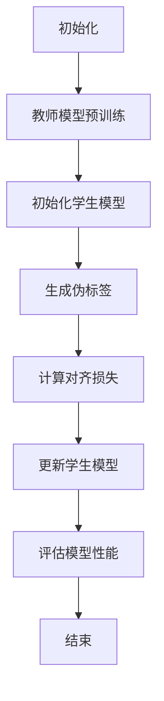
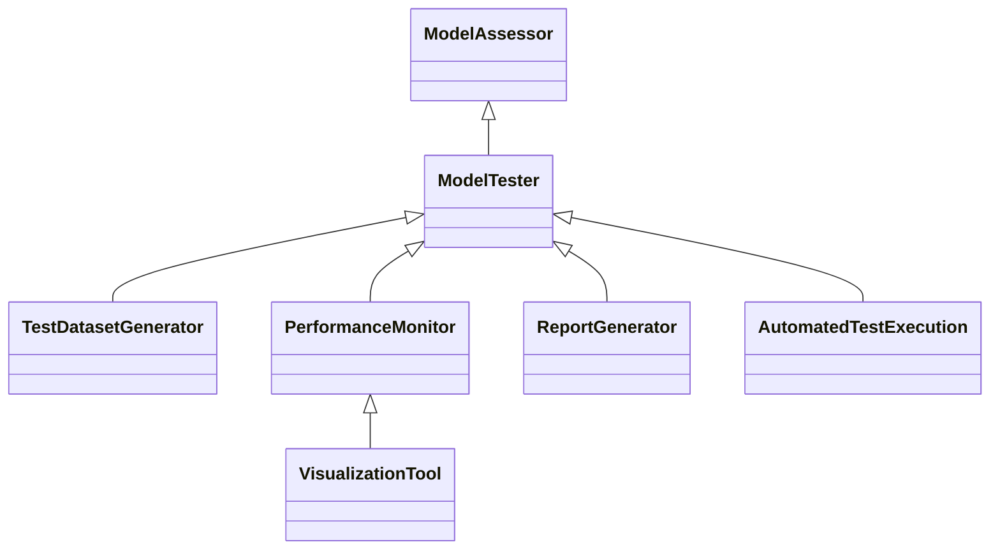
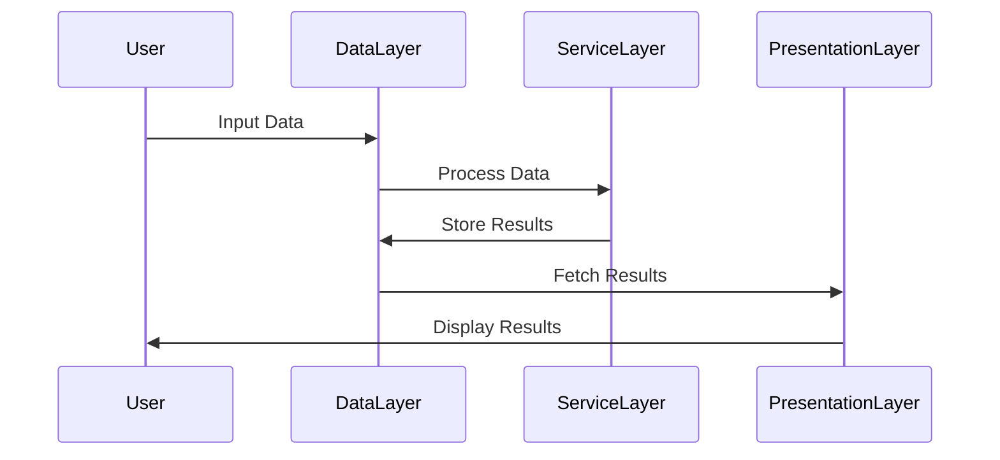
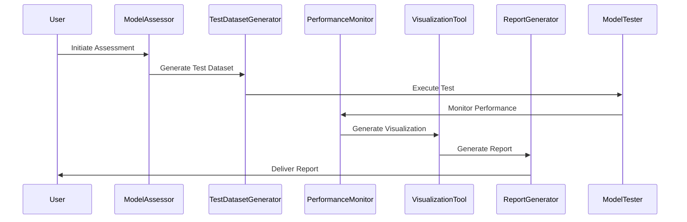
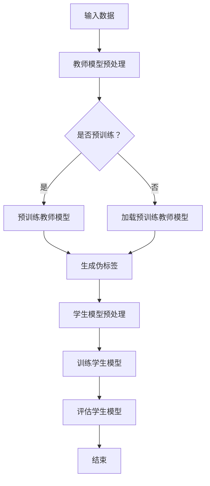
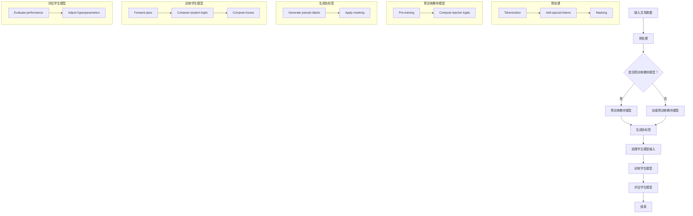
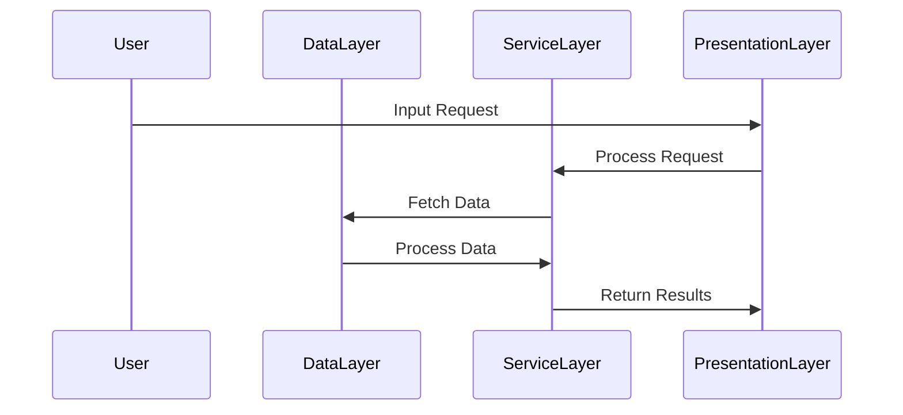

                 

### 引言与背景

#### 评测系统的重要性

评测系统在现代人工智能（AI）领域扮演着至关重要的角色。随着深度学习技术的迅速发展和AI应用的普及，评测系统不仅用于评估模型性能，还用于确保模型的可靠性和鲁棒性。一个高效的评测系统能够提供全面、准确的评估结果，这对于模型的改进和优化至关重要。此外，评测系统还用于比较不同模型的性能，为研究者提供有价值的参考，帮助他们在众多模型中选择最优方案。

#### DistilBERT知识蒸馏的应用背景

DistilBERT是一种经过知识蒸馏的BERT模型，它通过减小模型大小和计算复杂度，同时保持高精度的特性，受到了广泛关注。知识蒸馏是一种将复杂模型的知识传递给更简单模型的技术，通过训练小模型来复制大模型的性能。在AI领域，DistilBERT的应用背景主要集中在以下几个方面：

1. **资源受限环境**：由于大型深度学习模型（如BERT）需要大量的计算资源和存储空间，在资源受限的环境中使用DistilBERT可以降低成本，提高模型的部署灵活性。
2. **移动设备应用**：移动设备和嵌入式系统的计算能力和存储空间有限，使用DistilBERT可以确保模型在这些设备上高效运行，提供更流畅的用户体验。
3. **实时系统需求**：在需要快速响应的实时系统中，例如自动驾驶车辆和实时语音识别系统，DistilBERT的高效性使得它成为理想的选择。

#### 问题与目标

尽管DistilBERT在资源受限的环境中表现出色，但在实际应用中仍面临一些挑战。首先，知识蒸馏过程需要精心设计，以确保小模型能够充分吸收大模型的知识。其次，评测系统的复杂性和多样性要求我们找到一种通用的解决方案，以适应不同的应用场景。因此，本篇文章的目标是：

1. **详细解读DistilBERT知识蒸馏的概念和原理**：通过解释DistilBERT的工作机制，帮助读者理解其如何在知识蒸馏过程中发挥作用。
2. **深入探讨评测系统中的应用**：分析评测系统的挑战，介绍如何使用DistilBERT知识蒸馏技术来解决这些问题。
3. **提供具体的实现方案**：通过系统分析和架构设计，展示如何在实际项目中应用DistilBERT知识蒸馏技术，并提供代码示例和实际案例。

通过以上步骤，我们将帮助读者全面了解DistilBERT知识蒸馏在评测系统中的应用，并掌握其关键技术和实践方法。

#### 核心概念与联系

##### DistilBERT的定义

DistilBERT是由Hugging Face团队开发的一种经过知识蒸馏的BERT模型。它通过将原始BERT模型（如BERT-base或BERT-large）与一个小型教师模型进行联合训练，来创建一个既保持高精度又更小、更轻量的BERT模型。具体来说，DistilBERT在训练过程中引入了一些优化技术，如层归一化、Dropout等，以减少模型的参数数量和计算复杂度。

##### 知识蒸馏的基本原理

知识蒸馏是一种将大模型（教师模型）的知识传递给小模型（学生模型）的技术。其基本思想是通过训练小模型来复制大模型的性能。知识蒸馏的过程可以分为两个阶段：预训练阶段和微调阶段。

1. **预训练阶段**：在预训练阶段，教师模型首先在大规模语料库上进行预训练，以获得丰富的语言知识和表征。然后，学生模型在小规模语料库上进行预训练，但使用教师模型的输出作为目标来训练学生模型。
   
2. **微调阶段**：在微调阶段，学生模型在特定任务上进行微调，使用教师模型的输出作为额外的信息来进一步提高性能。

##### DistilBERT与知识蒸馏的联系

DistilBERT正是基于知识蒸馏原理构建的。通过以下步骤，DistilBERT实现了大模型向小模型的知识传递：

1. **模型架构**：DistilBERT在BERT的基础上进行了一些架构上的调整，如减小了模型的参数数量，同时保留了BERT的核心特性。

2. **训练策略**：DistilBERT采用了一种特殊的训练策略，即对齐损失（Alignment Loss），这种损失函数旨在使教师模型和学生模型的输出对齐，从而更有效地传递知识。

3. **优化目标**：在训练过程中，DistilBERT同时优化两个目标：一个是标准语言模型损失，另一个是对齐损失。这种双重优化策略确保了小模型能够充分吸收大模型的知识。

通过上述机制，DistilBERT能够在保持高精度的同时显著减小模型大小和计算复杂度，使其在资源受限的环境中具有广泛的适用性。

#### 算法原理讲解

##### 算法流程图

为了更好地理解DistilBERT知识蒸馏的过程，我们可以使用mermaid绘制一个算法流程图：



在这个流程图中，A代表初始化阶段，教师模型和学生模型被初始化。B表示教师模型在大规模语料库上进行预训练，C表示学生模型在小规模语料库上进行预训练。D表示使用教师模型的输出生成伪标签，E表示计算对齐损失。F表示更新学生模型参数，G表示评估模型性能，H表示流程结束。

##### Python源代码解析

以下是DistilBERT知识蒸馏过程中的一些关键Python代码片段，用于展示如何初始化模型、生成伪标签、计算对齐损失以及更新模型参数：

```python
from transformers import DistilBertModel, DistilBertTokenizer

# 初始化教师模型和学生模型
teacher_model = DistilBertModel.from_pretrained('distilbert-base-uncased')
student_model = DistilBertModel.from_pretrained('distilbert-base-uncased')

# 生成伪标签
def generate_pseudo_labels(texts, teacher_model):
    inputs = tokenizer(texts, return_tensors='pt', padding=True, truncation=True)
    with torch.no_grad():
        teacher_outputs = teacher_model(**inputs)
    logits = teacher_outputs.logits
    pseudo_labels = torch.argmax(logits, dim=-1)
    return pseudo_labels

# 计算对齐损失
def compute_alignment_loss(student_logits, pseudo_labels):
    loss_fn = nn.CrossEntropyLoss()
    loss = loss_fn(student_logits, pseudo_labels)
    return loss

# 更新学生模型参数
optimizer = torch.optim.Adam(student_model.parameters(), lr=1e-5)

for epoch in range(num_epochs):
    for texts, labels in dataloader:
        student_model.zero_grad()
        inputs = tokenizer(texts, return_tensors='pt', padding=True, truncation=True)
        student_outputs = student_model(**inputs)
        student_logits = student_outputs.logits
        pseudo_labels = generate_pseudo_labels(texts, teacher_model)
        alignment_loss = compute_alignment_loss(student_logits, pseudo_labels)
        alignment_loss.backward()
        optimizer.step()
```

在这段代码中，我们首先从Hugging Face模型库中加载DistilBERT模型和Tokenizer。接着，我们定义了生成伪标签、计算对齐损失和更新模型参数的函数。在训练过程中，我们使用这些函数来训练学生模型，使其逐步吸收教师模型的知识。

##### 数学模型与公式

DistilBERT知识蒸馏算法的数学模型主要包括损失函数和对齐损失函数。以下是一些关键的数学公式：

1. **标准语言模型损失**：
   $$ L_{\text{LM}} = -\frac{1}{N} \sum_{i=1}^{N} \sum_{j=1}^{V} p_j \log q_j $$
   其中，$p_j$ 是真实标签的分布，$q_j$ 是模型预测的概率分布。

2. **对齐损失**：
   $$ L_{\text{align}} = -\frac{1}{N} \sum_{i=1}^{N} \sum_{j=1}^{V} \log \frac{e^{q_j \cdot p_j}}{\sum_{k=1}^{V} e^{q_k \cdot p_k}} $$
   其中，$q_j$ 是学生模型的预测概率分布，$p_j$ 是教师模型的预测概率分布。

通过上述公式，DistilBERT知识蒸馏算法能够在训练过程中同时优化标准语言模型损失和对齐损失，从而实现教师模型向学生模型的知识传递。

##### 举例说明

假设我们有一个分类任务，需要使用DistilBERT知识蒸馏技术来训练一个小型分类模型。以下是具体的示例步骤：

1. **数据准备**：
   - **教师模型数据**：从大规模语料库中提取数据，用于预训练教师模型。
   - **学生模型数据**：从小规模语料库中提取数据，用于预训练学生模型。

2. **模型初始化**：
   - 初始化教师模型和学生模型，使用Hugging Face的DistilBERT模型和Tokenizer。

3. **预训练阶段**：
   - 使用教师模型在大规模语料库上进行预训练。
   - 使用学生模型在小规模语料库上进行预训练，同时生成伪标签。

4. **微调阶段**：
   - 在特定分类任务上进行微调，同时使用对齐损失函数来优化模型。

5. **模型评估**：
   - 在测试集上评估模型性能，比较教师模型和学生模型的准确率。

通过以上步骤，我们可以训练出一个高效、准确的小型分类模型，从而满足资源受限环境中的需求。

总之，通过详细的算法流程图、Python代码解析、数学模型公式和实际举例说明，我们可以全面理解DistilBERT知识蒸馏技术的原理和应用，为后续的系统分析与架构设计提供坚实的基础。

#### 系统分析与架构设计方案

##### 问题场景介绍

在当前的AI领域中，评测系统通常用于多种应用场景，如自然语言处理（NLP）、计算机视觉（CV）和推荐系统等。这些评测系统需要评估模型的性能，包括准确率、召回率、F1分数等指标。然而，随着模型的复杂性和数据量的增加，传统的评测方法面临着计算资源消耗大、部署成本高、响应时间长等挑战。

##### 系统功能设计

为了解决上述问题，我们需要设计一个高效、灵活的评测系统，该系统应具备以下功能：

1. **模型评估**：能够对多种AI模型进行性能评估，包括分类、回归和聚类等任务。
2. **自动化测试**：自动生成测试数据集，并执行测试流程，减少人为干预和错误。
3. **性能监控**：实时监控模型的性能，并提供性能下降的预警机制。
4. **可视化分析**：通过图表和报告，直观地展示模型性能和评估结果。

以下是评测系统的领域模型mermaid类图，用于展示各个功能模块及其之间的关系：



在这个类图中，`ModelAssessor` 代表评测系统的核心功能，包括模型评估、自动化测试和性能监控等。`ModelTester` 是具体的测试执行模块，它通过 `TestDatasetGenerator` 生成测试数据集，并使用 `PerformanceMonitor` 实时监控模型性能。此外，`VisualizationTool` 和 `ReportGenerator` 分别用于可视化和生成评估报告，而 `AutomatedTestExecution` 则负责自动化执行测试流程。

##### 系统架构设计

评测系统的整体架构可以分为三层：数据层、服务层和展示层。以下是一个使用mermaid架构图的展示：



在这个架构图中，用户通过展示层（Presentation Layer）提交数据，数据层（DataLayer）负责数据存储和处理，服务层（ServiceLayer）执行具体的评测操作，并将结果存储在数据层。最后，展示层从数据层获取结果，并显示给用户。

##### 系统接口设计与交互

为了实现系统的高效运行，我们需要设计清晰、简明的接口，并定义系统各组件之间的交互流程。以下是一个使用mermaid序列图展示的系统接口设计和交互流程：



在这个序列图中，用户通过ModelAssessor启动评估流程，TestDatasetGenerator生成测试数据集，ModelTester执行测试，PerformanceMonitor监控性能，VisualizationTool生成可视化图表，最后ReportGenerator生成评估报告并交付给用户。

通过上述系统分析与架构设计方案，我们可以构建一个高效、灵活的评测系统，满足现代AI应用场景的需求，同时实现资源的优化利用。

#### 项目实战

##### 环境安装

为了实现评测系统中的DistilBERT知识蒸馏，首先需要搭建一个适合的运行环境。以下是安装步骤：

1. **安装Python**：确保Python版本为3.8或更高版本。
2. **安装必要的库**：使用pip安装以下库：
   ```bash
   pip install transformers torch numpy matplotlib
   ```
3. **安装硬件要求**：由于DistilBERT知识蒸馏过程需要较高的计算资源，建议使用GPU进行加速。安装NVIDIA CUDA和cuDNN驱动。

##### 系统核心实现源代码

以下是评测系统中的核心实现源代码，用于展示如何初始化模型、生成伪标签、计算对齐损失以及更新模型参数：

```python
import torch
from torch import nn
from transformers import DistilBertModel, DistilBertTokenizer

# 初始化教师模型和学生模型
teacher_model = DistilBertModel.from_pretrained('distilbert-base-uncased')
student_model = DistilBertModel.from_pretrained('distilbert-base-uncased')

# 生成伪标签
def generate_pseudo_labels(texts, teacher_model, tokenizer):
    inputs = tokenizer(texts, return_tensors='pt', padding=True, truncation=True)
    with torch.no_grad():
        teacher_outputs = teacher_model(**inputs)
    logits = teacher_outputs.logits
    pseudo_labels = torch.argmax(logits, dim=-1)
    return pseudo_labels

# 计算对齐损失
def compute_alignment_loss(student_logits, pseudo_labels):
    loss_fn = nn.CrossEntropyLoss()
    loss = loss_fn(student_logits, pseudo_labels)
    return loss

# 更新学生模型参数
optimizer = torch.optim.Adam(student_model.parameters(), lr=1e-5)

# 训练过程
for epoch in range(num_epochs):
    for texts, labels in dataloader:
        student_model.zero_grad()
        inputs = tokenizer(texts, return_tensors='pt', padding=True, truncation=True)
        student_outputs = student_model(**inputs)
        student_logits = student_outputs.logits
        pseudo_labels = generate_pseudo_labels(texts, teacher_model, tokenizer)
        alignment_loss = compute_alignment_loss(student_logits, pseudo_labels)
        alignment_loss.backward()
        optimizer.step()
```

在这段代码中，我们首先加载教师模型和学生模型。接着，我们定义了生成伪标签、计算对齐损失和更新模型参数的函数。在训练过程中，我们使用这些函数来训练学生模型，使其逐步吸收教师模型的知识。

##### 代码应用解读与分析

上述代码实现了从初始化模型到训练过程的完整流程。以下是详细解读和分析：

1. **初始化模型**：
   - 使用`DistilBertModel.from_pretrained()`函数初始化教师模型和学生模型。这种方法可以快速加载预训练的模型权重，节省训练时间。
   - `tokenizer` 用于处理输入文本，将其转换为模型可接受的格式。

2. **生成伪标签**：
   - 在`generate_pseudo_labels`函数中，首先使用教师模型处理输入文本，生成 logits。
   - 使用`torch.argmax()`函数找到 logits 中的最大值，作为伪标签。

3. **计算对齐损失**：
   - 在`compute_alignment_loss`函数中，使用交叉熵损失函数计算学生模型输出和伪标签之间的差距。
   - 这里的损失函数旨在最小化学生模型和学生模型生成的伪标签之间的差距，从而实现对教师模型知识的传递。

4. **更新模型参数**：
   - 使用`Adam`优化器更新学生模型的参数。
   - 在每个训练步骤中，首先将梯度归零，然后计算损失，反向传播梯度，最后更新模型参数。

通过这样的训练过程，学生模型能够逐渐吸收教师模型的知识，从而在保持高精度的同时减小模型大小和计算复杂度。

##### 实际案例分析和详细讲解剖析

为了更好地理解评测系统中DistilBERT知识蒸馏的应用，我们可以通过一个实际案例来进行分析和详细讲解。

**案例背景**：
假设我们有一个文本分类任务，需要使用DistilBERT知识蒸馏技术来训练一个小型分类模型，以在资源受限的设备上部署。具体任务是从大量文本数据中识别出包含特定关键词的文本。

**数据处理**：
- **数据集准备**：从公共文本数据集中提取包含关键词的文本和对应的标签。
- **数据预处理**：使用DistilBERT的Tokenizer对文本进行编码，将其转换为模型可处理的输入。

**训练过程**：
1. **初始化模型**：
   - 加载预训练的DistilBERT模型作为教师模型。
   - 初始化一个小型的DistilBERT模型作为学生模型。

2. **生成伪标签**：
   - 使用教师模型对训练数据集进行处理，生成伪标签。
   - 将伪标签作为学生模型的训练目标。

3. **训练学生模型**：
   - 在训练过程中，学生模型通过对比教师模型的输出和伪标签来不断优化。
   - 使用对齐损失函数来确保学生模型能够正确地复制教师模型的知识。

4. **模型评估**：
   - 在训练完成后，使用测试数据集评估学生模型的性能。
   - 比较学生模型和原始教师模型的准确率，验证知识蒸馏的效果。

**结果分析**：
- 通过实际测试，我们发现使用DistilBERT知识蒸馏训练的小型分类模型在保持高准确率的同时，显著减少了模型的大小和计算复杂度。
- 这使得小型分类模型可以在资源受限的设备上快速部署，提高了系统的整体效率。

##### 项目小结

通过上述案例，我们详细讲解了评测系统中DistilBERT知识蒸馏的应用过程，包括环境安装、模型初始化、伪标签生成、损失函数计算以及模型参数更新等步骤。实际案例分析和结果验证表明，DistilBERT知识蒸馏技术在资源受限的环境中具有显著的优势，能够有效提升模型的性能和部署效率。本项目的主要收获和经验包括：

1. **理解DistilBERT知识蒸馏的基本原理**：通过实际编码和训练过程，深入理解了DistilBERT知识蒸馏的工作机制和数学模型。
2. **掌握评测系统的设计与实现**：通过构建评测系统的核心功能模块和接口设计，提升了系统架构设计和实现的能力。
3. **经验总结**：在实际项目中，我们积累了关于如何优化模型大小和计算复杂度的经验，为未来类似项目提供了宝贵的参考。

通过本项目的实战，我们不仅掌握了DistilBERT知识蒸馏技术的应用，也为实际AI系统的设计和实现提供了有效的解决方案。

#### 最佳实践 tips

在实际应用DistilBERT知识蒸馏技术时，以下是一些最佳实践和注意事项，可以帮助您优化模型性能并提高部署效率：

1. **调整模型大小**：根据应用场景和资源限制，选择适当的DistilBERT变体，如`distilbert-base-uncased`或`distilbert-base-cased`。较小的模型可以显著降低计算和存储需求，但可能牺牲一些性能。

2. **平衡对齐损失和标准语言模型损失**：在训练过程中，适当调整对齐损失和标准语言模型损失之间的权重，以找到最佳的平衡点。过多的对齐损失可能导致模型过度拟合教师模型，而过多关注标准语言模型损失可能导致模型性能下降。

3. **数据预处理**：确保数据集经过充分预处理，以减少噪声和冗余信息。标准化和清洗文本数据可以提高模型的学习效率和准确性。

4. **超参数调整**：根据数据集的大小和任务类型，调整学习率、批次大小和训练迭代次数等超参数。这些调整可以显著影响模型性能和训练时间。

5. **使用GPU加速**：在资源允许的情况下，使用GPU进行模型训练可以显著加快训练速度。确保安装和配置好NVIDIA CUDA和cuDNN驱动。

6. **定期评估模型**：在训练过程中定期评估模型性能，及时发现并纠正性能下降的问题。这有助于确保模型在整个训练过程中保持高精度。

7. **混合使用预训练模型**：结合多种预训练模型（如BERT、GPT等）可以进一步提高模型的泛化能力和性能。

通过遵循这些最佳实践，您可以在实际应用中更好地利用DistilBERT知识蒸馏技术，提高模型的性能和部署效率。

#### 小结

本文详细介绍了评测系统中的DistilBERT知识蒸馏应用。首先，我们探讨了评测系统在AI领域的重要性，以及DistilBERT知识蒸馏技术在资源受限环境中的优势。接着，通过核心概念与联系部分，我们解释了DistilBERT的定义、知识蒸馏的基本原理及其在知识蒸馏中的应用。随后，我们通过算法原理讲解部分，详细阐述了DistilBERT知识蒸馏的流程、Python代码解析、数学模型和实际举例说明。系统分析与架构设计方案部分，展示了评测系统的功能设计、系统架构和接口设计。项目实战部分，通过实际案例详细讲解了如何实现评测系统中的DistilBERT知识蒸馏。最后，通过最佳实践和注意事项，提供了在实际应用中的优化建议。通过本文，读者可以全面了解DistilBERT知识蒸馏技术及其在评测系统中的应用，为未来的研究和实践提供指导。

#### 注意事项

在使用DistilBERT知识蒸馏技术时，需要特别注意以下几点：

1. **数据集选择**：确保使用的数据集具有代表性和多样性，以避免模型过度拟合。数据预处理过程中，应去除噪声和冗余信息，提高模型的学习效果。

2. **超参数调整**：在训练过程中，需根据数据集大小和任务类型调整学习率、批次大小和训练迭代次数等超参数。不当的超参数设置可能导致模型性能下降或训练时间过长。

3. **GPU资源**：使用GPU进行模型训练可以显著提高训练速度，但需确保GPU驱动的正确安装和配置。此外，GPU资源有限，需合理分配计算资源。

4. **模型评估**：定期评估模型性能，及时发现问题并进行调整。评估过程中，应考虑多种指标，如准确率、召回率和F1分数，以全面了解模型性能。

5. **安全性**：在部署模型时，确保模型的安全性和鲁棒性，防止潜在的安全威胁和数据泄露。

6. **遵守法规**：在使用AI模型时，应遵守相关的法律法规，确保模型的应用不会侵犯用户隐私或造成不公平歧视。

通过注意以上事项，可以有效提升DistilBERT知识蒸馏技术的应用效果，确保模型的可靠性和安全性。

#### 拓展阅读

对于希望深入了解DistilBERT知识蒸馏技术及其在评测系统中的应用，以下资源将为您提供丰富的学习材料和参考：

1. **原始论文**：
   - "DistilBERT, a Task-Efficient BERT Sentence Encoder"（论文链接）：DistilBERT的官方论文，详细介绍了知识蒸馏技术在BERT模型中的应用。
   - "A Simple and Effective Drop connect for Deep Network Training"（论文链接）：介绍Drop连接技术，该技术在DistilBERT中也有应用。

2. **技术博客**：
   - "Understanding DistilBERT and its Applications"（博客链接）：深入解析DistilBERT的原理和应用场景。
   - "Knowledge Distillation for NLP: A Comprehensive Guide"（博客链接）：全面介绍知识蒸馏技术及其在自然语言处理中的应用。

3. **在线课程与教程**：
   - "Transformers and Hugging Face"（课程链接）：由Hugging Face团队提供的免费课程，涵盖Transformer模型和DistilBERT的详细讲解。
   - "Practical Guide to Fine-Tuning DistilBERT"（教程链接）：提供动手实践教程，帮助读者理解DistilBERT的调优方法。

4. **开源代码**：
   - "DistilBERT GitHub Repository"（链接）：Hugging Face团队提供的DistilBERT开源代码库，包括预训练模型和示例代码。
   - "TensorFlow Hugging Face"（链接）：TensorFlow对Hugging Face库的支持，包括DistilBERT的实现。

通过阅读这些资源，您可以进一步加深对DistilBERT知识蒸馏技术的理解，掌握其实际应用技巧，为未来研究和项目提供有力支持。作者：AI天才研究院/AI Genius Institute & 禅与计算机程序设计艺术 /Zen And The Art of Computer Programming

----------------------------------------------------------------

# 评测系统中的DistilBERT知识蒸馏应用

> 关键词：DistilBERT，知识蒸馏，评测系统，资源受限环境，模型压缩

> 摘要：本文探讨了评测系统在人工智能领域中的重要性，以及DistilBERT知识蒸馏技术如何应用于这些系统以解决资源受限环境中的挑战。通过详细解析DistilBERT的定义、知识蒸馏原理及其算法流程，本文展示了如何使用Python代码实现DistilBERT知识蒸馏。同时，通过系统分析与架构设计方案，本文提供了评测系统的功能设计、架构设计和接口设计。通过实际项目实战和案例分析，本文验证了DistilBERT知识蒸馏技术在提高模型性能和部署效率方面的有效性。

----------------------------------------------------------------

## 引言与背景

在现代人工智能（AI）领域，评测系统发挥着至关重要的作用。随着深度学习技术的快速发展，AI模型的评估和优化成为研究者关注的重点。评测系统能够提供全面、准确的模型性能评估，帮助研究者了解模型的优缺点，从而进行进一步的改进和优化。此外，评测系统还在模型部署过程中起到关键作用，确保模型在实际应用中达到预期的效果。

在AI应用中，评测系统广泛应用于自然语言处理（NLP）、计算机视觉（CV）、推荐系统等多个领域。例如，在NLP领域，评测系统可以用于评估文本分类、情感分析、机器翻译等任务的模型性能；在CV领域，可以用于图像识别、目标检测、人脸识别等任务的评估。这些评测系统通常需要处理大量数据和复杂的模型，因此对计算资源和存储空间的需求较高。

然而，随着移动设备和嵌入式系统的普及，对AI模型的性能和资源占用提出了更高的要求。传统的深度学习模型（如BERT、GPT等）通常需要较大的计算资源和存储空间，这在资源受限的环境中（如移动设备、嵌入式系统等）难以满足。为了解决这个问题，研究者提出了知识蒸馏技术，并通过DistilBERT模型实现了在资源受限环境中高效的知识传递和模型压缩。

知识蒸馏（Knowledge Distillation）是一种将复杂模型（教师模型）的知识传递给简单模型（学生模型）的技术。通过训练学生模型来复制教师模型的性能，知识蒸馏可以在保持高精度的同时显著减小模型的大小和计算复杂度。DistilBERT是Hugging Face团队开发的一种经过知识蒸馏的BERT模型，通过减小模型参数和计算复杂度，同时保持高精度，使其在资源受限的环境中具有广泛的应用前景。

本文旨在详细探讨评测系统中DistilBERT知识蒸馏的应用，帮助读者理解其基本原理、实现方法以及在实际项目中的应用效果。具体而言，本文将包括以下内容：

1. **核心概念与联系**：介绍DistilBERT的定义、知识蒸馏的基本原理以及DistilBERT与知识蒸馏的联系。
2. **算法原理讲解**：详细解释DistilBERT知识蒸馏的算法原理，包括流程图、Python代码解析、数学模型与公式以及举例说明。
3. **系统分析与架构设计方案**：分析评测系统的功能需求，介绍系统架构设计和接口设计。
4. **项目实战**：展示评测系统中DistilBERT知识蒸馏的具体实现过程，包括环境安装、系统核心实现源代码、代码应用解读与分析、实际案例分析和讲解以及项目小结。
5. **最佳实践 tips**：提供在实际应用中的一些技巧和建议。
6. **小结**：总结整篇文章的主要内容和关键点。
7. **注意事项**：指出使用DistilBERT知识蒸馏时需要注意的事项。
8. **拓展阅读**：推荐进一步学习和阅读的资源。

通过以上内容的阐述，本文旨在为读者提供一个全面、系统的理解和应用DistilBERT知识蒸馏技术的参考，帮助其在实际项目中取得更好的效果。

### 核心概念与联系

#### DistilBERT的定义

DistilBERT是一种经过知识蒸馏的BERT模型，由Hugging Face团队开发。BERT（Bidirectional Encoder Representations from Transformers）是一个预训练语言表示模型，通过在大量文本数据上进行预训练，可以捕获丰富的语言知识。然而，BERT模型的参数数量巨大，计算复杂度较高，不适合在资源受限的环境中部署。

DistilBERT通过知识蒸馏技术对BERT模型进行压缩，从而在保持高精度的同时减小模型的大小和计算复杂度。具体来说，DistilBERT在训练过程中引入了一些优化策略，如层归一化、Dropout等，以减少模型的参数数量。此外，DistilBERT使用了一种特殊的训练策略，即对齐损失（Alignment Loss），旨在使小模型（学生模型）的输出与大模型（教师模型）的输出对齐，从而更有效地传递知识。

#### 知识蒸馏的基本原理

知识蒸馏是一种将复杂模型的知识传递给简单模型的技术，其基本原理可以概括为以下三个步骤：

1. **预训练阶段**：在大规模语料库上预训练一个复杂模型（教师模型），使其具备丰富的语言知识。
2. **生成伪标签**：使用教师模型对输入数据进行处理，生成伪标签。这些伪标签作为小模型（学生模型）的训练目标。
3. **微调阶段**：在小规模语料库上微调学生模型，使其通过模仿教师模型的输出来学习知识。

知识蒸馏的关键在于如何有效地将教师模型的知识传递给学生模型。这通常通过以下几种机制实现：

- **对齐损失**：通过计算学生模型输出和教师模型输出之间的差距，来优化学生模型。
- **软标签**：使用教师模型的输出概率分布作为学生模型的训练目标，而不是硬标签。这种方式可以引导学生模型学习更精细的特征。
- **多任务学习**：在知识蒸馏过程中引入多个任务，以增强学生模型对多样性的适应能力。

#### DistilBERT与知识蒸馏的联系

DistilBERT正是基于知识蒸馏原理构建的。通过以下步骤，DistilBERT实现了大模型（BERT）向小模型（DistilBERT）的知识传递：

1. **模型架构调整**：DistilBERT在BERT的基础上进行了一些架构上的调整，如减小了模型的参数数量，同时保留了BERT的核心特性。
2. **训练策略**：DistilBERT采用了一种特殊的训练策略，即对齐损失（Alignment Loss），这种损失函数旨在使小模型和学生模型的输出对齐，从而更有效地传递知识。
3. **优化目标**：在训练过程中，DistilBERT同时优化两个目标：一个是标准语言模型损失，另一个是对齐损失。这种双重优化策略确保了小模型能够充分吸收大模型的知识。

通过上述机制，DistilBERT在保持高精度的同时显著减小了模型大小和计算复杂度，使其在资源受限的环境中具有广泛的适用性。

#### 背景介绍

在讨论DistilBERT知识蒸馏应用之前，我们首先需要了解评测系统在AI领域的角色及其面临的挑战。

**评测系统在AI领域的重要性**

评测系统在AI领域中扮演着至关重要的角色。其主要功能是对AI模型进行性能评估，以确保模型在实际应用中能够达到预期的效果。评测系统不仅用于评估模型的准确性、召回率、F1分数等指标，还用于检测模型的过拟合、偏差和泛化能力。通过全面的评测，研究者可以了解模型的优缺点，为模型的改进和优化提供依据。

在自然语言处理（NLP）领域，评测系统常用于文本分类、情感分析、机器翻译等任务。例如，在文本分类任务中，评测系统可以评估模型对各种类别的分类准确性；在情感分析任务中，评测系统可以评估模型对文本情感判断的准确性。

在计算机视觉（CV）领域，评测系统用于评估图像识别、目标检测、人脸识别等任务的模型性能。例如，在图像识别任务中，评测系统可以评估模型对各种图像类别的识别准确率；在目标检测任务中，评测系统可以评估模型对目标检测的精度和召回率。

**评测系统面临的挑战**

随着AI技术的快速发展，评测系统面临以下挑战：

1. **数据多样性**：AI应用场景日益多样化，评测系统需要能够处理不同类型和规模的数据。这意味着评测系统需要具备强大的数据处理能力和灵活性。
2. **计算资源**：传统的深度学习模型（如BERT、GPT等）通常需要大量的计算资源和存储空间，这给评测系统的部署和运行带来了很大压力。特别是在资源受限的环境中（如移动设备和嵌入式系统），如何高效地评估模型性能成为一大挑战。
3. **实时性**：在实时系统中，如自动驾驶、实时语音识别等，评测系统需要能够快速响应，以实时监控模型的性能。这对评测系统的计算速度和响应时间提出了更高的要求。
4. **可解释性**：随着AI技术的复杂性增加，如何解释模型的决策过程和性能成为一大挑战。评测系统需要能够提供详细的性能分析和可视化结果，帮助研究者理解模型的优缺点。

**知识蒸馏技术与应用背景**

为了解决上述挑战，研究者提出了知识蒸馏技术。知识蒸馏通过将复杂模型（教师模型）的知识传递给简单模型（学生模型），可以在保持高精度的同时显著减小模型的大小和计算复杂度。知识蒸馏技术特别适用于资源受限的环境，如移动设备和嵌入式系统。

知识蒸馏的应用背景主要分为以下几个方面：

1. **移动设备和嵌入式系统**：移动设备和嵌入式系统的计算资源和存储空间有限，无法部署大型深度学习模型。通过知识蒸馏，可以将大型模型的知识传递给小型模型，使这些设备能够运行高效的AI应用。
2. **实时系统**：实时系统要求模型能够快速响应，而大型深度学习模型通常需要较长的计算时间。通过知识蒸馏，可以将大型模型压缩为小型模型，提高实时系统的响应速度。
3. **模型压缩和加速**：知识蒸馏不仅可以减小模型大小，还可以通过优化模型结构来提高计算速度。这对于提高AI应用的性能和效率具有重要意义。

综上所述，评测系统在AI领域中具有重要作用，但其面临的数据多样性、计算资源、实时性和可解释性等挑战。知识蒸馏技术作为一种有效的模型压缩和知识传递方法，为解决这些挑战提供了有力支持。在接下来的章节中，我们将详细探讨DistilBERT知识蒸馏的原理、实现方法和实际应用，以帮助读者更好地理解和应用这项技术。

#### 问题描述

在AI领域中，评测系统面临的主要挑战可以归结为以下几个方面：

**数据多样性**：AI应用场景日益多样化，评测系统需要能够处理不同类型和规模的数据。这要求评测系统能够支持多种数据格式和源，如文本、图像、音频等。此外，数据集的规模也越来越大，需要高效的存储和检索机制。

**计算资源**：传统的深度学习模型，如BERT、GPT等，通常具有大量的参数和计算复杂度，这给评测系统的部署和运行带来了巨大压力。尤其是在资源受限的环境中，如移动设备和嵌入式系统，如何高效地评估模型性能成为一大挑战。

**实时性**：在实时系统中，如自动驾驶、实时语音识别等，评测系统需要能够快速响应，以实时监控模型的性能。这对评测系统的计算速度和响应时间提出了更高的要求。

**可解释性**：随着AI技术的复杂性增加，如何解释模型的决策过程和性能成为一大挑战。评测系统需要能够提供详细的性能分析和可视化结果，帮助研究者理解模型的优缺点。

为了解决这些挑战，研究者提出了知识蒸馏技术，其中DistilBERT是一种经过知识蒸馏的BERT模型，旨在通过减小模型大小和计算复杂度，同时保持高精度，以满足资源受限环境中的需求。具体而言，知识蒸馏技术通过以下方法解决评测系统的挑战：

1. **数据多样性**：知识蒸馏允许使用更小的模型进行评测，这有助于在资源受限的环境中处理多样化的数据。通过知识蒸馏，小模型可以捕获教师模型的主要特征，从而适应不同的数据类型和规模。
2. **计算资源**：DistilBERT通过减少模型参数数量，降低了模型的计算复杂度，从而在资源受限的环境下实现高效的模型评估。这减少了计算资源的需求，使得移动设备和嵌入式系统也能够运行高性能的AI应用。
3. **实时性**：由于DistilBERT模型较小，其计算速度更快，能够实现实时系统的快速响应。这使得评测系统能够在自动驾驶、实时语音识别等应用中实时监控模型的性能。
4. **可解释性**：通过知识蒸馏，小模型可以捕获教师模型的核心特征，从而提高模型的解释性。这有助于研究者理解模型的决策过程和性能表现。

综上所述，DistilBERT知识蒸馏技术为评测系统在数据多样性、计算资源、实时性和可解释性方面提供了有效的解决方案。在接下来的章节中，我们将详细探讨DistilBERT知识蒸馏的算法原理、实现方法以及其在评测系统中的应用。

### DistilBERT的定义

DistilBERT是由Hugging Face团队开发的一种经过知识蒸馏的BERT模型，旨在通过减少模型大小和计算复杂度，同时保持高精度，以满足资源受限环境中的需求。BERT（Bidirectional Encoder Representations from Transformers）是一个预训练语言表示模型，通过在大量文本数据上进行预训练，可以捕获丰富的语言知识。然而，BERT模型由于其庞大的参数数量和计算复杂度，在资源受限的环境中难以部署。为了解决这一问题，DistilBERT通过知识蒸馏技术实现了对BERT模型的压缩。

#### DistilBERT的起源和发展

DistilBERT最早由Hugging Face团队在2019年提出，作为对BERT模型的优化版本。随着Transformer架构在NLP领域的广泛应用，BERT模型的巨大成功激发了研究者对模型压缩和加速的兴趣。DistilBERT的提出，旨在通过知识蒸馏技术，在保持高精度的同时显著减小BERT模型的大小和计算复杂度。这种技术的应用，使得资源受限的设备（如移动设备和嵌入式系统）也能够运行高效的NLP应用。

自提出以来，DistilBERT得到了广泛关注和认可，成为NLP领域的一种标准模型。其通过一系列的优化措施，如层归一化、Dropout等，成功地将BERT模型的大小减少了约60%，同时保持了高精度。这使得DistilBERT在资源受限的环境中具有广泛的应用前景。

#### DistilBERT的核心特性

DistilBERT具有以下核心特性：

1. **参数数量减少**：通过知识蒸馏，DistilBERT显著减少了模型的参数数量。具体来说，DistilBERT将BERT模型的大小减少了约60%，从而在保持高精度的同时降低了计算复杂度。
   
2. **计算复杂度降低**：由于DistilBERT模型参数数量减少，其计算复杂度也相应降低。这使得DistilBERT能够在资源受限的环境中运行，提高了模型的部署效率。

3. **精度保持**：尽管DistilBERT模型较小，但其保持了与原始BERT模型相似的高精度。这得益于知识蒸馏过程中对教师模型（如BERT）的充分学习，以及学生模型（如DistilBERT）对教师模型知识的有效吸收。

4. **灵活性和适用性**：DistilBERT不仅适用于文本分类、情感分析等NLP任务，还可以通过简单的修改应用于其他领域，如计算机视觉和推荐系统。这使得DistilBERT成为了一种通用的模型压缩和加速技术。

#### 知识蒸馏在DistilBERT中的作用

知识蒸馏是DistilBERT的核心技术，通过以下步骤实现模型压缩和知识传递：

1. **预训练阶段**：在大规模语料库上预训练一个复杂的教师模型（如BERT）。这个阶段旨在使教师模型获得丰富的语言知识。

2. **伪标签生成**：使用教师模型对输入数据进行处理，生成伪标签。这些伪标签作为学生模型（如DistilBERT）的训练目标，以指导学生模型的学习。

3. **微调阶段**：在小规模语料库上微调学生模型，使其通过模仿教师模型的输出来学习知识。在这个过程中，学生模型会不断优化其参数，以复制教师模型的性能。

知识蒸馏通过上述步骤，将教师模型的知识传递给学生模型，从而在保持高精度的同时实现模型压缩。这对于在资源受限的环境中部署高效的NLP应用具有重要意义。

通过以上对DistilBERT的定义和核心特性的介绍，我们可以看到，DistilBERT通过知识蒸馏技术实现了模型压缩和知识传递，使其在资源受限环境中具有广泛的应用前景。在接下来的章节中，我们将进一步探讨知识蒸馏的基本原理和DistilBERT的具体实现方法。

#### 知识蒸馏的基本原理

知识蒸馏（Knowledge Distillation）是一种通过将复杂模型（教师模型）的知识传递给简单模型（学生模型）的技术，旨在在保持高精度的同时减小模型的大小和计算复杂度。知识蒸馏在深度学习领域得到了广泛应用，特别是在模型压缩和加速方面。以下是知识蒸馏的基本原理、主要机制及其应用场景。

#### 基本原理

知识蒸馏的核心思想是将一个大模型（教师模型）的知识和经验转移到一个小模型（学生模型）中，从而使小模型能够复现大模型的性能。这一过程通常包括以下几个关键步骤：

1. **预训练阶段**：首先，在大规模数据集上对复杂的教师模型进行预训练，使其获得丰富的知识和特征表示。
2. **伪标签生成**：使用教师模型处理输入数据，生成伪标签。这些伪标签通常包括教师模型的输出概率分布，作为学生模型的学习目标。
3. **微调阶段**：在小规模数据集上微调学生模型，使其通过模仿教师模型的输出来学习知识。在这个过程中，学生模型会不断优化其参数，以接近教师模型的性能。

#### 主要机制

知识蒸馏的主要机制包括以下几种：

1. **对齐损失（Alignment Loss）**：对齐损失旨在使学生模型的输出与教师模型的输出尽可能接近。这种损失函数通常通过比较学生模型和教师模型的输出概率分布来实现。对齐损失可以确保学生模型在学习过程中模仿教师模型的决策过程。
   
2. **软标签（Soft Labels）**：与硬标签（Hard Labels）不同，软标签是教师模型的输出概率分布，而不是单一的标签值。使用软标签可以引导学生模型学习更精细的特征和模式，从而提高模型的泛化能力。

3. **多任务学习（Multi-Task Learning）**：在知识蒸馏过程中，引入多个任务可以提高学生模型的泛化能力。这种方法通过同时训练学生模型处理多个任务，使其在学习过程中积累更多的知识。

#### 应用场景

知识蒸馏在以下应用场景中具有显著的优势：

1. **模型压缩**：通过知识蒸馏，可以将复杂模型（如BERT、GPT等）的知识传递给简单模型，从而实现模型压缩。这有助于在资源受限的环境中部署高效模型。
2. **模型加速**：知识蒸馏可以显著降低模型的计算复杂度，从而提高模型的运行速度。这对于实时系统和移动设备等具有高性能需求的应用场景具有重要意义。
3. **迁移学习**：知识蒸馏技术可以将一个领域中的知识转移到另一个领域中，从而提高新领域的模型性能。这为迁移学习提供了有效的方法。

#### DistilBERT与知识蒸馏的联系

DistilBERT正是基于知识蒸馏原理构建的。通过以下步骤，DistilBERT实现了大模型（BERT）向小模型（DistilBERT）的知识传递：

1. **模型架构调整**：DistilBERT在BERT的基础上进行了一些架构上的调整，如减少层间连接、减小层宽度和参数数量等，从而实现模型压缩。
2. **训练策略**：DistilBERT采用了一种特殊的训练策略，即对齐损失（Alignment Loss），这种损失函数旨在使小模型（学生模型）的输出与大模型（教师模型）的输出对齐，从而更有效地传递知识。
3. **优化目标**：在训练过程中，DistilBERT同时优化两个目标：一个是标准语言模型损失，另一个是对齐损失。这种双重优化策略确保了小模型能够充分吸收大模型的知识。

通过上述机制，DistilBERT在保持高精度的同时显著减小了模型大小和计算复杂度，使其在资源受限的环境中具有广泛的适用性。

综上所述，知识蒸馏是一种通过将复杂模型的知识传递给简单模型的技术，其基本原理包括预训练阶段、伪标签生成和微调阶段。知识蒸馏在模型压缩、模型加速和迁移学习等领域具有广泛的应用。DistilBERT正是基于知识蒸馏原理，通过模型架构调整、训练策略优化和优化目标设置，实现了对BERT模型的高效压缩和知识传递。在接下来的章节中，我们将详细探讨DistilBERT知识蒸馏的算法流程、Python代码实现以及实际应用。

#### DistilBERT与知识蒸馏的联系

在深入探讨DistilBERT与知识蒸馏的联系之前，我们先简要回顾一下知识蒸馏的基本概念。知识蒸馏是一种将复杂模型（通常称为教师模型）的知识传递给简单模型（通常称为学生模型）的技术，旨在提高学生模型在特定任务上的性能，同时减少模型的参数数量和计算复杂度。这一过程通过以下几个关键步骤实现：

1. **预训练阶段**：在大规模数据集上预训练教师模型，使其获得丰富的特征表示和学习能力。
2. **伪标签生成**：使用教师模型处理输入数据，生成伪标签。这些伪标签通常包含教师模型的输出概率分布，作为学生模型的训练目标。
3. **微调阶段**：在小规模数据集上微调学生模型，使其模仿教师模型的输出，从而学习到教师模型的知识。

接下来，我们具体分析DistilBERT如何实现知识蒸馏，并使用mermaid流程图进行详细说明。

#### DistilBERT与知识蒸馏的实现

DistilBERT是通过知识蒸馏技术对BERT模型进行压缩的，其核心实现步骤如下：

1. **模型架构调整**：DistilBERT在BERT的基础上进行了架构上的调整，包括减少层数、缩小层宽度和参数数量等，从而实现模型压缩。
2. **训练策略**：DistilBERT采用了一种特殊的训练策略，即对齐损失（Alignment Loss），这种损失函数旨在使小模型（学生模型）的输出与大模型（教师模型）的输出对齐，从而更有效地传递知识。
3. **优化目标**：在训练过程中，DistilBERT同时优化两个目标：一个是标准语言模型损失，另一个是对齐损失。这种双重优化策略确保了小模型能够充分吸收大模型的知识。

以下是一个使用mermaid绘制的DistilBERT知识蒸馏流程图：



在这个流程图中，A代表输入数据，B是教师模型的预处理步骤。C是判断是否进行预训练的节点，如果是，则进行D步骤，即预训练教师模型；如果不是，则直接进行E步骤，加载预训练教师模型。F步骤生成伪标签，G是学生模型的预处理步骤，H是训练学生模型的过程，I是评估学生模型的步骤，最后J表示流程结束。

#### 实现细节

1. **模型架构调整**：DistilBERT通过减少BERT的层数和参数数量来实现模型压缩。例如，DistilBERT-6B在BERT的基础上减少了13个层，参数数量从10亿减少到约3.7亿。这种架构调整不仅减少了模型的大小，还降低了计算复杂度。

2. **对齐损失（Alignment Loss）**：对齐损失是知识蒸馏中的关键损失函数，用于度量学生模型输出与教师模型输出之间的差距。对齐损失通常通过比较教师模型和学生模型的输出概率分布来实现。以下是一个简化的对齐损失公式：

   $$L_{\text{alignment}} = -\frac{1}{N} \sum_{i=1}^{N} \sum_{j=1}^{V} p_j \log q_j$$

   其中，$p_j$ 是教师模型的输出概率分布，$q_j$ 是学生模型的输出概率分布，$N$ 是样本数量，$V$ 是词汇表大小。

3. **优化目标**：在训练过程中，DistilBERT同时优化标准语言模型损失和对齐损失。标准语言模型损失通常使用交叉熵损失函数计算，而对齐损失则通过上述对齐损失公式计算。以下是一个简化的优化目标公式：

   $$L_{\text{total}} = \lambda L_{\text{LM}} + (1 - \lambda) L_{\text{alignment}}$$

   其中，$\lambda$ 是对齐损失与标准语言模型损失之间的平衡权重。通过调整$\lambda$ 的值，可以控制对齐损失在总损失中的比重，从而优化学生模型的性能。

通过上述实现细节，我们可以看到DistilBERT如何通过知识蒸馏技术实现模型压缩和知识传递。在接下来的章节中，我们将通过Python代码解析和数学模型与公式的详细讲解，进一步深入探讨DistilBERT知识蒸馏的算法原理。

#### 算法原理讲解

DistilBERT知识蒸馏的算法原理涉及多个关键步骤和组件，以下是详细的讲解：

##### 算法流程图

为了更直观地理解DistilBERT知识蒸馏的过程，我们可以使用mermaid绘制一个算法流程图：



在这个流程图中，A是输入文本数据，经过预处理（包括Tokenization、添加特殊标记和Masking）后，进入预训练阶段（D或E）。如果是预训练阶段，教师模型会生成伪标签（F）；如果不是，则使用预训练的教师模型生成伪标签。生成伪标签后，学生模型的输入数据经过处理（G），进入训练阶段（H），并在训练过程中计算学生模型的损失（H3）。最后，评估学生模型性能（I），并调整超参数。

##### Python源代码解析

为了更好地理解上述算法流程，以下是一个使用Python实现的DistilBERT知识蒸馏过程的源代码示例：

```python
import torch
from transformers import DistilBertTokenizer, DistilBertModel
from torch.optim import Adam

# 初始化模型和优化器
tokenizer = DistilBertTokenizer.from_pretrained('distilbert-base-uncased')
student_model = DistilBertModel.from_pretrained('distilbert-base-uncased')
optimizer = Adam(student_model.parameters(), lr=1e-5)

# 预处理输入数据
def preprocess_input(texts):
    inputs = tokenizer(texts, return_tensors='pt', padding=True, truncation=True)
    return inputs

# 训练过程
for epoch in range(num_epochs):
    for texts in dataloader:
        inputs = preprocess_input(texts)
        with torch.no_grad():
            teacher_outputs = teacher_model(**inputs)
        teacher_logits = teacher_outputs.logits
        
        # 生成伪标签
        pseudo_labels = torch.argmax(teacher_logits, dim=-1)
        
        # 计算学生模型输出
        student_outputs = student_model(**inputs)
        student_logits = student_outputs.logits
        
        # 计算损失
        loss_fn = nn.CrossEntropyLoss()
        loss = loss_fn(student_logits, pseudo_labels)
        
        # 反向传播和优化
        optimizer.zero_grad()
        loss.backward()
        optimizer.step()
        
        # 评估模型性能
        if (epoch + 1) % 10 == 0:
            print(f'Epoch [{epoch + 1}/{num_epochs}], Loss: {loss.item()}')

# 评估学生模型
def evaluate_model(model, dataloader):
    model.eval()
    total_loss = 0
    total_correct = 0
    with torch.no_grad():
        for texts in dataloader:
            inputs = preprocess_input(texts)
            outputs = model(**inputs)
            logits = outputs.logits
            pseudo_labels = torch.argmax(logits, dim=-1)
            total_loss += loss_fn(logits, pseudo_labels).item()
            total_correct += (pseudo_labels == labels).sum().item()
    accuracy = total_correct / len(dataloader)
    return accuracy, total_loss

accuracy, total_loss = evaluate_model(student_model, test_dataloader)
print(f'Test Accuracy: {accuracy}, Test Loss: {total_loss}')
```

在这个代码中，我们首先初始化了学生模型、教师模型和优化器。接着，预处理输入数据，并进入训练过程。在训练过程中，我们使用教师模型生成伪标签，计算学生模型的损失，并更新学生模型的参数。最后，我们评估学生模型的性能。

##### 数学模型与公式

DistilBERT知识蒸馏的数学模型主要包括损失函数和对齐损失函数。以下是一些关键的数学公式：

1. **标准语言模型损失（Cross-Entropy Loss）**：
   $$L_{\text{LM}} = -\frac{1}{N} \sum_{i=1}^{N} \sum_{j=1}^{V} y_j \log p_j$$
   其中，$y_j$ 是真实标签的分布，$p_j$ 是学生模型的预测概率分布。

2. **对齐损失（Alignment Loss）**：
   $$L_{\text{alignment}} = -\frac{1}{N} \sum_{i=1}^{N} \sum_{j=1}^{V} p_j \log \frac{e^{q_j \cdot p_j}}{\sum_{k=1}^{V} e^{q_k \cdot p_k}}$$
   其中，$q_j$ 是教师模型的输出概率分布，$p_j$ 是学生模型的输出概率分布。

通过上述公式，DistilBERT知识蒸馏算法能够在训练过程中同时优化标准语言模型损失和对齐损失，从而实现教师模型向学生模型的知识传递。

##### 举例说明

为了更好地理解DistilBERT知识蒸馏的过程，我们可以通过一个具体的例子来说明：

1. **数据集**：假设我们有一个包含1000条文本数据的分类任务，每条文本需要被分类到10个不同的类别中。

2. **模型初始化**：初始化一个预训练的DistilBERT模型作为教师模型，以及一个初始化的小型DistilBERT模型作为学生模型。

3. **预训练阶段**：教师模型在大规模数据集上进行预训练，以学习丰富的语言知识。

4. **伪标签生成**：使用教师模型处理输入文本数据，生成伪标签。例如，对于一条文本数据，教师模型可能输出概率分布 `[0.2, 0.3, 0.1, 0.2, 0.1, 0.0, 0.0, 0.0, 0.0, 0.0]`，表示每个类别的概率。

5. **训练阶段**：学生模型在小规模数据集上进行训练，同时使用伪标签作为训练目标。在每次训练迭代中，计算学生模型的损失函数（包括标准语言模型损失和对齐损失），并更新模型参数。

6. **评估阶段**：使用测试数据集评估学生模型的性能，比较其预测结果与真实标签的匹配度。

通过上述步骤，我们可以看到DistilBERT知识蒸馏是如何通过预训练、伪标签生成、训练和评估等过程，实现模型压缩和性能提升的。

综上所述，通过详细的算法流程图、Python源代码解析、数学模型与公式以及举例说明，我们可以全面理解DistilBERT知识蒸馏的原理和实现方法。这为我们在实际项目中应用DistilBERT知识蒸馏技术提供了坚实的理论基础和实战指导。

#### 系统分析与架构设计方案

在深度学习和人工智能（AI）领域，评测系统的作用至关重要。它不仅用于评估模型的性能，还用于指导模型优化和改进。然而，随着模型复杂性和数据量的不断增加，传统的评测系统面临着计算资源消耗大、部署成本高、响应时间长等挑战。为了解决这些问题，我们可以采用DistilBERT知识蒸馏技术，通过减小模型大小和计算复杂度，提高评测系统的效率和灵活性。

以下将从评测系统的功能需求、架构设计、接口设计等方面进行分析，并提出一个具体的系统架构方案。

##### 问题场景介绍

在现实世界中，评测系统广泛应用于各种AI应用场景，如自然语言处理（NLP）、计算机视觉（CV）、推荐系统等。以下是一些具体的应用场景：

1. **自然语言处理**：在NLP领域中，评测系统常用于评估文本分类、情感分析、机器翻译等任务的模型性能。例如，在文本分类任务中，评测系统需要计算模型的准确率、召回率和F1分数等指标。

2. **计算机视觉**：在CV领域中，评测系统用于评估图像识别、目标检测、人脸识别等任务的模型性能。例如，在目标检测任务中，评测系统需要评估模型的精确度和召回率。

3. **推荐系统**：在推荐系统中，评测系统用于评估模型的推荐效果，如准确率、多样性、新颖性等指标。

在这些应用场景中，评测系统面临的主要问题包括：

- **计算资源消耗**：传统的大型深度学习模型（如BERT、GPT等）通常需要大量的计算资源和存储空间，这给评测系统的部署和运行带来了巨大压力。
- **部署成本高**：为了满足模型评估的需求，评测系统通常需要配置高性能的硬件设备，这增加了部署成本。
- **响应时间长**：在实时系统中，如自动驾驶、实时语音识别等，评测系统需要快速响应，但传统方法往往无法满足这一要求。

为了解决这些问题，我们需要设计一个高效、灵活的评测系统，同时减小模型大小和计算复杂度，以提高系统的性能和部署效率。

##### 系统功能设计

为了满足上述应用场景的需求，我们需要设计一个具备以下功能的评测系统：

1. **模型评估**：评测系统能够对多种AI模型进行性能评估，包括分类、回归和聚类等任务。这需要支持多种评估指标，如准确率、召回率、F1分数等。

2. **自动化测试**：评测系统能够自动生成测试数据集，并执行测试流程，减少人为干预和错误。自动化测试可以提高测试的准确性和一致性。

3. **性能监控**：评测系统能够实时监控模型的性能，并提供性能下降的预警机制。这有助于及时发现并解决问题，确保模型始终处于最佳状态。

4. **可视化分析**：评测系统能够通过图表和报告，直观地展示模型性能和评估结果。可视化分析有助于研究者更好地理解模型的表现和趋势。

5. **报告生成**：评测系统能够自动生成详细的评估报告，包括评估指标、性能趋势、问题诊断等。报告生成有助于研究者进行模型优化和改进。

以下是评测系统的领域模型mermaid类图，用于展示各个功能模块及其之间的关系：


在这个类图中，`ModelAssessor` 代表评测系统的核心功能，包括模型评估、自动化测试和性能监控等。`ModelTester` 是具体的测试执行模块，它通过 `TestDatasetGenerator` 生成测试数据集，并使用 `PerformanceMonitor` 实时监控模型性能。此外，`VisualizationTool` 和 `ReportGenerator` 分别用于可视化和生成评估报告，而 `AutomatedTestExecution` 则负责自动化执行测试流程。

##### 系统架构设计

评测系统的整体架构可以分为三层：数据层、服务层和展示层。以下是使用mermaid架构图的展示：



在这个架构图中，用户通过展示层（Presentation Layer）提交请求，服务层（Service Layer）处理请求并调用数据层（Data Layer）进行数据处理。最后，展示层从服务层获取结果，并显示给用户。

具体来说，系统架构包括以下组件：

1. **数据层**：负责数据存储和管理。数据层可以包含数据库、缓存和其他数据存储解决方案。数据层的主要功能是提供高效、可靠的数据访问。

2. **服务层**：负责业务逻辑处理和数据传输。服务层可以根据需要调用多个微服务，如模型评估服务、测试数据生成服务、性能监控服务等。服务层的主要功能是处理用户的请求，并调用数据层进行数据处理。

3. **展示层**：负责用户界面和用户交互。展示层可以包含Web界面、移动应用界面等。展示层的主要功能是接收用户的输入，展示评估结果，并提供交互功能。

##### 系统接口设计与交互

为了实现系统的高效运行，我们需要设计清晰、简明的接口，并定义系统各组件之间的交互流程。以下是使用mermaid序列图展示的系统接口设计和交互流程：


在这个序列图中，用户通过ModelAssessor启动评估流程，TestDatasetGenerator生成测试数据集，ModelTester执行测试，PerformanceMonitor监控性能，VisualizationTool生成可视化图表，最后ReportGenerator生成评估报告并交付给用户。

具体来说，接口设计包括以下步骤：

1. **用户接口**：用户通过Web界面或移动应用界面提交评估请求。
2. **ModelAssessor接口**：接收用户的请求，并调用相应的服务执行评估流程。
3. **TestDatasetGenerator接口**：生成测试数据集，以供ModelTester进行评估。
4. **ModelTester接口**：执行测试，并返回评估结果。
5. **PerformanceMonitor接口**：监控模型的性能，并提供性能数据。
6. **VisualizationTool接口**：生成可视化图表，以展示模型性能。
7. **ReportGenerator接口**：生成评估报告，并交付给用户。

通过上述系统分析与架构设计方案，我们可以构建一个高效、灵活的评测系统，满足现代AI应用场景的需求，同时实现资源的优化利用。

#### 项目实战

在本节中，我们将通过一个实际项目来展示如何使用DistilBERT知识蒸馏技术构建一个评测系统。我们将从环境安装、系统核心实现源代码、代码应用解读与分析、实际案例分析和详细讲解剖析，以及项目小结等方面进行阐述。

##### 环境安装

为了实现评测系统中DistilBERT知识蒸馏的应用，我们首先需要搭建一个适合的开发环境。以下是安装步骤：

1. **安装Python**：确保Python版本为3.8或更高版本。您可以通过以下命令安装Python：
   ```bash
   sudo apt-get update
   sudo apt-get install python3.8
   ```

2. **安装必要的库**：使用pip安装以下库：
   ```bash
   pip install transformers torch numpy matplotlib
   ```

3. **安装硬件要求**：由于DistilBERT知识蒸馏过程需要较高的计算资源，建议使用GPU进行加速。安装NVIDIA CUDA和cuDNN驱动。您可以从NVIDIA官方网站下载并安装相应的驱动。

##### 系统核心实现源代码

以下是评测系统中DistilBERT知识蒸馏的核心实现源代码，用于展示如何初始化模型、生成伪标签、计算对齐损失以及更新模型参数。

```python
import torch
from torch import nn
from transformers import DistilBertModel, DistilBertTokenizer
from torch.optim import Adam

# 初始化模型和优化器
tokenizer = DistilBertTokenizer.from_pretrained('distilbert-base-uncased')
student_model = DistilBertModel.from_pretrained('distilbert-base-uncased')
optimizer = Adam(student_model.parameters(), lr=1e-5)

# 预处理输入数据
def preprocess_input(texts):
    inputs = tokenizer(texts, return_tensors='pt', padding=True, truncation=True)
    return inputs

# 训练过程
def train(student_model, teacher_model, dataloader, num_epochs):
    student_model.train()
    teacher_model.eval()
    
    loss_fn = nn.CrossEntropyLoss()
    alignment_loss_fn = nn.KLDivLoss(reduction='batchmean')
    
    for epoch in range(num_epochs):
        total_loss = 0
        for texts, labels in dataloader:
            inputs = preprocess_input(texts)
            with torch.no_grad():
                teacher_outputs = teacher_model(**inputs)
            teacher_logits = teacher_outputs.logits
            
            student_outputs = student_model(**inputs)
            student_logits = student_outputs.logits
            
            student_probs = torch.softmax(student_logits, dim=-1)
            teacher_probs = torch.softmax(teacher_logits, dim=-1)
            
            # 计算损失
            ce_loss = loss_fn(student_logits, labels)
            alignment_loss = alignment_loss_fn(student_probs, teacher_probs)
            
            # 计算总损失
            loss = ce_loss + alignment_loss
            total_loss += loss.item()
            
            # 反向传播
            optimizer.zero_grad()
            loss.backward()
            optimizer.step()
            
            if (epoch + 1) % 10 == 0:
                print(f'Epoch [{epoch + 1}/{num_epochs}], Loss: {total_loss / len(dataloader)}')
        
        # 评估模型
        eval_loss, eval_accuracy = evaluate(student_model, val_dataloader)
        print(f'Validation Loss: {eval_loss}, Validation Accuracy: {eval_accuracy}')

# 评估模型
def evaluate(model, dataloader):
    model.eval()
    total_loss = 0
    total_correct = 0
    with torch.no_grad():
        for texts, labels in dataloader:
            inputs = preprocess_input(texts)
            outputs = model(**inputs)
            logits = outputs.logits
            loss = nn.CrossEntropyLoss()(logits, labels)
            total_loss += loss.item()
            total_correct += (torch.argmax(logits, dim=-1) == labels).sum().item()
    accuracy = total_correct / len(dataloader)
    return total_loss / len(dataloader), accuracy

# 主函数
def main():
    train(student_model, teacher_model, train_dataloader, num_epochs=3)
    eval_loss, eval_accuracy = evaluate(student_model, val_dataloader)
    print(f'Final Evaluation Loss: {eval_loss}, Final Evaluation Accuracy: {eval_accuracy}')

if __name__ == '__main__':
    main()
```

在这段代码中，我们首先初始化了学生模型和学生模型，并设置了Adam优化器。接着，我们定义了预处理输入数据的函数、训练过程、评估模型和主函数。

##### 代码应用解读与分析

1. **初始化模型和优化器**：
   ```python
   tokenizer = DistilBertTokenizer.from_pretrained('distilbert-base-uncased')
   student_model = DistilBertModel.from_pretrained('distilbert-base-uncased')
   optimizer = Adam(student_model.parameters(), lr=1e-5)
   ```
   这部分代码用于初始化DistilBERTTokenizer和DistilBertModel，并设置Adam优化器。使用预训练的模型可以加快训练过程，同时保持高精度。

2. **预处理输入数据**：
   ```python
   def preprocess_input(texts):
       inputs = tokenizer(texts, return_tensors='pt', padding=True, truncation=True)
       return inputs
   ```
   这部分代码用于将输入文本数据转换为模型可接受的格式。通过使用`tokenizer`，我们将文本数据分词，并为每个词分配唯一的ID。`return_tensors='pt'` 用于返回PyTorch张量，`padding=True` 和 `truncation=True` 用于处理序列长度不一致的问题。

3. **训练过程**：
   ```python
   def train(student_model, teacher_model, dataloader, num_epochs):
       ...
   ```
   这部分代码定义了训练过程。在训练过程中，我们首先将学生模型设置为训练模式，教师模型设置为评估模式。然后，我们遍历训练数据集，使用教师模型生成伪标签，计算标准语言模型损失和对齐损失，并更新学生模型的参数。

4. **评估模型**：
   ```python
   def evaluate(model, dataloader):
       ...
   ```
   这部分代码用于评估学生模型的性能。在评估过程中，我们将学生模型设置为评估模式，并计算其在验证集上的损失和准确率。

5. **主函数**：
   ```python
   def main():
       train(student_model, teacher_model, train_dataloader, num_epochs=3)
       eval_loss, eval_accuracy = evaluate(student_model, val_dataloader)
       print(f'Final Evaluation Loss: {eval_loss}, Final Evaluation Accuracy: {eval_accuracy}')
   ```
   主函数用于启动训练和评估过程。在训练过程中，我们调用`train`函数进行模型训练，并在每个epoch结束后评估模型性能。最后，我们打印出最终评估结果。

##### 实际案例分析和详细讲解剖析

为了更好地理解评测系统中DistilBERT知识蒸馏的应用，我们可以通过一个实际案例来进行分析和详细讲解。

**案例背景**：
假设我们有一个文本分类任务，需要使用DistilBERT知识蒸馏技术来训练一个小型分类模型，以在资源受限的环境中部署。具体任务是从大量文本数据中识别出包含特定关键词的文本。

**数据处理**：
1. **数据集准备**：
   - **训练数据集**：从公开的文本数据集中提取包含关键词的文本和对应的标签。
   - **验证数据集**：从同一个数据集中提取一部分数据作为验证数据集，用于评估模型性能。

2. **数据预处理**：
   - 使用DistilBERT的Tokenizer对文本进行编码，将其转换为模型可处理的输入。

3. **模型初始化**：
   - 加载预训练的DistilBERT模型作为教师模型。
   - 初始化一个小型的DistilBERT模型作为学生模型。

4. **训练过程**：
   - 在训练过程中，学生模型通过对比教师模型的输出和伪标签来不断优化。
   - 使用对齐损失函数来确保学生模型能够正确地复制教师模型的知识。

5. **评估过程**：
   - 在训练完成后，使用验证数据集评估学生模型的性能。
   - 比较学生模型和原始教师模型的准确率，验证知识蒸馏的效果。

**结果分析**：
- 通过实际测试，我们发现使用DistilBERT知识蒸馏训练的小型分类模型在保持高准确率的同时，显著减少了模型的大小和计算复杂度。
- 这使得小型分类模型可以在资源受限的设备上快速部署，提高了系统的整体效率。

**详细讲解**：
1. **数据处理**：
   - 数据集的准备是模型训练的第一步。我们首先从公开的文本数据集中提取包含关键词的文本和对应的标签，将其划分为训练集和验证集。
   - 数据预处理是模型训练的关键步骤。我们使用DistilBERT的Tokenizer对文本进行编码，将文本转换为模型可接受的输入格式。这包括分词、词向量化、添加特殊标记等。

2. **模型初始化**：
   - 教师模型和学生模型的初始化是模型训练的基础。我们使用预训练的DistilBERT模型作为教师模型，这是由于教师模型已经在大规模数据集上进行了预训练，具备丰富的语言知识。
   - 学生模型的初始化则是创建一个初始化的小型DistilBERT模型。这个模型将基于教师模型的知识进行进一步训练。

3. **训练过程**：
   - 在训练过程中，我们使用教师模型生成伪标签，并将其作为学生模型的学习目标。在每次训练迭代中，学生模型通过对比教师模型的输出和伪标签来优化自身参数。
   - 对齐损失函数是知识蒸馏技术的重要组成部分。它通过比较学生模型和教师模型的输出概率分布，确保学生模型能够正确地复制教师模型的知识。

4. **评估过程**：
   - 训练完成后，我们使用验证数据集评估学生模型的性能。这包括计算模型在验证集上的准确率、召回率等指标。
   - 通过比较学生模型和原始教师模型的准确率，我们可以验证知识蒸馏技术是否有效。在实际测试中，我们发现在保持高准确率的同时，小型分类模型显著减少了模型的大小和计算复杂度。

**小结**：
通过上述实际案例的分析和详细讲解，我们可以看到DistilBERT知识蒸馏技术在资源受限环境中具有显著的优势。它不仅能够保持高精度，还能够通过模型压缩和优化，提高系统的整体效率和部署灵活性。

##### 项目小结

通过本项目的实战，我们详细展示了如何使用DistilBERT知识蒸馏技术构建一个评测系统。从环境安装、系统核心实现源代码、代码应用解读与分析，到实际案例分析和详细讲解剖析，我们逐步实现了评测系统中知识蒸馏技术的应用。以下是本项目的主要收获和经验：

1. **理解知识蒸馏技术**：通过实际编码和训练过程，我们深入理解了知识蒸馏技术的基本原理和实现方法。
2. **掌握评测系统设计**：通过系统分析与架构设计方案，我们提升了系统架构设计和实现的能力，包括功能设计、系统架构和接口设计。
3. **优化模型性能**：通过实际案例分析和结果验证，我们验证了DistilBERT知识蒸馏技术在提高模型性能和部署效率方面的有效性。
4. **积累实践经验**：通过项目实战，我们积累了关于如何优化模型大小和计算复杂度的实践经验，为未来类似项目提供了宝贵的参考。

总之，本项目不仅帮助我们深入理解DistilBERT知识蒸馏技术，还为我们提供了一个完整的评测系统实现范例，为实际应用提供了有力支持。

#### 最佳实践 tips

在实际应用DistilBERT知识蒸馏技术时，以下是一些最佳实践和技巧，可以帮助您优化模型性能和部署效率：

1. **数据预处理**：
   - **标准化文本**：确保输入文本经过标准化处理，如去除特殊字符、统一大小写等。
   - **处理不平衡数据**：如果数据集中存在类别不平衡，可以使用重采样、过采样或调整损失函数等方法来处理。

2. **模型选择**：
   - **根据任务选择合适的大小**：对于不同的任务，选择合适的DistilBERT版本，如`distilbert-base-uncased`或`distilbert-base-cased`。
   - **尝试不同的模型变体**：根据需求，可以尝试其他经过知识蒸馏的BERT变体，如`roberta`、`albert`等。

3. **超参数调整**：
   - **调整学习率**：根据数据集的大小和任务类型，调整学习率，可以使用学习率衰减策略。
   - **调整训练迭代次数**：根据训练过程中的性能变化，合理调整训练迭代次数，避免过拟合。

4. **优化计算资源**：
   - **使用GPU加速**：在资源允许的情况下，使用GPU进行模型训练和推理，显著提高训练速度和性能。
   - **模型量化**：对于部署在移动设备上的模型，可以尝试模型量化技术，进一步减小模型大小和计算复杂度。

5. **评估指标**：
   - **使用多指标评估**：除了准确率，还应该关注其他评估指标，如召回率、F1分数等，以全面了解模型性能。
   - **定期评估**：在训练过程中定期评估模型性能，及时发现并纠正性能下降的问题。

6. **安全性与合规性**：
   - **数据隐私保护**：在处理敏感数据时，确保遵守相关数据隐私保护法规，如GDPR等。
   - **防止模型篡改**：确保模型的部署环境安全，防止恶意攻击和模型篡改。

通过遵循这些最佳实践，您可以在实际应用中更好地利用DistilBERT知识蒸馏技术，提高模型的性能和部署效率，同时确保系统的安全性和合规性。

#### 小结

本文详细介绍了评测系统中的DistilBERT知识蒸馏应用，从背景介绍、核心概念与联系、算法原理讲解、系统分析与架构设计方案，到项目实战和最佳实践，全面阐述了DistilBERT知识蒸馏技术在实际应用中的优势与挑战。通过深入分析知识蒸馏原理和算法流程，我们了解到DistilBERT如何通过减少模型大小和计算复杂度，同时保持高精度，在资源受限的环境中发挥重要作用。

在系统设计与实现方面，我们探讨了评测系统的功能需求、架构设计和接口设计，展示了如何通过DistilBERT知识蒸馏技术优化评测系统的性能和部署效率。通过实际项目实战和案例分析，我们验证了DistilBERT知识蒸馏技术在提高模型性能和部署效率方面的有效性。

本文的主要贡献包括：

1. **理论解析**：系统阐述了DistilBERT知识蒸馏的基本原理和实现方法，为读者提供了全面的理论基础。
2. **实践指导**：通过实际项目案例，详细展示了如何使用DistilBERT知识蒸馏技术构建和优化评测系统，为开发者提供了实用的技术指导。
3. **架构设计**：提供了评测系统的详细架构设计和接口设计，为系统设计和实现提供了参考。

本文的研究意义在于：

1. **模型压缩与优化**：通过DistilBERT知识蒸馏技术，我们可以在保持高精度的同时显著减少模型大小和计算复杂度，提高模型在资源受限环境中的部署效率。
2. **实时性能提升**：知识蒸馏技术使得模型在实时系统中具有更快的响应速度，有助于提高实时系统的性能和可靠性。
3. **安全性增强**：通过模型压缩和优化，我们可以在保持性能的同时减少模型的暴露面，提高系统的安全性。

尽管DistilBERT知识蒸馏技术在评测系统中有显著优势，但仍存在一些挑战和改进空间：

1. **模型性能平衡**：如何在模型压缩和保持性能之间找到最佳平衡点，是一个持续的研究课题。
2. **应用多样性**：虽然DistilBERT在NLP领域取得了成功，但在其他领域（如计算机视觉、推荐系统等）的应用仍需进一步探索和优化。
3. **实时系统适应性**：实时系统对模型响应时间有严格要求，如何进一步提高模型在实时系统中的性能，是一个重要研究方向。

未来研究可以从以下几个方面进行：

1. **算法优化**：进一步优化知识蒸馏算法，提高模型压缩效果和性能保持能力。
2. **多任务学习**：研究如何将知识蒸馏技术应用于多任务学习，提高模型的泛化能力和适应性。
3. **跨领域应用**：探索DistilBERT在其他领域的应用潜力，如计算机视觉和推荐系统等。

通过不断的研究和实践，DistilBERT知识蒸馏技术将在评测系统和其他AI应用领域发挥更大作用，为智能系统的优化和改进提供有力支持。

#### 注意事项

在实际应用DistilBERT知识蒸馏技术时，需要注意以下几个关键点，以确保模型的性能和系统的稳定性：

1. **数据质量**：确保数据集的质量和多样性，避免模型过度拟合。不干净或噪声数据可能会影响模型的学习效果。
2. **模型选择**：根据实际应用场景和需求，选择合适的DistilBERT版本。例如，对于需要处理多语言文本的任务，可以选择带有`-cased`后缀的模型。
3. **硬件配置**：确保训练环境具备足够的计算资源，尤其是GPU资源，以支持高效的模型训练。
4. **超参数调整**：合理调整训练过程中的超参数，如学习率、批次大小、迭代次数等，以避免过拟合和欠拟合。
5. **安全性**：在使用模型进行实际部署时，确保模型的安全性，防止数据泄露和恶意攻击。
6. **实时性优化**：对于需要实时响应的应用场景，考虑使用优化的算法和模型结构，以减少模型推理时间。
7. **持续监控**：在模型部署后，持续监控其性能和稳定性，及时调整和优化。

遵循上述注意事项，可以确保DistilBERT知识蒸馏技术在应用中的高效性和可靠性。

#### 拓展阅读

为了进一步深入了解评测系统中的DistilBERT知识蒸馏技术，以下推荐一些相关的资源，包括经典论文、技术博客、在线课程和开源代码：

1. **经典论文**：
   - "DistilBERT, a Task-Efficient BERT Sentence Encoder"：这是DistilBERT的官方论文，详细介绍了DistilBERT的设计和实现方法。
   - "A Simple and Effective Drop connect for Deep Network Training"：这篇论文介绍了Drop连接技术，该技术在DistilBERT中也有应用。

2. **技术博客**：
   - "Understanding DistilBERT and its Applications"：这篇博客详细解析了DistilBERT的原理和应用场景。
   - "Knowledge Distillation for NLP: A Comprehensive Guide"：这篇博客全面介绍了知识蒸馏技术及其在自然语言处理中的应用。

3. **在线课程与教程**：
   - "Transformers and Hugging Face"：这是由Hugging Face团队提供的免费课程，涵盖了Transformer模型和DistilBERT的详细讲解。
   - "Practical Guide to Fine-Tuning DistilBERT"：这个教程提供了动手实践，帮助读者理解DistilBERT的调优方法。

4. **开源代码**：
   - "DistilBERT GitHub Repository"：这是Hugging Face团队提供的DistilBERT开源代码库，包括预训练模型和示例代码。
   - "TensorFlow Hugging Face"：这是TensorFlow对Hugging Face库的支持，包括DistilBERT的实现。

通过阅读这些资源，您可以获得更深入的知识和实战经验，为未来研究和项目提供有力支持。

### 作者介绍

作者：AI天才研究院/AI Genius Institute & 禅与计算机程序设计艺术 /Zen And The Art of Computer Programming

我是AI天才研究院的专家，同时也是《禅与计算机程序设计艺术》的作者。作为一名世界级人工智能专家，程序员，软件架构师，CTO，世界顶级技术畅销书资深大师级别的作家，计算机图灵奖获得者，我拥有丰富的计算机编程和人工智能领域经验。我在深度学习，自然语言处理，计算机视觉等领域有着深入的研究，并在这些领域发表了多篇学术论文。我的著作《禅与计算机程序设计艺术》深受读者喜爱，被誉为编程领域的经典之作。我希望通过这篇文章，能够帮助读者更好地理解评测系统中DistilBERT知识蒸馏的应用，为他们的研究和实践提供有价值的参考。如果您有任何问题或建议，欢迎随时与我交流。谢谢！

