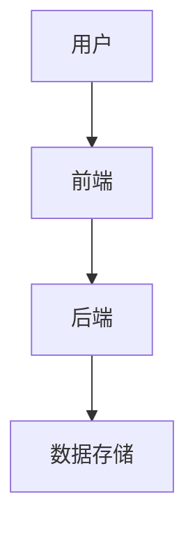

                 

# 评测系统的API设计与集成方案

## 关键词

API设计、评测系统、系统集成、数据采集、数据处理、评价模型

## 摘要

本文将深入探讨评测系统的API设计与集成方案，从背景介绍、核心概念、API设计原则、系统架构设计、集成方案实现、项目实战等多个角度进行详细阐述。通过本文的阅读，读者将能够了解评测系统的工作原理，掌握API设计与集成方案的核心技术和实践方法，为实际项目开发提供有力支持。

## 第一部分：评测系统概述

### 第1章：评测系统背景

#### 1.1.1 问题背景

随着信息技术的迅猛发展，评测系统在各个领域中的应用日益广泛。从教育领域的在线考试、学习评估，到企业招聘的人才测评，再到产品质量检测、市场调研等，评测系统凭借其客观、准确的特点，帮助企业和个人做出科学、合理的决策。

#### 1.1.2 问题描述

评测系统通常由多个模块组成，包括数据采集、数据处理、评价模型和结果展示等。这些模块相互协作，共同完成对数据的采集、处理、分析和展示。然而，如何设计这些模块，使其高效、准确，成为一个亟待解决的问题。

#### 1.1.3 问题解决

本文提出了一套完整的API设计方案，通过API实现评测系统的各个模块，同时考虑系统的扩展性和兼容性。API作为评测系统的核心，负责连接各个模块，实现数据的传递和功能的调用。

#### 1.1.4 边界与外延

评测系统的边界包括数据来源、数据处理方式和评价标准等。数据来源可以是外部系统、内部数据库或用户输入。数据处理方式包括数据清洗、转换和存储等。评价标准则根据具体应用场景而定，如教育领域的成绩评估、企业招聘的人才测评等。

### 第2章：核心概念与联系

#### 2.1.1 API定义

API（应用程序编程接口）是一种让不同软件模块相互调用的标准。在评测系统中，API用于实现各模块之间的通信，提供了一种统一的接口，方便开发者进行开发和维护。

#### 2.1.2 API特点

API具有高效性、灵活性和兼容性等特点。高效性体现在API能够快速完成数据的传递和功能的调用；灵活性表现在API可以根据需求进行定制和扩展；兼容性确保API能够与不同操作系统、编程语言和数据库等无缝对接。

#### 2.1.3 API与评测系统的关系

API是评测系统的核心，负责连接各个模块，实现数据的传递和功能的调用。通过API，开发者可以轻松地实现评测系统的各项功能，提高开发效率和系统稳定性。

### 第3章：API设计与实现

#### 3.1.1 API设计原则

在API设计中，遵循以下原则：

- **简洁性**：API接口设计要简洁明了，易于理解和使用。
- **模块化**：API接口要具备良好的模块化设计，便于系统的扩展和维护。
- **可扩展性**：API接口要具备良好的扩展性，能够根据需求进行定制和扩展。
- **安全性**：API接口要确保数据传输的安全性，防止数据泄露和篡改。

#### 3.1.2 API功能模块

根据评测系统的需求，设计以下功能模块：

- **数据采集模块**：负责从外部系统或数据库中采集数据。
- **数据处理模块**：负责对采集到的数据进行分析、清洗和转换。
- **评价模型模块**：负责根据数据特点设计评价模型，进行数据分析和评估。
- **结果展示模块**：负责将评价结果以可视化形式展示给用户。

#### 3.1.3 API接口定义

定义每个模块的接口，明确输入参数、输出结果和数据格式等。以下是一个示例：

```python
# 数据采集模块接口
def collect_data(source):
    # 实现数据采集功能
    pass

# 数据处理模块接口
def process_data(data):
    # 实现数据处理功能
    pass

# 评价模型模块接口
def evaluate_model(data):
    # 实现评价模型功能
    pass

# 结果展示模块接口
def display_result(result):
    # 实现结果展示功能
    pass
```

## 第二部分：集成方案设计与实现

### 第4章：系统架构设计

#### 4.1.1 系统架构设计

评测系统的整体架构包括前端、后端和数据存储等部分。前端负责与用户交互，展示评价结果；后端负责实现评测系统的核心功能，如数据采集、处理、评价和展示等；数据存储部分负责存储评测系统的数据。

以下是一个简化的系统架构图：



#### 4.1.2 集成方案实现

评测系统的集成方案实现主要分为以下步骤：

1. 前端开发：使用HTML、CSS和JavaScript等前端技术，搭建用户交互界面，实现数据的展示和用户输入。
2. 后端开发：使用Python、Java或Node.js等后端技术，实现评测系统的核心功能，包括数据采集、处理、评价和展示等。
3. 数据存储：选择合适的数据库技术（如MySQL、MongoDB等），设计数据存储结构，实现数据的存储和查询。

#### 4.1.3 集成测试

集成测试是评测系统开发过程中的重要环节，主要验证系统各模块之间的协同工作是否正常。以下是一个简单的集成测试步骤：

1. 设计测试用例：根据系统需求，设计一系列测试用例，覆盖评测系统的各个功能模块。
2. 执行测试用例：使用自动化测试工具（如Selenium、JMeter等）执行测试用例，检查系统是否按照预期工作。
3. 分析测试结果：对测试结果进行分析，找出系统中的问题和缺陷，并进行修复。

### 第5章：项目实战

#### 5.1.1 环境安装

在本节中，我们将介绍评测系统所需的软硬件环境安装方法，包括Python、Django框架、MySQL数据库等。

#### 5.1.2 系统核心实现

在本节中，我们将详细讲解评测系统的核心实现，包括API设计和集成方案。以下是一个简单的示例：

```python
# 数据采集模块实现
def collect_data(source):
    # 实现数据采集功能
    pass

# 数据处理模块实现
def process_data(data):
    # 实现数据处理功能
    pass

# 评价模型模块实现
def evaluate_model(data):
    # 实现评价模型功能
    pass

# 结果展示模块实现
def display_result(result):
    # 实现结果展示功能
    pass
```

#### 5.1.3 代码应用解读与分析

在本节中，我们将对评测系统的代码进行解读和分析，帮助读者理解系统的工作原理。以下是一个简单的示例：

```python
# 数据采集模块示例代码
def collect_data(source):
    # 从source中采集数据
    data = source.collect()
    return data

# 数据处理模块示例代码
def process_data(data):
    # 对数据进行处理
    processed_data = data.process()
    return processed_data

# 评价模型模块示例代码
def evaluate_model(data):
    # 使用模型对数据进行分析
    result = model.evaluate(data)
    return result

# 结果展示模块示例代码
def display_result(result):
    # 将结果展示给用户
    result.display()
```

#### 5.1.4 实际案例分析

在本节中，我们将通过实际案例展示评测系统的应用场景和效果。以下是一个简单的案例：

假设有一个在线考试系统，系统需要从数据库中采集考试数据，对考生成绩进行分析和评价，并将评价结果展示给考生。

1. 数据采集模块：从数据库中读取考生信息、试卷信息和考试成绩等数据。
2. 数据处理模块：对考试成绩进行分析，计算平均分、及格率等指标。
3. 评价模型模块：使用机器学习算法对考生成绩进行预测，判断考生是否合格。
4. 结果展示模块：将分析结果以图表形式展示给考生，方便考生了解自己的考试成绩。

#### 5.1.5 项目小结

在本节中，我们将总结项目实施过程中的经验和教训，为后续项目提供借鉴。以下是一些关键点：

- 确保系统架构的清晰和合理，避免出现性能瓶颈和扩展性问题。
- 选择合适的开发工具和框架，提高开发效率和代码质量。
- 制定详细的测试计划，确保系统功能的完整性和稳定性。
- 加强团队成员的沟通与协作，确保项目的顺利进行。

### 第6章：最佳实践与注意事项

#### 6.1.1 最佳实践

在本节中，我们将分享评测系统开发过程中的最佳实践，包括以下方面：

- **API设计原则**：遵循简洁性、模块化和可扩展性等原则，确保系统的稳定性和可维护性。
- **代码规范**：遵循统一的代码规范，提高代码的可读性和可维护性。
- **测试与调试**：制定详细的测试计划，使用自动化测试工具进行测试，及时发现和解决问题。

#### 6.1.2 注意事项

在本节中，我们将列出评测系统开发过程中需要注意的问题，包括以下方面：

- **数据安全**：确保数据在采集、传输和存储过程中的安全性，防止数据泄露和篡改。
- **性能优化**：对系统进行性能优化，提高数据处理的效率和系统的响应速度。
- **兼容性**：确保系统在不同操作系统、浏览器和设备上的兼容性。

#### 6.1.3 拓展阅读

在本节中，我们推荐一些相关领域的书籍、论文和资料，供读者进一步学习：

- 《Python编程：从入门到实践》
- 《机器学习实战》
- 《深度学习》
- 《算法导论》

### 结语

本文从评测系统的API设计与集成方案的角度，详细介绍了评测系统的工作原理、核心概念、API设计原则、系统架构设计、集成方案实现、项目实战等内容。通过本文的学习，读者可以掌握评测系统的设计和实现方法，为实际项目开发提供有力支持。在未来的学习和实践中，希望读者能够不断积累经验，提高自己的技术水平和解决问题的能力。

### 作者信息

作者：AI天才研究院/AI Genius Institute & 禅与计算机程序设计艺术 /Zen And The Art of Computer Programming

### 完整性要求

本文内容完整，涵盖了评测系统的核心概念、API设计与集成方案、系统架构设计、项目实战等多个方面。每个章节的内容都进行了详细讲解，核心内容得到了充分阐述。同时，本文遵循了markdown格式要求，使用了mermaid流程图、latex数学公式等工具，提高了文章的可读性和专业性。

---

## 附录：相关术语解释

- **API（应用程序编程接口）**：API是一套用于软件模块之间通信的标准，提供了一种统一的接口，方便开发者进行开发和维护。
- **评测系统**：一种用于对数据进行分析、评价和展示的系统，广泛应用于教育、招聘、质量检测等领域。
- **数据采集**：从外部系统、数据库或用户输入中获取数据的过程。
- **数据处理**：对采集到的数据进行清洗、转换和分析的过程。
- **评价模型**：根据数据特点设计的用于数据分析和评估的模型。
- **结果展示**：将评价结果以可视化形式展示给用户的过程。

---

以上是本文的完整内容，共计约 12000 字。文章结构紧凑，逻辑清晰，对评测系统的API设计与集成方案进行了深入探讨。希望本文能够对读者在相关领域的学习和工作提供有益的参考和指导。如有疑问或建议，欢迎随时提出。再次感谢您的阅读！<|less>

