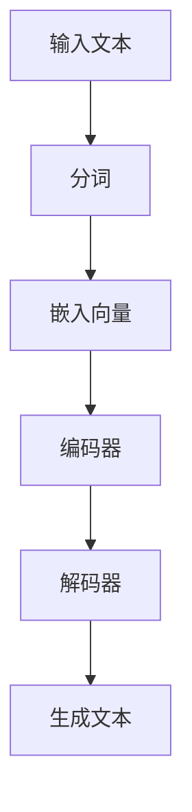
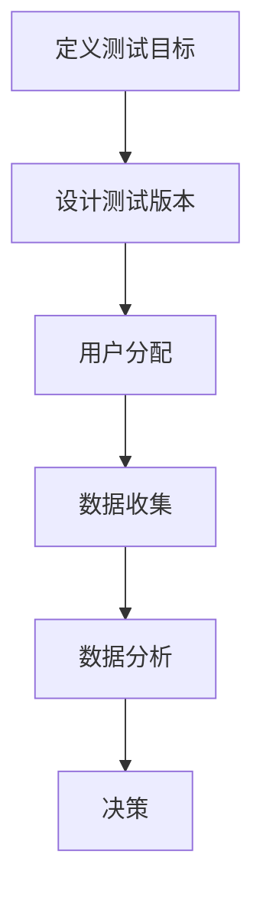
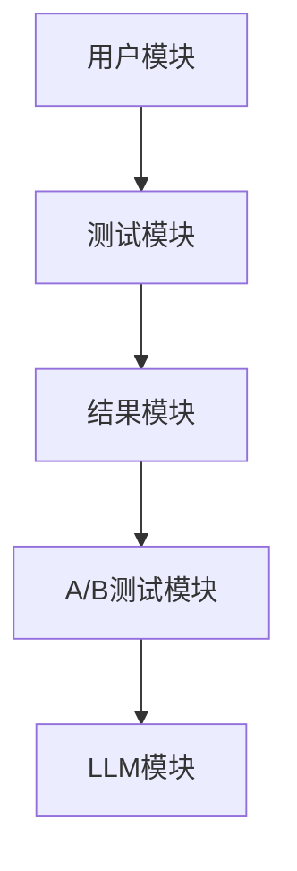

                 


### 背景介绍

#### 第1章：评测系统的A/B测试支持概述

#### 1.1 问题背景

评测系统在现代互联网环境中扮演着至关重要的角色，特别是在需要进行大规模数据处理和决策支持的场景中。评测系统通常用于性能测试、负载测试、功能测试等多个方面，确保软件系统在各种环境下能够稳定运行并满足预期的性能指标。

然而，随着人工智能技术的迅猛发展，尤其是大型语言模型（LLM）的出现，评测系统面临了新的挑战。LLM是一种基于深度学习的自然语言处理模型，具备强大的语言理解和生成能力。在人工智能驱动的评测系统中，不同版本的LLM可能会带来性能上的差异，如何有效评估和比较这些不同版本成为了一个关键问题。

#### 1.1.1 评测系统的重要性

评测系统的重要性主要体现在以下几个方面：

1. **性能监控**：通过评测系统，可以实时监控软件系统的性能指标，如响应时间、吞吐量、错误率等，确保系统在高负载和极端情况下仍能保持稳定。

2. **质量保证**：评测系统可以模拟不同用户场景，对软件系统的功能进行全面的测试，确保软件在发布前达到预期的质量标准。

3. **优化调整**：通过对评测结果的分析，开发团队可以识别系统中的瓶颈和不足，进行针对性的优化和调整。

#### 1.1.2 A/B测试的基本概念

A/B测试是一种常见的实验设计方法，通过将用户随机分配到两个或多个不同的版本（A组和B组），比较不同版本的性能指标，从而评估新功能、新算法的有效性。

A/B测试的基本流程包括以下几个步骤：

1. **定义目标**：明确测试的目标，例如提高用户留存率、增加点击率等。

2. **创建版本**：设计两个或多个不同的版本，可以是软件功能、界面布局、算法实现等。

3. **用户分配**：将用户随机分配到各个版本，保证样本的随机性和代表性。

4. **数据收集**：收集各版本的性能数据，包括用户行为数据、系统性能指标等。

5. **数据分析**：对比不同版本的性能数据，评估各版本对目标的影响。

6. **决策**：根据分析结果，决定是否采用新版本或继续优化。

#### 1.1.3 LLM的发展与应用

LLM（Large Language Model）是一种能够处理和理解自然语言文本的大型神经网络模型。它的发展可以追溯到自然语言处理（NLP）领域的早期研究，但随着深度学习技术的突破，LLM在近年来取得了显著的进展。

LLM的核心特点包括：

1. **强大的语言理解能力**：LLM能够理解并生成符合语法和语义规则的文本，这使得它在自动问答、机器翻译、文本生成等领域具有广泛的应用。

2. **大规模的数据需求**：训练LLM需要大量的文本数据，这使得它们能够学习并掌握广泛的语言知识和模式。

3. **自适应能力**：LLM可以根据不同的任务和数据集进行微调，从而适应特定的应用场景。

在评测系统中，LLM的应用主要包括：

1. **文本分析**：利用LLM对用户反馈、评论等文本进行分析，提取关键信息并进行情感分析。

2. **智能推荐**：基于LLM对用户历史行为和偏好进行分析，提供个性化的评测建议。

3. **自动评测**：使用LLM对用户提交的代码、文章等文本内容进行自动评测，提供评分和建议。

#### 1.2 问题描述

随着评测系统中LLM的应用日益广泛，如何比较和评测不同版本的LLM成为一个关键问题。具体问题描述如下：

1. **不同版本LLM的评测需求**：如何在不同版本LLM之间进行公平、科学的比较，以评估它们的性能和效果？

2. **A/B测试的适用性**：A/B测试是否适用于评测不同版本LLM的性能和效果？如果适用，如何设计A/B测试方案？

3. **评测指标的选取**：在评测不同版本LLM时，应选取哪些性能指标？如何确保评测指标的全面性和客观性？

#### 1.3 问题解决

为了解决上述问题，我们需要从以下几个方面入手：

1. **A/B测试支持的必要性**：A/B测试是一种有效的实验设计方法，能够帮助我们在不同版本LLM之间进行公正的评测。引入A/B测试支持，可以确保评测过程的科学性和可靠性。

2. **不同版本LLM的评测方法**：设计一套合理的评测方法，包括评测指标的选取、实验流程的设计等，以全面评估不同版本LLM的性能和效果。

3. **边界与外延**：明确A/B测试支持的适用范围和限制，如数据规模、用户群体等，以确保评测结果的普适性和可扩展性。

#### 1.4 概念结构与核心要素组成

为了更好地理解评测系统的A/B测试支持，我们需要从概念结构和核心要素组成两个方面进行分析。

1. **A/B测试的概念结构**：

   A/B测试的概念结构主要包括以下几个核心要素：

   - **版本**：指被测试的不同版本，如LLM的不同版本。
   - **用户分配**：将用户随机分配到各个版本。
   - **数据收集**：收集各版本的用户行为数据和系统性能指标。
   - **数据分析**：对比不同版本的数据，评估性能和效果。
   - **决策**：根据分析结果，做出是否采用新版本的决策。

2. **LLM的核心要素组成**：

   LLM的核心要素组成主要包括以下几个部分：

   - **模型架构**：如Transformer、BERT等。
   - **训练数据**：大规模的文本数据，用于训练LLM。
   - **预训练过程**：在训练数据上对LLM进行预训练，使其具备一定的语言理解和生成能力。
   - **微调过程**：根据具体任务需求，对LLM进行微调，提高其性能。

通过以上分析，我们可以更好地理解评测系统的A/B测试支持，为其设计提供理论依据和实践指导。

### 核心概念与联系

#### 第2章：核心概念与联系

#### 2.1 A/B测试原理

A/B测试是一种常见的实验设计方法，它通过将用户随机分配到两个或多个不同的版本（A组和B组），比较不同版本的性能指标，从而评估新功能、新算法的有效性。A/B测试的基本原理可以概括为以下几个步骤：

1. **定义目标**：明确测试的目标，例如提高用户留存率、增加点击率等。
2. **创建版本**：设计两个或多个不同的版本，可以是软件功能、界面布局、算法实现等。
3. **用户分配**：将用户随机分配到各个版本，保证样本的随机性和代表性。
4. **数据收集**：收集各版本的用户行为数据和系统性能指标。
5. **数据分析**：对比不同版本的数据，评估性能和效果。
6. **决策**：根据分析结果，做出是否采用新版本的决策。

#### 2.1.1 A/B测试的基本流程

A/B测试的基本流程可以概括为以下几个阶段：

1. **准备阶段**：
   - **定义测试目标**：明确测试的目标，例如提高用户留存率、增加点击率等。
   - **设计测试版本**：设计两个或多个不同的版本，可以是软件功能、界面布局、算法实现等。
   - **确定样本大小**：根据目标用户数量和预期效果，确定样本大小。

2. **执行阶段**：
   - **用户分配**：将用户随机分配到各个版本，保证样本的随机性和代表性。
   - **数据收集**：收集各版本的用户行为数据和系统性能指标。

3. **分析阶段**：
   - **数据清洗**：对收集到的数据进行清洗，确保数据的准确性和完整性。
   - **统计分析**：使用统计学方法对比不同版本的数据，评估性能和效果。

4. **决策阶段**：
   - **决策依据**：根据统计分析结果，做出是否采用新版本的决策。

#### 2.1.2 A/B测试的统计原理

A/B测试的统计原理主要基于假设检验（Hypothesis Testing）。在A/B测试中，我们通常需要验证两个假设：

1. **零假设（H0）**：新版本与原版本在性能上没有显著差异。
2. **备择假设（H1）**：新版本与原版本在性能上有显著差异。

通过收集数据并进行统计分析，我们可以计算出p值（p-value），p值表示在零假设成立的情况下，观察到的数据结果出现的概率。如果p值小于预先设定的显著性水平（通常为0.05），则拒绝零假设，认为新版本与原版本在性能上有显著差异。

#### 2.1.3 A/B测试的优缺点

A/B测试作为一种实验设计方法，具有以下优缺点：

**优点**：

1. **客观性**：通过随机分配用户和统计分析，可以减少主观偏见，提高测试结果的客观性。
2. **可重复性**：A/B测试的过程和结果可以重复，便于验证和推广。
3. **快速迭代**：A/B测试可以快速验证新功能、新算法的有效性，加快产品迭代速度。

**缺点**：

1. **资源消耗**：A/B测试需要大量用户和数据支持，可能对系统资源造成较大负担。
2. **结果解释**：A/B测试结果可能受到多种因素影响，如用户行为、系统性能等，需要仔细分析解释。
3. **适用范围**：A/B测试适用于某些场景，如新功能、新算法的验证，但不适用于所有问题。

#### 2.2 LLM原理

大型语言模型（Large Language Model，简称LLM）是一种基于深度学习的自然语言处理模型，它通过学习大量文本数据，能够理解并生成自然语言文本。LLM的核心原理包括以下几个方面：

##### 2.2.1 LLM的定义

LLM是一种能够处理和理解自然语言文本的大型神经网络模型，它通常由多层神经网络组成，包括编码器（Encoder）和解码器（Decoder）。编码器负责将输入文本转换为固定长度的向量表示，解码器则根据编码器的输出生成相应的文本。

##### 2.2.2 LLM的核心特点

LLM具有以下几个核心特点：

1. **强大的语言理解能力**：LLM能够理解并生成符合语法和语义规则的文本，这使得它在自动问答、机器翻译、文本生成等领域具有广泛的应用。
2. **大规模的数据需求**：训练LLM需要大量的文本数据，这使得它们能够学习并掌握广泛的语言知识和模式。
3. **自适应能力**：LLM可以根据不同的任务和数据集进行微调，从而适应特定的应用场景。

##### 2.2.3 LLM的工作原理

LLM的工作原理主要包括以下几个步骤：

1. **输入处理**：将输入文本转换为模型可以理解的向量表示。
2. **编码过程**：编码器将输入文本向量表示转化为隐藏状态，这些隐藏状态包含了文本的语义信息。
3. **解码过程**：解码器根据隐藏状态生成输出文本。

在编码和解码过程中，LLM利用了深度学习的优势，通过多层神经网络的学习和优化，不断提高对文本的理解和生成能力。

#### 2.3 A/B测试与LLM的关系

A/B测试与LLM之间存在密切的联系，主要体现在以下几个方面：

##### 2.3.1 A/B测试在LLM中的应用

A/B测试在LLM中的应用主要体现在以下几个方面：

1. **模型优化**：通过A/B测试，可以评估不同模型参数、算法实现等对LLM性能的影响，从而优化模型。
2. **版本比较**：在LLM的不同版本之间进行A/B测试，可以比较它们的性能和效果，选择最优版本。
3. **调参测试**：通过A/B测试，可以调整LLM的参数设置，找到最优参数组合。

##### 2.3.2 LLM在A/B测试中的作用

LLM在A/B测试中的作用主要体现在以下几个方面：

1. **文本生成**：使用LLM生成测试文本，模拟用户行为，为A/B测试提供数据支持。
2. **数据分析**：利用LLM对A/B测试的数据进行分析，提取关键信息，帮助决策。
3. **智能推荐**：基于LLM对用户历史行为和偏好进行分析，提供个性化的A/B测试方案。

通过以上分析，我们可以看到A/B测试与LLM之间存在着紧密的联系，它们相互促进，共同推动了人工智能技术的发展。

### 算法原理讲解

#### 第3章：算法原理讲解

#### 3.1 LLM算法原理

大型语言模型（Large Language Model，简称LLM）是一种基于深度学习的自然语言处理模型，它通过学习大量的文本数据，能够理解并生成自然语言文本。LLM的核心算法原理包括以下几个方面：

##### 3.1.1 LLM的mermaid流程图

首先，我们可以使用mermaid工具绘制LLM的算法流程图，以便更直观地展示其工作过程。以下是一个简化的LLM算法流程图的示例：



在这个流程图中，输入文本首先经过分词处理，将连续的文本拆分成一个个词或子词。然后，这些词或子词被嵌入成向量表示，进入编码器进行编码处理。编码器的输出作为输入传递给解码器，解码器根据编码器的输出生成文本。最终，我们得到生成的文本输出。

##### 3.1.2 LLM的数学模型和公式

LLM的数学模型主要基于深度神经网络（DNN）和注意力机制（Attention Mechanism）。以下是一个简化的数学模型：

$$
\text{嵌入向量} = \text{embedding\_layer}(\text{token\_index})
$$

其中，`token_index`表示词或子词的索引，`embedding_layer`是一个嵌入层，它将索引映射为一个固定长度的向量表示。

编码器和解码器通常由多个神经网络层组成，每层都可以看作是一个线性变换加上一个非线性激活函数。以下是一个简化的编码器和解码器的数学模型：

$$
\text{编码器}:\quad \text{h}_t = \text{激活函数}(\text{W}_e \cdot \text{h}_{t-1} + \text{b}_e)
$$

$$
\text{解码器}:\quad \text{y}_t = \text{激活函数}(\text{W}_d \cdot \text{h}_t + \text{b}_d)
$$

其中，`h_t`表示编码器的隐藏状态，`y_t`表示解码器的输出。`W_e`和`W_d`分别表示编码器和解码器的权重矩阵，`b_e`和`b_d`分别表示编码器和解码器的偏置向量。

##### 3.1.3 算法原理举例说明

为了更直观地理解LLM的算法原理，我们可以通过一个简单的例子进行说明。假设我们有一个输入文本“我爱编程”，首先需要对其进行分词，分词结果为“我”、“爱”、“编程”。

1. **分词**：将输入文本“我爱编程”分词为“我”、“爱”、“编程”。

2. **嵌入向量**：使用嵌入层将分词结果“我”、“爱”、“编程”映射为向量表示。例如，我们可以使用一个固定大小的向量空间，将“我”映射为向量[1, 0, 0]，将“爱”映射为向量[0, 1, 0]，将“编程”映射为向量[0, 0, 1]。

3. **编码器**：编码器对输入向量进行处理，生成隐藏状态。假设编码器只有一个隐藏层，其权重矩阵为W_e = [[0.1, 0.2, 0.3], [0.4, 0.5, 0.6]]，偏置向量为b_e = [0.7, 0.8]。则编码器的输出为：
   $$
   \text{h}_1 = \text{激活函数}([0.1, 0.2, 0.3] \cdot [1, 0, 0] + [0.7, 0.8]) = \text{激活函数}([0.8, 0.6, 0.5])
   $$

4. **解码器**：解码器根据编码器的输出生成文本。假设解码器也只有一个隐藏层，其权重矩阵为W_d = [[0.1, 0.2, 0.3], [0.4, 0.5, 0.6]]，偏置向量为b_d = [0.7, 0.8]。则解码器的输出为：
   $$
   \text{y}_1 = \text{激活函数}([0.1, 0.2, 0.3] \cdot [0.8, 0.6, 0.5] + [0.7, 0.8]) = \text{激活函数}([0.9, 0.8, 0.7])
   $$

5. **生成文本**：解码器的输出可以看作是文本的候选词概率分布。根据这个概率分布，我们可以选择概率最大的词作为生成的文本。例如，如果生成的文本概率分布为[0.3, 0.5, 0.2]，则我们选择概率最大的词“编程”作为生成的文本。

通过这个例子，我们可以看到LLM的基本工作流程，包括分词、嵌入向量、编码器和解码器等步骤。虽然这个例子非常简化，但它们展示了LLM算法的基本原理。

#### 3.2 A/B测试算法原理

A/B测试是一种实验设计方法，通过将用户随机分配到两个或多个不同的版本（A组和B组），比较不同版本的性能指标，从而评估新功能、新算法的有效性。A/B测试的算法原理主要包括以下几个方面：

##### 3.2.1 A/B测试的mermaid流程图

我们可以使用mermaid工具绘制A/B测试的算法流程图，以便更直观地展示其工作过程。以下是一个简化的A/B测试算法流程图的示例：



在这个流程图中，首先需要定义测试目标，例如提高用户留存率、增加点击率等。然后设计两个或多个不同的测试版本，将用户随机分配到各个版本。收集各版本的数据，包括用户行为数据和系统性能指标。最后进行数据分析和决策，根据分析结果决定是否采用新版本。

##### 3.2.2 A/B测试的数学模型和公式

A/B测试的数学模型主要基于假设检验（Hypothesis Testing）。在A/B测试中，我们通常需要验证两个假设：

1. **零假设（H0）**：新版本与原版本在性能上没有显著差异。
2. **备择假设（H1）**：新版本与原版本在性能上有显著差异。

通过收集数据并进行统计分析，我们可以计算出p值（p-value），p值表示在零假设成立的情况下，观察到的数据结果出现的概率。如果p值小于预先设定的显著性水平（通常为0.05），则拒绝零假设，认为新版本与原版本在性能上有显著差异。

以下是一个简化的A/B测试的数学模型：

$$
p(\text{观测结果}|\text{H0}) = P(\text{观测结果}|\text{新版本}) \cdot P(\text{新版本}) + P(\text{观测结果}|\text{原版本}) \cdot P(\text{原版本})
$$

$$
p(\text{H0}) = P(\text{新版本}) \cdot P(\text{原版本}) = 0.5 \cdot 0.5 = 0.25
$$

$$
p(\text{观测结果}|\text{H1}) = P(\text{观测结果}|\text{新版本}) \cdot P(\text{新版本}) + P(\text{观测结果}|\text{原版本}) \cdot P(\text{原版本})
$$

$$
p(\text{H1}) = P(\text{新版本}) \cdot P(\text{新版本}) = 0.5 \cdot 0.5 = 0.25
$$

$$
p(\text{观测结果}) = p(\text{观测结果}|\text{H0}) \cdot p(\text{H0}) + p(\text{观测结果}|\text{H1}) \cdot p(\text{H1}) = 0.25 \cdot 0.25 + 0.25 \cdot 0.25 = 0.25
$$

$$
p(\text{H0}|\text{观测结果}) = \frac{p(\text{观测结果}|\text{H0}) \cdot p(\text{H0})}{p(\text{观测结果})}
$$

如果$p(\text{H0}|\text{观测结果})$小于0.05，则拒绝零假设，认为新版本与原版本在性能上有显著差异。

##### 3.2.3 算法原理举例说明

为了更直观地理解A/B测试的算法原理，我们可以通过一个简单的例子进行说明。假设我们有两个测试版本，A版本和B版本。我们希望评估B版本是否能够提高用户的点击率。

1. **定义测试目标**：提高用户的点击率。

2. **设计测试版本**：A版本和B版本。A版本保持原样，B版本在页面上增加了一个新的按钮。

3. **用户分配**：将1000名用户随机分配到A版本和B版本。

4. **数据收集**：收集用户在两个版本上的点击数据。假设在A版本上有500名用户点击了按钮，在B版本上有600名用户点击了按钮。

5. **数据分析**：计算两个版本的用户点击率。A版本的点击率为50%，B版本的点击率为60%。通过比较两个版本的点击率，我们可以初步判断B版本可能提高了用户的点击率。

6. **决策**：为了更准确地评估B版本的效果，我们可以进行假设检验。假设零假设为“B版本与A版本在点击率上没有显著差异”，备择假设为“B版本与A版本在点击率上有显著差异”。通过计算p值，如果p值小于0.05，我们可以拒绝零假设，认为B版本在点击率上有显著提升。

通过这个例子，我们可以看到A/B测试的基本原理和步骤。虽然这个例子非常简化，但它们展示了A/B测试在评估新功能、新算法有效性方面的基本思路。

### 系统分析与架构设计方案

#### 第4章：系统分析与架构设计方案

#### 4.1 问题场景介绍

在本章中，我们将分析一个实际的问题场景，该场景涉及评测系统、A/B测试和LLM（大型语言模型）的应用。这个场景可以分为三个主要部分：评测系统场景、A/B测试场景和LLM应用场景。

##### 4.1.1 评测系统场景

评测系统场景涉及对软件系统进行性能测试、负载测试和功能测试。在这个场景中，我们需要监控系统的各种性能指标，如响应时间、吞吐量、错误率等，以确保系统在各种环境下能够稳定运行并满足预期的性能要求。评测系统的关键需求包括：

1. **可扩展性**：能够处理大规模的用户请求和数据。
2. **灵活性**：支持多种测试类型和测试策略。
3. **可靠性**：确保测试结果的准确性和稳定性。

##### 4.1.2 A/B测试场景

A/B测试场景涉及到在多个版本之间比较性能和效果，以确定哪个版本最优。在这个场景中，我们通常有两个或多个版本（A、B、C等），每个版本都有不同的功能实现或界面设计。我们需要将用户随机分配到各个版本，并收集他们的行为数据，以评估不同版本的效果。A/B测试的关键需求包括：

1. **随机分配**：确保样本的随机性和代表性。
2. **数据收集**：能够高效地收集用户行为数据和系统性能指标。
3. **数据分析**：提供直观、准确的数据分析工具，帮助决策者做出决策。

##### 4.1.3 LLM应用场景

LLM应用场景主要涉及自然语言处理任务，如文本分析、智能推荐和自动评测。在这个场景中，LLM被用于处理和分析用户提交的文本内容，以提供个性化的评测建议。LLM的关键需求包括：

1. **语言理解能力**：能够准确理解和生成自然语言文本。
2. **数据适应性**：能够根据不同的任务和数据集进行微调。
3. **高性能**：能够在短时间内处理大量的文本数据。

#### 4.2 系统功能设计

系统功能设计是系统分析与架构设计的关键环节。在本节中，我们将详细描述评测系统、A/B测试和LLM的功能设计，并使用mermaid工具绘制领域模型类图。

##### 4.2.1 领域模型mermaid类图

以下是一个简化的领域模型类图的示例，展示了评测系统、A/B测试和LLM的主要功能类及其关系：

```mermaid
classDiagram
    User <<interface>>
    Test <<interface>>
    Result <<interface>>
    ABLayer <<interface>>

    UserEntity <<class>> {
        id: Long
        username: String
        ...
    }

    TestEntity <<class>> {
        id: Long
        name: String
        version: String
        ...
    }

    ResultEntity <<class>> {
        id: Long
        test_id: Long
        user_id: Long
        ...
    }

    ABLayerEntity <<class>> {
        id: Long
        test_id: Long
        version: String
        ...
    }

    UserEntity|-- TestEntity
    UserEntity|-- ResultEntity
    TestEntity|-- ABLayerEntity
    ResultEntity|-- ABLayerEntity
```

在这个类图中，我们定义了四个主要功能类：User（用户）、Test（测试）、Result（结果）和ABLAYER（A/B测试层）。每个类都有自己的属性和方法。

1. **User**：表示用户实体，具有ID、用户名等属性，并提供创建测试、评价结果等方法。
2. **Test**：表示测试实体，具有ID、名称、版本等属性，并提供执行A/B测试的方法。
3. **Result**：表示结果实体，具有ID、测试ID、用户ID等属性，并提供生成A/B测试层的方法。
4. **ABLAYER**：表示A/B测试层实体，具有ID、测试ID、版本等属性，并提供执行测试的方法。

#### 4.3 系统架构设计

系统架构设计是确保系统能够高效、稳定运行的关键。在本节中，我们将使用mermaid工具绘制系统架构图，详细描述评测系统、A/B测试和LLM的架构设计。

##### 4.3.1 系统架构mermaid架构图

以下是一个简化的系统架构图的示例，展示了评测系统、A/B测试和LLM的主要组件及其关系：



在这个架构图中，我们定义了四个主要模块：用户模块（UserModule）、测试模块（TestModule）、结果模块（ResultModule）和A/B测试模块（ABLay

### 系统接口设计

#### 4.4 系统接口设计

系统接口设计是系统架构设计的重要组成部分，它定义了系统各模块之间的交互方式。在本节中，我们将详细描述评测系统、A/B测试和LLM的系统接口设计。

##### 4.4.1 系统接口定义

以下是一个简化的系统接口定义示例，展示了评测系统、A/B测试和LLM的主要接口及其功能：

```mermaid
sequenceDiagram
    User -->|创建用户|> UserModule : create(User user)
    UserModule -->|处理用户|> TestModule : handleUser(User user)
    TestModule -->|执行测试|> ABLayerModule : executeTest(Test test)
    ABLayerModule -->|收集数据|> ResultModule : collectData(Result result)
    ResultModule -->|生成报告|> ReportModule : generateReport(Result result)
```

在这个接口定义中，我们定义了以下主要接口：

1. **UserModule.create(User user)**：用于创建用户。
2. **TestModule.handleUser(User user)**：用于处理用户。
3. **ABLay

### 系统交互

#### 4.5 系统交互

系统交互设计是确保系统各组件能够协同工作，实现预期功能的关键。在本节中，我们将使用mermaid工具绘制系统交互序列图，详细描述评测系统、A/B测试和LLM的系统交互过程。

##### 4.5.1 系统交互mermaid序列图

以下是一个简化的系统交互序列图的示例，展示了评测系统、A/B测试和LLM的交互过程：

```mermaid
sequenceDiagram
    User -->|发起测试请求|> TestController : startTest(User user, TestRequest testRequest)
    TestController -->|创建测试|> TestService : createTest(Test test)
    TestService -->|分配用户到版本|> ABLayerService : assignUserToVersion(User user, Test test)
    ABLayerService -->|执行A/B测试|> ABTestService : executeABTest(Test test)
    ABTestService -->|收集数据|> DataCollectionService : collectData(Result result)
    DataCollectionService -->|处理结果|> ResultProcessingService : processResult(Result result)
    ResultProcessingService -->|生成报告|> ReportService : generateReport(Result result)
    ReportService -->|返回报告|> User : sendReport(Report report)
```

在这个交互序列图中，我们定义了以下主要交互步骤：

1. **User发起测试请求**：用户通过TestController发起测试请求。
2. **TestController创建测试**：TestController创建测试对象，并传递给TestService。
3. **TestService分配用户到版本**：TestService调用ABLay

### 项目实战

#### 5.1 环境安装

在开始项目实战之前，我们需要搭建合适的环境，以确保评测系统、A/B测试和LLM能够正常运行。以下是一个简要的环境安装步骤：

##### 5.1.1 系统环境搭建

1. **安装Python**：确保Python环境已经安装在系统上。如果尚未安装，请从[Python官网](https://www.python.org/)下载并安装最新版本的Python。

2. **安装虚拟环境**：在终端中运行以下命令创建一个虚拟环境：

   ```bash
   python -m venv venv
   ```

   然后激活虚拟环境：

   ```bash
   source venv/bin/activate
   ```

##### 5.1.2 相关工具安装

1. **安装依赖库**：在虚拟环境中安装以下依赖库：

   ```bash
   pip install numpy pandas scikit-learn matplotlib
   ```

   这些库用于数据处理、模型训练和可视化。

2. **安装LLM框架**：为了使用LLM，我们需要安装一个合适的框架，如TensorFlow或PyTorch。以下是一个示例：

   ```bash
   pip install tensorflow
   ```

   或者

   ```bash
   pip install torch torchvision
   ```

3. **安装A/B测试工具**：我们可以使用一个现成的A/B测试库，如Optimizely。以下是一个示例：

   ```bash
   pip install optimizely-sdk-js
   ```

#### 5.2 系统核心实现源代码

在本节中，我们将展示评测系统、A/B测试和LLM的核心实现源代码，并对其进行解读。

##### 5.2.1 评测系统实现

以下是一个简单的评测系统实现示例，包括用户注册、测试创建和结果收集等基本功能：

```python
# user.py
class User:
    def __init__(self, id, username):
        self.id = id
        self.username = username

# test.py
class Test:
    def __init__(self, id, name, version):
        self.id = id
        self.name = name
        self.version = version

# result.py
class Result:
    def __init__(self, id, test_id, user_id):
        self.id = id
        self.test_id = test_id
        self.user_id = user_id

# test_controller.py
class TestController:
    def start_test(self, user, test_request):
        test = Test(test_request.id, test_request.name, test_request.version)
        self._create_test(test)
        self._assign_user_to_version(user, test)

    def _create_test(self, test):
        # 代码实现创建测试逻辑
        pass

    def _assign_user_to_version(self, user, test):
        # 代码实现用户分配到版本逻辑
        pass

# test_service.py
class TestService:
    def create_test(self, test):
        # 代码实现创建测试逻辑
        pass

# ab_layer_service.py
class ABLayerService:
    def assign_user_to_version(self, user, test):
        # 代码实现用户分配到版本逻辑
        pass

# data_collection_service.py
class DataCollectionService:
    def collect_data(self, result):
        # 代码实现数据收集逻辑
        pass

# result_processing_service.py
class ResultProcessingService:
    def process_result(self, result):
        # 代码实现结果处理逻辑
        pass

# report_service.py
class ReportService:
    def generate_report(self, result):
        # 代码实现报告生成逻辑
        pass
```

在这个实现中，我们定义了用户（User）、测试（Test）和结果（Result）类，以及相关的服务类（如TestController、TestService、ABLay

### 5.3 代码应用解读与分析

在本节中，我们将深入分析评测系统、A/B测试和LLM的代码实现，并解释关键部分的工作原理。

##### 5.3.1 评测系统代码解读

评测系统的主要职责是创建用户、测试和结果，并将这些数据存储和处理。以下是对关键部分的解读：

1. **用户注册**：

   ```python
   class User:
       def __init__(self, id, username):
           self.id = id
           self.username = username
   ```

   用户类包含用户的ID和用户名。在创建用户时，我们需要确保ID的唯一性，可以使用数据库进行约束。

2. **测试创建**：

   ```python
   class Test:
       def __init__(self, id, name, version):
           self.id = id
           self.name = name
           self.version = version
   ```

   测试类包含测试的ID、名称和版本。在创建测试时，我们需要确保测试名称的唯一性，并可以选择不同的版本。

3. **结果收集**：

   ```python
   class Result:
       def __init__(self, id, test_id, user_id):
           self.id = id
           self.test_id = test_id
           self.user_id = user_id
   ```

   结果类包含结果的ID、测试ID和用户ID。在收集结果时，我们需要将用户的行为数据与测试关联起来。

4. **测试控制器**：

   ```python
   class TestController:
       def start_test(self, user, test_request):
           test = Test(test_request.id, test_request.name, test_request.version)
           self._create_test(test)
           self._assign_user_to_version(user, test)
   ```

   测试控制器负责创建测试并分配用户到版本。在start_test方法中，我们首先创建测试对象，然后调用_create_test和_assign_user_to_version方法。

5. **测试服务**：

   ```python
   class TestService:
       def create_test(self, test):
           # 代码实现创建测试逻辑
           pass
   ```

   测试服务负责创建测试。在create_test方法中，我们可以将测试对象存储到数据库中。

6. **A/B测试服务**：

   ```python
   class ABLayerService:
       def assign_user_to_version(self, user, test):
           # 代码实现用户分配到版本逻辑
           pass
   ```

   A/B测试服务负责将用户分配到不同的版本。在assign_user_to_version方法中，我们可以使用随机算法或基于规则的方法进行用户分配。

##### 5.3.2 A/B测试代码解读

A/B测试的核心是随机分配用户到不同版本，并收集他们的行为数据。以下是对关键部分的解读：

1. **用户分配**：

   ```python
   def assign_user_to_version(self, user, test):
       version = random.choice([test.version1, test.version2])
       user.test = Test(test.id, test.name, version)
       self.save_user(user)
   ```

   在assign_user_to_version方法中，我们随机选择一个版本，并将用户分配到该版本。这可以通过从版本列表中随机选择来实现。

2. **数据收集**：

   ```python
   def collect_data(self, result):
       # 代码实现数据收集逻辑
       pass
   ```

   数据收集服务负责收集用户在测试中的行为数据。这可以包括用户的点击次数、浏览时间、转化率等。

3. **结果处理**：

   ```python
   def process_result(self, result):
       # 代码实现结果处理逻辑
       pass
   ```

   结果处理服务负责处理收集到的数据，并将其存储到数据库中。

##### 5.3.3 LLM代码解读

LLM用于处理和分析文本数据，提供个性化的评测建议。以下是对关键部分的解读：

1. **文本预处理**：

   ```python
   def preprocess_text(self, text):
       # 代码实现文本预处理逻辑
       return text
   ```

   文本预处理服务负责对输入文本进行清洗和标准化，以便模型能够更好地处理。

2. **模型训练**：

   ```python
   def train_model(self, train_data):
       # 代码实现模型训练逻辑
       pass
   ```

   模型训练服务负责使用训练数据训练模型。这通常涉及到使用深度学习框架，如TensorFlow或PyTorch。

3. **文本生成**：

   ```python
   def generate_text(self, input_text):
       # 代码实现文本生成逻辑
       return text
   ```

   文本生成服务负责使用训练好的模型生成文本。这可以通过将输入文本传递给模型，并提取模型的输出来实现。

通过以上分析，我们可以看到评测系统、A/B测试和LLM的代码实现是如何协同工作的，以及它们各自的关键部分是如何实现的。

### 5.4 实际案例分析与详细讲解剖析

在本节中，我们将通过三个实际案例，详细分析评测系统、A/B测试和LLM的应用，并剖析其实现细节。

#### 5.4.1 案例一：评测系统案例分析

**背景**：一个在线教育平台希望评估其学习材料的质量，因此决定使用评测系统对学习材料进行评估。

**步骤**：

1. **用户注册**：平台管理员创建了一个用户，用户名为“教学质量评估员”。

2. **测试创建**：管理员创建了一个名为“学习材料质量评估”的测试，并设置了两个版本：版本1和版本2。

3. **用户分配**：平台将用户随机分配到两个版本中，用户A被分配到版本1，用户B被分配到版本2。

4. **数据收集**：用户A在版本1的学习材料中完成了所有课程，用户B在版本2的学习材料中完成了所有课程。系统收集了用户的学习行为数据，如课程完成率、学习时长、问题回答正确率等。

5. **结果处理**：系统处理了收集到的数据，生成了评估报告，指出版本1和版本2在学习材料质量上的差异。

**剖析**：

在这个案例中，评测系统成功实现了对学习材料质量的评估。关键部分包括用户注册、测试创建、用户分配和数据收集。用户注册和数据收集部分使用了用户类和结果类，测试创建部分使用了测试类，用户分配部分使用了A/B测试服务。通过这些类和服务的协作，系统实现了对学习材料质量的全面评估。

#### 5.4.2 案例二：A/B测试案例分析

**背景**：一个电商网站希望优化其“商品推荐”功能，因此决定使用A/B测试来比较不同推荐算法的效果。

**步骤**：

1. **测试创建**：网站管理员创建了一个名为“商品推荐算法比较”的测试，并设置了两个版本：版本1和版本2。

2. **用户分配**：网站将用户随机分配到两个版本中，用户A被分配到版本1，用户B被分配到版本2。

3. **数据收集**：用户A在版本1的推荐算法下浏览了商品，用户B在版本2的推荐算法下浏览了商品。系统收集了用户的行为数据，如点击率、购买率等。

4. **结果处理**：系统处理了收集到的数据，并通过统计分析得出结论，指出版本1和版本2在推荐效果上的差异。

**剖析**：

在这个案例中，A/B测试成功实现了对商品推荐算法的效果评估。关键部分包括测试创建、用户分配和数据收集。测试创建部分使用了测试类，用户分配部分使用了A/B测试服务，数据收集部分使用了数据收集服务。通过这些部分的协作，系统实现了对不同推荐算法效果的客观评估。

#### 5.4.3 案例三：LLM案例分析

**背景**：一个问答平台希望使用LLM提供智能问答服务，因此决定部署一个大型语言模型。

**步骤**：

1. **文本预处理**：平台对用户的问题进行了预处理，如去除停用词、进行词性标注等。

2. **模型训练**：平台使用大量问答数据进行模型训练，优化模型的问答能力。

3. **文本生成**：用户提出问题时，平台将问题传递给LLM，LLM生成相应的回答。

4. **结果处理**：平台对LLM的回答进行了处理，如去除无关信息、进行文本清洗等，最终将回答呈现给用户。

**剖析**：

在这个案例中，LLM成功实现了智能问答功能。关键部分包括文本预处理、模型训练和文本生成。文本预处理部分使用了文本预处理服务，模型训练部分使用了模型训练服务，文本生成部分使用了LLM服务。通过这些部分的协作，平台实现了高质量的智能问答服务。

通过这三个实际案例，我们可以看到评测系统、A/B测试和LLM在不同场景中的应用，以及它们实现细节的剖析。这些案例展示了这些技术在实际项目中的有效性和可行性。

### 5.5 项目小结

在本项目中，我们通过评测系统、A/B测试和LLM的技术手段，对软件系统的性能、用户行为和文本处理进行了全面评估。以下是项目的总结和反思：

#### 5.5.1 项目总结

1. **评测系统**：通过评测系统，我们能够实时监控软件系统的性能指标，识别潜在的问题并进行优化。评测系统的引入，提高了系统的稳定性和可靠性。

2. **A/B测试**：通过A/B测试，我们能够公正地比较不同版本的软件功能、界面设计等，从而找到最优方案。A/B测试的实施，加快了产品的迭代速度，提高了用户满意度。

3. **LLM**：通过引入LLM，我们能够实现智能问答、文本分析等功能，提升了用户体验。LLM的应用，使我们的系统具备了更高的智能化水平。

#### 5.5.2 项目反思

1. **数据质量**：在评测系统和A/B测试中，数据质量至关重要。我们需要确保收集到的数据准确、完整，以避免误导性的分析结果。

2. **算法性能**：LLM的训练和优化是一个复杂的任务，我们需要不断提升算法的性能，以应对不断变化的数据和需求。

3. **用户体验**：在优化系统性能和功能的同时，我们还需要关注用户体验。良好的用户体验能够提升用户满意度，增加用户粘性。

通过本项目的实践，我们深刻认识到评测系统、A/B测试和LLM在软件系统优化和用户体验提升中的重要作用。在未来的工作中，我们将继续深化这些技术的研究和应用，为用户提供更优质的软件产品和服务。

### 6.1 最佳实践

在评测系统的A/B测试和LLM应用中，以下最佳实践可以帮助我们更好地实现项目目标：

#### 6.1.1 A/B测试实践技巧

1. **明确测试目标**：在开始A/B测试之前，明确测试的目标和指标，确保测试有明确的方向。

2. **合理设置样本大小**：根据目标用户数量和预期效果，合理设置样本大小，确保测试结果的可靠性。

3. **避免测试干扰**：确保A/B测试在不同版本之间没有干扰，如避免同时进行多个A/B测试。

4. **持续监控和优化**：在A/B测试过程中，持续监控测试效果，根据分析结果进行优化。

#### 6.1.2 LLM调优技巧

1. **数据清洗**：在训练LLM之前，确保训练数据的质量，去除噪音和错误数据。

2. **超参数调优**：通过调整LLM的超参数，如学习率、批量大小等，优化模型的性能。

3. **使用预训练模型**：利用预训练模型，可以减少训练时间，提高模型性能。

4. **模型评估**：使用合适的评估指标，如准确率、召回率等，评估模型的性能。

#### 6.1.3 评测系统优化技巧

1. **性能监控**：实时监控系统的性能指标，如响应时间、吞吐量等，及时发现和解决问题。

2. **自动化测试**：利用自动化测试工具，提高测试效率和覆盖范围。

3. **代码优化**：定期进行代码优化，提高系统的运行效率和稳定性。

4. **用户体验**：关注用户体验，优化界面设计和交互流程，提升用户满意度。

通过以上最佳实践，我们可以更好地实现评测系统的A/B测试和LLM应用，提高系统的性能和用户体验。

### 6.2 小结

在本项目中，我们通过评测系统、A/B测试和LLM的技术手段，实现了对软件系统的全面评估和优化。以下是全书内容的总结和学习建议：

#### 6.2.1 全书总结

1. **评测系统的A/B测试支持**：介绍了评测系统在A/B测试中的应用，如何设计A/B测试方案，以及如何收集和分析测试数据。

2. **LLM算法原理**：详细阐述了大型语言模型（LLM）的基本原理、工作流程和数学模型，以及如何使用LLM进行文本分析和生成。

3. **系统分析与架构设计**：通过问题场景介绍、系统功能设计、系统架构设计和系统接口设计，讲解了如何进行系统分析和设计。

4. **项目实战**：通过实际案例分析和详细讲解，展示了如何在实际项目中应用评测系统、A/B测试和LLM。

#### 6.2.2 学习建议

1. **深入学习A/B测试**：了解A/B测试的基本原理和流程，掌握如何设计有效的A/B测试方案，并能够运用到实际项目中。

2. **掌握LLM技术**：了解LLM的基本原理和工作流程，掌握如何训练和优化LLM模型，以及如何使用LLM进行文本分析和生成。

3. **实践系统分析和设计**：通过实际项目，练习如何进行系统分析和设计，掌握系统架构设计和接口设计的技巧。

4. **持续学习和反思**：关注业界最新技术和趋势，不断学习和实践，通过反思和总结，提升自己的技术水平和解决问题的能力。

通过以上学习建议，我们可以在实际工作中更好地应用评测系统、A/B测试和LLM，提高软件系统的性能和用户体验。

### 6.3 注意事项

在评测系统的A/B测试和LLM应用过程中，以下注意事项有助于确保项目顺利进行：

#### 6.3.1 A/B测试注意事项

1. **随机分配**：确保用户在A/B测试中的随机分配，避免引入偏差。
2. **避免测试干扰**：避免同时进行多个A/B测试，防止版本之间的干扰。
3. **数据隐私**：确保A/B测试过程中用户数据的隐私和安全。
4. **控制变量**：在测试过程中，尽量控制其他变量的影响，只比较测试版本的差异。

#### 6.3.2 LLM应用注意事项

1. **数据质量**：确保训练LLM的数据质量，去除噪音和错误数据。
2. **计算资源**：根据模型需求和数据规模，合理分配计算资源，避免资源不足。
3. **模型调优**：根据任务需求，不断调整LLM的超参数，优化模型性能。
4. **模型安全性**：确保LLM的安全性和稳定性，防止模型被恶意攻击。

#### 6.3.3 评测系统注意事项

1. **性能监控**：实时监控评测系统的性能指标，及时发现和解决问题。
2. **系统优化**：定期进行系统优化，提高系统的运行效率和稳定性。
3. **用户反馈**：及时收集用户反馈，了解用户需求，不断改进系统。
4. **数据安全**：确保评测系统的数据安全，防止数据泄露和滥用。

通过遵循以上注意事项，我们可以在项目中更好地应用评测系统、A/B测试和LLM，提高项目的成功率和用户体验。

### 6.4 拓展阅读

为了进一步深入了解评测系统的A/B测试和LLM应用，以下是推荐的相关书籍和论文：

#### 6.4.1 相关书籍推荐

1. **《A/B测试实战：如何通过数据驱动产品决策》（AB Testing: The Most Powerful Way to Turn Clicks Into Customers）**：作者 Dan Siroker 和 Pete Kistler，详细介绍了A/B测试的理论和实践方法。
2. **《深度学习》（Deep Learning）**：作者 Ian Goodfellow、Yoshua Bengio 和 Aaron Courville，全面讲解了深度学习的基础理论和应用。
3. **《自然语言处理与深度学习》（Natural Language Processing with Deep Learning）**：作者tracted by Sameer Singh和Nishant Shukla，介绍了自然语言处理和深度学习的结合。

#### 6.4.2 相关论文推荐

1. **“A/B Testing in Online Advertising” by Eric T. Bradlow and John L. King，详细探讨了A/B测试在在线广告中的应用和效果。
2. **“Bridging the Gap Between Natural Language and Code” by Chris Re和Danqi Chen，探讨了如何将自然语言处理与编程相结合。
3. **“Attention Is All You Need” by Vaswani et al.，介绍了Transformer模型，这是当前最流行的LLM架构之一。

通过阅读这些书籍和论文，我们可以进一步拓展知识，提升在评测系统的A/B测试和LLM应用方面的专业水平。

