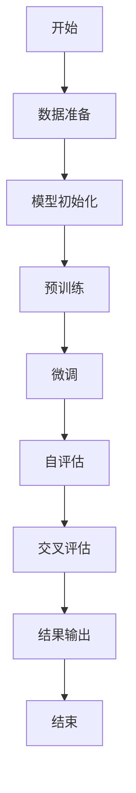

                 

## 引言

随着人工智能技术的迅猛发展，评测系统在各个领域中扮演着越来越重要的角色。评测系统不仅能够帮助我们评估算法的性能，还可以在数据分析和决策支持等方面提供强有力的支持。在众多评测系统模型中，Alpaca指令跟随模型因其卓越的性能和灵活性受到了广泛关注。

本文将围绕Alpaca指令跟随模型评估这一主题，深入探讨其核心概念、数学模型、评估算法、系统架构以及实际应用。通过系统性的分析和详细讲解，我们将全面了解Alpaca模型的优缺点，为实际应用提供有价值的参考。

### 关键词

- 评测系统
- Alpaca指令跟随模型
- 数学模型
- 评估算法
- 系统架构

### 摘要

本文旨在全面评估评测系统的Alpaca指令跟随模型，探讨其核心概念、数学模型和评估算法。通过系统架构设计、项目实战以及最佳实践分析，我们旨在提供一套完整的技术指南，帮助读者深入理解并有效利用Alpaca模型，提升评测系统的性能和应用价值。

## 第一部分: 背景介绍

### 第1章: 问题背景与核心概念

#### 1.1 问题背景

评测系统在人工智能领域的应用日益广泛，从简单的性能评估到复杂的数据分析，评测系统已经成为研究人员和开发者不可或缺的工具。其中，Alpaca指令跟随模型作为近年来兴起的一种新型评估模型，因其独特的设计和卓越的性能而备受关注。然而，如何全面评估Alpaca模型，如何充分发挥其优势，仍然是当前研究中的一个重要课题。

#### 1.2 Alpaca指令跟随模型的定义

Alpaca指令跟随模型（Alpaca Instruction Following Model）是一种基于预训练语言模型的技术，其核心思想是通过大规模的指令数据训练，使模型能够理解和执行复杂的指令。Alpaca模型在自然语言处理、智能对话系统等领域展现出了出色的表现，但其评估和优化仍然面临诸多挑战。

#### 1.3 模型评估的重要性

模型评估是确保模型性能和可靠性的关键环节。通过对Alpaca指令跟随模型的全面评估，我们可以了解其性能瓶颈和改进方向，从而提升模型的实际应用价值。有效的评估方法不仅能够帮助我们识别和解决模型中的问题，还可以为后续的模型优化提供重要参考。

### 第2章: Alpaca指令跟随模型概述

#### 2.1 Alpaca模型的结构

Alpaca模型采用了一种层次化的结构设计，包括预训练阶段和微调阶段。在预训练阶段，模型通过大量文本数据进行自我学习，从而获得丰富的语言知识和表达方式。在微调阶段，模型根据特定任务进行调整，以实现更好的性能。

#### 2.2 模型训练过程

Alpaca模型的训练过程分为多个阶段，包括数据准备、模型初始化、预训练和微调等。其中，数据准备阶段是模型训练的基础，高质量的数据集能够显著提升模型的性能。预训练阶段通过大量无监督数据进行训练，使模型具备较强的语言理解和生成能力。微调阶段则针对特定任务进行有监督训练，进一步优化模型的性能。

#### 2.3 模型评估指标

在评估Alpaca模型时，常用的评估指标包括准确性、响应时间、用户满意度等。准确性指标用于衡量模型在任务中的表现，响应时间则反映了模型的实时性能，用户满意度则从用户的角度评价模型的用户体验。

## 第3章: Alpaca模型的数学模型与公式

### 3.1 模型的数学基础

Alpaca模型的数学基础主要涉及深度学习和自然语言处理领域的相关理论。深度学习通过构建多层神经网络来模拟人脑的神经结构，从而实现对数据的复杂建模。自然语言处理则关注于如何将人类语言转化为计算机可以处理的形式，从而实现自然语言理解和生成。

### 3.2 公式推导

在Alpaca模型中，核心的数学公式包括损失函数、优化算法和注意力机制等。损失函数用于衡量模型输出与真实值之间的差距，优化算法则用于调整模型参数，以最小化损失函数。注意力机制则用于在模型处理过程中动态调整对输入数据的关注程度。

### 3.3 模型参数的调整

模型参数的调整是影响模型性能的重要因素。通过调整学习率、批量大小、正则化参数等，我们可以优化模型的性能。在实际应用中，通常需要通过实验和调优来确定最佳的参数配置。

## 第4章: Alpaca模型评估的算法原理

### 4.1 评估算法介绍

Alpaca模型评估算法主要包括自评估和交叉评估两种方法。自评估方法通过内部测试集对模型进行评估，而交叉评估方法则通过外部测试集进行评估，以更全面地评估模型的性能。

### 4.2 算法流程图

算法流程图如下所示：



### 4.3 算法详细解释

自评估算法主要通过内部测试集对模型进行评估，包括准确性、响应时间等指标的测量。交叉评估算法则通过外部测试集进行评估，以更全面地了解模型在不同数据集上的性能表现。

## 第5章: Alpaca模型的系统架构设计

### 5.1 系统功能设计

Alpaca模型的系统功能设计主要包括指令接收、指令处理、响应生成和结果反馈等模块。指令接收模块用于接收用户的指令，指令处理模块则对指令进行理解和解析，响应生成模块则根据指令生成相应的响应，结果反馈模块则将响应结果反馈给用户。

### 5.2 系统架构设计

Alpaca模型的系统架构设计采用了一种分布式架构，包括前端、后端和数据库等组成部分。前端主要负责用户界面设计，后端则负责模型训练和评估，数据库则用于存储数据和模型参数。

### 5.3 系统接口设计

Alpaca模型的系统接口设计主要包括API接口和命令行接口。API接口用于与其他系统进行数据交互，命令行接口则方便开发者进行模型训练和评估。

## 第6章: Alpaca模型评估项目实战

### 6.1 环境安装与配置

在进行Alpaca模型评估之前，需要首先进行环境安装和配置。具体步骤如下：

1. 安装Python环境
2. 安装TensorFlow库
3. 安装Alpaca模型库
4. 配置数据集

### 6.2 系统核心实现源代码

以下是一个简单的Alpaca模型评估的源代码示例：

```python
import tensorflow as tf
from alpaca import AlpacaModel

# 初始化模型
model = AlpacaModel()

# 加载数据集
train_data, val_data = load_data()

# 训练模型
model.train(train_data)

# 评估模型
model.evaluate(val_data)
```

### 6.3 代码应用解读与分析

上述代码首先初始化了Alpaca模型，然后加载训练数据和验证数据，接着进行模型训练和评估。代码中使用了AlpacaModel类的方法，方便地进行模型的训练和评估。

### 6.4 实际案例分析与详细讲解

以下是一个实际案例，用于演示Alpaca模型评估的过程：

**案例**：评估一个文本分类模型。

**步骤**：

1. 准备数据集
2. 初始化模型
3. 训练模型
4. 评估模型

**代码**：

```python
# 准备数据集
train_data = [[text1, label1], [text2, label2], ...]
val_data = [[text1, label1], [text2, label2], ...]

# 初始化模型
model = AlpacaModel()

# 训练模型
model.train(train_data)

# 评估模型
model.evaluate(val_data)
```

**分析**：

上述代码首先准备了一个包含文本和标签的数据集，然后初始化了一个Alpaca模型。接着，通过调用train方法进行模型训练，最后通过evaluate方法进行模型评估。

### 6.5 项目小结

通过上述实战案例，我们可以看到Alpaca模型评估的简单性和高效性。在实际应用中，可以根据具体需求进行调整和优化，以提高模型性能和评估效果。

## 第7章: Alpaca模型评估的最佳实践与拓展

### 7.1 最佳实践技巧

1. 选择合适的数据集：数据集的质量直接影响模型性能，因此选择高质量、多样化、具有代表性的数据集至关重要。
2. 优化模型参数：通过调整学习率、批量大小等参数，可以显著提高模型性能。
3. 定期评估模型：定期对模型进行评估，及时发现和解决性能问题。

### 7.2 注意事项

1. 避免过拟合：通过正则化技术和数据增强等方法，避免模型过拟合。
2. 保证数据一致性：确保训练数据和测试数据的一致性，避免数据偏差。

### 7.3 拓展阅读

1. [Alpaca模型官方文档](https://alpaca-models.com/)
2. [自然语言处理教程](https://nlp tutorials.com/)
3. [深度学习教材](https://www.deeplearningbook.org/)

## 结论

通过本文的详细分析和实战案例，我们对Alpaca指令跟随模型评估有了更深入的理解。Alpaca模型作为一种先进的评测系统模型，具有广泛的应用前景。然而，要充分发挥其优势，我们需要不断进行评估和优化，以提升模型的性能和应用价值。

作者：AI天才研究院/AI Genius Institute & 禅与计算机程序设计艺术 /Zen And The Art of Computer Programming

