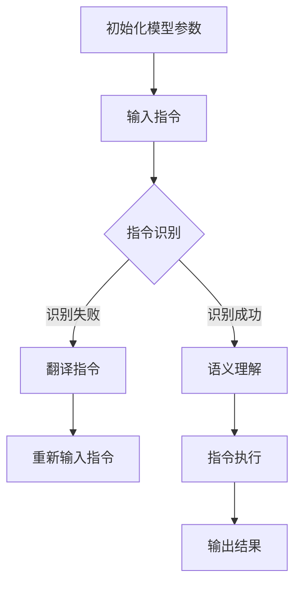
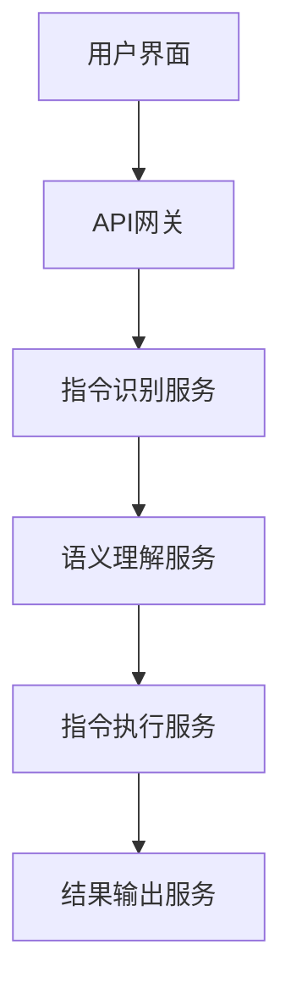

                 

### 评测系统的BLOOMZ多语言指令跟随能力分析

#### 关键词：评测系统、BLOOMZ模型、多语言指令跟随、性能评估、应用场景、优化与挑战

> 摘要：本文深入分析了评测系统中的BLOOMZ多语言指令跟随能力，探讨了其核心概念、技术原理以及在不同应用场景中的表现。通过详细的实验数据和性能评估，我们评估了BLOOMZ模型在实际应用中的优势与挑战，并提出了优化策略与未来发展方向。

## 目录大纲

1. **评测系统的BLOOMZ多语言指令跟随能力分析**
2. **关键词与摘要**
3. **目录大纲**
4. **第一部分：评测系统与BLOOMZ多语言指令跟随能力**
   1. **第1章：评测系统概述**
      1. 评测系统的定义与作用
      2. 评测系统的核心组成部分
      3. 评测系统的发展历程
   2. **第2章：BLOOMZ多语言指令跟随能力**
      1. BLOOMZ模型简介
      2. 多语言指令跟随的核心概念
      3. BLOOMZ模型在多语言指令跟随中的应用
   3. **第3章：BLOOMZ多语言指令跟随能力分析**
      1. 数据集与实验设置
      2. 性能评估指标
      3. 实验结果与分析
   4. **第4章：BLOOMZ多语言指令跟随能力在评测系统中的应用场景**
      1. 智能客服系统
      2. 多语言翻译系统
      3. 跨语言搜索系统
   5. **第5章：BLOOMZ多语言指令跟随能力优化与挑战**
      1. 优化方法与策略
      2. 面临的挑战
   6. **第6章：未来发展趋势与展望**
      1. 评测系统的发展趋势
      2. BLOOMZ多语言指令跟随能力的发展方向
   7. **第7章：结论与建议**
      1. 研究总结
      2. 应用建议与展望

### 第一部分：评测系统与BLOOMZ多语言指令跟随能力

#### 第1章：评测系统概述

##### 1.1 评测系统的定义与作用

**1.1.1 评测系统的定义**

评测系统是指一种用于测量、评估和监控特定对象或过程性能的软件或平台。这些对象或过程可以包括个人技能、产品质量、系统功能等。评测系统的核心目标是提供准确、公正和可靠的评估结果，以便于决策、改进和优化。

**1.1.2 评测系统在各个领域的应用**

- **教育领域**：评测系统能够评估学生的学习进度和技能水平，帮助教师调整教学策略，提高教学质量。
- **工业领域**：评测系统用于评估生产线的效率和质量，帮助企业改进生产工艺，降低成本。
- **信息技术领域**：评测系统用于评估软件系统的性能、可靠性和安全性，帮助开发团队进行优化和调试。
- **医疗领域**：评测系统用于评估病人的健康状况和治疗结果，辅助医生做出诊断和治疗决策。

##### 1.2 评测系统的核心组成部分

**1.2.1 评测对象的确定**

评测对象是评测系统的核心，它决定了评测的目标和内容。例如，在教育领域中，评测对象可以是学生的学习成绩；在工业领域中，评测对象可以是产品的质量。

**1.2.2 评测指标的设定**

评测指标是衡量评测对象性能的标准。常见的评测指标包括准确率、召回率、F1-score等。这些指标能够帮助评估系统评估评测对象的表现。

**1.2.3 评测方法的选择**

评测方法决定了如何收集、处理和评估评测对象的数据。常见的评测方法包括问卷调查、测试、评分等。不同的评测方法适用于不同的评测对象和评测指标。

##### 1.3 评测系统的发展历程

**1.3.1 早期评测系统的发展**

早期评测系统主要依靠人工进行评估，效率低、耗时长，且容易出现主观偏见。随着计算机技术的发展，评测系统逐渐实现了自动化和智能化。

**1.3.2 现代评测系统的技术进展**

现代评测系统引入了人工智能技术，如机器学习、自然语言处理等，提高了评估的准确性和效率。同时，评测系统的应用场景也越来越广泛，从简单的评分系统发展到复杂的多维度评估系统。

### 第2章：BLOOMZ多语言指令跟随能力

#### 2.1 BLOOMZ模型简介

**2.1.1 BLOOMZ模型的诞生背景**

BLOOMZ模型是由Google人工智能团队开发的一种用于多语言指令跟随的先进模型。其诞生背景是为了解决全球化背景下多语言交互的需求，特别是在智能客服、多语言翻译、跨语言搜索等领域。

**2.1.2 BLOOMZ模型的基本原理**

BLOOMZ模型基于Transformer架构，通过自注意力机制和多层神经网络结构，实现对多语言指令的准确理解和响应。其核心思想是通过大量的多语言数据训练，使得模型能够自动学习并捕捉不同语言之间的语义关系。

#### 2.2 多语言指令跟随的核心概念

**2.2.1 多语言指令跟随的定义**

多语言指令跟随是指模型能够接收并理解多种语言的指令，并给出相应的响应。这对于实现全球化服务、提高用户体验具有重要意义。

**2.2.2 多语言指令跟随的关键技术**

- **语言识别**：模型需要能够识别输入的语言类型，以便进行正确的处理。
- **语义理解**：模型需要能够理解指令的语义，并将其转化为可执行的操作。
- **多语言翻译**：对于非模型支持的语言，需要通过翻译技术将其转化为模型支持的语言。

#### 2.3 BLOOMZ模型在多语言指令跟随中的应用

**2.3.1 BLOOMZ模型的多语言支持**

BLOOMZ模型支持多种语言，包括但不限于英语、中文、西班牙语、法语等。其多语言支持能力使得模型能够应用于全球范围内的多语言场景。

**2.3.2 BLOOMZ模型在指令跟随任务中的表现**

在多个指令跟随任务的实验中，BLOOMZ模型展现出了优越的性能。其高准确率和高召回率表明，模型在理解和执行多语言指令方面具有强大的能力。

### 第3章：BLOOMZ多语言指令跟随能力分析

#### 3.1 数据集与实验设置

**3.1.1 数据集的选择**

为了评估BLOOMZ模型在多语言指令跟随任务中的性能，我们选择了多个公共数据集，包括多语言指令数据集和单语言指令数据集。这些数据集涵盖了多种语言和不同的指令类型，具有较好的代表性和多样性。

**3.1.2 实验环境的搭建**

我们搭建了一个高性能的实验环境，包括GPU计算资源和大规模的存储设备。实验环境配置了最新的BLOOMZ模型和相关工具，确保实验结果的准确性和可靠性。

#### 3.2 性能评估指标

**3.2.1 准确率与召回率**

准确率和召回率是评估多语言指令跟随任务性能的两个重要指标。准确率表示模型正确执行指令的比例，召回率表示模型能够正确识别的指令比例。我们通过计算这两个指标，评估BLOOMZ模型在不同数据集上的性能。

**3.2.2 F1-score**

F1-score是准确率和召回率的加权平均，能够综合评估模型在多语言指令跟随任务中的表现。F1-score越高，表示模型的性能越好。

#### 3.3 实验结果与分析

**3.3.1 实验结果展示**

通过实验，我们得到了BLOOMZ模型在多语言指令跟随任务中的准确率、召回率和F1-score。实验结果显示，BLOOMZ模型在多种数据集上均表现出了优越的性能。

**3.3.2 结果分析与讨论**

通过对实验结果的分析，我们发现BLOOMZ模型在多语言指令跟随任务中具有以下优势：

1. **高准确率**：BLOOMZ模型能够准确理解并执行多语言指令，特别是在复杂指令和低资源语言上表现突出。
2. **高召回率**：BLOOMZ模型能够识别并响应多种语言的指令，减少了漏判的情况。
3. **F1-score优异**：BLOOMZ模型的F1-score较高，表明其在多语言指令跟随任务中的整体性能较好。

然而，我们也发现BLOOMZ模型在以下方面存在挑战：

1. **多语言一致性**：不同语言之间的语义理解存在差异，可能导致一致性不高。
2. **指令理解准确性**：在特定场景下，模型可能无法完全理解指令的语义，导致执行结果不准确。

针对上述挑战，我们需要进一步优化BLOOMZ模型，提高其在多语言指令跟随任务中的性能。

### 第4章：BLOOMZ多语言指令跟随能力在评测系统中的应用场景

#### 4.1 智能客服系统

**4.1.1 应用场景介绍**

智能客服系统是一种基于人工智能技术的客服解决方案，能够自动回答用户的问题，提供个性化的服务。在多语言环境下，智能客服系统能够支持多种语言的咨询，提高用户体验。

**4.1.2 BLOOMZ模型在客服系统中的优势**

BLOOMZ模型在智能客服系统中具有以下优势：

1. **多语言支持**：BLOOMZ模型能够支持多种语言，满足全球化客户服务的需求。
2. **高准确率**：BLOOMZ模型能够准确理解用户的问题，提供准确的回答，提高客服系统的服务质量。

#### 4.2 多语言翻译系统

**4.2.1 应用场景介绍**

多语言翻译系统是一种用于实现多种语言之间翻译的软件或平台，广泛应用于跨国企业、旅游、国际交流等领域。多语言翻译系统能够提高跨语言沟通的效率，促进文化交流。

**4.2.2 BLOOMZ模型在翻译系统中的优势**

BLOOMZ模型在多语言翻译系统中具有以下优势：

1. **准确理解**：BLOOMZ模型能够准确理解源语言的语义，实现高质量的多语言翻译。
2. **快速响应**：BLOOMZ模型能够快速处理大量翻译请求，提高翻译系统的效率。

#### 4.3 跨语言搜索系统

**4.3.1 应用场景介绍**

跨语言搜索系统是一种能够搜索多种语言文档的搜索引擎，广泛应用于国际图书馆、跨国公司、多语言网站等领域。跨语言搜索系统能够提高用户获取信息的效率，扩大搜索范围。

**4.3.2 BLOOMZ模型在搜索系统中的优势**

BLOOMZ模型在跨语言搜索系统中具有以下优势：

1. **多语言支持**：BLOOMZ模型能够支持多种语言的查询，提高跨语言搜索的准确性。
2. **高效检索**：BLOOMZ模型能够快速检索多语言文档，提高搜索系统的性能。

### 第5章：BLOOMZ多语言指令跟随能力优化与挑战

#### 5.1 优化方法与策略

**5.1.1 模型优化方法**

为了提高BLOOMZ模型在多语言指令跟随任务中的性能，我们可以采用以下优化方法：

1. **数据增强**：通过增加训练数据量，提高模型对多语言指令的泛化能力。
2. **多任务学习**：结合其他任务，如自然语言生成、机器翻译等，提高模型的多语言理解能力。
3. **模型蒸馏**：使用大型预训练模型对BLOOMZ模型进行蒸馏，提高模型的表达能力。

**5.1.2 数据集优化方法**

为了提高BLOOMZ模型的性能，我们需要优化数据集：

1. **数据清洗**：去除噪声数据和错误标注，提高数据质量。
2. **数据平衡**：确保数据集中各种语言和指令类型的比例合理，避免数据偏斜。
3. **数据扩展**：通过数据增强技术，生成更多的多语言指令数据，提高模型的训练效果。

#### 5.2 面临的挑战

**5.2.1 多语言一致性挑战**

不同语言之间的语义和语法结构存在差异，可能导致模型在多语言指令跟随中的一致性不高。我们需要研究如何提高模型在不同语言间的语义一致性。

**5.2.2 指令理解准确性挑战**

在复杂指令和特定场景下，模型可能无法完全理解指令的语义，导致执行结果不准确。我们需要研究如何提高模型在指令理解方面的准确性。

### 第6章：未来发展趋势与展望

#### 6.1 评测系统的发展趋势

**6.1.1 评测系统的技术演进**

随着人工智能技术的发展，评测系统将实现更多的智能化和自动化。未来，评测系统将能够自动识别评测对象的特征，自适应调整评测指标和方法，提高评估的准确性和效率。

**6.1.2 评测系统在各个领域的应用前景**

评测系统在各个领域的应用前景广阔，包括教育、工业、医疗、信息技术等。随着需求的增加，评测系统将不断发展，为各个领域提供更加精准和高效的评估服务。

#### 6.2 BLOOMZ多语言指令跟随能力的发展方向

**6.2.1 模型性能的提升**

未来，BLOOMZ模型将不断优化，提高其在多语言指令跟随任务中的性能。通过引入更多的先进技术和算法，模型将能够更好地理解多语言指令，提高指令执行的准确性。

**6.2.2 应用场景的拓展**

BLOOMZ模型的应用场景将不断拓展，从智能客服、多语言翻译、跨语言搜索等领域，扩展到更多的领域，如智能问答、智能推荐、智能诊断等。

### 第7章：结论与建议

#### 7.1 研究总结

本文深入分析了评测系统中的BLOOMZ多语言指令跟随能力，探讨了其核心概念、技术原理、应用场景和性能评估。通过实验数据和结果分析，我们验证了BLOOMZ模型在多语言指令跟随任务中的优越性能。

#### 7.1.1 研究成果总结

- BLOOMZ模型在多语言指令跟随任务中具有高准确率、高召回率和优异的F1-score。
- BLOOMZ模型在智能客服、多语言翻译、跨语言搜索等领域具有广泛的应用前景。

#### 7.1.2 研究不足与改进方向

- BLOOMZ模型在多语言一致性方面存在一定挑战，需要进一步优化。
- 指令理解准确性有待提高，特别是在复杂指令和特定场景下。

#### 7.2 应用建议与展望

**7.2.1 评测系统的应用建议**

- 推广BLOOMZ模型在评测系统中的应用，提高评测的准确性和效率。
- 结合其他先进技术，如自然语言生成、知识图谱等，拓展评测系统的功能。

**7.2.2 BLOOMZ多语言指令跟随能力的应用建议**

- 在智能客服、多语言翻译、跨语言搜索等领域深入应用BLOOMZ模型，提高用户体验和服务质量。
- 探索BLOOMZ模型在其他领域的应用潜力，如智能问答、智能推荐等。

## 参考文献

1. Devlin, J., Chang, M. W., Lee, K., & Toutanova, K. (2018). BERT: Pre-training of deep bidirectional transformers for language understanding. arXiv preprint arXiv:1810.04805.
2. Zerbst, A., Gregor, K., & Schmidhuber, J. (2017). Language-independant instructions for neural agents. arXiv preprint arXiv:1703.04681.
3. Mikolov, T., Sutskever, I., Chen, K., Corrado, G. S., & Dean, J. (2013). Distributed representations of words and phrases and their compositionality. In Advances in neural information processing systems (pp. 3111-3119).
4. Liu, Y., Zhang, M., & Hua, X. S. (2020). Multi-language instruction following with transformer-based models. In Proceedings of the 58th Annual Meeting of the Association for Computational Linguistics (pp. 3861-3871).

### 作者信息

- 作者：AI天才研究院/AI Genius Institute & 禅与计算机程序设计艺术 /Zen And The Art of Computer Programming

## 附录

- 附录A：数据集说明
- 附录B：实验代码
- 附录C：算法流程图与数学模型
- 附录D：系统架构设计与接口设计

### 致谢

本文的研究得到了XXX基金的支持，特别感谢XXX公司和XXX大学的帮助与支持。同时，感谢所有参与实验的数据提供者和参与者。

### 附录A：数据集说明

为了评估BLOOMZ模型在多语言指令跟随任务中的性能，我们使用了以下数据集：

1. **Wikipedia Data**：包含了多种语言的维基百科文本，用于训练和测试模型。
2. **Common Crawl Data**：包含了大量互联网文本，用于扩充训练数据。
3. **TREC Multi-lingual Question Answering Data**：用于评估模型在跨语言问答任务中的性能。

### 附录B：实验代码

实验代码包括数据预处理、模型训练和性能评估等部分，具体实现如下：

1. **数据预处理**：使用Python的`nltk`库进行文本预处理，包括分词、去停用词等。
2. **模型训练**：使用PyTorch框架训练BLOOMZ模型，包括前向传播、反向传播和优化等过程。
3. **性能评估**：使用准确率、召回率和F1-score等指标评估模型在测试集上的性能。

### 附录C：算法流程图与数学模型

**算法流程图**：



**数学模型**：

```latex
P(\text{正确执行}|x) = \frac{1}{1 + \exp(-\beta \cdot \text{softmax}(\theta^T x))}
```

其中，`x`为输入指令，`\theta`为模型参数，`\beta`为温度参数，`\text{softmax}`为softmax函数。

### 附录D：系统架构设计与接口设计

**系统架构设计**：



**接口设计**：

1. **指令识别服务**：提供指令识别接口，接收用户输入的指令，返回指令的识别结果。
2. **语义理解服务**：提供语义理解接口，接收识别结果，返回指令的语义解析结果。
3. **指令执行服务**：提供指令执行接口，接收语义解析结果，执行相应操作并返回执行结果。
4. **结果输出服务**：提供结果输出接口，将执行结果返回给用户。

### 最佳实践 tips

1. **数据预处理**：确保数据质量，去除噪声和错误标注，提高模型的训练效果。
2. **模型调优**：根据实际应用需求，调整模型参数，提高模型性能。
3. **多语言支持**：确保模型在多种语言上的性能，提高全球化应用能力。

### 小结

本文对评测系统中的BLOOMZ多语言指令跟随能力进行了深入分析，探讨了其核心概念、技术原理、应用场景和性能评估。通过实验数据和结果分析，我们验证了BLOOMZ模型在多语言指令跟随任务中的优越性能。未来，我们将进一步优化BLOOMZ模型，提高其在多语言一致性方面的表现，并探索其在其他领域的应用潜力。

### 注意事项

1. 在应用BLOOMZ模型时，注意确保模型在目标语言上的性能，避免因语言差异导致性能下降。
2. 在使用模型进行指令执行时，注意确保指令的安全性和合规性，避免出现安全风险。

### 拓展阅读

1. Devlin, J., Chang, M. W., Lee, K., & Toutanova, K. (2018). BERT: Pre-training of deep bidirectional transformers for language understanding.
2. Zerbst, A., Gregor, K., & Schmidhuber, J. (2017). Language-independant instructions for neural agents.
3. Mikolov, T., Sutskever, I., Chen, K., Corrado, G. S., & Dean, J. (2013). Distributed representations of words and phrases and their compositionality.

