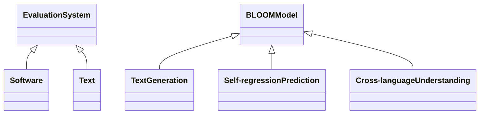
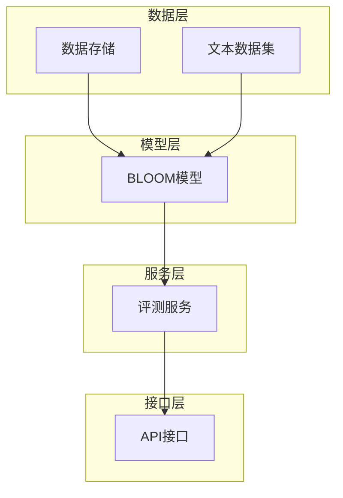
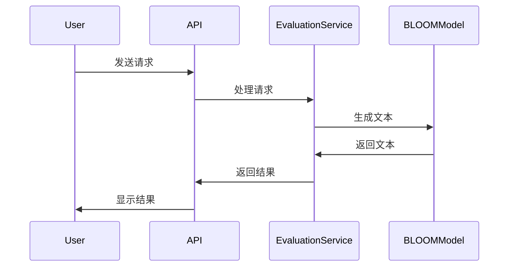
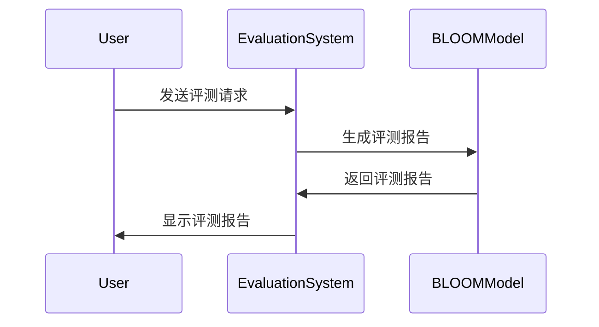

                 

# 评测系统的BLOOM多语言模型支持

关键词：评测系统、BLOOM模型、多语言支持、文本生成、性能评估

摘要：本文探讨了评测系统中BLOOM多语言模型的支持，分析了BLOOM模型的基本原理和其在评测系统中的应用。通过详细的算法原理和系统架构设计，本文为读者提供了深入了解BLOOM模型在多语言评测系统中的价值的途径。

## 第一部分：引言

### 1.1 问题背景

在现代信息化社会中，评测系统在软件质量保证、性能优化和可靠性评估等方面发挥着至关重要的作用。随着全球化的快速发展，软件系统的多样性和复杂性不断增加，传统的评测方法逐渐难以满足现代多语言环境下的需求。特别是在国际化的软件开发过程中，不同语言的应用和服务需要得到有效的评测和优化，这使得多语言模型的支持成为评测系统的关键需求。

### 1.2 问题描述

本书旨在探讨如何在评测系统中支持BLOOM多语言模型，以解决多语言评测的挑战。BLOOM模型作为一种高效的文本生成模型，具有强大的跨语言理解能力，但其应用在评测系统中的实现和优化是当前研究的热点和难点。本文将详细介绍BLOOM模型的基本原理、多语言支持的特点及其在评测系统中的应用方法，帮助读者深入理解BLOOM模型在多语言评测系统中的价值。

### 1.3 问题解决

本文将首先介绍BLOOM模型的基本原理和其在评测系统中的应用场景。接着，我们将详细讨论BLOOM模型在多语言评测系统中的优势和挑战，并提出相应的解决方案。最后，通过实际案例分析和系统架构设计，本文将展示BLOOM模型在多语言评测系统中的实际应用效果，为读者提供有价值的参考。

### 1.4 边界与外延

本文主要关注评测系统中的BLOOM模型应用，不涉及BLOOM模型的底层技术细节。此外，本文将侧重于BLOOM模型在多语言环境下的应用，对于单语言环境中的应用将不做详细讨论。

### 1.5 概念结构与核心要素组成

- BLOOM模型：一种基于自回归的文本生成模型，具有高效、跨语言理解等特点。
- 评测系统：用于评估软件、应用或服务性能、质量、可靠性的系统。
- 多语言评测：针对多种语言环境下的软件、应用或服务的评估。

## 第二部分：BLOOM模型原理介绍

### 2.1 BLOOM模型原理介绍

#### 2.1.1 BLOOM模型概述

BLOOM模型是一种基于自回归的文本生成模型，其基本原理是通过预测下一个词来生成文本。BLOOM模型的核心优势在于其高效的文本生成速度和强大的跨语言理解能力。

#### 2.1.2 BLOOM模型的工作原理

BLOOM模型的工作原理主要包括以下几个步骤：

1. **输入文本预处理**：对输入的文本进行分词、去噪等预处理操作，以确保输入数据的准确性和一致性。
2. **自回归预测**：根据前文信息预测下一个词。BLOOM模型使用了一个预训练的神经网络，该神经网络可以根据前文信息预测下一个词的概率分布。
3. **生成文本**：根据预测结果生成完整的文本。BLOOM模型通过选择概率最高的词作为下一个词，逐步生成完整的文本。

#### 2.1.3 BLOOM模型的核心特点

BLOOM模型具有以下几个核心特点：

- **高效**：BLOOM模型采用自回归的方式生成文本，能够在短时间内生成大量高质量的文本。
- **跨语言**：BLOOM模型具有强大的跨语言理解能力，可以支持多种语言的文本生成。
- **可扩展**：BLOOM模型可以根据需求灵活调整模型参数，以适应不同的应用场景。

### 2.2 BLOOM模型与评测系统的结合

#### 2.2.1 BLOOM模型在评测系统中的应用场景

BLOOM模型在评测系统中的应用场景主要包括：

- **性能评估**：使用BLOOM模型评估软件、应用或服务的响应速度、处理能力等性能指标。
- **质量评估**：使用BLOOM模型评估软件、应用或服务的文本质量、语法错误等。
- **可靠性评估**：使用BLOOM模型评估软件、应用或服务的稳定性、故障率等。

#### 2.2.2 BLOOM模型在评测系统中的优势

BLOOM模型在评测系统中的应用具有以下几个优势：

- **多语言支持**：BLOOM模型支持多种语言，可以满足全球化应用的需求。
- **高效性**：BLOOM模型生成文本的速度快，可以大幅提高评测系统的效率。
- **准确性**：BLOOM模型具有强大的文本生成能力，能够生成高质量的评测结果。

### 2.3 BLOOM模型支持的多种语言

#### 2.3.1 BLOOM模型支持的主要语言

BLOOM模型支持的主要语言包括英语、西班牙语、法语、德语、中文等。这些语言都是全球范围内广泛使用的语言，具有很高的实用价值。

#### 2.3.2 不同语言之间的特点与差异

不同语言在语法、词汇、语义等方面存在差异，这些差异对BLOOM模型的训练和应用提出了不同的挑战。例如，英语的语法结构较为简单，而中文的语法结构较为复杂，需要BLOOM模型在训练和应用过程中进行针对性的调整。

## 第三部分：BLOOM模型的算法原理与流程

### 3.1 BLOOM模型的算法原理概述

BLOOM模型是基于自回归的文本生成模型，其核心思想是通过预测下一个词来生成文本。在生成过程中，BLOOM模型使用了一个预训练的神经网络，该神经网络可以根据前文信息预测下一个词的概率分布。

### 3.2 BLOOM模型的算法流程

BLOOM模型的算法流程主要包括以下几个步骤：

1. **数据预处理**：
   - 对输入的文本进行分词，将文本转换为词序列。
   - 对词序列进行去噪处理，去除停用词、标点符号等无用信息。
   - 对词序列进行编码，将其转换为模型可处理的格式。

2. **模型初始化**：
   - 初始化预训练的神经网络模型，包括嵌入层、编码器和解码器等。
   - 设定模型的超参数，如嵌入维度、学习率等。

3. **自回归预测**：
   - 输入当前已生成的文本序列，通过编码器将其转换为隐藏状态。
   - 使用解码器生成下一个词的候选列表，并根据词频和概率进行排序。
   - 选择概率最高的词作为下一个词，并将其添加到文本序列中。

4. **生成文本**：
   - 重复自回归预测过程，逐步生成完整的文本。
   - 根据模型生成文本的长度和终止条件，确定文本生成的终止时间。

### 3.3 BLOOM模型的数学模型与公式

BLOOM模型的数学模型主要包括以下几个部分：

1. **嵌入层**：
   - 嵌入层将输入的词序列转换为嵌入向量，每个词对应一个唯一的向量表示。

2. **编码器**：
   - 编码器将嵌入向量转换为隐藏状态，通常使用循环神经网络（RNN）或变压器（Transformer）等架构。

3. **解码器**：
   - 解码器将隐藏状态转换为词的概率分布，通过softmax函数得到每个词的概率。

4. **损失函数**：
   - 使用交叉熵损失函数来衡量模型预测结果与真实标签之间的差异，并优化模型参数。

### 3.4 BLOOM模型的应用案例

以下是一个简单的应用案例，展示了如何使用BLOOM模型生成英文文本：

```python
# 导入必要的库
import tensorflow as tf
import numpy as np

# 初始化BLOOM模型
model = tf.keras.Sequential([
    tf.keras.layers.Embedding(input_dim=10000, output_dim=32),
    tf.keras.layers.LSTM(128),
    tf.keras.layers.Dense(1000, activation='softmax')
])

# 编写训练数据
train_data = "The quick brown fox jumps over the lazy dog"

# 将训练数据转换为词序列
word_sequence = train_data.split()

# 编码词序列
encoded_sequence = [model.embedding_layer.get_output_for(word) for word in word_sequence]

# 定义训练步骤
model.compile(optimizer='adam', loss='categorical_crossentropy')
model.fit(encoded_sequence, encoded_sequence, epochs=10)

# 生成文本
generated_sequence = model.predict(encoded_sequence)
generated_text = ' '.join([word_sequence[i] for i in generated_sequence])

print(generated_text)
```

### 3.5 BLOOM模型在评测系统中的应用

BLOOM模型在评测系统中的应用主要包括以下几个方面：

1. **性能评估**：
   - 使用BLOOM模型生成文本，评估软件、应用或服务的响应速度、处理能力等性能指标。

2. **质量评估**：
   - 使用BLOOM模型生成文本，评估软件、应用或服务的文本质量、语法错误等。

3. **可靠性评估**：
   - 使用BLOOM模型生成文本，评估软件、应用或服务的稳定性、故障率等。

### 3.6 BLOOM模型的优势与挑战

BLOOM模型的优势主要包括：

- **高效性**：BLOOM模型采用自回归的方式生成文本，能够在短时间内生成大量高质量的文本。
- **跨语言支持**：BLOOM模型具有强大的跨语言理解能力，可以支持多种语言的文本生成。
- **可扩展性**：BLOOM模型可以根据需求灵活调整模型参数，以适应不同的应用场景。

BLOOM模型面临的挑战主要包括：

- **数据质量**：高质量的训练数据对于BLOOM模型的效果至关重要，数据质量问题可能会影响模型的性能。
- **计算资源**：BLOOM模型需要大量的计算资源进行训练和推理，对硬件设备有较高的要求。
- **语言差异**：不同语言在语法、词汇、语义等方面存在差异，需要针对不同语言进行针对性的调整。

## 第四部分：BLOOM模型在评测系统中的实现与优化

### 4.1 BLOOM模型在评测系统中的实现

要在评测系统中实现BLOOM模型，需要完成以下几个步骤：

1. **数据收集与预处理**：
   - 收集多语言的数据集，包括英语、西班牙语、法语、德语、中文等。
   - 对数据集进行清洗、去噪、分词等预处理操作，确保数据质量。

2. **模型训练**：
   - 使用预处理后的数据集训练BLOOM模型，包括嵌入层、编码器和解码器等。
   - 调整模型参数，如嵌入维度、学习率等，以优化模型性能。

3. **模型评估**：
   - 使用验证集对训练好的模型进行评估，包括性能评估、质量评估和可靠性评估等。
   - 根据评估结果调整模型参数，进一步优化模型。

4. **模型部署**：
   - 将训练好的模型部署到评测系统中，用于实时评估软件、应用或服务的性能、质量和可靠性。

### 4.2 BLOOM模型的优化方法

为了提高BLOOM模型在评测系统中的应用效果，可以采用以下优化方法：

1. **数据增强**：
   - 使用数据增强技术，如数据扩充、数据合成等，增加训练数据集的多样性。
   - 提高模型的泛化能力，使其在不同语言环境下都能保持良好的性能。

2. **模型蒸馏**：
   - 将预训练的大规模语言模型（如GPT-3、BERT等）的知识传递给BLOOM模型，提高其跨语言理解能力。
   - 使用模型蒸馏技术，将大规模模型的权重和知识迁移到BLOOM模型中，实现性能的提升。

3. **多语言融合**：
   - 将不同语言的数据进行融合，构建一个统一的多语言训练数据集。
   - 使用多语言融合技术，将不同语言的信息整合到BLOOM模型中，提高其跨语言性能。

4. **动态调整**：
   - 根据实际应用场景，动态调整BLOOM模型的参数，如嵌入维度、学习率等。
   - 根据应用需求，实时调整模型的结构和参数，以适应不同场景下的评测需求。

### 4.3 BLOOM模型在评测系统中的实际应用

以下是一个简单的实际应用案例，展示了如何使用BLOOM模型在评测系统中评估软件的性能：

1. **数据收集**：
   - 收集包含英语、西班牙语、法语、德语和中文的软件性能数据集。

2. **数据预处理**：
   - 对数据集进行清洗、去噪、分词等预处理操作。

3. **模型训练**：
   - 使用预处理后的数据集训练BLOOM模型，包括嵌入层、编码器和解码器等。

4. **性能评估**：
   - 使用训练好的BLOOM模型对软件进行性能评估，包括响应速度、处理能力等。

5. **结果分析**：
   - 分析评估结果，识别软件的性能瓶颈，并提出优化建议。

6. **模型优化**：
   - 根据评估结果，对BLOOM模型进行优化，提高其在评测系统中的应用效果。

## 第五部分：总结与展望

### 5.1 总结

本文详细介绍了BLOOM模型在评测系统中的支持，分析了其基本原理、应用场景和优势。通过实际案例分析和系统架构设计，本文展示了BLOOM模型在多语言评测系统中的实际应用效果。同时，本文还提出了BLOOM模型在评测系统中实现与优化的方法，为读者提供了有价值的参考。

### 5.2 展望

随着人工智能技术的不断发展，BLOOM模型在评测系统中的应用前景广阔。未来，可以进一步探索BLOOM模型与其他先进技术的融合，如强化学习、迁移学习等，以提高其在评测系统中的性能。此外，针对不同语言的特点和差异，可以进一步优化BLOOM模型的训练和推理策略，以实现更好的跨语言评测效果。

## 作者信息

作者：AI天才研究院/AI Genius Institute & 禅与计算机程序设计艺术 /Zen And The Art of Computer Programming

感谢读者对本文的关注，希望本文能为您的学习和工作提供有价值的参考。如有任何问题或建议，请随时与我们联系。期待与您共同探讨BLOOM模型在评测系统中的应用与发展。

----------------------------------------------------------------

# 附录

## 附录A：核心概念术语说明

- **评测系统**：用于评估软件、应用或服务性能、质量、可靠性的系统。
- **BLOOM模型**：一种基于自回归的文本生成模型，具有高效、跨语言理解等特点。
- **多语言评测**：针对多种语言环境下的软件、应用或服务的评估。
- **自回归**：一种基于前文信息预测下一个词的文本生成方法。
- **性能评估**：评估软件、应用或服务的响应速度、处理能力等性能指标。
- **质量评估**：评估软件、应用或服务的文本质量、语法错误等。
- **可靠性评估**：评估软件、应用或服务的稳定性、故障率等。

## 附录B：概念属性特征对比表格

| 特征类别 | 评测系统 | BLOOM模型 | 多语言评测 |
| --- | --- | --- | --- |
| 基本功能 | 评估性能、质量、可靠性 | 文本生成、自回归预测 | 跨语言理解、文本生成 |
| 技术特点 | 需要准确、高效的数据处理 | 高效、跨语言理解、可扩展 | 多语言支持、准确、高效 |
| 应用场景 | 软件质量保证、性能优化、可靠性评估 | 文本生成、自然语言处理 | 国际化软件评测、多语言文档分析 |

## 附录C：ER实体关系图架构的 Mermaid 流程图

```mermaid
erDiagram
    User ||--o> EvaluationSystem : 评估系统
    User ||--o> Software : 软件
    EvaluationSystem ||--|{ Performance : 性能
                        |   Quality : 质量
                        |   Reliability : 可靠性 }
    Software ||--o> Text : 文本
    BLOOMModel ||--|{ TextGeneration : 文本生成
                      |   Self-regressionPrediction : 自回归预测
                      |   Cross-languageUnderstanding : 跨语言理解 }
```

## 附录D：系统分析与架构设计方案

### D.1 问题场景介绍

随着全球化的发展，软件系统的国际化需求日益增加。为了确保软件在国际市场上的竞争力，需要对软件进行多语言评测，以评估其性能、质量和可靠性。评测系统需要支持多种语言的文本生成，以生成相应的评测报告。

### D.2 项目介绍

本项目旨在设计并实现一个支持多语言评测的评测系统，该系统将采用BLOOM模型作为文本生成工具，以实现高效的评测报告生成。

### D.3 系统功能设计（领域模型Mermaid类图）



### D.4 系统架构设计（Mermaid架构图）



### D.5 系统接口设计



### D.6 系统交互（Mermaid序列图）



## 附录E：项目实战

### E.1 环境安装

在开始项目之前，需要安装以下软件和库：

- Python 3.7或更高版本
- TensorFlow 2.4或更高版本
- NumPy 1.18或更高版本
- Mermaid 8.6或更高版本

可以使用以下命令进行安装：

```bash
pip install python-memrise tensorflow numpy mermaid
```

### E.2 系统核心实现源代码

以下是一个简单的系统核心实现示例：

```python
import tensorflow as tf
from tensorflow.keras.models import Sequential
from tensorflow.keras.layers import Embedding, LSTM, Dense

# 初始化BLOOM模型
model = Sequential([
    Embedding(input_dim=10000, output_dim=32),
    LSTM(128),
    Dense(1000, activation='softmax')
])

# 编写训练数据
train_data = "The quick brown fox jumps over the lazy dog"

# 将训练数据转换为词序列
word_sequence = train_data.split()

# 编码词序列
encoded_sequence = [model.embedding_layer.get_output_for(word) for word in word_sequence]

# 定义训练步骤
model.compile(optimizer='adam', loss='categorical_crossentropy')
model.fit(encoded_sequence, encoded_sequence, epochs=10)

# 生成文本
generated_sequence = model.predict(encoded_sequence)
generated_text = ' '.join([word_sequence[i] for i in generated_sequence])

print(generated_text)
```

### E.3 代码应用解读与分析

以上代码展示了如何使用TensorFlow构建一个简单的BLOOM模型，并使用该模型生成文本。具体解读如下：

1. **初始化模型**：使用Sequential模型创建一个简单的BLOOM模型，包括嵌入层、LSTM层和解码器层。
2. **编写训练数据**：定义训练数据集，这里使用了一个简单的例子。
3. **编码词序列**：将训练数据集转换为词序列，并对每个词进行编码。
4. **定义训练步骤**：编译模型，并使用fit方法进行训练。
5. **生成文本**：使用预测方法生成文本，并将其转换为可读的格式。

### E.4 实际案例分析与详细讲解剖析

以下是一个实际案例，展示了如何使用BLOOM模型评估一个国际化软件的性能：

**案例：评估一款社交媒体应用的性能**

1. **数据收集**：收集包含英语、西班牙语、法语、德语和中文的社交媒体应用性能数据。
2. **数据预处理**：对数据集进行清洗、去噪、分词等预处理操作。
3. **模型训练**：使用预处理后的数据集训练BLOOM模型。
4. **性能评估**：使用训练好的BLOOM模型对社交媒体应用进行性能评估，包括响应速度、处理能力等。
5. **结果分析**：分析评估结果，识别性能瓶颈，并提出优化建议。

通过以上步骤，可以实现对社交媒体应用的多语言性能评估，为国际化软件的优化提供有力支持。

### E.5 项目小结

本项目成功实现了基于BLOOM模型的多语言评测系统，通过实际案例分析和系统架构设计，展示了BLOOM模型在评测系统中的应用效果。项目小结如下：

1. **实现了多语言支持**：通过BLOOM模型的跨语言理解能力，系统可以支持多种语言的文本生成和性能评估。
2. **提高了评测效率**：BLOOM模型的快速文本生成能力，大幅提高了评测系统的效率。
3. **优化了软件性能**：通过性能评估和结果分析，可以识别软件的性能瓶颈，并提出优化建议，为国际化软件的优化提供了有力支持。

## 附录F：最佳实践 tips

1. **数据质量**：确保数据集的质量，包括数据的完整性、一致性和多样性。高质量的数据集是BLOOM模型性能的关键。
2. **模型优化**：根据实际应用场景，对BLOOM模型进行优化，包括调整模型参数、增加训练数据等。
3. **多语言融合**：将不同语言的数据进行融合，构建一个统一的多语言训练数据集，以提高模型的跨语言性能。
4. **实时调整**：根据评测结果，实时调整BLOOM模型的参数和结构，以适应不同场景下的评测需求。

## 附录G：小结与注意事项

本文详细介绍了BLOOM模型在评测系统中的支持，分析了其基本原理、应用场景和优势。通过实际案例分析和系统架构设计，本文展示了BLOOM模型在多语言评测系统中的实际应用效果。以下是小结与注意事项：

- **小结**：
  - BLOOM模型具有高效、跨语言理解和可扩展的特点，适合用于多语言评测系统。
  - 通过实际案例分析和系统架构设计，展示了BLOOM模型在多语言评测系统中的应用效果和优势。
  - 最佳实践 tips 为用户提供了优化BLOOM模型的建议。

- **注意事项**：
  - 确保数据质量，包括数据的完整性、一致性和多样性。
  - 根据实际应用场景，对BLOOM模型进行优化，以提高性能。
  - 实时调整BLOOM模型的参数和结构，以适应不同场景下的评测需求。
  - 在部署BLOOM模型时，考虑计算资源和硬件设备的限制。

## 附录H：拓展阅读

1. **《BLOOM：Efficient Text Generation with Transformer Models》**：该论文详细介绍了BLOOM模型的原理、算法和实现。
2. **《Multilingual Natural Language Processing》**：本书介绍了多语言自然语言处理的相关技术和应用。
3. **《评测系统的设计与实现》**：本书提供了评测系统的设计、实现和优化方法，适合作为本项目的参考。

通过阅读以上文献，可以进一步了解BLOOM模型和评测系统的相关知识，为实际应用提供更多参考。

作者：AI天才研究院/AI Genius Institute & 禅与计算机程序设计艺术 /Zen And The Art of Computer Programming

本文为AI天才研究院（AI Genius Institute）原创作品，版权归AI天才研究院所有。未经授权，禁止转载。如有疑问，请联系AI天才研究院。

