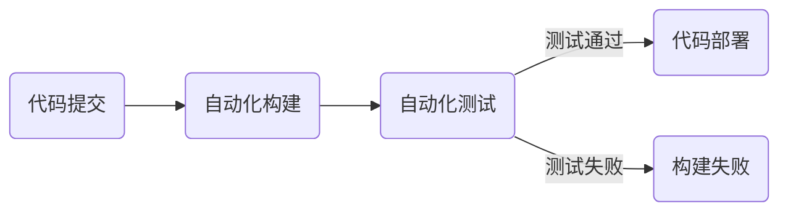
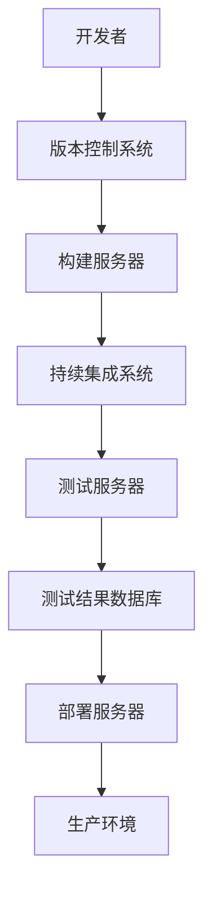

                 

# 评测系统的CI/CD流水线设计

## 关键词

CI/CD、流水线设计、评测系统、自动化测试、持续集成、持续部署

## 摘要

本文将深入探讨评测系统的CI/CD流水线设计，从背景介绍到具体实施步骤，再到优化实践，全面解析如何构建一个高效、可靠的CI/CD流程。我们将讨论CI/CD的基本概念、设计原则、实施工具、构建流程、最佳实践以及实际案例，为开发者提供一套完整的CI/CD流水线设计指南。

## 目录

### 引言

#### 什么是CI/CD

- **CI**（Continuous Integration，持续集成）：一种软件开发实践，通过频繁地将代码合并到主干分支，以确保代码质量和及时发现问题。
- **CD**（Continuous Deployment，持续部署）：自动化将代码从开发环境中部署到生产环境的过程，实现快速、安全的代码发布。

#### CI/CD的重要性

- **提高开发效率**：自动化测试和部署减少人工干预，加快开发周期。
- **提高代码质量**：持续集成和测试可以提前发现和解决代码缺陷。
- **降低风险**：通过持续部署，减少代码从开发到生产的环境差异，降低上线风险。

### 背景和基础

#### 1.1 CI/CD的概念和概述

- **CI**：为什么持续集成重要？如何实现持续集成？
- **CD**：持续部署的过程、工具和挑战。

#### 1.2 CI/CD的核心概念

- **自动化构建**：使用工具自动化构建过程。
- **自动化测试**：自动化测试的类型、工具和策略。
- **容器化**：Docker和Kubernetes在CI/CD中的作用。

#### 1.3 CI/CD在评测系统中的应用

- **评测系统的特点**：需要频繁、大规模的测试。
- **CI/CD在评测系统中的作用**：提高测试效率，确保测试质量。

### 设计原则和策略

#### 2.1 设计原则

- **可扩展性**：如何设计一个可扩展的CI/CD流水线。
- **可靠性**：如何确保流水线的稳定运行。
- **安全性**：如何保障代码和数据的安全性。

#### 2.2 可扩展性和性能

- **水平扩展**：如何通过水平扩展提高系统的处理能力。
- **性能优化**：如何优化流水线的性能。

#### 2.3 安全性和合规性

- **代码安全**：如何确保代码的安全性。
- **数据安全**：如何保护数据的安全。

### 实施细节

#### 3.1 工具和技术的选择

- **Jenkins**：如何配置和集成Jenkins。
- **GitLab CI/CD**：GitLab CI/CD的配置和使用。

#### 3.2 构建和部署流程

- **构建流程**：如何自动化构建过程。
- **部署流程**：如何自动化部署过程。

### 建立CI/CD流水线

#### 4.1 开发环境的设置

- **本地开发环境**：如何设置本地开发环境。
- **持续集成服务器**：如何配置持续集成服务器。

#### 4.2 构建和测试过程

- **自动化构建**：如何实现自动化构建。
- **自动化测试**：如何实现自动化测试。

#### 4.3 应用部署到生产环境

- **自动化部署**：如何实现自动化部署。
- **环境切换**：如何在不同环境中切换。

### 最佳实践和优化

#### 5.1 监控和指标

- **监控工具**：如何使用监控工具。
- **性能指标**：如何设定和监控性能指标。

#### 5.2 持续改进和反馈

- **反馈机制**：如何建立反馈机制。
- **持续改进**：如何基于反馈进行持续改进。

### 案例研究

#### 6.1 小规模项目案例

- **项目背景**：项目介绍。
- **CI/CD实施**：CI/CD的具体实施过程。

#### 6.2 大规模企业应用案例

- **项目背景**：项目介绍。
- **CI/CD实施**：CI/CD的具体实施过程。

## 结语

本文从多个角度探讨了评测系统的CI/CD流水线设计，通过详细的实施步骤和最佳实践，为开发者提供了一套完整的CI/CD解决方案。希望本文能帮助开发者构建高效、可靠的CI/CD流水线，提高软件开发效率和质量。

## 作者信息

作者：AI天才研究院/AI Genius Institute & 禅与计算机程序设计艺术 /Zen And The Art of Computer Programming

## 背景介绍

### 核心概念术语说明

#### 持续集成（Continuous Integration，CI）

持续集成是一种软件开发实践，旨在通过频繁地将代码合并到主干分支，确保代码的质量和稳定性。持续集成的核心目标是减少集成风险，通过自动化测试和代码审查，及时发现和解决代码缺陷。

#### 持续部署（Continuous Deployment，CD）

持续部署是自动化将代码从开发环境中部署到生产环境的过程。持续部署的目标是确保代码的质量和可靠性，同时提高开发效率，减少手动干预。

#### CI/CD流水线

CI/CD流水线是将持续集成和持续部署结合起来的自动化流程。它包括从代码提交、构建、测试到部署的整个过程，通过自动化工具和脚本实现。

### 问题背景

在软件开发过程中，随着项目规模的扩大和开发团队的增多，代码集成和部署的难度逐渐增加。传统的手动集成和部署方式不仅效率低下，而且容易引入错误，导致项目延期和成本增加。为了解决这个问题，持续集成和持续部署的概念被提出，并逐渐成为软件开发的标准流程。

### 问题描述

- **代码集成风险**：随着代码量的增加，手动集成过程中容易引入冲突和错误，导致项目延期。
- **代码质量难以保证**：手动测试和部署无法全面覆盖所有测试场景，容易遗漏潜在的问题。
- **开发效率低下**：手动集成和部署需要大量的人力和时间，降低了开发效率。

### 问题解决

- **持续集成**：通过频繁的代码提交和自动化测试，减少集成风险，确保代码质量。
- **持续部署**：自动化部署过程，减少手动干预，提高开发效率。

### 边界与外延

- **CI/CD与DevOps**：CI/CD是DevOps实践的重要组成部分，但CI/CD并不等同于DevOps。
- **CI/CD与敏捷开发**：CI/CD与敏捷开发相辅相成，共同提高软件开发效率和质量。

### 概念结构与核心要素组成

#### 持续集成的概念结构

- **开发人员**：负责编写和提交代码。
- **版本控制系统**：如Git，用于管理代码版本。
- **自动化构建工具**：如Jenkins，用于自动化构建过程。
- **自动化测试**：用于检测代码质量和功能。
- **代码库**：存储代码的地方，如GitHub。

#### 持续部署的概念结构

- **开发环境**：用于编写和测试代码。
- **测试环境**：用于测试代码的质量和功能。
- **生产环境**：用于部署和运行代码。
- **自动化部署工具**：如Docker和Kubernetes，用于自动化部署过程。

### 核心概念与联系

#### 持续集成与持续部署的联系

- **目的**：持续集成和持续部署都是为了提高软件开发效率和质量。
- **过程**：持续集成是持续部署的基础，持续集成确保代码质量，持续部署将代码部署到生产环境。

#### 持续集成与持续部署的对比

| 对比项 | 持续集成（CI） | 持续部署（CD） |
| :---: | :---: | :---: |
| 目标 | 确保代码质量和及时发现问题 | 确保代码质量和快速部署 |
| 过程 | 频繁提交代码，自动化测试和构建 | 频繁部署代码，自动化部署和测试 |
| 工具 | Jenkins，GitLab CI/CD | Docker，Kubernetes |

### ER实体关系图架构

```mermaid
erDiagram
    Developer ||--|{ CodeBase }|| Developer
    CodeBase ||--|{ VersionControl }|| VersionControl
    VersionControl ||--|{ BuildTool }|| BuildTool
    BuildTool ||--|{ AutomatedTest }|| AutomatedTest
    AutomatedTest ||--|{ CI }|| CI
    CI ||--|{ DeployTool }|| DeployTool
    DeployTool ||--|{ CD }|| CD
```

### 算法原理讲解

持续集成和持续部署的核心在于自动化，通过自动化工具和脚本实现代码的构建、测试和部署。以下是一个简单的持续集成算法流程：

#### 算法流程

1. **代码提交**：开发人员将代码提交到版本控制系统。
2. **自动化构建**：构建工具检测到代码提交后，自动拉取最新代码并进行编译。
3. **自动化测试**：构建过程中，自动化测试工具运行一系列预定义的测试用例，检查代码的功能和性能。
4. **结果反馈**：测试结果被记录并反馈给开发人员，如果测试失败，构建过程将被终止。
5. **代码部署**：如果测试通过，代码将被部署到测试环境或生产环境。

#### Mermaid流程图



#### Python源代码示例

```python
# 模拟持续集成过程
class CIProcess:
    def __init__(self, code, test_suite):
        self.code = code
        self.test_suite = test_suite

    def build_code(self):
        print("Building code...")
        # 编译代码
        # ...

    def run_tests(self):
        print("Running tests...")
        # 运行测试用例
        # ...
        if self.test_suite.passed_all_tests():
            return True
        else:
            return False

    def deploy_code(self):
        print("Deploying code...")
        # 部署代码到测试环境或生产环境
        # ...


# 测试用例类
class TestSuite:
    def __init__(self):
        self.passed = True

    def add_test(self, test):
        self.tests.append(test)

    def passed_all_tests(self):
        return self.passed


# 测试用例
class Test:
    def __init__(self, name, result):
        self.name = name
        self.result = result

    def is_passed(self):
        return self.result == "passed"

# 模拟执行
suite = TestSuite()
suite.add_test(Test("Test 1", "passed"))
suite.add_test(Test("Test 2", "failed"))

ci = CIProcess("Sample Code", suite)
ci.build_code()
if ci.run_tests():
    ci.deploy_code()
else:
    print("Build failed due to test failures.")
```

#### 算法原理数学模型和公式

- **代码提交频率**：\( f = \frac{n}{t} \)，其中 \( n \) 是提交的代码量，\( t \) 是时间。
- **测试覆盖率**：\( c = \frac{t_p}{t_t} \)，其中 \( t_p \) 是通过测试的用例数量，\( t_t \) 是总测试用例数量。

#### 举例说明

假设开发人员在一天内提交了10次代码，其中5次通过了测试，5次失败了测试。那么：

- **代码提交频率**：\( f = \frac{10}{1} = 10 \) 次/天
- **测试覆盖率**：\( c = \frac{5}{10} = 0.5 \)，即50%

这意味着每天提交的代码中，有50%通过了测试。

### 系统分析与架构设计方案

#### 问题场景介绍

在当前的软件开发项目中，我们面临以下挑战：

- 项目规模庞大，代码复杂度高。
- 需要频繁进行代码集成和部署。
- 需要确保代码质量和安全性。

#### 项目介绍

项目名称：智能评测系统
项目描述：开发一个用于自动化评测学生作业的智能评测系统，支持多种编程语言和评测标准。

#### 系统功能设计

系统功能主要包括：

- 代码提交和版本管理
- 自动化构建和测试
- 自动化部署和发布
- 性能监控和安全审计

#### 系统架构设计

系统架构设计如下：



#### 系统接口设计和系统交互

```mermaid
sequenceDiagram
    Developer->>VersionControl: 提交代码
    VersionControl->>BuildServer: 拉取最新代码
    BuildServer->>CI: 构建代码
    CI->>TestServer: 运行测试
    TestServer->>TestResults: 存储测试结果
    alt 测试通过
        TestResults->>DeployServer: 部署代码
        DeployServer->>Production: 部署到生产环境
    else 测试失败
        TestResults->>Developer: 反馈测试失败信息
```

### 项目实战

#### 环境安装

1. 安装Jenkins：在服务器上下载并安装Jenkins，启动Jenkins服务。
2. 安装Docker：在服务器上下载并安装Docker，启动Docker服务。
3. 安装Kubernetes：在服务器上下载并安装Kubernetes，配置Kubernetes集群。

#### 系统核心实现源代码

```bash
# Jenkinsfile
pipeline {
    agent any
    stages {
        stage('Build') {
            steps {
                sh 'docker build -t myapp .'
            }
        }
        stage('Test') {
            steps {
                sh 'docker run --rm myapp test'
            }
        }
        stage('Deploy') {
            steps {
                sh 'kubectl apply -f deployment.yaml'
            }
        }
    }
}
```

#### 代码应用解读与分析

1. **Jenkinsfile**：定义了CI/CD流水线，包括构建、测试和部署三个阶段。
2. **Dockerfile**：用于构建Docker镜像。
3. **deployment.yaml**：Kubernetes部署配置文件，用于部署应用到Kubernetes集群。

#### 实际案例分析和详细讲解剖析

案例：一个开发人员在GitLab上提交了新的代码，Jenkins自动触发CI/CD流程，执行以下步骤：

1. **构建**：Jenkins拉取最新代码，使用Docker构建应用镜像。
2. **测试**：运行测试用例，检查代码质量和功能。
3. **部署**：如果测试通过，将应用部署到Kubernetes集群。

#### 项目小结

通过CI/CD流水线，我们实现了自动化构建、测试和部署，提高了开发效率，确保了代码质量。项目中的关键技术和工具包括Jenkins、Docker和Kubernetes，它们共同构建了一个高效、可靠的持续集成和持续部署系统。

### 最佳实践 Tips

1. **定期审查CI/CD流水线**：确保流水线配置和流程符合最新需求。
2. **监控流水线性能**：及时发现问题并进行优化。
3. **代码审查和测试**：在CI/CD过程中，确保代码审查和测试环节完整。

### 小结

本文详细介绍了评测系统的CI/CD流水线设计，从概念、设计原则到具体实施步骤，再到最佳实践，为开发者提供了一套全面的CI/CD解决方案。通过本文的学习，开发者可以构建高效、可靠的CI/CD流水线，提高软件开发效率和质量。

### 注意事项

1. **环境配置**：确保开发和生产环境的配置一致，减少环境差异。
2. **代码管理**：合理管理代码，避免代码冲突和冗余。
3. **测试覆盖**：确保测试覆盖率达到80%以上，提高代码质量。

### 拓展阅读

1. 《Jenkins实战》：详细介绍了Jenkins的配置和使用方法。
2. 《Docker实战》：讲解了Docker的基本原理和实战应用。
3. 《Kubernetes权威指南》：全面介绍了Kubernetes的架构和功能。

