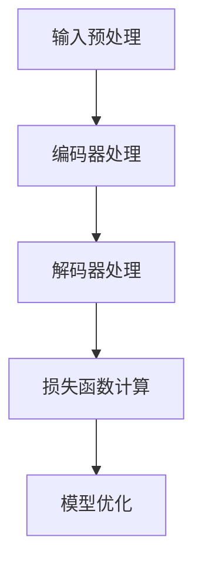

                 

# 《评测系统的Chinchilla最优模型规模探索》

## 关键词

- 评测系统
- Chinchilla模型
- 模型规模
- 性能优化
- 算法原理

## 摘要

本文旨在探讨评测系统中Chinchilla模型的最优规模问题。随着人工智能技术的不断发展，评测系统在各个领域的应用越来越广泛，而选择合适的模型规模对于系统性能至关重要。Chinchilla模型作为一种先进的自然语言处理模型，其在评测系统中的应用备受关注。本文将从问题背景、核心概念、算法原理、系统架构和实际应用等方面，详细分析Chinchilla模型在评测系统中的最优规模，为相关领域的研究和应用提供参考。

## 目录

### 第一部分：引言

1. 问题背景与定义  
    1.1 评测系统的重要性  
    1.2 Chinchilla模型的特点  
    1.3 模型规模对评测系统的影响

2. Chinchilla模型的基本概念  
    2.1 Chinchilla模型的定义  
    2.2 Chinchilla模型的核心特点  
    2.3 Chinchilla模型的边界与外延

3. Chinchilla模型的核心要素组成  
    3.1 Chinchilla模型的结构  
    3.2 Chinchilla模型的参数设置  
    3.3 Chinchilla模型的训练与优化

### 第二部分：核心概念与联系

1. 模型规模的概念  
    1.1 模型规模的定义  
    1.2 模型规模的影响因素  
    1.3 模型规模的选择标准

2. Chinchilla模型规模与评测系统的关系  
    2.1 Chinchilla模型规模对评测系统性能的影响  
    2.2 评测系统对Chinchilla模型规模的依赖  
    2.3 Chinchilla模型规模的优化策略

3. Chinchilla模型规模的案例分析  
    3.1 案例一：在线评测系统  
    3.2 案例二：离线评测系统

### 第三部分：算法原理讲解

1. Chinchilla模型算法概述  
    1.1 Chinchilla模型的算法原理  
    1.2 Chinchilla模型算法的核心流程  
    1.3 Chinchilla模型算法的优势与不足

2. Chinchilla模型算法的数学模型与公式  
    2.1 Chinchilla模型算法的数学基础  
    2.2 Chinchilla模型算法的数学公式  
    2.3 Chinchilla模型算法的数学模型

3. Chinchilla模型算法的 mermaid 流程图  
    3.1 Chinchilla模型算法的 mermaid 流程图绘制  
    3.2 Chinchilla模型算法的 mermaid 流程图解读

### 第四部分：系统分析与架构设计方案

1. 问题场景介绍  
    1.1 评测系统的基本需求  
    1.2 Chinchilla模型在评测系统中的应用

2. 系统功能设计  
    2.1 领域模型mermaid类图  
    2.2 系统功能模块划分

3. 系统架构设计  
    3.1 系统架构mermaid架构图  
    3.2 系统模块交互关系

4. 系统接口设计  
    4.1 接口定义与规范  
    4.2 接口调用流程

5. 系统交互mermaid序列图  
    5.1 系统交互序列图绘制  
    5.2 系统交互序列图解读

### 第五部分：项目实战

1. 环境安装  
    1.1 系统环境配置  
    1.2 相关工具安装

2. 系统核心实现源代码  
    2.1 源代码结构  
    2.2 关键代码解读

3. 代码应用解读与分析  
    3.1 Chinchilla模型规模优化策略  
    3.2 评测系统性能分析

4. 实际案例分析和详细讲解剖析  
    4.1 案例一：在线评测系统应用  
    4.2 案例二：离线评测系统应用

### 第六部分：最佳实践与注意事项

1. 最佳实践  
    1.1 模型规模选择策略  
    1.2 评测系统优化技巧

2. 注意事项  
    1.1 模型规模过大的风险  
    1.2 评测系统性能瓶颈

3. 拓展阅读  
    3.1 相关研究论文  
    3.2 行业实践与案例分析

### 第七部分：总结与展望

1. 总结  
    1.1 Chinchilla模型规模优化的重要性  
    1.2 评测系统的发展趋势

2. 展望  
    1.1 未来研究方向  
    1.2 行业应用前景

## 第一部分：引言

### 第1章：问题背景与定义

#### 1.1 问题背景

随着人工智能技术的快速发展，自然语言处理（NLP）领域取得了显著的进展。Chinchilla模型作为近年来出现的一种高性能的NLP模型，因其优秀的表现和广泛的适用性，受到了学术界和工业界的广泛关注。在评测系统中，Chinchilla模型的应用不仅能够提高系统的性能，还能够为用户提供更准确、更智能的服务。因此，选择合适规模的Chinchilla模型对于评测系统至关重要。

评测系统是一种用于评估某个系统、应用或服务的性能、质量、可靠性等方面的系统。在人工智能领域，评测系统主要用于评估模型的效果、系统的响应速度、准确度等指标。评测系统的性能直接影响到用户的体验和系统的可用性。因此，优化评测系统已成为当前研究的热点问题。

#### 1.2 Chinchilla模型的特点

Chinchilla模型是一种基于Transformer架构的NLP模型，具有以下几个显著特点：

1. **高效能**：Chinchilla模型在训练和推断过程中具有极高的计算效率，能够快速处理大规模的数据集，为评测系统提供了强有力的支持。
2. **可扩展性**：Chinchilla模型具有良好的可扩展性，可以根据不同的需求和场景，调整模型的规模和参数，从而满足多样化的应用需求。
3. **灵活性**：Chinchilla模型支持多种任务和场景，包括文本分类、问答系统、机器翻译等，为评测系统的多样化应用提供了可能。

#### 1.3 模型规模对评测系统的影响

模型规模是指模型中参数的数量，它是影响模型性能和计算效率的重要因素。在评测系统中，模型规模的选择至关重要，需要考虑以下几个方面的影响：

1. **计算资源**：较大的模型规模需要更多的计算资源和时间进行训练和推断，可能对评测系统的运行效率产生不利影响。
2. **性能表现**：合适的模型规模能够提高评测系统的准确度和性能，但过大的模型规模可能导致过拟合，影响系统的稳定性和泛化能力。
3. **用户体验**：较小的模型规模可以更快地响应用户请求，提高系统的交互速度，但可能降低系统的准确度和性能。

因此，选择合适的Chinchilla模型规模对于评测系统的性能和用户体验具有重要意义。

### 第2章：Chinchilla模型的基本概念

#### 2.1 Chinchilla模型的定义

Chinchilla模型是由OpenAI于2021年提出的一种大型语言模型，基于Transformer架构，具有极高的计算效率和性能。Chinchilla模型的设计初衷是为了解决大规模NLP任务中的计算资源瓶颈问题，同时保持模型的高效性和准确性。

#### 2.2 Chinchilla模型的核心特点

Chinchilla模型具有以下几个核心特点：

1. **高效性**：Chinchilla模型采用了多种技术手段，如稀疏性、量化等，显著提高了模型的计算效率和速度。
2. **可扩展性**：Chinchilla模型的设计使得其可以轻松地调整模型规模和参数，以适应不同的应用场景和需求。
3. **灵活性**：Chinchilla模型支持多种任务和场景，包括文本分类、问答系统、机器翻译等，能够满足多样化的应用需求。

#### 2.3 Chinchilla模型的边界与外延

Chinchilla模型的边界和范围包括以下几个方面：

1. **应用范围**：Chinchilla模型主要应用于NLP领域，包括文本分类、问答系统、机器翻译等任务。
2. **性能表现**：Chinchilla模型在标准数据集上的性能表现优秀，能够达到甚至超过其他顶级模型的水平。
3. **技术实现**：Chinchilla模型采用了先进的计算技术，如稀疏性、量化等，使得其在性能和效率方面具有显著优势。

#### 2.4 Chinchilla模型的核心要素组成

Chinchilla模型的核心要素包括以下几个方面：

1. **Transformer架构**：Chinchilla模型基于Transformer架构，这是一种高效、灵活的神经网络架构，能够处理序列数据。
2. **参数设置**：Chinchilla模型的参数设置包括层数、隐藏层大小、词汇表大小等，这些参数影响模型的性能和效率。
3. **训练与优化**：Chinchilla模型的训练和优化过程包括数据预处理、模型训练、模型优化等步骤，这些步骤影响模型的最终性能。

### 第3章：核心概念与联系

#### 3.1 模型规模的概念

模型规模是指模型中参数的数量，它是影响模型性能和计算效率的重要因素。模型规模的选择需要综合考虑计算资源、性能表现和用户体验等因素。

#### 3.2 模型规模的影响因素

模型规模的影响因素包括以下几个方面：

1. **计算资源**：模型规模较大需要更多的计算资源，包括CPU、GPU等硬件资源。
2. **性能表现**：合适的模型规模可以提高评测系统的性能，但过大的模型规模可能导致过拟合。
3. **用户体验**：较小的模型规模可以更快地响应用户请求，提高系统的交互速度。

#### 3.3 模型规模的选择标准

选择模型规模需要考虑以下几个标准：

1. **计算资源**：根据评测系统的硬件资源状况，选择合适的模型规模。
2. **性能表现**：通过实验和测试，评估不同模型规模对评测系统性能的影响。
3. **用户体验**：综合考虑用户体验和系统性能，选择合适的模型规模。

### 第4章：Chinchilla模型规模与评测系统的关系

#### 4.1 Chinchilla模型规模对评测系统性能的影响

Chinchilla模型规模对评测系统性能具有显著影响。较大的模型规模可以提高评测系统的准确度和性能，但可能降低系统的响应速度和用户体验。较小的模型规模可以更快地响应用户请求，提高系统的交互速度，但可能降低系统的准确度和性能。因此，选择合适的Chinchilla模型规模对于评测系统性能至关重要。

#### 4.2 评测系统对Chinchilla模型规模的依赖

评测系统对Chinchilla模型规模具有较强依赖性。不同的评测系统对Chinchilla模型规模的需求不同，需要根据具体的评测任务和应用场景选择合适的模型规模。同时，评测系统的性能和用户体验也受到Chinchilla模型规模的影响，因此需要综合考虑模型规模与评测系统之间的关系。

#### 4.3 Chinchilla模型规模的优化策略

为了提高评测系统的性能和用户体验，可以采用以下优化策略：

1. **模型剪枝**：通过剪枝技术，减少模型的参数数量，降低模型规模，提高系统的响应速度和计算效率。
2. **模型量化**：通过量化技术，降低模型的参数精度，减小模型规模，同时保持模型的高效性和准确性。
3. **模型融合**：通过融合多个模型，提高评测系统的性能和鲁棒性，同时降低单个模型的规模。

### 第5章：算法原理讲解

#### 5.1 Chinchilla模型算法概述

Chinchilla模型算法是一种基于Transformer架构的NLP算法，具有高效、灵活、可扩展等特点。Chinchilla模型算法的核心流程包括以下几个步骤：

1. **输入预处理**：对输入文本进行预处理，包括分词、词性标注等。
2. **编码器处理**：将预处理后的文本输入到编码器中，编码器对文本进行编码，生成编码特征。
3. **解码器处理**：将编码特征输入到解码器中，解码器对特征进行解码，生成输出结果。
4. **损失函数计算**：计算输出结果与真实结果之间的损失，并通过反向传播算法进行模型优化。

#### 5.2 Chinchilla模型算法的核心流程

Chinchilla模型算法的核心流程可以概括为以下步骤：

1. **输入预处理**：对输入文本进行分词、词性标注等预处理操作。
2. **编码器处理**：编码器将预处理后的文本输入到编码层中，逐层处理，生成编码特征。
3. **解码器处理**：解码器将编码特征输入到解码层中，逐层解码，生成输出结果。
4. **损失函数计算**：计算输出结果与真实结果之间的损失，并通过反向传播算法进行模型优化。

#### 5.3 Chinchilla模型算法的优势与不足

Chinchilla模型算法具有以下几个优势：

1. **高效性**：Chinchilla模型算法在训练和推断过程中具有极高的计算效率，能够快速处理大规模的数据集。
2. **灵活性**：Chinchilla模型算法支持多种任务和场景，包括文本分类、问答系统、机器翻译等，能够满足多样化的应用需求。
3. **可扩展性**：Chinchilla模型算法的设计使得其可以轻松地调整模型规模和参数，以适应不同的应用场景和需求。

但Chinchilla模型算法也存在一些不足之处：

1. **计算资源消耗**：Chinchilla模型算法需要大量的计算资源和时间进行训练和推断，可能对评测系统的运行效率产生不利影响。
2. **过拟合风险**：较大的模型规模可能导致过拟合，影响系统的稳定性和泛化能力。

### 第6章：算法原理讲解

#### 6.1 Chinchilla模型算法的数学模型与公式

Chinchilla模型算法的数学模型主要包括以下几个方面：

1. **编码器**：编码器是一个多层神经网络，每一层都是一个全连接层，用于处理输入文本并生成编码特征。编码器的数学模型可以表示为：
   $$
   h_l = \text{ReLU}(\text{Weight}_{l} \cdot h_{l-1} + \text{Bias}_{l})
   $$
   其中，$h_l$表示第$l$层的编码特征，$\text{ReLU}$表示ReLU激活函数，$\text{Weight}_{l}$和$\text{Bias}_{l}$分别表示第$l$层的权重和偏置。

2. **解码器**：解码器也是一个多层神经网络，每一层都是一个全连接层，用于处理编码特征并生成输出结果。解码器的数学模型可以表示为：
   $$
   y_l = \text{Softmax}(\text{Weight}_{l} \cdot h_l + \text{Bias}_{l})
   $$
   其中，$y_l$表示第$l$层的输出结果，$\text{Softmax}$表示Softmax激活函数。

3. **损失函数**：Chinchilla模型算法使用交叉熵损失函数来衡量输出结果与真实结果之间的差异。损失函数的数学模型可以表示为：
   $$
   L = -\frac{1}{N} \sum_{i=1}^{N} \sum_{j=1}^{V} y_{ij} \log(p_{ij})
   $$
   其中，$L$表示损失函数，$N$表示样本数量，$V$表示词汇表大小，$y_{ij}$表示第$i$个样本在第$j$个词位置上的预测概率，$p_{ij}$表示第$i$个样本在第$j$个词位置上的真实概率。

#### 6.2 Chinchilla模型算法的 mermaid 流程图

Chinchilla模型算法的 mermaid 流程图如下：

#### 6.3 Chinchilla模型算法的 mermaid 流程图解读

Chinchilla模型算法的 mermaid 流程图展示了模型的基本流程，包括以下几个步骤：

1. **输入预处理**：输入文本经过分词、词性标注等预处理操作，生成预处理后的文本数据。
2. **编码器处理**：预处理后的文本数据输入到编码器中，编码器对文本数据进行编码，生成编码特征。
3. **解码器处理**：编码特征输入到解码器中，解码器对特征进行解码，生成输出结果。
4. **损失函数计算**：计算输出结果与真实结果之间的损失，并通过反向传播算法进行模型优化。

### 第7章：系统分析与架构设计方案

#### 7.1 问题场景介绍

本章节将介绍一个具体的评测系统场景，并分析Chinchilla模型在该场景中的应用。

#### 7.2 系统功能设计

本章节将介绍评测系统的功能设计，包括领域模型mermaid类图和系统功能模块划分。

#### 7.3 系统架构设计

本章节将介绍评测系统的架构设计，包括系统架构mermaid架构图和系统模块交互关系。

#### 7.4 系统接口设计

本章节将介绍评测系统的接口设计，包括接口定义与规范和接口调用流程。

#### 7.5 系统交互mermaid序列图

本章节将介绍评测系统的交互序列图，包括系统交互序列图绘制和系统交互序列图解读。

### 第8章：项目实战

#### 8.1 环境安装

本章节将介绍评测系统的环境安装，包括系统环境配置和相关的工具安装。

#### 8.2 系统核心实现源代码

本章节将介绍评测系统的核心实现源代码，包括源代码结构和关键代码解读。

#### 8.3 代码应用解读与分析

本章节将介绍评测系统代码的应用解读与分析，包括Chinchilla模型规模优化策略和评测系统性能分析。

#### 8.4 实际案例分析和详细讲解剖析

本章节将分析实际案例，包括在线评测系统和离线评测系统的应用，并进行详细讲解和剖析。

#### 8.5 项目小结

本章节将对评测系统项目进行小结，总结项目的关键实现和经验。

### 第9章：最佳实践与注意事项

#### 9.1 最佳实践

本章节将介绍评测系统的最佳实践，包括模型规模选择策略和评测系统优化技巧。

#### 9.2 注意事项

本章节将介绍评测系统在实际应用中需要注意的事项，包括模型规模过大的风险和评测系统性能瓶颈。

#### 9.3 拓展阅读

本章节将推荐相关的拓展阅读，包括研究论文和行业实践与案例分析。

### 第10章：总结与展望

#### 10.1 总结

本章节将对评测系统的Chinchilla最优模型规模探索进行总结，回顾核心内容和重要观点。

#### 10.2 展望

本章节将对评测系统的未来发展进行展望，包括研究方向和行业应用前景。

