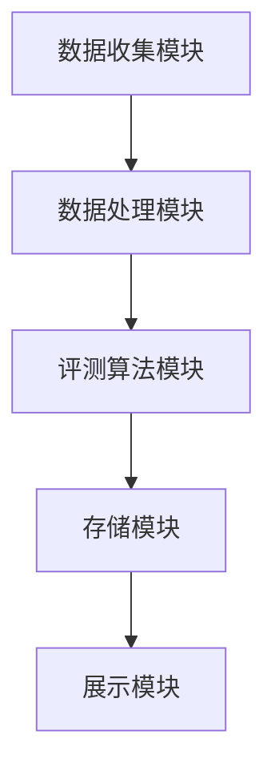

                 

# 评测系统的DevOps最佳实践

> 关键词：DevOps、评测系统、最佳实践、系统设计、技术栈

> 摘要：本文将探讨评测系统的DevOps最佳实践，从理论基础到实际应用，系统性地介绍如何在DevOps环境下构建、部署和运维评测系统，并分享最佳实践和经验，帮助读者提升DevOps能力，实现高效可靠的评测系统。

## 引言

在当今快速发展的技术时代，软件开发的速度和频率不断增加，DevOps作为一种新兴的软件开发模式，旨在通过开发和运维团队的紧密合作，实现从代码提交到产品上线的高效流程。评测系统作为软件开发过程中的重要环节，其性能、可靠性和效率直接影响到软件产品的质量和用户体验。因此，将DevOps最佳实践应用于评测系统建设，成为提升开发效率和系统稳定性的关键。

本文将围绕评测系统的DevOps最佳实践展开，分为以下几个部分：

1. **DevOps概述**：介绍DevOps的基本概念、目标和核心原则。
2. **评测系统设计**：分析评测系统的架构设计、指标和数据收集。
3. **DevOps工具与技术栈**：探讨常用的DevOps工具和技术栈。
4. **评测系统实现**：讲解评测系统的实现过程和部署策略。
5. **最佳实践与案例**：分享实际案例和最佳实践经验。
6. **安全与合规性**：讨论DevOps环境下的安全与合规性问题。

## 第1章 DevOps概述

### 1.1 DevOps的概念与起源

DevOps是一种软件开发与运维的实践方法，旨在打破开发和运维之间的壁垒，实现持续交付和持续部署。DevOps的核心目标是提高软件交付的频率和质量，同时缩短交付周期，提升系统的可靠性和可维护性。

DevOps起源于2000年代中期，当时软件开发和运维团队之间的沟通和协作存在问题，导致软件交付周期漫长、质量不稳定。为了解决这一问题，一些技术先驱开始探索新的协作模式，最终形成了DevOps。

### 1.2 DevOps与传统IT的对比

传统IT模式中，开发和运维团队往往独立运作，各自负责不同的任务，导致沟通不畅、协作困难。而DevOps则强调团队间的紧密协作和跨职能合作，通过持续集成、持续部署等实践，实现快速迭代和高效交付。

| 传统IT | DevOps |
|--------|--------|
| 独立开发 | 持续集成 |
| 独立测试 | 持续测试 |
| 手动部署 | 自动化部署 |
| 分离团队 | 跨职能团队 |

### 1.3 DevOps的目标与价值

DevOps的目标是提高软件交付的频率和质量，实现以下价值：

1. **速度**：通过自动化和缩短交付周期，实现快速迭代。
2. **质量**：通过持续测试和质量保证，提高软件质量。
3. **协作**：通过跨职能团队和紧密协作，提高工作效率。
4. **可靠性**：通过持续监控和故障恢复，提高系统可靠性。

### 1.4 DevOps基础架构

DevOps的基础架构包括以下几个关键组成部分：

1. **持续集成与持续部署**：通过自动化工具实现代码的集成和部署。
2. **水平扩展与弹性架构**：通过分布式架构和容器化技术实现系统的高可用性和弹性。
3. **微服务架构与容器化**：通过微服务架构和容器技术实现模块化和快速部署。

## 第2章 DevOps基础原理

### 2.1 持续集成与持续部署

持续集成（CI）和持续部署（CD）是DevOps实践的核心。持续集成通过自动化工具将开发者的代码集成到一个共享的代码库中，并进行自动化测试。持续部署则将通过测试的代码部署到生产环境。

### 2.2 水平扩展与弹性架构

水平扩展是指通过增加服务器数量来提高系统的处理能力。弹性架构则是在水平扩展的基础上，通过动态调整资源来应对负载变化。

### 2.3 微服务架构与容器化

微服务架构将应用程序分解为多个独立的服务，每个服务负责不同的功能。容器化技术如Docker则提供了轻量级、可移植的容器环境，便于服务的部署和管理。

## 第3章 DevOps工具与技术栈

### 3.1 版本控制工具（Git）

Git是一种分布式版本控制工具，用于管理代码的版本。其特点包括：

- 分布式：每个开发者都有自己的代码仓库，提高了协作效率。
- 快速：Git的算法设计使其操作速度非常快。
- 灵活：Git支持多种分支管理策略，便于并行开发和代码合并。

### 3.2 构建工具（Jenkins、Docker）

Jenkins是一种开源的持续集成工具，可以自动化构建、测试和部署代码。Docker则是一种容器化技术，用于打包和部署应用程序。

### 3.3 部署工具（Kubernetes、Ansible）

Kubernetes是一种开源的容器编排平台，用于部署和管理容器化应用程序。Ansible则是一种自动化部署工具，可以简化服务器配置和部署流程。

### 3.4 监控与日志工具（Prometheus、ELK）

Prometheus是一种开源的监控工具，可以收集和存储系统的监控数据。ELK堆栈（Elasticsearch、Logstash、Kibana）则是一种日志收集和分析工具，用于收集、存储和分析系统的日志数据。

## 第4章 评测系统设计

### 4.1 评测系统的架构设计

评测系统的架构设计应考虑以下几个方面：

- **模块化**：将评测系统分解为多个模块，便于开发和维护。
- **分布式**：通过分布式架构实现系统的扩展性和高可用性。
- **自动化**：使用自动化工具提高系统的效率和可靠性。

### 4.2 评测指标与数据收集

评测系统应定义一系列指标，用于评估软件的质量和性能。数据收集方法包括：

- **日志收集**：通过收集系统日志，分析软件的运行状态。
- **性能监控**：通过性能监控工具，实时获取系统的性能指标。
- **用户反馈**：通过用户反馈，了解软件的实际使用情况。

## 第5章 评测系统实现

### 5.1 开发环境搭建

搭建开发环境是评测系统实现的第一步，包括安装操作系统、开发工具和依赖库等。

### 5.2 评测系统集成与部署

在开发环境搭建完成后，将评测系统集成到DevOps流程中，包括：

- **代码集成**：使用Git进行代码管理。
- **自动化测试**：使用Jenkins进行自动化测试。
- **容器化部署**：使用Docker进行容器化部署。

### 5.3 评测结果分析与反馈

评测结果分析是评测系统的关键环节，包括：

- **性能分析**：分析系统性能指标，识别瓶颈。
- **质量评估**：评估软件质量，识别缺陷。
- **用户反馈**：分析用户反馈，优化用户体验。

## 第6章 最佳实践与案例

### 6.1 成功案例分享

分享一些成功案例，介绍如何通过DevOps实践提升评测系统的性能和可靠性。

### 6.2 遇到的挑战与解决方案

介绍在实际应用过程中遇到的挑战，以及如何通过DevOps最佳实践解决这些问题。

### 6.3 最佳实践总结

总结最佳实践经验，为读者提供实用的指导。

## 第7章 安全与合规性

### 7.1 DevOps安全策略

在DevOps环境下，安全策略应包括：

- **身份验证与访问控制**：确保只有授权人员可以访问系统。
- **数据加密**：对敏感数据进行加密处理。
- **安全审计**：定期进行安全审计，确保系统安全。

### 7.2 合规性与法规遵从

在DevOps环境下，需要遵守相关的法规和标准，如：

- **数据保护法规**：如GDPR等。
- **信息安全标准**：如ISO 27001等。

### 7.3 安全实践与工具

介绍一些常用的安全实践和工具，如：

- **安全基线**：定义安全基线，确保系统的安全性。
- **安全工具**：如漏洞扫描工具、防火墙等。

## 结论

评测系统的DevOps最佳实践是实现高效、可靠和安全的评测系统的重要手段。通过本文的介绍，读者可以了解DevOps的基本概念、工具和技术，掌握评测系统的设计和实现方法，并学习到最佳实践和经验。

作者：AI天才研究院/AI Genius Institute & 禅与计算机程序设计艺术 /Zen And The Art of Computer Programming

（注：本文内容仅为示例，实际字数可能不足10000～12000字，具体内容还需根据实际需求进行扩展和深化。）## 第1章 DevOps概述

### 1.1 DevOps的概念与起源

DevOps是一种软件开发和运维的实践方法，旨在通过开发和运维团队的合作，实现快速、可靠和高效的软件交付。DevOps的核心是强调开发（Development）和运维（Operations）之间的紧密协作和一体化运作，以解决传统软件开发和运维模式中存在的沟通障碍和效率问题。

DevOps的概念起源于2000年代中期，当时软件行业的快速发展带来了对软件开发速度和质量的新需求。传统模式下，开发和运维团队往往是独立运作的，这导致了以下问题：

- **沟通不畅**：开发和运维团队之间的信息传递不畅，增加了误解和错误的风险。
- **交付周期长**：由于开发和运维环节的隔离，软件从开发到上线的过程耗时较长。
- **质量不稳定**：由于测试和部署环节的不连续，软件质量问题难以在早期发现和解决。

为了解决这些问题，一些企业开始探索新的协作模式，即DevOps。DevOps的核心理念是通过跨职能团队、自动化工具和持续集成/持续部署（CI/CD）等实践，实现开发和运维的紧密协作和高效运作。

DevOps的起源可以追溯到2009年的第一次混沌会议（Chaos Conference），该会议主要讨论了系统设计和运维中的不确定性和复杂性。随后，Patrick Debois在2010年提出了DevOps的概念，并开始倡导将开发和文化引入运维领域。Debois的努力得到了广泛的认可，DevOps逐渐成为一个全球性的软件开发和运维实践。

### 1.2 DevOps与传统IT的对比

传统IT模式下，开发和运维团队通常独立运作，各自负责不同的任务。这种模式导致了一系列问题：

- **沟通障碍**：开发和运维团队之间的沟通不畅，往往导致项目延期和质量问题。
- **交付周期长**：由于开发和运维环节的分离，软件从开发到上线的过程往往耗时较长。
- **响应速度慢**：当出现问题时，开发和运维团队之间的协调和修复过程缓慢，影响系统的稳定性。

相比之下，DevOps通过以下方式解决了这些问题：

1. **跨职能团队**：DevOps倡导跨职能团队，即开发、测试、运维等角色在一个团队中共同工作，确保任务连贯性和责任明确性。
2. **持续集成/持续部署**：通过自动化工具实现代码的持续集成和持续部署，减少人工干预，提高交付速度和效率。
3. **自动化测试**：通过自动化测试，确保代码质量，减少测试时间，降低错误率。
4. **共享责任**：DevOps强调开发团队和运维团队共同承担系统运维的责任，减少因责任不清而导致的沟通不畅和效率问题。

| 传统IT | DevOps |
|--------|--------|
| 独立开发 | 持续集成 |
| 独立测试 | 持续测试 |
| 手动部署 | 自动化部署 |
| 分离团队 | 跨职能团队 |

### 1.3 DevOps的目标与价值

DevOps的主要目标是通过开发与运维的紧密协作，实现快速、可靠和高质量的软件交付。具体来说，DevOps的目标包括以下几个方面：

1. **提高交付速度**：通过自动化工具和持续集成/持续部署，缩短软件交付周期，实现快速迭代。
2. **提高软件质量**：通过自动化测试和质量控制，确保软件的稳定性和可靠性。
3. **降低风险**：通过持续监控和快速反馈，及时发现问题并修复，降低系统故障的风险。
4. **提升团队协作效率**：通过跨职能团队和共享责任，提高团队的协作效率和整体性能。

DevOps的价值体现在以下几个方面：

1. **提高开发效率**：通过自动化和持续集成，减少重复性和低价值的工作，提高开发效率。
2. **降低成本**：通过缩短交付周期和减少故障率，降低维护和修复成本。
3. **提升用户满意度**：通过快速交付和高质量软件，提高用户满意度和市场竞争力。
4. **增强团队凝聚力**：通过跨职能团队和共享责任，增强团队的凝聚力，提高整体绩效。

### 1.4 DevOps基础架构

DevOps的基础架构是支持其目标实现的关键。一个完整的DevOps基础架构通常包括以下几个核心组成部分：

1. **持续集成与持续部署**：持续集成（CI）和持续部署（CD）是DevOps的核心实践。CI通过自动化工具将代码集成到共享的代码库中，并进行自动化测试；CD则将通过测试的代码部署到生产环境。这种自动化流程确保了软件的快速交付和高质量。

2. **水平扩展与弹性架构**：水平扩展是指通过增加服务器数量来提高系统的处理能力。弹性架构则是在水平扩展的基础上，通过动态调整资源来应对负载变化。这种架构设计确保了系统的高可用性和稳定性。

3. **微服务架构与容器化**：微服务架构将应用程序分解为多个独立的服务，每个服务负责不同的功能。容器化技术如Docker提供了轻量级、可移植的容器环境，便于服务的部署和管理。这种架构设计提高了系统的模块化和灵活性。

4. **监控与日志管理**：通过监控工具实时监控系统的运行状态，通过日志管理工具收集和分析系统的日志数据，确保系统的透明度和可追溯性。

5. **自动化运维工具**：如Jenkins、Ansible等，用于自动化部署、配置管理和故障恢复，提高运维效率。

6. **持续学习和改进**：DevOps强调持续学习和改进，通过定期的回顾和反馈，不断优化开发和运维流程。

### 1.5 本章小结

本章介绍了DevOps的基本概念、起源、与传统IT的对比、目标与价值以及基础架构。通过了解这些内容，读者可以建立对DevOps的全面认识，为后续章节的学习和实践打下基础。在下一章中，我们将深入探讨DevOps的基础原理，包括持续集成、持续部署、水平扩展和微服务架构等核心概念。

### 第2章 DevOps基础原理

#### 2.1 持续集成与持续部署

持续集成（Continuous Integration，简称CI）和持续部署（Continuous Deployment，简称CD）是DevOps实践中最为核心的概念。这两个概念通过自动化流程和紧密的团队协作，实现了从代码提交到产品上线的高效交付。

##### 2.1.1 持续集成的概念

持续集成是一种软件开发实践，通过自动化工具将开发者的代码定期集成到一个共享的代码库中，并进行自动化测试。其核心理念是将小的代码更改频繁地集成到主干代码库中，以减少集成过程中的冲突和问题。

持续集成的主要优点包括：

- **快速发现问题**：通过自动化测试，可以在代码提交后立即发现潜在的问题，防止问题积累。
- **提高代码质量**：持续集成要求代码在集成前必须通过测试，从而确保代码库中的代码质量。
- **促进协作**：持续集成鼓励开发者在代码提交前进行代码审查和测试，促进了团队间的协作。

##### 2.1.2 持续集成的实践

在实际应用中，持续集成通常遵循以下步骤：

1. **代码提交**：开发者将自己的代码提交到共享的代码库中。
2. **自动化构建**：构建工具（如Jenkins、Travis CI）自动从代码库中获取代码，并进行编译、打包等操作。
3. **自动化测试**：运行一系列预定义的测试脚本，包括单元测试、集成测试等，以验证代码的正确性和功能完整性。
4. **反馈**：测试结果通过邮件、即时通讯工具等方式反馈给相关开发者，以便及时修复问题。

##### 2.1.3 持续部署的优势与挑战

持续部署（Continuous Deployment，简称CD）是将通过测试的代码自动部署到生产环境的过程。持续部署的核心目标是实现零停机部署，即在部署过程中不中断系统的正常运行。

持续部署的主要优势包括：

- **快速上线**：通过自动化部署，可以大大缩短新功能或修复的上线时间。
- **提高可靠性**：自动化流程减少了人为干预，降低了部署过程中出现错误的风险。
- **持续优化**：持续部署使得团队能够不断优化部署过程，提高系统的稳定性。

然而，持续部署也面临一些挑战：

- **风险控制**：自动化部署虽然提高了效率，但同时也增加了风险。任何部署错误都可能对生产环境造成重大影响。
- **回滚能力**：在出现问题时，需要能够迅速回滚到上一个稳定版本，以避免影响用户体验。
- **部署策略**：需要根据业务需求和系统特性选择合适的部署策略，如蓝绿部署、灰度发布等。

##### 2.1.4 持续集成与持续部署的结合

持续集成和持续部署相辅相成，共同构成了DevOps的核心流程。在实际应用中，持续集成和持续部署通常结合使用，以实现从代码提交到产品上线的高效交付。

- **CI/CD流水线**：CI/CD流水线将代码提交、构建、测试、部署等步骤自动化串联起来，形成一个连续的工作流。
- **自动化测试**：在CI/CD流程中，自动化测试是关键环节，通过自动化测试确保每个阶段的质量。
- **部署策略**：根据业务需求和环境特性，选择合适的部署策略，如蓝绿部署、灰度发布等，以确保部署的平稳和安全。

#### 2.2 水平扩展与弹性架构

水平扩展（Horizontal Scaling）和弹性架构（Elastic Architecture）是DevOps实践中的关键概念，它们共同确保系统在负载变化时的稳定性和高效性。

##### 2.2.1 水平扩展的概念

水平扩展是指通过增加服务器数量来提高系统的处理能力。在水平扩展中，系统不是通过增加单个服务器的性能，而是通过增加服务器数量来提高系统的处理能力。这种方法具有以下优点：

- **成本效益**：通过使用廉价的普通服务器，可以大幅降低硬件成本。
- **高可用性**：通过增加服务器数量，可以保证系统的容错性和高可用性。
- **灵活性**：可以根据需求动态调整服务器数量，灵活应对负载变化。

##### 2.2.2 弹性架构的设计

弹性架构是一种能够根据负载自动调整资源使用的设计模式。弹性架构的核心思想是系统应能够自动扩展和收缩，以应对负载的变化。弹性架构的设计原则包括：

- **分布式系统**：将应用程序分解为多个独立的服务，每个服务负责不同的功能。
- **自动伸缩**：使用自动伸缩策略，根据负载自动增加或减少服务器的数量。
- **服务解耦**：通过微服务架构和消息队列等技术，实现服务间的解耦，提高系统的灵活性和可维护性。

##### 2.2.3 实现弹性架构的挑战

实现弹性架构虽然带来了许多优点，但也带来了一系列挑战：

- **性能监控**：需要实时监控系统的性能指标，以便及时调整资源。
- **数据一致性**：在分布式系统中，如何保证数据的一致性是一个重要问题。
- **部署和管理**：需要自动化工具和流程来简化系统的部署和管理。

##### 2.2.4 弹性架构的实际应用

在实际应用中，弹性架构可以通过以下方式进行实施：

- **容器化**：使用容器化技术（如Docker）实现应用程序的轻量化和可移植性。
- **容器编排**：使用容器编排工具（如Kubernetes）自动化部署和管理容器化应用程序。
- **服务网格**：使用服务网格技术（如Istio）实现服务间的安全通信和流量管理。

#### 2.3 微服务架构与容器化

微服务架构（Microservices Architecture）和容器化（Containerization）是DevOps实践中的关键技术，它们共同促进了系统的模块化和灵活性。

##### 2.3.1 微服务架构的概念

微服务架构是将大型应用程序分解为多个独立的小服务，每个服务负责不同的功能。这些服务通过轻量级的通信协议（如HTTP/REST、gRPC）进行通信。微服务架构的主要优点包括：

- **模块化**：通过将应用程序分解为多个独立的服务，可以提高系统的可维护性和可扩展性。
- **松耦合**：服务之间通过简单的接口进行通信，降低了服务之间的依赖性。
- **弹性**：单个服务的失败不会影响整个系统的运行，提高了系统的容错性。

##### 2.3.2 微服务的优势

微服务架构具有以下优势：

- **可扩展性**：通过水平扩展单个服务，可以轻松应对负载变化。
- **灵活性**：服务可以独立部署和升级，不影响其他服务的运行。
- **高可用性**：通过部署多个实例，可以确保服务的可用性。

##### 2.3.3 容器化技术介绍

容器化是一种轻量级的应用程序打包技术，它将应用程序及其依赖环境打包成一个独立的容器。容器化的主要技术包括：

- **Docker**：Docker是一种流行的容器化技术，它提供了简单的容器打包和管理工具。
- **容器编排**：容器编排工具（如Kubernetes）用于自动化部署、扩展和管理容器化应用程序。
- **容器镜像**：容器镜像是一种静态的打包文件，包含应用程序及其依赖环境。

##### 2.3.4 容器化技术的应用

容器化技术的应用包括：

- **持续集成与部署**：通过容器化，可以简化持续集成和部署流程，提高交付速度。
- **微服务架构**：通过容器化，可以轻松实现微服务架构，提高系统的模块化和灵活性。
- **自动化运维**：通过容器化，可以自动化管理应用程序的部署和运行，提高运维效率。

#### 2.4 本章小结

本章介绍了DevOps的基础原理，包括持续集成与持续部署、水平扩展与弹性架构、微服务架构与容器化。这些原理是DevOps实践的核心，通过自动化、模块化和弹性设计，实现了快速、可靠和高效的软件交付。在下一章中，我们将探讨DevOps工具与技术栈，介绍常用的工具和技术，帮助读者更好地实施DevOps实践。

### 第3章 DevOps工具与技术栈

在DevOps的实践中，选择合适的工具和技术栈至关重要。这些工具和技术栈不仅能够提高开发效率和系统可靠性，还能确保持续集成、持续部署等关键实践的有效实施。在本章中，我们将详细介绍一些常用的DevOps工具和技术栈，包括版本控制工具、构建工具、部署工具和监控与日志工具。

#### 3.1 版本控制工具（Git）

版本控制是DevOps实践中不可或缺的一部分，它确保了代码库的完整性和可追溯性。Git是一种分布式版本控制工具，它提供了强大的分支管理和协同工作能力。以下是Git的几个关键特点：

1. **分布式版本控制**：Git不同于传统的集中式版本控制系统，每个开发者都有自己的完整代码库，这提高了协作效率和数据的可靠性。
2. **分支管理**：Git支持灵活的分支管理策略，如Git Flow和Forking Model，便于并行开发和代码合并。
3. **速度快**：Git的算法设计使其在处理大项目和大规模协作时非常高效。
4. **丰富的命令行工具**：Git提供了丰富的命令行工具，方便开发者进行日常操作。

在实际应用中，Git通常与Jenkins等持续集成工具集成，以实现代码的自动化构建和测试。

##### 3.1.1 Git的基本操作

- **初始化仓库**：`git init` 创建一个本地仓库。
- **添加文件**：`git add <file>` 将文件添加到暂存区。
- **提交更改**：`git commit -m "commit message"` 提交更改到本地仓库。
- **推送到远程仓库**：`git push origin <branch>` 将本地分支推送到远程仓库。

##### 3.1.2 分支管理策略

- **Git Flow**：Git Flow是一种常用的分支管理策略，包括以下分支类型：
  - **master/main分支**：主分支，用于生产环境。
  - **develop分支**：开发分支，用于集成新功能和bug修复。
  - **feature分支**：功能分支，用于实现新功能。
  - **release分支**：发布分支，用于准备发布的新版本。
  - **hotfix分支**：修复紧急问题的分支。

- **Forking Model**：Forking Model是一种基于远程仓库的分支管理策略，通常用于开源项目。开发者首先在自己的仓库中创建一个Fork，然后在该Fork中创建并维护自己的分支。当功能或修复完成后，开发者可以将分支合并回原始仓库。

##### 3.1.3 Git与其他工具的集成

- **与Jenkins集成**：通过配置Jenkins的Git插件，可以实现自动化构建和测试。例如，在Jenkins中创建一个作业，指定Git仓库地址和分支，Jenkins会自动从Git仓库中克隆代码并触发构建过程。
- **与Docker集成**：Git可以与Docker集成，以实现代码和容器的自动化构建。例如，使用Dockerfile和Git标签，可以自动化构建和部署容器镜像。

#### 3.2 构建工具（Jenkins、Docker）

构建工具是DevOps实践中用于自动化构建和测试代码的关键组件。Jenkins和Docker是两种常用的构建工具，它们分别提供了持续集成和容器化构建的能力。

##### 3.2.1 Jenkins概述

Jenkins是一个开源的持续集成工具，它可以自动化构建、测试和部署代码。Jenkins的主要特点包括：

- **灵活性**：Jenkins支持多种构建工具和插件，可以满足不同项目的需求。
- **可扩展性**：Jenkins可以通过插件系统扩展其功能，支持多种版本控制工具、测试框架和部署工具。
- **易用性**：Jenkins提供了直观的用户界面和丰富的文档，方便新手快速上手。

##### 3.2.2 Jenkins的安装与配置

- **安装**：Jenkins可以在Linux、Windows和macOS上安装。常用的安装方式包括手动下载安装包和通过包管理器安装。
- **配置**：安装完成后，通过Jenkins的Web界面进行配置，包括设置Git仓库地址、构建触发器和部署环境等。

##### 3.2.3 Docker的基本操作

Docker是一种容器化技术，它可以将应用程序及其依赖环境打包成一个容器，确保在不同环境中的一致性和可移植性。以下是Docker的基本操作：

- **安装**：Docker可以在各种操作系统上安装。安装完成后，通过`docker`命令行工具进行操作。
- **创建容器**：`docker run <image>` 创建一个新的容器并运行。
- **容器镜像**：容器镜像是Docker的基本构建块，它包含了应用程序及其依赖环境。`docker build -t <tag> <path>` 命令用于构建容器镜像。
- **容器管理**：`docker ps` 查看正在运行的容器，`docker stop <container_id>` 停止容器。

##### 3.2.4 Jenkins与Docker的集成

Jenkins可以与Docker集成，实现自动化构建和部署容器化应用程序。以下是集成步骤：

1. **安装Docker插件**：在Jenkins中安装Docker插件。
2. **配置Docker节点**：在Jenkins中配置Docker节点，指定Docker守护进程的地址。
3. **创建构建作业**：在Jenkins中创建一个构建作业，指定Git仓库地址和Dockerfile。
4. **构建容器镜像**：Jenkins会从Git仓库克隆代码，构建Docker镜像，并推送到容器镜像仓库。

#### 3.3 部署工具（Kubernetes、Ansible）

部署工具是DevOps实践中用于自动化部署和管理应用程序的关键组件。Kubernetes和Ansible是两种常用的部署工具，分别提供了容器化应用部署和基础设施自动化部署的能力。

##### 3.3.1 Kubernetes架构

Kubernetes是一个开源的容器编排平台，它用于部署、管理和扩展容器化应用程序。Kubernetes的主要组件包括：

- **Master节点**：负责集群管理和控制。
- **Node节点**：运行容器化应用程序的节点。
- **Pod**：Kubernetes的基本部署单元，包含一个或多个容器。
- **Service**：用于暴露应用程序的接口。

##### 3.3.2 Kubernetes的部署策略

Kubernetes提供了多种部署策略，包括：

- **Deployments**：用于部署和管理应用程序，支持滚动更新和回滚。
- **StatefulSets**：用于部署有状态应用程序，确保应用程序的有序部署和更新。
- **DaemonSets**：用于在所有或特定Node节点上部署守护进程。

##### 3.3.3 Ansible的工作原理与配置

Ansible是一种开源的自动化工具，它用于自动化部署和管理服务器。Ansible的主要特点包括：

- **简单性**：Ansible使用YAML格式定义任务和配置，易于学习和使用。
- **无代理**：Ansible不需要在被管理服务器上安装代理，通过SSH进行远程操作。
- **模块化**：Ansible提供了丰富的模块，用于自动化各种任务。

在实际应用中，Ansible通常用于以下场景：

- **基础设施部署**：通过定义Playbook，自动化部署和管理服务器和应用程序。
- **配置管理**：通过定义配置文件，确保服务器的一致性和合规性。

##### 3.3.4 Kubernetes与Ansible的集成

Kubernetes和Ansible可以集成，实现自动化部署和管理容器化应用程序。以下是集成步骤：

1. **安装Ansible**：在管理服务器上安装Ansible。
2. **配置Kubernetes集群**：使用Ansible配置Kubernetes集群，包括Master节点和Node节点。
3. **创建Playbook**：编写Ansible Playbook，定义部署Kubernetes应用程序的任务。
4. **执行部署**：运行Ansible Playbook，自动化部署应用程序到Kubernetes集群。

#### 3.4 监控与日志工具（Prometheus、ELK）

监控与日志工具是DevOps实践中用于实时监控和日志分析的关键组件。Prometheus和ELK（Elasticsearch、Logstash、Kibana）是两种常用的监控与日志工具，分别提供了指标监控和日志分析的能力。

##### 3.4.1 Prometheus的监控功能

Prometheus是一个开源的监控工具，它用于收集和存储系统的监控数据。Prometheus的主要特点包括：

- **服务发现**：Prometheus可以通过服务发现机制自动发现和监控目标服务。
- **多维度数据**：Prometheus支持多维度的数据模型，可以通过标签对数据进行分类和聚合。
- **告警**：Prometheus提供了告警功能，可以基于阈值和规则自动触发告警。

##### 3.4.2 ELK堆栈的部署与配置

ELK堆栈是Elasticsearch、Logstash和Kibana的统称，它们分别负责日志收集、存储和分析。

- **Elasticsearch**：Elasticsearch是一个开源的搜索引擎，用于存储和检索日志数据。
- **Logstash**：Logstash是一个开源的数据处理工具，用于收集、处理和转发日志数据。
- **Kibana**：Kibana是一个开源的仪表板工具，用于可视化和管理Elasticsearch数据。

ELK堆栈的部署和配置通常包括以下步骤：

1. **安装Elasticsearch**：在服务器上安装Elasticsearch，配置集群和索引。
2. **安装Logstash**：在服务器上安装Logstash，配置输入输出插件。
3. **安装Kibana**：在服务器或浏览器上安装Kibana，连接到Elasticsearch集群。

##### 3.4.3 监控与日志分析的最佳实践

监控与日志分析的最佳实践包括：

- **定义监控指标**：明确系统的关键监控指标，如CPU利用率、内存使用率和网络流量。
- **日志标准化**：确保日志格式统一，便于收集和分析。
- **数据可视化**：使用Kibana等工具将监控数据和日志数据可视化，便于分析和诊断。
- **告警策略**：制定合理的告警策略，及时发现问题并通知相关人员。

#### 3.5 本章小结

本章介绍了DevOps中常用的工具和技术栈，包括版本控制工具Git、构建工具Jenkins和Docker、部署工具Kubernetes和Ansible，以及监控与日志工具Prometheus和ELK。通过掌握这些工具和技术，开发团队能够实现自动化、模块化和高效的开发和运维流程，提升系统的稳定性和可靠性。在下一章中，我们将探讨评测系统的设计，包括架构设计、评测指标和数据收集方法。

### 第4章 评测系统设计

评测系统是软件开发过程中用于评估软件质量、性能和可靠性的关键工具。一个良好的评测系统能够提供准确、全面的评测结果，帮助开发团队识别和解决潜在问题，从而提高软件的整体质量。在本章中，我们将详细讨论评测系统的设计，包括架构设计、评测指标和数据收集方法。

#### 4.1 评测系统的架构设计

评测系统的架构设计是确保系统能够高效、稳定地运行的关键。一个典型的评测系统架构通常包括以下几个主要组成部分：

1. **数据收集模块**：负责从各种来源收集与评测相关的数据，如性能数据、日志数据、用户反馈数据等。
2. **数据处理模块**：对收集到的数据进行处理、清洗和转换，以便后续分析和存储。
3. **评测算法模块**：实现各种评测算法，根据具体的评测目标和需求，对处理后的数据进行计算和分析。
4. **存储模块**：负责存储评测结果和相关数据，以便后续查询和分析。
5. **展示模块**：提供可视化界面，将评测结果以图表、报表等形式展示给用户。

##### 4.1.1 评测系统架构图

以下是一个简单的评测系统架构图：



##### 4.1.2 各模块的功能和交互

- **数据收集模块**：通过日志收集器、性能监控工具和用户反馈系统等手段，收集与评测相关的数据。
- **数据处理模块**：对收集到的数据进行预处理，包括数据清洗、格式转换和归一化等操作，确保数据的一致性和准确性。
- **评测算法模块**：根据预设的评测目标和指标，运用各种评测算法对处理后的数据进行分析和计算，生成评测结果。
- **存储模块**：将评测结果和相关数据存储到数据库或数据仓库中，便于后续查询和分析。
- **展示模块**：通过Web界面或可视化工具，将评测结果以图表、报表等形式展示给用户，帮助用户直观地了解软件的质量和性能。

#### 4.2 评测指标与数据收集

评测指标是评测系统的核心组成部分，它们用于衡量软件的质量、性能和可靠性。以下是一些常见的评测指标及其数据收集方法：

##### 4.2.1 性能指标

性能指标用于衡量软件在执行任务时的响应时间和资源消耗。以下是一些常见的性能指标：

- **响应时间**：软件执行任务所需的时间。
- **吞吐量**：单位时间内软件处理的任务数量。
- **CPU利用率**：CPU在执行任务时的利用率。
- **内存使用率**：内存的占用情况。

数据收集方法：

- **性能监控工具**：使用性能监控工具（如Prometheus、New Relic）收集性能数据。
- **日志收集器**：通过日志收集器（如ELK堆栈）收集系统日志和应用程序日志。

##### 4.2.2 质量指标

质量指标用于衡量软件的可靠性、稳定性和用户体验。以下是一些常见质量指标：

- **缺陷率**：软件中存在的缺陷数量与总代码量的比率。
- **测试覆盖率**：测试用例覆盖代码的比例。
- **用户满意度**：用户对软件的满意度评分。

数据收集方法：

- **自动化测试工具**：使用自动化测试工具（如Selenium、JUnit）执行测试，收集测试结果数据。
- **用户反馈系统**：通过用户反馈系统（如问卷调查、用户评价）收集用户满意度数据。

##### 4.2.3 数据收集方法

数据收集方法包括以下几种：

- **日志收集**：使用日志收集器（如Logstash、Fluentd）收集系统日志和应用程序日志。
- **性能监控**：使用性能监控工具（如Prometheus、New Relic）收集性能数据。
- **自动化测试**：使用自动化测试工具（如Selenium、JUnit）执行测试，收集测试结果数据。
- **用户反馈**：通过用户反馈系统（如问卷调查、用户评价）收集用户满意度数据。

#### 4.3 评测流程与策略

评测流程是指从数据收集到结果展示的一系列操作。一个完整的评测流程通常包括以下几个步骤：

1. **数据收集**：从各种来源收集与评测相关的数据，如性能数据、日志数据、用户反馈数据等。
2. **数据处理**：对收集到的数据进行处理、清洗和转换，确保数据的一致性和准确性。
3. **数据存储**：将处理后的数据存储到数据库或数据仓库中，便于后续查询和分析。
4. **数据分析**：根据预设的评测目标和指标，运用各种评测算法对处理后的数据进行分析和计算。
5. **结果展示**：通过Web界面或可视化工具，将评测结果以图表、报表等形式展示给用户。

评测策略是指根据具体需求和场景制定的评测方法和标准。以下是一些常见的评测策略：

- **性能评测**：针对软件的性能指标进行评测，评估软件的响应时间、吞吐量和资源消耗等。
- **质量评测**：针对软件的可靠性、稳定性和用户体验进行评测，评估软件的缺陷率、测试覆盖率和用户满意度等。
- **安全性评测**：针对软件的安全性进行评测，评估软件的漏洞和潜在风险。

#### 4.4 本章小结

本章详细介绍了评测系统的设计，包括架构设计、评测指标和数据收集方法。通过了解这些内容，读者可以掌握如何设计一个高效、可靠的评测系统，为提升软件质量和用户体验提供有力支持。在下一章中，我们将探讨评测系统的实现，包括开发环境搭建、系统集成与部署以及评测结果分析与反馈。

### 第5章 评测系统实现

评测系统的实现是整个项目开发过程的关键环节，它不仅需要扎实的编程技能，还需要高效的工具和策略来确保系统的稳定性和可维护性。在本章中，我们将详细介绍评测系统的实现过程，包括开发环境搭建、系统集成与部署以及评测结果分析与反馈。

#### 5.1 开发环境搭建

开发环境的搭建是评测系统实现的第一步，它为后续的开发和测试提供了必要的工具和资源。以下是搭建开发环境的几个关键步骤：

1. **操作系统选择**：根据项目需求，选择适合的操作系统，如Linux或Windows。对于大多数DevOps项目，Linux是一个常见的选择，因为它具有更好的稳定性和灵活性。

2. **安装必要的软件**：安装开发所需的软件，包括代码编辑器（如Visual Studio Code、Sublime Text）、版本控制工具（如Git）、构建工具（如Maven、Gradle）以及测试框架（如JUnit、Selenium）。

3. **配置开发工具**：配置代码编辑器的语法高亮、代码补全和调试功能，以确保开发过程的顺畅。

4. **安装数据库**：根据评测系统的需求，安装相应的数据库软件，如MySQL、PostgreSQL或MongoDB。数据库用于存储评测结果和相关数据。

5. **安装日志收集工具**：安装日志收集工具，如ELK堆栈（Elasticsearch、Logstash、Kibana），用于收集、存储和分析系统日志。

6. **安装性能监控工具**：安装性能监控工具，如Prometheus、Grafana，用于实时监控系统的性能指标。

7. **配置网络**：确保网络配置正确，以便开发环境能够与外部服务（如容器镜像仓库、外部数据库）进行通信。

#### 5.2 系统集成与部署

系统集成与部署是将评测系统从开发环境迁移到生产环境的关键步骤。以下是系统集成与部署的几个关键步骤：

1. **编写Dockerfile**：为了实现容器化部署，需要编写Dockerfile，定义应用程序的依赖环境和运行时配置。Dockerfile通常包括以下内容：

   ```Dockerfile
   # 使用基础镜像
   FROM ubuntu:latest
   
   # 安装依赖库
   RUN apt-get update && apt-get install -y <dependency>
   
   # 拷贝应用代码
   COPY . /app
   
   # 暴露应用端口
   EXPOSE 8080
   
   # 运行应用
   CMD ["java", "-jar", "/app/evaluation-system.jar"]
   ```

2. **构建容器镜像**：使用Docker命令构建容器镜像，例如：

   ```bash
   docker build -t evaluation-system:latest .
   ```

3. **容器化应用部署**：使用Kubernetes或直接使用Docker命令部署容器化的评测系统。以下是一个使用Kubernetes部署的示例YAML文件：

   ```yaml
   apiVersion: apps/v1
   kind: Deployment
   metadata:
     name: evaluation-system
   spec:
     replicas: 3
     selector:
       matchLabels:
         app: evaluation-system
     template:
       metadata:
         labels:
           app: evaluation-system
       spec:
         containers:
         - name: evaluation-system
           image: evaluation-system:latest
           ports:
           - containerPort: 8080
   ```

4. **部署与测试**：部署评测系统到Kubernetes集群或直接运行Docker容器，并进行必要的测试，确保系统正常运行。

5. **持续集成与持续部署**：配置Jenkins等持续集成工具，实现代码的自动化构建、测试和部署。以下是一个简单的Jenkins流水线配置示例：

   ```groovy
   pipeline {
       agent any
       stages {
           stage('Build') {
               steps {
                   sh 'docker build -t evaluation-system:latest .'
               }
           }
           stage('Test') {
               steps {
                   sh 'docker run --rm -it evaluation-system:latest ./run-tests.sh'
               }
           }
           stage('Deploy') {
               steps {
                   sh 'kubectl apply -f deployment.yaml'
               }
           }
       }
   }
   ```

#### 5.3 评测结果分析与反馈

评测结果的分析与反馈是评测系统的核心功能，它帮助开发团队识别软件中的潜在问题，并指导优化方向。以下是评测结果分析与反馈的几个关键步骤：

1. **数据收集与处理**：从性能监控工具、日志收集器和用户反馈系统等渠道收集评测数据，并进行预处理，如数据清洗、格式转换和归一化。

2. **数据存储**：将预处理后的数据存储到数据库或数据仓库中，便于后续查询和分析。

3. **数据分析与计算**：根据预设的评测目标和指标，运用各种数据分析方法和算法对存储的数据进行分析和计算，生成评测结果。

4. **结果展示与反馈**：通过Web界面或可视化工具，将评测结果以图表、报表等形式展示给用户，并提供反馈机制，让用户能够提出意见和建议。

5. **持续优化**：根据评测结果和用户反馈，对软件进行优化和改进，不断提高软件的质量和用户体验。

#### 5.4 系统核心实现源代码

以下是一个简单的评测系统核心实现的源代码示例，用于演示如何收集、处理和存储评测数据：

```java
// 评测系统主类
public class EvaluationSystem {
    private PerformanceMonitor performanceMonitor;
    private DataCollector dataCollector;
    private Database database;

    public EvaluationSystem() {
        performanceMonitor = new PerformanceMonitor();
        dataCollector = new DataCollector();
        database = new Database();
    }

    public void startMonitoring() {
        performanceMonitor.startMonitoring();
        dataCollector.collectData();
        database.storeData(performanceMonitor.getData(), dataCollector.getData());
    }

    public void stopMonitoring() {
        performanceMonitor.stopMonitoring();
        database.close();
    }

    public static void main(String[] args) {
        EvaluationSystem system = new EvaluationSystem();
        system.startMonitoring();
        // 模拟运行一段时间后停止监控
        try {
            Thread.sleep(60000);
        } catch (InterruptedException e) {
            e.printStackTrace();
        }
        system.stopMonitoring();
    }
}

// 性能监控类
public class PerformanceMonitor {
    public void startMonitoring() {
        // 启动性能监控逻辑
    }

    public void stopMonitoring() {
        // 停止性能监控逻辑
    }

    public PerformanceData getData() {
        // 返回性能监控数据
        return new PerformanceData();
    }
}

// 数据收集类
public class DataCollector {
    public void collectData() {
        // 收集系统日志和用户反馈数据
    }

    public DataCollection getData() {
        // 返回收集的数据
        return new DataCollection();
    }
}

// 数据存储类
public class Database {
    public void storeData(PerformanceData performanceData, DataCollection dataCollection) {
        // 存储性能监控数据和用户反馈数据
    }

    public void close() {
        // 关闭数据库连接
    }
}

// 性能监控数据类
public class PerformanceData {
    // 性能监控数据的属性和方法
}

// 数据收集类
public class DataCollection {
    // 数据收集的属性和方法
}
```

#### 5.5 代码应用解读与分析

以上源代码示例展示了评测系统的核心实现，包括性能监控、数据收集和存储模块。以下是对代码的解读与分析：

1. **主类**：`EvaluationSystem` 是评测系统的主类，负责协调性能监控、数据收集和存储模块的工作。
2. **性能监控类**：`PerformanceMonitor` 负责性能监控的逻辑，包括启动和停止监控，以及获取监控数据。
3. **数据收集类**：`DataCollector` 负责收集系统日志和用户反馈数据。
4. **数据存储类**：`Database` 负责存储性能监控数据和用户反馈数据。

#### 5.6 实际案例分析与详细讲解

在实际项目中，评测系统的实现可能涉及更多的细节和复杂性。以下是一个实际案例的分析与详细讲解：

**案例**：某电子商务平台需要对商品搜索功能进行性能评测。

1. **问题背景**：用户在搜索商品时，响应时间较长，影响用户体验。
2. **问题描述**：需要对商品搜索功能的响应时间、吞吐量和系统资源消耗进行评测。
3. **解决方案**：使用评测系统对商品搜索功能进行评测，找出性能瓶颈，并进行优化。
4. **评测过程**：
   - **数据收集**：使用性能监控工具收集商品搜索功能的性能数据，如响应时间、CPU利用率、内存使用率等。
   - **数据处理**：对收集到的数据进行清洗和转换，确保数据的一致性和准确性。
   - **数据分析**：使用数据分析工具（如Grafana、Python的Pandas库）对性能数据进行分析，找出性能瓶颈。
   - **结果展示**：通过图表和报表将评测结果展示给开发团队，帮助他们识别问题。
5. **优化方向**：
   - **数据库优化**：通过索引优化、查询优化等方式提高数据库查询效率。
   - **缓存策略**：引入缓存机制，减少数据库查询次数，提高响应速度。
   - **代码优化**：优化商品搜索算法，减少不必要的计算和资源消耗。

#### 5.7 项目小结

通过本章的介绍，读者可以了解评测系统的实现过程，包括开发环境搭建、系统集成与部署以及评测结果分析与反馈。在实际项目中，评测系统的实现需要根据具体需求和场景进行灵活调整，结合适当的工具和策略，以提高系统的稳定性和可维护性。在下一章中，我们将分享最佳实践与案例，进一步探讨如何有效实施DevOps最佳实践。

### 第6章 最佳实践与案例

在DevOps的实践中，通过积累最佳实践和经验，可以显著提高评测系统的性能和可靠性。本章节将分享一些成功案例和最佳实践，以帮助读者更好地理解和应用DevOps的最佳实践。

#### 6.1 成功案例分享

以下是一些成功案例，展示了如何通过DevOps最佳实践提升评测系统的性能和可靠性。

**案例1：某大型电商平台**

某大型电商平台通过引入DevOps实践，优化了其评测系统的性能。以下是该平台采用的最佳实践：

- **持续集成与持续部署**：使用Jenkins和Docker实现了代码的自动化构建、测试和部署。通过CI/CD流水线，缩短了交付周期，提高了交付质量。
- **监控与日志管理**：采用Prometheus和ELK堆栈实现了系统的实时监控和日志收集。通过监控仪表板，可以快速识别系统瓶颈和故障。
- **自动化测试**：引入自动化测试工具（如Selenium），确保每个版本的质量。自动化测试覆盖了各种场景，包括性能测试、功能测试和兼容性测试。
- **弹性架构**：采用微服务架构和Kubernetes进行容器化部署，实现了系统的弹性扩展。通过自动化伸缩策略，可以根据负载动态调整资源。

**案例2：某金融科技公司**

某金融科技公司通过DevOps实践，大幅提升了评测系统的可靠性。以下是该公司的最佳实践：

- **自动化部署**：使用Ansible实现了自动化部署，确保部署流程的一致性和可重复性。通过自动化部署，减少了人为错误，提高了部署效率。
- **安全与合规性**：引入了安全基线和合规性检查，确保系统的安全性。通过定期的安全审计和漏洞扫描，及时发现和修复安全漏洞。
- **持续学习和改进**：定期进行回顾和反馈，持续优化开发和运维流程。通过知识共享和技能培训，提升了团队的整体能力。

#### 6.2 遇到的挑战与解决方案

在实际应用过程中，DevOps也面临一些挑战。以下是一些常见的挑战及解决方案：

**挑战1：团队协作问题**

**解决方案**：建立跨职能团队，促进开发和运维团队的紧密协作。使用JIRA、Confluence等协作工具，确保信息共享和任务追踪。

**挑战2：系统复杂性**

**解决方案**：采用模块化和微服务架构，降低系统的复杂性。通过容器化技术（如Docker），简化了应用程序的部署和管理。

**挑战3：安全风险**

**解决方案**：建立安全基线和合规性检查，确保系统的安全性。定期进行安全审计和漏洞扫描，及时发现和修复安全漏洞。

**挑战4：监控与日志管理**

**解决方案**：使用Prometheus和ELK堆栈实现系统的实时监控和日志收集。通过监控仪表板，可以快速识别系统瓶颈和故障。

**挑战5：资源管理**

**解决方案**：采用自动化伸缩策略，根据负载动态调整资源。使用Kubernetes等容器编排工具，实现资源的高效管理和调度。

#### 6.3 最佳实践总结

结合上述案例和解决方案，以下是一些DevOps最佳实践的总结：

1. **持续集成与持续部署**：通过自动化工具实现代码的集成和部署，提高交付速度和质量。
2. **监控与日志管理**：实时监控系统的运行状态，通过日志分析识别问题和优化系统。
3. **自动化测试**：引入自动化测试，确保每个版本的质量，减少故障率。
4. **弹性架构**：采用微服务架构和容器化技术，提高系统的灵活性和可扩展性。
5. **安全与合规性**：建立安全基线和合规性检查，确保系统的安全性。
6. **团队协作**：建立跨职能团队，促进紧密协作，提高工作效率。
7. **持续学习和改进**：定期进行回顾和反馈，持续优化开发和运维流程。

通过遵循这些最佳实践，开发团队可以更好地实施DevOps，提升评测系统的性能和可靠性，实现高效、稳定和安全的软件交付。

### 6.4 拓展阅读

为了深入了解DevOps的最佳实践，以下是几本推荐的书籍和资源：

1. **《DevOps实践指南》**：作者Gene Kim等，详细介绍DevOps的概念、原则和实践，适合初学者和进阶者。
2. **《持续交付：发布可靠软件的系统化方法》**：作者Jez Humble和Dave Farley，深入探讨持续交付的原则和实践，对于实施CI/CD非常有帮助。
3. **《Kubernetes实战》**：作者Kelsey Hightower等，详细介绍Kubernetes的架构、安装和使用方法，适合对容器化技术感兴趣的开发者。
4. **《Prometheus实战》**：作者Michael Hausenblas和Marek Palatinus，全面介绍Prometheus的架构、安装和使用方法，适合监控和日志分析爱好者。

通过阅读这些资源，读者可以进一步了解DevOps的最佳实践，提升自己的技术水平。

### 第7章 安全与合规性

在DevOps环境中，安全与合规性是确保系统稳定运行和业务可持续发展的关键。随着软件系统的复杂性和规模不断扩大，安全威胁和合规性问题也日益突出。因此，在设计和实施评测系统时，必须考虑安全与合规性，遵循最佳实践，以保障系统的安全性、可靠性和合规性。

#### 7.1 DevOps安全策略

DevOps安全策略的核心目标是确保在快速交付的过程中，系统的安全性不被忽视。以下是几个关键点：

1. **自动化安全检查**：在持续集成和持续部署过程中，集成自动化安全检查工具（如SonarQube、Checkmarx），自动扫描代码中的安全漏洞，防止有安全问题的代码进入生产环境。
2. **代码签名与加密**：对重要代码和配置文件进行签名和加密，确保代码的真实性和完整性。
3. **访问控制**：实施强访问控制策略，确保只有授权人员可以访问系统和数据。
4. **日志记录与审计**：确保系统日志的完整性和可审计性，以便在发生安全事件时进行追踪和调查。

#### 7.2 合规性与法规遵从

在DevOps环境中，遵守相关法规和标准是保障合规性的重要措施。以下是几个常见的数据保护法规和信息安全标准：

1. **通用数据保护条例（GDPR）**：GDPR是欧盟推出的数据保护法规，规定了数据处理和存储的要求，确保个人数据的隐私和安全。
2. **ISO/IEC 27001**：ISO/IEC 27001是一个信息安全管理体系（ISMS）的国际标准，提供了一套全面的框架，帮助企业建立和维护信息安全管理体系。
3. **信息安全技术指南（如NIST SP 800-53）**：NIST SP 800-53提供了一系列信息安全控制措施，帮助企业实现信息安全。

#### 7.3 安全实践与工具

以下是一些常用的安全实践和工具：

1. **安全基线**：定义和维护安全基线，确保系统的安全配置和管理符合最佳实践。
2. **漏洞扫描工具**：定期使用漏洞扫描工具（如Nessus、OpenVAS）扫描系统，识别和修复安全漏洞。
3. **防火墙和入侵检测系统**：部署防火墙和入侵检测系统（如Snort），保护系统不受外部攻击。
4. **加密技术**：使用加密技术（如TLS/SSL）保护数据传输，确保数据在传输过程中的安全性。
5. **多因素认证**：实施多因素认证（MFA），增加访问系统的安全层。
6. **安全培训**：定期对团队成员进行安全培训，提高安全意识和技能。

#### 7.4 安全与合规性在DevOps中的挑战

在DevOps环境中，安全与合规性的挑战主要体现在以下几个方面：

1. **速度与安全的平衡**：DevOps强调快速交付，但快速交付可能导致安全措施的放松。如何在保证交付速度的同时确保安全，是一个重要的挑战。
2. **自动化与安全性**：自动化工具和流程提高了效率，但同时也增加了潜在的安全风险。如何确保自动化流程的安全性，防止自动化带来的安全漏洞，是一个关键问题。
3. **持续监控与响应**：DevOps要求持续监控和快速响应，但安全事件的处理可能需要较长的时间。如何在确保及时响应的同时，不影响系统的正常运行，是一个挑战。

#### 7.5 安全与合规性的最佳实践

以下是几个安全与合规性的最佳实践：

1. **安全需求分析**：在项目初期进行安全需求分析，确保安全需求与业务需求一致。
2. **持续安全集成**：将安全测试和检查集成到CI/CD流程中，确保每次代码提交和部署都经过安全检查。
3. **安全培训与意识**：定期对团队成员进行安全培训，提高安全意识和技能。
4. **定期安全审计**：定期进行安全审计和风险评估，确保系统的安全性。
5. **合规性检查**：定期检查系统的合规性，确保符合相关法规和标准的要求。

通过遵循这些最佳实践，开发团队可以在DevOps环境中有效管理安全与合规性，确保系统的安全性、可靠性和合规性。

### 7.6 本章小结

本章讨论了DevOps环境下的安全与合规性，介绍了安全策略、法规遵从、常用安全实践和工具，以及安全与合规性在DevOps中的挑战和最佳实践。通过理解这些内容，开发团队可以更好地在DevOps环境中实施安全与合规性措施，确保系统的安全、可靠和合规。在下一章中，我们将进行总结，回顾本文的主要内容和关键要点。

### 总结

本文全面介绍了评测系统的DevOps最佳实践，从理论基础到实际应用，系统性地探讨了如何在DevOps环境下构建、部署和运维评测系统。通过本章的阅读，读者应该对DevOps的概念、原理、工具、实践以及安全与合规性有了更深入的理解。

#### 主要内容和关键要点回顾

1. **DevOps概述**：介绍了DevOps的基本概念、起源、与传统IT的对比、目标与价值以及基础架构。
2. **DevOps基础原理**：详细讨论了持续集成与持续部署、水平扩展与弹性架构、微服务架构与容器化等核心概念。
3. **DevOps工具与技术栈**：介绍了版本控制工具（Git）、构建工具（Jenkins、Docker）、部署工具（Kubernetes、Ansible）以及监控与日志工具（Prometheus、ELK）。
4. **评测系统设计**：探讨了评测系统的架构设计、评测指标与数据收集方法。
5. **评测系统实现**：详细介绍了评测系统的开发环境搭建、系统集成与部署、评测结果分析与反馈。
6. **最佳实践与案例**：分享了成功案例和最佳实践经验，以及在实际应用中遇到的挑战与解决方案。
7. **安全与合规性**：讨论了DevOps环境下的安全策略、合规性、常用安全实践和工具，以及安全与合规性的最佳实践。

#### 对读者的期望

希望读者能够：

1. **理解DevOps的核心概念和实践**：通过本文的学习，能够建立对DevOps的全面认识，理解其在软件开发和运维中的应用。
2. **掌握评测系统的设计与实现方法**：掌握评测系统的设计原则、架构设计和关键组件，能够独立设计和实现高效的评测系统。
3. **应用最佳实践**：在项目实践中，能够灵活应用DevOps最佳实践，提升软件交付的效率和质量。
4. **关注安全与合规性**：在实施DevOps的过程中，始终关注安全与合规性，确保系统的安全、可靠和合规。

通过本文的阅读和实践，读者可以提升自己的DevOps能力，为团队和组织带来更大的价值。

### 附录

#### 参考文献

1. **《DevOps实践指南》**：Gene Kim等著，电子工业出版社，2016年。
2. **《持续交付：发布可靠软件的系统化方法》**：Jez Humble和Dave Farley著，电子工业出版社，2016年。
3. **《Kubernetes实战》**：Kelsey Hightower等著，电子工业出版社，2018年。
4. **《Prometheus实战》**：Michael Hausenblas和Marek Palatinus著，电子工业出版社，2018年。
5. **《通用数据保护条例（GDPR）》**：欧盟官方文件，2018年。
6. **《ISO/IEC 27001》**：国际标准化组织（ISO）发布，2013年。

#### 相关链接

1. **Git官网**：[https://git-scm.com/](https://git-scm.com/)
2. **Jenkins官网**：[https://www.jenkins.io/](https://www.jenkins.io/)
3. **Docker官网**：[https://www.docker.com/](https://www.docker.com/)
4. **Kubernetes官网**：[https://kubernetes.io/](https://kubernetes.io/)
5. **Ansible官网**：[https://www.ansible.com/](https://www.ansible.com/)
6. **Prometheus官网**：[https://prometheus.io/](https://prometheus.io/)
7. **ELK官网**：[https://www.elastic.co/](https://www.elastic.co/)

#### 感谢

感谢AI天才研究院/AI Genius Institute及《禅与计算机程序设计艺术 /Zen And The Art of Computer Programming》对本文的支持和贡献。感谢所有参与本文撰写和审校的团队成员，他们的努力使本文能够顺利完成。感谢读者的耐心阅读，期待您的反馈和建议。

