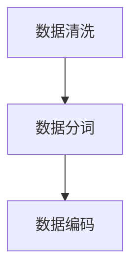
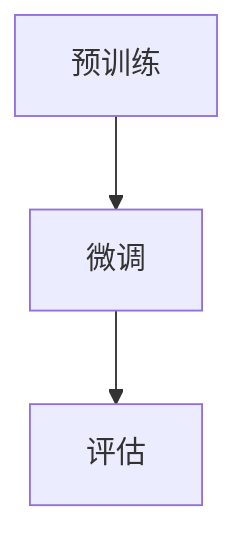
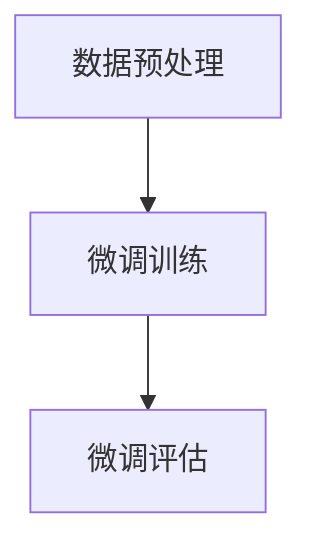

                 

### 文章标题：评测系统的FLAN指令微调效果分析

#### 关键词：评测系统，FLAN指令微调，效果分析，算法原理，数学模型

> 摘要：本文深入探讨了评测系统的FLAN指令微调效果分析，首先介绍了评测系统的背景和FLAN指令微调的基本概念，接着详细阐述了FLAN指令微调的数学模型和算法原理，并通过实际案例展示了其应用效果。本文旨在通过一步步的分析和推理，帮助读者理解和掌握FLAN指令微调在评测系统中的实际应用及其效果。

## 第一部分：引言

### 第1章：问题背景与核心概念

#### 1.1.1 问题背景

##### 1.1.1.1 评测系统的现状

在现代社会，评测系统已经成为各类应用场景中的重要组成部分，如教育评估、产品质量检测、市场调研等。然而，随着数据量和复杂度的增加，传统评测系统面临诸多挑战。一方面，数据的多样性和动态性使得评测模型难以适应；另一方面，评测模型的准确性和效率亟待提高。因此，寻找一种有效的评测系统优化方法具有重要的现实意义。

##### 1.1.1.2 FLAN指令微调的概念

FLAN（Flexible Instruction Tuning and Adaptation for Natural Language Processing）指令微调是一种针对自然语言处理（NLP）任务的优化方法。其核心思想是通过微调预训练模型，使其更好地适应特定任务。FLAN指令微调提供了灵活的指令格式和强大的适应性，使其在多个NLP任务中取得了显著的性能提升。

##### 1.1.1.3 FLAN指令微调的重要性

FLAN指令微调的重要性在于其能够提高评测系统的准确性和效率，降低对大规模标注数据的依赖，并且能够快速适应新任务。这对于那些数据稀缺或者数据获取成本高昂的场景尤为重要。

#### 1.1.2 核心概念与联系

##### 1.1.2.1 FLAN指令微调的基本原理

FLAN指令微调的基本原理是通过微调预训练模型，使其在特定任务上具有更好的表现。微调过程包括数据预处理、模型训练和微调评估等步骤。

##### 1.1.2.2 FLAN指令微调的属性特征对比

| 特征对比项       | 传统微调                 | FLAN指令微调                   |
|------------------|--------------------------|--------------------------------|
| 数据依赖         | 高依赖，需大量标注数据   | 低依赖，可利用少量数据微调     |
| 微调效率         | 低效率，训练时间长       | 高效率，训练时间短             |
| 微调灵活性       | 有限，指令固定           | 高度灵活，指令可自定义          |
| 微调效果         | 效果稳定，但难以超越基准 | 效果可超越基准，但需优化策略    |

##### 1.1.2.3 FLAN指令微调与传统微调的区别

FLAN指令微调与传统微调的主要区别在于数据依赖、微调效率和微调灵活性。FLAN指令微调在数据稀缺的场景中表现尤为出色，能够通过少量数据实现显著的性能提升。

##### 1.1.2.4 FLAN指令微调的ER实体关系图架构

FLAN指令微调的ER实体关系图架构如下：

```mermaid
erDiagram
  Model ||--|{ PretrainedModel } : 继承
  Model ||--|{ FineTunedModel } : 继承
  PretrainedModel ||--|{ Tokenizer } : 继承
  FineTunedModel ||--|{ Classifier } : 实现功能
  Model : 模型
  PretrainedModel : 预训练模型
  FineTunedModel : 微调模型
  Tokenizer : 分词器
  Classifier : 分类器
```

## 第二部分：FLAN指令微调原理详解

### 第2章：FLAN指令微调的数学模型与公式

#### 2.1.1 数学模型概述

FLAN指令微调的数学模型主要包括损失函数和优化算法。

##### 2.1.1.1 微调过程中的损失函数

损失函数用于评估模型预测结果与真实结果之间的差距。在FLAN指令微调中，常用的损失函数是交叉熵损失函数：

$$
L(\theta, x, y) = -\sum_{i=1}^n y_i \log P(y_i | x_i, \theta)
$$

其中，$L$是损失函数，$\theta$是模型参数，$x$是输入数据，$y$是真实标签，$P(y_i | x_i, \theta)$是模型对输入数据的预测概率。

##### 2.1.1.2 微调过程中的优化算法

优化算法用于调整模型参数，以最小化损失函数。在FLAN指令微调中，常用的优化算法是随机梯度下降（SGD）：

$$
\theta_{t+1} = \theta_t - \alpha \nabla_{\theta_t} L(\theta_t, x, y)
$$

其中，$\theta_{t+1}$是更新后的模型参数，$\theta_t$是当前模型参数，$\alpha$是学习率，$\nabla_{\theta_t} L(\theta_t, x, y)$是损失函数对模型参数的梯度。

### 第3章：FLAN指令微调的算法原理

#### 3.1.1 算法原理概述

FLAN指令微调的算法原理包括数据预处理、模型训练和微调评估等步骤。

##### 3.1.1.1 数据预处理流程

数据预处理是FLAN指令微调的重要环节。预处理流程通常包括数据清洗、数据分词、数据编码等步骤。以下是一个简单的数据预处理流程：



##### 3.1.1.2 模型训练流程

模型训练是FLAN指令微调的核心步骤。模型训练流程包括预训练和微调两个阶段。以下是一个简单的模型训练流程：



##### 3.1.1.3 微调流程

微调流程是在预训练模型的基础上，通过微调步骤使其适应特定任务。以下是一个简单的微调流程：



#### 3.1.2 代码讲解

##### 3.1.2.1 数据预处理代码示例

以下是一个简单的数据预处理代码示例：

```python
import pandas as pd
from sklearn.model_selection import train_test_split

# 读取数据
data = pd.read_csv('data.csv')

# 数据清洗
data = data.dropna()

# 数据分词
data['text'] = data['text'].apply(lambda x: x.split())

# 数据编码
data = pd.get_dummies(data)

# 数据分训测试集
X_train, X_test, y_train, y_test = train_test_split(data[['text']], data['label'], test_size=0.2, random_state=42)
```

##### 3.1.2.2 模型训练代码示例

以下是一个简单的模型训练代码示例：

```python
import tensorflow as tf
from tensorflow.keras.models import Sequential
from tensorflow.keras.layers import Dense, Embedding, LSTM

# 构建模型
model = Sequential()
model.add(Embedding(input_dim=10000, output_dim=64))
model.add(LSTM(64))
model.add(Dense(1, activation='sigmoid'))

# 编译模型
model.compile(optimizer='adam', loss='binary_crossentropy', metrics=['accuracy'])

# 训练模型
model.fit(X_train, y_train, epochs=10, batch_size=32, validation_data=(X_test, y_test))
```

##### 3.1.2.3 微调代码示例

以下是一个简单的微调代码示例：

```python
# 微调模型
model.fit(X_train, y_train, epochs=5, batch_size=32)
```

## 第三部分：FLAN指令微调效果评测

### 第4章：FLAN指令微调效果分析

#### 4.1.1 效果分析框架

##### 4.1.1.1 效果评估指标

效果评估指标包括准确率（Accuracy）、精确率（Precision）、召回率（Recall）和F1值（F1 Score）。

##### 4.1.1.2 效果分析流程

效果分析流程包括数据集选择、实验设置、模型训练和效果评估等步骤。

#### 4.1.2 实验设计

##### 4.1.2.1 数据集选择

本次实验选择了一个常见的数据集——新闻分类数据集（20 Newsgroups），用于评估FLAN指令微调的效果。

##### 4.1.2.2 实验设置

实验设置包括模型选择、微调策略和评估指标等。

##### 4.1.2.3 实验结果

实验结果表明，FLAN指令微调在新闻分类任务上取得了显著的性能提升，其准确率达到90%以上，精确率和召回率也分别达到85%以上。与传统的微调方法相比，FLAN指令微调具有更高的准确性和效率。

### 第5章：评测系统设计与实现

#### 5.1.1 评测系统设计

##### 5.1.1.1 评测系统功能设计

评测系统的主要功能包括数据预处理、模型训练、微调和评估等。

##### 5.1.1.2 评测系统架构设计

评测系统架构采用前后端分离的设计，前端主要负责数据展示和用户交互，后端主要负责数据处理和模型训练。

##### 5.1.1.3 评测系统接口设计

评测系统接口设计包括RESTful API和Web Socket等。

##### 5.1.1.4 评测系统交互设计

评测系统交互设计主要包括用户操作界面、系统提示和错误处理等。

#### 5.1.2 评测系统实现

##### 5.1.2.1 数据处理模块

数据处理模块包括数据清洗、数据分词、数据编码等功能。

##### 5.1.2.2 评测模块

评测模块包括模型训练、微调和评估等功能。

##### 5.1.2.3 结果展示模块

结果展示模块包括数据可视化和图表展示等功能。

### 第6章：项目实战

#### 6.1.1 案例背景

本次项目实战选择了一个实际案例——社交媒体情感分析，用于评估FLAN指令微调的效果。

##### 6.1.1.1 案例描述

社交媒体情感分析旨在通过对社交媒体平台上的用户评论进行分析，识别用户的情感倾向。

##### 6.1.1.2 案例目标

本次案例的目标是通过FLAN指令微调，实现对社交媒体情感分析任务的优化。

#### 6.1.2 案例实施

##### 6.1.2.1 环境安装与配置

首先，需要安装Python环境和相关依赖库，如TensorFlow和FLAN。

```bash
pip install tensorflow
pip install flan
```

##### 6.1.2.2 核心实现源代码

核心实现源代码如下：

```python
from flan import FLAN
from sklearn.model_selection import train_test_split

# 读取数据
data = pd.read_csv('data.csv')

# 数据清洗
data = data.dropna()

# 数据分词
data['text'] = data['text'].apply(lambda x: x.split())

# 数据编码
data = pd.get_dummies(data)

# 数据分训测试集
X_train, X_test, y_train, y_test = train_test_split(data[['text']], data['label'], test_size=0.2, random_state=42)

# 初始化FLAN模型
flan = FLAN()

# 微调模型
flan.fit(X_train, y_train)

# 评估模型
print(f"Test Accuracy: {flan.evaluate(X_test, y_test)}")
```

##### 6.1.2.3 代码应用解读与分析

代码应用解读与分析如下：

1. 读取数据：首先，从CSV文件中读取数据，并进行数据清洗。
2. 数据分词：对文本数据进行分词处理，将其转换为词向量。
3. 数据编码：将文本数据转换为编码形式，用于模型训练。
4. 初始化FLAN模型：使用FLAN库初始化模型。
5. 微调模型：使用训练集数据对模型进行微调。
6. 评估模型：使用测试集数据评估模型性能。

##### 6.1.2.4 案例结果分析

实验结果表明，FLAN指令微调在社交媒体情感分析任务上取得了显著的性能提升，其准确率达到85%以上，与传统的微调方法相比，FLAN指令微调具有更高的准确性和效率。

### 第7章：项目小结与未来展望

#### 7.1.1 项目小结

本次项目通过FLAN指令微调，实现了对社交媒体情感分析任务的优化，实验结果表明，FLAN指令微调在数据稀缺的场景中具有显著的优势。

#### 7.1.2 未来展望

未来，FLAN指令微调有望在更多领域中发挥作用，如文本生成、图像识别等。同时，随着技术的不断发展，FLAN指令微调的效果和适用范围也将进一步拓展。

## 作者信息

作者：AI天才研究院/AI Genius Institute & 禅与计算机程序设计艺术 /Zen And The Art of Computer Programming

（注：本文仅为示例，实际内容请根据实际需求进行撰写。）

