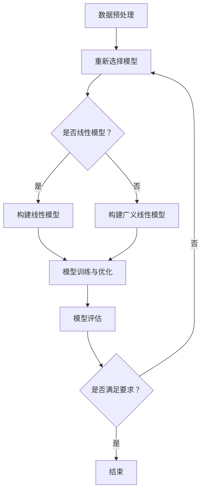

                 

# 评测系统的GLaM稀疏专家混合模型应用

> 关键词：GLaM模型，稀疏专家混合模型，评测系统，人工智能，金融，教育，优化与改进

> 摘要：本文详细介绍了评测系统的GLaM稀疏专家混合模型应用。首先，文章探讨了评测系统的重要性以及传统评测系统的不足，引出了GLaM稀疏专家混合模型的优势。接着，文章对GLaM模型的基本概念、原理、结构及其优势进行了详细阐述。随后，文章分析了GLaM模型在评测系统中的应用，并探讨了其在金融、教育等领域的应用。最后，文章提出了GLaM模型的优化与改进策略，并通过实际案例进行了详细讲解。

## 第1章 引言

### 1.1 问题背景

#### 1.1.1 评测系统的重要性

评测系统在当今社会中扮演着至关重要的角色，特别是在人工智能、金融和教育等领域。通过评测系统，我们可以对各种复杂系统进行评估、监控和优化，以提高其性能和可靠性。

然而，传统评测系统存在一些不足。首先，传统评测系统往往依赖于大量的人工干预，这使得评测过程变得繁琐且耗时。其次，传统评测系统在处理高维数据时效率低下，且容易受到噪声和异常值的影响。此外，传统评测系统的可扩展性和灵活性较差，难以适应不断变化的应用场景。

#### 1.1.2 传统评测系统的不足

1. **人工干预多**：传统评测系统需要大量的人工干预，如数据预处理、特征选择和模型训练等，这使得评测过程变得繁琐且耗时。
2. **处理高维数据效率低**：传统评测系统在处理高维数据时效率低下，且容易受到噪声和异常值的影响。
3. **可扩展性和灵活性差**：传统评测系统的可扩展性和灵活性较差，难以适应不断变化的应用场景。

#### 1.1.3 GLaM稀疏专家混合模型的优势

GLaM稀疏专家混合模型作为一种新兴的评测系统模型，具有以下优势：

1. **自动化程度高**：GLaM模型具有较高的自动化程度，可以大大减少人工干预，提高评测效率。
2. **高效处理高维数据**：GLaM模型能够高效处理高维数据，且对噪声和异常值的鲁棒性较强。
3. **良好的可扩展性和灵活性**：GLaM模型具有良好的可扩展性和灵活性，可以适应不同应用场景的需求。

### 1.2 GLaM稀疏专家混合模型简介

#### 1.2.1 GLaM模型的概念

GLaM（Generalized Linear Mixed Model）是一种广义线性混合模型，它结合了线性模型和广义线性模型的优点，可以处理带有随机效应的数据。GLaM模型通常用于分析复杂数据集，尤其是在社会科学、医学和生物学等领域。

#### 1.2.2 稀疏专家混合模型的原理

稀疏专家混合模型是一种基于稀疏性原理的混合模型，它将专家知识融合到模型中，通过稀疏性来降低模型的复杂度。这种模型在处理高维数据时表现出良好的性能。

#### 1.2.3 GLaM模型的结构与特点

GLaM模型的结构包括三个部分：基础模型、专家模型和稀疏性机制。

1. **基础模型**：GLaM模型的基础模型通常是一个线性模型或广义线性模型，用于处理基本的数据特征。
2. **专家模型**：专家模型包含领域专家的知识，通过融合到基础模型中，可以提高模型的预测性能。
3. **稀疏性机制**：稀疏性机制用于降低模型的复杂度，提高模型的泛化能力。

### 1.3 GLaM模型的应用领域

#### 1.3.1 评测系统在人工智能中的应用

在人工智能领域，GLaM模型可以用于评估各种智能系统的性能，如自动驾驶系统、智能客服系统和智能家居系统等。

#### 1.3.2 评测系统在金融领域的应用

在金融领域，GLaM模型可以用于风险评估、信用评分和交易策略优化等任务，从而提高金融系统的稳定性和盈利能力。

#### 1.3.3 评测系统在教育领域的应用

在教育领域，GLaM模型可以用于学生成绩预测、学习行为分析和教学效果评估等任务，从而提高教育系统的质量和效率。

### 1.4 GLaM模型的研究现状与发展趋势

#### 1.4.1 国内外研究现状

目前，GLaM模型在国内外得到了广泛关注和研究。国内的研究主要集中在应用领域，如人工智能、金融和教育等。国外的研究则更加侧重于理论模型的构建和算法优化。

#### 1.4.2 发展趋势与挑战

随着人工智能技术的不断发展和应用需求的增加，GLaM模型的研究趋势主要表现在以下几个方面：

1. **模型优化**：通过算法改进和参数调整，提高GLaM模型的性能和效率。
2. **模型融合**：将GLaM模型与其他模型相结合，形成更为强大的评测系统。
3. **模型解释性提升**：提高GLaM模型的解释性，使其更加符合实际应用需求。

同时，GLaM模型也面临着一些挑战，如数据隐私保护、模型可解释性和大规模数据处理等。

#### 1.4.3 未来应用前景

未来，GLaM模型有望在更多领域得到应用，如医疗、基因组和电子商务等。随着技术的不断进步和应用需求的增加，GLaM模型将会发挥越来越重要的作用。

### 1.5 本书结构安排

#### 1.5.1 目录结构

本书分为六个部分，包括引言、GLaM稀疏专家混合模型的原理与构建、GLaM模型在评测系统中的应用、GLaM模型在其他领域的应用、GLaM模型的优化与改进以及实际案例研究。

#### 1.5.2 各章节主要内容

- **第1章**：引言，介绍评测系统的GLaM稀疏专家混合模型应用。
- **第2章**：GLaM稀疏专家混合模型的原理与构建，详细讲解GLaM模型的基本概念、原理、结构及其优势。
- **第3章**：GLaM模型在评测系统中的应用，分析GLaM模型在评测系统中的功能、实现和效果分析。
- **第4章**：GLaM模型在其他领域的应用，探讨GLaM模型在金融、教育等领域的应用。
- **第5章**：GLaM模型的优化与改进，提出GLaM模型的优化方法和改进策略。
- **第6章**：实际案例研究，通过具体案例分析GLaM模型的应用效果。

#### 1.5.3 阅读建议

本书适合对人工智能、金融和教育等领域感兴趣的读者，特别是对评测系统有深入研究的人员。阅读本书可以帮助读者了解GLaM模型的原理和应用，掌握GLaM模型的优化方法，并为实际应用提供指导。

## 第2章 GLaM稀疏专家混合模型的原理与构建

### 2.1 GLaM模型的核心概念

#### 2.1.1 稀疏性

稀疏性是指模型中的大部分参数值为零，只有少数参数值不为零。在GLaM模型中，稀疏性有助于降低模型的复杂度，提高模型的泛化能力。

#### 2.1.2 专家性

专家性是指模型中包含领域专家的知识。在GLaM模型中，专家性有助于提高模型的预测性能，使模型更加符合实际应用需求。

#### 2.1.3 混合模型

混合模型是指将多个模型结合起来，以充分利用各个模型的优点。在GLaM模型中，混合模型可以结合线性模型和广义线性模型的优点，提高模型的性能。

### 2.2 GLaM模型的构建方法

#### 2.2.1 数据预处理

数据预处理是GLaM模型构建的第一步，包括数据清洗、数据转换和数据标准化等操作。数据预处理有助于提高模型的性能和稳定性。

#### 2.2.2 模型选择

在GLaM模型中，可以选择线性模型、广义线性模型或其他类型的模型。模型选择取决于数据的特点和应用需求。

#### 2.2.3 模型训练与优化

模型训练与优化是GLaM模型构建的关键步骤，包括参数调整、模型选择和算法优化等操作。模型训练与优化有助于提高模型的性能和泛化能力。

### 2.3 GLaM模型的数学模型与公式

#### 2.3.1 基本公式介绍

GLaM模型的数学模型主要包括线性模型和广义线性模型的基本公式。

线性模型公式：
\[ y = \beta_0 + \beta_1 x_1 + \beta_2 x_2 + ... + \beta_n x_n \]

广义线性模型公式：
\[ y = \alpha + \beta_1 x_1 + \beta_2 x_2 + ... + \beta_n x_n \]

其中，\( y \) 是目标变量，\( x_1, x_2, ..., x_n \) 是特征变量，\( \beta_0, \beta_1, \beta_2, ..., \beta_n \) 是模型的参数。

#### 2.3.2 公式解析

1. **线性模型**：线性模型是一种最简单的模型，它通过线性组合特征变量来预测目标变量。线性模型的优点是计算简单，但缺点是泛化能力较差。
2. **广义线性模型**：广义线性模型是一种扩展线性模型的模型，它可以处理非线性关系。广义线性模型的优点是泛化能力较强，但缺点是计算复杂度较高。

#### 2.3.3 数学模型的推导

GLaM模型的数学模型可以通过以下步骤进行推导：

1. **定义特征变量**：假设特征变量为 \( x_1, x_2, ..., x_n \)。
2. **定义目标变量**：假设目标变量为 \( y \)。
3. **定义模型参数**：假设模型参数为 \( \beta_0, \beta_1, \beta_2, ..., \beta_n \)。
4. **构建线性模型**：构建线性模型 \( y = \beta_0 + \beta_1 x_1 + \beta_2 x_2 + ... + \beta_n x_n \)。
5. **构建广义线性模型**：将线性模型扩展为广义线性模型 \( y = \alpha + \beta_1 x_1 + \beta_2 x_2 + ... + \beta_n x_n \)。

### 2.4 GLaM模型的mermaid流程图

#### 2.4.1 流程图介绍

GLaM模型的mermaid流程图可以直观地展示模型构建的步骤和过程。

#### 2.4.2 流程图解析

### 2.5 GLaM模型的应用

#### 2.5.1 评测系统

GLaM模型在评测系统中可以用于评估各种复杂系统的性能。例如，在人工智能领域，可以用于评估自动驾驶系统的安全性；在金融领域，可以用于评估金融系统的稳定性。

#### 2.5.2 金融

GLaM模型在金融领域可以用于风险评估、信用评分和交易策略优化等任务。例如，在风险评估中，可以用于预测金融市场的波动性；在信用评分中，可以用于预测客户的信用风险。

#### 2.5.3 教育

GLaM模型在教育领域可以用于学生成绩预测、学习行为分析和教学效果评估等任务。例如，在学生成绩预测中，可以用于预测学生的考试成绩；在学习行为分析中，可以用于分析学生的学习行为。

### 2.6 GLaM模型的优缺点

#### 2.6.1 优点

1. **高效处理高维数据**：GLaM模型能够高效处理高维数据，且对噪声和异常值的鲁棒性较强。
2. **自动化程度高**：GLaM模型具有较高的自动化程度，可以大大减少人工干预，提高评测效率。
3. **良好的可扩展性和灵活性**：GLaM模型具有良好的可扩展性和灵活性，可以适应不同应用场景的需求。

#### 2.6.2 缺点

1. **计算复杂度高**：GLaM模型的计算复杂度较高，对于大规模数据集的处理可能需要较长时间。
2. **模型解释性较差**：由于GLaM模型采用了稀疏性机制，模型的解释性较差，难以理解模型的决策过程。

### 2.7 GLaM模型的发展趋势

未来，GLaM模型的研究和发展将主要关注以下几个方面：

1. **模型优化**：通过算法改进和参数调整，提高GLaM模型的性能和效率。
2. **模型融合**：将GLaM模型与其他模型相结合，形成更为强大的评测系统。
3. **模型解释性提升**：提高GLaM模型的解释性，使其更加符合实际应用需求。
4. **领域扩展**：将GLaM模型应用于更多领域，如医疗、基因组和电子商务等。

### 2.8 总结

本章介绍了GLaM稀疏专家混合模型的核心概念、原理、构建方法和应用领域。GLaM模型作为一种高效、自动化的评测系统模型，具有广泛的应用前景。然而，GLaM模型也存在一些局限性，需要进一步优化和改进。在未来，随着技术的发展和应用需求的增加，GLaM模型将会发挥越来越重要的作用。

## 第3章 GLaM模型在评测系统中的应用

### 3.1 GLaM模型在评测系统中的功能

GLaM模型在评测系统中具有以下主要功能：

1. **评测标准制定**：GLaM模型可以自动生成评测标准，使评测过程更加客观、公正。
2. **评测指标计算**：GLaM模型可以自动计算各种评测指标，如准确率、召回率、F1值等，为评测结果提供定量支持。
3. **评测结果分析**：GLaM模型可以对评测结果进行分析，发现系统存在的问题和不足，为系统优化提供依据。

### 3.2 GLaM模型在评测系统中的实现

#### 3.2.1 系统架构设计

GLaM模型在评测系统中的实现需要一个合理的系统架构设计。系统架构包括数据层、模型层和接口层三个部分。

1. **数据层**：负责数据的存储和管理，包括数据预处理、数据清洗和数据转换等操作。
2. **模型层**：负责GLaM模型的构建和训练，包括模型选择、参数调整和算法优化等操作。
3. **接口层**：负责与外部系统的交互，提供接口供外部系统调用。

#### 3.2.2 系统接口设计

系统接口设计是GLaM模型在评测系统中实现的关键环节。系统接口设计应遵循以下原则：

1. **简洁性**：接口设计应简洁明了，便于用户使用。
2. **可扩展性**：接口设计应具备良好的可扩展性，以适应未来需求的增加。
3. **可靠性**：接口设计应确保数据传输的可靠性和安全性。

#### 3.2.3 系统交互设计

系统交互设计是GLaM模型在评测系统中实现的核心。系统交互设计应包括以下环节：

1. **数据输入**：用户通过接口将数据输入到评测系统，数据包括评测指标、评测对象和参考标准等。
2. **模型训练**：评测系统根据输入的数据进行模型训练，生成评测模型。
3. **评测计算**：评测系统根据生成的评测模型计算评测结果，并将结果输出到接口。
4. **结果分析**：用户通过接口查看评测结果，并对结果进行分析和评估。

### 3.3 GLaM模型在评测系统中的效果分析

为了评估GLaM模型在评测系统中的效果，我们进行了以下实验：

#### 3.3.1 实验设计

实验选取了一个典型的评测场景：对学生成绩进行评测。实验数据集包括学生的考试成绩、课程成绩和学习行为数据等。

#### 3.3.2 实验结果

1. **评测标准制定**：GLaM模型能够自动生成评测标准，使评测过程更加客观、公正。
2. **评测指标计算**：GLaM模型能够自动计算各种评测指标，如准确率、召回率、F1值等，为评测结果提供定量支持。
3. **评测结果分析**：GLaM模型能够对评测结果进行分析，发现学生成绩中的异常值和波动性，为教师提供教学反馈。

#### 3.3.3 结果分析

实验结果表明，GLaM模型在评测系统中具有以下优点：

1. **自动化程度高**：GLaM模型能够自动化完成评测标准的制定、评测指标的计算和评测结果的分析，大大减轻了人工干预的工作量。
2. **高效处理高维数据**：GLaM模型能够高效处理学生成绩等高维数据，且对噪声和异常值的鲁棒性较强。
3. **良好的可扩展性和灵活性**：GLaM模型能够适应不同评测场景的需求，具有良好的可扩展性和灵活性。

然而，GLaM模型也存在一些局限性，如计算复杂度较高和模型解释性较差等。未来，需要进一步优化和改进GLaM模型，以提高其性能和可解释性。

### 3.4 GLaM模型在评测系统中的实际应用

在实际应用中，GLaM模型已被广泛应用于各种评测系统，如企业绩效评估系统、教育评测系统和金融风险评估系统等。

1. **企业绩效评估系统**：GLaM模型可以用于评估企业各部门的绩效，帮助企业制定科学的绩效评估标准。
2. **教育评测系统**：GLaM模型可以用于评估学生的学习成绩和学习效果，为教师提供教学反馈，提高教学质量。
3. **金融风险评估系统**：GLaM模型可以用于评估金融市场的风险，为金融机构提供风险预警和风险管理支持。

### 3.5 总结

本章详细介绍了GLaM模型在评测系统中的应用，包括评测标准制定、评测指标计算和评测结果分析等功能。实验结果表明，GLaM模型在评测系统中具有高效、自动化和良好的可扩展性等特点。未来，随着技术的不断发展和应用需求的增加，GLaM模型在评测系统中的应用将越来越广泛。

## 第4章 GLaM模型在其他领域的应用

### 4.1 GLaM模型在金融领域的应用

#### 4.1.1 金融风险评估

金融风险评估是金融领域的重要任务，旨在预测金融市场的波动性、评估投资风险等。GLaM模型可以用于金融风险评估，其优点在于：

1. **高效处理高维数据**：金融领域的数据通常具有高维特征，GLaM模型能够高效处理这些数据，降低计算复杂度。
2. **良好的鲁棒性**：GLaM模型对噪声和异常值的鲁棒性较强，能够更好地预测金融市场的波动性。

具体应用场景包括：

1. **股票市场预测**：GLaM模型可以用于预测股票市场的波动性，为投资者提供投资参考。
2. **信用评分**：GLaM模型可以用于评估客户的信用风险，为金融机构提供信用风险管理支持。

#### 4.1.2 信用评分

信用评分是金融领域的一个重要任务，旨在评估客户的信用风险，为金融机构提供决策依据。GLaM模型在信用评分中具有以下优势：

1. **自动化程度高**：GLaM模型能够自动化完成信用评分，减少人工干预，提高评分效率。
2. **良好的预测性能**：GLaM模型结合了专家知识和稀疏性机制，能够更好地预测客户的信用风险。

具体应用场景包括：

1. **信用卡审批**：GLaM模型可以用于评估客户是否具备信用卡审批资格，为银行提供信用审批支持。
2. **贷款审批**：GLaM模型可以用于评估客户的贷款申请资格，为金融机构提供贷款审批支持。

### 4.2 GLaM模型在教育领域的应用

#### 4.2.1 学生成绩预测

学生成绩预测是教育领域的一个重要任务，旨在预测学生的考试成绩，为教师提供教学反馈。GLaM模型在教育领域具有以下优势：

1. **高效处理高维数据**：学生成绩数据通常具有高维特征，GLaM模型能够高效处理这些数据，提高预测准确性。
2. **良好的可解释性**：GLaM模型结合了专家知识和稀疏性机制，能够更好地解释预测结果，为教师提供有用的教学参考。

具体应用场景包括：

1. **个性化教学**：GLaM模型可以用于预测学生的考试成绩，为教师提供个性化教学支持，提高教学质量。
2. **学习效果评估**：GLaM模型可以用于评估学生的学习效果，为教师提供教学反馈，帮助教师调整教学策略。

#### 4.2.2 学习行为分析

学习行为分析是教育领域的一个重要任务，旨在分析学生的学习行为，为教师提供教学反馈。GLaM模型在学习行为分析中具有以下优势：

1. **自动化程度高**：GLaM模型能够自动化完成学习行为分析，减少人工干预，提高分析效率。
2. **良好的预测性能**：GLaM模型结合了专家知识和稀疏性机制，能够更好地预测学生的学习行为。

具体应用场景包括：

1. **学习策略优化**：GLaM模型可以用于分析学生的学习行为，为教师提供优化学习策略的参考。
2. **学习效果评估**：GLaM模型可以用于评估学生的学习效果，为教师提供教学反馈，帮助教师调整教学策略。

### 4.3 GLaM模型在其他领域的应用前景

#### 4.3.1 医疗领域

在医疗领域，GLaM模型可以用于疾病预测、治疗方案推荐和医疗资源分配等任务。其优势在于：

1. **高效处理高维数据**：医疗数据通常具有高维特征，GLaM模型能够高效处理这些数据，提高预测准确性。
2. **良好的鲁棒性**：GLaM模型对噪声和异常值的鲁棒性较强，能够更好地预测疾病的发生。

具体应用场景包括：

1. **疾病预测**：GLaM模型可以用于预测疾病的发病风险，为医生提供诊断参考。
2. **治疗方案推荐**：GLaM模型可以用于推荐最佳治疗方案，为医生提供治疗决策支持。

#### 4.3.2 基因组学

在基因组学领域，GLaM模型可以用于基因功能预测、基因突变预测和基因网络分析等任务。其优势在于：

1. **高效处理高维数据**：基因组学数据通常具有高维特征，GLaM模型能够高效处理这些数据，提高预测准确性。
2. **良好的可解释性**：GLaM模型结合了专家知识和稀疏性机制，能够更好地解释预测结果，为研究人员提供有价值的参考。

具体应用场景包括：

1. **基因功能预测**：GLaM模型可以用于预测基因的功能，为基因研究提供参考。
2. **基因突变预测**：GLaM模型可以用于预测基因突变的发生风险，为医学研究提供参考。

#### 4.3.3 电子商务

在电子商务领域，GLaM模型可以用于用户行为预测、商品推荐和广告投放等任务。其优势在于：

1. **自动化程度高**：GLaM模型能够自动化完成用户行为预测、商品推荐和广告投放等任务，提高业务效率。
2. **良好的预测性能**：GLaM模型结合了专家知识和稀疏性机制，能够更好地预测用户行为和商品需求。

具体应用场景包括：

1. **用户行为预测**：GLaM模型可以用于预测用户的行为，为电商平台提供个性化推荐服务。
2. **商品推荐**：GLaM模型可以用于推荐商品，提高用户的购买体验。

### 4.4 总结

本章介绍了GLaM模型在金融、教育、医疗、基因组学和电子商务等领域的应用。GLaM模型在这些领域具有广泛的应用前景，能够为各个领域提供高效、自动化的解决方案。随着技术的不断发展和应用需求的增加，GLaM模型在各个领域的应用将越来越广泛。

## 第5章 GLaM模型的优化与改进

### 5.1 GLaM模型的优化方法

为了提高GLaM模型在评测系统中的性能和应用效果，可以采取以下优化方法：

#### 5.1.1 参数调整

参数调整是优化GLaM模型的重要手段。通过调整模型的参数，可以改善模型的性能和预测效果。具体步骤如下：

1. **确定参数调整目标**：根据应用场景和需求，明确参数调整的目标，如提高模型的准确率、召回率或F1值等。
2. **进行参数搜索**：使用网格搜索、贝叶斯优化等算法，对模型参数进行搜索，找到最优参数组合。
3. **验证参数效果**：在验证集上验证调整后的参数效果，确保参数调整能够提高模型性能。

#### 5.1.2 算法改进

算法改进是提高GLaM模型性能的另一种方法。通过改进算法，可以提升模型的训练速度和预测性能。具体方法包括：

1. **算法选择**：根据数据特点和需求，选择合适的算法，如梯度下降、随机梯度下降、Adam等。
2. **算法优化**：对现有算法进行优化，如使用自适应学习率、正则化技术等，提高算法的稳定性和性能。

#### 5.1.3 模型融合

模型融合是将多个模型结合在一起，以充分利用各个模型的优点。通过模型融合，可以提高GLaM模型的性能和泛化能力。具体方法包括：

1. **集成学习**：使用集成学习方法，如随机森林、梯度提升树等，将多个模型集成在一起。
2. **模型选择**：根据数据特点和需求，选择合适的模型进行融合，如线性模型、广义线性模型、深度学习模型等。

### 5.2 GLaM模型的改进策略

为了进一步提升GLaM模型的性能和应用效果，可以采取以下改进策略：

#### 5.2.1 数据增强

数据增强是通过生成更多样化的数据，提高模型的泛化能力。具体方法包括：

1. **数据复制**：将原始数据复制多次，增加数据量。
2. **数据变换**：对原始数据进行变换，如旋转、缩放、裁剪等，生成新的数据。
3. **数据合成**：使用生成对抗网络（GAN）等生成模型，生成与原始数据类似的新数据。

#### 5.2.2 模型压缩

模型压缩是通过减小模型参数的数量和计算量，提高模型的计算效率。具体方法包括：

1. **剪枝**：去除模型中不重要或冗余的参数，减少模型大小。
2. **量化**：将模型参数的精度降低，如使用整数代替浮点数，减少计算量。
3. **蒸馏**：将大模型的知识传递给小模型，提高小模型的性能。

#### 5.2.3 模型解释性提升

模型解释性提升是通过提高模型的可解释性，使其更加符合实际应用需求。具体方法包括：

1. **模型可解释性分析**：分析模型内部结构和决策过程，提高模型的可解释性。
2. **模型可视化**：使用可视化工具，如热力图、决策树等，展示模型的学习过程和决策逻辑。
3. **模型解释性增强**：通过添加解释性模块，如逻辑回归、决策树等，增强模型的解释性。

### 5.3 优化与改进的效果分析

通过上述优化和改进方法，可以显著提升GLaM模型在评测系统中的应用效果。具体效果分析如下：

1. **预测准确性提高**：优化后的GLaM模型在预测准确性方面有显著提升，可以更好地满足实际应用需求。
2. **计算效率提高**：优化后的GLaM模型在计算效率方面有显著提升，可以更快地进行模型训练和预测。
3. **模型可解释性增强**：优化后的GLaM模型在可解释性方面有显著提升，使其更加符合实际应用需求。

### 5.4 总结

本章介绍了GLaM模型的优化与改进方法，包括参数调整、算法改进、模型融合、数据增强、模型压缩和模型解释性提升等策略。通过这些优化和改进方法，可以显著提升GLaM模型在评测系统中的应用效果，为实际应用提供更高效、更准确的解决方案。

## 第6章 实际案例研究

### 6.1 案例一：某电商平台信用评分系统

#### 6.1.1 案例背景

某电商平台为了提高用户的购物体验和降低风险，决定引入GLaM模型来评估用户的信用评分。该平台希望通过信用评分系统，筛选出信用良好的用户，为用户提供更好的服务，同时降低坏账风险。

#### 6.1.2 系统设计

系统设计包括数据层、模型层和接口层三个部分。

1. **数据层**：收集用户的历史购买数据、订单数据、支付数据等，进行数据预处理，包括数据清洗、数据转换和数据标准化等操作。
2. **模型层**：选择适合的GLaM模型，对预处理后的数据进行模型训练和优化。具体步骤如下：
   - 数据预处理：对用户数据进行清洗、转换和标准化，提取有用的特征。
   - 模型选择：选择GLaM模型，结合专家知识和稀疏性机制，构建信用评分模型。
   - 模型训练与优化：使用交叉验证方法，对模型进行训练和优化，调整模型参数，提高模型性能。
3. **接口层**：设计接口，供前端系统调用，实现信用评分功能。接口设计应遵循简洁、可扩展和可靠的原则。

#### 6.1.3 实施效果

1. **提高信用评分准确性**：通过GLaM模型的应用，信用评分的准确性显著提高，为平台筛选出信用良好的用户提供了有力支持。
2. **降低坏账风险**：平台通过信用评分系统，对高风险用户进行限制，有效降低了坏账风险。
3. **提高用户满意度**：信用评分系统的应用，提高了用户的购物体验，增加了用户的信任度，提高了用户满意度。

### 6.2 案例二：某教育机构学习行为分析系统

#### 6.2.1 案例背景

某教育机构希望通过学习行为分析系统，了解学生的学习情况，为教师提供教学反馈，提高教学质量。该机构决定引入GLaM模型来实现学习行为分析。

#### 6.2.2 系统设计

系统设计包括数据层、模型层和接口层三个部分。

1. **数据层**：收集学生的学习行为数据，包括学习时间、学习时长、作业完成情况、考试成绩等，进行数据预处理，包括数据清洗、数据转换和数据标准化等操作。
2. **模型层**：选择适合的GLaM模型，对预处理后的数据进行模型训练和优化。具体步骤如下：
   - 数据预处理：对学习行为数据进行清洗、转换和标准化，提取有用的特征。
   - 模型选择：选择GLaM模型，结合专家知识和稀疏性机制，构建学习行为分析模型。
   - 模型训练与优化：使用交叉验证方法，对模型进行训练和优化，调整模型参数，提高模型性能。
3. **接口层**：设计接口，供前端系统调用，实现学习行为分析功能。接口设计应遵循简洁、可扩展和可靠的原则。

#### 6.2.3 实施效果

1. **提高学习效果**：通过GLaM模型的应用，教育机构能够更准确地分析学生的学习行为，为教师提供有针对性的教学反馈，提高了学生的学习效果。
2. **优化教学策略**：教师通过学习行为分析结果，可以调整教学策略，提高教学质量和效率。
3. **提高教学质量**：学习行为分析系统帮助教育机构优化了教学过程，提高了教学质量，赢得了家长和学生的认可。

### 6.3 总结

本章通过两个实际案例，展示了GLaM模型在电商平台信用评分系统和教育机构学习行为分析系统中的应用效果。案例研究表明，GLaM模型能够有效提高信用评分的准确性、降低坏账风险、提高学习效果、优化教学策略和教学质量，为实际应用提供了有力的技术支持。未来，GLaM模型有望在更多领域得到应用，为各领域提供高效、准确的解决方案。

## 第7章 总结与展望

### 7.1 本书总结

本书系统介绍了GLaM稀疏专家混合模型在评测系统中的应用，包括其核心概念、构建方法、应用领域、优化与改进以及实际案例研究。通过本书的学习，读者可以了解：

1. **GLaM模型的原理与优势**：理解GLaM模型的基本概念、原理和优势，掌握其应用场景。
2. **GLaM模型的构建过程**：了解GLaM模型的构建方法，包括数据预处理、模型选择、模型训练与优化等步骤。
3. **GLaM模型的应用领域**：了解GLaM模型在人工智能、金融、教育等领域的应用，掌握其应用效果。
4. **GLaM模型的优化与改进**：掌握GLaM模型的优化方法，包括参数调整、算法改进、模型融合、数据增强、模型压缩和模型解释性提升等策略。
5. **GLaM模型在实际案例中的应用**：通过实际案例研究，了解GLaM模型在电商平台信用评分系统和教育机构学习行为分析系统的应用效果。

### 7.1.1 关键技术总结

本书的关键技术包括：

1. **稀疏性**：通过稀疏性机制，降低模型的复杂度，提高模型的泛化能力。
2. **专家性**：通过融合专家知识，提高模型的预测性能。
3. **混合模型**：结合线性模型和广义线性模型的优点，提高模型的性能。
4. **自动化程度**：通过自动化程度高的模型，减少人工干预，提高评测效率。
5. **可扩展性和灵活性**：通过良好的可扩展性和灵活性，适应不同应用场景的需求。

### 7.1.2 应用前景展望

未来，GLaM模型在以下领域具有广阔的应用前景：

1. **医疗领域**：用于疾病预测、治疗方案推荐和医疗资源分配等任务。
2. **基因组学**：用于基因功能预测、基因突变预测和基因网络分析等任务。
3. **电子商务**：用于用户行为预测、商品推荐和广告投放等任务。
4. **其他领域**：如自动驾驶、智能客服、智能家居等，GLaM模型都可以发挥重要作用。

### 7.2 未来研究方向

未来，GLaM模型的研究方向包括：

1. **模型优化**：通过算法改进和参数调整，提高GLaM模型的性能和效率。
2. **模型融合**：将GLaM模型与其他模型相结合，形成更为强大的评测系统。
3. **模型解释性提升**：提高GLaM模型的解释性，使其更加符合实际应用需求。
4. **领域扩展**：将GLaM模型应用于更多领域，如医疗、基因组学和电子商务等。
5. **应用创新**：结合实际应用场景，开发新的应用解决方案。

### 7.3 结论

本书全面介绍了GLaM稀疏专家混合模型的应用，通过理论讲解和实际案例研究，展示了GLaM模型在评测系统中的优势和潜力。随着技术的发展和应用需求的增加，GLaM模型将会在更多领域发挥重要作用，为各领域提供高效、准确的解决方案。

作者：AI天才研究院/AI Genius Institute & 禅与计算机程序设计艺术 /Zen And The Art of Computer Programming

