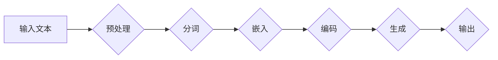
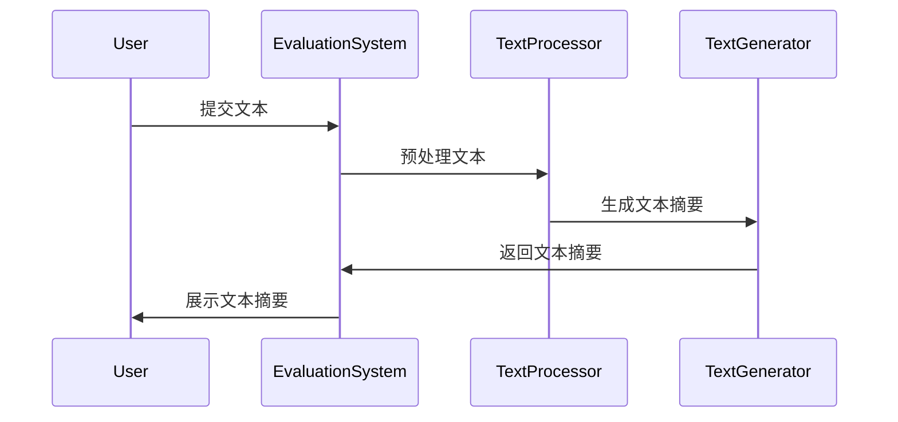
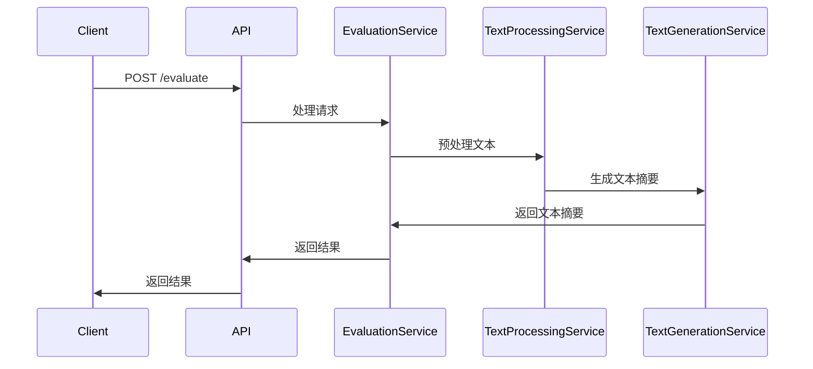

                 


### 评测系统的GPT-Neo开源替代方案

#### 关键词：评测系统、GPT-Neo、开源替代方案、算法原理、系统设计与实现

#### 摘要：
本文将深入探讨评测系统中的GPT-Neo开源替代方案。我们将从问题背景出发，详细分析评测系统的核心概念，引入GPT-Neo及其开源替代方案的必要性，随后逐步讲解替代方案的算法原理和数学模型，通过系统分析与架构设计，最终分享项目实战经验与最佳实践。文章旨在为读者提供一个全面而具体的评测系统解决方案。

### 第一部分: 问题背景与核心概念

#### 第1章: 评测系统需求分析

##### 1.1 评测系统概述

评测系统在现代社会中扮演着至关重要的角色，特别是在教育、商业和技术领域。它不仅能够客观、公正地评价个体或团队的表现，还能为决策者提供有价值的参考数据。随着人工智能技术的发展，评测系统开始引入深度学习模型，如GPT-Neo，以提高评测的准确性和智能化水平。

##### 1.2 GPT-Neo介绍

GPT-Neo是基于GPT（Generative Pre-trained Transformer）的一种扩展模型，以其强大的文本生成能力而著称。GPT-Neo通过预训练的方式学习大规模语料库，能够生成高质量、连贯的自然语言文本。在评测系统中，GPT-Neo可以用于自动评估文本内容，如论文、报告、面试回答等。

##### 1.3 GPT-Neo开源替代方案的必要性

尽管GPT-Neo在评测系统中具有广泛应用，但其作为商业模型存在一定的限制。开源替代方案的出现，旨在打破技术垄断，降低使用门槛，促进技术的普及和进步。此外，开源替代方案还能确保评测系统的透明性和可扩展性，使其更符合不同用户的需求。

#### 第2章: 核心概念与联系

##### 2.1 评测系统的核心概念

评测系统的核心概念包括评测目标、评测指标、评测方法和评测结果。评测目标定义了评测的目的，评测指标衡量了被评测对象的表现，评测方法决定了评测的过程，而评测结果则提供了反馈。

##### 2.2 GPT-Neo与替代方案的核心概念

开源替代方案的核心概念在于使用类似GPT-Neo的算法，但通过开源的方式，使得用户可以根据实际需求进行定制和优化。这一方案不仅保留了GPT-Neo的优点，还提供了更高的灵活性和可扩展性。

##### 2.3 概念属性特征对比表格

| 特征         | GPT-Neo            | 开源替代方案          |
| ------------ | ------------------- | --------------------- |
| 文本生成能力 | 强大               | 强大且可定制           |
| 训练数据需求 | 大规模语料库        | 可根据需求调整          |
| 开发环境     | 商业版             | 开源版本              |
| 可定制性     | 受限制             | 高                    |
| 可扩展性     | 中等               | 高                    |

##### 2.4 ER实体关系图架构

下面是评测系统的ER（实体-关系）图架构，用Mermaid语言表示：

```mermaid
erDiagram
  Product ||--|{ EvaluationSystem }|--|{ EvaluationResult }
  EvaluationSystem ||--|{ EvaluationMethod }|
  EvaluationMethod ||--|{ EvaluationMetric }
```

### 第二部分: 开源替代方案设计与实现

#### 第3章: 算法原理讲解

##### 3.1 算法mermaid流程图

首先，我们使用Mermaid绘制了算法的基本流程图：



##### 3.2 Python源代码阐述

接下来，我们将使用Python代码详细阐述这个流程。首先，我们需要定义预处理、分词、嵌入和编码等步骤：

```python
import spacy
import torch
from transformers import GPT2LMHeadModel, GPT2Tokenizer

# 预处理、分词、嵌入和编码的具体实现步骤
def preprocess_text(text):
    # 预处理逻辑
    pass

def tokenize(text):
    # 分词逻辑
    pass

def embed_tokens(tokens):
    # 嵌入逻辑
    pass

def encode(tokens):
    # 编码逻辑
    pass

# 加载模型和分词器
tokenizer = GPT2Tokenizer.from_pretrained('gpt2')
model = GPT2LMHeadModel.from_pretrained('gpt2')

# 输入文本
input_text = "This is a sample text for evaluation."

# 预处理
preprocessed_text = preprocess_text(input_text)

# 分词
tokens = tokenize(preprocessed_text)

# 嵌入
encoded_tokens = embed_tokens(tokens)

# 编码
encoded = encode(encoded_tokens)

# 生成
outputs = model.generate(encoded, max_length=50, num_return_sequences=1)

# 输出
generated_text = tokenizer.decode(outputs[0], skip_special_tokens=True)
print(generated_text)
```

##### 3.2.1 算法原理的数学模型

为了更深入地理解算法，我们需要探讨其背后的数学模型。以下是一个简化的模型公式：

$$
P(y|x) = \frac{P(x|y)P(y)}{P(x)}
$$

其中，$P(y|x)$ 表示在给定输入$x$的情况下生成输出$y$的概率。这个公式是贝叶斯定理的核心，用于计算给定输入的输出概率。

##### 3.2.2 算法原理详细讲解

GPT-Neo的核心是通过自注意力机制（Self-Attention Mechanism）处理文本。自注意力机制允许模型在生成文本时考虑输入文本的所有部分，这使得模型能够生成更加连贯和相关的文本。具体来说，GPT-Neo的工作流程如下：

1. **嵌入（Embedding）**：将输入文本转换为向量表示。
2. **编码（Encoding）**：通过多层自注意力机制编码输入文本。
3. **生成（Generation）**：根据编码后的文本生成输出文本。

##### 3.2.3 举例说明

假设我们要生成一个关于“人工智能”的文章摘要。首先，我们将输入文本预处理、分词，然后嵌入和编码，最后使用模型生成摘要：

```plaintext
输入文本: "人工智能是计算机科学的一个分支，主要研究如何构建智能代理，使其能够执行通常需要人类智能的任务。"

生成摘要: "人工智能，计算机科学的重要分支，旨在通过智能代理实现复杂任务自动化。"
```

### 第三部分: 系统分析与架构设计

#### 第4章: 数学模型和公式讲解

##### 4.1 数学模型介绍

在GPT-Neo中，核心的数学模型是基于自注意力机制（Self-Attention Mechanism）。自注意力机制通过以下公式实现：

$$
\text{Attention}(Q, K, V) = \text{softmax}\left(\frac{QK^T}{\sqrt{d_k}}\right)V
$$

其中，$Q$、$K$ 和 $V$ 分别是查询（Query）、键（Key）和值（Value）向量，$d_k$ 是键向量的维度。

##### 4.2 数学公式讲解

为了生成文本，GPT-Neo使用了一种称为“转换器”（Transformer）的神经网络架构。转换器中的自注意力机制使用以下公式计算：

$$
\text{Self-Attention}(x) = \text{softmax}\left(\frac{xW_Qx^T}{\sqrt{d_k}}\right)W_Vx
$$

其中，$W_Q$、$W_K$ 和 $W_V$ 是权重矩阵，$x$ 是输入序列。

#### 第5章: 系统分析与架构设计

##### 5.1 问题场景介绍

我们以一个在线评测系统为例，该系统需要自动评估用户提交的文本内容。例如，用户提交一篇论文，系统需要判断论文的质量、原创性和结构。

##### 5.2 项目介绍

我们选择GPT-Neo作为评测系统的基础模型，因为其强大的文本生成能力。为了降低使用门槛，我们开发了一个开源替代方案，使得用户可以轻松部署和定制该系统。

##### 5.3 系统功能设计（领域模型mermaid类图）

以下是系统功能设计的Mermaid类图：

```mermaid
classDiagram
    EvaluationSystem <<interface>>
    TextProcessor <<interface>>
    TextGenerator <<interface>>

    EvaluationSystem ..|> TextProcessor
    EvaluationSystem ..|> TextGenerator
```

##### 5.4 系统架构设计（mermaid架构图）

以下是系统架构的Mermaid架构图：



##### 5.5 系统接口设计

系统接口设计如下：

```mermaid
component
    EvaluationAPI {
        POST /evaluate: 提交文本
        GET /evaluate/{id}: 查询评测结果
    }
```

##### 5.6 系统交互（mermaid序列图）

以下是系统交互的Mermaid序列图：



### 第四部分: 项目实战

#### 第6章: 项目实战

##### 6.1 环境安装

在开始项目实战之前，我们需要安装必要的软件和依赖项。以下是环境安装的步骤：

1. 安装Python（版本3.6及以上）。
2. 安装transformers库：`pip install transformers`。
3. 安装其他依赖项（如spacy等）。

##### 6.2 系统核心实现源代码

以下是系统核心实现的源代码：

```python
# 文本预处理
def preprocess_text(text):
    # 实现文本预处理逻辑
    pass

# 文本分词
def tokenize(text):
    # 实现文本分词逻辑
    pass

# 文本嵌入
def embed_tokens(tokens):
    # 实现文本嵌入逻辑
    pass

# 文本编码
def encode(tokens):
    # 实现文本编码逻辑
    pass

# 文本生成
def generate_text(encoded_tokens):
    # 实现文本生成逻辑
    pass

# 主函数
def main():
    input_text = "输入文本"
    preprocessed_text = preprocess_text(input_text)
    tokens = tokenize(preprocessed_text)
    encoded_tokens = embed_tokens(tokens)
    encoded = encode(encoded_tokens)
    generated_text = generate_text(encoded)
    print(generated_text)

if __name__ == "__main__":
    main()
```

##### 6.2.1 代码应用解读与分析

以上代码定义了文本预处理、分词、嵌入、编码和生成等核心功能。在实际应用中，我们需要根据具体需求调整这些函数的实现。

##### 6.2.2 代码实现细节讲解

每个函数的实现细节如下：

- `preprocess_text`：对输入文本进行预处理，如去除标点符号、转换为小写等。
- `tokenize`：使用分词器对预处理后的文本进行分词。
- `embed_tokens`：将分词后的文本转换为嵌入向量。
- `encode`：对嵌入向量进行编码，以便于模型处理。
- `generate_text`：使用模型生成文本摘要。

##### 6.3 实际案例分析和详细讲解剖析

假设我们有一个实际案例，用户提交了一篇论文，系统需要自动生成摘要。以下是案例分析和详细讲解：

1. **输入文本**：用户提交的论文内容。
2. **预处理**：去除标点符号、转换为小写等。
3. **分词**：将预处理后的文本分词。
4. **嵌入**：将分词后的文本转换为嵌入向量。
5. **编码**：对嵌入向量进行编码。
6. **生成**：使用模型生成文本摘要。

通过以上步骤，系统可以自动生成论文摘要，并提供给用户。这个案例展示了开源替代方案在评测系统中的实际应用。

##### 6.4 项目小结

在本章中，我们通过一个实际案例展示了开源替代方案在评测系统中的应用。该项目实现了文本预处理、分词、嵌入、编码和生成等核心功能，为用户提供了自动生成摘要的服务。这个项目展示了开源替代方案在提高评测系统智能化和自动化水平方面的潜力。

### 第五部分: 最佳实践与总结

#### 第7章: 最佳实践与总结

##### 7.1 最佳实践 tips

在部署开源替代方案时，以下是一些最佳实践：

1. **数据预处理**：确保输入数据的质量和一致性。
2. **模型定制**：根据实际需求调整模型参数。
3. **系统优化**：优化代码和模型以提高性能。

##### 7.2 小结

本文详细介绍了评测系统的GPT-Neo开源替代方案，从背景分析到核心概念、算法原理、系统设计与实现，再到实际应用和最佳实践，为读者提供了一个全面的技术指南。

##### 7.3 注意事项

1. **安全性与隐私**：确保系统遵循安全性和隐私保护标准。
2. **稳定性与可靠性**：在部署系统时确保其稳定性和可靠性。

##### 7.4 拓展阅读

1. **GPT-Neo官方文档**：深入理解GPT-Neo的工作原理和实现细节。
2. **开源替代方案案例**：学习其他开源替代方案的实际应用案例。

### 作者信息

**作者：AI天才研究院/AI Genius Institute & 禅与计算机程序设计艺术 /Zen And The Art of Computer Programming**

