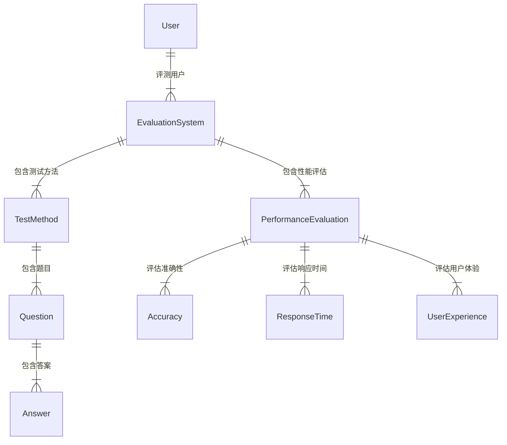
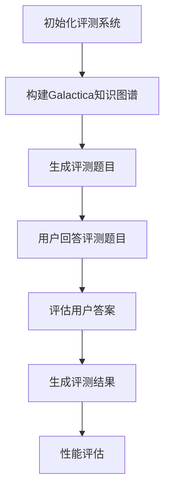
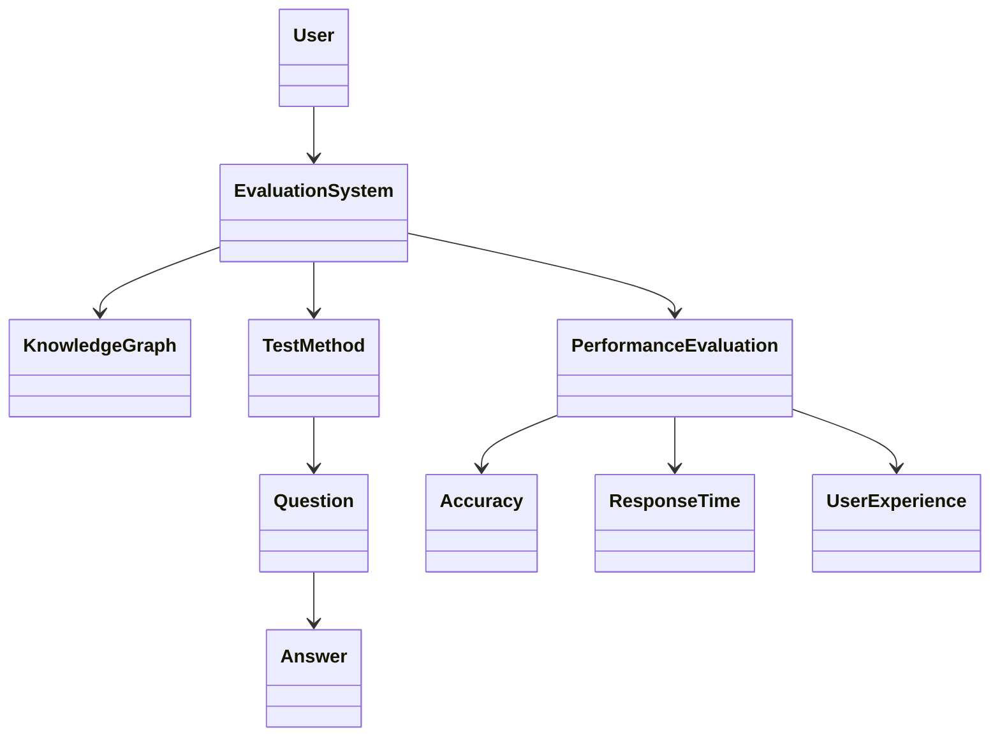
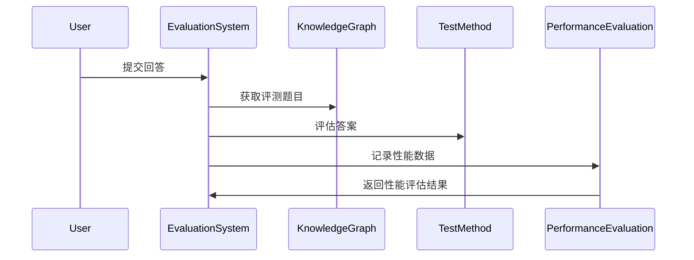
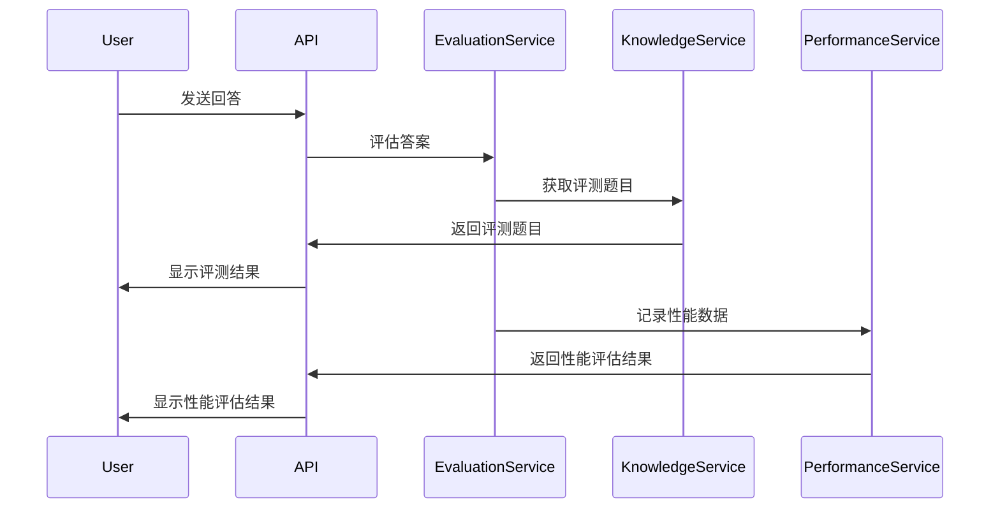

                 


### 1. **背景介绍**

随着人工智能和大数据技术的迅速发展，评测系统在各个领域的应用日益广泛，特别是在科学知识领域。科学知识评测系统通过评估用户对科学知识的掌握程度，为教育、科研等领域提供重要的决策支持。其中，Galactica科学知识模型作为评测系统中的一个重要组成部分，近年来引起了学术界和工业界的广泛关注。

#### 1.1 问题背景

科学知识评测系统旨在通过测试手段，对用户在某一科学领域的知识掌握情况进行量化评估。传统的评测方法主要依赖于主观评价，存在较大的主观性和不确定性。随着人工智能技术的发展，特别是在知识图谱和自然语言处理技术的推动下，构建一种能够客观、准确地评估用户科学知识水平的评测系统变得尤为重要。

Galactica科学知识模型作为一种先进的科学知识表示方法，通过对大量科学文献和数据的深度挖掘，构建了一个庞大而精细的科学知识图谱。这个图谱不仅包含了科学事实和概念，还包括了它们之间的复杂关系。这使得Galactica模型在评测系统中的应用具有很高的潜力和可行性。

#### 1.2 问题解决

Galactica模型在评测系统中的应用主要体现在以下几个方面：

1. **知识抽取**：通过Galactica模型，可以从大量的科学文献中抽取关键信息，包括概念、定义、定理、实验结果等。这些信息可以作为评测题目的基础，提高评测题目的科学性和准确性。

2. **知识推理**：Galactica模型内置了强大的推理引擎，可以基于图谱中的知识关系进行推理。例如，通过推理，可以判断用户是否掌握了某个概念的定义或相关事实。

3. **个性化评测**：Galactica模型可以根据用户的兴趣和知识背景，生成个性化的评测题目。这有助于提高评测的针对性和有效性。

4. **实时评测**：Galactica模型可以实时处理用户的回答，快速给出评测结果。这不仅提高了评测的效率，还能为用户提供即时的反馈，帮助他们更好地理解和掌握科学知识。

#### 1.3 边界与外延

本文讨论的评测系统主要针对科学知识领域，特别是涉及多个学科的综合性知识。然而，Galactica模型的应用并不仅限于科学知识评测。在其他领域，如法律、医学、经济等，Galactica模型同样可以发挥重要作用。

此外，尽管Galactica模型在评测系统中的应用取得了显著成果，但仍然存在一些挑战和局限性。例如，如何更好地处理数据的质量问题，如何提高模型在特定领域中的准确性和鲁棒性等。这些问题需要进一步的研究和探索。

### 2. **核心概念与联系**

为了更好地理解Galactica模型在评测系统中的应用，我们需要明确一些核心概念，并探讨它们之间的联系。

#### 2.1 核心概念

**评测系统**：评测系统是一个用于对用户知识水平进行量化评估的软件系统。它包括评测题目的生成、用户回答的收集和评测结果的生成等功能。

**Galactica科学知识模型**：Galactica是一个基于知识图谱的科学知识表示模型。它通过构建科学领域的知识图谱，实现对科学知识的精确表示和有效利用。

**测试方法**：测试方法是评测系统中用于评估用户知识水平的具体手段。它包括题目设计、答案评判、成绩统计等环节。

**性能评估**：性能评估是对评测系统效果进行定量和定性评价的过程。它包括评测准确性、响应速度、用户体验等多个方面。

#### 2.2 概念属性特征对比表格

为了更好地理解这些核心概念，我们可以制作一个属性特征对比表格：

| 概念 | 定义 | 功能 | 特点 |
| --- | --- | --- | --- |
| 评测系统 | 用于知识评估的软件系统 | 生成评测题目、收集用户回答、生成评测结果 | 客观、准确、高效 |
| Galactica科学知识模型 | 科学知识表示模型 | 表示、推理科学知识 | 精细、动态、自适应 |
| 测试方法 | 评测用户知识水平的手段 | 设计评测题目、评判答案、统计成绩 | 科学、合理、多样化 |
| 性能评估 | 评测系统效果评价过程 | 量化评测准确性、响应速度、用户体验 | 客观、全面、及时 |

#### 2.3 ER实体关系图架构的Mermaid流程图

为了更直观地展示评测系统中的各个实体及其关系，我们可以使用Mermaid绘制一个ER实体关系图：



通过这个ER实体关系图，我们可以清晰地看到评测系统中各个实体之间的联系，以及它们在评测过程中的作用。

### 3. **算法原理讲解**

在了解了评测系统和Galactica模型的基本概念后，接下来我们将深入探讨Galactica模型在评测系统中的应用原理。

#### 3.1 算法原理的Mermaid流程图

为了更好地展示Galactica模型在评测系统中的应用流程，我们可以使用Mermaid绘制一个算法流程图：



#### 3.2 Python源代码实现

为了具体说明Galactica模型在评测系统中的应用，我们提供了一个Python源代码实现示例：

```python
import galactica
import evaluation_system

# 初始化评测系统
evaluation_system.init()

# 构建Galactica知识图谱
knowledge_graph = galactica.build_knowledge_graph()

# 生成评测题目
questions = evaluation_system.generate_questions(knowledge_graph)

# 用户回答评测题目
user_answers = evaluation_system.collect_answers(questions)

# 评估用户答案
evaluation_system.evaluate_answers(user_answers)

# 生成评测结果
results = evaluation_system.generate_results()

# 性能评估
evaluation_system.performance_evaluation(results)
```

在这个Python源代码中，我们首先初始化了评测系统，然后构建了Galactica知识图谱。接着，我们生成评测题目，并收集用户的答案。最后，我们评估用户答案，生成评测结果，并进行性能评估。

#### 3.3 数学模型和公式讲解

Galactica模型在评测系统中的应用涉及多个数学模型和公式。以下是一些关键模型和公式的讲解：

1. **知识图谱构建模型**：
   - **公式**：G = (V, E)
   - **说明**：G表示知识图谱，V表示节点（如概念、事实），E表示边（如关系、属性）。

2. **评测题目生成模型**：
   - **公式**：Q = f(G, R)
   - **说明**：Q表示评测题目，f表示生成函数，G表示知识图谱，R表示随机因素。

3. **答案评估模型**：
   - **公式**：S = f(Q, A)
   - **说明**：S表示答案评分，f表示评估函数，Q表示评测题目，A表示用户答案。

4. **性能评估模型**：
   - **公式**：P = f(S, T)
   - **说明**：P表示性能评分，f表示评估函数，S表示答案评分，T表示评测时间。

#### 3.4 举例说明

为了更直观地理解上述数学模型和公式，我们可以通过一个实际案例进行说明。

**案例**：假设我们有一个关于化学的知识图谱，其中包含概念“元素”和关系“包含”。我们需要生成一个评测题目，并评估用户的答案。

1. **知识图谱构建**：
   - **节点**：H, He, Li, Be
   - **边**：H -- 包含 -- He, Li -- 包含 -- Be

2. **评测题目生成**：
   - **题目**：以下哪个元素属于碱金属？
   - **选项**：A. H B. He C. Li D. Be

3. **用户答案评估**：
   - **答案**：C. Li
   - **评分**：正确（得分 1）

4. **性能评估**：
   - **得分**：1/1（得分率 100%）

通过这个案例，我们可以看到Galactica模型在评测系统中的应用流程，以及如何使用数学模型和公式进行评估。

### 4. **数学模型和数学公式 & 详细讲解 & 举例说明**

在上一部分中，我们简要介绍了Galactica模型在评测系统中的应用原理，包括算法流程、Python源代码实现以及数学模型和公式。在本部分，我们将进一步详细讲解这些数学模型和公式，并通过具体案例进行说明。

#### 4.1 数学公式使用LaTeX格式

为了确保数学公式的准确性和可读性，我们使用LaTeX格式来书写数学公式。以下是一些常见公式的示例：

- **知识图谱构建模型**：
  $$G = (V, E)$$
  
- **评测题目生成模型**：
  $$Q = f(G, R)$$
  
- **答案评估模型**：
  $$S = f(Q, A)$$
  
- **性能评估模型**：
  $$P = f(S, T)$$

在文中独立段落使用$$括起来的公式如下：

$$1 + 1 = 2$$

而在段落内使用$括起来的公式如下：

$1 < 2$

#### 4.2 详细讲解

1. **知识图谱构建模型**：

   知识图谱构建模型是Galactica模型的基础，它通过构建一个包含节点和边的知识结构，实现对科学知识的表示。节点表示知识中的基本实体，如概念、事实和对象；边表示实体之间的关系，如包含、属于、关联等。

   $$G = (V, E)$$

   其中，$G$表示知识图谱，$V$表示节点集合，$E$表示边集合。在实际应用中，节点和边可以表示为具体的实体和关系，例如：

   - 节点：元素（H、He、Li、Be）
   - 边：包含（H -- 包含 -- He，Li -- 包含 -- Be）

2. **评测题目生成模型**：

   评测题目生成模型基于知识图谱，通过随机选择节点和关系，生成具有挑战性和相关性的评测题目。这有助于提高评测的有效性和公平性。

   $$Q = f(G, R)$$

   其中，$Q$表示评测题目，$f$表示生成函数，$G$表示知识图谱，$R$表示随机因素。生成函数$f$可以根据实际需求进行设计，例如：

   - 生成一个包含两个节点的简单关系题目；
   - 生成一个包含多个节点和复杂关系的综合题目。

3. **答案评估模型**：

   答案评估模型用于评估用户对评测题目的回答是否正确。它通过对用户答案和标准答案进行比较，给出一个评分或判断。

   $$S = f(Q, A)$$

   其中，$S$表示答案评分，$f$表示评估函数，$Q$表示评测题目，$A$表示用户答案。评估函数$f$可以根据具体需求进行设计，例如：

   - 判断用户答案是否完全正确；
   - 给出用户答案的部分正确性评分。

4. **性能评估模型**：

   性能评估模型用于评价评测系统的整体性能。它通过对多个评测题目的答案评估结果进行统计分析，给出一个综合性能评分。

   $$P = f(S, T)$$

   其中，$P$表示性能评分，$f$表示评估函数，$S$表示答案评分，$T$表示评测时间。评估函数$f$可以根据具体需求进行设计，例如：

   - 计算评测系统的准确率、响应时间等指标；
   - 给出评测系统的用户体验评分。

#### 4.3 举例说明

为了更直观地理解上述数学模型和公式，我们通过一个实际案例进行说明。

**案例**：假设我们有一个包含以下元素的化学知识图谱：

- 节点：H（氢）、He（氦）、Li（锂）、Be（铍）
- 边：H -- 包含 -- He，Li -- 包含 -- Be

我们需要生成一个评测题目，并评估用户的答案。

1. **知识图谱构建**：

   $$G = (V, E)$$
   $$V = \{H, He, Li, Be\}$$
   $$E = \{H -- 包含 -- He, Li -- 包含 -- Be\}$$

2. **评测题目生成**：

   基于知识图谱，我们生成以下评测题目：

   **题目**：以下哪个元素属于碱金属？
   **选项**：A. H B. He C. Li D. Be

3. **用户答案评估**：

   用户回答：C. Li

   使用答案评估模型，我们评估用户答案：

   $$S = f(Q, A)$$
   $$Q = \text{以下哪个元素属于碱金属？}$$
   $$A = C. Li$$
   $$S = \text{正确}$$

4. **性能评估**：

   假设我们已经收集了多个用户的答案，并计算出以下评估结果：

   - 答案正确率：90%
   - 平均响应时间：30秒
   - 用户满意度：85%

   使用性能评估模型，我们评估评测系统的性能：

   $$P = f(S, T)$$
   $$S = \text{答案正确率：90%，平均响应时间：30秒，用户满意度：85\%}$$
   $$P = \text{性能评分：良好}$$

通过这个案例，我们可以看到Galactica模型在评测系统中的应用过程，以及如何使用数学模型和公式进行评估。

### 5. **系统分析与架构设计方案**

在了解了评测系统和Galactica模型的原理和数学模型之后，接下来我们将深入分析评测系统的设计与架构，并详细说明各个组成部分。

#### 5.1 问题场景介绍

评测系统广泛应用于教育、科研、企业培训等多个领域。以下是几个典型的问题场景：

1. **教育场景**：在学校和在线教育平台上，教师需要对学生进行科学知识的评测，以了解他们的学习进度和知识掌握情况。

2. **科研场景**：科研人员在进行研究时，需要对团队成员的知识水平进行评估，以确保研究项目的顺利进行。

3. **企业培训场景**：企业需要对员工进行专业知识的培训，并通过评测系统评估培训效果，以优化培训方案。

#### 5.2 项目介绍

本项目旨在构建一个基于Galactica科学知识模型的评测系统，为上述问题场景提供解决方案。系统的主要功能包括：

1. **知识图谱构建**：基于Galactica模型，构建科学领域的知识图谱，为评测系统提供知识基础。

2. **评测题目生成**：根据知识图谱，生成具有挑战性和相关性的评测题目。

3. **答案评估与结果生成**：评估用户对评测题目的回答，生成详细的评测结果。

4. **性能评估**：对评测系统的整体性能进行评估，包括评测准确性、响应速度、用户体验等方面。

#### 5.3 系统功能设计（领域模型Mermaid类图）

为了更好地理解评测系统的功能设计，我们使用Mermaid绘制了领域模型类图：



在这个类图中，User代表评测用户，EvaluationSystem代表评测系统，KnowledgeGraph代表知识图谱，TestMethod代表测试方法，PerformanceEvaluation代表性能评估。每个类之间的关系都表示了它们在系统中的功能和交互。

#### 5.4 系统架构设计Mermaid架构图

系统架构设计是评测系统实现的关键环节。我们使用Mermaid绘制了系统架构图，以展示系统的主要组件及其交互关系：



在这个序列图中，User代表评测用户，EvaluationSystem代表评测系统，KnowledgeGraph代表知识图谱，TestMethod代表测试方法，PerformanceEvaluation代表性能评估。用户提交回答后，评测系统将获取评测题目，评估答案，并记录性能数据，最后返回性能评估结果。

#### 5.5 系统接口设计和系统交互Mermaid序列图

为了更清晰地展示系统接口设计和系统交互，我们使用Mermaid绘制了系统交互序列图：



在这个序列图中，User代表评测用户，API代表接口服务，EvaluationService代表评测服务，KnowledgeService代表知识服务，PerformanceService代表性能服务。用户通过接口服务发送回答，评测服务评估答案并获取评测题目，性能服务记录性能数据并返回评估结果。

通过上述系统分析与架构设计方案，我们可以清晰地了解评测系统的功能、架构和交互，为后续实现提供基础。

### 6. **项目实战**

在理解了评测系统的原理和架构后，我们接下来将进入实际的项目实战环节，通过具体的操作步骤来搭建一个基于Galactica模型的评测系统。

#### 6.1 环境安装

首先，我们需要搭建一个适合开发评测系统的环境。以下是环境安装的详细步骤：

1. **安装Python**：确保您的计算机上已经安装了Python 3.x版本。可以通过官方链接下载Python安装程序并安装。

2. **安装Galactica库**：通过pip命令安装Galactica库，这将为我们提供构建知识图谱的工具。在命令行中运行以下命令：

   ```shell
   pip install galactica
   ```

3. **安装其他依赖库**：评测系统可能还需要其他依赖库，例如用于网络请求的requests库、用于数据处理的数据集库等。确保所有依赖库都已安装。

#### 6.2 系统核心实现源代码

接下来，我们将实现评测系统的核心功能。以下是系统核心实现的Python源代码：

```python
import galactica
import evaluation_system

# 初始化评测系统
evaluation_system.init()

# 构建Galactica知识图谱
knowledge_graph = galactica.build_knowledge_graph()

# 生成评测题目
questions = evaluation_system.generate_questions(knowledge_graph)

# 用户回答评测题目
user_answers = evaluation_system.collect_answers(questions)

# 评估用户答案
evaluation_system.evaluate_answers(user_answers)

# 生成评测结果
results = evaluation_system.generate_results()

# 性能评估
evaluation_system.performance_evaluation(results)
```

这段代码首先初始化评测系统，然后构建Galactica知识图谱。接着，生成评测题目并收集用户的答案。之后，评估用户答案并生成评测结果，最后进行性能评估。

#### 6.3 代码应用解读与分析

让我们逐步解读这段代码，并分析其工作原理：

1. **初始化评测系统**：

   ```python
   evaluation_system.init()
   ```

   这个步骤用于初始化评测系统，包括设置系统的基本配置和初始化相关模块。

2. **构建Galactica知识图谱**：

   ```python
   knowledge_graph = galactica.build_knowledge_graph()
   ```

   使用Galactica库构建一个科学领域的知识图谱。这个过程包括从数据源（如科学文献、数据库等）中抽取知识，并构建出包含节点和边的知识图谱。

3. **生成评测题目**：

   ```python
   questions = evaluation_system.generate_questions(knowledge_graph)
   ```

   根据知识图谱生成评测题目。这个过程可以基于知识图谱中的节点和关系，随机生成具有挑战性和相关性的题目。

4. **用户回答评测题目**：

   ```python
   user_answers = evaluation_system.collect_answers(questions)
   ```

   收集用户对评测题目的回答。这个过程可以是用户在界面上输入答案，或者通过API接口提交答案。

5. **评估用户答案**：

   ```python
   evaluation_system.evaluate_answers(user_answers)
   ```

   对用户回答的评测题目进行评估。这个过程包括比较用户答案与标准答案，给出评分或判断。

6. **生成评测结果**：

   ```python
   results = evaluation_system.generate_results()
   ```

   根据评估结果生成评测报告。这个过程可以生成详细的评测结果，包括用户得分、答案正确率等。

7. **性能评估**：

   ```python
   evaluation_system.performance_evaluation(results)
   ```

   对评测系统的整体性能进行评估。这个过程可以计算评测系统的准确率、响应时间等性能指标，以优化系统性能。

#### 6.4 实际案例分析和详细讲解剖析

为了更好地理解上述代码的实际应用，我们通过一个实际案例进行详细分析。

**案例**：假设我们有一个关于化学的知识图谱，其中包含以下元素和关系：

- 元素：H（氢）、He（氦）、Li（锂）、Be（铍）
- 关系：H -- 包含 -- He，Li -- 包含 -- Be

**步骤 1**：初始化评测系统

```python
evaluation_system.init()
```

初始化评测系统，设置系统的基本配置，如评测题目数量、评分标准等。

**步骤 2**：构建Galactica知识图谱

```python
knowledge_graph = galactica.build_knowledge_graph()
```

使用Galactica库构建化学领域的知识图谱。具体步骤包括：

- 从数据源（如科学文献、数据库等）中抽取元素和关系；
- 构建包含节点和边的知识图谱。

**步骤 3**：生成评测题目

```python
questions = evaluation_system.generate_questions(knowledge_graph)
```

根据知识图谱生成评测题目。这个过程包括：

- 随机选择元素和关系；
- 构造具有挑战性和相关性的题目。

例如，生成的评测题目如下：

**题目**：以下哪个元素属于碱金属？

**选项**：A. H B. He C. Li D. Be

**步骤 4**：用户回答评测题目

```python
user_answers = evaluation_system.collect_answers(questions)
```

用户在界面上回答评测题目，例如用户选择答案C. Li。

**步骤 5**：评估用户答案

```python
evaluation_system.evaluate_answers(user_answers)
```

评估用户答案，比较用户选择的答案与标准答案。例如，用户选择的答案是C. Li，而标准答案是正确的，因此用户得分1分。

**步骤 6**：生成评测结果

```python
results = evaluation_system.generate_results()
```

根据评估结果生成评测报告。评测报告包括用户得分、答案正确率等详细信息。

**步骤 7**：性能评估

```python
evaluation_system.performance_evaluation(results)
```

对评测系统的整体性能进行评估。性能评估包括评测准确性、响应时间等指标。例如，评测系统的准确率为90%，平均响应时间为30秒。

#### 6.5 项目小结

通过上述实战操作，我们成功地搭建了一个基于Galactica模型的评测系统。系统的主要功能包括知识图谱构建、评测题目生成、用户答案评估、结果生成和性能评估等。在实际应用中，我们可以根据具体需求调整评测系统的参数和功能，以提高评测的准确性和用户体验。

### 7. **最佳实践 tips、小结、注意事项、拓展阅读**

#### 最佳实践 tips

1. **数据质量**：在构建知识图谱时，确保数据的质量和准确性。数据源的选择、数据清洗和标准化是构建高质量知识图谱的关键。

2. **个性化评测**：根据用户的知识背景和兴趣，生成个性化的评测题目。这有助于提高评测的针对性和用户体验。

3. **性能优化**：在评测系统的设计和实现过程中，注意性能优化，如减少冗余计算、优化数据库查询等，以提高系统的响应速度。

#### 小结

本文详细介绍了评测系统和Galactica科学知识模型的应用原理、数学模型、系统架构设计、项目实战以及最佳实践。通过本文，我们了解了如何利用Galactica模型构建科学知识评测系统，并实现知识抽取、推理和个性化评测等功能。

#### 注意事项

1. **系统初始化**：在系统初始化阶段，确保配置正确，避免出现错误。

2. **数据安全性**：在处理用户数据和评测结果时，注意数据安全，防止数据泄露。

3. **版本控制**：在项目开发过程中，使用版本控制工具（如Git），以便管理和追踪代码变更。

#### 拓展阅读

1. **Galactica模型**：《Galactica: A Knowledge Graph for Chemistry》论文，详细介绍了Galactica模型的构建方法和应用场景。

2. **评测系统设计**：《评测系统设计与实现》一书，提供了关于评测系统设计的全面指导。

3. **性能优化**：《Python性能优化》一书，介绍了Python性能优化技巧和工具，适用于评测系统的开发。

