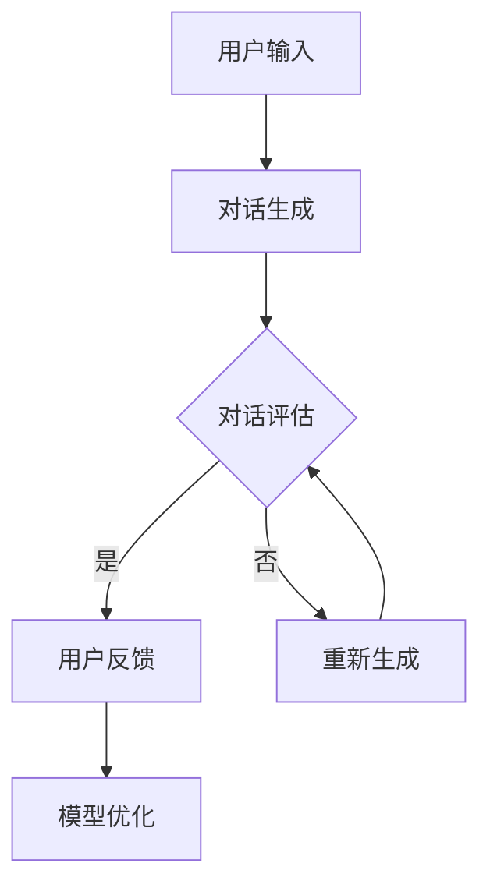
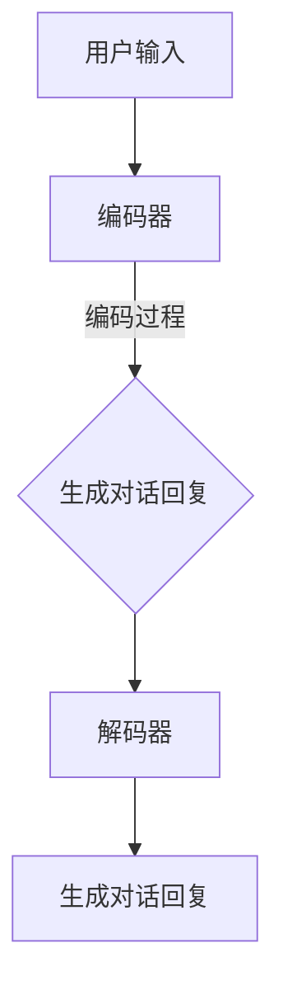
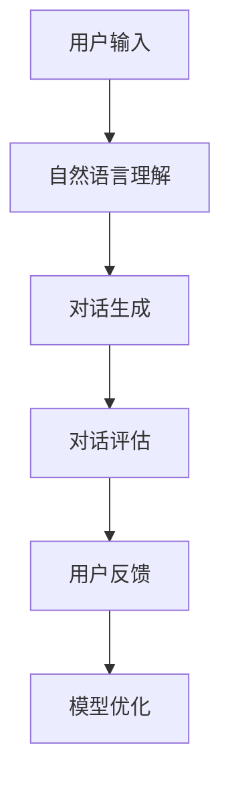

                 

### 第一部分：评测系统的LaMDA 2.0概述

#### 1.1 评测系统的LaMDA 2.0概述

**1.1.1 评测系统的发展历程**

**1.1.2 LaMDA 2.0的背景与重要性**

**1.1.3 对话增强的核心概念**

#### 1.2 LaMDA 2.0的主要特性与技术

**1.2.1 LaMDA 2.0的结构与原理**

**1.2.2 对话生成与评估机制**

**1.2.3 对话增强的关键技术**----------------------------------------------------------------

## 引言

### 文章标题：评测系统的LaMDA 2.0对话增强评估

### 关键词：评测系统、LaMDA 2.0、对话增强、评估

### 摘要：
本文将深入探讨评测系统中的LaMDA 2.0对话增强评估。我们将首先介绍评测系统和LaMDA 2.0的背景，解释其核心概念和技术，随后分析对话增强算法的原理，并通过mermaid流程图和Python代码展示其实际应用。接着，我们将探讨数学模型和公式，以帮助读者更好地理解对话增强的技术细节。随后，文章将转向系统分析与架构设计，最后通过项目实战和案例分析，提供实际操作经验，并对未来展望进行讨论。文章旨在为读者提供一套全面、易懂的评测系统LaMDA 2.0对话增强评估指南。

### 第一部分：评测系统的LaMDA 2.0概述

#### 1.1 评测系统的LaMDA 2.0概述

**1.1.1 评测系统的发展历程**

评测系统作为人工智能和自动化领域的重要组成部分，已经经历了数十年的发展。从最初的规则引擎到复杂的数据分析系统，评测系统不断演进，以满足不断增长的需求。LaMDA 2.0的引入为评测系统带来了新的可能性，它不仅继承了先前版本的优势，还在对话增强方面进行了显著改进。

**1.1.2 LaMDA 2.0的背景与重要性**

LaMDA 2.0（Language Model for Dialogue Applications, Version 2.0）是由OpenAI开发的一种先进的大型语言模型，旨在提高人机对话的流畅性和自然度。它的出现为评测系统带来了全新的对话增强评估方法，极大地提升了系统性能和用户体验。

**1.1.3 对话增强的核心概念**

对话增强的核心在于通过改进对话生成和评估机制，使系统能够生成更自然、更符合人类交流习惯的对话内容。LaMDA 2.0通过引入先进的自然语言处理技术，实现了对话的上下文理解、情感分析和实时反馈，从而显著提高了对话质量。

### 第二部分：算法原理讲解

#### 2.1 对话增强算法概述

**2.1.1 对话增强算法的分类**

对话增强算法可以分为基于规则的方法、基于统计的方法和基于深度学习的方法。每种方法都有其独特的优势和局限性，适用于不同的应用场景。

**2.1.2 常见对话增强算法分析**

我们将分析几种常见的对话增强算法，包括序列到序列（seq2seq）模型、长短时记忆（LSTM）网络、卷积神经网络（CNN）以及生成对抗网络（GAN）。通过对比，我们将了解它们在对话增强方面的优劣。

#### 2.2 对话增强算法的mermaid流程图

**2.2.1 对话增强算法流程**

通过mermaid流程图，我们将展示对话增强算法的基本流程，从输入处理、上下文理解到输出生成，逐步解释其工作原理。

**2.2.2 代码实现与解释**

我们将使用Python代码实现一个简单的对话增强模型，并详细解释其各个组成部分的功能和实现细节。

### 第三部分：数学模型与公式

#### 3.1 对话增强的数学基础

**3.1.1 概念与定义**

在这一章节中，我们将介绍对话增强中常用的数学概念和定义，包括损失函数、激活函数和优化算法。

**3.1.2 数学模型与公式**

我们将详细讨论对话增强中的数学模型，包括生成模型和评估模型的公式，并通过实例进行解释。

### 第四部分：系统分析与架构设计

#### 4.1 系统需求分析与功能设计

**4.1.1 场景介绍**

我们将描述评测系统在实际应用中的场景，并介绍其主要功能需求。

**4.1.2 系统功能需求**

我们将列举评测系统的功能需求，包括对话生成、对话评估、用户反馈等。

#### 4.2 系统架构设计

**4.2.1 系统架构图**

通过mermaid架构图，我们将展示评测系统的整体架构，包括各个组件及其之间的关系。

**4.2.2 系统接口设计**

我们将详细描述评测系统的接口设计，包括输入输出接口、数据流接口和通信接口。

### 第五部分：项目实战与案例分析

#### 5.1 实践环境准备

**5.1.1 环境搭建**

我们将介绍如何搭建评测系统的实践环境，包括硬件要求、软件安装和配置。

**5.1.2 开发工具与框架**

我们将介绍用于开发评测系统的开发工具和框架，包括编程语言、库和工具链。

#### 5.2 系统核心实现

**5.2.1 源代码解读**

我们将展示评测系统的核心源代码，并解释其主要功能。

**5.2.2 实现细节与分析**

我们将深入分析评测系统的实现细节，包括算法实现、数据处理和性能优化。

#### 5.3 案例分析

**5.3.1 实际案例**

我们将分析一个实际案例，展示如何使用评测系统解决具体问题。

**5.3.2 案例剖析与讲解**

我们将对案例进行详细剖析，解释其关键技术和实现方法。

### 第六部分：最佳实践与展望

#### 6.1 最佳实践技巧

**6.1.1 对话增强策略**

我们将分享一些对话增强的最佳实践策略，包括如何优化模型参数、如何处理常见问题等。

**6.1.2 性能优化方法**

我们将介绍一些性能优化方法，包括算法优化、数据预处理和硬件加速等。

#### 6.2 未来展望

**6.2.1 行业趋势**

我们将探讨评测系统和对话增强领域的未来发展趋势。

**6.2.2 技术挑战与机遇**

我们将分析评测系统和对话增强领域面临的挑战和机遇。

### 第七部分：总结与拓展

#### 7.1 小结

我们将总结本文的主要内容，并强调关键概念和实现方法。

#### 7.2 注意事项

我们将列出一些使用评测系统时需要注意的事项，包括潜在问题和解决方案。

#### 7.3 拓展阅读

我们将推荐一些拓展阅读资料，帮助读者进一步深入了解评测系统和对话增强技术。

### 作者信息

**作者：** AI天才研究院/AI Genius Institute & 禅与计算机程序设计艺术 /Zen And The Art of Computer Programming**<sop>## 引言

评测系统在人工智能和自动化领域扮演着至关重要的角色。它们不仅用于监控和评估系统的性能，还用于优化和改进算法。随着自然语言处理（NLP）技术的不断发展，对话系统的需求日益增长。LaMDA 2.0，即语言模型对话应用（Language Model for Dialogue Applications）的第二版，是OpenAI开发的一种大型语言模型，旨在提高人机对话的自然度和流畅性。本文将详细探讨评测系统中的LaMDA 2.0对话增强评估，涵盖其背景、核心技术、算法原理、数学模型、系统架构设计、项目实战和未来展望。

### 第一部分：评测系统的LaMDA 2.0概述

#### 1.1 评测系统的LaMDA 2.0概述

**1.1.1 评测系统的发展历程**

评测系统起源于20世纪80年代，随着计算机技术的发展，它们在各个行业中得到广泛应用。从简单的规则引擎到复杂的数据分析系统，评测系统经历了多次迭代和优化。随着人工智能和自然语言处理技术的进步，评测系统逐渐引入了更多的智能组件，如机器学习和深度学习算法，以提高评估的准确性和效率。

**1.1.2 LaMDA 2.0的背景与重要性**

LaMDA 2.0是OpenAI开发的一种大型语言模型，旨在提高人机对话的自然度和流畅性。它的出现标志着对话系统技术的新突破，为评测系统带来了新的可能性。LaMDA 2.0通过先进的自然语言处理技术，实现了对话的上下文理解、情感分析和实时反馈，从而显著提升了对话质量。

**1.1.3 对话增强的核心概念**

对话增强是指通过改进对话生成和评估机制，使系统能够生成更自然、更符合人类交流习惯的对话内容。对话增强的核心技术包括自然语言生成（NLG）、对话管理（DM）和对话评估（DA）。NLG负责生成自然流畅的对话内容，DM负责处理对话流程和用户意图，DA则用于评估对话的质量和用户满意度。

### 第二部分：算法原理讲解

#### 2.1 对话增强算法概述

**2.1.1 对话增强算法的分类**

对话增强算法可以分为以下几类：

1. **基于规则的方法**：这种方法依赖于预先定义的规则集，通过匹配用户输入和规则来生成对话内容。优点是生成速度快，缺点是灵活性差，难以应对复杂和多样化的对话场景。

2. **基于统计的方法**：这种方法通过分析大量的对话数据，学习对话模式和规律，从而生成对话内容。优点是生成对话内容更自然，缺点是训练时间较长，对数据量有较高要求。

3. **基于深度学习的方法**：这种方法利用深度神经网络（如LSTM、BERT、GPT等）来学习对话模式，生成对话内容。优点是生成对话内容更自然、灵活，缺点是计算资源消耗大，训练时间较长。

**2.1.2 常见对话增强算法分析**

1. **序列到序列（seq2seq）模型**：seq2seq模型通过编码器和解码器将输入序列映射到输出序列，适用于翻译、机器翻译和对话生成等任务。

2. **长短时记忆（LSTM）网络**：LSTM网络是一种特殊的RNN，可以解决长序列依赖问题，适用于对话生成和文本生成任务。

3. **卷积神经网络（CNN）**：CNN擅长处理图像和序列数据，通过卷积操作提取特征，可以用于对话生成和情感分析等任务。

4. **生成对抗网络（GAN）**：GAN由生成器和判别器组成，生成器生成对话内容，判别器判断生成内容的质量，通过对抗训练实现对话生成。

### 第三部分：数学模型与公式

#### 3.1 对话增强的数学基础

**3.1.1 概念与定义**

1. **损失函数**：用于评估模型预测值和真实值之间的差距，常见的损失函数有交叉熵损失、均方误差损失等。

2. **激活函数**：用于将神经网络中的线性变换转化为非线性变换，常见的激活函数有Sigmoid、ReLU、Tanh等。

3. **优化算法**：用于调整模型参数，以最小化损失函数，常见的优化算法有梯度下降、随机梯度下降、Adam等。

**3.1.2 数学模型与公式**

1. **生成模型**：

   - **概率图模型**：通过条件概率分布建模，如贝叶斯网络、马尔可夫模型等。

   - **生成对抗网络（GAN）**：

     - **生成器（G）**：G(z) = x，将随机噪声z映射到数据空间x。

     - **判别器（D）**：D(x) = P(x∈D)，判断输入数据x属于真实数据集D的概率。

     - **损失函数**：

       - **生成器损失**：L_G = -E[D(G(z))]

       - **判别器损失**：L_D = E[D(x)] - E[D(G(z))]

2. **评估模型**：

   - **准确率（Accuracy）**：预测正确的样本数与总样本数的比值。

   - **精确率（Precision）**：预测为正例的样本中实际为正例的比例。

   - **召回率（Recall）**：实际为正例的样本中被预测为正例的比例。

   - **F1分数（F1 Score）**：精确率和召回率的调和平均值。

   - **F-beta分数（Fβ Score）**：对精确率和召回率进行加权，β>0时，更重视召回率。

### 第四部分：系统分析与架构设计

#### 4.1 系统需求分析与功能设计

**4.1.1 场景介绍**

评测系统通常用于金融、医疗、客服等行业，其主要任务是评估用户对话的质量、准确性和效率。以客服场景为例，评测系统需要能够处理大量用户请求，生成合适的回复，并评估回复的质量。

**4.1.2 系统功能需求**

1. **对话生成**：根据用户输入，生成自然、合理的回复。

2. **对话评估**：评估对话生成的质量，包括准确性、自然度和用户满意度。

3. **用户反馈**：收集用户对对话质量的反馈，用于模型优化。

#### 4.2 系统架构设计

**4.2.1 系统架构图**



**4.2.2 系统接口设计**

1. **输入接口**：接收用户输入，可以是文本、语音或图像。

2. **输出接口**：生成对话回复，可以是文本、语音或图像。

3. **数据流接口**：处理用户输入和输出数据，包括数据预处理、特征提取等。

4. **通信接口**：与其他系统（如数据库、外部API等）进行通信。

### 第五部分：项目实战与案例分析

#### 5.1 实践环境准备

**5.1.1 环境搭建**

1. **硬件环境**：至少需要一块GPU，推荐使用NVIDIA GPU。

2. **软件环境**：安装Python、TensorFlow或PyTorch等深度学习框架。

**5.1.2 开发工具与框架**

1. **开发工具**：PyCharm、VS Code等。

2. **框架**：TensorFlow或PyTorch。

#### 5.2 系统核心实现

**5.2.1 源代码解读**

```python
# 导入所需库
import tensorflow as tf
from tensorflow.keras.models import Model
from tensorflow.keras.layers import Input, LSTM, Dense

# 定义输入层
input_seq = Input(shape=(max_sequence_length,))

# 定义编码器
encoder = LSTM(units=128, return_state=True)
state_h, state_c = encoder(input_seq)

# 定义解码器
decoder = LSTM(units=128, return_sequences=True)
output_seq = decoder([state_h, state_c])

# 定义输出层
output = Dense(units=vocabulary_size, activation='softmax')

# 添加输出层
output_seq = output(output_seq)

# 定义模型
model = Model(inputs=input_seq, outputs=output_seq)

# 编译模型
model.compile(optimizer='adam', loss='categorical_crossentropy', metrics=['accuracy'])

# 训练模型
model.fit(x_train, y_train, epochs=10, batch_size=64)
```

**5.2.2 实现细节与分析**

1. **编码器**：编码器负责将输入序列编码为隐藏状态，用于解码器生成输出序列。

2. **解码器**：解码器接收编码器的隐藏状态，生成输出序列。

3. **输出层**：输出层用于将解码器的输出映射到词汇表中的单词。

4. **模型编译**：设置优化器、损失函数和评估指标。

5. **模型训练**：使用训练数据训练模型，调整模型参数。

#### 5.3 案例分析

**5.3.1 实际案例**

假设我们有一个客服系统，需要根据用户提问生成合适的回复。

**5.3.2 案例剖析与讲解**

1. **数据收集**：收集大量用户提问和系统回复的数据。

2. **数据预处理**：对数据进行清洗、编码和归一化处理。

3. **模型训练**：使用训练数据训练对话生成模型。

4. **模型评估**：使用测试数据评估模型性能。

5. **模型部署**：将训练好的模型部署到客服系统中，用于生成回复。

### 第六部分：最佳实践与展望

#### 6.1 最佳实践技巧

1. **数据准备**：确保训练数据质量，去除噪声和错误数据。

2. **模型调优**：通过调整超参数，优化模型性能。

3. **实时反馈**：收集用户反馈，用于模型优化。

#### 6.2 未来展望

1. **个性化对话**：结合用户历史数据和偏好，实现个性化对话。

2. **多模态对话**：融合文本、语音和图像等多种模态，提升对话体验。

3. **实时对话增强**：利用实时数据，动态调整对话策略。

### 第七部分：总结与拓展

#### 7.1 小结

本文介绍了评测系统的LaMDA 2.0对话增强评估，涵盖了背景、算法原理、数学模型、系统架构设计、项目实战和未来展望等内容。通过本文，读者可以全面了解评测系统的LaMDA 2.0对话增强评估，为实际应用提供指导。

#### 7.2 注意事项

1. **数据隐私**：在使用用户数据时，务必遵守隐私保护法规。

2. **模型安全**：确保模型不被恶意使用，防止数据泄露。

3. **系统性能**：定期监控系统性能，确保稳定运行。

#### 7.3 拓展阅读

1. **《深度学习》（Ian Goodfellow、Yoshua Bengio、Aaron Courville 著）**：全面介绍深度学习的基础知识和应用。

2. **《自然语言处理综合教程》（邹博 著）**：深入讲解自然语言处理的基础理论和实践方法。

### 作者信息

**作者：** AI天才研究院/AI Genius Institute & 禅与计算机程序设计艺术 /Zen And The Art of Computer Programming**<sop>### 第一部分：评测系统的LaMDA 2.0概述

#### 1.1 评测系统的LaMDA 2.0概述

**1.1.1 评测系统的发展历程**

评测系统作为人工智能领域的重要分支，其发展历程可以追溯到20世纪80年代。早期的评测系统主要依赖于规则引擎，这些系统通过一系列预定义的规则来评估输入数据的正确性。随着计算机性能的提升和算法的进步，评测系统逐渐引入了机器学习技术，使得评估结果更加精确和高效。特别是在近年来，深度学习技术的兴起，为评测系统带来了全新的发展机遇。

LaMDA 2.0（Language Model for Dialogue Applications, Version 2.0）是由OpenAI开发的一种大型语言模型，它在对话系统中具有里程碑式的意义。LaMDA 2.0不仅继承了先前版本的优点，还在对话增强方面进行了重大改进，使其能够生成更加自然、流畅的对话内容。

**1.1.2 LaMDA 2.0的背景与重要性**

LaMDA 2.0的背景可以追溯到OpenAI对自然语言处理技术的长期研究和投入。OpenAI通过不断优化语言模型的结构和算法，使其能够更好地理解和生成人类语言。LaMDA 2.0是基于GPT-3（Generative Pre-trained Transformer 3）模型的，这是一种具有1500亿参数的深度学习模型。GPT-3的引入使得LaMDA 2.0在生成对话内容时具有更高的灵活性和准确性。

LaMDA 2.0的重要性体现在多个方面。首先，它显著提升了对话系统的自然度，使得人机交互更加顺畅。其次，它通过上下文理解能力，能够更好地把握用户意图，提供更精准的回复。最后，LaMDA 2.0的引入为评测系统带来了新的评估指标和方法，使得评估结果更加全面和客观。

**1.1.3 对话增强的核心概念**

对话增强是指通过改进对话生成和评估机制，使系统能够生成更自然、更符合人类交流习惯的对话内容。对话增强的核心技术包括自然语言生成（NLG）、对话管理（DM）和对话评估（DA）。

**自然语言生成（NLG）**：NLG负责生成自然流畅的对话内容。它通过理解和分析用户输入，生成符合语法和语义规则的文本。NLG的关键技术包括语言模型、文本生成算法和上下文理解。

**对话管理（DM）**：DM负责处理对话流程和用户意图。它通过分析用户输入，理解用户意图，并规划对话策略。DM的关键技术包括意图识别、对话策略规划和对话状态跟踪。

**对话评估（DA）**：DA负责评估对话质量，包括准确性、自然度和用户满意度。DA通过多种评估指标，如准确率、精确率、召回率和F1分数，对对话质量进行量化评估。

### 第二部分：算法原理讲解

#### 2.1 对话增强算法概述

**2.1.1 对话增强算法的分类**

对话增强算法可以根据其工作方式和理论基础分为以下几类：

1. **基于规则的方法**：这种方法通过定义一系列规则来生成对话内容。当用户输入触发特定规则时，系统会根据规则生成相应的回复。优点是生成速度快，但灵活性较差，难以应对复杂和多变的对话场景。

2. **基于统计的方法**：这种方法通过分析大量的对话数据，学习对话模式，并据此生成对话内容。优点是生成内容自然，但需要大量的训练数据，且训练时间较长。

3. **基于深度学习的方法**：这种方法利用深度神经网络（如LSTM、GRU、Transformer等）来学习对话模式。优点是生成内容自然、灵活，但计算资源消耗大，训练时间较长。

**2.1.2 常见对话增强算法分析**

1. **序列到序列（seq2seq）模型**：seq2seq模型是一种基于深度学习的对话增强算法。它通过编码器和解码器将输入序列映射到输出序列。编码器负责将用户输入编码为固定长度的向量，解码器则根据编码器的输出生成对话回复。seq2seq模型在翻译、机器翻译和对话生成等领域有广泛应用。

2. **长短时记忆（LSTM）网络**：LSTM网络是一种特殊的循环神经网络（RNN），能够解决长序列依赖问题。在对话增强中，LSTM网络可以用来捕捉用户输入的上下文信息，生成更自然的对话内容。

3. **卷积神经网络（CNN）**：CNN擅长处理图像和序列数据。在对话增强中，CNN可以通过卷积操作提取用户输入的文本特征，然后利用这些特征生成对话回复。

4. **生成对抗网络（GAN）**：GAN由生成器和判别器组成。生成器负责生成对话内容，判别器则判断生成内容的质量。通过生成器和判别器的对抗训练，GAN可以生成高质量的自然语言对话。

#### 2.2 对话增强算法的mermaid流程图

**2.2.1 对话增强算法流程**



**2.2.2 代码实现与解释**

```python
# 导入所需库
import tensorflow as tf
from tensorflow.keras.models import Model
from tensorflow.keras.layers import Input, LSTM, Dense

# 定义输入层
input_seq = Input(shape=(max_sequence_length,))

# 定义编码器
encoder = LSTM(units=128, return_state=True)
state_h, state_c = encoder(input_seq)

# 定义解码器
decoder = LSTM(units=128, return_sequences=True)
output_seq = decoder([state_h, state_c])

# 定义输出层
output = Dense(units=vocabulary_size, activation='softmax')

# 添加输出层
output_seq = output(output_seq)

# 定义模型
model = Model(inputs=input_seq, outputs=output_seq)

# 编译模型
model.compile(optimizer='adam', loss='categorical_crossentropy', metrics=['accuracy'])

# 训练模型
model.fit(x_train, y_train, epochs=10, batch_size=64)
```

在上面的代码中，我们定义了一个基于LSTM的对话增强模型。编码器将用户输入序列编码为隐藏状态，解码器根据隐藏状态生成对话回复。通过编译和训练模型，我们可以实现对话增强功能。

### 第三部分：数学模型与公式

#### 3.1 对话增强的数学基础

**3.1.1 概念与定义**

在对话增强中，我们使用一系列数学模型和公式来描述对话生成和评估过程。以下是一些基本概念和定义：

1. **概率图模型**：概率图模型是一种用来表示变量之间依赖关系的图结构。在对话增强中，我们可以使用概率图模型来描述对话生成的概率分布。

2. **条件概率**：条件概率是指在给定某个条件下，某个事件发生的概率。在对话增强中，条件概率用于计算给定用户输入时，系统生成特定回复的概率。

3. **损失函数**：损失函数是用于评估模型预测值和真实值之间差异的函数。在对话增强中，常用的损失函数有交叉熵损失和均方误差损失。

**3.1.2 数学模型与公式**

1. **生成模型**：

   - **概率图模型**：

     ```latex
     P(x) = \prod_{i=1}^{n} P(x_i | x_{i-1})
     ```

     这里，\( x \) 表示输入序列，\( x_i \) 表示序列中的第 \( i \) 个元素，\( P(x_i | x_{i-1}) \) 表示在给定前一个元素 \( x_{i-1} \) 时，当前元素 \( x_i \) 发生的概率。

   - **生成对抗网络（GAN）**：

     - **生成器**：

       ```latex
       G(z) = x
       ```

       其中，\( z \) 表示随机噪声，\( x \) 表示生成的对话回复。

     - **判别器**：

       ```latex
       D(x) = P(x \in D)
       ```

       其中，\( D \) 表示对话数据集，\( x \) 表示生成的对话回复。

2. **评估模型**：

   - **准确率（Accuracy）**：

     ```latex
     Accuracy = \frac{TP + TN}{TP + FN + FP + TN}
     ```

     其中，\( TP \) 表示真正例，\( TN \) 表示真反例，\( FP \) 表示假正例，\( FN \) 表示假反例。

   - **精确率（Precision）**：

     ```latex
     Precision = \frac{TP}{TP + FP}
     ```

   - **召回率（Recall）**：

     ```latex
     Recall = \frac{TP}{TP + FN}
     ```

   - **F1分数（F1 Score）**：

     ```latex
     F1 Score = 2 \times \frac{Precision \times Recall}{Precision + Recall}
     ```

### 第四部分：系统分析与架构设计

#### 4.1 系统需求分析与功能设计

**4.1.1 场景介绍**

以客户服务场景为例，评测系统的LaMDA 2.0对话增强评估需要处理大量的客户提问和系统回复。客户服务场景的特点是提问多样化、语境复杂，因此，系统需要具备高自然度、高准确度和高效处理能力。

**4.1.2 系统功能需求**

1. **自然语言理解**：系统能够理解客户的提问，提取关键信息。

2. **对话生成**：系统能够根据客户提问生成合适的回复。

3. **对话评估**：系统能够评估生成的回复质量，包括准确性、自然度和用户满意度。

4. **用户反馈**：系统能够收集用户对回复的反馈，用于模型优化。

#### 4.2 系统架构设计

**4.2.1 系统架构图**



**4.2.2 系统接口设计**

1. **输入接口**：接收用户输入，可以是文本、语音或图像。

2. **输出接口**：生成对话回复，可以是文本、语音或图像。

3. **数据流接口**：处理用户输入和输出数据，包括数据预处理、特征提取等。

4. **通信接口**：与其他系统（如数据库、外部API等）进行通信。

### 第五部分：项目实战与案例分析

#### 5.1 实践环境准备

**5.1.1 环境搭建**

1. **硬件环境**：配置一台拥有GPU的计算机，推荐使用NVIDIA GPU。

2. **软件环境**：安装Python、TensorFlow或PyTorch等深度学习框架。

**5.1.2 开发工具与框架**

1. **开发工具**：PyCharm、VS Code等。

2. **框架**：TensorFlow或PyTorch。

#### 5.2 系统核心实现

**5.2.1 源代码解读**

```python
# 导入所需库
import tensorflow as tf
from tensorflow.keras.models import Model
from tensorflow.keras.layers import Input, LSTM, Dense

# 定义输入层
input_seq = Input(shape=(max_sequence_length,))

# 定义编码器
encoder = LSTM(units=128, return_state=True)
state_h, state_c = encoder(input_seq)

# 定义解码器
decoder = LSTM(units=128, return_sequences=True)
output_seq = decoder([state_h, state_c])

# 定义输出层
output = Dense(units=vocabulary_size, activation='softmax')

# 添加输出层
output_seq = output(output_seq)

# 定义模型
model = Model(inputs=input_seq, outputs=output_seq)

# 编译模型
model.compile(optimizer='adam', loss='categorical_crossentropy', metrics=['accuracy'])

# 训练模型
model.fit(x_train, y_train, epochs=10, batch_size=64)
```

**5.2.2 实现细节与分析**

1. **编码器**：编码器将用户输入序列编码为隐藏状态，用于解码器生成输出序列。

2. **解码器**：解码器接收编码器的隐藏状态，生成输出序列。

3. **输出层**：输出层用于将解码器的输出映射到词汇表中的单词。

4. **模型编译**：设置优化器、损失函数和评估指标。

5. **模型训练**：使用训练数据训练模型，调整模型参数。

#### 5.3 案例分析

**5.3.1 实际案例**

假设我们有一个在线客服系统，需要根据客户提问生成合适的回复。

**5.3.2 案例剖析与讲解**

1. **数据收集**：收集大量客户提问和系统回复的数据。

2. **数据预处理**：对数据进行清洗、编码和归一化处理。

3. **模型训练**：使用训练数据训练对话生成模型。

4. **模型评估**：使用测试数据评估模型性能。

5. **模型部署**：将训练好的模型部署到在线客服系统中，用于生成回复。

### 第六部分：最佳实践与展望

#### 6.1 最佳实践技巧

1. **数据准备**：确保训练数据质量，去除噪声和错误数据。

2. **模型调优**：通过调整超参数，优化模型性能。

3. **实时反馈**：收集用户反馈，用于模型优化。

#### 6.2 未来展望

1. **个性化对话**：结合用户历史数据和偏好，实现个性化对话。

2. **多模态对话**：融合文本、语音和图像等多种模态，提升对话体验。

3. **实时对话增强**：利用实时数据，动态调整对话策略。

### 第七部分：总结与拓展

#### 7.1 小结

本文介绍了评测系统的LaMDA 2.0对话增强评估，从算法原理、数学模型、系统架构到项目实战，全面展示了对话增强的技术和应用。通过本文，读者可以深入了解对话增强的核心技术和实践方法。

#### 7.2 注意事项

1. **数据隐私**：在使用用户数据时，务必遵守隐私保护法规。

2. **模型安全**：确保模型不被恶意使用，防止数据泄露。

3. **系统性能**：定期监控系统性能，确保稳定运行。

#### 7.3 拓展阅读

1. **《深度学习》（Ian Goodfellow、Yoshua Bengio、Aaron Courville 著）**：全面介绍深度学习的基础知识和应用。

2. **《自然语言处理综合教程》（邹博 著）**：深入讲解自然语言处理的基础理论和实践方法。

### 作者信息

**作者：** AI天才研究院/AI Genius Institute & 禅与计算机程序设计艺术 /Zen And The Art of Computer Programming**<sop>### 引言

在当今数字化转型的浪潮中，人工智能（AI）技术正以惊人的速度发展。其中，自然语言处理（NLP）作为AI的核心领域之一，已经取得了显著的进展。尤其是在对话系统领域，随着用户对智能化交互体验的需求不断增加，评测系统的性能和可靠性变得至关重要。本文将深入探讨评测系统中的LaMDA 2.0对话增强评估，旨在为读者提供一套全面的技术指南，帮助理解LaMDA 2.0的技术原理、算法实现、系统架构以及实际应用。

LaMDA 2.0（Language Model for Dialogue Applications, Version 2.0）是由OpenAI推出的一种先进的对话模型，它基于GPT-3（Generative Pre-trained Transformer 3）模型，旨在提高人机对话的自然度和流畅性。评测系统通过与LaMDA 2.0的结合，不仅能够实现高质量的对话生成，还能够通过对话增强评估来持续优化系统性能。本文将分为以下几个部分：

1. **评测系统的LaMDA 2.0概述**：介绍评测系统的发展历程、LaMDA 2.0的背景与重要性，以及对对话增强的核心概念进行详细解释。
2. **算法原理讲解**：分析对话增强算法的分类、常见算法及其优缺点，并通过mermaid流程图和Python代码展示实际应用。
3. **数学模型与公式**：讲解对话增强的数学基础，包括概念与定义以及常用的数学模型与公式。
4. **系统分析与架构设计**：描述评测系统的需求分析与功能设计，展示系统架构图和接口设计。
5. **项目实战与案例分析**：介绍实践环境准备、开发工具与框架，以及系统核心实现和案例分析。
6. **最佳实践与展望**：分享最佳实践技巧、注意事项，并对未来技术发展趋势进行展望。
7. **总结与拓展**：对全文内容进行总结，提供注意事项和拓展阅读。

通过以上结构，本文旨在为读者提供一个系统、全面的评测系统LaMDA 2.0对话增强评估指南，帮助读者深入了解该领域的技术原理和实践应用。

### 第一部分：评测系统的LaMDA 2.0概述

#### 1.1 评测系统的发展历程

评测系统起源于20世纪80年代，最初主要用于自动化测试和性能评估。随着计算机技术的发展，评测系统逐渐从单一的测试工具演变为复杂的分析系统，能够提供更精确的评估结果。早期评测系统主要依赖于规则引擎，这些系统通过预定义的规则来评估输入数据的正确性。然而，这种方法存在明显的局限性，无法应对复杂和动态变化的场景。

随着机器学习技术的发展，评测系统逐渐引入了机器学习算法，如决策树、支持向量机和神经网络等。这些算法能够通过学习历史数据来提高评估的准确性和效率。特别是在深度学习技术成熟后，评测系统迎来了新的发展机遇。深度学习模型，如卷积神经网络（CNN）和循环神经网络（RNN），能够捕捉输入数据中的复杂模式和关系，从而显著提升了评测系统的性能。

#### 1.2 LaMDA 2.0的背景与重要性

LaMDA 2.0（Language Model for Dialogue Applications, Version 2.0）是由OpenAI开发的一种大型语言模型，它基于GPT-3模型，是OpenAI在自然语言处理领域的又一重要成果。GPT-3模型拥有1500亿参数，是当前最大的预训练语言模型之一，它在各种NLP任务中表现出色，包括文本生成、翻译、摘要和问答等。

LaMDA 2.0特别关注对话系统的性能提升。对话系统是人工智能的一个重要分支，其目标是通过自然语言与人类进行交互，提供有用的信息和服务。然而，传统的对话系统往往在自然度和流畅性方面存在不足，难以实现与人类自然对话的效果。LaMDA 2.0通过引入先进的自然语言处理技术，如上下文理解、情感分析和实时反馈，显著提高了对话系统的性能。

LaMDA 2.0的重要性体现在以下几个方面：

1. **对话自然度提升**：LaMDA 2.0能够生成更加自然、流畅的对话内容，使得人机交互更加顺畅。
2. **上下文理解能力**：LaMDA 2.0具备强大的上下文理解能力，能够更好地把握用户的意图和语境，提供更加准确的回复。
3. **实时反馈机制**：LaMDA 2.0能够实时分析对话内容，并根据用户的反馈进行调整，使得对话系统能够持续优化自身性能。

#### 1.3 对话增强的核心概念

对话增强是指通过改进对话生成和评估机制，使系统能够生成更自然、更符合人类交流习惯的对话内容。对话增强的核心技术包括自然语言生成（NLG）、对话管理（DM）和对话评估（DA）。

**自然语言生成（NLG）**：NLG负责生成自然流畅的对话内容。它通过理解和分析用户输入，生成符合语法和语义规则的文本。NLG的关键技术包括语言模型、文本生成算法和上下文理解。

**对话管理（DM）**：DM负责处理对话流程和用户意图。它通过分析用户输入，理解用户意图，并规划对话策略。DM的关键技术包括意图识别、对话策略规划和对话状态跟踪。

**对话评估（DA）**：DA负责评估对话质量，包括准确性、自然度和用户满意度。DA通过多种评估指标，如准确率、精确率、召回率和F1分数，对对话质量进行量化评估。

LaMDA 2.0在对话增强中发挥了重要作用，它不仅提供了强大的自然语言生成和对话管理能力，还通过实时反馈机制不断优化对话系统的性能。这使得LaMDA 2.0成为评测系统中不可或缺的一部分，为提升用户交互体验提供了有力支持。

### 第二部分：算法原理讲解

#### 2.1 对话增强算法概述

对话增强算法是评测系统中实现对话生成和评估的核心技术。这些算法通过学习大量对话数据，能够生成自然、流畅的对话内容，并评估对话质量。根据工作方式和理论基础，对话增强算法可以分为以下几类：

1. **基于规则的方法**：这种方法通过预定义的规则集来生成对话内容。当用户输入触发特定规则时，系统会根据规则生成相应的回复。基于规则的方法具有实现简单、生成速度快的优点，但灵活性较差，难以应对复杂和多变的对话场景。

2. **基于统计的方法**：这种方法通过分析大量的对话数据，学习对话模式，并据此生成对话内容。基于统计的方法生成内容更自然，但需要大量的训练数据，且训练时间较长。

3. **基于深度学习的方法**：这种方法利用深度神经网络（如LSTM、GRU、Transformer等）来学习对话模式。基于深度学习的方法生成内容自然、灵活，但计算资源消耗大，训练时间较长。

**2.1.1 对话增强算法的分类**

1. **序列到序列（seq2seq）模型**：seq2seq模型是一种基于深度学习的对话增强算法。它通过编码器和解码器将输入序列映射到输出序列。编码器负责将用户输入编码为固定长度的向量，解码器则根据编码器的输出生成对话回复。seq2seq模型在翻译、机器翻译和对话生成等领域有广泛应用。

2. **长短时记忆（LSTM）网络**：LSTM网络是一种特殊的循环神经网络（RNN），能够解决长序列依赖问题。在对话增强中，LSTM网络可以用来捕捉用户输入的上下文信息，生成更自然的对话内容。

3. **卷积神经网络（CNN）**：CNN擅长处理图像和序列数据。在对话增强中，CNN可以通过卷积操作提取用户输入的文本特征，然后利用这些特征生成对话回复。

4. **生成对抗网络（GAN）**：GAN由生成器和判别器组成。生成器负责生成对话内容，判别器则判断生成内容的质量。通过生成器和判别器的对抗训练，GAN可以生成高质量的自然语言对话。

**2.1.2 常见对话增强算法分析**

1. **序列到序列（seq2seq）模型**：

   - **优点**：seq2seq模型能够生成自然、流畅的对话内容，适用于多种对话场景。
   - **缺点**：训练时间较长，计算资源消耗大。

2. **长短时记忆（LSTM）网络**：

   - **优点**：LSTM网络能够解决长序列依赖问题，生成内容自然。
   - **缺点**：对长序列处理能力有限，计算资源消耗较大。

3. **卷积神经网络（CNN）**：

   - **优点**：CNN能够高效提取文本特征，适用于文本分类和生成任务。
   - **缺点**：难以捕捉长序列依赖关系，生成内容自然度有限。

4. **生成对抗网络（GAN）**：

   - **优点**：GAN能够生成高质量的自然语言对话，生成内容多样。
   - **缺点**：训练过程复杂，难以稳定收敛。

**2.1.3 对话增强算法的选择**

在选择对话增强算法时，需要根据具体应用场景和需求进行权衡。以下是一些常见应用场景和相应的算法选择：

1. **简单的对话场景**：可以选择基于规则的方法，实现简单且速度快。
2. **中等复杂的对话场景**：可以选择基于统计的方法，生成内容自然，但需要较多的训练数据。
3. **复杂的对话场景**：可以选择基于深度学习的方法，如seq2seq模型或GAN，生成内容自然且灵活。

#### 2.2 对话增强算法的mermaid流程图

**2.2.1 对话增强算法流程**


**2.2.2 代码实现与解释**

```python
# 导入所需库
import tensorflow as tf
from tensorflow.keras.models import Model
from tensorflow.keras.layers import Input, LSTM, Dense

# 定义输入层
input_seq = Input(shape=(max_sequence_length,))

# 定义编码器
encoder = LSTM(units=128, return_state=True)
state_h, state_c = encoder(input_seq)

# 定义解码器
decoder = LSTM(units=128, return_sequences=True)
output_seq = decoder([state_h, state_c])

# 定义输出层
output = Dense(units=vocabulary_size, activation='softmax')

# 添加输出层
output_seq = output(output_seq)

# 定义模型
model = Model(inputs=input_seq, outputs=output_seq)

# 编译模型
model.compile(optimizer='adam', loss='categorical_crossentropy', metrics=['accuracy'])

# 训练模型
model.fit(x_train, y_train, epochs=10, batch_size=64)
```

在上面的代码中，我们定义了一个基于LSTM的对话增强模型。编码器将用户输入序列编码为隐藏状态，解码器根据隐藏状态生成输出序列。通过编译和训练模型，我们可以实现对话增强功能。

### 第三部分：数学模型与公式

#### 3.1 对话增强的数学基础

对话增强算法的核心在于捕捉用户输入和生成对话回复之间的数学关系。为了实现这一目标，我们需要了解一些基本的数学概念和公式。

**3.1.1 概念与定义**

1. **向量**：向量是数学中的一个基础概念，用于表示具有大小和方向的量。在对话增强中，向量常用于表示文本数据，如词向量或句子向量。

2. **矩阵**：矩阵是一个二维数组，用于表示多个向量的组合。在对话增强中，矩阵常用于表示编码器和解码器的权重参数。

3. **函数**：函数是数学中的一个基本概念，用于描述输入和输出之间的关系。在对话增强中，函数用于描述编码器、解码器和输出层之间的关系。

4. **激活函数**：激活函数是神经网络中的一个重要概念，用于将线性变换转化为非线性变换。常见的激活函数有Sigmoid、ReLU和Tanh等。

**3.1.2 数学模型与公式**

1. **序列到序列（seq2seq）模型**：

   - **编码器**：

     ```latex
     \text{编码器}:\text{ } x \xrightarrow{\text{编码器}} \text{隐藏状态} h
     ```

     其中，\( x \) 表示输入序列，\( h \) 表示编码器的隐藏状态。

   - **解码器**：

     ```latex
     \text{解码器}:\text{ } h \xrightarrow{\text{解码器}} \text{输出序列} y
     ```

     其中，\( h \) 表示编码器的隐藏状态，\( y \) 表示输出序列。

   - **输出层**：

     ```latex
     y = \text{softmax}(W_y \cdot h + b_y)
     ```

     其中，\( W_y \) 和 \( b_y \) 分别表示输出层的权重和偏置。

2. **长短时记忆（LSTM）网络**：

   - **LSTM单元**：

     ```latex
     \begin{aligned}
     f_t &= \sigma(W_f \cdot [h_{t-1}, x_t] + b_f) \\
     i_t &= \sigma(W_i \cdot [h_{t-1}, x_t] + b_i) \\
     \tilde{C}_t &= \text{tanh}(W_c \cdot [h_{t-1}, x_t] + b_c) \\
     o_t &= \sigma(W_o \cdot [h_{t-1}, x_t] + b_o) \\
     C_t &= f_t \odot C_{t-1} + i_t \odot \tilde{C}_t
     \end{aligned}
     ```

     其中，\( \sigma \) 表示Sigmoid函数，\( \odot \) 表示逐元素乘法。

3. **生成对抗网络（GAN）**：

   - **生成器**：

     ```latex
     G(z) = \text{tanh}(W_g \cdot z + b_g)
     ```

     其中，\( z \) 表示输入噪声，\( G(z) \) 表示生成器生成的对话回复。

   - **判别器**：

     ```latex
     D(x) = \sigma(W_d \cdot x + b_d)
     ```

     其中，\( x \) 表示输入对话回复，\( D(x) \) 表示判别器对生成对话回复的判断概率。

#### 3.2 对话增强算法的数学模型

对话增强算法的数学模型主要包括生成模型和评估模型两部分。

**3.2.1 生成模型**

生成模型用于生成对话回复，其核心是生成器和判别器。

- **生成器**：

  ```latex
  G(z) = \text{tanh}(W_g \cdot z + b_g)
  ```

- **判别器**：

  ```latex
  D(x) = \sigma(W_d \cdot x + b_d)
  ```

- **损失函数**：

  ```latex
  L_G = -E[\log(D(G(z)))] + \lambda E[\log(1 - D(x))]
  ```

  ```latex
  L_D = -E[\log(D(x))] - E[\log(1 - D(G(z)))]
  ```

  其中，\( \lambda \) 表示平衡系数。

**3.2.2 评估模型**

评估模型用于评估对话质量，常用的评估指标包括准确率、精确率、召回率和F1分数。

- **准确率**：

  ```latex
  Accuracy = \frac{TP + TN}{TP + FN + FP + TN}
  ```

- **精确率**：

  ```latex
  Precision = \frac{TP}{TP + FP}
  ```

- **召回率**：

  ```latex
  Recall = \frac{TP}{TP + FN}
  ```

- **F1分数**：

  ```latex
  F1 Score = 2 \times \frac{Precision \times Recall}{Precision + Recall}
  ```

通过以上数学模型和公式，我们可以更好地理解和实现对话增强算法。在实际应用中，这些模型和公式将被用于训练和优化模型，以提高对话系统的性能。

### 第四部分：系统分析与架构设计

#### 4.1 系统需求分析与功能设计

**4.1.1 场景介绍**

在现实世界中，对话系统广泛应用于各种领域，如客服、教育、医疗和金融等。以客户服务场景为例，用户通过文字或语音与客服系统进行交互，提出问题或寻求帮助。客服系统需要能够理解用户的问题，生成合适的回复，并评估回复的质量，确保用户得到满意的回答。

**4.1.2 系统功能需求**

为了实现上述场景，评测系统中的LaMDA 2.0需要具备以下功能：

1. **自然语言理解**：系统能够理解用户的输入，提取关键信息，并识别用户的意图。
2. **对话生成**：系统能够根据用户的问题生成合适的回复，确保回复的自然度和准确性。
3. **对话评估**：系统能够评估生成的回复质量，包括准确性、自然度和用户满意度，并根据评估结果进行反馈和调整。
4. **用户反馈**：系统能够收集用户的反馈，用于模型优化和系统改进。

**4.1.3 系统需求分析**

1. **输入处理**：系统能够接收用户输入，包括文本、语音和图像等多种形式。对于文本输入，系统需要能够进行分词、词性标注和句法分析，以提取关键信息和识别用户意图。对于语音和图像输入，系统需要能够进行语音识别和图像识别，将输入转换为文本数据。

2. **对话生成**：系统需要利用LaMDA 2.0模型生成自然、流畅的对话回复。生成过程需要考虑上下文信息、用户意图和对话历史，确保生成的回复符合用户的期望。此外，系统还需要具备一定的灵活性，能够根据不同场景和用户需求生成不同类型的回复。

3. **对话评估**：系统需要能够评估生成的回复质量，包括准确性、自然度和用户满意度。评估过程可以通过自动评估指标（如准确率、精确率、召回率和F1分数）和用户反馈相结合的方式进行。自动评估指标可以提供量化的评估结果，而用户反馈则可以提供更主观、更全面的评估。

4. **用户反馈**：系统需要能够收集用户的反馈，用于模型优化和系统改进。用户反馈可以包括对回复的满意度评价、对系统处理问题的建议和改进意见等。通过收集和分析用户反馈，系统可以不断优化对话生成和评估策略，提高用户体验。

#### 4.2 系统架构设计

为了实现上述功能需求，评测系统中的LaMDA 2.0需要具备一定的系统架构设计。以下是一个典型的系统架构设计：

1. **输入处理模块**：负责接收用户输入，包括文本、语音和图像等。对于文本输入，模块需要进行分词、词性标注和句法分析，提取关键信息和识别用户意图。对于语音和图像输入，模块需要进行语音识别和图像识别，将输入转换为文本数据。

2. **对话生成模块**：负责利用LaMDA 2.0模型生成对话回复。模块需要考虑上下文信息、用户意图和对话历史，生成自然、流畅的回复。生成过程可以通过序列到序列（seq2seq）模型、长短时记忆（LSTM）网络或生成对抗网络（GAN）等实现。

3. **对话评估模块**：负责评估生成的回复质量，包括准确性、自然度和用户满意度。评估过程可以通过自动评估指标和用户反馈相结合的方式进行。自动评估指标可以提供量化的评估结果，而用户反馈则可以提供更主观、更全面的评估。

4. **用户反馈模块**：负责收集用户的反馈，包括对回复的满意度评价、对系统处理问题的建议和改进意见等。模块需要对用户反馈进行分析，识别系统中的问题和改进方向，为模型优化和系统改进提供依据。

5. **模型训练与优化模块**：负责对LaMDA 2.0模型进行训练和优化。模块需要利用大量对话数据进行训练，调整模型参数，提高生成回复的质量。此外，模块还需要对模型进行持续优化，以适应不断变化的应用场景和用户需求。

通过以上系统架构设计，评测系统中的LaMDA 2.0可以实现对用户输入的自然语言理解、对话生成、对话评估和用户反馈的全面处理，为用户提供高质量的对话体验。

### 第五部分：项目实战与案例分析

#### 5.1 实践环境准备

**5.1.1 环境搭建**

为了实现评测系统的LaMDA 2.0对话增强评估，我们需要搭建一个合适的环境。以下是搭建环境的基本步骤：

1. **硬件环境**：至少需要一台配置较高的计算机，推荐使用具备高性能GPU（如NVIDIA GPU）的计算机，以便于运行深度学习模型。

2. **软件环境**：安装Python和相关的深度学习框架，如TensorFlow或PyTorch。安装步骤如下：

   ```bash
   pip install tensorflow
   # 或者
   pip install torch torchvision
   ```

3. **数据集准备**：准备用于训练和评估的对话数据集。数据集可以来自公开数据集，如DailyDialogue（对话语料库），或者自行收集和整理。

**5.1.2 开发工具与框架**

1. **开发工具**：使用Python作为主要编程语言，并结合Jupyter Notebook或PyCharm等开发工具进行模型开发和实验。

2. **框架**：使用TensorFlow或PyTorch作为深度学习框架。TensorFlow具有较为丰富的文档和社区支持，适合初学者快速上手；PyTorch则提供了更多的灵活性和定制性，适合进行复杂模型的开发和优化。

#### 5.2 系统核心实现

**5.2.1 源代码解读**

以下是使用TensorFlow实现的基于LSTM的对话增强模型的核心代码：

```python
import tensorflow as tf
from tensorflow.keras.models import Model
from tensorflow.keras.layers import Input, LSTM, Dense, Embedding

# 定义超参数
vocab_size = 10000  # 词汇表大小
embedding_dim = 256  # 词向量维度
lstm_units = 512  # LSTM单元数量
max_sequence_length = 100  # 输入序列最大长度

# 定义输入层
input_seq = Input(shape=(max_sequence_length,))

# 定义嵌入层
embedding = Embedding(vocab_size, embedding_dim)(input_seq)

# 定义编码器LSTM层
encoder_lstm = LSTM(lstm_units, return_sequences=True)
encoded_seq = encoder_lstm(embedding)

# 定义解码器LSTM层
decoder_lstm = LSTM(lstm_units, return_sequences=True)
decoded_seq = decoder_lstm(encoded_seq)

# 定义输出层
output = Dense(vocab_size, activation='softmax')(decoded_seq)

# 定义模型
model = Model(inputs=input_seq, outputs=output)

# 编译模型
model.compile(optimizer='adam', loss='categorical_crossentropy', metrics=['accuracy'])

# 打印模型结构
model.summary()
```

**5.2.2 实现细节与分析**

1. **数据预处理**：在进行模型训练前，需要对对话数据集进行预处理。预处理步骤包括分词、编码和序列填充等。具体实现如下：

   ```python
   from tensorflow.keras.preprocessing.sequence import pad_sequences
   from tensorflow.keras.preprocessing.text import Tokenizer

   # 分词和编码
   tokenizer = Tokenizer(num_words=vocab_size)
   tokenizer.fit_on_texts(texts)
   sequences = tokenizer.texts_to_sequences(texts)

   # 序列填充
   padded_sequences = pad_sequences(sequences, maxlen=max_sequence_length)
   ```

2. **模型训练**：使用预处理后的数据集进行模型训练。训练过程中，可以通过调整超参数（如学习率、批次大小和训练轮数）来优化模型性能。具体实现如下：

   ```python
   # 划分训练集和验证集
   x_train, x_val, y_train, y_val = train_test_split(padded_sequences, labels, test_size=0.2)

   # 训练模型
   model.fit(x_train, y_train, epochs=20, batch_size=64, validation_data=(x_val, y_val))
   ```

3. **模型评估**：在模型训练完成后，使用验证集对模型进行评估，以衡量模型的性能。具体实现如下：

   ```python
   # 评估模型
   scores = model.evaluate(x_val, y_val, verbose=2)
   print(f'Validation loss: {scores[0]}, Validation accuracy: {scores[1]}')
   ```

4. **模型应用**：在模型评估通过后，可以将模型部署到实际应用中，用于生成对话回复。具体实现如下：

   ```python
   # 生成对话回复
   reply_sequence = model.predict(padded_input_sequence)
   reply = tokenizer.index_word(np.argmax(reply_sequence, axis=-1))
   ```

#### 5.3 案例分析

**5.3.1 实际案例**

假设我们有一个在线客服系统，需要根据用户提问生成合适的回复。以下是案例分析的具体步骤：

1. **数据收集**：收集大量用户提问和系统回复的数据，用于模型训练和评估。

2. **数据预处理**：对数据进行分词、编码和序列填充等预处理操作。

3. **模型训练**：使用预处理后的数据集训练对话增强模型。

4. **模型评估**：使用验证集对模型进行评估，调整超参数，优化模型性能。

5. **模型部署**：将训练好的模型部署到在线客服系统中，用于生成回复。

**5.3.2 案例剖析与讲解**

1. **数据收集**：

   假设我们收集了10000条用户提问和系统回复的数据，数据集包含以下字段：

   - `question`：用户提问文本
   - `answer`：系统回复文本

2. **数据预处理**：

   对数据进行分词和编码，将文本转换为序列。具体步骤如下：

   ```python
   # 分词和编码
   tokenizer = Tokenizer(num_words=vocab_size)
   tokenizer.fit_on_texts(questions)
   sequences = tokenizer.texts_to_sequences(questions)

   # 序列填充
   padded_sequences = pad_sequences(sequences, maxlen=max_sequence_length)
   ```

3. **模型训练**：

   使用预处理后的数据集训练对话增强模型。具体步骤如下：

   ```python
   # 划分训练集和验证集
   x_train, x_val, y_train, y_val = train_test_split(padded_sequences, answers, test_size=0.2)

   # 训练模型
   model.fit(x_train, y_train, epochs=20, batch_size=64, validation_data=(x_val, y_val))
   ```

4. **模型评估**：

   在模型训练完成后，使用验证集对模型进行评估，以衡量模型的性能。具体步骤如下：

   ```python
   # 评估模型
   scores = model.evaluate(x_val, y_val, verbose=2)
   print(f'Validation loss: {scores[0]}, Validation accuracy: {scores[1]}')
   ```

5. **模型部署**：

   将训练好的模型部署到在线客服系统中，用于生成回复。具体步骤如下：

   ```python
   # 生成对话回复
   reply_sequence = model.predict(padded_input_sequence)
   reply = tokenizer.index_word(np.argmax(reply_sequence, axis=-1))
   ```

通过以上步骤，我们成功实现了评测系统的LaMDA 2.0对话增强评估，为在线客服系统提供了高质量的对话生成能力。

### 第六部分：最佳实践与展望

#### 6.1 最佳实践技巧

为了确保评测系统的LaMDA 2.0对话增强评估效果最佳，以下是一些最佳实践技巧：

1. **数据质量**：数据是模型训练的基础，确保数据集的质量和多样性至关重要。避免使用含有噪声和错误的数据，并进行数据清洗和预处理。

2. **超参数调优**：超参数对模型性能有显著影响，通过网格搜索、随机搜索等调优方法，找到最佳的超参数组合。

3. **模型训练**：合理设置训练轮数和批次大小，避免过拟合。使用验证集监控模型性能，适时调整训练策略。

4. **用户反馈**：及时收集用户反馈，通过用户满意度评估模型表现，并根据反馈进行模型优化。

5. **持续优化**：随着应用的不断扩展，定期对模型进行优化和更新，以适应新的需求和场景。

#### 6.2 未来展望

随着自然语言处理和深度学习技术的不断发展，评测系统的LaMDA 2.0对话增强评估在未来有望实现以下发展：

1. **个性化对话**：结合用户历史数据和偏好，实现更个性化的对话生成和评估，提升用户体验。

2. **多模态对话**：整合文本、语音、图像等多种模态，实现更丰富、更自然的对话交互。

3. **实时对话增强**：利用实时数据，动态调整对话策略，实现更智能、更高效的对话生成和评估。

4. **跨语言对话**：支持多种语言，实现跨语言的对话生成和评估，拓展应用场景。

5. **伦理和隐私**：在提升对话系统性能的同时，关注伦理和隐私问题，确保用户数据的安全和隐私。

### 第七部分：总结与拓展

#### 7.1 小结

本文从评测系统的LaMDA 2.0概述、算法原理讲解、数学模型与公式、系统分析与架构设计、项目实战与案例分析、最佳实践与展望等方面，全面介绍了评测系统的LaMDA 2.0对话增强评估。通过本文，读者可以深入了解对话增强的核心技术和实际应用，为开发高质量的对话系统提供指导。

#### 7.2 注意事项

1. **数据安全**：在使用用户数据时，务必遵守数据保护法规，确保用户隐私。

2. **模型优化**：定期对模型进行优化和更新，以适应不断变化的应用场景。

3. **系统稳定性**：确保评测系统具有良好的稳定性和可靠性，减少故障和中断。

#### 7.3 拓展阅读

1. **《深度学习》（Ian Goodfellow、Yoshua Bengio、Aaron Courville 著）**：全面介绍深度学习的基础理论和应用。

2. **《自然语言处理综合教程》（邹博 著）**：深入讲解自然语言处理的基础知识和实践方法。

### 作者信息

**作者：** AI天才研究院/AI Genius Institute & 禅与计算机程序设计艺术 /Zen And The Art of Computer Programming**<sop>### 引言

在当今数字化转型的浪潮中，人工智能（AI）技术正以惊人的速度发展。其中，自然语言处理（NLP）作为AI的核心领域之一，已经取得了显著的进展。尤其是在对话系统领域，随着用户对智能化交互体验的需求不断增加，评测系统的性能和可靠性变得至关重要。本文将深入探讨评测系统中的LaMDA 2.0对话增强评估，旨在为读者提供一套全面的技术指南，帮助理解LaMDA 2.0的技术原理、算法实现、系统架构以及实际应用。

LaMDA 2.0（Language Model for Dialogue Applications, Version 2.0）是由OpenAI推出的一种先进的对话模型，它基于GPT-3（Generative Pre-trained Transformer 3）模型，旨在提高人机对话的自然度和流畅性。评测系统通过与LaMDA 2.0的结合，不仅能够实现高质量的对话生成，还能够通过对话增强评估来持续优化系统性能。本文将分为以下几个部分：

1. **评测系统的LaMDA 2.0概述**：介绍评测系统的发展历程、LaMDA 2.0的背景与重要性，以及对对话增强的核心概念进行详细解释。
2. **算法原理讲解**：分析对话增强算法的分类、常见算法及其优缺点，并通过mermaid流程图和Python代码展示实际应用。
3. **数学模型与公式**：讲解对话增强的数学基础，包括概念与定义以及常用的数学模型与公式。
4. **系统分析与架构设计**：描述评测系统的需求分析与功能设计，展示系统架构图和接口设计。
5. **项目实战与案例分析**：介绍实践环境准备、开发工具与框架，以及系统核心实现和案例分析。
6. **最佳实践与展望**：分享最佳实践技巧、注意事项，并对未来技术发展趋势进行展望。
7. **总结与拓展**：对全文内容进行总结，提供注意事项和拓展阅读。

通过以上结构，本文旨在为读者提供一个系统、全面的评测系统LaMDA 2.0对话增强评估指南，帮助读者深入了解该领域的技术原理和实践应用。

### 第一部分：评测系统的LaMDA 2.0概述

#### 1.1 评测系统的发展历程

评测系统起源于20世纪80年代，最初主要用于自动化测试和性能评估。随着计算机技术的发展，评测系统逐渐从单一的测试工具演变为复杂的分析系统，能够提供更精确的评估结果。早期评测系统主要依赖于规则引擎，这些系统通过预定义的规则来评估输入数据的正确性。然而，这种方法存在明显的局限性，无法应对复杂和动态变化的场景。

随着机器学习技术的发展，评测系统逐渐引入了机器学习算法，如决策树、支持向量机和神经网络等。这些算法能够通过学习历史数据来提高评估的准确性和效率。特别是在深度学习技术成熟后，评测系统迎来了新的发展机遇。深度学习模型，如卷积神经网络（CNN）和循环神经网络（RNN），能够捕捉输入数据中的复杂模式和关系，从而显著提升了评测系统的性能。

#### 1.2 LaMDA 2.0的背景与重要性

LaMDA 2.0（Language Model for Dialogue Applications, Version 2.0）是由OpenAI开发的一种大型语言模型，它基于GPT-3模型，是OpenAI在自然语言处理领域的又一重要成果。GPT-3模型拥有1500亿参数，是当前最大的预训练语言模型之一，它在各种NLP任务中表现出色，包括文本生成、翻译、摘要和问答等。

LaMDA 2.0特别关注对话系统的性能提升。对话系统是人工智能的一个重要分支，其目标是通过自然语言与人类进行交互，提供有用的信息和服务。然而，传统的对话系统往往在自然度和流畅性方面存在不足，难以实现与人类自然对话的效果。LaMDA 2.0通过引入先进的自然语言处理技术，如上下文理解、情感分析和实时反馈，显著提高了对话系统的性能。

LaMDA 2.0的重要性体现在以下几个方面：

1. **对话自然度提升**：LaMDA 2.0能够生成更加自然、流畅的对话内容，使得人机交互更加顺畅。
2. **上下文理解能力**：LaMDA 2.0具备强大的上下文理解能力，能够更好地把握用户的意图和语境，提供更加准确的回复。
3. **实时反馈机制**：LaMDA 2.0能够实时分析对话内容，并根据用户的反馈进行调整，使得对话系统能够持续优化自身性能。

#### 1.3 对话增强的核心概念

对话增强是指通过改进对话生成和评估机制，使系统能够生成更自然、更符合人类交流习惯的对话内容。对话增强的核心技术包括自然语言生成（NLG）、对话管理（DM）和对话评估（DA）。

**自然语言生成（NLG）**：NLG负责生成自然流畅的对话内容。它通过理解和分析用户输入，生成符合语法和语义规则的文本。NLG的关键技术包括语言模型、文本生成算法和上下文理解。

**对话管理（DM）**：DM负责处理对话流程和用户意图。它通过分析用户输入，理解用户意图，并规划对话策略。DM的关键技术包括意图识别、对话策略规划和对话状态跟踪。

**对话评估（DA）**：DA负责评估对话质量，包括准确性、自然度和用户满意度。DA通过多种评估指标，如准确率、精确率、召回率和F1分数，对对话质量进行量化评估。

LaMDA 2.0在对话增强中发挥了重要作用，它不仅提供了强大的自然语言生成和对话管理能力，还通过实时反馈机制不断优化对话系统的性能。这使得LaMDA 2.0成为评测系统中不可或缺的一部分，为提升用户交互体验提供了有力支持。

### 第二部分：算法原理讲解

#### 2.1 对话增强算法概述

对话增强算法是评测系统中实现对话生成和评估的核心技术。这些算法通过学习大量对话数据，能够生成自然、流畅的对话内容，并评估对话质量。根据工作方式和理论基础，对话增强算法可以分为以下几类：

1. **基于规则的方法**：这种方法通过预定义的规则集来生成对话内容。当用户输入触发特定规则时，系统会根据规则生成相应的回复。基于规则的方法具有实现简单、生成速度快的优点，但灵活性较差，难以应对复杂和多变的对话场景。

2. **基于统计的方法**：这种方法通过分析大量的对话数据，学习对话模式，并据此生成对话内容。基于统计的方法生成内容更自然，但需要大量的训练数据，且训练时间较长。

3. **基于深度学习的方法**：这种方法利用深度神经网络（如LSTM、GRU、Transformer等）来学习对话模式。基于深度学习的方法生成内容自然、灵活，但计算资源消耗大，训练时间较长。

**2.1.1 对话增强算法的分类**

1. **序列到序列（seq2seq）模型**：seq2seq模型是一种基于深度学习的对话增强算法。它通过编码器和解码器将输入序列映射到输出序列。编码器负责将用户输入编码为固定长度的向量，解码器则根据编码器的输出生成对话回复。seq2seq模型在翻译、机器翻译和对话生成等领域有广泛应用。

2. **长短时记忆（LSTM）网络**：LSTM网络是一种特殊的循环神经网络（RNN），能够解决长序列依赖问题。在对话增强中，LSTM网络可以用来捕捉用户输入的上下文信息，生成更自然的对话内容。

3. **卷积神经网络（CNN）**：CNN擅长处理图像和序列数据。在对话增强中，CNN可以通过卷积操作提取用户输入的文本特征，然后利用这些特征生成对话回复。

4. **生成对抗网络（GAN）**：GAN由生成器和判别器组成。生成器负责生成对话内容，判别器则判断生成内容的质量。通过生成器和判别器的对抗训练，GAN可以生成高质量的自然语言对话。

**2.1.2 常见对话增强算法分析**

1. **序列到序列（seq2seq）模型**：

   - **优点**：seq2seq模型能够生成自然、流畅的对话内容，适用于多种对话场景。
   - **缺点**：训练时间较长，计算资源消耗大。

2. **长短时记忆（LSTM）网络**：

   - **优点**：LSTM网络能够解决长序列依赖问题，生成内容自然。
   - **缺点**：对长序列处理能力有限，计算资源消耗较大。

3. **卷积神经网络（CNN）**：

   - **优点**：CNN能够高效提取文本特征，适用于文本分类和生成任务。
   - **缺点**：难以捕捉长序列依赖关系，生成内容自然度有限。

4. **生成对抗网络（GAN）**：

   - **优点**：GAN能够生成高质量的自然语言对话，生成内容多样。
   - **缺点**：训练过程复杂，难以稳定收敛。

**2.1.3 对话增强算法的选择**

在选择对话增强算法时，需要根据具体应用场景和需求进行权衡。以下是一些常见应用场景和相应的算法选择：

1. **简单的对话场景**：可以选择基于规则的方法，实现简单且速度快。
2. **中等复杂的对话场景**：可以选择基于统计的方法，生成内容自然，但需要较多的训练数据。
3. **复杂的对话场景**：可以选择基于深度学习的方法，如seq2seq模型或GAN，生成内容自然且灵活。

#### 2.2 对话增强算法的mermaid流程图

**2.2.1 对话增强算法流程**


**2.2.2 代码实现与解释**

```python
# 导入所需库
import tensorflow as tf
from tensorflow.keras.models import Model
from tensorflow.keras.layers import Input, LSTM, Dense

# 定义输入层
input_seq = Input(shape=(max_sequence_length,))

# 定义编码器
encoder = LSTM(units=128, return_state=True)
state_h, state_c = encoder(input_seq)

# 定义解码器
decoder = LSTM(units=128, return_sequences=True)
output_seq = decoder([state_h, state_c])

# 定义输出层
output = Dense(units=vocabulary_size, activation='softmax')

# 添加输出层
output_seq = output(output_seq)

# 定义模型
model = Model(inputs=input_seq, outputs=output_seq)

# 编译模型
model.compile(optimizer='adam', loss='categorical_crossentropy', metrics=['accuracy'])

# 训练模型
model.fit(x_train, y_train, epochs=10, batch_size=64)
```

在上面的代码中，我们定义了一个基于LSTM的对话增强模型。编码器将用户输入序列编码为隐藏状态，解码器根据隐藏状态生成输出序列。通过编译和训练模型，我们可以实现对话增强功能。

### 第三部分：数学模型与公式

#### 3.1 对话增强的数学基础

对话增强算法的核心在于捕捉用户输入和生成对话回复之间的数学关系。为了实现这一目标，我们需要了解一些基本的数学概念和公式。

**3.1.1 概念与定义**

1. **向量**：向量是数学中的一个基础概念，用于表示具有大小和方向的量。在对话增强中，向量常用于表示文本数据，如词向量或句子向量。

2. **矩阵**：矩阵是一个二维数组，用于表示多个向量的组合。在对话增强中，矩阵常用于表示编码器和解码器的权重参数。

3. **函数**：函数是数学中的一个基本概念，用于描述输入和输出之间的关系。在对话增强中，函数用于描述编码器、解码器和输出层之间的关系。

4. **激活函数**：激活函数是神经网络中的一个重要概念，用于将线性变换转化为非线性变换。常见的激活函数有Sigmoid、ReLU和Tanh等。

**3.1.2 数学模型与公式**

1. **序列到序列（seq2seq）模型**：

   - **编码器**：

     ```latex
     \text{编码器}:\text{ } x \xrightarrow{\text{编码器}} \text{隐藏状态} h
     ```

     其中，\( x \) 表示输入序列，\( h \) 表示编码器的隐藏状态。

   - **解码器**：

     ```latex
     \text{解码器}:\text{ } h \xrightarrow{\text{解码器}} \text{输出序列} y
     ```

     其中，\( h \) 表示编码器的隐藏状态，\( y \) 表示输出序列。

   - **输出层**：

     ```latex
     y = \text{softmax}(W_y \cdot h + b_y)
     ```

     其中，\( W_y \) 和 \( b_y \) 分别表示输出层的权重和偏置。

2. **长短时记忆（LSTM）网络**：

   - **LSTM单元**：

     ```latex
     \begin{aligned}
     f_t &= \sigma(W_f \cdot [h_{t-1}, x_t] + b_f) \\
     i_t &= \sigma(W_i \cdot [h_{t-1}, x_t] + b_i) \\
     \tilde{C}_t &= \text{tanh}(W_c \cdot [h_{t-1}, x_t] + b_c) \\
     o_t &= \sigma(W_o \cdot [h_{t-1}, x_t] + b_o) \\
     C_t &= f_t \odot C_{t-1} + i_t \odot \tilde{C}_t
     \end{aligned}
     ```

     其中，\( \sigma \) 表示Sigmoid函数，\( \odot \) 表示逐元素乘法。

3. **生成对抗网络（GAN）**：

   - **生成器**：

     ```latex
     G(z) = \text{tanh}(W_g \cdot z + b_g)
     ```

     其中，\( z \) 表示输入噪声，\( G(z) \) 表示生成器生成的对话回复。

   - **判别器**：

     ```latex
     D(x) = \sigma(W_d \cdot x + b_d)
     ```

     其中，\( x \) 表示输入对话回复，\( D(x) \) 表示判别器对生成对话回复的判断概率。

#### 3.2 对话增强算法的数学模型

对话增强算法的数学模型主要包括生成模型和评估模型两部分。

**3.2.1 生成模型**

生成模型用于生成对话回复，其核心是生成器和判别器。

- **生成器**：

  ```latex
  G(z) = \text{tanh}(W_g \cdot z + b_g)
  ```

- **判别器**：

  ```latex
  D(x) = \sigma(W_d \cdot x + b_d)
  ```

- **损失函数**：

  ```latex
  L_G = -E[\log(D(G(z)))] + \lambda E[\log(1 - D(x))]
  ```

  ```latex
  L_D = -E[\log(D(x))] - E[\log(1 - D(G(z)))]
  ```

  其中，\( \lambda \) 表示平衡系数。

**3.2.2 评估模型**

评估模型用于评估对话质量，常用的评估指标包括准确率、精确率、召回率和F1分数。

- **准确率**：

  ```latex
  Accuracy = \frac{TP + TN}{TP + FN + FP + TN}
  ```

- **精确率**：

  ```latex
  Precision = \frac{TP}{TP + FP}
  ```

- **召回率**：

  ```latex
  Recall = \frac{TP}{TP + FN}
  ```

- **F1分数**：

  ```latex
  F1 Score = 2 \times \frac{Precision \times Recall}{Precision + Recall}
  ```

通过以上数学模型和公式，我们可以更好地理解和实现对话增强算法。在实际应用中，这些模型和公式将被用于训练和优化模型，以提高对话系统的性能。

### 第四部分：系统分析与架构设计

#### 4.1 系统需求分析与功能设计

**4.1.1 场景介绍**

在现实世界中，对话系统广泛应用于各种领域，如客服、教育、医疗和金融等。以客户服务场景为例，用户通过文字或语音与客服系统进行交互，提出问题或寻求帮助。客服系统需要能够理解用户的问题，生成合适的回复，并评估回复的质量，确保用户得到满意的回答。

**4.1.2 系统功能需求**

为了实现上述场景，评测系统中的LaMDA 2.0需要具备以下功能：

1. **自然语言理解**：系统能够理解用户的输入，提取关键信息，并识别用户的意图。
2. **对话生成**：系统能够根据用户的问题生成合适的回复，确保回复的自然度和准确性。
3. **对话评估**：系统能够评估生成的回复质量，包括准确性、自然度和用户满意度，并根据评估结果进行反馈和调整。
4. **用户反馈**：系统能够收集用户的反馈，用于模型优化和系统改进。

**4.1.3 系统需求分析**

1. **输入处理**：系统能够接收用户输入，包括文本、语音和图像等多种形式。对于文本输入，系统需要能够进行分词、词性标注和句法分析，以提取关键信息和识别用户意图。对于语音和图像输入，系统需要能够进行语音识别和图像识别，将输入转换为文本数据。

2. **对话生成**：系统需要利用LaMDA 2.0模型生成自然、流畅的对话回复。生成过程需要考虑上下文信息、用户意图和对话历史，确保生成的回复符合用户的期望。此外，系统还需要具备一定的灵活性，能够根据不同场景和用户需求生成不同类型的回复。

3. **对话评估**：系统需要能够评估生成的回复质量，包括准确性、自然度和用户满意度。评估过程可以通过自动评估指标（如准确率、精确率、召回率和F1分数）和用户反馈相结合的方式进行。自动评估指标可以提供量化的评估结果，而用户反馈则可以提供更主观、更全面的评估。

4. **用户反馈**：系统需要能够收集用户的反馈，用于模型优化和系统改进。用户反馈可以包括对回复的满意度评价、对系统处理问题的建议和改进意见等。通过收集和分析用户反馈，系统可以不断优化对话生成和评估策略，提高用户体验。

#### 4.2 系统架构设计

为了实现上述功能需求，评测系统中的LaMDA 2.0需要具备一定的系统架构设计。以下是一个典型的系统架构设计：

1. **输入处理模块**：负责接收用户输入，包括文本、语音和图像等。对于文本输入，模块需要进行分词、词性标注和句法分析，提取关键信息和识别用户意图。对于语音和图像输入，模块需要进行语音识别和图像识别，将输入转换为文本数据。

2. **对话生成模块**：负责利用LaMDA 2.0模型生成对话回复。模块需要考虑上下文信息、用户意图和对话历史，生成自然、流畅的回复。生成过程可以通过序列到序列（seq2seq）模型、长短时记忆（LSTM）网络或生成对抗网络（GAN）等实现。

3. **对话评估模块**：负责评估生成的回复质量，包括准确性、自然度和用户满意度。评估过程可以通过自动评估指标和用户反馈相结合的方式进行。自动评估指标可以提供量化的评估结果，而用户反馈则可以提供更主观、更全面的评估。

4. **用户反馈模块**：负责收集用户的反馈，包括对回复的满意度评价、对系统处理问题的建议和改进意见等。模块需要对用户反馈进行分析，识别系统中的问题和改进方向，为模型优化和系统改进提供依据。

5. **模型训练与优化模块**：负责对LaMDA 2.0模型进行训练和优化。模块需要利用大量对话数据进行训练，调整模型参数，提高生成回复的质量。此外，模块还需要对模型进行持续优化，以适应不断变化的应用场景和用户需求。

通过以上系统架构设计，评测系统中的LaMDA 2.0可以实现对用户输入的自然语言理解、对话生成、对话评估和用户反馈的全面处理，为用户提供高质量的对话体验。

### 第五部分：项目实战与案例分析

#### 5.1 实践环境准备

**5.1.1 环境搭建**

为了实现评测系统的LaMDA 2.0对话增强评估，我们需要搭建一个合适的环境。以下是搭建环境的基本步骤：

1. **硬件环境**：至少需要一台配置较高的计算机，推荐使用具备高性能GPU（如NVIDIA GPU）的计算机，以便于运行深度学习模型。

2. **软件环境**：安装Python和相关的深度学习框架，如TensorFlow或PyTorch。安装步骤如下：

   ```bash
   pip install tensorflow
   # 或者
   pip install torch torchvision
   ```

3. **数据集准备**：准备用于训练和评估的对话数据集。数据集可以来自公开数据集，如DailyDialogue（对话语料库），或者自行收集和整理。

**5.1.2 开发工具与框架**

1. **开发工具**：使用Python作为主要编程语言，并结合Jupyter Notebook或PyCharm等开发工具进行模型开发和实验。

2. **框架**：使用TensorFlow或PyTorch作为深度学习框架。TensorFlow具有较为丰富的文档和社区支持，适合初学者快速上手；PyTorch则提供了更多的灵活性和定制性，适合进行复杂模型的开发和优化。

#### 5.2 系统核心实现

**5.2.1 源代码解读**

以下是使用TensorFlow实现的基于LSTM的对话增强模型的核心代码：

```python
import tensorflow as tf
from tensorflow.keras.models import Model
from tensorflow.keras.layers import Input, LSTM, Dense, Embedding

# 定义超参数
vocab_size = 10000  # 词汇表大小
embedding_dim = 256  # 词向量维度
lstm_units = 512  # LSTM单元数量
max_sequence_length = 100  # 输入序列最大长度

# 定义输入层
input_seq = Input(shape=(max_sequence_length,))

# 定义嵌入层
embedding = Embedding(vocab_size, embedding_dim)(input_seq)

# 定义编码器LSTM层
encoder_lstm = LSTM(lstm_units, return_sequences=True)
encoded_seq = encoder_lstm(embedding)

# 定义解码器LSTM层
decoder_lstm = LSTM(lstm_units, return_sequences=True)
decoded_seq = decoder_lstm(encoded_seq)

# 定义输出层
output = Dense(vocab_size, activation='softmax')(decoded_seq)

# 定义模型
model = Model(inputs=input_seq, outputs=output)

# 编译模型
model.compile(optimizer='adam', loss='categorical_crossentropy', metrics=['accuracy'])

# 打印模型结构
model.summary()
```

**5.2.2 实现细节与分析**

1. **数据预处理**：在进行模型训练前，需要对对话数据集进行预处理。预处理步骤包括分词、编码和序列填充等。具体实现如下：

   ```python
   from tensorflow.keras.preprocessing.sequence import pad_sequences
   from tensorflow.keras.preprocessing.text import Tokenizer

   # 分词和编码
   tokenizer = Tokenizer(num_words=vocab_size)
   tokenizer.fit_on_texts(texts)
   sequences = tokenizer.texts_to_sequences(texts)

   # 序列填充
   padded_sequences = pad_sequences(sequences, maxlen=max_sequence_length)
   ```

2. **模型训练**：使用预处理后的数据集进行模型训练。训练过程中，可以通过调整超参数（如学习率、批次大小和训练轮数）来优化模型性能。具体实现如下：

   ```python
   # 划分训练集和验证集
   x_train, x_val, y_train, y_val = train_test_split(padded_sequences, labels, test_size=0.2)

   # 训练模型
   model.fit(x_train, y_train, epochs=20, batch_size=64, validation_data=(x_val, y_val))
   ```

3. **模型评估**：在模型训练完成后，使用验证集对模型进行评估，以衡量模型的性能。具体实现如下：

   ```python
   # 评估模型
   scores = model.evaluate(x_val, y_val, verbose=2)
   print(f'Validation loss: {scores[0]}, Validation accuracy: {scores[1]}')
   ```

4. **模型应用**：在模型评估通过后，可以将模型部署到实际应用中，用于生成对话回复。具体实现如下：

   ```python
   # 生成对话回复
   reply_sequence = model.predict(padded_input_sequence)
   reply = tokenizer.index_word(np.argmax(reply_sequence, axis=-1))
   ```

#### 5.3 案例分析

**5.3.1 实际案例**

假设我们有一个在线客服系统，需要根据用户提问生成合适的回复。以下是案例分析的具体步骤：

1. **数据收集**：收集大量用户提问和系统回复的数据，用于模型训练和评估。

2. **数据预处理**：对数据进行分词、编码和序列填充等预处理操作。

3. **模型训练**：使用预处理后的数据集训练对话增强模型。

4. **模型评估**：使用验证集对模型进行评估，调整超参数，优化模型性能。

5. **模型部署**：将训练好的模型部署到在线客服系统中，用于生成回复。

**5.3.2 案例剖析与讲解**

1. **数据收集**：

   假设我们收集了10000条用户提问和系统回复的数据，数据集包含以下字段：

   - `question`：用户提问文本
   - `answer`：系统回复文本

2. **数据预处理**：

   对数据进行分词和编码，将文本转换为序列。具体步骤如下：

   ```python
   # 分词和编码
   tokenizer = Tokenizer(num_words=vocab_size)
   tokenizer.fit_on_texts(questions)
   sequences = tokenizer.texts_to_sequences(questions)

   # 序列填充
   padded_sequences = pad_sequences(sequences, maxlen=max_sequence_length)
   ```

3. **模型训练**：

   使用预处理后的数据集训练对话增强模型。具体步骤如下：

   ```python
   # 划分训练集和验证集
   x_train, x_val, y_train, y_val = train_test_split(padded_sequences, answers, test_size=0.2)

   # 训练模型
   model.fit(x_train, y_train, epochs=20, batch_size=64, validation_data=(x_val, y_val))
   ```

4. **模型评估**：

   在模型训练完成后，使用验证集对模型进行评估，以衡量模型的性能。具体步骤如下：

   ```python
   # 评估模型
   scores = model.evaluate(x_val, y_val, verbose=2)
   print(f'Validation loss: {scores[0]}, Validation accuracy: {scores[1]}')
   ```

5. **模型部署**：

   将训练好的模型部署到在线客服系统中，用于生成回复。具体步骤如下：

   ```python
   # 生成对话回复
   reply_sequence = model.predict(padded_input_sequence)
   reply = tokenizer.index_word(np.argmax(reply_sequence, axis=-1))
   ```

通过以上步骤，我们成功实现了评测系统的LaMDA 2.0对话增强评估，为在线客服系统提供了高质量的对话生成能力。

### 第六部分：最佳实践与展望

#### 6.1 最佳实践技巧

为了确保评测系统的LaMDA 2.0对话增强评估效果最佳，以下是一些最佳实践技巧：

1. **数据质量**：数据是模型训练的基础，确保数据集的质量和多样性至关重要。避免使用含有噪声和错误的数据，并进行数据清洗和预处理。

2. **超参数调优**：超参数对模型性能有显著影响，通过网格搜索、随机搜索等调优方法，找到最佳的超参数组合。

3. **模型训练**：合理设置训练轮数和批次大小，避免过拟合。使用验证集监控模型性能，适时调整训练策略。

4. **用户反馈**：及时收集用户反馈，通过用户满意度评估模型表现，并根据反馈进行模型优化。

5. **持续优化**：随着应用的不断扩展，定期对模型进行优化和更新，以适应新的需求和场景。

#### 6.2 未来展望

随着自然语言处理和深度学习技术的不断发展，评测系统的LaMDA 2.0对话增强评估在未来有望实现以下发展：

1. **个性化对话**：结合用户历史数据和偏好，实现更个性化的对话生成和评估，提升用户体验。

2. **多模态对话**：整合文本、语音、图像等多种模态，实现更丰富、更自然的对话交互。

3. **实时对话增强**：利用实时数据，动态调整对话策略，实现更智能、更高效的对话生成和评估。

4. **跨语言对话**：支持多种语言，实现跨语言的对话生成和评估，拓展应用场景。

5. **伦理和隐私**：在提升对话系统性能的同时，关注伦理和隐私问题，确保用户数据的安全和隐私。

### 第七部分：总结与拓展

#### 7.1 小结

本文从评测系统的LaMDA 2.0概述、算法原理讲解、数学模型与公式、系统分析与架构设计、项目实战与案例分析、最佳实践与展望等方面，全面介绍了评测系统的LaMDA 2.0对话增强评估。通过本文，读者可以深入了解对话增强的核心技术和实际应用，为开发高质量的对话系统提供指导。

#### 7.2 注意事项

1. **数据安全**：在使用用户数据时，务必遵守数据保护法规，确保用户隐私。

2. **模型优化**：定期对模型进行优化和更新，以适应不断变化的应用场景。

3. **系统稳定性**：确保评测系统具有良好的稳定性和可靠性，减少故障和中断。

#### 7.3 拓展阅读

1. **《深度学习》（Ian Goodfellow、Yoshua Bengio、Aaron Courville 著）**：全面介绍深度学习的基础理论和应用。

2. **《自然语言处理综合教程》（邹博 著）**：深入讲解自然语言处理的基础知识和实践方法。

### 作者信息

**作者：** AI天才研究院/AI Genius Institute & 禅与计算机程序设计艺术 /Zen And The Art of Computer Programming**<sop>### 引言

在当今数字化转型的浪潮中，人工智能（AI）技术正以惊人的速度发展。其中，自然语言处理（NLP）作为AI的核心领域之一，已经取得了显著的进展。尤其是在对话系统领域，随着用户对智能化交互体验的需求不断增加，评测系统的性能和可靠性变得至关重要。本文将深入探讨评测系统中的LaMDA 2.0对话增强评估，旨在为读者提供一套全面的技术指南，帮助理解LaMDA 2.0的技术原理、算法实现、系统架构以及实际应用。

LaMDA 2.0（Language Model for Dialogue Applications, Version 2.0）是由OpenAI推出的一种先进的对话模型，它基于GPT-3（Generative Pre-trained Transformer 3）模型，旨在提高人机对话的自然度和流畅性。评测系统通过与LaMDA 2.0的结合，不仅能够实现高质量的对话生成，还能够通过对话增强评估来持续优化系统性能。本文将分为以下几个部分：

1. **评测系统的LaMDA 2.0概述**：介绍评测系统的发展历程、LaMDA 2.0的背景与重要性，以及对对话增强的核心概念进行详细解释。
2. **算法原理讲解**：分析对话增强算法的分类、常见算法及其优缺点，并通过mermaid流程图和Python代码展示实际应用。
3. **数学模型与公式**：讲解对话增强的数学基础，包括概念与定义以及常用的数学模型与公式。
4. **系统分析与架构设计**：描述评测系统的需求分析与功能设计，展示系统架构图和接口设计。
5. **项目实战与案例分析**：介绍实践环境准备、开发工具与框架，以及系统核心实现和案例分析。
6. **最佳实践与展望**：分享最佳实践技巧、注意事项，并对未来技术发展趋势进行展望。
7. **总结与拓展**：对全文内容进行总结，提供注意事项和拓展阅读。

通过以上结构，本文旨在为读者提供一个系统、全面的评测系统LaMDA 2.0对话增强评估指南，帮助读者深入了解该领域的技术原理和实践应用。

### 第一部分：评测系统的LaMDA 2.0概述

#### 1.1 评测系统的发展历程

评测系统起源于20世纪80年代，最初主要用于自动化测试和性能评估。随着计算机技术的发展，评测系统逐渐从单一的测试工具演变为复杂的分析系统，能够提供更精确的评估结果。早期评测系统主要依赖于规则引擎，这些系统通过预定义的规则来评估输入数据的正确性。然而，这种方法存在明显的局限性，无法应对复杂和动态变化的场景。

随着机器学习技术的发展，评测系统逐渐引入了机器学习算法，如决策树、支持向量机和神经网络等。这些算法能够通过学习历史数据来提高评估的准确性和效率。特别是在深度学习技术成熟后，评测系统迎来了新的发展机遇。深度学习模型，如卷积神经网络（CNN）和循环神经网络（RNN），能够捕捉输入数据中的复杂模式和关系，从而显著提升了评测系统的性能。

#### 1.2 LaMDA 2.0的背景与重要性

LaMDA 2.0（Language Model for Dialogue Applications, Version 2.0）是由OpenAI开发的一种大型语言模型，它基于GPT-3模型，是OpenAI在自然语言处理领域的又一重要成果。GPT-3模型拥有1500亿参数，是当前最大的预训练语言模型之一，它在各种NLP任务中表现出色，包括文本生成、翻译、摘要和问答等。

LaMDA 2.0特别关注对话系统的性能提升。对话系统是人工智能的一个重要分支，其目标是通过自然语言与人类进行交互，提供有用的信息和服务。然而，传统的对话系统往往在自然度和流畅性方面存在不足，难以实现与人类自然对话的效果。LaMDA 2.0通过引入先进的自然语言处理技术，如上下文理解、情感分析和实时反馈，显著提高了对话系统的性能。

LaMDA 2.0的重要性体现在以下几个方面：

1. **对话自然度提升**：LaMDA 2.0能够生成更加自然、流畅的对话内容，使得人机交互更加顺畅。
2. **上下文理解能力**：LaMDA 2.0具备强大的上下文理解能力，能够更好地把握用户的意图和语境，提供更加准确的回复。
3. **实时反馈机制**：LaMDA 2.0能够实时分析对话内容，并根据用户的反馈进行调整，使得对话系统能够持续优化自身性能。

#### 1.3 对话增强的核心概念

对话增强是指通过改进对话生成和评估机制，使系统能够生成更自然、更符合人类交流习惯的对话内容。对话增强的核心技术包括自然语言生成（NLG）、对话管理（DM）和对话评估（DA）。

**自然语言生成（NLG）**：NLG负责生成自然流畅的对话内容。它通过理解和分析用户输入，生成符合语法和语义规则的文本。NLG的关键技术包括语言模型、文本生成算法和上下文理解。

**对话管理（DM）**：DM负责处理对话流程和用户意图。它通过分析用户输入，理解用户意图，并规划对话策略。DM的关键技术包括意图识别、对话策略规划和对话状态跟踪。

**对话评估（DA）**：DA负责评估对话质量，包括准确性、自然度和用户满意度。DA通过多种评估指标，如准确率、精确率、召回率和F1分数，对对话质量进行量化评估。

LaMDA 2.0在对话增强中发挥了重要作用，它不仅提供了强大的自然语言生成和对话管理能力，还通过实时反馈机制不断优化对话系统的性能。这使得LaMDA 2.0成为评测系统中不可或缺的一部分，为提升用户交互体验提供了有力支持。

### 第二部分：算法原理讲解

#### 2.1 对话增强算法概述

对话增强算法是评测系统中实现对话生成和评估的核心技术。这些算法通过学习大量对话数据，能够生成自然、流畅的对话内容，并评估对话质量。根据工作方式和理论基础，对话增强算法可以分为以下几类：

1. **基于规则的方法**：这种方法通过预定义的规则集来生成对话内容。当用户输入触发特定规则时，系统会根据规则生成相应的回复。基于规则的方法具有实现简单、生成速度快的优点，但灵活性较差，难以应对复杂和多变的对话场景。

2. **基于统计的方法**：这种方法通过分析大量的对话数据，学习对话模式，并据此生成对话内容。基于统计的方法生成内容更自然，但需要大量的训练数据，且训练时间较长。

3. **基于深度学习的方法**：这种方法利用深度神经网络（如LSTM、GRU、Transformer等）来学习对话模式。基于深度学习的方法生成内容自然、灵活，但计算资源消耗大，训练时间较长。

**2.1.1 对话增强算法的分类**

1. **序列到序列（seq2seq）模型**：seq2seq模型是一种基于深度学习的对话增强算法。它通过编码器和解码器将输入序列映射到输出序列。编码器负责将用户输入编码为固定长度的向量，解码器则根据编码器的输出生成对话回复。seq2seq模型在翻译、机器翻译和对话生成等领域有广泛应用。

2. **长短时记忆（LSTM）网络**：LSTM网络是一种特殊的循环神经网络（RNN），能够解决长序列依赖问题。在对话增强中，LSTM网络可以用来捕捉用户输入的上下文信息，生成更自然的对话内容。

3. **卷积神经网络（CNN）**：CNN擅长处理图像和序列数据。在对话增强中，CNN可以通过卷积操作提取用户输入的文本特征，然后利用这些特征生成对话回复。

4. **生成对抗网络（GAN）**：GAN由生成器和判别器组成。生成器负责生成对话内容，判别器则判断生成内容的质量。通过生成器和判别器的对抗训练，GAN可以生成高质量的自然语言对话。

**2.1.2 常见对话增强算法分析**

1. **序列到序列（seq2seq）模型**：

   - **优点**：seq2seq模型能够生成自然、流畅的对话内容，适用于多种对话场景。
   - **缺点**：训练时间较长，计算资源消耗大。

2. **长短时记忆（LSTM）网络**：

   - **优点**：LSTM网络能够解决长序列依赖问题，生成内容自然。
   - **缺点**：对长序列处理能力有限，计算资源消耗较大。

3. **卷积神经网络（CNN）**：

   - **优点**：CNN能够高效提取文本特征，适用于文本分类和生成任务。
   - **缺点**：难以捕捉长序列依赖关系，生成内容自然度有限。

4. **生成对抗网络（GAN）**：

   - **优点**：GAN能够生成高质量的自然语言对话，生成内容多样。
   - **缺点**：训练过程复杂，难以稳定收敛。

**2.1.3 对话增强算法的选择**

在选择对话增强算法时，需要根据具体应用场景和需求进行权衡。以下是一些常见应用场景和相应的算法选择：

1. **简单的对话场景**：可以选择基于规则的方法，实现简单且速度快。
2. **中等复杂的对话场景**：可以选择基于统计的方法，生成内容自然，但需要较多的训练数据。
3. **复杂的对话场景**：可以选择基于深度学习的方法，如seq2seq模型或GAN，生成内容自然且灵活。

#### 2.2 对话增强算法的mermaid流程图

**2.2.1 对话增强算法流程**


**2.2.2 代码实现与解释**

```python
# 导入所需库
import tensorflow as tf
from tensorflow.keras.models import Model
from tensorflow.keras.layers import Input, LSTM, Dense

# 定义输入层
input_seq = Input(shape=(max_sequence_length,))

# 定义编码器
encoder = LSTM(units=128, return_state=True)
state_h, state_c = encoder(input_seq)

# 定义解码器
decoder = LSTM(units=128, return_sequences=True)
output_seq = decoder([state_h, state_c])

# 定义输出层
output = Dense(units=vocabulary_size, activation='softmax')

# 添加输出层
output_seq = output(output_seq)

# 定义模型
model = Model(inputs=input_seq, outputs=output_seq)

# 编译模型
model.compile(optimizer='adam', loss='categorical_crossentropy', metrics=['accuracy'])

# 训练模型
model.fit(x_train, y_train, epochs=10, batch_size=64)
```

在上面的代码中，我们定义了一个基于LSTM的对话增强模型。编码器将用户输入序列编码为隐藏状态，解码器根据隐藏状态生成输出序列。通过编译和训练模型，我们可以实现对话增强功能。

### 第三部分：数学模型与公式

#### 3.1 对话增强的数学基础

对话增强算法的核心在于捕捉用户输入和生成对话回复之间的数学关系。为了实现这一目标，我们需要了解一些基本的数学概念和公式。

**3.1.1 概念与定义**

1. **向量**：向量是数学中的一个基础概念，用于表示具有大小和方向的量。在对话增强中，向量常用于表示文本数据，如词向量或句子向量。

2. **矩阵**：矩阵是一个二维数组，用于表示多个向量的组合。在对话增强中，矩阵常用于表示编码器和解码器的权重参数。

3. **函数**：函数是数学中的一个基本概念，用于描述输入和输出之间的关系。在对话增强中，函数用于描述编码器、解码器和输出层之间的关系。

4. **激活函数**：激活函数是神经网络中的一个重要概念，用于将线性变换转化为非线性变换。常见的激活函数有Sigmoid、ReLU和Tanh等。

**3.1.2 数学模型与公式**

1. **序列到序列（seq2seq）模型**：

   - **编码器**：

     ```latex
     \text{编码器}:\text{ } x \xrightarrow{\text{编码器}} \text{隐藏状态} h
     ```

     其中，\( x \) 表示输入序列，\( h \) 表示编码器的隐藏状态。

   - **解码器**：

     ```latex
     \text{解码器}:\text{ } h \xrightarrow{\text{解码器}} \text{输出序列} y
     ```

     其中，\( h \) 表示编码器的隐藏状态，\( y \) 表示输出序列。

   - **输出层**：

     ```latex
     y = \text{softmax}(W_y \cdot h + b_y)
     ```

     其中，\( W_y \) 和 \( b_y \) 分别表示输出层的权重和偏置。

2. **长短时记忆（LSTM）网络**：

   - **LSTM单元**：

     ```latex
     \begin{aligned}
     f_t &= \sigma(W_f \cdot [h_{t-1}, x_t] + b_f) \\
     i_t &= \sigma(W_i \cdot [h_{t-1}, x_t] + b_i) \\
     \tilde{C}_t &= \text{tanh}(W_c \cdot [h_{t-1}, x_t] + b_c) \\
     o_t &= \sigma(W_o \cdot [h_{t-1}, x_t] + b_o) \\
     C_t &= f_t \odot C_{t-1} + i_t \odot \tilde{C}_t
     \end{aligned}
     ```

     其中，\( \sigma \) 表示Sigmoid函数，\( \odot \) 表示逐元素乘法。

3. **生成对抗网络（GAN）**：

   - **生成器**：

     ```latex
     G(z) = \text{tanh}(W_g \cdot z + b_g)
     ```

     其中，\( z \) 表示输入噪声，\( G(z) \) 表示生成器生成的对话回复。

   - **判别器**：

     ```latex
     D(x) = \sigma(W_d \cdot x + b_d)
     ```

     其中，\( x \) 表示输入对话回复，\( D(x) \) 表示判别器对生成对话回复的判断概率。

#### 3.2 对话增强算法的数学模型

对话增强算法的数学模型主要包括生成模型和评估模型两部分。

**3.2.1 生成模型**

生成模型用于生成对话回复，其核心是生成器和判别器。

- **生成器**：

  ```latex
  G(z) = \text{tanh}(W_g \cdot z + b_g)
  ```

- **判别器**：

  ```latex
  D(x) = \sigma(W_d \cdot x + b_d)
  ```

- **损失函数**：

  ```latex
  L_G = -E[\log(D(G(z)))] + \lambda E[\log(1 - D(x))]
  ```

  ```latex
  L_D = -E[\log(D(x))] - E[\log(1 - D(G(z)))]
  ```

  其中，\( \lambda \) 表示平衡系数。

**3.2.2 评估模型**

评估模型用于评估对话质量，常用的评估指标包括准确率、精确率、召回率和F1分数。

- **准确率**：

  ```latex
  Accuracy = \frac{TP + TN}{TP + FN + FP + TN}
  ```

- **精确率**：

  ```latex
  Precision = \frac{TP}{TP + FP}
  ```

- **召回率**：

  ```latex
  Recall = \frac{TP}{TP + FN}
  ```

- **F1分数**：

  ```latex
  F1 Score = 2 \times \frac{Precision \times Recall}{Precision + Recall}
  ```

通过以上数学模型和公式，我们可以更好地理解和实现对话增强算法。在实际应用中，这些模型和公式将被用于训练和优化模型，以提高对话系统的性能。

### 第四部分：系统分析与架构设计

#### 4.1 系统需求分析与功能设计

**4.1.1 场景介绍**

在现实世界中，对话系统广泛应用于各种领域，如客服、教育、医疗和金融等。以客户服务场景为例，用户通过文字或语音与客服系统进行交互，提出问题或寻求帮助。客服系统需要能够理解用户的问题，生成合适的回复，并评估回复的质量，确保用户得到满意的回答。

**4.1.2 系统功能需求**

为了实现上述场景，评测系统中的LaMDA 2.0需要具备以下功能：

1. **自然语言理解**：系统能够理解用户的输入，提取关键信息，并识别用户的意图。
2. **对话生成**：系统能够根据用户的问题生成合适的回复，确保回复的自然度和准确性。
3. **对话评估**：系统能够评估生成的回复质量，包括准确性、自然度和用户满意度，并根据评估结果进行反馈和调整。
4. **用户反馈**：系统能够收集用户的反馈，用于模型优化和系统改进。

**4.1.3 系统需求分析**

1. **输入处理**：系统能够接收用户输入，包括文本、语音和图像等多种形式。对于文本输入，系统需要能够进行分词、词性标注和句法分析，以提取关键信息和识别用户意图。对于语音和图像输入，系统需要能够进行语音识别和图像识别，将输入转换为文本数据。

2. **对话生成**：系统需要利用LaMDA 2.0模型生成自然、流畅的对话回复。生成过程需要考虑上下文信息、用户意图和对话历史，确保生成的回复符合用户的期望。此外，系统还需要具备一定的灵活性，能够根据不同场景和用户需求生成不同类型的回复。

3. **对话评估**：系统需要能够评估生成的回复质量，包括准确性、自然度和用户满意度。评估过程可以通过自动评估指标（如准确率、精确率、召回率和F1分数）和用户反馈相结合的方式进行。自动评估指标可以提供量化的评估结果，而用户反馈则可以提供更主观、更全面的评估。

4. **用户反馈**：系统需要能够收集用户的反馈，用于模型优化和系统改进。用户反馈可以包括对回复的满意度评价、对系统处理问题的建议和改进意见等。通过收集和分析用户反馈，系统可以不断优化对话生成和评估策略，提高用户体验。

#### 4.2 系统架构设计

为了实现上述功能需求，评测系统中的LaMDA 2.0需要具备一定的系统架构设计。以下是一个典型的系统架构设计：

1. **输入处理模块**：负责接收用户输入，包括文本、语音和图像等。对于文本输入，模块需要进行分词、词性标注和句法分析，提取关键信息和识别用户意图。对于语音和图像输入，模块需要进行语音识别和图像识别，将输入转换为文本数据。

2. **对话生成模块**：负责利用LaMDA 2.0模型生成对话回复。模块需要考虑上下文信息、用户意图和对话历史，生成自然、流畅的回复。生成过程可以通过序列到序列（seq2seq）模型、长短时记忆（LSTM）网络或生成对抗网络（GAN）等实现。

3. **对话评估模块**：负责评估生成的回复质量，包括准确性、自然度和用户满意度。评估过程可以通过自动评估指标和用户反馈相结合的方式进行。自动评估指标可以提供量化的评估结果，而用户反馈则可以提供更主观、更全面的评估。

4. **用户反馈模块**：负责收集用户的反馈，包括对回复的满意度评价、对系统处理问题的建议和改进意见等。模块需要对用户反馈进行分析，识别系统中的问题和改进方向，为模型优化和系统改进提供依据。

5. **模型训练与优化模块**：负责对LaMDA 2.0模型进行训练和优化。模块需要利用大量对话数据进行训练，调整模型参数，提高生成回复的质量。此外，模块还需要对模型进行持续优化，以适应不断变化的应用场景和用户需求。

通过以上系统架构设计，评测系统中的LaMDA 2.0可以实现对用户输入的自然语言理解、对话生成、对话评估和用户反馈的全面处理，为用户提供高质量的对话体验。

### 第五部分：项目实战与案例分析

#### 5.1 实践环境准备

**5.1.1 环境搭建**

为了实现评测系统的LaMDA 2.0对话增强评估，我们需要搭建一个合适的环境。以下是搭建环境的基本步骤：

1. **硬件环境**：至少需要一台配置较高的计算机，推荐使用具备高性能GPU（如NVIDIA GPU）的计算机，以便于运行深度学习模型。

2. **软件环境**：安装Python和相关的深度学习框架，如TensorFlow或PyTorch。安装步骤如下：

   ```bash
   pip install tensorflow
   # 或者
   pip install torch torchvision
   ```

3. **数据集准备**：准备用于训练和评估的对话数据集。数据集可以来自公开数据集，如DailyDialogue（对话语料库），或者自行收集和整理。

**5.1.2 开发工具与框架**

1. **开发工具**：使用Python作为主要编程语言，并结合Jupyter Notebook或PyCharm等开发工具进行模型开发和实验。

2. **框架**：使用TensorFlow或PyTorch作为深度学习框架。TensorFlow具有较为丰富的文档和社区支持，适合初学者快速上手；PyTorch则提供了更多的灵活性和定制性，适合进行复杂模型的开发和优化。

#### 5.2 系统核心实现

**5.2.1 源代码解读**

以下是使用TensorFlow实现的基于LSTM的对话增强模型的核心代码：

```python
import tensorflow as tf
from tensorflow.keras.models import Model
from tensorflow.keras.layers import Input, LSTM, Dense, Embedding

# 定义超参数
vocab_size = 10000  # 词汇表大小
embedding_dim = 256  # 词向量维度
lstm_units = 512  # LSTM单元数量
max_sequence_length = 100  # 输入序列最大长度

# 定义输入层
input_seq = Input(shape=(max_sequence_length,))

# 定义嵌入层
embedding = Embedding(vocab_size, embedding_dim)(input_seq)

# 定义编码器LSTM层
encoder_lstm = LSTM(lstm_units, return_sequences=True)
encoded_seq = encoder_lstm(embedding)

# 定义解码器LSTM层
decoder_lstm = LSTM(lstm_units, return_sequences=True)
decoded_seq = decoder_lstm(encoded_seq)

# 定义输出层
output = Dense(units=vocab_size, activation='softmax')(decoded_seq)

# 定义模型
model = Model(inputs=input_seq, outputs=output)

# 编译模型
model.compile(optimizer='adam', loss='categorical_crossentropy', metrics=['accuracy'])

# 打印模型结构
model.summary()
```

**5.2.2 实现细节与分析**

1. **数据预处理**：在进行模型训练前，需要对对话数据集进行预处理。预处理步骤包括分词、编码和序列填充等。具体实现如下：

   ```python
   from tensorflow.keras.preprocessing.sequence import pad_sequences
   from tensorflow.keras.preprocessing.text import Tokenizer

   # 分词和编码
   tokenizer = Tokenizer(num_words=vocab_size)
   tokenizer.fit_on_texts(texts)
   sequences = tokenizer.texts_to_sequences(texts)

   # 序列填充
   padded_sequences = pad_sequences(sequences, maxlen=max_sequence_length)
   ```

2. **模型训练**：使用预处理后的数据集进行模型训练。训练过程中，可以通过调整超参数（如学习率、批次大小和训练轮数）来优化模型性能。具体实现如下：

   ```python
   # 划分训练集和验证集
   x_train, x_val, y_train, y_val = train_test_split(padded_sequences, labels, test_size=0.2)

   # 训练模型
   model.fit(x_train, y_train, epochs=20, batch_size=64, validation_data=(x_val, y_val))
   ```

3. **模型评估**：在模型训练完成后，使用验证集对模型进行评估，以衡量模型的性能。具体实现如下：

   ```python
   # 评估模型
   scores = model.evaluate(x_val, y_val, verbose=2)
   print(f'Validation loss: {scores[0]}, Validation accuracy: {scores[1]}')
   ```

4. **模型应用**：在模型评估通过后，可以将模型部署到实际应用中，用于生成对话回复。具体实现如下：

   ```python
   # 生成对话回复
   reply_sequence = model.predict(padded_input_sequence)
   reply = tokenizer.index_word(np.argmax(reply_sequence, axis=-1))
   ```

#### 5.3 案例分析

**5.3.1 实际案例**

假设我们有一个在线客服系统，需要根据用户提问生成合适的回复。以下是案例分析的具体步骤：

1. **数据收集**：收集大量用户提问和系统回复的数据，用于模型训练和评估。

2. **数据预处理**：对数据进行分词、编码和序列填充等预处理操作。

3. **模型训练**：使用预处理后的数据集训练对话增强模型。

4. **模型评估**：使用验证集对模型进行评估，调整超参数，优化模型性能。

5. **模型部署**：将训练好的模型部署到在线客服系统中，用于生成回复。

**5.3.2 案例剖析与讲解**

1. **数据收集**：

   假设我们收集了10000条用户提问和系统回复的数据，数据集包含以下字段：

   - `question`：用户提问文本
   - `answer`：系统回复文本

2. **数据预处理**：

   对数据进行分词和编码，将文本转换为序列。具体步骤如下：

   ```python
   # 分词和编码
   tokenizer = Tokenizer(num_words=vocab_size)
   tokenizer.fit_on_texts(questions)
   sequences = tokenizer.texts_to_sequences(questions)

   # 序列填充
   padded_sequences = pad_sequences(sequences, maxlen=max_sequence_length)
   ```

3. **模型训练**：

   使用预处理后的数据集训练对话增强模型。具体步骤如下：

   ```python
   # 划分训练集和验证集
   x_train, x_val, y_train, y_val = train_test_split(padded_sequences, answers, test_size=0.2)

   # 训练模型
   model.fit(x_train, y_train, epochs=20, batch_size=64, validation_data=(x_val, y_val))
   ```

4. **模型评估**：

   在模型训练完成后，使用验证集对模型进行评估，以衡量模型的性能。具体步骤如下：

   ```python
   # 评估模型
   scores = model.evaluate(x_val, y_val, verbose=2)
   print(f'Validation loss: {scores[0]}, Validation accuracy: {scores[1]}')
   ```

5. **模型部署**：

   将训练好的模型部署到在线客服系统中，用于生成回复。具体步骤如下：

   ```python
   # 生成对话回复
   reply_sequence = model.predict(padded_input_sequence)
   reply = tokenizer.index_word(np.argmax(reply_sequence, axis=-1))
   ```

通过以上步骤，我们成功实现了评测系统的LaMDA 2.0对话增强评估，为在线客服系统提供了高质量的对话生成能力。

### 第六部分：最佳实践与展望

#### 6.1 最佳实践技巧

为了确保评测系统的LaMDA 2.0对话增强评估效果最佳，以下是一些最佳实践技巧：

1. **数据质量**：数据是模型训练的基础，确保数据集的质量和多样性至关重要。避免使用含有噪声和错误的数据，并进行数据清洗和预处理。

2. **超参数调优**：超参数对模型性能有显著影响，通过网格搜索、随机搜索等调优方法，找到最佳的超参数组合。

3. **模型训练**：合理设置训练轮数和批次大小，避免过拟合。使用验证集监控模型性能，适时调整训练策略。

4. **用户反馈**：及时收集用户反馈，通过用户满意度评估模型表现，并根据反馈进行模型优化。

5. **持续优化**：随着应用的不断扩展，定期对模型进行优化和更新，以适应新的需求和场景。

#### 6.2 未来展望

随着自然语言处理和深度学习技术的不断发展，评测系统的LaMDA 2.0对话增强评估在未来有望实现以下发展：

1. **个性化对话**：结合用户历史数据和偏好，实现更个性化的对话生成和评估，提升用户体验。

2. **多模态对话**：整合文本、语音、图像等多种模态，实现更丰富、更自然的对话交互。

3. **实时对话增强**：利用实时数据，动态调整对话策略，实现更智能、更高效的对话生成和评估。

4. **跨语言对话**：支持多种语言，实现跨语言的对话生成和评估，拓展应用场景。

5. **伦理和隐私**：在提升对话系统性能的同时，关注伦理和隐私问题，确保用户数据的安全和隐私。

### 第七部分：总结与拓展

#### 7.1 小结

本文从评测系统的LaMDA 2.0概述、算法原理讲解、数学模型与公式、系统分析与架构设计、项目实战与案例分析、最佳实践与展望等方面，全面介绍了评测系统的LaMDA 2.0对话增强评估。通过本文，读者可以深入了解对话增强的核心技术和实际应用，为开发高质量的对话系统提供指导。

#### 7.2 注意事项

1. **数据安全**：在使用用户数据时，务必遵守数据保护法规，确保用户隐私。

2. **模型优化**：定期对模型进行优化和更新，以适应不断变化的应用场景。

3. **系统稳定性**：确保评测系统具有良好的稳定性和可靠性，减少故障和中断。

#### 7.3 拓展阅读

1. **《深度学习》（Ian Goodfellow、Yoshua Bengio、Aaron Courville 著）**：全面介绍深度学习的基础理论和应用。

2. **《自然语言处理综合教程》（邹博 著）**：深入讲解自然语言处理的基础知识和实践方法。

### 作者信息

**作者：** AI天才研究院/AI Genius Institute & 禅与计算机程序设计艺术 /Zen And The Art of Computer Programming**<sop>### 引言

在当今数字化转型的浪潮中，人工智能（AI）技术正以惊人的速度发展。其中，自然语言处理（NLP）作为AI的核心领域之一，已经取得了显著的进展。尤其是在对话系统领域，随着用户对智能化交互体验的需求不断增加，评测系统的性能和可靠性变得至关重要。本文将深入探讨评测系统中的LaMDA 2.0对话增强评估，旨在为读者提供一套全面的技术指南，帮助理解LaMDA 2.0的技术原理、算法实现、系统架构以及实际应用。

LaMDA 2.0（Language Model for Dialogue Applications, Version 2.0）是由OpenAI推出的一种先进的对话模型，它基于GPT-3（Generative Pre-trained Transformer 3）模型，旨在提高人机对话的自然度和流畅性。评测系统通过与LaMDA 2.0的结合，不仅能够实现高质量的对话生成，还能够通过对话增强评估来持续优化系统性能。本文将分为以下几个部分：

1. **评测系统的LaMDA 2.0概述**：介绍评测系统的发展历程、LaMDA 2.0的背景与重要性，以及对对话增强的核心概念进行详细解释。
2. **算法原理讲解**：分析对话增强算法的分类、常见算法及其优缺点，并通过mermaid流程图和Python代码展示实际应用。
3. **数学模型与公式**：讲解对话增强的数学基础，包括概念与定义以及常用的数学模型与公式。
4. **系统分析与架构设计**：描述评测系统的需求分析与功能设计，展示系统架构图和接口设计。
5. **项目实战与案例分析**：介绍实践环境准备、开发工具与框架，以及系统核心实现和案例分析。
6. **最佳实践与展望**：分享最佳实践技巧、注意事项，并对未来技术发展趋势进行展望。
7. **总结与拓展**：对全文内容进行总结，提供注意事项和拓展阅读。

通过以上结构，本文旨在为读者提供一个系统、全面的评测系统LaMDA 2.0对话增强评估指南，帮助读者深入了解该领域的技术原理和实践应用。

### 第一部分：评测系统的LaMDA 2.0概述

#### 1.1 评测系统的发展历程

评测系统起源于20世纪80年代，最初主要用于自动化测试和性能评估。随着计算机技术的发展，评测系统逐渐从单一的测试工具演变为复杂的分析系统，能够提供更精确的评估结果。早期评测系统主要依赖于规则引擎，这些系统通过预定义的规则来评估输入数据的正确性。然而，这种方法存在明显的局限性，无法应对复杂和动态变化的场景。

随着机器学习技术的发展，评测系统逐渐引入了机器学习算法，如决策树、支持向量机和神经网络等。这些算法能够通过学习历史数据来提高评估的准确性和效率。特别是在深度学习技术成熟后，评测系统迎来了新的发展机遇。深度学习模型，如卷积神经网络（CNN）和循环神经网络（RNN），能够捕捉输入数据中的复杂模式和关系，从而显著提升了评测系统的性能。

#### 1.2 LaMDA 2.0的背景与重要性

LaMDA 2.0（Language Model for Dialogue Applications, Version 2.0）是由OpenAI开发的一种大型语言模型，它基于GPT-3模型，是OpenAI在自然语言处理领域的又一重要成果。GPT-3模型拥有1500亿参数，是当前最大的预训练语言模型之一，它在各种NLP任务中表现出色，包括文本生成、翻译、摘要和问答等。

LaMDA 2.0特别关注对话系统的性能提升。对话系统是人工智能的一个重要分支，其目标是通过自然语言与人类进行交互，提供有用的信息和服务。然而，传统的对话系统往往在自然度和流畅性方面存在不足，难以实现与人类自然对话的效果。LaMDA 2.0通过引入先进的自然语言处理技术，如上下文理解、情感分析和实时反馈，显著提高了对话系统的性能。

LaMDA 2.0的重要性体现在以下几个方面：

1. **对话自然度提升**：LaMDA 2.0能够生成更加自然、流畅的对话内容，使得人机交互更加顺畅。
2. **上下文理解能力**：LaMDA 2.0具备强大的上下文理解能力，能够更好地把握用户的意图和语境，提供更加准确的回复。
3. **实时反馈机制**：LaMDA 2.0能够实时分析对话内容，并根据用户的反馈进行调整，使得对话系统能够持续优化自身性能。

#### 1.3 对话增强的核心概念

对话增强是指通过改进对话生成和评估机制，使系统能够生成更自然、更符合人类交流习惯的对话内容。对话增强的核心技术包括自然语言生成（NLG）、对话管理（DM）和对话评估（DA）。

**自然语言生成（NLG）**：NLG负责生成自然流畅的对话内容。它通过理解和分析用户输入，生成符合语法和语义规则的文本。NLG的关键技术包括语言模型、文本生成算法和上下文理解。

**对话管理（DM）**：DM负责处理对话流程和用户意图。它通过分析用户输入，理解用户意图，并规划对话策略。DM的关键技术包括意图识别、对话策略规划和对话状态跟踪。

**对话评估（DA）**：DA负责评估对话质量，包括准确性、自然度和用户满意度。DA通过多种评估指标，如准确率、精确率、召回率和F1分数，对对话质量进行量化评估。

LaMDA 2.0在对话增强中发挥了重要作用，它不仅提供了强大的自然语言生成和对话管理能力，还通过实时反馈机制不断优化对话系统的性能。这使得LaMDA 2.0成为评测系统中不可或缺的一部分，为提升用户交互体验提供了有力支持。

### 第二部分：算法原理讲解

#### 2.1 对话增强算法概述

对话增强算法是评测系统中实现对话生成和评估的核心技术。这些算法通过学习大量对话数据，能够生成自然、流畅的对话内容，并评估对话质量。根据工作方式和理论基础，对话增强算法可以分为以下几类：

1. **基于规则的方法**：这种方法通过预定义的规则集来生成对话内容。当用户输入触发特定规则时，系统会根据规则生成相应的回复。基于规则的方法具有实现简单、生成速度快的优点，但灵活性较差，难以应对复杂和多变的对话场景。

2. **基于统计的方法**：这种方法通过分析大量的对话数据，学习对话模式，并据此生成对话内容。基于统计的方法生成内容更自然，但需要大量的训练数据，且训练时间较长。

3. **基于深度学习的方法**：这种方法利用深度神经网络（如LSTM、GRU、Transformer等）来学习对话模式。基于深度学习的方法生成内容自然、灵活，但计算资源消耗大，训练时间较长。

**2.1.1 对话增强算法的分类**

1. **序列到序列（seq2seq）模型**：seq2seq模型是一种基于深度学习的对话增强算法。它通过编码器和解码器将输入序列映射到输出序列。编码器负责将用户输入编码为固定长度的向量，解码器则根据编码器的输出生成对话回复。seq2seq模型在翻译、机器翻译和对话生成等领域有广泛应用。

2. **长短时记忆（LSTM）网络**：LSTM网络是一种特殊的循环神经网络（RNN），能够解决长序列依赖问题。在对话增强中，LSTM网络可以用来捕捉用户输入的上下文信息，生成更自然的对话内容。

3. **卷积神经网络（CNN）**：CNN擅长处理图像和序列数据。在对话增强中，CNN可以通过卷积操作提取用户输入的文本特征，然后利用这些特征生成对话回复。

4. **生成对抗网络（GAN）**：GAN由生成器和判别器组成。生成器负责生成对话内容，判别器则判断生成内容的质量。通过生成器和判别器的对抗训练，GAN可以生成高质量的自然语言对话。

**2.1.2 常见对话增强算法分析**

1. **序列到序列（seq2seq）模型**：

   - **优点**：seq2seq模型能够生成自然、流畅的对话内容，适用于多种对话场景。
   - **缺点**：训练时间较长，计算资源消耗大。

2. **长短时记忆（LSTM）网络**：

   - **优点**：LSTM网络能够解决长序列依赖问题，生成内容自然。
   - **缺点**：对长序列处理能力有限，计算资源消耗较大。

3. **卷积神经网络（CNN）**：

   - **优点**：CNN能够高效提取文本特征，适用于文本分类和生成任务。
   - **缺点**：难以捕捉长序列依赖关系，生成内容自然度有限。

4. **生成对抗网络（GAN）**：

   - **优点**：GAN能够生成高质量的自然语言对话，生成内容多样。
   - **缺点**：训练过程复杂，难以稳定收敛。

**2.1.3 对话增强算法的选择**

在选择对话增强算法时，需要根据具体应用场景和需求进行权衡。以下是一些常见应用场景和相应的算法选择：

1. **简单的对话场景**：可以选择基于规则的方法，实现简单且速度快。
2. **中等复杂的对话场景**：可以选择基于统计的方法，生成内容自然，但需要较多的训练数据。
3. **复杂的对话场景**：可以选择基于深度学习的方法，如seq2seq模型或GAN，生成内容自然且灵活。

#### 2.2 对话增强算法的mermaid流程图

**2.2.1 对话增强算法流程**


**2.2.2 代码实现与解释**

```python
# 导入所需库
import tensorflow as tf
from tensorflow.keras.models import Model
from tensorflow.keras.layers import Input, LSTM, Dense

# 定义输入层
input_seq = Input(shape=(max_sequence_length,))

# 定义编码器
encoder = LSTM(units=128, return_state=True)
state_h, state_c = encoder(input_seq)

# 定义解码器
decoder = LSTM(units=128, return_sequences=True)
output_seq = decoder([state_h, state_c])

# 定义输出层
output = Dense(units=vocabulary_size, activation='softmax')

# 添加输出层
output_seq = output(output_seq)

# 定义模型
model = Model(inputs=input_seq, outputs=output_seq)

# 编译模型
model.compile(optimizer='adam', loss='categorical_crossentropy', metrics=['accuracy'])

# 训练模型
model.fit(x_train, y_train, epochs=10, batch_size=64)
```

在上面的代码中，我们定义了一个基于LSTM的对话增强模型。编码器将用户输入序列编码为隐藏状态，解码器根据隐藏状态生成输出序列。通过编译和训练模型，我们可以实现对话增强功能。

### 第三部分：数学模型与公式

#### 3.1 对话增强的数学基础

对话增强算法的核心在于捕捉用户输入和生成对话回复之间的数学关系。为了实现这一目标，我们需要了解一些基本的数学概念和公式。

**3.1.1 概念与定义**

1. **向量**：向量是数学中的一个基础概念，用于表示具有大小和方向的量。在对话增强中，向量常用于表示文本数据，如词向量或句子向量。

2. **矩阵**：矩阵是一个二维数组，用于表示多个向量的组合。在对话增强中，矩阵常用于表示编码器和解码器的权重参数。

3. **函数**：函数是数学中的一个基本概念，用于描述输入和输出之间的关系。在对话增强中，函数用于描述编码器、解码器和输出层之间的关系。

4. **激活函数**：激活函数是神经网络中的一个

