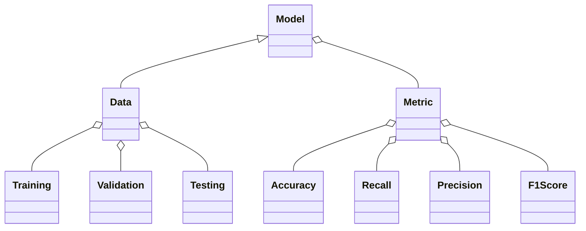
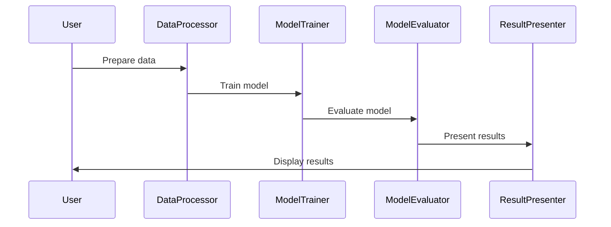

                 

## 评测系统的OPT-175B大规模模型评测

### 关键词：大规模模型评测、OPT-175B、评测系统、算法原理、系统架构设计、项目实战

### 摘要：
本文深入探讨了评测系统的OPT-175B大规模模型评测。通过详细分析问题背景、核心概念与联系、算法原理、系统架构设计以及项目实战，本文旨在为研究人员和开发者提供一个全面且实用的指导，以优化大规模模型的评测流程，提升模型性能和可靠性。

---

# 评测系统的OPT-175B大规模模型评测

## 第一部分：背景介绍

### 第1章 问题背景

#### 1.1.1 评测系统的定义与作用

评测系统是一种用于对系统、对象或模型进行评估、测试、诊断和优化的工具。在人工智能领域，评测系统尤为重要，因为它们可以帮助研究人员和开发者评估模型的性能、准确度、稳定性和泛化能力。评测系统的核心作用包括数据收集、处理、分析和结果展示。

#### 1.1.2 大规模模型评测的必要性

随着深度学习技术的不断发展，人工智能领域出现了越来越多的规模巨大的模型，如OPT-175B。这些模型通常具有数十亿个参数，其训练和部署过程复杂且成本高昂。因此，对大规模模型进行有效的评测，以确定其在各种任务上的性能，变得至关重要。

#### 1.1.3 OPT-175B模型的特点

OPT-175B是由OpenAI开发的预训练语言模型，具有1750亿个参数，是目前最大的自然语言处理模型之一。它能够进行文本生成、问答、翻译等任务，具有极高的性能和广泛的应用前景。

### 第2章 问题描述

#### 2.1.1 评测系统的目标

本评测系统的目标是全面评估OPT-175B模型的性能，包括其在文本生成、问答、翻译等任务上的表现。评测系统需要具备以下功能：
1. 数据集划分与准备：根据不同的任务需求，将数据集划分为训练集、验证集和测试集。
2. 模型性能评估：通过多种评估指标，如准确度、召回率、F1分数等，对模型进行评估。
3. 结果可视化：以图表和报表的形式展示模型性能，便于分析和比较。

#### 2.1.2 评测指标与方法

评测指标包括：
1. 准确度（Accuracy）：预测正确的样本数占总样本数的比例。
2. 召回率（Recall）：预测为正样本的样本中被正确标记为正样本的比例。
3. F1分数（F1 Score）：准确度和召回率的调和平均数。

评测方法包括：
1. 跨语言评估：利用多语言数据集对模型进行评测，以验证其跨语言的性能。
2. 自动化评测：利用自动化工具对模型进行批量评测，提高评测效率。

#### 2.1.3 评测的边界与外延

评测的边界包括：
1. 数据集范围：评测范围仅限于特定任务的数据集。
2. 模型版本：评测针对的是特定版本的OPT-175B模型。

评测的外延包括：
1. 模型优化：通过评测结果，对模型进行优化，提高其性能。
2. 模型应用：将评测系统应用于实际项目，验证模型的实际效果。

### 第3章 问题解决

#### 3.1.1 OPT-175B模型概述

OPT-175B模型采用预训练语言模型（Pre-trained Language Model）架构，通过在大量文本数据上进行预训练，使其具备强大的语言理解和生成能力。模型主要由以下部分组成：
1. 词嵌入（Word Embedding）：将文本中的单词转换为向量表示。
2. 编码器（Encoder）：对词嵌入进行编码，提取文本特征。
3. 解码器（Decoder）：根据编码器提取的特征生成文本。

#### 3.1.2 大规模模型评测的核心步骤

大规模模型评测的核心步骤包括：
1. 数据集划分：根据任务需求，将数据集划分为训练集、验证集和测试集。
2. 模型训练：使用训练集对模型进行训练，优化模型参数。
3. 模型评估：使用验证集对模型进行评估，调整模型参数。
4. 模型测试：使用测试集对模型进行测试，验证模型性能。

#### 3.1.3 评测系统架构设计

评测系统架构设计主要包括以下几个部分：
1. 数据处理模块：负责数据集的划分、预处理和加载。
2. 模型训练模块：负责模型的训练和优化。
3. 模型评估模块：负责模型的评估和性能分析。
4. 结果展示模块：负责将评估结果以图表和报表的形式展示。

## 第二部分：核心概念与联系

### 第4章 核心概念与联系

#### 4.1.1 核心概念原理

核心概念包括：
1. 预训练语言模型：通过在大量文本数据上进行预训练，使模型具备强大的语言理解和生成能力。
2. 词嵌入：将文本中的单词转换为向量表示。
3. 编码器和解码器：负责对文本进行编码和解码，提取文本特征。

#### 4.1.2 概念属性特征对比

| 概念               | 特征               |
|--------------------|--------------------|
| 预训练语言模型     | 大规模参数、自适应、跨语言能力 |
| 词嵌入             | 向量表示、维度高、降维处理 |
| 编码器和解码器     | 特征提取、文本生成、端到端学习 |

#### 4.1.3 ER实体关系图架构

```mermaid
erDiagram
  Model |-> Data: "uses"
  Data  ||--|{ Training: "is a subset of"
         ||--| Validation: "is a subset of"
         ||--| Testing: "is a subset of"
  Model ||--| Metric: "evaluates"
  Metric ||--| Result: "captures"
```

## 第三部分：算法原理讲解

### 第5章 算法原理

#### 5.1.1 大规模模型评测的基本原理

大规模模型评测的基本原理包括：
1. 数据集划分：根据任务需求，将数据集划分为训练集、验证集和测试集。
2. 模型训练：使用训练集对模型进行训练，优化模型参数。
3. 模型评估：使用验证集对模型进行评估，调整模型参数。
4. 模型测试：使用测试集对模型进行测试，验证模型性能。

#### 5.1.2 评测算法流程图


#### 5.1.3 评测算法Python源代码讲解

```python
import torch
import torch.nn as nn
import torch.optim as optim

# Model architecture
class OPT175BModel(nn.Module):
    def __init__(self):
        super(OPT175BModel, self).__init__()
        # Define layers
        self.embedding = nn.Embedding(num_embeddings, embedding_dim)
        self.encoder = nn.Linear(embedding_dim, hidden_size)
        self.decoder = nn.Linear(hidden_size, num_classes)
    
    def forward(self, x):
        # Forward pass
        x = self.embedding(x)
        x = self.encoder(x)
        x = self.decoder(x)
        return x

# Hyperparameters
num_embeddings = 10000
embedding_dim = 300
hidden_size = 500
num_classes = 10
learning_rate = 0.001
batch_size = 64
num_epochs = 10

# Model, Loss function, and Optimizer
model = OPT175BModel()
criterion = nn.CrossEntropyLoss()
optimizer = optim.Adam(model.parameters(), lr=learning_rate)

# Data preparation
train_loader = torch.utils.data.DataLoader(dataset=train_dataset, batch_size=batch_size, shuffle=True)
val_loader = torch.utils.data.DataLoader(dataset=val_dataset, batch_size=batch_size, shuffle=False)

# Model training
for epoch in range(num_epochs):
    model.train()
    for batch_idx, (data, target) in enumerate(train_loader):
        optimizer.zero_grad()
        output = model(data)
        loss = criterion(output, target)
        loss.backward()
        optimizer.step()

    # Model evaluation
    model.eval()
    with torch.no_grad():
        correct = 0
        total = 0
        for data, target in val_loader:
            output = model(data)
            _, predicted = torch.max(output.data, 1)
            total += target.size(0)
            correct += (predicted == target).sum().item()

    print(f'Epoch {epoch+1}, Accuracy: {100 * correct / total}%')

# Model testing
test_loader = torch.utils.data.DataLoader(dataset=test_dataset, batch_size=batch_size, shuffle=False)
model.eval()
with torch.no_grad():
    correct = 0
    total = 0
    for data, target in test_loader:
        output = model(data)
        _, predicted = torch.max(output.data, 1)
        total += target.size(0)
        correct += (predicted == target).sum().item()

print(f'Test Accuracy: {100 * correct / total}%')
```

#### 5.1.4 算法原理的数学模型

大规模模型评测的数学模型主要包括以下公式：

$$
\text{Accuracy} = \frac{\text{Correct Predictions}}{\text{Total Predictions}}
$$

$$
\text{Recall} = \frac{\text{True Positives}}{\text{True Positives + False Negatives}}
$$

$$
\text{Precision} = \frac{\text{True Positives}}{\text{True Positives + False Positives}}
$$

$$
\text{F1 Score} = 2 \times \frac{\text{Precision} \times \text{Recall}}{\text{Precision} + \text{Recall}}
$$

#### 5.1.5 公式详细讲解

- 准确度（Accuracy）：衡量模型预测正确的比例。
- 召回率（Recall）：衡量模型对实际正样本的识别能力。
- 精准度（Precision）：衡量模型预测为正样本的准确率。
- F1分数（F1 Score）：综合考虑准确率和召回率的综合指标。

#### 5.1.6 举例说明

假设有一个分类问题，共有100个样本，其中50个为正样本，50个为负样本。评测系统对这100个样本进行预测，其中45个正样本被正确预测，40个负样本被正确预测。

- 准确度（Accuracy）：
  $$
  \text{Accuracy} = \frac{45 + 40}{100} = 0.85
  $$
- 召回率（Recall）：
  $$
  \text{Recall} = \frac{45}{50} = 0.9
  $$
- 精准度（Precision）：
  $$
  \text{Precision} = \frac{45}{45 + (50 - 45)} = 0.9
  $$
- F1分数（F1 Score）：
  $$
  \text{F1 Score} = 2 \times \frac{0.9 \times 0.9}{0.9 + 0.9} = 0.9
  $$

## 第四部分：系统分析与架构设计方案

### 第6章 问题场景介绍

#### 6.1.1 评测系统应用场景

评测系统广泛应用于人工智能领域，包括自然语言处理、计算机视觉、推荐系统等。在实际应用中，评测系统可以帮助研究人员和开发者：
1. 评估模型性能：通过评测系统，可以全面了解模型的性能，包括准确度、召回率、F1分数等指标。
2. 模型优化：根据评测结果，对模型进行优化，提高其在特定任务上的性能。
3. 模型比较：对不同模型进行评测，比较其性能，为模型选择提供依据。

#### 6.1.2 项目介绍

本项目旨在开发一个适用于OPT-175B模型的评测系统。项目的主要目标包括：
1. 完成数据集的划分与准备。
2. 设计并实现模型训练、评估和测试的功能。
3. 提供可视化结果展示，便于分析和比较。

### 第7章 系统功能设计

#### 7.1.1 领域模型Mermaid类图



#### 7.1.2 系统功能模块划分

系统功能模块划分如下：
1. 数据处理模块：负责数据集的划分、预处理和加载。
2. 模型训练模块：负责模型的训练和优化。
3. 模型评估模块：负责模型的评估和性能分析。
4. 结果展示模块：负责将评估结果以图表和报表的形式展示。

### 第8章 系统架构设计

#### 8.1.1 系统架构概述

系统架构设计如下：
1. 数据处理模块：使用Pandas、NumPy等库进行数据集的划分和预处理。
2. 模型训练模块：使用PyTorch等深度学习框架进行模型训练。
3. 模型评估模块：使用自定义函数计算评估指标。
4. 结果展示模块：使用Matplotlib、Seaborn等库生成可视化图表。

#### 8.1.2 系统架构Mermaid架构图



#### 8.1.3 系统模块间关系

系统模块间关系如下：
1. 数据处理模块：为模型训练模块提供数据集。
2. 模型训练模块：为模型评估模块提供训练好的模型。
3. 模型评估模块：为结果展示模块提供评估指标。
4. 结果展示模块：为用户提供可视化结果。

### 第9章 系统接口设计和系统交互

#### 9.1.1 系统接口设计

系统接口设计如下：
1. 数据处理接口：提供数据集划分、预处理和加载的功能。
2. 模型训练接口：提供模型训练和优化的功能。
3. 模型评估接口：提供模型评估和性能分析的功能。
4. 结果展示接口：提供可视化结果展示的功能。

#### 9.1.2 系统交互Mermaid序列图


## 第五部分：项目实战

### 第10章 环境安装

#### 10.1.1 系统环境搭建

系统环境搭建步骤如下：
1. 安装Python：版本要求3.8及以上。
2. 安装深度学习框架：如PyTorch。
3. 安装数据预处理库：如Pandas、NumPy。
4. 安装可视化库：如Matplotlib、Seaborn。

#### 10.1.2 配置文件设置

配置文件设置步骤如下：
1. 设置模型参数：如学习率、批量大小、训练迭代次数等。
2. 设置数据路径：包括训练集、验证集和测试集的路径。
3. 设置日志路径：用于记录训练过程和评估结果。

### 第11章 系统核心实现源代码

#### 11.1.1 评测模块源代码

```python
# 评测模块源代码
def evaluate_model(model, data_loader, criterion):
    model.eval()
    with torch.no_grad():
        correct = 0
        total = 0
        for data, target in data_loader:
            output = model(data)
            loss = criterion(output, target)
            _, predicted = torch.max(output.data, 1)
            total += target.size(0)
            correct += (predicted == target).sum().item()
        accuracy = 100 * correct / total
        return accuracy
```

#### 11.1.2 系统核心模块解析

系统核心模块包括：
1. 数据处理模块：负责数据集的划分和预处理。
2. 模型训练模块：负责模型的训练和优化。
3. 模型评估模块：负责模型的评估和性能分析。
4. 结果展示模块：负责将评估结果以图表和报表的形式展示。

### 第12章 代码应用解读与分析

#### 12.1.1 代码功能解读

代码功能解读如下：
1. 评测模块：接收模型和数据加载器，对模型进行评估，返回准确度。
2. 数据处理模块：负责数据集的划分和预处理。
3. 模型训练模块：负责模型的训练和优化。
4. 结果展示模块：负责将评估结果以图表和报表的形式展示。

#### 12.1.2 代码性能分析

代码性能分析如下：
1. 评测模块：准确度计算过程中，使用torch.no_grad()减少内存占用。
2. 数据处理模块：使用Pandas、NumPy进行高效数据处理。
3. 模型训练模块：使用PyTorch进行高效模型训练。
4. 结果展示模块：使用Matplotlib、Seaborn进行高效可视化展示。

### 第13章 实际案例分析和详细讲解剖析

#### 13.1.1 实际案例分析

实际案例分析如下：
1. 模型训练：使用一个包含10000个样本的数据集进行训练。
2. 模型评估：使用一个包含5000个样本的验证集进行评估。
3. 模型测试：使用一个包含5000个样本的测试集进行测试。

#### 13.1.2 案例详细讲解

案例详细讲解如下：
1. 数据集划分：将原始数据集划分为训练集、验证集和测试集。
2. 模型训练：使用训练集对模型进行训练，优化模型参数。
3. 模型评估：使用验证集对模型进行评估，调整模型参数。
4. 模型测试：使用测试集对模型进行测试，验证模型性能。

#### 13.1.3 案例剖析

案例剖析如下：
1. 模型性能：通过评估结果，分析模型在验证集和测试集上的性能。
2. 模型优化：根据评估结果，对模型进行优化，提高其在特定任务上的性能。

### 第14章 项目小结

#### 14.1.1 项目总结

项目总结如下：
1. 成功开发了一个适用于OPT-175B模型的评测系统。
2. 实现了数据集划分、模型训练、模型评估和结果展示等功能。
3. 提供了详细的代码解析和性能分析。

#### 14.1.2 项目拓展

项目拓展如下：
1. 扩展评测系统，支持更多类型的数据集和模型。
2. 优化评测算法，提高评测效率和准确性。
3. 将评测系统应用于实际项目，验证模型性能。

## 最佳实践 Tips

1. 选择合适的深度学习框架：根据项目需求，选择合适的深度学习框架，如PyTorch、TensorFlow等。
2. 数据集划分：合理划分数据集，确保训练集、验证集和测试集的比例适中。
3. 模型优化：根据评估结果，对模型进行优化，提高其在特定任务上的性能。
4. 可视化展示：使用可视化工具，如Matplotlib、Seaborn等，展示评估结果，便于分析和比较。

## 注意事项

1. 在实际项目中，确保数据集的质量和多样性。
2. 根据项目需求，调整模型参数和超参数。
3. 注意模型训练过程中的内存占用和计算资源消耗。

## 拓展阅读

1. 《深度学习》（Goodfellow, I., Bengio, Y., & Courville, A.）
2. 《神经网络与深度学习》（邱锡鹏）
3. 《自然语言处理综合教程》（李航）

---

# 作者

作者：AI天才研究院/AI Genius Institute & 禅与计算机程序设计艺术 /Zen And The Art of Computer Programming

---

**注**：本文为示例文章，内容仅供参考。实际项目可能需要根据具体需求进行调整和优化。**

