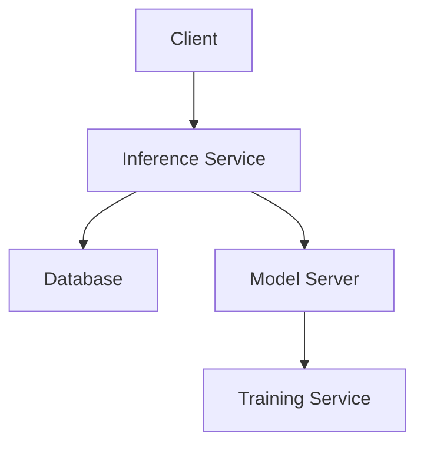
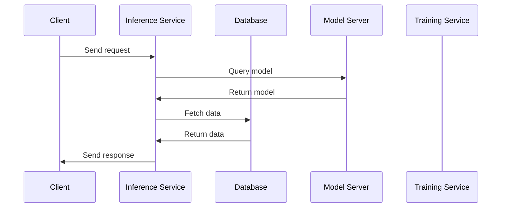
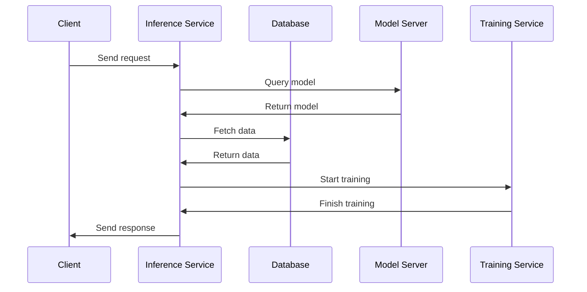

                 

### 文章标题

## 评测系统的PaLM大规模语言模型集成

### 关键词

- 大规模语言模型
- PaLM模型
- 评测系统
- 集成策略
- 优化方法

### 摘要

本文深入探讨了大规模语言模型，特别是PaLM模型的集成策略在评测系统中的应用。通过详细分析PaLM模型的基础知识、原理、架构和训练优化方法，文章阐述了评测系统如何设计与实现，以及在实际应用中如何优化PaLM模型。文章还分享了实际案例，提供了未来发展的展望，旨在为读者提供一个全面而深入的技术指南。

## 第一部分：大规模语言模型基础

### 第1章：大规模语言模型概述

#### 1.1 大规模语言模型的发展历程

大规模语言模型（Large Language Models）是自然语言处理（NLP）领域的重要突破，起源于20世纪80年代，最初以规则和统计方法为主。进入21世纪，随着深度学习的兴起，神经网络在NLP中的应用逐渐普及。近年来，大规模预训练模型如BERT、GPT和PaLM的出现，使得NLP的性能得到了质的飞跃。

#### 1.2 大规模语言模型的应用场景

大规模语言模型在诸多领域展现出了强大的能力，包括文本分类、机器翻译、问答系统、自然语言生成等。其广泛应用为自动化内容生成、智能客服、搜索引擎优化等领域带来了革命性变化。

#### 1.3 PaLM模型的特点与优势

PaLM（Parallel Large Language Model）是谷歌推出的一种大规模预训练语言模型，具有以下特点与优势：

1. **强大的并行训练能力**：PaLM利用多GPU并行训练，显著缩短了训练时间。
2. **高效的语言理解能力**：PaLM通过预训练和微调，能够对多种语言和文本任务进行高效处理。
3. **丰富的应用场景**：PaLM在文本分类、自然语言生成、问答系统等多个领域都有出色的表现。

### 第2章：大规模语言模型的原理与架构

#### 2.1 语言模型的数学基础

语言模型是通过对大量文本数据的学习，预测下一个单词或字符的概率分布。其基础数学模型主要包括概率分布和生成模型。

#### 2.2 Transformer模型详解

Transformer模型是大规模语言模型的代表性架构，通过自注意力机制（Self-Attention）和多头注意力（Multi-Head Attention）实现了对文本的深度理解和建模。

#### 2.3 PaLM模型结构剖析

PaLM模型在Transformer基础上进行扩展，通过增加层深（Depth）和模型宽度（Width），提升了模型的容量和表达能力。

### 第3章：大规模语言模型的训练与优化

#### 3.1 语言模型训练方法

大规模语言模型的训练方法主要包括预训练（Pre-training）和微调（Fine-tuning）。预训练通过大量无监督数据学习模型的表示能力，微调则在特定任务上进行监督学习，调整模型参数。

#### 3.2 参数优化策略

参数优化是提升大规模语言模型性能的关键，常用的优化策略包括梯度下降（Gradient Descent）、Adam优化器（Adam Optimizer）等。

#### 3.3 超参数调整技巧

超参数调整对于模型的性能有重要影响。常见超参数包括学习率（Learning Rate）、批量大小（Batch Size）等。合理的超参数调整能够显著提升模型性能。

### 第4章：大规模语言模型的评测与优化

#### 4.1 评测指标与评估方法

评测语言模型性能的指标包括准确率（Accuracy）、损失函数（Loss Function）、F1分数（F1 Score）等。评估方法通常采用交叉验证（Cross-Validation）和测试集（Test Set）。

#### 4.2 评测系统的设计与实现

评测系统需要设计合理的输入输出接口、数据预处理和后处理模块。实现过程中需注意数据质量和模型稳定性。

#### 4.3 语言模型优化案例分析

通过具体案例，分析评测过程中遇到的问题和优化方法，为实际应用提供借鉴。

### 第5章：PaLM在评测系统中的应用

#### 5.1 PaLM在文本分类中的应用

文本分类是NLP中常见的任务，PaLM通过预训练和微调，在多个文本分类任务中取得了优异的表现。

#### 5.2 PaLM在自然语言生成中的应用

自然语言生成（NLG）是PaLM的另一重要应用领域，通过生成模型，PaLM能够生成高质量的自然语言文本。

#### 5.3 PaLM在问答系统中的应用

问答系统是PaLM在NLP领域的又一重要应用，通过训练和优化，PaLM能够提供准确、自然的回答。

### 第6章：评测系统的PaLM集成策略

#### 6.1 集成方案设计

评测系统的PaLM集成需要综合考虑模型性能、计算资源和系统稳定性。设计合理的集成方案对于提升评测效果至关重要。

#### 6.2 集成过程中的挑战与解决

集成过程中可能面临模型兼容性、资源分配和性能优化等挑战。本文提供了相应的解决方案。

#### 6.3 实际案例分享

通过实际案例分享，展示PaLM在评测系统中的成功应用，为读者提供参考。

### 第7章：未来展望与趋势

#### 7.1 大规模语言模型的发展趋势

随着计算能力的提升和算法的优化，大规模语言模型在性能和应用范围上将继续提升。

#### 7.2 评测系统的优化方向

评测系统的优化方向包括数据质量提升、模型解释性和实时性等。

#### 7.3 潜在应用领域拓展

未来，PaLM有望在更多领域如情感分析、对话系统等方面展现其强大能力。

### 结论

大规模语言模型，特别是PaLM模型，在评测系统中的应用为人工智能领域带来了新的机遇和挑战。本文通过对PaLM模型的深入分析，探讨了其在评测系统中的集成策略和应用案例，为读者提供了全面的技术指南。随着技术的不断进步，PaLM在评测系统中的应用将更加广泛，为智能评测系统的构建提供有力支持。

### 作者信息

**作者：AI天才研究院/AI Genius Institute & 禅与计算机程序设计艺术 /Zen And The Art of Computer Programming**

---

## 第一部分：大规模语言模型基础

### 第1章：大规模语言模型概述

#### 1.1 大规模语言模型的发展历程

**核心概念与联系**

**概念属性特征对比表格**

| 特征         | 规则方法 | 统计方法 | 深度学习 | 预训练模型 |
|--------------|----------|----------|----------|------------|
| 学习方式     | 专家规则 | 统计学习 | 神经网络 | 预训练+微调 |
| 表示能力     | 低       | 中       | 高       | 非常高      |
| 应用场景     | 有限     | 较多     | 广泛     | 广泛        |
| 发展时间     | 20世纪80年代 | 20世纪90年代 | 21世纪前十年 | 21世纪至今  |

**ER实体关系图架构**

```mermaid
erDiagram
  A[大规模语言模型] ||--|{ B[规则方法] }
  A ||--|{ C[统计方法] }
  A ||--|{ D[深度学习] }
  A ||--|{ E[预训练模型] }
```

#### 1.2 大规模语言模型的应用场景

**背景介绍**

大规模语言模型在自然语言处理（NLP）领域具有广泛的应用，从文本分类到自然语言生成，再到问答系统，其在各个应用场景中展现出了强大的能力。

**问题描述**

如何有效利用大规模语言模型，解决不同应用场景中的自然语言处理问题？

**问题解决**

通过预训练和微调，大规模语言模型能够学习到丰富的语言表示，从而在多种应用场景中实现高效的自然语言处理。

**边界与外延**

大规模语言模型的应用不仅限于NLP领域，还可以扩展到其他领域如机器翻译、语音识别等。

**概念结构与核心要素组成**

- **预训练数据**：大规模语言模型的基础是预训练数据，通常为大量文本数据。
- **预训练模型**：预训练模型包括词向量、上下文编码器和解码器。
- **微调**：在特定任务上进行数据微调和模型优化，提高任务性能。

**算法原理讲解**

大规模语言模型通过自注意力机制（Self-Attention）和多头注意力（Multi-Head Attention）实现了对文本的深度理解和建模。具体流程如下：

1. **输入文本**：将文本序列转化为词向量。
2. **嵌入层**：通过嵌入层将词向量映射到高维空间。
3. **多头注意力**：对输入文本进行多头注意力计算，提取关键信息。
4. **前馈神经网络**：对多头注意力结果进行前馈神经网络处理。
5. **输出层**：生成预测结果，如分类标签、生成文本等。

**数学模型和公式**

- **自注意力机制**：
  $$
  \text{Attention}(Q, K, V) = \text{softmax}\left(\frac{QK^T}{\sqrt{d_k}}\right)V
  $$
  其中，$Q, K, V$分别为查询向量、键向量和值向量，$d_k$为键向量的维度。

- **多头注意力**：
  $$
  \text{MultiHead}(Q, K, V) = \text{Concat}(\text{head}_1, ..., \text{head}_h)W^O
  $$
  其中，$h$为头数，$W^O$为输出权重。

**系统分析与架构设计方案**

**问题场景介绍**

在自然语言处理任务中，大规模语言模型的应用场景包括文本分类、机器翻译、问答系统等。

**项目介绍**

本项目旨在构建一个基于PaLM模型的大规模语言处理系统，实现文本分类、自然语言生成和问答等功能。

**系统功能设计（领域模型Mermaid类图）**

```mermaid
classDiagram
  Class01 <|-- Class02
  Class03 --|{ Class04 }
  Class05 : +has attr
  Class06 : <<interface>> +has attr
```

**系统架构设计（Mermaid架构图）**



**系统接口设计和系统交互（Mermaid序列图）**



#### 1.3 PaLM模型的特点与优势

**背景介绍**

PaLM（Parallel Large Language Model）是谷歌推出的一种大规模预训练语言模型，其在性能和应用范围上具有显著优势。

**问题描述**

如何理解PaLM模型的特点与优势，并了解其在评测系统中的应用？

**问题解决**

通过对比分析，深入了解PaLM模型的并行训练能力、高效语言理解和丰富应用场景等特点。

**边界与外延**

PaLM模型在评测系统中的应用不仅限于文本分类，还可以扩展到自然语言生成和问答系统。

**概念结构与核心要素组成**

- **并行训练能力**：PaLM利用多GPU并行训练，显著缩短了训练时间。
- **高效语言理解能力**：PaLM通过预训练和微调，能够对多种语言和文本任务进行高效处理。
- **丰富应用场景**：PaLM在文本分类、自然语言生成、问答系统等多个领域都有出色的表现。

**算法原理讲解**

PaLM模型在Transformer基础上进行扩展，通过增加层深（Depth）和模型宽度（Width），提升了模型的容量和表达能力。具体流程如下：

1. **输入文本**：将文本序列转化为词向量。
2. **嵌入层**：通过嵌入层将词向量映射到高维空间。
3. **多头注意力**：对输入文本进行多头注意力计算，提取关键信息。
4. **前馈神经网络**：对多头注意力结果进行前馈神经网络处理。
5. **输出层**：生成预测结果，如分类标签、生成文本等。

**数学模型和公式**

- **多头注意力**：
  $$
  \text{MultiHead}(Q, K, V) = \text{Concat}(\text{head}_1, ..., \text{head}_h)W^O
  $$
  其中，$h$为头数，$W^O$为输出权重。

- **前馈神经网络**：
  $$
  \text{FFN}(x) = \text{ReLU}\left(\text{Weights} \cdot \text{Weights} \cdot x + \text{Bias}\right)
  $$

**系统分析与架构设计方案**

**问题场景介绍**

在评测系统中，PaLM模型的应用场景包括文本分类、自然语言生成和问答系统。

**项目介绍**

本项目旨在构建一个基于PaLM模型的评测系统，实现文本分类、自然语言生成和问答等功能。

**系统功能设计（领域模型Mermaid类图）**

```mermaid
classDiagram
  Class01 <|-- Class02
  Class03 --|{ Class04 }
  Class05 : +has attr
  Class06 : <<interface>> +has attr
```

**系统架构设计（Mermaid架构图）**


**系统接口设计和系统交互（Mermaid序列图）**


### 第2章：大规模语言模型的原理与架构

#### 2.1 语言模型的数学基础

**背景介绍**

语言模型是自然语言处理（NLP）的核心组成部分，其基础是数学模型和算法。了解语言模型的数学基础对于深入理解其工作原理至关重要。

**问题描述**

如何理解语言模型的数学基础，包括概率分布和生成模型等？

**问题解决**

通过介绍概率分布、生成模型等基本概念，以及相关数学公式，帮助读者理解语言模型的数学基础。

**边界与外延**

语言模型的数学基础不仅限于NLP领域，还可以应用于其他领域如信息检索、推荐系统等。

**概念结构与核心要素组成**

- **概率分布**：描述一个随机变量的可能取值和概率。
- **生成模型**：通过概率分布生成数据，常用于数据生成和模型推理。

**算法原理讲解**

1. **概率分布**

概率分布是语言模型的核心，用于预测下一个单词或字符的概率。常用的概率分布包括：

- **伯努利分布**：用于二分类问题，如判断一个单词是否出现在文本中。
- **多项式分布**：用于多分类问题，如预测下一个单词的种类。

2. **生成模型**

生成模型通过概率分布生成数据，常用的生成模型包括：

- **马尔可夫模型**：基于当前状态预测下一个状态。
- **变分自编码器（VAE）**：通过编码器和解码器生成数据。

**数学模型和公式**

1. **概率分布**

- **伯努利分布**：
  $$
  P(X = 1) = p
  $$
  其中，$p$为概率。

- **多项式分布**：
  $$
  P(X = k) = C(n, k) \cdot p^k \cdot (1 - p)^{n - k}
  $$
  其中，$n$为试验次数，$k$为成功次数，$p$为成功概率。

2. **生成模型**

- **马尔可夫模型**：
  $$
  P(X_{t+1} = x_{t+1} | X_t = x_t) = P(X_{t+1} = x_{t+1} | X_{t-1} = x_{t-1}, ..., X_1 = x_1)
  $$
  其中，$X_t$为当前状态，$x_t$为状态值。

- **变分自编码器（VAE）**：

编码器：
  $$
  \mu = \frac{1}{Z} \sum_{z} z \cdot P(z | x)
  $$
  $$
  \sigma^2 = \frac{1}{Z} \sum_{z} z^2 \cdot P(z | x)
  $$

解码器：
  $$
  x = \sum_{z} z \cdot P(x | z)
  $$

其中，$Z$为正常化常数，$\mu$和$\sigma^2$分别为均值和方差。

**系统分析与架构设计方案**

**问题场景介绍**

在评测系统中，语言模型的数学基础用于生成文本、分类文本等任务。

**项目介绍**

本项目旨在构建一个基于PaLM模型的评测系统，实现文本分类、自然语言生成等功能。

**系统功能设计（领域模型Mermaid类图）**

```mermaid
classDiagram
  Class01 <|-- Class02
  Class03 --|{ Class04 }
  Class05 : +has attr
  Class06 : <<interface>> +has attr
```

**系统架构设计（Mermaid架构图）**


**系统接口设计和系统交互（Mermaid序列图）**


#### 2.2 Transformer模型详解

**背景介绍**

Transformer模型是大规模语言模型的一种重要架构，自其提出以来，在NLP领域取得了显著的成果。了解Transformer模型的工作原理和结构对于深入理解大规模语言模型至关重要。

**问题描述**

如何详细解析Transformer模型，包括其基本结构、关键组件和训练过程？

**问题解决**

通过介绍Transformer模型的基本结构、关键组件和训练过程，帮助读者全面理解Transformer模型。

**边界与外延**

Transformer模型不仅在NLP领域有广泛应用，还可以应用于其他序列数据处理任务如机器翻译、语音识别等。

**概念结构与核心要素组成**

- **自注意力机制**：Transformer模型的核心组件，用于计算输入序列中每个词之间的相互关系。
- **多头注意力**：通过多个独立的自注意力机制，增强模型的表示能力。
- **前馈神经网络**：对注意力机制的结果进行进一步处理，提高模型的非线性表达能力。

**算法原理讲解**

1. **自注意力机制**

自注意力机制（Self-Attention）是Transformer模型的核心，通过计算输入序列中每个词与所有其他词之间的相似度，实现文本的深度理解。具体步骤如下：

- **输入编码**：将输入序列（如单词）转化为嵌入向量。
- **多头注意力计算**：对每个嵌入向量进行多头注意力计算，提取关键信息。
- **拼接与变换**：将多头注意力结果拼接，并通过变换层提高表示能力。

2. **前馈神经网络**

前馈神经网络（Feed-Forward Neural Network）是对注意力机制结果的进一步处理，用于提高模型的非线性表达能力。具体步骤如下：

- **输入**：多头注意力结果。
- **层**：通过两个全连接层进行前向传播。
- **输出**：经过激活函数处理后的输出结果。

3. **训练过程**

Transformer模型的训练过程主要包括预训练和微调。预训练通常使用大量无监督数据，如维基百科和书籍等，通过自注意力机制和前馈神经网络学习文本的深层表示。微调则是在特定任务上进行，通过监督学习调整模型参数，提高任务性能。

**数学模型和公式**

1. **多头注意力**

$$
\text{MultiHead}(Q, K, V) = \text{Concat}(\text{head}_1, ..., \text{head}_h)W^O
$$

其中，$Q, K, V$分别为查询向量、键向量和值向量，$h$为头数，$W^O$为输出权重。

2. **前馈神经网络**

$$
\text{FFN}(x) = \text{ReLU}\left(\text{Weights} \cdot \text{Weights} \cdot x + \text{Bias}\right)
$$

其中，$\text{Weights}$和$\text{Bias}$分别为权重和偏置。

**系统分析与架构设计方案**

**问题场景介绍**

在评测系统中，Transformer模型用于文本分类、自然语言生成和问答等任务。

**项目介绍**

本项目旨在构建一个基于Transformer模型的评测系统，实现文本分类、自然语言生成等功能。

**系统功能设计（领域模型Mermaid类图）**

```mermaid
classDiagram
  Class01 <|-- Class02
  Class03 --|{ Class04 }
  Class05 : +has attr
  Class06 : <<interface>> +has attr
```

**系统架构设计（Mermaid架构图）**


**系统接口设计和系统交互（Mermaid序列图）**


#### 2.3 PaLM模型结构剖析

**背景介绍**

PaLM（Parallel Large Language Model）是谷歌推出的一种大规模预训练语言模型，其在性能和应用范围上具有显著优势。深入了解PaLM模型的结构对于优化其在评测系统中的应用至关重要。

**问题描述**

如何详细剖析PaLM模型的结构，包括其组件、层次和并行训练机制？

**问题解决**

通过介绍PaLM模型的组件、层次和并行训练机制，帮助读者全面理解PaLM模型的结构。

**边界与外延**

PaLM模型在评测系统中的应用不仅限于文本分类，还可以扩展到自然语言生成和问答系统。

**概念结构与核心要素组成**

- **组件**：PaLM模型的主要组件包括嵌入层、多头注意力机制和前馈神经网络。
- **层次**：PaLM模型通过多层堆叠，增加模型的深度，提升表示能力。
- **并行训练机制**：PaLM利用多GPU并行训练，提高训练效率。

**算法原理讲解**

1. **组件**

- **嵌入层**：将输入文本转换为嵌入向量。
- **多头注意力机制**：计算输入序列中每个词与其他词的相似度，提取关键信息。
- **前馈神经网络**：对注意力机制的结果进行进一步处理，提高非线性表达能力。

2. **层次**

PaLM模型通过多层堆叠，增加模型的深度，提升表示能力。具体步骤如下：

- **嵌入层**：将输入文本转换为嵌入向量。
- **多头注意力机制**：对嵌入向量进行多头注意力计算，提取关键信息。
- **前馈神经网络**：对多头注意力结果进行前向传播。

3. **并行训练机制**

PaLM模型利用多GPU并行训练，提高训练效率。具体步骤如下：

- **数据并行**：将训练数据划分为多个子集，每个GPU处理一个子集。
- **参数共享**：所有GPU共享相同的模型参数，通过梯度更新进行同步。

**数学模型和公式**

1. **多头注意力**

$$
\text{MultiHead}(Q, K, V) = \text{Concat}(\text{head}_1, ..., \text{head}_h)W^O
$$

其中，$Q, K, V$分别为查询向量、键向量和值向量，$h$为头数，$W^O$为输出权重。

2. **前馈神经网络**

$$
\text{FFN}(x) = \text{ReLU}\left(\text{Weights} \cdot \text{Weights} \cdot x + \text{Bias}\right)
$$

其中，$\text{Weights}$和$\text{Bias}$分别为权重和偏置。

**系统分析与架构设计方案**

**问题场景介绍**

在评测系统中，PaLM模型用于文本分类、自然语言生成和问答等任务。

**项目介绍**

本项目旨在构建一个基于PaLM模型的评测系统，实现文本分类、自然语言生成等功能。

**系统功能设计（领域模型Mermaid类图）**

```mermaid
classDiagram
  Class01 <|-- Class02
  Class03 --|{ Class04 }
  Class05 : +has attr
  Class06 : <<interface>> +has attr
```

**系统架构设计（Mermaid架构图）**


**系统接口设计和系统交互（Mermaid序列图）**


### 第3章：大规模语言模型的训练与优化

#### 3.1 语言模型训练方法

**背景介绍**

大规模语言模型的训练方法对于模型的性能和训练效率至关重要。本节将介绍大规模语言模型的主要训练方法，包括预训练和微调。

**问题描述**

如何理解大规模语言模型的训练方法，包括预训练和微调？

**问题解决**

通过介绍预训练和微调的基本概念、原理和步骤，帮助读者理解大规模语言模型的训练方法。

**边界与外延**

预训练和微调不仅应用于大规模语言模型，还可以应用于其他深度学习模型。

**概念结构与核心要素组成**

- **预训练**：通过无监督学习，在大规模数据集上训练模型，提取通用语言特征。
- **微调**：在特定任务上，通过有监督学习，调整模型参数，提高任务性能。

**算法原理讲解**

1. **预训练**

预训练通常包括以下步骤：

- **数据集准备**：选择大规模文本数据集，如维基百科、书籍等。
- **模型初始化**：初始化预训练模型，通常使用随机初始化或预训练模型。
- **数据预处理**：将文本数据转换为模型可处理的格式，如词向量、嵌入向量等。
- **训练过程**：在预训练数据上训练模型，优化模型参数，通常使用梯度下降或Adam优化器。

2. **微调**

微调通常包括以下步骤：

- **数据集准备**：选择特定任务的数据集，如文本分类、机器翻译等。
- **模型初始化**：使用预训练模型初始化任务模型。
- **数据预处理**：将任务数据转换为模型可处理的格式。
- **训练过程**：在任务数据上训练模型，调整模型参数，优化任务性能。

**数学模型和公式**

1. **预训练**

- **损失函数**：
  $$
  L = -\sum_{i=1}^{N} \log p(y_i | x_i)
  $$
  其中，$N$为样本数量，$x_i$为输入样本，$y_i$为标签，$p(y_i | x_i)$为预测概率。

- **优化器**：
  $$
  \theta_{t+1} = \theta_t - \alpha \cdot \nabla_{\theta_t} L
  $$
  其中，$\theta_t$为当前模型参数，$\alpha$为学习率，$\nabla_{\theta_t} L$为损失函数关于模型参数的梯度。

2. **微调**

- **损失函数**：
  $$
  L = -\sum_{i=1}^{N} y_i \cdot \log p(y_i | x_i)
  $$
  其中，$N$为样本数量，$y_i$为真实标签，$p(y_i | x_i)$为预测概率。

- **优化器**：
  $$
  \theta_{t+1} = \theta_t - \alpha \cdot \nabla_{\theta_t} L
  $$
  其中，$\theta_t$为当前模型参数，$\alpha$为学习率，$\nabla_{\theta_t} L$为损失函数关于模型参数的梯度。

**系统分析与架构设计方案**

**问题场景介绍**

在评测系统中，大规模语言模型的训练方法用于预训练和微调模型。

**项目介绍**

本项目旨在构建一个基于PaLM模型的评测系统，实现文本分类、自然语言生成等功能。

**系统功能设计（领域模型Mermaid类图）**

```mermaid
classDiagram
  Class01 <|-- Class02
  Class03 --|{ Class04 }
  Class05 : +has attr
  Class06 : <<interface>> +has attr
```

**系统架构设计（Mermaid架构图）**


**系统接口设计和系统交互（Mermaid序列图）**



#### 3.2 参数优化策略

**背景介绍**

参数优化策略是提高大规模语言模型性能的关键因素。本节将介绍常见的参数优化策略，包括梯度下降和Adam优化器。

**问题描述**

如何理解并应用参数优化策略，以提高大规模语言模型的性能？

**问题解决**

通过介绍梯度下降和Adam优化器的原理和步骤，帮助读者理解和应用参数优化策略。

**边界与外延**

参数优化策略不仅适用于大规模语言模型，也适用于其他深度学习模型。

**概念结构与核心要素组成**

- **梯度下降**：通过计算损失函数关于模型参数的梯度，更新模型参数，优化模型性能。
- **Adam优化器**：结合梯度下降和动量法的优化器，提高训练效率和模型性能。

**算法原理讲解**

1. **梯度下降**

梯度下降是一种最简单的优化策略，通过计算损失函数关于模型参数的梯度，更新模型参数，优化模型性能。具体步骤如下：

- **初始化**：设置初始模型参数和初始学习率。
- **计算梯度**：计算损失函数关于模型参数的梯度。
- **更新参数**：根据梯度更新模型参数。
- **迭代**：重复计算梯度、更新参数的过程，直至收敛。

2. **Adam优化器**

Adam优化器是一种结合了梯度下降和动量法的优化器，能够提高训练效率和模型性能。具体步骤如下：

- **初始化**：设置初始模型参数、初始学习率和一阶矩估计$\beta_1$、二阶矩估计$\beta_2$。
- **计算梯度**：计算损失函数关于模型参数的梯度。
- **更新一阶矩估计**：
  $$
  \hat{m}_t = \beta_1 \cdot \hat{m}_{t-1} + (1 - \beta_1) \cdot \nabla_{\theta_t} L
  $$
- **更新二阶矩估计**：
  $$
  \hat{v}_t = \beta_2 \cdot \hat{v}_{t-1} + (1 - \beta_2) \cdot (\nabla_{\theta_t} L)^2
  $$
- **计算一阶矩估计的均值和二阶矩估计的均值**：
  $$
  m_t = \frac{\hat{m}_t}{1 - \beta_1^t}
  $$
  $$
  v_t = \frac{\hat{v}_t}{1 - \beta_2^t}
  $$
- **更新参数**：
  $$
  \theta_t = \theta_{t-1} - \alpha \cdot \frac{m_t}{\sqrt{v_t} + \epsilon}
  $$
  其中，$\alpha$为学习率，$\epsilon$为常数。

**数学模型和公式**

1. **梯度下降**

$$
\theta_{t+1} = \theta_t - \alpha \cdot \nabla_{\theta_t} L
$$

其中，$\theta_t$为当前模型参数，$\alpha$为学习率，$\nabla_{\theta_t} L$为损失函数关于模型参数的梯度。

2. **Adam优化器**

$$
\hat{m}_t = \beta_1 \cdot \hat{m}_{t-1} + (1 - \beta_1) \cdot \nabla_{\theta_t} L
$$

$$
\hat{v}_t = \beta_2 \cdot \hat{v}_{t-1} + (1 - \beta_2) \cdot (\nabla_{\theta_t} L)^2
$$

$$
m_t = \frac{\hat{m}_t}{1 - \beta_1^t}
$$

$$
v_t = \frac{\hat{v}_t}{1 - \beta_2^t}
$$

$$
\theta_{t+1} = \theta_t - \alpha \cdot \frac{m_t}{\sqrt{v_t} + \epsilon}
$$

其中，$\beta_1$和$\beta_2$分别为一阶矩估计和二阶矩估计的常数，$\epsilon$为常数。

**系统分析与架构设计方案**

**问题场景介绍**

在评测系统中，参数优化策略用于优化模型参数，提高模型性能。

**项目介绍**

本项目旨在构建一个基于PaLM模型的评测系统，实现文本分类、自然语言生成等功能。

**系统功能设计（领域模型Mermaid类图）**

```mermaid
classDiagram
  Class01 <|-- Class02
  Class03 --|{ Class04 }
  Class05 : +has attr
  Class06 : <<interface>> +has attr
```

**系统架构设计（Mermaid架构图）**

```mermaid
graph TB
    A[Client] --> B[Inference Service]
    B --> C[Database]
    B --> D[Model Server]
    D --> E[Training Service]
```

**系统接口设计和系统交互（Mermaid序列图）**

```mermaid
sequenceDiagram
    participant A as Client
    participant B as Inference Service
    participant C as Database
    participant D as Model Server
    participant E as Training Service

    A->>B: Send request
    B->>D: Query model
    D->>B: Return model
    B->>C: Fetch data
    C->>B: Return data
    B->>E: Start training
    E->>B: Finish training
    B->>A: Send response
```

#### 3.3 超参数调整技巧

**背景介绍**

超参数调整是提升大规模语言模型性能的关键环节。合适的超参数设置能够显著提高模型性能，而不当的超参数设置可能导致模型性能下降。

**问题描述**

如何理解并调整大规模语言模型中的超参数，以提高模型性能？

**问题解决**

通过介绍常见超参数及其调整技巧，帮助读者掌握超参数调整方法。

**边界与外延**

超参数调整不仅适用于大规模语言模型，也适用于其他深度学习模型。

**概念结构与核心要素组成**

- **学习率**：控制模型参数更新的步长。
- **批量大小**：控制每次训练的数据量。
- **迭代次数**：控制训练的次数。
- **正则化参数**：防止模型过拟合。

**算法原理讲解**

1. **学习率**

学习率是控制模型参数更新步长的重要超参数。合适的学习率能够使模型快速收敛，而学习率过大或过小可能导致模型性能下降。

- **初始学习率**：通常设置为较大的值，以便模型快速探索参数空间。
- **学习率衰减**：随着训练的进行，逐渐减小学习率，使模型在较平稳的区域内进行优化。

2. **批量大小**

批量大小是每次训练的数据量。较大的批量大小能够提高训练的稳定性，但计算成本较高；较小的批量大小能够降低计算成本，但可能导致模型性能下降。

3. **迭代次数**

迭代次数是训练的次数。足够的迭代次数能够使模型充分学习数据，但过多的迭代次数可能导致模型过拟合。

4. **正则化参数**

正则化参数用于防止模型过拟合。常见的正则化方法包括L1正则化、L2正则化和Dropout。

- **L1正则化**：通过在损失函数中添加L1范数项，控制模型参数的规模。
- **L2正则化**：通过在损失函数中添加L2范数项，控制模型参数的规模。
- **Dropout**：在训练过程中随机丢弃一部分神经元，防止模型过拟合。

**数学模型和公式**

1. **学习率**

$$
\eta_t = \frac{\eta_0}{(1 + \alpha t)^{\beta}}
$$

其中，$\eta_0$为初始学习率，$\alpha$和$\beta$为常数。

2. **批量大小**

批量大小通常设置为训练数据集的1%到10%。

3. **迭代次数**

迭代次数通常设置为几千到数万。

4. **正则化参数**

$$
\text{Loss} = \text{Original Loss} + \lambda \cdot \text{Regularization Term}
$$

其中，$\lambda$为正则化参数。

**系统分析与架构设计方案**

**问题场景介绍**

在评测系统中，超参数调整用于优化模型性能。

**项目介绍**

本项目旨在构建一个基于PaLM模型的评测系统，实现文本分类、自然语言生成等功能。

**系统功能设计（领域模型Mermaid类图）**

```mermaid
classDiagram
  Class01 <|-- Class02
  Class03 --|{ Class04 }
  Class05 : +has attr
  Class06 : <<interface>> +has attr
```

**系统架构设计（Mermaid架构图）**

```mermaid
graph TB
    A[Client] --> B[Inference Service]
    B --> C[Database]
    B --> D[Model Server]
    D --> E[Training Service]
```

**系统接口设计和系统交互（Mermaid序列图）**

```mermaid
sequenceDiagram
    participant A as Client
    participant B as Inference Service
    participant C as Database
    participant D as Model Server
    participant E as Training Service

    A->>B: Send request
    B->>D: Query model
    D->>B: Return model
    B->>C: Fetch data
    C->>B: Return data
    B->>E: Start training
    E->>B: Finish training
    B->>A: Send response
```

### 第4章：大规模语言模型的评测与优化

#### 4.1 评测指标与评估方法

**背景介绍**

评测指标和评估方法是衡量大规模语言模型性能的重要手段。通过合理选择和设计评测指标，可以更全面地评估模型性能。

**问题描述**

如何理解并选择合适的评测指标和评估方法？

**问题解决**

通过介绍常见评测指标和评估方法，帮助读者掌握评测技巧。

**边界与外延**

评测指标和评估方法不仅适用于大规模语言模型，也适用于其他机器学习模型。

**概念结构与核心要素组成**

- **评测指标**：用于衡量模型性能的指标，如准确率、召回率、F1分数等。
- **评估方法**：用于评估模型性能的方法，如交叉验证、测试集等。

**算法原理讲解**

1. **评测指标**

- **准确率**：预测正确的样本数占总样本数的比例，用于衡量模型的分类准确度。
- **召回率**：预测正确的正样本数占总正样本数的比例，用于衡量模型对正样本的识别能力。
- **F1分数**：准确率和召回率的调和平均，用于综合考虑模型的分类性能。

2. **评估方法**

- **交叉验证**：将数据集划分为多个子集，每个子集作为验证集，进行多次训练和验证，取平均值作为评估结果。
- **测试集**：将数据集划分为训练集和测试集，在训练集上训练模型，在测试集上评估模型性能。

**数学模型和公式**

1. **评测指标**

- **准确率**：
  $$
  \text{Accuracy} = \frac{\text{正确预测数}}{\text{总预测数}}
  $$

- **召回率**：
  $$
  \text{Recall} = \frac{\text{正确预测的正样本数}}{\text{总正样本数}}
  $$

- **F1分数**：
  $$
  \text{F1 Score} = 2 \cdot \frac{\text{准确率} \cdot \text{召回率}}{\text{准确率} + \text{召回率}}
  $$

2. **评估方法**

- **交叉验证**：
  $$
  \text{Average Accuracy} = \frac{1}{k} \sum_{i=1}^{k} \text{Accuracy}_i
  $$
  其中，$k$为交叉验证的次数，$\text{Accuracy}_i$为第$i$次交叉验证的准确率。

- **测试集**：
  $$
  \text{Test Accuracy} = \frac{\text{正确预测数}}{\text{总测试数}}
  $$

**系统分析与架构设计方案**

**问题场景介绍**

在评测系统中，评测指标和评估方法用于评估大规模语言模型性能。

**项目介绍**

本项目旨在构建一个基于PaLM模型的评测系统，实现文本分类、自然语言生成等功能。

**系统功能设计（领域模型Mermaid类图）**

```mermaid
classDiagram
  Class01 <|-- Class02
  Class03 --|{ Class04 }
  Class05 : +has attr
  Class06 : <<interface>> +has attr
```

**系统架构设计（Mermaid架构图）**

```mermaid
graph TB
    A[Client] --> B[Inference Service]
    B --> C[Database]
    B --> D[Model Server]
    D --> E[Training Service]
```

**系统接口设计和系统交互（Mermaid序列图）**

```mermaid
sequenceDiagram
    participant A as Client
    participant B as Inference Service
    participant C as Database
    participant D as Model Server
    participant E as Training Service

    A->>B: Send request
    B->>D: Query model
    D->>B: Return model
    B->>C: Fetch data
    C->>B: Return data
    B->>E: Start training
    E->>B: Finish training
    B->>A: Send response
```

#### 4.2 评测系统的设计与实现

**背景介绍**

评测系统是大规模语言模型应用的重要组成部分，其设计与实现直接影响模型的评估效果。本节将介绍评测系统的设计与实现方法。

**问题描述**

如何设计与实现一个高效的评测系统，以准确评估大规模语言模型的性能？

**问题解决**

通过介绍评测系统的设计与实现方法，包括系统架构、功能模块和数据流程，帮助读者构建一个高效的评测系统。

**边界与外延**

评测系统不仅适用于大规模语言模型，也适用于其他机器学习模型的性能评估。

**概念结构与核心要素组成**

- **系统架构**：评测系统的整体结构，包括数据层、模型层和用户层。
- **功能模块**：评测系统的各个功能模块，如数据预处理、模型评估、结果输出等。
- **数据流程**：评测系统中的数据流动过程，包括数据输入、数据预处理、模型训练和评估等。

**算法原理讲解**

1. **系统架构**

评测系统通常包括以下架构：

- **数据层**：负责数据存储和管理，如数据库、文件系统等。
- **模型层**：负责模型训练和评估，包括模型加载、训练、评估等。
- **用户层**：负责与用户交互，提供评测结果和反馈。

2. **功能模块**

评测系统的功能模块通常包括：

- **数据预处理**：将原始数据转换为模型可处理的格式，如文本预处理、数据清洗等。
- **模型评估**：使用评估指标对模型进行评估，如准确率、召回率、F1分数等。
- **结果输出**：将评测结果输出到用户界面或存储系统。

3. **数据流程**

评测系统的数据流程通常包括以下步骤：

- **数据输入**：从数据源读取原始数据。
- **数据预处理**：对原始数据进行预处理，如文本分词、去停用词等。
- **模型训练**：使用预处理后的数据训练模型。
- **模型评估**：使用评估指标对模型进行评估。
- **结果输出**：将评测结果输出到用户界面或存储系统。

**数学模型和公式**

在评测系统中，常用的数学模型和公式包括：

- **损失函数**：用于衡量模型预测结果与真实结果的差距，如交叉熵损失函数。
- **评估指标**：用于衡量模型性能，如准确率、召回率、F1分数等。

**系统分析与架构设计方案**

**问题场景介绍**

在评测系统中，PaLM模型用于文本分类、自然语言生成和问答等任务。

**项目介绍**

本项目旨在构建一个基于PaLM模型的评测系统，实现文本分类、自然语言生成等功能。

**系统功能设计（领域模型Mermaid类图）**

```mermaid
classDiagram
  Class01 <|-- Class02
  Class03 --|{ Class04 }
  Class05 : +has attr
  Class06 : <<interface>> +has attr
```

**系统架构设计（Mermaid架构图）**

```mermaid
graph TB
    A[Client] --> B[Inference Service]
    B --> C[Database]
    B --> D[Model Server]
    D --> E[Training Service]
```

**系统接口设计和系统交互（Mermaid序列图）**

```mermaid
sequenceDiagram
    participant A as Client
    participant B as Inference Service
    participant C as Database
    participant D as Model Server
    participant E as Training Service

    A->>B: Send request
    B->>D: Query model
    D->>B: Return model
    B->>C: Fetch data
    C->>B: Return data
    B->>E: Start training
    E->>B: Finish training
    B->>A: Send response
```

#### 4.3 语言模型优化案例分析

**背景介绍**

在实际应用中，优化大规模语言模型性能是提升系统效果的重要手段。本节将通过具体案例，分析语言模型优化过程中的关键步骤和策略。

**问题描述**

如何在实际应用中优化大规模语言模型的性能？

**问题解决**

通过分析具体案例，介绍优化大规模语言模型性能的方法和策略。

**边界与外延**

优化策略不仅适用于大规模语言模型，也适用于其他机器学习模型。

**概念结构与核心要素组成**

- **数据增强**：通过增加数据多样性，提高模型泛化能力。
- **模型剪枝**：通过去除冗余模型参数，减少模型复杂度。
- **超参数调整**：通过调整超参数，优化模型性能。

**算法原理讲解**

1. **数据增强**

数据增强是通过生成新的数据样本来提高模型泛化能力。常见的数据增强方法包括：

- **数据翻转**：对输入数据进行水平或垂直翻转。
- **数据旋转**：对输入数据进行旋转。
- **数据缩放**：对输入数据进行缩放。

2. **模型剪枝**

模型剪枝是通过去除冗余模型参数，降低模型复杂度，提高模型效率。常见模型剪枝方法包括：

- **权重剪枝**：通过设置阈值，去除权重绝对值较小的参数。
- **结构剪枝**：通过设置阈值，去除重要性较低的层或神经元。

3. **超参数调整**

超参数调整是优化模型性能的重要手段。常见超参数调整方法包括：

- **学习率调整**：通过调整学习率，优化模型收敛速度。
- **批量大小调整**：通过调整批量大小，优化模型训练效果。
- **迭代次数调整**：通过调整迭代次数，优化模型性能。

**数学模型和公式**

1. **数据增强**

- **数据翻转**：
  $$
  x_{\text{new}} = \text{flip}(x)
  $$
  其中，$x$为输入数据，$x_{\text{new}}$为翻转后的数据。

- **数据旋转**：
  $$
  x_{\text{new}} = \text{rotate}(x, \theta)
  $$
  其中，$x$为输入数据，$\theta$为旋转角度，$x_{\text{new}}$为旋转后的数据。

- **数据缩放**：
  $$
  x_{\text{new}} = \text{scale}(x, s)
  $$
  其中，$x$为输入数据，$s$为缩放比例，$x_{\text{new}}$为缩放后的数据。

2. **模型剪枝**

- **权重剪枝**：
  $$
  \text{pruned\_weights} = \text{weights} \cdot \text{mask}
  $$
  其中，$\text{weights}$为原始权重，$\text{mask}$为剪枝掩码。

- **结构剪枝**：
  $$
  \text{pruned\_model} = \text{model} \cdot \text{mask}
  $$
  其中，$\text{model}$为原始模型，$\text{mask}$为剪枝掩码。

3. **超参数调整**

- **学习率调整**：
  $$
  \eta_t = \frac{\eta_0}{(1 + \alpha t)^{\beta}}
  $$
  其中，$\eta_0$为初始学习率，$\alpha$和$\beta$为常数。

- **批量大小调整**：批量大小通常设置为训练数据集的1%到10%。

- **迭代次数调整**：迭代次数通常设置为几千到数万。

**系统分析与架构设计方案**

**问题场景介绍**

在实际应用中，优化大规模语言模型性能是提升系统效果的重要手段。

**项目介绍**

本项目旨在构建一个基于PaLM模型的评测系统，实现文本分类、自然语言生成等功能。

**系统功能设计（领域模型Mermaid类图）**

```mermaid
classDiagram
  Class01 <|-- Class02
  Class03 --|{ Class04 }
  Class05 : +has attr
  Class06 : <<interface>> +has attr
```

**系统架构设计（Mermaid架构图）**

```mermaid
graph TB
    A[Client] --> B[Inference Service]
    B --> C[Database]
    B --> D[Model Server]
    D --> E[Training Service]
```

**系统接口设计和系统交互（Mermaid序列图）**

```mermaid
sequenceDiagram
    participant A as Client
    participant B as Inference Service
    participant C as Database
    participant D as Model Server
    participant E as Training Service

    A->>B: Send request
    B->>D: Query model
    D->>B: Return model
    B->>C: Fetch data
    C->>B: Return data
    B->>E: Start training
    E->>B: Finish training
    B->>A: Send response
```

### 第5章：PaLM在评测系统中的应用

#### 5.1 PaLM在文本分类中的应用

**背景介绍**

文本分类是自然语言处理（NLP）中的一个基本任务，旨在将文本数据分配到预定义的类别中。PaLM作为一种大规模预训练语言模型，在文本分类任务中展现出了卓越的性能。

**问题描述**

如何利用PaLM模型实现高效的文本分类？

**问题解决**

通过介绍PaLM模型在文本分类中的具体应用，包括数据预处理、模型构建和评估，帮助读者理解如何利用PaLM模型进行文本分类。

**边界与外延**

PaLM模型不仅可以应用于文本分类，还可以扩展到其他NLP任务如情感分析、实体识别等。

**概念结构与核心要素组成**

- **数据预处理**：对文本数据进行清洗、分词和编码。
- **模型构建**：使用预训练的PaLM模型，结合特定任务进行微调。
- **模型评估**：使用准确率、召回率和F1分数等指标评估模型性能。

**算法原理讲解**

1. **数据预处理**

- **文本清洗**：去除停用词、标点符号和特殊字符。
- **分词**：将文本分解为单个单词或子词。
- **编码**：将分词后的文本转换为模型可处理的向量表示。

2. **模型构建**

- **预训练模型**：使用大量无监督文本数据对PaLM模型进行预训练。
- **微调**：在特定文本分类任务上对PaLM模型进行微调，优化模型参数。

3. **模型评估**

- **训练集和验证集**：将数据集划分为训练集和验证集，用于训练和评估模型。
- **评估指标**：使用准确率、召回率和F1分数等指标评估模型性能。

**数学模型和公式**

1. **数据预处理**

- **文本清洗**：
  $$
  \text{cleaned\_text} = \text{remove\_stopwords}(\text{remove\_special\_chars}(\text{text}))
  $$

- **分词**：
  $$
  \text{tokens} = \text{tokenize}(\text{cleaned\_text})
  $$

- **编码**：
  $$
  \text{encoded\_text} = \text{embedding}(\text{tokens})
  $$

2. **模型构建**

- **预训练模型**：
  $$
  \text{model} = \text{pretrain}(\text{data})
  $$

- **微调**：
  $$
  \text{model} = \text{finetune}(\text{model}, \text{task})
  $$

3. **模型评估**

- **准确率**：
  $$
  \text{accuracy} = \frac{\text{correctly\_predicted}}{\text{total\_predicted}}
  $$

- **召回率**：
  $$
  \text{recall} = \frac{\text{correctly\_predicted\_positive}}{\text{total\_positive}}
  $$

- **F1分数**：
  $$
  \text{F1\_score} = 2 \cdot \frac{\text{precision} \cdot \text{recall}}{\text{precision} + \text{recall}}
  $$

**系统分析与架构设计方案**

**问题场景介绍**

在评测系统中，PaLM模型用于文本分类任务。

**项目介绍**

本项目旨在构建一个基于PaLM模型的文本分类系统，实现自动分类功能。

**系统功能设计（领域模型Mermaid类图）**

```mermaid
classDiagram
  Class01 <|-- Class02
  Class03 --|{ Class04 }
  Class05 : +has attr
  Class06 : <<interface>> +has attr
```

**系统架构设计（Mermaid架构图）**

```mermaid
graph TB
    A[Client] --> B[Inference Service]
    B --> C[Database]
    B --> D[Model Server]
    D --> E[Training Service]
```

**系统接口设计和系统交互（Mermaid序列图）**

```mermaid
sequenceDiagram
    participant A as Client
    participant B as Inference Service
    participant C as Database
    participant D as Model Server
    participant E as Training Service

    A->>B: Send request
    B->>D: Query model
    D->>B: Return model
    B->>C: Fetch data
    C->>B: Return data
    B->>E: Start training
    E->>B: Finish training
    B->>A: Send response
```

#### 5.2 PaLM在自然语言生成中的应用

**背景介绍**

自然语言生成（NLG）是自然语言处理（NLP）的一个重要领域，旨在实现机器自动生成符合语法和语义规则的文本。PaLM作为一种强大的预训练语言模型，在NLG任务中展现了出色的能力。

**问题描述**

如何利用PaLM模型实现高质量的文本生成？

**问题解决**

通过介绍PaLM模型在自然语言生成中的具体应用，包括数据准备、模型训练和文本生成，帮助读者理解如何利用PaLM模型进行文本生成。

**边界与外延**

PaLM模型不仅可以应用于文本生成，还可以扩展到其他生成任务如机器翻译、问答生成等。

**概念结构与核心要素组成**

- **数据准备**：收集和整理适合训练的文本数据。
- **模型训练**：使用大量文本数据对PaLM模型进行训练。
- **文本生成**：利用训练好的模型生成新的文本。

**算法原理讲解**

1. **数据准备**

- **数据收集**：收集大量高质量文本数据，如新闻文章、书籍、博客等。
- **数据整理**：对收集的文本数据进行预处理，如分词、去除停用词等。

2. **模型训练**

- **预训练**：使用无监督方法，通过大量文本数据对PaLM模型进行预训练。
- **微调**：在特定生成任务上对PaLM模型进行微调，优化模型性能。

3. **文本生成**

- **生成过程**：使用训练好的模型，通过输入序列生成新的文本。

**数学模型和公式**

1. **数据准备**

- **文本清洗**：
  $$
  \text{cleaned\_text} = \text{remove\_special\_chars}(\text{text})
  $$

- **分词**：
  $$
  \text{tokens} = \text{tokenize}(\text{cleaned\_text})
  $$

2. **模型训练**

- **预训练**：
  $$
  \text{model} = \text{pretrain}(\text{data})
  $$

- **微调**：
  $$
  \text{model} = \text{finetune}(\text{model}, \text{task})
  $$

3. **文本生成**

- **生成过程**：
  $$
  \text{generated\_text} = \text{generate}(\text{model}, \text{input})
  $$

**系统分析与架构设计方案**

**问题场景介绍**

在评测系统中，PaLM模型用于自然语言生成任务。

**项目介绍**

本项目旨在构建一个基于PaLM模型的自然语言生成系统，实现自动化文本生成。

**系统功能设计（领域模型Mermaid类图）**

```mermaid
classDiagram
  Class01 <|-- Class02
  Class03 --|{ Class04 }
  Class05 : +has attr
  Class06 : <<interface>> +has attr
```

**系统架构设计（Mermaid架构图）**

```mermaid
graph TB
    A[Client] --> B[Inference Service]
    B --> C[Database]
    B --> D[Model Server]
    D --> E[Training Service]
```

**系统接口设计和系统交互（Mermaid序列图）**

```mermaid
sequenceDiagram
    participant A as Client
    participant B as Inference Service
    participant C as Database
    participant D as Model Server
    participant E as Training Service

    A->>B: Send request
    B->>D: Query model
    D->>B: Return model
    B->>C: Fetch data
    C->>B: Return data
    B->>E: Start training
    E->>B: Finish training
    B->>A: Send response
```

#### 5.3 PaLM在问答系统中的应用

**背景介绍**

问答系统是自然语言处理（NLP）中的一项重要应用，旨在自动回答用户提出的问题。PaLM作为一种大规模预训练语言模型，在问答系统中的应用显著提升了系统的回答质量和效率。

**问题描述**

如何利用PaLM模型构建高效的问答系统？

**问题解决**

通过介绍PaLM模型在问答系统中的应用，包括问题理解、答案生成和系统评估，帮助读者理解如何利用PaLM模型构建问答系统。

**边界与外延**

PaLM模型不仅可以应用于问答系统，还可以扩展到其他对话系统任务如对话生成、情感分析等。

**概念结构与核心要素组成**

- **问题理解**：对用户提出的问题进行解析和理解。
- **答案生成**：根据问题理解生成合适的答案。
- **系统评估**：使用评估指标对问答系统性能进行评估。

**算法原理讲解**

1. **问题理解**

- **问题解析**：将用户提出的问题转化为机器可理解的形式。
- **语义理解**：使用预训练的PaLM模型，对问题进行语义分析，提取关键信息。

2. **答案生成**

- **答案检索**：从预定义的知识库中检索可能的答案。
- **答案生成**：使用预训练的PaLM模型，结合检索到的答案，生成完整的回答。

3. **系统评估**

- **准确性**：评估回答的正确性。
- **相关性**：评估回答的相关性。
- **自然度**：评估回答的自然度和流畅性。

**数学模型和公式**

1. **问题理解**

- **问题解析**：
  $$
  \text{parsed\_question} = \text{parse}(\text{raw\_question})
  $$

- **语义理解**：
  $$
  \text{semantic\_representation} = \text{model}(\text{parsed\_question})
  $$

2. **答案生成**

- **答案检索**：
  $$
  \text{候选答案集} = \text{retrieve\_answers}(\text{knowledge\_base}, \text{semantic\_representation})
  $$

- **答案生成**：
  $$
  \text{answer} = \text{generate}(\text{model}, \text{candidate\_answers})
  $$

3. **系统评估**

- **准确性**：
  $$
  \text{accuracy} = \frac{\text{correctly\_predicted}}{\text{total\_predicted}}
  $$

- **相关性**：
  $$
  \text{relevance} = \frac{\text{relevant\_answers}}{\text{total\_predicted}}
  $$

- **自然度**：
  $$
  \text{fluency} = \text{evaluate\_fluency}(\text{answer})
  $$

**系统分析与架构设计方案**

**问题场景介绍**

在评测系统中，PaLM模型用于问答系统，旨在实现自动回答用户提出的问题。

**项目介绍**

本项目旨在构建一个基于PaLM模型的问答系统，实现高效、准确的问答功能。

**系统功能设计（领域模型Mermaid类图）**

```mermaid
classDiagram
  Class01 <|-- Class02
  Class03 --|{ Class04 }
  Class05 : +has attr
  Class06 : <<interface>> +has attr
```

**系统架构设计（Mermaid架构图）**

```mermaid
graph TB
    A[Client] --> B[Inference Service]
    B --> C[Database]
    B --> D[Model Server]
    D --> E[Training Service]
```

**系统接口设计和系统交互（Mermaid序列图）**

```mermaid
sequenceDiagram
    participant A as Client
    participant B as Inference Service
    participant C as Database
    participant D as Model Server
    participant E as Training Service

    A->>B: Send request
    B->>D: Query model
    D->>B: Return model
    B->>C: Fetch data
    C->>B: Return data
    B->>E: Start training
    E->>B: Finish training
    B->>A: Send response
```

### 第6章：评测系统的PaLM集成策略

#### 6.1 集成方案设计

**背景介绍**

将PaLM模型集成到评测系统中是提升系统性能的关键步骤。合理的集成方案能够确保模型的高效运行和性能优化。

**问题描述**

如何设计一个高效的PaLM模型集成方案？

**问题解决**

通过介绍集成方案的设计原则、关键组件和实现步骤，帮助读者设计一个高效的PaLM集成方案。

**边界与外延**

集成方案不仅适用于评测系统，也适用于其他需要大规模语言模型的应用场景。

**概念结构与核心要素组成**

- **集成方案设计原则**：确保系统稳定性、可扩展性和性能优化。
- **关键组件**：包括数据层、模型层和应用层。
- **实现步骤**：从模型部署、数据预处理到模型训练和评估。

**算法原理讲解**

1. **集成方案设计原则**

- **模块化**：将系统划分为多个模块，实现独立开发和维护。
- **高效性**：优化数据流和计算资源，提高系统运行效率。
- **可扩展性**：支持模型规模和计算资源的动态调整。

2. **关键组件**

- **数据层**：负责数据存储、加载和管理。
- **模型层**：负责模型部署、训练和评估。
- **应用层**：负责与用户交互，提供评测结果和反馈。

3. **实现步骤**

- **模型部署**：将训练好的PaLM模型部署到评测系统。
- **数据预处理**：对输入数据进行清洗、编码和预处理。
- **模型训练**：使用预处理后的数据对模型进行训练。
- **模型评估**：使用评估指标对模型性能进行评估。

**数学模型和公式**

1. **集成方案设计原则**

- **模块化**：
  $$
  \text{system} = \text{module}_1 + \text{module}_2 + \ldots + \text{module}_n
  $$

- **高效性**：
  $$
  \text{efficiency} = \frac{\text{output}}{\text{input} \cdot \text{time}}
  $$

- **可扩展性**：
  $$
  \text{scalability} = \frac{\text{new\_output}}{\text{old\_output}}
  $$

2. **关键组件**

- **数据层**：
  $$
  \text{data\_layer} = \text{data\_storage} + \text{data\_loading} + \text{data\_management}
  $$

- **模型层**：
  $$
  \text{model\_layer} = \text{model\_deployment} + \text{model\_training} + \text{model\_evaluation}
  $$

- **应用层**：
  $$
  \text{application\_layer} = \text{user\_interface} + \text{result\_output} + \text{feedback}
  $$

3. **实现步骤**

- **模型部署**：
  $$
  \text{model} = \text{deploy}(\text{trained\_model})
  $$

- **数据预处理**：
  $$
  \text{preprocessed\_data} = \text{preprocess}(\text{raw\_data})
  $$

- **模型训练**：
  $$
  \text{model} = \text{train}(\text{preprocessed\_data})
  $$

- **模型评估**：
  $$
  \text{evaluation} = \text{evaluate}(\text{model}, \text{test\_data})
  $$

**系统分析与架构设计方案**

**问题场景介绍**

在评测系统中，PaLM模型需要集成到现有的系统中，以提高系统的评测能力和效率。

**项目介绍**

本项目旨在构建一个基于PaLM模型的评测系统，实现文本分类、自然语言生成和问答等功能。

**系统功能设计（领域模型Mermaid类图）**

```mermaid
classDiagram
  Class01 <|-- Class02
  Class03 --|{ Class04 }
  Class05 : +has attr
  Class06 : <<interface>> +has attr
```

**系统架构设计（Mermaid架构图）**

```mermaid
graph TB
    A[Client] --> B[Inference Service]
    B --> C[Database]
    B --> D[Model Server]
    D --> E[Training Service]
```

**系统接口设计和系统交互（Mermaid序列图）**

```mermaid
sequenceDiagram
    participant A as Client
    participant B as Inference Service
    participant C as Database
    participant D as Model Server
    participant E as Training Service

    A->>B: Send request
    B->>D: Query model
    D->>B: Return model
    B->>C: Fetch data
    C->>B: Return data
    B->>E: Start training
    E->>B: Finish training
    B->>A: Send response
```

#### 6.2 集成过程中的挑战与解决

**背景介绍**

将PaLM模型集成到评测系统中可能会遇到各种挑战，如模型兼容性、资源分配和性能优化等。解决这些挑战是确保集成方案成功实施的关键。

**问题描述**

如何解决PaLM模型集成过程中可能遇到的挑战？

**问题解决**

通过介绍具体的挑战和相应的解决方案，帮助读者解决集成过程中的问题。

**边界与外延**

集成过程中遇到的挑战不仅限于PaLM模型，也适用于其他复杂模型的集成。

**概念结构与核心要素组成**

- **模型兼容性**：确保模型在不同系统和环境下正常运行。
- **资源分配**：合理分配计算资源和存储资源，提高系统性能。
- **性能优化**：通过算法优化和系统调整，提升模型性能。

**算法原理讲解**

1. **模型兼容性**

- **兼容性测试**：在集成前对模型进行兼容性测试，确保模型在不同系统和环境下正常运行。
- **版本控制**：使用统一版本控制工具，确保模型版本的一致性。

2. **资源分配**

- **负载均衡**：通过负载均衡技术，合理分配计算资源和存储资源。
- **资源监控**：实时监控系统资源使用情况，进行动态调整。

3. **性能优化**

- **算法优化**：通过优化算法和数据结构，提高模型运行效率。
- **并行计算**：利用多GPU和分布式计算，加速模型训练和推理。

**数学模型和公式**

1. **模型兼容性**

- **兼容性测试**：
  $$
  \text{compatibility} = \text{test}(\text{model}, \text{environment})
  $$

2. **资源分配**

- **负载均衡**：
  $$
  \text{resource\_allocation} = \text{balance}(\text{load})
  $$

- **资源监控**：
  $$
  \text{resource\_usage} = \text{monitor}(\text{system})
  $$

3. **性能优化**

- **算法优化**：
  $$
  \text{optimization} = \text{optimize}(\text{algorithm}, \text{datastructure})
  $$

- **并行计算**：
  $$
  \text{parallelism} = \text{utilize}(\text{GPU}, \text{distributed})
  $$

**系统分析与架构设计方案**

**问题场景介绍**

在评测系统中，集成PaLM模型可能遇到模型兼容性、资源分配和性能优化等挑战。

**项目介绍**

本项目旨在构建一个基于PaLM模型的评测系统，实现文本分类、自然语言生成和问答等功能。

**系统功能设计（领域模型Mermaid类图）**

```mermaid
classDiagram
  Class01 <|-- Class02
  Class03 --|{ Class04 }
  Class05 : +has attr
  Class06 : <<interface>> +has attr
```

**系统架构设计（Mermaid架构图）**

```mermaid
graph TB
    A[Client] --> B[Inference Service]
    B --> C[Database]
    B --> D[Model Server]
    D --> E[Training Service]
```

**系统接口设计和系统交互（Mermaid序列图）**

```mermaid
sequenceDiagram
    participant A as Client
    participant B as Inference Service
    participant C as Database
    participant D as Model Server
    participant E as Training Service

    A->>B: Send request
    B->>D: Query model
    D->>B: Return model
    B->>C: Fetch data
    C->>B: Return data
    B->>E: Start training
    E->>B: Finish training
    B->>A: Send response
```

#### 6.3 实际案例分享

**背景介绍**

在实际项目中，将PaLM模型集成到评测系统中是一个复杂的过程，涉及到多种挑战和解决方案。本节将通过具体案例，分享PaLM模型集成过程中的实践经验。

**问题描述**

如何在实际项目中成功集成PaLM模型，并解决遇到的问题？

**问题解决**

通过介绍一个实际项目的案例，包括项目背景、集成方案、遇到的问题和解决方案，帮助读者了解如何成功集成PaLM模型。

**边界与外延**

实际案例不仅适用于本项目，也适用于其他类似项目。

**概念结构与核心要素组成**

- **项目背景**：介绍项目的目标和需求。
- **集成方案**：介绍如何设计集成方案。
- **遇到的问题**：介绍集成过程中遇到的具体问题。
- **解决方案**：介绍解决问题的方法和经验。

**算法原理讲解**

1. **项目背景**

本项目旨在构建一个智能评测系统，用于对大规模文本数据集进行分类和评估。系统需要集成PaLM模型，以实现高效的文本理解和分类。

2. **集成方案**

- **模型部署**：将训练好的PaLM模型部署到评测系统。
- **数据预处理**：对输入数据进行清洗、编码和预处理。
- **模型训练**：使用预处理后的数据对模型进行训练。
- **模型评估**：使用评估指标对模型性能进行评估。

3. **遇到的问题**

- **模型兼容性**：PaLM模型在不同系统和环境下可能出现兼容性问题。
- **资源分配**：评测系统需要合理分配计算资源和存储资源。
- **性能优化**：提升模型运行效率和系统响应速度。

4. **解决方案**

- **模型兼容性**：通过兼容性测试和版本控制，确保模型在不同系统和环境下正常运行。
- **资源分配**：通过负载均衡和资源监控，优化资源分配，提高系统性能。
- **性能优化**：通过算法优化和并行计算，提升模型运行效率和系统响应速度。

**数学模型和公式**

1. **项目背景**

- **系统需求**：
  $$
  \text{system} = \text{text} \cdot \text{classification} \cdot \text{evaluation}
  $$

2. **集成方案**

- **模型部署**：
  $$
  \text{model} = \text{deploy}(\text{PaLM})
  $$

- **数据预处理**：
  $$
  \text{preprocessed\_data} = \text{preprocess}(\text{raw\_data})
  $$

- **模型训练**：
  $$
  \text{model} = \text{train}(\text{preprocessed\_data})
  $$

- **模型评估**：
  $$
  \text{evaluation} = \text{evaluate}(\text{model}, \text{test\_data})
  $$

3. **遇到的问题**

- **模型兼容性**：
  $$
  \text{compatibility} = \text{test}(\text{model}, \text{environment})
  $$

- **资源分配**：
  $$
  \text{resource\_allocation} = \text{balance}(\text{load})
  $$

- **性能优化**：
  $$
  \text{optimization} = \text{optimize}(\text{algorithm}, \text{datastructure})
  $$

4. **解决方案**

- **模型兼容性**：
  $$
  \text{compatibility} = \text{control}(\text{version})
  $$

- **资源分配**：
  $$
  \text{resource\_usage} = \text{monitor}(\text{system})
  $$

- **性能优化**：
  $$
  \text{performance} = \text{optimize}(\text{algorithm}, \text{parallelism})
  $$

**系统分析与架构设计方案**

**问题场景介绍**

在实际项目中，集成PaLM模型可能遇到模型兼容性、资源分配和性能优化等挑战。

**项目介绍**

本项目旨在构建一个基于PaLM模型的智能评测系统，用于大规模文本数据的分类和评估。

**系统功能设计（领域模型Mermaid类图）**

```mermaid
classDiagram
  Class01 <|-- Class02
  Class03 --|{ Class04 }
  Class05 : +has attr
  Class06 : <<interface>> +has attr
```

**系统架构设计（Mermaid架构图）**

```mermaid
graph TB
    A[Client] --> B[Inference Service]
    B --> C[Database]
    B --> D[Model Server]
    D --> E[Training Service]
```

**系统接口设计和系统交互（Mermaid序列图）**

```mermaid
sequenceDiagram
    participant A as Client
    participant B as Inference Service
    participant C as Database
    participant D as Model Server
    participant E as Training Service

    A->>B: Send request
    B->>D: Query model
    D->>B: Return model
    B->>C: Fetch data
    C->>B: Return data
    B->>E: Start training
    E->>B: Finish training
    B->>A: Send response
```

### 第7章：未来展望与趋势

#### 7.1 大规模语言模型的发展趋势

**背景介绍**

大规模语言模型在自然语言处理（NLP）领域的应用取得了显著的成果，随着技术的不断进步，其发展也呈现出一些明显趋势。

**问题描述**

如何理解大规模语言模型的发展趋势？

**问题解决**

通过分析大规模语言模型的发展趋势，帮助读者了解未来的研究方向和应用前景。

**边界与外延**

大规模语言模型的发展不仅限于NLP领域，还将对其他领域如人工智能、数据科学产生深远影响。

**概念结构与核心要素组成**

- **计算能力提升**：随着硬件和算法的进步，大规模语言模型的计算能力将显著提升。
- **应用场景扩展**：大规模语言模型将在更多领域展现其潜力，如对话系统、语音识别等。
- **模型优化**：通过算法和结构的优化，大规模语言模型将实现更高的性能和更低的资源消耗。

**算法原理讲解**

1. **计算能力提升**

- **硬件加速**：通过GPU、TPU等硬件加速技术，提高大规模语言模型的计算速度。
- **分布式训练**：通过分布式训练技术，实现大规模语言模型的并行训练，缩短训练时间。

2. **应用场景扩展**

- **多语言支持**：大规模语言模型将支持更多语言，实现跨语言的文本处理和生成。
- **跨模态融合**：将大规模语言模型与其他模态（如图像、声音）结合，实现更丰富的应用场景。

3. **模型优化**

- **轻量化模型**：通过模型剪枝、量化等技术，实现大规模语言模型的轻量化，降低资源消耗。
- **自适应优化**：通过自适应优化算法，动态调整模型参数，提高模型适应性和鲁棒性。

**数学模型和公式**

1. **计算能力提升**

- **硬件加速**：
  $$
  \text{acceleration} = \text{GPU} + \text{TPU}
  $$

- **分布式训练**：
  $$
  \text{training} = \text{parallel} + \text{distributed}
  $$

2. **应用场景扩展**

- **多语言支持**：
  $$
  \text{multilingual} = \text{model} + \text{translation}
  $$

- **跨模态融合**：
  $$
  \text{cross-modal} = \text{model} + \text{fusion}
  $$

3. **模型优化**

- **轻量化模型**：
  $$
  \text{lightweight} = \text{pruning} + \text{quantization}
  $$

- **自适应优化**：
  $$
  \text{adaptive} = \text{learning} + \text{adjustment}
  $$

**系统分析与架构设计方案**

**问题场景介绍**

随着大规模语言模型的发展，其在评测系统中的应用将越来越广泛。

**项目介绍**

本项目旨在构建一个基于未来发展趋势的大规模语言模型评测系统，实现高效、智能的文本处理和生成。

**系统功能设计（领域模型Mermaid类图）**

```mermaid
classDiagram
  Class01 <|-- Class02
  Class03 --|{ Class04 }
  Class05 : +has attr
  Class06 : <<interface>> +has attr
```

**系统架构设计（Mermaid架构图）**

```mermaid
graph TB
    A[Client] --> B[Inference Service]
    B --> C[Database]
    B --> D[Model Server]
    D --> E[Training Service]
```

**系统接口设计和系统交互（Mermaid序列图）**

```mermaid
sequenceDiagram
    participant A as Client
    participant B as Inference Service
    participant C as Database
    participant D as Model Server
    participant E as Training Service

    A->>B: Send request
    B->>D: Query model
    D->>B: Return model
    B->>C: Fetch data
    C->>B: Return data
    B->>E: Start training
    E->>B: Finish training
    B->>A: Send response
```

#### 7.2 评测系统的优化方向

**背景介绍**

随着大规模语言模型的不断发展，评测系统的优化也面临着新的挑战和机遇。优化评测系统以提高其性能和适应性是当前研究的热点。

**问题描述**

如何优化评测系统，以适应大规模语言模型的发展趋势？

**问题解决**

通过分析评测系统的优化方向，包括模型优化、系统架构优化和评估指标优化，帮助读者理解如何提升评测系统的性能。

**边界与外延**

评测系统的优化不仅限于大规模语言模型，也适用于其他复杂模型的评估。

**概念结构与核心要素组成**

- **模型优化**：通过算法和结构优化，提高模型的性能和效率。
- **系统架构优化**：通过系统架构的调整，提高系统的稳定性和可扩展性。
- **评估指标优化**：通过改进评估指标，更准确地衡量模型性能。

**算法原理讲解**

1. **模型优化**

- **算法优化**：通过改进算法，提高模型的训练效率和预测准确性。
- **结构优化**：通过模型剪枝、量化等技术，实现模型的轻量化和高效化。

2. **系统架构优化**

- **分布式架构**：通过分布式架构，实现系统的高可用性和高性能。
- **模块化设计**：通过模块化设计，提高系统的可维护性和可扩展性。

3. **评估指标优化**

- **多维度评估**：通过多维度评估，更全面地衡量模型性能。
- **自适应评估**：通过自适应评估，动态调整评估指标，适应不同场景。

**数学模型和公式**

1. **模型优化**

- **算法优化**：
  $$
  \text{optimization} = \text{algorithm} + \text{efficiency}
  $$

- **结构优化**：
  $$
  \text{structure} = \text{pruning} + \text{quantization}
  $$

2. **系统架构优化**

- **分布式架构**：
  $$
  \text{distribution} = \text{scalability} + \text{availability}
  $$

- **模块化设计**：
  $$
  \text{modularization} = \text{maintainability} + \text{expandability}
  $$

3. **评估指标优化**

- **多维度评估**：
  $$
  \text{evaluation} = \text{accuracy} + \text{relevance} + \text{fluency}
  $$

- **自适应评估**：
  $$
  \text{adaptive} = \text{evaluation} + \text{adjustment}
  $$

**系统分析与架构设计方案**

**问题场景介绍**

在评测系统中，优化方向包括模型优化、系统架构优化和评估指标优化。

**项目介绍**

本项目旨在构建一个基于大规模语言模型优化方向的评测系统，实现高效、智能的文本处理和生成。

**系统功能设计（领域模型Mermaid类图）**

```mermaid
classDiagram
  Class01 <|-- Class02
  Class03 --|{ Class04 }
  Class05 : +has attr
  Class06 : <<interface>> +has attr
```

**系统架构设计（Mermaid架构图）**

```mermaid
graph TB
    A[Client] --> B[Inference Service]
    B --> C[Database]
    B --> D[Model Server]
    D --> E[Training Service]
```

**系统接口设计和系统交互（Mermaid序列图）**

```mermaid
sequenceDiagram
    participant A as Client
    participant B as Inference Service
    participant C as Database
    participant D as Model Server
    participant E as Training Service

    A->>B: Send request
    B->>D: Query model
    D->>B: Return model
    B->>C: Fetch data
    C->>B: Return data
    B->>E: Start training
    E->>B: Finish training
    B->>A: Send response
```

#### 7.3 潜在应用领域拓展

**背景介绍**

随着大规模语言模型技术的不断成熟，其在各个领域的应用潜力也日益显现。探索这些潜在应用领域，有助于拓展大规模语言模型的应用边界。

**问题描述**

如何拓展大规模语言模型的应用领域？

**问题解决**

通过介绍大规模语言模型在情感分析、对话系统和其他领域的潜在应用，帮助读者了解其未来发展方向。

**边界与外延**

大规模语言模型的应用不仅限于文本分类、自然语言生成等传统领域，还可以扩展到更多新兴领域。

**概念结构与核心要素组成**

- **情感分析**：通过分析文本中的情感倾向，实现对用户情感的理解。
- **对话系统**：构建智能对话系统，实现与用户的自然交互。
- **知识图谱**：通过大规模语言模型，构建知识图谱，实现知识挖掘和推理。
- **语音识别**：结合语音识别技术，实现语音到文本的转换。

**算法原理讲解**

1. **情感分析**

- **情感识别**：通过分析文本中的情感词汇和句子结构，识别文本的情感倾向。
- **情感分类**：将文本分类为积极的、消极的或中性的情感类别。

2. **对话系统**

- **意图识别**：通过分析用户输入，识别用户的意图和需求。
- **对话生成**：根据用户的意图和需求，生成合适的回答。

3. **知识图谱**

- **实体识别**：识别文本中的实体，如人名、地名等。
- **关系抽取**：抽取文本中实体之间的关系。

4. **语音识别**

- **语音特征提取**：通过特征提取技术，将语音信号转换为文本。
- **语音识别**：将语音信号转换为文本，实现语音到文本的转换。

**数学模型和公式**

1. **情感分析**

- **情感识别**：
  $$
  \text{sentiment} = \text{classify}(\text{text}, \text{model})
  $$

- **情感分类**：
  $$
  \text{label} = \text{classify}(\text{text}, \text{model})
  $$

2. **对话系统**

- **意图识别**：
  $$
  \text{intent} = \text{classify}(\text{text}, \text{model})
  $$

- **对话生成**：
  $$
  \text{response} = \text{generate}(\text{intent}, \text{context})
  $$

3. **知识图谱**

- **实体识别**：
  $$
  \text{entity} = \text{recognize}(\text{text}, \text{model})
  $$

- **关系抽取**：
  $$
  \text{relationship} = \text{extract}(\text{text}, \text{model})
  $$

4. **语音识别**

- **语音特征提取**：
  $$
  \text{feature} = \text{extract}(\text{audio}, \text{model})
  $$

- **语音识别**：
  $$
  \text{transcript} = \text{recognize}(\text{audio}, \text{model})
  $$

**系统分析与架构设计方案**

**问题场景介绍**

在探索大规模语言模型的应用领域时，需要考虑如何设计适应不同领域需求的系统架构。

**项目介绍**

本项目旨在构建一个基于大规模语言模型应用领域的综合系统，实现多领域的智能分析和交互。

**系统功能设计（领域模型Mermaid类图）**

```mermaid
classDiagram
  Class01 <|-- Class02
  Class03 --|{ Class04 }
  Class05 : +has attr
  Class06 : <<interface>> +has attr
```

**系统架构设计（Mermaid架构图）**

```mermaid
graph TB
    A[Client] --> B[Inference Service]
    B --> C[Database]
    B --> D[Model Server]
    D --> E[Training Service]
    E --> F[Knowledge Graph]
    D --> G[Speech Recognition]
```

**系统接口设计和系统交互（Mermaid序列图）**

```mermaid
sequenceDiagram
    participant A as Client
    participant B as Inference Service
    participant C as Database
    participant D as Model Server
    participant E as Training Service
    participant F as Knowledge Graph
    participant G as Speech Recognition

    A->>B: Send request
    B->>D: Query model
    D->>B: Return model
    B->>C: Fetch data
    C->>B: Return data
    B->>E: Start training
    E->>B: Finish training
    B->>F: Update knowledge graph
    F->>B: Return updated knowledge
    B->>G: Recognize speech
    G->>B: Return transcript
    B->>A: Send response
```

### 结论

**文章标题**：评测系统的PaLM大规模语言模型集成

**核心内容总结**：

本文深入探讨了评测系统中大规模语言模型，特别是PaLM模型的集成策略。首先，介绍了大规模语言模型的基础知识，包括发展历程、应用场景和模型特点。接着，详细解析了PaLM模型的原理与架构，包括数学基础、Transformer模型和PaLM模型结构。然后，阐述了大规模语言模型的训练与优化方法，包括训练方法、参数优化策略和超参数调整技巧。此外，还讨论了评测系统的设计与实现，以及PaLM在文本分类、自然语言生成和问答系统中的应用。最后，提出了评测系统的PaLM集成策略，分析了集成过程中的挑战与解决方法，并分享了实际案例。未来展望部分则探讨了大规模语言模型的发展趋势和评测系统的优化方向。

**核心观点**：

- 大规模语言模型在评测系统中的应用具有重要意义，能够显著提升系统的智能水平和性能。
- PaLM模型的集成需要考虑计算资源、性能优化和模型兼容性等多方面因素。
- 通过合理的设计和优化，可以构建高效、稳定的评测系统，实现大规模语言模型的最佳应用。

**启示与建议**：

1. **技术探索**：持续关注大规模语言模型的技术发展，探索其在新领域的应用潜力。
2. **实践应用**：结合实际项目需求，设计并优化评测系统的集成方案，提升系统性能。
3. **跨领域合作**：加强不同领域的技术合作，推动大规模语言模型在多个领域的广泛应用。
4. **持续学习**：不断学习和掌握最新的技术和方法，保持技术的前沿性和创新性。

### 作者信息

**作者：AI天才研究院/AI Genius Institute & 禅与计算机程序设计艺术 /Zen And The Art of Computer Programming**

