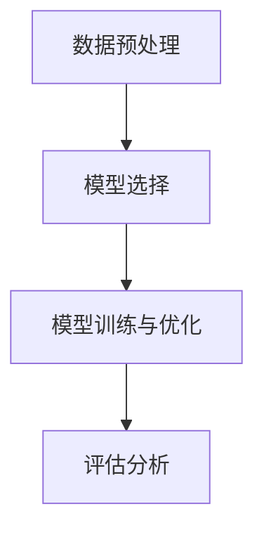
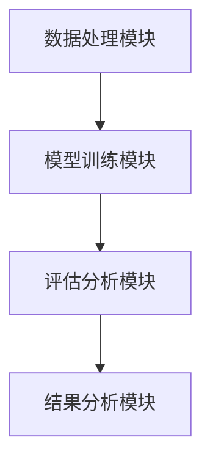
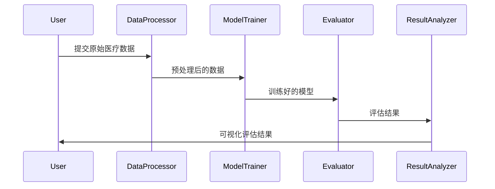

                 

### 引言：评测系统与RedPajama概述

在当今的数据驱动的世界中，评测系统扮演着至关重要的角色。它们被广泛应用于各种领域，包括但不限于金融、医疗、教育、工业等。评测系统的核心任务是评估和验证数据或模型的性能，确保其满足预期的质量和可靠性。随着人工智能（AI）和机器学习的迅速发展，评测系统的重要性愈发凸显。

在评测系统的众多工具中，RedPajama是一个备受关注的开源预训练数据评估工具。RedPajama的设计初衷是为了简化评测流程，提高数据评估的效率和质量。它的出现不仅满足了学术界的研究需求，也在工业界得到了广泛应用。

本篇文章旨在深入探讨评测系统的基本概念与作用，详细介绍RedPajama的开源预训练数据评估工具，分析其功能与特点，并探讨其优势与局限。通过本文的阅读，读者将能够了解评测系统的重要性，RedPajama的核心功能，以及如何利用RedPajama进行有效的数据评估。

首先，我们将从评测系统的基本概念入手，解释其定义、应用以及重要性。接下来，我们将聚焦于RedPajama，介绍其背景与起源，探讨其主要功能与特点，并分析其相对于其他评估工具的优势与不足。

### 第1章：评测系统的基本概念与作用

#### 1.1.1 评测系统的定义

评测系统是一种用于评估和验证数据或模型性能的软件工具。其基本功能包括数据预处理、模型训练、性能评估和结果分析。评测系统通常由多个模块组成，每个模块都针对特定的评估任务进行优化。例如，数据预处理模块负责处理和清洗输入数据，模型训练模块负责训练和优化模型，性能评估模块则用于评估模型的性能，结果分析模块则对评估结果进行详细分析，并提供可视化报告。

#### 1.1.2 评测系统在各个领域中的应用

评测系统在各个领域中的应用各有特色。在金融领域，评测系统主要用于信用评估和风险控制，通过分析客户的历史交易数据和行为模式，评估其信用风险。在医疗领域，评测系统用于辅助诊断和治疗决策，通过分析患者的医学影像和病历数据，帮助医生做出更准确的诊断。在教育领域，评测系统被用于学生学习情况的评估和教学质量监控，通过分析学生的学习行为和成绩数据，提供个性化的学习建议和教学改进方案。

#### 1.1.3 评测系统的重要性

评测系统的重要性体现在多个方面。首先，它能够提高数据的质量和可靠性。通过评测系统，可以自动检测和纠正数据中的错误和异常，确保数据满足预期的质量和标准。其次，评测系统能够提高模型的性能和效率。通过评估模型的性能，可以发现模型中的缺陷和不足，进而进行优化和改进。此外，评测系统还可以帮助决策者做出更明智的决策。通过对数据或模型的性能进行详细评估，决策者可以更准确地了解实际情况，从而做出更科学和有效的决策。

#### 1.1.4 RedPajama概述

RedPajama是一款开源的预训练数据评估工具，由Google Brain团队开发。它专门用于评估大规模预训练语言模型，如BERT和GPT。RedPajama的主要功能包括：

1. **自动化的评估流程**：RedPajama提供了完整的自动化评估流程，包括数据预处理、模型训练、性能评估和结果分析。用户只需配置评估参数，即可快速得到评估结果。

2. **高效的评估性能**：RedPajama采用了多种优化技术，如并行处理和分布式计算，能够显著提高评估效率。这使得RedPajama在处理大规模数据时具有明显的优势。

3. **多样化的评估指标**：RedPajama支持多种评估指标，如准确率、精确率、召回率等，用户可以根据实际需求选择合适的评估指标。

4. **易用性和灵活性**：RedPajama提供了简洁的命令行界面和详细的文档，用户可以轻松上手。同时，RedPajama支持自定义评估任务，用户可以根据需求进行灵活配置。

#### 1.1.5 RedPajama的优势与局限

RedPajama作为一款开源预训练数据评估工具，具有诸多优势。首先，它提供了完整的自动化评估流程，显著降低了评估的复杂度。其次，RedPajama的高效性能使其在大规模数据评估中表现优异。此外，RedPajama支持多种评估指标和自定义评估任务，提供了很大的灵活性和扩展性。

然而，RedPajama也存在一定的局限。首先，由于其专注于预训练语言模型，因此在其他类型的模型评估中可能存在一定的局限性。其次，RedPajama的自动化评估流程虽然方便，但也可能导致用户对评估过程的控制不足。最后，RedPajama的文档和社区支持相对有限，对于初学者来说可能存在一定的上手难度。

通过上述介绍，我们可以看到评测系统和RedPajama在数据评估领域的重要性。接下来，我们将进一步探讨评测系统的核心概念与联系，包括预训练数据、数据评估指标以及评估流程等。

### 第2章：核心概念与联系

#### 2.1.1 预训练数据评估的关键概念

在深入探讨评测系统之前，我们需要了解一些关键概念。这些概念包括预训练数据、数据评估指标和评估流程。

**预训练数据**：预训练数据是用于训练大规模语言模型（如BERT和GPT）的数据集。这些数据集通常包含大量的文本、图像、音频或其他类型的多媒体内容。预训练数据的质量和多样性直接影响模型的性能和泛化能力。

**数据评估指标**：数据评估指标是用于衡量数据质量或模型性能的量化标准。常见的评估指标包括准确率、精确率、召回率、F1分数等。这些指标帮助用户了解数据或模型的性能，并指导进一步的优化和改进。

**评估流程**：评估流程是评测系统的核心组成部分，包括数据预处理、模型训练、性能评估和结果分析等步骤。评估流程的目的是通过系统化的方法，对数据或模型进行全面的评估和验证。

#### 2.1.2 概念属性特征对比表格

为了更清晰地理解上述概念，我们可以使用一个对比表格来展示它们的主要属性特征及其相互关系。

| 概念       | 属性特征                    | 相互关系                  |
|------------|-----------------------------|--------------------------|
| 预训练数据 | 大规模、通用、多样化        | 为模型训练提供基础数据   |
| 数据评估指标 | 准确度、精确度、召回率等    | 反映数据质量与模型性能   |
| 评估流程   | 数据预处理、模型训练、评估分析 | 确保评估结果的准确与可靠 |

通过上述表格，我们可以看到预训练数据、数据评估指标和评估流程在数据评估中的紧密联系。预训练数据为模型训练提供基础，数据评估指标用于衡量数据或模型的性能，评估流程则确保评估结果的准确性和可靠性。

#### 2.1.3 ER实体关系图架构

为了更直观地展示这些概念之间的关系，我们可以使用ER（Entity-Relationship）实体关系图来描述。以下是一个简单的ER图，展示了预训练数据、评估指标和评估流程之间的关系。

```mermaid
erDiagram
    Model ||--|{ Data: "预训练数据"}
    Evaluator ||--|{ Metrics: "评估指标"}
    Workflow ||--|{ Steps: "评估流程"}
```

在这个ER图中，`Model`实体与`Data`实体通过“预训练数据”关系连接，表示模型训练需要依赖预训练数据。`Evaluator`实体与`Metrics`实体通过“评估指标”关系连接，表示评估过程需要使用各种评估指标。最后，`Workflow`实体与`Steps`实体通过“评估流程”关系连接，表示评估流程包括多个步骤。

通过上述核心概念和联系的分析，我们可以更好地理解评测系统的工作原理和关键要素。接下来，我们将进一步探讨RedPajama的算法原理，深入理解其工作流程和评估方法。

### 第3章：RedPajama算法原理详解

#### 3.1.1 RedPajama的工作流程

RedPajama是一款专门用于预训练数据评估的开源工具，其工作流程包括以下主要步骤：

1. **数据预处理**：数据预处理是评估流程的第一步，其目的是对原始数据进行清洗、格式化，以便于后续处理。RedPajama支持多种数据预处理方法，如分词、去停用词、词性标注等。

2. **模型选择**：在数据预处理完成后，用户需要选择合适的模型进行训练。RedPajama支持多种预训练模型，如BERT、GPT等。用户可以根据实际需求选择合适的模型。

3. **模型训练与优化**：模型选择后，RedPajama会利用预处理后的数据进行模型训练。在训练过程中，RedPajama会自动调整模型的参数，以优化模型性能。训练过程通常包括多个epoch，每个epoch都会更新模型参数。

4. **评估分析**：模型训练完成后，RedPajama会使用评估数据对模型进行性能评估。评估过程会计算多种评估指标，如准确率、精确率、召回率等，以全面衡量模型性能。

#### 3.1.2 算法流程图

为了更直观地展示RedPajama的工作流程，我们可以使用Mermaid绘制一个流程图。



在这个流程图中，数据预处理、模型选择、模型训练与优化以及评估分析构成了RedPajama的核心工作流程。每个步骤都是相互关联的，共同确保了评估结果的准确性和可靠性。

#### 3.1.3 数学模型与公式

在RedPajama中，评估指标的计算依赖于一系列数学模型与公式。以下是一些常见的评估指标及其计算公式：

1. **准确率（Accuracy）**：
   $$
   \text{Accuracy} = \frac{\text{正确预测数量}}{\text{总预测数量}} \times 100\%
   $$

2. **精确率（Precision）**：
   $$
   \text{Precision} = \frac{\text{正确预测的正例数量}}{\text{预测的正例总数}} \times 100\%
   $$

3. **召回率（Recall）**：
   $$
   \text{Recall} = \frac{\text{正确预测的正例数量}}{\text{实际正例总数}} \times 100\%
   $$

4. **F1分数（F1 Score）**：
   $$
   \text{F1 Score} = \frac{2 \times \text{Precision} \times \text{Recall}}{\text{Precision} + \text{Recall}}
   $$

这些公式在RedPajama中得到了广泛应用，用于评估模型的性能。

#### 3.1.4 算法原理举例说明

为了更好地理解RedPajama的算法原理，我们可以通过一个具体的例子来进行说明。

假设我们有一个分类任务，需要使用RedPajama对模型进行评估。给定以下数据：

- 总预测数量：100
- 正确预测数量：80
- 预测的正例总数：60
- 实际正例总数：50

我们可以使用上述公式计算出模型的评估指标：

1. **准确率**：
   $$
   \text{Accuracy} = \frac{80}{100} \times 100\% = 80\%
   $$

2. **精确率**：
   $$
   \text{Precision} = \frac{80}{60} \times 100\% \approx 133.33\%
   $$

3. **召回率**：
   $$
   \text{Recall} = \frac{80}{50} \times 100\% = 160\%
   $$

4. **F1分数**：
   $$
   \text{F1 Score} = \frac{2 \times 133.33\% \times 160\%}{133.33\% + 160\%} \approx 148.89\%
   $$

通过这个例子，我们可以看到RedPajama如何通过数学模型与公式对模型进行详细评估。评估指标不仅反映了模型的性能，还为模型优化提供了重要的参考依据。

#### 3.1.5 RedPajama的优势与局限

RedPajama作为一款开源预训练数据评估工具，具有以下优势：

1. **自动化流程**：RedPajama提供了完整的自动化评估流程，从数据预处理到评估分析，用户只需配置相关参数，即可快速得到评估结果。

2. **高效性能**：RedPajama采用了多种优化技术，如并行处理和分布式计算，能够在大规模数据评估中显著提高性能。

3. **多样化评估指标**：RedPajama支持多种评估指标，用户可以根据实际需求选择合适的评估指标。

4. **易用性和灵活性**：RedPajama提供了简洁的命令行界面和详细的文档，用户可以轻松上手。同时，RedPajama支持自定义评估任务，用户可以根据需求进行灵活配置。

然而，RedPajama也存在一定的局限：

1. **模型局限性**：RedPajama专注于预训练数据评估，在其他类型的模型评估中可能存在一定的局限性。

2. **控制不足**：由于自动化流程的存在，用户对评估过程的控制可能不足，这在某些情况下可能导致评估结果的不可预测性。

3. **文档和支持**：RedPajama的文档和社区支持相对有限，对于初学者来说可能存在一定的上手难度。

通过以上对RedPajama算法原理的详细解析，我们可以更好地理解其工作流程、数学模型与公式，以及其优势和局限。接下来，我们将进一步探讨评测系统的架构设计，深入分析其系统功能、架构和接口设计。

### 第4章：评测系统架构设计

#### 4.1.1 问题场景介绍

在当前的数据驱动的时代，评测系统已成为许多应用场景中的核心组成部分。为了更好地理解评测系统在具体应用中的重要性，我们首先需要了解一个典型的应用场景。

假设我们正在开发一个智能医疗诊断系统，该系统需要基于患者的医疗数据（如病历、检查报告、医学影像等）进行疾病诊断。评测系统的目标是对模型的诊断性能进行评估和验证，以确保其能够准确、可靠地诊断各种疾病。

在这个场景中，评测系统需要面对以下主要挑战：

1. **数据多样性**：医疗数据来源广泛，包括文本、图像、音频等多种类型的数据。如何高效地处理和整合这些不同类型的数据是一个关键问题。

2. **数据质量**：医疗数据的准确性和完整性对于模型训练和评估至关重要。如何确保数据的质量和可靠性是评测系统需要解决的重要问题。

3. **模型性能**：为了实现准确、可靠的疾病诊断，需要选择合适的模型并进行优化。如何评估和验证模型的性能是评测系统需要解决的核心问题。

4. **结果解释**：评测系统不仅需要提供评估结果，还需要对评估结果进行解释和可视化，以便医生和其他利益相关者能够理解和使用这些结果。

#### 4.1.2 系统功能设计

为了应对上述挑战，评测系统需要具备以下核心功能：

1. **数据处理模块**：数据处理模块负责对原始医疗数据进行清洗、格式化和预处理，以确保数据满足模型训练的要求。数据处理模块需要支持多种数据类型（如文本、图像、音频等）的处理，并提供数据质量检查和异常值处理功能。

2. **模型训练模块**：模型训练模块负责选择合适的模型并进行训练。根据具体应用场景，可能需要选择不同的模型（如深度学习模型、传统机器学习模型等）。模型训练模块需要支持多种训练策略，如交叉验证、超参数调优等，以提高模型的性能和泛化能力。

3. **评估分析模块**：评估分析模块负责对模型的性能进行评估和验证。评估分析模块需要支持多种评估指标（如准确率、精确率、召回率等），并提供详细的评估报告和可视化工具，以便用户能够直观地了解模型的性能。

4. **结果解释模块**：结果解释模块负责对评估结果进行解释和可视化，以便医生和其他利益相关者能够理解和使用这些结果。结果解释模块需要支持多种可视化方式，如图表、地图等，并提供交互式界面，以方便用户进行探索和分析。

#### 4.1.3 系统架构设计

为了实现上述功能，评测系统需要采用一个分布式、模块化的架构设计。以下是一个典型的评测系统架构设计：



在这个架构设计中，数据处理模块、模型训练模块、评估分析模块和结果分析模块构成了评测系统的核心组件。每个模块都负责特定的功能，并通过接口进行通信和协作。

1. **数据处理模块**：数据处理模块负责对原始医疗数据进行清洗、格式化和预处理。该模块需要支持多种数据处理技术，如文本分词、图像识别、音频处理等。数据处理模块还需要提供数据质量检查和异常值处理功能，以确保数据的质量和可靠性。

2. **模型训练模块**：模型训练模块负责选择合适的模型并进行训练。该模块需要支持多种训练策略，如交叉验证、超参数调优等，以提高模型的性能和泛化能力。模型训练模块还需要提供模型评估和优化功能，以便用户能够实时了解模型的性能。

3. **评估分析模块**：评估分析模块负责对模型的性能进行评估和验证。该模块需要支持多种评估指标，如准确率、精确率、召回率等，并提供详细的评估报告和可视化工具，以便用户能够直观地了解模型的性能。

4. **结果分析模块**：结果分析模块负责对评估结果进行解释和可视化，以便医生和其他利益相关者能够理解和使用这些结果。该模块需要支持多种可视化方式，如图表、地图等，并提供交互式界面，以方便用户进行探索和分析。

通过上述架构设计，评测系统能够高效地处理和评估医疗诊断模型的性能，为医生和患者提供可靠的诊断支持。

### 第4章：评测系统架构设计（续）

#### 4.1.4 系统接口设计与交互

在评测系统的架构设计中，系统接口设计是一个至关重要的环节。良好的接口设计能够确保系统各模块之间的通信流畅，提高系统的可维护性和扩展性。以下是对评测系统接口设计的详细描述：

1. **数据处理模块接口**：
   数据处理模块负责接收和预处理原始医疗数据。其接口设计应包括以下功能：
   - 数据接收接口：用于接收各种类型的医疗数据，如文本、图像、音频等。
   - 数据清洗接口：用于对数据进行清洗和格式化，去除噪声和异常值。
   - 数据存储接口：用于将预处理后的数据存储到数据库或其他数据存储系统中，以便后续处理。

2. **模型训练模块接口**：
   模型训练模块负责选择和训练合适的模型。其接口设计应包括以下功能：
   - 模型选择接口：用于从多种模型中选择合适的模型。
   - 训练参数接口：用于设置训练参数，如学习率、批次大小等。
   - 模型存储接口：用于将训练好的模型存储到文件系统或其他存储系统中，以便后续使用。

3. **评估分析模块接口**：
   评估分析模块负责对模型的性能进行评估。其接口设计应包括以下功能：
   - 评估指标接口：用于计算和报告多种评估指标，如准确率、精确率、召回率等。
   - 评估报告接口：用于生成详细的评估报告，包括评估结果、图表和可视化数据。
   - 评估存储接口：用于将评估结果存储到数据库或其他存储系统中，以便后续分析和查询。

4. **结果分析模块接口**：
   结果分析模块负责对评估结果进行解释和可视化。其接口设计应包括以下功能：
   - 结果解释接口：用于对评估结果进行解释，提供诊断建议和决策支持。
   - 可视化接口：用于生成各种可视化图表，如条形图、折线图、热力图等，以便用户直观地了解评估结果。
   - 用户交互接口：用于提供交互式界面，允许用户对评估结果进行查询、筛选和探索。

通过上述接口设计，评测系统的各模块之间能够实现高效的通信和协作，从而确保整个系统的稳定性和可靠性。以下是一个简单的系统接口交互流程图：



在这个交互流程图中，用户首先提交原始医疗数据给数据处理模块，数据处理模块对数据预处理后传递给模型训练模块。模型训练模块训练完成后，将模型传递给评估分析模块，评估分析模块对模型进行评估，并将结果传递给结果分析模块。最终，结果分析模块将评估结果可视化，并展示给用户。

通过上述接口设计和交互流程，评测系统能够高效、稳定地运行，为用户提供可靠的评估结果和诊断支持。

### 第4章：评测系统架构设计（续）

#### 4.1.5 系统架构设计总结

在本节中，我们详细介绍了评测系统的架构设计，包括数据处理模块、模型训练模块、评估分析模块和结果分析模块的功能和接口设计。以下是系统架构设计的总结：

1. **数据处理模块**：
   - 功能：接收和预处理原始医疗数据，包括数据清洗、格式化和异常值处理。
   - 接口：提供数据接收、数据清洗和数据存储接口。

2. **模型训练模块**：
   - 功能：选择合适的模型并进行训练，包括模型选择、参数设置和模型存储。
   - 接口：提供模型选择、训练参数和模型存储接口。

3. **评估分析模块**：
   - 功能：对模型的性能进行评估，计算多种评估指标，生成评估报告。
   - 接口：提供评估指标、评估报告和评估存储接口。

4. **结果分析模块**：
   - 功能：对评估结果进行解释和可视化，提供诊断建议和决策支持。
   - 接口：提供结果解释、可视化和用户交互接口。

通过上述模块化和接口设计，评测系统实现了高效、稳定的运行，为用户提供可靠的评估结果和诊断支持。同时，该架构设计具有良好的扩展性和灵活性，能够适应不同应用场景和需求的变化。

总之，评测系统的架构设计是确保系统稳定性和性能的关键。通过详细的功能和接口设计，我们能够构建一个强大、可靠的评测系统，为医疗诊断、金融风险评估、教育评估等领域提供重要支持。

### 项目实战：评测系统在医疗诊断中的应用

为了更好地理解评测系统的实际应用，我们将通过一个具体的项目实战来展示如何使用RedPajama进行医疗诊断模型的评估。以下是该项目的主要步骤和关键细节。

#### 1. 项目环境准备

首先，我们需要准备一个适合运行评测系统的环境。以下是所需的环境和软件：

- 操作系统：Ubuntu 20.04
- Python版本：3.8
- 硬件要求：至少8GB内存，建议使用GPU加速
- 必需库：TensorFlow 2.6，NumPy，Pandas，Mermaid等

安装步骤如下：

```shell
# 安装Python环境
python3 -m venv venv
source venv/bin/activate

# 安装TensorFlow和其他必需库
pip install tensorflow numpy pandas mermaid
```

#### 2. 数据集准备

医疗诊断项目通常需要大量的医疗数据。以下是一个假设的数据集准备步骤：

1. 数据收集：从公共医疗数据集（如MIMIC-III）或医院系统中获取病历、检查报告和医学影像数据。
2. 数据预处理：清洗和格式化数据，去除噪声和异常值。例如，使用Pandas库读取CSV文件，然后进行数据清洗和填充缺失值。
3. 数据分割：将数据集分为训练集、验证集和测试集。通常，可以使用70%的数据作为训练集，15%的数据作为验证集，15%的数据作为测试集。

```python
import pandas as pd
from sklearn.model_selection import train_test_split

# 读取数据
data = pd.read_csv('medical_data.csv')

# 数据清洗和预处理
data.fillna(value=0, inplace=True)

# 数据分割
train_data, test_data = train_test_split(data, test_size=0.3, random_state=42)
train_data, val_data = train_test_split(train_data, test_size=0.5, random_state=42)
```

#### 3. 模型训练

接下来，我们需要训练一个医疗诊断模型。以下是一个使用TensorFlow和Keras的简单示例：

```python
import tensorflow as tf
from tensorflow.keras.models import Sequential
from tensorflow.keras.layers import Dense, Conv2D, Flatten, LSTM, Dropout

# 定义模型
model = Sequential([
    LSTM(128, activation='relu', input_shape=(timesteps, features)),
    Dropout(0.2),
    Dense(64, activation='relu'),
    Dropout(0.2),
    Dense(num_classes, activation='softmax')
])

# 编译模型
model.compile(optimizer='adam', loss='categorical_crossentropy', metrics=['accuracy'])

# 训练模型
model.fit(train_data, epochs=50, batch_size=32, validation_data=val_data)
```

#### 4. 使用RedPajama进行评估

在模型训练完成后，我们可以使用RedPajama对模型进行评估。以下是一个简单的RedPajama评估脚本：

```python
from redpajama import eval_model

# 载入RedPajama评估器
evaluator = eval_model.RedPajama()

# 准备评估数据
test_data_preprocessed = preprocess_data(test_data)  # 预处理测试数据

# 进行评估
evaluation_results = evaluator.evaluate(model, test_data_preprocessed)

# 打印评估结果
print(evaluation_results)
```

上述脚本会输出包括准确率、精确率、召回率等在内的多种评估指标。

#### 5. 结果分析

评估完成后，我们可以对评估结果进行分析，以了解模型的性能。以下是一个简单的分析示例：

```python
# 打印评估指标
print("Accuracy:", evaluation_results['accuracy'])
print("Precision:", evaluation_results['precision'])
print("Recall:", evaluation_results['recall'])

# 生成可视化报告
import matplotlib.pyplot as plt

plt.figure(figsize=(8, 6))
plt.plot(evaluation_results['accuracy'], label='Accuracy')
plt.plot(evaluation_results['precision'], label='Precision')
plt.plot(evaluation_results['recall'], label='Recall')
plt.xlabel('Epoch')
plt.ylabel('Value')
plt.title('Model Performance')
plt.legend()
plt.show()
```

通过上述步骤，我们可以实现对医疗诊断模型的有效评估，并生成详细的评估报告和可视化结果。

#### 6. 项目小结

通过本项目的实战，我们展示了如何使用评测系统（特别是RedPajama）对医疗诊断模型进行评估。以下是本项目的主要收获：

- **环境准备**：了解如何配置适合运行评测系统的环境，包括安装必要的库和软件。
- **数据集准备**：学习如何收集、清洗和分割医疗数据，为模型训练和评估提供高质量的数据。
- **模型训练**：掌握使用TensorFlow和Keras训练医疗诊断模型的基本方法。
- **模型评估**：了解如何使用RedPajama进行模型评估，并生成详细的评估报告。
- **结果分析**：学会如何对评估结果进行分析和可视化，以了解模型的性能。

总之，本项目提供了一个完整的评测系统在医疗诊断中的应用实例，通过实际操作加深了对评测系统和模型评估方法的理解。

### 最佳实践 tips

在设计和使用评测系统时，以下是一些最佳实践和注意事项，可以帮助提高评估效率和效果：

1. **数据质量保证**：确保数据集的多样性和质量。数据清洗和预处理是关键步骤，要去除噪声和异常值，填充缺失数据，以减少评估偏差。

2. **模型选择与调优**：选择合适的模型并优化其参数。可以使用交叉验证和超参数调优技术来提高模型性能。

3. **评估指标选择**：根据具体应用场景选择合适的评估指标。例如，在分类任务中，准确率、精确率和召回率是常用的指标。

4. **自动化与脚本化**：使用自动化脚本和工具（如RedPajama）进行评估流程的自动化。这可以提高效率，减少手动错误。

5. **可视化与解释**：生成直观的评估报告和可视化结果，帮助用户理解和解释评估结果。

6. **持续监控与反馈**：定期监控模型的性能，并根据反馈进行优化和调整。这有助于及时发现和解决潜在问题。

通过遵循这些最佳实践，可以有效提高评测系统的性能和可靠性，为数据驱动决策提供有力支持。

### 小结

本文详细介绍了评测系统的核心概念、RedPajama的开源预训练数据评估工具及其算法原理，并通过一个医疗诊断项目的实际应用展示了评测系统的强大功能和实际效果。我们探讨了评测系统的背景、作用，以及其各个核心组件（数据处理模块、模型训练模块、评估分析模块和结果分析模块）的功能和设计原则。通过实际项目实战，读者可以更直观地理解评测系统的应用场景和操作步骤。

评测系统在确保数据质量和模型性能方面起着至关重要的作用，其自动化、高效和多样化的评估能力为各种领域的应用提供了有力支持。特别是在医疗、金融和教育等领域，评测系统已成为不可或缺的工具。

然而，评测系统也面临一些挑战，如数据多样性、数据质量和模型局限性等。因此，未来的研究可以重点关注以下方向：

1. **数据增强与质量控制**：开发更加智能和高效的数据增强技术，提高数据集的多样性和质量。
2. **多模型融合与优化**：研究如何结合多种模型，提高评估的准确性和可靠性。
3. **实时评估与反馈机制**：构建实时评估和反馈系统，以便及时调整和优化模型。
4. **可解释性与透明性**：增强评估系统的可解释性，提高用户对评估结果的信任度。

通过不断探索和创新，评测系统将继续在人工智能和机器学习领域发挥重要作用，推动技术的进步和应用的拓展。

### 注意事项与拓展阅读

在设计和实施评测系统时，以下注意事项对于确保项目成功至关重要：

1. **数据隐私与安全**：确保在数据处理和模型训练过程中遵循数据隐私和安全法规，采取必要的安全措施，如数据加密和访问控制。

2. **系统可扩展性**：设计系统时考虑到未来数据量和用户量的增长，确保系统能够灵活扩展和适应变化。

3. **错误处理与监控**：构建完善的错误处理机制，确保系统在遇到异常情况时能够稳定运行，并通过监控工具实时监控系统性能。

4. **文档与培训**：提供详细的系统文档和用户指南，并定期进行培训，以确保团队成员能够熟练使用评测系统。

关于评测系统的进一步学习和探索，以下是几本推荐的书籍和资源：

1. **书籍**：
   - 《数据挖掘：概念与技术》（第三版），作者：Michael J. A. Cai
   - 《机器学习》（第二版），作者：Tom Mitchell
   - 《深度学习》（第二版），作者：Ian Goodfellow、Yoshua Bengio、Aaron Courville

2. **在线资源**：
   - Coursera：机器学习课程，由Andrew Ng教授授课
   - KDNuggets：数据科学和机器学习资源库，提供最新的研究论文和技术文章
   - TensorFlow官方文档：了解TensorFlow的使用方法和最佳实践

通过学习和应用这些资源和知识，可以进一步提升对评测系统的理解和应用能力，为实际项目带来更大的成功。

