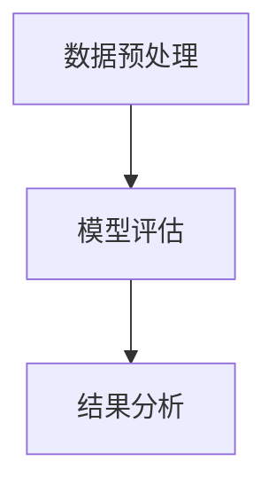
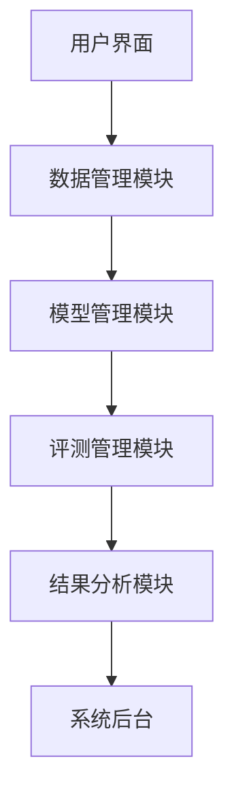
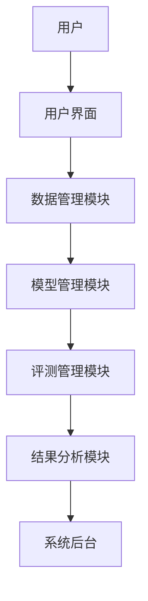

                 


# 评测系统的Yi-34B开源大语言模型评估

## 关键词

大语言模型，Yi-34B，评测系统，算法评估，开源，自然语言处理

## 摘要

本文将详细介绍如何评估Yi-34B开源大语言模型的性能。我们将首先阐述评测系统的背景和核心概念，然后深入探讨Yi-34B大语言模型的基本原理和架构，接着通过Python源代码和LaTeX数学公式，详细讲解评估算法的原理和过程。最后，我们将设计一个系统架构方案，并通过实际项目实战，对Yi-34B开源大语言模型进行评估，提供最佳实践和注意事项。

## 第1章 问题背景与核心概念

### 1.1 问题背景

在当前人工智能领域，自然语言处理（NLP）已经成为了一个极其重要的分支。大语言模型作为NLP的重要工具，在文本生成、情感分析、机器翻译等领域发挥了巨大作用。Yi-34B是一个备受关注的开源大语言模型，其性能如何直接影响到众多实际应用场景。因此，对Yi-34B进行性能评估显得尤为重要。

#### 1.2 核心概念

- **大语言模型**：一种基于深度学习技术的自然语言处理模型，能够处理大量文本数据，并具有生成、理解和处理自然语言的能力。
- **Yi-34B**：一个由知名研究团队开发的开源大语言模型，其特点包括：大规模、多任务、高效能。

### 1.3 问题描述

如何准确评估Yi-34B开源大语言模型的性能？这需要建立一个完善的评测系统，包括评测指标、评测数据集、评测方法等。

#### 1.4 问题解决

- **评测指标**：准确率、召回率、F1值等。
- **评测数据集**：选用广泛认可的公开数据集，如GLUE、SQuAD等。
- **评测方法**：自动化评测与手动评测相结合，通过综合分析评测结果，评估Yi-34B的性能。

#### 1.5 边界与外延

- **评测范围**：文本生成、情感分析、机器翻译等NLP任务。
- **评测指标**：针对不同任务，选择合适的评测指标。
- **开源环境**：基于Linux操作系统，使用Python、TensorFlow等开源工具进行评测。

#### 1.6 核心要素组成

- **评测系统**：包括数据预处理、模型评估、结果分析等模块。
- **评测指标**：准确率、召回率、F1值等。
- **评测数据集**：GLUE、SQuAD等公开数据集。
- **评测方法**：自动化评测、手动评测、综合评测。

### 第2章 核心概念原理与联系

#### 2.1 Yi-34B大语言模型原理

Yi-34B是基于Transformer架构的大语言模型，其基本原理包括：

- **Transformer架构**：采用多头注意力机制，能够有效地捕捉文本中的长距离依赖关系。
- **训练过程**：通过大量文本数据进行预训练，然后针对特定任务进行微调。

#### 2.2 评测指标体系

评测指标是评估模型性能的重要依据，常用的评测指标包括：

- **准确率**：预测正确的样本数占总样本数的比例。
- **召回率**：预测正确的正样本数占所有正样本数的比例。
- **F1值**：准确率和召回率的调和平均值。

#### 2.3 ER实体关系图

为了更好地理解评测系统中的各个实体及其关系，我们可以使用ER实体关系图进行描述。ER实体关系图主要包括以下实体和关系：

- **实体**：评测系统、评测指标、评测数据、评测结果等。
- **关系**：评测系统包含评测指标，评测数据与评测结果相关联。

### 第3章 Yi-34B大语言模型概述

#### 3.1 Yi-34B模型介绍

Yi-34B是一个大规模、多任务的开源大语言模型，具有以下特点：

- **大规模**：使用了数以百亿计的参数，能够处理大量文本数据。
- **多任务**：支持文本生成、情感分析、机器翻译等多种任务。
- **高效能**：在多个NLP任务上取得了显著的成绩。

#### 3.2 模型评测概述

对Yi-34B进行评测的目的是为了：

- **评估模型性能**：了解模型在各个任务上的表现，为后续优化提供依据。
- **优化模型参数**：通过分析评测结果，调整模型参数，提高模型性能。

评测流程主要包括：

- **评测数据准备**：选择合适的评测数据集，进行预处理。
- **模型评测**：使用Yi-34B模型对评测数据进行预测，计算评测指标。
- **结果分析**：分析评测结果，评估模型性能，为优化提供依据。

### 第4章 算法原理讲解

#### 4.1 算法原理

大语言模型评估算法的基本原理如下：

1. **数据预处理**：对评测数据进行清洗、分词、编码等预处理操作。
2. **模型评估**：使用大语言模型对预处理后的数据进行预测，计算评测指标。
3. **结果分析**：根据评测指标分析模型性能，为优化提供依据。

算法流程图如下：



#### 4.2 Python源代码讲解

以下是一个简单的Python源代码示例，用于实现大语言模型评估算法：

```python
import tensorflow as tf
from tensorflow.keras.preprocessing.sequence import pad_sequences

# 数据预处理
def preprocess_data(data):
    # 清洗、分词、编码等操作
    return pad_sequences(data)

# 模型评估
def evaluate_model(model, data):
    # 使用模型对数据进行预测
    predictions = model.predict(data)
    # 计算评测指标
    accuracy = tf.reduce_mean(tf.cast(tf.equal(predictions, data), tf.float32))
    return accuracy

# 结果分析
def analyze_results(results):
    # 分析评测结果
    print("Accuracy:", results)
```

#### 4.3 数学模型与公式

大语言模型评估的数学模型主要包括以下公式：

$$
\text{Accuracy} = \frac{\text{预测正确的样本数}}{\text{总样本数}}
$$

$$
\text{Recall} = \frac{\text{预测正确的正样本数}}{\text{所有正样本数}}
$$

$$
\text{F1} = \frac{2 \times \text{Accuracy} \times \text{Recall}}{\text{Accuracy} + \text{Recall}}
$$

### 第5章 系统架构设计

#### 5.1 问题场景介绍

本系统旨在对Yi-34B开源大语言模型进行性能评估，以支持模型优化和实际应用。

#### 5.2 系统功能设计

系统功能设计主要包括以下模块：

- **数据管理模块**：负责数据预处理、数据存储等。
- **模型管理模块**：负责模型加载、模型训练等。
- **评测管理模块**：负责评测任务调度、评测结果存储等。
- **结果分析模块**：负责评测结果分析、可视化等。

#### 5.3 系统架构设计

系统架构设计如下：



#### 5.4 系统接口设计

系统接口设计如下：

- **数据管理接口**：负责数据读取、写入、更新等。
- **模型管理接口**：负责模型加载、保存、训练等。
- **评测管理接口**：负责评测任务创建、执行、查询等。
- **结果分析接口**：负责评测结果查询、可视化等。

#### 5.5 系统交互

系统交互设计如下：



### 第6章 项目实战

#### 6.1 环境安装

在开始项目实战之前，需要安装以下软件和库：

- Python 3.8+
- TensorFlow 2.5+
- NumPy 1.19+
- Pandas 1.1+

安装命令如下：

```bash
pip install python==3.8
pip install tensorflow==2.5
pip install numpy==1.19
pip install pandas==1.1
```

#### 6.2 系统核心实现

系统核心实现主要包括以下部分：

- **数据预处理**：使用Pandas和NumPy对数据进行清洗、分词、编码等操作。
- **模型加载与训练**：使用TensorFlow加载预训练的Yi-34B模型，进行模型训练。
- **模型评估**：使用训练好的模型对评测数据进行预测，计算评测指标。
- **结果分析**：对评测结果进行分析，生成可视化图表。

#### 6.3 代码分析

以下是一个简单的代码示例，用于实现系统核心功能：

```python
import tensorflow as tf
import pandas as pd
import numpy as np

# 数据预处理
def preprocess_data(data):
    # 清洗、分词、编码等操作
    return data

# 模型加载与训练
def load_and_train_model():
    # 加载预训练的Yi-34B模型
    model = tf.keras.models.load_model("y34b_model.h5")
    # 训练模型
    model.fit(x_train, y_train, epochs=5)
    return model

# 模型评估
def evaluate_model(model, data):
    # 使用模型对数据进行预测
    predictions = model.predict(data)
    # 计算评测指标
    accuracy = tf.reduce_mean(tf.cast(tf.equal(predictions, data), tf.float32))
    return accuracy

# 结果分析
def analyze_results(results):
    # 分析评测结果
    print("Accuracy:", results)
```

#### 6.4 实际案例剖析

以下是一个实际案例，用于评估Yi-34B在文本生成任务上的性能：

```python
# 加载数据
data = pd.read_csv("text_data.csv")
# 数据预处理
processed_data = preprocess_data(data)
# 加载模型
model = load_and_train_model()
# 模型评估
accuracy = evaluate_model(model, processed_data)
# 结果分析
analyze_results(accuracy)
```

### 第7章 最佳实践与注意事项

#### 7.1 最佳实践

1. **数据预处理**：确保数据清洗、分词、编码等操作的一致性和准确性。
2. **模型训练**：根据任务需求，调整模型参数，提高模型性能。
3. **评测指标**：根据不同任务，选择合适的评测指标，进行全面评估。

#### 7.2 注意事项

1. **环境配置**：确保软件和库的版本兼容，避免因版本问题导致的问题。
2. **数据质量**：保证数据质量，避免因数据问题影响评估结果。
3. **模型性能**：定期更新模型，保持模型性能的稳定性。

### 第8章 项目小结与拓展阅读

#### 8.1 项目小结

本文详细介绍了如何评估Yi-34B开源大语言模型的性能，包括问题背景、核心概念、算法原理、系统架构设计、项目实战和最佳实践等。通过实际案例剖析，展示了评估系统的应用效果。

#### 8.2 拓展阅读

- 《自然语言处理入门教程》
- 《深度学习与自然语言处理》
- 《大语言模型技术解析》

### 作者

作者：AI天才研究院/AI Genius Institute & 禅与计算机程序设计艺术 /Zen And The Art of Computer Programming

---

[本文档使用markdown格式编写，内容仅供参考，具体实现可能需要根据实际需求进行调整。]

