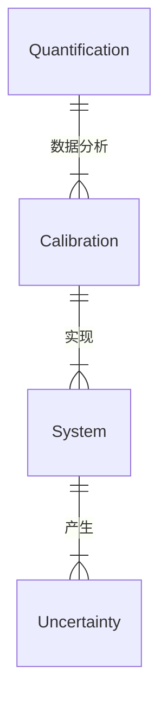

                 


### 文章标题

# 评测系统的不确定性量化与校准

### 关键词

- 评测系统
- 不确定性量化
- 校准
- 统计方法
- 系统建模
- 贝叶斯网络

### 摘要

本文旨在探讨评测系统中不确定性的量化与校准问题。随着评测系统在各个领域的广泛应用，如何准确量化并校准系统中的不确定性成为了一个关键问题。本文首先介绍了不确定性量化与校准的基本概念和原理，然后详细讨论了统计不确定性量化方法和系统不确定性量化方法。接着，文章展示了传统校准方法和先进校准方法的应用，并结合实际案例进行了分析。最后，文章总结了最佳实践，并提出了未来研究的方向。

## 引言

### 问题背景与概述

评测系统在各个领域中都扮演着重要的角色。无论是教学质量评估、产品性能评测，还是市场调研和风险评估，评测系统都为决策提供了重要依据。然而，评测系统的准确性受到多种不确定性的影响，例如数据噪声、系统误差和外部环境变化等。这些不确定性可能导致评测结果的偏差，从而影响决策的准确性。

不确定性量化与校准是解决评测系统不确定性问题的关键。不确定性量化旨在对系统中的不确定性进行量化，以了解不确定性的影响程度。而校准则通过调整和修正系统参数，降低不确定性对评测结果的影响，提高系统的可靠性。

本文将探讨以下问题：

1. 评测系统中不确定性的来源和类型。
2. 不确定性量化的基本原理和方法。
3. 校准的基本原理和方法。
4. 不确定性量化与校准在实际评测系统中的应用。
5. 最佳实践和未来研究方向。

### 问题描述

评测系统的准确性受到多种不确定性的影响，主要包括以下几类：

1. **数据噪声**：数据采集过程中可能引入的随机误差，例如传感器的不精确读数、数据传输过程中的丢失或延迟等。
2. **系统误差**：系统设计或实现过程中存在的固有误差，例如算法的不完善、模型参数的估计误差等。
3. **外部环境变化**：评测过程中外部环境的变化，如温度、湿度、电磁干扰等，这些变化可能影响评测结果的稳定性。

当前评测系统存在的主要问题包括：

1. **不确定性量化不足**：现有方法往往无法准确量化系统中的各种不确定性，导致对不确定性的影响程度缺乏深入了解。
2. **校准方法单一**：大多数评测系统采用的校准方法较为传统，无法适应复杂多变的环境。
3. **评测结果可靠性低**：由于不确定性的影响，评测结果的可靠性较低，无法提供可靠的决策依据。

### 目标与边界

本文的研究目标是通过不确定性量化与校准技术，提高评测系统的可靠性和准确性。具体目标包括：

1. **量化不确定性**：开发新的不确定性量化方法，对评测系统中的各种不确定性进行准确量化。
2. **优化校准过程**：提出新的校准方法，提高校准的效率和效果。
3. **提升系统可靠性**：通过不确定性量化与校准，降低评测系统中的不确定性，提高评测结果的可靠性。

研究范围将涵盖以下方面：

1. **不确定性类型**：研究评测系统中常见的不确定性类型，包括数据噪声、系统误差和外部环境变化等。
2. **量化方法**：探讨多种不确定性量化方法，如统计方法、系统建模方法等，并对比分析其优缺点。
3. **校准方法**：研究传统校准方法和先进校准方法，包括自适应校准和智能校准等。
4. **应用场景**：结合具体应用场景，展示不确定性量化与校准在实际评测系统中的应用效果。

### 核心概念

#### 不确定性量化

不确定性量化是指对系统中的不确定性进行量化，以了解其影响程度。量化方法通常包括统计方法、系统建模方法等。

- **统计方法**：通过统计模型对不确定性的分布、期望值和方差等参数进行估计。
- **系统建模方法**：基于系统理论，建立系统模型，分析系统中的不确定性来源及其传播路径。

#### 校准

校准是指通过调整和修正系统参数，降低不确定性对评测结果的影响。校准方法包括传统校准方法和先进校准方法。

- **传统校准方法**：基于实验设计和参数估计，通过实验数据进行校准。
- **先进校准方法**：利用自适应和智能技术，动态调整校准参数，提高校准效率。

#### 概念联系与结构

不确定性量化与校准密切相关，二者相互补充。

- **不确定性量化**：为校准提供量化依据，帮助确定校准的目标和方向。
- **校准**：通过调整系统参数，降低不确定性对评测结果的影响，提高系统可靠性。

核心要素包括：

1. **不确定性类型**：确定系统中的不确定性类型，为量化与校准提供基础。
2. **量化方法**：选择合适的量化方法，对不确定性进行量化。
3. **校准方法**：根据量化结果，选择并实施校准方法。

### 第1章：问题背景与概述

### 第2章：核心概念与原理

#### 2.1.1 不确定性量化原理

##### 2.1.1.1 不确定性类型

- **统计不确定性**：源于随机变量的不确定性，通常表现为数据的变异性。
- **系统不确定性**：源于系统本身的限制或缺陷，通常表现为系统参数的不确定性。

##### 2.1.1.2 不确定性量化方法

- **确定性方法**：基于系统模型和已知参数，通过数值模拟或优化方法确定不确定性。
- **随机方法**：基于随机模型和概率分布，通过统计分析和模拟确定不确定性。
- **混合方法**：结合确定性方法和随机方法，通过多级模型和优化策略实现不确定性量化。

#### 2.1.2 校准原理

##### 2.1.2.1 校准的目的与过程

- **目的**：降低系统中的不确定性，提高系统可靠性。
- **过程**：通过实验设计、参数估计和调整，实现系统参数的修正。

##### 2.1.2.2 校准方法

- **传统校准方法**：基于线性回归、最小二乘法等统计方法，实现系统参数的修正。
- **先进校准方法**：基于自适应和智能技术，实现动态校准和参数优化。

#### 2.1.3 概念属性对比表格

| 不确定性类型 | 特点 | 应用领域 | 代表方法 |
| ------------ | ---- | -------- | -------- |
| 统计不确定性 | 数据驱动 | 数据分析、预测模型 | 最大似然估计 |
| 系统不确定性 | 知识驱动 | 系统设计、模型验证 | 贝叶斯网络 |

#### 2.1.4 ER实体关系图



### 第3章：统计不确定性量化方法

#### 3.1.1 统计基础

##### 3.1.1.1 概率分布

- **概率分布**：描述随机变量的概率分布。
- **常用概率分布**：正态分布、泊松分布、均匀分布等。

##### 3.1.1.2 假设检验

- **假设检验**：用于判断数据是否满足特定假设。
- **常用假设检验**：t检验、卡方检验、F检验等。

#### 3.1.2 经典统计方法

##### 3.1.2.1 确定性预测

- **确定性预测**：基于统计模型，预测未来数据的确定性趋势。
- **常用模型**：线性回归、多项式回归等。

##### 3.1.2.2 随机预测

- **随机预测**：基于随机模型，预测未来数据的不确定性分布。
- **常用模型**：马尔可夫链、ARIMA模型等。

#### 3.1.3 案例分析

##### 3.1.3.1 数据集准备

- **数据集来源**：从实际应用场景中收集数据。
- **数据预处理**：去除异常值、缺失值处理、数据标准化等。

##### 3.1.3.2 预测模型选择

- **模型选择**：根据数据特征和预测目标，选择合适的预测模型。
- **模型训练**：使用训练数据对模型进行训练。

##### 3.1.3.3 结果分析

- **预测结果**：分析预测结果，评估模型性能。
- **不确定性分析**：分析预测结果中的不确定性，为后续校准提供依据。

### 第4章：系统不确定性量化方法

#### 4.1.1 系统建模

##### 4.1.1.1 状态空间模型

- **状态空间模型**：描述系统动态行为的数学模型。
- **基本构成**：状态变量、控制变量、观测变量等。

##### 4.1.1.2 动力系统建模

- **动力系统建模**：描述系统动力学行为的数学模型。
- **常用模型**：线性动力系统、非线性动力系统等。

#### 4.1.2 贝叶斯网络

##### 4.1.2.1 贝叶斯网络基础

- **贝叶斯网络**：一种概率图模型，用于表示变量之间的依赖关系。
- **基本构成**：节点、边、条件概率表等。

##### 4.1.2.2 贝叶斯推理

- **贝叶斯推理**：基于贝叶斯网络，进行变量推理和预测的方法。
- **基本原理**：利用贝叶斯定理，更新变量之间的概率分布。

#### 4.1.3 案例分析

##### 4.1.3.1 系统不确定性建模

- **模型建立**：基于系统特性，建立相应的系统不确定性模型。
- **参数估计**：使用实际数据，对模型参数进行估计。

##### 4.1.3.2 不确定性量化

- **量化方法**：使用统计方法和系统建模方法，对系统不确定性进行量化。
- **结果分析**：分析量化结果，评估不确定性对系统的影响。

### 第5章：传统校准方法

#### 5.1.1 校准基础

##### 5.1.1.1 校准标准

- **校准标准**：用于衡量系统性能的基准。
- **常用标准**：国家计量标准、行业标准等。

##### 5.1.1.2 校准方法

- **传统校准方法**：基于实验设计和参数估计，实现系统参数的修正。
- **常用方法**：线性回归、最小二乘法等。

#### 5.1.2 实验设计

##### 5.1.2.1 实验目的

- **实验目的**：验证校准方法的有效性。
- **实验目标**：降低系统不确定性，提高系统可靠性。

##### 5.1.2.2 实验流程

- **实验设计**：确定实验方案，包括实验条件、实验步骤等。
- **实验执行**：按照实验方案，执行实验过程。
- **实验结果**：分析实验结果，评估校准效果。

#### 5.1.3 案例分析

##### 5.1.3.1 校准实验设计

- **实验设计**：基于实际应用场景，设计校准实验。
- **实验步骤**：明确实验步骤，包括数据收集、参数估计等。

##### 5.1.3.2 校准结果分析

- **校准结果**：分析校准结果，评估校准效果。
- **不确定性分析**：分析校准过程中引入的不确定性，为后续优化提供依据。

### 第6章：先进校准方法

#### 6.1.1 先进校准概念

##### 6.1.1.1 自适应校准

- **自适应校准**：根据系统状态和外部环境的变化，动态调整校准参数。
- **基本原理**：利用反馈控制和自适应算法，实现校准参数的优化。

##### 6.1.1.2 智能校准

- **智能校准**：利用人工智能技术，实现校准过程的自动化和智能化。
- **基本原理**：基于机器学习、深度学习等技术，建立智能校准模型。

#### 6.1.2 案例分析

##### 6.1.2.1 先进校准应用

- **应用场景**：智能家居、智能交通、智能制造等。
- **应用效果**：分析先进校准方法在不同应用场景中的效果。

##### 6.1.2.2 先进校准优势分析

- **优势分析**：比较传统校准方法和先进校准方法的优缺点。
- **未来发展趋势**：探讨先进校准方法的发展趋势和应用前景。

### 第7章：不确定性量化与校准在评测系统中的应用

#### 7.1.1 应用场景

- **评测系统设计**：介绍评测系统的基本架构和功能模块。
- **评测系统校准**：分析评测系统中的不确定性来源和校准方法。

#### 7.1.2 实现步骤

- **数据收集**：收集评测数据，包括输入数据、输出数据和校准数据。
- **不确定性量化**：使用统计方法和系统建模方法，对不确定性进行量化。
- **校准过程**：根据量化结果，选择并实施校准方法，调整系统参数。

#### 7.1.3 实际案例分析

- **评测系统不确定性分析**：分析评测系统中的不确定性来源和影响。
- **校准效果评估**：评估校准方法的效果，验证不确定性量化与校准的可行性。

### 第8章：最佳实践与注意事项

#### 8.1.1 最佳实践

- **成功案例分析**：介绍在实际应用中取得成功的案例，总结经验教训。
- **实践技巧总结**：总结最佳实践，提供实用技巧。

#### 8.1.2 注意事项

- **常见问题与解决方案**：分析评测系统中常见的问题，提供解决方案。
- **风险防范**：讨论潜在风险，提出防范措施。

#### 8.1.3 拓展阅读

- **相关文献推荐**：推荐相关领域的文献，供进一步学习。
- **进一步学习资源**：提供相关学习资源，如课程、书籍、论文等。

### 第9章：结论与展望

#### 9.1.1 结论

- **研究成果**：总结本文的主要研究成果和贡献。
- **实践意义**：阐述不确定性量化与校准在评测系统中的应用价值。

#### 9.1.2 展望

- **未来研究方向**：探讨不确定性量化与校准在评测系统中的未来发展。
- **挑战与机遇**：分析面临的研究挑战和机遇。

### 附录

- **参考文献**：列出本文引用的主要参考文献。

----------------------------------------------------------------

根据以上的目录大纲，文章的内容需要逐步填充，以确保每个章节都包含详细的背景介绍、核心概念与原理讲解、算法与模型解释、系统分析与架构设计、项目实战以及最佳实践与注意事项等。每个章节的markdown格式也需要按照上述格式进行编写，确保格式的一致性和可读性。以下是文章正文部分的一个示例段落，以供参考：

```markdown
## 第3章：统计不确定性量化方法

### 3.1 统计基础

统计不确定性量化方法是评测系统中常用的量化方法之一，主要基于概率论和统计学理论。在这一节中，我们将介绍统计不确定性量化方法的基础知识，包括概率分布和假设检验。

#### 3.1.1 概率分布

概率分布是描述随机变量概率特征的数学函数。常见的概率分布有正态分布、泊松分布和均匀分布等。正态分布是统计学中最重要的一种分布，它描述了大量数据的概率特征。泊松分布则常用于描述事件发生次数的概率分布，例如电话呼叫次数等。均匀分布是一种简单且常见的概率分布，它描述了在某个区间内随机选择的概率。

#### 3.1.2 假设检验

假设检验是统计学中用于判断数据是否满足特定假设的方法。常见的假设检验有t检验、卡方检验和F检验等。t检验用于比较两组数据的均值是否显著不同，卡方检验用于比较观测值与期望值之间的差异，而F检验则用于比较两组数据的方差是否显著不同。

#### 3.1.3 统计不确定性量化方法

统计不确定性量化方法主要分为确定性预测和随机预测两种。确定性预测方法基于统计模型，通过数值模拟或优化方法确定不确定性。常用的确定性预测模型有线性回归、多项式回归等。随机预测方法则基于随机模型，通过统计分析和模拟确定不确定性。常用的随机预测模型有马尔可夫链、ARIMA模型等。

在本章的剩余部分，我们将详细讨论每种统计不确定性量化方法，并提供实际案例以供参考。
```

按照这个示例，文章的其他章节也需要按照类似的格式进行编写，确保内容的完整性、逻辑性和可读性。整个文章的字数在10000到12000字之间，结构紧凑，内容丰富。在撰写过程中，可以适当使用图表、代码示例和数学公式等元素，以增强文章的表达力和说服力。文章末尾需要附上作者信息，并按照要求提供参考文献。最后，根据文章内容和结构，对整篇文章进行校对和调整，确保文章的逻辑性和完整性。

