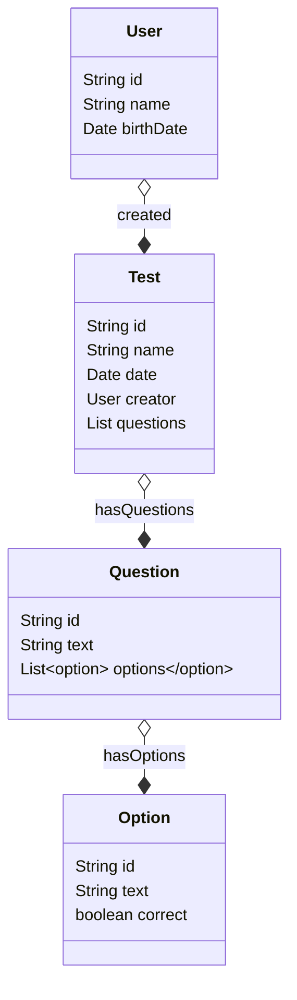
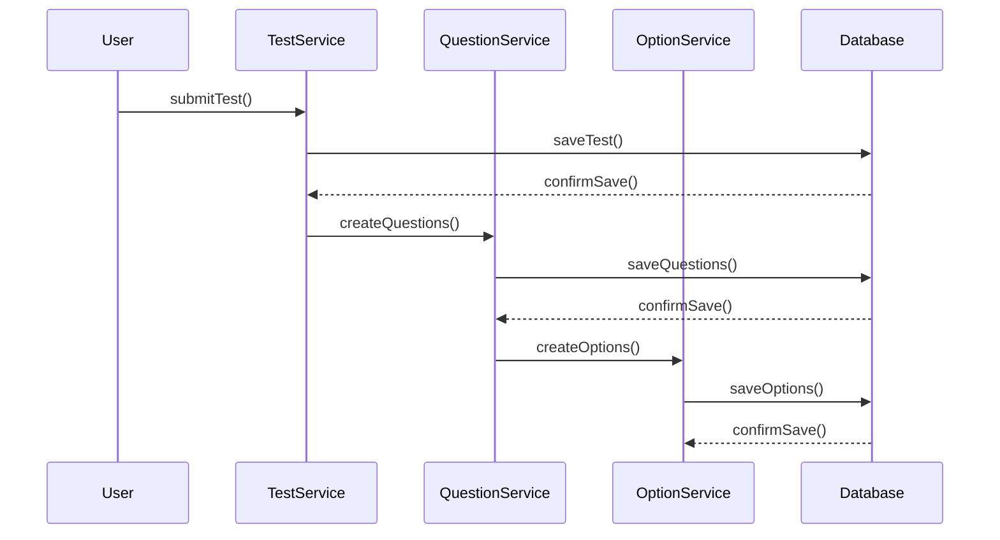

                 

### 第1章：评测系统概述

#### 1.1.1 问题背景

在数字化时代，评测系统作为衡量和评估各种性能指标、质量标准以及业务流程的重要工具，扮演着至关重要的角色。当前评测系统面临的主要问题包括数据准确性、处理效率、系统可靠性等。

首先，数据准确性是评测系统的核心要求。随着数据量的急剧增长，如何确保评测结果的可信度和准确性成为了一大挑战。其次，处理效率也是评测系统的关键问题，特别是在面对大规模数据处理任务时，如何提高系统的响应速度和处理能力，是一个重要的研究课题。最后，系统可靠性也是一个不容忽视的问题，评测系统的稳定性和可用性直接影响到业务连续性和用户体验。

#### 1.1.2 评测系统的定义与作用

评测系统是一种通过算法和模型对数据进行分析和评估的系统，其主要作用包括：

- 性能评估：对系统性能指标进行实时监控和评估，如响应时间、吞吐量等。
- 质量控制：评估产品质量，如软件测试、质量控制等。
- 业务优化：通过数据分析，为业务流程优化提供决策支持。

#### 1.1.3 评测系统的核心要素

一个完整的评测系统应具备以下几个核心要素：

- 数据处理能力：高效处理海量数据，确保评测结果的准确性和及时性。
- 可靠性：确保评测系统的稳定性和可用性，降低故障率和系统崩溃的风险。
- 性能优化：通过算法优化、硬件升级等手段提高系统处理速度和效率。

### 第2章：核心概念与联系

#### 2.1.1 云端部署的基础概念

云端部署是指将评测系统的各个组件部署在云计算平台上，以实现弹性、可扩展和高效管理的目标。主要涉及以下基础概念：

- IaaS（基础设施即服务）：提供虚拟化的计算资源，如虚拟机、存储等。
- PaaS（平台即服务）：提供开发和运行应用的云平台，如开发框架、中间件等。
- SaaS（软件即服务）：提供可直接使用的应用软件，如评测系统等。

#### 2.1.2 云计算技术的核心要素

云计算技术是实现云端部署的关键，其核心要素包括：

- 虚拟化技术：通过虚拟化技术将物理资源虚拟化为多个独立的环境，提高资源利用率和灵活性。
- 弹性伸缩：根据业务需求自动调整资源规模，实现负载均衡和高可用性。
- 分布式存储：通过分布式存储技术实现数据的高效存储和访问。

#### 2.1.3 云计算架构的设计原则

云计算架构的设计原则包括：

- 模块化：将系统拆分为多个模块，便于管理和维护。
- 扩展性：支持系统的水平扩展，以应对业务增长。
- 高可用性：通过冗余设计、故障转移等措施提高系统的可靠性。

### 第3章：评测系统架构设计

#### 3.1.1 评测系统架构设计原则

评测系统架构设计应遵循以下原则：

- 可扩展性：支持系统规模的动态调整，以适应业务需求变化。
- 可靠性：确保系统的稳定运行，降低故障率和数据丢失风险。
- 高效性：优化系统性能，提高处理速度和资源利用率。

#### 3.1.2 评测系统的领域模型

领域模型是评测系统架构设计的基础，通过Mermaid绘制领域模型类图，可以清晰地展示系统中的实体及其关系。

#### 3.1.3 评测系统的架构设计

评测系统的架构设计应充分考虑系统性能、可靠性和可维护性，通过Mermaid绘制系统架构图，可以直观地展示系统组件及其关系。

通过以上架构设计，评测系统可以高效、稳定地运行，满足业务需求。

----------------------------------------------------------------

接下来，我将按照大纲的要求，继续撰写后续章节的内容。请等待我完成整个文章的撰写。如果您有任何关于当前章节的建议或要求，请随时告知。

