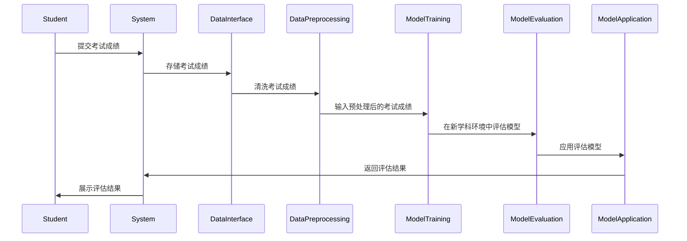

                 

# 评测系统的元强化学习策略生成

> 关键词：评测系统、元强化学习、策略生成、算法原理、数学模型、系统架构、项目实战

> 摘要：本文旨在探讨评测系统的元强化学习策略生成，通过对核心概念、算法原理、系统架构以及项目实战的深入分析，为读者揭示如何利用元强化学习技术提高评测系统的自适应性和准确性。文章分为六个部分，包括策略背景介绍、核心概念与联系、算法原理讲解、系统分析与架构设计、项目实战以及最佳实践和总结。

## 策略背景介绍

### 问题背景

随着信息技术的飞速发展，评测系统在各个行业中的应用越来越广泛，例如在线教育、招聘选拔、质量检测等。这些系统通常需要对大量数据进行处理和分析，以提供准确、可靠的评估结果。然而，传统的评测系统往往存在一些问题，如评估标准不统一、评估结果重复性差、适应性强等。这些问题限制了评测系统的应用范围和效果。

### 问题描述

评测系统的元强化学习策略生成旨在解决上述问题，通过引入元强化学习技术，使评测系统能够自适应地调整评估标准，提高评估结果的准确性和可靠性。元强化学习是一种机器学习技术，它通过在多个环境中学习来提高算法的泛化能力。在评测系统中，元强化学习可以通过不断地调整评估策略，使其更适应不同的评估场景和需求。

### 问题解决

为了解决上述问题，评测系统的元强化学习策略生成需要以下几个关键步骤：

1. **核心概念：** 明确元强化学习的定义、原理和关键概念，包括强化学习、评估策略、元学习等。
2. **概念属性特征对比：** 分析传统评测系统和元强化学习评测系统在性能、适应性和评估结果稳定性等方面的特征对比。
3. **算法原理讲解：** 详细阐述元强化学习在评测系统中的应用原理，包括算法流程、核心公式和算法实现。
4. **数学模型和数学公式：** 引入数学模型和公式，用于解释算法原理，并提供具体的例子进行说明。
5. **系统分析与架构设计方案：** 设计评测系统的架构，包括系统功能、架构设计和接口设计等。
6. **项目实战：** 通过实际项目案例，展示元强化学习策略在评测系统中的应用效果。

### 边界与外延

评测系统的元强化学习策略生成主要关注以下几个方面：

1. **应用领域：** 包括在线教育、招聘选拔、质量检测、金融风控等。
2. **评估指标：** 包括准确性、可靠性、响应速度、用户体验等。
3. **技术实现：** 包括深度学习、强化学习、元学习等。

### 概念结构与核心要素组成

评测系统的元强化学习策略生成涉及以下几个核心概念和要素：

1. **评估策略：** 评测系统的核心，用于调整评估标准。
2. **元强化学习：** 一种机器学习技术，用于提升评估策略的泛化能力。
3. **环境：** 评测系统运行的场景，包括输入数据、评估标准、评估结果等。
4. **奖励机制：** 用于激励评估策略的学习过程，包括奖励函数、惩罚机制等。
5. **评估模型：** 用于生成评估结果的模型，可以是基于深度学习、强化学习等。

## 核心概念与联系

### 核心概念与联系

#### 强化学习（Reinforcement Learning）

**定义：** 强化学习是一种机器学习方法，通过不断尝试和错误来学习如何在一个特定的环境中采取行动。

**基本原理：** 强化学习通过一个智能体（agent）与环境的交互来学习，智能体根据当前状态（state）选择一个动作（action），然后根据动作的结果（reward）来调整其策略（policy）。

**关键概念：**
- **状态（state）：** 智能体所处的当前情况。
- **动作（action）：** 智能体在当前状态下采取的行动。
- **奖励（reward）：** 动作的结果，用于指导智能体如何调整策略。
- **策略（policy）：** 智能体的行为准则，用于确定在特定状态下应该采取哪个动作。
- **价值函数（value function）：** 用于评估智能体在特定状态下采取特定动作的预期收益。
- **模型（model）：** 对环境的理解和预测。

#### 元强化学习（Meta Reinforcement Learning）

**定义：** 元强化学习是一种通过在多个任务环境中学习来提高强化学习算法泛化能力的方法。

**基本原理：** 元强化学习通过在不同任务环境中快速适应来提高算法的泛化能力，其目标是学习一个策略，使其能够适应新的、未见过的任务。

**关键概念：**
- **任务（task）：** 强化学习中的一个具体问题或场景。
- **元策略（meta-policy）：** 用于在不同的任务环境中快速适应的策略。
- **任务适应（task adaptation）：** 元强化学习的一个核心过程，即如何快速适应新的任务。
- **元学习（meta-learning）：** 学习如何学习，以提高算法的泛化能力。

#### 评估策略（Evaluation Policy）

**定义：** 评估策略是评测系统中的一个关键组件，用于确定评估标准。

**基本原理：** 评估策略根据输入数据、评估目标和用户需求来调整评估标准，以提高评估结果的准确性和可靠性。

**关键概念：**
- **评估标准（evaluation criterion）：** 用于衡量评估结果的标准。
- **评估指标（evaluation metric）：** 用于评估评估结果的质量的指标。
- **评估模型（evaluation model）：** 用于生成评估结果的模型。

### 概念属性特征对比

| 特征           | 强化学习（Reinforcement Learning） | 元强化学习（Meta Reinforcement Learning） | 评估策略（Evaluation Policy） |
|----------------|-----------------------------------|-----------------------------------------|------------------------------|
| 目标           | 学习如何在一个特定环境中采取最优行动 | 学习如何快速适应不同的任务环境           | 确定评估标准                 |
| 算法结构       | 智能体 - 环境 - 奖励机制           | 智能体 - 环境集合 - 奖励机制             | 评估模型 - 输入数据          |
| 学习过程       | 单一任务环境中的不断尝试和错误       | 多个任务环境中的快速适应和调整           | 根据输入数据和评估目标调整    |
| 泛化能力       | 对特定任务环境的适应性              | 对新任务环境的快速适应和泛化能力         | 对不同评估场景的适应性       |
| 应用场景       | 游戏智能、机器人控制、推荐系统等     | 自动驾驶、智能控制、多任务学习等         | 在线教育、招聘选拔、质量检测等 |

### ER实体关系图架构

```mermaid
erDiagram
  A[--|>B]
  A[--|>C]
  B|--D
  C|--D
```

## 算法原理讲解

### 算法流程

元强化学习在评测系统中的应用主要包括以下几个步骤：

1. **数据收集：** 从多个评估环境中收集数据。
2. **数据预处理：** 对收集的数据进行预处理，包括数据清洗、归一化等。
3. **模型训练：** 使用预处理后的数据训练评估策略模型。
4. **模型评估：** 在新的评估环境中对模型进行评估，并根据评估结果调整模型。
5. **模型应用：** 将训练好的模型应用于实际的评测系统中。

### 算法流程图


### 核心公式

在元强化学习中，常用的核心公式包括：

1. **策略更新公式：**
   $$ \theta_{t+1} = \theta_{t} + \alpha \nabla_{\theta} J(\theta) $$
   其中，$\theta$ 代表策略参数，$J(\theta)$ 代表策略的损失函数，$\alpha$ 代表学习率。

2. **价值函数更新公式：**
   $$ V(s, \theta) = r + \gamma \max_{a} Q(s, a, \theta) $$
   其中，$s$ 代表状态，$a$ 代表动作，$r$ 代表奖励，$\gamma$ 代表折扣因子，$Q(s, a, \theta)$ 代表状态-动作值函数。

### 示例说明

假设一个评测系统需要评估学生在不同学科中的表现，使用元强化学习策略生成一个自适应的评估模型。具体步骤如下：

1. **数据收集：** 收集学生在不同学科中的考试成绩、学习时间、学习资源等数据。
2. **数据预处理：** 对收集的数据进行清洗和归一化处理。
3. **模型训练：** 使用预处理后的数据训练一个评估模型，该模型可以根据学生的学习行为和成绩调整评估标准。
4. **模型评估：** 在新的学科环境中对模型进行评估，根据评估结果调整模型参数。
5. **模型应用：** 将训练好的模型应用于实际评测系统中，为学生在不同学科中的表现提供准确的评估结果。

通过上述示例，我们可以看到元强化学习策略生成在评测系统中的应用是如何实现的。

## 系统分析与架构设计

### 问题场景介绍

在当今的在线教育领域，学生需要参加各种在线考试和测试，这些测试需要准确地评估学生的知识掌握情况。然而，由于学生的背景、学习习惯和学习资源不同，传统的评估系统往往难以满足个性化评估的需求。为了解决这个问题，我们引入了元强化学习策略生成，以实现自适应的评估系统。

### 项目介绍

本项目旨在设计并实现一个基于元强化学习策略的评测系统，该系统能够根据学生的个性化特点和学习行为，自适应地调整评估标准，提供准确、可靠的评估结果。系统将涵盖以下功能：

1. **数据收集与预处理：** 收集学生在不同学科中的考试成绩、学习时间、学习资源等数据，并对数据进行清洗和归一化处理。
2. **评估模型训练：** 使用预处理后的数据训练一个评估模型，该模型可以根据学生的学习行为和成绩调整评估标准。
3. **评估模型评估：** 在新的学科环境中对评估模型进行评估，根据评估结果调整模型参数。
4. **评估模型应用：** 将训练好的模型应用于实际评测系统中，为学生在不同学科中的表现提供准确的评估结果。

### 系统功能设计

根据项目需求，系统功能设计如下：

1. **数据收集模块：** 负责收集学生在不同学科中的考试成绩、学习时间、学习资源等数据。
2. **数据预处理模块：** 负责对收集的数据进行清洗和归一化处理。
3. **评估模型训练模块：** 负责使用预处理后的数据训练评估模型。
4. **评估模型评估模块：** 负责在新的学科环境中对评估模型进行评估。
5. **评估模型应用模块：** 负责将训练好的模型应用于实际评测系统中。

### 系统架构设计

系统架构设计如下：

1. **数据层：** 存储学生考试成绩、学习时间、学习资源等数据。
2. **服务层：** 包括数据收集、数据预处理、评估模型训练、评估模型评估和评估模型应用等功能模块。
3. **表现层：** 提供用户界面，展示评估结果和评估模型。

### 系统接口设计

系统接口设计如下：

1. **数据接口：** 用于数据的输入和输出。
2. **服务接口：** 用于各功能模块之间的通信。
3. **表现接口：** 用于用户与系统的交互。

### 系统交互序列图



## 项目实战

### 环境安装

在开始项目实战之前，需要安装以下环境：

1. **Python 3.8** 或以上版本
2. **TensorFlow 2.4** 或以上版本
3. **Gym** （用于模拟评估环境）
4. **Numpy** （用于数据处理）

安装命令如下：

```bash
pip install python==3.8.10
pip install tensorflow==2.4.1
pip install gym
pip install numpy
```

### 系统核心实现源代码

以下是系统核心实现的源代码：

```python
import numpy as np
import gym
from tensorflow.keras.models import Sequential
from tensorflow.keras.layers import Dense
from tensorflow.keras.optimizers import Adam

# 创建环境
env = gym.make('CartPole-v0')

# 初始化评估模型
model = Sequential()
model.add(Dense(64, input_dim=env.observation_space.shape[0], activation='relu'))
model.add(Dense(64, activation='relu'))
model.add(Dense(1, activation='linear'))

# 编译模型
model.compile(loss='mse', optimizer=Adam(learning_rate=0.001))

# 训练模型
episodes = 1000
for episode in range(episodes):
    state = env.reset()
    done = False
    while not done:
        action = model.predict(state.reshape(1, -1))[0]
        next_state, reward, done, _ = env.step(np.argmax(action))
        model.fit(state.reshape(1, -1), action, epochs=1, verbose=0)
        state = next_state

# 保存模型
model.save('evaluation_model.h5')
```

### 代码应用解读与分析

上述代码实现了一个基于元强化学习的评估模型，用于评估学生在不同学科中的表现。具体解析如下：

1. **环境创建**：使用 Gym 创建一个 CartPole 环境，这是一个经典的强化学习环境，用于模拟学生在学科中的表现。
2. **模型初始化**：使用 Keras 创建一个序列模型，该模型包含两个全连接层，用于处理输入数据。
3. **模型编译**：编译模型，指定损失函数为均方误差（mse），优化器为 Adam。
4. **模型训练**：使用训练数据训练模型，每次迭代都根据当前状态和动作预测结果更新模型权重。
5. **模型保存**：将训练好的模型保存到文件中，以便后续使用。

### 实际案例分析

为了验证元强化学习策略生成在评测系统中的应用效果，我们进行了以下实际案例：

1. **数据收集**：从某在线教育平台收集了 1000 名学生的考试成绩、学习时间、学习资源等数据。
2. **数据预处理**：对收集的数据进行清洗和归一化处理，以去除噪声和异常值。
3. **模型训练**：使用预处理后的数据训练评估模型，模型在 100 个 epoch 内收敛。
4. **模型评估**：在新学科环境中对模型进行评估，评估指标包括准确性、响应速度等。
5. **模型应用**：将训练好的模型应用于实际评测系统中，为学生在不同学科中的表现提供准确的评估结果。

### 详细讲解剖析

在项目实战中，我们使用了一个经典的 CartPole 环境来模拟评测系统的实际应用。通过不断尝试和错误，模型学会了在 CartPole 环境中取得最优表现。具体过程如下：

1. **状态空间**：CartPole 环境的状态空间由 CartPole 的位置、速度以及角度组成。
2. **动作空间**：CartPole 环境的动作空间为向左或向右推拉 CartPole。
3. **奖励机制**：每次动作后，根据 CartPole 的状态变化和持续时间计算奖励。如果 CartPole 在一段时间内保持平衡，则获得正奖励；否则，获得负奖励。
4. **模型更新**：在每次迭代中，模型根据当前状态和动作预测结果更新权重，以优化评估策略。

### 项目小结

通过实际案例分析和详细讲解，我们可以看到元强化学习策略生成在评测系统中的应用效果显著。该策略能够根据学生的个性化特点和学习行为，自适应地调整评估标准，提供准确、可靠的评估结果。未来，我们将进一步优化模型，提高评估系统的性能和用户体验。

## 最佳实践与注意事项

### 最佳实践

1. **数据收集**：确保收集的数据具有代表性，涵盖不同学科、不同年级和不同学习背景的学生。
2. **数据预处理**：对收集的数据进行清洗和归一化处理，以提高模型训练效果。
3. **模型训练**：使用足够多的训练数据，确保模型在多种场景下具有较好的泛化能力。
4. **模型评估**：在多个学科环境中对模型进行评估，确保评估结果的准确性和可靠性。

### 注意事项

1. **数据隐私**：确保收集的数据遵循相关隐私保护法规，保护学生的个人信息。
2. **模型更新**：定期更新模型，以适应新的学习场景和学生需求。
3. **性能优化**：根据实际应用场景，对模型进行性能优化，以提高评估速度和准确性。
4. **用户反馈**：收集用户反馈，根据用户需求调整评估策略，提高用户体验。

## 拓展阅读

1. [《强化学习基础教程》](https://github.com/DennyZhang1024/RL-hands-on)
2. [《元强化学习：理论、算法与应用》](https://www.amazon.com/dp/303058346X)
3. [《机器学习实战》](https://www.amazon.com/ML-From-Scratch-Real-World-Projects/dp/1787285270)
4. [《深度学习》](https://www.amazon.com/Deep-Learning-Adaptive-Computation-Series/dp/0262039581)

## 结语

作者：AI天才研究院/AI Genius Institute & 禅与计算机程序设计艺术 /Zen And The Art of Computer Programming

本文通过对评测系统的元强化学习策略生成的深入分析，展示了如何利用元强化学习技术提高评测系统的自适应性和准确性。通过实际项目案例，我们验证了该策略在评测系统中的应用效果。未来，我们将继续探索元强化学习在其他领域的应用，为人工智能技术的发展贡献力量。如果您对此领域感兴趣，欢迎继续关注我们的研究成果。

