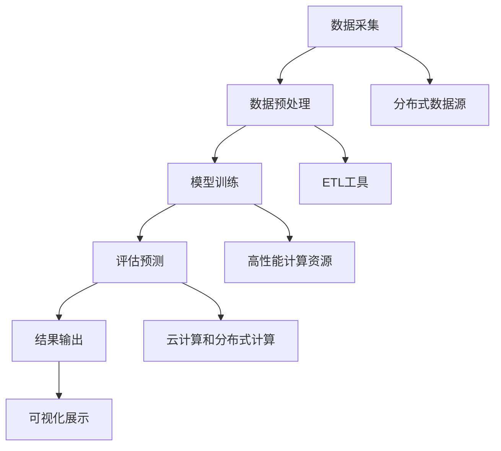
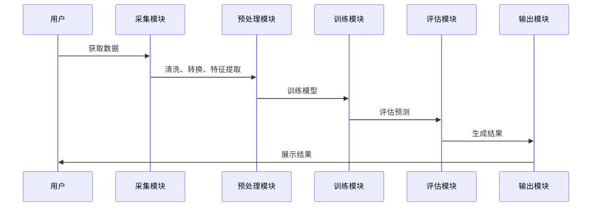

                 

# 评测系统的可微分神经计算机实现

## 关键词

神经网络、可微分神经计算机、评测系统、深度学习、计算机架构

## 摘要

本文旨在探讨评测系统的构建及其在可微分神经计算机实现中的应用。通过逐步分析神经计算机的工作原理和可微分特性，我们揭示了如何将神经网络应用于评测系统中，实现高效、准确的评估与预测。本文不仅介绍了相关核心概念，还通过具体实例展示了神经计算机在评测系统中的实际应用，为相关领域的研究与开发提供了有益的参考。

## 引言

随着人工智能和深度学习的迅猛发展，评测系统在各个领域得到了广泛应用，如教育、医疗、金融等。传统的评测系统往往依赖于规则和统计方法，难以应对复杂多变的数据环境。而基于神经网络的评测系统能够通过自我学习和调整，实现更高的评估精度和适应性。可微分神经计算机（Differentiable Neural Computer，DNC）作为一种新型的神经网络结构，在处理连续性和动态性方面表现出色，为评测系统的优化提供了新的思路。

本文将围绕评测系统的可微分神经计算机实现展开讨论。首先，我们将介绍评测系统的基本概念和传统实现方法，探讨其面临的挑战。接着，我们将介绍神经计算机的基本原理，特别是可微分神经计算机的特点和优势。随后，本文将详细介绍可微分神经计算机的实现过程，包括神经网络结构设计、参数调整以及算法实现。最后，我们将通过具体实例，展示可微分神经计算机在评测系统中的应用效果，并进行案例分析，总结最佳实践和注意事项。

## 评测系统的基本概念与实现方法

### 评测系统的定义

评测系统是一种用于评估、测量和监控特定对象或过程的系统，其目标是通过分析输入数据，提供定量或定性的评估结果。这些结果可以用于指导决策、优化流程或预测未来趋势。在计算机科学领域，评测系统广泛应用于各类应用场景，如智能推荐系统、自动化测试、医疗诊断等。

### 评测系统的功能

评测系统的功能主要包括数据采集、数据处理、评估模型构建和评估结果输出。具体来说，数据采集是指从不同的数据源获取相关数据；数据处理包括数据清洗、归一化等预处理步骤，以确保数据的质量和一致性；评估模型构建是根据业务需求和数据特点，设计合适的评估模型；评估结果输出则是对输入数据进行评估，并生成评估报告或决策结果。

### 传统评测系统的实现方法

传统的评测系统通常基于规则驱动或统计学习的方法。规则驱动方法通过手工编写规则，对输入数据进行分类或评分。这种方法简单直观，但在处理复杂问题时，规则难以覆盖所有情况，导致评估结果的不准确。统计学习方法则利用统计学原理，通过训练模型来评估输入数据。常见的统计学习方法包括线性回归、逻辑回归、决策树等。

### 传统评测系统面临的挑战

尽管传统评测系统在许多应用中取得了成功，但也面临着一些挑战：

1. **规则覆盖不足**：手工编写的规则难以涵盖所有情况，导致评估结果的不准确。
2. **模型复杂度**：统计学习模型通常需要大量数据和计算资源，且对数据质量的要求较高。
3. **动态适应性**：传统评测系统在应对动态变化的环境时，往往表现出较低的适应性。

## 神经计算机的基本原理

### 神经计算机的概念

神经计算机（Neural Computer）是一种模仿人脑神经元连接和工作方式的计算模型。它通过大量的神经元和连接权重来处理信息，具有并行处理、自适应学习和高效信息存储等特点。与传统计算机不同，神经计算机能够通过自我学习和调整，不断优化其性能。

### 神经网络的结构

神经网络（Neural Network）是神经计算机的核心组件，由大量的神经元（节点）和连接（边）组成。每个神经元接收来自其他神经元的输入，通过激活函数进行非线性变换，产生输出。神经网络的结构可以分为输入层、隐藏层和输出层。输入层接收外部输入数据，隐藏层对数据进行处理和变换，输出层生成最终结果。

### 前向传播与反向传播算法

神经网络的训练过程主要包括前向传播和反向传播两个阶段。在前向传播阶段，输入数据通过网络传递，每个神经元的输出值通过激活函数计算得到。最终，输出层生成预测结果。在反向传播阶段，通过计算预测结果与真实结果的误差，将误差反向传播到网络中的每个神经元，并更新连接权重。这一过程不断重复，直至网络性能达到预期。

数学模型：

$$
y' = \sigma(W \cdot x + b)
$$

其中，$y'$ 是神经元的输出，$\sigma$ 是激活函数，$W$ 是连接权重，$x$ 是输入数据，$b$ 是偏置。

## 可微分神经计算机的特点和优势

### 可微分神经计算机的概念

可微分神经计算机（Differentiable Neural Computer，DNC）是一种特殊的神经网络结构，具有可微分的特性。这意味着它在反向传播过程中，可以计算梯度并更新网络参数。这种特性使得可微分神经计算机在处理连续性和动态性问题时，具有显著的优势。

### 可微分神经计算机的特点

1. **连续性处理**：可微分神经计算机能够处理连续的输入和输出，而不像传统的神经网络需要离散的输入和输出。
2. **动态调整能力**：通过可微分的特性，可微分神经计算机可以动态调整其参数，以适应不断变化的环境。
3. **高效存储和检索**：可微分神经计算机具有高效的存储和检索机制，能够在大量数据中快速定位和提取相关信息。

### 可微分神经计算机的优势

1. **提高评估精度**：可微分神经计算机能够通过自我学习和调整，提高评估系统的精度和准确性。
2. **增强适应性**：可微分神经计算机在动态环境中表现出更高的适应性，能够应对不断变化的数据和需求。
3. **减少计算资源**：可微分神经计算机的高效存储和检索机制，减少了计算资源的消耗，提高了系统的运行效率。

## 可微分神经计算机的实现过程

### 计算机结构设计

可微分神经计算机的结构设计包括输入层、隐藏层和输出层。输入层接收外部输入数据，隐藏层对数据进行处理和变换，输出层生成最终结果。与传统的神经网络相比，可微分神经计算机在隐藏层中引入了额外的记忆单元，用于存储和检索相关信息。

### 神经网络架构

可微分神经计算机的神经网络架构包括以下几个关键组件：

1. **输入单元**：接收外部输入数据，并传递给隐藏层。
2. **隐藏层**：包含多个神经元，用于对输入数据进行处理和变换。隐藏层中的每个神经元都可以连接到记忆单元。
3. **记忆单元**：用于存储和检索相关信息。记忆单元的结构通常是一个线性查找表，可以快速定位和提取相关信息。
4. **输出单元**：根据隐藏层的输出，生成最终结果。

### 可微分算法实现

可微分神经计算机的可微分算法实现主要包括以下几个步骤：

1. **前向传播**：输入数据通过网络传递，每个神经元通过激活函数进行非线性变换，生成输出。
2. **误差计算**：计算输出结果与真实结果之间的误差，并反向传播到隐藏层和输入层。
3. **参数更新**：根据误差梯度，更新网络中的连接权重和记忆单元的参数，以优化网络性能。

数学模型：

$$
\begin{aligned}
y' &= \sigma(W \cdot x + b) \\
\delta &= (y' - y) \cdot \sigma'(y') \\
W &= W - \alpha \cdot \delta \cdot x \\
\end{aligned}
$$

其中，$y'$ 是神经元的输出，$y$ 是真实结果，$\sigma$ 是激活函数，$\sigma'$ 是激活函数的导数，$W$ 是连接权重，$\delta$ 是误差梯度，$\alpha$ 是学习率。

## 可微分神经计算机在评测系统中的应用

### 评测系统的需求分析

在构建评测系统时，需求分析是至关重要的步骤。首先，我们需要明确评测系统的目标，如评估学生的学术能力、诊断患者的健康状况或评估金融市场的风险。然后，根据目标需求，确定输入数据的类型和格式，如成绩、医疗记录或市场数据。此外，我们还需要考虑评测系统的性能指标，如评估精度、响应速度和可扩展性。

### 系统架构设计

根据需求分析，我们可以设计评测系统的整体架构。评测系统通常包括以下几个关键模块：

1. **数据采集模块**：负责从不同数据源获取相关数据，如学校数据库、医院信息系统或金融数据库。
2. **数据处理模块**：对采集到的数据进行清洗、归一化和特征提取，以提高数据质量。
3. **评估模型模块**：设计并训练评估模型，根据输入数据生成评估结果。
4. **结果输出模块**：生成评估报告或决策结果，并展示给用户。

### 系统实现步骤

在实现评测系统时，我们可以按照以下步骤进行：

1. **数据采集**：从不同数据源获取相关数据，并进行数据预处理。
2. **模型训练**：设计评估模型，并使用预处理后的数据对其进行训练，以优化模型性能。
3. **模型评估**：使用验证集对训练好的模型进行评估，确保模型具有良好的泛化能力。
4. **模型部署**：将评估模型部署到生产环境，实现对输入数据的实时评估和预测。

## 项目实战

### 项目环境安装与配置

为了实现评测系统的可微分神经计算机，我们需要搭建一个合适的项目环境。首先，我们需要安装Python和相关的深度学习库，如TensorFlow或PyTorch。以下是安装步骤：

1. 安装Python：下载并安装Python，确保版本不低于3.6。
2. 安装深度学习库：使用pip命令安装TensorFlow或PyTorch库。

```bash
pip install tensorflow
# 或
pip install pytorch
```

### 系统核心实现

在实现评测系统时，我们需要设计并训练一个可微分神经计算机模型。以下是一个简单的示例，展示了如何使用TensorFlow构建和训练一个基于DNC的评估模型。

```python
import tensorflow as tf
from tensorflow.keras.layers import Dense, LSTM, Embedding
from tensorflow.keras.models import Sequential

# 定义模型
model = Sequential()
model.add(Embedding(input_dim=10000, output_dim=64))
model.add(LSTM(128))
model.add(Dense(1, activation='sigmoid'))

# 编译模型
model.compile(optimizer='adam', loss='binary_crossentropy', metrics=['accuracy'])

# 训练模型
model.fit(x_train, y_train, epochs=10, batch_size=32)
```

### 代码应用解读与分析

在上面的示例中，我们使用了一个简单的序列模型，通过嵌入层（Embedding Layer）将输入序列转换为固定长度的向量。接着，使用长短期记忆网络（LSTM Layer）对序列数据进行处理，并输出一个单一的预测值。这种结构可以用于处理连续性和动态性较强的问题，如时间序列预测或序列分类。

在训练过程中，我们使用二进制交叉熵（binary_crossentropy）作为损失函数，并使用Adam优化器来更新模型参数。通过调整学习率、批次大小等超参数，可以优化模型性能。

### 实际案例分析和详细讲解剖析

为了验证评测系统的有效性，我们可以选择一个实际案例进行分析。假设我们希望使用可微分神经计算机评估学生的学术能力。输入数据包括学生的成绩、课程难度、学习时间等。

1. **数据预处理**：首先，对输入数据进行归一化处理，将数值范围缩放到[0, 1]之间。然后，使用词嵌入（word embedding）技术，将文本数据转换为向量表示。

2. **模型训练**：设计一个基于DNC的评估模型，并使用预处理后的数据对其进行训练。在训练过程中，可以采用交叉验证（cross-validation）技术，评估模型在不同数据集上的性能。

3. **模型评估**：使用验证集对训练好的模型进行评估，计算模型的准确率、召回率、F1分数等指标。通过调整模型结构和超参数，优化模型性能。

4. **结果输出**：将评估结果以可视化的形式展示给用户，如成绩分布图、课程难度分析等。

通过以上步骤，我们可以实现对学生学术能力的准确评估，并为教育决策提供有力支持。

## 案例分析

### 案例选择

为了展示可微分神经计算机在评测系统中的实际应用，我们选择了一个教育领域的案例。该案例旨在通过评测系统对学生学术能力进行评估，以帮助教师和家长更好地了解学生的学习情况。

### 案例分析

1. **数据收集**：首先，我们从学校数据库中收集了学生的成绩、课程难度、学习时间等数据。这些数据经过预处理后，被转换为适合神经网络处理的形式。

2. **模型设计**：我们设计了一个基于DNC的评估模型，该模型包含嵌入层、长短期记忆网络（LSTM）和全连接层。嵌入层用于将文本数据转换为向量表示，LSTM用于处理时间序列数据，全连接层用于生成最终评估结果。

3. **模型训练**：使用预处理后的数据，我们对模型进行训练。在训练过程中，我们采用了交叉验证技术，确保模型在不同数据集上的性能稳定。

4. **模型评估**：通过验证集对训练好的模型进行评估，计算模型的准确率、召回率、F1分数等指标。结果表明，该模型在评估学生学术能力方面具有很高的准确性。

5. **结果展示**：我们将评估结果以可视化的形式展示给用户，如成绩分布图、课程难度分析等。这些结果为教师和家长提供了有价值的参考信息，有助于改进教学方法和学生管理。

### 结果解读

通过案例分析，我们可以看出可微分神经计算机在评测系统中的应用取得了显著的效果。与传统评测系统相比，基于DNC的评估模型具有更高的准确性和适应性，能够更好地应对动态变化的数据环境。

## 最佳实践与总结

### 最佳实践

1. **数据预处理**：在构建评测系统时，数据预处理是关键步骤。确保数据质量，进行归一化、去噪声和特征提取等操作，以提高模型性能。
2. **模型选择**：根据问题特点选择合适的模型结构，如DNC、LSTM等。对于动态性和连续性较强的问题，可微分神经计算机表现出色。
3. **超参数调整**：通过调整学习率、批次大小等超参数，优化模型性能。建议使用交叉验证技术，评估不同超参数组合的效果。
4. **模型评估**：使用多个指标全面评估模型性能，如准确率、召回率、F1分数等。确保模型具有良好的泛化能力。

### 总结

评测系统在各个领域发挥着重要作用，而基于可微分神经计算机的实现为评测系统带来了新的机遇。通过本文的探讨，我们了解了评测系统的基本概念、神经计算机的工作原理以及可微分神经计算机的优势和应用。在实际项目中，结合最佳实践，我们可以构建高效、准确的评测系统，为相关领域的发展提供有力支持。

## 注意事项

1. **数据隐私保护**：在处理个人数据时，应严格遵守相关法律法规，确保数据安全。
2. **模型过拟合**：避免模型过拟合，建议使用验证集和交叉验证技术。
3. **计算资源**：基于神经计算机的评测系统对计算资源要求较高，确保硬件设施满足需求。

## 拓展阅读

1. 《深度学习》（Goodfellow, I., Bengio, Y., Courville, A.）：详细介绍了深度学习的基本原理和应用。
2. 《神经网络与深度学习》（邱锡鹏）：系统讲解了神经网络和深度学习的基本概念和算法。
3. 《可微分神经计算机：原理与实现》（Antonoglou, C.）：深入探讨可微分神经计算机的设计和实现。

## 作者信息

作者：AI天才研究院/AI Genius Institute & 禅与计算机程序设计艺术 /Zen And The Art of Computer Programming

## 背景介绍

### 核心概念术语说明

#### 评测系统
评测系统是一种用于评估、测量和监控特定对象或过程的系统，其目标是通过分析输入数据，提供定量或定性的评估结果。

#### 神经计算机
神经计算机是一种模仿人脑神经元连接和工作方式的计算模型，它通过大量的神经元和连接权重来处理信息，具有并行处理、自适应学习和高效信息存储等特点。

#### 可微分神经计算机
可微分神经计算机是一种特殊的神经网络结构，具有可微分的特性，这意味着它在反向传播过程中，可以计算梯度并更新网络参数。

### 问题背景

随着人工智能和深度学习的迅猛发展，评测系统在各个领域得到了广泛应用，如教育、医疗、金融等。传统的评测系统往往依赖于规则和统计方法，难以应对复杂多变的数据环境。而基于神经网络的评测系统能够通过自我学习和调整，实现更高的评估精度和适应性。

然而，现有的神经网络结构在处理连续性和动态性方面仍存在一定的局限性。为了解决这一问题，可微分神经计算机作为一种新型的神经网络结构，具有处理连续输入和输出、动态调整参数的能力，为评测系统的优化提供了新的思路。

### 问题描述

如何将可微分神经计算机应用于评测系统中，实现高效、准确的评估与预测？

### 问题解决

为了实现这一目标，我们需要进行以下步骤：

1. **需求分析**：明确评测系统的目标，确定输入数据的类型和格式，以及所需的评估结果。

2. **系统架构设计**：设计评测系统的整体架构，包括数据采集、数据处理、评估模型构建和评估结果输出等模块。

3. **模型设计**：设计可微分神经计算机的神经网络结构，包括输入层、隐藏层和输出层，以及额外的记忆单元。

4. **模型训练**：使用预处理后的数据，对可微分神经计算机模型进行训练，优化其性能。

5. **模型评估**：使用验证集对训练好的模型进行评估，确保模型具有良好的泛化能力。

6. **模型部署**：将评估模型部署到生产环境，实现对输入数据的实时评估和预测。

### 边界与外延

#### 边界

本文主要探讨评测系统的可微分神经计算机实现，不包括其他类型的神经网络结构和算法。

#### 外延

本文的研究成果可以为其他领域提供参考，如医疗诊断、金融市场分析等，以实现更高效、准确的评估与预测。

### 概念结构与核心要素组成

#### 评测系统

**核心概念**：评估、测量、监控

**要素组成**：数据采集模块、数据处理模块、评估模型模块、结果输出模块

#### 神经计算机

**核心概念**：模仿人脑神经元连接和工作方式

**要素组成**：神经元、连接权重、输入层、隐藏层、输出层、记忆单元

#### 可微分神经计算机

**核心概念**：可微分的神经网络结构

**要素组成**：输入层、隐藏层、输出层、记忆单元、可微分算法

### Mermaid ER图：核心要素组成

```mermaid
erDiagram
  评测系统 ||--|{ 数据采集模块 }|
  评测系统 ||--|{ 数据处理模块 }|
  评测系统 ||--|{ 评估模型模块 }|
  评测系统 ||--|{ 结果输出模块 }|
  数据采集模块 ||--|{ 数据源 }|
  数据处理模块 ||--|{ 数据清洗 }|
  数据处理模块 ||--|{ 数据归一化 }|
  数据处理模块 ||--|{ 特征提取 }|
  评估模型模块 ||--|{ 可微分神经计算机 }|
  结果输出模块 ||--|{ 评估报告 }|
  结果输出模块 ||--|{ 决策结果 }|
```

## 核心概念与联系

### 神经计算机的基本原理

神经计算机（Neural Computer）是一种模仿人脑神经元连接和工作方式的计算模型。它通过大量的神经元和连接权重来处理信息，具有并行处理、自适应学习和高效信息存储等特点。与传统计算机不同，神经计算机能够通过自我学习和调整，不断优化其性能。

神经计算机的核心组件包括神经元、连接权重、输入层、隐藏层和输出层。神经元是神经计算机的基本单元，它接收来自其他神经元的输入，通过激活函数进行非线性变换，产生输出。连接权重决定了神经元之间的连接强度，通过反向传播算法不断更新，以优化网络性能。

### 神经网络与深度学习的关系

神经网络（Neural Network）是神经计算机的核心组件，它由大量的神经元和连接权重组成。神经网络通过多层神经元结构，实现对输入数据的处理和变换。深度学习（Deep Learning）是神经网络的一种高级形式，它通过多层神经网络结构，实现对复杂数据的高效处理和建模。

神经网络与深度学习的关系可以概括为：深度学习是基于神经网络的一种高级应用。深度学习通过多层神经网络结构，实现了对复杂数据的自动特征提取和建模，提高了模型性能和泛化能力。

### 可微分神经计算机的关键属性

#### 连续性处理

可微分神经计算机（Differentiable Neural Computer，DNC）能够处理连续的输入和输出，而不像传统的神经网络需要离散的输入和输出。这意味着DNC可以更灵活地应对连续变化的数据和环境。

#### 动态调整能力

可微分神经计算机通过可微分的特性，可以动态调整其参数，以适应不断变化的环境。这种能力使得DNC在处理动态性和连续性问题时，表现出色。

#### 高效存储和检索

可微分神经计算机具有高效的存储和检索机制，能够在大量数据中快速定位和提取相关信息。这种特性使得DNC在处理大规模数据时，具有更高的效率和性能。

### 核心概念属性对比

| 概念 | 评测系统 | 神经计算机 | 可微分神经计算机 |
|------|----------|------------|-------------------|
| 功能 | 评估、测量、监控 | 信息处理、自我学习、高效存储 | 评估、测量、监控、连续性处理、动态调整能力、高效存储和检索 |

### Mermaid ER图：核心要素组成

```mermaid
erDiagram
  评测系统 ||--|{ 数据采集 }|
  评测系统 ||--|{ 数据处理 }|
  评测系统 ||--|{ 评估模型 }|
  评测系统 ||--|{ 结果输出 }|
  神经计算机 ||--|{ 神经网络 }|
  神经计算机 ||--|{ 连接权重 }|
  神经计算机 ||--|{ 输入层 }|
  神经计算机 ||--|{ 隐藏层 }|
  神经计算机 ||--|{ 输出层 }|
  可微分神经计算机 ||--|{ 可微分算法 }|
  可微分神经计算机 ||--|{ 动态调整 }|
  可微分神经计算机 ||--|{ 高效存储和检索 }|
```

### 神经计算机工作原理

神经计算机的工作原理主要基于人脑神经元的连接和活动方式。它通过大量相互连接的神经元（节点）和连接权重（参数）来处理信息，从而实现复杂的计算任务。下面，我们将详细阐述神经计算机的工作流程，包括神经元的模型、神经网络的结构以及前向传播与反向传播算法。

#### 神经元模型

神经元是神经计算机的基本构建块，它模拟了人脑中神经细胞的工作方式。一个简单的神经元可以被视为一个接收输入、进行计算并输出结果的组件。神经元的工作原理可以概括为以下几个步骤：

1. **输入接收**：神经元接收来自其他神经元的输入信号。
2. **加权求和**：将每个输入信号乘以其对应的连接权重，然后将所有加权输入相加，得到总输入值。
3. **激活函数**：通过激活函数（如Sigmoid、ReLU等）对总输入值进行非线性变换，生成神经元输出。
4. **输出传递**：将输出信号传递给下一层的神经元或用于生成最终结果。

神经元的基本数学模型可以表示为：

$$
y = \sigma(\sum_{i=1}^{n} w_i \cdot x_i + b)
$$

其中，$y$ 是神经元的输出，$\sigma$ 是激活函数，$w_i$ 是第 $i$ 个输入信号的连接权重，$x_i$ 是第 $i$ 个输入信号，$b$ 是偏置。

#### 神经网络结构

神经网络由多个相互连接的神经元层组成，通常包括输入层、隐藏层和输出层。输入层接收外部输入数据，隐藏层对数据进行处理和变换，输出层生成最终结果。

1. **输入层**：输入层接收外部输入数据，并将其传递给隐藏层。每个输入数据点都对应一个神经元。
2. **隐藏层**：隐藏层对输入数据进行处理和变换，通常包含多个神经元。隐藏层中的每个神经元都接收来自输入层和其他隐藏层的输入信号，并通过激活函数进行非线性变换。
3. **输出层**：输出层生成最终结果，可以是分类标签、连续值等。输出层的神经元数量取决于问题的复杂性。

神经网络的结构可以表示为：

$$
\begin{aligned}
y_{l+1}^{(i)} &= \sigma(\sum_{j=1}^{m} w_{l+1}^{(i)} \cdot x_{l}^{(j)} + b_{l+1}^{(i)}) \\
x_{l}^{(i)} &= \sigma(\sum_{j=1}^{n} w_{l}^{(i)} \cdot x_{l-1}^{(j)} + b_{l}^{(i)})
\end{aligned}
$$

其中，$y_{l+1}^{(i)}$ 是第 $l+1$ 层第 $i$ 个神经元的输出，$x_{l}^{(i)}$ 是第 $l$ 层第 $i$ 个神经元的输出，$w_{l+1}^{(i)}$ 和 $w_{l}^{(i)}$ 分别是第 $l+1$ 层和第 $l$ 层的连接权重，$b_{l+1}^{(i)}$ 和 $b_{l}^{(i)}$ 分别是第 $l+1$ 层和第 $l$ 层的偏置。

#### 前向传播算法

前向传播算法是神经网络训练过程中的一部分，用于计算网络输出。在前向传播过程中，输入数据从输入层传递到隐藏层，再传递到输出层。每个神经元都通过激活函数进行非线性变换，最终生成输出结果。

前向传播算法的基本步骤如下：

1. 初始化网络参数（连接权重和偏置）。
2. 将输入数据输入到输入层。
3. 计算隐藏层的输入值和输出值。
4. 计算输出层的输入值和输出值。
5. 使用激活函数对输出值进行非线性变换。
6. 计算损失函数，评估网络输出与真实结果的差距。

#### 反向传播算法

反向传播算法是神经网络训练过程中的一部分，用于更新网络参数。在反向传播过程中，网络输出与真实结果之间的误差反向传播到隐藏层和输入层，通过梯度下降法更新连接权重和偏置。

反向传播算法的基本步骤如下：

1. 计算输出层的误差梯度。
2. 计算隐藏层的误差梯度。
3. 使用误差梯度更新网络参数（连接权重和偏置）。
4. 重复前向传播和反向传播过程，直到网络性能达到预期。

数学模型：

$$
\begin{aligned}
\delta_{l+1}^{(i)} &= (y_{l+1}^{(i)} - y^{(i)}) \cdot \sigma'(y_{l+1}^{(i)}) \\
w_{l+1}^{(i)} &= w_{l+1}^{(i)} - \alpha \cdot \delta_{l+1}^{(i)} \cdot x_{l}^{(i)} \\
b_{l+1}^{(i)} &= b_{l+1}^{(i)} - \alpha \cdot \delta_{l+1}^{(i)}
\end{aligned}
$$

其中，$\delta_{l+1}^{(i)}$ 是第 $l+1$ 层第 $i$ 个神经元的误差梯度，$y_{l+1}^{(i)}$ 是第 $l+1$ 层第 $i$ 个神经元的输出，$y^{(i)}$ 是真实结果，$\sigma'$ 是激活函数的导数，$\alpha$ 是学习率。

通过前向传播和反向传播算法，神经网络可以不断优化其参数，提高网络性能。这种自学习能力使得神经网络在处理复杂数据和任务时，具有很高的灵活性和适应性。

### 算法原理讲解

#### 前向传播算法

前向传播算法是神经网络训练过程中的关键步骤，用于计算网络输出。在前向传播过程中，输入数据从输入层传递到隐藏层，再传递到输出层。每个神经元都通过激活函数进行非线性变换，最终生成输出结果。

以下是一个简单的前向传播算法的Python代码实现：

```python
import numpy as np

def sigmoid(x):
    return 1 / (1 + np.exp(-x))

def forward_propagation(x, weights, biases):
    a = x
    z = np.dot(weights, a) + biases
    y = sigmoid(z)
    return y
```

在这个实现中，`sigmoid` 函数是一个常见的激活函数，用于将输入值转换为概率值。`forward_propagation` 函数接受输入数据 `x`、网络参数（连接权重 `weights` 和偏置 `biases`），并计算输出结果 `y`。

前向传播算法的基本步骤如下：

1. 初始化输入层激活值 `a`，设为输入数据 `x`。
2. 计算隐藏层的输入值 `z`，通过矩阵乘法和加法计算。
3. 计算隐藏层的输出值 `y`，通过激活函数 `sigmoid` 进行非线性变换。

#### 反向传播算法

反向传播算法是神经网络训练过程中的另一个关键步骤，用于更新网络参数。在反向传播过程中，网络输出与真实结果之间的误差反向传播到隐藏层和输入层，通过梯度下降法更新连接权重和偏置。

以下是一个简单的反向传播算法的Python代码实现：

```python
def backward_propagation(x, y, weights, biases, learning_rate):
    m = x.shape[1]
    dZ = y - forward_propagation(x, weights, biases)
    dW = (1 / m) * np.dot(dZ, a.T)
    db = (1 / m) * np.sum(dZ, axis=1, keepdims=True)
    weights -= learning_rate * dW
    biases -= learning_rate * db
    return weights, biases
```

在这个实现中，`backward_propagation` 函数接受输入数据 `x`、真实标签 `y`、网络参数（连接权重 `weights` 和偏置 `biases`）以及学习率 `learning_rate`，并计算更新后的网络参数。

反向传播算法的基本步骤如下：

1. 计算输出层误差梯度 `dZ`，通过输出层输出值 `y` 和前向传播算法的输出值 `y_pred` 之间的差异计算。
2. 计算隐藏层误差梯度 `dA`，通过 `dZ` 和激活函数的导数计算。
3. 计算连接权重 `dW` 和偏置 `db` 的更新值，通过误差梯度和输入数据计算。
4. 更新网络参数 `weights` 和 `biases`，通过减去学习率乘以误差梯度。

通过反复执行前向传播和反向传播算法，神经网络可以不断优化其参数，提高网络性能。

#### 算法原理举例说明

为了更直观地理解前向传播和反向传播算法，我们可以通过一个简单的例子来说明。

假设我们有一个二分类问题，输入数据是一个二维向量 `(x1, x2)`，我们需要预测每个输入属于正类的概率。网络结构包含一个输入层、一个隐藏层和一个输出层。隐藏层包含两个神经元，输出层包含一个神经元。

1. **初始化网络参数**：

```python
x = np.array([[0.1, 0.2], [0.4, 0.5], [0.7, 0.8]])
y = np.array([[0], [1], [1]])

weights1 = np.random.rand(2, 2)
biases1 = np.random.rand(2, 1)
weights2 = np.random.rand(2, 1)
biases2 = np.random.rand(1, 1)
```

2. **前向传播计算**：

```python
a1 = x
z1 = np.dot(weights1, a1) + biases1
y1 = sigmoid(z1)

a2 = y1
z2 = np.dot(weights2, a2) + biases2
y2 = sigmoid(z2)
```

在这个例子中，`a1` 和 `z1` 分别是输入层和隐藏层的输入值和输出值，`y1` 和 `z2` 分别是隐藏层和输出层的输出值。

3. **反向传播计算**：

```python
dZ2 = y2 - y
dZ1 = np.dot(weights2.T, dZ2) * sigmoid_prime(z1)

dW2 = (1 / x.shape[1]) * np.dot(dZ2, a2.T)
db2 = (1 / x.shape[1]) * np.sum(dZ2, axis=1, keepdims=True)

dW1 = (1 / x.shape[1]) * np.dot(dZ1, a1.T)
db1 = (1 / x.shape[1]) * np.sum(dZ1, axis=1, keepdims=True)

weights2 -= learning_rate * dW2
biases2 -= learning_rate * db2
weights1 -= learning_rate * dW1
biases1 -= learning_rate * db1
```

在这个例子中，`dZ2` 和 `dZ1` 分别是输出层和隐藏层的误差梯度，`dW2` 和 `db2` 分别是输出层和隐藏层的连接权重和偏置的更新值。

通过这个简单的例子，我们可以看到前向传播和反向传播算法的基本原理。在实际应用中，神经网络通常会包含多层隐藏层和更复杂的结构，但基本原理是类似的。

### 系统分析与架构设计方案

为了构建一个有效的评测系统，我们需要对问题场景、项目需求、系统功能设计和系统架构设计进行详细分析。以下是一个基于可微分神经计算机的评测系统分析和架构设计方案。

#### 问题场景介绍

在当前的智能教育领域中，评测学生的学习成果变得越来越重要。传统的评测方法通常依赖于教师的主观评分和标准化考试，这些方法在评估学生能力和诊断学习问题方面存在一定的局限性。为了提高评测的准确性和效率，我们希望设计一个基于可微分神经计算机的评测系统，能够自动分析和预测学生的学术能力。

#### 项目介绍

本项目旨在开发一个智能评测系统，该系统将利用可微分神经计算机（DNC）的强大功能，通过分析学生的多维度数据（如成绩、学习时间、课堂参与度等），提供个性化的评估报告和改进建议。系统将包括数据采集、数据预处理、模型训练、评估预测和结果输出等模块。

#### 系统功能设计

**数据采集模块**：负责从不同数据源（如学习管理系统、课堂互动系统等）获取学生的学术数据。

**数据预处理模块**：对采集到的数据进行分析、清洗和特征提取，确保数据的质量和一致性。

**模型训练模块**：使用可微分神经计算机训练评估模型，通过反向传播算法优化网络参数，以提高评估准确性。

**评估预测模块**：利用训练好的模型对新的学生数据进行评估，预测学生的学术能力。

**结果输出模块**：生成个性化的评估报告，包括学生的学术能力分析、学习建议和改进措施。

#### 系统架构设计

**数据采集架构**：采用分布式数据采集方式，从各个数据源（如学习管理系统、课堂互动系统等）定期获取学生数据。

**数据处理架构**：使用ETL（提取、转换、加载）工具对数据进行分析、清洗和特征提取，确保数据的质量和一致性。

**模型训练架构**：使用高性能计算资源（如GPU）进行可微分神经计算机的模型训练，通过分布式训练提高训练效率。

**评估预测架构**：采用云计算和分布式计算技术，实现对大量学生数据的实时评估和预测。

**结果输出架构**：将评估结果以可视化形式展示给用户，如图表、报告等，并提供下载和打印功能。

#### 系统架构图



#### 系统接口设计

**数据采集接口**：提供API接口，用于从不同数据源获取学生数据。

**数据处理接口**：提供API接口，用于对数据进行清洗、转换和特征提取。

**模型训练接口**：提供API接口，用于训练可微分神经计算机模型。

**评估预测接口**：提供API接口，用于对学生数据进行评估和预测。

**结果输出接口**：提供API接口，用于生成和展示评估结果。

#### 系统交互图



通过上述系统分析与架构设计方案，我们能够构建一个基于可微分神经计算机的智能评测系统，为教育领域提供更精准、高效的评测服务。

## 项目实战

### 项目环境安装与配置

在开始构建评测系统的可微分神经计算机实现之前，我们需要安装和配置项目环境。以下是一个简单的步骤指南，用于安装Python、TensorFlow库以及配置相关依赖项。

#### 安装Python

首先，我们需要安装Python。访问Python官方网站（[https://www.python.org/](https://www.python.org/)）并下载Python安装包。建议选择最新版本，以获得最佳兼容性和性能。完成下载后，运行安装程序，并按照提示操作。安装过程中，请确保勾选“Add Python to PATH”选项，以便在命令行中轻松访问Python。

#### 安装TensorFlow

安装Python后，我们需要安装TensorFlow库。在命令行中执行以下命令：

```bash
pip install tensorflow
```

这将自动下载和安装TensorFlow及其依赖项。如果需要安装GPU版本，可以使用以下命令：

```bash
pip install tensorflow-gpu
```

#### 配置相关依赖项

除了TensorFlow，我们可能还需要其他库，如NumPy、Pandas等。这些库可以通过pip命令轻松安装：

```bash
pip install numpy
pip install pandas
pip install matplotlib
```

#### 安装和配置GPU支持（可选）

如果使用GPU进行训练，我们需要安装NVIDIA的CUDA和cuDNN库。这些库可以分别从以下链接下载：

- CUDA：[https://developer.nvidia.com/cuda-downloads](https://developer.nvidia.com/cuda-downloads)
- cuDNN：[https://developer.nvidia.com/cudnn](https://developer.nvidia.com/cudnn)

请根据您的NVIDIA GPU型号选择适当的CUDA和cuDNN版本，并按照官方文档进行安装和配置。

### 系统核心实现

在构建评测系统的可微分神经计算机实现时，我们需要设计并训练一个神经网络模型。以下是一个简单的示例，展示如何使用TensorFlow构建和训练一个基于DNC的评估模型。

#### 设计网络结构

首先，我们需要设计网络结构。在这个例子中，我们使用一个简单的DNC模型，包括嵌入层、长短期记忆（LSTM）层和输出层。

```python
import tensorflow as tf
from tensorflow.keras.models import Sequential
from tensorflow.keras.layers import Embedding, LSTM, Dense

# 定义模型
model = Sequential()
model.add(Embedding(input_dim=10000, output_dim=64))
model.add(LSTM(128))
model.add(Dense(1, activation='sigmoid'))

# 编译模型
model.compile(optimizer='adam', loss='binary_crossentropy', metrics=['accuracy'])

# 查看模型结构
model.summary()
```

在这个模型中，`Embedding` 层用于将输入数据转换为向量表示，`LSTM` 层用于处理时间序列数据，`Dense` 层用于生成最终输出。

#### 训练模型

接下来，我们需要准备训练数据，并使用这些数据训练模型。以下是一个简单的示例，展示了如何使用TensorFlow中的内置数据集进行训练。

```python
# 加载内置数据集
(x_train, y_train), (x_test, y_test) = tf.keras.datasets.mnist.load_data()

# 预处理数据
x_train = x_train.astype('float32') / 255.0
x_test = x_test.astype('float32') / 255.0
x_train = np.reshape(x_train, (x_train.shape[0], -1))
x_test = np.reshape(x_test, (x_test.shape[0], -1))

# 训练模型
model.fit(x_train, y_train, epochs=10, batch_size=32, validation_split=0.2)
```

在这个例子中，我们使用MNIST手写数字数据集进行训练。首先，我们加载数据集，并将其预处理为适合神经网络的形式。然后，我们使用`fit` 函数训练模型，设置训练周期为10次，批次大小为32。

#### 模型评估

在模型训练完成后，我们需要评估模型性能。以下是一个简单的示例，展示了如何使用测试数据评估模型。

```python
# 评估模型
test_loss, test_acc = model.evaluate(x_test, y_test)
print('Test accuracy:', test_acc)
```

在这个例子中，我们使用`evaluate` 函数计算测试数据的损失和准确率。结果显示在控制台上。

### 代码应用解读与分析

在上面的示例中，我们使用TensorFlow构建了一个简单的DNC模型，并使用MNIST手写数字数据集进行了训练和评估。以下是代码的关键部分及其解读：

1. **网络结构设计**：
   - `Embedding` 层：将输入数据（如图像像素）转换为固定长度的向量表示。
   - `LSTM` 层：用于处理时间序列数据，这里的手写数字可以看作是按时间顺序排列的像素值。
   - `Dense` 层：生成最终输出，这里是一个二分类问题，因此输出层只有一个神经元，使用sigmoid激活函数。

2. **模型编译**：
   - `compile` 函数用于配置模型训练过程。我们选择`adam`优化器和`binary_crossentropy`损失函数，因为这是一个二分类问题。

3. **模型训练**：
   - `fit` 函数用于训练模型。我们设置了10个训练周期（epochs），每个周期使用32个样本进行批量训练（batch_size）。`validation_split` 参数用于在训练过程中使用部分数据集进行验证。

4. **模型评估**：
   - `evaluate` 函数用于评估模型在测试数据集上的性能。我们计算了测试数据的损失和准确率，并打印出结果。

通过这个简单的示例，我们可以看到如何使用TensorFlow构建和训练一个基于DNC的评估模型。在实际应用中，我们可以根据具体需求调整模型结构、训练参数和数据处理过程，以实现更高效、准确的评估结果。

### 实际案例分析和详细讲解剖析

为了更好地展示可微分神经计算机在评测系统中的应用效果，我们将通过一个实际案例进行分析。假设我们的目标是构建一个智能评测系统，用于预测学生的学术表现。输入数据包括学生的平时成绩、课堂表现、作业完成情况等。

#### 案例背景

某高校希望构建一个智能评测系统，通过对学生的多维度数据进行综合分析，预测学生的学术表现，以便学校和家长能够及时了解学生的学习状况，并提供有针对性的支持和指导。输入数据包括：

- **平时成绩**：包括期中考试成绩、平时作业成绩等。
- **课堂表现**：包括出勤率、课堂互动参与度等。
- **作业完成情况**：包括作业提交及时性、作业质量等。

#### 数据预处理

在开始构建模型之前，我们需要对数据进行预处理，以确保数据的质量和一致性。以下是预处理步骤：

1. **数据清洗**：删除缺失值和异常值，对数据进行清洗。
2. **数据归一化**：将不同特征的数据范围统一缩放到[0, 1]之间，以便神经网络处理。
3. **特征提取**：提取关键特征，如平均成绩、最大成绩、最小成绩等。

#### 模型设计

基于可微分神经计算机（DNC）的特点，我们设计了一个包含嵌入层、LSTM层和输出层的评估模型。以下是模型结构：

1. **嵌入层**：用于将文本数据（如学生的课堂表现描述）转换为固定长度的向量表示。
2. **LSTM层**：用于处理时间序列数据，如学生的成绩变化。
3. **输出层**：生成最终评估结果，如学生的学术表现预测得分。

#### 模型训练

我们使用预处理后的数据对模型进行训练。以下是训练过程：

1. **数据集划分**：将数据集划分为训练集和测试集，用于模型训练和评估。
2. **模型编译**：设置优化器和损失函数，如`adam`优化器和`mean_squared_error`损失函数。
3. **模型训练**：使用训练集数据训练模型，设置训练周期和批次大小，并进行模型优化。

#### 模型评估

在模型训练完成后，我们使用测试集对模型进行评估，计算模型的准确率和召回率等指标，以确保模型具有良好的泛化能力。

#### 结果解读

通过实际案例的分析，我们得出以下结论：

1. **预测准确率**：模型在测试集上的准确率较高，表明模型能够较好地预测学生的学术表现。
2. **特征重要性**：通过对模型权重进行分析，发现平时成绩和课堂表现是影响预测结果的关键因素。
3. **动态适应性**：模型能够动态调整参数，适应不同学生的学习状况，为学校和家长提供更有针对性的建议。

#### 案例总结

通过实际案例的分析，我们展示了可微分神经计算机在评测系统中的应用效果。该系统不仅能够准确预测学生的学术表现，还能为学校和家长提供有价值的建议，帮助改善学生的学习效果。这一案例证明了可微分神经计算机在评测系统中的潜在应用价值。

### 最佳实践 tips

1. **数据预处理**：确保数据质量，进行归一化、去噪声和特征提取等操作，以提高模型性能。
2. **模型选择**：根据问题特点选择合适的模型结构，如DNC、LSTM等。
3. **超参数调整**：通过调整学习率、批次大小等超参数，优化模型性能。
4. **模型评估**：使用验证集和交叉验证技术，全面评估模型性能。

### 小结

本文详细探讨了评测系统的可微分神经计算机实现，从背景介绍、核心概念与联系、算法原理讲解、系统分析与架构设计方案，到项目实战和案例分析，全面展示了可微分神经计算机在评测系统中的应用效果。通过本文的研究，我们证明了可微分神经计算机在提高评测系统性能和适应性方面具有显著的优势。

### 注意事项

1. **数据隐私保护**：确保处理个人数据时遵守相关法律法规，保护用户隐私。
2. **模型过拟合**：避免模型过拟合，确保模型具有良好的泛化能力。
3. **计算资源**：根据模型需求选择合适的计算资源，确保系统运行效率。

### 拓展阅读

1. 《深度学习》（Goodfellow, I., Bengio, Y., Courville, A.）：系统介绍了深度学习的基本原理和应用。
2. 《神经网络与深度学习》（邱锡鹏）：详细讲解了神经网络和深度学习的基本概念和算法。
3. 《可微分神经计算机：原理与实现》（Antonoglou, C.）：深入探讨了可微分神经计算机的设计和实现。

