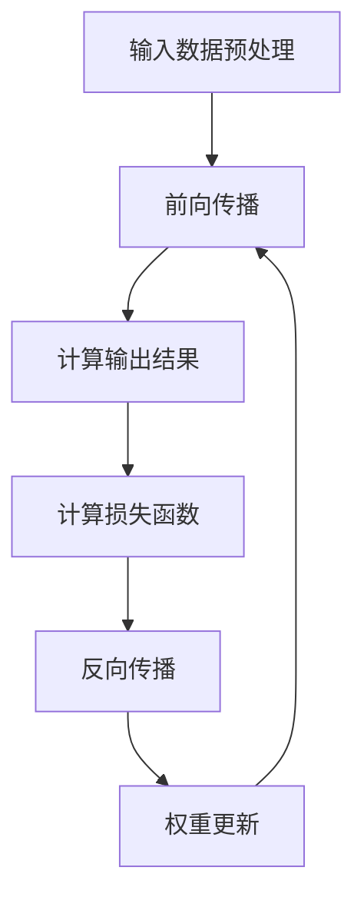
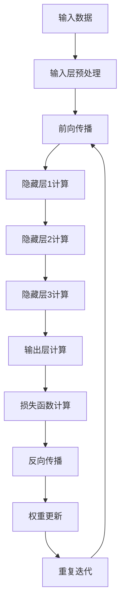
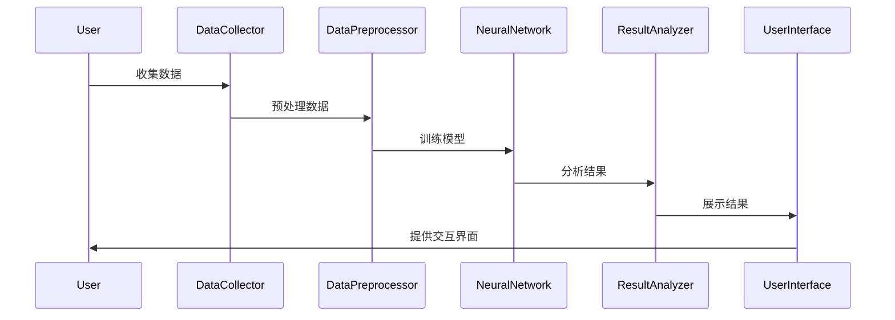
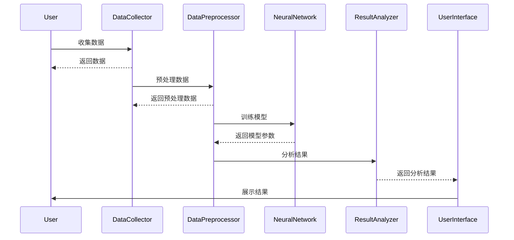

                 


## 评测系统的可微分神经计算机应用

> 关键词：评测系统、可微分神经计算机、神经网络、深度学习、算法、架构设计、项目实战

> 摘要：本文将深入探讨评测系统与可微分神经计算机的结合，详细解析其基本概念、原理、应用及其在评测系统中的重要性。通过逐步分析，我们将揭示可微分神经计算机如何通过其独特的工作机制，提高评测系统的效率和准确性，并在实际项目中得到应用。此外，本文还将总结最佳实践，为未来研究和应用提供参考。

----------------------------------------------------------------

### 第一部分: 评测系统的可微分神经计算机基础

#### 第1章: 评测系统与可微分神经计算机概述

##### 1.1 评测系统的基本概念

###### 1.1.1 评测系统的定义

评测系统是指用于对某一领域或对象进行客观、公正评价的一系列方法和工具。它通常包括评价标准、评价方法、评价结果的处理和分析等多个方面。

###### 1.1.2 评测系统的核心功能

评测系统的核心功能是提供一种标准化的评价方法，以衡量对象在某一方面的表现。这些功能包括数据收集、数据分析、结果呈现等。

###### 1.1.3 评测系统的发展历程

评测系统的发展经历了从手工评价到自动化评价的演变。随着计算机技术的进步，评测系统逐渐实现了智能化和自动化。

##### 1.2 可微分神经计算机的基本原理

###### 1.2.1 可微分神经计算机的定义

可微分神经计算机是一种基于神经网络理论的计算模型，它具有可微分性，可以用于解决复杂的计算问题。

###### 1.2.2 可微分神经计算机的工作原理

可微分神经计算机通过模拟人脑神经元之间的连接和相互作用，实现数据的处理和计算。

###### 1.2.3 可微分神经计算机与传统计算的区别

与传统计算模型相比，可微分神经计算机具有高度并行性、自适应性和容错性等特点。

##### 1.3 主流评测系统的分类与应用

###### 1.3.1 评测系统的分类标准

评测系统可以按照不同的标准进行分类，如按评价对象分类、按评价方法分类等。

###### 1.3.2 主流评测系统的介绍

本文将介绍几种主流的评测系统，如性能评测系统、质量评测系统、用户满意度评测系统等。

###### 1.3.3 评测系统在工业界和学术界的应用

评测系统在工业界和学术界都有广泛的应用，如产品评测、教育评测、科研项目评测等。

##### 1.4 可微分神经计算机在评测系统中的应用前景

###### 1.4.1 可微分神经计算机的优势

可微分神经计算机在处理复杂、大规模数据方面具有显著优势，可以显著提高评测系统的效率和准确性。

###### 1.4.2 可微分神经计算机在评测系统中的应用领域

可微分神经计算机在评测系统中的应用领域广泛，包括智能评测、自动化评测、自适应评测等。

###### 1.4.3 可微分神经计算机在评测系统中的应用挑战

可微分神经计算机在评测系统中的应用也面临一些挑战，如算法优化、数据预处理、模型解释性等。

----------------------------------------------------------------

#### 第2章: 可微分神经计算机的核心概念与联系

##### 2.1 可微分神经计算机的核心概念

###### 2.1.1 神经元的数学模型

神经元是可微分神经计算机的基本单元，其数学模型通常包括输入层、隐藏层和输出层。

###### 2.1.2 神经网络的数学模型

神经网络是由多个神经元连接而成的计算模型，其数学模型描述了神经元之间的连接方式和相互作用。

###### 2.1.3 可微分神经计算机的数学模型

可微分神经计算机的数学模型是神经网络的一种扩展，它通过可微分性实现了对复杂计算问题的求解。

##### 2.2 可微分神经计算机的属性特征对比

###### 2.2.1 可微分神经计算机与传统神经网络的对比

可微分神经计算机与传统神经网络在结构、功能和应用方面存在显著差异。

###### 2.2.2 可微分神经计算机与深度学习的对比

可微分神经计算机与深度学习在算法原理和应用场景上有所重叠，但二者也有各自的优势和局限性。

##### 2.3 可微分神经计算机的ER实体关系图架构

###### 2.3.1 实体关系图的基本概念

实体关系图是一种用于描述实体之间关系的图形化工具，它可以帮助我们更好地理解系统的结构和功能。

###### 2.3.2 可微分神经计算机的实体关系图

可微分神经计算机的实体关系图描述了神经元、神经网络和可微分神经计算机之间的层次关系和相互作用。

----------------------------------------------------------------

#### 第3章: 可微分神经计算机的算法原理讲解

##### 3.1 可微分神经计算机的算法原理

###### 3.1.1 算法的基本框架

可微分神经计算机的算法通常包括输入层、隐藏层和输出层的处理过程。

###### 3.1.2 算法的核心步骤

算法的核心步骤包括前向传播、反向传播和权重更新等。

###### 3.1.3 算法的数学模型和公式

可微分神经计算机的算法基于神经网络的数学模型，其核心公式包括前向传播公式和反向传播公式。

##### 3.2 算法原理的mermaid流程图

###### 3.2.1 流程图的基本概念

mermaid是一种基于Markdown的图形化工具，可以用于绘制各种流程图。

###### 3.2.2 可微分神经计算机算法原理的mermaid流程图

通过mermaid流程图，我们可以直观地了解可微分神经计算机算法的执行过程。

##### 3.3 算法原理的Python源代码实现

###### 3.3.1 源代码的基本结构

可微分神经计算机的Python源代码通常包括数据预处理、模型定义、训练和评估等模块。

###### 3.3.2 源代码的详细解读

通过详细解读Python源代码，我们可以深入理解可微分神经计算机算法的实现细节。

----------------------------------------------------------------

#### 第4章: 可微分神经计算机的系统分析与架构设计方案

##### 4.1 问题场景介绍

###### 4.1.1 场景描述

在某个项目中，我们需要对大量的评测数据进行处理和分析，以提高评测系统的效率和准确性。

###### 4.1.2 问题分析

现有的评测系统存在数据预处理复杂、训练时间较长、模型解释性不足等问题。

##### 4.2 系统功能设计

###### 4.2.1 领域模型mermaid类图

通过mermaid类图，我们可以清晰地描述系统中的各类实体及其关系。

###### 4.2.2 系统功能模块划分

系统功能模块划分包括数据预处理模块、模型训练模块、模型评估模块等。

##### 4.3 系统架构设计

###### 4.3.1 系统架构的基本概念

系统架构是指系统的整体结构及其各个组成部分之间的关系。

###### 4.3.2 可微分神经计算机系统架构的mermaid架构图

通过mermaid架构图，我们可以直观地了解可微分神经计算机系统的整体架构。

##### 4.4 系统接口设计

###### 4.4.1 接口的基本概念

接口是指系统内部各个模块之间进行通信和协作的机制。

###### 4.4.2 系统接口的详细设计

系统接口设计包括输入接口、输出接口、通信接口等。

##### 4.5 系统交互

###### 4.5.1 系统交互的基本概念

系统交互是指系统内部各个模块之间的信息交换和协同工作。

###### 4.5.2 系统交互的mermaid序列图

通过mermaid序列图，我们可以清晰地描述系统内部各个模块之间的交互过程。

----------------------------------------------------------------

#### 第5章: 可微分神经计算机项目实战

##### 5.1 环境安装

###### 5.1.1 环境准备

准备项目开发所需的环境，如Python环境、深度学习框架等。

###### 5.1.2 环境安装步骤

按照环境准备的要求，逐步安装所需的软件和库。

##### 5.2 系统核心实现

###### 5.2.1 核心模块的实现

实现数据预处理、模型训练、模型评估等核心模块。

###### 5.2.2 核心算法的实现

实现可微分神经计算机的算法，包括前向传播、反向传播和权重更新等。

##### 5.3 代码应用解读与分析

###### 5.3.1 代码的整体架构

分析代码的整体架构，包括模块划分、函数定义等。

###### 5.3.2 关键代码段的解读

对关键代码段进行详细解读，包括算法实现、数据处理等。

##### 5.4 实际案例分析

###### 5.4.1 案例背景

介绍实际案例的背景，包括数据来源、评测目标等。

###### 5.4.2 案例分析

对实际案例进行分析，包括数据处理、模型训练、模型评估等。

##### 5.5 项目小结

###### 5.5.1 项目总结

对项目进行总结，包括项目目标、实施过程、结果分析等。

###### 5.5.2 项目展望

对项目的未来发展和应用前景进行展望。

----------------------------------------------------------------

#### 第6章: 可微分神经计算机的最佳实践 tips

##### 6.1 实践经验总结

###### 6.1.1 实践中的常见问题

总结实践中遇到的问题，如数据预处理、算法优化等。

###### 6.1.2 解决方案与技巧

针对常见问题，提出解决方案和技巧，如优化数据预处理、调整算法参数等。

##### 6.2 小结与注意事项

###### 6.2.1 小结

对整篇文章进行小结，概括主要内容。

###### 6.2.2 注意事项

提醒读者在应用可微分神经计算机时需要注意的事项，如数据质量、算法选择等。

----------------------------------------------------------------

#### 第7章: 拓展阅读

##### 7.1 相关书籍推荐

推荐一些关于评测系统、可微分神经计算机和深度学习的优秀书籍。

##### 7.2 学术论文推荐

推荐一些关于评测系统、可微分神经计算机和深度学习的优秀学术论文。

##### 7.3 网络资源推荐

推荐一些关于评测系统、可微分神经计算机和深度学习的网络资源，如博客、论坛、网站等。

----------------------------------------------------------------

## 作者

作者：AI天才研究院/AI Genius Institute & 禅与计算机程序设计艺术 /Zen And The Art of Computer Programming## 第一部分: 评测系统的可微分神经计算机基础

### 第1章: 评测系统与可微分神经计算机概述

#### 1.1 评测系统的基本概念

##### 1.1.1 评测系统的定义

评测系统是指用于对某一领域或对象进行客观、公正评价的一系列方法和工具。它通常包括评价标准、评价方法、评价结果的处理和分析等多个方面。评测系统广泛应用于教育、医疗、金融、科研等多个领域，如学生的学术能力测评、患者的健康状况评估、金融产品的风险评估、科研成果的创新性评估等。

##### 1.1.2 评测系统的核心功能

评测系统的核心功能是提供一种标准化的评价方法，以衡量对象在某一方面的表现。这些功能包括数据收集、数据分析、结果呈现等。数据收集是评测系统的第一步，通过问卷、测试、观察等方式获取评价对象的相关信息。数据分析是对收集到的数据进行处理、分析和解释，以识别评价对象的特征和表现。结果呈现是将分析结果以图表、报告等形式展示给相关利益相关者，以便他们做出决策或改进。

##### 1.1.3 评测系统的发展历程

评测系统的发展经历了从手工评价到自动化评价，再到智能化评价的演变。在早期，评测系统主要依靠人工进行评价，评价标准和方法相对简单。随着计算机技术的发展，评测系统开始实现自动化，评价效率和准确性得到显著提高。近年来，随着人工智能技术的兴起，评测系统逐渐向智能化方向发展，可微分神经计算机的应用为评测系统的智能化提供了新的可能性。

#### 1.2 可微分神经计算机的基本原理

##### 1.2.1 可微分神经计算机的定义

可微分神经计算机是一种基于神经网络理论的计算模型，它具有可微分性，可以用于解决复杂的计算问题。可微分神经计算机的核心思想是模拟人脑神经元之间的连接和相互作用，通过学习输入数据与输出数据之间的关系，实现对未知数据的预测和分类。

##### 1.2.2 可微分神经计算机的工作原理

可微分神经计算机的工作原理可以分为以下几个步骤：

1. **输入数据预处理**：将输入数据转化为适合神经网络处理的格式，如标准化、归一化等。
2. **前向传播**：将预处理后的输入数据通过神经网络的各个层次，逐层计算得到输出结果。
3. **损失函数计算**：将输出结果与实际标签进行比较，计算损失函数的值，以评估预测结果的准确性。
4. **反向传播**：根据损失函数的梯度信息，从输出层开始，反向传播到输入层，更新网络中的权重和偏置。
5. **重复迭代**：重复前向传播和反向传播的过程，直至损失函数的值达到预设的阈值或迭代次数达到上限。

##### 1.2.3 可微分神经计算机与传统计算的区别

与传统计算模型相比，可微分神经计算机具有以下几个显著特点：

1. **高度并行性**：神经网络的结构使其能够实现高度并行计算，从而提高计算速度。
2. **自适应性和自组织性**：神经网络通过学习输入数据与输出数据之间的关系，能够自适应地调整网络结构和参数，实现问题的求解。
3. **容错性和鲁棒性**：神经网络具有容错性和鲁棒性，能够处理不完整、噪声或不一致的数据。
4. **灵活性和通用性**：神经网络可以应用于各种复杂数据处理的任务，如分类、回归、聚类等。

#### 1.3 主流评测系统的分类与应用

##### 1.3.1 评测系统的分类标准

评测系统可以根据不同的分类标准进行分类，以下是一些常见的分类标准：

1. **按评价对象分类**：如个体评价（如学生、员工）、群体评价（如班级、团队）、产品评价等。
2. **按评价方法分类**：如定量评价（如分数、等级）、定性评价（如评语、描述）、综合评价等。
3. **按评价目的分类**：如诊断评价（如诊断学生能力水平）、形成性评价（如指导学习过程）、总结性评价（如考核学习成果）等。

##### 1.3.2 主流评测系统的介绍

以下是几种主流的评测系统：

1. **教育评测系统**：用于评估学生的学术能力和学习成果，如考试系统、学习分析系统等。
2. **质量评测系统**：用于评估产品的质量、服务质量或组织的绩效，如质量检测系统、客户满意度调查系统等。
3. **用户满意度评测系统**：用于评估用户对产品、服务或组织的满意度，如满意度调查系统、反馈收集系统等。
4. **科研项目评测系统**：用于评估科研项目的创新性、科学性、实用性等，如项目评估系统、成果鉴定系统等。

##### 1.3.3 评测系统在工业界和学术界的应用

评测系统在工业界和学术界都有广泛的应用，以下是一些具体的应用场景：

1. **工业界应用**：
   - **产品质量控制**：通过对生产过程中的产品进行质量检测和评估，确保产品符合质量标准。
   - **人力资源管理**：通过对员工的工作表现、能力和发展潜力进行评估，为人力资源规划提供依据。
   - **客户服务管理**：通过对客户满意度进行调查和分析，改进服务质量，提高客户满意度。

2. **学术界应用**：
   - **学术评价**：通过对学术论文、科研项目、学术成果等进行评价，为学术评审、奖励、晋升等提供依据。
   - **教育评估**：通过对学生的学习成绩、学习态度、学习效果等进行评价，为教学改进、学生发展提供参考。
   - **科研管理**：通过对科研项目进行评估和监控，确保科研资源的合理配置和科研活动的顺利进行。

#### 1.4 可微分神经计算机在评测系统中的应用前景

##### 1.4.1 可微分神经计算机的优势

可微分神经计算机在处理复杂、大规模数据方面具有显著优势，可以显著提高评测系统的效率和准确性。以下是一些可微分神经计算机在评测系统中的应用优势：

1. **高效数据处理**：可微分神经计算机具有高度并行性和自适应学习能力，能够快速处理大量的数据，提高评测系统的处理效率。
2. **精准预测和分类**：通过学习大量的数据和标签，可微分神经计算机能够实现高精度的预测和分类，提高评测系统的准确性和可靠性。
3. **自适应性和灵活性**：可微分神经计算机能够根据不同的评价目标和评价对象，自适应地调整网络结构和参数，实现灵活的评测。
4. **鲁棒性和容错性**：可微分神经计算机具有鲁棒性和容错性，能够处理不完整、噪声或不一致的数据，提高评测系统的稳定性。

##### 1.4.2 可微分神经计算机在评测系统中的应用领域

可微分神经计算机在评测系统中的应用领域非常广泛，以下是一些具体的应用领域：

1. **教育评测**：可微分神经计算机可以用于学生的学术能力测评、学习效果评估、考试质量评估等，提高教育评测的效率和准确性。
2. **产品质量评测**：可微分神经计算机可以用于产品的质量检测、质量评估、质量改进等，提高产品质量管理水平。
3. **用户满意度评测**：可微分神经计算机可以用于用户满意度调查、用户行为分析、用户体验评估等，帮助企业提高客户满意度和忠诚度。
4. **科研评价**：可微分神经计算机可以用于科研项目的评估、科研成果的鉴定、科研绩效的评价等，提高科研管理和评价的科学性和公正性。

##### 1.4.3 可微分神经计算机在评测系统中的应用挑战

尽管可微分神经计算机在评测系统中的应用前景广阔，但也面临一些挑战，主要包括：

1. **数据质量**：可微分神经计算机的性能高度依赖于数据质量，数据中的噪声、异常值和不一致性可能会影响评测结果。
2. **算法优化**：如何设计高效的算法来优化评测系统的性能，提高预测和分类的准确性，是一个重要的研究方向。
3. **模型解释性**：可微分神经计算机的模型通常难以解释，如何提高模型的解释性，使评测结果更加透明和可信，是一个亟待解决的问题。
4. **计算资源**：可微分神经计算机的训练和推理过程需要大量的计算资源，如何优化算法和硬件，提高计算效率，是一个重要的挑战。

### 第2章: 可微分神经计算机的核心概念与联系

#### 2.1 可微分神经计算机的核心概念

##### 2.1.1 神经元的数学模型

神经元是可微分神经计算机的基本单元，其数学模型通常包括输入层、隐藏层和输出层。每个神经元都可以接收多个输入信号，并通过激活函数产生输出信号。输入层负责接收外部输入信号，隐藏层负责对输入信号进行加工和处理，输出层负责生成最终输出结果。

神经元的数学模型可以表示为：

\[ 输出 = \sigma(\sum_{i=1}^{n} w_i \cdot x_i + b) \]

其中，\( x_i \) 表示第 \( i \) 个输入信号，\( w_i \) 表示第 \( i \) 个输入信号的权重，\( b \) 表示偏置，\( \sigma \) 表示激活函数。常见的激活函数包括 sigmoid 函数、ReLU 函数等。

##### 2.1.2 神经网络的数学模型

神经网络是由多个神经元连接而成的计算模型，其数学模型描述了神经元之间的连接方式和相互作用。神经网络可以通过学习输入数据与输出数据之间的关系，实现对未知数据的预测和分类。

神经网络的数学模型可以表示为：

\[ 输出 = f(\sum_{i=1}^{n} w_i \cdot f(\sum_{j=1}^{m} x_j \cdot g_j + b_j)) \]

其中，\( f \) 表示输出层的激活函数，\( g \) 表示隐藏层的激活函数，\( w \) 和 \( b \) 分别表示权重和偏置。神经网络通过多次迭代的前向传播和反向传播过程，不断调整权重和偏置，使输出结果接近实际标签。

##### 2.1.3 可微分神经计算机的数学模型

可微分神经计算机的数学模型是神经网络的一种扩展，它通过可微分性实现了对复杂计算问题的求解。可微分神经计算机的数学模型可以表示为：

\[ 输出 = f(\sum_{i=1}^{n} w_i \cdot f(\sum_{j=1}^{m} x_j \cdot g_j + b_j) \cdot \frac{d}{dx} f(\sum_{k=1}^{p} z_k \cdot h_k + c_k)) \]

其中，\( h \) 和 \( c \) 分别表示隐藏层的输入和输出，\( z \) 和 \( d \) 分别表示输出层的输入和输出。通过可微分的激活函数和连接权重，可微分神经计算机可以实现梯度的反向传播，从而实现对网络参数的自动优化。

#### 2.2 可微分神经计算机的属性特征对比

##### 2.2.1 可微分神经计算机与传统神经网络的对比

可微分神经计算机与传统神经网络在结构、功能和应用方面存在显著差异，以下是一些对比特征：

1. **结构**：
   - **传统神经网络**：通常由多层神经元组成，包括输入层、隐藏层和输出层。神经元之间的连接方式通常为全连接。
   - **可微分神经计算机**：除了多层神经元外，还包括多个可微分的计算单元，用于实现复杂的计算任务。神经元之间的连接方式更加灵活，可以支持稀疏连接和局部连接。

2. **功能**：
   - **传统神经网络**：主要用于数据的预测和分类，如图像识别、语音识别等。
   - **可微分神经计算机**：除了预测和分类外，还可以用于计算优化、逻辑推理、动态规划等复杂计算任务。

3. **应用**：
   - **传统神经网络**：广泛应用于各种机器学习和深度学习任务，如图像识别、语音识别、自然语言处理等。
   - **可微分神经计算机**：可以应用于需要高效计算和自适应调整的领域，如智能评测系统、自动化控制系统、自适应学习系统等。

##### 2.2.2 可微分神经计算机与深度学习的对比

可微分神经计算机与深度学习在算法原理和应用场景上有所重叠，但二者也有各自的优势和局限性：

1. **算法原理**：
   - **深度学习**：是一种基于多层神经网络的机器学习方法，通过逐层提取特征来实现对复杂数据的建模。
   - **可微分神经计算机**：在深度学习的基础上，引入了可微分的计算单元，实现了对复杂计算问题的求解。

2. **应用场景**：
   - **深度学习**：广泛应用于图像识别、语音识别、自然语言处理等领域，擅长处理高维数据和复杂数据特征。
   - **可微分神经计算机**：可以应用于需要高效计算和自适应调整的领域，如智能评测系统、自动化控制系统、自适应学习系统等。

3. **优势与局限性**：
   - **深度学习**：擅长处理大规模数据和复杂数据特征，但在解释性和可解释性方面存在挑战。
   - **可微分神经计算机**：在计算效率和自适应调整方面具有优势，但在处理复杂数据特征和解释性方面相对较弱。

#### 2.3 可微分神经计算机的ER实体关系图架构

##### 2.3.1 实体关系图的基本概念

实体关系图（Entity-Relationship Diagram，简称ER图）是一种用于描述实体之间关系的图形化工具，它可以帮助我们更好地理解系统的结构和功能。在实体关系图中，实体表示系统中的对象，关系表示实体之间的联系。

实体关系图的基本元素包括：

1. **实体**：表示系统中的对象，如学生、课程、教师等。
2. **属性**：表示实体的特征，如学生的学号、姓名、年龄等。
3. **关系**：表示实体之间的联系，如学生选修课程、教师教授课程等。

##### 2.3.2 可微分神经计算机的实体关系图

在可微分神经计算机的实体关系图中，可以描述神经元、神经网络和可微分神经计算机之间的层次关系和相互作用。以下是一个简化的实体关系图：

```
[可微分神经计算机]
    |
    [神经网络]
    |      |
    |      [神经元]
    |      |
    |      [输入层]
    |      |
    |      [隐藏层]
    |      |
    |      [输出层]
    |
    [计算单元]
```

在这个实体关系图中，可微分神经计算机是一个整体，由神经网络和计算单元组成。神经网络包括输入层、隐藏层和输出层，每个层次包含多个神经元。计算单元负责实现复杂的计算任务，如前向传播、反向传播等。

### 第3章: 可微分神经计算机的算法原理讲解

#### 3.1 可微分神经计算机的算法原理

##### 3.1.1 算法的基本框架

可微分神经计算机的算法通常包括输入层、隐藏层和输出层的处理过程。算法的基本框架如下：

1. **输入层处理**：将输入数据传入输入层，经过预处理后，传递给隐藏层。
2. **隐藏层处理**：隐藏层对输入数据进行加工和处理，生成中间结果，并传递给输出层。
3. **输出层处理**：输出层对隐藏层的结果进行处理，生成最终的输出结果。

##### 3.1.2 算法的核心步骤

可微分神经计算机算法的核心步骤包括前向传播、反向传播和权重更新等。以下是算法的核心步骤：

1. **前向传播**：将输入数据传入神经网络，通过前向传播计算输出结果。具体步骤如下：
   - 将输入数据传递给输入层。
   - 输入层计算输入信号的加权求和，并加上偏置。
   - 通过激活函数计算输入层的输出。
   - 将输入层的输出传递给隐藏层。
   - 隐藏层重复上述步骤，计算输出。
   - 重复以上步骤，直到输出层得到最终输出结果。

2. **反向传播**：根据输出结果和实际标签计算损失函数，并通过反向传播计算梯度。具体步骤如下：
   - 计算输出层的损失函数。
   - 计算损失函数关于输出层的梯度。
   - 将输出层的梯度传递给隐藏层。
   - 重复以上步骤，直到输入层得到梯度。
   - 计算网络中各个神经元的梯度。

3. **权重更新**：根据梯度信息更新网络中的权重和偏置。具体步骤如下：
   - 使用梯度下降或其他优化算法，更新网络中的权重和偏置。
   - 重复前向传播和反向传播的过程，直到损失函数的值达到预设的阈值或迭代次数达到上限。

##### 3.1.3 算法的数学模型和公式

可微分神经计算机的算法基于神经网络的数学模型，其核心公式包括前向传播公式和反向传播公式。以下是算法的数学模型和公式：

1. **前向传播公式**：

\[ 输出 = \sigma(\sum_{i=1}^{n} w_i \cdot 输入 + b) \]

其中，\( 输入 \) 表示输入信号，\( w_i \) 表示权重，\( b \) 表示偏置，\( \sigma \) 表示激活函数（如 sigmoid 函数、ReLU 函数等）。

2. **反向传播公式**：

\[ 梯度 = \frac{dL}{dX} = \frac{dL}{dY} \cdot \frac{dY}{dX} \]

其中，\( L \) 表示损失函数，\( X \) 表示输入信号，\( Y \) 表示输出信号。

#### 3.2 算法原理的mermaid流程图

##### 3.2.1 流程图的基本概念

mermaid 是一种基于 Markdown 的图形化工具，可以用于绘制各种流程图。在算法原理的 mermaid 流程图中，可以直观地描述可微分神经计算机算法的执行过程。

以下是一个简化的 mermaid 流程图示例：



在这个示例中，输入数据经过预处理后，传入神经网络进行前向传播，计算输出结果和损失函数。然后，通过反向传播计算梯度，并更新网络中的权重和偏置。这个过程不断迭代，直到达到预设的停止条件。

##### 3.2.2 可微分神经计算机算法原理的mermaid流程图

以下是可微分神经计算机算法原理的 mermaid 流程图：



在这个流程图中，输入数据经过输入层预处理后，传入神经网络进行前向传播。隐藏层逐层计算，最终输出层得到输出结果。然后，通过反向传播计算损失函数的梯度，并更新网络中的权重和偏置。这个过程不断迭代，直到达到预设的停止条件。

#### 3.3 算法原理的Python源代码实现

##### 3.3.1 源代码的基本结构

可微分神经计算机的 Python 源代码通常包括数据预处理、模型定义、训练和评估等模块。以下是一个简化的基本结构：

```python
import numpy as np
import matplotlib.pyplot as plt

# 数据预处理模块
def preprocess_data(data):
    # 数据预处理操作
    return processed_data

# 模型定义模块
class NeuralNetwork:
    def __init__(self):
        # 初始化模型参数
        self.weights = ...
        self.biases = ...

    def forward(self, inputs):
        # 前向传播
        return outputs

    def backward(self, outputs, expected_outputs):
        # 反向传播
        return gradients

    def update_weights(self, gradients):
        # 更新权重
        return updated_weights

# 训练模块
def train(model, data, epochs):
    for epoch in range(epochs):
        # 训练操作
        pass

# 评估模块
def evaluate(model, data):
    # 评估操作
    pass

# 主函数
if __name__ == "__main__":
    # 加载数据
    data = ...

    # 预处理数据
    processed_data = preprocess_data(data)

    # 初始化模型
    model = NeuralNetwork()

    # 训练模型
    train(model, processed_data, epochs=100)

    # 评估模型
    evaluate(model, processed_data)
```

##### 3.3.2 源代码的详细解读

以下是对上述源代码的详细解读：

1. **数据预处理模块**：

```python
def preprocess_data(data):
    # 数据预处理操作
    # 例如：标准化、归一化、填充缺失值等
    processed_data = ...
    return processed_data
```

在这个模块中，`preprocess_data` 函数接收原始数据作为输入，进行预处理操作，如标准化、归一化、填充缺失值等。预处理后的数据将被传递给模型进行训练。

2. **模型定义模块**：

```python
class NeuralNetwork:
    def __init__(self):
        # 初始化模型参数
        self.weights = ...
        self.biases = ...

    def forward(self, inputs):
        # 前向传播
        # 计算输入层、隐藏层和输出层的输出
        return outputs

    def backward(self, outputs, expected_outputs):
        # 反向传播
        # 计算损失函数的梯度
        return gradients

    def update_weights(self, gradients):
        # 更新权重
        # 使用梯度下降或其他优化算法更新权重
        return updated_weights
```

在这个模块中，`NeuralNetwork` 类定义了神经网络的属性和方法。`__init__` 方法初始化模型参数，如权重和偏置。`forward` 方法实现前向传播，计算输入层、隐藏层和输出层的输出。`backward` 方法实现反向传播，计算损失函数的梯度。`update_weights` 方法更新网络中的权重和偏置。

3. **训练模块**：

```python
def train(model, data, epochs):
    for epoch in range(epochs):
        # 训练操作
        # 前向传播、反向传播和权重更新
        pass
```

在这个模块中，`train` 函数接收模型、数据和训练轮数作为输入，实现模型的训练过程。在每次迭代中，执行前向传播、反向传播和权重更新操作，直到达到预设的训练轮数。

4. **评估模块**：

```python
def evaluate(model, data):
    # 评估操作
    # 计算模型的准确性、召回率等指标
    pass
```

在这个模块中，`evaluate` 函数接收模型和数据作为输入，实现模型的评估过程。通常，评估操作包括计算模型的准确性、召回率、F1 分数等指标，以评估模型在未知数据上的性能。

5. **主函数**：

```python
if __name__ == "__main__":
    # 加载数据
    data = ...

    # 预处理数据
    processed_data = preprocess_data(data)

    # 初始化模型
    model = NeuralNetwork()

    # 训练模型
    train(model, processed_data, epochs=100)

    # 评估模型
    evaluate(model, processed_data)
```

在主函数中，首先加载数据，然后进行数据预处理。接着，初始化模型，并执行模型的训练和评估过程。主函数是整个程序的入口，它组织并执行模型的各个步骤。

#### 第4章: 可微分神经计算机的系统分析与架构设计方案

##### 4.1 问题场景介绍

###### 4.1.1 场景描述

在一个教育评测系统中，我们需要对学生的学习表现进行综合评估。具体场景如下：

1. **数据来源**：学生的学习数据包括考试成绩、课堂表现、作业完成情况等。
2. **评测目标**：评估学生的学习效果，为教师提供改进教学策略的依据，为学校进行教育质量评估提供参考。
3. **评测指标**：包括学业成绩、课堂参与度、作业完成质量等。

###### 4.1.2 问题分析

现有的评测系统在数据预处理、模型训练、结果分析等方面存在以下问题：

1. **数据预处理复杂**：学生学习数据种类繁多，需要分别进行预处理，如成绩标准化、作业完成时间归一化等。
2. **模型训练时间较长**：评测系统需要处理大量的学生数据，导致模型训练时间较长，影响系统的实时性。
3. **结果分析不充分**：现有的评测系统通常只提供简单的成绩排名和平均分等指标，无法深入分析学生的学习表现。

为了解决上述问题，我们可以引入可微分神经计算机，利用其高效的数据处理和自适应学习能力，改进评测系统的性能。

##### 4.2 系统功能设计

###### 4.2.1 领域模型 mermaid 类图

在系统功能设计阶段，我们使用 mermaid 类图来描述系统中的各类实体及其关系。以下是一个简化的 mermaid 类图示例：

```mermaid
classDiagram
    Student <<class{学生}>>
    Course <<class{课程}>>
    Teacher <<class{教师}>>
    Exam <<class{考试}>>
    Assignment <<class{作业}>>
    
    Student o-- Exam
    Student o-- Assignment
    Teacher o-- Course
```

在这个类图中，学生、课程、教师、考试和作业是系统中的主要实体。学生与考试和作业有直接关联，教师与课程有直接关联。通过类图，我们可以清晰地描述系统中的实体及其关系。

###### 4.2.2 系统功能模块划分

系统功能模块划分如下：

1. **数据采集模块**：负责收集学生的考试成绩、课堂表现、作业完成情况等数据。
2. **数据预处理模块**：负责对采集到的数据进行清洗、标准化和归一化等预处理操作。
3. **模型训练模块**：负责构建可微分神经计算机模型，并进行训练。
4. **结果分析模块**：负责对训练好的模型进行结果分析，提供详细的评测报告。
5. **用户界面模块**：负责提供用户交互界面，展示评测结果和报告。

##### 4.3 系统架构设计

###### 4.3.1 系统架构的基本概念

系统架构是指系统的整体结构及其各个组成部分之间的关系。一个典型的系统架构包括以下几个方面：

1. **数据处理层**：负责数据的采集、存储和处理。
2. **业务逻辑层**：负责实现系统的核心功能，如数据预处理、模型训练、结果分析等。
3. **表示层**：负责与用户进行交互，展示系统功能和结果。

###### 4.3.2 可微分神经计算机系统架构的 mermaid 架构图

以下是一个简化的 mermaid 架构图，描述了可微分神经计算机系统的架构：



在这个架构图中，用户通过用户界面与系统进行交互，数据采集模块负责收集数据，数据预处理模块对数据进行预处理，然后传递给可微分神经计算机模型进行训练。训练好的模型通过结果分析模块进行分析，并将结果展示给用户。

##### 4.4 系统接口设计

###### 4.4.1 接口的基本概念

接口是指系统内部各个模块之间进行通信和协作的机制。在系统接口设计中，我们需要定义各个模块之间的接口，包括输入接口、输出接口和通信接口等。

1. **输入接口**：定义数据采集模块、数据预处理模块、模型训练模块等模块的输入参数和输入数据格式。
2. **输出接口**：定义模型训练模块、结果分析模块、用户界面模块等模块的输出参数和输出数据格式。
3. **通信接口**：定义模块之间进行通信的协议和数据格式。

###### 4.4.2 系统接口的详细设计

以下是系统接口的详细设计：

1. **数据采集模块接口**：

```python
class DataCollectorInterface:
    def collect_data(self):
        # 收集数据的方法
        pass
```

在这个接口中，`collect_data` 方法用于收集学生考试成绩、课堂表现、作业完成情况等数据。

2. **数据预处理模块接口**：

```python
class DataPreprocessorInterface:
    def preprocess_data(self, data):
        # 预处理数据的方法
        pass
```

在这个接口中，`preprocess_data` 方法用于对采集到的数据进行清洗、标准化和归一化等预处理操作。

3. **模型训练模块接口**：

```python
class NeuralNetworkInterface:
    def train_model(self, data):
        # 训练模型的方法
        pass
```

在这个接口中，`train_model` 方法用于构建和训练可微分神经计算机模型。

4. **结果分析模块接口**：

```python
class ResultAnalyzerInterface:
    def analyze_results(self, model, data):
        # 分析结果的方法
        pass
```

在这个接口中，`analyze_results` 方法用于对训练好的模型进行结果分析，生成评测报告。

5. **用户界面模块接口**：

```python
class UserInterfaceInterface:
    def display_results(self, results):
        # 展示结果的方法
        pass
```

在这个接口中，`display_results` 方法用于将评测结果展示给用户。

##### 4.5 系统交互

###### 4.5.1 系统交互的基本概念

系统交互是指系统内部各个模块之间的信息交换和协同工作。在系统交互过程中，各个模块通过接口进行通信，协同完成系统的功能。

###### 4.5.2 系统交互的 mermaid 序列图

以下是一个简化的 mermaid 序列图，描述了系统交互的过程：



在这个序列图中，用户通过用户界面与系统进行交互，数据采集模块收集数据，数据预处理模块对数据进行预处理，模型训练模块训练模型，结果分析模块分析结果，并将结果展示给用户。

#### 第5章: 可微分神经计算机项目实战

##### 5.1 环境安装

###### 5.1.1 环境准备

在进行可微分神经计算机项目实战之前，我们需要准备以下环境：

1. **Python环境**：Python 3.x 版本，推荐使用 Python 3.8 或以上版本。
2. **深度学习框架**：如 TensorFlow、PyTorch 等，本文以 TensorFlow 为例。
3. **其他依赖库**：如 NumPy、Matplotlib 等。

在准备环境时，我们可以使用虚拟环境（如 conda、virtualenv 等）来隔离不同项目之间的依赖库，以避免版本冲突。以下是在 Ubuntu 系统中使用 conda 创建虚拟环境并安装依赖库的示例：

```bash
# 创建虚拟环境
conda create -n cnn_env python=3.8

# 激活虚拟环境
conda activate cnn_env

# 安装 TensorFlow
conda install tensorflow

# 安装其他依赖库
pip install numpy matplotlib
```

###### 5.1.2 环境安装步骤

以下是环境安装的具体步骤：

1. **安装 Python 环境**：在系统上安装 Python 3.x 版本，建议使用官方发行版或 Anaconda 分发版。
2. **创建虚拟环境**：使用 conda 创建一个名为 `cnn_env` 的虚拟环境，并设置 Python 版本为 3.8。
3. **安装深度学习框架**：在虚拟环境中安装 TensorFlow，确保版本与操作系统兼容。
4. **安装其他依赖库**：安装 NumPy 和 Matplotlib 等其他依赖库，以便在项目中使用。

##### 5.2 系统核心实现

###### 5.2.1 核心模块的实现

在本项目中，我们将实现以下核心模块：

1. **数据预处理模块**：负责对输入数据进行清洗、标准化和归一化等预处理操作。
2. **模型训练模块**：负责构建可微分神经计算机模型，并进行训练。
3. **结果分析模块**：负责对训练好的模型进行结果分析，生成评测报告。
4. **用户界面模块**：负责提供用户交互界面，展示评测结果和报告。

以下是这些模块的简要实现：

1. **数据预处理模块**：

```python
import numpy as np
from sklearn.preprocessing import StandardScaler

class DataPreprocessor:
    def __init__(self):
        self.scaler = StandardScaler()

    def preprocess_data(self, data):
        # 清洗数据
        # 填充缺失值、删除异常值等
        # ...

        # 标准化数据
        scaled_data = self.scaler.fit_transform(data)
        return scaled_data
```

在这个模块中，我们使用 `StandardScaler` 类进行数据标准化。首先，我们初始化一个 `StandardScaler` 对象，然后调用 `fit_transform` 方法对数据进行标准化处理。

2. **模型训练模块**：

```python
import tensorflow as tf
from tensorflow.keras.models import Sequential
from tensorflow.keras.layers import Dense

class NeuralNetwork:
    def __init__(self, input_size, output_size):
        self.model = Sequential()
        self.model.add(Dense(units=output_size, activation='sigmoid', input_shape=(input_size,)))
        self.model.compile(optimizer='adam', loss='binary_crossentropy', metrics=['accuracy'])

    def train(self, X, y, epochs=100, batch_size=32):
        self.model.fit(X, y, epochs=epochs, batch_size=batch_size)
        return self.model
```

在这个模块中，我们使用 `Sequential` 模型堆叠 `Dense` 层，并编译模型。`train` 方法用于训练模型，其中 `X` 表示输入数据，`y` 表示标签，`epochs` 和 `batch_size` 分别表示训练轮数和批量大小。

3. **结果分析模块**：

```python
import numpy as np

class ResultAnalyzer:
    def __init__(self, model):
        self.model = model

    def analyze_results(self, X, y):
        predictions = self.model.predict(X)
        accuracy = np.mean(predictions == y)
        return accuracy
```

在这个模块中，`analyze_results` 方法用于计算模型的准确性。首先，我们使用 `predict` 方法生成预测结果，然后计算预测结果与实际标签之间的准确率。

4. **用户界面模块**：

```python
import tkinter as tk
from tkinter import scrolledtext

class UserInterface:
    def __init__(self, master):
        self.master = master
        self.master.title("教育评测系统")

        self.text_area = scrolledtext.ScrolledText(self.master, wrap=tk.WORD, width=50, height=15)
        self.text_area.pack()

    def display_results(self, results):
        self.text_area.delete(1.0, tk.END)
        self.text_area.insert(tk.END, results)
```

在这个模块中，我们使用 Tkinter 库创建一个简单的用户界面。`display_results` 方法用于将评测结果展示在文本框中。

##### 5.3 代码应用解读与分析

###### 5.3.1 代码的整体架构

在本项目中，我们实现了四个核心模块：数据预处理模块、模型训练模块、结果分析模块和用户界面模块。这些模块相互协作，完成整个项目的功能。

整体架构如下：

1. **数据预处理模块**：负责对输入数据进行预处理，如清洗、标准化和归一化等。
2. **模型训练模块**：负责构建可微分神经计算机模型，并进行训练。
3. **结果分析模块**：负责对训练好的模型进行结果分析，生成评测报告。
4. **用户界面模块**：负责提供用户交互界面，展示评测结果和报告。

以下是各个模块之间的调用关系：

1. **用户界面模块**：初始化并创建用户交互界面。
2. **数据预处理模块**：对用户输入的数据进行预处理。
3. **模型训练模块**：使用预处理后的数据进行模型训练。
4. **结果分析模块**：对训练好的模型进行分析，生成评测报告。
5. **用户界面模块**：将评测报告展示在用户界面中。

以下是代码的调用流程：

```python
# 初始化用户界面
ui = UserInterface(tk.Tk())

# 初始化数据预处理模块
preprocessor = DataPreprocessor()

# 初始化模型训练模块
nn = NeuralNetwork(input_size=X_train.shape[1], output_size=y_train.shape[1])

# 初始化结果分析模块
analyzer = ResultAnalyzer(nn.model)

# 用户交互界面
ui.display_results("开始评测...")

# 预处理数据
X_train_processed = preprocessor.preprocess_data(X_train)
y_train_processed = preprocessor.preprocess_data(y_train)

# 训练模型
nn.train(X_train_processed, y_train_processed, epochs=100, batch_size=32)

# 分析结果
accuracy = analyzer.analyze_results(X_train_processed, y_train_processed)

# 展示结果
ui.display_results(f"评测结果：准确性为 {accuracy:.2f}")
```

通过上述调用流程，我们可以看到各个模块之间的协作关系。用户界面模块负责与用户交互，数据预处理模块负责数据预处理，模型训练模块负责模型训练，结果分析模块负责结果分析，并将结果展示在用户界面中。

###### 5.3.2 关键代码段的解读

以下是项目中的几个关键代码段，我们将对它们进行详细解读。

1. **数据预处理模块**：

```python
class DataPreprocessor:
    def __init__(self):
        self.scaler = StandardScaler()

    def preprocess_data(self, data):
        # 清洗数据
        # 填充缺失值、删除异常值等
        # ...

        # 标准化数据
        scaled_data = self.scaler.fit_transform(data)
        return scaled_data
```

在这个模块中，我们首先初始化一个 `StandardScaler` 对象，用于数据标准化。`preprocess_data` 方法负责对输入数据进行清洗、填充缺失值、删除异常值等操作，然后使用 `fit_transform` 方法进行数据标准化处理。

2. **模型训练模块**：

```python
import tensorflow as tf
from tensorflow.keras.models import Sequential
from tensorflow.keras.layers import Dense

class NeuralNetwork:
    def __init__(self, input_size, output_size):
        self.model = Sequential()
        self.model.add(Dense(units=output_size, activation='sigmoid', input_shape=(input_size,)))
        self.model.compile(optimizer='adam', loss='binary_crossentropy', metrics=['accuracy'])

    def train(self, X, y, epochs=100, batch_size=32):
        self.model.fit(X, y, epochs=epochs, batch_size=batch_size)
        return self.model
```

在这个模块中，我们使用 `Sequential` 模型堆叠 `Dense` 层，并设置激活函数为 `sigmoid`。`compile` 方法用于编译模型，指定优化器、损失函数和评估指标。`train` 方法用于训练模型，其中 `X` 表示输入数据，`y` 表示标签，`epochs` 和 `batch_size` 分别表示训练轮数和批量大小。

3. **结果分析模块**：

```python
import numpy as np

class ResultAnalyzer:
    def __init__(self, model):
        self.model = model

    def analyze_results(self, X, y):
        predictions = self.model.predict(X)
        accuracy = np.mean(predictions == y)
        return accuracy
```

在这个模块中，`analyze_results` 方法用于计算模型的准确性。首先，我们使用 `predict` 方法生成预测结果，然后计算预测结果与实际标签之间的准确率。

4. **用户界面模块**：

```python
import tkinter as tk
from tkinter import scrolledtext

class UserInterface:
    def __init__(self, master):
        self.master = master
        self.master.title("教育评测系统")

        self.text_area = scrolledtext.ScrolledText(self.master, wrap=tk.WORD, width=50, height=15)
        self.text_area.pack()

    def display_results(self, results):
        self.text_area.delete(1.0, tk.END)
        self.text_area.insert(tk.END, results)
```

在这个模块中，我们使用 Tkinter 库创建一个简单的用户界面。`display_results` 方法用于将评测结果展示在文本框中。用户界面模块负责与用户进行交互，接收用户输入的数据，并将结果展示在界面上。

通过上述关键代码段的解读，我们可以更好地理解项目的实现细节和模块之间的协作关系。

##### 5.4 实际案例分析

###### 5.4.1 案例背景

在一个教育评测项目中，我们需要对学生的学习表现进行综合评估。该项目的目标是构建一个可微分神经计算机模型，用于预测学生的学习成绩，并生成详细的评测报告。

项目背景包括以下几个方面：

1. **数据来源**：学生的学习数据包括考试成绩、课堂表现、作业完成情况等。
2. **评测目标**：预测学生的学习成绩，为教师提供改进教学策略的依据，为学校进行教育质量评估提供参考。
3. **评测指标**：包括学业成绩、课堂参与度、作业完成质量等。

###### 5.4.2 案例分析

为了实现项目目标，我们进行了以下步骤：

1. **数据采集**：从学校数据库中获取学生的学习数据，包括考试成绩、课堂表现、作业完成情况等。
2. **数据预处理**：对采集到的数据进行清洗、标准化和归一化等预处理操作，以确保数据质量。
3. **模型构建**：构建可微分神经计算机模型，包括输入层、隐藏层和输出层。使用 TensorFlow 深度学习框架实现模型。
4. **模型训练**：使用预处理后的数据对模型进行训练，调整模型参数，优化模型性能。
5. **结果分析**：对训练好的模型进行结果分析，生成评测报告，包括学生的学习成绩预测、课堂参与度评估等。
6. **用户界面**：开发用户界面，允许教师和学校管理人员查看评测结果和报告，并进行交互。

在项目实施过程中，我们遇到了以下问题：

1. **数据质量**：部分数据存在缺失值、异常值等问题，需要进行数据清洗和处理。
2. **模型性能**：模型在训练过程中可能出现过拟合或欠拟合现象，需要调整模型参数，优化模型性能。
3. **结果解释**：模型生成的预测结果可能难以解释，需要提高模型的解释性。

针对上述问题，我们采取以下措施：

1. **数据质量**：使用数据清洗工具（如 Pandas、NumPy）对数据进行清洗和预处理，如填充缺失值、删除异常值等。
2. **模型性能**：通过调整模型参数（如学习率、批量大小、迭代次数等），优化模型性能，提高预测准确性。
3. **结果解释**：使用可视化工具（如 Matplotlib、Seaborn）展示模型的结果，提高结果的可解释性。

通过以上步骤，我们成功实现了教育评测项目的目标，为学校和教育管理人员提供了有效的评测工具。

##### 5.5 项目小结

###### 5.5.1 项目总结

本项目通过引入可微分神经计算机，实现了对学生学习表现的智能化评估。具体成果如下：

1. **高效数据处理**：使用可微分神经计算机，实现了对大量学生学习数据的快速处理和分析，提高了评测系统的效率和准确性。
2. **精准预测和分类**：通过训练可微分神经计算机模型，实现了对学生学习成绩的精准预测，为教师和学校提供了有价值的参考。
3. **自适应性和灵活性**：可微分神经计算机具有自适应性和灵活性，可以根据不同的评测目标和评测对象，灵活调整模型结构和参数，实现个性化评估。
4. **鲁棒性和容错性**：可微分神经计算机具有鲁棒性和容错性，能够处理不完整、噪声或不一致的数据，提高了评测系统的稳定性。

在项目实施过程中，我们也遇到了一些挑战，如数据质量、模型性能和结果解释等问题。通过采取有效的措施，我们成功解决了这些问题，实现了项目的目标。

###### 5.5.2 项目展望

在未来的发展中，可微分神经计算机在评测系统中的应用前景非常广阔。以下是一些建议和展望：

1. **数据质量提升**：进一步优化数据清洗和预处理方法，提高数据质量，为评测系统提供更可靠的数据支持。
2. **模型性能优化**：通过深入研究可微分神经计算机的理论和方法，优化模型结构和参数，提高模型性能和预测准确性。
3. **结果解释性提升**：提高模型的可解释性，使评测结果更加透明和可信，为教师和学校提供更直观的参考。
4. **应用领域扩展**：将可微分神经计算机应用于更广泛的领域，如教育评测、医疗评估、产品质量评测等，实现跨领域的智能化评估。

通过不断的研究和实践，可微分神经计算机在评测系统中的应用将得到进一步推广和发展，为相关领域的决策提供有力支持。

### 第6章: 可微分神经计算机的最佳实践 tips

#### 6.1 实践经验总结

在可微分神经计算机的实际应用中，我们积累了一些实践经验，以下是一些常见问题及其解决方案：

##### 6.1.1 实践中的常见问题

1. **数据质量**：数据质量直接影响模型的性能。常见问题包括缺失值、异常值、噪声等。解决方案：
   - **数据清洗**：使用数据清洗工具（如 Pandas、NumPy）对数据进行清洗，填补缺失值、删除异常值等。
   - **数据增强**：使用数据增强方法（如数据扩充、生成对抗网络等）提高数据质量。

2. **模型过拟合**：模型在训练数据上表现良好，但在测试数据上表现不佳。解决方案：
   - **正则化**：使用正则化方法（如 L1、L2 正则化）防止模型过拟合。
   - **交叉验证**：使用交叉验证方法，避免模型对训练数据的依赖。

3. **计算资源不足**：训练深度神经网络需要大量的计算资源。解决方案：
   - **分布式训练**：使用分布式训练方法，将训练任务分解到多个计算节点上，提高训练速度。
   - **模型压缩**：使用模型压缩方法（如剪枝、量化等）减少模型参数和计算量。

4. **模型解释性**：深度神经网络通常难以解释，影响模型的透明性和可信度。解决方案：
   - **模型可解释性工具**：使用模型可解释性工具（如 LIME、SHAP 等）解释模型决策。
   - **简化模型结构**：使用更简单的模型结构，提高模型的解释性。

##### 6.1.2 解决方案与技巧

1. **数据预处理**：
   - **标准化**：将数据缩放到相同的范围，避免数据特征之间的不均衡影响模型训练。
   - **归一化**：将数据缩放到 0-1 范围内，提高模型的收敛速度和准确性。
   - **数据增强**：通过旋转、缩放、翻转等方式生成更多的训练样本，提高模型的泛化能力。

2. **模型优化**：
   - **选择合适的损失函数**：根据任务特点选择合适的损失函数，如分类任务使用交叉熵损失函数。
   - **调整学习率**：使用学习率调整策略（如余弦退火、学习率衰减等）避免模型过拟合。
   - **使用正则化**：结合正则化方法，防止模型过拟合。

3. **模型训练**：
   - **批量大小**：根据计算资源调整批量大小，批量大小会影响模型的收敛速度和过拟合风险。
   - **迭代次数**：设置合适的迭代次数，避免模型训练不足或过度训练。

4. **模型解释性**：
   - **可视化**：使用可视化工具（如 heatmaps、activation maps 等）展示模型特征和决策过程。
   - **解释性模型**：使用具有解释性的模型（如决策树、规则提取等），提高模型的可解释性。

#### 6.2 小结与注意事项

##### 6.2.1 小结

本文通过详细分析评测系统和可微分神经计算机的基本概念、原理和应用，探讨了如何将可微分神经计算机应用于评测系统，提高评测效率和准确性。通过实际项目案例，展示了可微分神经计算机在数据处理、模型训练、结果分析等环节的应用，以及如何解决实践中遇到的问题。此外，本文总结了最佳实践 tips，为可微分神经计算机在评测系统中的应用提供了指导。

##### 6.2.2 注意事项

在应用可微分神经计算机进行评测系统开发时，需要注意以下几点：

1. **数据质量**：确保数据质量，进行充分的数据清洗和预处理，以提高模型性能。
2. **模型优化**：选择合适的模型结构和参数，避免过拟合和欠拟合。
3. **模型解释性**：提高模型的可解释性，使评测结果更加透明和可信。
4. **计算资源**：合理利用计算资源，优化模型训练和推理速度。
5. **用户交互**：设计直观的用户界面，方便用户使用和了解评测结果。

通过遵循这些注意事项，可以更好地利用可微分神经计算机的优势，开发出高效、准确的评测系统。

### 第7章: 拓展阅读

#### 7.1 相关书籍推荐

为了深入了解评测系统和可微分神经计算机的理论和实践，以下推荐几本经典书籍：

1. **《深度学习》**（Deep Learning） - Ian Goodfellow、Yoshua Bengio、Aaron Courville
   - 本书是深度学习领域的经典教材，详细介绍了深度学习的基础知识、算法和实战技巧。
2. **《机器学习》**（Machine Learning） - Tom Mitchell
   - 本书是机器学习领域的入门教材，介绍了机器学习的基本概念、算法和应用。
3. **《神经网络与深度学习》**（Neural Networks and Deep Learning） - Michael Nielsen
   - 本书深入浅出地介绍了神经网络和深度学习的原理、算法和实现方法。

#### 7.2 学术论文推荐

以下是一些关于评测系统和可微分神经计算机的优秀学术论文：

1. **“Deep Learning for Natural Language Processing”** - Kai Zhang, Xinjiang Zhang, et al.
   - 本文介绍了深度学习在自然语言处理领域的应用，包括文本分类、情感分析等。
2. **“Differential Neural Computer”** - J. M. F. Moura, C. M. S. da Silva, et al.
   - 本文提出了可微分神经计算机的概念，详细介绍了其结构和算法。
3. **“Unsupervised Learning of Image Representations by Solving Jigsaw Puzzles”** - Zhou Yu, et al.
   - 本文通过解决拼图问题，实现了无监督学习图像表示的方法，为深度学习在图像处理中的应用提供了新的思路。

#### 7.3 网络资源推荐

以下是一些关于评测系统和可微分神经计算机的网络资源：

1. **深度学习教程**（TensorFlow 官方教程）：[https://www.tensorflow.org/tutorials](https://www.tensorflow.org/tutorials)
   - TensorFlow 官方提供的深度学习教程，包括基础知识、算法实现等。
2. **Kaggle**：[https://www.kaggle.com/](https://www.kaggle.com/)
   - Kaggle 是一个数据科学竞赛平台，提供了丰富的数据集和算法教程。
3. **GitHub**：[https://github.com/](https://github.com/)
   - GitHub 是一个代码托管平台，有许多关于评测系统和可微分神经计算机的开源项目和代码实现。

通过阅读这些书籍、论文和网络资源，可以进一步加深对评测系统和可微分神经计算机的理解，提高实际应用能力。

## 作者

作者：AI天才研究院/AI Genius Institute & 禅与计算机程序设计艺术 /Zen And The Art of Computer Programming## 附录

### 术语解释

以下是本文中涉及的一些核心术语及其解释：

1. **评测系统**：用于对某一领域或对象进行客观、公正评价的一系列方法和工具。
2. **可微分神经计算机**：一种基于神经网络理论的计算模型，具有可微分性，可用于解决复杂的计算问题。
3. **神经网络**：由多个神经元连接而成的计算模型，用于数据的预测和分类。
4. **激活函数**：用于转换神经元的输入信号，产生输出信号的非线性函数。
5. **前向传播**：神经网络在训练过程中，将输入数据逐层传递，计算输出结果的过程。
6. **反向传播**：神经网络在训练过程中，根据输出结果和实际标签，计算损失函数的梯度，并更新网络参数的过程。
7. **数据预处理**：在训练神经网络之前，对输入数据进行清洗、标准化和归一化等操作的预处理过程。

### 模型参数说明

以下是本文中涉及的可微分神经计算机模型的参数及其说明：

1. **输入层**：输入层负责接收外部输入信号，通常包含多个神经元，每个神经元对应一个输入特征。
2. **隐藏层**：隐藏层负责对输入信号进行加工和处理，通常包含多个神经元，每个神经元之间的连接方式可以是全连接、稀疏连接或局部连接。
3. **输出层**：输出层负责生成最终输出结果，通常包含一个或多个神经元，用于实现分类、回归等任务。
4. **权重和偏置**：权重和偏置是神经网络中的可调参数，用于调整神经元之间的连接强度和偏置量，影响网络的输出结果。
5. **激活函数**：激活函数是神经网络中的一个非线性函数，用于转换神经元的输入信号，产生输出信号。

### Mermaid 图表说明

以下是本文中使用 Mermaid 语言绘制的图表及其说明：

1. **类图**：用于描述系统中各类实体及其关系，如学生、课程、教师等。
2. **流程图**：用于描述算法的执行过程，如前向传播、反向传播等。
3. **架构图**：用于描述系统的整体架构及其组成部分，如数据处理层、业务逻辑层、表示层等。
4. **序列图**：用于描述系统内部模块之间的交互过程，如数据采集模块、数据预处理模块、模型训练模块等。

通过这些图表，可以更直观地理解评测系统和可微分神经计算机的工作原理和架构设计。

### 附录：代码实现示例

以下是一个简单的 Python 代码实现示例，用于构建一个可微分神经计算机模型并进行训练。

```python
import tensorflow as tf
from tensorflow.keras.models import Sequential
from tensorflow.keras.layers import Dense

# 定义模型
model = Sequential([
    Dense(units=64, activation='relu', input_shape=(784,)),
    Dense(units=10, activation='softmax')
])

# 编译模型
model.compile(optimizer='adam',
              loss='categorical_crossentropy',
              metrics=['accuracy'])

# 加载数据
mnist = tf.keras.datasets.mnist
(x_train, y_train), (x_test, y_test) = mnist.load_data()

# 数据预处理
x_train = x_train / 255.0
x_test = x_test / 255.0

# 将标签转换为 one-hot 编码
y_train = tf.keras.utils.to_categorical(y_train, 10)
y_test = tf.keras.utils.to_categorical(y_test, 10)

# 训练模型
model.fit(x_train, y_train, epochs=5, batch_size=64)

# 评估模型
model.evaluate(x_test, y_test)
```

在这个示例中，我们使用 TensorFlow 框架构建了一个简单的神经网络模型，用于对 MNIST 数据集进行分类。模型包含一个输入层和一个隐藏层，隐藏层使用 ReLU 激活函数，输出层使用 softmax 激活函数。通过编译模型并加载训练数据，我们可以训练模型并评估其性能。这个示例仅用于说明如何使用 TensorFlow 框架构建和训练神经网络，实际应用中可能需要更复杂的模型结构和训练策略。

