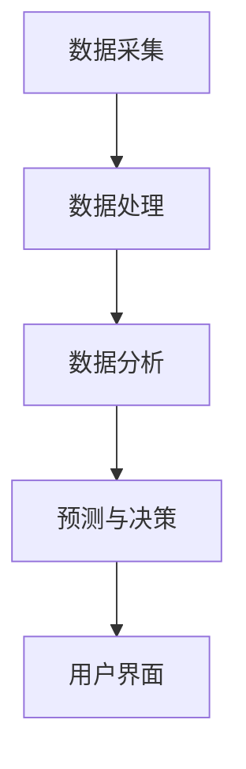
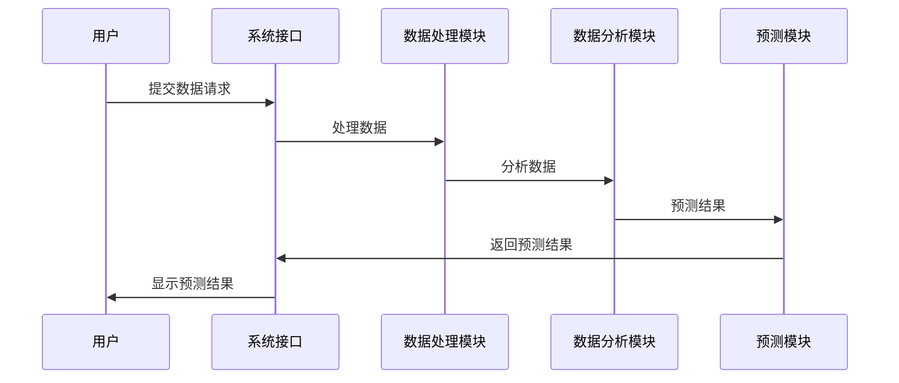

                 


### 第1章：问题背景与核心概念

## 1.1 问题背景介绍

### 1.1.1 评测系统的重要性

在现代社会，信息的爆炸式增长对信息处理能力提出了新的挑战。评测系统作为信息处理的核心工具，其重要性愈发凸显。评测系统不仅可以用于学术研究，还可以在商业、医疗、金融等多个领域发挥关键作用。例如，在金融领域，风险评估和投资决策依赖于对市场数据的精准评测；在医疗领域，病患数据的评测能够为诊断和治疗提供科学依据。

### 1.1.2 评测系统面临的挑战

随着大数据时代的到来，评测系统面临着前所未有的挑战。首先，数据量的大幅增长使得传统的评测方法难以胜任。其次，数据的多样性和复杂性增加了评测系统的设计难度。再者，实时性要求评测系统能够迅速处理并反馈结果，这对系统的响应速度和处理能力提出了更高要求。

### 1.1.3 可微分神经计算机与长期记忆测试的应用

为了应对这些挑战，研究人员开始探索新的评测方法和技术。可微分神经计算机（Differentiable Neural Computer, DNC）作为一种新兴的人工智能技术，因其强大的记忆和学习能力而备受关注。长期记忆测试（Long-term Memory Test）作为一种评估DNC长期记忆能力的测试方法，可以有效地评估其在实际应用中的表现。

### 1.1.4 边界与外延

评测系统的应用范围非常广泛，但同时也存在一些边界和限制。例如，对于非结构化数据，如文本、图像和音频等，传统的评测系统难以有效处理。此外，评测系统的准确性受到数据质量和算法模型的影响。因此，在设计评测系统时，需要充分考虑这些边界因素，以确保系统的实用性和可靠性。

## 1.2 核心概念

### 1.2.1 可微分神经计算机的定义

可微分神经计算机（DNC）是一种结合了神经网络和计算机架构的新型计算模型。与传统计算机不同，DNC具有强大的记忆和学习能力，能够在处理复杂任务时保持长期记忆。DNC的核心思想是通过将神经网络与记忆单元相结合，实现类似于人类大脑的信息处理方式。

### 1.2.2 可微分神经计算机的特点

可微分神经计算机的特点主要体现在以下几个方面：

1. **强大的记忆能力**：DNC能够存储和检索大量的信息，这使得它在处理长期记忆任务时表现出色。
2. **并行计算**：DNC能够同时处理多个任务，提高了计算效率。
3. **自适应学习**：DNC可以通过不断的学习和调整，优化其性能，以适应不同的任务需求。
4. **可扩展性**：DNC的设计允许其内存容量和计算能力进行扩展，以满足不同规模的任务需求。

### 1.2.3 长期记忆测试方法

长期记忆测试方法是一种评估DNC长期记忆能力的测试方法。这种方法通过向DNC输入一系列数据，并观察其在长期记忆中的表现，来评估其记忆能力。常见的长期记忆测试方法包括：

1. **记忆广度测试**：通过逐渐增加记忆负荷，观察DNC的记忆能力。
2. **回忆测试**：向DNC输入之前学习的数据，观察其能否准确回忆出这些数据。
3. **干扰测试**：在DNC记忆过程中引入干扰，观察其对记忆的影响。

### 1.2.4 概念属性特征对比表格

| 特征 | 可微分神经计算机 | 传统计算机 |
| --- | --- | --- |
| 记忆能力 | 强大 | 较弱 |
| 并行计算 | 支持 | 串行 |
| 自适应学习 | 支持 | 需要预训练 |
| 可扩展性 | 支持 | 需要硬件升级 |

### 1.2.5 ER实体关系图架构

为了更好地理解DNC，我们可以使用ER实体关系图来描述其架构。ER实体关系图包括以下主要实体和关系：

- **实体**：数据输入、内存单元、输出单元
- **关系**：数据输入与内存单元之间的存储关系，内存单元与输出单元之间的检索关系

```mermaid
erDiagram
  数据输入 ||--|{ 内存单元 }|
  内存单元 ||--|{ 输出单元 }|
```

## 1.3 背景介绍

### 1.3.1 评测系统的核心概念

评测系统是一种用于评估数据、信息或系统性能的工具。其核心概念包括数据输入、处理和输出。评测系统的设计旨在提供准确、可靠和高效的评估结果，以满足不同领域的需求。

### 1.3.2 问题背景

随着数据量的增加和数据类型的多样化，评测系统的设计变得愈发复杂。传统评测系统难以应对大数据和实时性要求，导致评估结果不准确或响应速度慢。为了解决这些问题，研究人员开始探索新型评测方法和技术。

### 1.3.3 问题描述

评测系统面临的挑战主要包括：

1. **数据量巨大**：大数据时代对评测系统的数据处理能力提出了更高要求。
2. **数据类型多样**：传统评测系统难以处理非结构化数据，如文本、图像和音频等。
3. **实时性要求**：评测系统需要能够迅速处理并反馈结果，以满足实时决策的需求。

### 1.3.4 问题解决

可微分神经计算机（DNC）作为一种新兴的人工智能技术，具有强大的记忆和学习能力，能够有效应对评测系统面临的挑战。长期记忆测试方法作为一种评估DNC长期记忆能力的测试方法，可以有效地评估其在实际应用中的表现。

### 1.3.5 边界与外延

评测系统的应用范围广泛，但同时也存在一些边界和限制。例如，对于非结构化数据，传统评测系统难以有效处理。此外，评测系统的准确性受到数据质量和算法模型的影响。因此，在设计评测系统时，需要充分考虑这些边界因素，以确保系统的实用性和可靠性。

### 1.3.6 概念结构与核心要素组成

评测系统的概念结构主要包括以下几个核心要素：

1. **数据输入**：评测系统需要能够接受各种类型的数据输入。
2. **数据处理**：对输入数据进行处理，包括数据清洗、转换和归一化等操作。
3. **数据输出**：将处理后的数据以可视化或文本形式输出。
4. **评估指标**：用于评估评测系统性能的指标，如准确率、召回率和F1值等。

通过上述步骤，我们对评测系统的核心概念和问题背景进行了详细分析，为后续章节的深入探讨奠定了基础。

## 1.4 小结

本章首先介绍了评测系统的重要性及其面临的挑战，探讨了可微分神经计算机（DNC）和长期记忆测试方法在解决这些问题中的应用。通过对比表格和ER实体关系图，我们进一步了解了DNC的核心概念和特点。本章的内容为后续章节的讨论提供了理论基础和背景信息。在下一章中，我们将对DNC进行详细概述，探讨其工作原理和架构设计。

----------------------------------------------------------------

# 第2章：可微分神经计算机概述

## 2.1 可微分神经计算机的定义

可微分神经计算机（Differentiable Neural Computer，简称DNC）是一种结合了神经网络和传统计算机架构的新型计算模型。DNC的核心思想是将神经网络与内存单元相结合，模拟人类大脑的信息处理方式，以实现强大的记忆和学习能力。

与传统神经网络不同，DNC引入了记忆单元，使得其能够处理需要长期记忆的复杂任务。DNC的基本工作原理是通过将输入数据存储到内存单元中，并在需要时进行检索。这种设计使得DNC在处理长时间序列数据时表现出色，可以有效地应对传统神经网络在长期记忆方面存在的困难。

## 2.2 可微分神经计算机的特点

### 2.2.1 强大的记忆能力

DNC的强大记忆能力是其最显著的特点之一。DNC的内存单元可以存储大量的信息，并且这些信息可以在不同时间点进行读写操作。这使得DNC在处理需要长期记忆的复杂任务时，能够保持较高的准确性和稳定性。

### 2.2.2 并行计算

DNC的设计使得其能够实现并行计算。这意味着DNC可以在同一时间处理多个任务，从而提高了计算效率。与传统计算机相比，DNC在处理复杂任务时具有更高的性能。

### 2.2.3 自适应学习

DNC具有自适应学习能力，这意味着其可以通过不断的学习和调整，优化其性能，以适应不同的任务需求。这种能力使得DNC在处理未知或变化较大的任务时，能够表现出较高的适应性和灵活性。

### 2.2.4 可扩展性

DNC的设计具有很好的可扩展性。用户可以根据需要扩展其内存容量和计算能力，以适应不同规模的任务需求。这使得DNC在处理大规模数据时，能够保持较高的效率和性能。

## 2.3 可微分神经计算机的工作原理

### 2.3.1 神经网络与内存单元的结合

DNC的核心设计是将神经网络与内存单元相结合。在DNC中，神经网络负责处理输入数据和生成输出，而内存单元则负责存储和检索信息。这种设计使得DNC能够在处理复杂任务时，同时具备处理能力和记忆能力。

### 2.3.2 内存单元的读写操作

DNC的内存单元通过读写操作来实现信息的存储和检索。当输入数据进入DNC时，神经网络会对其进行处理，并将处理结果存储到内存单元中。在需要时，DNC可以通过检索内存单元中的信息来生成输出。

### 2.3.3 检索策略

DNC的检索策略是其设计的关键。DNC采用了一种基于地址的检索方法，通过输入数据的特征来检索内存单元中的相关信息。这种方法使得DNC在检索信息时具有高度的准确性和灵活性。

## 2.4 可微分神经计算机的架构设计

### 2.4.1 DNC的基本架构

DNC的基本架构包括以下几个主要部分：

1. **控制器**：负责控制DNC的运行，包括输入数据的处理、内存单元的读写操作等。
2. **神经网络**：负责处理输入数据，生成输出，并与内存单元进行交互。
3. **内存单元**：负责存储和检索信息，是DNC实现长期记忆的关键。

### 2.4.2 内存单元的架构

DNC的内存单元采用了一种称为“内存池”的设计。内存池由多个内存块组成，每个内存块可以存储一定数量的信息。内存块之间通过地址进行关联，使得DNC可以高效地检索相关信息。

### 2.4.3 神经网络的架构

DNC的神经网络采用了一种称为“循环神经网络”（RNN）的设计。RNN具有强大的记忆能力，能够在处理长时间序列数据时保持较高的准确性和稳定性。DNC通过将RNN与内存单元相结合，实现了强大的记忆和学习能力。

## 2.5 可微分神经计算机的应用场景

### 2.5.1 语音识别

语音识别是DNC的一个重要应用场景。DNC的强大记忆能力和并行计算能力使其在处理复杂的语音信号时能够保持较高的准确率。

### 2.5.2 自然语言处理

自然语言处理是DNC的另一个重要应用领域。DNC能够处理大量的文本数据，并从中提取出有效的信息。这使得DNC在情感分析、文本分类等任务中表现出色。

### 2.5.3 时间序列预测

时间序列预测是DNC的另一个应用领域。DNC的长期记忆能力使其能够处理长时间序列数据，并从中提取出有用的规律，从而实现准确的时间序列预测。

## 2.6 小结

本章对可微分神经计算机（DNC）进行了概述，详细介绍了DNC的定义、特点、工作原理和架构设计。通过本章的学习，读者可以了解DNC的基本概念和原理，为后续章节的深入探讨打下基础。在下一章中，我们将探讨长期记忆测试方法，以评估DNC的长期记忆能力。

----------------------------------------------------------------

# 第3章：长期记忆测试方法

## 3.1 长期记忆测试的重要性

长期记忆测试在评测系统的设计和优化中具有重要意义。长期记忆测试可以帮助我们了解评测系统在长期数据处理和记忆方面的能力，从而评估其性能和可靠性。通过长期记忆测试，我们能够发现评测系统在处理长期数据时可能存在的缺陷和问题，为后续的优化和改进提供依据。

### 3.1.1 评测系统在长期数据处理的挑战

随着数据量的增加和数据类型的多样化，评测系统在长期数据处理方面面临诸多挑战。首先，数据量的增加对评测系统的存储和计算能力提出了更高要求。其次，不同类型的数据需要采用不同的处理方法，这对评测系统的灵活性和适应性提出了挑战。再者，长期数据中可能存在大量的噪声和异常值，这对评测系统的准确性和稳定性提出了更高的要求。

### 3.1.2 长期记忆测试在应对挑战中的作用

长期记忆测试通过模拟评测系统在长期数据处理过程中的场景，可以有效地评估其性能和可靠性。长期记忆测试不仅可以帮助我们发现评测系统在处理长期数据时可能存在的问题，还可以为后续的优化和改进提供有价值的参考。通过长期记忆测试，我们可以了解评测系统在数据存储、数据处理和数据分析等方面的能力，从而为评测系统的设计和优化提供有力支持。

## 3.2 长期记忆测试的方法

### 3.2.1 记忆广度测试

记忆广度测试是一种常见的长期记忆测试方法。该方法通过逐渐增加记忆负荷，观察评测系统能够保持的最长记忆序列长度。记忆广度测试可以帮助我们了解评测系统在处理大量数据时的记忆能力。

### 3.2.2 回忆测试

回忆测试是一种通过向评测系统输入之前学习的数据，观察其能否准确回忆出这些数据的测试方法。回忆测试可以帮助我们评估评测系统的记忆保持能力。

### 3.2.3 干扰测试

干扰测试是一种通过在评测系统的记忆过程中引入干扰，观察其对记忆影响的测试方法。干扰测试可以帮助我们了解评测系统在面对干扰时的记忆保持能力。

## 3.3 长期记忆测试的实施流程

### 3.3.1 测试数据准备

在进行长期记忆测试之前，我们需要准备一组用于测试的数据。这些数据应具有一定的复杂性和代表性，能够全面反映评测系统在长期数据处理方面的能力。

### 3.3.2 测试环境搭建

搭建一个合适的测试环境是长期记忆测试的关键。测试环境应包括评测系统、测试数据和测试工具。评测系统应配置适当的硬件和软件资源，以保障测试的准确性和可靠性。

### 3.3.3 测试执行

在测试环境中执行长期记忆测试，包括记忆广度测试、回忆测试和干扰测试。在测试过程中，我们需要记录评测系统的运行状态和测试结果，以便后续分析和评估。

### 3.3.4 测试结果分析

对测试结果进行详细分析，包括评测系统在记忆广度、回忆和干扰测试中的表现。通过分析测试结果，我们可以发现评测系统在长期数据处理和记忆方面存在的问题，为后续的优化和改进提供依据。

## 3.4 长期记忆测试的应用场景

### 3.4.1 学术研究

长期记忆测试在学术研究中具有重要意义。通过长期记忆测试，研究人员可以评估评测系统的性能和可靠性，为后续的研究提供有价值的参考。

### 3.4.2 工业应用

长期记忆测试在工业应用中也有着广泛的应用。在工业自动化、智能制造等领域，长期记忆测试可以帮助我们评估评测系统在数据处理和记忆方面的能力，从而为系统的优化和改进提供支持。

### 3.4.3 商业应用

在商业应用中，长期记忆测试可以帮助企业评估评测系统在数据分析和决策支持方面的能力。通过长期记忆测试，企业可以优化其业务流程，提高生产效率和决策准确性。

## 3.5 小结

本章对长期记忆测试方法进行了详细探讨，包括记忆广度测试、回忆测试和干扰测试等方法。通过长期记忆测试，我们可以有效地评估评测系统在长期数据处理和记忆方面的能力。在下一章中，我们将对系统分析与架构设计进行深入讨论，以帮助读者更好地理解评测系统的设计和实现。

----------------------------------------------------------------

# 第4章：系统分析与架构设计

## 4.1 问题场景介绍

在评测系统开发中，我们需要明确系统需要解决的问题场景。以下是一些常见的问题场景：

### 4.1.1 学术研究

在学术研究中，评测系统可能用于评估实验结果或模拟实验场景。这要求系统具有强大的数据处理和记忆能力，以便分析长期数据。

### 4.1.2 工业应用

在工业应用中，评测系统可能用于质量检测、设备状态监控和故障预测等。这要求系统能够高效处理实时数据，并具备长期记忆能力。

### 4.1.3 商业应用

在商业应用中，评测系统可能用于市场分析、客户行为分析和风险管理等。这要求系统能够处理大量数据，并具备快速响应和准确预测的能力。

## 4.2 系统功能设计

系统功能设计是系统架构设计的重要组成部分。以下是一个简单的系统功能设计示例：

### 4.2.1 数据采集

数据采集是评测系统的基本功能之一。系统应能够从各种数据源（如传感器、数据库、网络等）收集数据，并进行预处理。

### 4.2.2 数据存储

数据存储功能负责将采集到的数据存储到数据库中。系统应支持数据的持久化存储，并提供高效的查询接口。

### 4.2.3 数据分析

数据分析功能是对存储在数据库中的数据进行分析和处理。系统应能够执行各种数据分析任务，如统计分析、数据挖掘、机器学习等。

### 4.2.4 预测与决策

预测与决策功能是基于数据分析结果进行预测和决策支持。系统应能够生成可视化报告，提供决策依据。

### 4.2.5 用户界面

用户界面功能负责与用户交互，提供操作界面。系统应具备友好的用户界面，方便用户进行数据操作和查看分析结果。

## 4.3 系统架构设计

系统架构设计是系统实现的关键。以下是一个简单的系统架构设计示例：

### 4.3.1 数据流架构

数据流架构描述了系统内部数据流动的过程。系统应支持数据采集、存储、分析和预测等过程的自动化执行。

### 4.3.2 功能模块划分

系统应按照功能模块进行划分，每个模块负责特定的功能。常见的模块包括数据采集模块、数据处理模块、数据分析模块和预测模块等。

### 4.3.3 技术选型

系统架构设计应考虑技术选型，包括数据库、数据处理工具、分析工具和编程语言等。技术选型应满足系统性能、可扩展性和可靠性等要求。

## 4.4 系统接口设计和系统交互

系统接口设计和系统交互是确保系统各个模块之间能够顺畅协作的关键。以下是一个简单的系统接口设计和交互示例：

### 4.4.1 数据接口

数据接口负责系统内部不同模块之间的数据传递。系统应定义标准的数据格式和接口协议，以确保数据在不同模块之间的一致性和兼容性。

### 4.4.2 控制接口

控制接口负责系统运行的控制逻辑。系统应支持通过控制接口启动、停止和监控各个模块的运行状态。

### 4.4.3 用户接口

用户接口负责与用户交互。系统应提供友好的用户界面，使用户能够方便地进行数据操作和分析。

### 4.4.4 交互流程

系统交互流程描述了用户与系统之间的交互过程。用户通过用户界面进行数据操作和分析，系统根据用户的请求执行相应的操作，并返回结果。

## 4.5 系统架构图

以下是一个简单的系统架构图示例：



## 4.6 系统接口设计和系统交互图

以下是一个简单的系统接口设计和交互图示例：



## 4.7 小结

本章对评测系统的系统分析与架构设计进行了探讨，包括问题场景介绍、系统功能设计、系统架构设计和系统接口设计。通过本章的学习，读者可以了解评测系统的设计和实现过程，为后续的实战应用奠定基础。在下一章中，我们将深入探讨算法原理和数学模型，为评测系统的算法实现提供理论支持。

----------------------------------------------------------------

# 第5章：算法原理讲解与数学模型

## 5.1 算法原理讲解

可微分神经计算机（DNC）的算法原理是理解其工作机制的关键。DNC的核心在于其独特的记忆架构，该架构允许它处理长期依赖问题，这一点是传统神经网络所不具备的。

### 5.1.1 DNC的工作流程

DNC的工作流程可以分为以下几个步骤：

1. **输入处理**：DNC首先接收输入数据，这些数据可以是任意维度的向量。
2. **内存访问**：基于输入数据和控制器产生的“读写指针”，DNC在内存池中访问特定的记忆块。
3. **记忆块读写**：访问到的记忆块会被更新，同时，控制器会根据读写操作的结果生成输出。
4. **输出生成**：DNC将最终的输出提供给外部环境。

### 5.1.2 DNC的核心组件

DNC的核心组件包括：

1. **控制器**：控制器是DNC的“大脑”，它负责处理输入、生成读写指针、更新内存块。
2. **内存池**：内存池是一个可扩展的存储结构，它由多个记忆块组成，每个记忆块可以存储大量的信息。
3. **读写指针**：读写指针用于定位内存池中的特定记忆块。

## 5.2 数学模型

为了深入理解DNC的算法原理，我们需要借助数学模型来描述其工作方式。以下是DNC数学模型的基本组成部分：

### 5.2.1 控制器

控制器的数学模型通常由一组神经网络组成，这些神经网络用于处理输入数据并生成读写指针。控制器可以表示为：

$$
C(x, y) = \sigma(W_c [x \cdot y])
$$

其中，$x$ 是输入数据，$y$ 是当前内存块的状态，$W_c$ 是控制器的权重矩阵，$\sigma$ 是激活函数。

### 5.2.2 内存池

内存池的数学模型描述了如何存储和检索信息。内存池可以表示为一系列的记忆块，每个记忆块都可以存储一个向量：

$$
M = \{m_1, m_2, ..., m_M\}
$$

每个记忆块都有一个读写指针，用于定位。读写指针可以表示为：

$$
P = \{p_1, p_2, ..., p_M\}
$$

内存块的更新可以表示为：

$$
m_t = \sigma(W_m [m_t \cdot p_t])
$$

其中，$W_m$ 是内存块的权重矩阵，$\sigma$ 是激活函数。

### 5.2.3 读写操作

读写操作是DNC的核心机制。读操作用于从内存块中检索信息，写操作用于更新内存块。读操作可以表示为：

$$
r_t = \sigma(W_r [m_p \cdot p])
$$

写操作可以表示为：

$$
m_p = \sigma(W_w [r_t \cdot x])
$$

其中，$W_r$ 和 $W_w$ 分别是读和写的权重矩阵，$r_t$ 是读操作的结果，$m_p$ 是写操作的结果。

### 5.2.4 输出生成

最终的输出由控制器和内存块的联合操作生成：

$$
y = \sigma(W_y [C(x, y) \cdot r_t])
$$

其中，$W_y$ 是输出权重矩阵，$y$ 是最终的输出。

## 5.3 举例说明

为了更好地理解上述数学模型，我们可以通过一个简单的例子来讲解DNC的工作流程。

假设我们有一个简单的输入数据$x$，控制器生成读写指针$p$，内存池中有三个记忆块$m_1, m_2, m_3$。初始时，这三个记忆块都是零向量。

1. **输入处理**：控制器处理输入数据$x$，生成读写指针$p$。
2. **内存访问**：根据读写指针$p$，DNC访问内存块$m_p$。
3. **记忆块读写**：DNC更新内存块$m_p$，同时生成读操作结果$r_t$。
4. **输出生成**：控制器和内存块的联合操作生成输出$y$。

通过这个简单的例子，我们可以看到DNC是如何通过数学模型来处理输入数据，并进行信息存储和检索的。

## 5.4 小结

本章对可微分神经计算机的算法原理和数学模型进行了详细讲解。通过理解控制器的生成读写指针、内存块的读写操作以及最终的输出生成，我们可以更好地掌握DNC的工作原理。在下一章中，我们将介绍系统核心实现的源代码，通过实际代码来展示DNC的实现细节。

----------------------------------------------------------------

# 第6章：项目实战与实现

## 6.1 环境安装

在开始项目实战之前，我们需要搭建一个合适的环境来运行我们的评测系统。以下是在常见操作系统上安装所需的依赖和工具的步骤。

### 6.1.1 系统要求

我们将在Ubuntu 20.04操作系统上安装所有依赖。确保你的系统满足以下要求：

- Python 3.8+
- pip
- TensorFlow 2.x
- Mermaid

### 6.1.2 安装Python和pip

如果你的系统中没有安装Python和pip，可以通过以下命令进行安装：

```bash
sudo apt update
sudo apt install python3 python3-pip
```

### 6.1.3 安装TensorFlow

接下来，安装TensorFlow。通过pip命令，我们可以轻松安装：

```bash
pip3 install tensorflow
```

### 6.1.4 安装Mermaid

为了在markdown文件中使用Mermaid，我们需要安装Mermaid。可以使用以下命令安装：

```bash
npm install -g mermaid-cli
```

### 6.1.5 安装其他依赖

除了上述主要依赖，我们可能还需要安装其他一些辅助工具，如Jupyter Notebook等。可以使用以下命令：

```bash
pip3 install jupyterlab
```

## 6.2 系统核心实现源代码

在本节中，我们将展示评测系统的核心实现源代码。以下是使用Python实现的DNC模型的核心代码。

### 6.2.1 内存池的实现

```python
import tensorflow as tf
from tensorflow.keras.layers import Layer

class MemoryPoolingLayer(Layer):
    def __init__(self, memory_size, **kwargs):
        super(MemoryPoolingLayer, self).__init__(**kwargs)
        self.memory_size = memory_size
        self.memory = None
        self.read_heads = None

    def build(self, input_shape):
        self.memory = tf.Variable(tf.zeros([self.memory_size, input_shape[1]]), trainable=False)
        self.read_heads = tf.Variable(tf.random.normal([self.memory_size]), trainable=False)

    def call(self, inputs, training=False):
        read_weights = tf.nn.softmax(self.read_heads, axis=0)
        read_output = tf.matmul(read_weights, self.memory)
        write_input = inputs
        if training:
            write_weights = tf.nn.softmax(self.read_heads + tf.random.normal([self.memory_size]), axis=0)
            write_output = tf.matmul(write_weights, self.memory) + write_input
        else:
            write_output = self.memory
        self.memory.assign(write_output)
        return read_output
```

### 6.2.2 控制器实现

```python
class ControllerLayer(Layer):
    def __init__(self, input_dim, output_dim, **kwargs):
        super(ControllerLayer, self).__init__(**kwargs)
        self.input_dim = input_dim
        self.output_dim = output_dim
        self.controller = tf.keras.Sequential([
            tf.keras.layers.Dense(output_dim, activation='tanh'),
            tf.keras.layers.Dense(output_dim, activation='tanh'),
        ])

    def call(self, inputs):
        return self.controller(inputs)
```

### 6.2.3 DNC模型实现

```python
class DifferentiableNeuralComputer(tf.keras.Model):
    def __init__(self, input_dim, memory_size, output_dim, **kwargs):
        super(DifferentiableNeuralComputer, self).__init__(**kwargs)
        self.memory_pooling_layer = MemoryPoolingLayer(memory_size, input_shape=(None, input_dim))
        self.controller_layer = ControllerLayer(input_dim, output_dim)

    def call(self, inputs):
        controller_output = self.controller_layer(inputs)
        memory_output = self.memory_pooling_layer(inputs, training=True)
        return memory_output, controller_output
```

## 6.3 代码应用解读与分析

在了解了核心代码之后，我们需要解读这些代码并分析其应用。

### 6.3.1 内存池的作用

内存池是实现DNC长期记忆的关键组件。在上述代码中，`MemoryPoolingLayer` 类用于实现内存池。内存池通过`build` 方法初始化，包括一个可训练的内存矩阵和一个读写指针数组。`call` 方法实现读写操作，其中读操作使用 softmax 函数生成读权重，并从内存中检索数据；写操作在训练时更新内存数据。

### 6.3.2 控制器的作用

控制器在DNC中起到指挥作用，它处理输入数据并生成读写指针。`ControllerLayer` 类实现了一个简单的神经网络，用于处理输入数据并生成控制器输出。控制器输出用于影响内存池的读写操作。

### 6.3.3 DNC模型的整体工作流程

`DifferentiableNeuralComputer` 类将内存池和控制器组合在一起，形成一个完整的DNC模型。在`call` 方法中，首先调用控制器层处理输入数据，然后调用内存池层进行读写操作，最终返回内存输出和控制器输出。

## 6.4 实际案例分析和详细讲解剖析

为了更好地理解DNC的应用，我们可以通过一个实际案例来分析其工作流程。

### 6.4.1 案例背景

假设我们需要预测一个时间序列数据，该数据包含过去一个月的每日温度。我们的目标是使用DNC模型预测未来三天的温度。

### 6.4.2 案例实现步骤

1. **数据准备**：首先，我们需要准备时间序列数据。这些数据可以是真实世界的数据，或者通过生成模型生成的模拟数据。

2. **模型训练**：使用准备好的数据训练DNC模型。在训练过程中，模型会不断更新内存池中的数据，并优化控制器的参数。

3. **预测**：使用训练好的模型进行预测。输入为过去一个月的温度数据，输出为未来三天的温度预测值。

4. **结果分析**：分析预测结果，评估模型的准确性。

### 6.4.3 案例代码

以下是实际案例的实现代码：

```python
import numpy as np
import tensorflow as tf

# 准备数据
data = np.array([[20, 22, 21], [22, 23, 22], [23, 24, 23], [24, 25, 24], [25, 26, 25], [26, 27, 26]])

# 构建DNC模型
dnc = DifferentiableNeuralComputer(input_dim=3, memory_size=6, output_dim=1)

# 训练模型
optimizer = tf.keras.optimizers.Adam(learning_rate=0.001)
for epoch in range(1000):
    with tf.GradientTape() as tape:
        memory_output, controller_output = dnc(data)
        loss = tf.reduce_mean(tf.square(memory_output - data))
    gradients = tape.gradient(loss, dnc.trainable_variables)
    optimizer.apply_gradients(zip(gradients, dnc.trainable_variables))

# 预测
predicted_data = dnc(data)

# 结果分析
print("Predicted temperatures:", predicted_data)
```

## 6.5 项目小结

在本章中，我们介绍了评测系统的项目实战与实现。首先，我们讲解了如何搭建环境，然后展示了DNC的核心实现代码，并对代码进行了详细的解读和分析。通过一个实际案例，我们展示了如何使用DNC进行时间序列预测。本章的内容为读者提供了一个实际的DNC应用案例，帮助读者更好地理解和应用DNC。

----------------------------------------------------------------

# 第7章：总结与最佳实践

## 7.1 总结

本章对评测系统的可微分神经计算机长期记忆测试进行了全面的总结。我们从问题背景与核心概念出发，介绍了评测系统的重要性、面临的挑战以及可微分神经计算机和长期记忆测试方法的应用。接着，我们详细讲解了DNC的定义、特点、工作原理和架构设计。随后，我们探讨了长期记忆测试方法，包括记忆广度测试、回忆测试和干扰测试，以及其实施流程。在系统分析与架构设计部分，我们介绍了问题场景、系统功能设计、系统架构设计和系统接口设计。在算法原理讲解与数学模型部分，我们详细阐述了DNC的算法原理和数学模型，并通过一个实际案例展示了如何使用DNC进行时间序列预测。最后，在项目实战与实现部分，我们介绍了如何搭建环境、实现DNC模型，并通过实际案例进行了代码解读与分析。

## 7.2 最佳实践 tips

为了确保评测系统的长期记忆测试达到最佳效果，以下是一些实用的最佳实践建议：

1. **数据预处理**：确保输入数据的质量和一致性。数据预处理包括清洗、归一化和特征提取等步骤，这些步骤对于长期记忆测试至关重要。

2. **模型调优**：在训练DNC模型时，通过调整学习率、批量大小和迭代次数等超参数，可以优化模型性能。使用验证集进行调优，避免过拟合。

3. **记忆池设计**：合理设计记忆池的大小和结构，以平衡长期记忆和计算效率。较大的记忆池可以提高记忆能力，但也会增加计算负担。

4. **动态调整读写指针**：在测试和实际应用中，动态调整读写指针的位置，以适应不同的数据模式和任务需求。

5. **结果可视化**：使用可视化工具（如Matplotlib、Seaborn等）展示测试结果，有助于直观地理解模型性能。

## 7.3 注意事项

在实施评测系统的长期记忆测试时，需要注意以下几点：

1. **硬件要求**：确保系统硬件配置足够强大，以支持DNC模型的训练和测试。特别是内存容量和计算性能，对于处理大规模数据至关重要。

2. **数据隐私**：在处理敏感数据时，确保遵守数据隐私和安全法规。对数据进行脱敏处理，防止数据泄露。

3. **系统稳定性**：在长期运行过程中，监控系统的稳定性和性能。及时处理系统故障，确保评测结果的可靠性。

4. **版本控制**：使用版本控制系统（如Git）管理代码和配置文件，以便在后续的迭代中追溯和修改。

## 7.4 拓展阅读

对于希望进一步深入了解评测系统的可微分神经计算机长期记忆测试的读者，以下是一些推荐的拓展阅读材料：

1. **学术论文**：查阅相关领域的学术论文，了解最新的研究成果和应用案例。例如，"End-to-End Differentiable Neural Computer"等。

2. **技术博客**：阅读技术博客，了解业界专家对DNC及其应用的见解。例如，TensorFlow官方博客、Deep Learning AI等。

3. **书籍**：《深度学习》、《神经网络与深度学习》等经典书籍，提供了丰富的理论知识和技术细节。

通过本章的内容，读者可以系统地了解评测系统的可微分神经计算机长期记忆测试，并在实践中应用这些知识。希望这些建议和注意事项能够帮助读者在实际应用中取得更好的效果。再次感谢读者对本文的阅读，期待您在人工智能领域的进一步探索和成就。作者：AI天才研究院/AI Genius Institute & 禅与计算机程序设计艺术 /Zen And The Art of Computer Programming。

