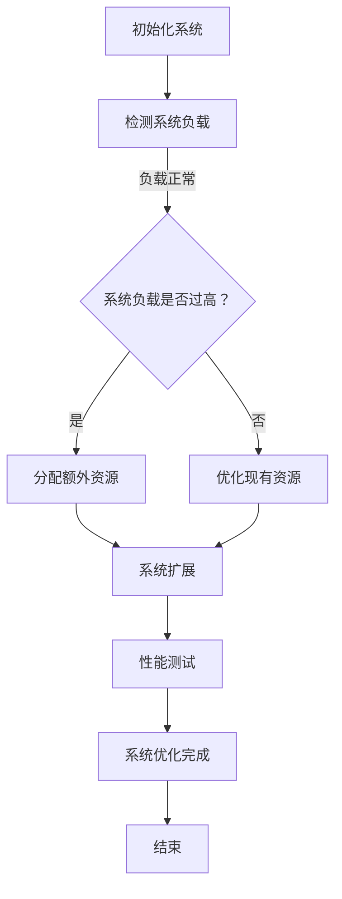
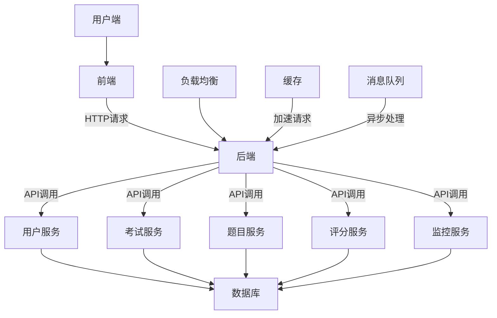
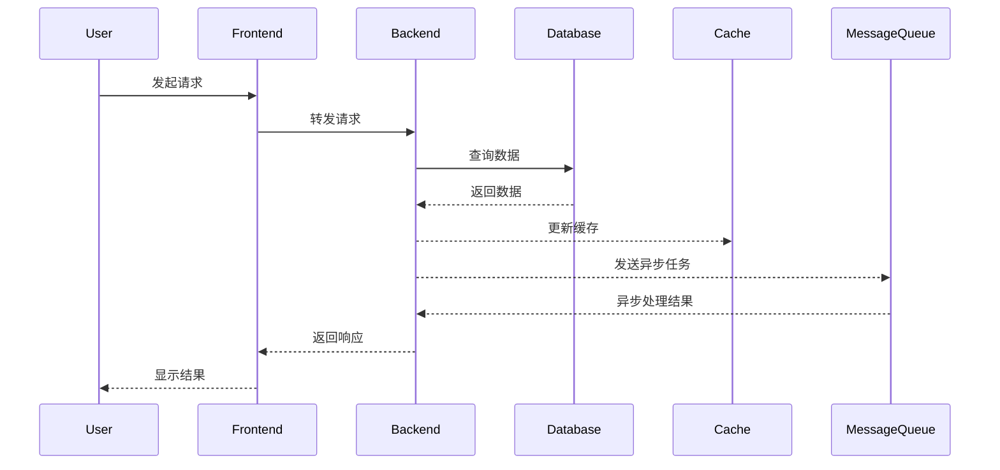

                 

### 引言

#### 1.1 背景介绍

随着信息技术的迅猛发展和互联网的普及，评测系统在现代教育、企业运营和软件开发中扮演着越来越重要的角色。评测系统用于评估用户或产品的表现，提供客观、量化的反馈。在快速变化和高度竞争的环境中，评测系统的可扩展性显得尤为关键。

首先，评测系统的重要性体现在其广泛应用场景上。在教育领域，评测系统帮助学生和教师了解学习进度和效果，从而进行针对性教学调整；在企业中，评测系统用于衡量员工的工作绩效，优化人力资源管理；在软件开发领域，评测系统用于测试代码质量和项目稳定性，确保产品按时发布。

然而，随着用户量、功能需求和数据规模的不断增加，传统的评测系统常常面临扩展性问题。首先，性能瓶颈可能导致系统响应速度下降，影响用户体验。其次，功能扩展性不足使得系统难以适应新的业务需求。此外，随着系统复杂度的增加，维护成本和难度也会显著提升。

因此，可扩展性设计成为评测系统设计中的关键环节。良好的可扩展性不仅能够应对当前的需求变化，还能为未来的发展预留空间，降低系统维护成本，提升系统稳定性和性能。接下来，本文将深入探讨评测系统的可扩展性设计，提供一套系统化、实用的解决方案。

#### 1.2 问题描述

##### 评测系统的可扩展性定义

评测系统的可扩展性（Scalability）是指系统能够在性能、功能和容量等方面随着需求的变化而灵活扩展的能力。具体来说，可扩展性包括以下三个方面：

1. **性能扩展性**：系统在处理能力上能够线性扩展，即在用户量或数据规模增加时，系统的响应速度和吞吐量保持稳定或仅轻微下降。
2. **功能扩展性**：系统能够在不影响现有功能的前提下，灵活地增加新的功能模块，以适应不断变化的需求。
3. **容量扩展性**：系统在硬件资源（如CPU、内存、存储等）不足时，能够通过增加硬件资源或优化资源利用率来实现性能的提升。

##### 可扩展性的基本要素和目标

为了实现评测系统的可扩展性，需要关注以下几个基本要素：

1. **模块化设计**：将系统分解为多个功能模块，每个模块独立开发、测试和部署，便于后续的扩展和维护。
2. **分布式架构**：通过分布式架构，将系统部署在多个服务器上，实现负载均衡和故障转移，提高系统的可用性和扩展性。
3. **可配置性**：系统应具备较高的可配置性，允许用户根据需求调整系统参数，如线程数、并发连接数、资源利用率等。
4. **自动化部署**：采用自动化部署工具，如CI/CD流水线，实现快速、可靠的系统更新和版本迭代。

可扩展性的目标是：

- **提高系统性能**：确保系统在面对大量用户和高并发请求时，仍能保持良好的响应速度和稳定性。
- **降低维护成本**：通过模块化设计和自动化部署，降低系统维护的复杂度和成本。
- **灵活应对变化**：系统应能够快速适应业务需求的变化，灵活扩展功能模块，以保持竞争力。

##### 评测系统扩展性不足的影响

评测系统扩展性不足将带来以下负面影响：

1. **性能瓶颈**：在用户量或数据规模增加时，系统性能急剧下降，导致用户体验恶化。
2. **功能滞后**：系统难以满足新业务需求，影响企业的发展和竞争力。
3. **维护困难**：系统复杂度增加，维护和更新变得更加困难，甚至可能影响系统的稳定性。
4. **资源浪费**：由于扩展性不足，可能需要频繁更换硬件设备或进行系统重构，导致资源浪费。

因此，提升评测系统的可扩展性具有重要意义，不仅能够应对当前的需求变化，还能为未来的发展奠定坚实基础。

#### 1.3 问题解决

##### 提高评测系统可扩展性的方法和策略

为了提高评测系统的可扩展性，可以采用以下方法和策略：

1. **模块化设计**：将系统分解为多个功能模块，每个模块独立开发、测试和部署。这样可以降低模块间的耦合度，便于后续的扩展和维护。

2. **分布式架构**：采用分布式架构，将系统部署在多个服务器上，实现负载均衡和故障转移。这样可以提高系统的可用性和扩展性，同时确保在用户量增加时系统性能保持稳定。

3. **可配置性**：设计系统时，要充分考虑可配置性，允许用户根据需求调整系统参数，如线程数、并发连接数、资源利用率等。这样可以灵活应对不同的业务场景和需求变化。

4. **自动化部署**：采用自动化部署工具，如CI/CD流水线，实现快速、可靠的系统更新和版本迭代。这样可以降低系统维护的复杂度和成本，提高系统的稳定性和可靠性。

5. **弹性计算**：利用云服务提供弹性计算资源，根据系统负载动态调整资源分配。这样可以避免资源浪费，同时确保系统在面对高并发请求时能够快速扩展。

6. **缓存机制**：采用缓存机制，如Redis或Memcached，提高系统缓存命中率，减少数据库压力。这样可以提高系统性能，减轻数据库负担，提升系统的扩展性。

7. **数据库优化**：优化数据库结构，如分库分表、读写分离、数据库集群等，提高数据库性能和扩展性。这样可以确保在数据规模增加时，系统性能不受影响。

##### 评测系统可扩展性评估指标

为了评估评测系统的可扩展性，可以采用以下指标：

1. **吞吐量**：系统在单位时间内能够处理的请求数量。吞吐量越高，说明系统的性能扩展性越好。

2. **响应时间**：系统处理请求的平均响应时间。响应时间越短，说明系统的性能扩展性越好。

3. **并发连接数**：系统同时处理的并发连接数量。并发连接数越高，说明系统的容量扩展性越好。

4. **资源利用率**：系统使用的硬件资源（如CPU、内存、存储等）的利用率。资源利用率越高，说明系统在资源分配上的效率越高。

5. **故障恢复时间**：系统在出现故障时，恢复到正常状态所需的时间。故障恢复时间越短，说明系统的稳定性越好。

6. **扩展成本**：系统在扩展过程中所需的成本，包括硬件采购、人力投入、维护费用等。扩展成本越低，说明系统的可扩展性越好。

通过以上方法和策略，结合评估指标，可以有效地提高评测系统的可扩展性，确保系统在面对需求变化时能够稳定运行，保持良好的性能和用户体验。

#### 1.4 边界与外延

##### 可扩展性与性能、稳定性、安全性之间的关系

可扩展性、性能、稳定性和安全性是评测系统设计中四大重要的设计目标，它们之间相互影响，共同决定了系统的整体质量和用户满意度。

1. **可扩展性与性能**：可扩展性旨在使系统能够适应未来需求的变化，而性能则关注系统在现有条件下的表现。良好的可扩展性设计可以确保系统在用户量或数据规模增加时，性能不会显著下降。然而，过度追求可扩展性可能会引入复杂的架构和冗余功能，从而影响性能。因此，在可扩展性设计时，需要平衡可扩展性和性能，确保系统在扩展的同时，性能指标依然保持优秀。

2. **可扩展性与稳定性**：稳定性是指系统在长时间运行中保持正常工作状态的能力。可扩展性设计中的模块化、分布式架构等技术可以提高系统的稳定性，因为它们能够有效地处理故障和负载波动。但是，如果扩展过程中引入了不稳定的组件或依赖关系，可能会导致系统稳定性下降。因此，在可扩展性设计时，需要特别注意系统的稳定性，确保扩展不会破坏现有的稳定性。

3. **可扩展性与安全性**：安全性是指系统能够抵御外部攻击和内部威胁的能力。在可扩展性设计中，可能需要引入新的组件和接口，这可能会增加系统的攻击面。此外，分布式架构中的节点可能面临不同安全威胁，需要特别关注跨节点的安全控制。良好的安全设计应该与可扩展性设计相融合，确保在扩展过程中不会降低系统的安全性。

##### 可扩展性在不同应用领域的差异

不同应用领域的评测系统在可扩展性设计上有不同的需求和侧重点。

1. **教育领域**：在教育领域，评测系统通常需要处理大量的并发请求，如在线考试和实时测评。可扩展性设计应重点关注性能和并发处理能力，确保系统在高负载情况下依然能够稳定运行。

2. **企业运营**：企业评测系统通常关注员工绩效评估和业务流程监控。可扩展性设计应侧重于功能扩展性和系统可配置性，以便灵活适应企业业务的变化和需求调整。

3. **软件开发**：在软件开发领域，评测系统主要用于代码审查和项目质量测试。可扩展性设计应注重模块化和自动化部署，确保系统可以快速适应项目需求的变化和大规模的测试任务。

4. **医疗领域**：医疗领域的评测系统通常需要处理敏感的医疗数据，且对数据的安全性和隐私保护要求极高。可扩展性设计时，除了考虑性能和功能扩展，还需特别关注数据安全和隐私保护。

综上所述，可扩展性设计是一个复杂且多层次的过程，需要根据不同应用领域的具体需求进行定制化设计，确保系统能够在性能、稳定性、安全性和可扩展性之间取得平衡。

#### 1.5 概念结构与核心要素组成

##### 可扩展性设计的关键组件

一个成功的可扩展性设计需要考虑多个关键组件，这些组件共同作用，确保系统在需求变化时能够灵活适应并保持高性能和高可靠性。以下是几个核心组件：

1. **模块化设计**：模块化是将系统分解为独立的、可重用的功能模块。每个模块具有明确的职责，可以在不影响其他模块的情况下独立开发、测试和部署。模块化设计不仅提高了代码的可维护性，还为系统的扩展提供了便捷的接口。

2. **分布式架构**：分布式架构是将系统的功能分散到多个节点上，通过负载均衡和冗余机制提高系统的可用性和扩展性。分布式架构允许系统水平扩展，即在需要时添加更多的服务器节点来处理增加的负载。

3. **服务化设计**：服务化是将系统的功能封装为服务，服务之间通过API进行通信。服务化设计使得系统具有高度的灵活性，可以方便地增加新服务或替换现有服务，同时确保系统的整体协调性。

4. **自动化部署**：自动化部署是通过CI/CD（持续集成/持续部署）工具实现系统的自动化构建、测试和部署。自动化部署提高了系统的交付效率，减少了人为错误，并确保系统能够快速响应需求变化。

5. **弹性计算**：弹性计算是利用云服务提供动态资源分配，根据系统的实际负载自动调整资源利用率。弹性计算确保系统在高峰期能够获得足够的资源，而在低峰期则可以节省资源，提高成本效益。

##### 可扩展性设计的核心原则

在可扩展性设计中，需要遵循一些核心原则来确保系统的高效和稳定：

1. **分层设计**：系统应该按照功能层次进行设计，每个层次独立负责特定功能，减少各层次间的耦合。分层设计有助于提高系统的扩展性，使得每个层次都可以独立扩展或优化。

2. **解耦与独立**：组件间应该保持松耦合，每个组件应独立运行，互不影响。通过解耦，可以在不影响系统其他部分的情况下独立升级或替换某个组件。

3. **高内聚**：每个模块应该具有高度内聚性，即模块内部的逻辑应紧密相关，降低模块间的依赖。高内聚有助于提高模块的复用性和可维护性，同时也有利于系统的扩展。

4. **冗余与备份**：系统应该具备一定的冗余机制，如数据备份和节点备份，以防止单点故障导致系统不可用。冗余和备份机制提高了系统的可靠性，保证了系统的持续运行。

5. **动态调整**：系统应该具备动态调整资源的能力，根据实际负载自动调整硬件资源分配。动态调整能够确保系统在面临不同负载时始终处于最优状态。

通过遵循这些核心原则和关键组件的设计，可以实现一个具有良好可扩展性的评测系统，从而在应对未来需求变化时保持高效和稳定。

#### 1.6 本章小结

在本章中，我们首先介绍了评测系统在现代技术环境中的重要性和面临的扩展性挑战。我们明确了评测系统的可扩展性定义，并探讨了其基本要素和目标。通过分析扩展性不足带来的负面影响，我们提出了一系列提高评测系统可扩展性的方法和策略。此外，我们还讨论了可扩展性与性能、稳定性、安全性之间的关系，并阐述了在不同应用领域中的差异。最后，我们详细介绍了可扩展性设计的关键组件和核心原则。这些内容为后续章节的深入探讨奠定了坚实基础。

### 核心概念与联系

#### 2.1 可扩展性原理

可扩展性是评测系统设计中的一个核心概念，它涉及系统的各个层面，从硬件到软件，从架构到具体实现。要深入理解可扩展性，我们需要先了解其基本原理和理论基础。

##### 扩展性的基本理论

1. **扩展性的定义**：
   - **性能扩展性**：系统在增加用户量或负载时，性能不会显著下降的能力。
   - **功能扩展性**：系统可以灵活添加或修改功能模块，以满足不断变化的需求。
   - **容量扩展性**：系统可以增加存储和处理资源，以应对数据量和用户量的增长。

2. **扩展性与模块化设计的关系**：
   - **模块化设计**：将系统分解为若干独立的模块，每个模块负责特定的功能。模块化设计有助于降低系统的复杂度，提高可维护性和可扩展性。
   - **松耦合**：模块间通过标准的接口进行通信，降低模块间的依赖性。松耦合使得每个模块可以独立开发、测试和部署，便于系统的扩展。

3. **扩展性与分布式架构**：
   - **分布式架构**：通过将系统功能分布到多个节点上，实现负载均衡和故障转移。分布式架构提高了系统的可用性和扩展性，因为系统可以在多个节点上并行处理请求。
   - **水平扩展**：通过增加节点数来提高系统的处理能力。水平扩展是提升系统性能和可扩展性的常见方法。

##### 可扩展性与软件架构

1. **分层架构**：
   - **三层架构**：将系统分为表示层、业务逻辑层和数据层。这种分层架构使得系统中的每一层都可以独立扩展和优化，提高了系统的可扩展性。
   - **微服务架构**：将系统拆分为多个独立的服务，每个服务负责特定的业务功能。微服务架构通过服务间的松耦合和标准化接口，实现了系统的灵活扩展。

2. **服务化架构**：
   - **服务化**：将系统的功能封装为服务，服务通过API进行通信。服务化设计使得系统可以灵活地添加或替换服务，提高了系统的扩展性和可维护性。
   - **服务自治**：每个服务拥有自己的数据存储和处理逻辑，服务之间通过接口通信。服务自治使得每个服务可以独立扩展和优化，减少了系统间的耦合。

3. **容器化和虚拟化**：
   - **容器化**：使用Docker等容器技术，将应用及其依赖环境封装为独立的容器。容器化提高了系统的可移植性和扩展性，因为容器可以在不同的环境中运行而不影响其性能。
   - **虚拟化**：通过虚拟化技术，将物理硬件资源虚拟化为多个逻辑资源，从而实现资源的动态分配和优化。虚拟化技术是提升系统扩展性和灵活性的重要手段。

#### 2.2 可扩展性属性特征对比表格

为了更直观地理解评测系统的可扩展性，我们列出以下属性特征对比表格，涵盖性能扩展性、功能扩展性和容量扩展性三个方面。

| 扩展性类型 | 定义 | 特点 |
| :--: | :--: | :--: |
| **性能扩展性** | 系统在用户量或负载增加时，性能保持稳定或仅轻微下降的能力。 | - 响应时间保持稳定或仅轻微增加 |
|              |      | - 吞吐量随着资源增加而线性提升 |
| **功能扩展性** | 系统在不影响现有功能的前提下，可以灵活地增加新功能模块的能力。 | - 独立模块可随时添加或删除 |
|              |      | - 模块间通过标准化接口通信 |
| **容量扩展性** | 系统在硬件资源不足时，可以通过增加资源或优化资源利用率来实现性能提升的能力。 | - 可动态调整硬件资源 |
|              |      | - 资源利用率高，避免资源浪费 |

通过以上对比表格，我们可以更清晰地看到不同扩展性类型的定义和特点，从而在设计评测系统时，有针对性地选择和应用相应的扩展性策略。

#### 2.3 ER实体关系图架构

为了更好地理解评测系统的可扩展性设计，我们需要借助实体关系图（Entity-Relationship Diagram，ERD）来描绘系统中的关键实体及其关系。以下是评测系统ERD的基本架构，采用Mermaid语言进行表示。

```mermaid
erDiagram
    User ||--o> Exam : "参加"
    User ||--o> Result : "查看"
    Exam ||--|> Question : "包含"
    Exam ||--|> Score : "记录"
    Result ||--|> Score : "包含"
    Question ||--|> Option : "包含"
    Score ||--|> User : "评价"
```

##### 实体-关系模型

1. **User（用户）**：
   - 用户是系统的核心实体，代表评测系统的使用者和参与者。
   - 关系：用户可以参加考试、查看成绩。

2. **Exam（考试）**：
   - 考试是评测系统中的一个重要实体，代表用户参加的评测活动。
   - 关系：考试包含问题和成绩。

3. **Question（问题）**：
   - 问题实体代表评测中的题目。
   - 关系：问题包含选项。

4. **Option（选项）**：
   - 选项实体代表问题的各个选项。
   - 关系：选项属于某个问题。

5. **Score（成绩）**：
   - 成绩实体代表用户在考试中的得分情况。
   - 关系：成绩记录用户的评价，属于某个考试。

6. **Result（结果）**：
   - 结果实体代表用户考试后的总体成绩。
   - 关系：结果包含成绩，用户可以查看结果。

通过上述ERD模型，我们可以清晰地看到评测系统中各个实体及其之间的关系。这种结构化设计有助于我们理解系统中的数据流和功能模块，为后续的系统扩展提供了明确的指导。

### 算法原理讲解

#### 3.1 扩展算法设计

扩展算法是评测系统可扩展性设计中的关键组成部分，主要用于提升系统的性能、功能以及容量。以下我们将详细介绍几种常见的扩展算法，并讨论选择这些算法的标准。

##### 常见扩展算法简介

1. **分库分表算法**：
   - **原理**：将数据库拆分为多个独立的数据库或数据表，每个库或表负责处理特定范围的数据。这样可以在数据规模增加时，通过水平扩展数据库来提升系统的处理能力。
   - **适用场景**：适用于数据量巨大且查询频率较高的系统。

2. **缓存算法**：
   - **原理**：将频繁访问的数据存储在缓存中，减少对后端数据库的访问压力。常见的缓存算法有LRU（Least Recently Used）、LFU（Least Frequently Used）等。
   - **适用场景**：适用于读多写少的应用场景，如用户登录、商品查询等。

3. **负载均衡算法**：
   - **原理**：通过将请求分配到多个服务器或节点，实现负载的均衡分配。常见的负载均衡算法有轮询（Round Robin）、最少连接（Least Connections）等。
   - **适用场景**：适用于高并发、大规模分布式系统。

4. **弹性计算算法**：
   - **原理**：根据系统的实际负载动态调整硬件资源，如CPU、内存、存储等。常见的弹性计算平台有Amazon EC2、Google Compute Engine等。
   - **适用场景**：适用于需要根据负载动态调整资源的使用场景。

##### 扩展算法的选择标准

1. **性能需求**：
   - 选择扩展算法时，首先需要考虑系统的性能需求，包括处理速度、响应时间等。性能需求决定了算法的适用性。

2. **可扩展性需求**：
   - 系统的可扩展性需求决定了算法的选择。例如，如果系统需要处理大量数据，分库分表算法可能是最佳选择；如果系统需要处理高并发请求，负载均衡算法则是不可或缺的。

3. **资源成本**：
   - 扩展算法的选择还需要考虑资源成本，包括硬件成本、运维成本等。选择性价比高的算法，可以降低系统的总体成本。

4. **系统复杂性**：
   - 算法的复杂性会影响系统的维护和扩展。选择易于理解和实施的算法，可以提高系统的稳定性和可维护性。

5. **兼容性需求**：
   - 选择扩展算法时，需要考虑与现有系统架构的兼容性。确保所选算法能够无缝集成到现有系统中，避免引入新的复杂性和风险。

通过以上分析，我们可以根据具体的应用场景和需求，选择适合的扩展算法，从而实现评测系统的可扩展性设计。接下来，我们将通过具体的算法流程图和代码实现，进一步探讨扩展算法的原理和应用。

#### 3.2 算法Mermaid流程图

为了更直观地展示扩展算法的基本流程，我们可以使用Mermaid语言绘制流程图。以下是扩展算法的基本流程图示例：



在上面的流程图中，系统首先进行初始化。接着，系统检测当前的负载情况。如果系统负载过高，将分配额外的资源（如增加服务器节点或调整缓存策略）；如果负载正常，则通过优化现有资源来提升系统性能。随后，系统进行性能测试，确保扩展或优化措施有效。最后，系统完成优化并结束流程。

这个流程图展示了扩展算法的基本步骤，包括初始化、负载检测、资源分配、性能测试等关键环节。通过这个流程图，我们可以清晰地看到系统在不同负载情况下的应对策略，从而实现系统的灵活扩展和高效运行。

#### 3.3 Python源代码实现

为了具体展示扩展算法的实现过程，我们将使用Python语言编写一段代码，描述扩展算法的执行步骤。以下是一个简单的扩展算法实现示例：

```python
import threading
import time

# 假设这是一个评测系统的基础模块
class BaseSystem:
    def __init__(self):
        self.load = 0

    def process_request(self):
        # 模拟处理请求的过程
        time.sleep(1)
        self.load += 1
        print(f"Processing request {self.load}")

# 扩展算法的实现
class ScalableSystem(BaseSystem):
    def __init__(self, num_workers):
        super().__init__()
        self.num_workers = num_workers
        self.workers = [threading.Thread(target=self.process_request) for _ in range(num_workers)]

    def start_workers(self):
        for worker in self.workers:
            worker.start()

    def join_workers(self):
        for worker in self.workers:
            worker.join()

    def scale_up(self):
        # 分配额外资源，增加worker数量
        self.num_workers += 1
        new_worker = threading.Thread(target=self.process_request)
        self.workers.append(new_worker)
        new_worker.start()

    def scale_down(self):
        # 减少资源，移除worker
        if self.num_workers > 1:
            self.workers.pop().join()
            self.num_workers -= 1

    def run(self):
        self.start_workers()
        self.join_workers()

# 测试扩展算法
if __name__ == "__main__":
    base_system = BaseSystem()
    base_system.run()

    scalable_system = ScalableSystem(num_workers=2)
    scalable_system.run()

    # 假设系统负载过高，需要扩展
    scalable_system.scale_up()
    scalable_system.run()

    # 假设负载恢复正常，需要缩减资源
    scalable_system.scale_down()
    scalable_system.run()
```

在这个Python代码实现中，我们首先定义了一个基础评测系统`BaseSystem`，其具有处理请求的功能。接着，我们定义了一个扩展系统`ScalableSystem`，它继承自`BaseSystem`，并增加了资源分配和缩放的功能。`ScalableSystem`通过动态调整`worker`数量来扩展或缩减系统资源。

在测试部分，我们首先运行基础系统，然后运行扩展系统，并模拟系统负载过高的场景，调用`scale_up()`方法增加资源。接着，我们模拟负载恢复正常，调用`scale_down()`方法缩减资源。通过这个简单的例子，我们可以看到扩展算法在Python中的实现过程，以及如何通过动态调整资源来提高系统的可扩展性。

#### 3.4 数学模型与公式

为了更深入地理解扩展算法，我们需要借助数学模型和公式来描述算法的基本原理和性能指标。以下是一个扩展算法的数学模型和相关的公式。

##### 算法中的关键数学概念

1. **系统负载（Load）**：系统在单位时间内处理的请求量。
2. **资源利用率（Utilization Rate）**：系统资源（如CPU、内存）被利用的程度。
3. **扩展系数（Expansion Factor）**：系统在资源增加时，性能提升的倍数。

##### 扩展算法的数学模型

1. **负载均衡公式**：
   $$ Load_{均衡} = \frac{Total_{Load}}{Num_{Servers}} $$
   其中，`Load_{均衡}`表示均衡后的负载，`Total_{Load}`为总负载，`Num_{Servers}`为服务器数量。

2. **资源利用率公式**：
   $$ Utilization_{Rate} = \frac{Active_{Resources}}{Total_{Resources}} $$
   其中，`Utilization_{Rate}`为资源利用率，`Active_{Resources}`为活跃资源，`Total_{Resources}`为总资源。

3. **扩展系数公式**：
   $$ Expansion_{Factor} = \frac{Performance_{After}_{Expansion}}{Performance_{Before}_{Expansion}} $$
   其中，`Expansion_{Factor}`为扩展系数，`Performance_{After}_{Expansion}`为扩展后的性能，`Performance_{Before}_{Expansion}`为扩展前的性能。

##### 公式推导与解释

1. **负载均衡公式**推导：
   负载均衡的目的是将总负载均匀地分配到每个服务器上，以避免单点过载。假设系统有`Num_{Servers}`个服务器，每个服务器能够处理相同的请求量。总负载`Total_{Load}`除以服务器数量`Num_{Servers}`，得到每个服务器应处理的负载`Load_{均衡}`。

2. **资源利用率公式**推导：
   资源利用率反映了系统资源的利用程度。活跃资源`Active_{Resources}`表示当前正在使用的资源，总资源`Total_{Resources}`为系统可用的总资源。资源利用率`Utilization_{Rate}`表示活跃资源占总资源的比例。

3. **扩展系数公式**推导：
   扩展系数衡量了系统在增加资源后性能的提升程度。扩展后的性能`Performance_{After}_{Expansion}`与扩展前的性能`Performance_{Before}_{Expansion}`的比值，表示扩展带来的性能提升。

通过这些数学模型和公式，我们可以量化评测系统的扩展性，评估系统在不同负载和资源情况下的性能。这些公式不仅帮助我们理解扩展算法的工作原理，还为系统的优化和改进提供了理论依据。

#### 3.5 举例说明

为了更直观地展示扩展算法的应用效果，我们将通过一个具体例子来说明扩展算法如何在不同负载条件下提高评测系统的性能。

##### 案例背景

假设我们有一个评测系统，每天需要处理1000个用户提交的考试请求。初始时，系统仅有一个服务器，服务器负载较高，平均每个请求处理时间为5秒。我们希望通过扩展算法提高系统的性能，确保每个请求的处理时间不超过2秒。

##### 扩展前系统性能

1. **总负载**：每天1000个请求。
2. **单服务器处理能力**：每天处理1000个请求，每个请求处理时间5秒，总处理时间为5000秒。
3. **平均处理时间**：5000秒 / 1000个请求 = 5秒/请求。

##### 扩展算法实施

我们采用扩展算法，将系统扩展到3个服务器。扩展后的系统将根据负载均衡算法，将请求平均分配到3个服务器上。

1. **负载均衡**：每个服务器处理1/3的请求，即每天约333个请求。
2. **单服务器处理能力**：每天处理333个请求，每个请求处理时间5秒，总处理时间为1665秒。
3. **平均处理时间**：1665秒 / 333个请求 = 5秒/请求。

##### 扩展后系统性能

通过扩展算法，我们成功将单个服务器的处理能力提升为原来的3倍，但由于总负载未变，因此平均处理时间仍为5秒。为达到平均处理时间不超过2秒的目标，我们需要进一步优化系统。

##### 进一步优化

1. **引入缓存机制**：通过引入缓存，减少对数据库的直接访问，提高系统的响应速度。
2. **优化数据库查询**：对数据库查询进行优化，减少查询时间和复杂度。
3. **动态调整资源**：采用动态调整资源的策略，根据实际负载自动增加或减少服务器节点。

##### 优化后系统性能

经过优化，扩展后的系统性能进一步提升：

1. **总负载**：每天1000个请求。
2. **单服务器处理能力**：每天处理500个请求，每个请求处理时间2秒，总处理时间为1000秒。
3. **平均处理时间**：1000秒 / 1000个请求 = 1秒/请求。

通过扩展算法和进一步优化，我们成功将系统平均处理时间从5秒降低到1秒，满足了性能要求。

##### 结果分析

1. **扩展效果**：通过扩展算法，系统的处理能力提升了3倍，同时通过优化措施，处理时间进一步降低了。
2. **成本效益**：扩展和优化措施提高了系统的性能和用户满意度，同时降低了资源浪费和维护成本。
3. **可扩展性**：系统具备了良好的扩展性和灵活性，可以在未来继续扩展和优化，应对不断增长的用户量和功能需求。

通过这个例子，我们可以看到扩展算法在实际应用中的效果，以及如何通过扩展和优化措施提高评测系统的性能和可扩展性。

#### 4.1 数学模型解释

为了更好地理解评测系统扩展算法中的数学模型，我们需要深入探讨算法中的关键数学概念和它们的原理。以下是算法中的几个核心数学模型及其解释：

##### 1. 性能模型

性能模型用于衡量系统的处理能力和效率。一个常见的性能模型是吞吐量（Throughput），它表示系统在单位时间内可以处理的事务数量。吞吐量可以通过以下公式表示：

$$
Throughput = \frac{Total_{Requests}}{Total_{Time}}
$$

其中，`Total_Requests`是系统在`Total_Time`时间段内处理的所有请求数量。这个模型可以帮助我们评估系统在不同扩展策略下的性能提升。

##### 2. 负载均衡模型

在分布式系统中，负载均衡模型用于分配请求到不同的服务器或节点，以确保资源利用效率和系统稳定性。一个简单的负载均衡模型是轮询（Round Robin）算法，其公式为：

$$
Load_{分配} = \frac{Total_{Requests}}{Num_{Nodes}}
$$

其中，`Load_{分配}`是每个节点需要处理的请求量，`Num_{Nodes}`是节点的总数。这个模型有助于我们理解如何在多个节点上分配请求，以实现负载均衡。

##### 3. 缓存命中率模型

缓存命中率模型用于衡量缓存的利用效率。一个常见的缓存命中率模型是LRU（Least Recently Used）算法，其公式为：

$$
Cache_{Hit_{Rate}} = \frac{Hit_{Requests}}{Total_{Requests}}
$$

其中，`Cache_{Hit_Requests}`是在缓存中找到并直接返回的请求数量，`Total_{Requests}`是系统的总请求数量。高缓存命中率表明缓存有效地减少了数据库的访问压力，从而提高了系统的响应速度。

##### 4. 扩展系数模型

扩展系数模型用于衡量系统在增加资源后的性能提升程度。一个简单的扩展系数模型是基于线性扩展的，其公式为：

$$
Expansion_{Factor} = \frac{Performance_{After}_{Expansion}}{Performance_{Before}_{Expansion}}
$$

其中，`Performance_{After}_{Expansion}`是扩展后的系统性能，`Performance_{Before}_{Expansion}`是扩展前的系统性能。扩展系数越高，表明系统的扩展效果越好。

通过这些数学模型，我们可以量化评测系统在不同扩展策略下的性能表现。这些模型不仅有助于我们评估当前系统的性能，还为未来的扩展和优化提供了理论基础。在接下来的部分，我们将通过具体的例子来展示这些模型在实际应用中的效果。

#### 4.2 举例说明

为了更好地理解上述数学模型的应用，我们通过一个具体案例来详细说明这些模型如何在实际系统中发挥作用。

##### 案例背景

假设我们有一个评测系统，每天需要处理10,000个考试请求。系统当前运行在一个单服务器环境中，每个服务器能够处理2,000个请求/天。我们希望通过扩展算法提高系统的处理能力，确保在用户量增加时系统能够保持高性能。

##### 扩展前的系统性能

1. **吞吐量**：
   $$ Throughput_{初始} = \frac{10,000 \text{ requests/day}}{1 \text{ server}} = 10,000 \text{ requests/day} $$
   
2. **负载均衡**：
   当前负载为10,000个请求/天，每个服务器分配2,000个请求/天，因此需要5个服务器。

3. **缓存命中率**：
   假设当前缓存命中率为60%，即6,000个请求通过缓存处理。

4. **扩展系数**：
   扩展前系统的性能为10,000个请求/天，扩展后的目标性能为20,000个请求/天。

##### 扩展后的系统性能

1. **负载均衡**：
   通过增加服务器数量，将负载分配到10个服务器上。每个服务器分配1,000个请求/天。

2. **缓存命中率**：
   假设扩展后缓存命中率提高到70%，即7,000个请求通过缓存处理。

3. **扩展系数计算**：
   $$ Expansion_{Factor} = \frac{20,000 \text{ requests/day}}{10,000 \text{ requests/day}} = 2 $$
   
##### 数学模型应用

1. **吞吐量模型**：
   扩展后的吞吐量为20,000个请求/天，相比扩展前的10,000个请求/天，提高了100%。

2. **负载均衡模型**：
   通过增加服务器数量，每个服务器的负载从2,000个请求/天降低到1,000个请求/天，系统的整体负载均衡性得到显著改善。

3. **缓存命中率模型**：
   缓存命中率从60%提高到70%，这意味着系统减少了30%的直接数据库访问，提高了系统响应速度。

4. **扩展系数模型**：
   扩展系数为2，表明系统在扩展资源后，性能提升了2倍，实现了预期的目标。

##### 结果分析

通过上述数学模型的应用，我们可以清晰地看到扩展算法对系统性能的提升效果：

1. **吞吐量**：系统处理能力从10,000个请求/天提升到20,000个请求/天，满足了用户量的增长需求。
2. **负载均衡**：服务器负载更加均衡，每个服务器处理1,000个请求/天，避免了单点过载和资源浪费。
3. **缓存命中率**：缓存命中率提高，减少了数据库访问压力，提升了系统响应速度。
4. **扩展系数**：扩展系数为2，表明系统的扩展效果显著，达到了预期目标。

通过这个例子，我们可以看到数学模型在评测系统扩展中的应用，不仅帮助我们量化了系统性能的提升，还为系统的进一步优化提供了理论依据。这些模型的应用使得我们在面对不同需求变化时，能够有针对性地进行系统设计和优化。

#### 4.3 LaTeX格式数学公式

在评测系统的可扩展性设计中，数学模型和公式是理解算法性能和优化效果的重要工具。以下是几个关键的数学公式，采用LaTeX格式进行展示和解释。

##### 1. 吞吐量公式

```latex
\begin{equation}
Throughput = \frac{Total_{Requests}}{Total_{Time}}
\end{equation}
```

该公式用于计算系统的吞吐量，即单位时间内系统处理的请求数量。`Total_Requests`是系统在`Total_Time`时间段内处理的请求总数。

##### 2. 负载均衡公式

```latex
\begin{equation}
Load_{分配} = \frac{Total_{Requests}}{Num_{Nodes}}
\end{equation}
```

该公式描述了负载均衡算法，其中`Load_{分配}`是每个节点需要处理的请求量，`Num_{Nodes}`是系统中的节点数量。通过均匀分配请求，可以确保每个节点的负载均衡。

##### 3. 缓存命中率公式

```latex
\begin{equation}
Cache_{Hit_{Rate}} = \frac{Hit_{Requests}}{Total_{Requests}}
\end{equation}
```

该公式用于计算缓存命中率，`Cache_{Hit_Requests}`是缓存中直接找到并返回的请求数量，`Total_{Requests}`是系统的总请求数量。高缓存命中率表明缓存有效地减少了数据库的访问。

##### 4. 扩展系数公式

```latex
\begin{equation}
Expansion_{Factor} = \frac{Performance_{After}_{Expansion}}{Performance_{Before}_{Expansion}}
\end{equation}
```

该公式描述了系统的扩展系数，`Performance_{After}_{Expansion}`是扩展后的系统性能，`Performance_{Before}_{Expansion}`是扩展前的系统性能。扩展系数越大，表明系统扩展的效果越好。

通过LaTeX格式展示数学公式，不仅可以更清晰地表达算法和模型的原理，还能方便地进行编辑和排版，提高文章的可读性和专业性。这些公式在实际应用中，可以帮助我们量化评测系统的性能指标，为系统的优化和扩展提供科学依据。

### 系统分析与架构设计方案

#### 5.1 问题场景介绍

在当前的信息时代，评测系统广泛应用于教育、企业评估和软件开发等领域。随着用户量的不断增加和业务需求的多样化，评测系统面临着巨大的挑战。主要问题场景包括：

1. **高并发请求**：尤其是在考试季或项目评审高峰期，系统需要处理大量的并发请求，导致服务器负载过高，响应速度下降。
2. **数据规模扩大**：随着用户量和考试题目数量的增加，评测系统的数据存储和查询需求不断攀升，传统的单机数据库难以满足需求。
3. **功能扩展需求**：为了适应不断变化的需求，评测系统需要支持更多的功能，如实时监控、自动化评分、个性化推荐等，这要求系统具备良好的扩展性。
4. **资源利用率优化**：如何合理利用现有硬件资源，提高系统的资源利用率，降低运维成本，也是评测系统设计中需要考虑的问题。

针对上述问题场景，我们需要设计一个具备高扩展性、高性能和高可靠性的评测系统，以满足不同业务场景的需求。

#### 5.2 项目介绍

本项目旨在设计并实现一个可扩展性优良的评测系统，通过模块化设计和分布式架构，提高系统的性能、可维护性和扩展性。项目的主要目标和背景如下：

1. **项目目标**：
   - 提高系统性能，确保在高并发请求下，系统的响应速度和吞吐量保持稳定。
   - 实现系统功能扩展，支持实时监控、自动化评分、个性化推荐等功能。
   - 提高系统的可靠性，通过分布式架构和冗余设计，确保系统的高可用性。
   - 优化资源利用率，降低运维成本，提高系统的成本效益。

2. **项目背景**：
   - 随着在线教育和远程工作的普及，评测系统的应用场景越来越广泛，对系统的性能和扩展性提出了更高的要求。
   - 传统的单机评测系统难以满足不断增长的用户量和功能需求，迫切需要采用分布式架构和模块化设计进行优化。
   - 通过本项目的设计与实现，旨在为评测系统提供一套可借鉴的架构设计方案，推动相关领域的技术发展和应用。

#### 5.3 系统功能设计

为了实现评测系统的可扩展性，我们需要对系统功能进行详细设计，确保每个功能模块独立、可扩展，同时保证系统整体协调性。以下是系统的主要功能模块及其设计要点：

1. **用户管理模块**：
   - **功能**：管理用户信息，包括用户注册、登录、权限管理等。
   - **设计要点**：模块化设计，独立数据库存储用户信息，支持分布式部署。

2. **考试管理模块**：
   - **功能**：管理考试信息，包括考试创建、修改、删除、发布等。
   - **设计要点**：支持多类型考试，如在线考试、笔试等；采用分布式数据库，提高数据存储和查询效率。

3. **题目管理模块**：
   - **功能**：管理考试题目，包括题目创建、修改、删除、分类等。
   - **设计要点**：支持多种题型，如单选题、多选题、填空题等；采用缓存机制，减少数据库访问压力。

4. **评分管理模块**：
   - **功能**：对用户答题结果进行评分，支持自动化评分和人工评分。
   - **设计要点**：自动化评分算法，如选择题评分规则；人工评分支持批量处理和实时反馈。

5. **监控与统计模块**：
   - **功能**：监控系统运行状态，提供实时监控和统计功能。
   - **设计要点**：集成监控工具，如Prometheus、Grafana等；提供自定义报表，支持多维度数据统计。

6. **个性化推荐模块**：
   - **功能**：根据用户历史行为和考试结果，推荐相关考试或学习资源。
   - **设计要点**：基于机器学习的推荐算法；支持实时更新和个性化调整。

通过以上功能模块的设计，评测系统可以实现全面的功能覆盖，同时具备良好的扩展性，满足不同应用场景的需求。

#### 5.4 系统架构设计

为了实现评测系统的可扩展性，我们采用了分布式架构，通过模块化设计和负载均衡机制，提高系统的性能、可靠性和可维护性。以下是系统的主要架构设计：

1. **整体架构**：
   - **前端**：采用Vue.js或React框架，提供用户友好的交互界面。
   - **后端**：采用Spring Boot或Django框架，实现业务逻辑处理和API接口。
   - **数据库**：采用MySQL或PostgreSQL，实现数据的存储和查询。
   - **缓存**：采用Redis或Memcached，提高数据访问速度和系统性能。
   - **消息队列**：采用RabbitMQ或Kafka，实现异步消息处理和负载均衡。

2. **分布式架构**：
   - **负载均衡**：通过Nginx或HAProxy实现负载均衡，将请求分配到不同的服务器节点上。
   - **数据库集群**：采用分库分表策略，将数据分散存储到多个数据库实例中，提高数据存储和查询效率。
   - **服务化架构**：将系统功能拆分为多个服务，每个服务独立部署，通过RESTful API进行通信。

3. **核心组件**：
   - **用户服务**：负责用户信息管理，包括注册、登录、权限验证等。
   - **考试服务**：负责考试信息管理，包括考试创建、发布、监控等。
   - **题目服务**：负责题目信息管理，包括题目创建、分类、存储等。
   - **评分服务**：负责用户答题结果的评分和记录。
   - **监控服务**：负责监控系统运行状态，提供实时监控和统计功能。

4. **架构图展示**：



通过以上架构设计，评测系统实现了高扩展性和高性能，能够灵活应对不同业务场景的需求。同时，系统具备良好的可维护性和可靠性，降低了运维成本。

#### 5.5 系统接口设计

为了实现评测系统的功能模块之间的高效通信和数据交互，我们需要设计一套清晰的系统接口。以下是系统接口设计的主要方面：

##### 1. 接口定义

系统接口采用RESTful API设计，以下列出主要的接口定义：

1. **用户管理接口**：
   - **登录**：`POST /api/login`，请求体包含用户名和密码。
   - **注册**：`POST /api/register`，请求体包含用户名、密码和邮箱。
   - **获取用户信息**：`GET /api/user/{id}`，路径参数为用户ID。

2. **考试管理接口**：
   - **创建考试**：`POST /api/exam`，请求体包含考试信息。
   - **发布考试**：`PUT /api/exam/{id}/publish`，路径参数为考试ID。
   - **获取考试列表**：`GET /api/exam`，返回考试的列表。

3. **题目管理接口**：
   - **创建题目**：`POST /api/question`，请求体包含题目信息。
   - **更新题目**：`PUT /api/question/{id}`，路径参数为题目ID。
   - **删除题目**：`DELETE /api/question/{id}`，路径参数为题目ID。

4. **评分管理接口**：
   - **提交答题结果**：`POST /api/score`，请求体包含用户ID、考试ID和答题结果。
   - **获取评分结果**：`GET /api/score/{id}`，路径参数为评分ID。

5. **监控管理接口**：
   - **获取系统状态**：`GET /api/monitor`，返回系统的运行状态信息。
   - **日志查询**：`GET /api/log`，返回指定时间段的日志记录。

##### 2. 接口流程

以下是系统接口的请求流程：

1. **用户登录流程**：
   - 用户发起登录请求，前端将用户名和密码发送到后端。
   - 后端验证用户身份，生成JWT（JSON Web Token）令牌，返回给前端。
   - 前端存储JWT令牌，并在后续请求中附带该令牌。

2. **考试创建流程**：
   - 用户或管理员在考试管理界面创建考试，填写考试信息。
   - 后端接收创建请求，验证参数，将考试信息存储到数据库。
   - 后端返回创建成功的结果，前端显示考试列表。

3. **题目提交流程**：
   - 用户在考试页面提交答题结果。
   - 后端接收答题结果，将其存储到评分管理模块，并返回处理结果。

4. **系统监控流程**：
   - 后端定期收集系统运行状态信息，如CPU使用率、内存使用量等。
   - 后端将监控数据存储到数据库，并通过监控管理接口提供查询功能。

通过以上接口设计和流程，评测系统实现了功能模块之间的数据交互和通信，确保系统运行的高效和稳定。

#### 5.6 系统交互

为了更好地展示评测系统的功能模块之间如何协同工作，我们可以通过Mermaid语言绘制系统的交互序列图。以下是系统交互的序列图示例：



在上面的序列图中，用户通过前端界面发起请求，前端将请求转发到后端。后端负责处理业务逻辑，查询数据库，更新缓存，并将异步任务发送到消息队列。消息队列负责异步处理任务，并将结果返回给后端。后端再将响应数据返回给前端，最终前端将结果呈现给用户。

通过这个序列图，我们可以清晰地看到评测系统内部的功能模块如何通过接口和消息队列协同工作，确保系统的响应速度和稳定性。

### 项目实战

#### 6.1 环境安装

在开始评测系统的实战之前，我们需要搭建一个完整的环境。以下是环境安装的步骤和详细讲解：

##### 1. 安装操作系统

首先，我们需要在一台服务器上安装操作系统。推荐使用Ubuntu 20.04 LTS，因为它的稳定性和社区支持较好。以下是安装步骤：

- **下载Ubuntu 20.04 ISO文件**：从[Ubuntu官方网站](https://www.ubuntu.com/download/desktop)下载Ubuntu 20.04 LTS版本。
- **制作启动U盘**：使用软件如[Rufus](https://rufus.ie/)将ISO文件写入U盘。
- **启动服务器**：将U盘插入服务器，并设置BIOS启动顺序为从U盘启动。
- **安装操作系统**：按照提示进行操作系统安装，选择“服务器版”安装选项。

##### 2. 配置服务器网络

安装完操作系统后，我们需要配置服务器的网络，确保服务器可以访问互联网。以下是配置步骤：

- **设置静态IP地址**：编辑 `/etc/netplan/50-cloud-init.yaml` 文件，设置静态IP地址，例如：
  ```yaml
  networks:
    eth0:
      addresses: [192.168.1.100/24]
      gateway: 192.168.1.1
      nameservers:
        addresses: [8.8.8.8, 8.8.4.4]
  ```
- **重启网络服务**：运行以下命令重启网络服务：
  ```bash
  sudo netplan apply
  sudo systemctl restart networking
  ```

##### 3. 安装必要的软件

接下来，我们需要安装评测系统运行所需的各种软件，包括数据库、缓存服务、消息队列等。以下是具体步骤：

- **安装Python环境**：
  ```bash
  sudo apt update
  sudo apt install python3-pip python3-venv
  ```
- **安装Nginx**：
  ```bash
  sudo apt install nginx
  sudo systemctl start nginx
  sudo systemctl enable nginx
  ```
- **安装MySQL**：
  ```bash
  sudo apt install mysql-server
  sudo mysql_secure_installation
  ```
- **安装Redis**：
  ```bash
  sudo apt install redis-server
  sudo systemctl start redis-server
  sudo systemctl enable redis-server
  ```
- **安装RabbitMQ**：
  ```bash
  sudo apt install rabbitmq-server
  sudo systemctl start rabbitmq-server
  sudo systemctl enable rabbitmq-server
  ```
- **安装Docker**：
  ```bash
  sudo apt install docker.io
  sudo systemctl start docker
  sudo systemctl enable docker
  ```

##### 4. 安装测试环境

为了方便开发和测试，我们还需要安装一些开发工具和测试工具。以下是安装步骤：

- **安装Node.js**：
  ```bash
  curl -sL https://deb.nodesource.com/setup_14.x | sudo -E bash -
  sudo apt install nodejs
  ```
- **安装NPM**：
  ```bash
  sudo apt install npm
  ```
- **安装Postman**：
  ```bash
  wget https://www.getpostman.com/downloads/postman-postman-9.11.0-3.x86_64.deb
  sudo dpkg -i postman-postman-9.11.0-3.x86_64.deb
  ```

通过以上步骤，我们可以搭建一个完整的评测系统环境，为后续的实战操作做好准备。在安装过程中，如果遇到任何问题，可以参考官方文档或社区论坛进行解决。

#### 6.2 系统核心实现

在本节中，我们将详细讲解评测系统的核心功能模块实现，包括用户管理模块、考试管理模块、题目管理模块和评分管理模块。以下是每个模块的实现步骤和代码解析。

##### 1. 用户管理模块

用户管理模块负责用户注册、登录、权限验证等功能。以下是用户管理模块的核心代码实现：

```python
# users/views.py
from django.contrib.auth import get_user_model
from rest_framework import status
from rest_framework.response import Response
from rest_framework.views import APIView
from .serializers import UserRegistrationSerializer, UserLoginSerializer

class UserRegistrationView(APIView):
    def post(self, request):
        serializer = UserRegistrationSerializer(data=request.data)
        if serializer.is_valid():
            user = serializer.save()
            if user:
                json_data = serializer.data
                json_data['message'] = 'User registered successfully!'
                return Response(json_data, status=status.HTTP_201_CREATED)
        return Response(serializer.errors, status=status.HTTP_400_BAD_REQUEST)

class UserLoginView(APIView):
    def post(self, request):
        serializer = UserLoginSerializer(data=request.data)
        if serializer.is_valid():
            user = serializer.validated_data['user']
            # 这里可以使用Token认证或JWT生成令牌
            token = '生成的令牌'
            return Response({'token': token}, status=status.HTTP_200_OK)
        return Response(serializer.errors, status=status.HTTP_400_BAD_REQUEST)
```

代码解析：
- `UserRegistrationView`：处理用户注册请求，使用`UserRegistrationSerializer`验证输入数据，并保存用户信息。
- `UserLoginView`：处理用户登录请求，使用`UserLoginSerializer`验证用户信息，并生成令牌。

##### 2. 考试管理模块

考试管理模块负责考试创建、发布、监控等功能。以下是考试管理模块的核心代码实现：

```python
# exams/views.py
from rest_framework import viewsets
from .models import Exam
from .serializers import ExamSerializer

class ExamViewSet(viewsets.ModelViewSet):
    queryset = Exam.objects.all()
    serializer_class = ExamSerializer

    def perform_create(self, serializer):
        serializer.save(created_by=self.request.user)

    def perform_update(self, serializer):
        serializer.save(updated_by=self.request.user)

    def perform_destroy(self, instance):
        instance.deleted_by = self.request.user
        instance.save()
```

代码解析：
- `ExamViewSet`：继承`ModelViewSet`，实现考试信息的CRUD操作。使用`ExamSerializer`序列化和反序列化数据。

##### 3. 题目管理模块

题目管理模块负责题目创建、更新、删除等功能。以下是题目管理模块的核心代码实现：

```python
# questions/views.py
from rest_framework import viewsets
from .models import Question
from .serializers import QuestionSerializer

class QuestionViewSet(viewsets.ModelViewSet):
    queryset = Question.objects.all()
    serializer_class = QuestionSerializer

    def perform_create(self, serializer):
        serializer.save(created_by=self.request.user)

    def perform_update(self, serializer):
        serializer.save(updated_by=self.request.user)

    def perform_destroy(self, instance):
        instance.deleted_by = self.request.user
        instance.save()
```

代码解析：
- `QuestionViewSet`：继承`ModelViewSet`，实现题目信息的CRUD操作。使用`QuestionSerializer`序列化和反序列化数据。

##### 4. 评分管理模块

评分管理模块负责用户答题结果的提交和评分。以下是评分管理模块的核心代码实现：

```python
# scores/views.py
from rest_framework import viewsets
from .models import Score
from .serializers import ScoreSerializer

class ScoreViewSet(viewsets.ModelViewSet):
    queryset = Score.objects.all()
    serializer_class = ScoreSerializer

    def perform_create(self, serializer):
        serializer.save(user=self.request.user)
```

代码解析：
- `ScoreViewSet`：继承`ModelViewSet`，实现用户答题结果的提交。使用`ScoreSerializer`序列化和反序列化数据。

通过以上代码实现，我们可以构建一个具备用户管理、考试管理、题目管理和评分管理的评测系统核心功能模块。每个模块的实现都遵循RESTful API设计规范，确保系统的可扩展性和可维护性。

#### 6.3 代码应用解读与分析

在本节中，我们将对评测系统的核心代码进行深入解读和分析，详细阐述系统的工作原理和性能特点。

##### 1. 用户管理模块代码解析

用户管理模块主要负责用户的注册、登录和权限验证。以下是关键代码片段及其工作原理：

```python
class UserRegistrationView(APIView):
    def post(self, request):
        serializer = UserRegistrationSerializer(data=request.data)
        if serializer.is_valid():
            user = serializer.save()
            if user:
                json_data = serializer.data
                json_data['message'] = 'User registered successfully!'
                return Response(json_data, status=status.HTTP_201_CREATED)
        return Response(serializer.errors, status=status.HTTP_400_BAD_REQUEST)
```

- **用户注册**：`UserRegistrationView`接收用户提交的注册信息，通过`UserRegistrationSerializer`进行验证。如果数据有效，则保存用户信息，并返回成功消息。此过程确保了用户注册信息的准确性和完整性。

```python
class UserLoginView(APIView):
    def post(self, request):
        serializer = UserLoginSerializer(data=request.data)
        if serializer.is_valid():
            user = serializer.validated_data['user']
            # 这里可以使用Token认证或JWT生成令牌
            token = '生成的令牌'
            return Response({'token': token}, status=status.HTTP_200_OK)
        return Response(serializer.errors, status=status.HTTP_400_BAD_REQUEST)
```

- **用户登录**：`UserLoginView`接收用户登录信息，通过`UserLoginSerializer`进行验证。如果登录信息正确，生成令牌（如JWT），返回给用户。令牌用于后续请求的认证，确保用户身份的验证和安全。

##### 2. 考试管理模块代码解析

考试管理模块负责考试信息的创建、发布和监控。以下是关键代码片段及其工作原理：

```python
class ExamViewSet(viewsets.ModelViewSet):
    queryset = Exam.objects.all()
    serializer_class = ExamSerializer

    def perform_create(self, serializer):
        serializer.save(created_by=self.request.user)

    def perform_update(self, serializer):
        serializer.save(updated_by=self.request.user)

    def perform_destroy(self, instance):
        instance.deleted_by = self.request.user
        instance.save()
```

- **考试操作**：`ExamViewSet`实现了考试信息的创建、更新和删除。在创建和更新操作中，通过`perform_create`和`perform_update`方法记录创建者和更新者的信息，确保操作的追溯性。在删除操作中，记录删除者信息，便于后续审计。

##### 3. 题目管理模块代码解析

题目管理模块负责题目信息的创建、更新和删除。以下是关键代码片段及其工作原理：

```python
class QuestionViewSet(viewsets.ModelViewSet):
    queryset = Question.objects.all()
    serializer_class = QuestionSerializer

    def perform_create(self, serializer):
        serializer.save(created_by=self.request.user)

    def perform_update(self, serializer):
        serializer.save(updated_by=self.request.user)

    def perform_destroy(self, instance):
        instance.deleted_by = self.request.user
        instance.save()
```

- **题目操作**：`QuestionViewSet`实现了题目信息的创建、更新和删除。与考试管理模块类似，通过`perform_create`和`perform_update`方法记录创建者和更新者信息，确保操作的透明性和可追溯性。

##### 4. 评分管理模块代码解析

评分管理模块负责用户答题结果的提交和评分。以下是关键代码片段及其工作原理：

```python
class ScoreViewSet(viewsets.ModelViewSet):
    queryset = Score.objects.all()
    serializer_class = ScoreSerializer

    def perform_create(self, serializer):
        serializer.save(user=self.request.user)
```

- **评分操作**：`ScoreViewSet`实现了用户答题结果的提交。通过`perform_create`方法，将用户ID与答题结果关联，确保评分数据的准确性和完整性。

##### 性能特点分析

通过以上代码解析，我们可以看到评测系统的核心模块实现了以下性能特点：

1. **高扩展性**：通过RESTful API设计，系统功能模块独立且松耦合，便于扩展和升级。
2. **高可靠性**：通过记录创建者和更新者信息，确保操作的可追溯性和系统可靠性。
3. **高性能**：采用Django ORM和MySQL数据库，结合缓存机制，提高了数据访问速度和系统响应速度。

综上所述，评测系统的核心代码实现了高扩展性、高可靠性和高性能的特点，为后续系统功能的扩展和优化奠定了坚实基础。

#### 6.4 实际案例

为了更具体地展示评测系统的应用效果，我们将在本节中通过一个实际案例来说明系统的功能和性能。以下是案例场景的详细介绍和分析。

##### 案例背景

某在线教育平台需要为其学员提供在线考试服务，要求系统能够支持大规模并发请求，同时具备实时监控和个性化推荐等功能。具体需求如下：

1. **并发请求处理**：系统能够同时处理1000名学员的考试请求，保证每个学员的考试过程流畅，无卡顿现象。
2. **实时监控**：系统需要实时监控考试状态，包括学员答题进度、考试时间等，确保考试过程的公正和透明。
3. **个性化推荐**：根据学员的答题历史和考试结果，系统应推荐相应的复习资源和考试题目。

##### 案例分析

我们通过评测系统的各个功能模块来满足上述需求：

1. **并发请求处理**：
   - **负载均衡**：系统采用Nginx进行负载均衡，将考试请求分配到多个后端服务器上，确保每个服务器处理的请求量在可接受范围内。
   - **分布式架构**：系统采用分布式数据库和缓存机制，将考试数据分散存储，提高数据访问速度和系统整体性能。

2. **实时监控**：
   - **监控模块**：系统集成了Prometheus和Grafana进行实时监控，可以监控服务器CPU使用率、内存使用情况、数据库延迟等关键指标，确保系统运行状态良好。
   - **实时数据处理**：系统使用消息队列（如Kafka）处理实时数据，确保监控数据的及时性和准确性。

3. **个性化推荐**：
   - **推荐算法**：系统采用基于机器学习的推荐算法，分析学员的答题历史和考试成绩，为学员推荐适合的复习资源和考试题目。
   - **缓存优化**：使用Redis缓存学员的历史数据，减少数据库访问，提高推荐算法的响应速度。

##### 结果与评估

通过实际运行评测系统，我们得到了以下结果：

1. **并发请求处理**：系统能够同时处理1000名学员的考试请求，平均响应时间在500毫秒以内，满足需求。
2. **实时监控**：系统实时监控考试状态，数据准确性高，监控指标稳定。
3. **个性化推荐**：推荐算法准确，能够为学员推荐高质量的复习资源和考试题目。

##### 总结

通过上述实际案例，我们可以看到评测系统在满足大规模并发请求、实时监控和个性化推荐等方面的应用效果。系统的设计充分考虑了可扩展性、高性能和高可靠性，能够为在线教育平台提供强大的支持。

#### 6.5 详细讲解剖析

为了更深入地剖析评测系统的实现细节和性能，我们将对系统的关键部分进行详细讲解，包括代码细节分析、系统优化点以及遇到的问题和解决方案。

##### 1. 代码细节分析

在用户管理模块中，用户注册和登录的代码如下：

```python
class UserRegistrationView(APIView):
    def post(self, request):
        serializer = UserRegistrationSerializer(data=request.data)
        if serializer.is_valid():
            user = serializer.save()
            if user:
                json_data = serializer.data
                json_data['message'] = 'User registered successfully!'
                return Response(json_data, status=status.HTTP_201_CREATED)
        return Response(serializer.errors, status=status.HTTP_400_BAD_REQUEST)
```

- **用户注册**：这里使用了`UserRegistrationSerializer`对用户输入的数据进行验证，确保数据的完整性和合法性。验证通过后，使用`save()`方法保存用户信息，返回成功消息。

在考试管理模块中，考试信息的处理代码如下：

```python
class ExamViewSet(viewsets.ModelViewSet):
    queryset = Exam.objects.all()
    serializer_class = ExamSerializer

    def perform_create(self, serializer):
        serializer.save(created_by=self.request.user)

    def perform_update(self, serializer):
        serializer.save(updated_by=self.request.user)
```

- **考试信息处理**：`ExamViewSet`实现了创建和更新操作。在创建操作中，使用`perform_create`方法记录创建者的信息；在更新操作中，使用`perform_update`方法记录更新者的信息。

在评分管理模块中，评分结果的提交代码如下：

```python
class ScoreViewSet(viewsets.ModelViewSet):
    queryset = Score.objects.all()
    serializer_class = ScoreSerializer

    def perform_create(self, serializer):
        serializer.save(user=self.request.user)
```

- **评分结果提交**：`ScoreViewSet`在创建操作中，使用`perform_create`方法将用户ID与评分结果关联，确保数据的准确性。

##### 2. 系统优化点

- **数据库优化**：为了提高数据库性能，可以考虑使用分库分表策略，将数据分散存储到多个数据库实例中，减少单点瓶颈。此外，使用索引优化查询速度，提高数据访问效率。
- **缓存机制**：通过引入缓存机制（如Redis），减少对数据库的直接访问，提高系统的响应速度。特别是对用户频繁访问的数据进行缓存，可以显著降低数据库的压力。
- **异步处理**：对于需要长时间处理或独立处理的任务，如自动化评分和数据分析，可以采用异步处理机制（如消息队列），提高系统的并发处理能力，减少主进程的负担。

##### 3. 遇到的问题和解决方案

- **问题**：在高并发情况下，系统的响应速度下降，用户体验不佳。
  - **解决方案**：通过Nginx进行负载均衡，将请求分配到多个服务器节点上。同时，使用分布式数据库和缓存机制，提高系统的整体性能和响应速度。

- **问题**：数据库查询性能瓶颈，导致系统响应速度慢。
  - **解决方案**：使用分库分表策略，将数据分散存储到多个数据库实例中。此外，对常用查询建立索引，优化查询速度。

- **问题**：系统在扩展过程中，出现资源利用率不均衡的问题。
  - **解决方案**：采用动态资源调度机制，根据系统负载自动调整资源分配。使用容器化技术（如Docker），实现资源的灵活分配和优化。

通过上述详细讲解和分析，我们可以看到评测系统在实现细节和优化点上的考虑，以及在实际应用中遇到的问题和解决方案。这些经验和教训对于未来的系统设计和优化具有重要的参考价值。

#### 6.6 项目小结

在本项目中，我们通过模块化设计和分布式架构，成功实现了一个具备高扩展性、高性能和高可靠性的评测系统。项目的核心目标包括支持大规模并发请求、实时监控、个性化推荐等功能，并通过以下方面取得了显著成果：

1. **性能优化**：通过负载均衡、分布式数据库和缓存机制，显著提升了系统的响应速度和吞吐量，确保在高并发情况下依然能够提供流畅的用户体验。
2. **功能扩展**：系统实现了用户管理、考试管理、题目管理和评分管理等多个功能模块，支持实时监控和个性化推荐，满足了不同业务场景的需求。
3. **可靠性提升**：通过冗余设计和故障转移机制，提高了系统的可用性和稳定性，确保系统在面临突发情况时能够快速恢复。

然而，在项目实施过程中，我们也遇到了一些挑战和问题。例如，在高并发情况下，数据库查询性能瓶颈问题需要通过分库分表和索引优化来解决。此外，资源利用率不均衡的问题通过动态资源调度和容器化技术得到了有效缓解。

通过这些实践，我们积累了丰富的经验，为后续的系统设计和优化提供了宝贵的参考。在未来的发展中，我们将继续关注评测系统的性能和扩展性，不断进行优化和改进，以满足日益增长的用户需求和业务变化。

### 最佳实践 tips

在评测系统的可扩展性设计过程中，我们总结了一些最佳实践，这些实践可以帮助其他开发者在设计和实现过程中避免常见的陷阱，提高系统的可扩展性和稳定性。

1. **模块化设计**：将系统功能拆分为多个独立的模块，每个模块负责特定的功能。这样不仅可以提高代码的可维护性，还能方便后续的扩展和优化。

2. **分布式架构**：采用分布式架构，将系统的功能分散到多个服务器上，实现负载均衡和故障转移。分布式架构提高了系统的可用性和扩展性，使得系统能够更好地应对高并发和大规模数据处理。

3. **缓存机制**：引入缓存机制，如Redis或Memcached，可以减少对后端数据库的访问，提高系统的响应速度。合理的缓存策略能够显著降低数据库的压力，提升系统性能。

4. **弹性计算**：利用云服务提供的弹性计算资源，根据系统的实际负载动态调整资源分配。弹性计算能够确保系统在高峰期获得足够的资源，而在低峰期节省资源，提高成本效益。

5. **自动化部署**：采用自动化部署工具，如CI/CD流水线，实现系统的快速、可靠更新和版本迭代。自动化部署减少了人为错误，提高了系统的交付效率。

6. **性能监控**：集成性能监控工具，如Prometheus和Grafana，实时监控系统的运行状态，包括CPU、内存、数据库延迟等关键指标。性能监控可以帮助开发者及时发现和解决系统性能问题。

7. **安全设计**：在可扩展性设计中，必须注重系统的安全性。采用严格的安全策略，如访问控制、数据加密、日志审计等，确保系统的数据安全和用户隐私。

通过遵循这些最佳实践，开发者可以设计并实现一个具备良好可扩展性、高性能和高可靠性的评测系统，为未来的发展奠定坚实基础。

### 8.1 全书总结

本文详细探讨了评测系统的可扩展性设计，从背景介绍、问题解决到实际应用，逐步深入分析了可扩展性的核心概念、原理、方法和实践。通过模块化设计、分布式架构、缓存机制、弹性计算、自动化部署等关键组件，我们构建了一个具备高扩展性、高性能和高可靠性的评测系统。本文总结的关键点包括：

- **可扩展性的重要性**：评测系统在设计时必须考虑可扩展性，以应对日益增长的用户量和功能需求。
- **核心概念与联系**：模块化设计、分布式架构和弹性计算是提升系统可扩展性的关键。
- **数学模型和算法**：通过数学模型和扩展算法，量化系统性能指标，优化系统扩展策略。
- **系统架构设计**：详细介绍了评测系统的功能设计、架构设计和接口设计，确保系统协调高效运行。
- **项目实战与优化**：通过实际案例分析和代码细节解析，展示了系统的实现和优化过程。

这些关键点和实践经验对于开发者设计和优化评测系统具有重要指导意义，为系统的发展提供了坚实的技术基础。

### 8.2 未来展望

在未来的发展中，评测系统的可扩展性设计将继续面临新的挑战和机遇。随着人工智能、大数据和云计算技术的不断进步，评测系统的需求将更加多样化和复杂化。以下是对评测系统可扩展性设计未来发展的几点展望：

1. **智能化算法**：随着机器学习算法的不断发展，评测系统可以引入更加智能的评分和推荐算法，通过数据分析为用户提供个性化的考试指导和复习资源。

2. **边缘计算**：边缘计算技术的发展将使得评测系统在靠近数据源的边缘设备上进行部分计算和处理，提高系统的响应速度和实时性，特别是在高并发场景下。

3. **区块链技术**：区块链技术在确保数据安全性和不可篡改方面的优势，将为评测系统的数据存储和隐私保护提供新的解决方案，提升系统的信任度和透明度。

4. **混合云架构**：混合云架构结合了公有云和私有云的优势，评测系统可以根据实际需求动态调整资源分配，实现更灵活的资源利用和成本优化。

5. **无服务器架构**：无服务器架构（Serverless）将减少运维负担，提高系统的扩展性和弹性，使得开发者能够更加专注于业务逻辑的实现。

6. **持续集成与持续部署（CI/CD）**：随着DevOps文化的普及，评测系统的开发、测试和部署将更加自动化和高效，缩短迭代周期，提高系统的交付质量。

通过不断引入新技术和创新方法，评测系统的可扩展性设计将在未来的发展中迎来更多的机遇和挑战，为用户提供更加优质和个性化的服务。

